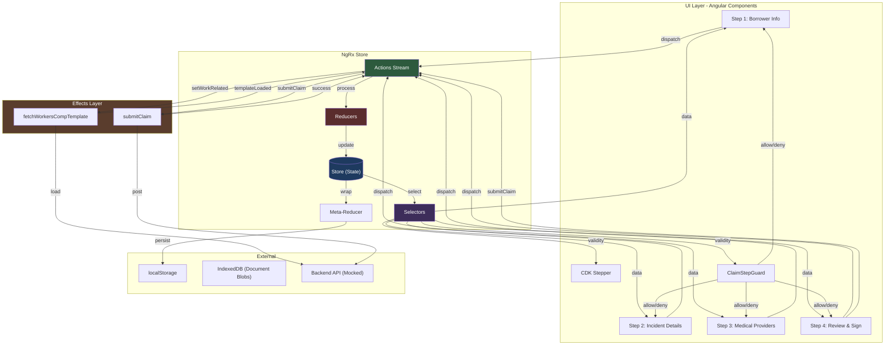
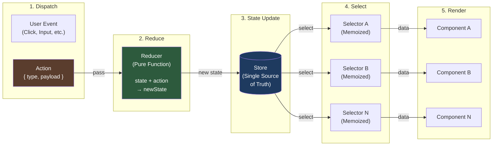
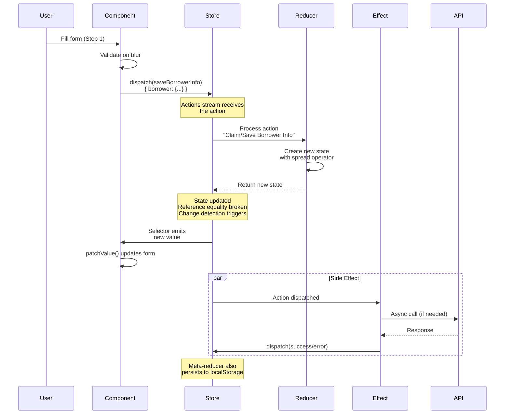
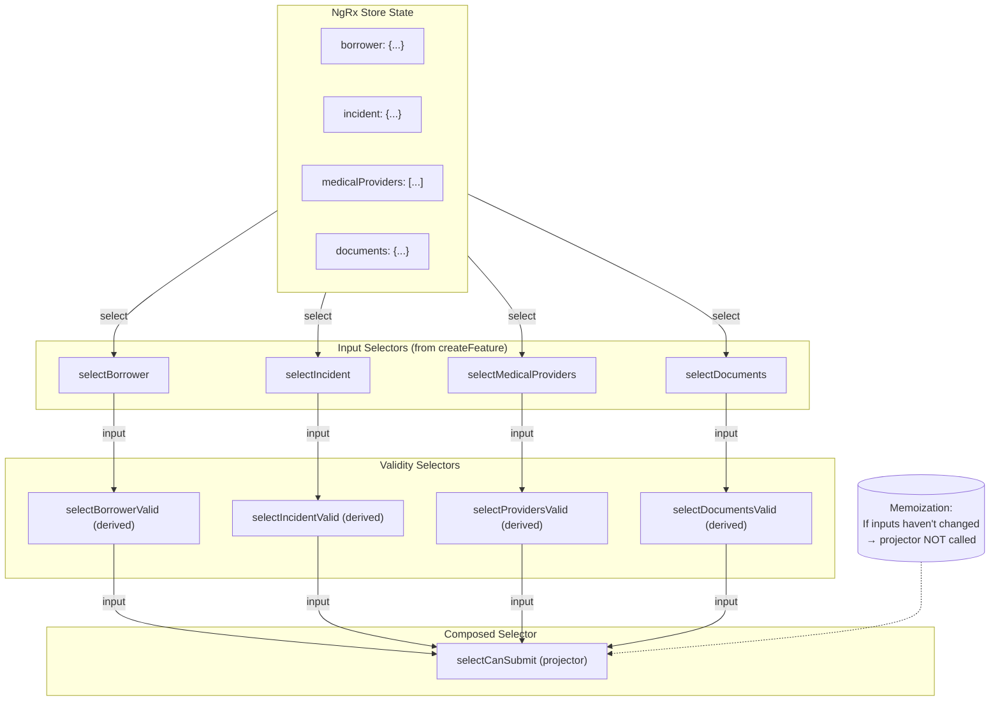
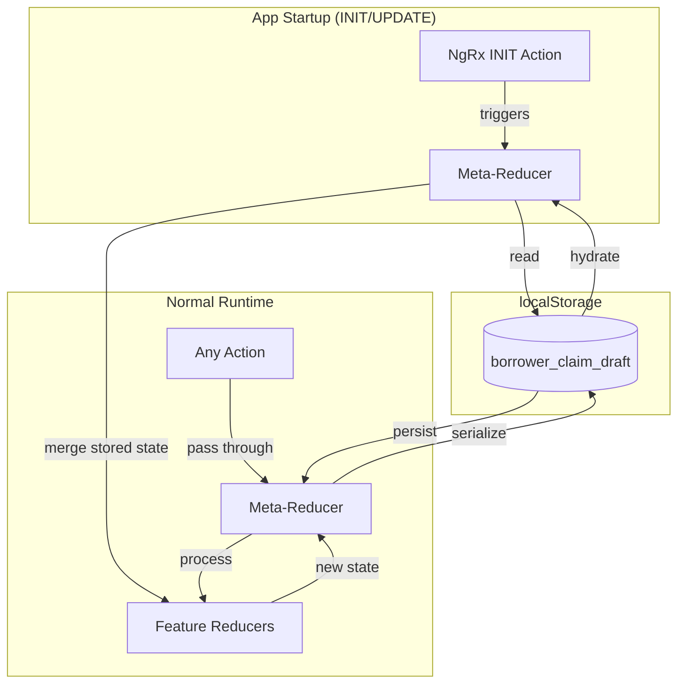
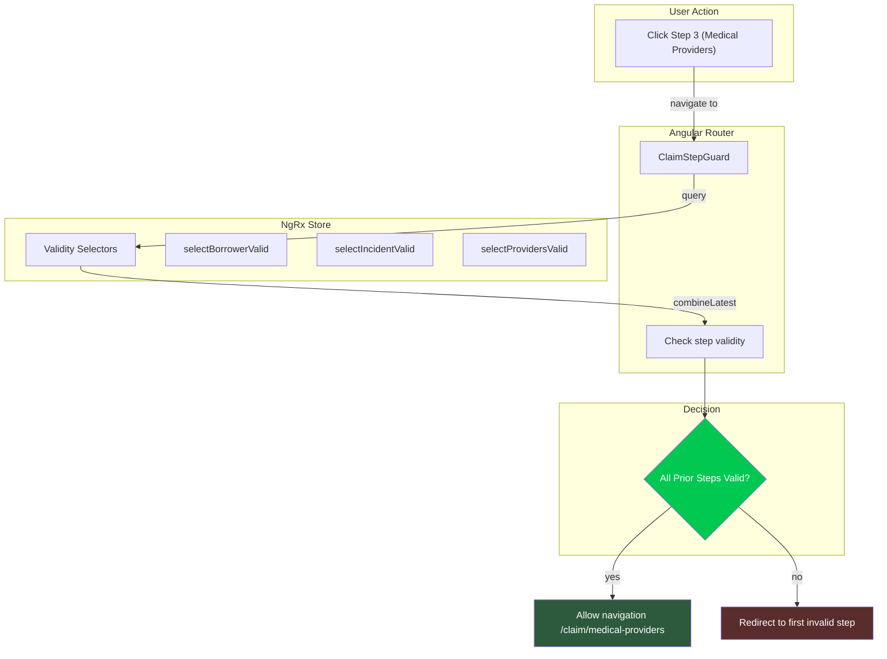
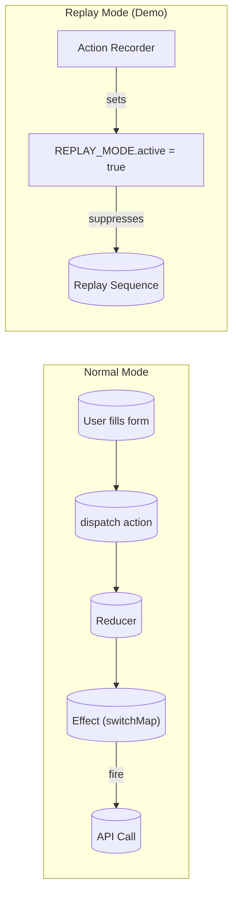
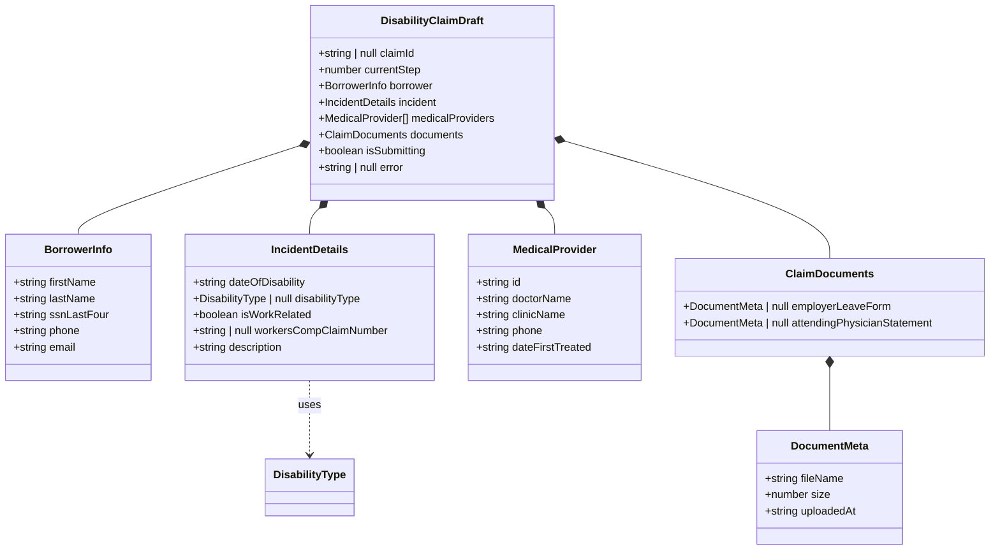

## Table of Contents

1. [TL;DR](#tldr)
2. [Architecture & Data Flow](#architecture--data-flow)
   - [NgRx Data Flow in the Disability Claim Wizard](#ngrx-data-flow-in-the-disability-claim-wizard)
   - [Redux Pattern: Unidirectional Data Flow](#redux-pattern-unidirectional-data-flow)
   - [Action Flow: From Dispatch to State](#action-flow-from-dispatch-to-state)
3. [Deep Dive](#deep-dive)
   - 1. [Concept Group: Core Patterns](#concept-group-1-core-patterns)
     - 1.1 [Actions as Events](#concept-11-actions-as-events)
     - 1.2 [Reducers as Pure Functions](#concept-12-reducers-as-pure-functions)
     - 1.3 [Memoized Selectors](#concept-13-memoized-selectors)
     - 1.4 [Effects as Side-Effect Managers](#concept-14-effects-as-side-effect-managers)
   - 2. [Concept Group: Advanced Patterns](#concept-group-2-advanced-patterns)
     - 2.1 [Meta-Reducers for Hydration](#concept-21-meta-reducers-for-hydration)
     - 2.2 [Guard Integration with Store](#concept-22-guard-integration-with-store)
     - 2.3 [Replay Mode for Demo](#concept-23-replay-mode-for-demo)
   - 3. [Concept Group: Real-World Patterns](#concept-group-3-real-world-patterns)
     - 3.1 [State Shape Design](#concept-31-state-shape-design)
     - 3.2 [Form-Store Synchronization](#concept-32-form-store-synchronization)
     - 3.3 [Error Handling in Effects](#concept-33-error-handling-in-effects)
4. [Real-World Examples](#real-world-examples)
   - [Disability Claim Wizard](#example-1-disability-claim-wizard)
5. [Comparison Tables](#comparison-tables)
   - [NgRx vs Angular Signals](#ngrx-vs-angular-signals)
6. [Interview Q&A](#interview-qa)
   - 5.1 [L1: Junior Knowledge](#l1-junior-knowledge)
   - 5.2 [L2: Mid-Level Knowledge](#l2-mid-level-knowledge)
   - 5.3 [L3: Senior Knowledge](#l3-senior-knowledge)
   - 5.4 [Staff: System Architecture](#staff-system-architecture)
7. [Cross-References](#cross-references)
8. [Further Reading](#further-reading)

---

## TL;DR

<span style="color: #33b5e5; font-weight: bold;">NgRx</span> is a reactive state management library for Angular that provides a predictable state container using <span style="color: #00C851; font-weight: bold;">Redux patterns</span>. In a multi-step wizard scenario, NgRx excels because selectors automatically memoize derived state, effects handle side-effects in one place, and the action-based architecture enables time-travel debugging and replay.

The borrower-portal implementation demonstrates <span style="color: #33b5e5; font-weight: bold;">createFeature()</span> for modern reducer setup, <span style="color: #33b5e5; font-weight: bold;">createActionGroup()</span> for type-safe actions, meta-reducers for <span style="color: #00C851; font-weight: bold;">localStorage hydration</span>, and route guards that query the store for navigation decisions. The key tradeoff: NgRx adds boilerplate but provides action history, time-travel debugging, and composable selectors that Signals can't match without manual optimization.

## Architecture & Data Flow

### NgRx Data Flow in the Disability Claim Wizard



### Redux Pattern: Unidirectional Data Flow



### Action Flow: From Dispatch to State



## Deep Dive

### Concept Group 1: Core Patterns

#### Concept 1.1: Actions as Events

<span style="color: #33b5e5; font-weight: bold;">What</span>

Actions are the **only way** to change state in NgRx. They represent events in your application—user interactions, API responses, navigation events. Using `createActionGroup()`, actions are strongly-typed with creator functions.

```typescript
export const ClaimActions = createActionGroup({
  source: 'Claim',
  events: {
    'Save Borrower Info': props<{ borrower: BorrowerInfo }>(),
    'Submit Claim': emptyProps(),
    'Submit Claim Success': props<{ claimId: string }>(),
  },
});
```

<span style="color: #33b5e5; font-weight: bold;">Why</span>

Without NgRx actions, components calling reducer functions directly creates an audit trail gap—you can't trace *what* caused a state change. With actions, Redux DevTools shows every dispatched action in sequence with timestamps. This is critical for debugging production issues: you can replay the exact action sequence that led to a bug.

<span style="color: #33b5e5; font-weight: bold;">How</span>

1. Actions are plain JavaScript objects with a `type` string
2. `createActionGroup()` bundles related actions under a shared source prefix
3. `props<{...}>()` creates a typed payload for the action
4. Components dispatch actions: `store.dispatch(ClaimActions.saveBorrowerInfo({ borrower }))`

<span style="color: #33b5e5; font-weight: bold;">When</span>

- Use actions for every state change (user input, API response, navigation)
- Use `createActionGroup()` for related actions (cleaner than individual createAction calls)
- Avoid dispatching on every keystroke—dispatch on blur or step exit to keep action log clean

<span style="color: #ffbb33; font-weight: bold;">Trade-offs</span>

- <span style="color: #ff4444; font-weight: bold;">Anti-pattern:</span> Dispatching on every keystroke floods the action log, making replay noisy
- <span style="color: #ffbb33; font-weight: bold;">Cost:</span> 5-10 extra lines of code per action group vs. direct method calls

---

#### Concept 1.2: Reducers as Pure Functions

<span style="color: #33b5e5; font-weight: bold;">What</span>

A reducer is a **pure function** that takes current state + an action and returns a **new state object**. It never mutates the existing state—Angular uses reference equality (`===`) to detect changes.

```typescript
export const claimFeature = createFeature({
  name: 'claim',
  reducer: createReducer(
    initialClaimState,
    on(ClaimActions.saveBorrowerInfo, (state, { borrower }) => ({
      ...state,
      borrower,
    })),
  ),
});
```

<span style="color: #33b5e5; font-weight: bold;">Why</span>

Immutability enables:
1. **Change detection:** Angular knows precisely when state changed
2. **Time-travel debugging:** NgRx can replay actions forward/backward because each state is a snapshot
3. **Memoization:** Selectors use referential equality to skip unnecessary computations

<span style="color: #33b5e5; font-weight: bold;">How</span>

1. `createFeature()` (NgRx v15+) auto-generates selectors from the reducer
2. `createReducer()` builds the reducer function
3. `on()` attaches handlers for specific actions
4. Always use spread operator (`...state`) to create new object references

<span style="color: #33b5e5; font-weight: bold;">When</span>

- Every state change MUST go through a reducer (no direct mutation)
- Use `on()` for action-specific state transitions
- Keep business rules in reducers (e.g., MAX_PROVIDERS cap enforced in reducer, not UI)

<span style="color: #ffbb33; font-weight: bold;">Trade-offs</span>

- <span style="color: #ff4444; font-weight: bold;">Anti-pattern:</span> Mutating state directly: `state.borrower = borrower` (breaks change detection)
- <span style="color: #ffbb33; font-weight: bold;">Cost:</span> Memory overhead from creating new objects—but modern JS engines optimize this well

---

#### Concept 1.3: Memoized Selectors

<span style="color: #33b5e5; font-weight: bold;">What</span>

Selectors extract data from the store. `createSelector()` **memoizes** results: if none of the input selectors return a new reference, the projector function is NOT re-executed.

### Selector Memoization Flow



```typescript
export const selectCanSubmit = createSelector(
  selectBorrowerValid,
  selectIncidentValid,
  selectProvidersValid,
  selectDocumentsValid,
  (borrower, incident, providers, documents) => 
    borrower && incident && providers && documents
);
  selectBorrowerValid,
  selectIncidentValid,
  selectProvidersValid,
  selectDocumentsValid,
  (borrower, incident, providers, documents) => 
    borrower && incident && providers && documents
);
```

<span style="color: #33b5e5; font-weight: bold;">Why</span>

In a 4-step wizard, when user types in Step 3, only `selectMedicalProviders` recomputes. Selectors for Step 1 and 2 return cached values. The projector in `selectCanSubmit` runs only when needed. With Signals, you'd manually track which signals changed.

<span style="color: #33b5e5; font-weight: bold;">How</span>

1. `createFeature()` auto-generates selectors for each state property
2. `createSelector(input1, input2, ..., projector)` creates memoized derived selectors
3. Input selectors are run first; if any return new references, projector executes
4. Components use selectors via `store.select(selectCanSubmit)`

<span style="color: #33b5e5; font-weight: bold;">When</span>

- Use for any derived state (validity checks, computed totals, filtered lists)
- Compose selectors from other selectors (as shown with selectCanSubmit)
- Use for route guards—guard queries store without triggering unnecessary recomputation

<span style="color: #ffbb33; font-weight: bold;">Trade-offs</span>

- <span style="color: #ff4444; font-weight: bold;">Anti-pattern:</span> Selecting raw state and computing in components (bypasses memoization)
- <span style="color: #ffbb33; font-weight: bold;">Cost:</span> Minimal—memoization overhead is negligible vs. computation savings

---

#### Concept 1.4: Effects as Side-Effect Managers

<span style="color: #33b5e5; font-weight: bold;">What</span>

Effects listen for actions and perform side-effects: API calls, localStorage writes, navigation. They're the **only place** for async/impure operations.

```typescript
export const submitClaim = createEffect(
  (actions$ = inject(Actions), store = inject(Store)) => {
    return actions$.pipe(
      ofType(ClaimActions.submitClaim),
      withLatestFrom(store.select(selectClaimState)),
      switchMap(([action, claim]) => 
        of({ claimId: 'CLM-123' }).pipe(
          delay(1500),
          map(({ claimId }) => ClaimActions.submitClaimSuccess({ claimId })),
          catchError(() => of(ClaimActions.submitClaimError({ message: 'Failed' })))
        )
      )
    );
  },
  { functional: true }
);
```

<span style="color: #33b5e5; font-weight: bold;">Why</span>

Components shouldn't know about HTTP, error handling, or retry logic. Effects centralize side-effects so they're:
1. Testable in isolation
2. Suppressible during replay (via REPLAY_MODE flag)
3. Reusable across components

<span style="color: #33b5e5; font-weight: bold;">How</span>

1. `createEffect()` creates an observable that listens to the Actions stream
2. `ofType()` filters for specific actions
3. `switchMap` cancels previous in-flight requests (prevents race conditions)
4. `withLatestFrom` grabs current store state
5. `catchError` maps errors to error actions—NEVER re-throws

<span style="color: #33b5e5; font-weight: bold;">When</span>

- API calls, file I/O, navigation, logging—anything async or impure
- Use `switchMap` for cancellable requests (user toggled checkbox rapidly)
- Use `concatMap` for sequential operations where order matters

<span style="color: #ffbb33; font-weight: bold;">Trade-offs</span>

- <span style="color: #ff4444; font-weight: bold;">Anti-pattern:</span> Calling HTTP directly in components (couples UI to API)
- <span style="color: #ffbb33; font-weight: bold;">Cost:</span> Learning RxJS operators—start with switchMap/mergeMap

---

### Concept Group 2: Advanced Patterns

#### Concept 2.1: Meta-Reducers for Hydration

<span style="color: #33b5e5; font-weight: bold;">What</span>

A meta-reducer wraps the **entire store's root reducer**. It intercepts every action BEFORE it reaches feature reducers and every state change AFTER. Used for localStorage persistence.

### Meta-Reducer Data Flow



```typescript
export function localStorageMetaReducer(reducer: ActionReducer<any>): ActionReducer<any> {
  return (state, action) => {
    // HYDRATION: on app startup, merge stored state
    if (action.type === INIT || action.type === UPDATE) {
      const stored = loadStateFromStorage();
      if (stored) {
        const newState = reducer(state, action);
        return { ...newState, claim: { ...initialClaimState, ...stored } };
      }
    }
    // PERSIST: run reducer, then save to localStorage
    const nextState = reducer(state, action);
    if (nextState?.claim) {
      saveStateToStorage(nextState.claim);
    }
    return nextState;
  };
}

```typescript
export function localStorageMetaReducer(reducer: ActionReducer<any>): ActionReducer<any> {
  return (state, action) => {
    // HYDRATION: on app startup, merge stored state
    if (action.type === INIT || action.type === UPDATE) {
      const stored = loadStateFromStorage();
      if (stored) {
        const newState = reducer(state, action);
        return { ...newState, claim: { ...initialClaimState, ...stored } };
      }
    }
    // PERSIST: run reducer, then save to localStorage
    const nextState = reducer(state, action);
    if (nextState?.claim) {
      saveStateToStorage(nextState.claim);
    }
    return nextState;
  };
}
```

<span style="color: #33b5e5; font-weight: bold;">Why</span>

- <span style="color: #00C851; font-weight: bold;">One place</span> for persistence—don't scatter localStorage calls across components
- Automatic persistence on every state change
- Survives page refresh without extra code

<span style="color: #33b5e5; font-weight: bold;">When</span>

- Form wizards that must survive page refresh
- Offline-first applications
- Any scenario requiring state to persist across sessions

<span style="color: #ffbb33; font-weight: bold;">Trade-offs</span>

- <span style="color: #ffbb33; font-weight: bold;">Cost:</span> ~30 lines of code vs. manual localStorage calls
- <span style="color: #ff4444; font-weight: bold;">Gotcha:</span> Only store serializable data (no functions, classes)—use metadata for documents, store blobs in IndexedDB

---

#### Concept 2.2: Guard Integration with Store

<span style="color: #33b5e5; font-weight: bold;">What</span>

Angular route guards query NgRx store to make navigation decisions. The guard checks if prior steps are valid before allowing access.

### Guard + Store Navigation Flow



```typescript
export const claimStepGuard: CanActivateFn = (route) => {
  const store = inject(Store);
  const router = inject(Router);

  const validityChecks$ = combineLatest([
    store.select(selectBorrowerValid),
    store.select(selectIncidentValid),
  ]);

  return validityChecks$.pipe(
    map(([step1Valid, step2Valid]) => {
      if (!step1Valid) {
        router.navigate(['/claim/borrower-info']);
        return false;
      }
      return true;
    })
  );
};
```

<span style="color: #33b5e5; font-weight: bold;">Why</span>

- CDK Stepper's linear mode is local to the component—it doesn't integrate with Angular router
- Deep links (`/claim/medical-providers`) bypass stepper UI but NOT the guard
- Guard is the **single source of truth** for step accessibility

<span style="color: #33b5e5; font-weight: bold;">When</span>

- Multi-step wizards with route-based navigation
- Any feature requiring prerequisites before access

---

#### Concept 2.3: Replay Mode for Demo

<span style="color: #33b5e5; font-weight: bold;">What</span>

A flag that suppresses side-effects during action replay—effects check `!replayMode.active` before firing API calls.

### Replay Mode Architecture



```typescript
export const REPLAY_MODE = new InjectionToken<{ active: boolean }>(
  'Replay Mode Flag',
  { providedIn: 'root', factory: () => ({ active: false }) }
);

// In effects:
filter(() => !replayMode.active),  // Skip API during replay
```

<span style="color: #33b5e5; font-weight: bold;">Why</span>

The "Visual Argument" demo feature replays recorded actions to auto-fill forms. Without this flag, replay would fire real API calls—an interview disaster.

<span style="color: #33b5e5; font-weight: bold;">When</span>

- Demo/replay features that replay user journeys
- Testing scenarios where you want state changes without side-effects

---

### Concept Group 3: Real-World Patterns

#### Concept 3.1: State Shape Design

<span style="color: #33b5e5; font-weight: bold;">What</span>

State shape determines how reducers and selectors work. Each wizard step maps to a clear sub-object; UI state lives alongside domain data.

### Disability Claim State Shape



```typescript
export interface DisabilityClaimDraft {
  claimId: string | null;
  currentStep: number;
  borrower: BorrowerInfo;
  incident: IncidentDetails;
  medicalProviders: MedicalProvider[];
  documents: ClaimDocuments;
  isSubmitting: boolean;
  error: string | null;
}
```

<span style="color: #33b5e5; font-weight: bold;">Why</span>

- Each step's data is independently updateable (reducer granularity)
- Selectors can compose across steps (selectCanSubmit needs all 4)
- Documents store metadata only—blobs in IndexedDB (keeps state ~1KB for localStorage)

---

#### Concept 3.2: Form-Store Synchronization

<span style="color: #33b5e5; font-weight: bold;">What</span>

- Dispatch on step exit or critical field blur
- Rehydrate on step entry via `patchValue()`

```typescript
// Step component ngOnInit:
store.select(selectBorrower).subscribe(borrower => 
  this.form.patchValue(borrower)
);

// On navigation away:
store.dispatch(ClaimActions.saveBorrowerInfo({ 
  borrower: this.form.value 
}));
```

<span style="color: #33b5e5; font-weight: bold;">Why</span>

- Dispatching on every keystroke floods action log
- Dispatch on blur for critical fields (SSN, email)—survives mid-step tab close
- Rehydration ensures fresh state on step entry

---

#### Concept 3.3: Error Handling in Effects

<span style="color: #33b5e5; font-weight: bold;">What</span>

Effects NEVER re-throw. They catch errors and dispatch error actions.

```typescript
switchMap(() => 
  of(template).pipe(
    map(t => ClaimActions.workersCompTemplateLoaded({ templateId: t })),
    catchError(() => of(ClaimActions.apiError({ 
      message: 'Could not load template. You can continue without it.' 
    })))
  )
)
```

<span style="color: #33b5e5; font-weight: bold;">Why</span>

- Re-throwing kills the effect stream—no more effects will run
- Error actions let UI show user-friendly messages
- Non-blocking errors (like template load) allow user to continue

---

## Real-World Examples

### Example 1: Disability Claim Wizard

📍 **From tai-portal:** `apps/borrower-portal/src/app/claim/+state/`

A 4-step disability claim wizard (Borrower Info → Incident Details → Medical Providers → Review & Sign) demonstrating:

1. **createFeature()** for modern reducer setup
2. **localStorage meta-reducer** for page refresh persistence
3. **selectCanSubmit** as composed selector across all 4 steps
4. **Conditional effect** that fetches Workers Comp template when `isWorkRelated` toggles to true
5. **ClaimStepGuard** that queries store validity selectors before allowing navigation
6. **REPLAY_MODE** injection token for demo replay without side-effects

Key file structure:
```
claim/
├── +state/
│   ├── claim.actions.ts     # createActionGroup
│   ├── claim.reducer.ts     # createFeature + on()
│   ├── claim.selectors.ts  # createSelector compositions
│   ├── claim.effects.ts    # createEffect with switchMap
│   ├── claim.meta-reducer.ts  # localStorage hydration
│   ├── claim-step.guard.ts    # store-based navigation guard
│   └── claim.models.ts     # TypeScript interfaces
```

---

## Comparison Tables

### NgRx vs Angular Signals

| Dimension | NgRx | Angular Signals |
|-----------|------|-----------------|
| **Mental model** | Event sourcing: actions → reducers → state | Reactive: signal.set() triggers dependent computations |
| **Memoization** | Automatic via createSelector | Manual—track which signals changed |
| **DevTools** | Redux DevTools with time-travel | Limited—no action history |
| **Boilerplate** | Higher—actions, reducers, selectors | Lower—signals are direct |
| **Learning curve** | Steeper (RxJS required) | Gentle (synchronous mental model) |
| **Use case** | Cross-route state, complex derived state, replay | Component-local state |
| **tai-portal choice** | Borrower portal wizard (multi-step, needs persistence) | Simple feature state |

---

## Interview Q&A

### L1: Junior Knowledge

#### What is the purpose of NgRx actions?
**Difficulty:** L1 (Junior)

**Answer:** Actions are objects that describe **what happened** in the application. They're the only way to change state in NgRx. Each action has a `type` string and optional `payload`. For example, `ClaimActions.saveBorrowerInfo({ borrower })` describes that the user saved their borrower information.

---

#### What does a reducer do?
**Difficulty:** L1 (Junior)

**Answer:** A reducer is a **pure function** that takes the current state and an action, and returns a new state. It never modifies the existing state—always creates a fresh object using the spread operator. This enables Angular's change detection to work efficiently.

---

### L2: Mid-Level Knowledge

#### Why use createSelector() instead of simple select functions?
**Difficulty:** L2 (Mid-Level)

**Answer:** `createSelector()` provides **memoization**. If none of the input selectors return new references, the projector function is NOT re-executed. This is crucial for performance in complex forms—typing in Step 3 doesn't recalculate Step 1's validity. With simple select functions, you'd recompute on every store change regardless of whether inputs actually changed.

---

#### What's the difference between switchMap and mergeMap in effects?
**Difficulty:** L2 (Mid-Level)

**Answer:** `switchMap` **cancels** the previous inner observable when a new action arrives—used when you only care about the latest request (e.g., search-as-you-type). `mergeMap` runs all inner observables concurrently—used when order matters and all requests should complete. In the wizard, `switchMap` on the Workers Comp fetch prevents race conditions if the user toggles "work-related" rapidly.

---

### L3: Senior Knowledge

#### How would you persist NgRx state across page refreshes?
**Difficulty:** L3 (Senior)

**Answer:** Use a **meta-reducer** that wraps the root reducer. On `INIT`/`UPDATE` actions (app startup), read from localStorage and merge into initial state. On every subsequent action, after the reducer runs, serialize the relevant state slice to localStorage. This is ~30 lines replacing scattered localStorage calls across components.

The key insight: business rules live in reducers (e.g., MAX_PROVIDERS cap), not in components. The meta-reducer is the single place for persistence—no component needs to know about localStorage.

---

#### How do effects integrate with route guards?
**Difficulty:** L3 (Senior)

**Answer:** Route guards use `store.select()` to query the current state validity before allowing navigation. In the borrower portal, `claimStepGuard` combines `selectBorrowerValid`, `selectIncidentValid`, and `selectProvidersValid` to determine if the user can access a step. This is the **single source of truth**—it works regardless of whether the user clicks the stepper UI or navigates via direct URL. CDK Stepper's linear mode doesn't integrate with the router, so deep links would bypass it without a guard.

---

### Staff: System Architecture

#### Design a multi-step form with Angular Signals vs NgRx. When would you choose one over the other?
**Difficulty:** Staff

**Answer:** **Choose Signals when:**
- State is component-local (doesn't need to persist across routes)
- Simpler derived state that doesn't span multiple components
- Team is new to RxJS and needs faster iteration
- The app doesn't need time-travel debugging

**Choose NgRx when:**
- State must survive route navigation (4-step wizard, each on different route)
- Complex derived state spans multiple routes (composed selectors)
- Need action history for debugging or replay features
- Multiple features need to share state
- The team can handle the learning curve

In tai-portal, the borrower portal uses NgRx because the wizard crosses 4 routes, needs localStorage persistence, and the "Visual Argument" demo requires action replay. The simpler portal features use `@ngrx/signals` for component-local state. Different tools for different jobs.

---

## Cross-References

- [[Angular Signals]] — Component-local reactive state (use for simpler features)
- [[RxJS in Effects]] — Operators like switchMap, withLatestFrom, catchError
- [[Nx Monorepo Patterns]] — How borrower-portal shares libs/ui with portal-web

---

## Further Reading

- [NgRx createFeature Documentation](https://ngrx.io/guide/store/feature-creators)
- [Angular CDK Stepper](https://material.angular.io/cdk/stepper/overview)
- [Redux DevTools](https://github.com/reduxjs/redux-devtools)
- [borrower-portal implementation](https://github.com/RaidenC/tai-portal/tree/main/apps/borrower-portal/src/app/claim/%2Bstate)

---

*Last updated: 2026-04-14*
