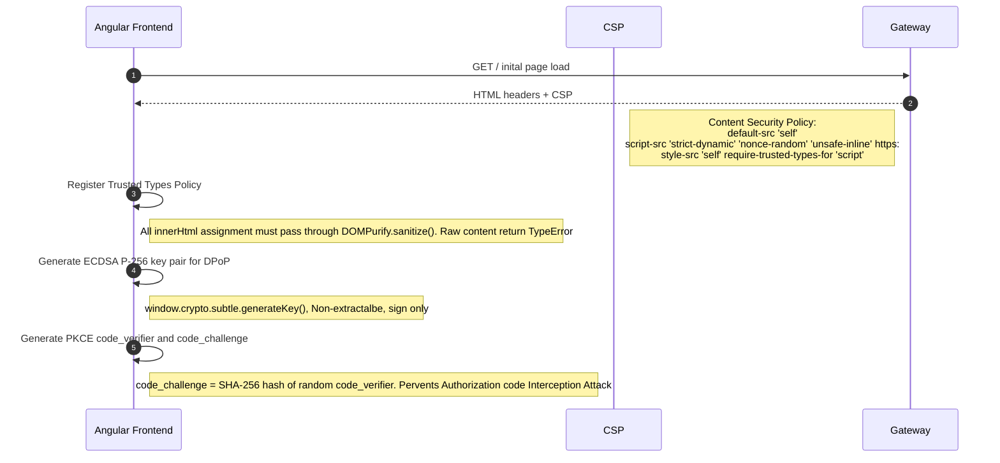
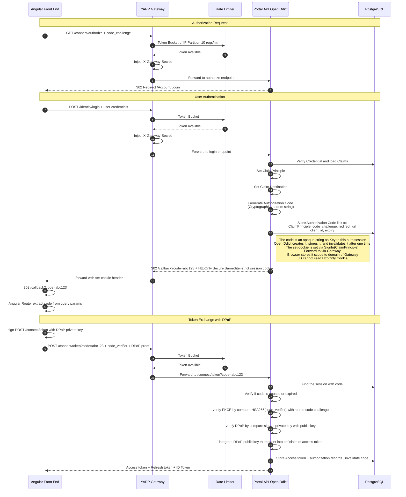
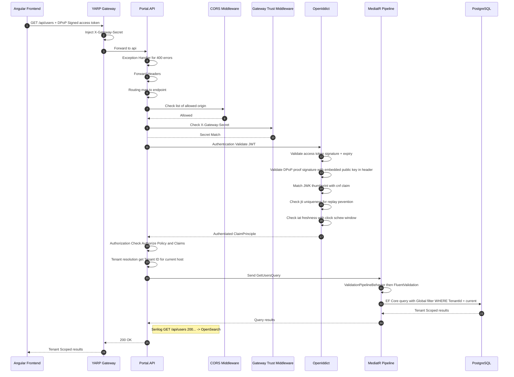

### Phase 1. Client Side Security Bootstrap

```mermaid
sequenceDiagram
    autonumber
    participant Browser as Angular Frontend
    participant CSP as CSP
    participant GW as Gateway

    Browser->>GW: GET / inital page load
    GW-->> Browser: HTML headers + CSP
    Note right of CSP: Content Security Policy:<br>default-src 'self'<br>script-src 'strict-dynamic' 'nonce-random' 'unsafe-inline' https:<br>style-src 'self' require-trusted-types-for 'script'

    Browser->>Browser: Register Trusted Types Policy
    Note right of Browser: All innerHtml assignment must pass through DOMPurify.sanitize(). Raw content return TypeError
    Browser->>Browser: Generate ECDSA P-256 key pair for DPoP
    Note right of Browser: window.crypto.subtle.generateKey(), Non-extractalbe, sign only
    Browser->>Browser: Generate PKCE code_verifier and code_challenge
    Note right of Browser: code_challenge = SHA-256 hash of random code_verifier. Pervents Authorization code Interception Attack
```
### Phase 2. OIDC Authentication + Token Exchange

```mermaid
sequenceDiagram
    autonumber
    participant Browser as Angular Front End
    participant GW as YARP Gateway
    participant RL as Rate Limiter
    participant API as Portal.API OpenIDdict
    participant DB as PostgreSQL

    Note over Browser,DB: Authorization Requrest
    Browser->>GW: GET /connect/authorize + code_challenge
    GW->>RL: Token Bucket of IP Partition 10 reqs/min
    RL-->>GW: Token Availible
    GW->>GW: Inject X-Gateway-Secret
    GW->>API: Forward to authorize endpoint
    API-->>Browser: 302 Redirect /Account/Login

    Note over Browser,DB: User Authentication
    Browser->>GW: POST /identity/login + user credentials
    GW->>RL: Token Bucket
    RL-->>GW: Token Availible
    GW->>GW: Inject X-Gateway-Secret
    GW->>API: Forward to login endpoint
    API->>DB: Verify Credential and load Claims
    API->>API: Set ClaimPrinciple
    API->>API: Set Claim Destination
    API->>API: Generate Authorization Code<br> (Cryptographic random string)
    API->>DB: Store Authorization Code link to:<br>ClaimPrinciple, code_challenge, redirect_url<br>client_id, expiry
    Note right of API:The code is an opaque string as Key to this auth session<br>OpenIDdict creates it, stores it, and invalidates it after one time.<br> The set-cookie is set via SignIn(ClaimPrinciple). <br>Forward to via Gateway. <br>Browser stores it scope to domain of Gateway<br>JS cannot read HttpOnly Cookie
    API-->>GW:302 /callback?code=abc123 + HttpOnly Secure SameSite=strict session cookie
    GW-->>Browser: forward with set-cookie header
    Browser->>Browser: 302 /callback?code=abc123
    Browser->>Browser: Angular Router extract code from query params 
    
    Note over Browser,DB: Token Exchange with DPoP
    Browser->>Browser: sign POST /connect/token with DPoP private key
    Browser->>GW: POST /connect/token?code=abc123 + code_verifier + DPoP proof
    GW->>RL: Token Bucket
    RL-->>GW: Token availible
    GW->>API: Forward to /connect/token?code=abc123
    API->>DB: Find the session with code
    API->>API: Verify if code is unused or expired 
    API->>API: verify PKCE by compare HSA256(code_verifier) with stored code challenge
    API->>API: verify DPoP by compare signed private key with public key
    API->>API: integrate DPoP public key thumbprint into cnf claim of access token 
    API->>DB: Store Access token + authorization records , invalidate code
    API-->>Browser: Access token + Refresh token + ID Token
```

### REST Request Through All Security Layers

```mermaid
    sequenceDiagram
        autonumber
        participant Browser as Angular Frontend
        participant GW as YARP Gateway
        participant API as Portal.API
        participant CORS as CORS Middleware 
        participant Trust as Gateway Trust Middleware
        participant Auth as OpenIddict  
        participant MediatR as MediatR Pipeline
        participant DB as PostgreSQL
        
        Browser->>GW: GET /api/users + DPoP Signed access token
        GW->>GW: Inject X-Gateway-Secret
        GW->>API: Forward to api

        API->>API: Exception Handler for 400 errors
        API->>API: Forward Headers
        API->>API: Routing map to endpoint 
        API->>CORS: Check list of allowed origin 
        CORS-->>API: Allowed
        API->>Trust: Check X-Gateway-Secret
        Trust-->API: Secret Match

        API->>Auth: Authentication Validate JWT
        Auth->>Auth: Validate access token signature + expiry 
        Auth->>Auth: Validate DPoP proof signature with embedded public key in header
        Auth->>Auth: Match JWK thumbprint with cnf claim 
        Auth->>Auth: Check jti uniqueness for replay pevention 
        Auth->>Auth: Check iat freshness with clock schew window
        Auth-->>API: Authentiated ClaimPrinciple

        API->>API: Authorization Check Authorize Policy and Claims
        API->>API: Tenant resolution get Tenant ID for current host
        API->>MediatR: Send GetUsersQuery
        MediatR->>MediatR: ValidationPipelineBehavior then FluentValidation
        MediatR->>DB: EF Core query with Global filter WHERE TenantId = current
        DB-->>MediatR: Tenant Scoped results
        MediatR-->>API: Query results
        Note right of API: Serilog GET /api/users 200... -> OpenSearch
        API-->>GW: 200 OK
        GW-->>Browser: Tenant Scoped results
```