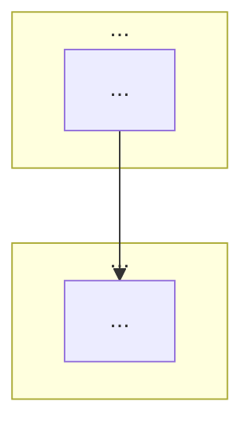

## Table of Contents & Organization Rules

When generating the Table of Contents (ToC) for a knowledge base article, adhere to the following rules:

1. **Logical Mental Blocks**: Group points into logical blocks (e.g., 1. Strategy, 2. Middleware, 3. Domain System).
2. **5-Point Limit**: Each mental block must contain no more than 5 points to ensure easy memory and readability.
3. **Hierarchical Numbering**: Use a nested numbering system (e.g., 1., 1.1, 1.2).
4. **Vertical Listing & Linking**: List all points vertically and ensure each point is a functional anchor link to the corresponding content.
5. **ToC-Only Numbering**: Numbering should only appear in the ToC; do not modify the original headers in the main content.
6. **Q&A Grouping**: Group all Interview Q&A under a main section (e.g., 5. Knowledge Deep Dive & Q&A).
   - Create sub-groups for seniority levels (e.g., 5.1 L1: Junior, 5.2 L2: Mid-Level, 5.3 L3: Senior, 5.4 Staff).
   - Use triple-numbering for individual questions (e.g., 5.1.1, 5.1.2).
7. **External Mindmap**: Generate a companion mindmap file (e.g., `topic-mindmap.md`). Provide a prominent link `[🧠 **View Interactive Mindmap**](./topic-mindmap.md)` at the top of the ToC. See `MARKMAP_TEMPLATE.md` for mindmap formatting rules.

### The Semantic Color Palette
Apply these HTML `<span>` tags strictly to the body text to aid spatial memory retention:

1. **Anti-Patterns & Risks (Red):** `<span style="color: #ff4444; font-weight: bold;">Text</span>`
   - *Use for:* Bugs, failures, crashes, legacy code, "Gotchas", what NOT to do.
2. **Best Practices & Solutions (Green):** `<span style="color: #00C851; font-weight: bold;">Text</span>`
   - *Use for:* The 2026 industry standard, ideal architectures, guaranteed delivery, successful patterns.
3. **Core Vocabulary & Infrastructure (Blue):** `<span style="color: #33b5e5; font-weight: bold;">Text</span>`
   - *Use for:* Tools, frameworks, design pattern names, cloud services (e.g., PostgreSQL, RabbitMQ, Outbox Pattern).
4. **Trade-offs & Costs (Yellow/Orange):** `<span style="color: #ffbb33; font-weight: bold;">Text</span>`
   - *Use for:* Latency numbers, monetary costs ($0.40/mo), eventual consistency, performance penalties.

### Heading Hierarchy for Markmap Extraction

The heading structure must be consistent so a Markmap mind map can be auto-generated:

```
## H2  → ToC / TL;DR / Deep Dive / Interview Q&A / Cross-References (structural sections)
### H3  → Concept Group (e.g., "Broker Deep Dive", "Advanced Patterns")
#### H4 → Individual Concept (e.g., "RabbitMQ", "Optimistic Concurrency")
##### H5 → Concept Facets: What / Why / How / When / Trade-offs
```

Every `#### H4` concept **must** include these five facets as `##### H5` sub-sections:

| Facet | Purpose |
|-------|---------|
| **What** | Definition in 1-2 sentences. Name the pattern/tool/technique. |
| **Why** | The problem it solves. Use a "without this..." framing. |
| **How** | Mechanics — how it works internally. Include code if helpful. |
| **When** | Decision criteria — when to use AND when NOT to use. |
| **Trade-offs** | Costs, limitations, gotchas. Use red/yellow color coding. |

This structure maps directly to a 4-level Markmap tree:
```
Root (topic) → Group (H3) → Concept (H4) → Facet (H5) → Key bullet points
```

---

## TL;DR

{One-paragraph summary (4-6 sentences) that captures the essence of this topic. A senior engineer should be able to read this paragraph and recall the entire article. Apply semantic color coding to the most critical 3-4 terms. Cover:}
- {What the technology/pattern is}
- {Why it matters in 2026}
- {How tai-portal uses it (or how a typical enterprise Angular/.NET/PostgreSQL app would)}
- {The key trade-off a senior engineer must articulate in an interview}

---

## Deep Dive

### Concept Group 1: {Name — e.g., "Core Architecture"}

#### {Concept 1 Title}

##### What
{Definition in 1-2 sentences. Name the pattern, tool, or technique precisely.}

##### Why
{The problem this solves. Frame as: "Without this, [bad thing happens]." Use a concrete scenario relevant to a multi-tenant SaaS or enterprise LOB app.}

##### How
{Mechanics — how it works internally. For .NET topics, show C# code. For Angular topics, show TypeScript. For SQL topics, show the query and execution plan reasoning.}

```csharp
// or TypeScript / SQL / HTML depending on topic
// Example code — see "Example Sourcing Rules" below
```

##### When
{Decision criteria — when to use AND when NOT to use. Include the alternative you'd pick instead.}

##### Trade-offs
{Costs, limitations, gotchas. Quantify where possible (memory, latency, $). Use red for anti-patterns, yellow for costs.}

---

#### {Concept 2 Title}
{... same What/Why/How/When/Trade-offs structure ...}

---

### Concept Group 2: {Name}
{... more concepts ...}

---

### Architecture & Data Flow

{Include at least one Mermaid diagram that shows how the concepts in this article fit together in a real system. This is critical for senior-level interviews where you must "draw the architecture on a whiteboard."}



---

## Real-World Examples

### Example Sourcing Rules

Follow this priority order when choosing code examples:

1. **tai-portal codebase first** — if the concept exists in tai-portal, link to the actual file and show the real code. Reference the file path (e.g., `src/Portal.Infrastructure/Persistence/PortalDbContext.cs`).
2. **tai-portal-fitting example** — if the concept is NOT in tai-portal but would naturally fit (e.g., implementing an Outbox, adding a SignalR hub), write a realistic example that uses tai-portal's domain (Tenants, Privileges, AuditLogs, Users).
3. **Domain-appropriate standalone** — if the concept doesn't fit tai-portal's domain (e.g., real-time stock ticker, IoT telemetry), write a clear standalone example using a relatable domain.

For each example, state which category it falls into:
- `📍 From tai-portal:` — actual code in the repo
- `🔧 Fits tai-portal:` — realistic example using tai-portal's domain
- `📦 Standalone:` — concept demonstration with a different domain

### {Example 1 Title}

{Category tag from above}

{Brief explanation of what this demonstrates and why it matters.}

```csharp
// Actual or realistic code
```

### {Example 2 Title}
{...}

---

## Comparison Tables

{Include at least one comparison table for senior-level interview readiness. These tables should compare:}
- {Technology A vs Technology B (e.g., RabbitMQ vs Kafka, EF Core vs Dapper)}
- {Pattern A vs Pattern B (e.g., Optimistic vs Pessimistic concurrency)}
- {.NET approach vs Angular approach to the same concern (e.g., DI in .NET vs DI in Angular)}

| Dimension | {Option A} | {Option B} |
|-----------|------------|------------|
| **Mental model** | ... | ... |
| **Use case** | ... | ... |
| **Trade-offs** | ... | ... |
| **tai-portal choice** | ... | ... |

---

## Interview Q&A

### L1: Junior Knowledge

#### {Question Title — short, scannable}
**Difficulty:** L1 (Junior)

**Question:** {Fundamental question that tests understanding of the concept}

**Answer:** {Clear, concise answer. 2-3 sentences maximum. Apply color coding to the core concept. A junior should memorize this answer verbatim.}

---

### L2: Mid-Level Knowledge

#### {Question Title}
**Difficulty:** L2 (Mid-Level)

**Question:** {Question that requires understanding trade-offs, comparing alternatives, or deeper "why" knowledge}

**Answer:** {4-6 sentence answer explaining the "why" and comparing alternatives. Demonstrate that you understand when NOT to use something. Highlight trade-offs in yellow/orange.}

---

### L3: Senior Knowledge

#### {Question Title}
**Difficulty:** L3 (Senior)

**Question:** {Question that probes architectural thinking, performance implications, cross-cutting concerns, or production war stories}

**Answer:** {Comprehensive answer (6-10 sentences) that demonstrates senior-level understanding. Structure as: state the answer → explain why → describe the alternative you rejected → mention a real gotcha. Highlight anti-patterns in red and best practices in green.}

---

### Staff: System Architecture

#### {Question Title}
**Difficulty:** Staff

**Question:** {Open-ended design question that requires synthesizing multiple concepts from this article and adjacent topics. Typically starts with "Design..." or "How would you architect..."}

**Answer:** {Structured answer (8-12 sentences) that:}
1. {Clarifies requirements and constraints}
2. {Proposes an architecture with specific technology choices}
3. {Explains the trade-offs of the chosen approach}
4. {Describes how it evolves as scale increases}
{Use a mini Mermaid diagram if the architecture is complex enough to warrant one.}

---

## Cross-References

- [[{Related Topic 1}]] — {Brief connection: how this topic feeds into or depends on the other}
- [[{Related Topic 2}]] — {Brief connection}
- [[{Related Topic 3}]] — {Brief connection}

---

## Further Reading

- {Link to official documentation (e.g., Microsoft docs, Angular docs, PostgreSQL docs)}
- {Link to a definitive blog post or conference talk (prefer 2024-2026 content)}
- {Link to source code in tai-portal if applicable}

---

*Last updated: {YYYY-MM-DD}*
