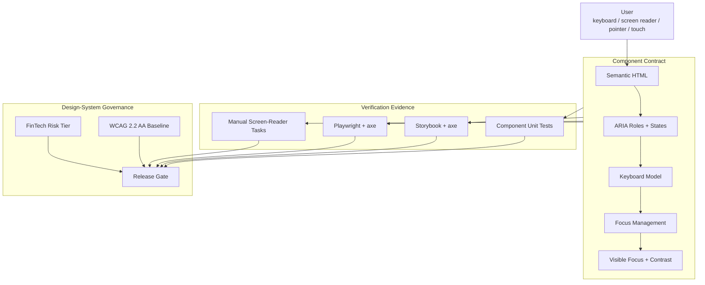

## Table of Contents

[🧠 **View Interactive Mindmap**](./accessibility-wcag-aria-mindmap.md)

1. [TL;DR](#tldr)
2. [Deep Dive](#deep-dive)
   2.1 [Accessibility Strategy](#accessibility-strategy)
      2.1.1 [WCAG 2.2 as Product Contract](#wcag-22-as-product-contract)
      2.1.2 [Semantic HTML First](#semantic-html-first)
      2.1.3 [ARIA as a Contract, Not Decoration](#aria-as-a-contract-not-decoration)
      2.1.4 [Assistive Technology Reality](#assistive-technology-reality)
   2.2 [Keyboard and Focus Architecture](#keyboard-and-focus-architecture)
      2.2.1 [Keyboard Operability](#keyboard-operability)
      2.2.2 [Focus Management](#focus-management)
      2.2.3 [Focus Appearance and Obscuring](#focus-appearance-and-obscuring)
      2.2.4 [Skip, Landmark, and Navigation Structure](#skip-landmark-and-navigation-structure)
   2.3 [ARIA Patterns](#aria-patterns)
      2.3.1 [Menu Button Pattern](#menu-button-pattern)
      2.3.2 [Form Errors and Live Regions](#form-errors-and-live-regions)
      2.3.3 [Dialogs, Alerts, and Critical Messages](#dialogs-alerts-and-critical-messages)
      2.3.4 [Icon and Visual-Only Content](#icon-and-visual-only-content)
   2.4 [Enterprise Form and Data UI](#enterprise-form-and-data-ui)
      2.4.1 [Accessible Forms](#accessible-forms)
      2.4.2 [Tables, Lists, and Virtualized Widgets](#tables-lists-and-virtualized-widgets)
      2.4.3 [Target Size, Drag Alternatives, and Pointer Access](#target-size-drag-alternatives-and-pointer-access)
      2.4.4 [Accessible Authentication](#accessible-authentication)
   2.5 [Testing and Governance](#testing-and-governance)
      2.5.1 [Automated Accessibility Testing](#automated-accessibility-testing)
      2.5.2 [Manual Screen-Reader Testing](#manual-screen-reader-testing)
      2.5.3 [Design-System A11y Gates](#design-system-a11y-gates)
      2.5.4 [FinTech Accessibility Risk Model](#fintech-accessibility-risk-model)
3. [Architecture & Data Flow](#architecture--data-flow)
4. [Real-World Examples](#real-world-examples)
   4.1 [Dropdown Menu Keyboard and ARIA Pattern](#dropdown-menu-keyboard-and-aria-pattern)
   4.2 [FormField Live Error Contract](#formfield-live-error-contract)
   4.3 [Input aria-describedby Integration](#input-aria-describedby-integration)
   4.4 [TransferList Live Announcements](#transferlist-live-announcements)
   4.5 [Icon Decorative vs Informative Contract](#icon-decorative-vs-informative-contract)
   4.6 [Playwright + axe Accessibility Checks](#playwright--axe-accessibility-checks)
   4.7 [Planned Screen-Reader Test Matrix](#planned-screen-reader-test-matrix)
5. [Comparison Tables](#comparison-tables)
6. [Interview Q&A](#interview-qa)
   6.1 [L1: Junior Knowledge](#l1-junior-knowledge)
      6.1.1 [What Is WCAG?](#what-is-wcag)
      6.1.2 [What Is ARIA?](#what-is-aria)
   6.2 [L2: Mid-Level Knowledge](#l2-mid-level-knowledge)
      6.2.1 [When Should You Use ARIA?](#when-should-you-use-aria)
      6.2.2 [What Does Keyboard Accessible Mean?](#what-does-keyboard-accessible-mean)
   6.3 [L3: Senior Knowledge](#l3-senior-knowledge)
      6.3.1 [How Do You Review a Custom Menu?](#how-do-you-review-a-custom-menu)
      6.3.2 [How Do You Test Accessibility Beyond axe?](#how-do-you-test-accessibility-beyond-axe)
   6.4 [Staff: System Architecture](#staff-system-architecture)
      6.4.1 [Design Accessibility Governance for a FinTech Design System](#design-accessibility-governance-for-a-fintech-design-system)
7. [Cross-References](#cross-references)
8. [Further Reading](#further-reading)

---

## TL;DR

<span style="color: #33b5e5; font-weight: bold;">Accessibility</span> is not a styling task; it is the contract that says every workflow is perceivable, operable, understandable, and robust for disabled users, keyboard users, screen-reader users, magnification users, switch users, and users with cognitive or motor constraints. <span style="color: #33b5e5; font-weight: bold;">WCAG 2.2</span> is the current W3C Recommendation baseline, adding criteria that matter directly to FinTech apps: focus not obscured, target size, dragging alternatives, redundant-entry reduction, and accessible authentication. <span style="color: #33b5e5; font-weight: bold;">ARIA</span> is only needed when native HTML cannot express the widget; when used, it creates obligations for roles, states, names, keyboard behavior, and focus management. `tai-portal` already has meaningful a11y foundations in design-system controls, dropdown keyboard handling, live form errors, icon semantics, CDK `LiveAnnouncer`, Storybook axe checks, and Playwright + axe tests. The senior trade-off is that <span style="color: #ff4444; font-weight: bold;">automated tools catch only a slice of accessibility defects</span>; the differentiator is manual keyboard and screen-reader verification built into component governance.

---

## Deep Dive

### Accessibility Strategy

#### WCAG 2.2 as Product Contract

##### What
<span style="color: #33b5e5; font-weight: bold;">WCAG 2.2</span> is the W3C accessibility standard for web content. It is organized around four principles: perceivable, operable, understandable, and robust.

##### Why
Without a WCAG contract, accessibility becomes subjective: one reviewer asks for contrast, another asks for labels, another asks for keyboard support, and nobody knows what "done" means. Enterprise and FinTech buyers increasingly treat WCAG 2.2 AA as a gate because inaccessible identity, approval, claim, and signing workflows create legal, operational, and customer harm.

##### How
WCAG 2.2 was published as a W3C Recommendation on October 5, 2023. It adds nine success criteria since WCAG 2.1:

- 2.4.11 Focus Not Obscured (Minimum) — AA
- 2.4.12 Focus Not Obscured (Enhanced) — AAA
- 2.4.13 Focus Appearance — AAA
- 2.5.7 Dragging Movements — AA
- 2.5.8 Target Size (Minimum) — AA
- 3.2.6 Consistent Help — A
- 3.3.7 Redundant Entry — A
- 3.3.8 Accessible Authentication (Minimum) — AA
- 3.3.9 Accessible Authentication (Enhanced) — AAA

For product work, the practical baseline is WCAG 2.2 AA unless a contract or policy says otherwise.

##### When
Use WCAG 2.2 AA as the default acceptance standard for identity, borrower, admin, document, and design-system work. Use AAA criteria selectively where the user impact and implementation cost justify it.

##### Trade-offs
<span style="color: #ffbb33; font-weight: bold;">WCAG conformance is necessary but not sufficient.</span> A workflow can pass individual success criteria and still be exhausting if focus order, copy, error recovery, or screen-reader flow is poorly designed.

---

#### Semantic HTML First

##### What
<span style="color: #33b5e5; font-weight: bold;">Semantic HTML first</span> means using native elements and attributes before adding ARIA: `button`, `a[href]`, `label`, `input`, `fieldset`, `legend`, `table`, `nav`, `main`, `header`, and `dialog`-like primitives.

##### Why
Native HTML already carries role, keyboard behavior, accessible name calculation, form semantics, and platform integration. Replacing a button with a clickable `div` means the team must rebuild keyboard, focus, role, name, disabled state, and activation semantics manually.

##### How
Good design-system contracts start with native elements:

```html
<button type="button" aria-label="Dismiss alert">
  <span aria-hidden="true">x</span>
</button>

<label for="email">Email</label>
<input id="email" type="email" autocomplete="email" />
```

Only add ARIA where semantics are missing or where a composite widget needs state.

##### When
Use semantic HTML for all standard controls and page structure. Use ARIA patterns only for custom widgets such as menus, comboboxes, tabs, listboxes, dialogs, grids, and live regions.

##### Trade-offs
<span style="color: #ff4444; font-weight: bold;">The first rule of ARIA is not to use ARIA when native HTML already solves the problem.</span> ARIA can improve custom widgets, but incorrect ARIA can make the accessibility tree worse than no ARIA.

---

#### ARIA as a Contract, Not Decoration

##### What
<span style="color: #33b5e5; font-weight: bold;">ARIA</span> defines roles, states, and properties that describe UI semantics to assistive technologies. Examples include `role="menu"`, `aria-expanded`, `aria-describedby`, `aria-live`, and `aria-invalid`.

##### Why
ARIA changes what assistive technology perceives. If a component claims `role="menu"`, it is no longer just a group of buttons; it must behave like a menu pattern with expected keyboard behavior and focus movement.

##### How
Each ARIA pattern has a contract:

- role: what widget is this?
- accessible name: how is it announced?
- state: expanded, selected, checked, disabled, invalid?
- relationship: described by, labelled by, controls?
- keyboard model: Tab, Enter, Space, Escape, arrows, Home/End?
- focus model: roving focus, active descendant, focus trap, restore focus?

##### When
Use ARIA when creating non-native interaction patterns. Do not use ARIA to fake accessibility around inaccessible markup when native elements would be simpler.

##### Trade-offs
<span style="color: #ffbb33; font-weight: bold;">ARIA increases review burden.</span> A reviewer must inspect DOM semantics, keyboard behavior, focus management, visual state, and screen-reader output together.

---

#### Assistive Technology Reality

##### What
Assistive technology includes screen readers, magnifiers, switch devices, voice input, high-contrast modes, captions, keyboard-only navigation, and browser accessibility trees.

##### Why
Automated tools cannot tell whether a workflow is understandable, whether a screen-reader path is efficient, or whether a focus restoration decision matches user intent. They catch missing labels and invalid relationships, not product usability.

##### How
Treat accessibility testing as layered:

- static code review for semantics
- component unit tests for ARIA attributes and keyboard events
- Storybook axe checks for component states
- Playwright axe checks for routes
- manual keyboard testing
- manual screen-reader testing with NVDA/JAWS/VoiceOver
- product review for cognitive load and error recovery

##### When
Use the full stack for reusable controls and critical workflows. Lightweight internal diagnostics can use a smaller gate, but any component promoted into `libs/ui/design-system` should have repeatable a11y evidence.

##### Trade-offs
<span style="color: #ffbb33; font-weight: bold;">Manual screen-reader testing takes time and skill.</span> It is still required for high-risk widgets because automated tools cannot simulate real assistive-technology interpretation.

---

### Keyboard and Focus Architecture

#### Keyboard Operability

##### What
Keyboard operability means every interactive function can be reached and used without a mouse. It includes Tab order, activation keys, arrow-key patterns, Escape behavior, and no keyboard traps.

##### Why
Without keyboard operability, the app fails users who rely on keyboard, switch devices, voice control, or screen readers. In FinTech workflows, that can block sign-in, claim submission, approval, or signing.

##### How
Baseline rules:

- Tab moves through major controls in visual/logical order.
- Enter and Space activate buttons.
- Escape closes dismissible overlays.
- Arrow keys move inside composite widgets that claim menu/listbox behavior.
- Focus never disappears after an action.
- Disabled controls are not reachable unless the pattern explicitly requires focusable disabled items.

##### When
Test keyboard behavior for every form, menu, dialog, table, wizard, and custom control. Do not wait until the end of the feature; keyboard behavior determines the component architecture.

##### Trade-offs
<span style="color: #ff4444; font-weight: bold;">The anti-pattern is mouse parity by click handlers only.</span> `(click)` support is not keyboard support if the element is not naturally focusable or does not handle activation keys.

---

#### Focus Management

##### What
Focus management controls where keyboard focus moves after opening, closing, submitting, deleting, navigating, or rendering dynamic content.

##### Why
Without focus management, screen-reader and keyboard users lose their place. A menu opens but focus stays on the trigger, a dialog closes but focus jumps to the document body, or a route changes without moving focus to the new page context.

##### How
Common focus rules:

- Opening a menu moves focus to the first or chosen menu item.
- Closing a menu with Escape restores focus to the trigger.
- Opening a dialog moves focus inside the dialog.
- Closing a dialog returns focus to the opener unless workflow context changed.
- Form submit with errors moves focus to the first invalid field or an error summary.
- Route navigation should move focus to the page heading or main landmark.

##### When
Implement explicit focus for overlays, custom menus, dialogs, multi-step wizards, error recovery, destructive actions, and route transitions.

##### Trade-offs
<span style="color: #ffbb33; font-weight: bold;">Focus restoration can be context-dependent.</span> If a successful action removes the triggering row, returning focus to the old trigger is impossible; move focus to the next logical item or a status summary.

---

#### Focus Appearance and Obscuring

##### What
WCAG 2.2 adds focus-related criteria that make focus visibility more explicit. Focus must not be hidden by sticky headers, overlays, or fixed panels, and focus indicators must be perceivable.

##### Why
Keyboard users navigate by focus. If a sticky header covers the focused element or focus rings are too faint, the workflow becomes guesswork.

##### How
Design-system focus rules:

- never remove `outline` without an equivalent visible focus style
- use high-contrast focus rings
- ensure focus indicators survive dark/light backgrounds
- keep focused controls at least partially visible
- scroll focused content into view when overlays or sticky headers are involved
- test zoom and narrow viewport states

##### When
Apply this to every interactive component. Prioritize menus, tables, sidebars, wizards, dialogs, and form controls.

##### Trade-offs
<span style="color: #ffbb33; font-weight: bold;">Focus rings may conflict with visual design preferences.</span> In enterprise software, accessibility wins; the design system should make focus states polished rather than hidden.

---

#### Skip, Landmark, and Navigation Structure

##### What
Landmarks and skip links let users jump between major regions such as navigation, main content, search, and complementary panels.

##### Why
Without landmarks, keyboard and screen-reader users must tab through repeated navigation on every page. In admin portals with sidebars and headers, this is a daily productivity issue.

##### How
Use:

- `main` for primary content
- `nav aria-label="Main Navigation"` for sidebars
- meaningful `h1` per route
- skip link to main content
- breadcrumb navigation with `aria-label="Breadcrumb"`

`tai-portal` has a sidebar `nav` label and breadcrumb labels, but should add a global skip link and route focus strategy as a planned hardening item.

##### When
Use landmarks in every app shell and route. Use skip links when a page has repeated navigation before content.

##### Trade-offs
<span style="color: #ffbb33; font-weight: bold;">App shells can hide landmark problems because they look visually consistent.</span> Screen-reader navigation exposes whether the structure is actually usable.

---

### ARIA Patterns

#### Menu Button Pattern

##### What
The ARIA menu button pattern is a button that opens a menu of actions. It uses a trigger with `aria-haspopup`, `aria-expanded`, a menu container with `role="menu"`, menu items with `role="menuitem"`, and keyboard behavior for Enter, Space, arrows, Home/End, Escape, and focus restoration.

##### Why
Without the full pattern, screen-reader users may hear "menu" but keyboard users cannot operate it correctly, or focus may not move as expected.

##### How
WAI-ARIA APG expects Enter/Space to open the menu and focus the first item, optional ArrowDown/ArrowUp to open and focus first/last item, Escape to close and restore focus, and arrow keys to move through menu items.

`tai-portal` has a real implementation in `DropdownMenuComponent`:

- trigger is a native `button`
- `aria-haspopup="menu"`
- `aria-expanded` reflects open state
- panel uses `role="menu"`
- items use `role="menuitem"`
- Escape closes and restores focus
- ArrowUp/ArrowDown/Home/End move focus

##### When
Use the menu button pattern for action menus, not site navigation unless the navigation truly behaves like an application menu. For ordinary navigation, links in a `nav` are usually simpler and more robust.

##### Trade-offs
<span style="color: #ffbb33; font-weight: bold;">`role="menu"` changes keyboard expectations.</span> If all you need is a disclosure with links, a button plus a list of normal links can be easier for users.

---

#### Form Errors and Live Regions

##### What
Accessible form errors connect invalid controls to error text and announce changes using relationships such as `aria-describedby`, `aria-invalid`, and live regions.

##### Why
Without this, a user can submit a form, see red text visually, and still not know which field failed or why through assistive technology.

##### How
Good form error architecture:

- every input has a visible label
- invalid controls set `aria-invalid="true"`
- help and error text have stable ids
- controls reference help/error text through `aria-describedby`
- dynamic errors use `aria-live="polite"` or `role="alert"` where appropriate
- submit error recovery moves focus to an error summary or first invalid control

##### When
Use this for all login, registration, OTP, borrower claim, admin edit, and signing forms.

##### Trade-offs
<span style="color: #ff4444; font-weight: bold;">Live regions can become noisy.</span> Do not announce every keystroke; announce validation state at blur, submit, or meaningful status changes.

---

#### Dialogs, Alerts, and Critical Messages

##### What
Dialogs and alerts are patterns for interruptive or important information. Alerts announce status changes; dialogs move focus into a modal interaction context.

##### Why
FinTech apps use dialogs for destructive actions, approvals, session state, MFA, and signing. If focus does not enter a dialog or alert messages are not announced, users can miss critical state.

##### How
Use CDK dialog primitives where possible because they provide much of the modal behavior. For alerts:

- use `role="alert"` for urgent messages
- use `aria-live="polite"` for non-urgent status
- use `aria-live="assertive"` sparingly for critical blocking issues
- make dismiss buttons real buttons with accessible names

##### When
Use alerts for validation summaries, security state, unavailable browser crypto, and failed saves. Use dialogs for confirmation or required decisions.

##### Trade-offs
<span style="color: #ffbb33; font-weight: bold;">Assertive announcements interrupt screen-reader speech.</span> Reserve them for blocking or safety-critical messages.

---

#### Icon and Visual-Only Content

##### What
Icon accessibility decides whether an icon is decorative or informative. Decorative icons should be hidden from assistive technology; informative icons need a name or surrounding text.

##### Why
Without this distinction, screen readers announce meaningless SVG paths or miss important icon-only actions.

##### How
`tai-portal` has a clear `IconComponent` contract:

- decorative icons set `aria-hidden="true"`
- informative icons set `role="img"` and `aria-label`
- icon-only buttons provide an accessible name on the button

##### When
Use decorative icons when text already communicates the action. Use informative icons when the icon itself carries information. Use `aria-label` on icon-only buttons.

##### Trade-offs
<span style="color: #ff4444; font-weight: bold;">Duplicated names are confusing.</span> If a button has visible text and an icon, hide the icon rather than announcing both.

---

### Enterprise Form and Data UI

#### Accessible Forms

##### What
Accessible forms make labels, instructions, validation, grouping, required state, autocomplete, and error recovery available to every input modality.

##### Why
Forms are the core of identity, claims, approvals, and signing. A visually polished form is not enterprise-ready if it lacks labels, screen-reader error flow, keyboard submit, or understandable recovery.

##### How
Checklist:

- visible labels for every input
- `autocomplete` for identity fields where appropriate
- required indicators exposed in text, not color alone
- grouped radios/checkboxes use `fieldset` and `legend`
- inline errors connect through `aria-describedby`
- error summaries focus after failed submit on long forms
- avoid redundant entry across multi-step workflows
- avoid cognitive tests in authentication unless there is an accessible alternative

##### When
Use the full checklist for login, registration, OTP, borrower claim, user detail, privilege detail, and document signing.

##### Trade-offs
<span style="color: #ffbb33; font-weight: bold;">Accessible form architecture requires stable ids.</span> Random ids can work for rendering, but tests, hydration, and cross-field relationships are easier with deterministic ids.

---

#### Tables, Lists, and Virtualized Widgets

##### What
Accessible data UI uses correct structure, names, keyboard behavior, and status updates for tables, lists, pagination, sorting, filtering, selection, and virtual scrolling.

##### Why
Admin users live in tables. If sorting controls are not keyboard reachable, row actions are not named, or virtualized items are not announced correctly, the app becomes slower or impossible for assistive-technology users.

##### How
For tables:

- use real table semantics or CDK table semantics correctly
- make sortable headers buttons
- expose current sort direction
- keep row action buttons named by row context where possible
- announce loading and empty states
- keep pagination controls keyboard reachable

For virtualized widgets:

- use CDK a11y utilities where possible
- announce item transfers
- ensure keyboard selection works
- test screen-reader behavior because not all rows exist in the DOM

##### When
Use table patterns for business data. Use listbox/transfer-list patterns for selection controls. Do not use a grid role unless the widget really supports grid keyboard interaction.

##### Trade-offs
<span style="color: #ffbb33; font-weight: bold;">Virtualization improves performance but raises a11y complexity.</span> It needs manual testing with screen readers and keyboard, not only axe.

---

#### Target Size, Drag Alternatives, and Pointer Access

##### What
WCAG 2.2 adds AA criteria for dragging alternatives and minimum pointer target size. Users must not be forced to perform drag gestures when a simpler pointer alternative can work, and targets need enough size or spacing.

##### Why
Small or gesture-only controls exclude users with tremor, limited dexterity, touch devices, or assistive input hardware. In claim and admin workflows, mis-clicks can trigger destructive or high-risk actions.

##### How
Design-system rules:

- default interactive target should be at least 24 by 24 CSS pixels, preferably larger for touch
- destructive actions need spacing from safe actions
- drag/drop must have buttons or menus as alternatives
- transfer-list movement uses buttons, not drag-only interaction
- disabled states must remain perceivable and programmatically correct

##### When
Apply target-size checks to icon buttons, table action menus, pagination, stepper controls, checkbox/radio controls, close buttons, and dense admin surfaces.

##### Trade-offs
<span style="color: #ffbb33; font-weight: bold;">Dense enterprise UIs need deliberate spacing systems.</span> Density is valuable, but not at the cost of unclickable controls.

---

#### Accessible Authentication

##### What
WCAG 2.2 includes accessible authentication criteria that discourage cognitive function tests as the only way to authenticate.

##### Why
FinTech identity flows often use passwords, OTP, MFA, passkeys, and device prompts. If authentication requires memorization, transcription, or puzzle solving without alternatives, users with cognitive disabilities can be blocked.

##### How
For tai-portal identity and borrower sign-in work:

- support password managers and passkeys where appropriate
- do not block paste for OTP or passwords without a strong reason
- expose OTP errors clearly
- use accessible labels and autocomplete
- avoid CAPTCHAs unless accessible alternatives exist
- make recovery paths findable and consistent

##### When
Apply this to `identity-ui`, borrower portal sign-in integration, MFA, passkey registration, and document signing handoff.

##### Trade-offs
<span style="color: #ffbb33; font-weight: bold;">Security and accessibility must be designed together.</span> Blocking paste or password managers may feel safer but can reduce both usability and actual security.

---

### Testing and Governance

#### Automated Accessibility Testing

##### What
Automated a11y tests scan DOM output for detectable accessibility violations. Tools like axe catch missing names, color contrast classes of issues, invalid ARIA, and structural problems.

##### Why
Without automated checks, simple regressions reach production: unlabeled buttons, missing form labels, invalid ARIA relationships, or broken alert roles.

##### How
`tai-portal` uses:

- `axe-playwright` in E2E tests
- Storybook test-runner with `injectAxe` and `checkA11y`
- component specs for ARIA attributes
- keyboard navigation E2E tests in privileges catalog

##### When
Run automated checks for every Storybook component state and key application route. Add checks before a component is promoted into the design system.

##### Trade-offs
<span style="color: #ff4444; font-weight: bold;">Passing axe does not mean accessible.</span> axe cannot fully validate keyboard model, focus order, screen-reader usability, cognitive load, or whether ARIA is the right pattern.

---

#### Manual Screen-Reader Testing

##### What
Manual screen-reader testing verifies what users actually hear and how they navigate with assistive technology.

##### Why
Screen readers expose failures that DOM scans miss: confusing names, repeated announcements, wrong focus restoration, menu misuse, table context loss, and live-region noise.

##### How
Minimum matrix for tai-portal:

- NVDA + Firefox or Chrome on Windows
- JAWS + Chrome or Edge for enterprise validation where available
- VoiceOver + Safari on macOS
- VoiceOver + Safari on iOS for touch-oriented flows

Test tasks, not components in isolation: sign in, register, search privileges, open row action menu, edit privilege, complete borrower form step, recover from validation error.

##### When
Use manual screen-reader testing for critical flows and custom widgets. Use it before releasing new menu/listbox/dialog/form patterns.

##### Trade-offs
<span style="color: #ffbb33; font-weight: bold;">Screen-reader output differs by browser and OS.</span> Record the tested matrix and known limitations instead of claiming universal support.

---

#### Design-System A11y Gates

##### What
Design-system accessibility gates define what a reusable component must prove before adoption: semantics, keyboard, focus, naming, target size, disabled state, contrast, tests, and docs.

##### Why
Shared components multiply both good and bad accessibility. A broken dropdown or input becomes a product-wide defect.

##### How
Promotion checklist:

- native element first
- accessible name documented
- keyboard behavior documented and tested
- focus enter/exit behavior tested
- disabled/invalid/current/expanded states exposed
- Storybook states include a11y checks
- Playwright route proves integration
- screen-reader notes for composite widgets
- no unresolved accessibility skips without issue link

##### When
Use this for atoms, molecules, organisms, and any component used by more than one app.

##### Trade-offs
<span style="color: #ffbb33; font-weight: bold;">A11y gates slow initial component promotion.</span> They prevent much larger remediation costs later.

---

#### FinTech Accessibility Risk Model

##### What
A FinTech accessibility risk model ranks workflows by harm if disabled users cannot complete them.

##### Why
Not every screen has equal impact. Sign-in, MFA, claim submission, document signing, approvals, and account recovery are critical; marketing or mock screens are lower risk.

##### How
Risk tiers:

- **Critical:** sign-in, MFA, passkeys, borrower claim submission, document signing, privilege approval
- **High:** admin user management, privilege catalog, forms with saved business state
- **Medium:** dashboards, notifications, read-only detail
- **Low:** mocks, diagnostics, internal test shells

Critical flows require manual keyboard, screen-reader, axe, and product-copy review.

##### When
Use this model during planning, PR review, release readiness, and accessibility debt triage.

##### Trade-offs
<span style="color: #ff4444; font-weight: bold;">Do not hide behind low-risk labels forever.</span> Internal tools become product surfaces; once users depend on them, accessibility becomes mandatory.

---

## Architecture & Data Flow



---

## Real-World Examples

### Dropdown Menu Keyboard and ARIA Pattern

📍 From tai-portal: `libs/ui/design-system/src/lib/molecules/dropdown-menu/dropdown-menu.component.ts` and `.html`

The dropdown follows the WAI-ARIA menu-button shape: native trigger button, `aria-haspopup="menu"`, `aria-expanded`, `role="menu"`, `role="menuitem"`, arrow navigation, Home/End, Escape, and focus restoration.

```typescript
protected onTriggerKeydown(event: KeyboardEvent): void {
  if (event.key === 'Enter' || event.key === ' ') {
    event.preventDefault();
    this.open();
  }

  if (event.key === 'ArrowDown') {
    event.preventDefault();
    this.open();
    queueMicrotask(() => this.focusFirstEnabledItem());
  }
}

protected onPanelKeydown(event: KeyboardEvent): void {
  if (event.key === 'Escape') {
    event.preventDefault();
    this.close({ restoreFocus: true });
    return;
  }
}
```

Planned hardening: add `aria-controls` with a stable panel id and typeahead behavior if the menu grows long enough to justify it.

### FormField Live Error Contract

📍 From tai-portal: `libs/ui/design-system/src/lib/molecules/form-field/form-field.component.html`

`FormFieldComponent` projects the input and renders live error text:

```html
<ng-content></ng-content>

@if (error()) {
  <p
    [id]="errorId()"
    class="text-xs font-medium text-red-600"
    aria-live="polite"
    role="alert"
    [textContent]="error()"
  ></p>
}
```

This gives form components a shared error presentation contract. The companion `InputComponent` can connect to it through `aria-describedby`.

### Input aria-describedby Integration

📍 From tai-portal: `libs/ui/design-system/src/lib/atoms/input/input.component.html`

The input exposes invalid and described-by state:

```html
<input
  [id]="id() || null"
  [attr.aria-invalid]="invalid()"
  [attr.aria-describedby]="describedBy() || null"
/>
```

This is the right atom-level contract because the molecule or organism can own label/help/error ids while the atom remains reusable.

### TransferList Live Announcements

📍 From tai-portal: `libs/ui/design-system/src/lib/organisms/transfer-list/transfer-list.ts`

`TransferListComponent` injects Angular CDK `LiveAnnouncer` and announces item movement:

```typescript
this.liveAnnouncer.announce(`Moved ${ids.length} items to assigned list`);
```

This matters because visual movement between two lists may not be perceivable to screen-reader users. Planned hardening: add manual screen-reader verification for listbox semantics and virtual scrolling behavior.

### Icon Decorative vs Informative Contract

📍 From tai-portal: `libs/ui/design-system/src/lib/atoms/icon/icon.component.html`

The icon component distinguishes decorative icons from informative icons:

```html
<svg
  [attr.aria-hidden]="decorative() ? 'true' : null"
  [attr.aria-label]="decorative() ? null : ariaLabel()"
  [attr.role]="decorative() ? null : 'img'"
>
</svg>
```

This prevents duplicate or meaningless announcements while still supporting icon-only semantic content.

### Playwright + axe Accessibility Checks

📍 From tai-portal: `apps/portal-web-e2e/src/privilege-detail.spec.ts` and `libs/ui/design-system/.storybook/test-runner.ts`

The privilege detail route runs axe after navigation:

```typescript
await injectAxe(page);
await checkA11y(page, undefined, {
  detailedReport: true,
  detailedReportOptions: { html: true },
});
```

Storybook also runs axe for `#storybook-root` after each story visit. This creates a real regression gate for reusable component states.

### Planned Screen-Reader Test Matrix

🔧 Fits tai-portal: all critical workflows

No documented screen-reader matrix exists yet. Add a manual test checklist for:

- `identity-ui`: registration, login, OTP, passkey setup
- `portal-web`: privilege search, action menu, detail edit, conflict recovery
- `borrower-portal`: claim step navigation, form errors, review/sign path
- `libs/ui/design-system`: dropdown, transfer list, dialog, form field, notification panel

Record browser, screen reader, version, task, result, and known limitations.

---

## Comparison Tables

| Dimension | Native HTML | ARIA Pattern |
|-----------|-------------|--------------|
| **Mental model** | Browser provides semantics and keyboard behavior | Team must implement widget semantics |
| **Best use case** | buttons, links, forms, tables, landmarks | menus, listboxes, tabs, dialogs, live regions |
| **Risk** | styling can hide semantics | incorrect ARIA can mislead assistive tech |
| **Testing** | simpler keyboard and DOM checks | keyboard, focus, screen-reader, ARIA state checks |
| **tai-portal choice** | native buttons and inputs in atoms | dropdown menu, live errors, transfer-list announcements |

| Dimension | axe / automated checks | Manual screen-reader testing |
|-----------|------------------------|------------------------------|
| **Finds** | missing names, invalid ARIA, some contrast and structure | actual navigation, announcements, usability |
| **Speed** | fast and CI-friendly | slower and skill-dependent |
| **Coverage** | broad but shallow | narrow but deep |
| **Failure mode** | false confidence | inconsistent unless scripted |
| **tai-portal usage** | Playwright + Storybook axe | planned matrix for critical flows |

| Dimension | Polite Live Region | Assertive Alert |
|-----------|--------------------|-----------------|
| **Purpose** | non-urgent updates | urgent/blocking updates |
| **User impact** | waits for current speech | interrupts current speech |
| **Use case** | form hints, save status, transfer updates | crypto unavailable, session/security critical failures |
| **Risk** | may be missed if overused | disruptive if overused |
| **tai-portal example** | `FormFieldComponent` errors | `CryptoUnavailableComponent` |

---

## Interview Q&A

### L1: Junior Knowledge

#### What Is WCAG?
**Difficulty:** L1 (Junior)

**Question:** What is WCAG?

**Answer:** <span style="color: #33b5e5; font-weight: bold;">WCAG</span> is the Web Content Accessibility Guidelines standard. It defines how to make web content perceivable, operable, understandable, and robust for people with disabilities.

---

#### What Is ARIA?
**Difficulty:** L1 (Junior)

**Question:** What is ARIA?

**Answer:** <span style="color: #33b5e5; font-weight: bold;">ARIA</span> is a set of roles, states, and properties that describes custom UI semantics to assistive technologies. It should supplement semantic HTML, not replace it unnecessarily.

---

### L2: Mid-Level Knowledge

#### When Should You Use ARIA?
**Difficulty:** L2 (Mid-Level)

**Question:** When should you use ARIA in Angular components?

**Answer:** Use ARIA when native HTML cannot express the widget semantics or dynamic state, such as menus, dialogs, live regions, invalid state, expanded state, and relationships between inputs and errors. Prefer native elements first. <span style="color: #ff4444; font-weight: bold;">Do not add ARIA just to make a clickable `div` look accessible</span>; use a real button when the element behaves like a button.

---

#### What Does Keyboard Accessible Mean?
**Difficulty:** L2 (Mid-Level)

**Question:** What does it mean for a component to be keyboard accessible?

**Answer:** A keyboard-accessible component can be reached, understood, operated, and exited using the keyboard alone. It has logical Tab order, visible focus, correct activation keys, no keyboard traps, and widget-specific behavior such as arrow keys for menus or listboxes.

---

### L3: Senior Knowledge

#### How Do You Review a Custom Menu?
**Difficulty:** L3 (Senior)

**Question:** How would you review a custom dropdown action menu for accessibility?

**Answer:** I would first ask whether it really needs `role="menu"` or whether a disclosure with normal links/buttons would be simpler. If it is a menu, I would verify the WAI-ARIA menu-button contract: native trigger, accessible name, `aria-haspopup`, `aria-expanded`, menu role, menuitem roles, Enter/Space open behavior, arrow navigation, Home/End, Escape close, disabled item behavior, outside click behavior, and focus restoration. I would test it by keyboard, with axe, and with at least one screen reader. I would also verify target size, focus visibility, mobile behavior, and row-context naming for table action menus. <span style="color: #ff4444; font-weight: bold;">The dangerous failure is a visually working menu that announces itself as a menu but behaves like random buttons</span>.

---

#### How Do You Test Accessibility Beyond axe?
**Difficulty:** L3 (Senior)

**Question:** What would you add after axe passes?

**Answer:** I would run keyboard-only task testing, then screen-reader task testing for the critical workflow. I would inspect focus order, focus restoration, route-change focus, names, descriptions, live-region announcements, form error recovery, and whether the interaction model matches the ARIA pattern. I would also test zoom, narrow viewport, target size, reduced motion, and high-contrast mode where relevant. axe is still valuable in CI, but <span style="color: #00C851; font-weight: bold;">manual assistive-technology testing is what validates the user experience</span>.

---

### Staff: System Architecture

#### Design Accessibility Governance for a FinTech Design System
**Difficulty:** Staff

**Question:** Design accessibility governance for `tai-portal` across identity, borrower, admin, and shared design-system surfaces.

**Answer:** I would set WCAG 2.2 AA as the baseline and classify workflows by risk: critical for sign-in, MFA, claim submission, document signing, and privilege approvals; high for admin tables and forms; medium for dashboards and notifications. Design-system components would need documented semantics, keyboard behavior, focus behavior, ARIA states, target-size compliance, Storybook states, axe checks, component tests, and manual screen-reader notes before promotion. App routes would need Playwright + axe checks plus keyboard task tests for critical flows. A screen-reader matrix would cover NVDA, VoiceOver, and JAWS where enterprise validation requires it. Known a11y skips must have issue links and owners; they cannot become permanent comments in tests. <span style="color: #ff4444; font-weight: bold;">I would reject a design-system component that is visually complete but lacks keyboard and screen-reader proof</span>, because shared inaccessible components multiply product-wide defects.

---

## Cross-References

- [[Reactive-Forms-Custom-Controls]] - form labels, errors, CVA state, and validation accessibility
- [[Storybook]] - component a11y checks and reviewable state contracts
- [[Testing-Frontend]] - Playwright, axe, and frontend regression testing
- [[Design-System-Architecture]] - component promotion and governance
- [[Angular-Core]] - standalone components, templates, and CDK integration
- [[Performance-Core-Web-Vitals]] - target size, layout stability, and interaction responsiveness overlap

---

## Further Reading

- W3C WCAG 2.2 Recommendation: `https://www.w3.org/TR/WCAG22/`
- WAI: What's New in WCAG 2.2: `https://www.w3.org/WAI/standards-guidelines/wcag/new-in-22/`
- WAI-ARIA Authoring Practices Guide: `https://www.w3.org/WAI/ARIA/apg/`
- WAI-ARIA Menu Button Pattern: `https://www.w3.org/WAI/ARIA/apg/patterns/menu-button/`
- WAI Form Accessibility Tutorial: `https://www.w3.org/WAI/tutorials/forms/`
- Angular CDK Accessibility: `https://material.angular.dev/cdk/a11y/overview`
