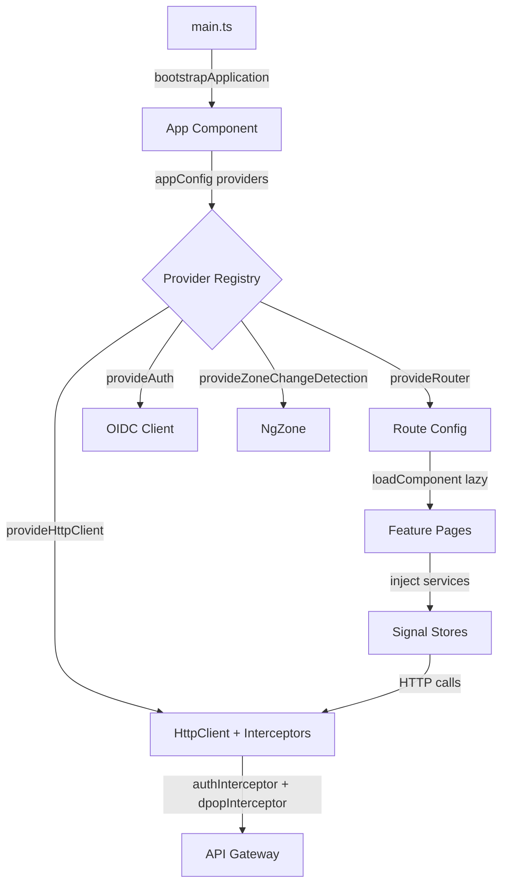

## TL;DR

Angular 21 (2026) has undergone a radical transformation from its NgModule-based origins. The `tai-portal` frontend is built entirely with **standalone components**, **signal-based reactivity** (`signal()`, `computed()`, `effect()`), **functional dependency injection** (`inject()`), and the **new control flow syntax** (`@if`, `@for`, `@switch`). There are zero NgModules in the entire application. For interviews: understand how Angular's DI system works with `providedIn: 'root'` and `inject()`, how Signals have replaced much of RxJS for local state, how `OnPush` change detection works with Signals, and how functional guards and interceptors replaced class-based ones.

## Deep Dive

### Concept Overview

#### 1. Standalone Components & Module-less Architecture
- **What:** Since Angular 15+, components can declare `standalone: true`, importing their dependencies directly instead of belonging to an NgModule. In Angular 21, standalone is the default—you don't even need to declare it.
- **Why:** NgModules were the most confusing part of Angular for newcomers. They created complex dependency graphs, caused circular import issues, and made tree-shaking harder. Standalone components are self-contained, easier to test, and enable better code splitting.
- **How:** Instead of declaring components in a module's `declarations` array, each component imports what it needs directly. The entire app bootstraps with `bootstrapApplication()` instead of `platformBrowserDynamic().bootstrapModule()`.
- **When:** Always use standalone components in new Angular 17+ projects. Only use NgModules when integrating with legacy Angular libraries that haven't migrated.
- **Trade-offs:** Standalone components can lead to repetitive imports across components (e.g., every component imports `CommonModule`). The solution is to create barrel exports or shared component arrays. There's also a learning curve for developers coming from NgModule-based codebases who need to understand the new `providers` configuration pattern.

#### 2. Dependency Injection (DI) with `inject()`
- **What:** Angular's DI system is a hierarchical container that creates and manages service instances. The `inject()` function (Angular 14+) is the modern way to request dependencies, replacing constructor injection.
- **Why:** Constructor injection required listing every dependency as a parameter, making refactoring tedious. `inject()` is cleaner, works in functional contexts (guards, interceptors, resolvers), and enables composable utility functions.
- **How:** Services are registered with `@Injectable({ providedIn: 'root' })` for app-wide singletons, or in a component's `providers` array for component-scoped instances. Dependencies are retrieved with `inject(ServiceName)` at the field level.
- **When:** Use `providedIn: 'root'` for stateless services (HTTP, auth) and signal-based stores. Use component-level `providers` when you need a fresh instance per component (e.g., a form state service). Use `InjectionToken` for interface-based DI.
- **Trade-offs:** `inject()` can only be called in an "injection context" (constructor, field initializer, or factory function). Calling it inside a method body throws a runtime error. This constraint forces clean initialization patterns but surprises developers who try to defer injection.

#### 3. Signals: Angular's Reactive Primitive
- **What:** Signals (`signal()`, `computed()`, `effect()`) are Angular's built-in reactive primitives, introduced in Angular 16 and matured in Angular 17-21. They provide synchronous, fine-grained reactivity without RxJS.
- **Why:** RxJS Observables are powerful but complex—managing subscriptions, avoiding memory leaks, and understanding operators like `switchMap` and `combineLatest` has been the biggest learning curve in Angular. Signals provide a simpler model: read a value synchronously, and Angular automatically tracks dependencies.
- **How:**
  - `signal(initialValue)` — Creates a writable reactive value
  - `computed(() => ...)` — Derives a read-only value that auto-updates when dependencies change
  - `effect(() => ...)` — Executes side effects when tracked signals change
  - `input()` / `output()` — Signal-based component inputs and outputs (replacing `@Input()` / `@Output()`)
  - `toSignal()` / `toObservable()` — Bridges between Signals and RxJS
- **When:** Use Signals for component-local state and UI-driven reactivity. Use RxJS for async streams (HTTP, WebSocket events, complex event composition). In the `tai-portal`, stores use Signals for state while services use RxJS for HTTP calls.
- **Trade-offs:** Signals are synchronous—they don't handle async operations natively (no `switchMap` equivalent). For debouncing, throttling, or complex stream composition, you still need RxJS. The `toSignal()` bridge requires an `initialValue` because Signals must always have a value (unlike Observables which can be empty).

#### 4. Change Detection: Default vs OnPush
- **What:** Change detection is how Angular knows when to update the DOM. Default strategy checks the entire component tree on every event. OnPush only checks a component when its inputs change (by reference) or an event fires within it.
- **Why:** Default change detection is simple but expensive—in a large app, every click, timer tick, or HTTP response triggers a full tree traversal. OnPush dramatically reduces unnecessary DOM checks.
- **How:** Set `changeDetection: ChangeDetectionStrategy.OnPush` on the component decorator. With Signals, this is even more efficient—Angular only re-renders the specific bindings that changed, not the entire template.
- **When:** Use OnPush on every component in production applications. It's the default recommendation in Angular 17+. The only reason to use Default is for quick prototyping or legacy code migration.
- **Trade-offs:** OnPush requires immutable data patterns—mutating an object property won't trigger change detection because the reference hasn't changed. With Signals, this is largely mitigated because `signal.set()` always creates a new reference. However, mixing OnPush with imperative state mutations is a common source of "my template doesn't update" bugs.

#### 5. Functional Guards & Interceptors
- **What:** Angular 15+ introduced functional guards (`CanActivateFn`) and interceptors (`HttpInterceptorFn`) as replacements for class-based implementations.
- **Why:** Class-based guards required creating an entire class with an `implements CanActivate` interface for what is often a single function. Functional guards are simpler, composable, and tree-shakable.
- **How:** Define a `const` function with the appropriate signature. Use `inject()` inside the function body to access services. Register guards in route configurations and interceptors in `provideHttpClient(withInterceptors([...]))`.
- **When:** Always use functional guards and interceptors in Angular 15+ projects. Class-based versions are deprecated.
- **Trade-offs:** Functional guards lose the ability to hold instance state between navigations (since they're stateless functions). If you need state, inject a service. They're also harder to unit test in isolation compared to class instances, though Angular's `TestBed` handles both.

#### 6. New Control Flow (`@if`, `@for`, `@switch`)
- **What:** Angular 17 introduced built-in control flow syntax that replaces structural directives (`*ngIf`, `*ngFor`, `*ngSwitch`).
- **Why:** Structural directives used microsyntax (e.g., `*ngIf="condition; else elseTemplate"`) that was confusing and inconsistent. The new syntax is cleaner, supports destructuring, and enables compile-time optimizations.
- **How:** `@if (condition) { ... } @else { ... }`, `@for (item of items; track item.id) { ... } @empty { ... }`, `@switch (value) { @case (1) { ... } }`.
- **When:** Use the new control flow syntax in all Angular 17+ projects. The migration schematic (`ng generate @angular/core:control-flow`) can auto-convert existing templates.
- **Trade-offs:** The `track` expression in `@for` is mandatory (unlike `*ngFor` where `trackBy` was optional). This forces better performance patterns but adds boilerplate. Also, the `@if (expr; as variable)` syntax for aliasing is slightly different from `*ngIf="expr as variable"`, requiring migration attention.

#### 7. NgZone & Performance Optimization
- **What:** NgZone is Angular's mechanism for knowing when to run change detection. It monkey-patches browser APIs (`setTimeout`, `addEventListener`, `Promise.then`) so Angular knows when async operations complete.
- **Why:** Without NgZone, Angular wouldn't know when to update the DOM after async operations. But this also means *every* async operation triggers change detection—including operations that don't affect the UI.
- **How:** Use `NgZone.runOutsideAngular()` to execute code that shouldn't trigger change detection (e.g., SignalR event handlers, animation loops, frequent timer callbacks). Use `NgZone.run()` when you need to re-enter the zone and trigger an update.
- **When:** Use `runOutsideAngular()` for high-frequency events (WebSocket messages, `requestAnimationFrame`, polling timers) that process data before updating the UI. Use `run()` only when you have a final result that needs to be rendered.
- **Trade-offs:** Running code outside NgZone means Angular won't detect changes automatically—you must manually re-enter the zone or use `ChangeDetectorRef.detectChanges()`. Forgetting to do this causes "stale template" bugs that are hard to diagnose.

### The Full Bootstrap Flow

This diagram shows how `tai-portal` bootstraps without any NgModules, from `main.ts` through to a rendered component.



### Real-World Application: The TAI Portal Architecture

#### 1. Module-less Bootstrap (`main.ts` + `app.config.ts`)

The entire application bootstraps without a single NgModule. `bootstrapApplication()` accepts the root component and an `ApplicationConfig` object:

```typescript
// From: apps/portal-web/src/main.ts
import { bootstrapApplication } from '@angular/platform-browser';
import { appConfig } from './app/app.config';
import { App } from './app/app';

bootstrapApplication(App, appConfig).catch((err) => console.error(err));
```

The `ApplicationConfig` replaces `NgModule.providers`:

```typescript
// From: apps/portal-web/src/app/app.config.ts
export const appConfig: ApplicationConfig = {
  providers: [
    provideZoneChangeDetection({ eventCoalescing: true }),
    provideRouter(appRoutes),
    { provide: PrivilegeChecker, useExisting: AuthService },
    provideHttpClient(withInterceptors([authInterceptor(), dpopInterceptor])),
    provideAuth({
      config: {
        authority: `http://${window.location.hostname}:${SYSTEM_CONFIG.gatewayPort}`,
        clientId: 'portal-web',
        scope: 'openid profile email offline_access roles',
        responseType: 'code',
        silentRenew: true,
        useRefreshToken: true,
        secureRoutes: ['/api'],
      },
    }),
  ],
};
```

Key patterns:
- `provideZoneChangeDetection({ eventCoalescing: true })` — Batches multiple change detection cycles into one for performance
- `{ provide: PrivilegeChecker, useExisting: AuthService }` — Interface-based DI. Components in the design system depend on the abstract `PrivilegeChecker`, and the app wires `AuthService` as the concrete implementation
- `withInterceptors([...])` — Functional interceptor chain, executed in order

#### 2. Signal-Based State Management (`UsersStore`)

The `UsersStore` demonstrates the Signal-based state pattern used throughout `tai-portal`. It replaces NgRx/NGRX with a simpler, signal-driven approach:

```typescript
// From: apps/portal-web/src/app/features/users/users.store.ts
@Injectable({ providedIn: 'root' })
export class UsersStore {
  private readonly usersService = inject(UsersService);

  // --- Internal State (Private Signals) ---
  private readonly _users = signal<User[]>([]);
  private readonly _totalCount = signal<number>(0);
  private readonly _status = signal<UsersStatus>('Idle');
  private readonly _errorMessage = signal<string | null>(null);

  // --- Public Read-Only State (Exposed Signals) ---
  public readonly users = this._users.asReadonly();
  public readonly totalCount = this._totalCount.asReadonly();
  public readonly status = this._status.asReadonly();
  public readonly errorMessage = this._errorMessage.asReadonly();

  // --- Derived State (Computed Signals) ---
  public readonly isLoading = computed(() => this._status() === 'Loading');
  public readonly isError = computed(() => this._status() === 'Error');
  public readonly isConflict = computed(() => this._status() === 'Conflict');

  public loadUsers(pageIndex?: number, pageSize?: number, ...): void {
    this._status.set('Loading');
    this.usersService.getUsers(this._pageIndex(), this._pageSize(), ...)
      .subscribe({
        next: (response) => {
          this._users.set(response.items);
          this._totalCount.set(response.totalCount);
          this._status.set('Success');
        },
        error: (err: HttpErrorResponse) => {
          this._status.set('Error');
          this._errorMessage.set(err.error?.detail || 'Failed to load users.');
        }
      });
  }
}
```

**Pattern breakdown:**
- Private `signal()` for internal state — prevents external mutation
- `.asReadonly()` for public API — type-safe read-only access
- `computed()` for derived state — auto-updates, no manual recalculation
- RxJS for HTTP calls, Signals for state — best of both worlds

#### 3. Effects for Side Effects (`user-detail.page.ts`)

`effect()` replaces complex RxJS subscription chains for reacting to state changes:

```typescript
// From: apps/portal-web/src/app/features/users/user-detail.page.ts
constructor() {
  effect(() => {
    const user = this.store.selectedUser();
    const status = this.store.status();

    // React to status changes after a save operation
    if (this.isSaving() && (status === 'Success' || status === 'Conflict' || status === 'Error')) {
      this.isSaving.set(false);
      if (status === 'Success') {
        this.isEditing.set(false);
      }
    }

    // Sync form values when user data changes during edit mode
    if (user && this.isEditing()) {
      this.editForm.patchValue({
        firstName: user.firstName,
        lastName: user.lastName,
        email: user.email,
      }, { emitEvent: false });
    }
  });
}
```

And for navigation side effects:

```typescript
// From: apps/portal-web/src/app/features/onboarding/pages/register.page.ts
constructor() {
  effect(() => {
    if (this.store.status() === 'Success') {
      this.store.reset();
      this.router.navigate(['/verify']);
    }
  });
}
```

#### 4. Lazy-Loaded Routes with Functional Guards

Every route uses `loadComponent` for code splitting, with functional guards for auth and privilege checks:

```typescript
// From: apps/portal-web/src/app/app.routes.ts
export const appRoutes: Route[] = [
  { 
    path: 'register', 
    loadComponent: () => import('./features/onboarding/pages/register.page')
      .then(m => m.RegisterPage) 
  },
  { 
    path: 'users', 
    loadComponent: () => import('./features/users/users.page')
      .then(m => m.UsersPage),
    canActivate: [authGuard, privilegeGuard],
    data: { requiredPrivilege: 'Portal.Users.Read' }
  },
];
```

The privilege guard reads route data and checks claims:

```typescript
// From: apps/portal-web/src/app/privilege.guard.ts
export const privilegeGuard: CanActivateFn = (route) => {
  const authService = inject(AuthService);
  const router = inject(Router);
  
  const requiredPrivilege = route.data['requiredPrivilege'] as string | undefined;
  if (!requiredPrivilege) return of(true);

  return authService.hasPrivilege(requiredPrivilege).pipe(
    take(1),
    map((hasPrivilege) => {
      if (hasPrivilege) return true;
      router.navigate(['/']);
      return false;
    })
  );
};
```

#### 5. New Control Flow in Templates

The `tai-portal` uses the new `@if`/`@for` syntax exclusively:

```html
<!-- From: apps/portal-web/src/app/app.html -->
@if (isAuthenticated$ | async) {
  <tai-app-shell [user]="user$ | async" [menuItems]="(menuItems$ | async) || []"
    (logout)="logout()">    
    <router-outlet></router-outlet>
    
    @if (router.url === '/') {
      <div class="welcome-content p-8">
        @for (user of onboardingStore.pendingUsers(); track user.id) {
          <div class="p-4 bg-white rounded-lg shadow">
            <div class="font-bold">{{ user.name }}</div>
          </div>
        } @empty {
          <p class="text-gray-500 italic">No users currently awaiting approval.</p>
        }
      </div>
    }
  </tai-app-shell>
} @else {
  <div class="login-container">...</div>
}
```

Key differences from `*ngIf`/`*ngFor`:
- `@for` requires `track` (mandatory for performance)
- `@empty` block for empty collections (no need for separate `*ngIf`)
- `@if ... @else` is native syntax (no `ng-template` required)

#### 6. NgZone Optimization for SignalR

The `RealTimeService` demonstrates explicit NgZone management for WebSocket events:

```typescript
// From: apps/portal-web/src/app/real-time.service.ts
private readonly ngZone = inject(NgZone);

// SignalR events fire OUTSIDE Angular zone to prevent CD thrashing
this.hubConnection.on('SecurityEvent', (payload: SecurityEventPayload) => {
  this.ngZone.runOutsideAngular(() => {
    this.handleSecurityEvent(payload);  // Process without triggering CD
  });
});

// Only re-enter zone when final UI data is ready
this.fetchAuditLogDetails(eventId).subscribe({
  next: (details) => {
    this.ngZone.run(() => {
      this._securityEvents$.next(details);  // NOW trigger change detection
    });
  },
});
```

**Why this matters:** SignalR can fire dozens of events per second. Without `runOutsideAngular()`, each event triggers a full change detection cycle across the entire component tree. By processing outside the zone and only re-entering when the UI-relevant data is ready, we reduce change detection from N events to 1.

#### 7. Signal Inputs with `toSignal()` Bridge

The design system's `TransferListComponent` demonstrates bridging RxJS and Signals:

```typescript
// From: libs/ui/design-system/src/lib/design-system/transfer-list/transfer-list.ts
// Signal-based inputs (replacing @Input())
public readonly items = input.required<T[]>();
public readonly displayKey = input<keyof T>('name' as keyof T);
public readonly density = input<'compact' | 'comfortable'>('comfortable');

// Signal-based outputs (replacing @Output())
public readonly assignedIdsChanged = output<(string | number)[]>();

// Bridging RxJS Observable to Signal
public readonly isSmallScreen = toSignal(
  this.breakpointObserver
    .observe([Breakpoints.XSmall, Breakpoints.Small])
    .pipe(map(result => result.matches)),
  { initialValue: false },
);

// Debounced search using RxJS, exposed as Signal
public readonly searchTermAvailable = toSignal(
  this.searchTermAvailable$.pipe(debounceTime(300), distinctUntilChanged()),
  { initialValue: '' },
);
```

**Pattern:** Use `input()` for component API, `toSignal()` to convert async streams (breakpoints, debounced inputs) into synchronous Signal values the template can read directly.

---

## Interview Q&A

### L1: What is Dependency Injection in Angular?
**Difficulty:** L1 (Junior)

**Question:** What is Dependency Injection in Angular, and what's the difference between `providedIn: 'root'` and adding a service to a component's `providers` array?

**Answer:** Dependency Injection is a design pattern where a class receives its dependencies from an external source rather than creating them itself. Angular's DI system is hierarchical—services can be scoped to the entire app or to a specific component subtree. `providedIn: 'root'` creates a single, app-wide instance (singleton). Adding a service to a component's `providers` array creates a *new* instance for that component and all its children, useful when you need isolated state (e.g., a form service that resets per page).

---

### L1: Standalone Components vs NgModules
**Difficulty:** L1 (Junior)

**Question:** What are standalone components, and why did Angular move away from NgModules?

**Answer:** Standalone components are self-contained—they declare their own dependencies via `imports` rather than belonging to an NgModule. Angular moved away from NgModules because they added unnecessary indirection: you had to declare a component in a module, import that module elsewhere, and manage complex dependency graphs. With standalone, each component is its own unit. The app bootstraps with `bootstrapApplication()` and `ApplicationConfig` instead of `bootstrapModule()`. In Angular 21, standalone is the default—you don't even need to specify `standalone: true`.

---

### L2: Signals vs Observables
**Difficulty:** L2 (Mid-Level)

**Question:** Angular now has both Signals and RxJS Observables. When would you use each, and how does `tai-portal` divide responsibilities between them?

**Answer:** Signals are synchronous, pull-based reactive primitives—you read them like values (`count()`) and Angular auto-tracks dependencies. Observables are asynchronous, push-based streams—they model events over time. In `tai-portal`, the division is clear: **Signals for state** (the `UsersStore` holds `signal<User[]>([])` for the user list, `computed()` for derived loading states) and **RxJS for async operations** (HTTP calls return `Observable`, the auth service exposes `isAuthenticated$` as an Observable). The `toSignal()` bridge converts Observables into Signals when the template needs synchronous access—for example, converting a debounced search stream into a Signal.

---

### L2: OnPush Change Detection with Signals
**Difficulty:** L2 (Mid-Level)

**Question:** How does `ChangeDetectionStrategy.OnPush` work, and why is it especially effective when combined with Signals?

**Answer:** With Default change detection, Angular checks every component in the tree on every browser event (click, timer, HTTP response). OnPush tells Angular: "only check this component if its `@Input()` references change or an event fires within it." This skips entire subtrees of the component tree. With Signals, it's even better—Angular can track *which specific template binding* depends on which Signal, and only update that binding when its Signal changes, without checking the rest of the template. In `tai-portal`, all design system components (`DataTableComponent`, `UserProfileComponent`, `AppShellComponent`) use OnPush, and their templates read from Signals directly (`store.isLoading()`, `store.users()`), achieving fine-grained reactivity with minimal change detection overhead.

---

### L3: Signal-Based State Management Pattern
**Difficulty:** L3 (Senior)

**Question:** In `tai-portal`, you implemented state management with raw Signals instead of NgRx or other state management libraries. Walk me through the architectural pattern and explain the trade-offs versus NgRx.

**Answer:** The pattern is a **Signal Store** with three layers: (1) Private writable signals for internal state (`private readonly _users = signal<User[]>([])`), (2) Read-only projections for the public API (`public readonly users = this._users.asReadonly()`), and (3) Computed signals for derived state (`public readonly isLoading = computed(() => this._status() === 'Loading')`). Methods mutate state by calling `signal.set()` after HTTP operations complete.

**vs NgRx:** NgRx provides actions, reducers, effects, and selectors—a full Redux pattern with time-travel debugging and strict unidirectional data flow. The Signal Store pattern is dramatically simpler (~165 lines vs ~500+ for NgRx boilerplate) but trades away: (a) time-travel debugging, (b) action logging/replay, (c) strict separation of "what happened" (action) from "how state changes" (reducer). For `tai-portal` (a medium-complexity portal with ~5 feature areas), the Signal Store is the right choice. For a large app with 50+ developers where action traceability is critical (e.g., a trading platform), NgRx's overhead is justified.

---

### L3: NgZone and Performance
**Difficulty:** L3 (Senior)

**Question:** The `RealTimeService` in `tai-portal` wraps SignalR event handlers in `NgZone.runOutsideAngular()`. Explain why, and what would happen if you didn't.

**Answer:** Angular uses NgZone (built on Zone.js) to know when to run change detection. Zone.js monkey-patches all async APIs—`setTimeout`, `Promise.then`, `addEventListener`, and crucially, WebSocket event handlers. When SignalR receives a message, Zone.js intercepts the callback and triggers a full change detection cycle across the entire component tree.

For SignalR events that arrive frequently (privilege changes, security events), this means: (1) event arrives, (2) Angular runs change detection on every component, (3) nothing in the template actually changed, (4) repeat for every event. This is "change detection thrashing."

By wrapping handlers in `runOutsideAngular()`, we tell Angular: "this code is not UI-relevant yet." The event is processed (fetching full audit log details via HTTP) without triggering change detection. Only when the final, UI-ready data is available do we call `NgZone.run()` to re-enter the zone and trigger a single, productive change detection cycle. This reduces unnecessary CD runs from potentially dozens per second to exactly one per meaningful UI update.

---

### Staff: Functional DI & the `inject()` Paradigm Shift
**Difficulty:** Staff

**Question:** Angular's move from constructor-based DI to the `inject()` function fundamentally changed how services are consumed. As a Staff Engineer, how does this architectural shift affect composability, testing, and the overall DI design philosophy?

**Answer:** The `inject()` function enables three architectural patterns that constructor DI could not:

1. **Functional composition:** Guards, interceptors, and resolvers are now plain functions—not classes. In `tai-portal`, `authGuard` and `privilegeGuard` are 15-line `const` functions that can be combined in route config with `canActivate: [authGuard, privilegeGuard]`. With class-based guards, each would have been a separate file with constructor, `implements`, and a `canActivate` method. This reduces boilerplate by ~70%.

2. **Shared utility extraction:** You can create composable helper functions that use `inject()` internally. For example, a `useCurrentTenant()` function that calls `inject(TenantService)` and returns the current tenant Signal. These functions compose like React hooks but with Angular's hierarchical DI—they respect the injector hierarchy of where they're called from.

3. **Testing implications:** Class-based DI was easy to test—just pass mocks to the constructor. `inject()` requires `TestBed.configureTestingModule()` to set up the injector context. This is slightly more ceremony, but more accurately reflects how the code runs in production. The trade-off is that unit tests become slightly more integration-test-like, but they catch DI configuration bugs that pure constructor tests miss.

The philosophical shift is from "services are classes with constructors" to "services are values obtained from a context." This aligns Angular with the broader industry trend (React hooks, Vue composables, SolidJS primitives) toward functional, composable dependency resolution.

---

### Staff: Migrating from NgModules to Standalone
**Difficulty:** Staff

**Question:** You're leading the migration of a large Angular 14 enterprise application (200+ components across 15 NgModules) to Angular 21's standalone architecture. What is your migration strategy, and what are the biggest risks?

**Answer:** The migration must be incremental—a big-bang rewrite would halt feature development for months. My strategy:

**Phase 1: Enable coexistence.** Angular supports standalone and NgModule-based components in the same app. Mark new components as standalone immediately. Existing components stay in their modules.

**Phase 2: Bottom-up leaf migration.** Start with leaf components (no child components)—they have the fewest dependencies. Use `ng generate @angular/core:standalone` schematic to auto-migrate. Each migrated component imports its dependencies directly instead of relying on the parent module.

**Phase 3: Migrate feature modules.** Once all components in a feature module are standalone, delete the module. Replace `loadChildren: () => import('./feature.module').then(m => m.FeatureModule)` with `loadComponent: () => import('./feature.page').then(m => m.FeaturePage)` for direct component lazy loading.

**Phase 4: Bootstrap migration.** Replace `platformBrowserDynamic().bootstrapModule(AppModule)` with `bootstrapApplication(AppComponent, appConfig)`. Move all root-level providers to `ApplicationConfig`.

**Biggest risks:**
1. **Shared modules** — Modules like `SharedModule` that re-export `CommonModule`, `FormsModule`, and 20 custom components. Every consumer must now import these individually. Solution: create barrel exports (`export const SHARED_COMPONENTS = [...]`) as a temporary bridge.
2. **Circular dependencies** — NgModules often hid circular imports. Going standalone makes them explicit and breaks the build. Solution: extract shared types into a separate library.
3. **Provider scoping** — Services provided in feature modules were automatically scoped. In standalone, `providedIn: 'root'` makes everything a singleton. Teams may accidentally share state they didn't intend to. Solution: audit all `providers` arrays during migration.

---

## Cross-References

- [[RxJS-Signals]] — Deep dive into the reactive programming model underpinning Angular.
- [[Security-CSP-DPoP]] — The DPoP interceptor and Trusted Types service are Angular-specific implementations.
- [[Authentication-Authorization]] — OIDC integration via `angular-auth-oidc-client` and route guards.
- [[SignalR-Realtime]] — NgZone patterns for real-time WebSocket integration.

---

## Further Reading

- [Angular Signals Guide](https://angular.dev/guide/signals)
- [Angular Standalone Migration](https://angular.dev/guide/components/importing)
- [Angular Control Flow](https://angular.dev/guide/templates/control-flow)
- Source code: `apps/portal-web/src/app/app.config.ts` — Module-less bootstrap
- Source code: `apps/portal-web/src/app/features/users/users.store.ts` — Signal store pattern

---

*Last updated: 2026-04-01*
