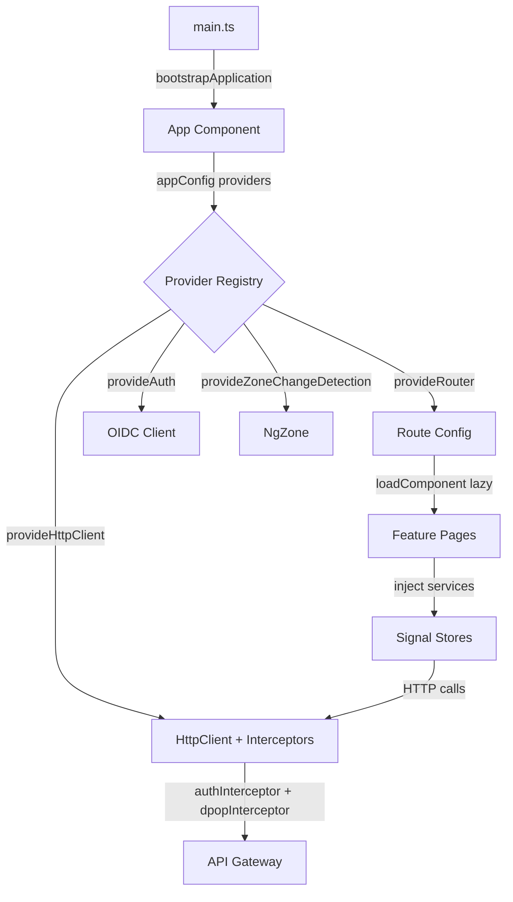
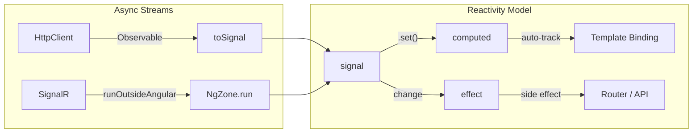

## Table of Contents

[🧠 **View Interactive Mindmap**](./angular-core-mindmap.md)

1. [TL;DR](#tldr)
2. [Deep Dive](#deep-dive)
   2.1 [Module-less Architecture](#concept-group-1-module-less-architecture)
      2.1.1 [Standalone Components](#1-standalone-components)
      2.1.2 [Dependency Injection with `inject()`](#2-dependency-injection-with-inject)
   2.2 [Reactivity & Performance](#concept-group-2-reactivity--performance)
      2.2.1 [Signals: Angular's Reactive Primitive](#3-signals-angulars-reactive-primitive)
      2.2.2 [Change Detection: Default vs OnPush](#4-change-detection-default-vs-onpush)
      2.2.3 [NgZone & Performance Optimization](#5-ngzone--performance-optimization)
   2.3 [Modern Syntax & Patterns](#concept-group-3-modern-syntax--patterns)
      2.3.1 [Functional Guards & Interceptors](#6-functional-guards--interceptors)
      2.3.2 [New Control Flow (`@if`, `@for`, `@switch`)](#7-new-control-flow-if-for-switch)
3. [Architecture & Data Flow](#architecture--data-flow)
4. [Real-World Examples](#real-world-examples)
   4.1 [Signal-Based State Management](#1-signal-based-state-management-usersstore)
   4.2 [Effects for Side Effects](#2-effects-for-side-effects)
   4.3 [Lazy-Loaded Routes with Functional Guards](#3-lazy-loaded-routes-with-functional-guards)
   4.4 [NgZone Optimization for SignalR](#4-ngzone-optimization-for-signalr)
   4.5 [Signal Inputs with `toSignal()` Bridge](#5-signal-inputs-with-tosignal-bridge)
5. [Comparison Tables](#comparison-tables)
6. [Interview Q&A](#interview-qa)
   6.1 [L1: Junior](#l1-junior-knowledge)
      6.1.1 [What is Dependency Injection in Angular?](#l1-what-is-dependency-injection-in-angular)
      6.1.2 [Standalone Components vs NgModules](#l1-standalone-components-vs-ngmodules)
   6.2 [L2: Mid-Level](#l2-mid-level-knowledge)
      6.2.1 [Signals vs Observables](#l2-signals-vs-observables)
      6.2.2 [OnPush Change Detection with Signals](#l2-onpush-change-detection-with-signals)
   6.3 [L3: Senior](#l3-senior-knowledge)
      6.3.1 [Signal-Based State Management Pattern](#l3-signal-based-state-management-pattern)
      6.3.2 [NgZone and Performance](#l3-ngzone-and-performance)
   6.4 [Staff](#staff-system-architecture)
      6.4.1 [Functional DI & the `inject()` Paradigm Shift](#staff-functional-di--the-inject-paradigm-shift)
      6.4.2 [Migrating from NgModules to Standalone](#staff-migrating-from-ngmodules-to-standalone)
7. [Cross-References](#cross-references)
8. [Further Reading](#further-reading)

---

## TL;DR

Angular 21 (2026) has undergone a radical transformation from its NgModule-based origins. The `tai-portal` frontend is built entirely with <span style="color: #00C851; font-weight: bold;">standalone components</span>, <span style="color: #33b5e5; font-weight: bold;">signal-based reactivity</span> (`signal()`, `computed()`, `effect()`), <span style="color: #00C851; font-weight: bold;">functional dependency injection</span> (`inject()`), and the <span style="color: #33b5e5; font-weight: bold;">new control flow syntax</span> (`@if`, `@for`, `@switch`). There are zero NgModules in the entire application. Signals have replaced much of RxJS for local state, while RxJS remains for async streams (HTTP, WebSocket). <span style="color: #ffbb33; font-weight: bold;">The key trade-off</span>: Signals are synchronous and cannot handle debouncing, throttling, or complex stream composition—you still need RxJS for those. For interviews: understand how Angular's DI system works with `providedIn: 'root'` and `inject()`, how `OnPush` change detection works with Signals for fine-grained reactivity, and how functional guards/interceptors replaced class-based ones.

---

## Deep Dive

### Concept Group 1: Module-less Architecture

#### 1. Standalone Components

##### What
Since Angular 15+, components can declare `standalone: true`, importing their dependencies directly instead of belonging to an <span style="color: #33b5e5; font-weight: bold;">NgModule</span>. In Angular 21, standalone is the default—you don't even need to declare it.

##### Why
Without standalone components, every component had to belong to an NgModule. NgModules created complex dependency graphs, caused circular import issues, and made tree-shaking harder. They were the most confusing part of Angular for newcomers.

##### How
Instead of declaring components in a module's `declarations` array, each component imports what it needs directly. The entire app bootstraps with <span style="color: #00C851; font-weight: bold;">`bootstrapApplication()`</span> instead of `platformBrowserDynamic().bootstrapModule()`.

```typescript
// From: apps/portal-web/src/main.ts
import { bootstrapApplication } from '@angular/platform-browser';
import { appConfig } from './app/app.config';
import { App } from './app/app';

bootstrapApplication(App, appConfig).catch((err) => console.error(err));
```

The `ApplicationConfig` replaces `NgModule.providers`:

```typescript
// From: apps/portal-web/src/app/app.config.ts
export const appConfig: ApplicationConfig = {
  providers: [
    provideZoneChangeDetection({ eventCoalescing: true }),
    provideRouter(appRoutes),
    { provide: PrivilegeChecker, useExisting: AuthService },
    provideHttpClient(withInterceptors([authInterceptor(), dpopInterceptor])),
    provideAuth({
      config: {
        authority: `http://${window.location.hostname}:${SYSTEM_CONFIG.gatewayPort}`,
        clientId: 'portal-web',
        scope: 'openid profile email offline_access roles',
        responseType: 'code',
        silentRenew: true,
        useRefreshToken: true,
        secureRoutes: ['/api'],
      },
    }),
  ],
};
```

##### When
Always use standalone components in Angular 17+ projects. Only use NgModules when integrating with legacy Angular libraries that haven't migrated.

##### Trade-offs
<span style="color: #ffbb33; font-weight: bold;">Standalone components can lead to repetitive imports</span> across components (e.g., every component imports `CommonModule`). The solution is to create barrel exports or shared component arrays. There's also a learning curve for developers coming from NgModule-based codebases who need to understand the new `providers` configuration pattern.

---

#### 2. Dependency Injection with `inject()`

##### What
Angular's DI system is a <span style="color: #33b5e5; font-weight: bold;">hierarchical container</span> that creates and manages service instances. The `inject()` function (Angular 14+) is the modern way to request dependencies, replacing constructor injection.

##### Why
Without `inject()`, constructor injection required listing every dependency as a parameter, making refactoring tedious. It also couldn't work in functional contexts (guards, interceptors, resolvers), limiting composability.

##### How
Services are registered with `@Injectable({ providedIn: 'root' })` for app-wide singletons, or in a component's `providers` array for component-scoped instances. Dependencies are retrieved with <span style="color: #00C851; font-weight: bold;">`inject(ServiceName)`</span> at the field level.

```typescript
// Field-level injection — the modern pattern
@Injectable({ providedIn: 'root' })
export class UsersStore {
  private readonly usersService = inject(UsersService);
  private readonly router = inject(Router);
}
```

##### When
Use `providedIn: 'root'` for stateless services (HTTP, auth) and signal-based stores. Use component-level `providers` when you need a fresh instance per component (e.g., a form state service). Use `InjectionToken` for interface-based DI.

##### Trade-offs
<span style="color: #ff4444; font-weight: bold;">`inject()` can only be called in an "injection context"</span> (constructor, field initializer, or factory function). Calling it inside a method body throws a runtime error. This constraint forces clean initialization patterns but surprises developers who try to defer injection.

---

### Concept Group 2: Reactivity & Performance

#### 3. Signals: Angular's Reactive Primitive

##### What
<span style="color: #33b5e5; font-weight: bold;">Signals</span> (`signal()`, `computed()`, `effect()`) are Angular's built-in reactive primitives, introduced in Angular 16 and matured in Angular 17-21. They provide synchronous, fine-grained reactivity without RxJS.

##### Why
Without Signals, all reactivity required RxJS Observables. Managing subscriptions, avoiding memory leaks, and understanding operators like `switchMap` and `combineLatest` was the biggest learning curve in Angular. Signals provide a simpler model: read a value synchronously, and Angular automatically tracks dependencies.

##### How
- `signal(initialValue)` — Creates a writable reactive value
- `computed(() => ...)` — Derives a read-only value that auto-updates when dependencies change
- `effect(() => ...)` — Executes side effects when tracked signals change
- `input()` / `output()` — Signal-based component inputs and outputs (replacing `@Input()` / `@Output()`)
- `toSignal()` / `toObservable()` — Bridges between Signals and RxJS

```typescript
// Private writable signals for internal state
private readonly _users = signal<User[]>([]);
private readonly _status = signal<UsersStatus>('Idle');

// Read-only projections for public API
public readonly users = this._users.asReadonly();

// Computed for derived state — auto-updates
public readonly isLoading = computed(() => this._status() === 'Loading');
```

##### When
Use Signals for component-local state and UI-driven reactivity. Use RxJS for async streams (HTTP, WebSocket events, complex event composition). In `tai-portal`, stores use Signals for state while services use RxJS for HTTP calls.

##### Trade-offs
<span style="color: #ffbb33; font-weight: bold;">Signals are synchronous—they don't handle async operations natively</span> (no `switchMap` equivalent). For debouncing, throttling, or complex stream composition, you still need RxJS. The `toSignal()` bridge requires an `initialValue` because Signals must always have a value (unlike Observables which can be empty).

---

#### 4. Change Detection: Default vs OnPush

##### What
<span style="color: #33b5e5; font-weight: bold;">Change detection</span> is how Angular knows when to update the DOM. Default strategy checks the entire component tree on every event. <span style="color: #00C851; font-weight: bold;">OnPush</span> only checks a component when its inputs change (by reference) or an event fires within it.

##### Why
Without OnPush, Default change detection runs a full tree traversal on every click, timer tick, or HTTP response. In a large app this is expensive and causes unnecessary DOM checks across hundreds of components.

##### How
Set `changeDetection: ChangeDetectionStrategy.OnPush` on the component decorator. With Signals, Angular can track *which specific template binding* depends on which Signal, and only update that binding when its Signal changes—not the entire template.

```typescript
@Component({
  selector: 'app-users',
  changeDetection: ChangeDetectionStrategy.OnPush,
  template: `
    @if (store.isLoading()) {
      <tai-spinner />
    } @else {
      <tai-data-table [data]="store.users()" />
    }
  `,
})
export class UsersPage {
  protected readonly store = inject(UsersStore);
}
```

##### When
<span style="color: #00C851; font-weight: bold;">Use OnPush on every component in production applications.</span> It's the default recommendation in Angular 17+. The only reason to use Default is for quick prototyping or legacy code migration.

##### Trade-offs
<span style="color: #ff4444; font-weight: bold;">OnPush requires immutable data patterns</span>—mutating an object property won't trigger change detection because the reference hasn't changed. With Signals, this is largely mitigated because `signal.set()` always creates a new reference. However, mixing OnPush with imperative state mutations is a common source of "my template doesn't update" bugs.

---

#### 5. NgZone & Performance Optimization

##### What
<span style="color: #33b5e5; font-weight: bold;">NgZone</span> is Angular's mechanism for knowing when to run change detection. It monkey-patches browser APIs (`setTimeout`, `addEventListener`, `Promise.then`) so Angular knows when async operations complete.

##### Why
Without NgZone, Angular wouldn't know when to update the DOM after async operations. But this also means *every* async operation triggers change detection—including operations that don't affect the UI, causing <span style="color: #ff4444; font-weight: bold;">change detection thrashing</span>.

##### How
Use `NgZone.runOutsideAngular()` to execute code that shouldn't trigger change detection (e.g., SignalR event handlers, animation loops, frequent timer callbacks). Use `NgZone.run()` when you need to re-enter the zone and trigger an update.

```typescript
// Process outside zone — no change detection triggered
this.ngZone.runOutsideAngular(() => {
  this.handleSecurityEvent(payload);
});

// Re-enter zone only when UI data is ready
this.ngZone.run(() => {
  this._securityEvents$.next(details);
});
```

##### When
Use `runOutsideAngular()` for high-frequency events (WebSocket messages, `requestAnimationFrame`, polling timers) that process data before updating the UI. Use `run()` only when you have a final result that needs to be rendered.

##### Trade-offs
<span style="color: #ff4444; font-weight: bold;">Running code outside NgZone means Angular won't detect changes automatically</span>—you must manually re-enter the zone or use `ChangeDetectorRef.detectChanges()`. Forgetting to do this causes "stale template" bugs that are hard to diagnose.

---

### Concept Group 3: Modern Syntax & Patterns

#### 6. Functional Guards & Interceptors

##### What
Angular 15+ introduced <span style="color: #33b5e5; font-weight: bold;">functional guards</span> (`CanActivateFn`) and <span style="color: #33b5e5; font-weight: bold;">functional interceptors</span> (`HttpInterceptorFn`) as replacements for class-based implementations.

##### Why
Without functional guards, creating a guard required an entire class with `implements CanActivate`, a constructor, and a method—all for what is often a single function. This boilerplate discouraged proper route protection.

##### How
Define a `const` function with the appropriate signature. Use `inject()` inside the function body to access services. Register guards in route configurations and interceptors in `provideHttpClient(withInterceptors([...]))`.

```typescript
// Functional guard — 15 lines vs ~40 for class-based
export const privilegeGuard: CanActivateFn = (route) => {
  const authService = inject(AuthService);
  const router = inject(Router);
  
  const requiredPrivilege = route.data['requiredPrivilege'] as string | undefined;
  if (!requiredPrivilege) return of(true);

  return authService.hasPrivilege(requiredPrivilege).pipe(
    take(1),
    map((hasPrivilege) => hasPrivilege || router.createUrlTree(['/']))
  );
};
```

##### When
<span style="color: #00C851; font-weight: bold;">Always use functional guards and interceptors in Angular 15+ projects.</span> Class-based versions are deprecated.

##### Trade-offs
<span style="color: #ffbb33; font-weight: bold;">Functional guards lose the ability to hold instance state between navigations</span> (since they're stateless functions). If you need state, inject a service. They're also harder to unit test in isolation compared to class instances, though Angular's `TestBed` handles both.

---

#### 7. New Control Flow (`@if`, `@for`, `@switch`)

##### What
Angular 17 introduced <span style="color: #33b5e5; font-weight: bold;">built-in control flow syntax</span> that replaces structural directives (`*ngIf`, `*ngFor`, `*ngSwitch`).

##### Why
Without the new syntax, structural directives used microsyntax (e.g., `*ngIf="condition; else elseTemplate"`) that was confusing, inconsistent, and required `ng-template` references for else blocks.

##### How
```html
@if (isAuthenticated$ | async) {
  <tai-app-shell [user]="user$ | async">
    <router-outlet></router-outlet>
  </tai-app-shell>
} @else {
  <div class="login-container">...</div>
}

@for (user of onboardingStore.pendingUsers(); track user.id) {
  <div class="p-4 bg-white rounded-lg shadow">
    <div class="font-bold">{{ user.name }}</div>
  </div>
} @empty {
  <p class="text-gray-500 italic">No users currently awaiting approval.</p>
}
```

##### When
Use the new control flow syntax in all Angular 17+ projects. The migration schematic (`ng generate @angular/core:control-flow`) can auto-convert existing templates.

##### Trade-offs
<span style="color: #ffbb33; font-weight: bold;">The `track` expression in `@for` is mandatory</span> (unlike `*ngFor` where `trackBy` was optional). This forces better performance patterns but adds boilerplate. The `@if (expr; as variable)` syntax for aliasing is slightly different from `*ngIf="expr as variable"`, requiring migration attention.

---

### Architecture & Data Flow

This diagram shows how `tai-portal` bootstraps without any NgModules, from `main.ts` through to a rendered component.


```mermaid
flowchart TD
    A[main.ts] -->|bootstrapApplication| B[App Component]
    B -->|appConfig providers| C{Provider Registry}
    C -->|provideRouter| D[Route Config]
    C -->|provideHttpClient| E[HttpClient + Interceptors]
    C -->|provideAuth| F[OIDC Client]
    C -->|provideZoneChangeDetection| G[NgZone]
    D -->|loadComponent lazy| H[Feature Pages]
    H -->|inject services| I[Signal Stores]
    I -->|HTTP calls| E
    E -->|authInterceptor + dpopInterceptor| J[API Gateway]
```


```mermaid
flowchart LR
    subgraph Reactivity["Reactivity Model"]
        S1[signal] -->|".set()"| S2[computed]
        S2 -->|auto-track| S3[Template Binding]
        S1 -->|change| S4[effect]
        S4 -->|side effect| S5[Router / API]
    end
    subgraph Async["Async Streams"]
        R1[HttpClient] -->|Observable| R2[toSignal]
        R2 --> S1
        R3[SignalR] -->|runOutsideAngular| R4[NgZone.run]
        R4 --> S1
    end
```

---

## Real-World Examples

### 1. Signal-Based State Management (`UsersStore`)

📍 From tai-portal: `apps/portal-web/src/app/features/users/users.store.ts`

The `UsersStore` demonstrates the Signal-based state pattern used throughout `tai-portal`, replacing NgRx with a simpler, signal-driven approach.

```typescript
@Injectable({ providedIn: 'root' })
export class UsersStore {
  private readonly usersService = inject(UsersService);

  // --- Internal State (Private Signals) ---
  private readonly _users = signal<User[]>([]);
  private readonly _totalCount = signal<number>(0);
  private readonly _status = signal<UsersStatus>('Idle');
  private readonly _errorMessage = signal<string | null>(null);

  // --- Public Read-Only State (Exposed Signals) ---
  public readonly users = this._users.asReadonly();
  public readonly totalCount = this._totalCount.asReadonly();
  public readonly status = this._status.asReadonly();
  public readonly errorMessage = this._errorMessage.asReadonly();

  // --- Derived State (Computed Signals) ---
  public readonly isLoading = computed(() => this._status() === 'Loading');
  public readonly isError = computed(() => this._status() === 'Error');
  public readonly isConflict = computed(() => this._status() === 'Conflict');

  public loadUsers(pageIndex?: number, pageSize?: number, ...): void {
    this._status.set('Loading');
    this.usersService.getUsers(this._pageIndex(), this._pageSize(), ...)
      .subscribe({
        next: (response) => {
          this._users.set(response.items);
          this._totalCount.set(response.totalCount);
          this._status.set('Success');
        },
        error: (err: HttpErrorResponse) => {
          this._status.set('Error');
          this._errorMessage.set(err.error?.detail || 'Failed to load users.');
        }
      });
  }
}
```

**Pattern breakdown:**
- Private `signal()` for internal state — prevents external mutation
- `.asReadonly()` for public API — type-safe read-only access
- `computed()` for derived state — auto-updates, no manual recalculation
- RxJS for HTTP calls, Signals for state — best of both worlds

---

### 2. Effects for Side Effects

📍 From tai-portal: `apps/portal-web/src/app/features/users/user-detail.page.ts`

`effect()` replaces complex RxJS subscription chains for reacting to state changes:

```typescript
constructor() {
  effect(() => {
    const user = this.store.selectedUser();
    const status = this.store.status();

    // React to status changes after a save operation
    if (this.isSaving() && (status === 'Success' || status === 'Conflict' || status === 'Error')) {
      this.isSaving.set(false);
      if (status === 'Success') {
        this.isEditing.set(false);
      }
    }

    // Sync form values when user data changes during edit mode
    if (user && this.isEditing()) {
      this.editForm.patchValue({
        firstName: user.firstName,
        lastName: user.lastName,
        email: user.email,
      }, { emitEvent: false });
    }
  });
}
```

📍 From tai-portal: `apps/portal-web/src/app/features/onboarding/pages/register.page.ts`

Navigation side effects via `effect()`:

```typescript
constructor() {
  effect(() => {
    if (this.store.status() === 'Success') {
      this.store.reset();
      this.router.navigate(['/verify']);
    }
  });
}
```

---

### 3. Lazy-Loaded Routes with Functional Guards

📍 From tai-portal: `apps/portal-web/src/app/app.routes.ts`

Every route uses `loadComponent` for code splitting, with functional guards for auth and privilege checks:

```typescript
export const appRoutes: Route[] = [
  { 
    path: 'register', 
    loadComponent: () => import('./features/onboarding/pages/register.page')
      .then(m => m.RegisterPage) 
  },
  { 
    path: 'users', 
    loadComponent: () => import('./features/users/users.page')
      .then(m => m.UsersPage),
    canActivate: [authGuard, privilegeGuard],
    data: { requiredPrivilege: 'Portal.Users.Read' }
  },
];
```

📍 From tai-portal: `apps/portal-web/src/app/privilege.guard.ts`

```typescript
export const privilegeGuard: CanActivateFn = (route) => {
  const authService = inject(AuthService);
  const router = inject(Router);
  
  const requiredPrivilege = route.data['requiredPrivilege'] as string | undefined;
  if (!requiredPrivilege) return of(true);

  return authService.hasPrivilege(requiredPrivilege).pipe(
    take(1),
    map((hasPrivilege) => {
      if (hasPrivilege) return true;
      router.navigate(['/']);
      return false;
    })
  );
};
```

---

### 4. NgZone Optimization for SignalR

📍 From tai-portal: `apps/portal-web/src/app/real-time.service.ts`

The `RealTimeService` demonstrates explicit NgZone management for WebSocket events:

```typescript
private readonly ngZone = inject(NgZone);

// SignalR events fire OUTSIDE Angular zone to prevent CD thrashing
this.hubConnection.on('SecurityEvent', (payload: SecurityEventPayload) => {
  this.ngZone.runOutsideAngular(() => {
    this.handleSecurityEvent(payload);  // Process without triggering CD
  });
});

// Only re-enter zone when final UI data is ready
this.fetchAuditLogDetails(eventId).subscribe({
  next: (details) => {
    this.ngZone.run(() => {
      this._securityEvents$.next(details);  // NOW trigger change detection
    });
  },
});
```

**Why this matters:** SignalR can fire dozens of events per second. Without `runOutsideAngular()`, each event triggers a full change detection cycle across the entire component tree. By processing outside the zone and only re-entering when the UI-relevant data is ready, we reduce change detection from N events to 1.

---

### 5. Signal Inputs with `toSignal()` Bridge

📍 From tai-portal: `libs/ui/design-system/src/lib/design-system/transfer-list/transfer-list.ts`

```typescript
// Signal-based inputs (replacing @Input())
public readonly items = input.required<T[]>();
public readonly displayKey = input<keyof T>('name' as keyof T);
public readonly density = input<'compact' | 'comfortable'>('comfortable');

// Signal-based outputs (replacing @Output())
public readonly assignedIdsChanged = output<(string | number)[]>();

// Bridging RxJS Observable to Signal
public readonly isSmallScreen = toSignal(
  this.breakpointObserver
    .observe([Breakpoints.XSmall, Breakpoints.Small])
    .pipe(map(result => result.matches)),
  { initialValue: false },
);

// Debounced search using RxJS, exposed as Signal
public readonly searchTermAvailable = toSignal(
  this.searchTermAvailable$.pipe(debounceTime(300), distinctUntilChanged()),
  { initialValue: '' },
);
```

**Pattern:** Use `input()` for component API, `toSignal()` to convert async streams (breakpoints, debounced inputs) into synchronous Signal values the template can read directly.

---

## Comparison Tables

### Signals vs RxJS Observables

| Dimension | **Signals** | **RxJS Observables** |
|-----------|-------------|---------------------|
| **Mental model** | Synchronous reactive value — read like a variable | Asynchronous event stream — push-based over time |
| **Subscription** | No subscription needed; auto-tracked by Angular | Must subscribe/unsubscribe (memory leak risk) |
| **Async support** | <span style="color: #ff4444; font-weight: bold;">None natively</span> — always has a value | Full async: HTTP, WebSocket, timers, events |
| **Operators** | `computed()`, `effect()` only | 100+ operators (map, filter, switchMap, debounce...) |
| **Use case** | Component state, derived UI values | HTTP calls, event streams, complex composition |
| **tai-portal choice** | Signal Stores for all feature state | HTTP services, auth streams, SignalR events |

### NgModules vs Standalone Components

| Dimension | **NgModules** | **Standalone Components** |
|-----------|---------------|--------------------------|
| **Mental model** | Components belong to modules; modules import modules | Each component is self-contained with its own imports |
| **Bootstrap** | `bootstrapModule(AppModule)` | <span style="color: #00C851; font-weight: bold;">`bootstrapApplication(App, config)`</span> |
| **Lazy loading** | `loadChildren` loads a module | `loadComponent` loads a single component |
| **Tree-shaking** | <span style="color: #ff4444; font-weight: bold;">Modules can prevent dead code elimination</span> | Better tree-shaking — only imported code is bundled |
| **Provider scoping** | Implicit via module hierarchy | Explicit via `providedIn` or component `providers` |
| **tai-portal choice** | Not used — zero NgModules | 100% standalone architecture |

### Signal Store vs NgRx

| Dimension | **Signal Store (tai-portal)** | **NgRx** |
|-----------|-------------------------------|----------|
| **Boilerplate** | <span style="color: #00C851; font-weight: bold;">~165 lines per feature</span> | ~500+ lines (actions, reducers, effects, selectors) |
| **Debugging** | Standard DevTools | <span style="color: #00C851; font-weight: bold;">Time-travel debugging, action replay</span> |
| **Data flow** | Direct method calls mutate signals | Strict unidirectional: action → reducer → selector |
| **State Locality** | Feature-scoped (usually) | Global (Application-wide) |
| **Learning curve** | Low — just `signal()`, `computed()`, `effect()` | <span style="color: #ffbb33; font-weight: bold;">High — Redux concepts, RxJS operators</span> |
| **2026 Relevance** | The standard for 90% of local component/feature state | The undisputed standard for enterprise global state management |

---

## Interview Q&A

### L1: Junior Knowledge

#### L1: What is Dependency Injection in Angular?
**Difficulty:** L1 (Junior)

**Question:** What is Dependency Injection in Angular, and what's the difference between `providedIn: 'root'` and adding a service to a component's `providers` array?

**Answer:** Dependency Injection is a design pattern where a class receives its dependencies from an external source rather than creating them itself. Angular's DI system is <span style="color: #33b5e5; font-weight: bold;">hierarchical</span>—services can be scoped to the entire app or to a specific component subtree. `providedIn: 'root'` creates a single, app-wide instance (singleton). Adding a service to a component's `providers` array creates a *new* instance for that component and all its children, useful when you need isolated state (e.g., a form service that resets per page).

---

#### L1: Standalone Components vs NgModules
**Difficulty:** L1 (Junior)

**Question:** What are standalone components, and why did Angular move away from NgModules?

**Answer:** <span style="color: #00C851; font-weight: bold;">Standalone components are self-contained</span>—they declare their own dependencies via `imports` rather than belonging to an NgModule. Angular moved away from NgModules because they added unnecessary indirection: you had to declare a component in a module, import that module elsewhere, and manage complex dependency graphs. With standalone, each component is its own unit. The app bootstraps with `bootstrapApplication()` and `ApplicationConfig` instead of `bootstrapModule()`. In Angular 21, standalone is the default—you don't even need to specify `standalone: true`.

---

### L2: Mid-Level Knowledge

#### L2: Signals vs Observables
**Difficulty:** L2 (Mid-Level)

**Question:** Angular now has both Signals and RxJS Observables. When would you use each, and how does `tai-portal` divide responsibilities between them?

**Answer:** <span style="color: #33b5e5; font-weight: bold;">Signals</span> are synchronous, pull-based reactive primitives—you read them like values (`count()`) and Angular auto-tracks dependencies. <span style="color: #33b5e5; font-weight: bold;">Observables</span> are asynchronous, push-based streams—they model events over time. In `tai-portal`, the division is clear: **Signals for state** (the `UsersStore` holds `signal<User[]>([])` for the user list, `computed()` for derived loading states) and **RxJS for async operations** (HTTP calls return `Observable`, the auth service exposes `isAuthenticated$` as an Observable). The `toSignal()` bridge converts Observables into Signals when the template needs synchronous access—for example, converting a debounced search stream into a Signal. <span style="color: #ffbb33; font-weight: bold;">The trade-off:</span> Signals cannot debounce, throttle, or compose async streams—RxJS remains essential for those patterns.

---

#### L2: OnPush Change Detection with Signals
**Difficulty:** L2 (Mid-Level)

**Question:** How does `ChangeDetectionStrategy.OnPush` work, and why is it especially effective when combined with Signals?

**Answer:** With Default change detection, Angular checks every component in the tree on every browser event (click, timer, HTTP response). <span style="color: #00C851; font-weight: bold;">OnPush tells Angular: "only check this component if its `@Input()` references change or an event fires within it."</span> This skips entire subtrees of the component tree. With Signals, it's even better—Angular can track *which specific template binding* depends on which Signal, and only update that binding when its Signal changes, without checking the rest of the template. In `tai-portal`, all design system components (`DataTableComponent`, `UserProfileComponent`, `AppShellComponent`) use OnPush, and their templates read from Signals directly (`store.isLoading()`, `store.users()`), achieving fine-grained reactivity with minimal change detection overhead. <span style="color: #ff4444; font-weight: bold;">Gotcha:</span> mutating an object property won't trigger OnPush—the reference must change, which Signals handle naturally via `signal.set()`.

---

### L3: Senior Knowledge

#### L3: Signal-Based State Management Pattern
**Difficulty:** L3 (Senior)

**Question:** In `tai-portal`, you implemented state management with raw Signals instead of NgRx or other state management libraries. Walk me through the architectural pattern and explain the trade-offs versus NgRx.

**Answer:** The pattern is a <span style="color: #00C851; font-weight: bold;">Signal Store</span> with three layers: (1) Private writable signals for internal state (`private readonly _users = signal<User[]>([])`), (2) Read-only projections for the public API (`public readonly users = this._users.asReadonly()`), and (3) Computed signals for derived state (`public readonly isLoading = computed(() => this._status() === 'Loading')`). Methods mutate state by calling `signal.set()` after HTTP operations complete.

**vs NgRx:** NgRx provides actions, reducers, effects, and selectors—a full Redux pattern with time-travel debugging and strict unidirectional data flow. The Signal Store pattern is <span style="color: #00C851; font-weight: bold;">dramatically simpler (~165 lines vs ~500+ for NgRx boilerplate)</span> but trades away: (a) time-travel debugging, (b) action logging/replay, (c) strict separation of "what happened" (action) from "how state changes" (reducer). <span style="color: #ffbb33; font-weight: bold;">For `tai-portal` (a medium-complexity portal with ~5 feature areas), the Signal Store is the right choice.</span> For a large app with 50+ developers where action traceability is critical (e.g., a trading platform), NgRx's overhead is justified.

---

#### L3: NgZone and Performance
**Difficulty:** L3 (Senior)

**Question:** The `RealTimeService` in `tai-portal` wraps SignalR event handlers in `NgZone.runOutsideAngular()`. Explain why, and what would happen if you didn't.

**Answer:** Angular uses <span style="color: #33b5e5; font-weight: bold;">NgZone</span> (built on Zone.js) to know when to run change detection. Zone.js monkey-patches all async APIs—`setTimeout`, `Promise.then`, `addEventListener`, and crucially, WebSocket event handlers. When SignalR receives a message, Zone.js intercepts the callback and triggers a full change detection cycle across the entire component tree.

For SignalR events that arrive frequently (privilege changes, security events), this means: (1) event arrives, (2) Angular runs change detection on every component, (3) nothing in the template actually changed, (4) repeat for every event. <span style="color: #ff4444; font-weight: bold;">This is "change detection thrashing."</span>

By wrapping handlers in `runOutsideAngular()`, we tell Angular: "this code is not UI-relevant yet." The event is processed (fetching full audit log details via HTTP) without triggering change detection. Only when the final, UI-ready data is available do we call `NgZone.run()` to re-enter the zone and trigger a single, productive change detection cycle. <span style="color: #00C851; font-weight: bold;">This reduces unnecessary CD runs from potentially dozens per second to exactly one per meaningful UI update.</span>

---

### Staff: System Architecture

#### Staff: Functional DI & the `inject()` Paradigm Shift
**Difficulty:** Staff

**Question:** Angular's move from constructor-based DI to the `inject()` function fundamentally changed how services are consumed. As a Staff Engineer, how does this architectural shift affect composability, testing, and the overall DI design philosophy?

**Answer:** The `inject()` function enables three architectural patterns that constructor DI could not:

1. **Functional composition:** Guards, interceptors, and resolvers are now plain functions—not classes. In `tai-portal`, `authGuard` and `privilegeGuard` are 15-line `const` functions that can be combined in route config with `canActivate: [authGuard, privilegeGuard]`. With class-based guards, each would have been a separate file with constructor, `implements`, and a `canActivate` method. <span style="color: #00C851; font-weight: bold;">This reduces boilerplate by ~70%.</span>

2. **Shared utility extraction:** You can create composable helper functions that use `inject()` internally. For example, a `useCurrentTenant()` function that calls `inject(TenantService)` and returns the current tenant Signal. These functions compose like React hooks but with Angular's hierarchical DI—they respect the injector hierarchy of where they're called from.

3. **Testing implications:** Class-based DI was easy to test—just pass mocks to the constructor. `inject()` requires `TestBed.configureTestingModule()` to set up the injector context. <span style="color: #ffbb33; font-weight: bold;">This is slightly more ceremony, but more accurately reflects how the code runs in production.</span> The trade-off is that unit tests become slightly more integration-test-like, but they catch DI configuration bugs that pure constructor tests miss.

The philosophical shift is from "services are classes with constructors" to "services are values obtained from a context." This aligns Angular with the broader industry trend (React hooks, Vue composables, SolidJS primitives) toward functional, composable dependency resolution.

---

#### Staff: Migrating from NgModules to Standalone
**Difficulty:** Staff

**Question:** You're leading the migration of a large Angular 14 enterprise application (200+ components across 15 NgModules) to Angular 21's standalone architecture. What is your migration strategy, and what are the biggest risks?

**Answer:** The migration must be incremental—<span style="color: #ff4444; font-weight: bold;">a big-bang rewrite would halt feature development for months</span>. My strategy:

**Phase 1: Enable coexistence.** Angular supports standalone and NgModule-based components in the same app. Mark new components as standalone immediately. Existing components stay in their modules.

**Phase 2: Bottom-up leaf migration.** Start with leaf components (no child components)—they have the fewest dependencies. Use `ng generate @angular/core:standalone` schematic to auto-migrate. Each migrated component imports its dependencies directly instead of relying on the parent module.

**Phase 3: Migrate feature modules.** Once all components in a feature module are standalone, delete the module. Replace `loadChildren: () => import('./feature.module').then(m => m.FeatureModule)` with `loadComponent: () => import('./feature.page').then(m => m.FeaturePage)` for direct component lazy loading.

**Phase 4: Bootstrap migration.** Replace `platformBrowserDynamic().bootstrapModule(AppModule)` with `bootstrapApplication(AppComponent, appConfig)`. Move all root-level providers to `ApplicationConfig`.

**Biggest risks:**
1. <span style="color: #ff4444; font-weight: bold;">**Shared modules**</span> — Modules like `SharedModule` that re-export `CommonModule`, `FormsModule`, and 20 custom components. Every consumer must now import these individually. Solution: create barrel exports (`export const SHARED_COMPONENTS = [...]`) as a temporary bridge.
2. <span style="color: #ff4444; font-weight: bold;">**Circular dependencies**</span> — NgModules often hid circular imports. Going standalone makes them explicit and breaks the build. Solution: extract shared types into a separate library.
3. <span style="color: #ff4444; font-weight: bold;">**Provider scoping**</span> — Services provided in feature modules were automatically scoped. In standalone, `providedIn: 'root'` makes everything a singleton. Teams may accidentally share state they didn't intend to. Solution: audit all `providers` arrays during migration.

---

## Cross-References

- [[RxJS-Signals]] — Deep dive into the reactive programming model underpinning Angular's Signal and Observable systems.
- [[Security-CSP-DPoP]] — The DPoP interceptor and Trusted Types service are Angular-specific implementations using functional interceptors.
- [[Authentication-Authorization]] — OIDC integration via `angular-auth-oidc-client` and functional route guards.
- [[SignalR-Realtime]] — NgZone patterns for real-time WebSocket integration with SignalR.
- [[Nx-Monorepo]] — Workspace structure enabling standalone component sharing across `portal-web` and the design system library.

---

## Further Reading

- [Angular Signals Guide](https://angular.dev/guide/signals)
- [Angular Standalone Migration](https://angular.dev/guide/components/importing)
- [Angular Control Flow](https://angular.dev/guide/templates/control-flow)
- [Angular Dependency Injection](https://angular.dev/guide/di)
- Source code: `apps/portal-web/src/app/app.config.ts` — Module-less bootstrap
- Source code: `apps/portal-web/src/app/features/users/users.store.ts` — Signal store pattern
- Source code: `apps/portal-web/src/app/real-time.service.ts` — NgZone optimization

---

*Last updated: 2026-04-09*
