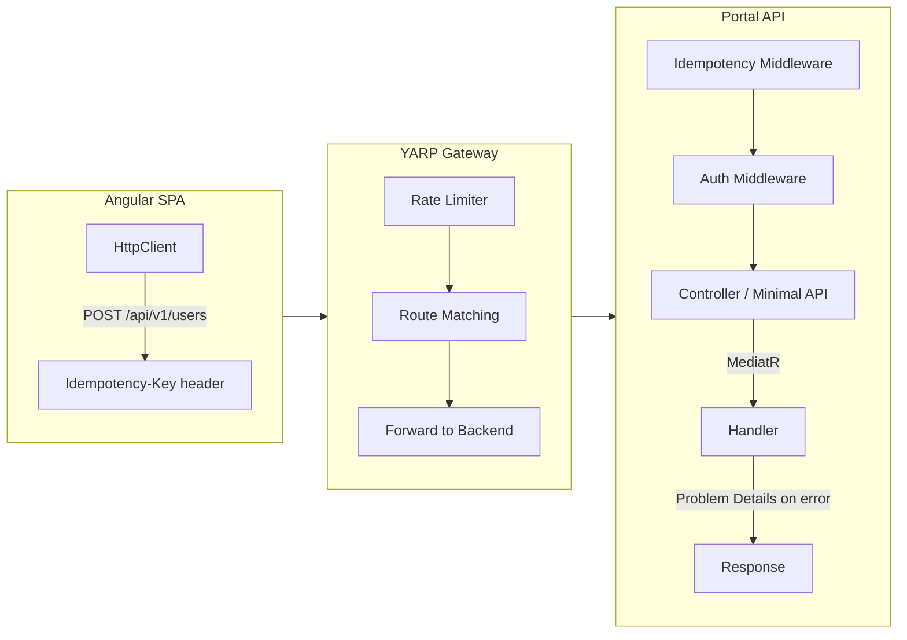

## Table of Contents

[🧠 **View Interactive Mindmap**](./api-design-mindmap.md)

1. [TL;DR](#tldr)
2. [Deep Dive](#deep-dive)
   2.1 [REST Principles](#concept-group-1-rest-principles)
      2.1.1 [Richardson Maturity Model](#1-richardson-maturity-model)
      2.1.2 [Resource Naming & HTTP Verbs](#2-resource-naming--http-verbs)
      2.1.3 [Status Codes — The Contract](#3-status-codes--the-contract)
   2.2 [API Lifecycle](#concept-group-2-api-lifecycle)
      2.2.1 [Versioning Strategies](#4-versioning-strategies)
      2.2.2 [OpenAPI / Swagger Documentation](#5-openapi--swagger-documentation)
      2.2.3 [Deprecation & Sunset Headers](#6-deprecation--sunset-headers)
   2.3 [Query Patterns](#concept-group-3-query-patterns)
      2.3.1 [Pagination — Offset vs Cursor/Keyset](#7-pagination--offset-vs-cursorkeyset)
      2.3.2 [Filtering, Sorting & Sparse Fieldsets](#8-filtering-sorting--sparse-fieldsets)
      2.3.3 [Bulk Operations](#9-bulk-operations)
   2.4 [Reliability & Contracts](#concept-group-4-reliability--contracts)
      2.4.1 [RFC 9457 Problem Details](#10-rfc-9457-problem-details)
      2.4.2 [Idempotency Keys](#11-idempotency-keys)
      2.4.3 [Rate Limiting & Content Negotiation](#12-rate-limiting--content-negotiation)
3. [Architecture & Data Flow](#architecture--data-flow)
4. [Real-World Examples](#real-world-examples)
   4.1 [Problem Details Error Response](#1-problem-details-error-response)
   4.2 [Paginated API Endpoint](#2-paginated-api-endpoint)
   4.3 [Idempotent POST with Idempotency-Key](#3-idempotent-post-with-idempotency-key)
5. [Comparison Tables](#comparison-tables)
6. [Interview Q&A](#interview-qa)
   6.1 [L1: Junior](#l1-junior-knowledge)
   6.2 [L2: Mid-Level](#l2-mid-level-knowledge)
   6.3 [L3: Senior](#l3-senior-knowledge)
   6.4 [Staff](#staff-system-architecture)
7. [Cross-References](#cross-references)
8. [Further Reading](#further-reading)

---

## TL;DR

REST API design is the contract between frontend and backend — get it wrong and every consumer suffers. In tai-portal, APIs follow <span style="color: #33b5e5; font-weight: bold;">Richardson Maturity Level 2</span> (proper HTTP verbs + status codes), use <span style="color: #33b5e5; font-weight: bold;">RFC 9457 Problem Details</span> for structured error responses, and implement <span style="color: #33b5e5; font-weight: bold;">keyset pagination</span> for efficient large-dataset queries. The thin controller pattern delegates immediately to MediatR — controllers map HTTP to CQRS, nothing more. <span style="color: #ffbb33; font-weight: bold;">The key trade-off</span>: REST's simplicity comes at the cost of over-fetching and under-fetching (solved by pagination, sparse fieldsets, or eventually GraphQL). For senior interviews, knowing when to break REST conventions (batch endpoints, RPC-style actions) matters as much as knowing the conventions.

---

## Deep Dive

### Concept Group 1: REST Principles

#### 1. Richardson Maturity Model

##### What
The <span style="color: #33b5e5; font-weight: bold;">Richardson Maturity Model</span> classifies REST APIs in 4 levels: **Level 0** (single endpoint, RPC over HTTP), **Level 1** (resources with unique URIs), **Level 2** (proper HTTP verbs + status codes), **Level 3** (HATEOAS — hypermedia controls in responses).

##### Why
Without understanding maturity levels, teams build Level 0 APIs (`POST /api` with action in the body) that are hard to cache, document, and evolve. Level 2 is the sweet spot for most enterprise APIs — it gives you proper caching (GET is cacheable), idempotency (PUT/DELETE are idempotent), and standard tooling (OpenAPI, Swagger UI).

##### How

| Level | Characteristic | tai-portal |
|-------|---------------|------------|
| **0** | One URI, one verb (POST everything) | Not used |
| **1** | Multiple URIs (resources), but only POST | Not used |
| **2** | Proper verbs (GET/POST/PUT/DELETE) + status codes | <span style="color: #00C851; font-weight: bold;">Current approach</span> |
| **3** | HATEOAS (links in responses for state transitions) | Not implemented — overkill for SPA |

##### When
Target Level 2 for internal APIs consumed by your own SPA. Consider Level 3 (HATEOAS) only for public APIs where clients discover capabilities at runtime. <span style="color: #ff4444; font-weight: bold;">Level 3 adds significant complexity</span> (link generation, media types) that SPAs don't need — the Angular app already knows all routes at build time.

##### Trade-offs
<span style="color: #ffbb33; font-weight: bold;">Level 2 APIs require clients to know the API structure upfront</span> — any endpoint change requires client updates. HATEOAS decouples this but adds payload overhead and client complexity. For SPAs backed by a known API, Level 2 is the pragmatic choice.

---

#### 2. Resource Naming & HTTP Verbs

##### What
REST resources are <span style="color: #33b5e5; font-weight: bold;">nouns, not verbs</span>: `/api/users` (not `/api/getUsers`). HTTP verbs define the action: GET (read), POST (create), PUT (full replace), PATCH (partial update), DELETE (remove).

##### Why
Consistent naming makes APIs predictable — a developer seeing `/api/tenants/{id}/users` immediately knows how to interact with it. Verb-based naming (`/api/createUser`, `/api/deleteUser`) reinvents HTTP semantics and breaks caching, CORS preflight, and API gateway routing rules.

##### How

```
tai-portal API routes (via ASP.NET Core Minimal APIs / Controllers):

GET    /api/users                     → GetUsersQuery (paginated list)
GET    /api/users/{id}                → GetUserByIdQuery
POST   /api/onboarding/register       → RegisterCustomerCommand
POST   /api/onboarding/verify         → VerifyOtpCommand
PUT    /api/users/{id}                → UpdateUserCommand (full replace)
PATCH  /api/users/{id}/status         → UpdateUserStatusCommand
DELETE /api/users/{id}                → DeactivateUserCommand

Nested resources for tenant-scoped data:
GET    /api/tenants/{tenantId}/users  → GetUsersByTenantQuery
```

**Naming conventions:**
- Plural nouns for collections: `/users`, `/tenants` (not `/user`, `/tenant`)
- Kebab-case for multi-word: `/api/onboarding/pending-approvals`
- Nest resources max 2 levels: `/tenants/{id}/users` (not `/tenants/{id}/users/{uid}/roles/{rid}`)
- Use query params for filtering: `/api/users?status=Active&role=Admin`

##### When
Follow REST naming for CRUD operations. For actions that don't map cleanly to CRUD (approve, suspend, resend OTP), use a sub-resource verb: `POST /api/users/{id}/approve`. This is a pragmatic Level 2 compromise — purists would argue for a `PATCH` on status, but an explicit action endpoint is clearer for non-trivial state transitions.

##### Trade-offs
<span style="color: #ffbb33; font-weight: bold;">Deeply nested resources create long URLs and rigid hierarchies.</span> If a user belongs to multiple tenants, `/tenants/{tid}/users/{uid}` implies a single-tenant relationship. Use flat routes with query filters when the hierarchy is ambiguous. <span style="color: #ff4444; font-weight: bold;">Overloading POST for everything</span> (because "the action doesn't fit GET/PUT/DELETE") loses HTTP semantics — differentiate between resource creation (POST) and actions (POST to sub-resource).

---

#### 3. Status Codes — The Contract

##### What
HTTP <span style="color: #33b5e5; font-weight: bold;">status codes</span> communicate the result category: 2xx (success), 3xx (redirect), 4xx (client error), 5xx (server error). Each code has specific semantics that clients depend on for behavior.

##### Why
Without consistent status codes, clients can't distinguish "your request was invalid" (400) from "you're not authorized" (403) from "the server crashed" (500). API gateways, retry logic, and monitoring all depend on correct status codes — Polly retries 5xx but not 4xx.

##### How

| Code | Meaning | tai-portal Usage |
|------|---------|-----------------|
| **200** | OK (GET succeeded, PUT updated) | All successful reads and updates |
| **201** | Created (POST created a resource) | `POST /api/onboarding/register` |
| **204** | No Content (DELETE succeeded) | Successful deletions |
| **400** | Bad Request (validation failed) | FluentValidation errors via Problem Details |
| **401** | Unauthorized (no valid credentials) | Missing/expired Bearer token |
| **403** | Forbidden (valid credentials, insufficient permissions) | Wrong role for the endpoint |
| **404** | Not Found | Resource doesn't exist (or tenant isolation hides it) |
| **409** | Conflict (business rule violation) | Duplicate email, invalid state transition |
| **422** | Unprocessable Entity (semantic error) | Valid JSON but violates domain rules |
| **429** | Too Many Requests | Rate limit exceeded (with Retry-After header) |
| **500** | Internal Server Error | Unhandled exceptions |
| **502/503** | Bad Gateway / Service Unavailable | Upstream service down (from YARP) |

##### When
Use **400** for syntactic/structural errors (malformed JSON, missing required field). Use **422** for semantic errors (valid JSON but business rule violation). Use **409** for state conflicts (optimistic concurrency failure, duplicate creation). <span style="color: #ff4444; font-weight: bold;">Never return 200 with an error in the body</span> — this breaks every HTTP-aware tool (caches, proxies, retry policies, monitoring).

##### Trade-offs
<span style="color: #ffbb33; font-weight: bold;">The 400 vs 422 distinction is debated</span> — many APIs use 400 for all input errors. tai-portal uses 400 for structural validation (FluentValidation) and 409 for domain conflicts. The important thing is consistency within your API, documented in OpenAPI.

---

### Concept Group 2: API Lifecycle

#### 4. Versioning Strategies

##### What
<span style="color: #33b5e5; font-weight: bold;">API versioning</span> allows breaking changes without disrupting existing clients. Three strategies: URL path (`/api/v2/users`), header (`Api-Version: 2`), and media type (`Accept: application/vnd.portal.v2+json`).

##### Why
Without versioning, any breaking change (removing a field, changing a type) breaks all clients simultaneously. Versioning lets you evolve the API while giving clients time to migrate.

##### How

| Strategy | Example | Pros | Cons |
|----------|---------|------|------|
| **URL path** | `/api/v2/users` | Simple, visible, cacheable | Duplicates routes, breaks HATEOAS |
| **Header** | `Api-Version: 2` | Clean URLs, flexible | Invisible in browser, harder to test |
| **Media type** | `Accept: application/vnd.portal.v2+json` | Most RESTful | Complex, poor tooling support |

```csharp
// ASP.NET Core API versioning (URL path strategy)
builder.Services.AddApiVersioning(options => {
    options.DefaultApiVersion = new ApiVersion(1, 0);
    options.AssumeDefaultVersionWhenUnspecified = true;
    options.ReportApiVersions = true;  // Response header: api-supported-versions
})
.AddApiExplorer(options => {
    options.GroupNameFormat = "'v'VVV";
    options.SubstituteApiVersionInUrl = true;
});

[ApiVersion("1.0")]
[Route("api/v{version:apiVersion}/users")]
public class UsersController : ControllerBase { }
```

##### When
<span style="color: #00C851; font-weight: bold;">URL path versioning for internal APIs</span> — it's the simplest to implement, test, and document. Header versioning for public APIs where URL aesthetics matter. Media type versioning is rarely worth the complexity.

##### Trade-offs
<span style="color: #ffbb33; font-weight: bold;">Maintaining multiple API versions is expensive</span> — each version needs testing, documentation, and bug fixes. Minimize breaking changes by adding fields (non-breaking), using nullable types, and deprecating rather than removing. <span style="color: #ff4444; font-weight: bold;">More than 2 active versions is a maintenance burden</span> — sunset old versions aggressively.

---

#### 5. OpenAPI / Swagger Documentation

##### What
<span style="color: #33b5e5; font-weight: bold;">OpenAPI</span> (formerly Swagger) is the standard specification for REST API documentation. ASP.NET Core generates OpenAPI specs from controller metadata, which powers Swagger UI, client SDK generation, and API testing tools.

##### Why
Without API documentation, frontend developers read C# source code to understand request/response shapes. OpenAPI provides a single source of truth that auto-generates interactive docs (Swagger UI), TypeScript client code (via `openapi-generator`), and Postman collections.

##### How

```csharp
// ASP.NET Core 10 — built-in OpenAPI support
builder.Services.AddOpenApi(options => {
    options.AddDocumentTransformer((doc, ctx, ct) => {
        doc.Info.Title = "tai-portal API";
        doc.Info.Version = "v1";
        return Task.CompletedTask;
    });
});

// Endpoint metadata enriches the spec
app.MapPost("/api/onboarding/register", async (RegisterCommand cmd, ISender sender) => {
    var result = await sender.Send(cmd);
    return Results.Created($"/api/users/{result.UserId}", result);
})
.WithName("RegisterCustomer")
.WithTags("Onboarding")
.Produces<RegisterResponse>(StatusCodes.Status201Created)
.ProducesValidationProblem()
.WithOpenApi();
```

##### When
Generate OpenAPI for all public and internal APIs. Use `Produces<T>()` and `ProducesProblem()` to document all possible response types. Generate TypeScript clients for the Angular app to ensure type safety across the stack.

##### Trade-offs
<span style="color: #ffbb33; font-weight: bold;">Auto-generated docs can be misleading</span> — they show what the code declares, not what it actually does. Supplement with examples and descriptions. <span style="color: #ff4444; font-weight: bold;">Generated client SDKs can be bloated</span> — for internal SPAs, hand-crafted Angular services with `HttpClient` are often simpler than generated clients.

---

#### 6. Deprecation & Sunset Headers

##### What
<span style="color: #33b5e5; font-weight: bold;">Deprecation</span> signals that an endpoint will be removed. The `Sunset` header (RFC 8594) provides the date. The `Deprecation` header (draft RFC) marks the endpoint as deprecated.

##### Why
Without deprecation signals, removing an endpoint breaks clients without warning. Sunset headers let API consumers automate migration reminders and monitoring.

##### How

```csharp
// Custom middleware to add Sunset header to deprecated endpoints
app.MapGet("/api/v1/users", handler)
    .WithMetadata(new DeprecatedAttribute())
    .AddEndpointFilter(async (ctx, next) => {
        ctx.HttpContext.Response.Headers.Append("Sunset", "Sat, 01 Jul 2026 00:00:00 GMT");
        ctx.HttpContext.Response.Headers.Append("Deprecation", "true");
        ctx.HttpContext.Response.Headers.Append("Link",
            "</api/v2/users>; rel=\"successor-version\"");
        return await next(ctx);
    });
```

##### When
Add Sunset headers at least 3 months before removing an endpoint. Monitor usage of deprecated endpoints — if traffic is zero, remove earlier. If a major client depends on it, extend the sunset.

##### Trade-offs
<span style="color: #ffbb33; font-weight: bold;">Sunset headers are only useful if consumers read them.</span> For internal APIs, deprecation warnings in Swagger UI and build-time warnings in generated clients are more effective.

---

### Concept Group 3: Query Patterns

#### 7. Pagination — Offset vs Cursor/Keyset

##### What
<span style="color: #33b5e5; font-weight: bold;">Offset pagination</span>: `?page=3&pageSize=20` → `OFFSET 40 LIMIT 20`. <span style="color: #33b5e5; font-weight: bold;">Cursor/keyset pagination</span>: `?after=lastId&pageSize=20` → `WHERE id > lastId ORDER BY id LIMIT 20`.

##### Why
Offset pagination is simple but <span style="color: #ff4444; font-weight: bold;">degrades at scale</span> — `OFFSET 100000` scans and discards 100,000 rows. Keyset pagination uses an index seek and is O(1) regardless of page depth.

##### How

```csharp
// Offset pagination (tai-portal current approach for admin tables)
var users = await _context.Users
    .OrderBy(u => u.CreatedAt)
    .Skip((query.PageNumber - 1) * query.PageSize)
    .Take(query.PageSize)
    .ToListAsync(ct);

// Keyset pagination (for large datasets / infinite scroll)
var users = await _context.Users
    .Where(u => u.CreatedAt > query.AfterCursor)
    .OrderBy(u => u.CreatedAt)
    .Take(query.PageSize + 1)  // Fetch one extra to determine hasNext
    .ToListAsync(ct);

var hasNext = users.Count > query.PageSize;
if (hasNext) users.RemoveAt(users.Count - 1);
var nextCursor = users.LastOrDefault()?.CreatedAt;
```

Response envelope:
```json
{
  "items": [...],
  "pageInfo": {
    "totalCount": 1500,
    "pageNumber": 3,
    "pageSize": 20,
    "hasNextPage": true
  }
}
```

##### When
Use **offset** for admin tables with page number navigation (users expect "page 3 of 75"). Use **keyset** for infinite scroll, large datasets (>10K rows), or real-time feeds where new data shifts offsets. tai-portal uses offset pagination for admin dashboards and plans keyset for audit log queries.

##### Trade-offs
<span style="color: #ffbb33; font-weight: bold;">Keyset pagination can't jump to arbitrary pages</span> — you can only go forward/backward from a cursor. <span style="color: #ffbb33; font-weight: bold;">Offset provides total count</span> (useful for "page X of Y") but requires an extra `COUNT(*)` query. <span style="color: #ff4444; font-weight: bold;">Offset with concurrent inserts causes duplicate/missing rows</span> — a new row on page 2 pushes everything forward, so page 3 repeats a row from page 2.

---

#### 8. Filtering, Sorting & Sparse Fieldsets

##### What
<span style="color: #33b5e5; font-weight: bold;">Filtering</span> narrows results: `?status=Active&role=Admin`. <span style="color: #33b5e5; font-weight: bold;">Sorting</span> orders results: `?sort=createdAt:desc`. <span style="color: #33b5e5; font-weight: bold;">Sparse fieldsets</span> reduce payload: `?fields=id,email,status`.

##### Why
Without these patterns, the API returns all data in a fixed order — forcing the client to fetch everything and filter/sort in memory. This wastes bandwidth, increases latency, and makes the API inflexible.

##### How

```csharp
// Query object with filtering + sorting (via MediatR)
public record GetUsersQuery(
    TenantId TenantId,
    int PageNumber = 1,
    int PageSize = 20,
    string? StatusFilter = null,
    string? RoleFilter = null,
    string? SortBy = "createdAt",
    string? SortDir = "desc"
) : IRequest<PaginatedResult<UserDto>>;

// Handler applies filters dynamically
var query = _context.Users.AsQueryable();

if (request.StatusFilter is not null)
    query = query.Where(u => u.Status == Enum.Parse<UserStatus>(request.StatusFilter));

query = request.SortBy?.ToLower() switch {
    "email" => request.SortDir == "desc" ? query.OrderByDescending(u => u.Email)
                                          : query.OrderBy(u => u.Email),
    "status" => request.SortDir == "desc" ? query.OrderByDescending(u => u.Status)
                                           : query.OrderBy(u => u.Status),
    _ => query.OrderByDescending(u => u.CreatedAt)  // Default sort
};
```

##### When
Support filtering and sorting for list endpoints. Whitelist allowed filter/sort fields — <span style="color: #ff4444; font-weight: bold;">never pass raw user input into `OrderBy` expressions</span> (SQL injection via dynamic LINQ). Sparse fieldsets are worth implementing for APIs with large payloads or mobile clients.

##### Trade-offs
<span style="color: #ffbb33; font-weight: bold;">Dynamic filtering adds query complexity</span> — each filter combination needs an appropriate database index. Without indexes, a filter on `status` triggers a sequential scan. <span style="color: #ffbb33; font-weight: bold;">Sparse fieldsets prevent EF Core's query optimization</span> — `Select(u => new { u.Id, u.Email })` generates minimal SQL, but dynamic field selection requires reflection or Expression trees.

---

#### 9. Bulk Operations

##### What
<span style="color: #33b5e5; font-weight: bold;">Bulk operations</span> perform actions on multiple resources in a single request: `POST /api/users/bulk-approve` with a body containing an array of user IDs.

##### Why
Without bulk endpoints, approving 50 users requires 50 individual API calls — slow, network-heavy, and hard to make transactional. Bulk operations reduce round trips and enable atomic batch processing.

##### How

```csharp
// Bulk approve endpoint
app.MapPost("/api/users/bulk-approve", async (BulkApproveCommand cmd, ISender sender) => {
    var result = await sender.Send(cmd);
    return Results.Ok(new {
        succeeded = result.Succeeded.Count,
        failed = result.Failed.Select(f => new { f.UserId, f.Reason })
    });
})
.Produces<BulkApproveResponse>(200)
.ProducesValidationProblem();

// Response reports per-item results
{
  "succeeded": 48,
  "failed": [
    { "userId": "abc", "reason": "User is not in PendingApproval state" },
    { "userId": "def", "reason": "User not found" }
  ]
}
```

##### When
Add bulk endpoints when the UI supports multi-select operations (bulk approve, bulk deactivate). Limit batch size (max 100 items) to prevent timeouts. Return per-item results so the client knows which items failed.

##### Trade-offs
<span style="color: #ffbb33; font-weight: bold;">Bulk operations complicate error handling</span> — should the entire batch fail if one item fails (atomic), or should it succeed partially (best-effort)? tai-portal uses best-effort with per-item error reporting. <span style="color: #ff4444; font-weight: bold;">Large batches can cause long-running transactions</span> — chunk into batches of 50 and process sequentially.

---

### Concept Group 4: Reliability & Contracts

#### 10. RFC 9457 Problem Details

##### What
<span style="color: #33b5e5; font-weight: bold;">RFC 9457 Problem Details</span> (`application/problem+json`) is the standard format for API error responses. It provides structured fields: `type` (error category URI), `title` (human-readable summary), `status` (HTTP status code), `detail` (specific message), and `instance` (request identifier).

##### Why
Without standardized error responses, each endpoint invents its own error format — `{ "error": "..." }`, `{ "message": "..." }`, `{ "errors": [...] }`. Clients need custom parsing for every endpoint. Problem Details gives one format that all consumers can handle.

##### How

```csharp
// ASP.NET Core — automatic Problem Details for validation errors
builder.Services.AddProblemDetails(options => {
    options.CustomizeProblemDetails = context => {
        context.ProblemDetails.Extensions["traceId"] =
            Activity.Current?.Id ?? context.HttpContext.TraceIdentifier;
    };
});

// Explicit Problem Details in exception middleware
app.UseExceptionHandler(appBuilder => {
    appBuilder.Run(async context => {
        var problem = new ProblemDetails {
            Type = "https://portal.tai.com/errors/validation",
            Title = "Validation Error",
            Status = 400,
            Detail = "One or more fields failed validation",
            Instance = context.Request.Path,
            Extensions = { ["errors"] = validationErrors }
        };
        context.Response.StatusCode = 400;
        context.Response.ContentType = "application/problem+json";
        await context.Response.WriteAsJsonAsync(problem);
    });
});
```

Response example:
```json
{
  "type": "https://portal.tai.com/errors/validation",
  "title": "Validation Error",
  "status": 400,
  "detail": "Email is required",
  "instance": "/api/onboarding/register",
  "traceId": "00-abc123-def456-01",
  "errors": {
    "email": ["Email is required"],
    "password": ["Password must be at least 8 characters"]
  }
}
```

##### When
<span style="color: #00C851; font-weight: bold;">Use Problem Details for all 4xx and 5xx responses.</span> ASP.NET Core 10 supports this natively with `builder.Services.AddProblemDetails()`. Map FluentValidation failures to the `errors` extension field. Include `traceId` for correlating with server logs.

##### Trade-offs
<span style="color: #ffbb33; font-weight: bold;">Problem Details adds payload size</span> — a simple "Not Found" becomes 150 bytes instead of 0. The trade-off is worth it for debuggability. <span style="color: #ff4444; font-weight: bold;">Don't leak internal details in production</span> — `detail` should be user-friendly, not a stack trace. Include stack traces only in development mode.

---

#### 11. Idempotency Keys

##### What
An <span style="color: #33b5e5; font-weight: bold;">idempotency key</span> is a client-generated unique identifier (`Idempotency-Key` header) that ensures a POST request produces the same result whether sent once or multiple times.

##### Why
Without idempotency keys, network retries can create duplicate resources. If the client sends `POST /api/onboarding/register`, the server creates the user and responds — but the response is lost in transit. The client retries, creating a second user. An idempotency key lets the server recognize the retry and return the original response.

##### How

```csharp
// Middleware checks for existing result before processing
public class IdempotencyMiddleware {
    public async Task InvokeAsync(HttpContext context, IIdempotencyStore store) {
        if (context.Request.Method != "POST") { await _next(context); return; }

        var key = context.Request.Headers["Idempotency-Key"].FirstOrDefault();
        if (key is null) { await _next(context); return; }

        var cached = await store.GetAsync(key);
        if (cached is not null) {
            // Return cached response — same status code, headers, body
            context.Response.StatusCode = cached.StatusCode;
            await context.Response.WriteAsync(cached.Body);
            return;
        }

        // Process normally, cache the response
        var response = await CaptureResponse(context);
        await store.SetAsync(key, response, TimeSpan.FromHours(24));
    }
}
```

Angular client:
```typescript
register(cmd: RegisterCommand): Observable<RegisterResponse> {
    const idempotencyKey = crypto.randomUUID();
    return this.http.post<RegisterResponse>('/api/onboarding/register', cmd, {
        headers: { 'Idempotency-Key': idempotencyKey }
    });
}
```

##### When
Use idempotency keys for all non-idempotent operations (POST that creates resources, POST that triggers side effects). Don't use them for naturally idempotent operations (PUT, DELETE — these are idempotent by definition).

##### Trade-offs
<span style="color: #ffbb33; font-weight: bold;">Idempotency keys require server-side storage</span> (Redis or database table) with a TTL. Set the TTL long enough for retries (24 hours) but not forever. <span style="color: #ff4444; font-weight: bold;">Race condition</span>: two simultaneous requests with the same key — use a distributed lock or database constraint to ensure only one is processed.

---

#### 12. Rate Limiting & Content Negotiation

##### What
<span style="color: #33b5e5; font-weight: bold;">Rate limiting</span> restricts the number of requests per client per time window. <span style="color: #33b5e5; font-weight: bold;">Content negotiation</span> lets the client specify the desired response format via the `Accept` header.

##### Why
Without rate limiting, a misbehaving client (or attacker) floods the API, degrading performance for all tenants. Rate limiting enforces fair usage. Content negotiation enables the same endpoint to serve JSON, XML, or other formats as needed.

##### How

```csharp
// ASP.NET Core rate limiting (built-in)
builder.Services.AddRateLimiter(options => {
    // Per-tenant rate limit: 100 requests per minute
    options.AddPolicy("per-tenant", ctx => {
        var tenantId = ctx.Connection.RemoteIpAddress?.ToString() ?? "unknown";
        return RateLimitPartition.GetFixedWindowLimiter(tenantId,
            _ => new FixedWindowRateLimiterOptions {
                PermitLimit = 100,
                Window = TimeSpan.FromMinutes(1),
                QueueLimit = 10
            });
    });
    options.RejectionStatusCode = StatusCodes.Status429TooManyRequests;
});

// Response headers
// X-RateLimit-Limit: 100
// X-RateLimit-Remaining: 42
// X-RateLimit-Reset: 1712764800
// Retry-After: 30  (when 429)
```

##### When
Apply rate limiting at the API gateway level (YARP) for global limits and per-endpoint for expensive operations. Use fixed window for simplicity, sliding window for smoother enforcement, token bucket for burst tolerance.

##### Trade-offs
<span style="color: #ffbb33; font-weight: bold;">Fixed window allows burst at window boundaries</span> — 100 requests in the last second of window 1, then 100 in the first second of window 2 = 200 in 2 seconds. Sliding window prevents this but uses more memory. <span style="color: #ffbb33; font-weight: bold;">Per-tenant rate limiting requires tenant identification early in the pipeline</span> — before authentication in some cases (to limit unauthenticated requests).

---

### Architecture & Data Flow



---

## Real-World Examples

### 1. Problem Details Error Response

📍 From tai-portal: FluentValidation errors are automatically mapped to Problem Details format.

```json
// POST /api/onboarding/register with invalid email
// Response: 400 Bad Request
{
  "type": "https://tools.ietf.org/html/rfc9110#section-15.5.1",
  "title": "One or more validation errors occurred.",
  "status": 400,
  "instance": "/api/onboarding/register",
  "traceId": "00-a1b2c3d4-e5f6a7b8-01",
  "errors": {
    "Email": ["'Email' is not a valid email address."],
    "Password": ["'Password' must be at least 8 characters."]
  }
}
```

---

### 2. Paginated API Endpoint

📍 From tai-portal: `GET /api/users` returns paginated results via offset pagination.

```csharp
// Controller
[HttpGet]
public async Task<ActionResult<PaginatedResult<UserDto>>> GetUsers(
    [FromQuery] int page = 1,
    [FromQuery] int pageSize = 20,
    [FromQuery] string? status = null,
    [FromQuery] string? sort = "createdAt:desc") {
    var tenantId = _tenantService.GetCurrentTenantId();
    var result = await _sender.Send(new GetUsersQuery(tenantId, page, pageSize, status, sort));
    return Ok(result);
}
```

---

### 3. Idempotent POST with Idempotency-Key

🔧 Fits tai-portal: Registration endpoint uses idempotency key to prevent duplicate user creation on retry.

```typescript
// Angular service
register(cmd: RegisterCommand): Observable<RegisterResponse> {
    return this.http.post<RegisterResponse>('/api/onboarding/register', cmd, {
        headers: { 'Idempotency-Key': crypto.randomUUID() }
    });
}

// Server: second request with same key returns cached 201 response
```

---

## Comparison Tables

### Pagination Strategies

| Dimension | **Offset** | **Cursor/Keyset** |
|-----------|-----------|-------------------|
| **URL** | `?page=3&pageSize=20` | `?after=abc123&limit=20` |
| **DB query** | `OFFSET 40 LIMIT 20` | `WHERE id > 'abc123' LIMIT 20` |
| **Performance** | <span style="color: #ff4444; font-weight: bold;">Degrades at high offsets</span> | <span style="color: #00C851; font-weight: bold;">Constant O(1) seeks</span> |
| **Random access** | <span style="color: #00C851; font-weight: bold;">Jump to any page</span> | Forward/backward only |
| **Concurrent changes** | Duplicates/gaps possible | Stable cursor |
| **Total count** | Available (extra query) | Not available |
| **tai-portal use** | Admin user table | Audit log queries (planned) |

### Error Response Formats

| Dimension | **Custom JSON** | **RFC 9457 Problem Details** |
|-----------|----------------|-------------------------------|
| **Standardized** | No — varies per endpoint | <span style="color: #00C851; font-weight: bold;">Yes — industry standard</span> |
| **Tooling support** | Manual parsing | Built-in ASP.NET Core, OpenAPI |
| **Machine-readable type** | Ad hoc | URI-based `type` field |
| **Trace correlation** | Manual | `traceId` extension |
| **Validation errors** | Varies | `errors` extension (standard) |

---

## Interview Q&A

### L1: Junior Knowledge

#### L1: What are the main HTTP methods and when do you use each?
**Difficulty:** L1 (Junior)

**Question:** Name the 5 main HTTP methods and when to use each.

**Answer:** <span style="color: #33b5e5; font-weight: bold;">GET</span> reads a resource (safe, cacheable). <span style="color: #33b5e5; font-weight: bold;">POST</span> creates a new resource (not idempotent). <span style="color: #33b5e5; font-weight: bold;">PUT</span> replaces a resource entirely (idempotent). <span style="color: #33b5e5; font-weight: bold;">PATCH</span> partially updates a resource. <span style="color: #33b5e5; font-weight: bold;">DELETE</span> removes a resource (idempotent). GET and HEAD are safe (no side effects); PUT, DELETE are idempotent (same result on repeat).

---

### L2: Mid-Level Knowledge

#### L2: Offset vs Cursor Pagination
**Difficulty:** L2 (Mid-Level)

**Question:** Compare offset and cursor/keyset pagination. When would you choose each?

**Answer:** <span style="color: #33b5e5; font-weight: bold;">Offset pagination</span> (`OFFSET 40 LIMIT 20`) supports jumping to any page but <span style="color: #ff4444; font-weight: bold;">degrades at scale</span> — the database scans and discards all offset rows. <span style="color: #33b5e5; font-weight: bold;">Keyset pagination</span> (`WHERE id > lastId LIMIT 20`) uses an index seek (O(1)) but only supports forward/backward navigation. Use offset for admin tables where users expect "page 3 of 75" and datasets are small. Use keyset for infinite scroll, large datasets (>10K rows), or real-time feeds where concurrent inserts cause offset drift.

---

### L3: Senior Knowledge

#### L3: Designing Consistent Error Responses
**Difficulty:** L3 (Senior)

**Question:** How do you design a consistent error response strategy across a multi-service system?

**Answer:** Adopt <span style="color: #33b5e5; font-weight: bold;">RFC 9457 Problem Details</span> as the standard error format across all services. In ASP.NET Core, enable `AddProblemDetails()` to automatically convert validation errors, unhandled exceptions, and status code pages to Problem Details format. Map FluentValidation failures to the `errors` extension field. Include a `traceId` (from `Activity.Current`) for correlation with distributed tracing.

<span style="color: #00C851; font-weight: bold;">The gateway must also return Problem Details</span> — when YARP can't reach a backend, return a 502/503 in Problem Details format, not a raw error page. This ensures the Angular app has one error parsing path regardless of which service failed. <span style="color: #ff4444; font-weight: bold;">Never leak internal details in production</span> — exception messages and stack traces go to logs (via `traceId` correlation), not to the client.

---

### Staff: System Architecture

#### Staff: Evolving an API Without Breaking Clients
**Difficulty:** Staff

**Question:** Your API has 50+ endpoints consumed by a web SPA, mobile app, and 3 third-party integrations. How do you evolve the API without breaking existing consumers?

**Answer:** Layer the evolution strategy:

1. **Additive changes are non-breaking** — new fields, new endpoints, new optional query params. These require no versioning. Document them in the changelog and OpenAPI spec.

2. **Breaking changes require versioning** — removing fields, changing types, renaming endpoints. Use URL path versioning (`/api/v2/users`) for simplicity. Support max 2 active versions — v1 (deprecated, Sunset header) and v2 (current).

3. **Deprecation workflow** — Add `Sunset: <date>` and `Link: </api/v2/users>; rel="successor-version"` headers to v1 endpoints. Monitor v1 traffic — when it drops to zero (or the sunset date arrives), remove it. For third-party integrations, provide 6 months notice; for internal SPA/mobile, coordinate with release cycles.

4. **Contract testing** — Use Pact or similar consumer-driven contract testing to verify that API changes don't break any consumer's expectations. The Angular app and mobile app each define their contract (which fields they read), and CI fails if the API removes a field that a consumer depends on.

<span style="color: #ff4444; font-weight: bold;">Anti-pattern</span>: creating a new version for every change. Most "breaking" changes can be made non-breaking with nullable fields, default values, or additive response envelopes.

---

## Cross-References

- [[System-Design]] — YARP gateway handles routing, rate limiting, and error responses at the edge. Middleware pipeline order affects API behavior.
- [[MediatR-CQRS]] — Thin controllers map HTTP to MediatR commands/queries. FluentValidation Pipeline Behavior generates Problem Details.
- [[Authentication-Authorization]] — Bearer tokens, DPoP, and RBAC policies applied at the API layer. 401 vs 403 status code semantics.
- [[Distributed-Systems]] — Idempotency keys prevent duplicate operations. Retry strategies depend on correct status codes (retry 5xx, not 4xx).
- [[EFCore-SQL]] — Pagination queries, dynamic filtering, and sorting translate to EF Core LINQ expressions.

---

## Further Reading

- [RFC 9457 — Problem Details for HTTP APIs](https://www.rfc-editor.org/rfc/rfc9457)
- [RFC 8594 — The Sunset HTTP Header](https://www.rfc-editor.org/rfc/rfc8594)
- [Microsoft API Design Guidelines](https://learn.microsoft.com/en-us/azure/architecture/best-practices/api-design)
- [ASP.NET Core OpenAPI](https://learn.microsoft.com/en-us/aspnet/core/fundamentals/openapi/overview)
- [Richardson Maturity Model (Martin Fowler)](https://martinfowler.com/articles/richardsonMaturityModel.html)

---

*Last updated: 2026-04-10*
