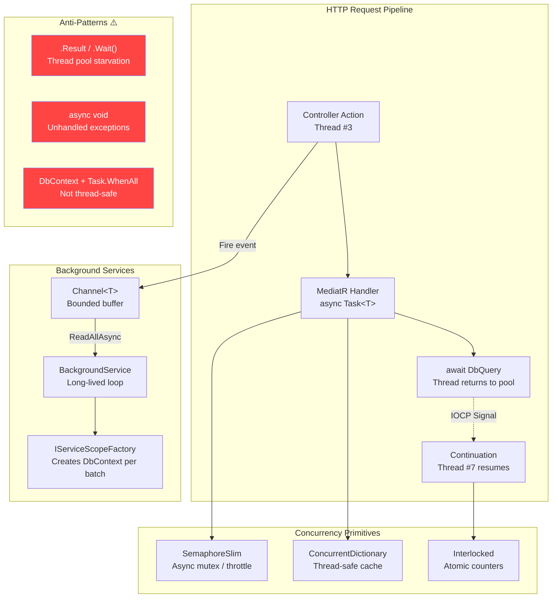
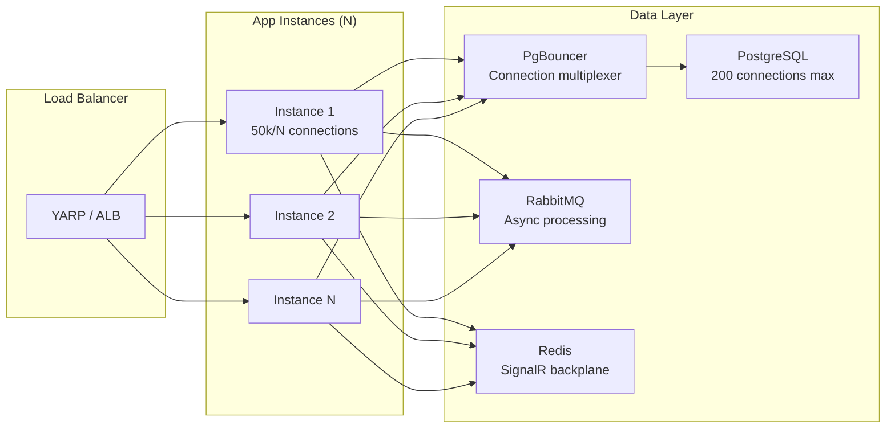

[🧠 **View Interactive Mindmap**](./async-concurrency-mindmap.md)

1. **Async Fundamentals**
   - 1.1 [The Thread Pool & Why Async Exists](#the-thread-pool--why-async-exists)
   - 1.2 [Task vs ValueTask vs void](#task-vs-valuetask-vs-void)
   - 1.3 [SynchronizationContext & ConfigureAwait](#synchronizationcontext--configureawait)
   - 1.4 [CancellationToken — Cooperative Cancellation](#cancellationtoken--cooperative-cancellation)
   - 1.5 [IAsyncEnumerable — Streaming Async](#iasyncenumerable--streaming-async)

2. **Concurrency Primitives**
   - 2.1 [SemaphoreSlim — Async-Friendly Locking](#semaphoreslim--async-friendly-locking)
   - 2.2 [lock & Monitor — CPU-Bound Mutual Exclusion](#lock--monitor--cpu-bound-mutual-exclusion)
   - 2.3 [ConcurrentDictionary & Thread-Safe Collections](#concurrentdictionary--thread-safe-collections)
   - 2.4 [Interlocked — Atomic Operations](#interlocked--atomic-operations)
   - 2.5 [Channel&lt;T&gt; — Producer-Consumer Pipeline](#channelt--producer-consumer-pipeline)

3. **Parallelism Patterns**
   - 3.1 [Task.WhenAll — Concurrent I/O Fan-Out](#taskwhenall--concurrent-io-fan-out)
   - 3.2 [Parallel.ForEachAsync — Bounded Parallelism](#parallelforeachasync--bounded-parallelism)
   - 3.3 [Task.Run — Offloading CPU Work](#taskrun--offloading-cpu-work)

4. **ASP.NET Core Threading Model**
   - 4.1 [One Request, One Thread (Until Await)](#one-request-one-thread-until-await)
   - 4.2 [BackgroundService & IHostedService](#backgroundservice--ihostedservice)
   - 4.3 [DbContext Is Not Thread-Safe](#dbcontext-is-not-thread-safe)

5. **Deadly Anti-Patterns**
   - 5.1 [Sync-over-Async (.Result / .Wait())](#sync-over-async-result--wait)
   - 5.2 [Async Void — Fire-and-Forget Disasters](#async-void--fire-and-forget-disasters)
   - 5.3 [Captured Variables in Closures](#captured-variables-in-closures)

6. **Knowledge Deep Dive & Q&A**
   - 6.1 **L1: Junior Knowledge**
     - 6.1.1 [What Is async/await?](#l1-what-is-asyncawait)
     - 6.1.2 [Why Not Block the Thread?](#l1-why-not-block-the-thread)
   - 6.2 **L2: Mid-Level Knowledge**
     - 6.2.1 [Task vs ValueTask](#l2-task-vs-valuetask)
     - 6.2.2 [When to Use SemaphoreSlim vs lock](#l2-when-to-use-semaphoreslim-vs-lock)
     - 6.2.3 [CancellationToken Best Practices](#l2-cancellationtoken-best-practices)
   - 6.3 **L3: Senior Knowledge**
     - 6.3.1 [Designing a Rate-Limited Pipeline](#l3-designing-a-rate-limited-pipeline)
     - 6.3.2 [Thread Safety in Singleton Services](#l3-thread-safety-in-singleton-services)
     - 6.3.3 [BackgroundService Graceful Shutdown](#l3-backgroundservice-graceful-shutdown)
   - 6.4 **Staff: System Architecture**
     - 6.4.1 [Scaling Async I/O Beyond One Process](#staff-scaling-async-io-beyond-one-process)

---

## TL;DR

Modern .NET uses <span style="color: #00C851; font-weight: bold;">async/await</span> to multiplex thousands of concurrent I/O operations onto a small thread pool — the runtime yields threads during `await` and reuses them for other requests. In 2026, the critical interview skill is distinguishing <span style="color: #33b5e5; font-weight: bold;">concurrency</span> (interleaving logical tasks on shared threads) from <span style="color: #33b5e5; font-weight: bold;">parallelism</span> (executing CPU work across multiple cores). <span style="color: #ff4444; font-weight: bold;">Sync-over-async</span> (`.Result`, `.Wait()`) is the #1 cause of thread pool starvation in production ASP.NET Core apps. Key primitives: `SemaphoreSlim` for async-friendly locking, `Channel<T>` for producer-consumer pipelines, `Task.WhenAll` for I/O fan-out, and `CancellationToken` for cooperative cancellation. tai-portal uses `Task.WhenAll` in its `ValidationPipelineBehavior` and `SemaphoreSlim` for database reset serialization.

---

## Deep Dive

### Concept Group 1: Async Fundamentals

#### The Thread Pool & Why Async Exists

##### What
The .NET <span style="color: #33b5e5; font-weight: bold;">ThreadPool</span> maintains a finite set of worker threads (default: `Environment.ProcessorCount` threads initially, scaling up slowly). `async/await` allows a thread to be returned to the pool during I/O waits, enabling thousands of concurrent operations on a small number of threads.

##### Why
Without async, a web server with 100 concurrent requests blocks 100 threads waiting on database queries (~5ms each). The ThreadPool grows slowly (1-2 threads/second) and caps at ~1000. At 1001 concurrent requests, new requests queue — <span style="color: #ff4444; font-weight: bold;">thread pool starvation</span> manifests as cascading latency spikes.

##### How
```csharp
// ASP.NET Core request pipeline — thread lifecycle
public async Task<IActionResult> GetUsers() {
    // Thread #7 handles this request
    var users = await _dbContext.Users.ToListAsync(); // Thread #7 returns to pool
    // Thread #12 (any available thread) picks up the continuation
    return Ok(users);
}
```

The key insight: between the `await` and the continuation, **no thread is consumed**. The I/O completion port (IOCP) signals the ThreadPool when the database responds, and any available thread resumes execution.

```
Thread Pool (4 threads):
┌─────────┬─────────┬─────────┬─────────┐
│Thread #1│Thread #2│Thread #3│Thread #4│
└────┬────┴────┬────┴────┬────┴────┬────┘
     │         │         │         │
     ▼         ▼         ▼         ▼
  Req A     Req B     Req C     Req D
  await DB  await DB  await DB  await DB
     │         │         │         │
     ▼         ▼         ▼         ▼
  (returned) (returned) (returned) (returned)
     │
     ▼
  Req E ← Thread #1 now serves Req E while A-D wait on I/O
```

##### When
Use async for **all I/O-bound operations**: database queries, HTTP calls, file I/O, message queue publish. Do **not** use async for CPU-bound computation — use `Task.Run()` to offload to the ThreadPool explicitly.

##### Trade-offs
Each `async` method allocates a state machine struct (~100 bytes, heap-allocated if the method suspends). For hot paths that usually complete synchronously, this overhead adds up. <span style="color: #ffbb33; font-weight: bold;">Measure before optimizing</span> — premature `ValueTask` usage introduces its own restrictions.

---

#### Task vs ValueTask vs void

##### What
- <span style="color: #33b5e5; font-weight: bold;">`Task<T>`</span> — Heap-allocated promise. The standard return type for async methods.
- <span style="color: #33b5e5; font-weight: bold;">`ValueTask<T>`</span> — A discriminated union: either a `T` (sync completion, zero allocation) or a wrapped `Task<T>` (async path). Optimizes methods that frequently complete synchronously.
- <span style="color: #ff4444; font-weight: bold;">`async void`</span> — Fire-and-forget. Cannot be awaited, exceptions crash the process. Only valid for event handlers.

##### Why
`Task<T>` allocates on every call. In a method called 50,000 times/second where 95% complete synchronously (cache hits), that's ~5MB/sec of garbage. `ValueTask<T>` eliminates allocations on the synchronous path.

##### How
```csharp
// Task<T> — ALWAYS allocates a Task object
public async Task<Tenant?> GetTenantByIdAsync(TenantId id, CancellationToken ct) {
    return await _dbContext.Tenants.FindAsync(new object[] { id }, ct);
}

// ValueTask<T> — zero allocation when cache hits
private readonly ConcurrentDictionary<TenantId, Tenant> _cache = new();

public ValueTask<Tenant?> GetTenantCachedAsync(TenantId id, CancellationToken ct) {
    if (_cache.TryGetValue(id, out var tenant))
        return ValueTask.FromResult<Tenant?>(tenant); // No allocation

    return new ValueTask<Tenant?>(LoadAndCacheAsync(id, ct)); // Falls back to Task<T>
}

private async Task<Tenant?> LoadAndCacheAsync(TenantId id, CancellationToken ct) {
    var tenant = await _dbContext.Tenants.FindAsync(new object[] { id }, ct);
    if (tenant != null) _cache.TryAdd(id, tenant);
    return tenant;
}
```

##### When
Use `Task<T>` by default — it's safe, composable, and well-understood. Switch to `ValueTask<T>` only when profiling proves allocation pressure on a hot path. Library authors (NuGet packages) should prefer `ValueTask<T>` for public APIs.

##### Trade-offs
<span style="color: #ff4444; font-weight: bold;">`ValueTask<T>` restrictions:</span> Cannot be awaited more than once. Cannot call `.Result` before completion. Cannot use `Task.WhenAll` directly (must call `.AsTask()` first). Violating any of these produces undefined behavior — not exceptions, but data corruption.

---

#### SynchronizationContext & ConfigureAwait

##### What
A <span style="color: #33b5e5; font-weight: bold;">SynchronizationContext</span> controls which thread a continuation runs on after `await`. WPF/WinForms post back to the UI thread. ASP.NET Core has **no SynchronizationContext** — continuations run on any ThreadPool thread.

##### Why
In WPF, `await` captures the UI `SynchronizationContext` and posts the continuation back to the UI thread. If you `.Result` on the UI thread, the UI thread blocks. The continuation needs the UI thread. <span style="color: #ff4444; font-weight: bold;">Deadlock.</span> This was the #1 async bug in .NET Framework. ASP.NET Core eliminated this class of bugs by removing the `SynchronizationContext`.

##### How
```csharp
// Library code — ConfigureAwait(false) avoids capturing SynchronizationContext
public async Task<byte[]> FetchDataAsync(string url, CancellationToken ct) {
    var response = await _httpClient.GetAsync(url, ct).ConfigureAwait(false);
    return await response.Content.ReadAsByteArrayAsync(ct).ConfigureAwait(false);
}

// ASP.NET Core — ConfigureAwait(false) is unnecessary but harmless
public async Task<IActionResult> GetData() {
    var data = await _service.FetchDataAsync("https://api.example.com", HttpContext.RequestAborted);
    return Ok(data); // HttpContext is still accessible — no SynchronizationContext in ASP.NET Core
}
```

##### When
- **Application code (ASP.NET Core):** Don't bother with `ConfigureAwait(false)` — there's no `SynchronizationContext` to capture.
- **Library code (NuGet packages):** Always use `ConfigureAwait(false)` — your library might be called from WPF or WinForms.
- **Blazor Server:** Has a `SynchronizationContext`. Use `ConfigureAwait(false)` in non-UI service code.

##### Trade-offs
<span style="color: #ffbb33; font-weight: bold;">`ConfigureAwait(false)` in ASP.NET Core is code noise</span> that provides zero benefit. However, if code might be consumed as a shared library, it's a cheap insurance policy.

---

#### CancellationToken — Cooperative Cancellation

##### What
<span style="color: #33b5e5; font-weight: bold;">`CancellationToken`</span> is a cooperative cancellation mechanism. The caller signals cancellation; the callee checks `token.IsCancellationRequested` or passes it to framework methods that respect it. It does NOT forcefully abort threads.

##### Why
Without cancellation, a user navigates away but the server continues processing their abandoned request for 30 seconds — querying the database, serializing results, allocating memory. Multiply by 1000 abandoned requests and you've got a resource leak that mimics a DDoS.

##### How
```csharp
// 📍 From tai-portal: CancellationToken flows through the entire MediatR pipeline
// libs/core/application/UseCases/Users/GetUsersQuery.cs
public async Task<PaginatedList<UserDto>> Handle(
    GetUsersQuery request, CancellationToken cancellationToken) {
    var users = await _identityService.GetUsersByTenantAsync(
        request.TenantId, request.PageNumber, request.PageSize,
        request.SearchTerm, request.StatusFilter, request.SortField,
        cancellationToken);
    var count = await _identityService.CountUsersByTenantAsync(
        request.TenantId, request.SearchTerm, cancellationToken);
    return new PaginatedList<UserDto>(users, count, request.PageNumber, request.PageSize);
}
```

ASP.NET Core automatically cancels `HttpContext.RequestAborted` when the client disconnects. MediatR propagates it through the pipeline.

##### When
- **Always** accept `CancellationToken` as the last parameter on async methods.
- **Always** pass it to EF Core, HttpClient, and other framework methods.
- Check `token.ThrowIfCancellationRequested()` in CPU-bound loops.
- Use `CancellationTokenSource.CreateLinkedTokenSource()` to combine request cancellation with a timeout.

##### Trade-offs
Cancellation is **cooperative** — if the downstream library ignores the token, cancellation does nothing. EF Core and HttpClient respect it. Many third-party libraries don't. <span style="color: #ffbb33; font-weight: bold;">Test cancellation behavior explicitly</span> — don't assume it works.

---

#### IAsyncEnumerable — Streaming Async

##### What
<span style="color: #33b5e5; font-weight: bold;">`IAsyncEnumerable<T>`</span> produces items one at a time, asynchronously. `await foreach` consumes them. It's the async equivalent of `IEnumerable<T>` — lazy, streaming, with per-item `await` points.

##### Why
Loading 100,000 audit log rows into a `List<AuditEntry>` allocates a ~50MB object before returning a single byte to the client. `IAsyncEnumerable` streams rows as they arrive from the database — memory stays flat regardless of result size.

##### How
```csharp
// 🔧 Fits tai-portal: Streaming audit logs to SignalR
public async IAsyncEnumerable<AuditEntry> StreamAuditLogsAsync(
    TenantId tenantId,
    [EnumeratorCancellation] CancellationToken ct = default) {
    await foreach (var entry in _dbContext.AuditLogs
        .Where(a => a.TenantId == tenantId)
        .OrderByDescending(a => a.Timestamp)
        .AsAsyncEnumerable()
        .WithCancellation(ct)) {
        yield return entry;
    }
}

// Controller streams to client
[HttpGet("stream")]
public IAsyncEnumerable<AuditEntry> StreamLogs(CancellationToken ct) {
    return _auditService.StreamAuditLogsAsync(_tenantId, ct);
}
```

##### When
Use `IAsyncEnumerable` when the consumer processes items one-at-a-time and doesn't need the full collection. Use for: streaming API responses, SignalR hub streaming, ETL pipelines. Don't use when: you need `.Count()`, random access, or `Task.WhenAll` over results.

##### Trade-offs
<span style="color: #ffbb33; font-weight: bold;">Cannot be easily parallelized</span> — `await foreach` is sequential by design. If you need parallel processing of a stream, buffer into `Channel<T>` and consume from multiple readers.

---

### Concept Group 2: Concurrency Primitives

#### SemaphoreSlim — Async-Friendly Locking

##### What
<span style="color: #33b5e5; font-weight: bold;">`SemaphoreSlim`</span> is a lightweight semaphore that supports `await WaitAsync()` — it can throttle access to a resource without blocking a thread. With `initialCount: 1`, it acts as an async-compatible mutex.

##### Why
`lock` blocks the thread while waiting — in an async codebase, this defeats the purpose of async (thread pool starvation). `SemaphoreSlim` yields the thread while waiting, preserving thread pool capacity.

##### How
```csharp
// 📍 From tai-portal: SemaphoreSlim used as an async mutex for database reset
// apps/portal-api/Controllers/TdmController.cs:55
private static readonly SemaphoreSlim _resetLock = new SemaphoreSlim(1, 1);

public async Task<IActionResult> ResetDatabaseAsync(CancellationToken ct) {
    await _resetLock.WaitAsync(ct); // Yields thread if locked — no blocking
    try {
        await _dbContext.Database.EnsureDeletedAsync(ct);
        await _dbContext.Database.MigrateAsync(ct);
        await SeedData.InitializeAsync(_serviceProvider, ct);
        return Ok(new { message = "Reset complete." });
    } finally {
        _resetLock.Release(); // ALWAYS release in finally
    }
}
```

```csharp
// 🔧 Fits tai-portal: Rate-limiting external API calls (3 concurrent max)
private static readonly SemaphoreSlim _apiThrottle = new SemaphoreSlim(3, 3);

public async Task<UserProfile> FetchExternalProfileAsync(string userId, CancellationToken ct) {
    await _apiThrottle.WaitAsync(ct);
    try {
        return await _httpClient.GetFromJsonAsync<UserProfile>($"/users/{userId}", ct);
    } finally {
        _apiThrottle.Release();
    }
}
```

##### When
- Use `SemaphoreSlim(1, 1)` as an async mutex — replaces `lock` in async code.
- Use `SemaphoreSlim(N, N)` for concurrency throttling — limit parallel API calls, database connections.
- Do NOT use across processes — it's in-memory only. For distributed locks, use Redis or PostgreSQL advisory locks.

##### Trade-offs
<span style="color: #ff4444; font-weight: bold;">Forgetting `Release()` causes permanent deadlock.</span> Always use `try/finally`. `SemaphoreSlim` is `IDisposable` — dispose it when the containing service is disposed. Unlike `lock`, it doesn't track which thread owns it, so you can release from a different thread (feature, not a bug — enables async patterns).

---

#### lock & Monitor — CPU-Bound Mutual Exclusion

##### What
<span style="color: #33b5e5; font-weight: bold;">`lock`</span> is syntactic sugar for `Monitor.Enter/Exit`. It provides mutual exclusion for CPU-bound critical sections. The waiting thread **spins then blocks** — it cannot be used with `await`.

##### Why
For short CPU-bound operations (incrementing a counter, updating an in-memory cache), `lock` has lower overhead than `SemaphoreSlim` because it avoids async state machine allocation. The spinning phase can acquire the lock without a kernel transition.

##### How
```csharp
// 🔧 Fits tai-portal: Thread-safe in-memory metrics counter
public class RequestMetrics {
    private readonly object _lock = new();
    private int _totalRequests;
    private int _failedRequests;

    public void RecordSuccess() {
        lock (_lock) { _totalRequests++; }
    }

    public void RecordFailure() {
        lock (_lock) { _totalRequests++; _failedRequests++; }
    }

    public (int Total, int Failed) GetSnapshot() {
        lock (_lock) { return (_totalRequests, _failedRequests); }
    }
}
```

##### When
Use `lock` for protecting in-memory state with **no async calls** inside the critical section. If you need to `await` inside the critical section, use `SemaphoreSlim`. If you need cross-process locking, use a distributed lock.

##### Trade-offs
<span style="color: #ff4444; font-weight: bold;">`lock` + `await` = compiler error</span> (since C# 13 — previously it compiled but caused thread affinity bugs). <span style="color: #ff4444; font-weight: bold;">Never lock on `this`, `typeof(T)`, or string literals</span> — external code can lock on the same reference, causing unexpected contention. Always lock on a private `object` field.

---

#### ConcurrentDictionary & Thread-Safe Collections

##### What
<span style="color: #33b5e5; font-weight: bold;">`ConcurrentDictionary<TKey, TValue>`</span> provides thread-safe read/write access using fine-grained locking (striped locks over buckets). It replaces `Dictionary<T>` + `lock` for concurrent access patterns.

##### Why
`Dictionary<T>` is not thread-safe. Concurrent reads during a write can cause infinite loops (hash table resize corrupts internal linked lists). The process hangs with 100% CPU on one core — a production incident that's nearly impossible to reproduce in testing.

##### How
```csharp
// 🔧 Fits tai-portal: Tenant-scoped connection string cache
public class TenantConnectionCache {
    private readonly ConcurrentDictionary<TenantId, string> _connections = new();

    public string GetOrAdd(TenantId tenantId, Func<TenantId, string> factory) {
        return _connections.GetOrAdd(tenantId, factory);
        // ⚠️ factory may execute multiple times for the same key under contention
        // Only ONE result is stored — others are discarded
    }

    public void Evict(TenantId tenantId) {
        _connections.TryRemove(tenantId, out _);
    }
}
```

##### When
Use `ConcurrentDictionary` for lookup-heavy caches in Singleton services. Use `ConcurrentQueue<T>` for producer-consumer with multiple producers. Use `ConcurrentBag<T>` for unordered thread-local storage. For producer-consumer with backpressure, prefer `Channel<T>`.

##### Trade-offs
<span style="color: #ffbb33; font-weight: bold;">`GetOrAdd` factory is NOT atomic</span> — under contention, the factory may execute multiple times for the same key. If the factory is expensive (database call), wrap in `Lazy<T>`: `_cache.GetOrAdd(key, _ => new Lazy<Task<T>>(() => LoadAsync(key)))`. Memory: `ConcurrentDictionary` uses ~2x memory of `Dictionary` due to striped lock arrays.

---

#### Interlocked — Atomic Operations

##### What
<span style="color: #33b5e5; font-weight: bold;">`Interlocked`</span> provides atomic read-modify-write operations on shared variables using CPU instructions (compare-and-swap). No locking, no blocking, no contention.

##### Why
`counter++` is not atomic — it's three operations: read, increment, write. Two threads can read the same value, increment, and write the same result. You've lost an increment. `Interlocked.Increment` does all three as one CPU instruction.

##### How
```csharp
// 🔧 Fits tai-portal: Lock-free request counter for health endpoint
public class HealthMetrics {
    private long _requestCount;
    private long _errorCount;

    public void RecordRequest() => Interlocked.Increment(ref _requestCount);
    public void RecordError() => Interlocked.Increment(ref _errorCount);

    public long RequestCount => Interlocked.Read(ref _requestCount);
    public double ErrorRate => _requestCount == 0 ? 0 :
        (double)Interlocked.Read(ref _errorCount) / Interlocked.Read(ref _requestCount);
}
```

##### When
Use `Interlocked` for simple counters, flags, and reference swaps. If you need to atomically update multiple fields together, use `lock` — `Interlocked` only operates on single variables.

##### Trade-offs
<span style="color: #ffbb33; font-weight: bold;">Limited to single-variable operations.</span> `Interlocked.CompareExchange` enables lock-free algorithms but they're notoriously hard to reason about. For anything beyond simple counters, `lock` is clearer and fast enough.

---

#### Channel&lt;T&gt; — Producer-Consumer Pipeline

##### What
<span style="color: #33b5e5; font-weight: bold;">`Channel<T>`</span> is a high-performance, async-ready producer-consumer queue. It replaces `BlockingCollection<T>` (which blocks threads) and `ConcurrentQueue<T>` + polling (which wastes CPU). It supports backpressure via bounded capacity.

##### Why
Without `Channel<T>`, you need `ConcurrentQueue` + `SemaphoreSlim` + manual signaling to build a non-blocking producer-consumer. `Channel<T>` wraps all of this in a clean API with built-in backpressure, completion signaling, and multiple reader/writer support.

##### How
```csharp
// 🔧 Fits tai-portal: Background audit log ingestion pipeline
public class AuditLogIngestionService : BackgroundService {
    private readonly Channel<AuditEvent> _channel;
    private readonly IServiceScopeFactory _scopeFactory;

    public AuditLogIngestionService(IServiceScopeFactory scopeFactory) {
        _scopeFactory = scopeFactory;
        // Bounded: if 1000 events queue up, writers await (backpressure)
        _channel = Channel.CreateBounded<AuditEvent>(new BoundedChannelOptions(1000) {
            FullMode = BoundedChannelFullMode.Wait,
            SingleReader = true,  // Optimization: only one consumer
            SingleWriter = false  // Multiple API threads produce events
        });
    }

    // Called from request pipeline — non-blocking write
    public async ValueTask EnqueueAsync(AuditEvent evt, CancellationToken ct) {
        await _channel.Writer.WriteAsync(evt, ct);
    }

    // Background consumer — batches writes for efficiency
    protected override async Task ExecuteAsync(CancellationToken stoppingToken) {
        var batch = new List<AuditEvent>(100);

        await foreach (var evt in _channel.Reader.ReadAllAsync(stoppingToken)) {
            batch.Add(evt);

            // Drain up to 100 items if available
            while (batch.Count < 100 && _channel.Reader.TryRead(out var extra))
                batch.Add(extra);

            using var scope = _scopeFactory.CreateScope();
            var dbContext = scope.ServiceProvider.GetRequiredService<PortalDbContext>();
            dbContext.AuditLogs.AddRange(batch);
            await dbContext.SaveChangesAsync(stoppingToken);
            batch.Clear();
        }
    }
}
```

##### When
Use `Channel<T>` when you need in-process async producer-consumer. Use bounded channels when the producer is faster than the consumer (backpressure prevents OOM). Use unbounded channels only when you can guarantee the producer won't outpace the consumer. For cross-process messaging, use RabbitMQ or SNS/SQS.

##### Trade-offs
<span style="color: #ffbb33; font-weight: bold;">In-memory only — data is lost on crash.</span> If you need durability, use the Transactional Outbox Pattern with a database table. `Channel<T>` is for performance optimization (batching, buffering), not reliability guarantees.

---

### Concept Group 3: Parallelism Patterns

#### Task.WhenAll — Concurrent I/O Fan-Out

##### What
<span style="color: #33b5e5; font-weight: bold;">`Task.WhenAll`</span> starts multiple async operations concurrently and waits for all of them. It's the most common parallelism pattern in async code — fan-out multiple I/O calls, collect all results.

##### Why
Sequential I/O: 5 HTTP calls × 200ms each = 1000ms. Concurrent: `Task.WhenAll` = ~200ms (limited by the slowest call). For independent operations, this is free throughput.

##### How
```csharp
// 📍 From tai-portal: Running all validators concurrently
// libs/core/application/Behaviors/ValidationPipelineBehavior.cs
public async Task<TResponse> Handle(
    TRequest request, RequestHandlerDelegate<TResponse> next, CancellationToken cancellationToken) {
    if (!_validators.Any()) return await next();

    var context = new ValidationContext<TRequest>(request);
    var validationResults = await Task.WhenAll(
        _validators.Select(v => v.ValidateAsync(context, cancellationToken)));
    var failures = validationResults
        .SelectMany(r => r.Errors)
        .Where(f => f != null)
        .ToList();

    if (failures.Count != 0) throw new ValidationException(failures);
    return await next();
}
```

```csharp
// 🔧 Fits tai-portal: Loading dashboard data concurrently
public async Task<DashboardDto> GetDashboardAsync(TenantId tenantId, CancellationToken ct) {
    var usersTask = _identityService.CountUsersByTenantAsync(tenantId, null, ct);
    var pendingTask = _identityService.GetPendingCountAsync(tenantId, ct);
    var recentLogsTask = _auditService.GetRecentLogsAsync(tenantId, 10, ct);

    await Task.WhenAll(usersTask, pendingTask, recentLogsTask);

    return new DashboardDto(
        TotalUsers: usersTask.Result,  // Safe — task is completed
        PendingApprovals: pendingTask.Result,
        RecentLogs: recentLogsTask.Result
    );
}
```

##### When
Use for independent I/O operations with no shared mutable state. Don't use with EF Core queries on the same `DbContext` — it's not thread-safe. Each query needs its own `DbContext` or must be sequential.

##### Trade-offs
<span style="color: #ff4444; font-weight: bold;">If one task throws, `Task.WhenAll` still waits for ALL tasks</span> but only surfaces the first exception. Use `Task.WhenAll` then inspect each task's `.Exception` if you need all errors. <span style="color: #ff4444; font-weight: bold;">No concurrency limit</span> — `Task.WhenAll` over 10,000 items launches 10,000 concurrent operations. Use `SemaphoreSlim` or `Parallel.ForEachAsync` for bounded concurrency.

---

#### Parallel.ForEachAsync — Bounded Parallelism

##### What
<span style="color: #33b5e5; font-weight: bold;">`Parallel.ForEachAsync`</span> (.NET 6+) executes an async delegate for each item with a configurable degree of parallelism. It's `Task.WhenAll` with built-in throttling.

##### Why
`Task.WhenAll` over 10,000 URLs opens 10,000 connections simultaneously — overwhelming the target server and exhausting socket handles. `Parallel.ForEachAsync` limits to N concurrent operations.

##### How
```csharp
// 🔧 Fits tai-portal: Bulk-syncing user profiles from external IdP
public async Task SyncExternalProfilesAsync(
    IReadOnlyList<string> userIds, CancellationToken ct) {
    await Parallel.ForEachAsync(
        userIds,
        new ParallelOptions {
            MaxDegreeOfParallelism = 10, // Max 10 concurrent HTTP calls
            CancellationToken = ct
        },
        async (userId, token) => {
            var profile = await _httpClient.GetFromJsonAsync<ExternalProfile>(
                $"/users/{userId}", token);
            if (profile != null)
                await _identityService.UpdateProfileAsync(userId, profile, token);
        });
}
```

##### When
Use for processing a large collection of items with async I/O when you need to control concurrency. Don't use for CPU-bound work — use `Parallel.ForEach` (sync version) or `Parallel.For` instead, which use the ThreadPool more efficiently for compute.

##### Trade-offs
<span style="color: #ffbb33; font-weight: bold;">Error handling is all-or-nothing</span> — one exception cancels remaining items and throws `AggregateException`. For resilient processing, catch exceptions inside the delegate and collect failures manually.

---

#### Task.Run — Offloading CPU Work

##### What
<span style="color: #33b5e5; font-weight: bold;">`Task.Run`</span> queues CPU-bound work on the ThreadPool. It's the bridge between synchronous compute and the async world — the caller awaits, the work runs on a background thread.

##### Why
A CPU-intensive operation (report generation, JSON serialization of 100k objects) on the request thread blocks that thread for the entire duration. Other requests can't use it. `Task.Run` offloads the work so the request thread returns to the pool.

##### How
```csharp
// 🔧 Fits tai-portal: Offloading heavy report generation
public async Task<byte[]> GenerateReportAsync(TenantId tenantId, CancellationToken ct) {
    var data = await _dbContext.AuditLogs
        .Where(a => a.TenantId == tenantId)
        .ToListAsync(ct);

    // CPU-bound: serialize 50k rows to Excel — offload to ThreadPool
    return await Task.Run(() => {
        ct.ThrowIfCancellationRequested();
        return ExcelSerializer.Serialize(data);
    }, ct);
}
```

##### When
Use `Task.Run` in **application code** (controllers, handlers) to offload CPU work. <span style="color: #ff4444; font-weight: bold;">Never use `Task.Run` inside library code</span> — the caller should decide whether to offload. Never use `Task.Run` to wrap synchronous I/O — that just blocks a ThreadPool thread instead of the request thread (same problem, different thread).

##### Trade-offs
Each `Task.Run` consumes a ThreadPool thread. Under high load, excessive `Task.Run` usage competes with I/O continuations for ThreadPool threads. <span style="color: #ffbb33; font-weight: bold;">If your "CPU work" is under 1ms, don't bother offloading</span> — the overhead of scheduling exceeds the benefit.

---

### Concept Group 4: ASP.NET Core Threading Model

#### One Request, One Thread (Until Await)

##### What
ASP.NET Core processes each request on a single ThreadPool thread. At each `await`, the thread returns to the pool. The continuation may resume on a different thread. There is <span style="color: #00C851; font-weight: bold;">no SynchronizationContext</span> — any thread can continue any request.

##### Why
This model enables ASP.NET Core to handle 10,000+ concurrent requests with a handful of threads. Each request only "uses" a thread when actively executing CPU instructions — during I/O waits, zero threads are consumed.

##### How
```
Request lifecycle:

Thread #3: ──[Middleware]──[Routing]──[Action]──await DB──
                                                          ↓ (thread #3 returns to pool)
                                        ···waiting on PostgreSQL···
                                                          ↓ (IOCP signals completion)
Thread #7: ──[Continuation]──[Serialize]──[Response]──done

Total thread time: ~2ms
Wall-clock time: ~50ms (48ms waiting on DB)
```

##### When
This is always how ASP.NET Core works — you don't opt in. Understanding this model is critical for avoiding anti-patterns: don't use `ThreadLocal<T>` (thread affinity), don't use `Thread.Sleep` (blocks the thread), don't use `.Result` (thread pool starvation).

##### Trade-offs
`HttpContext` and `IHttpContextAccessor` work across `await` boundaries because they use `AsyncLocal<T>`, not `ThreadLocal<T>`. But <span style="color: #ff4444; font-weight: bold;">if you capture `HttpContext` in a background task, it may be disposed by the time you use it.</span>

---

#### BackgroundService & IHostedService

##### What
<span style="color: #33b5e5; font-weight: bold;">`BackgroundService`</span> is an abstract class implementing `IHostedService` that runs long-lived background work. Override `ExecuteAsync` to implement the work loop. The host manages the service's lifecycle (start, stop, crash recovery).

##### Why
Processing that shouldn't block the request pipeline — consuming message queues, polling external services, running periodic cleanup. Without `BackgroundService`, developers create rogue `Task.Run` fire-and-forget tasks with no lifecycle management, no graceful shutdown, and silent exception swallowing.

##### How
```csharp
// 🔧 Fits tai-portal: Outbox message publisher
public class OutboxPublisherService : BackgroundService {
    private readonly IServiceScopeFactory _scopeFactory;
    private readonly ILogger<OutboxPublisherService> _logger;

    public OutboxPublisherService(
        IServiceScopeFactory scopeFactory,
        ILogger<OutboxPublisherService> logger) {
        _scopeFactory = scopeFactory;
        _logger = logger;
    }

    protected override async Task ExecuteAsync(CancellationToken stoppingToken) {
        _logger.LogInformation("Outbox publisher started");

        while (!stoppingToken.IsCancellationRequested) {
            try {
                using var scope = _scopeFactory.CreateScope();
                var dbContext = scope.ServiceProvider
                    .GetRequiredService<PortalDbContext>();

                var pending = await dbContext.OutboxMessages
                    .Where(m => m.ProcessedAt == null)
                    .OrderBy(m => m.CreatedAt)
                    .Take(50)
                    .ToListAsync(stoppingToken);

                foreach (var message in pending) {
                    // Publish to RabbitMQ...
                    message.ProcessedAt = DateTime.UtcNow;
                }

                await dbContext.SaveChangesAsync(stoppingToken);
            }
            catch (OperationCanceledException) when (stoppingToken.IsCancellationRequested) {
                break; // Graceful shutdown
            }
            catch (Exception ex) {
                _logger.LogError(ex, "Outbox publisher error — retrying in 5s");
            }

            await Task.Delay(TimeSpan.FromSeconds(5), stoppingToken);
        }

        _logger.LogInformation("Outbox publisher stopped");
    }
}

// Registration in Program.cs
builder.Services.AddHostedService<OutboxPublisherService>();
```

##### When
Use `BackgroundService` for any long-running work: message consumers, periodic jobs, health monitors. Use `IHostedService` directly when you only need startup/shutdown hooks (e.g., warming a cache).

##### Trade-offs
<span style="color: #ff4444; font-weight: bold;">If `ExecuteAsync` throws without being caught, the host silently stops the service</span> (.NET 6 changed this to crash the host by default — `HostOptions.BackgroundServiceExceptionBehavior`). Always wrap the work loop in `try/catch`. <span style="color: #ffbb33; font-weight: bold;">Cannot inject Scoped services directly</span> — must create a scope via `IServiceScopeFactory`.

---

#### DbContext Is Not Thread-Safe

##### What
EF Core's <span style="color: #33b5e5; font-weight: bold;">`DbContext`</span> is not thread-safe. You cannot execute multiple queries concurrently on the same instance. Concurrent access causes `InvalidOperationException` ("A second operation was started on this context instance before a previous operation completed").

##### Why
`DbContext` maintains a change tracker with in-memory state. Concurrent reads/writes to the change tracker corrupt internal data structures. EF Core detects this and throws — but the detection isn't foolproof. Under rare conditions, you get silent data corruption instead.

##### How
```csharp
// ❌ BAD: Two concurrent queries on the same DbContext
public async Task<DashboardDto> GetDashboard(CancellationToken ct) {
    var usersTask = _dbContext.Users.CountAsync(ct);
    var tenantsTask = _dbContext.Tenants.CountAsync(ct); // 💥 InvalidOperationException
    await Task.WhenAll(usersTask, tenantsTask);
    return new DashboardDto(usersTask.Result, tenantsTask.Result);
}

// ✅ GOOD: Sequential queries on the same DbContext
public async Task<DashboardDto> GetDashboard(CancellationToken ct) {
    var users = await _dbContext.Users.CountAsync(ct);
    var tenants = await _dbContext.Tenants.CountAsync(ct);
    return new DashboardDto(users, tenants);
}

// ✅ GOOD: Parallel queries with separate DbContexts
public async Task<DashboardDto> GetDashboard(CancellationToken ct) {
    var usersTask = Task.Run(async () => {
        using var scope = _scopeFactory.CreateScope();
        var db = scope.ServiceProvider.GetRequiredService<PortalDbContext>();
        return await db.Users.CountAsync(ct);
    }, ct);

    var tenants = await _dbContext.Tenants.CountAsync(ct);
    return new DashboardDto(await usersTask, tenants);
}
```

##### When
This matters whenever you're tempted to use `Task.WhenAll` with EF Core. Each parallel query needs its own `DbContext` — create one per scope. In most cases, sequential queries on a single `DbContext` are fast enough (1-5ms per query, local database).

##### Trade-offs
<span style="color: #ffbb33; font-weight: bold;">Creating multiple `DbContext` instances means multiple connections.</span> If you're running 10 parallel queries, you need 10 connections from the pool. Under high load, this can exhaust the connection pool (default: 100 connections in Npgsql). Sequential access is slower but uses one connection.

---

### Concept Group 5: Deadly Anti-Patterns

#### Sync-over-Async (.Result / .Wait())

##### What
Calling <span style="color: #ff4444; font-weight: bold;">`.Result`</span> or <span style="color: #ff4444; font-weight: bold;">`.Wait()`</span> on a `Task` blocks the current thread until the task completes. In environments with a `SynchronizationContext` (WPF, Blazor Server), this causes deadlocks. In ASP.NET Core, it causes thread pool starvation.

##### Why
When you call `.Result`, the thread blocks. It can't service other requests. If enough requests do this, the ThreadPool is exhausted. New async continuations can't find a thread to resume on. The entire server hangs — not crashed, just frozen with 100% CPU and zero throughput.

##### How
```csharp
// ❌ DEADLOCK in WPF/Blazor Server (not ASP.NET Core)
public string GetUserName() {
    // Blocks UI thread. Continuation needs UI thread. Deadlock.
    return _httpClient.GetStringAsync("/me").Result;
}

// ❌ THREAD POOL STARVATION in ASP.NET Core
public IActionResult GetData() {
    // Blocks ThreadPool thread for 200ms. 100 requests = 100 blocked threads.
    var data = _service.GetDataAsync().Result;
    return Ok(data);
}

// ✅ Async all the way
public async Task<IActionResult> GetData() {
    var data = await _service.GetDataAsync();
    return Ok(data);
}
```

##### When
There are exactly two legitimate uses of `.Result`:
1. In `Main()` before the async infrastructure exists (`Task.Run(() => ...).GetAwaiter().GetResult()`).
2. After `Task.WhenAll` — the tasks are guaranteed complete, so `.Result` doesn't block.

##### Trade-offs
The insidious part: sync-over-async works in testing (low concurrency) and fails in production (high concurrency). <span style="color: #ff4444; font-weight: bold;">It's the #1 cause of unexplained production "hangs" in .NET web apps.</span>

---

#### Async Void — Fire-and-Forget Disasters

##### What
<span style="color: #ff4444; font-weight: bold;">`async void`</span> methods cannot be awaited. Exceptions thrown from `async void` methods crash the process — they propagate to the `SynchronizationContext` (or `ThreadPool` in ASP.NET Core), which treats them as unhandled.

##### Why
```csharp
// ❌ Exception crashes the process — nobody can catch it
async void SendWelcomeEmail(string userId) {
    var user = await _dbContext.Users.FindAsync(userId);
    await _emailService.SendAsync(user!.Email, "Welcome!"); // 💥 NullRef? Process dies.
}
```

There's no `Task` to observe the exception. It's equivalent to throwing from a `ThreadPool.QueueUserWorkItem` callback.

##### How
```csharp
// ✅ Return Task — caller can observe and handle exceptions
async Task SendWelcomeEmailAsync(string userId) {
    var user = await _dbContext.Users.FindAsync(userId);
    await _emailService.SendAsync(user!.Email, "Welcome!");
}

// ✅ If you truly need fire-and-forget, use explicit suppression
_ = SendWelcomeEmailAsync(userId); // Discard operator — intentional
```

##### When
`async void` is only valid for event handlers (`button_Click`, `OnInitialized`). Everywhere else, return `Task`.

##### Trade-offs
Even the "correct" fire-and-forget (`_ = DoWorkAsync()`) has problems: the exception is silently swallowed, and the operation has no lifecycle management. Prefer `BackgroundService` with `Channel<T>` for reliable background work.

---

#### Captured Variables in Closures

##### What
When a lambda captures a variable from an outer scope, it captures the **variable itself** (by reference), not its current value. In loops and `Task.WhenAll`, this leads to all tasks sharing the same variable.

##### Why
```csharp
// ❌ Classic closure bug — all tasks see the final value of i
var tasks = new List<Task>();
for (var i = 0; i < 5; i++) {
    tasks.Add(Task.Run(() => Console.WriteLine(i))); // Prints: 5, 5, 5, 5, 5
}
await Task.WhenAll(tasks);
```

##### How
```csharp
// ✅ Capture in a local — each iteration gets its own copy
for (var i = 0; i < 5; i++) {
    var captured = i; // New variable per iteration
    tasks.Add(Task.Run(() => Console.WriteLine(captured))); // Prints: 0, 1, 2, 3, 4
}

// ✅ Or use foreach (C# 5+ captures correctly)
foreach (var user in users) {
    tasks.Add(ProcessUserAsync(user)); // 'user' is per-iteration in foreach
}
```

##### When
Any time you create a lambda inside a loop that will execute after the loop variable changes. `foreach` is safe since C# 5. `for` loops require explicit capture.

##### Trade-offs
This bug is <span style="color: #ff4444; font-weight: bold;">silent — no exception, just wrong behavior</span>. Tests with single-item collections pass. Production with 1000 items processes the last item 1000 times.

---

### Architecture & Data Flow



---

## Real-World Examples

### Concurrent Validation with Task.WhenAll

📍 From tai-portal: `libs/core/application/Behaviors/ValidationPipelineBehavior.cs`

The `ValidationPipelineBehavior` runs all registered `FluentValidation` validators concurrently using `Task.WhenAll`. Each validator is independent — no shared state, no `DbContext` conflicts. This is the textbook correct use of `Task.WhenAll`.

```csharp
var validationResults = await Task.WhenAll(
    _validators.Select(v => v.ValidateAsync(context, cancellationToken)));
var failures = validationResults.SelectMany(r => r.Errors).Where(f => f != null).ToList();
```

### SemaphoreSlim as Async Mutex

📍 From tai-portal: `apps/portal-api/Controllers/TdmController.cs:55`

The TDM (Test Data Management) controller uses a `static SemaphoreSlim(1, 1)` to prevent concurrent database resets from corrupting state. Static ensures the lock is shared across all request threads.

```csharp
private static readonly SemaphoreSlim _resetLock = new SemaphoreSlim(1, 1);
```

### Producer-Consumer with Channel&lt;T&gt;

🔧 Fits tai-portal: An audit log ingestion pipeline that decouples the request thread from database writes. The request thread writes to the channel (sub-microsecond), and a `BackgroundService` batches and flushes to PostgreSQL. See the `Channel<T>` section above.

---

## Comparison Tables

### Concurrency Primitive Selection Guide

| Scenario | Primitive | Why |
|----------|-----------|-----|
| Protect shared state with `await` inside | `SemaphoreSlim` | Only async-compatible lock |
| Protect shared state (CPU-only, <1μs) | `lock` | Lower overhead, no async state machine |
| Single atomic counter/flag | `Interlocked` | Lock-free, zero contention |
| Thread-safe key-value cache | `ConcurrentDictionary` | Fine-grained striped locks |
| Async producer-consumer with backpressure | `Channel<T>` | Built-in bounding + completion |
| Bounded parallel I/O over a collection | `Parallel.ForEachAsync` | Built-in `MaxDegreeOfParallelism` |
| Concurrent independent I/O calls | `Task.WhenAll` | Fan-out, collect results |
| Offload CPU work from request thread | `Task.Run` | Moves work to ThreadPool |

### Task vs ValueTask vs void

| Dimension | `Task<T>` | `ValueTask<T>` | `async void` |
|-----------|-----------|----------------|--------------|
| **Allocation** | Always (heap) | Zero when sync | N/A |
| **Await multiple times** | ✅ Yes | ❌ No (undefined) | ❌ Can't await |
| **Task.WhenAll** | ✅ Yes | ❌ Must `.AsTask()` | ❌ Not possible |
| **Exception handling** | Caller sees via `await` | Caller sees via `await` | 💥 Crashes process |
| **Use in** | Everything (default) | Hot paths, libraries | Event handlers only |
| **tai-portal choice** | ✅ All handlers use `Task<T>` | Not used yet | Not used |

### Sync vs Async Locking

| Dimension | `lock` / `Monitor` | `SemaphoreSlim` |
|-----------|-------------------|-----------------|
| **Blocking** | Thread blocks (spin then sleep) | Thread yields (async) |
| **`await` inside** | ❌ Compiler error (C# 13+) | ✅ Designed for this |
| **Owner tracking** | Yes (same thread must release) | No (any thread can release) |
| **Cross-process** | ❌ In-process only | ❌ In-process only |
| **Overhead** | ~20ns | ~50ns |
| **Use for** | In-memory CPU work | I/O-bound critical sections |

---

## Interview Q&A

### L1: Junior Knowledge

#### L1: What Is async/await?
**Difficulty:** L1 (Junior)

**Question:** What is `async/await` in C# and why do we use it?

**Answer:** <span style="color: #00C851; font-weight: bold;">`async/await`</span> allows a method to yield its thread while waiting for an I/O operation (database query, HTTP call) to complete. The `async` keyword enables `await` inside the method. `await` suspends the method, returns the thread to the ThreadPool, and resumes when the I/O completes. This lets a web server handle thousands of concurrent requests with a small number of threads.

---

#### L1: Why Not Block the Thread?
**Difficulty:** L1 (Junior)

**Question:** Why can't we just use `.Result` or `.Wait()` instead of `await`?

**Answer:** `.Result` and `.Wait()` <span style="color: #ff4444; font-weight: bold;">block the current thread</span> until the Task completes. In ASP.NET Core, blocking threads leads to thread pool starvation — all threads are blocked waiting on I/O, and no thread is available to process new requests. `await` yields the thread so it can serve other requests while waiting.

---

### L2: Mid-Level Knowledge

#### L2: Task vs ValueTask
**Difficulty:** L2 (Mid-Level)

**Question:** When would you use `ValueTask<T>` instead of `Task<T>`?

**Answer:** `Task<T>` allocates a heap object on every call. `ValueTask<T>` avoids this allocation when the method completes synchronously (returns a cached result). Use `ValueTask<T>` on hot paths where profiling shows allocation pressure — typically methods called thousands of times per second that often complete synchronously (cache lookups, short-circuit validations). <span style="color: #ffbb33; font-weight: bold;">However, `ValueTask<T>` has restrictions: it can only be awaited once and cannot be used with `Task.WhenAll` directly.</span> Default to `Task<T>` unless you have a measured performance reason to switch.

---

#### L2: When to Use SemaphoreSlim vs lock
**Difficulty:** L2 (Mid-Level)

**Question:** When would you use `SemaphoreSlim` vs `lock`?

**Answer:** Use `lock` for short, CPU-bound critical sections with no `await` inside — it has lower overhead (~20ns vs ~50ns) and the compiler enforces that you can't `await` inside it. Use <span style="color: #00C851; font-weight: bold;">`SemaphoreSlim`</span> when the critical section contains I/O (database calls, HTTP requests) — it supports `await WaitAsync()` and yields the thread while waiting. `SemaphoreSlim` also supports counting (allowing N concurrent accessors), making it useful for rate limiting. Both are in-process only — for distributed locking, use Redis or PostgreSQL advisory locks.

---

#### L2: CancellationToken Best Practices
**Difficulty:** L2 (Mid-Level)

**Question:** How should `CancellationToken` be used in an ASP.NET Core application?

**Answer:** Accept `CancellationToken` as the last parameter on all async methods and pass it to every framework call (EF Core, HttpClient, etc.). ASP.NET Core provides `HttpContext.RequestAborted` which fires when the client disconnects. MediatR automatically propagates it through pipeline behaviors and handlers. For CPU-bound loops, call `token.ThrowIfCancellationRequested()` periodically. Use `CancellationTokenSource.CreateLinkedTokenSource()` to combine request cancellation with a timeout. <span style="color: #ffbb33; font-weight: bold;">Cancellation is cooperative — if a downstream library ignores the token, cancellation won't work.</span>

---

### L3: Senior Knowledge

#### L3: Designing a Rate-Limited Pipeline
**Difficulty:** L3 (Senior)

**Question:** You need to sync 50,000 user profiles from an external API that rate-limits to 20 requests/second. Design the async pipeline.

**Answer:** Use a three-layer pipeline: <span style="color: #00C851; font-weight: bold;">`Parallel.ForEachAsync`</span> with `MaxDegreeOfParallelism: 20` handles bounded concurrency. Add a `SemaphoreSlim`-based rate limiter that releases permits on a timer (20 per second). Feed results into a `Channel<T>` bounded channel (capacity: 1000) for backpressure — if the database writer falls behind, the HTTP fetchers slow down automatically. A `BackgroundService` reads from the channel, batches 100 records, and bulk-inserts via EF Core. This architecture prevents: (1) overwhelming the external API, (2) OOM from unbounded buffering, and (3) blocking request threads. <span style="color: #ff4444; font-weight: bold;">The anti-pattern would be `Task.WhenAll` over 50,000 tasks — that launches all requests simultaneously, blows through rate limits, and allocates 50,000 Task objects.</span> For even better throughput, use .NET 7's `System.Threading.RateLimiting` (`TokenBucketRateLimiter`) instead of a hand-rolled `SemaphoreSlim` timer.

---

#### L3: Thread Safety in Singleton Services
**Difficulty:** L3 (Senior)

**Question:** Your Singleton service caches tenant configuration in a `Dictionary<TenantId, TenantConfig>`. Users report intermittent hangs under load. What's wrong?

**Answer:** `Dictionary<TKey, TValue>` is not thread-safe. Concurrent reads during a resize (triggered by `Add`) corrupt the internal hash table — the linked list forms a cycle, and `TryGetValue` enters an infinite loop. The thread never returns, consuming 100% of one CPU core. <span style="color: #00C851; font-weight: bold;">Replace with `ConcurrentDictionary<TenantId, TenantConfig>`</span> which uses striped locks. However, note that `GetOrAdd`'s factory delegate may execute multiple times under contention — only one result is stored, but if the factory is expensive (database query), wrap the value in `Lazy<Task<T>>` to ensure single execution. An alternative is `IMemoryCache` with `GetOrCreateAsync`, which handles locking internally. <span style="color: #ff4444; font-weight: bold;">The insidious nature of this bug: it only manifests under production-level concurrency and is nearly impossible to reproduce in development or testing.</span>

---

#### L3: BackgroundService Graceful Shutdown
**Difficulty:** L3 (Senior)

**Question:** Your `BackgroundService` processes outbox messages from PostgreSQL. How do you ensure graceful shutdown — no messages lost, no duplicates?

**Answer:** The `stoppingToken` fires during `IHost.StopAsync()` (triggered by SIGTERM in containers). Structure the loop to: (1) Check `stoppingToken` before starting a new batch, (2) process the current batch to completion (don't cancel mid-batch), (3) mark messages as processed in the same transaction, (4) log the final batch count. Use `HostOptions.ShutdownTimeout` (default 30s) to allow in-flight work to complete. For at-least-once delivery, mark messages as processed only after successful publish to the broker — if the process crashes between publish and database update, the message is re-published on restart (idempotency in the consumer handles duplicates). <span style="color: #00C851; font-weight: bold;">The pattern: `while (!stoppingToken.IsCancellationRequested) { try { ProcessBatch(); } catch (OperationCanceledException) when (stoppingToken.IsCancellationRequested) { break; } }`</span>.

---

### Staff: System Architecture

#### Staff: Scaling Async I/O Beyond One Process
**Difficulty:** Staff

**Question:** Your ASP.NET Core app handles 5,000 concurrent connections efficiently using async/await. Now traffic grows to 50,000. You can't just add more threads. How do you scale?

**Answer:**

1. **Clarify the bottleneck.** Async I/O on a single process can handle 50,000 concurrent connections — the ThreadPool isn't the bottleneck. The bottleneck is downstream: PostgreSQL connection pool (default 100 connections), external API rate limits, or memory for in-flight state.

2. **Horizontal scaling with sticky sessions.** Deploy N instances behind a load balancer. Each instance handles 50,000/N connections. For SignalR, use a <span style="color: #33b5e5; font-weight: bold;">Redis backplane</span> so messages reach clients on any instance.

3. **Decouple synchronous from asynchronous work.** Use the <span style="color: #00C851; font-weight: bold;">Transactional Outbox + RabbitMQ</span> pattern. The request thread writes an event to the outbox (fast, bounded by DB write speed) and returns immediately. Background consumers process events asynchronously.

4. **Connection pooling with PgBouncer.** Place <span style="color: #33b5e5; font-weight: bold;">PgBouncer</span> between the app and PostgreSQL in transaction mode. 10 app instances × 100 connections each = 1,000 connections. PgBouncer multiplexes them onto PostgreSQL's 200-connection limit.

5. **Rate limiting at the edge.** Use ASP.NET Core's `System.Threading.RateLimiting` middleware with `TokenBucketRateLimiter` per-tenant. This prevents one tenant from exhausting the connection pool.



The key insight: <span style="color: #00C851; font-weight: bold;">async/await solves the thread problem, but not the connection, memory, or downstream capacity problems.</span> Scaling requires architectural changes at each bottleneck layer.

---

## Cross-References

- [[CSharp-Fundamentals]] — Async/await state machine internals, `ValueTask`, `Span<T>` can't cross `await` boundaries
- [[System-Design]] — YARP gateway, horizontal scaling, connection pooling with PgBouncer
- [[Message-Queues]] — Transactional Outbox Pattern, `Channel<T>` as in-memory alternative to RabbitMQ
- [[EFCore-SQL]] — `DbContext` is Scoped and not thread-safe, `ToListAsync`, `SaveChangesAsync`
- [[SignalR-Realtime]] — `IAsyncEnumerable` for hub streaming, `BackgroundService` for push notifications
- [[MediatR-CQRS]] — `CancellationToken` propagation through pipeline behaviors

---

## Further Reading

- [Async/Await Best Practices — Stephen Toub](https://devblogs.microsoft.com/dotnet/configureawait-faq/)
- [System.Threading.Channels — Stephen Toub](https://devblogs.microsoft.com/dotnet/an-introduction-to-system-threading-channels/)
- [Parallel.ForEachAsync Deep Dive](https://learn.microsoft.com/en-us/dotnet/api/system.threading.tasks.parallel.foreachasync)
- [BackgroundService Documentation](https://learn.microsoft.com/en-us/dotnet/core/extensions/hosted-services)
- [ASP.NET Core Threading Model](https://learn.microsoft.com/en-us/aspnet/core/fundamentals/best-practices)
- Source: `libs/core/application/Behaviors/ValidationPipelineBehavior.cs` — `Task.WhenAll` for concurrent validation
- Source: `apps/portal-api/Controllers/TdmController.cs` — `SemaphoreSlim` async mutex pattern

---

*Last updated: 2026-04-08*
