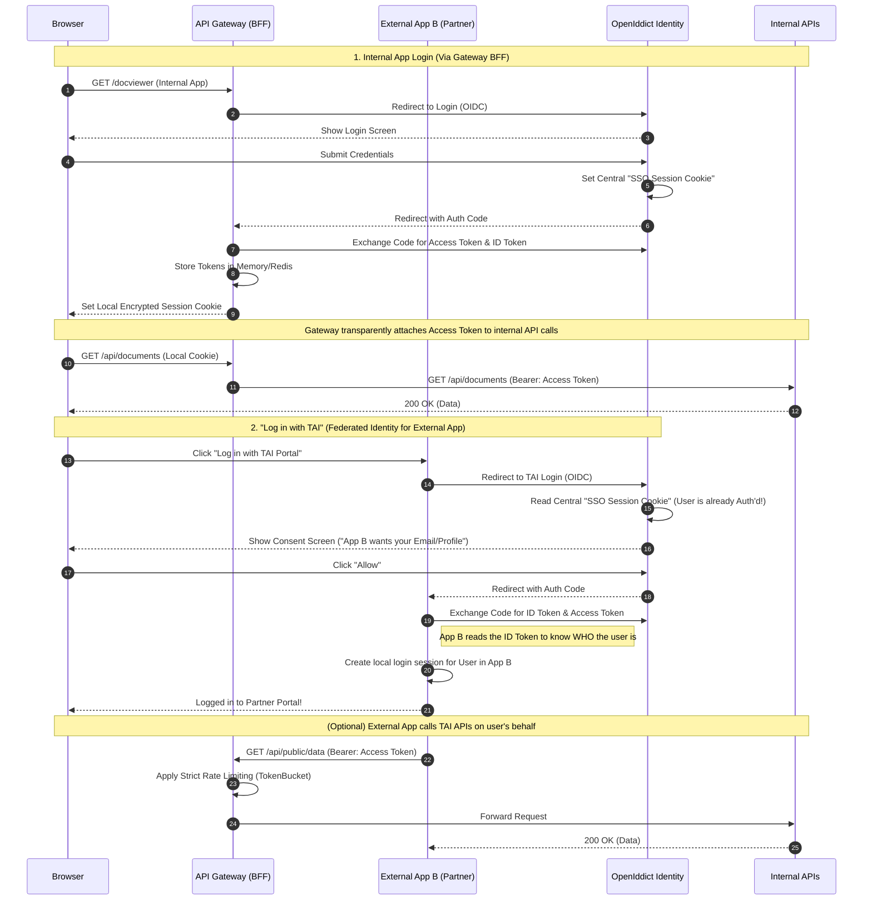
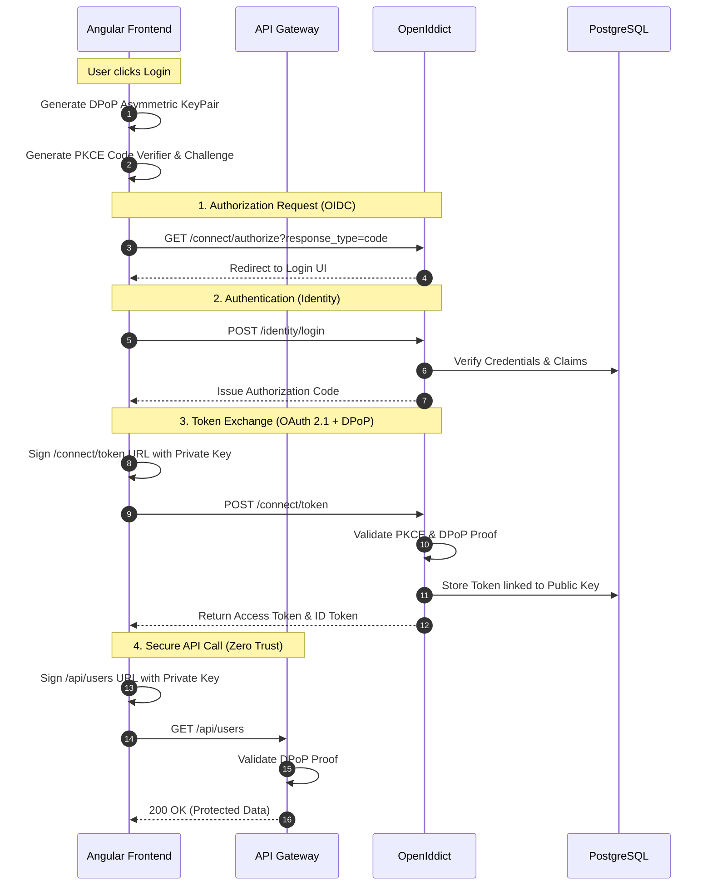

## TL;DR

Authentication (AuthN) proves *who you are*; Authorization (AuthZ) proves *what you can do*. In modern 2026 architectures like the `tai-portal`, we have moved away from simple cookies and basic JWTs to a **Zero Trust** model. We utilize **OpenID Connect (OIDC)** and **OAuth 2.1** for federation, backed by **OpenIddict** as our Sovereign Identity Provider. Crucially, we enforce **DPoP (Demonstrating Proof of Possession)** to cryptographically bind access tokens to the client, preventing token-theft attacks entirely.

## Deep Dive

### Concept Overview

#### 1. OAuth 2.1 vs OIDC (OpenID Connect)
- **What:** OAuth 2.1 is an *authorization* framework that standardizes how applications obtain access to resources on behalf of a user. OIDC (OpenID Connect) is an *authentication* layer built perfectly on top of OAuth to verify user identity.
- **Why:** In the past, developers dangerously tried to use OAuth 2.0 for authentication (e.g., "If I have an access token, the user must be logged in"). This led to massive security breaches. OIDC was created to explicitly handle identity, while OAuth handles permissions.
- **How:** 
  - **OIDC** issues an **ID Token** (always a JWT) containing claims about the user (e.g., `email`, `sub`). It proves *who the user is*.
  - **OAuth 2.1** issues an **Access Token** (can be a JWT or an opaque string). It proves *what the client application is allowed to do* (e.g., `scope: read_files`).
- **When:** Use OIDC when your frontend (Angular) needs to know the user's name and email to display a profile picture. Use OAuth 2.1 when that same frontend needs to call a backend API to fetch sensitive data.
- **Trade-offs:** OAuth 2.1 (finalized recently) drastically improves security by outright banning legacy flows (like the Implicit Grant) and making PKCE (Proof Key for Code Exchange) mandatory for all clients. The trade-off is increased complexity; even simple Single Page Applications (SPAs) now require a backend "BFF" (Backend-for-Frontend) or complex crypto libraries in the browser to handle the PKCE code challenges.

#### 2. The Sovereign Identity Provider (OpenIddict)
- **What:** OpenIddict is an open-source framework that transforms any ASP.NET Core application into a fully-fledged OpenID Connect server and OAuth 2.0/2.1 authorization server.
- **Why:** To achieve "Sovereign Identity." In highly regulated industries (Fintech, Government, Healthcare), legally mandated data privacy requirements (like GDPR or specialized banking laws) prohibit syncing Personally Identifiable Information (PII) to third-party SaaS networks like Auth0 or Okta.
- **How:** OpenIddict integrates directly into our `tai-portal` backend and utilizes EF Core. It stores all its cryptographic keys, client application definitions, scopes, tokens, and authorizations natively within our own PostgreSQL database.
- **When:** Use OpenIddict when you need absolute control over the entire identity lifecycle and infrastructure. Use Auth0/Okta for standard B2B/B2C SaaS where speed-to-market is prioritized over extreme data sovereignty.
- **Trade-offs:** By self-hosting our identity, we gain total control and data privacy. The massive trade-off is maintenance burden. We are solely responsible for managing key rotation, mitigating DDoS attacks against the login endpoints, scaling the identity database, and patching security vulnerabilities. SaaS providers handle all of this for you out-of-the-box.

#### 3. Claims-Based Authorization
- **What:** Moving away from rigid Role-Based Access Control (RBAC, e.g., `if (user.Role == "Admin")`) to Claims-Based Access Control (CBAC). A "Claim" is a trusted key-value pair asserting a fact about the user (e.g., `Department: HR`, `Clearance: TopSecret`, `TenantId: 456`).
- **Why:** Roles are too broad and inflexible for modern enterprise systems. A user might be an "Admin" for Tenant A, but only a "Viewer" for Tenant B. Hardcoding `[Authorize(Roles = "Admin")]` makes it impossible to express complex business rules without writing spaghetti code in every controller.
- **How:** In ASP.NET Core, the user's identity is represented by a `ClaimsPrincipal`. We define robust "Policies" during startup (e.g., `options.AddPolicy("CanApproveWire", policy => policy.RequireClaim("Privilege", "Wire.Approve"))`). Then, we simply decorate our endpoints with `[Authorize(Policy = "CanApproveWire")]`.
- **When:** Use basic RBAC only for trivial internal tools (e.g., "Standard User" vs "Super Admin"). For any B2B SaaS or multi-tenant system, use CBAC exclusively to allow fine-grained, dynamic permissions.
- **Trade-offs:** Claims-based authorization is significantly more powerful but requires careful architectural planning. If you inject too many claims into a JWT, the token becomes bloated, increasing HTTP request headers sizes. To counter this, large enterprise apps often use smaller JWTs and perform a fast database/cache lookup on the backend to resolve the full list of claims during the request pipeline.

#### 4. Zero Trust & DPoP (Demonstrating Proof of Possession)
- **What:** Standard JWTs are "Bearer Tokens"—meaning whoever *bears* (holds) the token can use it. DPoP (RFC 9449) is a modern Zero Trust protocol that upgrades these to "Sender-Constrained" tokens by cryptographically binding the token to the client device.
- **Why:** To completely neutralize Cross-Site Scripting (XSS) token theft and network exfiltration. If a hacker steals a standard JWT from a browser's `localStorage` or intercepts it on a network, they have full access. DPoP renders stolen tokens completely useless.
- **How:** During login, the Angular frontend silently generates an asymmetric private/public key pair in the browser using the Web Crypto API. It sends the public key to OpenIddict, which bakes a thumbprint of that key into the Access Token. For *every single API call*, the frontend must generate a short-lived signature (the DPoP Proof) signing the request URL and timestamp using its private key. The API verifies that the signature matches the public key thumbprint inside the Access Token.
- **When:** It is becoming mandatory for high-security applications (Fintech, Healthcare) and is a foundational requirement for securing modern AI Agent workflows (like the Model Context Protocol).
- **Trade-offs:** The security benefits are immense, but it introduces significant architectural complexity. The frontend must execute cryptographic operations on every HTTP request, and the backend must validate two JWTs (the Access Token and the DPoP Proof) per request, increasing CPU load. It also requires careful handling of clock synchronization (NTP) between the client and server to prevent replay attacks.

#### 5. Single Sign-On (SSO) Architecture
- **What:** SSO allows a user to log in once (e.g., at `identity.tai-portal.com`) and seamlessly access multiple different applications without entering their password again.
- **Why:** Massive UX improvement and security centralization. If an employee leaves, IT disables one account in the central Identity Provider (IdP) instead of tracking down 50 different app logins.
- **How (Internal vs. External):**
  - **Internal Apps (First-Party):** Apps owned by your company (e.g., the TAI HR Portal, the TAI DocViewer). They use the "Authorization Code Flow with PKCE". Because they are highly trusted, they can silently refresh tokens and share the same central login session cookie on the IdP domain.
  - **External Apps (Third-Party):** Apps outside your company (e.g., a partner bank wanting to access your APIs). These require a "Consent Screen" (e.g., "App X wants to read your profile. Allow/Deny?"). OpenIddict manages these distinct client registrations and permissions.
- **The SSO Cookie Mechanism:** When the user logs into App A, OpenIddict sets a secure, encrypted authentication cookie on its own domain (`identity.tai.com`). When the user later navigates to App B and clicks "Login", App B redirects them to OpenIddict. OpenIddict reads the existing cookie, sees they are already authenticated, and instantly redirects them back to App B with a new Authorization Code—no password prompt required.
- **The Gateway's Role in SSO:** The API Gateway (`portal-gateway`) acts as the traffic cop for this entire flow:
  - **Internal Apps (First-Party):** Often live *behind* the Gateway. The Gateway can act as a true Backend-for-Frontend (BFF), holding the Access Token securely in memory and only issuing a generic session cookie to the browser. It then seamlessly injects the Access Token into API calls, hiding the complexity entirely from the internal UI.
  - **External Apps (Third-Party / Federated Identity):** This is exactly how "Log in with Google" works. If a partner company builds an app, they can add a "Log in with TAI Portal" button. When clicked, the user is redirected to our OpenIddict server. If they are already logged into our internal apps, the SSO cookie bypasses the password screen. OpenIddict shows a Consent Screen (e.g., "Partner App wants to know your email. Allow?"). Upon consent, OpenIddict issues an **ID Token** to the Partner App. The Partner App validates this token and creates its own local login session for the user, completely outsourcing password management to us.



### The Full Picture: OIDC & DPoP Sequence Flow

This sequence diagram illustrates the Zero Trust FAPI 2.0 (Financial-grade API) handshake used in `tai-portal`, demonstrating how OIDC, OAuth 2.1 (PKCE), and DPoP work together.



### Real-World Application: The TAI Portal Architecture

The identity architecture in `tai-portal` relies on several explicit configurations to achieve Zero-Trust SSO across our Angular (`portal-web`) and Vue/React (`docviewer`) frontends.

#### 1. Client Registration & Restrictions (`SeedData.cs`)
We do not allow dynamic client registration. The Identity Provider only accepts Auth Code requests from known, pre-registered applications. In `SeedData.cs`, we use the `IOpenIddictApplicationManager` to explicitly define our internal apps.

Notice that the `Permissions` explicitly require the **Authorization Code** flow and ban the insecure Implicit flow:
```csharp
// Example from apps/portal-api/SeedData.cs
var docviewerDescriptor = new OpenIddictApplicationDescriptor {
    ClientId = "docviewer",
    DisplayName = "DocViewer Application",
    ClientType = ClientTypes.Public,
    Permissions = {
        Permissions.Endpoints.Authorization,
        Permissions.Endpoints.Token,
        Permissions.GrantTypes.AuthorizationCode, // ONLY Auth Code allowed
        Permissions.ResponseTypes.Code,
        Permissions.Scopes.Email,
        Permissions.Scopes.Roles
    },
    RedirectUris = {
        new Uri("http://localhost:5173/callback"),
        new Uri("http://localhost:5173/silent-renew")
    }
};
await manager.CreateAsync(docviewerDescriptor);
```

#### 2. The Protocol Engine (`AuthorizationController.cs`)
When `portal-web` or `docviewer` redirects the user to the backend, the `AuthorizationController` acts as the OIDC protocol engine. After verifying the user's database credentials, it manually constructs the `ClaimsPrincipal` that will be baked into the JWTs.

Crucially, it maps coarse-grained database roles to fine-grained **Privileges**. These claims are then assigned "Destinations" (e.g., ensuring internal privileges only go into the Access Token, not the public ID token).
```csharp
// Example from apps/portal-api/Controllers/AuthorizationController.cs
var identity = new ClaimsIdentity(
    authenticationType: TokenValidationParameters.DefaultAuthenticationType,
    nameType: Claims.Name,
    roleType: Claims.Role);

// Add standard OIDC claims
identity.SetClaim(Claims.Subject, await _userManager.GetUserIdAsync(user))
        .SetClaim(Claims.Email, await _userManager.GetEmailAsync(user));

// Map Roles to granular Privileges for Claims-Based Authorization
var roles = await _userManager.GetRolesAsync(user);
if (roles.Contains("Admin")) {
    identity.SetClaims("privileges", new[] {
        "Portal.Users.Read",
        "Portal.Users.Create",
        "Portal.Privileges.Edit"
    }.ToImmutableArray());
}

// Set Destinations: Access Tokens (for APIs) vs ID Tokens (for UI)
identity.SetDestinations(GetDestinations);

// Return the Auth Code to the specific RedirectUri
return SignIn(new ClaimsPrincipal(identity), OpenIddictServerAspNetCoreDefaults.AuthenticationScheme);
```

#### 3. Securing Endpoints & WebSockets
Because the portal acts as both the Identity Provider (serving cookies for the login UI) and the API (accepting DPoP JWTs from frontends), endpoints must explicitly state which authentication schemes they accept. 

Even our real-time SignalR `NotificationHub` is strictly protected by the OpenIddict JWT scheme:
```csharp
// Example from apps/portal-api/Controllers/UsersController.cs
// Accepts BOTH the DPoP JWT (OpenIddict) and the local Identity Cookie
[Authorize(AuthenticationSchemes = $"{OpenIddictValidationAspNetCoreDefaults.AuthenticationScheme},Identity.Application")]
public class UsersController : ControllerBase { ... }
```

#### 4. The API Gateway (YARP) & The `X-Gateway-Secret`
In a true enterprise architecture, the frontend does not talk to the backend APIs directly. It talks to an API Gateway (`portal-gateway`), which acts as a Backend-For-Frontend (BFF). We built this using **YARP (Yet Another Reverse Proxy)**.

The Gateway handles edge-level concerns like global rate limiting and IP blocking before the request ever reaches the heavily-loaded Identity Provider. Furthermore, it enforces network isolation. The `portal-api` is hidden deep within the private VPC. 

To ensure attackers cannot somehow bypass the gateway and hit the `portal-api` directly, YARP dynamically injects an `X-Gateway-Secret` header into every request it forwards:
```csharp
// Example from apps/portal-gateway/Program.cs
builder.Services.AddReverseProxy()
    .LoadFromConfig(builder.Configuration.GetSection("ReverseProxy"))
    .AddTransforms(builderContext => {
        // Dynamically inject the Gateway Secret into every forwarded request
        builderContext.AddRequestHeader("X-Gateway-Secret", gatewaySecret);
    });
```
The `portal-api` is configured to reject any request that lacks this exact FAPI-compliant cryptographic secret, ensuring the Zero-Trust perimeter is maintained at the network level.

---

## Interview Q&A

### L1: Authentication vs. Authorization
**Difficulty:** L1 (Junior)

**Question:** What is the exact difference between Authentication and Authorization, and how do OIDC and OAuth 2.1 map to them?

**Answer:** Authentication is verifying *who* a user is; Authorization is verifying *what* they are allowed to do. OpenID Connect (OIDC) is an authentication protocol that issues an ID Token to prove identity. OAuth 2.1 is an authorization framework that issues an Access Token, granting a client application permission to access specific resources on the user's behalf.

---

### L2: Role-Based vs Claims-Based Authorization
**Difficulty:** L2 (Mid-Level)

**Question:** Why is modern ASP.NET Core built heavily around `ClaimsPrincipal` rather than traditional Role-Based Access Control (RBAC)?

**Answer:** RBAC (e.g., `[Authorize(Roles = "Admin")]`) is too brittle for complex, multi-tenant enterprise applications. A "Claim" is simply a trusted statement about a user (e.g., `Department: HR`, `Clearance: TopSecret`, `TenantId: 456`). By using Claims-Based Authorization, we can write rich, dynamic Policies (`[Authorize(Policy = "RequiresTopSecret")]`) that evaluate multiple claims simultaneously without hardcoding rigid role names throughout our controllers.

---

### L3: Zero Trust & Preventing Token Theft (DPoP)
**Difficulty:** L3 (Senior)

**Question:** If an attacker successfully executes a Cross-Site Scripting (XSS) attack on our Angular frontend and steals the user's JWT Access Token from `localStorage`, how does our Zero Trust architecture (specifically DPoP) prevent them from using it against our API?

**Answer:** Standard JWTs are "Bearer" tokens, meaning anyone who holds the string can use it. We implement DPoP (Demonstrating Proof of Possession). During login, the browser generates an asymmetric key pair and OpenIddict binds the Access Token to the public key. For the attacker to use the stolen Access Token, they must also steal the private cryptographic key (which cannot be exported from the browser's crypto API) and use it to sign every single HTTP request. Because the attacker only has the token and not the hardware-bound private key, our API rejects their requests entirely.

---

### L3: Sovereign Identity (OpenIddict vs Auth0)
**Difficulty:** L3 (Senior / Staff)

**Question:** In the `tai-portal` architecture, we chose to implement our own Identity Provider using OpenIddict instead of using a managed service like Auth0 or Microsoft Entra ID. What are the architectural and compliance trade-offs of this decision?

**Answer:** Managed services like Auth0 provide massive developer velocity, out-of-the-box MFA, and zero infrastructure maintenance. However, in a highly regulated Fintech environment, using SaaS means syncing Personally Identifiable Information (PII) to a third-party network, complicating SOC 2 / GDPR compliance and risking data sovereignty. By using OpenIddict, we maintain a "Sovereign Identity" architecture. The identity data never leaves our VPC, giving us absolute control over the data lifecycle, token lifetimes, and multi-tenant isolation, at the trade-off of having to maintain the OAuth 2.1 infrastructure ourselves.

---

### Staff: Sovereign Identity vs. Big Tech Federation
**Difficulty:** Staff

**Question:** In an era where "Sign in with Google" or "Sign in with Apple" are ubiquitous, why would a Fintech company build its own custom Identity Federation system (like `tai.portal` using OpenIddict), and why would regional banks and credit unions trust it over Big Tech?

**Answer:** There are three critical reasons why Fintechs build Sovereign Identity Providers:
1. **FAPI 2.0 & High-Assurance Security:** "Sign in with Google" uses standard OIDC, which is insufficient for moving money. Regional banks require **Financial-grade API (FAPI 2.0)** compliance. A custom OpenIddict server allows us to enforce strict financial protocols like **DPoP** (sender-constrained tokens), Mutual TLS (mTLS) for B2B client authentication, and exact-match strict redirect URIs—features that generic social logins do not reliably enforce.
2. **Data Sovereignty & Liability:** Banks cannot legally or ethically outsource the authorization of financial ledgers to an advertising company (Google). If a token is compromised, the liability must be strictly defined in a B2B contract (e.g., between the Fintech and the Credit Union). By acting as the IdP, `tai.portal` ensures that Personally Identifiable Information (PII) and financial claims never leave the highly regulated VPC.
3. **B2B Trust Networks (Federation 1.0):** Social logins are built for B2C (Business-to-Consumer). Fintechs operate in B2B (Business-to-Business) networks. A custom IdP allows a Credit Union to act as a Relying Party, trusting `tai.portal`'s cryptographic signatures to securely authenticate loan officers across different financial institutions without creating duplicate accounts, establishing a private, highly-audited trust network.

---

### L3: The Token Revocation Problem (Stateful vs Stateless)
**Difficulty:** L3 (Senior)

**Question:** A critical flaw with JWT Access Tokens is that they are mathematically signed and "stateless"—meaning once issued, the API trusts them without checking the database. If an employee is fired, how do you instantly revoke their access if their JWT is still valid for another 60 minutes?

**Answer:** Because JWTs are stateless, they cannot be natively revoked. The industry standard solution is a **Time-based Trade-off**:
1. **Short-Lived Access Tokens:** Issue Access Tokens that expire in 5–15 minutes.
2. **Refresh Tokens:** Issue a long-lived Refresh Token. When the Access Token expires, the client uses the Refresh Token to get a new one.
3. **The Revocation:** When the employee is fired, you revoke the *Refresh Token* in the database (which is stateful). The attacker can only use the Access Token for a maximum of 15 minutes before it mathematically expires, and the IdP will refuse to issue a new one. For absolute, instant revocation (zero-minute delay), the API must query a distributed cache (like Redis) on every request to check a "Token Denylist," effectively turning the stateless JWT back into a stateful session token.

---

### Staff: The BFF (Backend-for-Frontend) Pattern Security
**Difficulty:** Staff

**Question:** In 2018, it was standard practice for Single Page Applications (SPAs like Angular or React) to request JWTs directly from the IdP and store them in `localStorage`. In 2026, the OAuth 2.1 spec strongly recommends the BFF (Backend-for-Frontend) pattern. What specific attack vectors forced this architectural shift?

**Answer:** Storing highly privileged Access Tokens in `localStorage` or memory in a browser exposes them to **Cross-Site Scripting (XSS)**. If a single malicious NPM package executes JavaScript on your domain, it can easily read `localStorage` and exfiltrate the tokens to an attacker.
The **BFF Pattern** (like our YARP Gateway) solves this by moving the OAuth handshake to the backend server. The BFF securely negotiates and stores the JWT in its own memory. It then issues a strictly scoped, `HttpOnly`, `Secure`, `SameSite=Strict` encrypted cookie to the Angular app. Because JavaScript cannot physically read `HttpOnly` cookies, XSS token exfiltration becomes impossible. The browser automatically attaches the cookie to API calls, and the BFF transparently swaps it back for the JWT before hitting internal microservices.

---

### L3: Machine-to-Machine (M2M) Authentication
**Difficulty:** L3 (Senior)

**Question:** If a background worker service (like an automated nightly billing job) needs to call our protected `tai-portal` APIs, there is no human user present to enter a password or click a consent screen. How does the worker securely authenticate?

**Answer:** M2M communication relies on the **Client Credentials Grant** flow in OAuth 2.0/2.1. The background worker is registered in OpenIddict not as a public client (like Angular), but as a **Confidential Client**. It is assigned its own unique `ClientId` and a highly secure `ClientSecret` (or uses mTLS / Private Key JWTs for higher security). 
The worker authenticates directly with OpenIddict using its ID and Secret. Because there is no human user, OpenIddict immediately issues an Access Token containing the scopes assigned specifically to that worker (e.g., `scope: billing_execute`). The API authorizes the request based on the application's identity, completely bypassing human identity claims.

---

## Cross-References
- [[System-Design]] — How Identity integrates into the larger edge architecture.
- [[EFCore-SQL]] — How Claims (like `TenantId`) are injected into EF Core Global Query Filters.
- [[Security-CSP-DPoP]] — A deeper dive into Content Security Policies to prevent the XSS attacks that target tokens.

---

## Further Reading
- [OAuth 2.1 Best Practices](https://oauth.net/2.1/)
- [OpenIddict Documentation](https://documentation.openiddict.com/)
- [DPoP (RFC 9449) Explained](https://datatracker.ietf.org/doc/html/rfc9449)

---

*Last updated: 2026-03-31*