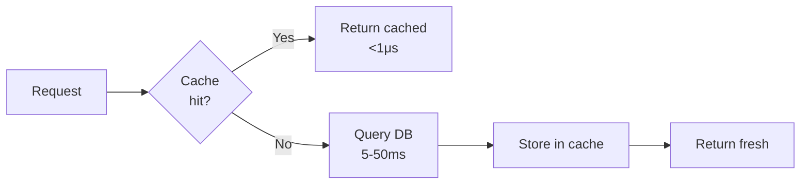
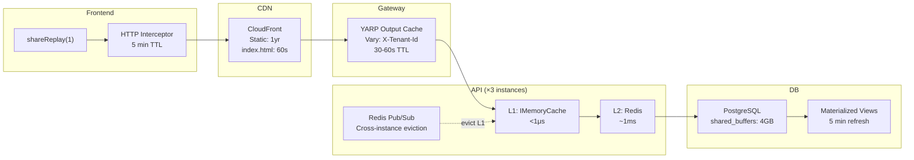

[🧠 **View Interactive Mindmap**](./caching-mindmap.md)

1. **Caching Fundamentals**
   - 1.1 [Why Caching Exists](#why-caching-exists--the-latency-problem)
   - 1.2 [Cache-Aside (Lazy Loading)](#cache-aside-lazy-loading)
   - 1.3 [Write-Through & Write-Behind](#write-through--write-behind)
   - 1.4 [Cache Invalidation](#cache-invalidation--the-hardest-problem)
   - 1.5 [TTL vs Event-Driven Invalidation](#ttl-vs-event-driven-invalidation)

2. **Server-Side Caching (.NET)**
   - 2.1 [IMemoryCache (In-Process)](#imemorycache-in-process)
   - 2.2 [IDistributedCache & Redis](#idistributedcache--redis)
   - 2.3 [Output Caching Middleware](#output-caching-middleware-net-8)
   - 2.4 [MediatR CachingBehavior Pipeline](#mediatr-cachingbehavior-pipeline)

3. **Frontend Caching (Angular)**
   - 3.1 [RxJS shareReplay & Memoization](#rxjs-sharereplay--memoization)
   - 3.2 [Signal Store Caching](#signal-store-caching)
   - 3.3 [HTTP Interceptor Caching](#http-interceptor-caching)
   - 3.4 [Service Worker & PWA Caching](#service-worker--pwa-caching)

4. **Database & Query Caching**
   - 4.1 [EF Core Query Plan Caching](#ef-core-query-plan-caching)
   - 4.2 [PostgreSQL Buffer Cache & Shared Buffers](#postgresql-buffer-cache--shared-buffers)
   - 4.3 [Materialized Views](#materialized-views)

5. **Infrastructure Caching**
   - 5.1 [HTTP Cache Headers (Cache-Control, ETag)](#http-cache-headers-cache-control-etag)
   - 5.2 [CDN Caching (CloudFront)](#cdn-caching-cloudfront)
   - 5.3 [Reverse Proxy Caching (YARP)](#reverse-proxy-caching-yarp)

6. **Architecture & Cache Topology**
   - 6.1 [The Caching Pyramid](#the-caching-pyramid)
   - 6.2 [Multi-Tenant Cache Isolation](#multi-tenant-cache-isolation)

7. **Knowledge Deep Dive & Q&A**
   - 7.1 **L1: Junior Knowledge**
     - 7.1.1 [What Is Caching?](#what-is-caching-and-why-does-every-system-use-it)
     - 7.1.2 [IMemoryCache vs IDistributedCache](#when-would-you-use-imemorycache-vs-idistributedcache)
   - 7.2 **L2: Mid-Level Knowledge**
     - 7.2.1 [Cache Invalidation Strategies](#how-do-you-decide-between-ttl-and-event-driven-cache-invalidation)
     - 7.2.2 [Cache Stampede Prevention](#what-is-a-cache-stampede-and-how-do-you-prevent-it)
     - 7.2.3 [ETag-Based Concurrency](#how-does-etag-based-caching-differ-from-server-side-caching)
   - 7.3 **L3: Senior Knowledge**
     - 7.3.1 [Multi-Tenant Cache Poisoning](#how-do-you-prevent-cache-poisoning-in-a-multi-tenant-system)
     - 7.3.2 [Cache Warming vs Lazy Loading](#when-would-you-choose-cache-warming-over-lazy-loading)
     - 7.3.3 [Distributed Cache Consistency](#how-do-you-handle-cache-consistency-across-multiple-api-instances)
   - 7.4 **Staff: System Architecture**
     - 7.4.1 [Design a Multi-Layer Caching Strategy](#design-a-multi-layer-caching-strategy-for-a-multi-tenant-saas)
     - 7.4.2 [Evolving from IMemoryCache to Redis](#how-do-you-migrate-from-in-process-caching-to-distributed-caching-without-downtime)

---

## TL;DR

Caching trades <span style="color: #ffbb33; font-weight: bold;">memory and staleness risk</span> for <span style="color: #00C851; font-weight: bold;">dramatically reduced latency and database load</span>. In a 2026 enterprise .NET/Angular/PostgreSQL stack, caching operates at every layer: <span style="color: #33b5e5; font-weight: bold;">CDN</span> for static assets, <span style="color: #33b5e5; font-weight: bold;">HTTP Cache-Control/ETag</span> for API responses, <span style="color: #33b5e5; font-weight: bold;">IMemoryCache</span> for hot in-process data, <span style="color: #33b5e5; font-weight: bold;">Redis/IDistributedCache</span> for shared state across instances, and <span style="color: #33b5e5; font-weight: bold;">shareReplay</span> for Angular observable memoization. tai-portal currently uses IMemoryCache for tenant resolution (15 min TTL), privilege lookups (10 min TTL), and OTP storage, plus shareReplay for auth state — a practical starting point that can evolve to Redis when horizontal scaling demands it. The interview-defining question is always: <span style="color: #ff4444; font-weight: bold;">"How do you invalidate the cache?"</span> — and the answer depends on your consistency requirements.

---

## Deep Dive

### Caching Fundamentals

#### Why Caching Exists — The Latency Problem

##### What
A cache is a fast, temporary storage layer that holds frequently accessed data closer to the consumer, avoiding repeated expensive computations or network round-trips to the source of truth.

##### Why
Without caching, every request hits the database or upstream service. A single PostgreSQL query may take 5-50ms, but an in-memory cache lookup takes <1μs — a 10,000x improvement. At 1,000 requests/second, that's the difference between a responsive app and a saturated database connection pool.

##### How
All caching follows the same fundamental flow:
1. **Check cache** — is the data already stored?
2. **Cache hit** — return immediately (fast path)
3. **Cache miss** — fetch from source, store in cache, return (slow path)



##### When
Cache when: data is read far more often than written, slight staleness is acceptable, and the computation or fetch cost is significant. Do NOT cache when: data changes every request, consistency is critical (financial transactions), or the dataset is too large to fit in memory.

##### Trade-offs
Every cache introduces the <span style="color: #ff4444; font-weight: bold;">CAP trade-off between consistency and performance</span>. You are serving potentially stale data. The two hard problems in computer science are: cache invalidation, naming things, and off-by-one errors.

---

#### Cache-Aside (Lazy Loading)

##### What
The application checks the cache first, and on a miss, fetches from the source and populates the cache. The cache is a passive side-car — the application owns the read/write logic.

##### Why
Cache-aside is the simplest and most common pattern. It naturally handles cache misses and only caches data that is actually requested (no wasted memory on unused data).

##### How
```csharp
// 📍 From tai-portal: PrivilegeService.cs uses exactly this pattern
public async Task<PrivilegeDto?> GetByIdAsync(Guid id, CancellationToken ct)
{
    var cacheKey = $"Privilege_{id}";
    return await _cache.GetOrCreateAsync(cacheKey, async entry =>
    {
        entry.AbsoluteExpirationRelativeToNow = TimeSpan.FromMinutes(10);
        var privilege = await _privilegeRepository.GetByIdAsync(id, ct);
        return privilege is null ? null : _mapper.Map<PrivilegeDto>(privilege);
    });
}
```

##### When
Use cache-aside for read-heavy workloads where occasional staleness is acceptable. This is the default choice for most application caching. Avoid when you need guaranteed consistency between cache and database.

##### Trade-offs
<span style="color: #ff4444; font-weight: bold;">First request after expiry or eviction is always slow</span> (cold start penalty). If many requests arrive simultaneously for the same expired key, you get a <span style="color: #ff4444; font-weight: bold;">cache stampede</span> — N concurrent database queries for the same data.

---

#### Write-Through & Write-Behind

##### What
**Write-through:** every write updates both the cache and the database synchronously. **Write-behind (write-back):** writes update the cache immediately, and the database is updated asynchronously in the background.

##### Why
Write-through ensures the cache is always consistent with the database — no stale reads after writes. Write-behind reduces write latency by deferring the slow database write.

##### How
```csharp
// 🔧 Fits tai-portal: Write-through pattern for privilege updates
public async Task UpdateAsync(Guid id, UpdatePrivilegeDto dto, CancellationToken ct)
{
    var privilege = await _privilegeRepository.GetByIdAsync(id, ct);
    _mapper.Map(dto, privilege);
    await _privilegeRepository.UpdateAsync(privilege, ct);
    
    // Write-through: update cache immediately after DB write
    var cacheKey = $"Privilege_{id}";
    var cached = _mapper.Map<PrivilegeDto>(privilege);
    _cache.Set(cacheKey, cached, TimeSpan.FromMinutes(10));
    
    // Also invalidate the list cache
    _cache.Remove(PrivilegesCacheKey);
}
```

##### When
Write-through is ideal when you need read-your-writes consistency (the user who just saved must see their changes). Write-behind is for high-throughput writes where brief data loss risk is acceptable (e.g., analytics counters, view counts).

##### Trade-offs
Write-through adds latency to every write (two writes instead of one). <span style="color: #ff4444; font-weight: bold;">Write-behind risks data loss</span> — if the process crashes before flushing to the database, cached writes are lost. Write-behind also complicates error handling: what if the deferred DB write fails?

---

#### Cache Invalidation — The Hardest Problem

##### What
Cache invalidation is the process of removing or updating cached data when the source of truth changes, ensuring consumers don't receive stale data.

##### Why
Without invalidation, a cache with a 10-minute TTL means users could see data up to 10 minutes stale. For some data (tenant configuration, security privileges), this is unacceptable. For other data (product listings, search results), it's fine.

##### How
Three primary strategies:

| Strategy | Mechanism | Staleness | Complexity |
|----------|-----------|-----------|------------|
| **TTL expiration** | Data expires after N minutes | Up to TTL duration | Low |
| **Explicit invalidation** | Code removes cache entry on write | Zero (if done correctly) | Medium |
| **Event-driven invalidation** | Domain events trigger cache removal | Near-zero (event propagation delay) | High |

```csharp
// 📍 From tai-portal: PrivilegeService uses explicit invalidation
private void InvalidateCache(Guid id)
{
    _cache.Remove(PrivilegesCacheKey);     // Invalidate list cache
    _cache.Remove($"Privilege_{id}");       // Invalidate individual cache
}
```

##### When
Use TTL for data where staleness is acceptable (reference data, feature flags). Use explicit invalidation when the writing code knows exactly which cache entries to clear. Use event-driven invalidation in distributed systems where the writer and the cache are in different processes.

##### Trade-offs
TTL is simple but guarantees staleness. Explicit invalidation is precise but <span style="color: #ff4444; font-weight: bold;">tightly couples the write path to cache structure</span> — if you add a new cache key, you must remember to invalidate it everywhere. Event-driven invalidation decouples but introduces <span style="color: #ffbb33; font-weight: bold;">eventual consistency and infrastructure complexity</span> (message broker dependency).

---

#### TTL vs Event-Driven Invalidation

##### What
**TTL (Time-To-Live):** cached data automatically expires after a fixed duration. **Event-driven:** domain events (via RabbitMQ, MediatR, etc.) trigger immediate cache removal.

##### Why
The choice determines your consistency guarantee. TTL accepts staleness; events minimize it. The right choice depends on how much your users notice stale data.

##### How
```csharp
// TTL: simple, accepts up to 15 minutes of staleness
// 📍 From tai-portal: TenantResolutionMiddleware caches hostname→tenantId for 15 min
_cache.GetOrCreateAsync($"tenant_host_{hostname}", async entry =>
{
    entry.AbsoluteExpirationRelativeToNow = TimeSpan.FromMinutes(15);
    return await _tenantRepository.GetByHostnameAsync(hostname, ct);
});

// Event-driven: near-zero staleness
// 📍 From tai-portal: PrivilegeModifiedEventHandler publishes integration event
// which could trigger cache invalidation across instances
public async Task Handle(PrivilegeModifiedEvent notification, CancellationToken ct)
{
    await _messageBus.PublishAsync(new IntegrationEvent
    {
        EventName = "PrivilegeModified",
        Payload = JsonSerializer.Serialize(notification)
    });
}
```

##### When
TTL is sufficient for: tenant resolution (tenants don't change hostnames often), reference data, configuration. Event-driven is necessary for: security-sensitive data (privileges, roles), data the user just modified (read-your-writes), data shared across multiple service instances.

##### Trade-offs
<span style="color: #ffbb33; font-weight: bold;">TTL wastes memory</span> on data that changed but hasn't expired yet, and serves stale reads until expiry. Event-driven requires a reliable messaging infrastructure and <span style="color: #ff4444; font-weight: bold;">every cache entry must have a corresponding invalidation event</span> — miss one and you have a permanent stale cache.

---

### Server-Side Caching (.NET)

#### IMemoryCache (In-Process)

##### What
<span style="color: #33b5e5; font-weight: bold;">IMemoryCache</span> is .NET's built-in in-process cache from `Microsoft.Extensions.Caching.Memory`. Data lives in the application's heap memory and is lost when the process restarts.

##### Why
It's the fastest possible cache — no serialization, no network hop, no external dependency. For single-instance deployments or data that doesn't need to be shared across instances, it's the optimal choice.

##### How
```csharp
// 📍 From tai-portal: Registered in Program.cs
builder.Services.AddMemoryCache();

// 📍 From tai-portal: PrivilegeService.cs — Cache-aside with GetOrCreateAsync
public async Task<PagedResult<PrivilegeDto>> GetAllAsync(
    int page, int pageSize, string? search, CancellationToken ct)
{
    // Only cache the unfiltered first page (hot path)
    if (page == 0 && pageSize == 10 && string.IsNullOrEmpty(search))
    {
        return await _cache.GetOrCreateAsync(PrivilegesCacheKey, async entry =>
        {
            entry.AbsoluteExpirationRelativeToNow = TimeSpan.FromMinutes(10);
            return await FetchPrivilegesFromDb(page, pageSize, search, ct);
        });
    }
    return await FetchPrivilegesFromDb(page, pageSize, search, ct);
}

// 📍 From tai-portal: OtpService.cs — Using cache as short-lived storage
public void StoreOtp(string userId, string code)
{
    _cache.Set($"OTP_VERIFICATION_{userId}", code,
        TimeSpan.FromMinutes(10));
}
```

##### When
Use IMemoryCache when: single API instance (or data is instance-local like OTP codes), sub-millisecond access is required, data fits comfortably in heap memory (< hundreds of MB). Avoid when: running multiple API instances behind a load balancer (each instance has its own cache — request to instance B won't see instance A's cache).

##### Trade-offs
<span style="color: #ff4444; font-weight: bold;">Not shared across instances</span> — in a horizontally scaled deployment, each instance maintains its own cache, leading to inconsistency and wasted memory. <span style="color: #ff4444; font-weight: bold;">Lost on restart</span> — deployment or crash clears the entire cache, causing a cold-start stampede. <span style="color: #ffbb33; font-weight: bold;">Competes with application memory</span> — large caches increase GC pressure on Gen2 collections.

---

#### IDistributedCache & Redis

##### What
<span style="color: #33b5e5; font-weight: bold;">IDistributedCache</span> is .NET's abstraction over distributed cache stores. <span style="color: #33b5e5; font-weight: bold;">Redis</span> (via `StackExchange.Redis`) is the standard implementation — an in-memory data structure server running as a separate process, shared across all API instances.

##### Why
When you scale beyond a single API instance, IMemoryCache breaks down. Instance A caches a privilege, instance B doesn't see it. Redis solves this — all instances read/write to the same external cache. It also survives application restarts.

##### How
```csharp
// 🔧 Fits tai-portal: Migration path from IMemoryCache to Redis
// Step 1: Register IDistributedCache with Redis
builder.Services.AddStackExchangeRedisCache(options =>
{
    options.Configuration = "localhost:6379";
    options.InstanceName = "tai-portal:";
});

// Step 2: Inject IDistributedCache instead of IMemoryCache
public class PrivilegeService
{
    private readonly IDistributedCache _cache;
    
    public async Task<PrivilegeDto?> GetByIdAsync(Guid id, CancellationToken ct)
    {
        var cacheKey = $"Privilege_{id}";
        var cached = await _cache.GetStringAsync(cacheKey, ct);
        if (cached is not null)
            return JsonSerializer.Deserialize<PrivilegeDto>(cached);
        
        var privilege = await _privilegeRepository.GetByIdAsync(id, ct);
        if (privilege is null) return null;
        
        var dto = _mapper.Map<PrivilegeDto>(privilege);
        await _cache.SetStringAsync(cacheKey,
            JsonSerializer.Serialize(dto),
            new DistributedCacheEntryOptions
            {
                AbsoluteExpirationRelativeToNow = TimeSpan.FromMinutes(10)
            }, ct);
        return dto;
    }
}
```

##### When
Use Redis when: running 2+ API instances, session data must survive restarts, you need pub/sub for cache invalidation across instances, or cache size exceeds what's comfortable in-process. On AWS, use <span style="color: #33b5e5; font-weight: bold;">ElastiCache for Redis</span> (managed, auto-failover).

##### Trade-offs
<span style="color: #ffbb33; font-weight: bold;">Network round-trip</span> — Redis adds ~0.5-2ms per call vs <1μs for IMemoryCache. <span style="color: #ffbb33; font-weight: bold;">Serialization cost</span> — every value must be serialized/deserialized (JSON or protobuf). <span style="color: #ffbb33; font-weight: bold;">Infrastructure cost</span> — ElastiCache `cache.t4g.micro` starts at ~$12/month; production `cache.r7g.large` is ~$150/month. <span style="color: #ff4444; font-weight: bold;">Single point of failure</span> unless configured with replicas and sentinel/cluster mode.

---

#### Output Caching Middleware (.NET 8+)

##### What
<span style="color: #33b5e5; font-weight: bold;">Output Caching</span> is .NET 8+'s built-in middleware that caches entire HTTP responses at the server level, including status code, headers, and body. It replaces the older Response Caching middleware.

##### Why
For GET endpoints that return the same data for the same query parameters, output caching avoids executing the controller, MediatR pipeline, database query, and serialization entirely. The middleware short-circuits the entire pipeline.

##### How
```csharp
// 🔧 Fits tai-portal: Output caching for privilege list endpoint
// Program.cs
builder.Services.AddOutputCache(options =>
{
    options.AddBasePolicy(builder => builder.NoCache());  // Default: no cache
    
    options.AddPolicy("PrivilegeList", builder => builder
        .Expire(TimeSpan.FromMinutes(5))
        .Tag("privileges")
        .SetVaryByQuery("page", "pageSize", "search"));
});

app.UseOutputCache();

// PrivilegesController.cs
[HttpGet]
[OutputCache(PolicyName = "PrivilegeList")]
public async Task<IActionResult> GetAll(
    [FromQuery] int page = 0,
    [FromQuery] int pageSize = 10,
    [FromQuery] string? search = null)
{
    // This entire action is skipped on cache hit
    var result = await _mediator.Send(new GetPrivilegesQuery(page, pageSize, search));
    return Ok(result);
}

// Invalidation via tags
[HttpPut("{id}")]
public async Task<IActionResult> Update(Guid id, UpdatePrivilegeDto dto)
{
    await _mediator.Send(new UpdatePrivilegeCommand(id, dto));
    // Evict all cached responses tagged "privileges"
    await _outputCacheStore.EvictByTagAsync("privileges", ct);
    return NoContent();
}
```

##### When
Use for: GET endpoints serving the same response to many users (e.g., reference data, public listings). Avoid for: user-specific responses (unless you vary by auth header, which defeats the purpose), real-time data, or responses with side effects.

##### Trade-offs
<span style="color: #ff4444; font-weight: bold;">Dangerous in multi-tenant systems</span> — if you forget to vary by tenant, Tenant A sees Tenant B's data. Must always include tenant identifier in the cache key. <span style="color: #ffbb33; font-weight: bold;">Stores full response bodies in memory</span>, which can be large for paginated lists.

---

#### MediatR CachingBehavior Pipeline

##### What
A <span style="color: #33b5e5; font-weight: bold;">CachingBehavior</span> is a MediatR `IPipelineBehavior` that intercepts query requests and returns cached results, short-circuiting the handler entirely.

##### Why
By placing caching in the MediatR pipeline (rather than in individual services), you get a consistent, cross-cutting caching strategy. Any query that opts in gets caching automatically, with no changes to the handler.

##### How
```csharp
// 🔧 Fits tai-portal: MediatR CachingBehavior for queries
public interface ICacheableQuery
{
    string CacheKey { get; }
    TimeSpan? CacheDuration => TimeSpan.FromMinutes(5);
}

public record GetPrivilegesQuery(int Page, int PageSize, string? Search)
    : IRequest<PagedResult<PrivilegeDto>>, ICacheableQuery
{
    // Record value equality makes this deterministic
    public string CacheKey => $"privileges:{Page}:{PageSize}:{Search ?? ""}";
}

public class CachingBehavior<TRequest, TResponse>
    : IPipelineBehavior<TRequest, TResponse>
    where TRequest : ICacheableQuery
{
    private readonly IMemoryCache _cache;
    private readonly ILogger<CachingBehavior<TRequest, TResponse>> _logger;

    public async Task<TResponse> Handle(
        TRequest request,
        RequestHandlerDelegate<TResponse> next,
        CancellationToken ct)
    {
        return await _cache.GetOrCreateAsync(request.CacheKey, async entry =>
        {
            entry.AbsoluteExpirationRelativeToNow = request.CacheDuration;
            _logger.LogDebug("Cache miss for {CacheKey}", request.CacheKey);
            return await next();
        });
    }
}
```

##### When
Use when you have multiple query handlers that would benefit from caching and want a consistent approach. The marker interface (`ICacheableQuery`) lets handlers opt in explicitly. Place this behavior **last** in the pipeline — after validation, authorization, and logging (no point caching unauthorized or invalid requests).

##### Trade-offs
<span style="color: #ffbb33; font-weight: bold;">Cache key design is critical</span> — C# records give you value equality, so two queries with the same parameters produce the same cache key. But if you add a new parameter and forget to include it in the key, you'll serve wrong results. <span style="color: #ff4444; font-weight: bold;">Only works for queries</span> — never cache commands (side effects).

---

### Frontend Caching (Angular)

#### RxJS shareReplay & Memoization

##### What
<span style="color: #33b5e5; font-weight: bold;">shareReplay(1)</span> multicasts an observable and replays the last emitted value to late subscribers. It effectively caches the latest value in memory, preventing duplicate HTTP calls or computations.

##### Why
Without shareReplay, every component that subscribes to `user$` triggers a separate evaluation of the upstream chain. If the upstream involves an HTTP call or expensive computation, you're paying that cost N times.

##### How
```typescript
// 📍 From tai-portal: auth.service.ts — shareReplay for user data
readonly user$ = this.oidcSecurityService.userData$.pipe(
  map(({ userData }) => {
    if (!userData) return null;
    return {
      sub: userData.sub,
      email: userData.email,
      name: userData.name,
      roles: userData['role'] ?? [],
      privileges: userData['privilege'] ?? [],
    } as UserProfile;
  }),
  shareReplay(1)  // Cache last value — all subscribers get it immediately
);

readonly isAuthenticated$ = this.user$.pipe(map(user => !!user));
```

```typescript
// 🔧 Fits tai-portal: Caching an HTTP response with shareReplay
@Injectable({ providedIn: 'root' })
export class FeatureFlagService {
  private flags$ = this.http.get<FeatureFlags>('/api/feature-flags').pipe(
    shareReplay({ bufferSize: 1, refCount: true })
    // refCount: true → unsubscribes from source when no subscribers remain
    // This means the cache is cleared when no component needs it
  );

  getFlags(): Observable<FeatureFlags> {
    return this.flags$;
  }
}
```

##### When
Use shareReplay for: auth state, configuration, reference data, any observable subscribed to by multiple components simultaneously. Use `refCount: true` when the data should be re-fetched when all subscribers leave and a new one arrives (keeps data fresh). Use `refCount: false` (default) when the data should persist for the lifetime of the service.

##### Trade-offs
<span style="color: #ff4444; font-weight: bold;">Memory leak risk</span> — `shareReplay(1)` without `refCount: true` keeps the subscription alive forever (for `providedIn: 'root'` services, this is fine — the service lives as long as the app). <span style="color: #ff4444; font-weight: bold;">Stale data risk</span> — the cached value is never automatically refreshed. If the backend data changes, the frontend won't know until a page refresh or explicit re-fetch.

---

#### Signal Store Caching

##### What
Angular Signals combined with component or service stores act as a synchronous, reactive cache. The signal holds the current value; computed signals derive values without re-fetching.

##### Why
Signals provide a simpler mental model than RxJS for state that doesn't change over time streams. A signal store is essentially a client-side cache with fine-grained reactivity.

##### How
```typescript
// 📍 From tai-portal: notification-signal.store.ts — event deduplication cache
const MAX_IDEMPOTENCY_CACHE = 1000;

export const NotificationSignalStore = signalStore(
  { providedIn: 'root' },
  withState<NotificationState>({
    events: [],
    seenEventIds: new Set<string>(),  // In-memory idempotency cache
  }),
  withMethods((store) => ({
    addEvent(event: SecurityEvent): void {
      // Cache check: skip if already seen (deduplication)
      if (store.seenEventIds().has(event.id)) return;
      
      const updatedIds = new Set(store.seenEventIds());
      updatedIds.add(event.id);
      
      // Evict oldest entries if cache exceeds limit
      if (updatedIds.size > MAX_IDEMPOTENCY_CACHE) {
        const iterator = updatedIds.values();
        iterator.next();  // Remove oldest
        updatedIds.delete(iterator.next().value);
      }
      
      patchState(store, {
        events: [event, ...store.events()].slice(0, MAX_BUFFER),
        seenEventIds: updatedIds,
      });
    },
  }))
);
```

##### When
Use signal stores for: UI state that multiple components read, data that arrives from WebSocket/SignalR and needs deduplication, derived computations (computed signals are automatically memoized). Avoid for: large datasets or data that should survive page refresh (use localStorage or IndexedDB instead).

##### Trade-offs
<span style="color: #ffbb33; font-weight: bold;">Memory-only</span> — signal state is lost on page refresh. For data that must persist, combine with `localStorage` or `sessionStorage`. Signals are synchronous — they can't natively represent loading/error states without wrapping in a `{ loading, data, error }` pattern.

---

#### HTTP Interceptor Caching

##### What
An Angular HTTP interceptor can cache GET responses and return them on subsequent identical requests, bypassing the network entirely.

##### Why
For reference data that rarely changes (enums, configuration, privilege definitions), an interceptor-level cache avoids every component needing its own caching logic. It's a cross-cutting concern — exactly what interceptors are designed for.

##### How
```typescript
// 🔧 Fits tai-portal: HTTP caching interceptor for reference data
export const cachingInterceptor: HttpInterceptorFn = (req, next) => {
  // Only cache GET requests to specific endpoints
  const cacheablePatterns = ['/api/privileges', '/api/feature-flags'];
  
  if (req.method !== 'GET' || !cacheablePatterns.some(p => req.url.includes(p))) {
    return next(req);
  }

  const cached = httpCache.get(req.urlWithParams);
  if (cached && !isExpired(cached)) {
    return of(cached.response.clone());
  }

  return next(req).pipe(
    tap(event => {
      if (event instanceof HttpResponse) {
        httpCache.set(req.urlWithParams, {
          response: event.clone(),
          timestamp: Date.now(),
          ttl: 5 * 60 * 1000  // 5 minutes
        });
      }
    })
  );
};
```

##### When
Use for: endpoints that return the same data for all users of the same tenant, reference data, configuration. Avoid for: user-specific data, data that changes frequently, or POST/PUT/DELETE requests.

##### Trade-offs
<span style="color: #ff4444; font-weight: bold;">Must invalidate on mutations</span> — if the user creates a privilege, the cached privilege list is stale. The interceptor must listen for mutation responses and evict related cache entries. <span style="color: #ffbb33; font-weight: bold;">URL-based cache keys</span> can cause subtle bugs if the same data is fetched via different URL patterns.

---

#### Service Worker & PWA Caching

##### What
A <span style="color: #33b5e5; font-weight: bold;">Service Worker</span> is a browser-managed proxy that intercepts all network requests. It can serve cached responses when the network is unavailable, enabling offline-first PWA (Progressive Web App) capabilities.

##### Why
For enterprise applications, service workers provide: offline access to recently viewed pages, instant loading of static assets (JS, CSS, images), and background sync for queued mutations.

##### How
```typescript
// 🔧 Fits tai-portal: Angular service worker configuration (ngsw-config.json)
{
  "index": "/index.html",
  "assetGroups": [
    {
      "name": "app",
      "installMode": "prefetch",    // Cache on install
      "resources": {
        "files": ["/favicon.ico", "/index.html", "/*.css", "/*.js"]
      }
    },
    {
      "name": "assets",
      "installMode": "lazy",         // Cache on first request
      "resources": {
        "files": ["/assets/**"]
      }
    }
  ],
  "dataGroups": [
    {
      "name": "api-privileges",
      "urls": ["/api/privileges"],
      "cacheConfig": {
        "maxSize": 50,
        "maxAge": "5m",              // 5-minute TTL
        "strategy": "freshness"       // Network-first, fallback to cache
      }
    }
  ]
}
```

##### When
Use when: the app must work offline or on flaky connections, static assets are large and change infrequently, API responses can serve as a fallback during outages. Avoid when: data freshness is critical (real-time dashboards), the app handles sensitive data that shouldn't be cached on disk.

##### Trade-offs
<span style="color: #ff4444; font-weight: bold;">Cache invalidation is extremely hard</span> — service workers can serve stale content even after deployment. Users may need to refresh twice or clear cache manually. <span style="color: #ffbb33; font-weight: bold;">Debugging is painful</span> — service worker behavior is invisible in normal DevTools; requires the Application tab. <span style="color: #ff4444; font-weight: bold;">Security consideration in multi-tenant apps</span> — cached API responses for Tenant A must not be served to Tenant B if the user switches tenants.

---

### Database & Query Caching

#### EF Core Query Plan Caching

##### What
EF Core automatically caches the SQL translation of LINQ queries. The first execution compiles the expression tree to SQL; subsequent identical queries reuse the cached SQL string, skipping the translation step.

##### Why
LINQ-to-SQL translation is expensive — parsing the expression tree, resolving table mappings, generating parameterized SQL. For queries executed hundreds of times per second, the translation overhead is significant. EF Core's auto-caching eliminates this.

##### How
```csharp
// EF Core auto-caches this query's SQL translation
var users = await _context.Users
    .Where(u => u.TenantId == tenantId && u.IsActive)
    .OrderBy(u => u.LastName)
    .ToListAsync(ct);
// First call: translates LINQ → SQL (~1-5ms), caches the result
// Subsequent calls: reuses cached SQL (<0.01ms for translation)

// ⚠️ Dynamic queries BREAK plan caching:
var query = _context.Users.AsQueryable();
if (filter.Name != null)
    query = query.Where(u => u.Name.Contains(filter.Name));  // Different expression tree
if (filter.Email != null)
    query = query.Where(u => u.Email.Contains(filter.Email)); // Different expression tree
// Each unique combination of filters = a new cache entry
```

For truly hot-path queries, EF Core 8+ supports `EF.CompileAsyncQuery`:
```csharp
// 🔧 Fits tai-portal: Compiled query for tenant resolution (called on every request)
private static readonly Func<PortalDbContext, string, CancellationToken, Task<Guid?>>
    GetTenantByHostname = EF.CompileAsyncQuery(
        (PortalDbContext ctx, string hostname, CancellationToken ct) =>
            ctx.Tenants
                .Where(t => t.Hostname == hostname)
                .Select(t => (Guid?)t.Id)
                .FirstOrDefault());
```

##### When
Auto-caching works for most queries — no action needed. Use `EF.CompileAsyncQuery` for queries that run on every single request (tenant resolution, auth checks) where even microseconds matter. Avoid compiled queries for complex dynamic queries where the shape varies.

##### Trade-offs
<span style="color: #ffbb33; font-weight: bold;">Query plan cache memory grows</span> with the number of unique query shapes. Dynamic filter combinations can cause cache bloat. <span style="color: #ff4444; font-weight: bold;">Compiled queries cannot use navigation properties or Include()</span> — they only work with simple projections.

---

#### PostgreSQL Buffer Cache & Shared Buffers

##### What
PostgreSQL maintains a <span style="color: #33b5e5; font-weight: bold;">shared buffer cache</span> in RAM that stores frequently accessed table and index pages. This is the database's own internal cache, separate from the application cache.

##### Why
Disk I/O is ~100x slower than memory access. PostgreSQL's buffer cache keeps "hot" data pages in RAM. When your query hits a cached page, it reads from memory instead of disk — the performance difference is dramatic for OLTP workloads.

##### How
```sql
-- Check buffer cache hit ratio (should be >99% for OLTP)
SELECT
    sum(heap_blks_hit) AS cache_hits,
    sum(heap_blks_read) AS disk_reads,
    round(sum(heap_blks_hit)::numeric /
          nullif(sum(heap_blks_hit) + sum(heap_blks_read), 0) * 100, 2)
        AS hit_ratio_pct
FROM pg_statio_user_tables;

-- Tune shared_buffers (default is 128MB — far too low for production)
-- Rule of thumb: 25% of total RAM
-- postgresql.conf
shared_buffers = '4GB'           -- For a 16GB server
effective_cache_size = '12GB'    -- Tells planner how much OS cache to expect
```

##### When
Always relevant — PostgreSQL always uses its buffer cache. The DBA's job is to tune `shared_buffers` so the working set fits in memory. Monitor `pg_statio_user_tables` to ensure hit ratio stays above 99%.

##### Trade-offs
<span style="color: #ffbb33; font-weight: bold;">Memory trade-off</span> — memory allocated to shared_buffers is unavailable to the OS page cache or application processes. Setting it too high (>40% of RAM) can actually hurt performance by starving the OS cache. <span style="color: #ff4444; font-weight: bold;">Cache is instance-local</span> — in a read-replica setup, each replica maintains its own buffer cache, which takes time to warm after restart.

---

#### Materialized Views

##### What
A <span style="color: #33b5e5; font-weight: bold;">materialized view</span> is a database-level cache — a precomputed query result stored as a physical table. Unlike a regular view (which re-executes the query), a materialized view stores the result set on disk.

##### Why
Complex aggregation queries (dashboards, reports, analytics) that join multiple tables and compute summaries can take seconds. A materialized view computes once and serves instantly, trading freshness for speed.

##### How
```sql
-- 🔧 Fits tai-portal: Materialized view for audit log dashboard
CREATE MATERIALIZED VIEW mv_audit_summary AS
SELECT
    tenant_id,
    action_type,
    date_trunc('hour', created_at) AS hour,
    count(*) AS event_count,
    count(DISTINCT user_id) AS unique_users
FROM audit_logs
GROUP BY tenant_id, action_type, date_trunc('hour', created_at);

-- Create index on the materialized view for fast lookups
CREATE INDEX idx_mv_audit_tenant ON mv_audit_summary(tenant_id, hour);

-- Refresh periodically (can be triggered by pg_cron or application)
REFRESH MATERIALIZED VIEW CONCURRENTLY mv_audit_summary;
-- CONCURRENTLY allows reads during refresh (requires unique index)
```

##### When
Use for: dashboard queries, reporting aggregations, analytics that tolerate minutes of staleness. Avoid for: data that must be real-time, small tables where the base query is already fast, or tables that change so frequently that refresh overhead exceeds query savings.

##### Trade-offs
<span style="color: #ffbb33; font-weight: bold;">Storage cost</span> — the materialized view is a full copy of the query result, consuming disk space. <span style="color: #ff4444; font-weight: bold;">Refresh is expensive</span> — `REFRESH MATERIALIZED VIEW` re-executes the entire query and rebuilds the table. `CONCURRENTLY` avoids locking but requires a unique index and takes longer. <span style="color: #ffbb33; font-weight: bold;">Stale by design</span> — data is only as fresh as the last refresh.

---

### Infrastructure Caching

#### HTTP Cache Headers (Cache-Control, ETag)

##### What
HTTP cache headers instruct browsers and intermediaries (CDN, proxy) on how to cache responses. <span style="color: #33b5e5; font-weight: bold;">Cache-Control</span> sets caching rules (TTL, public/private). <span style="color: #33b5e5; font-weight: bold;">ETag</span> enables conditional requests — the client sends `If-None-Match` with the ETag, and the server returns `304 Not Modified` if unchanged.

##### Why
HTTP caching is the most cost-effective cache layer — it prevents requests from reaching your server entirely. A browser that has a valid cached response doesn't send a request at all (for `max-age`), or sends a lightweight conditional request (for ETag).

##### How
```csharp
// 📍 From tai-portal: UsersController.cs — ETag for optimistic concurrency
[HttpGet("{id}")]
public async Task<IActionResult> GetById(Guid id)
{
    var result = await _mediator.Send(new GetUserByIdQuery(id));
    // ETag = row version — changes on every update
    Response.Headers.ETag = $"\"{result.RowVersion}\"";
    return Ok(result);
}

[HttpPut("{id}")]
public async Task<IActionResult> Update(Guid id, UpdateUserDto dto)
{
    // Client sends If-Match with the ETag from the GET
    var ifMatch = Request.Headers.IfMatch.FirstOrDefault();
    // Used for optimistic concurrency, not caching — but same mechanism
}
```

```csharp
// 🔧 Fits tai-portal: Adding Cache-Control headers for reference data
[HttpGet]
public async Task<IActionResult> GetPrivileges()
{
    var result = await _mediator.Send(new GetPrivilegesQuery());
    
    // Private = only the browser can cache (not CDN/proxy)
    // max-age = 300 seconds (5 minutes)
    Response.Headers.CacheControl = "private, max-age=300";
    return Ok(result);
}
```

##### When
Use `Cache-Control: public, max-age=N` for: static assets, public API responses (same for all users). Use `Cache-Control: private, max-age=N` for: user-specific responses that should only be cached by the browser. Use `no-store` for: sensitive data (auth tokens, PII). Use ETag for: data that changes unpredictably — the client always checks, but avoids re-downloading unchanged data.

##### Trade-offs
<span style="color: #ff4444; font-weight: bold;">Cache-Control bugs are invisible</span> — if you set `max-age=3600` on a response that changes frequently, users silently see stale data. No error, no indication. <span style="color: #ff4444; font-weight: bold;">Multi-tenant danger</span> — `public` caching on a tenant-specific endpoint means the CDN serves Tenant A's data to Tenant B. Always use `private` or `Vary: X-Tenant-Id` for tenant-scoped responses.

---

#### CDN Caching (CloudFront)

##### What
A <span style="color: #33b5e5; font-weight: bold;">Content Delivery Network</span> caches responses at geographically distributed edge locations. AWS <span style="color: #33b5e5; font-weight: bold;">CloudFront</span> sits in front of your origin (S3, ALB, or API Gateway) and serves cached content from the nearest edge.

##### Why
For an Angular SPA, the compiled JS/CSS bundles are static files that change only on deployment. Serving them from CloudFront edge locations reduces load time from ~200ms (origin) to ~20ms (edge), and eliminates load on your origin server entirely for static assets.

##### How
```yaml
# 🔧 Fits tai-portal: CloudFront distribution for Angular SPA
# CDK / CloudFormation
Resources:
  Distribution:
    Type: AWS::CloudFront::Distribution
    Properties:
      DistributionConfig:
        Origins:
          - Id: angular-spa
            DomainName: !GetAtt S3Bucket.DomainName
            S3OriginConfig:
              OriginAccessIdentity: !Sub origin-access-identity/cloudfront/${OAI}
          - Id: api-origin
            DomainName: !GetAtt ALB.DNSName
            CustomOriginConfig:
              OriginProtocolPolicy: https-only
        DefaultCacheBehavior:
          TargetOriginId: angular-spa
          ViewerProtocolPolicy: redirect-to-https
          CachePolicyId: !Ref LongCachePolicy  # max-age=31536000 for hashed assets
        CacheBehaviors:
          - PathPattern: /api/*
            TargetOriginId: api-origin
            CachePolicyId: !Ref NoCachePolicy   # Pass-through to API
```

##### When
Use CloudFront for: Angular static assets (always), public API responses that are identical across users (sometimes), media/images (always). Never cache: API responses that vary by authentication, tenant-specific data, or mutation endpoints.

##### Trade-offs
<span style="color: #ffbb33; font-weight: bold;">Cache invalidation costs money</span> — CloudFront charges $0.005 per invalidation path after the first 1,000/month. Use content-hashed filenames (`main.a1b2c3.js`) instead of invalidation. <span style="color: #ff4444; font-weight: bold;">Stale deployments</span> — if `index.html` is cached at the edge, users may load an old `index.html` that references JS bundles that no longer exist (broken app). Solution: short TTL on `index.html`, long TTL on hashed assets.

---

#### Reverse Proxy Caching (YARP)

##### What
<span style="color: #33b5e5; font-weight: bold;">YARP</span> (Yet Another Reverse Proxy) can cache responses at the gateway level, serving cached API responses before the request reaches the backend API.

##### Why
For multi-service architectures, gateway-level caching reduces load on all downstream services simultaneously. One cache layer protects multiple backends.

##### How
```csharp
// 🔧 Fits tai-portal: YARP gateway with output caching
// portal-gateway/Program.cs
builder.Services.AddOutputCache(options =>
{
    options.AddPolicy("CachePublicEndpoints", builder => builder
        .Expire(TimeSpan.FromMinutes(1))
        .SetVaryByHeader("X-Tenant-Id")  // Critical: isolate by tenant
        .Tag("gateway"));
});

builder.Services.AddReverseProxy()
    .LoadFromConfig(builder.Configuration.GetSection("ReverseProxy"));

app.UseOutputCache();
app.MapReverseProxy();
```

##### When
Use when: the gateway fronts multiple API services and you want a single cache layer, specific routes serve identical responses for many clients. tai-portal's YARP gateway currently handles rate limiting and routing — adding output caching would be a natural evolution for read-heavy endpoints.

##### Trade-offs
<span style="color: #ff4444; font-weight: bold;">Double caching risk</span> — if both the gateway and the API cache the same response, invalidation must happen at both layers. Prefer caching at one layer only. <span style="color: #ffbb33; font-weight: bold;">Gateway memory consumption</span> — the gateway process must hold all cached responses in memory, which may be larger than the backend's cache (since it sees responses from all backends).

---

### Architecture & Cache Topology

#### The Caching Pyramid

Every request in tai-portal traverses multiple cache layers. Understanding the hierarchy is critical for interviews:

```mermaid
flowchart TB
    subgraph Client["🖥️ Client (Browser)"]
        SW["Service Worker Cache"]
        BC["Browser HTTP Cache"]
        RX["RxJS shareReplay / Signals"]
    end
    
    subgraph Edge["🌐 CDN Edge"]
        CF["CloudFront Edge Cache"]
    end
    
    subgraph Gateway["🚪 Gateway"]
        YC["YARP Output Cache"]
    end
    
    subgraph App["⚙️ Application"]
        OC["Output Cache Middleware"]
        MC["IMemoryCache / Redis"]
        MP["MediatR CachingBehavior"]
    end
    
    subgraph DB["🗄️ Database"]
        PG["PostgreSQL Buffer Cache"]
        MV["Materialized Views"]
    end
    
    RX --> BC --> SW --> CF --> YC --> OC --> MP --> MC --> PG
    PG --> MV
    
    style Client fill:#1a1a2e
    style Edge fill:#16213e
    style Gateway fill:#0f3460
    style App fill:#533483
    style DB fill:#2b2d42
```



**Key insight:** Each layer closer to the client is faster but harder to invalidate. The interview question is always: "Where in this pyramid should you cache, and how do you invalidate?"

---

#### Multi-Tenant Cache Isolation

##### What
In a multi-tenant system, every cache key must be scoped to a tenant to prevent <span style="color: #ff4444; font-weight: bold;">cross-tenant data leakage</span>.

##### Why
If Tenant A's privilege list is cached under key `Privileges_All` and Tenant B requests the same endpoint, they'll receive Tenant A's data. This is a critical security vulnerability.

##### How
```csharp
// 📍 From tai-portal: TenantResolutionMiddleware resolves tenant on every request
// The tenant ID should be included in EVERY cache key

// 🔧 Fits tai-portal: Tenant-scoped cache key pattern
public class TenantAwareCacheKeyProvider
{
    private readonly ITenantContext _tenantContext;
    
    public string GetKey(string baseKey) =>
        $"t:{_tenantContext.TenantId}:{baseKey}";
}

// Usage in PrivilegeService:
var cacheKey = _cacheKeyProvider.GetKey($"Privilege_{id}");
// Result: "t:550e8400-e29b-41d4-a716-446655440000:Privilege_abc123"

// For HTTP caching, vary by tenant header:
Response.Headers.Vary = "X-Tenant-Id";
Response.Headers.CacheControl = "private, max-age=300";
```

##### When
Always — in a multi-tenant system, there is no exception to this rule. Even if the data is currently the same across tenants (e.g., system-wide configuration), tenants may diverge in the future.

##### Trade-offs
<span style="color: #ffbb33; font-weight: bold;">Reduced cache efficiency</span> — N tenants with the same privileges still occupy N cache entries. If most tenants have identical data, consider a two-level cache: global (shared) + tenant-override. <span style="color: #ff4444; font-weight: bold;">Cache size grows linearly with tenant count</span> — monitor memory usage as tenants scale.

---

## Real-World Examples

### Example Sourcing Rules

See TEMPLATE.md for category definitions.

### Privilege Caching with Explicit Invalidation

📍 From tai-portal: `libs/core/infrastructure/Persistence/Services/PrivilegeService.cs`

The privilege service demonstrates cache-aside with explicit invalidation. It caches the first page of privileges (the hot path for the UI table) and individual privilege lookups, with 10-minute TTLs and manual cache removal on create/update.

```csharp
// Cache the default page (unfiltered, first page)
return await _cache.GetOrCreateAsync(PrivilegesCacheKey, async entry =>
{
    entry.AbsoluteExpirationRelativeToNow = TimeSpan.FromMinutes(10);
    return await FetchPrivilegesFromDb(page, pageSize, search, ct);
});

// On update, invalidate both list and individual caches
private void InvalidateCache(Guid id)
{
    _cache.Remove(PrivilegesCacheKey);
    _cache.Remove($"Privilege_{id}");
}
```

### Tenant Resolution Cache (Middleware Hot Path)

📍 From tai-portal: `libs/core/infrastructure/Middleware/TenantResolutionMiddleware.cs`

Every single HTTP request hits the tenant resolution middleware. Without caching, every request would query PostgreSQL for the tenant ID. The 15-minute TTL is appropriate because tenants rarely change their hostname.

```csharp
var tenantId = await _cache.GetOrCreateAsync(
    $"tenant_host_{hostname}",
    async entry =>
    {
        entry.AbsoluteExpirationRelativeToNow = TimeSpan.FromMinutes(15);
        return await _tenantRepository.GetByHostnameAsync(hostname, ct);
    });
```

### OTP Code Storage (Cache as Ephemeral Store)

📍 From tai-portal: `libs/core/infrastructure/Identity/OtpService.cs`

IMemoryCache isn't just for caching database results — it's also used as a lightweight ephemeral store for OTP codes. The 10-minute TTL acts as automatic expiration, and manual removal on validation ensures one-time use.

```csharp
// Store OTP with auto-expiry
_cache.Set($"OTP_VERIFICATION_{userId}", code, TimeSpan.FromMinutes(10));

// Validate and remove (one-time use)
if (_cache.TryGetValue($"OTP_VERIFICATION_{userId}", out string? storedCode))
{
    _cache.Remove($"OTP_VERIFICATION_{userId}");
    return storedCode == submittedCode;
}
```

### DPoP Key Pair Caching (Lazy Singleton)

📍 From tai-portal: `apps/portal-web/src/app/dpop.service.ts`

The DPoP service caches the CryptoKeyPair for the session lifetime using a promise-based lazy initialization pattern. The key pair is generated once and reused for all subsequent DPoP proof headers.

```typescript
private keyPairPromise: Promise<CryptoKeyPair>;
private jwkPromise: Promise<JsonWebKey>;

async getOrCreateKeyPair(): Promise<CryptoKeyPair> {
  if (!this.keyPairPromise) {
    this.keyPairPromise = crypto.subtle.generateKey(
      { name: 'ECDSA', namedCurve: 'P-256' }, false, ['sign', 'verify']
    );
  }
  return this.keyPairPromise;
}
```

---

## Comparison Tables

### IMemoryCache vs Redis vs Output Cache

| Dimension | IMemoryCache | Redis (IDistributedCache) | Output Cache Middleware |
|-----------|-------------|--------------------------|----------------------|
| **Mental model** | Dictionary in process heap | External key-value server | Full HTTP response cache |
| **Speed** | <1μs (no serialization) | ~0.5-2ms (network + serialization) | <1μs (response replay) |
| **Shared across instances** | No | Yes | No (unless backed by Redis) |
| **Survives restart** | No | Yes | No |
| **Granularity** | Any object | Serialized bytes/string | Entire HTTP response |
| **Invalidation** | `Remove(key)` | `Remove(key)` + pub/sub | `EvictByTagAsync(tag)` |
| **AWS cost** | $0 (uses app memory) | ~$12-150/mo (ElastiCache) | $0 (uses app memory) |
| **tai-portal status** | ✅ In use | ❌ Not yet (single instance) | ❌ Not yet |
| **When to adopt** | Default starting point | When scaling to 2+ instances | When caching full API responses |

### Cache-Aside vs Write-Through vs Write-Behind

| Dimension | Cache-Aside | Write-Through | Write-Behind |
|-----------|-------------|---------------|--------------|
| **Read path** | Check cache → miss → DB → populate cache | Check cache → always hit (warm) | Check cache → always hit (warm) |
| **Write path** | Write DB → invalidate cache | Write DB + cache simultaneously | Write cache → async write DB |
| **Consistency** | Eventual (TTL-based) | Strong (always in sync) | Eventual (async flush) |
| **Write latency** | Normal (DB only) | Higher (DB + cache) | Lower (cache only) |
| **Data loss risk** | None | None | **Yes** (crash before flush) |
| **Complexity** | Low | Medium | High |
| **tai-portal pattern** | ✅ PrivilegeService | Partial (invalidate, not write-through) | Not used |

### Frontend Caching Strategies

| Dimension | shareReplay | Signal Store | HTTP Interceptor | Service Worker |
|-----------|-------------|-------------|-----------------|----------------|
| **Scope** | Per-observable | Per-store | Per-URL | Per-request pattern |
| **Survives navigation** | Yes (root service) | Yes (root store) | Yes (in-memory map) | Yes (disk cache) |
| **Survives refresh** | No | No | No | Yes |
| **Offline support** | No | No | No | Yes |
| **Invalidation** | Re-subscribe / `refCount` | `patchState()` | Manual eviction | TTL / version update |
| **tai-portal status** | ✅ auth.service.ts | ✅ notification store | ❌ Not yet | ❌ Not yet |

---

## Interview Q&A

### L1: Junior Knowledge

#### What Is Caching and Why Does Every System Use It?
**Difficulty:** L1 (Junior)

**Question:** What is caching, and why is it used in web applications?

**Answer:** Caching stores frequently accessed data in a <span style="color: #33b5e5; font-weight: bold;">fast, temporary location</span> (memory) to avoid repeated expensive operations (database queries, API calls, computations). A database query might take 5-50ms, but an in-memory cache hit takes <span style="color: #00C851; font-weight: bold;">less than 1 microsecond</span>. Every web application uses caching at multiple layers — browser cache for static assets, server memory for hot data, database buffer cache for frequently read pages.

---

#### When Would You Use IMemoryCache vs IDistributedCache?
**Difficulty:** L1 (Junior)

**Question:** In .NET, what's the difference between `IMemoryCache` and `IDistributedCache`, and when would you choose each?

**Answer:** <span style="color: #33b5e5; font-weight: bold;">IMemoryCache</span> stores data in the application's process memory — it's extremely fast (<1μs) but only visible to that single process instance. <span style="color: #33b5e5; font-weight: bold;">IDistributedCache</span> stores data in an external system like Redis — it's slightly slower (~1-2ms) but shared across all application instances. Use IMemoryCache when running a single instance; switch to IDistributedCache (Redis) when you scale horizontally and need all instances to see the same cached data.

---

### L2: Mid-Level Knowledge

#### How Do You Decide Between TTL and Event-Driven Cache Invalidation?
**Difficulty:** L2 (Mid-Level)

**Question:** Your application caches privilege data with a 10-minute TTL. A support ticket comes in: "I updated a user's privileges but they can't see the change for several minutes." How do you solve this, and what are the trade-offs?

**Answer:** The 10-minute TTL means up to 10 minutes of stale privilege data after an update — unacceptable for security-sensitive data. The solution is <span style="color: #00C851; font-weight: bold;">event-driven invalidation</span>: when a privilege is updated, publish a domain event (`PrivilegeModifiedEvent`) that explicitly removes the cached entry. tai-portal already does this with `InvalidateCache(id)` in `PrivilegeService`. For a single instance, this is sufficient. For multiple instances, you'd publish the event to <span style="color: #33b5e5; font-weight: bold;">Redis pub/sub</span> or <span style="color: #33b5e5; font-weight: bold;">RabbitMQ</span> so all instances evict simultaneously. The trade-off is complexity: <span style="color: #ffbb33; font-weight: bold;">every write path must know which cache entries to invalidate</span>, and missing one creates a silent bug where stale data persists until TTL expiry.

---

#### What Is a Cache Stampede and How Do You Prevent It?
**Difficulty:** L2 (Mid-Level)

**Question:** What is a cache stampede (thundering herd), and how would you prevent it in a .NET application?

**Answer:** A cache stampede occurs when a popular cache entry expires and <span style="color: #ff4444; font-weight: bold;">hundreds of concurrent requests simultaneously hit the database</span> to recompute the same value. Instead of 1 database query, you get N identical queries. Prevention strategies: (1) <span style="color: #00C851; font-weight: bold;">Lock-based fetch</span> — use `SemaphoreSlim` so only one request fetches from the database while others wait for the cache to be populated. .NET's `GetOrCreateAsync` provides basic protection but isn't perfect under high concurrency. (2) <span style="color: #00C851; font-weight: bold;">Stale-while-revalidate</span> — serve the expired value while one background thread refreshes. (3) <span style="color: #00C851; font-weight: bold;">Probabilistic early expiration</span> — each request has a small random chance of refreshing the cache before TTL, spreading the load. Libraries like `FusionCache` implement all three strategies out of the box for .NET.

---

#### How Does ETag-Based Caching Differ from Server-Side Caching?
**Difficulty:** L2 (Mid-Level)

**Question:** tai-portal uses ETags on the Users endpoint. Is this caching? How does it differ from IMemoryCache?

**Answer:** ETags are a <span style="color: #33b5e5; font-weight: bold;">conditional request mechanism</span>, not a server-side cache. With IMemoryCache, the server avoids hitting the database entirely. With ETags, the server still processes the request and computes the response, but the <span style="color: #00C851; font-weight: bold;">client avoids downloading the response body</span> if nothing changed (304 Not Modified). In tai-portal, the ETag is the `RowVersion` — it's used primarily for <span style="color: #ffbb33; font-weight: bold;">optimistic concurrency control</span> (preventing lost updates), not performance caching. To use ETags for true performance caching, you'd combine them: IMemoryCache avoids the database query, and ETag avoids sending the response body over the network. They operate at different layers — server-side vs. HTTP transport.

---

### L3: Senior Knowledge

#### How Do You Prevent Cache Poisoning in a Multi-Tenant System?
**Difficulty:** L3 (Senior)

**Question:** A bug report comes in: "Tenant B is seeing Tenant A's privilege list." Walk me through how this happens and how you prevent it architecturally.

**Answer:** This is <span style="color: #ff4444; font-weight: bold;">cache poisoning via missing tenant scoping</span> — the most dangerous caching bug in a multi-tenant system. It happens when the cache key is `Privileges_All` instead of `Tenant_{tenantId}_Privileges_All`. Tenant A's request populates the cache; Tenant B's request hits the cache and gets Tenant A's data. **Prevention architecture:** (1) <span style="color: #00C851; font-weight: bold;">Never construct cache keys manually</span> — use a `TenantAwareCacheKeyProvider` that automatically prepends the tenant ID from `ITenantContext`. Make it impossible to create a key without a tenant prefix. (2) For HTTP caching, always include `Vary: X-Tenant-Id` or use `Cache-Control: private` (never `public` for tenant-scoped data). (3) For Output Caching, use `SetVaryByHeader("X-Tenant-Id")` in the policy. (4) <span style="color: #00C851; font-weight: bold;">Integration test it</span> — write a test that creates two tenants, makes requests for both, and asserts that each sees only their own data even when the cache is warm. This is not optional — it's a security requirement. The rejected alternative is "just be careful with cache keys" — <span style="color: #ff4444; font-weight: bold;">human diligence doesn't scale</span>; the architecture must enforce it.

---

#### When Would You Choose Cache Warming Over Lazy Loading?
**Difficulty:** L3 (Senior)

**Question:** Under what circumstances would you pre-populate a cache at startup rather than using lazy loading (cache-aside)?

**Answer:** Cache warming is appropriate when: (1) the dataset is <span style="color: #00C851; font-weight: bold;">small, bounded, and always needed</span> — tenant configuration, feature flags, privilege definitions (tai-portal has ~50-100 privileges total); (2) <span style="color: #ff4444; font-weight: bold;">cold start latency is unacceptable</span> — after a deployment, the first users experience slow responses while the cache fills; (3) the data source is expensive and you want to query it once, not N times. Implementation: use an `IHostedService` that runs at startup, queries the database, and populates the cache. The gotcha is <span style="color: #ff4444; font-weight: bold;">startup time increases</span> — if the warming query takes 5 seconds, your health check must account for this (don't return healthy until the cache is warm). In Kubernetes, this means configuring `startupProbe` with a sufficient delay. The alternative I'd reject is warming everything — <span style="color: #ffbb33; font-weight: bold;">only warm data that is guaranteed to be requested</span>. Warming user-specific data is wasteful because you don't know which users will connect.

---

#### How Do You Handle Cache Consistency Across Multiple API Instances?
**Difficulty:** L3 (Senior)

**Question:** tai-portal currently uses IMemoryCache with a single API instance. You're tasked with scaling to three instances behind a load balancer. What breaks, and how do you fix it?

**Answer:** Three things break: (1) <span style="color: #ff4444; font-weight: bold;">Stale reads after writes</span> — User updates a privilege on Instance A (which invalidates its local cache), but the next request hits Instance B (which still has the stale cache). (2) <span style="color: #ff4444; font-weight: bold;">Wasted memory</span> — the same data is cached 3 times across instances. (3) <span style="color: #ff4444; font-weight: bold;">OTP validation breaks</span> — OTP stored on Instance A, validated on Instance B (not found). **Solution options:** The <span style="color: #00C851; font-weight: bold;">simplest fix is switching to Redis</span> (`IDistributedCache`) — all instances share one cache, invalidation is instant, and OTPs work across instances. Register `AddStackExchangeRedisCache()` and replace `IMemoryCache` injection with `IDistributedCache`. The main code change is adding serialization. For hot-path data (tenant resolution, auth), you can use a <span style="color: #00C851; font-weight: bold;">two-level cache (L1 in-memory + L2 Redis)</span>: check local memory first (fast), fall back to Redis (shared), fall back to database (authoritative). Redis pub/sub notifies all instances when to evict their L1 cache. Libraries like `FusionCache` implement this pattern out of the box. The rejected alternative is sticky sessions (routing users to the same instance) — it creates hotspots and defeats the purpose of horizontal scaling.

---

### Staff: System Architecture

#### Design a Multi-Layer Caching Strategy for a Multi-Tenant SaaS
**Difficulty:** Staff

**Question:** Design a comprehensive caching strategy for tai-portal that supports 100 tenants, 3 API instances, and sub-100ms p99 response times. Address each layer of the stack.

**Answer:**

**Requirements clarification:** 100 tenants × ~50 privileges each = 5,000 privilege cache entries. 100 tenants × ~500 users each = 50,000 user lookups. Sub-100ms p99 means most reads must hit cache.

**Layer 1 — CDN (CloudFront):** Cache all Angular static assets with content-hashed filenames (`max-age=31536000`). `index.html` gets `max-age=60` to ensure deployments propagate within a minute. API responses are NOT cached at CDN — they're tenant-scoped and auth-gated.

**Layer 2 — Gateway (YARP):** Output cache for read-only, tenant-scoped endpoints with `Vary: X-Tenant-Id`. Short TTL (30-60 seconds) as a buffer against traffic spikes. Invalidation via cache tags evicted on write operations.

**Layer 3 — Application (Two-Level Cache):** L1 = IMemoryCache (sub-microsecond, instance-local). L2 = Redis (shared, survives restarts). On read: check L1 → L2 → database. On write: update database → evict L2 → publish Redis pub/sub → all instances evict L1. Use `FusionCache` to orchestrate both levels.

**Layer 4 — Database:** Tune `shared_buffers` to 25% of RAM. Materialized view for audit dashboard aggregations, refreshed every 5 minutes via `pg_cron`.

**Layer 5 — Frontend:** `shareReplay(1)` on auth state and privilege lookups. HTTP interceptor for reference data with 5-minute TTL. SignalR push invalidation for privilege changes (real-time cache bust).



**Evolution at scale:** At 1,000 tenants, add Redis Cluster for horizontal cache scaling. At 10,000 tenants, consider per-tenant cache partitioning with consistent hashing to avoid hot keys. Monitor cache hit ratios per layer — if L1 hit ratio drops below 80%, increase memory allocation or reduce cached key space.

---

#### How Do You Migrate from In-Process Caching to Distributed Caching Without Downtime?
**Difficulty:** Staff

**Question:** tai-portal uses IMemoryCache everywhere. You need to migrate to Redis for horizontal scaling. How do you do this without downtime or a big-bang rewrite?

**Answer:**

**Phase 1 — Abstract the cache interface.** Create an `ICacheService` that wraps both `IMemoryCache` and `IDistributedCache`. All existing code uses `ICacheService` instead of `IMemoryCache` directly. Deploy this refactor with the implementation still backed by IMemoryCache — zero behavior change.

**Phase 2 — Add Redis infrastructure.** Deploy ElastiCache Redis alongside the existing API. Register `IDistributedCache` with Redis. Deploy but don't use it yet.

**Phase 3 — Dual-write with feature flag.** `ICacheService` writes to both IMemoryCache and Redis. Reads still come from IMemoryCache (the trusted cache). Add telemetry: compare hit rates and latencies between the two. This validates that Redis is working correctly without risking serving stale data.

**Phase 4 — Flip reads to Redis.** Once telemetry confirms Redis is reliable, switch reads to Redis with IMemoryCache as L1. This is the `FusionCache` two-level pattern. If Redis fails, fall back to IMemoryCache gracefully.

**Phase 5 — Scale horizontally.** Now that all instances share Redis, add instances behind the load balancer. Each instance's L1 (IMemoryCache) is warmed independently; L2 (Redis) provides consistency.

**Phase 6 — Remove OTP from IMemoryCache.** OTP validation is the most critical migration — it must work across instances. Move OTP storage to Redis with the same TTL. Test with two instances: store on A, validate on B.

The key principle: <span style="color: #00C851; font-weight: bold;">never migrate cache and scale simultaneously</span>. Migrate first (single instance), validate, then scale. If Redis breaks during migration, you can revert to IMemoryCache instantly by flipping the feature flag.

---

## Cross-References

- [[EFCore-SQL]] — Query plan caching, compiled queries, and the PostgreSQL buffer cache that underpins all database caching
- [[RxJS-Signals]] — `shareReplay` operator details, signal memoization, and Angular reactive caching patterns
- [[MediatR-CQRS]] — Pipeline behavior ordering (where CachingBehavior fits), command/query separation for cache safety
- [[Design-Patterns]] — Decorator pattern for caching wrappers, Singleton for shared cache instances
- [[Message-Queues]] — Event-driven cache invalidation via RabbitMQ, integration events for cross-service cache busting
- [[System-Design]] — Multi-tenant architecture constraints that affect cache key design and isolation
- [[Security-CSP-DPoP]] — DPoP `jti` cache for replay prevention, JWKS key caching

---

## Further Reading

- [Microsoft: Caching in .NET](https://learn.microsoft.com/en-us/dotnet/core/extensions/caching) — Official IMemoryCache and IDistributedCache documentation
- [Microsoft: Output Caching Middleware in .NET 8](https://learn.microsoft.com/en-us/aspnet/core/performance/caching/output) — Output caching configuration and policies
- [Redis Documentation](https://redis.io/docs/) — Commands, data structures, and cluster architecture
- [FusionCache](https://github.com/ZiggyCreatures/FusionCache) — .NET library for two-level caching with stampede prevention (2024-2026 standard)
- [MDN: HTTP Caching](https://developer.mozilla.org/en-US/docs/Web/HTTP/Caching) — Cache-Control, ETag, and browser caching mechanics
- [Angular Service Worker Guide](https://angular.dev/ecosystem/service-workers) — PWA caching configuration for Angular apps

---

*Last updated: 2026-04-09*
