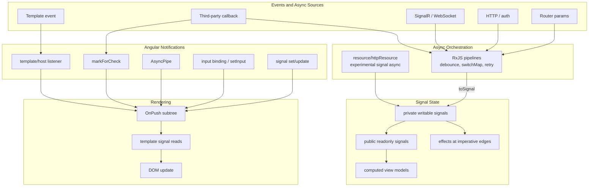

## Table of Contents

[🧠 **View Interactive Mindmap**](./change-detection-signals-mindmap.md)

1. [TL;DR](#tldr)
2. [Deep Dive](#deep-dive)
   2.1 [Rendering Model](#rendering-model)
      2.1.1 [Change Detection](#change-detection)
      2.1.2 [Zone.js and Zoneless Angular](#zonejs-and-zoneless-angular)
      2.1.3 [OnPush Strategy](#onpush-strategy)
      2.1.4 [Notification Sources](#notification-sources)
      2.1.5 [Zoneless-Ready Component Checklist](#zoneless-ready-component-checklist)
   2.2 [Signal Reactivity](#signal-reactivity)
      2.2.1 [Writable Signals](#writable-signals)
      2.2.2 [Computed Signals](#computed-signals)
      2.2.3 [Reactive Contexts and Tracking](#reactive-contexts-and-tracking)
      2.2.4 [Effects](#effects)
      2.2.5 [Signal Inputs, Outputs, and Models](#signal-inputs-outputs-and-models)
   2.3 [Advanced Signal APIs](#advanced-signal-apis)
      2.3.1 [linkedSignal](#linkedsignal)
      2.3.2 [Resource and httpResource](#resource-and-httpresource)
      2.3.3 [Equality Functions and Mutation Discipline](#equality-functions-and-mutation-discipline)
   2.4 [RxJS Interop and Architecture](#rxjs-interop-and-architecture)
      2.4.1 [toSignal and toObservable](#tosignal-and-toobservable)
      2.4.2 [RxJS vs Signals Boundaries](#rxjs-vs-signals-boundaries)
      2.4.3 [Testing Change Detection](#testing-change-detection)
      2.4.4 [AbortController and Async Cancellation](#abortcontroller-and-async-cancellation)
3. [Architecture & Data Flow](#architecture--data-flow)
4. [Real-World Examples](#real-world-examples)
   4.1 [Current tai-portal Zone Configuration](#current-tai-portal-zone-configuration)
   4.2 [Why tai-portal Stepped Back From Zoneless](#why-tai-portal-stepped-back-from-zoneless)
   4.3 [OnPush Signal Component](#onpush-signal-component)
   4.4 [toSignal for Responsive UI State](#tosignal-for-responsive-ui-state)
   4.5 [Effect for Input Synchronization](#effect-for-input-synchronization)
   4.6 [Zoneless-Compatible Signal Store](#zoneless-compatible-signal-store)
5. [Comparison Tables](#comparison-tables)
6. [Interview Q&A](#interview-qa)
   6.1 [L1: Junior Knowledge](#l1-junior-knowledge)
      6.1.1 [What is Change Detection?](#what-is-change-detection)
      6.1.2 [What is a Signal?](#what-is-a-signal)
   6.2 [L2: Mid-Level Knowledge](#l2-mid-level-knowledge)
      6.2.1 [OnPush vs Default](#onpush-vs-default)
      6.2.2 [computed vs effect](#computed-vs-effect)
      6.2.3 [Signals vs BehaviorSubject](#signals-vs-behaviorsubject)
   6.3 [L3: Senior Knowledge](#l3-senior-knowledge)
      6.3.1 [Zoneless Migration Strategy](#zoneless-migration-strategy)
      6.3.2 [RxJS and Signals Architecture](#rxjs-and-signals-architecture)
      6.3.3 [Debugging Stale UI](#debugging-stale-ui)
   6.4 [Staff: System Architecture](#staff-system-architecture)
      6.4.1 [Design a High-Performance Angular Portal](#design-a-high-performance-angular-portal)
      6.4.2 [Zoneless Migration Governance](#zoneless-migration-governance)
7. [Cross-References](#cross-references)
8. [Further Reading](#further-reading)

---

## TL;DR

Angular change detection is the synchronization system that turns TypeScript state into DOM updates. The 2026 senior-level model is <span style="color: #00C851; font-weight: bold;">notification-driven rendering</span>: use <span style="color: #33b5e5; font-weight: bold;">OnPush</span>, read <span style="color: #33b5e5; font-weight: bold;">signals</span> in templates, derive with <span style="color: #33b5e5; font-weight: bold;">computed()</span>, and reserve <span style="color: #33b5e5; font-weight: bold;">effect()</span> for imperative edges. Angular's current signals guide defines signals as values that notify consumers, with computed signals that are lazy, memoized, and dynamically tracked. The zoneless guide explains why removing Zone.js improves performance, Core Web Vitals, and debugging, but it also means arbitrary async callbacks no longer refresh the UI by accident. `tai-portal` intentionally still uses Zone.js because early history shows `identity-ui` hit login-flow timing/race issues when it was effectively zoneless; new code should still be written as <span style="color: #00C851; font-weight: bold;">zoneless-compatible</span>. RxJS remains essential for async streams, cancellation, debounce, retries, route streams, and SignalR/WebSocket coordination; signals are for synchronous UI state and derived rendering state.

---

## Deep Dive

### Rendering Model

#### Change Detection

##### What
<span style="color: #33b5e5; font-weight: bold;">Change detection</span> is Angular's rendering synchronization pass. Angular evaluates template bindings, compares values, and writes the minimum necessary DOM updates.

##### Why
Without a predictable change detection model, state changes become imperative DOM manipulation. In a fintech portal, that means stale permission buttons, incorrect row action visibility, flickering notification panels, and identity context that can lag behind the real auth state.

##### How
Angular has two separate concerns:

| Concern | Question | Examples |
|---------|----------|----------|
| **Notification** | What tells Angular something may have changed? | input update, signal write, event listener, `AsyncPipe`, `markForCheck()` |
| **Checking** | Which templates does Angular evaluate? | default tree walk, OnPush subtree, signal-dependent view |

Signals improve the notification side because Angular knows which templates read which signal values. When a signal read by an `OnPush` template changes, Angular marks that component for update.

```typescript
@Component({
  selector: 'tai-status-pill',
  standalone: true,
  changeDetection: ChangeDetectionStrategy.OnPush,
  template: `
    @if (isLoading()) {
      <span>Loading</span>
    } @else {
      <span [textContent]="status()"></span>
    }
  `,
})
export class StatusPillComponent {
  readonly status = input.required<string>();
  readonly isLoading = input(false);
}
```

##### When
Think about change detection whenever state crosses an async or component boundary: inputs, HTTP responses, SignalR callbacks, browser APIs, timers, form controls, custom events, and third-party widgets.

##### Trade-offs
<span style="color: #ff4444; font-weight: bold;">The anti-pattern is hidden mutation plus forced rendering.</span> Calling `detectChanges()` until the UI appears correct usually hides the real problem: the state mutation did not notify Angular through a production path.

---

#### Zone.js and Zoneless Angular

##### What
<span style="color: #33b5e5; font-weight: bold;">Zone.js</span> monkey-patches async browser APIs and tells Angular to synchronize after async work. <span style="color: #33b5e5; font-weight: bold;">Zoneless Angular</span> removes that global patching dependency and relies on explicit Angular-visible notifications.

##### Why
Zone.js is convenient, but it treats async activity as a proxy for state changes. The Angular zoneless guide highlights three core advantages of removing it: fewer unnecessary synchronization passes, better Core Web Vitals from less payload/startup overhead, and clearer debugging because Zone.js no longer rewrites async behavior.

##### How
Zone-based bootstrapping:

```typescript
export const appConfig: ApplicationConfig = {
  providers: [
    provideZoneChangeDetection({ eventCoalescing: true }),
    provideRouter(appRoutes),
  ],
};
```

Zoneless bootstrapping:

```typescript
bootstrapApplication(AppComponent, {
  providers: [
    provideZonelessChangeDetection(),
    provideRouter(appRoutes),
  ],
});
```

Zoneless-compatible code updates the UI through explicit notifications:

- signal writes read by templates
- `ComponentRef.setInput()` / normal parent input binding
- template or host listener callbacks
- `AsyncPipe`
- `ChangeDetectorRef.markForCheck()`
- view attachment/removal operations that Angular tracks

##### When
Use zoneless as the target architecture for new Angular apps and new reusable components. Keep Zone.js in an existing enterprise app when third-party libraries, test infrastructure, Storybook, auth flows, or legacy components still rely on zone-based scheduling.

##### Trade-offs
<span style="color: #ffbb33; font-weight: bold;">Zoneless is stricter by design.</span> Code that mutates a plain field inside `setTimeout`, a raw WebSocket callback, or a third-party callback may become stale unless it writes a signal or calls `markForCheck()`. That strictness improves correctness once the codebase is ready, but it exposes old timing assumptions during migration.

---

#### OnPush Strategy

##### What
<span style="color: #33b5e5; font-weight: bold;">ChangeDetectionStrategy.OnPush</span> lets Angular skip a component subtree unless that subtree receives a relevant notification.

##### Why
Without OnPush, Angular may walk large parts of the component tree after unrelated work. In a portal with data tables, transfer lists, dashboards, forms, and notification drawers, broad checks make performance noisy and harder to reason about.

##### How
Angular's current OnPush guidance says a subtree is checked when it receives new inputs from template binding or when Angular handles an event in that subtree. Modern signal reads add a more precise path: a signal read in an OnPush template marks that component when it changes.

```typescript
@Component({
  selector: 'tai-data-table-summary',
  standalone: true,
  changeDetection: ChangeDetectionStrategy.OnPush,
  template: `
    <p>
      Showing {{ pageStart() }} to {{ pageEnd() }} of {{ totalCount() }}
    </p>
  `,
})
export class DataTableSummaryComponent {
  readonly pageIndex = input(1);
  readonly pageSize = input(10);
  readonly totalCount = input(0);

  readonly pageStart = computed(() => {
    if (this.totalCount() === 0) return 0;
    return (this.pageIndex() - 1) * this.pageSize() + 1;
  });

  readonly pageEnd = computed(() =>
    Math.min(this.pageIndex() * this.pageSize(), this.totalCount()),
  );
}
```

##### When
Use OnPush by default for design-system components, feature components, dashboards, tables, and presentational UI. Be more cautious with old wrapper components that project arbitrary legacy content.

##### Trade-offs
<span style="color: #ff4444; font-weight: bold;">OnPush punishes mutable input habits.</span> Mutating `user.name` without replacing the `user` reference may not update a child. Prefer immutable updates, signal `.set()` / `.update()`, and recreating arrays/maps/sets when their contents change.

---

#### Notification Sources

##### What
A <span style="color: #33b5e5; font-weight: bold;">notification source</span> is the mechanism that tells Angular a view may need to update.

##### Why
This is the core senior interview insight. Performance bugs, stale UI bugs, and zoneless migration issues are usually notification bugs, not template bugs.

##### How
Use this checklist when debugging stale UI:

| State changed in... | Correct notification path |
|---------------------|---------------------------|
| Component local UI state | `signal.set()` / `signal.update()` |
| Parent to child data | input binding or `componentRef.setInput()` |
| Observable in template | `AsyncPipe` |
| Observable in service/store | subscribe once and write a signal, or expose Observable to `toSignal()` |
| Third-party callback | write a signal or call `markForCheck()` |
| DOM event in template | Angular listener already notifies |
| Manual DOM mutation | avoid, or isolate behind effect/render hook and notify state separately |

##### When
Use this model before reaching for `detectChanges()`. Ask: "What changed, and what notification did Angular receive?"

##### Trade-offs
<span style="color: #ffbb33; font-weight: bold;">The notification model makes architecture visible.</span> It requires more discipline than relying on Zone.js, but it gives senior engineers a clear way to debug rendering.

---

#### Zoneless-Ready Component Checklist

##### What
A <span style="color: #00C851; font-weight: bold;">zoneless-ready component</span> is a component whose UI updates through Angular-visible notifications instead of relying on Zone.js to notice arbitrary async work.

##### Why
Making all template-read local state a signal is a strong start, but it is not enough by itself. A production component also needs signal inputs, computed derivations, immutable updates, explicit async boundaries, and safe handling for external callbacks.

##### How
Use this hierarchy when designing component state:

1. **Template-read local state: use signals**

```typescript
readonly isOpen = signal(false);
readonly selectedUserId = signal<string | null>(null);
readonly selectedRows = signal<ReadonlySet<string>>(new Set());
```

Avoid plain mutable fields for state read by the template:

```typescript
// Avoid for template state: easy to mutate without notification.
isOpen = false;
```

2. **Derived state: use `computed()`**

```typescript
readonly selectedUser = computed(() =>
  this.users().find((user) => user.id === this.selectedUserId()) ?? null,
);
```

3. **Input state: use `input()` for new components**

```typescript
readonly user = input<User | null>(null);
readonly disabled = input(false);
```

4. **User intent: use `output()` or explicit command methods**

```typescript
readonly saved = output<User>();

save(): void {
  this.saved.emit(this.formValue());
}
```

5. **Async HTTP/event streams: use RxJS, then bridge**

```typescript
readonly users = toSignal(
  toObservable(this.searchTerm).pipe(
    debounceTime(300),
    distinctUntilChanged(),
    switchMap((term) =>
      this.http.get<User[]>('/api/users', {
        params: { q: term },
      }),
    ),
  ),
  { initialValue: [] },
);
```

6. **External callbacks: write a signal or call `markForCheck()`**

```typescript
thirdPartyWidget.onStatusChanged((status) => {
  this.widgetStatus.set(status);
});
```

If state cannot reasonably be signal-based, notify explicitly:

```typescript
thirdPartyWidget.onLayoutChanged(() => {
  this.cdr.markForCheck();
});
```

7. **Immutable updates**

```typescript
// Avoid: same array reference, consumers may not be notified correctly.
this.users().push(newUser);

// Prefer: new array reference.
this.users.update((users) => [...users, newUser]);
```

```typescript
// Avoid: deep mutation of object inside signal.
this.user()!.name = 'Jane';

// Prefer: replace the object.
this.user.update((user) =>
  user ? { ...user, name: 'Jane' } : user,
);
```

8. **OnPush by default**

```typescript
@Component({
  changeDetection: ChangeDetectionStrategy.OnPush,
})
export class UserCardComponent {}
```

9. **Avoid effects for normal state propagation**

Use `computed()` for derived state, RxJS for async orchestration, and `effect()` only for imperative edges such as storage, analytics, focus, charts, and third-party widgets.

10. **Tests use production notification paths**

```typescript
fixture.componentRef.setInput('user', user);
await fixture.whenStable();
```

Avoid relying on repeated `fixture.detectChanges()` as the only proof that production rendering works.

##### When
Apply this checklist to every new design-system component and every feature component that should survive a future zoneless migration. It is especially important for components with tables, filters, dialogs, async data, role-aware controls, and third-party integrations.

##### Trade-offs
<span style="color: #ffbb33; font-weight: bold;">The practical rule is: any state read by the template should be an input, a signal/computed signal, an AsyncPipe value, or explicitly marked with `markForCheck()` after external mutation.</span> This is more disciplined than old Default change detection, but it makes rendering behavior predictable and testable.

---

### Signal Reactivity

#### Writable Signals

##### What
A <span style="color: #33b5e5; font-weight: bold;">writable signal</span> is synchronous reactive state created with `signal(initialValue)`. You read it by calling it like a function and update it with `.set()` or `.update()`.

##### Why
Without signals, simple UI state often becomes `BehaviorSubject`, manual subscriptions, or plain class fields that are easy to mutate without notifying Angular.

##### How
The enterprise pattern is private writable state plus public readonly exposure:

```typescript
type UsersStatus = 'idle' | 'loading' | 'loaded' | 'error';

@Injectable({ providedIn: 'root' })
export class UsersStore {
  private readonly _users = signal<User[]>([]);
  private readonly _status = signal<UsersStatus>('idle');
  private readonly _selectedUserId = signal<string | null>(null);

  readonly users = this._users.asReadonly();
  readonly status = this._status.asReadonly();
  readonly selectedUserId = this._selectedUserId.asReadonly();

  readonly selectedUser = computed(() =>
    this._users().find((user) => user.id === this._selectedUserId()) ?? null,
  );

  loadSucceeded(users: User[]): void {
    this._users.set(users);
    this._status.set('loaded');
  }

  selectUser(userId: string): void {
    this._selectedUserId.set(userId);
  }
}
```

##### When
Use signals for synchronous UI state: selected IDs, expanded rows, disabled flags, local form modes, cached server snapshots, loading status, and derived view models.

##### Trade-offs
Angular's docs are explicit that readonly signals do not protect against deep mutation. <span style="color: #ff4444; font-weight: bold;">A readonly signal containing an object can still hold a mutated object.</span> Treat signal values as immutable at the team convention level.

---

#### Computed Signals

##### What
<span style="color: #33b5e5; font-weight: bold;">computed()</span> creates a read-only signal derived from other signals. Angular computes it lazily, caches the result, and invalidates it when tracked dependencies change.

##### Why
Without computed signals, derived UI state gets duplicated into writable fields and drifts. Loading flags, filtered rows, role-aware menu items, pagination summaries, and initials should be calculated from source state.

##### How
Computed dependencies are dynamic. Angular tracks only the signals read during the latest derivation:

```typescript
readonly showAdvanced = signal(false);
readonly rawAuditRows = signal<AuditRow[]>([]);

readonly visibleAuditRows = computed(() => {
  if (!this.showAdvanced()) {
    return [];
  }

  return this.rawAuditRows().filter((row) => row.severity !== 'debug');
});
```

When `showAdvanced()` is false, `rawAuditRows()` is not a dependency. Updates to `rawAuditRows` do not invalidate `visibleAuditRows` until the branch reads it again.

##### When
Use `computed()` whenever a value can be derived synchronously and deterministically. If you are about to write an effect that copies one signal to another, first ask whether the value is really a computed derivation.

##### Trade-offs
<span style="color: #ff4444; font-weight: bold;">A computed signal must stay pure.</span> Do not call APIs, update signals, navigate, log analytics, write storage, or mutate external state inside `computed()`.

---

#### Reactive Contexts and Tracking

##### What
A <span style="color: #33b5e5; font-weight: bold;">reactive context</span> is a synchronous execution context where Angular tracks signal reads and creates producer/consumer dependencies.

##### Why
This is the missing detail behind many signal bugs. If a signal read is not tracked, changing that signal will not rerun the consumer.

##### How
Angular enters a reactive context while rendering templates, evaluating `computed()`, running `effect()` / `afterRenderEffect()`, evaluating `linkedSignal()`, and evaluating resource params/loaders. The context is synchronous only:

The easiest mental model is a temporary "currently collecting dependencies" frame on the JavaScript call stack:

```text
effect starts
  Angular sets active consumer = this effect
  read tenantId()      -> Angular records tenantId -> effect
  read permissions()   -> Angular records permissions -> effect
  effect returns
  Angular clears active consumer
```

After Angular clears that active consumer, later signal reads are just normal function calls. They return values, but they are not registered as dependencies of the original effect/computed/resource. `await` matters because it splits the function into two executions: the code before `await` runs now, then the code after `await` resumes later in a microtask after the original reactive context has ended.

```typescript
// Avoid: theme() is read after await, so it is not tracked by this effect.
effect(async () => {
  const user = await this.userApi.currentUser();
  this.themeLogger.log(user.id, this.theme());
});

// Prefer: read tracked signals before the async boundary.
effect(async () => {
  const theme = this.theme();
  const user = await this.userApi.currentUser();
  this.themeLogger.log(user.id, theme);
});
```

In the avoided version, changing `theme` later will not rerun the effect because `theme()` was read after the `await`. In the preferred version, `theme()` is read before the async boundary, while Angular is still collecting dependencies, so `theme` changes will rerun the effect and start a new async operation.

This distinction is most important when an async operation depends on signal state:

```typescript
// Broken: selectedTenantId is not tracked because it is read after await.
effect(async () => {
  await this.authReady();

  const tenantId = this.selectedTenantId();
  const rows = await this.auditApi.loadRows(tenantId);
  this.auditRows.set(rows);
});

// Correct: selectedTenantId is tracked before await.
effect(async (onCleanup) => {
  const tenantId = this.selectedTenantId();
  const abortController = new AbortController();

  onCleanup(() => abortController.abort());

  await this.authReady();

  const rows = await this.auditApi.loadRows(tenantId, {
    signal: abortController.signal,
  });
  this.auditRows.set(rows);
});
```

In the correct version, selecting a new tenant reruns the effect, cancels the old request, and starts a request for the new tenant. In the broken version, selecting a new tenant does nothing because Angular never learned that the effect depended on `selectedTenantId`.

The cancellation object in that example is <span style="color: #33b5e5; font-weight: bold;">AbortController</span>. It is the browser/JavaScript equivalent of a .NET `CancellationTokenSource`:

| JavaScript | .NET |
|------------|------|
| `AbortController` | `CancellationTokenSource` |
| `abortController.signal` | `CancellationToken` |
| `abortController.abort()` | `cts.Cancel()` |
| `fetch(url, { signal })` | `await client.GetAsync(url, cancellationToken)` |

The important distinction is that dependency tracking and cancellation solve different problems. Reading `selectedTenantId()` before `await` tells Angular when to rerun the effect. Registering `onCleanup(() => abortController.abort())` tells Angular how to cancel stale async work before the next run starts or before the component/store is destroyed.

In Angular `HttpClient` code, the same idea is usually expressed with RxJS cancellation instead of `AbortController`:

```typescript
readonly readyTenantId$ = combineLatest([
  toObservable(this.selectedTenantId),
  this.authReady$,
]).pipe(
  filter(([tenantId, authReady]) => tenantId !== null && authReady),
  map(([tenantId]) => tenantId as string),
  distinctUntilChanged(),
);

readonly auditRows$ = this.readyTenantId$.pipe(
  switchMap((tenantId) =>
    this.http.get<AuditRow[]>(`/api/tenants/${tenantId}/audit-logs`).pipe(
      catchError(() => of([])),
    ),
  ),
);
```

Here `readyTenantId$` names the prerequisite state: a selected tenant exists and auth is ready. The HTTP pipeline then has one clear `switchMap`, which cancels the previous Angular `HttpClient` request when a newer tenant ID arrives. Angular `HttpClient` treats that unsubscribe as request cancellation.

Nested `switchMap` is acceptable when each level represents a real dependent async step, but it is often harder to read and test. A senior-friendly pattern is to compose prerequisites into a named stream first, then use one `switchMap` for the cancellable request. Keep `catchError` inside the inner HTTP Observable so one failed request returns a fallback value without completing the outer tenant stream.

If the component/store wants signal-style consumption, bridge the Observable back once:

```typescript
readonly auditRows = toSignal(
  this.auditRows$.pipe(catchError(() => of([]))),
  { initialValue: [] },
);
```

The rule of thumb is: `effect + AbortController` fits `fetch`, resource loaders, and custom Promise APIs; `toObservable + switchMap` fits Angular `HttpClient` and Observable workflows.

Use `untracked()` for incidental reads that should not become dependencies:

```typescript
effect(() => {
  const userId = this.selectedUserId();

  untracked(() => {
    this.analytics.track('selected-user-changed', { userId });
  });
});
```

##### When
Care about reactive contexts when writing effects, computed derivations, custom helpers that read signals, and async resource loaders.

##### Trade-offs
<span style="color: #ffbb33; font-weight: bold;">Tracking is powerful because it is implicit.</span> The cost is that accidental reads create accidental dependencies, and reads after async boundaries create no dependency at all.

---

#### Effects

##### What
<span style="color: #33b5e5; font-weight: bold;">effect()</span> registers imperative work that reruns when signals read during its latest execution change.

##### Why
Signals need a bridge to non-reactive APIs: analytics, local storage, charts, canvas, browser APIs, focus management, and third-party widgets.

##### How
Use effects at imperative boundaries where there is no better reactive abstraction. Production examples should include the same operational safeguards as regular Angular code: platform guards for browser APIs, framework services instead of raw globals where available, cleanup for external resources, and explicit loading/error state for async UI.

```typescript
private readonly platformId = inject(PLATFORM_ID);
private readonly isBrowser = isPlatformBrowser(this.platformId);

constructor(private readonly logger: Logger) {
  effect(() => {
    if (!this.isBrowser) return;

    const theme = this.theme();

    try {
      localStorage.setItem('tai.theme', theme);
    } catch (error) {
      this.logger.warn('Unable to persist theme preference.', error);
    }
  });
}
```

Common real-world effect use cases:

| Use case | Why `effect()` fits |
|----------|---------------------|
| **localStorage/sessionStorage sync** | Browser storage is imperative, not reactive |
| **Analytics/telemetry events** | Tracking APIs are imperative sinks |
| **Document title/meta updates** | `document.title` and metadata APIs are browser side effects |
| **Focus management** | Moving focus uses DOM APIs |
| **Scroll positioning** | Scrolling selected rows or panels is imperative |
| **Canvas/chart/map rendering** | Third-party renderers need update/destroy calls |
| **Third-party widgets** | Non-Angular widgets need explicit synchronization |
| **Media playback** | `play`, `pause`, and `seek` are imperative APIs |
| **Observers/listeners outside RxJS** | Cleanup must be attached to the effect lifecycle |
| **Development logging** | Logging state transitions is an imperative diagnostic side effect |

Examples:

```typescript
// Analytics: fire only for real tenant changes, not duplicate emissions.
private lastTrackedTenantId: string | null = null;

constructor() {
  effect(() => {
    const tenantId = this.selectedTenantId();

    if (!tenantId || tenantId === this.lastTrackedTenantId) {
      return;
    }

    this.analytics.track('tenant_selected', { tenantId });
    this.lastTrackedTenantId = tenantId;
  });
}
```

```typescript
// Document title: use Angular's Title service instead of direct document writes.
private readonly title = inject(Title);

constructor() {
  effect(() => {
    this.title.setTitle(`${this.pageTitle()} | TAI Portal`);
  });
}
```

```typescript
// Focus: use Angular render scheduling so the input exists before focusing.
readonly isDialogOpen = signal(false);
private readonly firstInput =
  viewChild<ElementRef<HTMLInputElement>>('firstInput');

constructor() {
  effect(() => {
    if (!this.isDialogOpen()) {
      return;
    }

    afterNextRender(() => {
      this.firstInput()?.nativeElement.focus();
    });
  });
}
```

```typescript
// Chart: create once, update data, destroy on cleanup.
private chart: Chart | null = null;
private readonly canvas = viewChild<ElementRef<HTMLCanvasElement>>('chartCanvas');

constructor() {
  effect((onCleanup) => {
    const canvas = this.canvas()?.nativeElement;

    if (!canvas || this.chart) return;

    const chart = new Chart(canvas, {
      type: 'line',
      data: untracked(() => this.chartData()),
    });

    this.chart = chart;

    onCleanup(() => {
      chart.destroy();
      if (this.chart === chart) {
        this.chart = null;
      }
    });
  });

  effect(() => {
    const data = this.chartData();
    const chart = this.chart;

    if (!chart) return;

    chart.data = data;
    chart.update('none');
  });
}
```

For HTTP and most service calls in Angular, do not make `effect()` the orchestration layer. `HttpClient` returns Observables, so compose the changing inputs and HTTP result with RxJS, then bridge the final stream back to a signal if the template wants signal-style reads:

```typescript
type LoadState<T> =
  | { status: 'idle'; data: T; error: null }
  | { status: 'loading'; data: T; error: null }
  | { status: 'loaded'; data: T; error: null }
  | { status: 'error'; data: T; error: unknown };

readonly searchTerm = signal('');

readonly usersState = toSignal(
  toObservable(this.searchTerm).pipe(
    debounceTime(300),
    distinctUntilChanged(),
    switchMap((term) =>
      this.http.get<User[]>('/api/users', {
        params: { q: term },
      }).pipe(
        map((users): LoadState<User[]> => ({
          status: 'loaded',
          data: users,
          error: null,
        })),
        startWith({
          status: 'loading',
          data: [],
          error: null,
        } satisfies LoadState<User[]>),
        catchError((error) =>
          of({
            status: 'error',
            data: [],
            error,
          } satisfies LoadState<User[]>),
        ),
      ),
    ),
  ),
  { initialValue: { status: 'idle', data: [], error: null } },
);
```

This preserves the older Angular best practice: compose change events and HTTP results as streams. Signals improve the component-facing state, but RxJS remains the right place for debounce, cancellation, retry, error handling, and concurrency semantics.

Use the operator that matches the user intent:

| User intent | Operator | Example |
|-------------|----------|---------|
| Latest value wins | `switchMap` | search, route param load, tenant switch |
| Preserve order | `concatMap` | queued saves |
| Ignore duplicates while busy | `exhaustMap` | login/submit button |
| Allow parallel work | `mergeMap` | independent uploads |

Do not use effects as the default state propagation tool:

```typescript
// Avoid: derived state copied by effect.
effect(() => {
  this.fullName.set(`${this.firstName()} ${this.lastName()}`);
});

// Prefer: derived state expressed directly.
readonly fullName = computed(() => `${this.firstName()} ${this.lastName()}`);
```

##### When
Use effects for side effects that cannot be modeled as template binding, computed state, RxJS stream composition, or explicit command methods. Before writing an effect, ask:

1. Can this be template binding?
2. Can this be `computed()`?
3. Can this be an explicit event handler or command method?
4. Is this truly synchronizing with an imperative external API?

If the answer to the fourth question is yes, `effect()` is probably appropriate. Avoid `HttpClient.subscribe()` inside effects as the default pattern; it is usually a smell that async orchestration belongs in RxJS.

##### Trade-offs
<span style="color: #ff4444; font-weight: bold;">Effects can create hidden dependency graphs.</span> Effects that write signals or subscribe to Observables can cause loops, stale assumptions, duplicate requests, missed cancellation, and `ExpressionChangedAfterItHasBeenChecked` errors. Treat signal-writing effects and subscription effects as exceptions that must be justified.

---

#### Signal Inputs, Outputs, and Models

##### What
<span style="color: #33b5e5; font-weight: bold;">input()</span>, <span style="color: #33b5e5; font-weight: bold;">output()</span>, and <span style="color: #33b5e5; font-weight: bold;">model()</span> are modern component boundary APIs. `input()` gives reactive input reads, `output()` emits events, and `model()` supports two-way component state.

##### Why
Without signal inputs, component inputs are less ergonomic to compose with `computed()`. With signal inputs, presentational components can derive display state without manual lifecycle hooks.

##### How
Use signal inputs in presentational components:

```typescript
@Component({
  selector: 'tai-user-profile',
  standalone: true,
  changeDetection: ChangeDetectionStrategy.OnPush,
  template: `
    <button type="button" (click)="logout.emit()">
      <span [textContent]="initials()"></span>
    </button>
  `,
})
export class UserProfileComponent {
  readonly user = input<UserProfile | null>(null);
  readonly logout = output<void>();

  readonly initials = computed(() => {
    const user = this.user();
    if (!user?.name) return '';
    return user.name
      .split(' ')
      .map((part) => part[0])
      .join('')
      .slice(0, 2)
      .toUpperCase();
  });
}
```

##### When
Use signal inputs and outputs for new Angular components. Use legacy decorators only when maintaining old APIs or where a library requires decorator metadata.

##### Trade-offs
<span style="color: #ffbb33; font-weight: bold;">Signal component APIs change test style.</span> Prefer `fixture.componentRef.setInput()` over assigning fields directly because it mirrors Angular's real input notification path.

---

### Advanced Signal APIs

#### linkedSignal

##### What
<span style="color: #33b5e5; font-weight: bold;">linkedSignal()</span> creates writable state that is linked to another reactive source and can reset or reconcile when that source changes.

##### Why
Without `linkedSignal()`, dependent writable state often becomes an effect that watches a source and mutates another signal. That can work, but the relationship is harder to reason about.

##### How
Use it for state that follows a source collection but can still be changed by the user:

```typescript
readonly availableTenants = input.required<Tenant[]>();

readonly selectedTenant = linkedSignal({
  source: this.availableTenants,
  computation: (tenants, previous) => {
    const previousId = previous?.value?.id;
    return tenants.find((tenant) => tenant.id === previousId) ?? tenants[0] ?? null;
  },
});
```

##### When
Use `linkedSignal()` for selected item, selected tab, active role, or selected tenant when the valid options can change.

##### Trade-offs
<span style="color: #ffbb33; font-weight: bold;">linkedSignal is more specialized than computed.</span> Use computed for pure readonly derivations; use linkedSignal only when the derived value must remain writable.

---

#### Resource and httpResource

##### What
<span style="color: #33b5e5; font-weight: bold;">resource()</span> models async state in signal form. <span style="color: #33b5e5; font-weight: bold;">httpResource()</span> is the Angular HTTP-specific wrapper that integrates with Angular's HTTP stack.

##### Why
All basic signal APIs are synchronous, but applications need server data. Resource APIs give async data a signal-friendly shape: value, loading, error, status, reload, and cancellation.

##### How
The Angular resource guide marks `resource()` as experimental in current docs. It supports reactive params and aborts outstanding loads when params change:

```typescript
readonly userId = input.required<string>();

readonly userResource = resource({
  params: () => ({ id: this.userId() }),
  loader: ({ params, abortSignal }) =>
    fetch(`/api/users/${params.id}`, { signal: abortSignal }).then((r) => r.json()),
});

readonly displayName = computed(() => {
  if (!this.userResource.hasValue()) return 'Unknown user';
  return this.userResource.value().name;
});
```

##### When
Use resources cautiously for leaf-level data fetching where the team accepts the experimental API. In enterprise apps with established service layers, interceptors, retries, telemetry, and complex cancellation, RxJS service pipelines plus `toSignal()` are still the safer default.

##### Trade-offs
<span style="color: #ffbb33; font-weight: bold;">Resource APIs are promising but still moving.</span> For interviews, anchor on stable signals, computed, effects, RxJS interop, and OnPush first; mention resources as the emerging async signal model.

---

#### Equality Functions and Mutation Discipline

##### What
Signals use equality to decide whether a new value should notify consumers. By default, Angular uses `Object.is`; custom equality functions can be provided for writable and computed signals.

##### Why
Equality controls invalidation. In large UIs, unnecessary invalidation wastes render work; missed invalidation creates stale UI.

##### How
Use default referential equality for most application state:

```typescript
readonly filters = signal<AuditFilters>({
  search: '',
  severities: [],
});

updateSearch(search: string): void {
  this.filters.update((current) => ({ ...current, search }));
}
```

Use custom equality sparingly:

```typescript
readonly selectedIds = signal<string[]>([], {
  equal: (a, b) => a.length === b.length && a.every((id, i) => id === b[i]),
});
```

##### When
Use default equality unless a specific hot path proves it needs custom comparison. Prefer immutable updates over deep equality.

##### Trade-offs
<span style="color: #ff4444; font-weight: bold;">Deep equality can hide bad state design and add CPU cost.</span> If every update needs a deep comparison, the state may be too large or too coarsely modeled.

---

### RxJS Interop and Architecture

#### toSignal and toObservable

##### What
<span style="color: #33b5e5; font-weight: bold;">toSignal()</span> converts an Observable into a signal. <span style="color: #33b5e5; font-weight: bold;">toObservable()</span> exposes a signal as an Observable.

##### Why
Without interop, teams tend to force everything into one abstraction. The local [[RxJS-Signals]] note covers this in depth: RxJS is event-driven async reactivity; signals are state-driven synchronous reactivity.

##### How
Use `toSignal()` once at the component/store boundary:

```typescript
readonly isSmallScreen = toSignal(
  this.breakpointObserver.observe('(max-width: 768px)').pipe(
    map((result) => result.matches),
  ),
  { initialValue: false },
);
```

Use `toObservable()` when a signal needs stream operators:

```typescript
readonly searchResults$ = toObservable(this.searchTerm).pipe(
  debounceTime(300),
  distinctUntilChanged(),
  switchMap((term) => this.usersApi.search(term)),
);
```

##### When
Use `toSignal()` for route params, form streams, media queries, and service Observables consumed by templates. Use `toObservable()` for debounce, cancellation, retries, or multi-source stream composition.

##### Trade-offs
<span style="color: #ff4444; font-weight: bold;">Do not create interop bridges inside computed functions, loops, or frequently called methods.</span> Create the bridge once in an injection context so subscriptions are stable and cleanup is automatic.

---

#### RxJS vs Signals Boundaries

##### What
The <span style="color: #33b5e5; font-weight: bold;">hybrid architecture</span> uses RxJS for async orchestration and signals for component-facing state.

##### Why
Signals do not replace cancellation, backpressure, retries, multicasting, or time-based operators. RxJS does not need to model every local boolean, selected row, or derived label.

##### How
Use this decision rule:

```text
Synchronous state read by the template?
  signal/computed.

Async, cancellable, time-based, or multi-source stream?
  RxJS.

Observable needs to be read in a signal template?
  toSignal once at the boundary.

Signal needs debounce/switchMap/retry?
  toObservable into an RxJS pipeline.
```

##### When
Use the hybrid model in enterprise apps with HTTP APIs, auth flows, SignalR/WebSocket messages, route streams, and rich UI state.

##### Trade-offs
<span style="color: #ffbb33; font-weight: bold;">The hard part is not syntax; it is ownership.</span> Services should not expose random writable signals to components, and components should not embed complex retry/cancellation pipelines that belong in services.

---

#### Testing Change Detection

##### What
Change detection tests verify that Angular receives the same notifications in tests that it receives in production.

##### Why
Without production-like tests, `fixture.detectChanges()` can hide missing notifications. A test can pass because it forced a render that the real app would never schedule.

##### How
Prefer input updates, user events, signal writes, and `whenStable()`:

```typescript
it('updates initials when the input changes', async () => {
  fixture.componentRef.setInput('user', { name: 'Jane Smith' });
  await fixture.whenStable();

  expect(fixture.nativeElement.textContent).toContain('JS');
});
```

For reusable components, add selective zoneless tests:

```typescript
await TestBed.configureTestingModule({
  imports: [UserProfileComponent],
  providers: [provideZonelessChangeDetection()],
}).compileComponents();
```

##### When
Use zoneless-style tests for design-system components and critical UI flows. Keep zone-based tests where the app still intentionally uses Zone.js, but avoid writing new tests that only pass because they repeatedly call `detectChanges()`.

##### Trade-offs
<span style="color: #ffbb33; font-weight: bold;">Zoneless tests are stricter.</span> They expose stale UI earlier, but they may force legacy components to clean up hidden scheduling assumptions.

---

#### AbortController and Async Cancellation

##### What
<span style="color: #33b5e5; font-weight: bold;">AbortController</span> is the standard browser cancellation primitive. It creates an `AbortSignal` that can be passed to async APIs such as `fetch`, Angular resource loaders, streams, and custom APIs that support cancellation.

##### Why
Without cancellation, old async work can finish after newer user intent and overwrite the UI with stale data. This is the same class of problem that .NET solves with `CancellationTokenSource` and `CancellationToken`.

```text
Tenant A selected -> request A starts
Tenant B selected -> request B starts
Request B finishes -> UI shows tenant B rows
Request A finishes later -> UI incorrectly shows tenant A rows
```

##### How
Use one controller per async operation or per effect run:

```typescript
effect(async (onCleanup) => {
  const tenantId = this.selectedTenantId();
  const controller = new AbortController();

  onCleanup(() => controller.abort());

  const response = await fetch(`/api/tenants/${tenantId}/audit-logs`, {
    signal: controller.signal,
  });

  this.auditRows.set(await response.json());
});
```

When `selectedTenantId` changes, Angular reruns the effect. Before the new run starts, `onCleanup` aborts the old request. The new run captures the new tenant ID and starts fresh work.

AbortController is also useful for explicit timeout handling:

```typescript
const controller = new AbortController();
const timeoutId = setTimeout(() => controller.abort(), 5000);

try {
  const response = await fetch('/api/audit-logs', {
    signal: controller.signal,
  });

  return await response.json();
} finally {
  clearTimeout(timeoutId);
}
```

##### When
Use `AbortController` when a newer user action makes older async work obsolete:

- search/typeahead when the user keeps typing
- route, tenant, account, or user context switch
- modal/dialog closed while loading data
- component/store destroyed before async work finishes
- user-cancelled file upload or download
- long polling, streaming `fetch`, or readable streams
- request timeout handling
- Angular `resource()` loaders, which receive an abort signal
- custom APIs that accept `AbortSignal`

For Angular `HttpClient`, prefer RxJS cancellation:

```typescript
readonly rows$ = toObservable(this.selectedTenantId).pipe(
  switchMap((tenantId) =>
    this.http.get<AuditRow[]>(`/api/tenants/${tenantId}/audit-logs`),
  ),
);
```

`switchMap` unsubscribes from the previous HTTP request when the tenant changes. That is the Angular/RxJS equivalent of aborting stale work.

##### Trade-offs
<span style="color: #ffbb33; font-weight: bold;">AbortController only works when the async API honors the signal.</span> Native `fetch` does; many custom APIs need explicit support. In Angular apps, use `AbortController` for `fetch`, resource loaders, streams, and custom promise APIs; use RxJS operators such as `switchMap`, `takeUntilDestroyed`, and `finalize` for `HttpClient` and Observable-based workflows.

---

## Architecture & Data Flow



The senior mental model: async work is not rendering. Async work must cross a notification boundary before Angular updates the DOM.

---

## Real-World Examples

### Current tai-portal Zone Configuration

`📍 From tai-portal:` `apps/portal-web/src/app/app.config.ts`

`tai-portal` currently uses zone-based change detection with event coalescing:

```typescript
export const appConfig: ApplicationConfig = {
  providers: [
    provideZoneChangeDetection({ eventCoalescing: true }),
    provideRouter(appRoutes),
    { provide: PrivilegeChecker, useExisting: AuthService },
    provideHttpClient(withInterceptors([authInterceptor(), dpopInterceptor])),
  ],
};
```

This is an intentional compatibility choice, not a reason to write Zone-dependent components. New design-system code should still use OnPush, signal inputs, computed derivations, and explicit RxJS/signal boundaries.

### Why tai-portal Stepped Back From Zoneless

`📍 From tai-portal history:` commit `87ebace` on 2026-03-03

Early history indicates `identity-ui` was effectively zoneless: it had no `zone.js` polyfill and no `provideZoneChangeDetection`. Commit `87ebace` added both and changed login submission from "set credentials, wait for the next tick, submit hidden form" to "write native input values directly, submit immediately."

The likely root cause was an identity login race:

```typescript
// Old pattern from history: fragile under zoneless timing.
this.credentials = data;

setTimeout(() => {
  const form = this.hiddenForm()?.nativeElement;
  form?.submit();
});
```

In zoneless mode, `setTimeout` is just an async callback. It does not imply Angular will refresh bindings first. The fixed approach writes values directly to the native form before submit, removing the rendering race. Storybook is currently coupled to the zone-based `portal-web:build`, but the early commit history points to the identity login flow as the concrete rollback reason.

### OnPush Signal Component

`📍 From tai-portal:` `libs/ui/design-system/src/lib/organisms/user-profile/user-profile.component.ts`

The user profile component uses OnPush, a signal input, and computed initials:

```typescript
@Component({
  selector: 'tai-user-profile',
  standalone: true,
  changeDetection: ChangeDetectionStrategy.OnPush,
})
export class UserProfileComponent {
  user = input<UserProfile | null>(null);
  logout = output<void>();

  initials = computed(() => {
    const user = this.user();
    if (!user?.name) return '';
    const names = user.name.split(' ');
    if (names.length === 1) return names[0].charAt(0).toUpperCase();
    return (
      names[0].charAt(0) + names[names.length - 1].charAt(0)
    ).toUpperCase();
  });
}
```

This is the right design-system pattern: input state enters through a reactive boundary, display state is computed, and events leave through outputs.

### toSignal for Responsive UI State

`📍 From tai-portal:` `libs/ui/design-system/src/lib/organisms/transfer-list/transfer-list.ts`

The transfer list bridges CDK `BreakpointObserver` from RxJS into signal state:

```typescript
public readonly isSmallScreen = toSignal(
  this.breakpointObserver
    .observe([Breakpoints.XSmall, Breakpoints.Small])
    .pipe(map((result) => result.matches)),
  { initialValue: false },
);
```

This is a good boundary: media query observation is async/event-based, but the template wants synchronous state.

### Effect for Input Synchronization

`📍 From tai-portal:` `libs/ui/design-system/src/lib/organisms/data-table/data-table.ts`

The data table synchronizes input sort values into internal component state:

```typescript
constructor() {
  effect(
    () => {
      const colId = this.sortColumnId();
      const dir = this.sortDirection();
      if (colId && dir) {
        this.sortState.set({ columnId: colId, direction: dir });
      } else {
        this.sortState.set(null);
      }
    },
    { allowSignalWrites: true },
  );
}
```

This is acceptable as an adapter from externally controlled inputs into local UI state, but it should stay small and intentional. In newer code, evaluate whether `linkedSignal()` can express the same relationship without a signal-writing effect.

### Zoneless-Compatible Signal Store

`🔧 Fits tai-portal:` privilege-aware navigation state

```typescript
@Injectable({ providedIn: 'root' })
export class NavigationStore {
  private readonly _privileges = signal<ReadonlySet<string>>(new Set());
  private readonly _tenantId = signal<string | null>(null);

  readonly privileges = this._privileges.asReadonly();
  readonly tenantId = this._tenantId.asReadonly();

  readonly canManageUsers = computed(() =>
    this._privileges().has('users.manage'),
  );

  readonly visibleAdminItems = computed(() => {
    const items: NavItem[] = [];
    if (this.canManageUsers()) {
      items.push({ label: 'Users', route: '/users' });
    }
    return items;
  });

  setSession(session: { tenantId: string; privileges: string[] }): void {
    this._tenantId.set(session.tenantId);
    this._privileges.set(new Set(session.privileges));
  }
}
```

This store is zoneless-compatible because every UI-relevant async result eventually writes a signal. No component relies on Zone.js to notice a plain field mutation.

---

## Comparison Tables

| Dimension | Zone.js Change Detection | Zoneless Change Detection |
|-----------|--------------------------|---------------------------|
| **Mental model** | Patched async work may trigger synchronization | Explicit Angular notifications trigger synchronization |
| **Performance** | More global checks | More precise checks |
| **Startup/Core Web Vitals** | Extra dependency and monkey patching | Less payload and startup overhead |
| **Debugging** | Async stack traces can be harder to reason about | Causality is clearer |
| **Failure mode** | Hidden async mutations appear to work | Missing notifications create stale UI |
| **tai-portal choice** | Current mandated mode | Target compatibility style for new code |

| Dimension | Default Change Detection | OnPush |
|-----------|--------------------------|--------|
| **Mental model** | Check broadly after many events | Skip subtrees unless notified |
| **Best use** | Legacy migration, simple prototypes | Production UI and design-system components |
| **State style** | More forgiving of mutation | Immutable inputs and signals |
| **Performance** | Simpler but noisier | More predictable at scale |
| **Interview stance** | Know it, avoid new reliance | Default choice for serious Angular apps |

| Dimension | Signals | RxJS |
|-----------|---------|------|
| **Mental model** | Synchronous state cell | Async stream over time |
| **Best use** | UI state, derived state, template reads | HTTP, WebSocket, debounce, cancellation, retries |
| **Composition** | `computed`, `linkedSignal`, `effect` | `switchMap`, `combineLatest`, `retry`, `shareReplay` |
| **Failure mode** | Overusing effects for orchestration | Overusing Subjects for local state |
| **tai-portal pattern** | Stores and components | Services and async event flows |

| Dimension | computed() | effect() |
|-----------|------------|----------|
| **Purpose** | Pure derived value | Imperative side effect |
| **Execution** | Lazy and memoized | Runs when tracked dependencies change |
| **State writes** | Never | Rare, justified, carefully bounded |
| **Best use** | filtered rows, flags, summaries | analytics, storage, third-party APIs |
| **Senior rule** | Prefer first | Last resort for non-reactive edges |

| Dimension | AsyncPipe | toSignal |
|-----------|-----------|----------|
| **Use case** | Template-only Observable consumption | Component/store needs synchronous latest value |
| **Subscription cleanup** | Automatic | Automatic in injection context |
| **Initial value** | Template handles null/undefined | Usually provide `initialValue` |
| **Best fit** | Simple Observable display | Computed derivations over Observable output |
| **Gotcha** | Less convenient for TypeScript derivation | Do not create repeatedly |

---

## Interview Q&A

### L1: Junior Knowledge

#### What is Change Detection?
**Difficulty:** L1 (Junior)

**Question:** What is Angular change detection?

**Answer:** Change detection is Angular's process for synchronizing component state with the DOM. It evaluates template bindings and updates the DOM when values changed. Modern Angular improves this with <span style="color: #33b5e5; font-weight: bold;">signals</span>, which tell Angular where state is read.

---

#### What is a Signal?
**Difficulty:** L1 (Junior)

**Question:** What is an Angular signal?

**Answer:** A signal is a reactive wrapper around a value. You read it by calling it like `count()` and update writable signals with `set()` or `update()`. Angular tracks signal reads in templates and reactive contexts.

---

### L2: Mid-Level Knowledge

#### OnPush vs Default
**Difficulty:** L2 (Mid-Level)

**Question:** When should you use OnPush instead of Default change detection?

**Answer:** Use OnPush for production components because it lets Angular skip subtrees that did not receive a relevant notification. It works best with immutable inputs, signal reads, template events, and `AsyncPipe`. Default is easier in legacy code, but it hides performance cost by checking broadly. <span style="color: #ff4444; font-weight: bold;">The classic OnPush bug is mutating an input object in place and expecting the child to update.</span>

---

#### computed vs effect
**Difficulty:** L2 (Mid-Level)

**Question:** What is the difference between `computed()` and `effect()`?

**Answer:** `computed()` is for pure derived state and returns a signal. `effect()` is for imperative side effects such as analytics, local storage, focus management, or third-party widgets. If an effect copies one signal into another, the design is usually wrong. Prefer <span style="color: #00C851; font-weight: bold;">computed or linkedSignal</span> for state relationships.

---

#### Signals vs BehaviorSubject
**Difficulty:** L2 (Mid-Level)

**Question:** When would you use a signal instead of a `BehaviorSubject`?

**Answer:** Use a signal for synchronous UI state that the template reads directly: selected row, filters, expanded panels, loading flags, or cached server snapshots. Use `BehaviorSubject` or another Observable source when the value is part of an async stream pipeline, needs RxJS operators, or must be consumed by APIs expecting Observables. In modern Angular, many old `BehaviorSubject` stores become simpler as private writable signals plus computed selectors.

---

### L3: Senior Knowledge

#### Zoneless Migration Strategy
**Difficulty:** L3 (Senior)

**Question:** How would you migrate a large Angular app from Zone.js to zoneless change detection?

**Answer:** I would first make the app zoneless-compatible without removing Zone.js. That means new components use OnPush, signal inputs, computed derivations, immutable updates, and explicit RxJS/signal boundaries. Next I would audit async callbacks: SignalR, timers, DOM APIs, third-party libraries, auth libraries, Storybook, and test setup. Any callback that mutates plain fields must instead write a signal or call `markForCheck()`. Then I would add selective `provideZonelessChangeDetection()` tests for design-system components and a small shell app before switching the main app. <span style="color: #00C851; font-weight: bold;">The safe sequence is compatibility first, provider switch second, Zone.js removal last.</span>

---

#### RxJS and Signals Architecture
**Difficulty:** L3 (Senior)

**Question:** In a 2026 Angular app, do signals replace RxJS?

**Answer:** No. Signals replace a lot of local component state and derived UI state, but RxJS remains the better abstraction for async streams. A typeahead search still needs debounce, cancellation, error handling, and stale request prevention; `switchMap` is built for that. The clean architecture is RxJS in services for async orchestration, signals in stores/components for state, and `toSignal()` or `toObservable()` at the boundary. <span style="color: #ffbb33; font-weight: bold;">The trade-off is enforcing the boundary consistently.</span>

---

#### Debugging Stale UI
**Difficulty:** L3 (Senior)

**Question:** A component has fresh data in TypeScript but the DOM is stale. How do you debug it?

**Answer:** I first identify where the state changed and whether Angular received a notification. If the state is a plain field changed inside a timer, WebSocket callback, or third-party event, that is suspicious in zoneless and fragile even with Zone.js. I check whether the template reads a signal, an input, an Observable through `AsyncPipe`, or something that requires `markForCheck()`. I also check for mutable input updates, especially arrays, maps, sets, and object properties under OnPush. I do not start by adding `detectChanges()`; that can make the test pass while production remains broken. The right fix is usually to move the state into a signal, replace an object reference immutably, or mark the view through a deliberate boundary.

---

### Staff: System Architecture

#### Design a High-Performance Angular Portal
**Difficulty:** Staff

**Question:** Design the rendering and state architecture for a high-performance Angular admin portal with dashboards, data tables, auth, and real-time notifications.

**Answer:** I would use standalone Angular components with OnPush by default and make every new component zoneless-compatible. Services would own async streams: HTTP, auth state, route params, DPoP/nonce retry, and SignalR notifications. Feature stores would expose private writable signals, public readonly signals, and computed selectors for UI state such as loading flags, filtered rows, permission-aware actions, and notification counts. Components would consume signals directly in templates and bridge Observables with `toSignal()` only once at the boundary. Effects would be limited to imperative integrations such as analytics, local storage, focus management, and third-party widgets. For real-time streams, I would batch or debounce in RxJS before writing a signal to avoid render storms. Testing would include Storybook interaction tests, component tests that use `setInput()` and `whenStable()`, selective zoneless TestBed tests, and e2e coverage for auth/tenant/privilege flows. At scale, I would measure change detection cost, table virtualization, bundle size, and Core Web Vitals rather than assuming signals alone solve performance.

---

#### Zoneless Migration Governance
**Difficulty:** Staff

**Question:** How would you govern a zoneless migration across a fintech monorepo?

**Answer:** I would treat zoneless as a compatibility program, not a single PR. First, define a rule for new UI: OnPush, signal inputs, immutable updates, no hidden async field mutation, and no tests that rely on repeated `detectChanges()` as proof of production behavior. Second, create a risk inventory: auth libraries, Storybook, test setup, CDK overlays/menus, SignalR, timers, browser APIs, and any direct DOM integration. Third, add CI guardrails for design-system components with selective zoneless TestBed coverage and e2e flows for identity, tenant switching, privileges, and notifications. Fourth, migrate one app shell or low-risk route to `provideZonelessChangeDetection()` before the core portal. Finally, remove `zone.js` polyfills only after app runtime, Storybook, unit tests, and e2e all pass without compatibility exceptions. <span style="color: #ffbb33; font-weight: bold;">The governance point is to make implicit scheduling assumptions visible before they become production stale-UI bugs.</span>

---

## Cross-References

- [[Angular-Core]] - standalone components, DI, routing, providers, and Angular application structure.
- [[RxJS-Signals]] - deeper coverage of Observables, higher-order mapping, signal stores, and RxJS/signal bridge patterns.
- [[Performance-Optimization]] - Core Web Vitals, runtime profiling, rendering cost, and frontend performance trade-offs.
- [[Testing-Frontend]] - TestBed, Storybook, e2e, accessibility, and CSP-focused frontend verification.
- [[SignalR-Realtime]] - real-time streams, connection state, and where RxJS should remain the async orchestration layer.

---

## Further Reading

- Angular Signals guide: https://angular.dev/guide/signals
- Angular zoneless guide: https://angular.dev/guide/zoneless
- Angular RxJS interop: https://angular.dev/ecosystem/rxjs-interop
- Angular `linkedSignal`: https://angular.dev/guide/signals/linked-signal
- Angular Resource guide: https://angular.dev/guide/signals/resource
- Angular OnPush / skipping subtrees: https://angular.dev/best-practices/skipping-subtrees
- Angular component testing scenarios: https://angular.dev/guide/testing/components-scenarios
- Local companion note: [[RxJS-Signals]]

---

*Last updated: 2026-04-29*
