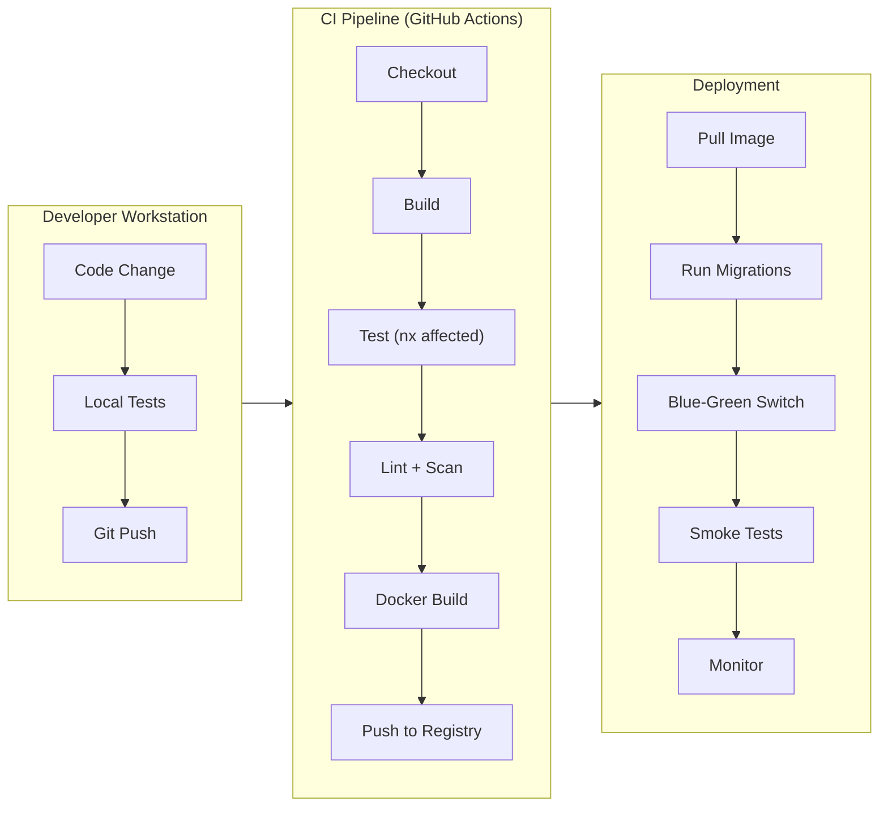

## Table of Contents

[🧠 **View Interactive Mindmap**](./ci-cd-devops-mindmap.md)

1. [TL;DR](#tldr)
2. [Deep Dive](#deep-dive)
   2.1 [Containerization](#concept-group-1-containerization)
      2.1.1 [Docker Fundamentals & Image Layers](#1-docker-fundamentals--image-layers)
      2.1.2 [Multi-Stage Builds for .NET & Angular](#2-multi-stage-builds-for-net--angular)
      2.1.3 [Docker Compose for Local Development](#3-docker-compose-for-local-development)
   2.2 [CI Pipeline](#concept-group-2-ci-pipeline)
      2.2.1 [Pipeline Stages — Build → Test → Lint → Scan → Artifact](#4-pipeline-stages--build--test--lint--scan--artifact)
      2.2.2 [Nx Affected for Monorepo CI](#5-nx-affected-for-monorepo-ci)
      2.2.3 [Branch Strategy & Trunk-Based Development](#6-branch-strategy--trunk-based-development)
   2.3 [Deployment Strategies](#concept-group-3-deployment-strategies)
      2.3.1 [Blue-Green & Canary Deployments](#7-blue-green--canary-deployments)
      2.3.2 [Database Migration Safety](#8-database-migration-safety)
      2.3.3 [Feature Flags & Progressive Rollout](#9-feature-flags--progressive-rollout)
   2.4 [Infrastructure](#concept-group-4-infrastructure)
      2.4.1 [Infrastructure as Code (IaC)](#10-infrastructure-as-code-iac)
      2.4.2 [Environment Parity & Secrets Management](#11-environment-parity--secrets-management)
3. [Architecture & Data Flow](#architecture--data-flow)
4. [Real-World Examples](#real-world-examples)
   4.1 [Multi-Stage Dockerfile for .NET API](#1-multi-stage-dockerfile-for-net-api)
   4.2 [Docker Compose Stack](#2-docker-compose-stack)
   4.3 [GitHub Actions CI Pipeline](#3-github-actions-ci-pipeline)
5. [Comparison Tables](#comparison-tables)
6. [Interview Q&A](#interview-qa)
   6.1 [L1: Junior](#l1-junior-knowledge)
   6.2 [L2: Mid-Level](#l2-mid-level-knowledge)
   6.3 [L3: Senior](#l3-senior-knowledge)
   6.4 [Staff](#staff-system-architecture)
7. [Cross-References](#cross-references)
8. [Further Reading](#further-reading)

---

## TL;DR

CI/CD is the pipeline that turns code into running software reliably and repeatably. tai-portal uses <span style="color: #33b5e5; font-weight: bold;">Docker multi-stage builds</span> to produce minimal production images (~80MB for .NET API, ~20MB for Angular via nginx), <span style="color: #33b5e5; font-weight: bold;">Docker Compose</span> for local development (PostgreSQL, RabbitMQ, Redis, all services), and <span style="color: #33b5e5; font-weight: bold;">Nx affected</span> to only build/test what changed in the monorepo. The CI pipeline follows: Build → Test → Lint → Security Scan → Artifact. <span style="color: #ffbb33; font-weight: bold;">The key trade-off</span>: deployment speed vs deployment safety. Blue-green gives instant rollback but doubles infrastructure cost; canary reduces blast radius but requires traffic splitting and monitoring. <span style="color: #00C851; font-weight: bold;">Database migrations must be backward-compatible</span> — the old code version runs simultaneously with the new one during deployment.

---

## Deep Dive

### Concept Group 1: Containerization

#### 1. Docker Fundamentals & Image Layers

##### What
<span style="color: #33b5e5; font-weight: bold;">Docker</span> packages applications into containers — isolated, reproducible environments that include the app, runtime, and dependencies. Images are built from layers; each `RUN`, `COPY`, or `ADD` instruction creates a new layer cached independently.

##### Why
Without containers, "works on my machine" problems persist — different .NET SDK versions, missing PostgreSQL client libraries, OS-level differences between development and production. Docker ensures the exact same binary runs locally, in CI, and in production.

##### How

Key concepts:
- **Image** — A read-only template (like a class). Built from a Dockerfile.
- **Container** — A running instance of an image (like an object). Has its own filesystem, network, and process space.
- **Layer** — Each Dockerfile instruction creates a cached layer. Unchanged layers are reused across builds.
- **Registry** — Stores images (Docker Hub, GitHub Container Registry, AWS ECR).

```dockerfile
# Each instruction = one layer
FROM mcr.microsoft.com/dotnet/sdk:10.0 AS build  # Layer 1: base SDK
WORKDIR /src                                        # Layer 2: working dir
COPY *.csproj .                                     # Layer 3: project files (rarely change)
RUN dotnet restore                                  # Layer 4: NuGet packages (cached if .csproj unchanged)
COPY . .                                            # Layer 5: source code (changes frequently)
RUN dotnet publish -c Release -o /app               # Layer 6: compiled output
```

##### When
Use Docker for all services in production. Use it locally via Docker Compose for infrastructure dependencies (PostgreSQL, RabbitMQ, Redis). Run .NET and Angular dev servers natively (not in containers) for fast HMR and debugging.

##### Trade-offs
<span style="color: #ffbb33; font-weight: bold;">Docker adds build time</span> — layer caching mitigates this but CI cold builds are slower. <span style="color: #ff4444; font-weight: bold;">Image size matters for deployment speed</span> — a 1GB image takes 30 seconds to pull; an 80MB image takes 3 seconds. Use multi-stage builds and Alpine/distroless base images.

---

#### 2. Multi-Stage Builds for .NET & Angular

##### What
<span style="color: #33b5e5; font-weight: bold;">Multi-stage builds</span> use multiple `FROM` instructions in a single Dockerfile. The build stage includes the full SDK; the runtime stage copies only the compiled output into a minimal base image.

##### Why
Without multi-stage builds, the production image includes the full .NET SDK (700MB+), source code, NuGet caches, and build tools — creating a bloated, insecure image. Multi-stage builds produce images with only the runtime and compiled binaries.

##### How

```dockerfile
# .NET API — multi-stage build
FROM mcr.microsoft.com/dotnet/sdk:10.0 AS build
WORKDIR /src
COPY Directory.Build.props Directory.Packages.props ./
COPY apps/portal-api/*.csproj apps/portal-api/
COPY libs/core/**/*.csproj libs/core/
RUN dotnet restore apps/portal-api/portal-api.csproj
COPY . .
RUN dotnet publish apps/portal-api -c Release -o /app --no-restore

FROM mcr.microsoft.com/dotnet/aspnet:10.0-alpine AS runtime
WORKDIR /app
COPY --from=build /app .
EXPOSE 5031
ENTRYPOINT ["dotnet", "portal-api.dll"]
# Result: ~80MB image (vs ~700MB with SDK)
```

```dockerfile
# Angular SPA — multi-stage build
FROM node:22-alpine AS build
WORKDIR /app
COPY package.json pnpm-lock.yaml ./
RUN corepack enable && pnpm install --frozen-lockfile
COPY . .
RUN pnpm nx build portal-web --configuration=production

FROM nginx:alpine AS runtime
COPY --from=build /app/dist/apps/portal-web/browser /usr/share/nginx/html
COPY nginx.conf /etc/nginx/conf.d/default.conf
EXPOSE 80
# Result: ~20MB image
```

##### When
Always use multi-stage builds for production images. Use the SDK image for CI builds (need `dotnet test`, `dotnet format`). Use alpine-based runtime images for smallest size. Use distroless images for maximum security (no shell, no package manager).

##### Trade-offs
<span style="color: #ffbb33; font-weight: bold;">Alpine images use musl libc instead of glibc</span> — rare but possible compatibility issues with native dependencies. <span style="color: #ffbb33; font-weight: bold;">Distroless images have no shell</span> — you can't `docker exec` into them for debugging. Keep a debug-tagged image with a shell for troubleshooting.

---

#### 3. Docker Compose for Local Development

##### What
<span style="color: #33b5e5; font-weight: bold;">Docker Compose</span> defines and runs multi-container applications. A single `docker compose up` starts PostgreSQL, RabbitMQ, Redis, and all backend services with correct networking, volumes, and environment variables.

##### Why
Without Compose, developers manually install PostgreSQL, RabbitMQ, and Redis, configure connection strings, and hope their versions match production. Compose provides a one-command, reproducible development environment.

##### How

```yaml
# docker-compose.yml (tai-portal)
services:
  postgres:
    image: postgres:17-alpine
    ports: ["5432:5432"]
    environment:
      POSTGRES_DB: portal
      POSTGRES_PASSWORD: postgres
    volumes:
      - pgdata:/var/lib/postgresql/data
    healthcheck:
      test: pg_isready -U postgres
      interval: 5s

  rabbitmq:
    image: rabbitmq:4-management-alpine
    ports: ["5672:5672", "15672:15672"]
    healthcheck:
      test: rabbitmq-diagnostics -q ping

  redis:
    image: redis:7-alpine
    ports: ["6379:6379"]

  portal-api:
    build:
      context: .
      dockerfile: apps/portal-api/Dockerfile
    ports: ["5031:5031"]
    depends_on:
      postgres: { condition: service_healthy }
      rabbitmq: { condition: service_healthy }
    environment:
      ConnectionStrings__DefaultConnection: "Host=postgres;Database=portal;..."
      RabbitMQ__Host: rabbitmq

volumes:
  pgdata:
```

##### When
Use Compose for infrastructure (databases, brokers, caches). Run application code natively for best developer experience (hot reload, debugger attach). Use `depends_on` with `condition: service_healthy` to ensure dependencies are ready before starting services.

##### Trade-offs
<span style="color: #ffbb33; font-weight: bold;">Compose resource usage adds up</span> — PostgreSQL + RabbitMQ + Redis + services can consume 4-8GB RAM. On memory-constrained machines, stop services you're not actively testing. <span style="color: #ff4444; font-weight: bold;">Volume data persists between `docker compose down`</span> — use `docker compose down -v` to reset database state. Don't do this accidentally if you have test data you need.

---

### Concept Group 2: CI Pipeline

#### 4. Pipeline Stages — Build → Test → Lint → Scan → Artifact

##### What
A <span style="color: #33b5e5; font-weight: bold;">CI pipeline</span> automates the path from code commit to deployable artifact. Standard stages: **Build** (compile code), **Test** (run unit + integration tests), **Lint** (code style + static analysis), **Security Scan** (dependency vulnerabilities, secrets detection), **Artifact** (push Docker image / NuGet package).

##### Why
Without CI, developers merge code that doesn't compile, fails tests, or introduces vulnerabilities. CI provides a consistent quality gate — code that doesn't pass all stages cannot be merged.

##### How

```yaml
# GitHub Actions — CI pipeline
name: CI
on: [push, pull_request]

jobs:
  build-and-test:
    runs-on: ubuntu-latest
    services:
      postgres:
        image: postgres:17
        env: { POSTGRES_PASSWORD: postgres }
        ports: ["5432:5432"]

    steps:
      - uses: actions/checkout@v4
        with: { fetch-depth: 0 }  # Full history for Nx affected

      # Backend
      - uses: actions/setup-dotnet@v4
        with: { dotnet-version: '10.0' }
      - run: dotnet restore
      - run: dotnet build --no-restore
      - run: dotnet test --no-build --logger "trx"

      # Frontend
      - uses: actions/setup-node@v4
        with: { node-version: '22' }
      - run: corepack enable && pnpm install --frozen-lockfile
      - run: pnpm nx affected --target=lint
      - run: pnpm nx affected --target=test --ci
      - run: pnpm nx affected --target=build

      # Security scan
      - run: dotnet list package --vulnerable --include-transitive
      - run: pnpm audit --audit-level=high

      # Artifact (only on main branch)
      - if: github.ref == 'refs/heads/main'
        run: docker build -t portal-api:${{ github.sha }} .
```

##### When
Run the full pipeline on every PR and push to main. Use `nx affected` to skip unchanged projects. Run security scans on a schedule (nightly) in addition to per-PR.

##### Trade-offs
<span style="color: #ffbb33; font-weight: bold;">Comprehensive pipelines are slow</span> — a full build + test + lint + scan can take 10-20 minutes. Mitigate with: caching (NuGet, node_modules), parallelization (backend and frontend in parallel jobs), and `nx affected` (skip unchanged projects). <span style="color: #ff4444; font-weight: bold;">Flaky tests erode trust in CI</span> — quarantine flaky tests immediately; never let developers develop the habit of re-running failed pipelines.

---

#### 5. Nx Affected for Monorepo CI

##### What
<span style="color: #33b5e5; font-weight: bold;">`nx affected`</span> analyzes the git diff to determine which projects in the monorepo are impacted by the current changes, then only runs the specified target (build, test, lint) for those projects.

##### Why
Without `nx affected`, every PR triggers builds and tests for the entire monorepo — even if you only changed a single component story. In tai-portal's monorepo with ~20 projects, this wastes 15+ minutes per PR. `nx affected` typically reduces CI time by 60-80%.

##### How

```bash
# Only test projects affected by changes since main
pnpm nx affected --target=test --base=origin/main --head=HEAD

# Only build affected projects
pnpm nx affected --target=build --base=origin/main --head=HEAD

# Only lint affected projects
pnpm nx affected --target=lint --base=origin/main --head=HEAD
```

How it works:
1. Nx builds a dependency graph of all projects
2. Compares changed files against `origin/main`
3. Determines which projects are affected (directly changed or depend on changed projects)
4. Runs the target only for affected projects

```
Changed: libs/ui/design-system/src/button.component.ts
Affected: design-system, portal-web (imports design-system), portal-web-e2e
Not affected: portal-api, portal-gateway, core/domain, core/application
```

##### When
Use `nx affected` for all CI targets (build, test, lint). Use `nx run-many --all` for nightly full builds to catch transitive issues. Use `nx affected --target=e2e` with caution — E2E tests are slow and should only run when affected.

##### Trade-offs
<span style="color: #ffbb33; font-weight: bold;">`nx affected` requires accurate dependency tracking</span> — if a project doesn't declare a dependency on another, changes to the dependency won't trigger builds. Keep `project.json` / `tsconfig.paths` accurate. <span style="color: #ff4444; font-weight: bold;">Implicit dependencies</span> (shared environment variables, runtime configuration) aren't tracked — use `implicitDependencies` in `nx.json` for these.

---

#### 6. Branch Strategy & Trunk-Based Development

##### What
<span style="color: #33b5e5; font-weight: bold;">Trunk-based development</span> (TBD) uses a single long-lived branch (`main`) with short-lived feature branches (1-3 days max). All developers integrate to `main` frequently. Feature flags gate incomplete features.

##### Why
Without TBD, long-lived feature branches diverge for weeks, creating painful merges and integration hell. TBD forces small, incremental changes that are easier to review, test, and deploy.

##### How

```
Trunk-Based Development (tai-portal):

main ─────●────●────●────●────●────●────●──── (always deployable)
           \  /      \  /      \  /
            \/        \/        \/
      feat/add-user  fix/otp  chore/lint
      (1-3 days)    (hours)   (minutes)

Rules:
- Feature branches live max 3 days
- PR must pass CI before merge
- Squash merge to main (clean history)
- main is always deployable
- Incomplete features behind feature flags
```

##### When
Use TBD for teams of any size that deploy frequently (daily/weekly). Use Gitflow (develop + release branches) only if you need to maintain multiple production versions simultaneously (e.g., on-premise software with v1 and v2 customers).

##### Trade-offs
<span style="color: #ffbb33; font-weight: bold;">TBD requires discipline</span> — developers must break large features into small, mergeable increments. Without feature flags, merging incomplete features to main causes production issues. <span style="color: #00C851; font-weight: bold;">The payoff is faster feedback</span> — you discover integration issues in hours, not weeks.

---

### Concept Group 3: Deployment Strategies

#### 7. Blue-Green & Canary Deployments

##### What
<span style="color: #33b5e5; font-weight: bold;">Blue-Green</span>: Two identical environments — Blue (current) and Green (new). Deploy to Green, run smoke tests, switch traffic. Rollback = switch back to Blue. <span style="color: #33b5e5; font-weight: bold;">Canary</span>: Route a small percentage of traffic (1-5%) to the new version. Monitor errors/latency. Gradually increase to 100%.

##### Why
Without deployment strategies, deploying means downtime or risk — if the new version has a bug, 100% of users are affected. Blue-green enables instant rollback; canary limits blast radius.

##### How

| Strategy | How It Works | Rollback Time | Infrastructure Cost |
|----------|-------------|---------------|-------------------|
| **Blue-Green** | Switch load balancer between environments | <span style="color: #00C851; font-weight: bold;">Seconds</span> | <span style="color: #ff4444; font-weight: bold;">2x (double infra)</span> |
| **Canary** | Gradual traffic shift (1% → 10% → 50% → 100%) | Minutes (shift back to 0%) | ~1.1x (one extra instance) |
| **Rolling** | Replace instances one at a time | Minutes (depends on rollback speed) | 1x (reuses same infra) |

##### When
Use **blue-green** for critical deployments (database schema changes, auth changes) where instant rollback is essential. Use **canary** for feature deployments where gradual rollout and monitoring catch issues early. Use **rolling** for routine updates to stateless services.

##### Trade-offs
<span style="color: #ffbb33; font-weight: bold;">Blue-green doubles infrastructure cost during deployment.</span> Tear down the old environment after verifying the new one is stable (keep it for a few hours as a rollback target). <span style="color: #ff4444; font-weight: bold;">Canary requires per-version monitoring</span> — you need separate error rate and latency metrics for the canary to detect regressions.

---

#### 8. Database Migration Safety

##### What
<span style="color: #33b5e5; font-weight: bold;">Safe database migrations</span> ensure the old application version continues working while the migration is applied. This is critical during blue-green and rolling deployments where old and new code run simultaneously.

##### Why
Without safe migrations, a deployment that renames a column breaks the old version immediately — causing errors until the rollout completes. In a blue-green deployment, the old version is your rollback target; breaking it eliminates your safety net.

##### How

```
Safe migration workflow (expand-contract):

Step 1: EXPAND — Add new column (old code ignores it, new code writes to both)
  ALTER TABLE users ADD COLUMN display_name VARCHAR(100);

Step 2: MIGRATE DATA — Backfill in batches
  UPDATE users SET display_name = user_name WHERE display_name IS NULL;

Step 3: DEPLOY new code — reads from display_name, writes to both

Step 4: CONTRACT — Remove old column (after all instances run new code)
  ALTER TABLE users DROP COLUMN user_name;
```

Rules for safe EF Core migrations:
- <span style="color: #00C851; font-weight: bold;">Always add nullable columns</span> (old code doesn't set them)
- <span style="color: #ff4444; font-weight: bold;">Never rename columns in one step</span> (add new, migrate data, drop old)
- <span style="color: #ff4444; font-weight: bold;">Never add NOT NULL without a DEFAULT</span> (existing rows fail)
- Run migrations as a separate step before deploying new code
- Use `dotnet ef migrations script --idempotent` for production SQL

##### When
Apply the expand-contract pattern for all breaking schema changes. For additive changes (new nullable column, new table, new index), a single migration is safe. <span style="color: #ff4444; font-weight: bold;">Never run EF Core's `Database.Migrate()` from application startup in production</span> — it holds locks and can time out under load. Run migrations as a dedicated CI/CD step.

##### Trade-offs
<span style="color: #ffbb33; font-weight: bold;">Expand-contract triples the deployment steps for a rename</span> (3 deployments instead of 1). The safety is worth it — a botched migration that locks the production database for 5 minutes causes more damage than 3 careful deployments over a week.

---

#### 9. Feature Flags & Progressive Rollout

##### What
<span style="color: #33b5e5; font-weight: bold;">Feature flags</span> decouple deployment from release — code is deployed to production but the feature is only visible when the flag is enabled. Progressive rollout enables the feature for 1% → 10% → 50% → 100% of users.

##### Why
Without feature flags, incomplete features must be kept on long-lived branches (merge hell) or hidden behind UI hacks. Feature flags let you merge to main daily while controlling when users see the feature.

##### How

```csharp
// Backend — feature flag check
if (await _featureManager.IsEnabledAsync("NewApprovalWorkflow")) {
    return await HandleNewWorkflow(command);
} else {
    return await HandleLegacyWorkflow(command);
}

// Angular — feature flag directive
@Component({
    template: `
        @if (featureFlags.isEnabled('newDashboard')) {
            <app-new-dashboard />
        } @else {
            <app-legacy-dashboard />
        }
    `
})
```

##### When
Use feature flags for: incomplete features merged to main, A/B tests, gradual rollouts, and kill switches for risky features. <span style="color: #ff4444; font-weight: bold;">Remove flags after full rollout</span> — stale flags create dead code and confusing conditional logic. Track flag lifecycle: created → testing → rolling out → fully enabled → removed.

##### Trade-offs
<span style="color: #ffbb33; font-weight: bold;">Feature flags add conditional complexity</span> — each flag doubles the number of code paths to test. <span style="color: #ff4444; font-weight: bold;">Stale flags are tech debt</span> — a system with 50 flags where 40 are permanently enabled is unnecessarily complex. Budget time for flag cleanup after each release.

---

### Concept Group 4: Infrastructure

#### 10. Infrastructure as Code (IaC)

##### What
<span style="color: #33b5e5; font-weight: bold;">Infrastructure as Code</span> defines infrastructure (servers, databases, networks, load balancers) in declarative configuration files versioned in git. Tools: Terraform (multi-cloud), AWS CDK (AWS-specific, uses TypeScript/C#), Pulumi (multi-cloud, uses programming languages).

##### Why
Without IaC, infrastructure is configured manually via console clicks — undocumented, unreproducible, and prone to configuration drift between environments. IaC provides: version history, code review for infra changes, automated provisioning, and identical staging/production environments.

##### How

```typescript
// AWS CDK — define a PostgreSQL RDS instance
const db = new rds.DatabaseInstance(this, 'PortalDB', {
    engine: rds.DatabaseInstanceEngine.postgres({
        version: rds.PostgresEngineVersion.VER_17
    }),
    instanceType: ec2.InstanceType.of(ec2.InstanceClass.T4G, ec2.InstanceSize.MEDIUM),
    vpc,
    databaseName: 'portal',
    credentials: rds.Credentials.fromSecret(dbSecret),
    multiAz: true,
    storageEncrypted: true,
    deletionProtection: true
});
```

##### When
Use IaC for all production infrastructure. Use Terraform for multi-cloud or vendor-agnostic setups. Use AWS CDK when committed to AWS and wanting type-safe infrastructure definitions. Start with IaC from day one — retrofitting manual infrastructure into IaC is painful.

##### Trade-offs
<span style="color: #ffbb33; font-weight: bold;">IaC has a learning curve</span> — Terraform's HCL or CDK's constructs take time to learn. <span style="color: #ff4444; font-weight: bold;">State management is critical</span> — Terraform's state file tracks what exists. If the state file is lost or corrupted, Terraform can't manage existing resources. Store state in S3 + DynamoDB locking, never in git.

---

#### 11. Environment Parity & Secrets Management

##### What
<span style="color: #33b5e5; font-weight: bold;">Environment parity</span> means development, staging, and production run the same software versions, configurations, and infrastructure types (same PostgreSQL version, same Redis version). <span style="color: #33b5e5; font-weight: bold;">Secrets management</span> stores sensitive values (connection strings, API keys, certificates) in a dedicated vault, not in code or environment files.

##### Why
Without parity, bugs appear in production that can't be reproduced locally — "it works on staging" is as useless as "it works on my machine." Without secrets management, credentials end up in git history, `.env` files on developer laptops, and CI logs.

##### How

```
Environment parity strategy:

Local:      Docker Compose (PostgreSQL 17, RabbitMQ 4, Redis 7)
CI:         GitHub Actions services (same images as Compose)
Staging:    AWS RDS PostgreSQL 17, AmazonMQ RabbitMQ 4, ElastiCache Redis 7
Production: Same as staging (different instance sizes + multi-AZ)

Secrets management:
- Local:      .env files (git-ignored) or dotnet user-secrets
- CI:         GitHub Actions secrets → environment variables
- AWS:        AWS Secrets Manager → injected by ECS task definition
- Never:      hardcoded in code, committed .env files, plain-text config
```

```csharp
// ASP.NET Core — secrets from AWS Secrets Manager
builder.Configuration.AddSecretsManager(configurator: options => {
    options.SecretFilter = entry => entry.Name.StartsWith("portal/");
    options.KeyGenerator = (_, key) => key
        .Replace("portal/", "")
        .Replace("/", ":");
});
// "portal/db/password" → Configuration["db:password"]
```

##### When
Match infrastructure versions across all environments. Use Docker Compose locally to mirror production services. Store all secrets in a vault (AWS Secrets Manager, Azure Key Vault, HashiCorp Vault). Rotate secrets on a schedule and after any exposure.

##### Trade-offs
<span style="color: #ffbb33; font-weight: bold;">Perfect parity is expensive</span> — production uses multi-AZ RDS; local uses a single Docker container. Accept differences in scale and redundancy, but match versions and configurations. <span style="color: #ff4444; font-weight: bold;">Over-securing local development slows velocity</span> — use `dotnet user-secrets` for local development, not a vault. Reserve vault integration for staging/production.

---

### Architecture & Data Flow



---

## Real-World Examples

### 1. Multi-Stage Dockerfile for .NET API

🔧 Fits tai-portal: Production-optimized Dockerfile with restore caching and minimal runtime image.

```dockerfile
FROM mcr.microsoft.com/dotnet/sdk:10.0 AS build
WORKDIR /src

# Copy project files first (cached layer — rarely changes)
COPY Directory.Build.props Directory.Packages.props ./
COPY apps/portal-api/portal-api.csproj apps/portal-api/
COPY libs/core/domain/domain.csproj libs/core/domain/
COPY libs/core/application/application.csproj libs/core/application/
COPY libs/core/infrastructure/infrastructure.csproj libs/core/infrastructure/
RUN dotnet restore apps/portal-api/portal-api.csproj

# Copy source and publish
COPY . .
RUN dotnet publish apps/portal-api -c Release -o /app --no-restore

# Runtime — minimal Alpine image
FROM mcr.microsoft.com/dotnet/aspnet:10.0-alpine AS runtime
RUN adduser -D appuser && chown -R appuser /app
USER appuser
WORKDIR /app
COPY --from=build /app .
EXPOSE 5031
ENTRYPOINT ["dotnet", "portal-api.dll"]
```

---

### 2. Docker Compose Stack

📍 From tai-portal: Local development environment with all infrastructure dependencies.

```yaml
services:
  postgres:
    image: postgres:17-alpine
    ports: ["5432:5432"]
    environment:
      POSTGRES_DB: portal
      POSTGRES_PASSWORD: postgres
    volumes: [pgdata:/var/lib/postgresql/data]
    healthcheck:
      test: pg_isready -U postgres
      interval: 5s
      retries: 5

  rabbitmq:
    image: rabbitmq:4-management-alpine
    ports: ["5672:5672", "15672:15672"]

  redis:
    image: redis:7-alpine
    ports: ["6379:6379"]

volumes:
  pgdata:
```

---

### 3. GitHub Actions CI Pipeline

🔧 Fits tai-portal: Monorepo CI with Nx affected and parallel backend/frontend jobs.

```yaml
name: CI
on:
  pull_request:
    branches: [main]

jobs:
  backend:
    runs-on: ubuntu-latest
    services:
      postgres:
        image: postgres:17
        env: { POSTGRES_PASSWORD: postgres }
        ports: ["5432:5432"]
        options: --health-cmd pg_isready
    steps:
      - uses: actions/checkout@v4
      - uses: actions/setup-dotnet@v4
        with: { dotnet-version: '10.0' }
      - run: dotnet restore
      - run: dotnet build --no-restore
      - run: dotnet test --no-build

  frontend:
    runs-on: ubuntu-latest
    steps:
      - uses: actions/checkout@v4
        with: { fetch-depth: 0 }
      - uses: actions/setup-node@v4
        with: { node-version: '22' }
      - run: corepack enable && pnpm install --frozen-lockfile
      - run: pnpm nx affected --target=lint --base=origin/main
      - run: pnpm nx affected --target=test --base=origin/main --ci
      - run: pnpm nx affected --target=build --base=origin/main
```

---

## Comparison Tables

### Deployment Strategies

| Dimension | **Blue-Green** | **Canary** | **Rolling** |
|-----------|---------------|-----------|------------|
| **Rollback speed** | <span style="color: #00C851; font-weight: bold;">Instant (switch LB)</span> | Minutes | Minutes |
| **Blast radius** | 0% or 100% | <span style="color: #00C851; font-weight: bold;">Gradual (1% → 100%)</span> | Gradual (per-instance) |
| **Infrastructure cost** | <span style="color: #ff4444; font-weight: bold;">2x during deploy</span> | ~1.1x | 1x |
| **Complexity** | Low | High (traffic splitting + monitoring) | Low |
| **Database compatibility** | Both versions run simultaneously | Both versions run simultaneously | Both versions run simultaneously |
| **Best for** | Critical changes, schema migrations | Feature rollouts, observability | Routine updates |

### Container Image Optimization

| Optimization | Impact | How |
|---|---|---|
| Multi-stage build | 700MB → 80MB | Separate build/runtime stages |
| Alpine base image | 80MB → 60MB | `aspnet:10.0-alpine` |
| Layer ordering | Faster builds | Copy `.csproj` before source |
| `.dockerignore` | Smaller context | Exclude `bin/`, `obj/`, `node_modules/` |
| Non-root user | Security | `USER appuser` |

---

## Interview Q&A

### L1: Junior Knowledge

#### L1: What is Docker and why do we use it?
**Difficulty:** L1 (Junior)

**Question:** Explain Docker in simple terms and why it's useful for development.

**Answer:** <span style="color: #33b5e5; font-weight: bold;">Docker</span> packages an application with its runtime, libraries, and configuration into a container — a lightweight, isolated environment that runs identically everywhere. It solves "works on my machine" by ensuring the same binary runs in development, CI, and production. For development, Docker Compose starts all infrastructure (database, message broker, cache) with a single command.

---

### L2: Mid-Level Knowledge

#### L2: Multi-Stage Docker Builds
**Difficulty:** L2 (Mid-Level)

**Question:** Why use multi-stage Docker builds, and how do they reduce image size?

**Answer:** Multi-stage builds use multiple `FROM` instructions. The <span style="color: #33b5e5; font-weight: bold;">build stage</span> includes the full SDK (700MB) to compile code. The <span style="color: #33b5e5; font-weight: bold;">runtime stage</span> uses a minimal base image (~80MB) and copies only the compiled output from the build stage. The SDK, source code, and build tools are left behind. This reduces image size by ~90%, speeds up deployment (faster pull times), and improves security (no build tools in production).

---

### L3: Senior Knowledge

#### L3: Safe Database Migrations During Deployment
**Difficulty:** L3 (Senior)

**Question:** You need to rename a column from `user_name` to `display_name` in production, where blue-green deployment means old and new code run simultaneously. How do you do this safely?

**Answer:** Use the <span style="color: #33b5e5; font-weight: bold;">expand-contract pattern</span> across three deployments: (1) **Expand** — add `display_name` as a nullable column. Deploy new code that writes to both columns but reads from `user_name`. (2) **Migrate** — backfill `display_name` from `user_name` in batches. Deploy new code that reads from `display_name`. (3) **Contract** — drop `user_name` after verifying all instances use `display_name`.

<span style="color: #ff4444; font-weight: bold;">Never rename in one step</span> (`ALTER TABLE RENAME COLUMN`) — the old code version (still running during blue-green) queries the old column name and crashes. <span style="color: #ff4444; font-weight: bold;">Never run `Database.Migrate()` from application startup</span> — it holds schema locks under load. Run migrations as a dedicated CI/CD step before deploying new code.

---

### Staff: System Architecture

#### Staff: CI/CD for a Monorepo with Multiple Services
**Difficulty:** Staff

**Question:** You have an Nx monorepo with 3 backend services, 1 Angular app, and 20 shared libraries. CI takes 25 minutes. How do you optimize?

**Answer:** Attack the three biggest time sinks:

1. **Skip unchanged work** — Use `nx affected` to only build/test/lint projects impacted by the PR's changes. For a change in `libs/ui/design-system`, only the design system, portal-web, and portal-web-e2e run — not the backend services. This alone typically cuts CI time 60-80%.

2. **Parallelize** — Split backend and frontend into separate CI jobs that run concurrently. Within each, use Nx's `--parallel` flag for independent targets. Backend: restore → build → test (sequential, shared build output). Frontend: lint, test, build (parallel via Nx).

3. **Cache aggressively** — Nx remote cache (Nx Cloud or self-hosted) stores build/test outputs. If the same inputs were built on another developer's machine or a previous CI run, the cache returns the result in seconds. Also cache: NuGet packages (`actions/cache`), `node_modules` (pnpm store), Docker layers (buildx cache).

Result: 25 minutes → 5-8 minutes for typical PRs. Full builds (merges to main) still run everything but benefit from Nx cache. <span style="color: #ff4444; font-weight: bold;">Anti-pattern</span>: running all E2E tests on every PR. Run E2E only when affected, or on a scheduled nightly build.

---

## Cross-References

- [[Testing-Backend]] — Integration tests use Testcontainers (Docker) in CI. WebApplicationFactory tests run in the test stage.
- [[Testing-Frontend]] — Storybook test runner executes in CI as a build gate for CSP compliance.
- [[Nx-Monorepo]] — `nx affected` drives CI optimization. Module boundaries enforce build-time dependency rules.
- [[System-Design]] — YARP Gateway deployment requires coordinated blue-green with backend services.
- [[Distributed-Systems]] — Deployment strategies must account for in-flight messages and eventual consistency during rollout.

---

## Further Reading

- [Docker Documentation](https://docs.docker.com/)
- [GitHub Actions Documentation](https://docs.github.com/en/actions)
- [Nx CI Setup Guide](https://nx.dev/ci/intro/ci-with-nx)
- [AWS CDK Documentation](https://docs.aws.amazon.com/cdk/v2/guide/)
- [Terraform Documentation](https://developer.hashicorp.com/terraform/docs)
- [Expand-Contract Pattern (Martin Fowler)](https://martinfowler.com/bliki/ParallelChange.html)

---

*Last updated: 2026-04-10*
