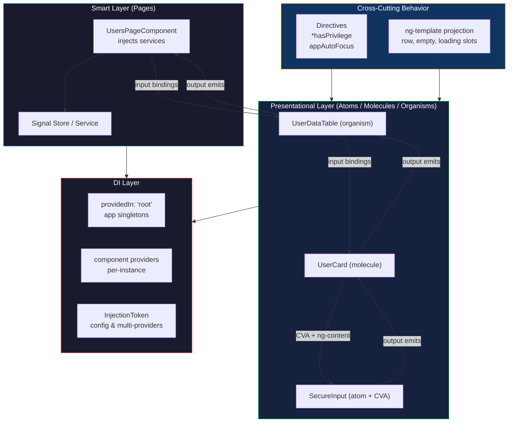

## Table of Contents

1. [TL;DR](#tldr)
2. [Deep Dive](#deep-dive)
   2.1 [Component Boundary & Communication](#concept-group-1-component-boundary--communication)
       2.1.1 [Smart vs Presentational (Container vs Dumb)](#smart-vs-presentational-container-vs-dumb)
       2.1.2 [Inputs / Outputs — Decorators vs Signals](#inputs--outputs--decorators-vs-signals)
       2.1.3 [Service-Driven Communication](#service-driven-communication)
       2.1.4 [Standalone Components & the Death of NgModules](#standalone-components--the-death-of-ngmodules)
   2.2 [Composition Primitives](#concept-group-2-composition-primitives)
       2.2.1 [Content Projection (`<ng-content>` Single & Multi-Slot)](#content-projection-ng-content-single--multi-slot)
       2.2.2 [`<ng-template>` and `TemplateRef`](#ng-template-and-templateref)
       2.2.3 [`<ng-container>` — Logical Grouping Without DOM](#ng-container--logical-grouping-without-dom)
       2.2.4 [Structural Directives & Custom Patterns](#structural-directives--custom-patterns)
       2.2.5 [Host Bindings, Listeners, and `:host`](#host-bindings-listeners-and-host)
   2.3 [Dependency Injection Patterns](#concept-group-3-dependency-injection-patterns)
       2.3.1 [Hierarchical Injectors & `providedIn`](#hierarchical-injectors--providedin)
       2.3.2 [`InjectionToken`, `useFactory`, Multi-Providers](#injectiontoken-usefactory-multi-providers)
       2.3.3 [`viewProviders` vs `providers`](#viewproviders-vs-providers)
       2.3.4 [`forwardRef` and Circular Dependencies](#forwardref-and-circular-dependencies)
   2.4 [Reusability & Cross-Framework Bridges](#concept-group-4-reusability--cross-framework-bridges)
       2.4.1 [`ControlValueAccessor` — Custom Form Controls](#controlvalueaccessor--custom-form-controls)
       2.4.2 [Attribute & Structural Directives as Behavior Composition](#attribute--structural-directives-as-behavior-composition)
       2.4.3 [Dynamic Component Creation (`ViewContainerRef.createComponent`)](#dynamic-component-creation-viewcontainerrefcreatecomponent)
       2.4.4 [Angular Elements — Web Components Bridge](#angular-elements--web-components-bridge)
   2.5 [Performance & Lifecycle](#concept-group-5-performance--lifecycle)
       2.5.1 [Change Detection — Default, OnPush, Signals, Zoneless](#change-detection--default-onpush-signals-zoneless)
       2.5.2 [Lifecycle Hooks — Modern Angular](#lifecycle-hooks--modern-angular)
       2.5.3 [`@Defer` and Lazy Loading at Component Boundaries](#defer-and-lazy-loading-at-component-boundaries)
3. [Architecture & Data Flow](#architecture--data-flow)
4. [Real-World Examples](#real-world-examples)
5. [Comparison Tables](#comparison-tables)
6. [Interview Q&A](#interview-qa)
   6.1 [L1: Junior](#l1-junior-knowledge)
   6.2 [L2: Mid-Level](#l2-mid-level-knowledge)
   6.3 [L3: Senior](#l3-senior-knowledge)
   6.4 [Staff: System Architecture](#staff-system-architecture)
7. [Cross-References](#cross-references)
8. [Further Reading](#further-reading)

---

## TL;DR

Senior Angular interviews probe how you **decompose a screen into components, how those components communicate, and how you reach for primitives like content projection, `ng-template`, structural directives, and DI** instead of brittle parent-child glue code. The 2026 Angular vocabulary is <span style="color: #33b5e5; font-weight: bold;">standalone components</span> + <span style="color: #33b5e5; font-weight: bold;">signal inputs</span> + <span style="color: #33b5e5; font-weight: bold;">OnPush / zoneless change detection</span> + <span style="color: #33b5e5; font-weight: bold;">`ControlValueAccessor`</span> for custom form controls + <span style="color: #33b5e5; font-weight: bold;">`@defer`</span> for fine-grained lazy loading. In `tai-portal`, the design system is a 3-tier atomic structure (atoms → molecules → organisms) with <span style="color: #00C851; font-weight: bold;">smart pages</span> orchestrating data flow into <span style="color: #00C851; font-weight: bold;">presentational components</span> that take signal inputs and emit signal-based events. Custom inputs (`secure-input`) implement `ControlValueAccessor`; structural directives like `*hasPrivilege` swap templates based on auth claims; `ng-content` with `select` enables flexible card/dialog/modal slots. The senior trade-off you must articulate: when to reach for component composition vs services vs directives — the rule of thumb is <span style="color: #ffbb33;">data shapes the page (smart), look-and-feel composes (presentational), behavior reuses (directives), state coordinates (services)</span>.

---

## Deep Dive

### Concept Group 1: Component Boundary & Communication

#### Smart vs Presentational (Container vs Dumb)

##### What
A <span style="color: #33b5e5; font-weight: bold;">smart component</span> (a.k.a. container, page) knows about state, services, routing, and side effects. A <span style="color: #33b5e5; font-weight: bold;">presentational component</span> (a.k.a. dumb, atomic, view) knows only about its inputs and the events it emits — pure visual logic, no service injection, no router awareness.

##### Why
Without this split, you get "god components" of 800+ lines mixing HTTP calls, form management, animation logic, and DOM rendering. Splitting:
- Makes presentational components reusable across pages (a `<user-card>` works in admin and dashboard)
- Makes them trivially testable (just inputs in, outputs out, no mocks needed)
- Makes smart components thin — they orchestrate, they don't render

##### How
```typescript
// SMART — orchestrates data, knows about services and routes
@Component({
  selector: 'app-users-page',
  template: `
    @if (store.isLoading()) { <app-spinner /> }
    @for (user of store.users(); track user.id) {
      <app-user-card
        [user]="user"
        [editable]="canEdit()"
        (edit)="onEdit($event)"
        (deactivate)="onDeactivate($event)"
      />
    }
  `,
})
export class UsersPageComponent {
  protected readonly store = inject(UsersStore);
  protected readonly auth = inject(AuthService);

  protected readonly canEdit = toSignal(this.auth.hasPrivilege('Users.Edit'), { initialValue: false });

  onEdit(user: User) { this.router.navigate(['/users', user.id, 'edit']); }
  onDeactivate(user: User) { this.store.deactivate(user.id); }
}

// PRESENTATIONAL — pure inputs/outputs, no service awareness
@Component({
  selector: 'app-user-card',
  changeDetection: ChangeDetectionStrategy.OnPush,
  template: `
    <article class="card">
      <h3>{{ user().name }}</h3>
      <p>{{ user().email }}</p>
      @if (editable()) {
        <button (click)="edit.emit(user())">Edit</button>
      }
    </article>
  `,
})
export class UserCardComponent {
  user = input.required<User>();
  editable = input<boolean>(false);
  edit = output<User>();
  deactivate = output<User>();
}
```

##### When
- Anything that touches a service, the router, or `localStorage` is **smart** — keep it at the page/route level
- Anything reused across pages or stories should be **presentational** — pure inputs/outputs
- A handful of "in-between" components (a header that needs router state) are fine; don't over-engineer

##### Trade-offs
<span style="color: #ffbb33; font-weight: bold;">Prop drilling</span> — when a deeply nested presentational needs data, you end up passing inputs through 4 layers. Mitigations: a presentation-only `inject(SomeReadOnlyContext)`, content projection (so the consumer puts the deep child where they want), or accepting that some "presentational" components can `inject()` a read-only signal store. <span style="color: #ff4444; font-weight: bold;">Don't let dumb components subscribe to HTTP</span> — that's the whole point of the split.

---

#### Inputs / Outputs — Decorators vs Signals

##### What
Angular's component API for parent → child (inputs) and child → parent (outputs) communication. Two generations coexist in 2026 codebases:

| Era | Input | Output |
|---|---|---|
| **Decorator (legacy)** | `@Input() name = ''` | `@Output() change = new EventEmitter<T>()` |
| **Signal (2026)** | `name = input<string>('')` / `input.required<string>()` | `change = output<T>()` |

##### Why
Signal inputs/outputs eliminate three classes of bugs:
- `OnChanges` boilerplate — `effect()` reacts to input changes naturally
- "Did the parent re-bind?" — signals always reflect the current value, no `ngOnChanges` race
- Required inputs — `input.required<T>()` is a compile-time check; the legacy way had no enforcement

##### How
```typescript
@Component({...})
export class UserCardComponent {
  // Required — fails at compile time if parent doesn't bind it
  user = input.required<User>();

  // Optional with default
  variant = input<'default' | 'compact'>('default');

  // With transform — coerce string attribute to boolean
  disabled = input(false, { transform: booleanAttribute });

  // Aliased — public binding name differs from field name
  ariaLabel = input<string>('', { alias: 'aria-label' });

  // Outputs
  edit = output<User>();
  closed = output();   // void output — no payload

  // React to input changes — no OnChanges needed
  constructor() {
    effect(() => {
      console.log('user changed:', this.user().name);
    });
  }

  // Computed — derived from inputs, recomputed automatically
  initials = computed(() => this.user().name.split(' ').map(p => p[0]).join(''));
}
```

##### When
- New code: always signal API
- Migrating: keep `@Input/@Output` — they still work; migrate file-by-file when you touch a component
- `ngOnChanges` is still useful for legacy code; new code uses `effect()`

##### Trade-offs
<span style="color: #ffbb33;">Mixed APIs in the same component</span> are confusing — pick one per component. <span style="color: #ff4444;">Required inputs that aren't bound</span> throw at runtime, not compile time, in Angular HTML — IDE plugins catch most cases but not template-driven dynamic creation.

---

#### Service-Driven Communication

##### What
For state that crosses unrelated components (different routes, sibling components, deeply nested children), a `providedIn: 'root'` service holds the state and exposes signals or observables. Components inject the service.

##### Why
`@Input/@Output` is parent-child only. For "the navbar shows the user's name AND the sidebar shows their tenant AND the header shows the notification count," all three need shared state — passing inputs through every ancestor is impractical.

##### How
```typescript
@Injectable({ providedIn: 'root' })
export class NotificationStore {
  private readonly _unread = signal<Notification[]>([]);
  public readonly unread = this._unread.asReadonly();
  public readonly count = computed(() => this._unread().length);

  add(n: Notification) { this._unread.update(list => [...list, n]); }
  markRead(id: string) { this._unread.update(list => list.filter(n => n.id !== id)); }
}

// Any component, anywhere, just injects
@Component({
  template: `<span>{{ notif.count() }} unread</span>`,
})
export class HeaderBadgeComponent {
  protected readonly notif = inject(NotificationStore);
}
```

##### When
- Cross-route state (auth, theme, tenant)
- Sibling-to-sibling without a common parent
- Anywhere prop drilling reaches >2 levels

##### Trade-offs
<span style="color: #ff4444;">Public mutable state on services</span> is the anti-pattern. Always: private writable signal/subject, public read-only. Methods to mutate.

---

#### Standalone Components & the Death of NgModules

##### What
<span style="color: #33b5e5; font-weight: bold;">Standalone components</span> declare their own dependencies via `imports: [...]` instead of being declared in an `NgModule`. The default since Angular 19; mandatory for new code in 2026.

##### Why
`NgModule` was a barrel of confusing rules — `declarations`, `exports`, `imports`, `providers`, plus shared modules, feature modules, and the dreaded "this component isn't declared in any module" error. Standalone components colocate their dependencies with the component itself.

##### How
```typescript
@Component({
  selector: 'app-user-card',
  standalone: true,                          // explicit until Angular 21; default after
  imports: [
    CommonModule,
    UserAvatarComponent,
    PrivilegeBadgeComponent,
    HasPrivilegeDirective,
  ],
  template: `...`,
})
export class UserCardComponent { /* ... */ }

// Routing — also standalone
export const routes: Route[] = [
  {
    path: 'users',
    loadComponent: () => import('./users.page').then(m => m.UsersPageComponent),
  },
];

// Bootstrap — no AppModule needed
bootstrapApplication(AppComponent, {
  providers: [
    provideRouter(routes),
    provideHttpClient(withInterceptors([authInterceptor, dpopInterceptor])),
  ],
});
```

##### When
Always for new code. `NgModule` survives only in legacy migrations; the migration is mechanical and supported by `ng generate @angular/core:standalone`.

##### Trade-offs
<span style="color: #ffbb33;">Imports list can grow long</span> in big components — refactor into smaller pieces or into shared "barrel" exports. <span style="color: #ff4444;">Forgotten import</span> = "can't bind to X" error; the IDE's import auto-fix catches most.

---

### Concept Group 2: Composition Primitives

#### Content Projection (`<ng-content>` Single & Multi-Slot)

##### What
<span style="color: #33b5e5; font-weight: bold;">`<ng-content>`</span> is the slot where the parent's child content gets rendered inside a component's template. Multi-slot projection uses `select="..."` to route content to specific slots.

##### Why
Without projection, every variant of "card with header, body, footer" requires new inputs. With projection, the consumer composes the structure:
```html
<!-- Without projection: rigid -->
<app-card title="Hi" body="Long content" footer="OK"></app-card>

<!-- With projection: flexible -->
<app-card>
  <h2 card-header>Hi</h2>
  <p>Long content with <em>rich</em> formatting</p>
  <button card-footer>OK</button>
</app-card>
```

##### How — Single Slot
```typescript
@Component({
  selector: 'app-card',
  template: `
    <article class="card">
      <ng-content />          <!-- everything inside <app-card></app-card> projects here -->
    </article>
  `,
})
export class CardComponent {}
```

##### How — Multi-Slot With `select`
```typescript
@Component({
  selector: 'app-card',
  template: `
    <article class="card">
      <header class="card-header">
        <ng-content select="[card-header]" />
      </header>
      <div class="card-body">
        <ng-content />        <!-- default slot — anything not matching other selects -->
      </div>
      <footer class="card-footer">
        <ng-content select="[card-footer]" />
      </footer>
    </article>
  `,
})
export class CardComponent {}
```

```html
<app-card>
  <h2 card-header>Title</h2>
  <p>Body</p>
  <button card-footer>OK</button>
</app-card>
```

`select` accepts CSS selectors: `select="h2"`, `select=".my-class"`, `select="[card-header]"`, `select="my-component"`.

##### When
- Card / dialog / modal / panel / accordion / tab — any component with named structural slots
- Wrapper components that wrap arbitrary content
- Avoid for data-driven content (use `@for` instead)

##### Trade-offs
<span style="color: #ffbb33;">Projected content keeps its original styling context</span> — `:host-context()` and `::ng-deep` ambiguities arise. <span style="color: #ff4444;">Fallback content for empty slots</span> is awkward — wrap in `@if (hasProjected) { <ng-content /> } @else { <DefaultContent /> }` using `ContentChild` to detect.

---

#### `<ng-template>` and `TemplateRef`

##### What
<span style="color: #33b5e5; font-weight: bold;">`<ng-template>`</span> defines a chunk of template that doesn't render until something imperatively renders it. Captured via `TemplateRef<T>`; rendered by `ViewContainerRef.createEmbeddedView(templateRef, context)` or `*ngTemplateOutlet`.

##### Why
- Conditional rendering with reusable templates
- Custom structural directives
- Component slot APIs ("the consumer gives me a template; I decide when/where to render it")
- Multi-state components (loading / empty / error / data templates passed as inputs)

##### How
```typescript
@Component({
  selector: 'app-async-list',
  template: `
    @if (loading()) {
      <ng-container *ngTemplateOutlet="loadingTpl ?? defaultLoading" />
    } @else if (items().length === 0) {
      <ng-container *ngTemplateOutlet="emptyTpl ?? defaultEmpty" />
    } @else {
      @for (item of items(); track item.id) {
        <ng-container *ngTemplateOutlet="rowTpl; context: { $implicit: item, index: $index }" />
      }
    }

    <ng-template #defaultLoading>Loading…</ng-template>
    <ng-template #defaultEmpty>No items.</ng-template>
  `,
})
export class AsyncListComponent {
  items = input.required<Item[]>();
  loading = input<boolean>(false);

  // Consumers can pass custom templates
  rowTpl = contentChild.required<TemplateRef<{ $implicit: Item; index: number }>>('row');
  loadingTpl = contentChild<TemplateRef<unknown>>('loading');
  emptyTpl = contentChild<TemplateRef<unknown>>('empty');
}
```

```html
<app-async-list [items]="users()" [loading]="loading()">
  <ng-template #row let-user let-i="index">
    <div>{{ i }}: {{ user.name }}</div>
  </ng-template>
  <ng-template #empty>
    <p>No users found. <a routerLink="/users/new">Add one</a></p>
  </ng-template>
</app-async-list>
```

##### `let-` and Template Context
The consumer's template can read context variables:
- `let-foo` → binds `context.$implicit` to `foo`
- `let-bar="key"` → binds `context.key` to `bar`

##### When
- Components offering customizable rendering (data tables, lists, modal frames)
- Custom structural directives (`*hasPrivilege`, `*ngIf`)
- Conditional content where the same template is rendered multiple times

##### Trade-offs
<span style="color: #ffbb33;">Performance — context objects recreated on every change</span>; for `@for` loops, the framework optimizes this, but manual `createEmbeddedView` calls in tight loops aren't free. <span style="color: #ff4444;">Type-safe template context</span> requires generic `TemplateRef<MyContext>` typing — easy to forget.

---

#### `<ng-container>` — Logical Grouping Without DOM

##### What
<span style="color: #33b5e5; font-weight: bold;">`<ng-container>`</span> is a non-rendered grouping element. It doesn't appear in the DOM but lets you apply structural directives or template references without an extra `<div>`.

##### How
```html
<!-- BAD — extra DOM element to host *ngIf -->
<div *ngIf="user()">
  <h1>{{ user().name }}</h1>
  <p>{{ user().email }}</p>
</div>

<!-- GOOD — no wrapper div -->
<ng-container *ngIf="user()">
  <h1>{{ user().name }}</h1>
  <p>{{ user().email }}</p>
</ng-container>

<!-- BETTER (Angular 17+) — control flow doesn't need ng-container -->
@if (user(); as u) {
  <h1>{{ u.name }}</h1>
  <p>{{ u.email }}</p>
}
```

##### When
- Grouping multiple elements under a single structural directive
- Hosting `*ngTemplateOutlet`
- Avoiding extra `<div>` clutter that breaks layout (e.g., direct children of a flex/grid container)

##### Trade-offs
<span style="color: #ffbb33;">With Angular 17+ control flow (`@if`, `@for`), `<ng-container>` is needed less often</span> — modern templates use it primarily for `<ng-template>` projection.

---

#### Structural Directives & Custom Patterns

##### What
A <span style="color: #33b5e5; font-weight: bold;">structural directive</span> conditionally adds, removes, or swaps elements in the DOM. Built-ins: `*ngIf`, `*ngFor`, `*ngSwitch`. Custom: anything you write that injects `TemplateRef` and `ViewContainerRef`.

##### How — A Custom Structural Directive
```typescript
@Directive({
  selector: '[taiHasPrivilege]',
  standalone: true,
})
export class HasPrivilegeDirective {
  private templateRef = inject(TemplateRef<unknown>);
  private viewContainer = inject(ViewContainerRef);
  private privilegeChecker = inject(PrivilegeChecker, { optional: true });
  private destroyRef = inject(DestroyRef);
  private hasView = false;

  @Input({ required: true }) set taiHasPrivilege(privilege: string) {
    this.privilegeChecker?.hasPrivilege(privilege)
      .pipe(takeUntilDestroyed(this.destroyRef))
      .subscribe(allowed => {
        if (allowed && !this.hasView) {
          this.viewContainer.createEmbeddedView(this.templateRef);
          this.hasView = true;
        } else if (!allowed && this.hasView) {
          this.viewContainer.clear();
          this.hasView = false;
        }
      });
  }
}
```

```html
<button *taiHasPrivilege="'Users.Create'">Add User</button>
```

##### When
- Permission-based rendering
- Feature flags
- Repeating with custom logic (use sparingly; `@for` covers most cases)
- "Render iff" patterns that benefit from declarative template syntax

##### Trade-offs
<span style="color: #ffbb33;">`*` syntax is sugar</span> for `<ng-template [taiHasPrivilege]>...</ng-template>`. Knowing this matters when the directive needs to compose with other structural directives (only one `*` per element — use `<ng-container>` to layer).

---

#### Host Bindings, Listeners, and `:host`

##### What
A component's "host element" is the DOM element matching its selector (e.g., `<app-user-card>`). You can style it, bind attributes, and listen to events on it.

##### How
```typescript
@Component({
  selector: 'app-user-card',
  host: {
    'class': 'card',                                  // static class
    '[class.disabled]': 'disabled()',                 // dynamic class binding
    '[attr.aria-disabled]': 'disabled()',             // attribute binding
    '[attr.role]': '"article"',                       // static attribute
    '(click)': 'onClick($event)',                     // event listener
    '(keydown.enter)': 'onActivate()',                // keyboard binding
  },
  template: `...`,
})
export class UserCardComponent {
  disabled = input(false);
  onClick(e: MouseEvent) { /* ... */ }
  onActivate() { /* ... */ }
}
```

```scss
/* In the component's SCSS */
:host {                  /* the <app-user-card> element itself */
  display: block;
  padding: 1rem;
}
:host(.disabled) {       /* host with .disabled class */
  opacity: 0.5;
}
:host-context(.dark-theme) {  /* any ancestor has .dark-theme */
  background: #111;
}
```

##### When
- Anything that conceptually applies to the component as a whole (default display, accessibility role, keyboard activation)
- Avoiding wrapper `<div>` inside the template

##### Trade-offs
<span style="color: #ffbb33;">Host bindings vs template bindings</span> — host metadata is tied to the component definition; you can't change it dynamically per consumer. For per-consumer styling, prefer inputs + class bindings inside the template.

---

### Concept Group 3: Dependency Injection Patterns

#### Hierarchical Injectors & `providedIn`

##### What
Angular's DI system is hierarchical — every component has its own injector that falls back to its parent's. `providedIn` controls where a service is registered, which controls scope and tree-shakability.

##### Provider Scopes

| Scope | Where Registered | Lifetime | Tree-Shakable |
|---|---|---|---|
| `providedIn: 'root'` | Root injector | App lifetime | ✅ Yes |
| `providedIn: 'platform'` | Across multiple Angular apps in same page | Platform lifetime | ✅ Yes |
| `providedIn: SomeRoute` | Lazy-loaded route's injector | Lazy module lifetime | ✅ Yes |
| `providers: [...]` on a component | Component's own injector + descendants | Component lifetime | ❌ No |
| Bootstrap `providers: [...]` | Root injector | App lifetime | ❌ Usually no |

##### Why It Matters
- `providedIn: 'root'` for app-wide singletons (auth service, HTTP client wrappers)
- Component-level `providers: [...]` for **per-component instances** — each instance gets its own (e.g., a form wizard step's local state)
- Hierarchical inheritance lets descendants override parent providers

##### How
```typescript
// App-wide singleton — single instance, tree-shakable
@Injectable({ providedIn: 'root' })
export class AuthService { /* ... */ }

// Per-component instance — every <app-wizard> gets its own WizardState
@Component({
  selector: 'app-wizard',
  providers: [WizardState],
})
export class WizardComponent {
  private state = inject(WizardState);   // unique per <app-wizard>
}

// Override at descendant level — useful for testing or variant behavior
@Component({
  selector: 'app-mock-wizard',
  providers: [
    { provide: WizardState, useClass: MockWizardState }
  ],
})
export class MockWizardComponent {}
```

##### Trade-offs
<span style="color: #ff4444;">Multiple `providedIn: 'root'` registrations of the same service</span> result in one instance — but if some parts of the app use `providers: [Service]` and others don't, you get inconsistent behavior. Pick one strategy per service.

---

#### `InjectionToken`, `useFactory`, Multi-Providers

##### What
- <span style="color: #33b5e5; font-weight: bold;">`InjectionToken`</span> — a strongly-typed key for DI when you don't have a class to inject (config objects, primitive values)
- <span style="color: #33b5e5; font-weight: bold;">`useFactory`</span> — provider that builds the instance via a function (use for runtime decisions, lazy init)
- <span style="color: #33b5e5; font-weight: bold;">Multi-providers</span> (`multi: true`) — multiple registrations under the same token, injected as an array (e.g., HTTP interceptors, route guards)

##### How
```typescript
// 1. InjectionToken for typed config
export const APP_CONFIG = new InjectionToken<AppConfig>('APP_CONFIG');

bootstrapApplication(AppComponent, {
  providers: [
    { provide: APP_CONFIG, useValue: { apiUrl: 'https://api.example.com' } },
  ],
});

@Injectable({ providedIn: 'root' })
export class ApiClient {
  private config = inject(APP_CONFIG);  // typed as AppConfig
}

// 2. useFactory — runtime decision
{
  provide: STORAGE,
  useFactory: () => {
    return typeof window !== 'undefined' && window.localStorage
      ? new BrowserStorage()
      : new MemoryStorage();    // SSR fallback
  },
}

// 3. Multi-provider — register multiple values under the same token
export const VALIDATORS = new InjectionToken<Validator[]>('VALIDATORS');

providers: [
  { provide: VALIDATORS, useValue: emailValidator, multi: true },
  { provide: VALIDATORS, useValue: phoneValidator, multi: true },
]

// Inject an array of all registered validators
const validators = inject(VALIDATORS);  // [emailValidator, phoneValidator]
```

##### When
- `InjectionToken` for any non-class injection (config objects, feature flags, environment values)
- `useFactory` for runtime branching (SSR vs browser, environment-dependent)
- Multi-providers for plugin/extension patterns (interceptors, guards, custom validators)

##### Trade-offs
<span style="color: #ffbb33;">`useFactory` is opaque to tree-shaking</span> in some configurations — prefer `useClass` or `useValue` when possible.

---

#### `viewProviders` vs `providers`

##### What
`providers: [...]` on a component registers services available to the component AND its **content-projected** children. `viewProviders: [...]` registers services available ONLY to the component's view children — not to projected content.

##### Why It Matters (Real Bug Pattern)
A `<form>` parent provides `FormGroup`. A child `<custom-input>` injected via projection inherits it — fine. But what if the parent component uses a `viewProvider` for an internal state service that you DON'T want leaking to projected content? Use `viewProviders`.

##### How
```typescript
@Component({
  selector: 'app-tabs',
  template: `<div class="tabs"><ng-content /></div>`,
  providers: [TabsState],          // available to BOTH view children AND projected children
  viewProviders: [InternalScroll], // available ONLY to view children, NOT projected
})
export class TabsComponent {}
```

##### When
You want strict encapsulation of internal services from consumer-projected content. Rare but important when you do need it.

##### Trade-offs
<span style="color: #ffbb33;">Subtle distinction</span> — most devs never need it; when you do, it solves the bug elegantly.

---

#### `forwardRef` and Circular Dependencies

##### What
<span style="color: #33b5e5; font-weight: bold;">`forwardRef`</span> wraps a class reference in a callback, deferring the lookup until injection time. Used when a class self-references in its own provider (the canonical case is `ControlValueAccessor`).

##### How
```typescript
@Component({
  selector: 'tai-secure-input',
  providers: [
    {
      provide: NG_VALUE_ACCESSOR,
      useExisting: forwardRef(() => SecureInputComponent),
      //         ↑ at this point in code, SecureInputComponent isn't defined yet
      multi: true,
    },
  ],
})
export class SecureInputComponent implements ControlValueAccessor { /* ... */ }
```

##### Why
JavaScript hoists `class` declarations but not their bodies. If you reference `SecureInputComponent` inside its own decorator metadata, the class identifier exists but its full prototype isn't ready. `forwardRef(() => SecureInputComponent)` defers the lookup to injection time, when the class is fully defined.

##### When
- `ControlValueAccessor` registration (almost the only place you'll see it in 2026)
- Two services that genuinely need each other (rare; usually a smell — refactor)

##### Trade-offs
<span style="color: #ff4444;">If you have circular dependencies elsewhere</span>, `forwardRef` masks the problem — the cleaner fix is to extract the shared piece into a third service.

---

### Concept Group 4: Reusability & Cross-Framework Bridges

#### `ControlValueAccessor` — Custom Form Controls

##### What
<span style="color: #33b5e5; font-weight: bold;">`ControlValueAccessor`</span> (CVA) is the interface that lets a custom component participate in Angular's reactive and template-driven forms — `[formControl]`, `formControlName`, `[(ngModel)]` all work with it.

##### Why
Without CVA, your custom `<tai-secure-input>` can't be used with `FormGroup` / `FormControl`. The consumer would have to wire up `[value]` + `(input)` manually for every form field, abandoning the validation/touched/dirty/pending lifecycle Angular forms provide.

##### How — The 4-Method Interface
```typescript
@Component({
  selector: 'tai-secure-input',
  providers: [
    {
      provide: NG_VALUE_ACCESSOR,
      useExisting: forwardRef(() => SecureInputComponent),
      multi: true,
    },
  ],
  template: `
    <input
      [type]="type()"
      [value]="value()"
      [disabled]="isDisabled()"
      (input)="onInput($any($event.target).value)"
      (blur)="onBlur()"
    />
  `,
})
export class SecureInputComponent implements ControlValueAccessor {
  protected readonly value = signal<string>('');
  protected readonly isDisabled = signal<boolean>(false);

  // Angular calls these to register callbacks; you call them when value changes
  private onChange: (value: string) => void = () => {};
  private onTouched: () => void = () => {};

  // 1. Angular pushes a value INTO the component (e.g., on form.patchValue)
  writeValue(value: string): void {
    this.value.set(value || '');
  }

  // 2. Angular gives you a callback to invoke when the value changes
  registerOnChange(fn: (value: string) => void): void {
    this.onChange = fn;
  }

  // 3. Angular gives you a callback to invoke when the field is "touched"
  registerOnTouched(fn: () => void): void {
    this.onTouched = fn;
  }

  // 4. Angular tells you to enable/disable the control (e.g., form.disable())
  setDisabledState(isDisabled: boolean): void {
    this.isDisabled.set(isDisabled);
  }

  protected onInput(value: string): void {
    this.value.set(value);
    this.onChange(value);    // tell Angular's form layer
  }
  protected onBlur(): void {
    this.onTouched();        // mark the control as touched
  }
}
```

##### Usage
```html
<form [formGroup]="form">
  <tai-secure-input
    formControlName="password"
    label="Password"
    type="password"
  />
</form>
```

##### When
Any custom input component — text fields, date pickers, color pickers, autocomplete, multi-select, anything that conceptually has a "value" the parent wants to bind.

##### Trade-offs
<span style="color: #ff4444;">Forgetting `multi: true`</span> in the provider replaces the default `NG_VALUE_ACCESSOR` instead of adding to it. <span style="color: #ffbb33;">Validation</span> is a separate interface (`NG_VALIDATORS`) — implement it if your control has built-in validity rules.

---

#### Attribute & Structural Directives as Behavior Composition

##### What
Where components compose **structure**, directives compose **behavior**. Three kinds:

| Kind | Selector | Purpose | Example |
|---|---|---|---|
| **Attribute** | `[selector]` | Add behavior to existing elements | `[appAutoFocus]`, `[cdkDragDrop]` |
| **Structural** | `*selector` | Conditionally render templates | `*ngIf`, `*hasPrivilege` |
| **Component** | `selector` | Render their own template | `<app-card>` |

##### Why
You don't always need a new component to add a feature. "Auto-focus this input on mount" or "make this draggable" or "trap focus inside this dialog" — these are behaviors, not structure.

##### How — Attribute Directive Example
```typescript
@Directive({
  selector: '[appAutoFocus]',
  standalone: true,
})
export class AutoFocusDirective implements AfterViewInit {
  private el = inject(ElementRef<HTMLElement>);

  @Input() appAutoFocus: boolean = true;

  ngAfterViewInit(): void {
    if (this.appAutoFocus) {
      queueMicrotask(() => this.el.nativeElement.focus());
    }
  }
}
```

```html
<input appAutoFocus />
<input [appAutoFocus]="shouldFocus" />
```

##### When
- Behavior reusable across element types (focus, drag, scroll-into-view)
- Cross-cutting concerns (analytics tracking on click)
- Conditional template rendering (structural)

##### Trade-offs
<span style="color: #ffbb33;">Directives don't have their own templates</span> — for behavior + UI, use a component instead.

---

#### Dynamic Component Creation (`ViewContainerRef.createComponent`)

##### What
Imperatively creating a component at runtime — for plugin systems, dynamic forms, modals, dialogs.

##### How
```typescript
@Component({
  selector: 'app-modal-host',
  template: `<ng-template #host></ng-template>`,
})
export class ModalHostComponent {
  private host = viewChild.required('host', { read: ViewContainerRef });

  open<T>(component: Type<T>, inputs: Partial<T> = {}): ComponentRef<T> {
    this.host().clear();
    const ref = this.host().createComponent(component);
    Object.assign(ref.instance as object, inputs);
    return ref;
  }

  close(ref: ComponentRef<unknown>): void {
    ref.destroy();
  }
}
```

##### When
- Modal / dialog systems (CDK Overlay does this internally)
- Plugin architectures
- Form builders with field-type-driven dynamic rendering

##### Trade-offs
<span style="color: #ffbb33;">Bypasses the template type checker</span> — manual input setting via `setInput()` (Angular 14.1+) restores some safety. <span style="color: #ff4444;">Lifecycle responsibility</span> falls on you — you must call `.destroy()` to clean up.

---

#### Angular Elements — Web Components Bridge

##### What
<span style="color: #33b5e5; font-weight: bold;">Angular Elements</span> packages an Angular component as a native Custom Element (Web Component) that runs anywhere — React apps, Vue apps, plain HTML, server-rendered pages.

##### Why
Cross-framework reuse. A design system component built once in Angular can be consumed by other framework apps without forcing them to bundle Angular. Real production use cases: corporate-wide widgets (search bars, login boxes), embeddable analytics dashboards, reusable map widgets across product teams.

##### How
```typescript
import { createCustomElement } from '@angular/elements';

@Component({
  selector: 'org-search-widget',     // becomes the custom-element tag
  standalone: true,
  template: `<input (input)="onInput($event)" /> <ul>...</ul>`,
})
export class SearchWidgetComponent { /* ... */ }

// In bootstrap
const app = await createApplication({ providers: [...] });
const SearchElement = createCustomElement(SearchWidgetComponent, { injector: app.injector });
customElements.define('org-search-widget', SearchElement);
```

```html
<!-- Any HTML page can now use it -->
<org-search-widget tenant-id="acme"></org-search-widget>
<script src="https://cdn.org/search-widget.js"></script>
```

##### When
- Cross-framework component sharing
- Embedding Angular UI in non-Angular hosts (legacy apps, CMSes)
- Corporate-wide design systems consumed by mixed tech stacks

##### Trade-offs
<span style="color: #ff4444;">Bundle size</span> — packaging a single Angular component still ships the Angular runtime (~30-100KB after tree-shaking). For a single widget, that's heavy. <span style="color: #ffbb33;">Inputs/outputs cross the custom-element boundary as strings/CustomEvents</span> — no rich object passing without serialization. <span style="color: #ffbb33;">Style isolation</span> via Shadow DOM is opt-in; without it, parent CSS bleeds in.

---

### Concept Group 5: Performance & Lifecycle

#### Change Detection — Default, OnPush, Signals, Zoneless

##### The Four CD Modes

| Mode | Trigger | Cost | Compatibility |
|---|---|---|---|
| **Default** | Any async event runs zone CD across whole tree | High on big trees | Everything |
| **OnPush** | Only when input ref changes, event fires, or `markForCheck()` | Medium, scoped | Requires immutable updates |
| **Signals** | Only the components reading the changed signal | Low, surgical | Angular 16+ |
| **Zoneless** | Same as Signals; Zone.js removed entirely | Lowest | Angular 18+ |

##### Why It Matters
On a 200-component dashboard, default change detection runs CD on every component for every async event (HTTP, click, setTimeout) — waste. OnPush and Signals give you O(changed) instead of O(everything).

##### How — OnPush Discipline
```typescript
@Component({
  selector: 'app-user-card',
  changeDetection: ChangeDetectionStrategy.OnPush,
  template: `<h3>{{ user().name }}</h3>`,
})
export class UserCardComponent {
  user = input.required<User>();   // signal inputs play perfectly with OnPush
}
```

OnPush triggers CD when:
- An `@Input` reference changes (immutable update — `{...user, name: 'new'}` ✅; mutating `user.name = 'new'` ❌)
- An event handler in the template fires
- A signal read in the template changes
- An `async` pipe receives a new emission
- You manually call `cdr.markForCheck()`

##### Zoneless (Angular 18+)
```typescript
bootstrapApplication(AppComponent, {
  providers: [provideZonelessChangeDetection()],
});
```
No Zone.js. Signals are the change-detection trigger. Faster, smaller bundle (~50KB savings), simpler mental model.

##### Trade-offs
<span style="color: #ffbb33;">Migrating a `Default`-CD app to OnPush</span> requires immutability discipline — mutating arrays in place breaks updates. <span style="color: #ff4444;">Going zoneless without Signals everywhere</span> means manual CD triggers in legacy callbacks (SignalR, third-party SDKs).

---

#### Lifecycle Hooks — Modern Angular

##### The Hooks That Survive

| Hook | When | Modern Replacement |
|---|---|---|
| `constructor` | Once, at instance creation | <span style="color: #00C851;">Inject + initialize signals here</span> |
| `ngOnInit` | After first inputs set | Often replaceable with `effect()` or constructor + signals |
| `ngOnChanges` | When `@Input` changes | <span style="color: #00C851;">`effect()` on signal inputs</span> |
| `ngAfterViewInit` | After view children rendered | Still needed for direct DOM access |
| `ngOnDestroy` | Component destroyed | <span style="color: #00C851;">`DestroyRef` + `takeUntilDestroyed()`</span> |

##### Modern Pattern
```typescript
@Component({...})
export class MyComponent {
  user = input.required<User>();
  private destroyRef = inject(DestroyRef);

  constructor() {
    // No need for ngOnInit — effect runs on first read AND on every change
    effect(() => {
      console.log('user changed:', this.user().name);
    });

    // Subscribe with auto-cleanup
    this.someService.events$
      .pipe(takeUntilDestroyed())
      .subscribe(event => this.handle(event));
  }

  // ngOnDestroy almost never needed in 2026 code
}
```

##### Trade-offs
<span style="color: #ffbb33;">Effects run after a microtask</span> — if you need synchronous initialization based on input values, the constructor + signal-read pattern works only if the input has a default; required inputs aren't readable in the constructor.

---

#### `@Defer` and Lazy Loading at Component Boundaries

##### What
<span style="color: #33b5e5; font-weight: bold;">`@defer`</span> (Angular 17+) lazy-loads a chunk of template — including all components, directives, and pipes used inside — on a configurable trigger.

##### Why
Bundle splitting beyond the route level. A dashboard route might be cheap, but if it contains a heavy chart component, a rich text editor, or a map widget, you don't want to ship all of those on the first paint.

##### How
```html
@defer (on viewport) {
  <app-rich-chart [data]="data()" />
} @placeholder {
  <div class="chart-placeholder">Loading chart…</div>
} @loading (after 100ms; minimum 1s) {
  <app-spinner />
} @error {
  <app-error-banner>Could not load chart</app-error-banner>
}
```

##### Triggers
- `on idle` — when browser is idle
- `on viewport` — when scrolled into view (default IntersectionObserver)
- `on interaction` — on click/hover
- `on hover`
- `on timer(2s)`
- `on immediate` — async, but right away
- `when expression()` — custom condition

##### When
- Heavy components below the fold (charts, maps, video)
- "Edit mode" components for read-mostly screens
- Rich text editors, code editors, third-party widgets

##### Trade-offs
<span style="color: #ffbb33;">Each `@defer` block creates a separate chunk</span> — too many can fragment caching. Aim for a few large defers, not dozens of tiny ones.

---

## Architecture & Data Flow



---

## Real-World Examples

### Example Sourcing Rules

Examples follow the priority order: actual `tai-portal` code where available, then fitting examples, then standalone.

---

### 1. SecureInput — Custom Form Control with CVA + Trusted Types

📍 From `tai-portal`: `libs/ui/design-system/src/lib/design-system/secure-input/secure-input.ts`

```typescript
@Component({
  selector: 'tai-secure-input',
  standalone: true,
  imports: [CommonModule, ReactiveFormsModule],
  templateUrl: './secure-input.html',
  styleUrl: './secure-input.scss',
  providers: [
    {
      provide: NG_VALUE_ACCESSOR,
      useExisting: forwardRef(() => SecureInputComponent),
      multi: true,
    },
  ],
})
export class SecureInputComponent implements ControlValueAccessor {
  private readonly ttService = inject(TrustedTypesService);

  // Signal inputs — public API
  label = input<string>('');
  type = input<'text' | 'email' | 'password'>('text');
  errorMessage = input<string>('');

  // Internal state via signals
  protected readonly value = signal<string>('');
  protected readonly isDisabled = signal<boolean>(false);
  protected readonly isTouched = signal<boolean>(false);

  // Computed CSS — derived from signal state
  public readonly inputClasses = computed(() => {
    const base = 'secure-input-field px-4 py-3 ...';
    const error = this.errorMessage() && this.isTouched() ? ' border-red-600' : '';
    return `${base}${error}`;
  });

  // Trusted Types policy hook for [innerHTML] error message
  public readonly trustedErrorMessage = computed(() =>
    this.ttService.createTrustedHTML(this.errorMessage())
  );

  // CVA implementation
  private onChange: (v: string) => void = () => {};
  private onTouched: () => void = () => {};

  writeValue(value: string): void { this.value.set(value || ''); }
  registerOnChange(fn: (v: string) => void): void { this.onChange = fn; }
  registerOnTouched(fn: () => void): void { this.onTouched = fn; }
  setDisabledState(isDisabled: boolean): void { this.isDisabled.set(isDisabled); }
}
```

**Patterns shown:** standalone component, signal inputs, `computed()` for derived UI, CVA with `forwardRef`, DI for `TrustedTypesService`. The reason this exists at all: Angular Material's `<mat-input>` injects inline styles (CSP violation) — building it custom keeps the zero-violation CSP.

---

### 2. `*hasPrivilege` — Custom Structural Directive

📍 From `tai-portal`: `libs/ui/design-system/src/lib/directives/has-privilege.directive.ts`

```typescript
@Directive({
  selector: '[taiHasPrivilege]',
  standalone: true,
})
export class HasPrivilegeDirective implements OnInit, OnDestroy {
  private templateRef = inject(TemplateRef<unknown>);
  private viewContainer = inject(ViewContainerRef);
  private privilegeChecker = inject(PrivilegeChecker, { optional: true });
  private destroy$ = new Subject<void>();
  private hasView = false;

  @Input() set taiHasPrivilege(privilege: string) {
    this.privilegeChecker?.hasPrivilege(privilege)
      .pipe(takeUntil(this.destroy$))
      .subscribe(allowed => {
        if (allowed && !this.hasView) {
          this.viewContainer.createEmbeddedView(this.templateRef);
          this.hasView = true;
        } else if (!allowed && this.hasView) {
          this.viewContainer.clear();
          this.hasView = false;
        }
      });
  }

  ngOnDestroy(): void {
    this.destroy$.next();
    this.destroy$.complete();
  }
}
```

```html
<button *taiHasPrivilege="'Portal.Users.Create'">Add User</button>
```

**Patterns shown:** structural directive injecting `TemplateRef` + `ViewContainerRef`, optional injection (`{ optional: true }`) so the directive works in design-system Storybook without the consumer's auth service, observable cleanup with `takeUntil` (legacy pattern; modern code uses `takeUntilDestroyed()`).

---

### 3. Smart Page + Presentational Components

🔧 Fits `tai-portal`: `apps/portal-web/src/app/features/users/users.page.ts`

```typescript
// SMART — the page orchestrates
@Component({
  selector: 'app-users-page',
  standalone: true,
  imports: [UsersDataTableComponent, FilterBarComponent, AsyncPipe],
  template: `
    <app-filter-bar (search)="onSearch($event)" />
    <app-users-data-table
      [users]="store.users()"
      [loading]="store.isLoading()"
      [pageIndex]="store.pageIndex()"
      [totalCount]="store.totalCount()"
      (pageChange)="store.setPage($event)"
      (rowClick)="onRowClick($event)"
    />
  `,
})
export class UsersPageComponent {
  protected readonly store = inject(UsersStore);
  protected readonly router = inject(Router);

  ngOnInit() { this.store.loadUsers(); }
  onSearch(term: string) { this.store.setSearch(term); }
  onRowClick(user: User) { this.router.navigate(['/users', user.id]); }
}

// PRESENTATIONAL — pure
@Component({
  selector: 'app-users-data-table',
  standalone: true,
  changeDetection: ChangeDetectionStrategy.OnPush,
  template: `
    @if (loading()) { <app-spinner /> }
    @else {
      <table>
        <tr *taiHasPrivilege="'Users.Create'"><th>Actions</th></tr>
        @for (user of users(); track user.id) {
          <tr (click)="rowClick.emit(user)">
            <td>{{ user.name }}</td>
            <td>{{ user.email }}</td>
          </tr>
        }
      </table>
    }
  `,
})
export class UsersDataTableComponent {
  users = input.required<User[]>();
  loading = input<boolean>(false);
  pageIndex = input<number>(1);
  totalCount = input<number>(0);

  pageChange = output<number>();
  rowClick = output<User>();
}
```

**Patterns shown:** smart/dumb split, signal inputs/outputs, OnPush, structural directive (`*taiHasPrivilege`), service injection at the smart layer only, modern control flow (`@if`, `@for`).

---

### 4. Multi-Slot Card With Content Projection

🔧 Fits `tai-portal`: card foundational atom

```typescript
@Component({
  selector: 'tai-card',
  standalone: true,
  template: `
    <article class="rounded-lg border bg-white shadow-sm overflow-hidden">
      <header class="px-4 py-3 border-b bg-gray-50">
        <ng-content select="[card-header]" />
      </header>
      <div class="px-4 py-4">
        <ng-content />
      </div>
      <footer class="px-4 py-3 border-t bg-gray-50">
        <ng-content select="[card-footer]" />
      </footer>
    </article>
  `,
})
export class CardComponent {}
```

```html
<tai-card>
  <h2 card-header>Pending Approvals</h2>
  <p>You have 3 items awaiting review.</p>
  <button card-footer (click)="goReview()">Review</button>
</tai-card>
```

**Patterns shown:** multi-slot projection with attribute selectors, default slot for arbitrary body content, structural-only component (no inputs).

---

### 5. Dynamic Form Wizard With `ng-template` and `TemplateRef`

🔧 Fits `tai-portal`: borrower-portal claim wizard

```typescript
@Component({
  selector: 'app-wizard',
  standalone: true,
  template: `
    <ol class="steps">
      @for (step of steps(); track step.id; let i = $index) {
        <li [class.active]="i === currentStep()" (click)="goTo(i)">{{ step.title }}</li>
      }
    </ol>

    <ng-container *ngTemplateOutlet="
      activeStepTpl();
      context: { $implicit: stepData(), step: steps()[currentStep()] }
    " />

    <div class="actions">
      <button (click)="prev()" [disabled]="currentStep() === 0">Back</button>
      <button (click)="next()">{{ isLast() ? 'Submit' : 'Next' }}</button>
    </div>
  `,
})
export class WizardComponent {
  steps = input.required<WizardStep[]>();
  stepData = input.required<unknown>();
  stepTemplates = contentChildren(TemplateRef);

  currentStep = signal(0);
  activeStepTpl = computed(() => this.stepTemplates()[this.currentStep()]);
  isLast = computed(() => this.currentStep() === this.steps().length - 1);
}
```

```html
<app-wizard [steps]="steps" [stepData]="formValue()">
  <ng-template let-data>
    <app-borrower-info-step [value]="data" />
  </ng-template>
  <ng-template let-data>
    <app-incident-details-step [value]="data" />
  </ng-template>
  <ng-template let-data>
    <app-review-sign-step [value]="data" />
  </ng-template>
</app-wizard>
```

**Patterns shown:** `contentChildren(TemplateRef)` to collect consumer-supplied templates, `*ngTemplateOutlet` with context, signal-driven step state.

---

### 6. Multi-Provider Pattern — HTTP Interceptors

📍 From `tai-portal`: `apps/portal-web/src/app/app.config.ts`

```typescript
export const appConfig: ApplicationConfig = {
  providers: [
    provideHttpClient(
      withInterceptors([
        authInterceptor,        // multi-provider under HTTP_INTERCEPTOR_FNS
        dpopInterceptor,
        loggingInterceptor,
      ])
    ),
  ],
};
```

**Patterns shown:** `withInterceptors([...])` is sugar for the multi-provider pattern under the hood. Each interceptor is registered with `multi: true` so they all run as a chain. Adding a new one is one line — no config rewiring.

---

### 7. Hierarchical DI for Per-Wizard State

🔧 Fits `tai-portal`:

```typescript
@Component({
  selector: 'app-wizard',
  providers: [WizardState],   // ← every <app-wizard> gets its OWN WizardState
})
export class WizardComponent {
  private state = inject(WizardState);
}

// Children inside this <app-wizard> share its WizardState — but a sibling <app-wizard>
// elsewhere on the same page has its own.
@Component({
  selector: 'app-wizard-step',
})
export class WizardStepComponent {
  private state = inject(WizardState);   // resolves to the nearest ancestor's instance
}
```

**Patterns shown:** component-scoped DI for genuine per-instance state. If `WizardState` were `providedIn: 'root'`, all wizards would share it — wrong for this use case.

---

## Comparison Tables

### Smart vs Presentational Components

| Dimension | Smart (Container) | Presentational |
|---|---|---|
| **Knows about** | Services, router, store, HTTP | Only inputs/outputs |
| **Can `inject()`** | Yes, freely | <span style="color: #ffbb33;">Avoid</span> (rare exceptions) |
| **State** | Owns or delegates to store | Local UI state only |
| **Reusability** | Tied to a route/feature | Reusable everywhere |
| **Testing** | Harness with mocks | Just inputs in, outputs out |
| **`tai-portal`** | `users.page.ts`, `app.ts` | `secure-input`, `user-card`, `tile` |

### Component vs Directive vs Pipe

| Type | Purpose | Has Template? | Example |
|---|---|---|---|
| **Component** | Render structure + behavior | ✅ Yes | `<app-user-card>` |
| **Attribute Directive** | Modify behavior of host element | ❌ No | `[appAutoFocus]` |
| **Structural Directive** | Conditionally render templates | ❌ No (uses TemplateRef) | `*hasPrivilege` |
| **Pipe** | Pure value transformation | ❌ No | `\| date`, `\| async` |

### Communication Strategies

| Need | Strategy | Example |
|---|---|---|
| Parent → child data | `input()` / `@Input()` | passing user to UserCard |
| Child → parent event | `output()` / `@Output()` | row clicked |
| Sibling ↔ sibling | Service with signals/subjects | both read user's name |
| Cross-route state | `providedIn: 'root'` service | auth, theme, notifications |
| Plugin / extension | Multi-provider with `InjectionToken` | HTTP interceptors |
| Imperative open/close | Service + dynamic component | dialog/modal system |
| Custom form control | `ControlValueAccessor` | `<tai-secure-input>` |

### Change Detection Modes

| Mode | When to Use | tai-portal Choice |
|---|---|---|
| Default | Legacy / migration | None (greenfield) |
| OnPush | Most components today | Default for design system |
| Signals | New components | All new code |
| Zoneless | Greenfield + signals everywhere | Future target |

---

## Interview Q&A

### L1: Junior Knowledge

#### L1: What's the difference between a component and a directive?
**Difficulty:** L1 (Junior)

**Answer:** A <span style="color: #33b5e5; font-weight: bold;">component</span> is a directive WITH a template — it renders its own DOM. A <span style="color: #33b5e5; font-weight: bold;">directive</span> modifies an existing element without a template (attribute directive) or controls when a template is rendered (structural directive). Components are 95% of what you write; directives are for cross-cutting behavior like auto-focus, drag-drop, or permission-gated rendering.

---

#### L1: Difference between `@Input` and a service for sharing data?
**Difficulty:** L1

**Answer:** `@Input` (or `input()`) passes data from a parent to its direct child — top-down only. A **service** (especially `providedIn: 'root'`) holds shared state that any component can `inject()` regardless of position in the tree. Use `@Input` for parent-child; use services when sibling components or distant components need the same data.

---

#### L1: What does `<ng-content>` do?
**Difficulty:** L1

**Answer:** `<ng-content>` is a slot in a component's template where the parent's child content gets rendered. It's how you build wrapper components like cards, dialogs, or panels that hold arbitrary content — the consumer puts whatever they want between `<my-card>` and `</my-card>`, and `<ng-content>` is where that content appears inside the card's template.

---

### L2: Mid-Level Knowledge

#### L2: When would you use `ng-template` vs `ng-content`?
**Difficulty:** L2

**Answer:** They solve different problems.

- **`<ng-content>`** is content **the consumer writes inside your component's tags**, projected into a slot. The consumer doesn't control when or how often it renders — your component does (typically once).

- **`<ng-template>`** is a **template definition** that doesn't render until something explicitly invokes it via `*ngTemplateOutlet`, `ViewContainerRef.createEmbeddedView`, or a structural directive. The consumer can pass templates as inputs (or `contentChildren(TemplateRef)`), and your component decides where, when, and how many times to render each.

Use `ng-content` for "give me a chunk of HTML to put in this slot." Use `ng-template` for "give me a template I can render N times with different context" (rows in a list, steps in a wizard, custom empty/error states).

---

#### L2: What is `ControlValueAccessor` and why does it require `multi: true`?
**Difficulty:** L2

**Answer:** `ControlValueAccessor` is the Angular interface that lets your custom component participate in reactive and template-driven forms — `[formControl]`, `formControlName`, `[(ngModel)]`. You implement four methods: `writeValue`, `registerOnChange`, `registerOnTouched`, and `setDisabledState`. The component is registered under the `NG_VALUE_ACCESSOR` token with `multi: true` because Angular has multiple built-in accessors (default, checkbox, select, etc.) registered at the same token; `multi: true` adds yours to the list rather than replacing them. Without it, you'd silently break every native input on the page.

---

#### L2: When would you use `providedIn: 'root'` vs component-level `providers: [...]`?
**Difficulty:** L2

**Answer:** `providedIn: 'root'` creates a single app-wide instance — use it for stateless utilities (HTTP wrappers, formatters) and shared singletons (auth service, app-wide notifications). Component-level `providers: [Service]` creates a fresh instance per component — use it for **per-instance state** like a wizard's step tracker, where two `<app-wizard>` on the same page must NOT share state. Hierarchical DI also lets descendants override providers — useful for testing and variant rendering.

---

#### L2: What's the OnPush rule, and how do signals change it?
**Difficulty:** L2

**Answer:** With `ChangeDetectionStrategy.OnPush`, Angular runs change detection on the component only when:
1. An `@Input` reference changes (must be immutable update — `{...obj, x: 1}`, not `obj.x = 1`)
2. An event handler in the template fires
3. A signal read in the template changes
4. An `async` pipe receives a new emission
5. You manually call `cdr.markForCheck()`

Signals make OnPush automatic — you don't need to think about immutability discipline because each signal write surgically marks the components that read it as needing CD. Angular's roadmap is **zoneless** mode where signals are the only CD trigger, and the broad-stroke "rerun CD on any async event" of Default mode disappears entirely.

---

### L3: Senior Knowledge

#### L3: Walk me through how you'd build a reusable design system component library.
**Difficulty:** L3

**Answer:** Three-tier atomic structure (atoms / molecules / organisms), per-tier rules:

1. **Atoms** — single-purpose primitives: button, input, checkbox, label, icon. Pure inputs/outputs, OnPush, no service injection (or only design-token services). For form atoms, implement `ControlValueAccessor`. SCSS scoped via Emulated encapsulation; visual variations via inputs (`variant`, `size`, `disabled`).

2. **Molecules** — combinations: form-field (label + input + error), tile (icon + text + action), dropdown-menu (button + panel + items). Some accept `<ng-content>` for flexibility (e.g., form-field projects the input atom). Still presentational, still no HTTP.

3. **Organisms** — complex composites: data-table, transfer-list, wizard, app-shell. May accept multiple `<ng-template>` inputs for row/empty/loading customization. Still presentational at heart but may have substantial internal logic. Inject design-system services only (e.g., `BreakpointObserver`).

Cross-cutting:
- **Behavior reuse** via attribute directives (`appAutoFocus`, `appHasPrivilege`, `appTrapFocus`)
- **Theming** via CSS custom properties (`--color-brand`, `--space-*`); never hardcode hex values
- **Storybook** for documentation; every variant a story; visual regression via Chromatic
- **Strict CSP** discipline — no Material's CDK Overlay (inline styles), build-time CSS only
- **Unit tests** per atom; integration tests per organism
- **Public API stability** — semver; deprecation cycle with `@deprecated` JSDoc + lint warning

In `tai-portal`, the design system lives in `libs/ui/design-system` with this exact structure.

---

#### L3: Two presentational components need to share state. How do you avoid prop drilling without breaking the smart/dumb separation?
**Difficulty:** L3

**Answer:** Three options in increasing coupling:

1. **Hoist to a smart component** — make the parent smart, hold the state there, pass via inputs. Best for shallow trees; doesn't scale past 3-4 levels.

2. **Content projection** — let the consumer place the components where they want, projecting them into your component's slots. The consumer holds the state; your component is purely structural. Good when the structure is fixed but content varies.

3. **Component-scoped service** (`providers: [SharedState]`) — the smart parent provides a `SharedState` service; descendants `inject()` it. Keeps presentational components testable (mock the service) and avoids drilling. The state is per-instance because `providers` is component-level, not `providedIn: 'root'`.

I'd reach for option 3 for non-trivial cases. Knowing it's component-scoped (one instance per `<app-feature>` ancestor) is the senior-signal — most devs reflexively make everything `providedIn: 'root'`.

---

#### L3: When would you use Angular Elements?
**Difficulty:** L3

**Answer:** Angular Elements is for **cross-framework distribution** — you have an Angular component and need to use it in a non-Angular host (React, Vue, plain HTML, server-rendered CMS pages). The component compiles to a standard Custom Element (`<my-widget>`), and consumers use it without bundling Angular themselves.

Real-world cases:
- A corporate SSO widget consumed by React, Angular, and Vue product teams
- A reusable map widget across multiple business units with different stacks
- An analytics dashboard embedded in a CMS's WYSIWYG editor
- Migrating from AngularJS to React via the strangler pattern — wrap legacy Angular components as elements while consuming React inside the host shell

Trade-offs that shape the decision:
- **Bundle cost**: each Element ships the Angular runtime (~30-100KB tree-shaken); for a single tiny widget, it's heavy
- **Inputs/outputs cross the boundary as strings/CustomEvents** — no rich object passing without manual serialization
- **Style isolation** via Shadow DOM is opt-in; without it, host styles bleed in (sometimes you want this for theming)

I would not use Angular Elements for purely Angular consumers — regular components are simpler. It earns its place when cross-framework reach is a real requirement, not a "we might need it later" hypothetical.

---

#### L3: Explain `viewProviders` vs `providers`.
**Difficulty:** L3

**Answer:** Both register services on a component's injector — the difference is which children see them.

- `providers: [...]` — services available to BOTH the component's view children AND any **content-projected children**
- `viewProviders: [...]` — services available ONLY to view children, NOT to projected content

Real bug pattern: a tabs component uses `providers: [TabsState]`. A consumer projects a `<some-other-component>` into a tab's slot, and that component accidentally injects `TabsState` from your tabs component's injector — coupling that breaks encapsulation. Switching to `viewProviders` keeps `TabsState` private to your component's own template tree.

It's a subtle distinction that most devs never need; when you DO need it, it solves the bug elegantly. A senior signal in interview is just **knowing the distinction exists** and being able to explain when it matters.

---

### Staff: System Architecture

#### Staff: Design the component architecture for a 200-screen enterprise SaaS that needs multi-tenant theming, strict CSP, and a 5-engineer team.

**Difficulty:** Staff

**Answer:**

**Constraints to clarify:**
- Are the 200 screens truly distinct, or feature-flag variants of similar shells?
- What's the lifetime expectation — 5-year build or rapid iteration?
- Single SPA or a few mid-sized apps in a monorepo?
- Server-rendered (SSR) for SEO/auth flows?

**Proposed architecture:**

1. **Monorepo structure (Nx)**
   - `apps/` — thin shells per major surface (`portal-web`, `borrower-portal`, `docviewer`)
   - `libs/ui/design-system` — atoms / molecules / organisms (3-tier atomic)
   - `libs/feature/<domain>` — smart pages per business domain (users, billing, audit)
   - `libs/data/<domain>` — services, stores, models
   - `libs/util/<concern>` — pipes, directives, helpers

2. **Component layering**
   - **Smart pages** at the route level — own state, services, navigation
   - **Presentational organisms** — feature-aware but stateless (data tables, wizards, panels)
   - **Atoms/molecules** in design-system — pure inputs/outputs, OnPush, signal-first
   - **Behavior directives** for cross-cutting (`appHasPrivilege`, `appTrapFocus`, `appAnalytics`)

3. **State management**
   - `providedIn: 'root'` for app-wide stores (auth, theme, notifications)
   - Per-feature signal stores in `libs/data/<domain>` — owned by the feature, used by its smart pages
   - Component-level `providers: []` for genuine per-instance state (wizard, editor)
   - NgRx only if a domain has 5+ components reading/writing the same state with replay needs

4. **Theming & CSP**
   - CSS custom properties on `:root`; `[data-theme]` and `[data-tenant]` attribute swaps
   - Tailwind v4 with `@theme` block for tokens
   - Strict CSP: zero-violation — no Material, no CSS-in-JS at runtime, Trusted Types policy
   - Custom design system replacing Material; ~30 components in Storybook

5. **Performance**
   - OnPush + signals across the design system
   - Zoneless target for new shells (incremental migration for existing)
   - `@defer` for heavy below-the-fold components (charts, rich editors)
   - Route-level lazy loading via `loadComponent`

6. **Reusability & cross-app**
   - Internal: shared via Nx workspace
   - External: design-system organisms exportable as Angular Elements if a non-Angular host requires them (rarely; usually overkill)

7. **Team scaling (5 engineers)**
   - Design system owned by 1 dedicated engineer (or rotation)
   - Feature teams of 2 own end-to-end vertical slices
   - PR rules: no `bypassSecurityTrustHtml`, no global CSS mutations, no `::ng-deep` on new code
   - Storybook coverage required for every atom/molecule
   - Visual regression in CI (Chromatic)

**Trade-offs accepted:**
- <span style="color: #ffbb33;">Up-front cost</span> — building atoms instead of using Material (~2-3 month cost)
- <span style="color: #ffbb33;">Discipline tax</span> — atoms/molecules/organisms separation requires team buy-in
- <span style="color: #00C851;">Pays back via</span> reusability across the 200 screens, predictable mental model, fast change-detection performance, strict CSP eliminating XSS as a vulnerability class

**Evolution path:**
- Phase 1: scaffold monorepo, build first 5 atoms + first 2 routes (8 weeks)
- Phase 2: build remaining atoms, first organism (data table), first feature (users) end-to-end (8 weeks)
- Phase 3: roll out to 10 features in parallel, design system stable (3-4 months)
- Phase 4: scale to 200 screens via feature-team velocity, design-system feature-flag variants

---

#### Staff: A junior on your team writes `bypassSecurityTrustHtml(userInput)` to "fix" a broken `[innerHTML]` binding. How do you respond?

**Difficulty:** Staff

**Answer:**

**Step 1 — Understand the actual problem.** Why was Angular sanitizing it? Was the input genuinely safe (markdown the user wrote)? Or was the component trying to render attacker-controlled HTML for a "feature"? The answer determines the fix.

**Step 2 — Refuse the bypass as-is.** `bypassSecurityTrustHtml(userInput)` with **untrusted input is a guaranteed XSS vulnerability**. Angular's sanitizer was protecting the app; bypass disables it. Don't merge.

**Step 3 — Provide the right fix.**

- If input is **markdown from the user** — use a markdown library, render to HTML, pass through DOMPurify, then `bypassSecurityTrustHtml` of the SANITIZED string
- If input is **HTML from a trusted server-rendered template** — review whether `[innerHTML]` is even the right binding; usually not
- If input is **HTML from a third-party feed** — DOMPurify with a strict allow-list (`ALLOWED_TAGS: ['b', 'i', 'p', 'a']`); the bypass goes around the sanitized output
- If input is **icons/SVG snippets** — use `<svg>` directly with a SVG-aware sanitizer; never trust raw SVG (it can contain `<script>`)

**Step 4 — Codify the rule.**
- Add an ESLint rule banning `bypassSecurityTrust*` outside an audit allowlist
- Pair the bypass call with a code review checklist: "what is the source of this input, who controls it, what's the worst case if XSS lands here"
- Document a `[innerHTML]` decision tree in the team's contributing guide

**Step 5 — Teach.**
The junior doesn't know that `bypassSecurityTrustHtml` is the most-misused Angular API. Walk them through:
- What Angular's sanitizer does and what it removes
- The difference between trusted (developer-written) and untrusted (user-supplied) HTML
- Why server-side sanitization isn't enough (DOM XSS via URL fragments, postMessage)
- Trusted Types as a platform-level forcing function

The senior signal: <span style="color: #ff4444;">"just bypass it" is the wrong fix every time</span>. The right answers always involve identifying input source, sanitizing per its trust level, and codifying review discipline so the next junior doesn't make the same call.

---

## Cross-References

- [[Angular-Core]] — `inject()`, standalone components, signals, hydration
- [[RxJS]] — `takeUntilDestroyed`, observable patterns in services and effects
- [[RxJS-Signals]] — `toSignal()` / `toObservable()` bridging at component boundaries
- [[CSS-Styling]] — `:host`, `:host-context`, view encapsulation, the death of `::ng-deep`
- [[Web-Security-CSP-OWASP]] — Trusted Types, `bypassSecurityTrust*` audit rule, custom components vs Angular Material
- [[Real-Time UI Patterns]] — `BehaviorSubject` connection state, `NgZone` re-entry pattern
- [[Design-Patterns]] — Atomic Design (atoms/molecules/organisms), composition over inheritance

---

## Further Reading

- [Angular Component Author's Guide](https://angular.dev/guide/components) — official deep dive
- [Angular Signals Guide](https://angular.dev/guide/signals) — signal inputs/outputs, computed, effect
- [Angular RxJS Interop](https://angular.dev/guide/signals/rxjs-interop) — `toSignal`, `toObservable`
- [Angular DI Guide](https://angular.dev/guide/di) — hierarchical injectors, providers, tokens
- [Angular Defer Guide](https://angular.dev/guide/defer) — `@defer` triggers and patterns
- [Angular Elements Documentation](https://angular.dev/guide/elements) — Custom Elements bridge
- [Brad Frost — Atomic Design](https://atomicdesign.bradfrost.com/) — the canonical design-system taxonomy
- [Storybook for Angular](https://storybook.js.org/docs/get-started/angular) — design system documentation tool

---

*Last updated: 2026-04-29*
