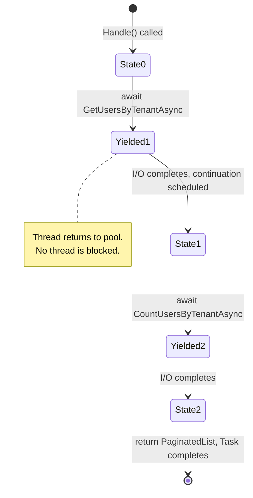

## TL;DR

C# 14 on .NET 10 is a fundamentally different language from the C# 7 that many interview resources still teach. Modern C# emphasizes **records over classes** for data, **`init` and the `field` keyword** for immutability, **async/await state machines** for I/O, **pattern matching** over if-else chains, and **LINQ expression trees** that translate to SQL. For 2026 interviews: know `record` vs `class` vs `struct`, how async/await compiles to a state machine, `IQueryable<T>` vs `IEnumerable<T>`, DI lifetimes, and be aware of the NativeAOT constraints pushing the ecosystem away from runtime reflection toward source generators. This note draws real examples from the `tai-portal` codebase running on .NET 10.

## Deep Dive

### 1. Value Types vs Reference Types

- **What:** C# has two fundamental type categories. **Value types** (`struct`, `int`, `record struct`) store data directly and are copied by value. **Reference types** (`class`, `record class`, `delegate`) store a pointer to heap-allocated data and are copied by reference.
- **Why:** Understanding this distinction is the foundation for reasoning about performance, equality, and mutability. Boxing a value type in a hot loop creates thousands of unnecessary heap allocations. Comparing two `class` instances checks *identity* (same pointer), not *equality* (same values) — unless you override `Equals()`.
- **How:**

| Aspect | Value Type (stack when local) | Reference Type (heap) |
|--------|-------------------------------|----------------------|
| Storage | Inline, LIFO | GC-managed |
| Copy | Full copy of data | Copy of pointer |
| Equality | By value (for `record struct`) | By reference (default) |
| Size sweet spot | ≤16 bytes | Any size |
| Null | Not nullable (unless `T?`) | Nullable by default |

```csharp
// Value type on stack — 16 bytes inline, no heap allocation
TenantId tid = new TenantId(Guid.NewGuid());

// Reference type on heap — pointer on stack, object on heap
var user = new ApplicationUser("admin@acme.com", tid);
```

- **When:** Use `struct` / `record struct` for small, immutable identifiers (IDs, coordinates, money). Use `class` / `record class` for entities with behavior, large objects, or anything needing inheritance.
- **Trade-offs:** Structs are copied on every assignment and method call. A 64-byte struct passed through 5 method calls = 320 bytes of copies. Also: structs inside a class field are heap-allocated as part of the containing object — "structs go on the stack" is only true for local variables.

**Boxing — The Performance Killer:**
```csharp
// BAD: 10,000 heap allocations from boxing int → object
List<object> list = new();
for (int i = 0; i < 10000; i++) list.Add(i);

// GOOD: Generic collection avoids boxing entirely
List<int> list = new();
for (int i = 0; i < 10000; i++) list.Add(i);
```

**Real Example — Value Object as `record struct`:**

[View TenantId.cs](../../../libs/core/domain/ValueObjects/TenantId.cs)

```csharp
// libs/core/domain/ValueObjects/TenantId.cs
public readonly record struct TenantId {
    public Guid Value { get; }
    public TenantId(Guid value) => Value = value;

    public static explicit operator TenantId(Guid value) => new(value);
    public static implicit operator Guid(TenantId id) => id.Value;
}
```

Why `readonly record struct`? Value semantics (two `TenantId` with same `Guid` are equal), immutability via `readonly`, stack allocation, and compiler-generated `Equals` + `GetHashCode` + `ToString`.

---

### 2. Records — The Modern Default for Data

- **What:** Records (`record class` and `record struct`) provide **value equality**, **immutability**, **`with` expressions**, and **deconstruction** out of the box. A single `public record Person(string Name, int Age);` generates what would be ~50 lines of boilerplate class code.
- **Why:** In CQRS architectures like tai-portal, every Command and Query is a `record`. Records are the natural choice because: Commands are immutable message objects (you don't mutate a `RegisterStaffCommand` after creating it), value equality makes testing trivial (`Assert.Equal(expected, actual)` just works), and `with` expressions enable non-destructive mutation.
- **How:**

```csharp
// tai-portal: Every CQRS operation is a record
public record RegisterStaffCommand(
    Guid TenantId, string Email, string Password,
    string FirstName, string LastName) : IRequest<string>;

public record GetUsersQuery(
    Guid TenantId, int PageNumber = 1, int PageSize = 10,
    string? SortColumn = null, string? Search = null) : IRequest<PaginatedList<UserDto>>;

// DTOs are records too
public record UserDto(string Id, string Email, string FirstName,
    string LastName, string Status, uint RowVersion);

// With expression — immutable update
var query = new GetUsersQuery(tenantId);
var page2 = query with { PageNumber = 2 };  // Copy with one field changed
```

| Use `record` when... | Use `class` when... |
|----------------------|---------------------|
| Immutable data (Commands, Queries, DTOs) | Mutable state (Entities with lifecycle) |
| Value equality needed | Reference identity matters |
| Small, focused data carriers | Complex behavior with private state |
| DDD Value Objects | DDD Entities / Aggregate Roots |

- **When:** Default to `record` for data. Use `class` for entities with behavior and mutable state (like `ApplicationUser` which has a state machine).
- **Trade-offs:** `record class` is still heap-allocated. For very hot paths with small data, `record struct` avoids the heap. Records support inheritance (`record Dog(string Breed) : Animal(Name)`), but deep hierarchies are rare — prefer composition.

---

### 3. Init-Only Properties & The C# 14 `field` Keyword

- **What:** `init` properties can only be set during object construction (constructor or object initializer), then become read-only. C# 14's `field` keyword provides direct access to the compiler-synthesized backing field, eliminating manual `_backingField` declarations.
- **Why:** Immutability prevents entire classes of bugs (race conditions, unexpected state changes, stale cache entries). The `field` keyword reduces boilerplate — previously, adding validation to a property required declaring a private field manually.
- **How:**

[View ApplicationUser.cs](../../../libs/core/domain/Entities/ApplicationUser.cs)

```csharp
// libs/core/domain/Entities/ApplicationUser.cs — C# 14 field keyword

// init + field: Set once at construction with validation, then immutable
public TenantId TenantId {
    get;
    init => field = (value.Value == Guid.Empty)
        ? throw new ArgumentException("A valid TenantId is required.", nameof(value))
        : value;
}

// set + field: Normalization on every write, no manual backing field needed
public override string? Email {
    get;
    set => field = value?.Trim().ToLowerInvariant();
}
```

- **When:** Use `init` for properties that must be set at creation and never change (IDs, tenant assignments). Use `set` with `field` for properties that need normalization or validation on mutation.
- **Trade-offs:** `init` prevents EF Core from setting properties during materialization unless the entity has a parameterless constructor (tai-portal uses `protected ApplicationUser() { }` for this). The `field` keyword is C# 14 only — older codebases can't use it.

---

### 4. Async/Await Under the Hood

- **What:** `async/await` is syntactic sugar that the compiler transforms into a **state machine**. Each `await` becomes a state transition. The method returns a `Task` to the caller immediately, and the continuation runs when the awaited I/O completes.
- **Why:** Without async, a database query blocks the thread for ~5ms. In a web server handling 1000 concurrent requests, that's 1000 threads blocked on I/O — the thread pool is exhausted and the server stops responding. Async/await yields the thread back to the pool during I/O, allowing one thread to serve many requests.
- **How:**

```csharp
// What you write:
public async Task<PaginatedList<UserDto>> Handle(
    GetUsersQuery request, CancellationToken cancellationToken) {
    var users = await _identityService.GetUsersByTenantAsync(
        tenantId, skip, take, cancellationToken);  // ← state 0 → state 1
    var count = await _identityService.CountUsersByTenantAsync(
        tenantId, cancellationToken);               // ← state 1 → state 2
    return new PaginatedList<UserDto>(items, count, ...);
}

// What the compiler generates (simplified):
class HandleStateMachine : IAsyncStateMachine {
    int _state;
    void MoveNext() {
        switch (_state) {
            case 0: /* start GetUsersByTenantAsync, yield */ return;
            case 1: /* resume, start CountUsersByTenantAsync, yield */ return;
            case 2: /* resume, build result, complete Task */ return;
        }
    }
}
```



**Critical mistakes:**
```csharp
// DEADLOCK: .Result blocks thread that the continuation needs
var result = _service.GetUsersAsync().Result;

// DATA LOSS: Task not awaited, SaveChanges may never complete
_context.SaveChangesAsync();  // Missing await!

// CORRECT: async all the way
var result = await _service.GetUsersAsync();
await _context.SaveChangesAsync(cancellationToken);
```

- **When:** Use async for all I/O-bound work (database, network, file system). Do NOT use async for CPU-bound computation — use `Task.Run()` instead.
- **Trade-offs:** Each async method allocates a state machine object (~100 bytes). For methods that often complete synchronously (cache hits), use `ValueTask<T>` to avoid the allocation. Always pass `CancellationToken` — it's the only way to cancel a long-running database query when the user navigates away.

---

### 5. LINQ & IQueryable vs IEnumerable

- **What:** LINQ provides declarative data querying. The critical distinction: `IEnumerable<T>` executes in-memory (C# delegates), while `IQueryable<T>` builds an expression tree that translates to SQL.
- **Why:** Using `IEnumerable<T>` where `IQueryable<T>` is needed means loading the entire table into memory and filtering in C# instead of letting PostgreSQL do it. In tai-portal, this would mean loading all users across all tenants, then filtering — a security and performance disaster.
- **How:**

```csharp
// IQueryable — builds SQL, executes in PostgreSQL
IQueryable<Privilege> query = _context.Privileges.AsNoTracking();
if (!string.IsNullOrWhiteSpace(search))
    query = query.Where(p => p.Name.Contains(search));  // → SQL WHERE
var results = await query.Skip(skip).Take(take)
    .Select(p => new PrivilegeDto(...))                  // → SQL SELECT
    .ToListAsync(cancellationToken);                     // Executes ONE SQL query

// IEnumerable — loads ALL rows, filters in C# memory
IEnumerable<Privilege> all = await _context.Privileges.ToListAsync();  // Loads entire table!
var filtered = all.Where(p => p.Name.Contains(search));                // Filters in RAM
```

**Deferred vs Immediate Execution:**

| Deferred (builds query) | Immediate (executes query) |
|-------------------------|---------------------------|
| `Where`, `Select`, `OrderBy`, `Skip`, `Take` | `ToList`, `ToArray`, `Count`, `First`, `Single` |
| Nothing happens until materialized | Hits the database NOW |

**The N+1 Problem:**
```csharp
// BAD: N+1 queries — 1 query for users + N queries for orders
foreach (var user in users) {
    var orders = await _context.Orders.Where(o => o.UserId == user.Id).ToListAsync();
}

// GOOD: Single query with JOIN
var usersWithOrders = await _context.Users
    .Include(u => u.Orders)
    .ToListAsync();
```

- **When:** Use `IQueryable<T>` when building database queries (keep the chain as IQueryable until the final `ToListAsync`). Use `IEnumerable<T>` for in-memory collections only.
- **Trade-offs:** Not all C# expressions translate to SQL. Complex LINQ methods (like custom extension methods or string interpolation) cause "client-side evaluation" — EF Core silently pulls data into memory. Use `EF.Functions.Like()` instead of `.Contains()` for database-safe string matching.

---

### 6. Dependency Injection — Lifetimes & Registration

- **What:** DI is a technique where objects receive their dependencies from an external container rather than creating them. In .NET 10, the built-in `IServiceProvider` manages three lifetimes: Singleton, Scoped, and Transient.
- **Why:** Without DI, classes create their own dependencies (`new DbContext()`), making them impossible to test, swap implementations, or manage lifetimes correctly. DI inverts this — the container creates and manages everything.
- **How:**

```csharp
// apps/portal-api/Program.cs — Real DI registration from tai-portal
builder.Services.AddScoped<ITenantService, TenantService>();         // Per-request
builder.Services.AddScoped<IIdentityService, IdentityService>();     // Per-request
builder.Services.AddSingleton<IRealTimeNotifier, SignalRRealTimeNotifier>(); // App lifetime
builder.Services.AddScoped<IOtpService, OtpService>();               // Per-request
```

| Lifetime | Instance Created | Use For | tai-portal Example |
|----------|-----------------|---------|-------------------|
| **Singleton** | Once per app | Stateless shared services | `IRealTimeNotifier` (holds `IHubContext`) |
| **Scoped** | Once per HTTP request | Per-request state | `ITenantService` (holds current `TenantId`) |
| **Transient** | Every injection | Lightweight, stateful | Rarely used in tai-portal |

**The Captive Dependency Problem:**
```csharp
// DANGEROUS: Singleton captures a Scoped service
builder.Services.AddSingleton<MySingleton>();  // Lives forever
builder.Services.AddScoped<PortalDbContext>(); // Should die per-request

public class MySingleton(PortalDbContext db) { }
// db is captured and reused across ALL requests — stale data, thread-unsafe!
```

Rule: A service can only depend on services with **equal or longer** lifetimes. Singleton → Singleton OK. Singleton → Scoped DANGEROUS.

- **When:** Default to Scoped for anything that touches per-request state (DbContext, tenant context, current user). Use Singleton for stateless services. Use Transient only when you need a fresh instance every time.
- **Trade-offs:** Singleton services must be **thread-safe** since they're shared across all requests. `DbContext` as Singleton is a classic bug — it's not thread-safe and would share change tracking across requests.

---

### 7. Pattern Matching & Switch Expressions (C# 8-14)

- **What:** Pattern matching replaces verbose if-else chains with concise, compiler-verified expressions. Switch expressions return values directly instead of executing statement blocks.
- **Why:** Interviewers use pattern matching as a signal that you write modern C#. The compiler verifies exhaustiveness — if you forget a case in a switch expression, you get a warning. if-else chains have no such safety.
- **How:**

```csharp
// Switch expression — replaces 12 lines of if-else with 5
string GetRiskDescription(RiskLevel level) => level switch {
    RiskLevel.High => "High risk — requires JIT approval",
    RiskLevel.Medium => "Medium risk — audit logged",
    RiskLevel.Low => "Low risk — standard access",
    _ => "Unknown"
};

// Property pattern — match on object shape
var message = user switch {
    { Status: UserStatus.Active } => "Welcome back!",
    { Status: UserStatus.PendingApproval } => "Awaiting admin approval",
    _ => "Contact support"
};

// Relational + logical patterns
string grade = score switch {
    >= 90 and <= 100 => "A",
    >= 80 => "B",
    < 0 or > 100 => "Invalid",
    _ => "C"
};

// Null checking with is (handles null safely)
if (user is { Status: UserStatus.Active, TenantId: { Value: var tid } }) {
    // tid is in scope, compiler knows it's not null
}
```

- **When:** Use switch expressions for any value-mapping logic. Use `is` patterns for null-safe property access. Use relational patterns for range checks.
- **Trade-offs:** Deeply nested patterns (`{ Address: { City: { Name: var n } } }`) become hard to read. Keep patterns shallow — extract complex conditions into helper methods.

---

### 8. Generics — Type Safety Without Boxing

- **What:** Generics allow writing code that works with any type while maintaining compile-time type safety. Constraints (`where T : class`) restrict which types are allowed.
- **Why:** Without generics, you'd use `object` and cast everywhere — losing type safety and paying boxing costs for value types. EF Core's entire API is built on generics: `DbSet<T>`, `Set<T>()`, `FindAsync<T>()`.
- **How:**

```csharp
// tai-portal: Generic domain event dispatch
// libs/core/infrastructure/Persistence/PortalDbContext.cs
var notificationType = typeof(DomainEventNotification<>).MakeGenericType(domainEvent.GetType());
var notification = Activator.CreateInstance(notificationType, domainEvent);
await publisher.Publish(notification, cancellationToken);

// Generic constraints
public class ValidationPipelineBehavior<TRequest, TResponse>
    : IPipelineBehavior<TRequest, TResponse>
    where TRequest : IRequest<TResponse> {  // Constraint: must implement IRequest
    // Works for ANY command/query type
}
```

**Covariance and Contravariance:**
```csharp
// Covariance (out) — can return derived where base expected
IEnumerable<Dog> dogs = new List<Dog>();
IEnumerable<Animal> animals = dogs;  // OK: IEnumerable<out T>

// Contravariance (in) — can accept base where derived expected
Action<Animal> feedAnimal = a => Console.WriteLine(a.Name);
Action<Dog> feedDog = feedAnimal;  // OK: Action<in T>
```

- **When:** Use generics when writing reusable code that operates on multiple types (pipeline behaviors, repositories, event handlers). Use constraints to express requirements clearly.
- **Trade-offs:** Generic code is harder to debug (stack traces show `ValidationPipelineBehavior<RegisterStaffCommand, String>` instead of a simple class name). Over-constraining (`where T : class, new(), IEntity, IAuditable`) makes the generic inflexible.

---

### 9. NativeAOT, Source Generators & The Reflection Problem

- **What:** NativeAOT (Ahead-of-Time compilation) compiles .NET directly to native machine code — no JIT, no runtime, startup in milliseconds. The trade-off: **no runtime reflection**. Source generators provide compile-time code generation as the replacement.
- **Why:** This is .NET 10's strategic direction. Cloud-native apps (containers, serverless) need fast cold starts. NativeAOT delivers 10-50ms startup vs ~500ms with JIT. But it fundamentally changes what C# patterns are viable — interviewers ask about this to gauge whether you understand the ecosystem's trajectory.
- **How (the problem in tai-portal):**

```csharp
// libs/core/infrastructure/Persistence/PortalDbContext.cs
// This code BREAKS under NativeAOT:
var notificationType = typeof(DomainEventNotification<>).MakeGenericType(domainEvent.GetType());
var notification = Activator.CreateInstance(notificationType, domainEvent);

// MakeGenericType() and Activator.CreateInstance() use runtime reflection.
// The AOT compiler can't know at compile time which generic types will be constructed.
// The linker trims them as "unused" → runtime crash.
```

**The Source Generator alternative:**
```csharp
// Instead of runtime reflection, a source generator would:
// 1. At compile time, scan for all IDomainEvent implementations
// 2. Generate a static dispatch method:
public static partial class DomainEventDispatcher {
    // AUTO-GENERATED at compile time
    public static object CreateNotification(IDomainEvent evt) => evt switch {
        UserRegisteredEvent e => new DomainEventNotification<UserRegisteredEvent>(e),
        UserApprovedEvent e => new DomainEventNotification<UserApprovedEvent>(e),
        PrivilegeChangeEvent e => new DomainEventNotification<PrivilegeChangeEvent>(e),
        _ => throw new InvalidOperationException($"Unknown event: {evt.GetType()}")
    };
}
// No reflection, no Activator, fully AOT-compatible.
```

**What can't you do under NativeAOT?**

| Blocked Pattern | AOT-Compatible Alternative |
|----------------|---------------------------|
| `Activator.CreateInstance()` | Source generator or static factory |
| `Type.MakeGenericType()` | Pre-register all generic types |
| `Assembly.GetTypes()` reflection | Source generator scans at compile time |
| Dynamic `System.Reflection.Emit` | Not possible — use source generators |
| Untyped JSON (`dynamic`) | `System.Text.Json` source generator: `JsonSerializerContext` |

- **When:** You don't need NativeAOT for every app. Use it for: serverless functions, CLI tools, containers where cold start matters. For long-running web servers (like tai-portal), JIT is fine — it optimizes hot paths at runtime that AOT can't.
- **Trade-offs:** NativeAOT binaries are larger (~15-30MB self-contained), compile times are longer, and debugging is harder (no Edit-and-Continue). The ecosystem is still migrating — not all NuGet packages are AOT-compatible.

---

### 10. IAsyncEnumerable — Streaming Async Data

- **What:** `IAsyncEnumerable<T>` produces items one at a time, asynchronously. `await foreach` consumes them without loading everything into memory. It's the async counterpart to `IEnumerable<T>`.
- **Why:** Loading 100,000 audit log entries into a `List<T>` before returning them wastes memory and delays the first byte. `IAsyncEnumerable<T>` streams results as they arrive from the database, and is the natural data type for SignalR server-to-client streaming and gRPC server streaming.
- **How:**

```csharp
// Producing: yield items one at a time
public async IAsyncEnumerable<AuditEntry> StreamAuditLogsAsync(
    TenantId tenantId,
    [EnumeratorCancellation] CancellationToken ct = default) {
    await foreach (var entry in _context.AuditLogs
        .Where(a => a.TenantId == tenantId)
        .OrderByDescending(a => a.Timestamp)
        .AsAsyncEnumerable()
        .WithCancellation(ct)) {
        yield return entry;  // Stream one row at a time
    }
}

// Consuming: await foreach
await foreach (var entry in StreamAuditLogsAsync(tenantId, ct)) {
    await ProcessEntryAsync(entry);
    // Memory: only ONE entry in memory at a time
}
```

- **When:** Use for large result sets, real-time data feeds, SignalR streaming, and gRPC server streaming. Use `ToListAsync()` when you need all items in memory at once (e.g., returning a paginated response).
- **Trade-offs:** `IAsyncEnumerable<T>` keeps the database connection open for the entire enumeration. If the consumer is slow, the connection is held longer. For paginated APIs, `ToListAsync()` with `Skip/Take` is better — fetch the page, release the connection.

---

## Interview Q&A

### L1: class vs struct vs record
**Difficulty:** L1 (Junior)

**Question:** What is the difference between `class`, `struct`, and `record` in C#?

**Answer:** `class` is a reference type on the heap with reference equality — two instances with the same data are NOT equal by default. `struct` is a value type on the stack (when local) with value semantics — it's copied on assignment. `record` (either `record class` or `record struct`) adds compiler-generated value equality, `ToString()`, `with` expressions, and deconstruction. In modern .NET 10, the rule is: use `record` for immutable data (DTOs, commands, queries), `class` for entities with mutable state and behavior, and `struct`/`record struct` for small identifiers under 16 bytes.

---

### L1: What are DI lifetimes?
**Difficulty:** L1 (Junior)

**Question:** Explain the three DI lifetimes in .NET and when to use each.

**Answer:** **Singleton** — one instance for the entire application lifetime, shared across all requests. Use for stateless services like caching or configuration. **Scoped** — one instance per HTTP request, disposed when the request ends. Use for `DbContext` and per-request state like `ITenantService`. **Transient** — a new instance every time it's requested from the container. Use for lightweight, stateless utilities. The critical rule: a Singleton must never depend on a Scoped service (captive dependency), because the Scoped service would be captured and reused across all requests.

---

### L2: How does async/await work internally?
**Difficulty:** L2 (Mid-Level)

**Question:** How does async/await work under the hood in C#?

**Answer:** The compiler transforms each `async` method into a **state machine class** implementing `IAsyncStateMachine`. Each `await` becomes a state transition. When execution reaches an `await` on an incomplete Task, the method returns the Task to the caller and the thread goes back to the thread pool — it does NOT block. When the I/O completes, the `SynchronizationContext` (or thread pool) schedules the continuation, which calls `MoveNext()` on the state machine to resume from the correct state.

Key implications: `await` doesn't block threads (it yields them), `.Result` and `.Wait()` DO block threads (deadlock risk), `ConfigureAwait(false)` skips context capture for better performance in library code, and `CancellationToken` is the only way to cancel in-flight I/O.

---

### L2: IQueryable vs IEnumerable
**Difficulty:** L2 (Mid-Level)

**Question:** When would you use `IQueryable<T>` vs `IEnumerable<T>`, and what happens if you mix them up?

**Answer:** `IQueryable<T>` builds an **expression tree** that translates to SQL — filtering, sorting, and projection happen in the database. `IEnumerable<T>` is an in-memory collection — operations execute in C#. If you accidentally call `.ToList()` too early on an `IQueryable` chain, everything after that runs in memory. In a multi-tenant system like tai-portal, this could mean loading ALL tenants' data into memory and filtering in C# — a security and performance disaster. Rule: keep the chain as `IQueryable<T>` as long as possible, materialize with `ToListAsync()` only at the end.

---

### L2: throw vs throw ex
**Difficulty:** L2 (Mid-Level)

**Question:** What's wrong with `throw ex;` in a catch block?

**Answer:** `throw ex;` resets the stack trace to the current line — you lose the original location where the exception occurred. `throw;` (without the variable) preserves the original stack trace. To add context while preserving the original, wrap it: `throw new BusinessException("Operation failed", ex);` — the original exception becomes `InnerException`.

---

### L3: The Captive Dependency Problem
**Difficulty:** L3 (Senior)

**Question:** A Singleton service depends on a Scoped service (like `DbContext`). What happens at runtime, and how do you fix it?

**Answer:** The Scoped service is resolved once when the Singleton is first created and **captured forever**. The `DbContext` is never disposed, accumulates stale tracked entities across all requests, and is accessed from multiple threads concurrently (it's not thread-safe). Symptoms: data corruption, stale reads, and `ObjectDisposedException` if the scope is disposed externally.

**Fix options:**
1. **Inject `IServiceScopeFactory`** — the Singleton creates a new scope per operation: `using var scope = _scopeFactory.CreateScope(); var db = scope.ServiceProvider.GetRequiredService<PortalDbContext>();`
2. **Change the Singleton to Scoped** — if it doesn't need to be a Singleton
3. **In .NET 10:** Enable `ValidateScopes` in development to catch this at startup: `builder.Host.UseDefaultServiceProvider(o => o.ValidateScopes = true);`

---

### L3: NativeAOT — What Breaks and Why?
**Difficulty:** L3 (Senior)

**Question:** Your .NET 10 application uses `Activator.CreateInstance()` and `Type.MakeGenericType()` to dispatch domain events dynamically. A requirement comes in to deploy as a NativeAOT binary. What breaks, and how do you fix it?

**Answer:** Both methods rely on **runtime reflection** — constructing types that the compiler didn't know about at compile time. NativeAOT's ahead-of-time compiler can't generate code for generic types that are only discovered at runtime, so the linker trims them as "unused."

The fix is a **source generator** that scans for all `IDomainEvent` implementations at compile time and generates a static dispatch method using a switch expression. Instead of `Activator.CreateInstance(MakeGenericType(...))`, the generated code uses `evt switch { UserRegisteredEvent e => new DomainEventNotification<UserRegisteredEvent>(e), ... }` — fully AOT-compatible, zero reflection, and the compiler verifies exhaustiveness. This is exactly what `System.Text.Json` did with `JsonSerializerContext` — moving from runtime reflection to compile-time source generation.

---

### Staff: ValueTask, Span, and Zero-Allocation Patterns
**Difficulty:** Staff

**Question:** In a high-throughput API endpoint handling 10,000 requests/second, your profiler shows that async state machine allocations and string processing are the top two allocation sources. How do you reduce heap pressure without rewriting the business logic?

**Answer:** Two targeted optimizations:

1. **`ValueTask<T>` over `Task<T>`** — For methods that often complete synchronously (cache hits, short-circuit validations), `Task<T>` allocates a Task object even for synchronous completion. `ValueTask<T>` is a discriminated union of `T` (synchronous) and `Task<T>` (asynchronous). When the result is already available, zero allocation. Caveat: `ValueTask<T>` can only be awaited once — don't store it, don't await it twice.

2. **`Span<T>` and `ReadOnlySpan<T>`** — For string processing (parsing headers, normalizing emails, extracting substrings), `string.Substring()` allocates a new string on every call. `ReadOnlySpan<char>` provides a view over the existing string with zero allocation. `Span<T>` is stack-only (can't be stored in fields, can't cross await boundaries) but eliminates heap allocations in parsing hot paths.

```csharp
// Before: 3 allocations per request for email normalization
string normalized = email.Trim().ToLowerInvariant();

// After: Parse with Span, allocate once at the end
ReadOnlySpan<char> span = email.AsSpan().Trim();
// Process span... then allocate final string only once
string normalized = string.Create(span.Length, span, (chars, src) => {
    src.ToLowerInvariant(chars);
});
```

The key insight: `Span<T>` can't cross `await` boundaries (it's a `ref struct`, stack-only). So you structure code as: synchronous Span-based parsing → single allocation → async I/O with the final result. This is why high-performance .NET code often separates parsing (synchronous, Span-based) from I/O (asynchronous, Task-based).

---

### Staff: Why Records for CQRS, but Classes for Entities?
**Difficulty:** Staff

**Question:** In tai-portal, every Command and Query is a `record`, but `ApplicationUser` is a `class`. Why not make everything a record? Or everything a class?

**Answer:** Records and classes serve fundamentally different roles in DDD/CQRS:

**Commands/Queries as records** — A `RegisterStaffCommand` is an immutable message. Once created, it should never change (a command in-flight shouldn't be mutated by middleware). Records give us: value equality for testing (`Assert.Equal(expected, actual)` without overriding Equals), immutability by default, `with` expressions for creating modified copies in tests, and concise syntax (a Command is often a single line).

**Entities as classes** — `ApplicationUser` has **identity** (two users with the same name are NOT the same user), **mutable state** (Status transitions from Created → Active), and **behavior** (the `Approve()` method enforces invariants and raises domain events). Records would fight us here: value equality means two different users with the same email would be "equal," `with` would bypass the state machine guards (you could `user with { Status = Active }` without calling `ActivateAccount()`), and the `private set` on `Status` enforces that only domain methods can change state.

The pattern: **records for messages and values, classes for entities with identity and lifecycle.** This maps directly to DDD: Value Objects → `record struct`, Commands/Queries/DTOs → `record class`, Entities/Aggregates → `class`.

---

## Cross-References

- [[Design-Patterns]] — Records enable CQRS (Commands/Queries), DI enables Singleton/Scoped patterns, generics power MediatR Pipeline Behaviors.
- [[EFCore-SQL]] — LINQ/IQueryable translate to SQL, async/await for all database operations, `DbContext` lifetime is Scoped.
- [[Testing]] — Records simplify assertion (value equality), DI enables mock injection, async patterns affect test setup.
- [[Security-CSP-DPoP]] — C# type system enables the DPoP proof generation chain (CryptoKey → JWK → signed JWT).

---

## Further Reading

- [What's New in C# 14](https://learn.microsoft.com/en-us/dotnet/csharp/whats-new/csharp-14)
- [Async/Await Best Practices](https://learn.microsoft.com/en-us/dotnet/csharp/asynchronous-programming/)
- [NativeAOT Deployment](https://learn.microsoft.com/en-us/dotnet/core/deploying/native-aot/)
- [Source Generators](https://learn.microsoft.com/en-us/dotnet/csharp/roslyn-sdk/source-generators-overview)
- Source: `libs/core/domain/ValueObjects/TenantId.cs` — record struct example
- Source: `libs/core/domain/Entities/ApplicationUser.cs` — C# 14 field keyword, state machine pattern
- Source: `libs/core/application/UseCases/` — Records for all Commands and Queries
- Source: `libs/core/infrastructure/Persistence/PortalDbContext.cs` — Generics, async dispatch, reflection (NativeAOT problem)

---

*Last updated: 2026-04-03*
