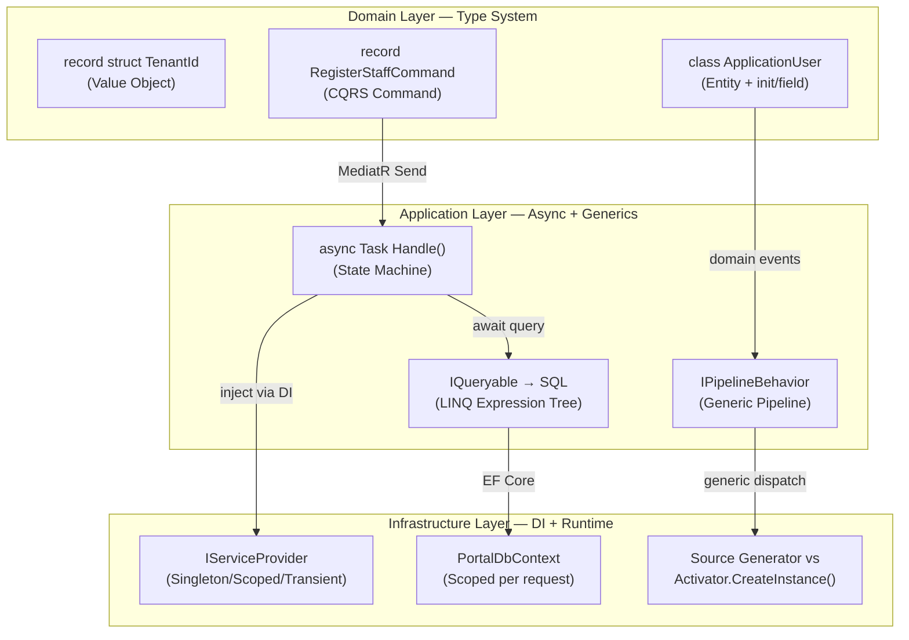
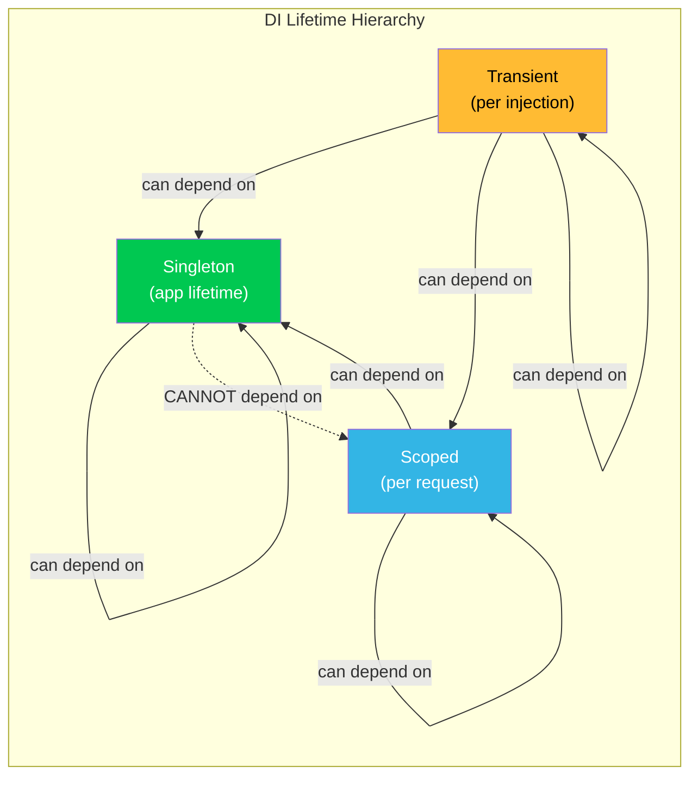

## Table of Contents

[🧠 **View Interactive Mindmap**](./csharp-fundamentals-mindmap.md)

1. [TL;DR](#tldr)
2. [Deep Dive](#deep-dive)
   2.1 [Type System & Data Modeling](#concept-group-1-type-system--data-modeling)
      2.1.1 [Value Types vs Reference Types](#1-value-types-vs-reference-types)
      2.1.2 [Records — The Modern Default for Data](#2-records--the-modern-default-for-data)
      2.1.3 [Init-Only Properties & The C# 14 `field` Keyword](#3-init-only-properties--the-c-14-field-keyword)
   2.2 [Async, LINQ & Data Access](#concept-group-2-async-linq--data-access) *(cross-refs to [[Async-Concurrency]] and [[LINQ]])*
   2.3 [DI, Patterns & Runtime](#concept-group-3-di-patterns--runtime)
      2.3.1 [Dependency Injection — Lifetimes & Registration](#7-dependency-injection--lifetimes--registration)
      2.3.2 [Pattern Matching & Switch Expressions](#8-pattern-matching--switch-expressions)
      2.3.3 [Generics — Type Safety Without Boxing](#9-generics--type-safety-without-boxing)
      2.3.4 [NativeAOT, Source Generators & The Reflection Problem](#10-nativeaot-source-generators--the-reflection-problem)
3. [Architecture & Data Flow](#architecture--data-flow)
4. [Real-World Examples](#real-world-examples)
   4.1 [Value Object as `record struct`](#1-value-object-as-record-struct)
   4.2 [CQRS Commands & Queries as Records](#2-cqrs-commands--queries-as-records)
   4.3 [C# 14 `field` Keyword in Domain Entities](#3-c-14-field-keyword-in-domain-entities)
   4.4 [Generic Domain Event Dispatch](#4-generic-domain-event-dispatch)
   4.5 [DI Registration in tai-portal](#5-di-registration-in-tai-portal)
5. [Comparison Tables](#comparison-tables)
6. [Interview Q&A](#interview-qa)
   6.1 [L1: Junior](#l1-junior-knowledge)
      6.1.1 [class vs struct vs record](#l1-class-vs-struct-vs-record)
      6.1.2 [What are DI lifetimes?](#l1-what-are-di-lifetimes)
   6.2 [L2: Mid-Level](#l2-mid-level-knowledge)
      6.2.1 [How does async/await work internally?](#l2-how-does-asyncawait-work-internally)
      6.2.2 [IQueryable vs IEnumerable](#l2-iqueryable-vs-ienumerable)
      6.2.3 [throw vs throw ex](#l2-throw-vs-throw-ex)
   6.3 [L3: Senior](#l3-senior-knowledge)
      6.3.1 [The Captive Dependency Problem](#l3-the-captive-dependency-problem)
      6.3.2 [NativeAOT — What Breaks and Why?](#l3-nativeaot--what-breaks-and-why)
   6.4 [Staff](#staff-system-architecture)
      6.4.1 [ValueTask, Span, and Zero-Allocation Patterns](#staff-valuetask-span-and-zero-allocation-patterns)
      6.4.2 [Why Records for CQRS, but Classes for Entities?](#staff-why-records-for-cqrs-but-classes-for-entities)
7. [Cross-References](#cross-references)
8. [Further Reading](#further-reading)

---

## TL;DR

C# 14 on .NET 10 is a fundamentally different language from the C# 7 that many interview resources still teach. Modern C# emphasizes <span style="color: #00C851; font-weight: bold;">records over classes</span> for data, <span style="color: #33b5e5; font-weight: bold;">`init` and the `field` keyword</span> for immutability, <span style="color: #33b5e5; font-weight: bold;">async/await state machines</span> for I/O, <span style="color: #00C851; font-weight: bold;">pattern matching</span> over if-else chains, and <span style="color: #33b5e5; font-weight: bold;">LINQ expression trees</span> that translate to SQL. For 2026 interviews: know `record` vs `class` vs `struct`, how async/await compiles to a state machine, `IQueryable<T>` vs `IEnumerable<T>`, DI lifetimes, and be aware of the <span style="color: #ffbb33; font-weight: bold;">NativeAOT constraints</span> pushing the ecosystem away from runtime reflection toward source generators. This note draws real examples from the `tai-portal` codebase running on .NET 10.

---

## Deep Dive

### Concept Group 1: Type System & Data Modeling

#### 1. Value Types vs Reference Types

##### What
C# has two fundamental type categories. <span style="color: #33b5e5; font-weight: bold;">Value types</span> (`struct`, `int`, `record struct`) store data directly and are copied by value. <span style="color: #33b5e5; font-weight: bold;">Reference types</span> (`class`, `record class`, `delegate`) store a pointer to heap-allocated data and are copied by reference.

##### Why
Without understanding this distinction, you cannot reason about performance, equality, or mutability. Boxing a value type in a hot loop creates thousands of unnecessary heap allocations. Comparing two `class` instances checks *identity* (same pointer), not *equality* (same values) — unless you override `Equals()`.

##### How

| Aspect | Value Type (stack when local) | Reference Type (heap) |
|--------|-------------------------------|----------------------|
| Storage | Inline, LIFO | GC-managed |
| Copy | Full copy of data | Copy of pointer |
| Equality | By value (for `record struct`) | By reference (default) |
| Size sweet spot | ≤16 bytes | Any size |
| Null | Not nullable (unless `T?`) | Nullable by default |

```csharp
// Value type on stack — 16 bytes inline, no heap allocation
TenantId tid = new TenantId(Guid.NewGuid());

// Reference type on heap — pointer on stack, object on heap
var user = new ApplicationUser("admin@acme.com", tid);
```

<span style="color: #ff4444; font-weight: bold;">Boxing — The Performance Killer:</span>
```csharp
// BAD: 10,000 heap allocations from boxing int → object
List<object> list = new();
for (int i = 0; i < 10000; i++) list.Add(i);

// GOOD: Generic collection avoids boxing entirely
List<int> list = new();
for (int i = 0; i < 10000; i++) list.Add(i);
```

##### When
Use `struct` / `record struct` for small, immutable identifiers (IDs, coordinates, money). Use `class` / `record class` for entities with behavior, large objects, or anything needing inheritance.

##### Trade-offs
<span style="color: #ffbb33; font-weight: bold;">Structs are copied on every assignment and method call.</span> A 64-byte struct passed through 5 method calls = 320 bytes of copies. Also: structs inside a class field are heap-allocated as part of the containing object — <span style="color: #ff4444; font-weight: bold;">"structs go on the stack" is only true for local variables.</span>

---

#### 2. Records — The Modern Default for Data

##### What
<span style="color: #33b5e5; font-weight: bold;">Records</span> (`record class` and `record struct`) provide **value equality**, **immutability**, **`with` expressions**, and **deconstruction** out of the box. A single `public record Person(string Name, int Age);` generates what would be ~50 lines of boilerplate class code.

##### Why
Without records, every DTO, Command, and Query would require manually overriding `Equals()`, `GetHashCode()`, and `ToString()`. In CQRS architectures like tai-portal, every Command and Query is a `record` because: Commands are immutable message objects (you don't mutate a `RegisterStaffCommand` after creating it), value equality makes testing trivial (`Assert.Equal(expected, actual)` just works), and `with` expressions enable non-destructive mutation.

##### How

```csharp
// tai-portal: Every CQRS operation is a record
public record RegisterStaffCommand(
    Guid TenantId, string Email, string Password,
    string FirstName, string LastName) : IRequest<string>;

public record GetUsersQuery(
    Guid TenantId, int PageNumber = 1, int PageSize = 10,
    string? SortColumn = null, string? Search = null) : IRequest<PaginatedList<UserDto>>;

// DTOs are records too
public record UserDto(string Id, string Email, string FirstName,
    string LastName, string Status, uint RowVersion);

// With expression — immutable update
var query = new GetUsersQuery(tenantId);
var page2 = query with { PageNumber = 2 };  // Copy with one field changed
```

##### When
Default to `record` for data. Use `class` for entities with behavior and mutable state (like `ApplicationUser` which has a state machine).

| Use `record` when... | Use `class` when... |
|----------------------|---------------------|
| Immutable data (Commands, Queries, DTOs) | Mutable state (Entities with lifecycle) |
| Value equality needed | Reference identity matters |
| Small, focused data carriers | Complex behavior with private state |
| DDD Value Objects | DDD Entities / Aggregate Roots |

##### Trade-offs
<span style="color: #ffbb33; font-weight: bold;">`record class` is still heap-allocated.</span> For very hot paths with small data, `record struct` avoids the heap. Records support inheritance (`record Dog(string Breed) : Animal(Name)`), but deep hierarchies are rare — prefer composition.

---

#### 3. Init-Only Properties & The C# 14 `field` Keyword

##### What
<span style="color: #33b5e5; font-weight: bold;">`init` properties</span> can only be set during object construction (constructor or object initializer), then become read-only. C# 14's <span style="color: #33b5e5; font-weight: bold;">`field` keyword</span> provides direct access to the compiler-synthesized backing field, eliminating manual `_backingField` declarations.

##### Why
Without `init`, enforcing immutability after construction required either constructors with many parameters or private setters that could still be mutated internally. The `field` keyword solves the common pain point where adding validation to an auto-property forced you to declare a manual backing field.

##### How

To understand why `field` and `init` are so powerful, look at how we used to write properties with validation.

**1. The `field` keyword (Replacing Auto-Properties)**
Before C# 14, if you wanted to add *any* logic to a setter (like `.ToLowerInvariant()`), you had to abandon auto-properties and write 5+ lines of boilerplate with a manual backing field.

**The Old Way (Pre-C# 14):**
```csharp
// 1. Manually declare a private backing field
private string? _email; 

public override string? Email {
    // 2. Manually write the getter
    get { return _email; } 
    // 3. Finally write your logic in the setter
    set { _email = value?.Trim().ToLowerInvariant(); } 
}
```

**The Modern Way (C# 14 `field` keyword):**
The `field` keyword acts as a magical bridge. It keeps the simplicity of an auto-property (`get;`), but gives you direct access to the compiler's hidden backing field inside the setter.

```csharp
// set + field: Normalization on every write
public override string? Email {
    get; // "Hey compiler, generate a backing field and standard getter."
    set => field = value?.Trim().ToLowerInvariant(); // Assign directly to the hidden field
}
```

**2. The `init` accessor for Immutability & DDD Validation**
Introduced in C# 9, `init` is a strict version of `set` that only allows assignment **during object creation** (constructor or object initializer). Once created, the property becomes read-only. 

When combined with `field`, we can enforce strict Domain-Driven Design (DDD) invariants at the exact moment of creation.

```csharp
// init + field: Set once at construction with validation, then immutable
public TenantId TenantId {
    get;
    init => field = (value.Value == Guid.Empty)
        ? throw new ArgumentException("A valid TenantId is required.", nameof(value))
        : value;
}
```
*Why this is beautiful:* It is physically impossible to create an `ApplicationUser` with a missing `TenantId`. You don't have to rely on a developer remembering to call a validator—the C# type system strictly enforces it at creation.

##### When
Use `init` for properties that must be set at creation and never change (IDs, tenant assignments). Use `set` with `field` for properties that need normalization or validation on mutation.

##### Trade-offs
<span style="color: #ffbb33; font-weight: bold;">`init` prevents EF Core from setting properties during materialization</span> unless the entity has a parameterless constructor (tai-portal uses `protected ApplicationUser() { }` for this). The `field` keyword is C# 14 only — older codebases can't use it.

---

### Concept Group 2: Async, LINQ & Data Access

> These topics have been promoted to dedicated notes with full deep-dives, mindmaps, and interview Q&A:
>
> - **[[Async-Concurrency]]** — async/await state machine, Task vs ValueTask, SynchronizationContext, CancellationToken, concurrency primitives, parallelism patterns, BackgroundService, anti-patterns
> - **[[LINQ]]** — IQueryable vs IEnumerable, deferred execution, expression trees, query composition patterns, pagination, N+1, Cartesian explosion, bulk operations, TypeScript/RxJS mapping
>
> **Key interview takeaways** (quick reference):
> - `async/await` compiles to a state machine; each `await` yields the thread back to the pool — never block with `.Result` or `.Wait()`
> - `IQueryable<T>` builds SQL via expression trees; `IEnumerable<T>` runs in C# memory — always keep database queries as `IQueryable` until the final `ToListAsync()`
> - `IAsyncEnumerable<T>` streams rows one at a time (useful for SignalR/gRPC), but holds the DB connection open for the entire enumeration
> - `ValueTask<T>` avoids allocation for methods that often complete synchronously (cache hits)

---

### Concept Group 3: DI, Patterns & Runtime

#### 7. Dependency Injection — Lifetimes & Registration

##### What
<span style="color: #33b5e5; font-weight: bold;">Dependency Injection (DI)</span> is a technique where objects receive their dependencies from an external container rather than creating them. In .NET 10, the built-in `IServiceProvider` manages three lifetimes: <span style="color: #00C851; font-weight: bold;">Singleton</span>, <span style="color: #00C851; font-weight: bold;">Scoped</span>, and <span style="color: #00C851; font-weight: bold;">Transient</span>.

##### Why
Without DI, classes create their own dependencies (`new DbContext()`), making them impossible to test, swap implementations, or manage lifetimes correctly. DI inverts this — the container creates and manages everything.

##### How

```csharp
// apps/portal-api/Program.cs — Real DI registration from tai-portal
builder.Services.AddScoped<ITenantService, TenantService>();         // Per-request
builder.Services.AddScoped<IIdentityService, IdentityService>();     // Per-request
builder.Services.AddSingleton<IRealTimeNotifier, SignalRRealTimeNotifier>(); // App lifetime
builder.Services.AddScoped<IOtpService, OtpService>();               // Per-request
```

| Lifetime | Instance Created | Use For | tai-portal Example |
|----------|-----------------|---------|-------------------|
| **Singleton** | Once per app | Stateless shared services | `IRealTimeNotifier` (holds `IHubContext`) |
| **Scoped** | Once per HTTP request | Per-request state | `ITenantService` (holds current `TenantId`) |
| **Transient** | Every injection | Lightweight, stateful | Rarely used in tai-portal |

<span style="color: #ff4444; font-weight: bold;">The Captive Dependency Problem:</span>
```csharp
// DANGEROUS: Singleton captures a Scoped service
builder.Services.AddSingleton<MySingleton>();  // Lives forever
builder.Services.AddScoped<PortalDbContext>(); // Should die per-request

public class MySingleton(PortalDbContext db) { }
// db is captured and reused across ALL requests — stale data, thread-unsafe!
```

<span style="color: #00C851; font-weight: bold;">Rule: A service can only depend on services with **equal or longer** lifetimes.</span> Singleton → Singleton OK. Singleton → Scoped DANGEROUS.

##### When
Default to Scoped for anything that touches per-request state (DbContext, tenant context, current user). Use Singleton for stateless services. Use Transient only when you need a fresh instance every time.

##### Trade-offs
<span style="color: #ffbb33; font-weight: bold;">Singleton services must be **thread-safe**</span> since they're shared across all requests. `DbContext` as Singleton is a classic bug — it's not thread-safe and would share change tracking across requests.

---

#### 8. Pattern Matching & Switch Expressions

##### What
<span style="color: #33b5e5; font-weight: bold;">Pattern matching</span> (C# 8-14) replaces verbose if-else chains with concise, compiler-verified expressions. <span style="color: #33b5e5; font-weight: bold;">Switch expressions</span> return values directly instead of executing statement blocks.

##### Why
Without pattern matching, complex conditional logic requires nested if-else chains with no compiler exhaustiveness checking. If you forget a case in a switch expression, you get a warning. if-else chains have no such safety.

##### How

Pattern matching lets you test if a variable has a certain *shape* or *characteristics*, and if it does, immediately extract data from it safely.

**1. The Switch Expression**
Instead of writing a bulky `switch` *statement*, modern C# uses switch *expressions* that return a value directly. They provide **compiler safety (exhaustiveness)**—if you add a new value to the enum but forget to update the switch, you get a warning.

**The Old Way (Pre-C# 8):**
```csharp
string GetRiskDescription(RiskLevel level) 
{
    switch (level) 
    {
        case RiskLevel.High: return "High risk — requires JIT approval";
        case RiskLevel.Medium: return "Medium risk — audit logged";
        case RiskLevel.Low: return "Low risk — standard access";
        default: return "Unknown";
    }
}
```

**The Modern Way (Switch Expression):**
```csharp
string GetRiskDescription(RiskLevel level) => level switch {
    RiskLevel.High => "High risk — requires JIT approval",
    RiskLevel.Medium => "Medium risk — audit logged",
    RiskLevel.Low => "Low risk — standard access",
    _ => "Unknown" // The underscore '_' is the "discard" pattern (equivalent to 'default')
};
```

**2. Property Patterns (Matching on Object Shape)**
Inspect properties *inside* an object without deep `if/else` checks. It automatically handles `null` gracefully without throwing a `NullReferenceException`.

**The Old Way:**
```csharp
string message;
if (user != null && user.Status == UserStatus.Active) {
    message = "Welcome back!";
} else if (user != null && user.Status == UserStatus.PendingApproval) {
    message = "Awaiting admin approval";
} else {
    message = "Contact support";
}
```

**The Modern Way:**
```csharp
var message = user switch {
    { Status: UserStatus.Active } => "Welcome back!",
    { Status: UserStatus.PendingApproval } => "Awaiting admin approval",
    _ => "Contact support"
};
```

**3. Relational and Logical Patterns**
Use math operators (`>`, `<`, `>=`, `<=`) and logical words (`and`, `or`, `not`) directly inside the switch. This eliminates massive `if (score >= 90 && score <= 100)` chains.

```csharp
string grade = score switch {
    >= 90 and <= 100 => "A",
    >= 80 => "B",
    < 0 or > 100 => "Invalid",
    _ => "C"
};
```

**4. The `is` Operator with Declaration (Extraction)**
You can test if an object matches a shape, and if it does, *extract* data from it into a new variable in one step. How it works:
1. `is { ... }` checks if `user` is not null.
2. It checks if `user.Status == UserStatus.Active`.
3. It checks if `user.TenantId` is not null.
4. It drills into `TenantId`, takes its `Value` property, and assigns it to a newly declared variable `var tid`.

**The Old Way:**
```csharp
if (user != null && user.Status == UserStatus.Active && user.TenantId != null) 
{
    var tid = user.TenantId.Value;
    Console.WriteLine($"User belongs to tenant {tid}");
}
```

**The Modern Way:**
```csharp
if (user is { Status: UserStatus.Active, TenantId: { Value: var tid } }) {
    // The variable 'tid' is now perfectly safe to use here.
    // The compiler knows user is not null, TenantId is not null, 
    // and Status is Active.
    Console.WriteLine($"User belongs to tenant {tid}");
}
```

##### When
Use switch expressions for any value-mapping logic. Use `is` patterns for null-safe property access. Use relational patterns for range checks.

##### Trade-offs
<span style="color: #ffbb33; font-weight: bold;">Deeply nested patterns become hard to read</span> (`{ Address: { City: { Name: var n } } }`). Keep patterns shallow — extract complex conditions into helper methods.

---

#### 9. Generics — Type Safety Without Boxing

##### What
<span style="color: #33b5e5; font-weight: bold;">Generics</span> allow writing code that works with any type while maintaining compile-time type safety. Constraints (`where T : class`) restrict which types are allowed.

##### Why
Without generics, you'd use `object` and cast everywhere — losing type safety and paying boxing costs for value types. EF Core's entire API is built on generics: `DbSet<T>`, `Set<T>()`, `FindAsync<T>()`.

##### How

```csharp
// tai-portal: Generic domain event dispatch
var notificationType = typeof(DomainEventNotification<>).MakeGenericType(domainEvent.GetType());
var notification = Activator.CreateInstance(notificationType, domainEvent);
await publisher.Publish(notification, cancellationToken);

// Generic constraints
public class ValidationPipelineBehavior<TRequest, TResponse>
    : IPipelineBehavior<TRequest, TResponse>
    where TRequest : IRequest<TResponse> {  // Constraint: must implement IRequest
    // Works for ANY command/query type
}
```

**Covariance and Contravariance:**
```csharp
// Covariance (out) — can return derived where base expected
IEnumerable<Dog> dogs = new List<Dog>();
IEnumerable<Animal> animals = dogs;  // OK: IEnumerable<out T>

// Contravariance (in) — can accept base where derived expected
Action<Animal> feedAnimal = a => Console.WriteLine(a.Name);
Action<Dog> feedDog = feedAnimal;  // OK: Action<in T>
```

##### When
Use generics when writing reusable code that operates on multiple types (pipeline behaviors, repositories, event handlers). Use constraints to express requirements clearly.

##### Trade-offs
<span style="color: #ffbb33; font-weight: bold;">Generic code is harder to debug</span> (stack traces show `ValidationPipelineBehavior<RegisterStaffCommand, String>` instead of a simple class name). Over-constraining (`where T : class, new(), IEntity, IAuditable`) makes the generic inflexible.

---

#### 10. NativeAOT, Source Generators & The Reflection Problem

##### What
<span style="color: #33b5e5; font-weight: bold;">NativeAOT</span> (Ahead-of-Time compilation) compiles .NET directly to native machine code — no JIT, no runtime, startup in milliseconds. The trade-off: <span style="color: #ff4444; font-weight: bold;">no runtime reflection.</span> <span style="color: #33b5e5; font-weight: bold;">Source generators</span> provide compile-time code generation as the replacement.

##### Why
This is .NET 10's strategic direction. Cloud-native apps (containers, serverless) need fast cold starts. <span style="color: #00C851; font-weight: bold;">NativeAOT delivers 10-50ms startup vs ~500ms with JIT.</span> But it fundamentally changes what C# patterns are viable — interviewers ask about this to gauge whether you understand the ecosystem's trajectory.

##### How

```csharp
// libs/core/infrastructure/Persistence/PortalDbContext.cs
// This code BREAKS under NativeAOT:
var notificationType = typeof(DomainEventNotification<>).MakeGenericType(domainEvent.GetType());
var notification = Activator.CreateInstance(notificationType, domainEvent);

// MakeGenericType() and Activator.CreateInstance() use runtime reflection.
// The AOT compiler can't know at compile time which generic types will be constructed.
// The linker trims them as "unused" → runtime crash.
```

<span style="color: #00C851; font-weight: bold;">The Source Generator alternative:</span>
```csharp
// Instead of runtime reflection, a source generator would:
// 1. At compile time, scan for all IDomainEvent implementations
// 2. Generate a static dispatch method:
public static partial class DomainEventDispatcher {
    // AUTO-GENERATED at compile time
    public static object CreateNotification(IDomainEvent evt) => evt switch {
        UserRegisteredEvent e => new DomainEventNotification<UserRegisteredEvent>(e),
        UserApprovedEvent e => new DomainEventNotification<UserApprovedEvent>(e),
        PrivilegeChangeEvent e => new DomainEventNotification<PrivilegeChangeEvent>(e),
        _ => throw new InvalidOperationException($"Unknown event: {evt.GetType()}")
    };
}
// No reflection, no Activator, fully AOT-compatible.
```

| Blocked Pattern | AOT-Compatible Alternative |
|----------------|---------------------------|
| `Activator.CreateInstance()` | Source generator or static factory |
| `Type.MakeGenericType()` | Pre-register all generic types |
| `Assembly.GetTypes()` reflection | Source generator scans at compile time |
| Dynamic `System.Reflection.Emit` | Not possible — use source generators |
| Untyped JSON (`dynamic`) | `System.Text.Json` source generator: `JsonSerializerContext` |

##### When
You don't need NativeAOT for every app. Use it for: serverless functions, CLI tools, containers where cold start matters. For long-running web servers (like tai-portal), JIT is fine — it optimizes hot paths at runtime that AOT can't.

##### Trade-offs
<span style="color: #ffbb33; font-weight: bold;">NativeAOT binaries are larger (~15-30MB self-contained), compile times are longer, and debugging is harder (no Edit-and-Continue).</span> The ecosystem is still migrating — not all NuGet packages are AOT-compatible.

---

### Architecture & Data Flow

This diagram shows how C# language features map to tai-portal's layered architecture — from domain modeling through async I/O to DI wiring.


```mermaid
flowchart TB
    subgraph Domain["Domain Layer — Type System"]
        A1["record struct TenantId\n(Value Object)"]
        A2["class ApplicationUser\n(Entity + init/field)"]
        A3["record RegisterStaffCommand\n(CQRS Command)"]
    end
    subgraph Application["Application Layer — Async + Generics"]
        B1["async Task Handle()\n(State Machine)"]
        B2["IPipelineBehavior<TReq,TRes>\n(Generic Pipeline)"]
        B3["IQueryable<T> → SQL\n(LINQ Expression Tree)"]
    end
    subgraph Infrastructure["Infrastructure Layer — DI + Runtime"]
        C1["IServiceProvider\n(Singleton/Scoped/Transient)"]
        C2["PortalDbContext\n(Scoped per request)"]
        C3["Source Generator vs\nActivator.CreateInstance()"]
    end
    A3 -->|"MediatR Send"| B1
    B1 -->|"inject via DI"| C1
    B1 -->|"await query"| B3
    B3 -->|"EF Core"| C2
    A2 -->|"domain events"| B2
    B2 -->|"generic dispatch"| C3
```


```mermaid
flowchart LR
    subgraph Lifetime["DI Lifetime Hierarchy"]
        S["Singleton\n(app lifetime)"] -->|"can depend on"| S
        Sc["Scoped\n(per request)"] -->|"can depend on"| S
        Sc -->|"can depend on"| Sc
        T["Transient\n(per injection)"] -->|"can depend on"| S
        T -->|"can depend on"| Sc
        T -->|"can depend on"| T
    end
    S -.->|"CANNOT depend on"| Sc
    style S fill:#00C851,color:#fff
    style Sc fill:#33b5e5,color:#fff
    style T fill:#ffbb33,color:#000
```

---

## Real-World Examples

### 1. Value Object as `record struct`

📍 From tai-portal: `libs/core/domain/ValueObjects/TenantId.cs`

Demonstrates why `readonly record struct` is the ideal choice for DDD Value Objects — value semantics, immutability, stack allocation, and compiler-generated equality.

```csharp
public readonly record struct TenantId {
    public Guid Value { get; }
    public TenantId(Guid value) => Value = value;

    public static explicit operator TenantId(Guid value) => new(value);
    public static implicit operator Guid(TenantId id) => id.Value;
}
```

---

### 2. CQRS Commands & Queries as Records

📍 From tai-portal: `libs/core/application/UseCases/`

Every CQRS operation is a `record` — immutable message objects with value equality for testing and `with` expressions for creating modified copies.

```csharp
public record RegisterStaffCommand(
    Guid TenantId, string Email, string Password,
    string FirstName, string LastName) : IRequest<string>;

public record GetUsersQuery(
    Guid TenantId, int PageNumber = 1, int PageSize = 10,
    string? SortColumn = null, string? Search = null) : IRequest<PaginatedList<UserDto>>;

public record UserDto(string Id, string Email, string FirstName,
    string LastName, string Status, uint RowVersion);
```

---

### 3. C# 14 `field` Keyword in Domain Entities

📍 From tai-portal: `libs/core/domain/Entities/ApplicationUser.cs`

Shows the `field` keyword eliminating manual backing field declarations for validated and normalized properties.

```csharp
// init + field: Set once at construction with validation, then immutable
public TenantId TenantId {
    get;
    init => field = (value.Value == Guid.Empty)
        ? throw new ArgumentException("A valid TenantId is required.", nameof(value))
        : value;
}

// set + field: Normalization on every write
public override string? Email {
    get;
    set => field = value?.Trim().ToLowerInvariant();
}
```

---

### 4. Generic Domain Event Dispatch

📍 From tai-portal: `libs/core/infrastructure/Persistence/PortalDbContext.cs`

Shows runtime generic construction via reflection — works under JIT, but is the exact pattern that <span style="color: #ff4444; font-weight: bold;">breaks under NativeAOT</span>.

```csharp
var notificationType = typeof(DomainEventNotification<>).MakeGenericType(domainEvent.GetType());
var notification = Activator.CreateInstance(notificationType, domainEvent);
await publisher.Publish(notification, cancellationToken);
```

---

### 5. DI Registration in tai-portal

📍 From tai-portal: `apps/portal-api/Program.cs`

Real DI registration showing the Scoped-by-default pattern with Singleton reserved for stateless shared services.

```csharp
builder.Services.AddScoped<ITenantService, TenantService>();
builder.Services.AddScoped<IIdentityService, IdentityService>();
builder.Services.AddSingleton<IRealTimeNotifier, SignalRRealTimeNotifier>();
builder.Services.AddScoped<IOtpService, OtpService>();
```

---

## Comparison Tables

### record vs class vs struct

| Dimension | **`record class`** | **`class`** | **`record struct`** | **`struct`** |
|-----------|-------------------|-------------|--------------------|--------------| 
| **Allocation** | Heap | Heap | Stack (when local) | Stack (when local) |
| **Equality** | <span style="color: #00C851; font-weight: bold;">Value (auto-generated)</span> | Reference (default) | <span style="color: #00C851; font-weight: bold;">Value (auto-generated)</span> | Value (field-by-field) |
| **Mutability** | Immutable by default | Mutable | Immutable with `readonly` | Mutable |
| **`with` expression** | Yes | No | Yes | No |
| **Inheritance** | Yes | Yes | No | No |
| **tai-portal use** | Commands, Queries, DTOs | Entities (ApplicationUser) | Value Objects (TenantId) | Rarely used |

### IQueryable vs IEnumerable

| Dimension | **`IQueryable<T>`** | **`IEnumerable<T>`** |
|-----------|--------------------|--------------------|
| **Execution** | <span style="color: #00C851; font-weight: bold;">Translated to SQL, runs in database</span> | Runs in C# memory |
| **Expression type** | Expression tree | Delegate |
| **Deferred** | Yes — until `ToList`, `First`, etc. | Yes — until iteration |
| **Performance** | Database does filtering/sorting | <span style="color: #ff4444; font-weight: bold;">Loads ALL rows, filters in RAM</span> |
| **Composability** | Chain `.Where().OrderBy().Select()` → single SQL | Each operator runs in-memory |
| **tai-portal use** | All EF Core queries | Post-materialization processing |

### Task vs ValueTask

| Dimension | **`Task<T>`** | **`ValueTask<T>`** |
|-----------|--------------|-------------------|
| **Allocation** | <span style="color: #ffbb33; font-weight: bold;">Always allocates on heap</span> | Zero allocation for sync completion |
| **Await count** | Multiple awaits OK | <span style="color: #ff4444; font-weight: bold;">Single await only</span> |
| **Best for** | General async operations | Hot paths with frequent sync completion |
| **Storage** | Can store in fields, collections | Must not store or re-await |
| **tai-portal use** | All HTTP/DB operations | Not yet used — future optimization |

---

## Interview Q&A

### L1: Junior Knowledge

#### L1: class vs struct vs record
**Difficulty:** L1 (Junior)

**Question:** What is the difference between `class`, `struct`, and `record` in C#?

**Answer:** `class` is a <span style="color: #33b5e5; font-weight: bold;">reference type</span> on the heap with reference equality — two instances with the same data are NOT equal by default. `struct` is a <span style="color: #33b5e5; font-weight: bold;">value type</span> on the stack (when local) with value semantics — it's copied on assignment. `record` (either `record class` or `record struct`) adds compiler-generated value equality, `ToString()`, `with` expressions, and deconstruction. In modern .NET 10, the rule is: use `record` for immutable data (DTOs, commands, queries), `class` for entities with mutable state and behavior, and `struct`/`record struct` for small identifiers under 16 bytes.

---

#### L1: What are DI lifetimes?
**Difficulty:** L1 (Junior)

**Question:** Explain the three DI lifetimes in .NET and when to use each.

**Answer:** <span style="color: #00C851; font-weight: bold;">**Singleton**</span> — one instance for the entire application lifetime, shared across all requests. Use for stateless services like caching or configuration. <span style="color: #33b5e5; font-weight: bold;">**Scoped**</span> — one instance per HTTP request, disposed when the request ends. Use for `DbContext` and per-request state like `ITenantService`. **Transient** — a new instance every time it's requested from the container. Use for lightweight, stateless utilities. <span style="color: #ff4444; font-weight: bold;">The critical rule: a Singleton must never depend on a Scoped service (captive dependency)</span>, because the Scoped service would be captured and reused across all requests.

---

### L2: Mid-Level Knowledge

#### L2: How does async/await work internally?
**Difficulty:** L2 (Mid-Level)

**Question:** How does async/await work under the hood in C#?

**Answer:** The compiler transforms each `async` method into a <span style="color: #33b5e5; font-weight: bold;">state machine class</span> implementing `IAsyncStateMachine`. Each `await` becomes a state transition. When execution reaches an `await` on an incomplete Task, the method returns the Task to the caller and the thread goes back to the thread pool — it does NOT block. When the I/O completes, the `SynchronizationContext` (or thread pool) schedules the continuation, which calls `MoveNext()` on the state machine to resume from the correct state.

Key implications: `await` doesn't block threads (it yields them), <span style="color: #ff4444; font-weight: bold;">`.Result` and `.Wait()` DO block threads (deadlock risk)</span>, `ConfigureAwait(false)` skips context capture for better performance in library code, and `CancellationToken` is the only way to cancel in-flight I/O.

---

#### L2: IQueryable vs IEnumerable
**Difficulty:** L2 (Mid-Level)

**Question:** When would you use `IQueryable<T>` vs `IEnumerable<T>`, and what happens if you mix them up?

**Answer:** <span style="color: #33b5e5; font-weight: bold;">`IQueryable<T>`</span> builds an **expression tree** that translates to SQL — filtering, sorting, and projection happen in the database. `IEnumerable<T>` is an in-memory collection — operations execute in C#. <span style="color: #ff4444; font-weight: bold;">If you accidentally call `.ToList()` too early on an `IQueryable` chain, everything after that runs in memory.</span> In a multi-tenant system like tai-portal, this could mean loading ALL tenants' data into memory and filtering in C# — a security and performance disaster. <span style="color: #00C851; font-weight: bold;">Rule: keep the chain as `IQueryable<T>` as long as possible, materialize with `ToListAsync()` only at the end.</span>

---

#### L2: throw vs throw ex
**Difficulty:** L2 (Mid-Level)

**Question:** What's wrong with `throw ex;` in a catch block?

**Answer:** <span style="color: #ff4444; font-weight: bold;">`throw ex;` resets the stack trace to the current line</span> — you lose the original location where the exception occurred. <span style="color: #00C851; font-weight: bold;">`throw;` (without the variable) preserves the original stack trace.</span> To add context while preserving the original, wrap it: `throw new BusinessException("Operation failed", ex);` — the original exception becomes `InnerException`.

---

### L3: Senior Knowledge

#### L3: The Captive Dependency Problem
**Difficulty:** L3 (Senior)

**Question:** A Singleton service depends on a Scoped service (like `DbContext`). What happens at runtime, and how do you fix it?

**Answer:** The Scoped service is resolved once when the Singleton is first created and <span style="color: #ff4444; font-weight: bold;">captured forever</span>. The `DbContext` is never disposed, accumulates stale tracked entities across all requests, and is accessed from multiple threads concurrently (it's not thread-safe). Symptoms: data corruption, stale reads, and `ObjectDisposedException` if the scope is disposed externally.

<span style="color: #00C851; font-weight: bold;">Fix options:</span>
1. **Inject `IServiceScopeFactory`** — the Singleton creates a new scope per operation: `using var scope = _scopeFactory.CreateScope(); var db = scope.ServiceProvider.GetRequiredService<PortalDbContext>();`
2. **Change the Singleton to Scoped** — if it doesn't need to be a Singleton
3. **In .NET 10:** Enable `ValidateScopes` in development to catch this at startup: `builder.Host.UseDefaultServiceProvider(o => o.ValidateScopes = true);`

---

#### L3: NativeAOT — What Breaks and Why?
**Difficulty:** L3 (Senior)

**Question:** Your .NET 10 application uses `Activator.CreateInstance()` and `Type.MakeGenericType()` to dispatch domain events dynamically. A requirement comes in to deploy as a NativeAOT binary. What breaks, and how do you fix it?

**Answer:** Both methods rely on <span style="color: #ff4444; font-weight: bold;">runtime reflection</span> — constructing types that the compiler didn't know about at compile time. NativeAOT's ahead-of-time compiler can't generate code for generic types that are only discovered at runtime, so the linker trims them as "unused."

The fix is a <span style="color: #00C851; font-weight: bold;">source generator</span> that scans for all `IDomainEvent` implementations at compile time and generates a static dispatch method using a switch expression. Instead of `Activator.CreateInstance(MakeGenericType(...))`, the generated code uses `evt switch { UserRegisteredEvent e => new DomainEventNotification<UserRegisteredEvent>(e), ... }` — fully AOT-compatible, zero reflection, and the compiler verifies exhaustiveness. This is exactly what `System.Text.Json` did with `JsonSerializerContext` — moving from runtime reflection to compile-time source generation.

---

### Staff: System Architecture

#### Staff: ValueTask, Span, and Zero-Allocation Patterns
**Difficulty:** Staff

**Question:** In a high-throughput API endpoint handling 10,000 requests/second, your profiler shows that async state machine allocations and string processing are the top two allocation sources. How do you reduce heap pressure without rewriting the business logic?

**Answer:** Two targeted optimizations:

1. <span style="color: #00C851; font-weight: bold;">**`ValueTask<T>` over `Task<T>`**</span> — For methods that often complete synchronously (cache hits, short-circuit validations), `Task<T>` allocates a Task object even for synchronous completion. `ValueTask<T>` is a discriminated union of `T` (synchronous) and `Task<T>` (asynchronous). When the result is already available, zero allocation. <span style="color: #ff4444; font-weight: bold;">Caveat: `ValueTask<T>` can only be awaited once</span> — don't store it, don't await it twice.

2. <span style="color: #00C851; font-weight: bold;">**`Span<T>` and `ReadOnlySpan<T>`**</span> — For string processing (parsing headers, normalizing emails, extracting substrings), `string.Substring()` allocates a new string on every call. `ReadOnlySpan<char>` provides a view over the existing string with zero allocation. <span style="color: #ffbb33; font-weight: bold;">`Span<T>` is stack-only (can't be stored in fields, can't cross await boundaries)</span> but eliminates heap allocations in parsing hot paths.

```csharp
// Before: 3 allocations per request for email normalization
string normalized = email.Trim().ToLowerInvariant();

// After: Parse with Span, allocate once at the end
ReadOnlySpan<char> span = email.AsSpan().Trim();
// Process span... then allocate final string only once
string normalized = string.Create(span.Length, span, (chars, src) => {
    src.ToLowerInvariant(chars);
});
```

The key insight: `Span<T>` can't cross `await` boundaries (it's a `ref struct`, stack-only). So you structure code as: synchronous Span-based parsing → single allocation → async I/O with the final result. This is why high-performance .NET code often separates parsing (synchronous, Span-based) from I/O (asynchronous, Task-based).

---

#### Staff: Why Records for CQRS, but Classes for Entities?
**Difficulty:** Staff

**Question:** In tai-portal, every Command and Query is a `record`, but `ApplicationUser` is a `class`. Why not make everything a record? Or everything a class?

**Answer:** Records and classes serve fundamentally different roles in DDD/CQRS:

<span style="color: #00C851; font-weight: bold;">**Commands/Queries as records**</span> — A `RegisterStaffCommand` is an immutable message. Once created, it should never change (a command in-flight shouldn't be mutated by middleware). Records give us: value equality for testing (`Assert.Equal(expected, actual)` without overriding Equals), immutability by default, `with` expressions for creating modified copies in tests, and concise syntax (a Command is often a single line).

**Entities as classes** — `ApplicationUser` has **identity** (two users with the same name are NOT the same user), **mutable state** (Status transitions from Created → Active), and **behavior** (the `Approve()` method enforces invariants and raises domain events). <span style="color: #ff4444; font-weight: bold;">Records would fight us here:</span> value equality means two different users with the same email would be "equal," `with` would bypass the state machine guards (you could `user with { Status = Active }` without calling `ActivateAccount()`), and the `private set` on `Status` enforces that only domain methods can change state.

The pattern: **records for messages and values, classes for entities with identity and lifecycle.** This maps directly to DDD: Value Objects → `record struct`, Commands/Queries/DTOs → `record class`, Entities/Aggregates → `class`.

---

## Cross-References

- [[Design-Patterns]] — Records enable CQRS (Commands/Queries), DI enables Singleton/Scoped patterns, generics power MediatR Pipeline Behaviors.
- [[EFCore-SQL]] — LINQ/IQueryable translate to SQL, async/await for all database operations, `DbContext` lifetime is Scoped.
- [[Testing]] — Records simplify assertion (value equality), DI enables mock injection, async patterns affect test setup.
- [[Security-CSP-DPoP]] — C# type system enables the DPoP proof generation chain (CryptoKey → JWK → signed JWT).

---

## Further Reading

- [What's New in C# 14](https://learn.microsoft.com/en-us/dotnet/csharp/whats-new/csharp-14)
- [Async/Await Best Practices](https://learn.microsoft.com/en-us/dotnet/csharp/asynchronous-programming/)
- [NativeAOT Deployment](https://learn.microsoft.com/en-us/dotnet/core/deploying/native-aot/)
- [Source Generators](https://learn.microsoft.com/en-us/dotnet/csharp/roslyn-sdk/source-generators-overview)
- Source: `libs/core/domain/ValueObjects/TenantId.cs` — record struct example
- Source: `libs/core/domain/Entities/ApplicationUser.cs` — C# 14 field keyword, state machine pattern
- Source: `libs/core/application/UseCases/` — Records for all Commands and Queries
- Source: `libs/core/infrastructure/Persistence/PortalDbContext.cs` — Generics, async dispatch, reflection (NativeAOT problem)

---

*Last updated: 2026-04-09*
