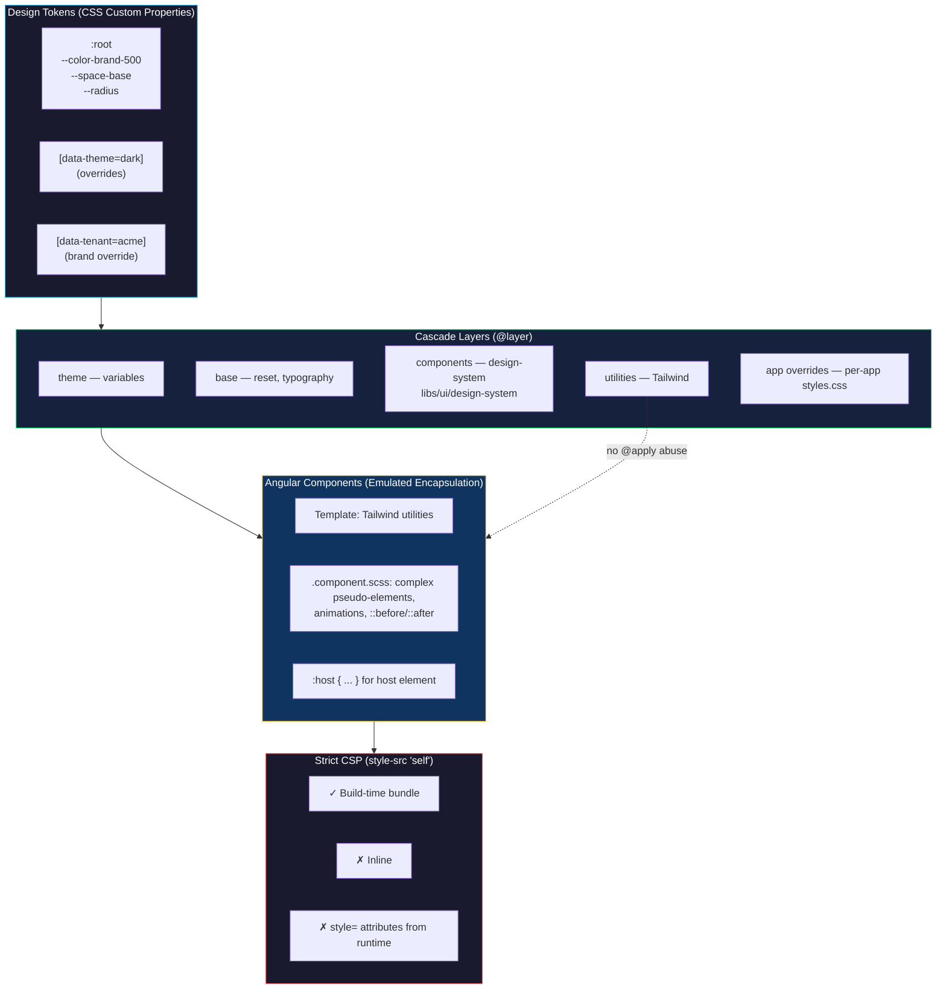

## Table of Contents

[🧠 **View Interactive Mindmap**](./css-styling-mindmap.md)

1. [TL;DR](#tldr)
2. [Deep Dive](#deep-dive)
   2.1 [Cascade & Specificity](#concept-group-1-cascade--specificity)
       2.1.1 [The Cascade — How Styles Are Resolved](#the-cascade--how-styles-are-resolved)
       2.1.2 [Specificity & `!important`](#specificity--important)
       2.1.3 [Cascade Layers (`@layer`)](#cascade-layers-layer)
       2.1.4 [Selectors & Modern Pseudo-Classes](#selectors--modern-pseudo-classes)
   2.2 [Box Model & Layout Engine](#concept-group-2-box-model--layout-engine)
       2.2.1 [The Box Model & `box-sizing`](#the-box-model--box-sizing)
       2.2.2 [Block Formatting Context (BFC)](#block-formatting-context-bfc)
       2.2.3 [Stacking Contexts & `z-index`](#stacking-contexts--z-index)
       2.2.4 [Containment (`contain`, `content-visibility`)](#containment-contain-content-visibility)
   2.3 [Layout Systems](#concept-group-3-layout-systems)
       2.3.1 [Flexbox — 1D Layout](#flexbox--1d-layout)
       2.3.2 [Grid — 2D Layout](#grid--2d-layout)
       2.3.3 [Positioning (`absolute`/`relative`/`sticky`/`fixed`)](#positioning-absoluterelativestickyfixed)
       2.3.4 [Logical Properties & Internationalization](#logical-properties--internationalization)
   2.4 [Sizing, Units & Responsive Design](#concept-group-4-sizing-units--responsive-design)
       2.4.1 [Units — `px`/`rem`/`em`/`%`/`vh`/`dvh`/`ch`/`fr`](#units--pxremempvhdvhchfr)
       2.4.2 [Fluid Sizing with `clamp()` and `min()`/`max()`](#fluid-sizing-with-clamp-and-minmax)
       2.4.3 [Container Queries vs Media Queries](#container-queries-vs-media-queries)
   2.5 [Modern CSS Features (2024–2026)](#concept-group-5-modern-css-features-20242026)
       2.5.1 [Custom Properties & Theming](#custom-properties--theming)
       2.5.2 [`:has()` — The Parent Selector](#has--the-parent-selector)
       2.5.3 [`color-mix()` and OKLCH Color Spaces](#color-mix-and-oklch-color-spaces)
       2.5.4 [Native CSS Nesting](#native-css-nesting)
       2.5.5 [View Transitions API](#view-transitions-api)
   2.6 [Tailwind CSS Deep Dive](#concept-group-6-tailwind-css-deep-dive)
       2.6.1 [Utility-First Philosophy](#utility-first-philosophy)
       2.6.2 [Tailwind v4 — CSS-First Config & OKLCH](#tailwind-v4--css-first-config--oklch)
       2.6.3 [Variants, Arbitrary Values & JIT](#variants-arbitrary-values--jit)
       2.6.4 [`@apply` — When (and When Not) to Use It](#apply--when-and-when-not-to-use-it)
       2.6.5 [Tailwind & Strict CSP](#tailwind--strict-csp)
   2.7 [Angular-Specific Styling](#concept-group-7-angular-specific-styling)
       2.7.1 [View Encapsulation Modes](#view-encapsulation-modes)
       2.7.2 [`:host`, `:host-context`, and the Death of `::ng-deep`](#host-host-context-and-the-death-of-ngdeep)
       2.7.3 [Component Styles + Global Styles + Tailwind](#component-styles--global-styles--tailwind)
   2.8 [CSS Architecture & Methodologies](#concept-group-8-css-architecture--methodologies)
       2.8.1 [BEM, OOCSS, SMACSS — The Era Before Utilities](#bem-oocss-smacss--the-era-before-utilities)
       2.8.2 [CSS Modules & Scoped Styles](#css-modules--scoped-styles)
       2.8.3 [CSS-in-JS — Styled-Components / Emotion](#css-in-js--styled-components--emotion)
       2.8.4 [Utility-First (Tailwind) — Why It Won](#utility-first-tailwind--why-it-won)
       2.8.5 [Design Systems & Tokens](#design-systems--tokens)
   2.9 [Performance](#concept-group-9-performance)
       2.9.1 [Critical CSS & Render-Blocking Reduction](#critical-css--render-blocking-reduction)
       2.9.2 [GPU-Accelerated Animations](#gpu-accelerated-animations)
       2.9.3 [Avoiding Layout Thrash](#avoiding-layout-thrash)
       2.9.4 [Specificity Wars & How to Avoid Them](#specificity-wars--how-to-avoid-them)
   2.10 [Accessibility & Inclusive Styling](#concept-group-10-accessibility--inclusive-styling)
       2.10.1 [Focus Indicators (Don't `outline: none`)](#focus-indicators-dont-outline-none)
       2.10.2 [`prefers-reduced-motion`, `prefers-color-scheme`](#prefers-reduced-motion-prefers-color-scheme)
       2.10.3 [Color Contrast & Touch Targets](#color-contrast--touch-targets)
3. [Architecture & Data Flow](#architecture--data-flow)
4. [Real-World Examples](#real-world-examples)
5. [Comparison Tables](#comparison-tables)
6. [Interview Q&A](#interview-qa)
   6.1 [L1: Junior](#l1-junior-knowledge)
   6.2 [L2: Mid-Level](#l2-mid-level-knowledge)
   6.3 [L3: Senior](#l3-senior-knowledge)
   6.4 [Staff: System Architecture](#staff-system-architecture)
7. [Cross-References](#cross-references)
8. [Further Reading](#further-reading)

---

## TL;DR

Modern CSS is no longer "the easy part" of frontend. Senior interviews probe <span style="color: #33b5e5; font-weight: bold;">the cascade</span>, <span style="color: #33b5e5; font-weight: bold;">specificity</span>, <span style="color: #33b5e5; font-weight: bold;">stacking contexts</span>, <span style="color: #33b5e5; font-weight: bold;">flexbox/grid</span>, <span style="color: #33b5e5; font-weight: bold;">container queries</span>, <span style="color: #33b5e5; font-weight: bold;">cascade layers (`@layer`)</span>, modern features (`:has()`, `color-mix()`, OKLCH, native nesting, View Transitions), and the architectural choice between <span style="color: #33b5e5; font-weight: bold;">utility-first (Tailwind)</span>, CSS Modules, CSS-in-JS, and component-scoped styles. In 2026, <span style="color: #00C851; font-weight: bold;">utility-first + design tokens via CSS custom properties</span> is the default for greenfield enterprise apps; `tai-portal` runs **Tailwind v4** with CSS-first config, OKLCH color tokens, native cascade layers, and Angular's emulated view encapsulation per component. The senior trade-off you must articulate: utility-first ships faster and survives strict CSP cleanly (compiled CSS from `'self'`), but team-discipline gaps mean some custom components (datatable, transfer-list, secure-input) still warrant scoped SCSS. Knowing the **why** behind specificity bugs, BFC, stacking contexts, and `:has()`/container queries separates seniors from intermediates.

---

## Deep Dive

### Concept Group 1: Cascade & Specificity

#### The Cascade — How Styles Are Resolved

##### What
The <span style="color: #33b5e5; font-weight: bold;">cascade</span> is the algorithm CSS uses to decide which declaration wins when multiple rules target the same property on the same element. Modern (2022+) cascade is a six-step waterfall:

1. **Origin & importance** — user-agent normal → user normal → author normal → author `!important` → user `!important` → user-agent `!important`
2. **Cascade layer** — `@layer` ordering within an origin (later layers win for normal, earlier layers win for `!important`)
3. **Specificity** — `(inline, id, class+pseudo+attr, element)` tuple, higher wins
4. **Order of appearance** — last declaration in source order wins ties

##### Why
Without understanding the cascade, every "why isn't my style applying?" debug becomes guesswork. The senior signal: knowing that `!important` is a layering escape hatch (not a hammer), that origin order means a user stylesheet can override your `!important`, and that cascade layers (`@layer`) are the modern way to manage specificity wars.

##### How
```css
/* Specificity tuples — read as (inline, id, class, element) */
#nav .item.active { color: red; }     /* (0, 1, 2, 0) — wins */
.nav .item.active { color: blue; }    /* (0, 0, 3, 0) */
.nav-item-active  { color: green; }   /* (0, 0, 1, 0) */

/* !important escapes specificity within its origin */
.muted { color: gray !important; }    /* beats anything non-important in same origin */

/* Cascade layers reorder — utilities can override components without !important */
@layer base, components, utilities;
@layer utilities { .text-red { color: red; } }
@layer components { .button { color: blue; } }
/* `.button.text-red` resolves to red — utilities layer is later */
```

##### When
Always check the cascade order before reaching for `!important`. Use `@layer` to express intent (base styles → components → utilities → overrides). Use specificity bumps only when the source order can't be controlled (e.g., third-party CSS).

##### Trade-offs
<span style="color: #ff4444; font-weight: bold;">`!important` chains are a code smell</span> — once you have one `!important`, you'll need another to override it, then another to override that. <span style="color: #ffbb33; font-weight: bold;">Specificity inflation</span> (`#nav-bar #nav-list .nav-item.active`) makes future overrides require even higher specificity. <span style="color: #00C851; font-weight: bold;">Cascade layers eliminate this entire class of bugs</span> by giving you explicit, hierarchical override control.

---

#### Specificity & `!important`

##### What
Specificity is a 4-tuple `(inline-style, id-count, class+pseudo-class+attribute-count, element+pseudo-element-count)`. Compared left-to-right; higher wins.

##### Why
Specificity determines which declaration applies when origin and layer are equal. Misunderstanding this is the #1 source of "but I just wrote a more specific rule and it's still not working" frustration.

##### How
| Selector | Specificity |
|---|---|
| `*` | (0, 0, 0, 0) |
| `div` | (0, 0, 0, 1) |
| `.btn` | (0, 0, 1, 0) |
| `#hero` | (0, 1, 0, 0) |
| `.btn.primary:hover` | (0, 0, 3, 0) |
| `nav > ul li.active` | (0, 0, 1, 3) |
| `style="color: red"` (inline) | (1, 0, 0, 0) |
| `:where(.btn)` | (0, 0, 0, 0) — `:where()` always counts as zero |
| `:is(.btn, #hero)` | uses **highest** of the args → (0, 1, 0, 0) |

`!important` adds an extra origin step; it does NOT affect the specificity calculation.

##### When
Bump specificity with `:is(.foo, .foo)` (a real trick — same selector twice in `:is()` doubles its specificity). Use `:where()` to author selectors that don't compete on specificity (great for design system base styles you want overridable).

##### Trade-offs
<span style="color: #ff4444; font-weight: bold;">Inline styles + Tailwind</span> can collide hard — inline styles win specificity but Tailwind utilities can use `!important` (the `!` modifier: `!text-red-500`) which beats inline. Don't fight it; pick one strategy per element.

---

#### Cascade Layers (`@layer`)

##### What
<span style="color: #33b5e5; font-weight: bold;">`@layer`</span> creates explicit, ordered groups of styles where layer order trumps specificity within the same origin. Introduced in 2022; Baseline 2024.

##### Why
Without layers, design system styles and feature styles compete on specificity, which encourages spec-bumping wars and `!important` usage. With layers, the design system can be authored at any specificity but the application layer always wins (or vice versa) by being declared later in the layer stack.

##### How
```css
/* Establish layer order ONCE at the top — later layers override earlier */
@layer reset, base, components, utilities;

@layer reset {
  *, *::before, *::after { box-sizing: border-box; margin: 0; }
}

@layer base {
  body { font-family: var(--font-sans); }
  a { color: var(--color-link); }
}

@layer components {
  /* Even with high specificity, `.button.primary` is overridden by ANY utility */
  .button.primary { background: var(--color-brand); padding: 0.5rem 1rem; }
}

@layer utilities {
  .bg-red-500 { background: oklch(63.7% 0.237 25.331); }
  /* This wins over .button.primary even though specificity is lower */
}

/* Unlayered styles win over ALL layered styles */
.override { color: red; }
```

This is how Tailwind v4 organizes itself: `@layer theme, base, components, utilities;` (visible in `apps/portal-web/src/styles.css`).

##### When
Use layers in any new project. They eliminate specificity-war debugging. Common stack: `reset, base, tokens, components, utilities, app-overrides`.

##### Trade-offs
<span style="color: #ffbb33; font-weight: bold;">Mental model shift</span> — devs who learned CSS pre-2022 think specificity is the cascade; layers add a step they may not check first. <span style="color: #ff4444; font-weight: bold;">`!important` inverts layer order</span> — `!important` rules in the *first* declared layer beat `!important` rules in later layers (counterintuitive, but documented in the spec). Avoid `!important` in layered code.

---

#### Selectors & Modern Pseudo-Classes

##### What
Selectors target elements. Modern CSS adds `:is()`, `:where()`, `:has()`, `:not()`, and structural pseudo-classes that reduce the need for class soup or JavaScript-driven styling.

##### How
```css
/* :is — group selectors, specificity = highest of args */
:is(h1, h2, h3) + p { margin-top: 0.5rem; }

/* :where — same as :is but ZERO specificity (great for design system defaults) */
:where(button, [role="button"]) { cursor: pointer; }

/* :has — parent selector based on descendants (Baseline 2023) */
.card:has(img) { padding: 0; }                      /* card with image children */
form:has(input:invalid) { border-color: red; }      /* form with any invalid input */
nav:has(> li.active) { background: var(--accent); } /* parent of an active item */

/* :not — exclude */
li:not(.disabled) { cursor: pointer; }

/* Modern structural */
.list > *:nth-child(odd) { background: #f0f0f0; }
.list > *:not(:last-child) { border-bottom: 1px solid; }

/* Attribute selectors for state */
input[type="email"][aria-invalid="true"] { border-color: red; }
[data-theme="dark"] { background: #111; }

/* Combinators */
.parent > .direct-child   /* direct child only */
.before + .next-sibling   /* immediately following sibling */
.before ~ .later-siblings /* any later sibling */
```

##### Why `:has()` Is a Big Deal
Before `:has()`, "style this parent based on its child's state" required JavaScript or extra classes. Now: `tr:has(input:checked) { background: var(--row-selected); }` — pure CSS row highlighting on checkbox state.

##### Trade-offs
<span style="color: #ffbb33; font-weight: bold;">`:has()` performance</span> can be expensive on huge DOMs because the engine must walk descendants. Modern engines optimize the common cases (e.g., `:has(.x)`), but `body:has(.deeply-nested-thing)` should be avoided in critical paths.

---

### Concept Group 2: Box Model & Layout Engine

#### The Box Model & `box-sizing`

##### What
Every CSS box has four concentric regions: **content** → **padding** → **border** → **margin**. `box-sizing` decides whether `width`/`height` measure the content area only (`content-box`, default) or the entire visible box including padding and border (`border-box`).

##### Why
With `content-box`, setting `width: 200px; padding: 1rem; border: 1px solid` means the visible element is `200 + 32 + 2 = 234px` wide — surprising and a frequent source of layout bugs. `border-box` makes `width: 200px` mean "the box on screen is 200px," which matches mental model and grid math.

##### How
```css
/* Universal box-sizing reset — first line in every modern CSS reset */
*, *::before, *::after {
  box-sizing: border-box;
}
```

##### When
Always. The 2026 default. Tailwind ships this in its preflight; modern CSS resets ship it.

##### Trade-offs
<span style="color: #ffbb33; font-weight: bold;">Margin is OUTSIDE the box</span> regardless of `box-sizing` — `width: 100%; margin: 0 1rem` will overflow the parent unless you also use `box-sizing: border-box` AND remove the margin or compensate with negative margin on the parent. This is why `gap` (flex/grid) replaces margin in modern layouts.

---

#### Block Formatting Context (BFC)

##### What
A <span style="color: #33b5e5; font-weight: bold;">Block Formatting Context</span> is a region of the page where block boxes are laid out independently — margins inside don't collapse out, floats inside are contained, and floats outside don't overlap.

##### Why
Three classic CSS bugs are BFC bugs:
1. **Margin collapsing** — vertical margins between sibling blocks collapse to the larger of the two; many devs find this surprising and want to "trap" the margin.
2. **Float containment** — a parent of floated children has `height: 0`; the floats overflow.
3. **Float overlap** — a non-floated sibling next to a float wraps text around the float; sometimes you want a clean column.

A new BFC fixes all three.

##### How — Triggering a BFC
| Trigger | When to Use |
|---|---|
| `display: flow-root` | <span style="color: #00C851;">Modern, semantic</span> — "I want a clean BFC, no side effects" |
| `display: flex` / `grid` | If you also want flex/grid layout |
| `overflow: hidden` / `auto` | Old trick; <span style="color: #ffbb33;">side effect: clips content, blocks scroll chaining</span> |
| `position: absolute` / `fixed` | Side effect: removes from flow |
| `contain: layout` | Modern; isolates layout completely |

```css
/* Modern: clear floats and trap margins with one declaration */
.card {
  display: flow-root;
}
```

##### When
Reach for `flow-root` when you have an unexpected margin escaping a parent or floats overflowing. In a flex/grid-first 2026 codebase, BFC bugs are rare — but interview questions still cover them.

##### Trade-offs
<span style="color: #ff4444; font-weight: bold;">Margin collapsing across BFCs is asymmetric</span> — between siblings inside the same BFC, margins collapse; between parent-and-first-child without padding/border between them, margins also collapse to the parent. This is the source of "why does my child's `margin-top: 2rem` push the parent down?"

---

#### Stacking Contexts & `z-index`

##### What
A <span style="color: #33b5e5; font-weight: bold;">stacking context</span> is a 3D layer where `z-index` values are compared. `z-index: 9999` on an element inside a stacking context with `z-index: 1` will NEVER appear above an element in a sibling stacking context with `z-index: 2`.

##### Why
The #2 most common "I don't understand `z-index`" bug: developer sets a huge `z-index`, it doesn't appear above another modal, they go to `z-index: 99999`, still doesn't work. The reason is always a stacking context boundary they didn't realize they crossed.

##### How — What Creates a Stacking Context
- `position: relative/absolute/fixed/sticky` + `z-index` (any value, even `0`)
- `opacity < 1`
- `transform` (any value other than `none`)
- `filter`, `backdrop-filter`, `mask`
- `isolation: isolate` ← the modern, intentional trigger
- `will-change: transform | opacity`
- `contain: layout/paint/strict`
- A flex/grid item with `z-index ≠ auto`

##### Modern Best Practice
```css
/* Establish an isolation boundary deliberately, no side effects */
.modal-container {
  isolation: isolate;   /* z-index inside resets to a new context */
}
```

```typescript
// Tailwind v4 has `isolate` utility — same effect
<div className="isolate fixed inset-0 z-50">{modalContent}</div>
```

##### Trade-offs
<span style="color: #ff4444; font-weight: bold;">Implicit stacking contexts are footguns</span> — adding `transform` to a card for a hover effect silently traps any popovers inside. <span style="color: #00C851;">Use `isolation: isolate` deliberately</span> for modals, dropdowns, tooltips so their `z-index` math is local.

##### Best Strategy for Large Design Systems (50+ Components)

**The Tier System (With Isolation)**

| Global Layer | z-index | Purpose |
|-------------|---------|---------|
| Base | 0 | Normal content |
| Sticky | 100 | Headers, banners |
| Overlay | 200 | Dropdowns, tooltips |
| Modal | 300 | Dialogs |
| Toast | 400 | Notifications |
| Max | 500 | Highest level |

**Where to Use `isolation: isolate`**

```css
/* Component-level isolation - use simple local z-index numbers */
.card { isolation: isolate; }
.dropdown { isolation: isolate; }
.tooltip { isolation: isolate; }
.modal { isolation: isolate; }
/* Inside each: z-index: 1, 2, 3 - no conflicts! */
```

**The Hybrid Approach**

| Global (No Isolation) | Component-Level (With Isolation) |
|----------------------|----------------------------------|
| App shell, nav, footer | Cards, Dropdowns, Tooltips |
| Modals, Dialogs | Accordions, Tabs |
| Toast notifications | Modals (if nested) |
| Fixed position elements | Any internal overlays |

**Practical Rules**

1. **Define 3-5 global z-index tiers** in your design system
2. **Add `isolation: isolate` to most components** — now each uses local z-index
3. **Inside isolated components, use simple numbers** (1, 2, 3) — no coordination needed

**Example Structure**

```css
/* Global application layers */
:root {
  --z-base: 0;
  --z-sticky: 100;
  --z-overlay: 200;    /* dropdowns, tooltips */
  --z-modal: 300;     /* modals, dialogs */
  --z-toast: 400;     /* notifications */
  --z-max: 500;
}

/* Component styles with isolation */
.card { isolation: isolate; }
.dropdown { isolation: isolate; }
.tooltip { isolation: isolate; }
```

```html
<!-- Usage -->
<nav class="z-sticky">...</nav>              <!-- global tier -->
<div class="dropdown z-overlay">...</div>    <!-- global tier -->
<div class="modal z-modal">                  <!-- global tier -->
  <div class="tooltip">...</div>             <!-- isolated, no conflict -->
</div>
```

**TL;DR:** Define 3-5 global tiers → add `isolation: isolate` to components → use simple numbers inside → no spreadsheet of 50 components needed.

---

#### Containment (`contain`, `content-visibility`)

##### What
The `contain` property tells the browser "this subtree is independent" — layout, paint, style, or size changes inside don't affect anything outside. `content-visibility: auto` lets the browser skip rendering off-screen content entirely.

##### Why
On large pages (long lists, dashboards with many widgets), every layout change can re-flow the entire page. `contain` lets the engine optimize: the rest of the page doesn't need to be checked.

##### How
```css
/* Each card is layout-isolated — changes inside don't trigger sibling reflow */
.card {
  contain: layout paint;
}

/* Defer rendering of off-screen items entirely (huge perf win) */
.audit-log-row {
  content-visibility: auto;
  contain-intrinsic-size: 0 60px;   /* placeholder height for scrollbar accuracy */
}
```

##### When
Long lists (audit logs, chat history, infinite scroll), dashboards with many independent widgets, anywhere you have hundreds of similar repeating items.

##### Trade-offs
<span style="color: #ffbb33; font-weight: bold;">`content-visibility: auto` requires `contain-intrinsic-size`</span> as a placeholder, otherwise scroll position jumps when items materialize. <span style="color: #ff4444; font-weight: bold;">Search-in-page (`Cmd+F`)</span> may not find content inside `content-visibility: hidden` regions on older browsers.

---

### Concept Group 3: Layout Systems

#### Flexbox — 1D Layout

##### What
<span style="color: #33b5e5; font-weight: bold;">Flexbox</span> lays out children along a single main axis with optional wrapping. The defining feature: items can grow, shrink, and align based on available space.

##### How — The Six You Use
```css
.container {
  display: flex;
  flex-direction: row | row-reverse | column | column-reverse;
  justify-content: flex-start | center | space-between | space-around | space-evenly;
  align-items: stretch | flex-start | center | flex-end | baseline;
  gap: 1rem;                   /* replaces margin between items */
  flex-wrap: nowrap | wrap;
}

.item {
  flex: 1 1 auto;              /* shorthand: grow shrink basis */
  flex: 1;                     /* equivalent to "1 1 0%" — equal columns */
  flex-grow: 1;                /* take remaining space */
  flex-shrink: 0;              /* don't shrink below basis */
  flex-basis: 200px;           /* preferred starting size */
  align-self: center;          /* override align-items per item */
}
```

##### When
- Navigation bars (logo + spacer + links + actions)
- Toolbars
- Form rows (label + input + helper)
- Card lists where items can wrap
- Centering one element (`display: flex; place-items: center;`)

##### Trade-offs
<span style="color: #ffbb33; font-weight: bold;">Flex is 1-D</span> — when items wrap to multiple lines, each line laid out independently; you can't align across lines easily. For 2-D control (rows AND columns), use Grid.

---

#### Grid — 2D Layout

##### What
<span style="color: #33b5e5; font-weight: bold;">CSS Grid</span> lays out children in a 2-D matrix of rows and columns. Tracks can be fixed, fractional (`fr`), or content-driven (`auto`, `min-content`, `max-content`, `minmax()`).

##### How — The Patterns You Use
```css
/* Holy grail: header / sidebar+main / footer */
.app-shell {
  display: grid;
  grid-template-columns: 240px 1fr;
  grid-template-rows: 60px 1fr 40px;
  grid-template-areas:
    "header  header"
    "sidebar main"
    "footer  footer";
  gap: 1rem;
  min-height: 100vh;
}
.app-shell > .header  { grid-area: header; }
.app-shell > .sidebar { grid-area: sidebar; }

/* Responsive cards — auto-fit + minmax (no media queries needed) */
.card-grid {
  display: grid;
  grid-template-columns: repeat(auto-fit, minmax(280px, 1fr));
  gap: 1rem;
}

/* Subgrid (Baseline 2023) — child grid inherits parent's tracks */
.parent { display: grid; grid-template-columns: 200px 1fr 100px; }
.child  { display: grid; grid-template-columns: subgrid; grid-column: 1 / -1; }
```

##### `auto-fit` vs `auto-fill`
- `auto-fit` collapses empty tracks (fewer items stretch to fill row)
- `auto-fill` keeps empty tracks (items stay at min size; row may have gaps)

##### When
- App shells (header/sidebar/main/footer)
- Card galleries with responsive wrapping
- Forms with aligned label columns
- Data tables (`display: grid` + `subgrid` for rows)
- Any 2-D layout

##### Trade-offs
<span style="color: #ffbb33; font-weight: bold;">Grid is more verbose than flex for 1-D layouts</span> — don't use Grid for a horizontal toolbar. The rule: 1-D → Flex; 2-D → Grid.

---

#### Positioning (`absolute`/`relative`/`sticky`/`fixed`)

##### What

| Value | Removed from flow? | Anchored to | Use For |
|---|---|---|---|
| `static` | no | normal flow | Default |
| `relative` | no | original position; offsets shift visual only | Anchor for absolute children; minor visual nudges |
| `absolute` | yes | nearest positioned ancestor | Tooltips, popovers, badges |
| `fixed` | yes | viewport (usually) | Sticky headers (legacy), modal backdrops |
| `sticky` | no | scroll container until threshold; then `fixed`-like | Sticky table headers, side nav |

##### How — `position: sticky` Gotchas
```css
/* Sticky requires a scroll-container ancestor with overflow != visible */
.app-shell { overflow-y: auto; }
.section-header {
  position: sticky;
  top: 0;
  background: white;   /* otherwise content scrolls THROUGH the header */
  z-index: 1;
}
```

Common bug: `position: sticky` does nothing. Cause: an ancestor has `overflow: hidden` or `overflow: auto` truncating the sticky region; or no `top`/`bottom` value; or the element is taller than its scroll container.

##### Trade-offs
<span style="color: #ff4444; font-weight: bold;">`position: fixed` inside a `transform`ed ancestor</span> anchors to the ancestor, not the viewport (because transforms create a containing block for fixed-position descendants). Symptom: "my modal is fixed but it's stuck inside this card."

---

#### Logical Properties & Internationalization

##### What
Logical properties replace physical directions (left/right/top/bottom) with flow-relative ones (inline-start/inline-end/block-start/block-end) so the same CSS works in LTR English and RTL Arabic without manual mirroring.

##### How
```css
/* Old physical */
.card { padding: 1rem; margin-left: 2rem; border-bottom: 1px solid; }

/* New logical — adapts to writing direction */
.card {
  padding: 1rem;
  margin-inline-start: 2rem;
  border-block-end: 1px solid;
}
```

| Physical | Logical |
|---|---|
| `margin-left` | `margin-inline-start` |
| `margin-right` | `margin-inline-end` |
| `padding-top` | `padding-block-start` |
| `border-bottom` | `border-block-end` |
| `width` | `inline-size` |
| `height` | `block-size` |
| `text-align: left` | `text-align: start` |

##### When
Any product that may localize. Tailwind v4 ships logical-property utilities (`ms-2` for `margin-inline-start: 0.5rem`, etc.) by default.

##### Trade-offs
<span style="color: #ffbb33;">Older browsers</span> (pre-2021) need fallbacks. In 2026, just use logical — Baseline-wide.

---

### Concept Group 4: Sizing, Units & Responsive Design

#### Units — `px`/`rem`/`em`/`%`/`vh`/`dvh`/`ch`/`fr`

##### What
| Unit | Resolves To | Use For |
|---|---|---|
| `px` | absolute pixel | Borders, fine details where rem rounds awkwardly |
| `rem` | root font-size × value | <span style="color: #00C851;">Default for spacing, sizing, font-size</span> — respects user font preferences |
| `em` | parent font-size × value | Component-relative sizing (inside that component) |
| `%` | parent dimension × value / 100 | Width based on parent |
| `vw` / `vh` | viewport width/height × value / 100 | Hero sections, full-screen layouts |
| `dvw` / `dvh` | dynamic viewport (excluding mobile UI bars) | <span style="color: #00C851;">Use instead of vh on mobile</span> |
| `svh` / `lvh` | small / large viewport height | Animation between bar-shown and bar-hidden states |
| `ch` | "0" character width | Optimal line length (`max-width: 65ch`) |
| `fr` | grid-only fractional unit | Grid columns/rows |

##### Why `rem` Wins
A user with vision impairment can set their browser's default font size to 24px. `rem` scales everything (spacing, typography, components) proportionally. `px` doesn't — your "perfectly designed" 16px base text stays 16px, breaking accessibility.

##### Why `dvh` Wins on Mobile
On mobile Safari, `100vh` is the viewport with the URL bar HIDDEN — when the bar is showing, your "full-height" hero overflows by 60px. `100dvh` is dynamic — it follows the visible area.

##### Trade-offs
<span style="color: #ffbb33; font-weight: bold;">Mixing `rem` and `px`</span> in spacing leads to inconsistent rhythm. Pick one (rem) and stick with it.

---

#### Fluid Sizing with `clamp()` and `min()`/`max()`

##### What
`clamp(min, preferred, max)` returns the preferred value clamped between min and max. Eliminates dozens of media queries for typography.

##### How
```css
/* Fluid heading: 1.5rem on phone, scales to 3rem on desktop, smoothly */
h1 {
  font-size: clamp(1.5rem, 1rem + 2.5vw, 3rem);
}

/* Fluid container with width sanity */
.container {
  width: min(100% - 2rem, 64rem);   /* full width minus gutters, capped at 64rem */
  margin-inline: auto;
}

/* Touch target safety */
button {
  min-height: max(2.75rem, 44px);   /* WCAG 44×44 minimum */
}
```

##### When
Always for typography in a responsive design. Always for max-width containers.

##### Trade-offs
<span style="color: #ffbb33;">Old browsers</span> (pre-2020) don't support these — Baseline-wide today, but check support if you have legacy users.

---

#### Container Queries vs Media Queries

##### What
- **Media query** — react to the **viewport** size
- **Container query** — react to the **parent container** size

##### Why
A component used in a sidebar (300px wide) and in a main column (900px wide) wants to render differently — but media queries only know the viewport. Container queries solve "responsive components, regardless of where they live."

##### How
```css
/* 1. Mark the container */
.card-wrapper {
  container-type: inline-size;
  container-name: card;
}

/* 2. Style based on container size */
@container card (min-width: 400px) {
  .card { display: grid; grid-template-columns: 200px 1fr; }
}

@container card (max-width: 399px) {
  .card { display: block; }
}
```

##### Tailwind v4
```html
<div class="@container">
  <div class="@md:grid @md:grid-cols-2">...</div>
</div>
```

##### When
Reusable components in unknown layout contexts (datatable, card, sidebar nav). The component decides its layout based on its slot, not the viewport.

##### Trade-offs
<span style="color: #ffbb33;">Slight perf cost</span> — establishing containment for every container; Baseline 2023 so safe. <span style="color: #ff4444;">No `container-name` cascading</span> — the matching is shallowest-ancestor-with-name; surprise if you have nested containers.

---

### Concept Group 5: Modern CSS Features (2024–2026)

#### Custom Properties & Theming

##### What
<span style="color: #33b5e5; font-weight: bold;">CSS custom properties</span> (`--name`) are runtime variables — unlike Sass `$vars` which are compile-time. They cascade, inherit, can be changed per scope (theme), and can be read by JS.

##### How — The 2026 Theming Pattern
```css
/* Design tokens at :root */
:root {
  --color-brand: oklch(60% 0.18 250);
  --color-brand-fg: white;
  --color-bg: white;
  --color-fg: #111;
  --space-1: 0.25rem;
  --space-2: 0.5rem;
  --radius: 0.5rem;
  --font-sans: ui-sans-serif, system-ui, sans-serif;
}

/* Dark mode — override per scope */
[data-theme="dark"] {
  --color-bg: #0a0a0a;
  --color-fg: #f5f5f5;
}

/* Multi-tenant — override per tenant data attribute */
[data-tenant="acme"] {
  --color-brand: oklch(55% 0.18 30);   /* acme orange */
}

/* Components consume — never reference hex codes directly */
.button {
  background: var(--color-brand);
  color: var(--color-brand-fg);
  padding: var(--space-2) calc(var(--space-2) * 2);
  border-radius: var(--radius);
}
```

##### Read From JS
```typescript
// Read at runtime
const brand = getComputedStyle(document.documentElement)
  .getPropertyValue('--color-brand');

// Set at runtime
document.documentElement.style.setProperty('--color-brand', 'oklch(50% 0.2 0)');
```

##### When
The default theming primitive in 2026. Dark mode, multi-tenant white-labeling, dynamic theming, design tokens.

##### Trade-offs
<span style="color: #ffbb33;">Slight perf cost</span> per custom-property lookup vs static value (negligible in practice). <span style="color: #ff4444;">Custom properties don't work in `@media` queries</span> as conditions — `@media (max-width: var(--breakpoint))` is invalid.

---

#### `:has()` — The Parent Selector

##### What
The first practical "parent selector" in CSS history. Match an element based on what it contains.

##### How
```css
/* Highlight rows with checked checkboxes — pure CSS, no JS class toggling */
tr:has(input[type="checkbox"]:checked) {
  background: var(--color-row-selected);
}

/* Form-level state */
form:has(input:invalid) { border-color: red; }
form:has(:focus-within) { box-shadow: 0 0 0 3px var(--color-focus); }

/* Layout adapts to children present */
.card:has(img) { padding: 0; }
.layout:has(> .sidebar) { grid-template-columns: 240px 1fr; }
.layout:not(:has(> .sidebar)) { grid-template-columns: 1fr; }

/* Empty-state styling */
.list:not(:has(.list-item)) { display: none; }
```

##### Why
Removes a huge class of "we toggle a class with JS to style the parent" patterns. The CSS becomes the source of truth; the JS doesn't need to manage UI state.

##### Trade-offs
<span style="color: #ffbb33;">Engine cost</span> — `:has()` requires walking descendants. Modern engines optimize common cases; deeply nested patterns can still be slow on huge trees. Baseline 2023.

---

#### `color-mix()` and OKLCH Color Spaces

##### What
- `color-mix(in oklch, blue 60%, red)` — mix two colors in a chosen color space
- `oklch(63.7% 0.237 25.331)` — perceptually uniform color (lightness, chroma, hue)

##### Why OKLCH Wins
- **Perceptual uniformity** — equal lightness numbers produce equally bright colors (RGB does not)
- **Predictable hue rotation** — changing only `h` doesn't change apparent lightness
- **Wider gamut** — supports modern displays beyond sRGB
- **Easy programmatic manipulation** — generate scales by walking lightness

```css
/* Generate a color scale by walking lightness */
:root {
  --brand-300: oklch(80% 0.15 250);
  --brand-500: oklch(60% 0.18 250);
  --brand-700: oklch(40% 0.18 250);
  --brand-900: oklch(20% 0.15 250);
}

/* Hover state — darken by mixing with black, perceptually correct */
.button:hover {
  background: color-mix(in oklch, var(--color-brand) 85%, black);
}
```

Tailwind v4 ships its color palette in OKLCH (visible in `apps/portal-web/src/styles.css`).

##### Trade-offs
<span style="color: #ffbb33;">Designer tooling lag</span> — Figma, Sketch were RGB-first; OKLCH support is recent. <span style="color: #ff4444;">Display gamut</span> — wide-gamut OKLCH colors clamp on sRGB monitors; pick within sRGB if you need pixel-identical cross-display rendering.

---

#### Native CSS Nesting

##### What
Native CSS now supports nesting (Baseline 2023). No more SCSS just for nesting.

##### How
```css
.card {
  padding: 1rem;
  background: white;

  & > .header {           /* & is required at the start in nested selectors */
    font-weight: 600;
    margin-block-end: 0.5rem;
  }

  &:hover { background: #f9f9f9; }

  & .button { background: var(--color-brand); }

  @media (max-width: 768px) {
    padding: 0.5rem;
  }
}
```

##### Trade-offs
<span style="color: #ffbb33;">Specificity gotcha</span> — nested rules use `&` to compute specificity from the parent; deep nesting can balloon specificity unintentionally. Keep nesting 2 levels max.

---

#### View Transitions API

##### What
A browser-native API for animating between two DOM states (page navigation, route change, list reorder) with one declarative call.

##### How
```typescript
// Single-page app: trigger a view transition during route change
async function navigate(url: string) {
  if (!document.startViewTransition) return location.assign(url);
  document.startViewTransition(() => updateDOM(url));
}
```

```css
/* Tag elements that should be morphed across the transition */
.detail-image { view-transition-name: hero-image; }
::view-transition-old(hero-image),
::view-transition-new(hero-image) {
  animation-duration: 300ms;
}
```

##### When
Cross-route morphs (list → detail), state changes that benefit from smooth motion (filter applied, item removed), polishing micro-interactions.

##### Trade-offs
<span style="color: #ffbb33;">Browser support</span> — Chrome stable, Firefox/Safari catching up. Always feature-detect with `if (document.startViewTransition)`. Wrap in `prefers-reduced-motion` check.

---

### Concept Group 6: Tailwind CSS Deep Dive

#### Utility-First Philosophy

##### What
Tailwind ships ~thousands of single-purpose utility classes (`p-4`, `text-red-500`, `flex`, `gap-2`). Components are composed inline in HTML using these utilities, instead of bespoke class names with bespoke CSS.

##### Why
- **No naming overhead** — `.user-profile-card-with-actions` vs `flex gap-2 p-4 rounded bg-white shadow`
- **No specificity wars** — utilities live in one cascade layer, all equal
- **No dead CSS** — JIT generates only the classes you actually use
- **Refactoring locality** — change the look in the template, not in a separate `.css` file
- **Design tokens enforced** — you can't write a one-off `padding: 17px` accidentally

##### How (Tailwind v4)
```html
<!-- Composition in the template -->
<button class="bg-blue-500 hover:bg-blue-700 text-white font-semibold py-2 px-4 rounded">
  Sign in
</button>
```

##### Trade-offs
<span style="color: #ff4444;">"Class soup" complaint</span> — long class lists feel ugly to some developers. Reality: it's no longer than the equivalent CSS, just colocated. <span style="color: #ffbb33;">Initial learning curve</span> — `mt-4` instead of `margin-top: 1rem` feels foreign for a week. <span style="color: #ff4444;">Inline state management</span> — for complex stateful components, you still need component logic; utilities don't replace JS.

---

#### Variants, Arbitrary Values & JIT

##### What Are Variants?
Variants are prefixes that scope a utility to a specific state or condition: `hover:`, `focus:`, `dark:`, `md:`, `aria-disabled:`, `data-[state=open]:`, `peer-checked:`, `group-hover:`, `motion-reduce:`.

##### How Variants Work
```html
<!-- Stack of variants — all apply together (AND logic) -->
<button class="
  bg-blue-500 hover:bg-blue-700 focus:ring-2 focus:ring-blue-300
  disabled:opacity-50 disabled:cursor-not-allowed
  md:px-6 lg:px-8
  dark:bg-blue-600 dark:hover:bg-blue-800
  motion-reduce:transition-none
">
  Submit
</button>
```

| Variant | Meaning | Example |
|---------|---------|---------|
| `hover:` | Mouse over | `hover:bg-blue-700` |
| `focus:` | Has focus | `focus:ring-2` |
| `dark:` | Dark mode | `dark:bg-gray-800` |
| `md:` | Media query (breakpoint) | `md:px-6` |
| `aria-disabled:` | ARIA attribute | `aria-disabled:opacity-50` |
| `data-[state=open]:` | Data attribute | `data-[state=open]:block` |
| `peer-checked:` | Sibling checked | `peer-checked:bg-blue-500` |
| `group-hover:` | Parent hovered | `group-hover:text-blue-500` |
| `motion-reduce:` | Prefers-reduced-motion | `motion-reduce:transition-none` |

##### Arbitrary Values
Square brackets pass through raw CSS — for one-off values not in Tailwind's default scale:
```css
/* Arbitrary values for one-off needs */
<div class="grid-cols-[repeat(auto-fit,minmax(280px,1fr))]">...</div>
<div class="bg-[oklch(60%_0.18_30)]">...</div>
<div class="top-[calc(100%+8px)]">...</div>
<div class="w-[300px]">...</div>
```

##### group / peer — Parent & Sibling State
```html
<!-- group — style children based on parent's state -->
<details class="group">
  <summary>Toggle</summary>
  <div class="hidden group-open:block">Content</div>
</details>

<!-- peer — style sibling based on input state -->
<input id="email" class="peer" />
<label for="email" class="peer-focus:text-blue-500">Email</label>
```

| Peer State | Trigger |
|------------|---------|
| `peer-hover` | Any sibling has `:hover` |
| `peer-focus` | Any sibling has `:focus` |
| `peer-active` | Any sibling has `:active` |
| `peer-invalid` | Any sibling has `:invalid` |
| `peer-checked` | Any sibling is `:checked` |
| `peer-focus-within` | Any sibling or child has focus |
| `peer-placeholder-shown` | Sibling has placeholder visible |

##### JIT — Just-In-Time

| Old (Generation) | JIT (On-Demand) |
|-------------------|-----------------|
| Generate all ~3MB of Tailwind | Generate ONLY what's used |
| Then remove unused | ~0KB base, ~10KB output |
| Can't handle arbitrary values | Arbitrary values work! |
| Slow rebuilds | Fast rebuilds |

**How JIT works:**
```
Source files → Scan for classes → Generate ONLY what's used → Final CSS
```

**The Constraint:**
```javascript
// ❌ DOESN'T work - variable class name (JIT never sees it!)
const color = 'blue';
<div class={`text-${color}-500`}>Hello</div>

// ✅ WORKS - literal class name in source
const colorMap = { blue: 'text-blue-500', red: 'text-red-500' };
<div class={colorMap[color]}>Hello</div>
// JIT sees "text-blue-500" as literal!
```

##### Flexbox vs Grid — When to Use Each

**Flexbox** — 1-D layout (single row OR single column with wrapping)

| Use For | Example |
|---------|---------|
| Toolbar | `<nav class="flex gap-2">...</nav>` |
| Nav bar | `<ul class="flex items-center">...</ul>` |
| Form row | `<div class="flex gap-4">...</div>` |
| Centered modal | `<div class="flex justify-center items-center">...</div>` |
| Card with footer | Stack (column), footer at bottom (flex-grow + auto) |

**Grid** — 2-D layout (rows AND columns coordinated)

| Use For | Example |
|---------|---------|
| App shell | `<main class="grid grid-cols-[250px_1fr]">...</main>` |
| Card gallery | `<div class="grid grid-cols-3 gap-4">...</div>` |
| Data table | `<table class="grid ...">` |
| Dashboard | `<div class="grid grid-cols-[sidebar_main]">...</div>` |

**The Tell:**
- Finding yourself nesting `flex` inside `flex` inside `flex` to achieve a layout? → You wanted **Grid**
- Using Grid for a simple horizontal toolbar? → You wanted **Flex**

**Responsive Card Gallery Without Media Queries:**
```css
grid-template-columns: repeat(auto-fit, minmax(280px, 1fr))
```
This is the canonical responsive card pattern — `auto-fit` creates as many columns as fit, `minmax(280px, 1fr)` ensures cards are at least 280px but can grow to fill space.

---

#### Tailwind v4 — CSS-First Config & OKLCH

##### What
Tailwind v4 (released 2024–2025) is a major rewrite. The big changes:

| v3 | v4 |
|---|---|
| `tailwind.config.js` (JS) | `@theme` block in CSS |
| RGB colors | OKLCH colors |
| Lightning CSS optional | Built on Lightning CSS (Rust) |
| `@layer` plugin | Native `@layer` |
| ~5–8s typical build | <100ms incremental |

##### How (v4 CSS-first config)
```css
/* No tailwind.config.js needed — config IS the CSS */
@import "tailwindcss";

@theme {
  --color-brand-500: oklch(60% 0.18 250);
  --color-brand-700: oklch(40% 0.18 250);
  --font-sans: "Inter", ui-sans-serif, system-ui;
  --breakpoint-3xl: 1920px;
}
```

This generates `bg-brand-500`, `text-brand-700`, `font-sans`, `3xl:` variants automatically.

##### `tai-portal` Stack
- Tailwind v4.2.2 (visible in `apps/portal-web/src/styles.css`)
- OKLCH color tokens
- Native `@layer theme, base, components, utilities;`
- No legacy `tailwind.config.js`

##### Trade-offs
<span style="color: #ffbb33;">v3 → v4 migration</span> — config moves from JS to CSS, plugin ecosystem catching up, some v3 plugins won't work. <span style="color: #ff4444;">Documentation drift</span> — v3 examples online are everywhere; double-check the v4 docs.

---

#### `@apply` — When (and When Not) to Use It

##### What
`@apply` lets you compose Tailwind utilities into a regular CSS class.

##### When to Use
1. **Third-party component overrides** — when you can't change HTML (some library), but you can write CSS
2. **Form-input base styles** — once, in a global stylesheet
3. **Print styles** — utilities don't apply to print

```css
/* OK: third-party component override */
.tox-tinymce {
  @apply rounded border border-gray-300;
}
```

##### When NOT to Use
1. **In components you control** — defeats the entire utility-first model
2. **For abstraction**: `.btn { @apply bg-blue-500 ...; }` — now you've reinvented OOCSS with extra steps

##### Tailwind Author's Stance
> "If you're using @apply, you're probably misusing Tailwind."

The temptation is real (long class lists feel verbose), but `@apply` reintroduces the naming and specificity problems Tailwind solves. For Angular components, prefer the template+utility approach; reach for `@apply` only at boundaries.

---

#### Tailwind & Strict CSP

##### What
A strict Content Security Policy of `style-src 'self'` blocks inline styles and `<style>` tags without a nonce. This is the SWBC fintech-grade requirement.

##### Why Tailwind Is Naturally CSP-Friendly
- All utilities compile to a **build-time CSS file** served from `'self'`
- No runtime style injection (no CSS-in-JS, no theme switching via inline style)
- No `<style>` tags injected into the DOM at runtime
- Class-based styling — `style=` attributes aren't generated by Tailwind

##### Why Angular Material (and many CSS-in-JS libs) Struggle
- Angular Material's CDK Overlay injects positioning styles inline (`style="top: 10px; left: 20px;"`)
- The Material theme system uses Sass-compiled colors but the runtime ripple effect uses dynamic `<style>` tags
- Without a CSP nonce, all this is blocked → broken UI

##### How `tai-portal` Approaches It
- **Tailwind v4** for utilities and design tokens (CSP-clean)
- **Custom components** in `libs/ui/design-system/` (secure-input, datatable, transfer-list) instead of Material — full control over inline-style usage
- **Component-scoped SCSS with emulated encapsulation** — Angular's emulated mode adds attribute selectors (`[_ngcontent-c1]`), all styles compile to the bundled CSS

##### Trade-offs
<span style="color: #ffbb33;">Strict CSP precludes some Tailwind features</span> — the v4 dynamic theme switcher uses CSS custom properties (CSP-fine), but if you wanted to inject runtime styles via JS for a theme switcher, you'd need a nonce. CSS custom properties on `:root` (set via class swap, not inline style) keep you CSP-clean.

---

### Concept Group 7: Angular-Specific Styling

#### View Encapsulation Modes

##### What
Angular components have three encapsulation modes:

| Mode | Behavior | When to Use |
|---|---|---|
| `Emulated` (default) | Adds attribute selectors (`[_ngcontent-c0]`) to scope styles | <span style="color: #00C851;">Default — works everywhere</span> |
| `ShadowDom` | Real Shadow DOM, full encapsulation | Web Components, true isolation |
| `None` | Styles leak to global scope | Legacy migrations only |

##### How
```typescript
@Component({
  selector: 'app-user-card',
  templateUrl: './user-card.component.html',
  styleUrl: './user-card.component.scss',
  encapsulation: ViewEncapsulation.Emulated,   // default; can omit
})
```

##### Why Emulated Wins
- Works in every browser including older ones
- Plays nice with global tools (Tailwind, design system base styles, dev tools)
- Fast — just attribute selectors
- Predictable specificity

##### Trade-offs
<span style="color: #ff4444;">`Emulated` doesn't fully isolate</span> — global styles still apply. The attribute prefix can be defeated by a more specific selector. For true isolation, use `ShadowDom`.

---

#### `:host`, `:host-context`, and the Death of `::ng-deep`

##### `:host` — Style the Component's Own Element
```scss
:host {
  display: block;
  padding: 1rem;
}

:host(.featured) {        /* when host has .featured class */
  border: 2px solid var(--color-brand);
}
```

##### `:host-context` — Style Based on an Ancestor
```scss
:host-context(.dark-theme) {  /* anywhere up the tree, .dark-theme exists */
  background: #111;
}
```

##### `::ng-deep` — DEPRECATED (and What to Use Instead)
`::ng-deep` pierced encapsulation to style child components. It's been deprecated since Angular 9.

**Replacement strategies:**
1. **CSS custom properties** — child components read tokens; parent overrides them
   ```scss
   :host {
     --child-bg: white;
   }
   :host(.dark) {
     --child-bg: #111;
   }
   /* Inside child: background: var(--child-bg, white); */
   ```
2. **Pass styling intent as `@Input()`** — `<child-component variant="dark">`
3. **`encapsulation: ViewEncapsulation.None` for the page-level style file**
4. **Global stylesheet** with documented override classes

##### Trade-offs
<span style="color: #ff4444;">`::ng-deep` still works in 2026</span> but generates lint warnings; new code should not use it. Existing codebases still use it for legacy reasons; migration is non-trivial.

---

#### Component Styles + Global Styles + Tailwind

##### What
The `tai-portal` styling stack has three layers:

1. **Global** — `apps/portal-web/src/styles.css` — Tailwind import, design tokens, base resets
2. **Component-scoped SCSS** — per-component `.component.scss` for complex components (datatable, transfer-list, secure-input)
3. **Tailwind utilities** — composed inline in component templates

##### Layering Pattern
```scss
/* Component SCSS for layout-heavy or pseudo-element-heavy patterns */
:host {
  display: grid;
  grid-template-columns: 1fr auto;
}

::ng-deep .legacy-thing { /* avoid; here only for migration */ }

.complex-pattern::before { /* utilities can't easily target ::before */
  content: '';
  position: absolute;
  /* ... */
}
```

```html
<!-- Template uses Tailwind for spacing, color, layout shorthand -->
<div class="flex items-center gap-4 p-4 rounded bg-white">
  <span class="text-sm font-medium text-gray-700">{{ label }}</span>
</div>
```

##### When to Reach for SCSS Over Utilities
- Complex `::before`/`::after` (utilities can but get verbose)
- Animations with multiple keyframes
- Specific selector requirements (`tr:nth-child(odd):has(.row-selected)`)
- Print styles (utilities don't apply to print)
- Component-internal complex layouts that don't compose well

##### Trade-offs
<span style="color: #ffbb33;">Two style sources of truth</span> — utilities in template, SCSS in `.scss` file. Discipline required to avoid duplication ("padding here AND padding there").

---

### Concept Group 8: CSS Architecture & Methodologies

#### BEM, OOCSS, SMACSS — The Era Before Utilities

##### What
Pre-2020, the dominant CSS architectures:

- **BEM (Block-Element-Modifier)** — naming convention: `.card`, `.card__title`, `.card--featured`
- **OOCSS (Object-Oriented CSS)** — separate structure from skin: `.media-object` + `.theme-primary`
- **SMACSS (Scalable & Modular)** — categorize rules into base/layout/module/state/theme

##### Why It Matters in Interviews
Senior interviewers ask about these because the **problems they solved** still exist — naming consistency, override predictability, refactor safety. Utilities replace BEM in new projects, but maintaining BEM codebases is a 2026 reality.

##### Trade-offs
<span style="color: #ff4444;">BEM in 2026</span> — verbose, no enforcement, devs invent variants. Tailwind utilities solve the same problems with less ceremony.

---

#### CSS Modules & Scoped Styles

##### What
CSS Modules compile class names to unique hashes (`.button` → `.button_a3f7c`) at build time, scoping them per file.

##### How
```typescript
// React example (Angular has analogous behavior with emulated encapsulation)
import styles from './Button.module.css';
<button className={styles.primary}>Click</button>
```

##### When
React/Vue/Solid projects without a utility framework. Vue's `<style scoped>` is conceptually similar. Angular's `Emulated` encapsulation is the same idea.

##### Trade-offs
<span style="color: #ffbb33;">No global utility classes</span> mean repeating spacing/typography rules per component. Common pairing: CSS Modules + Tailwind utilities for layout/spacing.

---

#### CSS-in-JS — Styled-Components / Emotion

##### What
Define styles in JS, generate CSS at runtime (or compile-time with newer libs).

```typescript
const Button = styled.button`
  background: ${props => props.primary ? 'blue' : 'gray'};
  padding: 0.5rem 1rem;
`;
```

##### Trade-offs
<span style="color: #ff4444;">Runtime CSS-in-JS is dying</span> — runtime overhead, server-side rendering complexity, strict CSP friction (injects `<style>` tags, requires nonces). <span style="color: #00C851;">Compile-time CSS-in-JS</span> (Vanilla Extract, Linaria, Pigment) is the surviving path. <span style="color: #ff4444;">styled-components is in maintenance mode</span> as of 2024.

##### When (2026 Verdict)
For React, prefer Tailwind or CSS Modules. CSS-in-JS only if your team already invested deeply in it.

---

#### Utility-First (Tailwind) — Why It Won

##### What
Three forces converged 2020–2024:
1. **JIT compilation** — solved the "20MB CSS file" problem
2. **Design tokens via CSS custom properties** — utilities compose to your design system
3. **Component frameworks (React/Angular/Vue)** — naming components in the template; utilities live there too

##### Why It Beat the Alternatives
- BEM's naming overhead → gone (no naming)
- Specificity wars → gone (single layer)
- Dead CSS → gone (JIT)
- CSS-in-JS runtime cost → gone (build-time CSS)
- Design system enforcement → gained (utilities ARE your tokens)

##### Trade-offs
<span style="color: #ff4444;">"Class soup" aesthetic</span> — long lines in HTML feel ugly. Counter: it's the same complexity, just colocated. <span style="color: #ffbb33;">New-developer ramp</span> — learning the utility vocabulary takes a week.

---

#### Design Systems & Tokens

##### What
A **design system** is the codified language of your product's visual identity. **Design tokens** are the atomic values (colors, spacing, typography, radii, motion) that everything else composes from.

##### How — The Token Hierarchy
```css
/* Tier 1 — Primitive tokens (raw values) */
:root {
  --color-blue-500: oklch(60% 0.18 250);
  --color-gray-900: oklch(20% 0 0);
  --space-base: 0.25rem;
}

/* Tier 2 — Semantic tokens (referenced from primitive) */
:root {
  --color-action-primary: var(--color-blue-500);
  --color-text-emphasis: var(--color-gray-900);
  --space-component-md: calc(var(--space-base) * 4);
}

/* Tier 3 — Component tokens (referenced from semantic) */
:root {
  --button-bg: var(--color-action-primary);
  --button-padding-y: var(--space-component-md);
}
```

##### Why Three Tiers
Renaming `--color-blue-500` to `--color-purple-500` doesn't break component-tier consumers if everyone references through semantic tokens. Tier separation makes brand refreshes a one-line change.

##### Tooling
- **Style Dictionary** (Amazon) — generate tokens for CSS, iOS, Android from one source
- **Tokens Studio** (Figma plugin) — design-tool-native token authoring
- **Tailwind v4 `@theme`** — tokens AS Tailwind config

##### Trade-offs
<span style="color: #ffbb33;">Three-tier discipline</span> requires team buy-in; new devs reach for primitive tokens directly, breaking the abstraction.

---

### Concept Group 9: Performance

#### Critical CSS & Render-Blocking Reduction

##### What
CSS is render-blocking — the browser won't paint until all `<link rel="stylesheet">` files load. **Critical CSS** is the technique of inlining the above-the-fold styles in `<head>` and lazy-loading the rest.

##### How
```html
<head>
  <style>/* Inlined critical CSS — above-the-fold styles only */</style>
  <link rel="preload" href="/main.css" as="style" onload="this.rel='stylesheet'">
</head>
```

Tools: `critters` (Angular built-in option), `critical` (npm), Next.js does it automatically.

##### Trade-offs
<span style="color: #ffbb33;">Critical CSS extraction is brittle</span> — different routes, different above-the-fold content. Tradeoff is build-time complexity vs first-paint speed.

---

#### GPU-Accelerated Animations

##### What
Browsers can animate `transform` and `opacity` on the GPU compositor without re-running layout or paint. Animating other properties (`width`, `top`, `left`, `margin`) triggers full re-layout per frame.

##### Rule
```css
/* GOOD — GPU-only */
.item {
  transform: translateX(0);
  transition: transform 200ms ease;
}
.item:hover { transform: translateX(8px); }

/* BAD — layout per frame */
.item {
  left: 0;
  transition: left 200ms ease;
}
.item:hover { left: 8px; }
```

##### `will-change`
Hint to the browser: "I'm about to animate `transform`; promote me to a layer." Use sparingly; promoting too many elements blows GPU memory.

```css
.modal { will-change: transform, opacity; }
```

##### Trade-offs
<span style="color: #ff4444;">`will-change` overuse</span> creates a layer per element, exhausting GPU memory; symptoms: scroll jank, low frame rates. Add `will-change` only just before animation, remove after.

---

#### Avoiding Layout Thrash

##### What
**Layout thrash** is the pattern of read-write-read-write on layout properties in a tight loop, forcing the browser to re-compute layout multiple times per frame.

##### How — The Bug
```typescript
// BAD — forces N synchronous re-layouts
items.forEach(item => {
  const top = item.offsetTop;        // read (forces layout if pending writes)
  item.style.top = `${top + 10}px`;  // write (invalidates layout)
});
```

##### Fix
```typescript
// GOOD — batch reads, then batch writes
const tops = items.map(item => item.offsetTop);
items.forEach((item, i) => item.style.top = `${tops[i] + 10}px`);

// BETTER — use requestAnimationFrame for animations
requestAnimationFrame(() => { /* writes */ });
```

##### Tools
Chrome DevTools → Performance → look for "Layout" entries in tight loops. Lighthouse reports "avoid forced reflows."

---

#### Specificity Wars & How to Avoid Them

##### Symptoms
- A CSS file with multiple `!important` declarations
- Selectors like `body.app .container > .card.special#unique` to win specificity
- "Why isn't my style applying?" debug sessions

##### Causes
- Lack of architecture — global styles fighting component styles
- Third-party CSS injected at high specificity
- Sass `@extend` blowing up generated specificity

##### Cures
1. **Cascade layers** (`@layer`) — explicit hierarchy beats specificity
2. **Utility-first** — single low-specificity layer, all utilities equal
3. **`:where(.selector)` for design system base styles** — zero specificity, easy to override
4. **`isolation: isolate`** for stacking contexts
5. **Strict naming** (BEM if you must) — flat specificity by convention

---

### Concept Group 10: Accessibility & Inclusive Styling

#### Focus Indicators (Don't `outline: none`)

##### Why
Keyboard users need a visible focus ring to see where they are. `outline: none` (or `:focus { outline: 0; }`) without a replacement is an instant accessibility fail.

##### How
```css
/* If you remove the default outline, REPLACE it */
button {
  outline: none;
}
button:focus-visible {              /* :focus-visible only fires for keyboard focus */
  outline: 2px solid var(--color-focus);
  outline-offset: 2px;
}
```

##### Why `:focus-visible` Beats `:focus`
`:focus` fires on mouse click too — adding a ring on every click feels intrusive. `:focus-visible` fires only when the browser determines focus came from keyboard navigation.

---

#### `prefers-reduced-motion`, `prefers-color-scheme`

##### What
Respect user system preferences:

```css
/* Respect reduced motion */
@media (prefers-reduced-motion: reduce) {
  *, *::before, *::after {
    animation-duration: 0.01ms !important;
    animation-iteration-count: 1 !important;
    transition-duration: 0.01ms !important;
  }
}

/* Auto dark mode */
@media (prefers-color-scheme: dark) {
  :root {
    --color-bg: #0a0a0a;
    --color-fg: #f5f5f5;
  }
}

/* Tailwind variants */
<div className="motion-safe:transition-all motion-reduce:transition-none">
<div className="bg-white dark:bg-gray-900">
```

##### Why
- 35%+ of users have a reduced-motion preference set (vestibular disorders, attention sensitivity)
- Dark mode is now expected baseline UX
- The system already knows the user's preference; respect it

---

#### Color Contrast & Touch Targets

##### What
- WCAG 2.2 AA: 4.5:1 contrast for normal text, 3:1 for large text
- Touch targets minimum 44×44 CSS pixels (2.5.5)
- Hit areas can be larger than visual size via padding or pseudo-elements

##### How
```css
.icon-button {
  padding: 0.75rem;            /* 44×44 minimum hit area */
  min-width: 2.75rem;
  min-height: 2.75rem;
}

/* Or grow the hit area without changing visuals */
.tiny-icon::before {
  content: '';
  position: absolute;
  inset: -8px;                 /* expand hit area without visual change */
}
```

##### Tooling
- Chrome DevTools → Lighthouse → Accessibility audit
- `axe-core` — automated checks in tests
- Contrast checkers built into Figma, Sketch

---

## Architecture & Data Flow



---

## Real-World Examples

### Example Sourcing Rules

Examples follow the priority order: actual `tai-portal` code where available, then realistic `tai-portal`-fitting examples, then standalone for concepts not present in the repo.

---

### 1. Tailwind v4 with OKLCH and Cascade Layers

📍 From `tai-portal`: `apps/portal-web/src/styles.css`

The actual generated stack:

```css
/*! tailwindcss v4.2.2 | MIT License */
@layer properties;
@layer theme, base, components, utilities;

@layer theme {
  :root, :host {
    --font-sans: ui-sans-serif, system-ui, sans-serif;
    --color-blue-500: oklch(62.3% 0.214 259.815);
    --color-blue-600: oklch(54.6% 0.245 262.881);
    /* ... full palette in OKLCH ... */
  }
}
```

**Pattern shown:** v4's CSS-first config — no `tailwind.config.js`. `@theme` is the source of truth; layer order is explicit and documented.

---

### 2. Angular Emulated Encapsulation + Tailwind Composition

🔧 Fits `tai-portal`: pattern used across `libs/ui/design-system/`

```typescript
@Component({
  selector: 'app-pending-approvals-tile',
  templateUrl: './pending-approvals-tile.component.html',
  styleUrl: './pending-approvals-tile.component.scss',
  // encapsulation: ViewEncapsulation.Emulated,  // default
})
export class PendingApprovalsTileComponent {
  count = input<number>(0);
}
```

```html
<!-- Template: Tailwind utilities for layout, spacing, color -->
<div class="flex items-center gap-3 p-4 rounded-lg bg-white shadow-sm hover:shadow-md transition-shadow">
  <div class="flex-shrink-0 w-10 h-10 rounded-full bg-amber-100 flex items-center justify-center">
    <span class="text-amber-700 font-bold text-lg">{{ count() }}</span>
  </div>
  <div class="flex-1 min-w-0">
    <p class="text-sm font-medium text-gray-900 truncate">Pending approvals</p>
    <p class="text-xs text-gray-500">{{ count() }} awaiting your review</p>
  </div>
</div>
```

```scss
/* Component SCSS only for things utilities can't do well */
:host {
  display: block;        /* hosts are inline by default */
}

:host(.featured) {
  --tile-accent: var(--color-amber-500);
}
```

**Pattern shown:** utilities for layout/spacing/color in template; SCSS for `:host` and design tokens. No `::ng-deep`. CSP-clean.

---

### 3. Multi-Tenant Theming with CSS Custom Properties

🔧 Fits `tai-portal`: tenant-specific brand colors via `[data-tenant]`

```css
/* Default theme */
:root {
  --color-brand-500: oklch(62.3% 0.214 259.815);
  --color-brand-fg: white;
}

/* Tenant overrides */
[data-tenant="acme-bank"] {
  --color-brand-500: oklch(50% 0.15 30);   /* warm orange */
}

[data-tenant="globex"] {
  --color-brand-500: oklch(45% 0.18 150);  /* deep green */
}

/* Components consume — never hard-code colors */
.btn-primary {
  background: var(--color-brand-500);
  color: var(--color-brand-fg);
}
```

```typescript
// Set on the document element from auth response
document.documentElement.setAttribute('data-tenant', user.tenantSlug);
```

**Pattern shown:** zero JS-driven styling, zero inline styles. Tenant change = one attribute swap. CSP-clean.

---

### 4. `:has()` for Form-Level Validation State

🔧 Fits `tai-portal`: claim wizard form validation

```html
<form class="claim-form">
  <fieldset>
    <legend>Borrower Information</legend>
    <input type="email" required aria-invalid="false" />
    <input type="tel" required pattern="\d{10}" />
  </fieldset>
</form>
```

```css
/* Pure CSS — no JS class toggling needed */
.claim-form:has(input:invalid) {
  border-left: 3px solid oklch(57.7% 0.245 27.325);   /* red-600 */
}

.claim-form:has(input:focus-within) {
  box-shadow: 0 0 0 3px oklch(70.7% 0.165 254.624 / 0.3);
}

/* Disable submit until form valid */
.claim-form:has(input:invalid) + button[type="submit"] {
  opacity: 0.5;
  pointer-events: none;
}
```

**Pattern shown:** form-state styling without JS. The browser's built-in `:invalid` plus `:has()` removes a whole class of "manage validation classes from TS" code.

---

### 5. Container-Query Responsive Card

🔧 Fits `tai-portal`: a card used in both sidebar (narrow) and main content (wide)

```css
.card-wrapper {
  container-type: inline-size;
  container-name: card;
}

.card {
  display: grid;
  gap: 0.5rem;
}

@container card (min-width: 400px) {
  .card {
    grid-template-columns: 80px 1fr;
    gap: 1rem;
  }
}
```

```html
<!-- Tailwind v4 syntax (equivalent) -->
<div class="@container">
  <div class="grid gap-2 @md:grid-cols-[80px_1fr] @md:gap-4">...</div>
</div>
```

**Pattern shown:** the same component renders compactly in narrow contexts, expansively in wide ones — based on its slot, not the viewport.

---

### 6. Strict CSP Custom Component (Replacement for Material)

🔧 Fits `tai-portal`: secure-input atom in `libs/ui/design-system/`

```typescript
@Component({
  selector: 'app-secure-input',
  templateUrl: './secure-input.html',
  styleUrl: './secure-input.scss',
})
export class SecureInputComponent {
  type = input<'password' | 'text'>('password');
  visible = signal(false);

  toggle(): void {
    this.visible.update(v => !v);
  }
}
```

```html
<div class="relative">
  <input
    [type]="visible() ? 'text' : type()"
    class="w-full px-3 py-2 border border-gray-300 rounded
           focus:outline-none focus:ring-2 focus:ring-blue-500"
  />
  <button
    type="button"
    (click)="toggle()"
    aria-label="Toggle visibility"
    class="absolute inset-y-0 right-0 px-3 flex items-center
           focus-visible:outline-2 focus-visible:outline-blue-500"
  >
    @if (visible()) { <eye-off-icon /> } @else { <eye-icon /> }
  </button>
</div>
```

**Pattern shown:** replacement for Angular Material's password input. All styles ship as build-time CSS from `'self'`. No CDK Overlay positioning injecting inline styles. Custom focus ring via `focus-visible:` (keyboard-only).

---

### 7. Fluid Typography & Spacing

📦 Standalone: a hero banner that scales smoothly from phone to 4K monitor

```css
.hero {
  /* Padding fluid between 1rem (mobile) and 4rem (desktop) */
  padding-block: clamp(1rem, 2vw + 0.5rem, 4rem);
  padding-inline: clamp(1rem, 5vw, 8rem);
}

.hero-title {
  /* Font fluid between 2rem and 5rem */
  font-size: clamp(2rem, 1rem + 4vw, 5rem);
  line-height: 1.1;
  text-wrap: balance;          /* nicer line-break distribution */
}

.hero-content {
  /* Cap reading width at 65ch for legibility */
  max-width: 65ch;
  margin-inline: auto;
}
```

**Pattern shown:** zero media queries; smooth scaling at every viewport size; readability-first sizing using `ch`.

---

## Comparison Tables

### Layout System Choice

| Dimension | Flexbox | Grid | Float (legacy) |
|---|---|---|---|
| **Dimensions** | 1-D (axis) | 2-D (rows + columns) | Inline-flow with overflow |
| **Use for** | Toolbars, nav, single rows | App shells, card galleries, data layouts | <span style="color: #ff4444;">Don't (legacy IE11 hack)</span> |
| **Wrapping** | Single direction with `flex-wrap` | Native multi-line | Manual with clearfix |
| **Alignment** | `justify-*` and `align-*` | `place-*` shorthand, per-axis | None |
| **Browser support** | Universal | Universal (subgrid 2023) | Universal |
| **`tai-portal` use** | Toolbars, form rows, navbars | App shell, card grids, data tables | None |

### Tailwind v3 vs v4

| Dimension | v3 | v4 |
|---|---|---|
| **Config location** | `tailwind.config.js` (JS) | `@theme` block in CSS |
| **Color space** | RGB / HSL | <span style="color: #00C851;">OKLCH</span> |
| **Build engine** | PostCSS | Lightning CSS (Rust) |
| **Cold build time** | 5-8 seconds | <span style="color: #00C851;">~100ms</span> |
| **Cascade layers** | Plugin-emulated | Native `@layer` |
| **Container queries** | Plugin | Built-in `@container` syntax |
| **Migration effort** | — | <span style="color: #ffbb33;">Config rewrite + plugin compatibility</span> |

### CSS Architecture Comparison

| Approach | Naming | Specificity | Dead Code | Refactor Safety | 2026 Recommendation |
|---|---|---|---|---|---|
| **Global `style.css`** | manual | wars | hard to find | low | <span style="color: #ff4444;">Avoid</span> |
| **BEM** | `.block__el--mod` | flat | hard to find | medium | Legacy maintenance only |
| **CSS Modules** | hashed | flat | tree-shaken | high | React without utilities |
| **CSS-in-JS (runtime)** | inline | flat | tree-shaken | high | <span style="color: #ff4444;">Dying</span> |
| **CSS-in-JS (compile)** | hashed | flat | tree-shaken | high | Vanilla Extract / Pigment |
| **Utility-first (Tailwind)** | none | flat | JIT | high | <span style="color: #00C851;">Default for new work</span> |

### Theming Strategy

| Strategy | Mechanism | Runtime Switch? | CSP Friendly? | Use For |
|---|---|---|---|---|
| **CSS custom properties** | `:root` overrides | ✅ | ✅ | <span style="color: #00C851;">Default</span> |
| **Class swap** | `.dark { ... }` | ✅ | ✅ | Light/dark mode |
| **Data attribute** | `[data-theme=dark]` | ✅ | ✅ | Multi-tenant + theme combos |
| **Separate stylesheets** | swap `<link href>` | requires JS | ✅ | Massive theme differences |
| **CSS-in-JS theme provider** | runtime style tags | ✅ | <span style="color: #ff4444;">requires nonce</span> | Rare in 2026 |

---

## Interview Q&A

### L1: Junior Knowledge

#### L1: Explain the box model.
**Difficulty:** L1 (Junior)

**Question:** What's the CSS box model and what's `box-sizing` for?

**Answer:** Every element is a box with four nested regions: <span style="color: #33b5e5; font-weight: bold;">content → padding → border → margin</span>. By default, `width` and `height` measure the content area only — adding padding or border makes the visible element wider than your declared `width`. `box-sizing: border-box` makes `width` measure content + padding + border together, which matches mental model. The 2026 standard is to set `*, *::before, *::after { box-sizing: border-box; }` globally.

---

#### L1: Difference between `display: block`, `inline`, `inline-block`?
**Difficulty:** L1

**Question:** When would you use each?

**Answer:** <span style="color: #33b5e5; font-weight: bold;">`block`</span> takes full width, starts on a new line, respects width/height. <span style="color: #33b5e5; font-weight: bold;">`inline`</span> flows with text, ignores width/height, ignores top/bottom margin. <span style="color: #33b5e5; font-weight: bold;">`inline-block`</span> flows with text but respects width/height — useful for buttons inline with text. In modern code most layout uses `flex` or `grid` instead.

---

#### L1: What's specificity?
**Difficulty:** L1

**Question:** How is CSS specificity calculated?

**Answer:** Specificity is a tuple `(inline, id, class+pseudo+attr, element)`. Inline `style=""` is `(1,0,0,0)`, an `#id` is `(0,1,0,0)`, a `.class` is `(0,0,1,0)`, an element name is `(0,0,0,1)`. Compare left-to-right; higher wins. `!important` is a separate origin step that beats all non-important rules in the same origin.

---

### L2: Mid-Level Knowledge

#### L2: Flexbox vs Grid — when to use each?
**Difficulty:** L2

**Answer:** <span style="color: #00C851;">Flex for 1-D</span> (single row OR single column with possible wrapping) — toolbars, nav bars, form rows. <span style="color: #00C851;">Grid for 2-D</span> (rows AND columns coordinated) — app shells, card galleries, data tables. The tell: if you find yourself nesting flex inside flex inside flex to achieve a layout, you wanted Grid. If you're using Grid for a horizontal toolbar, you wanted Flex.

For card galleries that should wrap responsively without media queries: `grid-template-columns: repeat(auto-fit, minmax(280px, 1fr))` is the canonical pattern. Flex can do this with `flex-wrap` but the math is more awkward.

---

#### L2: What is a stacking context and why does my `z-index: 9999` not work?
**Difficulty:** L2

**Answer:** A <span style="color: #33b5e5; font-weight: bold;">stacking context</span> is a 3-D layer where `z-index` values are compared. `z-index` only competes with other elements in the same stacking context — not across context boundaries. Common triggers: `position: relative/absolute/fixed/sticky` with any `z-index`, `opacity < 1`, `transform`, `filter`, `isolation: isolate`.

Your "modal with `z-index: 9999`" doesn't appear above another element when the modal is inside a stacking context with a lower-z-index parent. The fix is either (a) move the modal out of that stacking context (portal/teleport pattern) or (b) bump the stacking context's parent z-index. Modern best practice: use `isolation: isolate` deliberately on overlay containers so their `z-index` math is local.

---

#### L2: What are CSS custom properties, and how do they differ from Sass variables?
**Difficulty:** L2

**Answer:** CSS custom properties (`--name`) are <span style="color: #33b5e5; font-weight: bold;">runtime</span>, cascading, scope-able, JS-readable variables. Sass variables (`$name`) are <span style="color: #33b5e5; font-weight: bold;">compile-time</span> — they don't exist in the output CSS, can't change at runtime, can't be overridden by descendant scope. The 2026 default for theming is custom properties: dark mode, multi-tenant branding, dynamic themes all happen with one attribute swap on `:root`.

The trade-off: Sass variables compile out (zero runtime cost), custom properties have a tiny lookup cost per use (negligible in practice). For tokens that never change (breakpoint values used only at compile time), Sass `$vars` can still make sense.

---

#### L2: Explain `:has()` and one real use case.
**Difficulty:** L2

**Answer:** `:has()` is the parent selector — it matches an element based on its descendants. Example: `tr:has(input:checked) { background: var(--row-selected); }` highlights table rows whose checkbox is checked, with zero JS class toggling. Form-level validation: `form:has(input:invalid) button[type="submit"] { opacity: 0.5; pointer-events: none; }` disables submit when any input is invalid — pure CSS, no `formGroup.invalid` JS code path.

Performance caveat: `:has()` requires the engine to walk descendants; modern engines optimize common cases but deep selectors on huge DOMs can still be slow. Baseline 2023.

---

### L3: Senior Knowledge

#### L3: Why did you choose Tailwind over Angular Material for `tai-portal`?
**Difficulty:** L3

**Question:** Strict CSP + design system constraints — make the case.

**Answer:** Three reasons, in order of weight:

1. **Strict CSP compatibility.** Material's CDK Overlay (used by dialogs, tooltips, dropdowns) injects positioning styles inline (`style="top: 10px; left: 20px;"`). With `style-src 'self'`, every popover breaks. Tailwind compiles to a build-time CSS file served from `'self'` — zero runtime style injection.

2. **Specificity and override predictability.** Material's theme system uses Sass-compiled selectors at varying specificity levels; overriding component internals reliably means `::ng-deep` (deprecated) or specificity wars. Tailwind's utilities live in a single cascade layer with flat specificity.

3. **Design system ownership.** A fintech-grade design system needs <span style="color: #00C851;">precise visual control</span>. Building custom atoms/molecules (`secure-input`, `datatable`, `transfer-list`) on Tailwind utilities gave the SWBC team full control over a Storybook-documented 3-tier system. Material is "convention over configuration" — you accept their decisions.

The trade-off: you build more components yourself. For a 200-screen enterprise app this is significant; the team chose to invest because the security, brand, and consistency requirements outweighed the initial build cost.

---

#### L3: How do you implement multi-tenant theming?
**Difficulty:** L3

**Answer:** CSS custom properties with a three-tier token hierarchy and a tenant attribute selector.

```css
:root {
  /* Tier 1: primitives */
  --color-blue-500: oklch(62.3% 0.214 259.815);
  /* Tier 2: semantic */
  --color-action-primary: var(--color-blue-500);
  /* Tier 3: component (consumed by .btn) */
  --button-bg: var(--color-action-primary);
}

[data-tenant="acme"] {
  --color-blue-500: oklch(50% 0.15 30);   /* override at tier 1 */
}
```

The tenant attribute is set on `document.documentElement` from the auth response. Components consume tier-3 component tokens, never primitives. Brand refresh = change the OKLCH value in one place.

This approach is **CSP-clean** (no inline styles), **JS-free at render time** (one attribute swap), supports **dark mode + tenant** as orthogonal axes (`[data-tenant=acme][data-theme=dark]`), and integrates with Tailwind v4 via `@theme` for tenant-default tokens.

The alternative (separate stylesheets per tenant) means N stylesheets, harder cache strategy, harder design-system evolution. The custom-properties approach scales linearly.

---

#### L3: Walk me through fixing a specificity war.
**Difficulty:** L3

**Answer:** Symptoms: `!important` chains, increasingly specific selectors (`body.app .container > .card.special#unique`), debug sessions for "why isn't my style applying."

The fix is structural, not tactical:

1. **Introduce cascade layers** — `@layer base, components, utilities, app;` declared once at the top
2. **Move design system styles to the `components` layer** — even high specificity inside the layer is overridden by anything in the `app` layer
3. **Tailwind utilities go in the `utilities` layer** — they always beat components without `!important`
4. **Remove all `!important` declarations** as part of the migration; they invert layer order in confusing ways
5. **Replace `::ng-deep`** with CSS custom properties — parents set tokens, children consume them via `var()`

After migration, the cascade is predictable: `app > utilities > components > base`. New devs don't need to memorize specificity tuples; they just write rules in the right layer.

The trade-off: refactoring effort proportional to codebase size. Quick win on greenfield; multi-week project on legacy.

---

#### L3: Explain the difference between `::before`/`::after` and how Tailwind handles them.
**Difficulty:** L3

**Answer:** `::before` and `::after` are pseudo-elements that insert generated content as the first/last child of the element. They require `content: ''` (empty string at minimum) to render.

Common uses: decorative shapes (arrows, badges), CSS-only icons, equal-height column hacks, focus ring expanders.

```css
.tooltip {
  position: relative;
}
.tooltip::after {
  content: '';
  position: absolute;
  top: 100%;
  left: 50%;
  transform: translateX(-50%);
  border: 6px solid transparent;
  border-top-color: var(--color-tooltip);
}
```

Tailwind v3 added `before:` and `after:` variants but they require `content-['']` since `content` must be set:

```html
<button class="relative before:content-[''] before:absolute before:inset-0 before:rounded before:bg-blue-500/20 before:scale-0 hover:before:scale-100 before:transition-transform">
  Click
</button>
```

For complex pseudo-element work (`::before` that's animated alongside `::after` with shared timing), reach for component SCSS — utilities get verbose. The rule: utilities for spacing/color/layout, SCSS for "design language" pseudo-elements.

---

### Staff: System Architecture

#### Staff: Design a design system for a 50-component enterprise SaaS that needs to support white-labeling for 100 tenants.

**Difficulty:** Staff

**Answer:**

**Constraints to clarify first:**
- White-label scope: just colors, or full typography/layout/iconography per tenant?
- Tenant-switching at runtime, or per-deployment?
- Must support strict CSP?
- Multi-framework or single-framework consumers?

**Proposed architecture:**

1. **Token source of truth** — a separate `@org/design-tokens` package authored in [Style Dictionary](https://amzn.github.io/style-dictionary/) format. Tokens emit to:
   - CSS custom properties (web)
   - JS constants (typography helpers, motion timings)
   - Figma tokens (design tooling parity)

2. **Three-tier token hierarchy:**
   - Tier 1 (primitives) — raw OKLCH colors, base spacing scale
   - Tier 2 (semantic) — `action-primary`, `text-emphasis`, `surface-elevated`
   - Tier 3 (component) — `button-bg`, `card-radius`, `input-border`

3. **Tenant overrides at tier 1** — a per-tenant CSS file with ~20 token overrides; deployed as a hashed asset, loaded from `[data-tenant]`

4. **Component library on Tailwind v4 + custom design-system primitives** — atoms/molecules/organisms in a Storybook-documented package; components consume tier-3 tokens via `var()`

5. **Theme switching:**
   - Light/dark via `[data-theme]` (semantic-tier overrides)
   - Tenant via `[data-tenant]` (primitive-tier overrides)
   - Combinations work because they target different tiers

6. **CSP compliance:**
   - All token swaps via class/attribute changes, not inline styles
   - Tailwind compiles to a single `'self'` CSS file
   - No CSS-in-JS at runtime; no `<style>` tag injection

7. **Performance:**
   - Tokens compiled per-tenant at build time → tenant CSS file ~5KB
   - Lazy-loaded only when the user hits a tenant route
   - Critical tokens inlined in `<head>` for first-paint

8. **Governance:**
   - PR review checks on token additions (no untracked colors)
   - Visual regression tests in Chromatic per tenant theme
   - Token migration RFCs for tier-2 renames

**Evolution path:**
- Phase 1: 5 tenants, manual overrides → validate the architecture
- Phase 2: 20 tenants, generate from tenant config → automate
- Phase 3: 100+ tenants, self-service tenant brand portal → tokens become a product

**Trade-offs accepted:**
- <span style="color: #ffbb33;">Build complexity</span> — design tokens add a build step and a separate package
- <span style="color: #ffbb33;">Discipline tax</span> — devs must reach for tokens, not raw values; lint rules help
- <span style="color: #00C851;">Pays back</span> — brand refresh is a one-line change, not a months-long migration

---

#### Staff: Your team is migrating a 5-year-old Angular app from Sass + custom CSS to Tailwind. Walk me through the plan.
**Difficulty:** Staff

**Answer:**

**Pre-work (1–2 weeks):**
1. **Audit** — measure current CSS bundle size, count `!important` instances, count `::ng-deep` instances, list all design tokens (colors, spacing) currently in use
2. **Token extraction** — codify tokens as CSS custom properties on `:root`, with names that match planned Tailwind config

**Phase 1 — Add Tailwind alongside (2–4 weeks):**
3. Install Tailwind v4; set up `@theme` block with extracted tokens
4. **Add cascade layers** — declare `@layer reset, base, legacy, tailwind, app;` in global stylesheet
5. **Move existing CSS to `legacy` layer** — wrap existing imports in `@layer legacy { ... }`
6. **Set up `:where()` for design-system base styles** — zero specificity, easy to override

**Phase 2 — Per-component migration (rolling, 3–6 months):**
7. **Pick a high-traffic component** — start with something heavily reused (button, card)
8. **Convert template** — replace classes with utilities; keep SCSS file for `::before`/animations only
9. **Delete obsolete CSS** — track removed lines as a metric
10. **Visual regression test** — Chromatic snapshot before/after; fail PR on diff
11. **Repeat per component** — prioritize by reuse count; orphan components last

**Phase 3 — Cleanup (last 4–6 weeks):**
12. **Remove `::ng-deep`** — replace with custom-property pass-through
13. **Remove `!important`** — replaced by layer ordering
14. **Audit unused legacy CSS** — drop the `legacy` layer
15. **Lock with lint** — ESLint rule banning new `::ng-deep`, new `!important`, new global CSS class names

**Risk mitigation:**
- <span style="color: #ff4444;">Visual regressions in production</span> — Chromatic in CI; staged rollout with feature flag (legacy CSS file vs new) per route
- <span style="color: #ffbb33;">Team buy-in</span> — pair-program with skeptics on the first 3 components; demo bundle size and refactor speed wins
- <span style="color: #ff4444;">Strict CSP compatibility</span> — Tailwind is fine; remove any runtime CSS-in-JS during migration

**Metrics to track:**
- CSS bundle size (expect 30-60% reduction)
- `!important` count (expect → 0)
- Average time to refactor a component (expect 2-3× improvement)
- Visual regression count per release (expect ↓)

The migration is rolling, never a big bang — the legacy and new systems coexist for the duration via cascade layers, which is the killer feature.

---

## Cross-References

- [[Angular-Core]] — `ViewEncapsulation` modes, component-scoped styling, host bindings
- [[Frontend-Data-Structures]] — Trees and flat arrays for design-token hierarchies
- [[Security-CSP-DPoP]] — Strict CSP rules forbidding inline styles, why utility-first plays nice
- [[Performance-Optimization]] — Critical CSS, GPU-accelerated animations, layout thrash diagnosis
- [[Testing-Frontend]] — Visual regression testing (Chromatic), component testing with Storybook
- [[Design-Patterns]] — Atomic Design (atoms/molecules/organisms), three-tier token architecture

---

## Further Reading

- [MDN: CSS Cascade & Inheritance](https://developer.mozilla.org/en-US/docs/Web/CSS/CSS_cascade)
- [MDN: CSS Cascade Layers (`@layer`)](https://developer.mozilla.org/en-US/docs/Web/CSS/@layer)
- [Tailwind v4 Documentation](https://tailwindcss.com/) — CSS-first config, `@theme`, OKLCH palette
- [`oklch.com`](https://oklch.com/) — interactive OKLCH picker; understand the perceptual color space
- [Josh Comeau — CSS for JavaScript Developers](https://css-for-js.dev/) — modern CSS curriculum aimed at senior engineers
- [Smashing Magazine — `:has()` Practical Examples](https://www.smashingmagazine.com/2023/01/level-up-css-knowledge-has-selector/)
- [web.dev — Container Queries](https://web.dev/blog/cq-stable)
- [Angular View Encapsulation](https://angular.dev/guide/components/styling#view-encapsulation)
- [Style Dictionary](https://amzn.github.io/style-dictionary/) — multi-platform design tokens
- [WCAG 2.2 Reference](https://www.w3.org/TR/WCAG22/) — accessibility standards
- [Can I Use](https://caniuse.com/) — browser support for any CSS feature
- [State of CSS 2024](https://stateofcss.com/) — survey of what working developers actually use

---

*Last updated: 2026-04-29*
