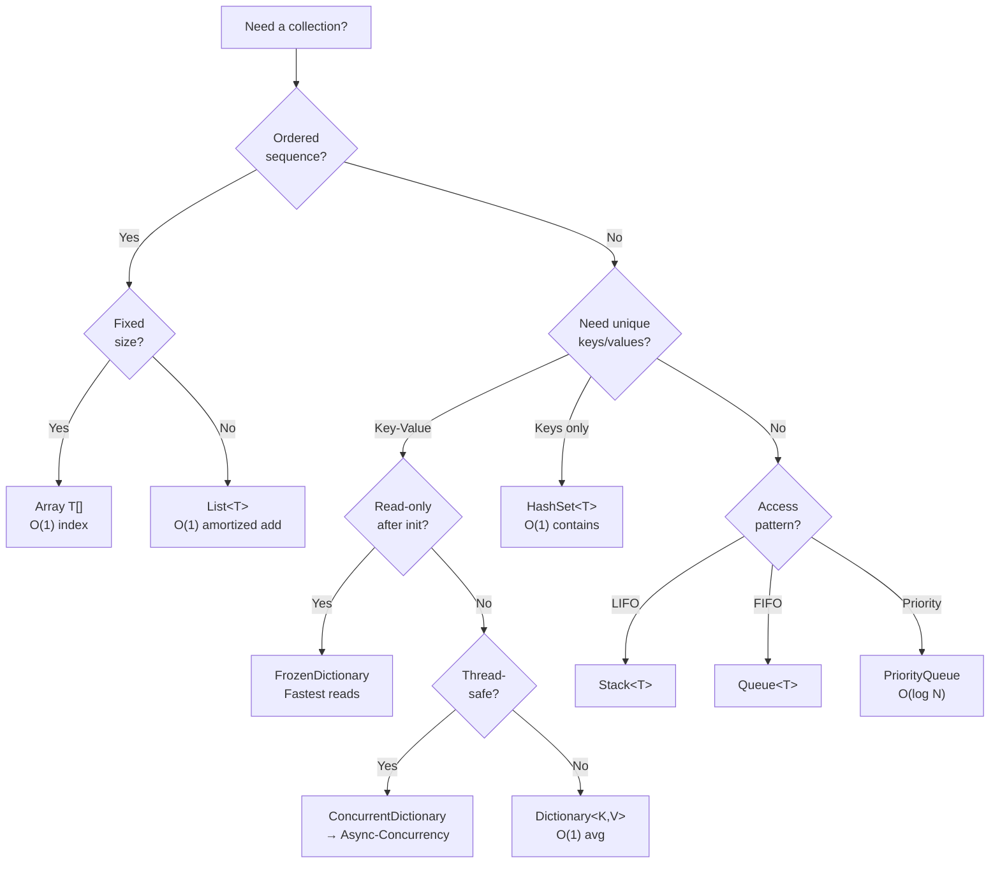

## Table of Contents

[🧠 **View Interactive Mindmap**](./data-structures-algorithms-mindmap.md)

1. **Linear Structures**
   - 1.1 [Arrays & `List<T>`](#arrays--listt)
   - 1.2 [`LinkedList<T>`](#linkedlistt)
   - 1.3 [`Stack<T>` & `Queue<T>`](#stackt--queuet)
   - 1.4 [`PriorityQueue<TElement, TPriority>`](#priorityqueuetelement-tpriority)

2. **Hash-Based Structures**
   - 2.1 [`Dictionary<TKey, TValue>` & Hash Collisions](#dictionarytkey-tvalue--hash-collisions)
   - 2.2 [`HashSet<T>`](#hashsett)
   - 2.3 [`FrozenDictionary` & `FrozenSet` (.NET 8+)](#frozendictionary--frozenset-net-8)
   - 2.4 [`ImmutableDictionary` — Structural Sharing](#immutabledictionary--structural-sharing)
   - 2.5 [`ArrayPool<T>` & `MemoryPool<T>` — Buffer Reuse](#arraypoolt--memorypoolt--buffer-reuse)

3. **Trees & Graphs**
   - 3.1 [Binary Search Trees](#binary-search-trees)
   - 3.2 [B-Trees & Database Indexing](#b-trees--database-indexing)
   - 3.3 [Graph Representation](#graph-representation)
   - 3.4 [Trie — Prefix Trees](#trie--prefix-trees)

4. **Core Algorithms**
   - 4.1 [Big-O Notation](#big-o-notation)
   - 4.2 [Sorting — IntroSort, Stable vs Unstable](#sorting--introsort-stable-vs-unstable)
   - 4.3 [Binary Search](#binary-search)
   - 4.4 [BFS & DFS](#bfs--dfs)
   - 4.5 [Recursion & Backtracking](#recursion--backtracking)

5. **Interview Algorithm Patterns**
   - 5.1 [Two-Pointer Technique](#two-pointer-technique)
   - 5.2 [Sliding Window](#sliding-window)
   - 5.3 [Dynamic Programming — Memoization & Tabulation](#dynamic-programming--memoization--tabulation)
   - 5.4 [Greedy Algorithms](#greedy-algorithms)

6. **LINQ Algorithmic Complexity**
   - 6.1 [Complexity Table](#complexity-table)
   - 6.2 [Common Pitfall: Repeated Materialization](#common-pitfall-repeated-materialization)
   - 6.3 [`.Any()` vs `.Count() > 0`](#any-vs-count--0)

7. **Architecture & Data Flow**

8. **Real-World Examples**
   - 8.1 [tai-portal: IdentityService Pagination](#tai-portal-identityservice-pagination)
   - 8.2 [tai-portal: Permission Graph Traversal with BFS](#tai-portal-permission-graph-traversal-with-bfs)
   - 8.3 [DocViewer: Inverted Index & Tree Pruning](#docviewer-inverted-index--tree-pruning)

9. **Comparison Tables**

10. **Interview Q&A**
    - 10.1 **L1: Junior Knowledge**
      - 10.1.1 [Array vs `List<T>`](#l1-array-vs-listt)
      - 10.1.2 [`IEnumerable` vs `ICollection` vs `IList`](#l1-ienumerable-vs-icollection-vs-ilist)
      - 10.1.3 [What Is Big-O Notation?](#l1-what-is-big-o-notation)
    - 10.2 **L2: Mid-Level Knowledge**
      - 10.2.1 [Dictionary Internals & Hash Collisions](#l2-dictionary-internals--hash-collisions)
      - 10.2.2 [`HashSet` vs `List.Contains` Performance](#l2-hashset-vs-listcontains-performance)
      - 10.2.3 [Stack vs Queue vs PriorityQueue](#l2-stack-vs-queue-vs-priorityqueue)
      - 10.2.4 [`Span<T>` as Zero-Copy Data View](#l2-spant-as-zero-copy-data-view)
    - 10.3 **L3: Senior Knowledge**
      - 10.3.1 [Keyset Pagination vs Offset Pagination](#l3-keyset-pagination-vs-offset-pagination)
      - 10.3.2 [BFS vs DFS: When and How](#l3-bfs-vs-dfs-when-and-how)
      - 10.3.3 [Dynamic Programming: Memoization vs Tabulation](#l3-dynamic-programming-memoization-vs-tabulation)
      - 10.3.4 [`FrozenDictionary` vs `Dictionary`](#l3-frozendictionary-vs-dictionary)
    - 10.4 **Staff: System Architecture**
      - 10.4.1 [Design a Distributed Rate Limiter](#staff-design-a-distributed-rate-limiter)
      - 10.4.2 [Algorithmic Refactoring: O(N²) to O(N)](#staff-algorithmic-refactoring-on2-to-on)

11. [Cross-References](#cross-references)
12. [Further Reading](#further-reading)

---

## TL;DR

Data Structures and Algorithms form the foundation of efficient software engineering. This note covers <span style="color: #33b5e5; font-weight: bold;">classic structures</span> (Arrays, Lists, Hash Tables, Trees, Stacks, Queues) and <span style="color: #00C851; font-weight: bold;">modern .NET additions</span> (`FrozenDictionary`, `PriorityQueue`, immutable collections) that are critical for 2026 senior-level interviews. Beyond structures, it covers <span style="color: #33b5e5; font-weight: bold;">core algorithms</span> (BFS/DFS, binary search, sorting) and <span style="color: #00C851; font-weight: bold;">interview patterns</span> (two-pointer, sliding window, dynamic programming) that separate senior engineers from mid-levels. Understanding <span style="color: #ffbb33; font-weight: bold;">Big-O notation</span>, LINQ's hidden algorithmic complexity, and when to reach for `FrozenDictionary` over `Dictionary` demonstrates the production-grade thinking interviewers expect at the 9 YOE level. tai-portal uses `Skip/Take` pagination in `IdentityService`, value objects as `readonly record struct` for stack allocation, and `HashSet<T>` for O(1) tenant deduplication.

---

## Deep Dive

### Concept Group 1: Linear Structures

#### Arrays & `List<T>`

##### What
An <span style="color: #33b5e5; font-weight: bold;">array</span> is a contiguous fixed-size block of memory where every element occupies the same number of bytes, enabling O(1) index access via pointer arithmetic. <span style="color: #33b5e5; font-weight: bold;">`List<T>`</span> is a generic wrapper around an internal array that doubles its capacity when the element count exceeds the current array length, amortizing the resize cost over many insertions.

##### Why
Without understanding the array vs. `List<T>` distinction, you cannot reason about why index access is always O(1) while inserting at position 0 of a million-element list is O(N) — every subsequent element must shift one slot to the right. This matters whenever you review code that builds large lists via `Insert(0, item)` in a loop: what looks like O(N) iterations is actually <span style="color: #ff4444; font-weight: bold;">O(N²) total work</span>, a performance cliff that only surfaces at production data volumes.

##### How
```csharp
// Arrays — fixed size, fastest possible access
int[] scores = new int[5];
scores[0] = 42;          // O(1) — direct pointer offset
scores[6] = 99;          // IndexOutOfRangeException — bounds enforced at runtime
                         // .NET 10 JIT eliminates bounds checks in tight loops
                         // where it can prove the index is in range (no overhead)

// List<T> — dynamic array with doubling resize
List<string> names = new();   // Internal array capacity: 4
names.Add("Alice");           // O(1) amortized
names.Add("Bob");
names.Add("Carol");
names.Add("Dave");
names.Add("Eve");             // Capacity exceeded → new array of size 8, Array.Copy called

// The doubling strategy: resize cost amortized to O(1) per insert
// N insertions → at most 2N copy operations total (geometric series)

// Pre-allocate when count is known to avoid resizing
List<int> ids = new(capacity: 10_000);  // No resizes during population

// Mid-list insert — the silent O(N) killer
names.Insert(0, "Zara");   // Shifts ALL existing elements right — O(N)

// Span<T> for zero-copy slicing (avoids array allocation)
int[] data = { 1, 2, 3, 4, 5 };
Span<int> slice = data.AsSpan(1, 3);   // { 2, 3, 4 } — no heap allocation
```

##### When
Use a raw array when the size is known at compile time and you need maximum performance (e.g., fixed-size buffers, image pixel rows). Use `List<T>` as your default ordered, dynamic collection. Do <span style="color: #ff4444; font-weight: bold;">not</span> use `List<T>` for frequent mid-list insertions or removals — reach for `LinkedList<T>` if you hold node references, or reconsider your data model.

##### Trade-offs
O(1) index access, O(1) amortized append. <span style="color: #ffbb33; font-weight: bold;">O(N) mid-list insert/delete</span> due to element shifting. Memory layout is contiguous, which means <span style="color: #00C851; font-weight: bold;">excellent CPU cache locality</span> — hardware prefetchers love sequential access patterns. Resizing allocates a new backing array (old one becomes GC garbage), so pre-allocating with a known capacity eliminates that pressure.

---

#### `LinkedList<T>`

##### What
<span style="color: #33b5e5; font-weight: bold;">`LinkedList<T>`</span> is a doubly-linked list where each node (`LinkedListNode<T>`) stores a value plus references to the previous and next nodes. The collection itself holds only `First` and `Last` node references plus a count.

##### Why
`LinkedList<T>` provides O(1) insert and remove at a known node position — a guarantee no array-backed structure can match. If you already hold a `LinkedListNode<T>` reference, splicing it in or out requires only pointer rewiring, regardless of list length. This is the precise semantic needed for structures like an LRU cache eviction queue, where you promote a node to the front on cache hit.

##### How
```csharp
var history = new LinkedList<string>();
LinkedListNode<string> node = history.AddLast("Step 1");
history.AddLast("Step 2");
history.AddLast("Step 3");

// O(1) insert adjacent to a known node
history.AddAfter(node, "Step 1.5");  // No shifting — just pointer rewiring

// O(1) remove by node reference
history.Remove(node);  // "Step 1" gone; surrounding pointers updated

// O(N) traversal — no index access
foreach (var step in history)
    Console.WriteLine(step);

// LRU cache pattern: move recently accessed node to front in O(1)
void Touch(LinkedListNode<string> n) {
    history.Remove(n);       // O(1) — node reference known
    history.AddFirst(n);     // O(1) — prepend
}
```

##### When
Use `LinkedList<T>` when you hold node references and need frequent O(1) insert/remove at arbitrary positions — the canonical example is an LRU eviction queue. <span style="color: #ff4444; font-weight: bold;">Do not use it for random access</span> (O(N) traversal) or when you just need a dynamic ordered list (`List<T>` is faster for everything else). In 2026 .NET, `List<T>` beats `LinkedList<T>` for most workloads because CPU cache locality dominates over theoretical pointer-manipulation savings.

##### Trade-offs
O(1) insert/remove at a known node, O(N) search, O(N) index access. <span style="color: #ffbb33; font-weight: bold;">Poor CPU cache locality</span> — each node is a separate heap allocation, so traversal generates cache misses on every step. Extra memory overhead: two object references per node (~16 bytes on 64-bit) plus the node object header itself. Effectively never the right default choice — justify it with a specific O(1)-node-manipulation requirement.

---

#### `Stack<T>` & `Queue<T>`

##### What
<span style="color: #33b5e5; font-weight: bold;">`Stack<T>`</span> is a Last-In-First-Out (LIFO) collection backed by an internal array: `Push` appends to the top, `Pop` removes from the top. <span style="color: #33b5e5; font-weight: bold;">`Queue<T>`</span> is a First-In-First-Out (FIFO) collection backed by a circular buffer: `Enqueue` writes to the tail, `Dequeue` reads from the head — avoiding the O(N) shift that a naive array-front-removal would require.

##### Why
These types encode access semantics into the type system. A `Stack<T>` makes it impossible to accidentally dequeue the middle element; a `Queue<T>` prevents jumping the line. Beyond correctness, they communicate intent: a reviewer seeing `Stack<T>` immediately knows LIFO semantics are required. Without them, you'd simulate LIFO/FIFO on a `List<T>` and pay O(N) on every removal from the wrong end.

##### How
```csharp
// Stack<T> — LIFO: DFS, undo/redo, expression parsing
var undo = new Stack<string>();
undo.Push("typed 'H'");
undo.Push("typed 'i'");
undo.Push("deleted 'i'");

string last = undo.Pop();     // "deleted 'i'" — O(1)
string peek = undo.Peek();    // "typed 'i'" — O(1), no removal

// Queue<T> — FIFO: BFS, task scheduling, message processing
// Backed by a circular buffer: head/tail indices wrap around the array
// Avoids O(N) shift on Dequeue that List<T>.RemoveAt(0) would require
var tasks = new Queue<string>();
tasks.Enqueue("Task A");
tasks.Enqueue("Task B");
tasks.Enqueue("Task C");

string next = tasks.Dequeue();   // "Task A" — O(1)
string front = tasks.Peek();     // "Task B" — O(1), no removal

// Iterative DFS using Stack (avoids recursion stack overflow on deep graphs)
void Dfs(int start, int[] adj) {
    var stack = new Stack<int>();
    var visited = new HashSet<int>();
    stack.Push(start);
    while (stack.Count > 0) {
        int node = stack.Pop();
        if (!visited.Add(node)) continue;
        // process node
        foreach (var neighbor in adj) stack.Push(neighbor);
    }
}
```

##### When
Use `Stack<T>` for most-recent-first processing: undo/redo, iterative DFS, bracket-matching, expression evaluation. Use `Queue<T>` for first-come-first-served: BFS traversal, work queues, buffering items for batch processing. Neither is suitable for priority-based ordering — reach for `PriorityQueue<TElement, TPriority>` instead.

##### Trade-offs
Both `Push`/`Pop` and `Enqueue`/`Dequeue` are O(1) amortized (same doubling resize as `List<T>`). Low memory overhead — the circular buffer in `Queue<T>` reuses slots without shifting. <span style="color: #ffbb33; font-weight: bold;">Neither is thread-safe</span> — use `ConcurrentStack<T>` or `ConcurrentQueue<T>` (lock-free, CAS-based) for multi-producer/multi-consumer scenarios.

---

#### `PriorityQueue<TElement, TPriority>`

##### What
<span style="color: #33b5e5; font-weight: bold;">`PriorityQueue<TElement, TPriority>`</span>, introduced in .NET 6, is a binary min-heap that always dequeues the element with the **lowest** priority value. Internally, elements are stored in a flat array where each parent at index `i` has children at `2i + 1` and `2i + 2`, maintaining the heap invariant via `Heapify` operations on enqueue and dequeue.

##### Why
Without `PriorityQueue`, ordering by priority requires either sorting the collection on every dequeue — O(N log N) — or maintaining a sorted `List<T>` with O(N) inserts. A binary heap gives you O(log N) insert and O(log N) extract-minimum, which is the difference between a scheduler that handles 10,000 events/second and one that crawls past a few hundred.

##### How
```csharp
// Basic priority queue — lower number = higher priority
var scheduler = new PriorityQueue<string, int>();
scheduler.Enqueue("Low priority task",    priority: 10);
scheduler.Enqueue("Critical task",        priority: 1);
scheduler.Enqueue("Normal task",          priority: 5);

// Dequeue always returns the minimum priority element
while (scheduler.Count > 0) {
    string task = scheduler.Dequeue();   // Critical → Normal → Low
    Console.WriteLine(task);
}

// Dijkstra's shortest path skeleton
var dist = new Dictionary<int, int>();
var pq = new PriorityQueue<int, int>();  // (node, distance)
pq.Enqueue(startNode, 0);

while (pq.Count > 0) {
    pq.TryDequeue(out int node, out int d);
    if (dist.ContainsKey(node)) continue;   // Already settled
    dist[node] = d;
    foreach (var (neighbor, weight) in graph[node])
        pq.Enqueue(neighbor, d + weight);   // O(log N) per enqueue
}

// Binary heap array representation (min-heap invariant):
// Index:  0   1   2   3   4   5   6
// Value:  1   3   5   7   4   8   6
//         ^   ^ ^   ^ ^
//         root  children  grandchildren
// Parent of i → (i-1)/2 ; Children of i → 2i+1, 2i+2
```

##### When
Use `PriorityQueue<TElement, TPriority>` for job scheduling with urgency levels, Dijkstra's and A* pathfinding, event-driven simulations (process earliest-time event first), and any "always process the most important item next" pattern. <span style="color: #ff4444; font-weight: bold;">Do not use it as a FIFO queue</span> — elements with equal priority have no guaranteed ordering. For highest-priority-first, negate the priority value (e.g., pass `-urgency`).

##### Trade-offs
O(log N) enqueue, O(log N) dequeue, O(1) peek-minimum. <span style="color: #ffbb33; font-weight: bold;">No efficient priority update</span> for an element already in the heap — the standard workaround is lazy deletion (re-enqueue with new priority, skip stale entries on dequeue). <span style="color: #ff4444; font-weight: bold;">Not thread-safe</span> — wrap with locks or use a third-party concurrent priority queue for multi-threaded scenarios. Memory is contiguous (flat array), so cache performance is good compared to pointer-based heap implementations.

---

## Concept Group 2: Hash-Based Structures

---

#### `Dictionary<TKey, TValue>` & Hash Collisions

##### What
<span style="color: #33b5e5; font-weight: bold;">`Dictionary<TKey, TValue>`</span> is a hash table that maps keys to values by running the key through a hash function to produce a bucket index. Each bucket holds a linked chain of entries — when two keys hash to the same bucket index, that's a <span style="color: #33b5e5; font-weight: bold;">collision</span>, and the chain grows by one node. Internally, .NET's `Dictionary<TKey, TValue>` stores entries in a flat array (not a true linked list) alongside a parallel `_buckets` int array of head indices, giving it excellent cache locality compared to pointer-chasing implementations.

##### Why
The primary reason `Dictionary<TKey, TValue>` dominates day-to-day .NET development is its <span style="color: #00C851; font-weight: bold;">O(1) average-case lookup and insert</span>. When you need to look up a user by ID, cache a computed value by key, or invert a mapping, no other general-purpose structure competes. Contrast with `List<T>.Contains()` at O(N) — on a list of 100,000 items, a dictionary lookup is orders of magnitude faster.

##### How
```csharp
// Core operations
var cache = new Dictionary<int, UserDto>();

// TryGetValue — preferred over ContainsKey + indexer (single hash computation)
if (!cache.TryGetValue(userId, out var user))
{
    user = await db.Users.FindAsync(userId);
    cache[userId] = user;
}

// Collision demonstration: two keys with the same bucket index
// GetHashCode() → bucket via (hash & 0x7FFFFFFF) % bucketCount
// If "Alice" and "Bob" both map to bucket 7:
//   bucket[7] → entry("Alice", ...) → entry("Bob", ...) → null
// Equality check walks the chain until key matches

// Load factor & resizing: .NET resizes when count/buckets > ~0.72
// Resize doubles bucket count and rehashes all entries — O(N) one-time cost
// Amortized over N inserts → still O(1) per insert

// Dictionary with custom equality (case-insensitive keys)
var headers = new Dictionary<string, string>(StringComparer.OrdinalIgnoreCase);
headers["Content-Type"] = "application/json";
Console.WriteLine(headers["content-type"]);  // "application/json" — key match ignores case
```

##### When
<span style="color: #00C851; font-weight: bold;">Reach for `Dictionary<TKey, TValue>`</span> for key-value mapping, result caching, lookup tables by ID/slug, and grouping operations where you build a map once and query it repeatedly. <span style="color: #ff4444; font-weight: bold;">Do not use it when you need ordered iteration by key</span> — use `SortedDictionary<TKey, TValue>` (red-black tree, O(log N)) or `SortedList<TKey, TValue>` (array-backed, faster reads, slower inserts) instead. Also avoid when insertion order matters — `Dictionary<TKey, TValue>` does not guarantee enumeration order (even though the current implementation tends to preserve it).

##### Trade-offs
<span style="color: #ffbb33; font-weight: bold;">O(N) worst-case</span> if an adversary can control input keys and engineer hash collisions into the same bucket (hash flooding attack) — .NET mitigates this with randomized hash seeds (`DOTNET_UseRandomizedHashing`). Memory overhead is higher than `List<T>`: two parallel arrays (buckets + entries) plus per-entry metadata. No insertion-order guarantee. For read-heavy scenarios with a fixed key set, see `FrozenDictionary` below.

---

#### `HashSet<T>`

##### What
<span style="color: #33b5e5; font-weight: bold;">`HashSet<T>`</span> is a hash table that stores unique keys with no associated values. Internally it shares the same bucket-and-entry array design as `Dictionary<TKey, TValue>` — you can think of it as `Dictionary<T, Unit>` where the value slot is omitted. Duplicate `Add()` calls are silently ignored; the return value (`bool`) tells you whether the item was newly inserted.

##### Why
The critical performance win is <span style="color: #00C851; font-weight: bold;">O(1) `Contains()` vs O(N) on `List<T>`</span>. In interview scenarios and production code alike, replacing a `List<T>` with a `HashSet<T>` for membership checks is one of the most common and highest-ROI optimizations. Beyond membership, `HashSet<T>` provides set-algebra methods (`UnionWith`, `IntersectWith`, `ExceptWith`) that operate in O(N) on both collections, making deduplication and set comparison trivial.

##### How
```csharp
var seen = new HashSet<int>();
var processed = new HashSet<string>(StringComparer.OrdinalIgnoreCase);

// Add returns false if already present
bool isNew = seen.Add(42);   // true
isNew = seen.Add(42);         // false — duplicate silently dropped

// O(1) membership check
if (!seen.Contains(userId))
    ProcessUser(userId);

// Set algebra — all mutate the receiver in-place
var admins   = new HashSet<string> { "alice", "bob" };
var editors  = new HashSet<string> { "bob", "carol" };

admins.UnionWith(editors);        // { "alice", "bob", "carol" }
admins.IntersectWith(editors);    // { "bob" }
admins.ExceptWith(editors);       // { "alice" }

// Deduplication pattern
var unique = new HashSet<int>(rawList);   // O(N), removes all duplicates

// Read-only set operations without mutation — return new sets
var union = new HashSet<string>(admins);
union.UnionWith(editors);

// Overlaps & subset checks (O(N))
bool anyShared = admins.Overlaps(editors);
bool isSubset  = admins.IsSubsetOf(editors);
```

##### When
Use `HashSet<T>` for deduplication, existence checks, visited-node tracking in graph traversal, and any set-algebra operation (union, intersection, difference). <span style="color: #ff4444; font-weight: bold;">Don't reach for `HashSet<T>` reflexively on tiny collections</span> — for fewer than ~10 elements, `List<T>.Contains()` is often faster because the entire list fits in a cache line and avoids the hashing overhead and two-array memory layout of `HashSet<T>`.

##### Trade-offs
Same hash-table costs as `Dictionary<TKey, TValue>`: higher memory than `List<T>`, O(N) worst-case on adversarial input, no ordering guarantee. <span style="color: #ffbb33; font-weight: bold;">For small, cache-hot collections, `List<T>` wins on raw throughput</span> due to sequential memory access patterns (hardware prefetcher helps). When ordering matters and uniqueness is required, `SortedSet<T>` (red-black tree) gives you O(log N) operations with sorted iteration.

---

#### `FrozenDictionary` & `FrozenSet` (.NET 8+)

##### What
<span style="color: #33b5e5; font-weight: bold;">`FrozenDictionary<TKey, TValue>`</span> and <span style="color: #33b5e5; font-weight: bold;">`FrozenSet<T>`</span>, introduced in .NET 8, are read-only collections that are **optimized at creation time** for the specific key set they contain. Unlike `Dictionary<TKey, TValue>`, which uses a generic hash function, `FrozenDictionary` analyzes the actual keys during construction and may select a perfect or near-perfect hash function that eliminates collisions entirely for that key set. The result is a collection that cannot be mutated after creation but delivers measurably faster reads on hot paths.

##### Why
Benchmarks show <span style="color: #00C851; font-weight: bold;">20–40% faster lookups than `Dictionary<TKey, TValue>`</span> on string keys in read-heavy scenarios. For data that is loaded once at startup — permission maps, route tables, configuration values, feature flag registries — and then queried millions of times per second, that improvement compounds significantly. The immutability contract also removes the need for any read-side locking, which eliminates lock contention entirely.

##### How
```csharp
using System.Collections.Frozen;

// Build once at startup, store as FrozenDictionary
var permissions = new Dictionary<string, string[]>
{
    ["Admin"]  = ["Portal.Users.Read", "Portal.Users.Create", "Portal.Users.Delete"],
    ["Editor"] = ["Portal.Users.Read", "Portal.Users.Create"],
    ["Viewer"] = ["Portal.Users.Read"]
}.ToFrozenDictionary();

// tai-portal pattern: inject as singleton, use in authorization middleware
public class PermissionService(FrozenDictionary<string, string[]> permissionMap)
{
    public bool HasPermission(string role, string permission) =>
        permissionMap.TryGetValue(role, out var perms) &&
        perms.Contains(permission);
}

// FrozenSet — same idea for unique value lookup
var allowedExtensions = new HashSet<string> { ".pdf", ".docx", ".xlsx" }
    .ToFrozenSet(StringComparer.OrdinalIgnoreCase);

bool allowed = allowedExtensions.Contains(ext);  // ~30% faster than HashSet on average

// Registration in DI (startup, not per-request)
builder.Services.AddSingleton(_ =>
    LoadPermissionsFromConfig().ToFrozenDictionary());
```

##### When
<span style="color: #00C851; font-weight: bold;">Use `FrozenDictionary` / `FrozenSet` for any data that is populated once and read many times</span>: permission maps, route/endpoint registries, country/currency lookup tables, allowed-value sets for validation, feature flag definitions. <span style="color: #ff4444; font-weight: bold;">Do not use for runtime-changing data</span> — the collection is permanently immutable. If the underlying data must be refreshed (e.g., permission rules change at runtime), you need to rebuild the `FrozenDictionary` and swap an `Interlocked`-managed reference, which is an O(N) rebuild cost.

##### Trade-offs
<span style="color: #ffbb33; font-weight: bold;">Construction is expensive</span>: `ToFrozenDictionary()` performs key analysis, potentially sorts, and computes the optimized hash structure — a high constant-factor O(N) operation. For small dictionaries (<50 entries), the creation overhead may exceed the total lifetime read savings. The collection is permanently immutable post-construction; any "update" requires a full rebuild. Not suitable for collections that grow or shrink during application lifetime.

---

#### `ImmutableDictionary` — Structural Sharing

##### What
<span style="color: #33b5e5; font-weight: bold;">`ImmutableDictionary<TKey, TValue>`</span> (from `System.Collections.Immutable`) is a <span style="color: #33b5e5; font-weight: bold;">persistent data structure</span> implemented as a balanced binary tree (HAMT — Hash Array Mapped Trie). Each "modification" — `Add`, `Remove`, `SetItem` — does **not** mutate the original; instead it returns a new `ImmutableDictionary` instance that shares most of the internal tree nodes with the original. This is called <span style="color: #33b5e5; font-weight: bold;">structural sharing</span>: two dictionary versions coexist in memory with O(log N) new nodes, not two full copies.

##### Why
The key benefit is <span style="color: #00C851; font-weight: bold;">lock-free concurrent reads</span>. Because no mutation ever occurs in-place, any number of threads can read an `ImmutableDictionary` simultaneously without locks. When an update is needed, a writer atomically swaps a reference (via `Interlocked.Exchange` or `Volatile.Write`) to a new version, and subsequent readers naturally pick up the new version without stale-read risk. Each reader seeing the old reference continues seeing a fully consistent snapshot.

##### How
```csharp
using System.Collections.Immutable;

// Immutable — all "mutation" methods return a new instance
var v1 = ImmutableDictionary<string, int>.Empty
    .Add("Alice", 1)
    .Add("Bob",   2);

var v2 = v1.Add("Carol", 3);   // v1 unchanged; v2 shares nodes with v1
var v3 = v1.Remove("Alice");   // v1 unchanged; v3 is independent

Console.WriteLine(v1.Count);  // 2  — original untouched
Console.WriteLine(v2.Count);  // 3
Console.WriteLine(v3.Count);  // 1

// Thread-safe snapshot swap pattern
private volatile ImmutableDictionary<string, FeatureFlag> _flags =
    ImmutableDictionary<string, FeatureFlag>.Empty;

public void UpdateFlag(string key, FeatureFlag value)
{
    // Spin loop for compare-and-swap
    ImmutableDictionary<string, FeatureFlag> current, updated;
    do
    {
        current = _flags;
        updated = current.SetItem(key, value);
    }
    while (!ReferenceEquals(
        Interlocked.CompareExchange(ref _flags, updated, current),
        current));
}

public FeatureFlag? GetFlag(string key) =>
    _flags.TryGetValue(key, out var f) ? f : null;  // No lock needed

// Builder for batch construction (avoid O(N log N) individual Adds)
var builder = ImmutableDictionary.CreateBuilder<string, int>();
builder.Add("x", 1);
builder.Add("y", 2);
var dict = builder.ToImmutable();   // Single O(N) build pass
```

##### When
Use `ImmutableDictionary` when multiple threads read concurrently and updates are infrequent: feature flag registries refreshed every few minutes, per-request snapshots of shared state, undo/redo history stacks, and functional-style transformations where you need to preserve previous versions. <span style="color: #ff4444; font-weight: bold;">Do not use for write-heavy workloads</span> — each `Add` or `Remove` is O(log N) and allocates new tree nodes, making it dramatically slower than `Dictionary<TKey, TValue>` under high write throughput. For write-heavy concurrent scenarios, prefer `ConcurrentDictionary<TKey, TValue>`.

##### Trade-offs
<span style="color: #ffbb33; font-weight: bold;">Reads are slower than `Dictionary<TKey, TValue>`</span>: tree traversal (O(log N)) vs hash lookup (O(1)), plus pointer-chasing through tree nodes hurts cache performance. Higher per-node memory (each node stores key, value, hash, child references). The structural sharing benefit only justifies the overhead when concurrent consistency or version history is a hard requirement. For a simpler read-mostly singleton, prefer `FrozenDictionary`; for concurrent writes, prefer `ConcurrentDictionary`.

---

#### `ArrayPool<T>` & `MemoryPool<T>` — Buffer Reuse

##### What
<span style="color: #33b5e5; font-weight: bold;">`ArrayPool<T>`</span> and <span style="color: #33b5e5; font-weight: bold;">`MemoryPool<T>`</span> (from `System.Buffers`) are shared pools for renting and returning temporary arrays and memory segments, bypassing the GC allocator entirely for hot-path buffer usage. `ArrayPool<T>.Shared` is the static thread-local-aware pool built into the runtime. `MemoryPool<T>` wraps `ArrayPool` and returns `IMemoryOwner<T>` — an `IDisposable` handle to a `Memory<T>` slice — which integrates cleanly with async pipelines.

##### Why
In high-throughput APIs, allocating a `new byte[4096]` per request pushes objects onto the heap and triggers Gen0 GC collections. Under load, GC pauses become a dominant latency source — even Gen0 collections that take <1 ms add up to tens of milliseconds of pause time per second across many threads. Buffer pooling <span style="color: #00C851; font-weight: bold;">eliminates the per-request allocation entirely</span>: the array is rented from the pool (a thread-local array taken from a pre-allocated bucket), used, then returned — zero GC pressure.

##### How
```csharp
using System.Buffers;

// ArrayPool<T> — rent, use, return
byte[] buffer = ArrayPool<byte>.Shared.Rent(1024);
try
{
    // buffer.Length may be >= 1024 (pool rounds up to power of two)
    int bytesRead = stream.Read(buffer, 0, 1024);
    ProcessData(buffer.AsSpan(0, bytesRead));
}
finally
{
    // MUST return — forgetting causes pool exhaustion (silent memory leak)
    ArrayPool<byte>.Shared.Return(buffer, clearArray: false);
}

// MemoryPool<T> — IDisposable pattern, safer for async
using IMemoryOwner<byte> owner = MemoryPool<byte>.Shared.Rent(1024);
Memory<byte> mem = owner.Memory;  // Slice up to requested size
int read = await stream.ReadAsync(mem);
ProcessData(mem.Span[..read]);
// owner.Dispose() returns buffer automatically at end of using block

// Custom-sized pool for domain-specific buffer sizes
private static readonly ArrayPool<char> _charPool =
    ArrayPool<char>.Create(maxArrayLength: 64 * 1024, maxArraysPerBucket: 50);
```

##### When
Use `ArrayPool<T>` / `MemoryPool<T>` for parsing, serialization, stream processing, and any pattern where you repeatedly allocate and discard identically-sized byte or char buffers within a request. Common in middleware, gRPC handlers, JSON serializers, and file upload endpoints. Cross-reference: see [[Performance-Optimization]] for a full deep dive on `Span<T>`, `Memory<T>`, and zero-allocation patterns. <span style="color: #ff4444; font-weight: bold;">Do not rent and forget</span> — a buffer that is never returned exhausts the pool bucket and falls back to heap allocation, defeating the purpose entirely.

##### Trade-offs
<span style="color: #ffbb33; font-weight: bold;">Rented arrays may be larger than requested</span> (pool rounds up to the next power-of-two bucket) — always slice with `AsSpan(0, actualLength)` rather than using the full array. Returning without `clearArray: true` means the buffer may contain data from a previous caller — a subtle <span style="color: #ff4444; font-weight: bold;">security risk</span> if buffer contents could be read by untrusted code (e.g., sending HTTP response buffers). `ArrayPool<T>` is not suitable as a long-lived storage mechanism — rented arrays should be held only for the duration of a single operation, not stored on objects or fields.

---

## Concept Group 3: Trees & Graphs

### Binary Search Trees

#### 3.1 Binary Search Trees

##### What
A <span style="color: #33b5e5; font-weight: bold;">Binary Search Tree (BST)</span> is a hierarchical node-based structure where every node satisfies the invariant: **left child < parent < right child**. Each node holds a value and references to up to two child nodes. The structure naturally partitions data at each level, enabling efficient divide-and-conquer search.

##### Why
A balanced BST delivers <span style="color: #00C851; font-weight: bold;">O(log N) search, insert, and delete</span> — the height of the tree bounds every operation. .NET's `SortedDictionary<TKey, TValue>` and `SortedSet<T>` are backed by a <span style="color: #33b5e5; font-weight: bold;">Red-Black Tree</span> (a self-balancing BST variant), so you use BST semantics every time you reach for sorted, dynamically-updated collections. Understanding BSTs is a prerequisite for reasoning about any sorted-key structure.

##### How
```csharp
public class TreeNode<T> where T : IComparable<T>
{
    public T Value { get; set; }
    public TreeNode<T>? Left { get; set; }
    public TreeNode<T>? Right { get; set; }

    public TreeNode(T value) => Value = value;
}

public class BinarySearchTree<T> where T : IComparable<T>
{
    private TreeNode<T>? _root;

    public void Insert(T value)
    {
        _root = InsertRec(_root, value);
    }

    private TreeNode<T> InsertRec(TreeNode<T>? node, T value)
    {
        if (node is null) return new TreeNode<T>(value);

        int cmp = value.CompareTo(node.Value);
        if (cmp < 0)      node.Left  = InsertRec(node.Left,  value);
        else if (cmp > 0) node.Right = InsertRec(node.Right, value);
        // cmp == 0: duplicate — ignore (or handle per domain rules)
        return node;
    }

    public bool Search(T value)
    {
        var current = _root;
        while (current is not null)
        {
            int cmp = value.CompareTo(current.Value);
            if      (cmp == 0) return true;
            else if (cmp <  0) current = current.Left;
            else               current = current.Right;
        }
        return false;
    }

    // In-order traversal: left → root → right yields sorted ascending output
    public IEnumerable<T> InOrder()
    {
        var stack = new Stack<TreeNode<T>>();
        var current = _root;
        while (current is not null || stack.Count > 0)
        {
            while (current is not null) { stack.Push(current); current = current.Left; }
            current = stack.Pop();
            yield return current.Value;  // sorted ascending
            current = current.Right;
        }
    }
}
```

In-order traversal (left → root → right) always yields nodes in sorted ascending order — this is the defining property that makes BSTs useful for range queries and sorted iteration.

##### When
Use a BST (via `SortedDictionary` / `SortedSet`) when you need **sorted data with frequent dynamic inserts and deletes**. If your data is static, sorting once into an array and using binary search is faster. <span style="color: #00C851; font-weight: bold;">In practice, reach for `SortedDictionary<TKey, TValue>` or `SortedSet<T>`</span> rather than implementing your own — they are battle-tested Red-Black Trees.

##### Trade-offs
<span style="color: #ff4444; font-weight: bold;">An unbalanced BST degrades to O(N)</span> for all operations. Inserting already-sorted data (1, 2, 3, 4…) produces a degenerate tree that looks exactly like a linked list — every insert goes to the right child. <span style="color: #ffbb33; font-weight: bold;">Self-balancing variants (Red-Black Trees, AVL Trees) add rotation logic to maintain O(log N) height</span> at the cost of more complex insert/delete code. Red-Black Trees (used by .NET) tolerate slightly unbalanced trees (height ≤ 2 log N) for faster inserts; AVL Trees are more strictly balanced, favouring read-heavy workloads.

---

### B-Trees & Database Indexing

#### 3.2 B-Trees & Database Indexing

##### What
A <span style="color: #33b5e5; font-weight: bold;">B-Tree</span> is a self-balancing search tree optimised for **block-based (disk) storage**. Unlike a BST where each node holds one key and two children, a B-Tree node holds **multiple keys** and **multiple child pointers** (the branching factor). A B-Tree of order M has nodes with up to M−1 keys and M children. The high branching factor produces a **shallow tree** — a B-Tree over millions of rows may be only 3–4 levels deep.

##### Why
<span style="color: #00C851; font-weight: bold;">PostgreSQL and SQL Server use B-Tree variants for their default indexes</span> (SQL Server uses B+Trees, where all data lives in leaf nodes). When you run `EXPLAIN ANALYZE` in Postgres or look at query plans in SQL Server, index seeks are B-Tree traversals: `WHERE Id = @id` with an index is O(log N); without an index it is O(N) (full table scan). This is the single most impactful data-structure concept for database performance interviews. Cross-reference: [[EFCore-SQL]].

##### How
You will never implement a B-Tree — this is conceptual understanding for interviews.

**Why B-Trees win on disk:**
- A disk read fetches one **page** (typically 4–16 KB) at a time. A BST node holds one key → N keys = N disk reads in the worst case.
- A B-Tree node is sized to fill one disk page → one disk read fetches dozens or hundreds of keys.
- A B-Tree of order 1000 over 1 billion rows has height ≈ log₁₀₀₀(10⁹) = 3. Three disk reads to find any row.

**Clustered vs non-clustered indexes:**

| Type | What it stores | Effect |
|---|---|---|
| <span style="color: #33b5e5; font-weight: bold;">Clustered index</span> | Leaf nodes ARE the data rows (table sorted by key) | One lookup → row in hand. One per table. |
| <span style="color: #33b5e5; font-weight: bold;">Non-clustered index</span> | Leaf nodes hold key + pointer (RID/clustered key) to row | Two lookups: index seek → then row fetch ("key lookup"). |

```sql
-- Index seek: O(log N) — B-Tree traversal
SELECT * FROM Orders WHERE OrderId = 42;        -- clustered index seek

-- Index seek + key lookup: O(log N) — non-clustered seek then row fetch
SELECT * FROM Orders WHERE CustomerId = 7;      -- non-clustered index on CustomerId

-- Full table scan: O(N) — no usable index
SELECT * FROM Orders WHERE YEAR(CreatedAt) = 2024;  -- function prevents index use
```

**Write amplification:** inserting a key into a full B-Tree node triggers a **node split** — the node is divided and a key promoted to the parent, potentially cascading splits upward. This is why heavy insert workloads on heavily-indexed tables see write amplification.

##### When
You will encounter B-Tree reasoning in any interview touching database indexing, `EXPLAIN` / `EXPLAIN ANALYZE` query plans, or the trade-off between read performance and write overhead. The interviewer wants to hear: "an index is a B-Tree; a seek is O(log N); a scan is O(N); adding too many indexes slows writes due to node splits."

##### Trade-offs
<span style="color: #ffbb33; font-weight: bold;">Write amplification:</span> every insert/update/delete must maintain all indexes on the table. A table with 10 indexes pays 10x the write cost per row change. <span style="color: #ff4444; font-weight: bold;">Over-indexing is a common production anti-pattern</span> — indexes waste storage and serialise write throughput under heavy insert load (e.g., event logs, audit trails). Index only columns that appear in `WHERE`, `JOIN ON`, or `ORDER BY` clauses with high cardinality.

---

### Graph Representation

#### 3.3 Graph Representation

##### What
A <span style="color: #33b5e5; font-weight: bold;">graph</span> is a set of **vertices** (nodes) connected by **edges**. Graphs are characterised along three axes:

| Dimension | Options |
|---|---|
| Edge direction | **Directed** (one-way) vs **Undirected** (bidirectional) |
| Edge weight | **Weighted** (cost on edge) vs **Unweighted** |
| Cycles | **Cyclic** vs **Acyclic** (a DAG = Directed Acyclic Graph) |

Permission hierarchies, dependency resolution (NuGet, npm), and microservice call graphs are all real-world graphs.

##### Why
Graphs model relationships that hierarchies (trees) cannot: many-to-many connections, cycles, weighted paths. In a full-stack .NET/Angular context: permission role inheritance is a DAG, OpenSearch index relationships are graphs, and service dependency resolution at startup is a topological sort of a DAG. Understanding graph representations is the prerequisite for BFS/DFS (concept 4.4) and any routing or scheduling algorithm.

##### How
Two canonical representations, each with distinct trade-offs:

```csharp
// ─── Adjacency List ─── O(V + E) space ───────────────────────────────────────
// Best for sparse graphs (most real-world graphs). Stores only existing edges.
var adjacencyList = new Dictionary<int, List<int>>
{
    [0] = new List<int> { 1, 2 },   // vertex 0 connects to 1 and 2
    [1] = new List<int> { 2 },      // vertex 1 connects to 2
    [2] = new List<int> { 3 },      // vertex 2 connects to 3
    [3] = new List<int>()           // vertex 3 has no outgoing edges
};

// Traverse neighbours of vertex 0: O(degree(v))
foreach (int neighbour in adjacencyList[0])
    Console.WriteLine(neighbour);  // 1, 2

// Edge existence check: O(degree(v)) — must scan the neighbour list
bool hasEdge = adjacencyList[0].Contains(2);  // true


// ─── Adjacency Matrix ─── O(V²) space ────────────────────────────────────────
// Best for dense graphs or when O(1) edge lookup is critical.
int V = 4;
bool[,] matrix = new bool[V, V];

// Add edges (directed)
matrix[0, 1] = true;
matrix[0, 2] = true;
matrix[1, 2] = true;
matrix[2, 3] = true;

// Edge existence check: O(1)
bool edgeExists = matrix[0, 2];  // true

// Traverse all neighbours of vertex 0: O(V) — must scan the entire row
for (int j = 0; j < V; j++)
    if (matrix[0, j]) Console.WriteLine(j);  // 1, 2


// ─── Weighted Graph — Adjacency List variant ──────────────────────────────────
var weightedGraph = new Dictionary<int, List<(int Neighbour, int Weight)>>
{
    [0] = new List<(int, int)> { (1, 4), (2, 1) },  // 0→1 costs 4, 0→2 costs 1
    [1] = new List<(int, int)> { (3, 1) },
    [2] = new List<(int, int)> { (1, 2), (3, 5) },
    [3] = new List<(int, int)>()
};
```

##### When
<span style="color: #00C851; font-weight: bold;">Use an adjacency list for almost every real-world graph</span> — social networks, dependency graphs, and permission hierarchies are all sparse (V vertices, far fewer than V² edges). Use an adjacency matrix only when the graph is dense (E ≈ V²) or when O(1) edge existence lookup is the dominant operation (e.g., Floyd-Warshall all-pairs shortest path).

##### Trade-offs

| Operation | Adjacency List | Adjacency Matrix |
|---|---|---|
| Space | O(V + E) | O(V²) |
| Add edge | O(1) amortised | O(1) |
| Edge existence | O(degree(v)) | O(1) |
| All neighbours of v | O(degree(v)) | O(V) |
| Best for | Sparse graphs | Dense graphs / O(1) edge lookup |

<span style="color: #ffbb33; font-weight: bold;">The matrix becomes impractical for large sparse graphs</span> — a social network with 1 million users would require a 1M×1M boolean matrix (1 TB of RAM) despite having perhaps only 10 billion edges (10 bytes per user average).

---

### Trie — Prefix Trees

#### 3.4 Trie — Prefix Trees

##### What
A <span style="color: #33b5e5; font-weight: bold;">Trie</span> (pronounced "try", from re**trie**val) is a tree where each **node represents a single character**. The path from the root to any node spells a prefix; the path to a node marked as a word-end spells a complete word. All words sharing a common prefix share the same prefix nodes — storage is deduplicated across the shared prefix.

```
Insert: "cat", "car", "card", "care", "bat"

        (root)
       /      \
      c         b
      |         |
      a         a
     / \        |
    t*  r       t*
        |
        d*  e*

* = IsEndOfWord = true
```

##### Why
Trie lookup is <span style="color: #00C851; font-weight: bold;">O(K) where K is the key length</span> — completely independent of how many words are stored. A `Dictionary<string, T>` lookup is also O(K) on average (hash computation), but a Trie additionally supports **prefix enumeration** in O(K + results) — find all words starting with "car" without scanning the whole collection. This makes Tries the foundation of: autocomplete engines, IP routing (longest-prefix match), and OpenSearch/Lucene inverted index term lookups. Cross-reference: [[System-Design]] for autocomplete system design.

##### How
```csharp
public class TrieNode
{
    // One child per possible character — Dictionary for sparse alphabets,
    // char[] of size 26 for ASCII-only lower-case (more memory, O(1) child lookup)
    public Dictionary<char, TrieNode> Children { get; } = new();
    public bool IsEndOfWord { get; set; }
}

public class Trie
{
    private readonly TrieNode _root = new();

    // Insert: O(K) where K = word.Length
    public void Insert(string word)
    {
        var current = _root;
        foreach (char ch in word)
        {
            if (!current.Children.TryGetValue(ch, out var node))
            {
                node = new TrieNode();
                current.Children[ch] = node;
            }
            current = node;
        }
        current.IsEndOfWord = true;
    }

    // Exact search: O(K)
    public bool Search(string word)
    {
        var node = GetNode(word);
        return node is not null && node.IsEndOfWord;
    }

    // Prefix check: O(K) — does any stored word start with this prefix?
    public bool StartsWith(string prefix) => GetNode(prefix) is not null;

    // Prefix enumeration: O(K + total characters in all matching words)
    public IEnumerable<string> GetWordsWithPrefix(string prefix)
    {
        var node = GetNode(prefix);
        if (node is null) yield break;

        var sb = new System.Text.StringBuilder(prefix);
        foreach (var word in DfsCollect(node, sb))
            yield return word;
    }

    private IEnumerable<string> DfsCollect(TrieNode node, System.Text.StringBuilder sb)
    {
        if (node.IsEndOfWord) yield return sb.ToString();

        foreach (var (ch, child) in node.Children)
        {
            sb.Append(ch);
            foreach (var word in DfsCollect(child, sb)) yield return word;
            sb.Length--;  // backtrack
        }
    }

    private TrieNode? GetNode(string prefix)
    {
        var current = _root;
        foreach (char ch in prefix)
        {
            if (!current.Children.TryGetValue(ch, out current)) return null;
        }
        return current;
    }
}

// Usage
var trie = new Trie();
trie.Insert("cat");
trie.Insert("car");
trie.Insert("card");
trie.Insert("care");
trie.Insert("bat");

trie.Search("car");          // true
trie.Search("ca");           // false (not marked as end)
trie.StartsWith("ca");       // true
trie.GetWordsWithPrefix("car"); // ["car", "card", "care"]
```

##### When
<span style="color: #00C851; font-weight: bold;">Use a Trie when prefix-matching or autocomplete is the primary access pattern</span>: search boxes, CLI tab-completion, tag filtering, IP routing tables. <span style="color: #ff4444; font-weight: bold;">Do NOT use a Trie for exact key lookup</span> — `Dictionary<string, T>` is simpler, uses less memory, and has equivalent O(K) average-case lookup. For small datasets where prefix matching is occasional, `HashSet<string>.Where(s => s.StartsWith(prefix))` is simpler and has no up-front memory cost (though O(N·K) per query vs O(K) for Trie).

##### Trade-offs
<span style="color: #ffbb33; font-weight: bold;">Memory consumption is the dominant cost</span>. Each character in each word gets its own `TrieNode` object, and each `TrieNode` holds a `Dictionary<char, TrieNode>`. For a vocabulary of 1 million words averaging 8 characters, you allocate ~8 million TrieNode objects — significant heap pressure. Alternatives: **compressed tries** (Patricia/Radix Trees) merge single-child chains into one node, reducing node count dramatically; **DAWG** (Directed Acyclic Word Graph) deduplicates shared suffixes as well as prefixes. In production, use a purpose-built library (e.g., `Gma.DataStructures.StringSearch` NuGet) or leverage the inverted index in OpenSearch/Elasticsearch rather than a hand-rolled Trie.

---

## Concept Group 4: Core Algorithms

### 4.1 Big-O Notation

##### What
<span style="color: #33b5e5; font-weight: bold;">Big-O notation</span> is mathematical shorthand for how an algorithm's runtime or space requirements grow as input size N increases. It describes the **worst-case upper bound**, drops constant factors, and keeps only the dominant term. O(2N + 5) simplifies to O(N); O(N² + N log N) simplifies to O(N²). The result is a vocabulary for comparing algorithms independent of hardware.

##### Why
Big-O is **the language of technical interviews**. Every data structure choice, every algorithmic decision, every trade-off discussion eventually circles back to it. Without Big-O, you can't justify why you chose a `HashSet` over a `List` for membership checks, or why you sort once and binary-search many times instead of linear-scanning repeatedly.

##### How
Common complexity classes from fastest to slowest:

| Complexity | Name | Example |
|---|---|---|
| O(1) | Constant | Dictionary lookup, array index, stack push/pop |
| O(log N) | Logarithmic | Binary search, balanced BST insert/lookup |
| O(N) | Linear | Single loop, List.Contains, LINQ First() |
| O(N log N) | Linearithmic | IntroSort (Array.Sort), merge sort, LINQ OrderBy |
| O(N²) | Quadratic | Nested loops, bubble sort, naive duplicate detection |
| O(2^N) | Exponential | Recursive Fibonacci without memoization, subset generation |

```csharp
// O(1) — constant regardless of input size
T GetFirst<T>(List<T> list) => list[0];

// O(log N) — halves search space each step
int BinarySearchExample(int[] sorted, int target) {
    int lo = 0, hi = sorted.Length - 1;
    while (lo <= hi) {
        int mid = lo + (hi - lo) / 2;
        if (sorted[mid] == target) return mid;
        if (sorted[mid] < target) lo = mid + 1;
        else hi = mid - 1;
    }
    return -1;
}

// O(N) — single pass through input
bool ContainsDuplicate(int[] nums) {
    var seen = new HashSet<int>();
    foreach (var n in nums)
        if (!seen.Add(n)) return true;
    return false;
}

// O(N log N) — sort-based
int[] SortedCopy(int[] nums) {
    var copy = nums.ToArray();
    Array.Sort(copy); // IntroSort internally
    return copy;
}

// O(N²) — nested loop
bool HasDuplicateNaive(int[] nums) {
    for (int i = 0; i < nums.Length; i++)
        for (int j = i + 1; j < nums.Length; j++)
            if (nums[i] == nums[j]) return true;
    return false;
}

// O(2^N) — recursive without memoization
int FibNaive(int n) => n <= 1 ? n : FibNaive(n - 1) + FibNaive(n - 2);
```

##### When
<span style="color: #00C851; font-weight: bold;">Reference Big-O in every data structure and algorithm comparison</span>. Anytime an interviewer asks "what's the time complexity?" or "could this be faster?", lead with the Big-O of your current approach, then of the alternative. <span style="color: #ff4444; font-weight: bold;">Never just say "it's fast" or "it's slow"</span> — quantify with Big-O.

##### Trade-offs
<span style="color: #ffbb33; font-weight: bold;">Big-O ignores constants and lower-order terms, which matter in practice</span>. An O(N) algorithm with a large constant (e.g., 1000·N operations) can be slower than an O(N log N) algorithm with a tiny constant for realistic input sizes. For very small N (under ~20 elements), O(N²) with excellent cache locality often beats O(N log N) — this is why IntroSort switches to InsertionSort for small partitions. Big-O is a starting point, not the final word.

---

### 4.2 Sorting — IntroSort, Stable vs Unstable

##### What
<span style="color: #33b5e5; font-weight: bold;">IntroSort</span> is a hybrid sorting algorithm used by C#'s `Array.Sort`: it starts with QuickSort (good average case), switches to HeapSort if recursion depth exceeds 2·log(N) (prevents QuickSort's O(N²) worst case), and switches to InsertionSort for partitions of ≤16 elements (optimal for small inputs with low overhead). <span style="color: #33b5e5; font-weight: bold;">Stable sort</span> preserves the relative order of equal elements; <span style="color: #33b5e5; font-weight: bold;">unstable sort</span> may reorder them. LINQ's `OrderBy` / `ThenBy` is a stable merge sort.

##### Why
Sorting is a prerequisite for binary search and a common pre-processing step for optimized algorithms (e.g., two-pointer, sliding window). Understanding stable vs unstable sort matters when sorting objects by multiple criteria — an unstable sort on secondary key can corrupt primary-key ordering established in a prior pass.

##### How
```csharp
// Array.Sort — in-place, O(N log N), UNSTABLE
// Equal elements may be reordered
var names = new[] { "Charlie", "Alice", "Bob", "Alice" };
Array.Sort(names); // ["Alice", "Alice", "Bob", "Charlie"] — order of two Alices not guaranteed

// LINQ OrderBy — new collection, O(N log N), STABLE
// Equal elements preserve their original relative order
var people = new[] {
    new { Name = "Alice", Age = 30 },
    new { Name = "Bob",   Age = 25 },
    new { Name = "Alice", Age = 28 },
};

// Stable: first Alice (age 30) stays before second Alice (age 28)
var sorted = people.OrderBy(p => p.Name).ToList();
// Result: [Alice(30), Alice(28), Bob(25)] — two Alices stay in insertion order

// For multi-key stable sort, chain ThenBy:
var multiSorted = people
    .OrderBy(p => p.Name)
    .ThenBy(p => p.Age)
    .ToList();
// Result: [Alice(28), Alice(30), Bob(25)]

// Array.Sort with custom comparer — still unstable
var arr = new[] { 3, 1, 4, 1, 5, 9 };
Array.Sort(arr, (a, b) => a.CompareTo(b));

// For in-place stable sort on spans, use MemoryExtensions.Sort (stable since .NET 6)
// or just use LINQ and convert back
```

##### When
<span style="color: #00C851; font-weight: bold;">Use `OrderBy`/`ThenBy` in LINQ chains when stability matters</span> (sorting UI grids by multiple columns, preserving insertion order for ties). <span style="color: #00C851; font-weight: bold;">Use `Array.Sort` for in-place mutation of arrays when stability is irrelevant</span> — it avoids allocating a new collection and is marginally faster. <span style="color: #ff4444; font-weight: bold;">Do not sort just to find the min/max</span> — use `LINQ.Min()`/`Max()` (O(N)) instead of sorting (O(N log N)).

##### Trade-offs
<span style="color: #ffbb33; font-weight: bold;">All comparison-based sorts have a theoretical lower bound of Ω(N log N)</span> — no comparison sort can do better in the general case. If you're sorting and then repeatedly searching, a `SortedDictionary<K, V>` or `SortedSet<T>` maintains sorted order on every insert (O(log N) per insert) and may eliminate the need for explicit sort passes. For data that lives in a database, prefer `ORDER BY` in SQL over sorting in application memory.

---

### 4.3 Binary Search

##### What
<span style="color: #33b5e5; font-weight: bold;">Binary search</span> finds a target in a **sorted** collection in O(log N) time by repeatedly halving the search space: compare the middle element to the target, eliminate the half that cannot contain it, repeat. For N = 1 billion, binary search takes at most 30 comparisons.

##### Why
The combination of "sort once O(N log N), binary search many times O(log N)" dramatically outperforms "linear search many times O(N)" when queries are frequent. Binary search also supports finding insertion points — knowing where an element *would* go is useful for maintaining sorted order without re-sorting.

##### How
```csharp
// Option 1: Array.BinarySearch — built-in, returns index or bitwise complement of insertion point
int[] sorted = { 1, 3, 5, 7, 9, 11, 13 };
int idx = Array.BinarySearch(sorted, 7);   // returns 3
int missing = Array.BinarySearch(sorted, 6); // returns ~3 (negative = not found, ~result = insertion point)
int insertAt = ~missing; // = 3 (insert at index 3 to keep sorted)

// Option 2: Manual implementation — understand this for interviews
public static int BinarySearch(int[] sorted, int target) {
    int lo = 0, hi = sorted.Length - 1;
    while (lo <= hi) {
        int mid = lo + (hi - lo) / 2; // avoids integer overflow vs (lo + hi) / 2
        if (sorted[mid] == target) return mid;
        if (sorted[mid] < target) lo = mid + 1;
        else hi = mid - 1;
    }
    return -1; // not found
}

// Finding leftmost (first) occurrence of target — useful for duplicate handling
public static int BinarySearchLeft(int[] sorted, int target) {
    int lo = 0, hi = sorted.Length;
    while (lo < hi) {
        int mid = lo + (hi - lo) / 2;
        if (sorted[mid] < target) lo = mid + 1;
        else hi = mid; // keep narrowing right boundary
    }
    return (lo < sorted.Length && sorted[lo] == target) ? lo : -1;
}

// List<T>.BinarySearch — same semantics as Array.BinarySearch
var list = new List<int> { 2, 4, 6, 8, 10 };
int result = list.BinarySearch(6); // returns 2
```

<span style="color: #ff4444; font-weight: bold;">Common off-by-one pitfalls</span>: using `hi = sorted.Length` vs `hi = sorted.Length - 1` changes loop termination — be consistent. Using `(lo + hi) / 2` overflows for large arrays; always use `lo + (hi - lo) / 2`.

##### When
<span style="color: #00C851; font-weight: bold;">Use binary search on sorted arrays or lists when lookup performance matters</span> — finding elements, insertion points, or range boundaries. <span style="color: #ff4444; font-weight: bold;">Do NOT use binary search on unsorted data</span> (incorrect results) or on linked lists (no random access — O(N) to reach mid element defeats the purpose). For fewer than ~20 elements, a linear scan is typically faster due to branch prediction and cache effects.

##### Trade-offs
<span style="color: #ffbb33; font-weight: bold;">Binary search requires sorted input</span> — the sort cost (O(N log N)) must be amortized over enough searches to justify it. If the collection changes frequently, maintaining sorted order on every insert becomes expensive; consider a `SortedSet<T>` (balanced BST, O(log N) insert + search) or a database index instead. For string prefix matching, a Trie outperforms binary search on string arrays.

---

### 4.4 BFS & DFS

##### What
<span style="color: #33b5e5; font-weight: bold;">Breadth-First Search (BFS)</span> explores all neighbors at the current depth before going deeper — it uses a **Queue** (FIFO). <span style="color: #33b5e5; font-weight: bold;">Depth-First Search (DFS)</span> explores as far as possible along each branch before backtracking — it uses a **Stack** (LIFO) or recursion. Both work on graphs and trees represented as adjacency lists.

##### Why
BFS and DFS are the two fundamental graph/tree traversal strategies. **BFS guarantees shortest path** in an unweighted graph (fewest edges). **DFS is the backbone** of cycle detection, topological sorting, connected components, and maze solving. In web applications, these patterns appear in permission hierarchies, org-chart traversals, dependency resolution, and sitemap generation.

##### How
```csharp
// BFS — explores level by level using Queue
public static List<int> BFS(Dictionary<int, List<int>> graph, int start)
{
    var visited = new HashSet<int>();
    var queue = new Queue<int>();
    var result = new List<int>();

    visited.Add(start);
    queue.Enqueue(start);

    while (queue.Count > 0)
    {
        var node = queue.Dequeue();
        result.Add(node);

        foreach (var neighbor in graph.GetValueOrDefault(node, []))
        {
            if (visited.Add(neighbor))   // Add returns false if already present
                queue.Enqueue(neighbor);
        }
    }
    return result;
}

// DFS — iterative with explicit Stack (avoids StackOverflowException)
public static List<int> DFS(Dictionary<int, List<int>> graph, int start)
{
    var visited = new HashSet<int>();
    var stack = new Stack<int>();
    var result = new List<int>();

    stack.Push(start);

    while (stack.Count > 0)
    {
        var node = stack.Pop();
        if (!visited.Add(node)) continue; // skip if already visited

        result.Add(node);

        foreach (var neighbor in graph.GetValueOrDefault(node, []))
        {
            if (!visited.Contains(neighbor))
                stack.Push(neighbor);
        }
    }
    return result;
}

// Usage
var graph = new Dictionary<int, List<int>>
{
    [1] = [2, 3],
    [2] = [4, 5],
    [3] = [6],
    [4] = [],
    [5] = [],
    [6] = []
};

var bfsOrder = BFS(graph, 1); // [1, 2, 3, 4, 5, 6] — level by level
var dfsOrder = DFS(graph, 1); // [1, 3, 6, 2, 5, 4] — depth first (stack reverses neighbor order)

// BFS for shortest path (unweighted) — track parent nodes
public static int ShortestPath(Dictionary<int, List<int>> graph, int start, int end)
{
    var visited = new HashSet<int> { start };
    var queue = new Queue<(int node, int dist)>();
    queue.Enqueue((start, 0));

    while (queue.Count > 0)
    {
        var (node, dist) = queue.Dequeue();
        if (node == end) return dist;

        foreach (var neighbor in graph.GetValueOrDefault(node, []))
            if (visited.Add(neighbor))
                queue.Enqueue((neighbor, dist + 1));
    }
    return -1; // unreachable
}
```

##### When
<span style="color: #00C851; font-weight: bold;">Use BFS when shortest path (fewest hops) or level-order traversal is required</span>: social network degrees of separation, minimum steps in a grid, Angular lazy-loaded module dependency graphs. <span style="color: #00C851; font-weight: bold;">Use DFS when exploring all paths, detecting cycles, or generating topological order</span>: permission inheritance trees, dependency resolution, maze generation. <span style="color: #ff4444; font-weight: bold;">Do not use recursive DFS on deep graphs</span> in production — use iterative DFS with an explicit stack.

##### Trade-offs
<span style="color: #ffbb33; font-weight: bold;">Both BFS and DFS have identical asymptotic complexity: O(V + E) time, O(V) space</span> (V = vertices, E = edges). The practical difference is memory: BFS holds all nodes at the current frontier in the queue, which can be very wide for dense graphs. DFS only holds one path at a time. <span style="color: #ff4444; font-weight: bold;">Recursive DFS risks `StackOverflowException`</span> on graphs with depth exceeding ~10,000 nodes — .NET's default stack is ~1MB. Always prefer iterative DFS with an explicit `Stack<T>` in production code.

---

### 4.5 Recursion & Backtracking

##### What
<span style="color: #33b5e5; font-weight: bold;">Recursion</span> is when a function calls itself with a smaller or simpler subproblem, converging toward a **base case** that terminates the chain. <span style="color: #33b5e5; font-weight: bold;">Backtracking</span> extends recursion by treating it as an explicit search: make a choice, recurse into it, then **undo that choice** (backtrack) if it leads to a dead end and try the next option.

##### Why
Recursion is the natural fit for problems with self-similar substructure: tree traversal, nested data parsing, divide-and-conquer algorithms. Backtracking handles combinatorial search problems — generating permutations, solving Sudoku, placing N-queens, generating valid bracket combinations — where the search space is exponential but pruning eliminates dead branches early.

##### How
```csharp
// (a) Classic recursion with base case — factorial
public static long Factorial(int n)
{
    if (n <= 1) return 1;        // base case — terminates recursion
    return n * Factorial(n - 1); // recursive case — smaller subproblem
}

// (b) Backtracking — generate all valid parentheses combinations
// For n=2: ["(())", "()()"]
// For n=3: ["((()))", "(()())", "(())()", "()(())", "()()()"]
public static List<string> GenerateParentheses(int n)
{
    var result = new List<string>();
    Backtrack(result, "", 0, 0, n);
    return result;
}

private static void Backtrack(
    List<string> result,
    string current,
    int open,
    int close,
    int max)
{
    if (current.Length == max * 2)
    {
        result.Add(current); // base case — valid combination complete
        return;
    }

    // Choice 1: add '(' if we haven't used all open brackets
    if (open < max)
        Backtrack(result, current + "(", open + 1, close, max);

    // Choice 2: add ')' only if it won't exceed open count (pruning invalid states)
    if (close < open)
        Backtrack(result, current + ")", open, close + 1, max);
    // No explicit "undo" needed here because strings are immutable (new string per call)
}

// (c) Backtracking with explicit undo — permutations using mutable list
public static List<List<int>> Permutations(int[] nums)
{
    var result = new List<List<int>>();
    var used = new bool[nums.Length];
    Permute(nums, used, new List<int>(), result);
    return result;
}

private static void Permute(int[] nums, bool[] used, List<int> current, List<List<int>> result)
{
    if (current.Count == nums.Length)
    {
        result.Add(new List<int>(current)); // snapshot — don't add reference to mutable list
        return;
    }
    for (int i = 0; i < nums.Length; i++)
    {
        if (used[i]) continue;
        used[i] = true;
        current.Add(nums[i]);          // make choice

        Permute(nums, used, current, result);

        current.RemoveAt(current.Count - 1); // UNDO choice (backtrack)
        used[i] = false;
    }
}
```

##### When
<span style="color: #00C851; font-weight: bold;">Use recursion for tree/graph traversal, nested data structures, and divide-and-conquer algorithms</span> (merge sort, binary search). <span style="color: #00C851; font-weight: bold;">Use backtracking for combinatorial search where the search space is exponential but pruning is possible</span>: constraint satisfaction, puzzle solving, generating all subsets/permutations/combinations. <span style="color: #ff4444; font-weight: bold;">Do NOT use plain recursion for overlapping subproblems</span> — that's Dynamic Programming territory (memoization or tabulation eliminates redundant recomputation).

##### Trade-offs
<span style="color: #ffbb33; font-weight: bold;">.NET's default thread stack is ~1MB, supporting roughly 10,000 recursive frames</span> before `StackOverflowException`. For deep recursion (parsing deeply nested JSON, traversing deep trees), convert to iterative using an explicit `Stack<T>`. Backtracking is inherently exponential in the worst case — pruning is what makes it practical. If a problem has overlapping subproblems (same state visited repeatedly), switch to Dynamic Programming with memoization to avoid recomputing. <span style="color: #ff4444; font-weight: bold;">Never use recursive `Factorial` or naive recursive Fibonacci in production</span> — use iteration or memoization.

---

### Concept Group 5: Interview Algorithm Patterns

#### 5.1 Two-Pointer Technique

##### What
<span style="color: #33b5e5; font-weight: bold;">Two-pointer</span> is a technique using two indices that move through a sorted array or string simultaneously — typically one starting at the left and one at the right — to solve problems in **O(N)** instead of O(N²). The pointers converge toward each other (or both move forward in the same direction) based on a comparison condition, eliminating the need for a nested loop.

##### Why
<span style="color: #00C851; font-weight: bold;">Eliminates nested loops for certain classes of sorted-array problems.</span> Classic interview applications: finding a pair that sums to a target, validating a palindrome, merging two sorted arrays, and the container-with-most-water problem. Interviewers reach for this pattern to test whether you can recognise O(N²) brute-force candidates and optimise them.

##### How

```csharp
// Two Sum II — input array is sorted
public static int[] TwoSumSorted(int[] numbers, int target)
{
    int left = 0, right = numbers.Length - 1;
    while (left < right)
    {
        int sum = numbers[left] + numbers[right];
        if (sum == target)  return [left, right];
        else if (sum < target) left++;
        else right--;
    }
    return [];
}
```

Each iteration either advances `left` or retreats `right`, so the loop runs at most **N** times. No extra space is allocated — the two pointers live in registers.

##### When
<span style="color: #00C851; font-weight: bold;">Use two-pointer on sorted arrays, palindrome validation, and problems involving merging or comparing elements from both ends.</span> <span style="color: #ff4444; font-weight: bold;">Do NOT apply on unsorted data</span> — the logic breaks because you can no longer conclude anything from a sum being too large or too small without first sorting (O(N log N) pre-sort may still be worth it).

##### Trade-offs
<span style="color: #ffbb33; font-weight: bold;">O(1) space is the primary advantage over hash-table approaches.</span> Only works on sorted or ordered data; if sorting is required, the overall complexity becomes O(N log N). Watch for off-by-one errors: `while (left < right)` (strict) vs `while (left <= right)` depends on whether pointers can overlap. Variable-direction variants (fast/slow pointers for cycle detection) are conceptually similar but serve a different family of problems.

---

#### 5.2 Sliding Window

##### What
<span style="color: #33b5e5; font-weight: bold;">Sliding window</span> maintains a contiguous subarray (the "window") that moves across the input array. A **fixed window** keeps a constant size `k`; a **variable window** expands and shrinks based on a constraint (e.g., no repeating characters). In both cases the window's running result is updated incrementally rather than recomputed from scratch.

##### Why
<span style="color: #00C851; font-weight: bold;">Reduces brute-force O(N²) subarray enumeration to O(N)</span> by reusing work already done in the previous window position. A sliding window is the go-to pattern for subarray/substring optimisation questions — max/min sum, longest valid substring, smallest window containing all characters.

##### How

```csharp
// Fixed window — maximum sum of any subarray of size k
public static int MaxSumSubarray(int[] arr, int k)
{
    int windowSum = 0;
    for (int i = 0; i < k; i++) windowSum += arr[i];   // seed first window
    int maxSum = windowSum;

    for (int i = k; i < arr.Length; i++)
    {
        windowSum += arr[i] - arr[i - k];              // slide: add right, drop left
        maxSum = Math.Max(maxSum, windowSum);
    }
    return maxSum;
}

// Variable window — longest substring without repeating characters
public static int LongestUniqueSubstring(string s)
{
    var seen = new HashSet<char>();
    int left = 0, maxLen = 0;

    for (int right = 0; right < s.Length; right++)
    {
        while (seen.Contains(s[right]))
        {
            seen.Remove(s[left]);   // shrink window from left
            left++;
        }
        seen.Add(s[right]);
        maxLen = Math.Max(maxLen, right - left + 1);
    }
    return maxLen;
}
```

##### When
<span style="color: #00C851; font-weight: bold;">Use sliding window for subarray or substring problems that involve a contiguous window constraint</span> — maximum/minimum aggregate, exactly-k distinct elements, or character frequency matching. <span style="color: #ff4444; font-weight: bold;">Do NOT use when elements are non-contiguous or when you need to consider non-adjacent combinations</span> — that suggests two-pointer or DP instead.

##### Trade-offs
<span style="color: #ffbb33; font-weight: bold;">Fixed window: O(N) time, O(1) space — ideal.</span> Variable window with a `HashSet` or `Dictionary` for constraint tracking: O(N) time, O(K) space where K is the window size / alphabet size. The inner `while` loop looks O(N²) but `left` never moves right-to-left, so total pointer movements are still O(N) — a common interview discussion point. Ensure you handle edge cases: empty input, `k > arr.Length`, all-duplicate characters.

---

#### 5.3 Dynamic Programming — Memoization & Tabulation

##### What
<span style="color: #33b5e5; font-weight: bold;">Dynamic Programming (DP)</span> solves problems with **overlapping subproblems** and **optimal substructure** by caching intermediate results so each subproblem is solved only once.

- **Memoization** (top-down): write a recursive solution, then add a cache (`Dictionary`) to skip already-computed states.
- **Tabulation** (bottom-up): fill an array iteratively from the base case up to the answer, no recursion stack needed.

##### Why
<span style="color: #00C851; font-weight: bold;">Turns exponential O(2^N) recursive solutions into polynomial O(N) or O(N²) ones.</span> DP is one of the most-tested categories in technical interviews — Fibonacci, climbing stairs, coin change, longest common subsequence, 0/1 knapsack. Demonstrating both top-down and bottom-up approaches shows depth.

##### How

```csharp
// Memoization — top-down recursive with cache
public static long FibMemo(int n, Dictionary<int, long>? memo = null)
{
    memo ??= new();
    if (n <= 1) return n;
    if (memo.TryGetValue(n, out var cached)) return cached;
    memo[n] = FibMemo(n - 1, memo) + FibMemo(n - 2, memo);
    return memo[n];
}

// Tabulation — bottom-up, O(1) space optimised (rolling variables)
public static long FibTab(int n)
{
    if (n <= 1) return n;
    long prev2 = 0, prev1 = 1;
    for (int i = 2; i <= n; i++)
    {
        long current = prev1 + prev2;
        prev2 = prev1;
        prev1 = current;
    }
    return prev1;
}
```

The full tabulation table for Fibonacci would be an `long[]` of size `n+1`, but since each step only needs the previous two values, you can optimise to two variables — reducing space from O(N) to O(1).

##### When
<span style="color: #00C851; font-weight: bold;">Apply DP when the problem has both overlapping subproblems AND optimal substructure.</span> Overlapping subproblems: the same sub-computation recurs multiple times (Fibonacci, coin change). Optimal substructure: the global optimum can be built from locally optimal sub-solutions (shortest path, knapsack). <span style="color: #ff4444; font-weight: bold;">Do NOT use DP when subproblems don't overlap</span> — that's divide-and-conquer (merge sort, binary search), which doesn't benefit from a cache.

##### Trade-offs
<span style="color: #ffbb33; font-weight: bold;">Memoization is natural to write (start from the recursive solution, add a cache) but carries call-stack risk for deep `n`.</span> In .NET, deep memoised recursion can still hit `StackOverflowException` at ~10k frames. Tabulation is iterative, stack-safe, and typically has better cache locality (sequential array access). <span style="color: #00C851; font-weight: bold;">Tabulation is preferred in production code.</span> For multi-dimensional DP (grid problems, two-sequence problems), space optimisation often reduces a 2-D table to a 1-D rolling array, halving memory usage.

---

#### 5.4 Greedy Algorithms

##### What
<span style="color: #33b5e5; font-weight: bold;">A greedy algorithm</span> makes the locally optimal choice at each step — the choice that looks best right now — without reconsidering previous decisions, hoping (and proving) that the sequence of local optima leads to the global optimum. No backtracking, no recursion tree.

##### Why
<span style="color: #00C851; font-weight: bold;">Simpler and faster than Dynamic Programming when the greedy-choice property holds.</span> Greedy solutions are typically O(N log N) (dominated by a sort) rather than O(N²) or O(N·W) for DP. Classic greedy problems appear in interviews: interval scheduling, activity selection, Huffman coding, minimum spanning tree (Kruskal/Prim), Dijkstra's shortest path, fractional knapsack.

##### How

```csharp
// Interval scheduling — maximum number of non-overlapping intervals
// Greedy: always pick the interval that ends earliest
public static int MaxNonOverlapping(int[][] intervals)
{
    // Sort by end time ascending
    Array.Sort(intervals, (a, b) => a[1].CompareTo(b[1]));

    int count = 1;
    int lastEnd = intervals[0][1];

    for (int i = 1; i < intervals.Length; i++)
    {
        if (intervals[i][0] >= lastEnd)   // starts at or after last end
        {
            count++;
            lastEnd = intervals[i][1];
        }
    }
    return count;
}
```

The **exchange argument** proves correctness: if any solution skips the earliest-ending interval in favour of another, you can swap them without reducing the count — therefore always picking the earliest-ending interval is at least as good as any alternative.

##### When
<span style="color: #00C851; font-weight: bold;">Use greedy for interval scheduling, Huffman coding, Dijkstra's single-source shortest path, minimum spanning trees, and fractional knapsack.</span> <span style="color: #ff4444; font-weight: bold;">Do NOT use greedy for 0/1 knapsack</span> — taking the highest value-per-weight item first fails when items cannot be split. The 0/1 knapsack requires DP. In general, suspect greedy when you can sort by a single attribute and make a one-pass decision; suspect DP when you need to consider all combinations.

##### Trade-offs
<span style="color: #ffbb33; font-weight: bold;">Greedy is fast — O(N log N) with a sort, O(N) otherwise — and uses O(1) extra space in the decision loop.</span> The downside: proving a greedy algorithm correct is non-trivial. The standard proof technique is the **exchange argument** (show any deviation from the greedy choice can be swapped back without loss). If you cannot construct this proof, the problem likely requires DP or backtracking. Greedy offers no backtracking — once a choice is made, it stands — so an incorrect greedy strategy silently produces wrong answers on certain inputs.

---

## Concept Group 6 — LINQ Algorithmic Complexity

> **Cross-reference:** This is a brief algorithmic-complexity perspective on LINQ. For expression trees, IQueryable translation, deferred execution internals, and query comprehension syntax, see [[LINQ]].

### 6.1 LINQ Method Complexity Table

##### What
<span style="color: #4fc3f7; font-weight: bold;">LINQ operators are thin wrappers over standard iteration algorithms.</span> Each method has a predictable time complexity that follows directly from what it does under the hood — lazy enumeration, hash tables, or sorting.

##### Why
Understanding LINQ complexity prevents accidentally writing O(N²) loops hidden behind readable method chains. The chain reads linearly but the runtime behaviour depends on whether each operator is lazy or eager, and whether it buffers.

##### How

| LINQ Method | Time Complexity | Implementation |
|---|---|---|
| `.Where()` | O(N) | Lazy enumeration, single pass |
| `.Select()` | O(N) | Lazy enumeration, single pass |
| `.First()` / `.FirstOrDefault()` | O(1) best, O(N) worst | Short-circuits on first match |
| `.Any()` | O(1) best, O(N) worst | Short-circuits on first match |
| `.Count()` | O(1) if `ICollection`, O(N) otherwise | Checks for `.Count` property first |
| `.OrderBy()` | O(N log N) | Stable IntroSort, creates buffer |
| `.Distinct()` | O(N) | Internal `HashSet<T>` |
| `.GroupBy()` | O(N) | Internal `Dictionary<TKey, List<T>>` |
| `.ToList()` | O(N) | Forces materialization |
| `.ToDictionary()` | O(N) | Builds hash table |
| `.Contains()` on `List<T>` | O(N) | Linear scan |
| `.Contains()` on `HashSet<T>` | O(1) | Hash lookup |

##### When
<span style="color: #00C851; font-weight: bold;">Treat every lazy LINQ query as a recipe, not a result.</span> The recipe re-executes each time you iterate. <span style="color: #ffbb33; font-weight: bold;">Materialize with `.ToList()` or `.ToArray()` when you need to iterate more than once, pass a collection to multiple callers, or measure `.Count` repeatedly.</span>

##### Trade-offs
<span style="color: #ffbb33; font-weight: bold;">Lazy evaluation saves memory when you only need the first few results. Eager materialization costs O(N) memory but eliminates repeated iteration.</span> <span style="color: #ff4444; font-weight: bold;">Never assume a LINQ chain is O(N) overall — each chained operator that buffers (`.OrderBy()`, `.GroupBy()`, `.ToList()`) resets the budget.</span>

---

### 6.2 Common Pitfall: Repeated Materialization

<span style="color: #ff4444; font-weight: bold;">BAD — the lazy `.Where()` query re-evaluates on every terminal call:</span>

```csharp
// BAD: .Where() is lazy — re-evaluates on every call
var filtered = users.Where(u => u.IsActive);
var count = filtered.Count();      // O(N) — iterates once
var first = filtered.First();      // O(N) — iterates AGAIN
var list = filtered.ToList();      // O(N) — iterates a THIRD time
```

<span style="color: #00C851; font-weight: bold;">GOOD — materialize once, then use O(1) list operations:</span>

```csharp
// GOOD: materialize once
var filtered = users.Where(u => u.IsActive).ToList();
var count = filtered.Count;   // O(1) — property
var first = filtered[0];      // O(1) — index
```

---

### 6.3 `.Any()` vs `.Count() > 0`

<span style="color: #4fc3f7; font-weight: bold;">`.Any()` short-circuits on the first match — it stops as soon as one element satisfies the predicate.</span> `.Count()` always iterates the entire sequence to tally every match.

```csharp
// BAD — forces full enumeration, then allocates a list, then checks count
var hasAdmin = users.Where(u => u.Role == "Admin").ToList().Count > 0;

// GOOD — short-circuits at the first Admin found
var hasAdmin = users.Any(u => u.Role == "Admin");
```

<span style="color: #ffbb33; font-weight: bold;">`.Count() > 0` is O(N); `.Any()` is O(1) best-case, O(N) worst-case. For existence checks, always prefer `.Any()`.</span>

---

## Architecture & Data Flow — Choosing the Right .NET Collection

<span style="color: #4fc3f7; font-weight: bold;">The decision tree below maps your access-pattern requirements to the collection type with the best asymptotic fit.</span> Start from the top and follow the branching questions.



### Quick Reference

| Requirement | Best Fit | Key Complexity |
|---|---|---|
| Indexed, fixed size | `T[]` | O(1) read/write |
| Indexed, dynamic size | `List<T>` | O(1) amortized add, O(N) insert |
| Key-value, single-threaded | `Dictionary<K,V>` | O(1) avg get/set |
| Key-value, frozen after init | `FrozenDictionary<K,V>` | Fastest read, no writes |
| Key-value, multi-threaded | `ConcurrentDictionary<K,V>` | O(1) avg, thread-safe |
| Unique membership test | `HashSet<T>` | O(1) contains |
| LIFO (undo stack) | `Stack<T>` | O(1) push/pop |
| FIFO (work queue) | `Queue<T>` | O(1) enqueue/dequeue |
| Ordered by priority | `PriorityQueue<E,P>` | O(log N) enqueue/dequeue |

<span style="color: #00C851; font-weight: bold;">Rule of thumb: default to `List<T>` for sequences and `Dictionary<K,V>` for lookups. Upgrade to a more specialised type only when profiling shows a bottleneck or when thread-safety is required.</span>

<span style="color: #ff4444; font-weight: bold;">Anti-pattern: using `List<T>.Contains()` inside a loop — O(N²) total. Convert to `HashSet<T>` for O(N) overall.</span>

---

## Group 8 — Real-World Examples & Comparison Table

### 8.1 tai-portal: IdentityService Pagination 📍

> Reference: `libs/core/infrastructure/Identity/IdentityService.cs:40-54`

The live codebase uses **offset pagination** via EF Core's `Skip`/`Take`:

```csharp
// Current implementation — offset pagination
return await _userManager.Users
    .Where(u => u.Status == status && u.TenantId == tenantId)
    .OrderByDescending(u => u.UserName)
    .Skip(skip)      // database must scan and discard `skip` rows → O(skip)
    .Take(take)
    .ToListAsync(cancellationToken);
```

**The problem:** `Skip(N)` forces the database engine to read and throw away N rows before returning results. At page 1000 with a page size of 20, that is 20 000 discarded rows per query.

**Keyset (cursor) pagination** eliminates this by using the B-Tree index as a seek point:

```csharp
// Improved: keyset pagination — O(log N) B-Tree index seek, no row discard
return await query
    .Where(u => u.Id.CompareTo(lastSeenId) > 0)   // seek past cursor
    .OrderBy(u => u.Id)
    .Take(take)
    .ToListAsync(ct);
```

<span style="color: #4D90FE; font-weight: bold;">Vocabulary — keyset pagination: the client passes the last-seen key as a cursor; the database seeks directly to that B-Tree leaf node and reads forward. Constant cost regardless of page depth.</span>

<span style="color: #FFD700; font-weight: bold;">Trade-off: keyset pagination cannot jump to an arbitrary page ("go to page 47") and requires a stable sort key. Offset pagination remains useful when random page access is required and the dataset is small.</span>

---

### 8.2 tai-portal: Permission Graph Traversal with BFS 🔧

Role hierarchies (e.g. Admin → Manager → Viewer) form a **directed graph**. BFS guarantees every reachable role is visited exactly once, collecting all inherited privileges in O(V + E) time.

```csharp
public HashSet<string> GetEffectivePrivileges(
    Dictionary<string, List<string>> roleGraph,       // adjacency list
    Dictionary<string, List<string>> rolePrivileges,  // role → permission list
    string startRole)
{
    var privileges = new HashSet<string>();
    var visited   = new HashSet<string>();
    var queue     = new Queue<string>();

    queue.Enqueue(startRole);
    visited.Add(startRole);

    while (queue.Count > 0)
    {
        var role = queue.Dequeue();

        if (rolePrivileges.TryGetValue(role, out var perms))
            privileges.UnionWith(perms);                     // O(|perms|) set merge

        foreach (var childRole in roleGraph.GetValueOrDefault(role, []))
        {
            if (visited.Add(childRole))   // HashSet.Add returns false if already present
                queue.Enqueue(childRole);
        }
    }

    return privileges;
}
```

<span style="color: #4D90FE; font-weight: bold;">Vocabulary — BFS (Breadth-First Search): explores all neighbours at distance 1 before moving to distance 2. Uses a Queue (FIFO). Guarantees shortest path in unweighted graphs. Total complexity O(V + E) where V = roles, E = inheritance edges.</span>

<span style="color: #00C851; font-weight: bold;">Best practice: the `visited` HashSet is the cycle guard. Without it, a circular role reference (A → B → A) would cause an infinite loop. `HashSet.Add` returning `false` is idiomatic C# for "already seen".</span>

<span style="color: #ff4444; font-weight: bold;">Anti-pattern: recursive DFS without a visited set on a role graph. Any cycle causes a StackOverflowException. BFS with an explicit queue + visited set is safer and does not consume call-stack depth.</span>

---

### 8.3 DocViewer: Inverted Index & Tree Pruning 📍

DocViewer relies on **OpenSearch** (port 9200) for full-text document search. Three data-structure concepts power its performance:

**Inverted Index**
Each term (keyword) maps to a sorted posting list of document IDs. Under the hood the term dictionary is a <span style="color: #4D90FE; font-weight: bold;">Trie</span> (prefix lookup) backed by a <span style="color: #4D90FE; font-weight: bold;">B-Tree</span> on disk. A keyword lookup costs O(log N) in the term dictionary, then O(k) to read k matching document IDs — far faster than a full table scan.

**Tree Pruning (Segment Metadata)**
OpenSearch stores documents in immutable **segments**. Each segment records the min/max values of indexed fields (e.g. `uploadDate`). A date-range filter can skip entire segments whose metadata proves they contain no matching documents — this is <span style="color: #4D90FE; font-weight: bold;">tree pruning</span>: cutting branches of the search tree without reading the leaves.

**Shard Routing by TenantId**
Each query is routed to the correct shard via `hash(tenantId) % numShards`. This is an O(1) <span style="color: #4D90FE; font-weight: bold;">hash-based dispatch</span> — only one shard (or a small replica set) is consulted, keeping cross-tenant data physically separated and query fan-out minimal.

<span style="color: #FFD700; font-weight: bold;">Trade-off: the inverted index is optimised for read (search) at the cost of write overhead. Every document insert must update the posting lists for all of its terms. High-write workloads benefit from write-optimised structures (LSM trees) instead.</span>

---

## Comparison Table — .NET Collection Types

| Dimension | `List<T>` | `Dictionary<K,V>` | `HashSet<T>` | `FrozenDictionary<K,V>` | `SortedDictionary<K,V>` |
|---|---|---|---|---|---|
| **Lookup** | O(N) linear scan | O(1) average | O(1) average | O(1) fastest (read-only optimised) | O(log N) |
| **Insert** | O(1) amortised append | O(1) average | O(1) average | N/A — immutable after build | O(log N) |
| **Delete** | O(N) element shift | O(1) average | O(1) average | N/A — immutable | O(log N) |
| **Memory** | Low — contiguous array | High — buckets + chains | High — buckets | High — compact read-only layout | Moderate — red-black tree nodes |
| **Ordering** | Insertion order | None | None | None | Sorted by key (IComparer) |
| **Thread safety** | None | None | None | Inherent (read-only) | None |
| **tai-portal use** | Domain event lists, EF result sets | Tenant resolution cache | Privilege deduplication in BFS | Permission maps loaded at startup | — |

<span style="color: #00C851; font-weight: bold;">Best practice: build a `FrozenDictionary` once at startup for static lookup tables (permission maps, tenant configs). Reads are faster than `Dictionary` because the layout is optimised at build time and the runtime can skip resize/collision logic entirely.</span>

<span style="color: #FFD700; font-weight: bold;">Trade-off: `SortedDictionary` costs O(log N) per operation but provides ordered iteration. Use it when you need both key-based lookup and in-order enumeration. If you only need ordering for display, sort a `Dictionary.Values` with LINQ at render time instead.</span>

<span style="color: #ff4444; font-weight: bold;">Anti-pattern: `Dictionary<K,V>` in a hot path shared across threads without locking. Use `ConcurrentDictionary<K,V>` or `FrozenDictionary` (if writes are not needed) to avoid race conditions and torn reads.</span>

---

## Interview Q&A

### L1: Junior Knowledge

#### Array vs `List<T>`
**Difficulty:** L1 (Junior)

**Question:** What is the difference between an Array and a `List<T>` in C#, and when would you choose each?

**Answer:** An Array has a <span style="color: #33b5e5; font-weight: bold;">fixed size</span> determined at creation. A `List<T>` is a <span style="color: #33b5e5; font-weight: bold;">dynamic collection</span> backed by an array that automatically doubles its capacity when full, amortizing resize cost to <span style="color: #00C851; font-weight: bold;">O(1)</span>. Use arrays when size is known at compile time for minimal overhead; use `List<T>` as the default for dynamic ordered collections.

---

#### `IEnumerable` vs `ICollection` vs `IList`
**Difficulty:** L1 (Junior)

**Question:** What are the differences between `IEnumerable<T>`, `ICollection<T>`, and `IList<T>`, and how do you decide which to use?

**Answer:** <span style="color: #33b5e5; font-weight: bold;">`IEnumerable<T>`</span> is a read-only, forward-only sequence (iteration only). <span style="color: #33b5e5; font-weight: bold;">`ICollection<T>`</span> adds `Count`, `Add`, and `Remove`. <span style="color: #33b5e5; font-weight: bold;">`IList<T>`</span> adds index-based access (`list[0]`). <span style="color: #00C851; font-weight: bold;">Return the narrowest interface that satisfies your API contract</span> — prefer `IEnumerable<T>` for return types unless callers need count or index access.

---

#### What Is Big-O Notation?
**Difficulty:** L1 (Junior)

**Question:** What is Big-O notation and why does it matter in interviews?

**Answer:** <span style="color: #33b5e5; font-weight: bold;">Big-O</span> describes how an algorithm's time or space requirements grow with input size N. It focuses on the dominant term and worst case: <span style="color: #00C851; font-weight: bold;">O(1)</span> = constant, <span style="color: #00C851; font-weight: bold;">O(log N)</span> = logarithmic, <span style="color: #FFD700; font-weight: bold;">O(N)</span> = linear, <span style="color: #ff4444; font-weight: bold;">O(N²)</span> = quadratic. It is the universal language for comparing algorithms in interviews.

---

### L2: Mid-Level Knowledge

#### Dictionary Internals & Hash Collisions
**Difficulty:** L2 (Mid-Level)

**Question:** How does `Dictionary<K,V>` work internally, and what happens when two keys produce the same hash?

**Answer:** A `Dictionary` uses a <span style="color: #33b5e5; font-weight: bold;">hash function</span> to map keys to bucket indices, achieving <span style="color: #00C851; font-weight: bold;">O(1) average lookup</span>. When two keys hash to the same bucket (<span style="color: #33b5e5; font-weight: bold;">collision</span>), .NET resolves it using <span style="color: #33b5e5; font-weight: bold;">chaining</span>. Performance degrades to <span style="color: #ff4444; font-weight: bold;">O(N) with poor hash distribution</span>. A good, evenly distributed `GetHashCode()` implementation is critical — <span style="color: #00C851; font-weight: bold;">override it whenever you override `Equals()`</span>.

---

#### `HashSet` vs `List.Contains` Performance
**Difficulty:** L2 (Mid-Level)

**Question:** When would you use a `HashSet<T>` instead of `List<T>` for membership checks?

**Answer:** <span style="color: #00C851; font-weight: bold;">`HashSet<T>.Contains()` is O(1)</span> via hash lookup. <span style="color: #ff4444; font-weight: bold;">`List<T>.Contains()` is O(N)</span> linear scan. However, for extremely small collections (&lt;10 items), `List` can be faster due to <span style="color: #33b5e5; font-weight: bold;">contiguous memory and CPU cache locality</span>. <span style="color: #FFD700; font-weight: bold;">For anything larger, always prefer `HashSet`.</span> In tai-portal, we use `HashSet<Guid>` for privilege deduplication.

---

#### Stack vs Queue vs PriorityQueue
**Difficulty:** L2 (Mid-Level)

**Question:** When would you reach for a `Stack<T>`, `Queue<T>`, or `PriorityQueue<T,P>` and what is the complexity of each?

**Answer:** <span style="color: #33b5e5; font-weight: bold;">Stack (LIFO)</span>: undo/redo, DFS traversal — <span style="color: #00C851; font-weight: bold;">O(1) push/pop</span>. <span style="color: #33b5e5; font-weight: bold;">Queue (FIFO)</span>: BFS traversal, job scheduling — <span style="color: #00C851; font-weight: bold;">O(1) enqueue/dequeue</span>. <span style="color: #33b5e5; font-weight: bold;">PriorityQueue (min-heap)</span>: process by priority, not arrival order — <span style="color: #FFD700; font-weight: bold;">O(log N) enqueue/dequeue</span>. Choose based on the access pattern your algorithm needs.

---

#### `Span<T>` as Zero-Copy Data View
**Difficulty:** L2 (Mid-Level)

**Question:** What is `Span<T>` and when should you use it over a regular array slice?

**Answer:** <span style="color: #33b5e5; font-weight: bold;">`Span<T>`</span> is a <span style="color: #33b5e5; font-weight: bold;">ref struct</span> providing a stack-allocated window into contiguous memory without copying. It <span style="color: #00C851; font-weight: bold;">eliminates heap allocations in parsing hot paths</span>, drastically reducing GC pressure. <span style="color: #ff4444; font-weight: bold;">Cannot be used across `await` boundaries</span> (use `Memory<T>` instead). For full coverage see [[Performance-Optimization]].

---
