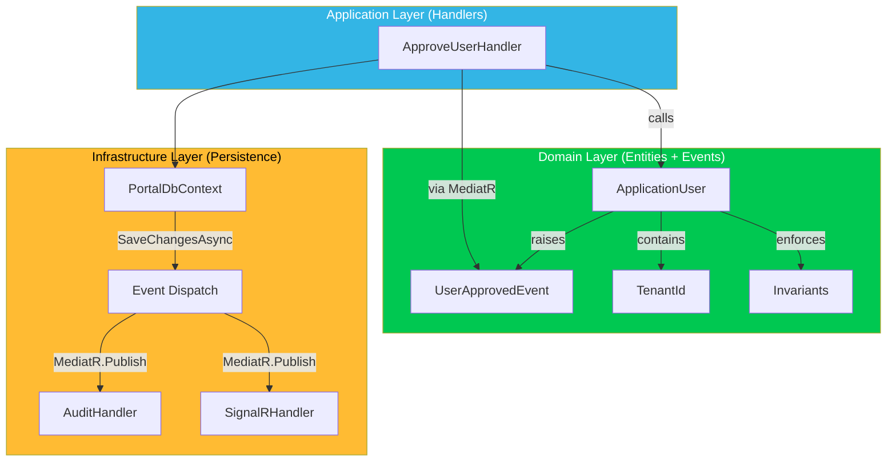

## Table of Contents

[🧠 **View Interactive Mindmap**](./ddd-domain-modeling-mindmap.md)

1. [TL;DR](#tldr)
2. [Deep Dive](#deep-dive)
   2.1 [Core Building Blocks](#concept-group-1-core-building-blocks)
      2.1.1 [Entities vs Value Objects](#1-entities-vs-value-objects)
      2.1.2 [Aggregates & Aggregate Roots](#2-aggregates--aggregate-roots)
      2.1.3 [Strongly-Typed IDs](#3-strongly-typed-ids)
   2.2 [Domain Behavior](#concept-group-2-domain-behavior)
      2.2.1 [Rich vs Anemic Domain Model](#4-rich-vs-anemic-domain-model)
      2.2.2 [State Machines in Entities](#5-state-machines-in-entities)
      2.2.3 [Invariant Enforcement](#6-invariant-enforcement)
   2.3 [Domain Events](#concept-group-3-domain-events)
      2.3.1 [Event Lifecycle & Pre-Save Dispatch](#7-event-lifecycle--pre-save-dispatch)
      2.3.2 [Notification Handlers & Side Effects](#8-notification-handlers--side-effects)
      2.3.3 [Event Hierarchy & Design](#9-event-hierarchy--design)
   2.4 [Strategic DDD](#concept-group-4-strategic-ddd)
      2.4.1 [Bounded Contexts & Context Mapping](#10-bounded-contexts--context-mapping)
      2.4.2 [Module Boundaries in a Monolith](#11-module-boundaries-in-a-monolith)
3. [Architecture & Data Flow](#architecture--data-flow)
4. [Real-World Examples](#real-world-examples)
   4.1 [Rich Domain Entity — ApplicationUser](#1-rich-domain-entity--applicationuser)
   4.2 [Value Object — TenantId](#2-value-object--tenantid)
   4.3 [Domain Event Raised from Entity](#3-domain-event-raised-from-entity)
5. [Comparison Tables](#comparison-tables)
6. [Interview Q&A](#interview-qa)
   6.1 [L1: Junior](#l1-junior-knowledge)
   6.2 [L2: Mid-Level](#l2-mid-level-knowledge)
   6.3 [L3: Senior](#l3-senior-knowledge)
   6.4 [Staff](#staff-system-architecture)
7. [Cross-References](#cross-references)
8. [Further Reading](#further-reading)

---

## TL;DR

Domain-Driven Design (DDD) models business rules as first-class code in the domain layer rather than scattering logic across controllers and services. In tai-portal, the domain uses <span style="color: #33b5e5; font-weight: bold;">Rich Entities</span> (like `ApplicationUser`) that enforce their own invariants — a user cannot be created with an empty `TenantId`, emails are normalized on assignment, and status transitions follow a state machine. <span style="color: #33b5e5; font-weight: bold;">Value Objects</span> (like `TenantId`, `Email`) provide type safety and encapsulate validation. <span style="color: #33b5e5; font-weight: bold;">Domain Events</span> are raised by entities and dispatched inside `SaveChangesAsync` through MediatR, keeping side effects (audit logging, SignalR push, message bus publish) within the same database transaction. <span style="color: #ffbb33; font-weight: bold;">The key trade-off</span>: DDD adds upfront complexity (more types, more indirection) that only pays off when the business rules are complex enough to justify it — CRUD-heavy domains don't benefit.

---

## Deep Dive

### Concept Group 1: Core Building Blocks

#### 1. Entities vs Value Objects

##### What
<span style="color: #33b5e5; font-weight: bold;">Entities</span> have a unique identity that persists across time — two `ApplicationUser` instances with the same name but different IDs are different users. <span style="color: #33b5e5; font-weight: bold;">Value Objects</span> are defined by their attributes, not identity — two `TenantId(Guid("abc"))` instances are equal if the GUID matches.

##### Why
Without this distinction, developers put all logic in "models" that are just property bags. Entities own their lifecycle and behavior. Value Objects prevent primitive obsession — passing `Guid tenantId` everywhere loses type safety, while `TenantId tenantId` makes the compiler enforce that you can't accidentally pass a `UserId` where a `TenantId` is expected.

##### How

```csharp
// Entity — has identity, mutable state, enforces invariants
public class ApplicationUser : IdentityUser<string>, IMultiTenantEntity {
    public TenantId TenantId { get; private set; }
    public UserStatus Status { get; private set; }

    public ApplicationUser(string userName, TenantId tenantId) {
        Guard.Against.NullOrEmpty(userName);
        Guard.Against.Default(tenantId.Value, message: "TenantId cannot be empty");
        TenantId = tenantId;
        Status = UserStatus.PendingVerification;
    }
}

// Value Object — no identity, immutable, structural equality
public readonly record struct TenantId(Guid Value) {
    public static explicit operator TenantId(Guid id) => new(id);
    public override string ToString() => Value.ToString();
}
```

##### When
Use **Entities** for things with a lifecycle (users, orders, tenants). Use **Value Objects** for descriptive attributes (addresses, money, IDs, email addresses). If two instances with the same properties are interchangeable, it's a Value Object.

##### Trade-offs
<span style="color: #ffbb33; font-weight: bold;">Value Objects add type proliferation</span> — every domain concept becomes its own type. In a small CRUD app this is overhead. In a complex domain with multiple ID types flowing through the system, the compiler catches bugs that unit tests would miss. <span style="color: #ff4444; font-weight: bold;">EF Core requires explicit configuration for Value Objects</span> — use `.HasConversion()` or `ValueConverter<TenantId, Guid>` to map them to database columns.

---

#### 2. Aggregates & Aggregate Roots

##### What
An <span style="color: #33b5e5; font-weight: bold;">Aggregate</span> is a cluster of entities and value objects treated as a single unit for data changes. The <span style="color: #33b5e5; font-weight: bold;">Aggregate Root</span> is the only entry point — external code cannot modify child entities directly; all changes go through the root.

##### Why
Without aggregates, any code can modify any entity, leading to inconsistent state. If an `Order` has `OrderLines`, and a service modifies an `OrderLine` quantity without recalculating the `Order` total, the data becomes inconsistent. The Aggregate Root ensures all invariants are checked on every change.

##### How

```csharp
// Aggregate Root — controls access to child entities
public class Tenant : BaseEntity, IAggregateRoot {
    private readonly List<TenantSetting> _settings = new();
    public IReadOnlyCollection<TenantSetting> Settings => _settings.AsReadOnly();

    public void UpdateSetting(string key, string value) {
        var setting = _settings.FirstOrDefault(s => s.Key == key);
        if (setting is null) {
            _settings.Add(new TenantSetting(Id, key, value));
        } else {
            setting.Update(value);  // Child modification through root
        }
        AddDomainEvent(new TenantSettingChangedEvent(Id, key, value));
    }
}
```

##### When
Design aggregates around <span style="color: #00C851; font-weight: bold;">transactional consistency boundaries</span> — everything that must be consistent within a single database transaction belongs in one aggregate. Keep aggregates small: reference other aggregates by ID, not by navigation property. In tai-portal, `ApplicationUser` is an aggregate root; `Tenant` is an aggregate root with `TenantSetting` children.

##### Trade-offs
<span style="color: #ffbb33; font-weight: bold;">Cross-aggregate operations require eventual consistency</span> — if creating a user also needs to update a tenant's user count, you either: (a) do it in the same transaction (coupling aggregates), or (b) use a domain event to update the count asynchronously. <span style="color: #ff4444; font-weight: bold;">Over-engineering aggregates</span> by including too many entities makes them slow to load and hard to modify concurrently.

---

#### 3. Strongly-Typed IDs

##### What
<span style="color: #33b5e5; font-weight: bold;">Strongly-typed IDs</span> wrap primitive identifiers (`Guid`, `int`, `string`) in domain-specific types so the compiler prevents mixing up different ID types.

##### Why
Without strongly-typed IDs, `DeleteUser(Guid userId)` happily accepts a `tenantId` — a bug that compiles, passes unit tests (if they use random GUIDs), and causes data corruption in production. With `DeleteUser(UserId userId)`, the compiler catches the mistake.

##### How

```csharp
// C# record struct — zero-cost abstraction after JIT inlining
public readonly record struct TenantId(Guid Value);
public readonly record struct UserId(string Value);

// Usage — compiler prevents mixing
public async Task<ApplicationUser> GetUserAsync(UserId userId, TenantId tenantId) {
    return await _context.Users
        .Where(u => u.Id == userId.Value && u.TenantId == tenantId)
        .FirstOrDefaultAsync();
}

// EF Core configuration
builder.Property(x => x.TenantId)
    .HasConversion(v => v.Value, v => new TenantId(v))
    .HasColumnName("TenantId");
```

##### When
Use strongly-typed IDs for all domain identifiers that cross method or layer boundaries. Skip them for internal-only IDs that never leave a single method.

##### Trade-offs
<span style="color: #ffbb33; font-weight: bold;">Serialization requires extra configuration</span> — JSON serializers, Swagger/OpenAPI, and EF Core all need converters or type mappings. Libraries like `StronglyTypedId` (Andrew Lock) or `Vogen` auto-generate converters, JSON factories, and EF Core value converters from a `[StronglyTypedId]` attribute.

---

### Concept Group 2: Domain Behavior

#### 4. Rich vs Anemic Domain Model

##### What
A <span style="color: #33b5e5; font-weight: bold;">Rich Domain Model</span> places business logic inside entities — `user.Approve()` validates status transitions, raises events, and enforces invariants. An <span style="color: #ff4444; font-weight: bold;">Anemic Domain Model</span> puts entities as property bags with all logic in services — `userService.Approve(user)` does everything externally.

##### Why
Anemic models scatter business rules across services, making them hard to find and easy to bypass. If three different services can set `user.Status = Active`, any of them might skip the required OTP verification check. A rich entity guarantees the rule is enforced everywhere: `user.Approve()` is the only way to transition to `Active`.

##### How

```csharp
// Rich Model — behavior lives in the entity
public class ApplicationUser {
    public void Approve(string approvedBy) {
        if (Status != UserStatus.PendingApproval)
            throw new InvalidOperationException(
                $"Cannot approve user in {Status} state");

        Status = UserStatus.Active;
        ApprovedBy = approvedBy;
        ApprovedAt = DateTimeOffset.UtcNow;
        AddDomainEvent(new UserApprovedEvent(Id, TenantId, approvedBy));
    }
}

// vs Anemic Model — behavior scattered in services
public class UserService {
    public void Approve(ApplicationUser user, string approvedBy) {
        user.Status = UserStatus.Active;  // No validation!
        user.ApprovedBy = approvedBy;
    }
}
```

##### When
Use a rich model when business rules are complex, have multiple state transitions, or need to be enforced consistently. <span style="color: #00C851; font-weight: bold;">In tai-portal, all entities that participate in the onboarding workflow use rich behavior</span> — `ApplicationUser.Approve()`, `ApplicationUser.VerifyOtp()`, etc. Use an anemic model for simple CRUD entities with no business rules (lookup tables, configuration records).

##### Trade-offs
<span style="color: #ffbb33; font-weight: bold;">Rich entities are harder to test in isolation when they have deep dependency chains.</span> Keep entities dependency-free — they should never inject services. If an entity needs external data (e.g., checking uniqueness), pass it as a parameter: `user.Register(IEmailUniquenessChecker checker)` or use a Domain Service.

---

#### 5. State Machines in Entities

##### What
A <span style="color: #33b5e5; font-weight: bold;">state machine</span> defines which state transitions are valid for an entity. `ApplicationUser` in tai-portal has states: `PendingVerification → PendingApproval → Active → Suspended → Deactivated`. Each transition method validates the current state and raises a domain event.

##### Why
Without explicit state machines, invalid transitions happen silently — setting `user.Status = Active` skips the verification step. State machines make the business workflow visible in code and reject illegal transitions with clear error messages.

##### How

```csharp
public enum UserStatus {
    PendingVerification,
    PendingApproval,
    Active,
    Suspended,
    Deactivated
}

public class ApplicationUser {
    public void VerifyOtp() {
        EnsureStatus(UserStatus.PendingVerification);
        Status = UserStatus.PendingApproval;
        AddDomainEvent(new UserVerifiedEvent(Id, TenantId));
    }

    public void Approve(string approvedBy) {
        EnsureStatus(UserStatus.PendingApproval);
        Status = UserStatus.Active;
        AddDomainEvent(new UserApprovedEvent(Id, TenantId, approvedBy));
    }

    public void Suspend(string reason) {
        EnsureStatus(UserStatus.Active);
        Status = UserStatus.Suspended;
        AddDomainEvent(new UserSuspendedEvent(Id, TenantId, reason));
    }

    private void EnsureStatus(UserStatus expected) {
        if (Status != expected)
            throw new InvalidOperationException(
                $"Expected {expected}, but user is in {Status}");
    }
}
```

##### When
Use state machines for entities with 3+ states and business rules governing transitions. For simple two-state toggles (active/inactive), a boolean suffices. For complex workflows with parallel states or sub-states, consider a dedicated state machine library (Stateless for .NET).

##### Trade-offs
<span style="color: #ffbb33; font-weight: bold;">State machines make it harder to "fix data" manually</span> — you can't just UPDATE the status column without triggering the transition logic. Provide an explicit `ForceStatus()` method gated behind admin authorization for operational overrides. <span style="color: #ff4444; font-weight: bold;">Missing transitions are invisible</span> — if you forget to add `Reactivate()`, the entity is permanently stuck in `Deactivated`.

---

#### 6. Invariant Enforcement

##### What
<span style="color: #33b5e5; font-weight: bold;">Invariants</span> are business rules that must always be true for an entity. They're enforced in constructors (creation invariants) and mutation methods (transition invariants). In tai-portal: "a user always has a non-empty TenantId" and "email is always lowercase" are invariants.

##### Why
Without invariant enforcement, invalid data enters the system and causes downstream failures — a null TenantId bypasses the global query filter, leaking data across tenants. Enforcing invariants at the entity level means the invalid state is impossible, not just unlikely.

##### How

```csharp
public class ApplicationUser {
    // Creation invariant — enforced in constructor
    public ApplicationUser(string userName, TenantId tenantId) {
        Guard.Against.NullOrEmpty(userName, nameof(userName));
        Guard.Against.Default(tenantId.Value, message: "TenantId cannot be empty");
        TenantId = tenantId;
    }

    // Mutation invariant — enforced on property set
    private string _email = null!;
    public string Email {
        get => _email;
        set => _email = value?.Trim().ToLowerInvariant()
            ?? throw new ArgumentNullException(nameof(Email));
    }
}
```

##### When
Enforce invariants for rules that would cause security or data integrity issues if violated. <span style="color: #00C851; font-weight: bold;">Use Ardalis.GuardClauses for concise constructor validation.</span> Don't enforce subjective business rules (e.g., "email must be a corporate domain") in invariants — those belong in validation pipeline behaviors that can return user-friendly errors.

##### Trade-offs
<span style="color: #ff4444; font-weight: bold;">Throwing exceptions for invalid state makes bulk operations painful</span> — importing 1000 users where one has a bad TenantId kills the entire batch. For bulk operations, use a validation-first approach (validate all, then create) rather than relying on entity exceptions. <span style="color: #ffbb33; font-weight: bold;">EF Core's parameterless constructor requirement</span> means you need a `private ApplicationUser() { }` for materialization, which bypasses constructor invariants — trust EF Core to only call this with valid database data.

---

### Concept Group 3: Domain Events

#### 7. Event Lifecycle & Pre-Save Dispatch

##### What
<span style="color: #33b5e5; font-weight: bold;">Domain Events</span> are dispatched <span style="color: #00C851; font-weight: bold;">inside `SaveChangesAsync`</span> — after EF Core detects changes but before the transaction commits. This means all event handlers participate in the same database transaction. If any handler fails, the entire operation rolls back.

##### Why
Without pre-save dispatch, events fire after the commit — if the "send welcome email" handler fails, the user is created but never notified, and there's no automatic retry. Pre-save dispatch guarantees atomicity: either the user is created AND all side effects succeed, or nothing happens.

##### How

```csharp
// In PortalDbContext.SaveChangesAsync
public override async Task<int> SaveChangesAsync(CancellationToken ct = default) {
    // 1. Collect events from all tracked entities
    var entities = ChangeTracker.Entries<BaseEntity>()
        .Where(e => e.Entity.DomainEvents.Any())
        .Select(e => e.Entity)
        .ToList();

    var events = entities.SelectMany(e => e.DomainEvents).ToList();

    // 2. Clear events to prevent re-dispatch on recursive save
    entities.ForEach(e => e.ClearDomainEvents());

    // 3. Publish each event through MediatR (still inside transaction)
    foreach (var domainEvent in events) {
        await _mediator.Publish(domainEvent, ct);
    }

    // 4. Commit — if any handler threw, this line is never reached
    return await base.SaveChangesAsync(ct);
}
```

##### When
Use pre-save dispatch for side effects that must be consistent with the domain change (audit logs, status updates, tenant-scoped counters). Use post-save dispatch (or an outbox pattern) for side effects that can tolerate eventual consistency (email notifications, external API calls).

##### Trade-offs
<span style="color: #ff4444; font-weight: bold;">Pre-save dispatch extends the transaction duration</span> — a slow notification handler blocks the entire save. Keep handlers fast; defer expensive work to background jobs. <span style="color: #ffbb33; font-weight: bold;">Recursive event dispatch</span> can occur if a handler modifies another entity that raises its own events — tai-portal prevents this by clearing events before dispatch.

---

#### 8. Notification Handlers & Side Effects

##### What
<span style="color: #33b5e5; font-weight: bold;">Notification handlers</span> are MediatR `INotificationHandler<TEvent>` implementations that react to domain events. Multiple handlers can subscribe to the same event — a `UserApprovedEvent` might trigger: (1) an audit log write, (2) a SignalR notification push, and (3) a welcome email queue.

##### Why
Without notification handlers, the `Approve()` handler would need to know about audit logging, SignalR, and email — violating Single Responsibility Principle and creating tight coupling. Domain events decouple the "what happened" from the "what should happen next."

##### How

```csharp
// Handler 1: Audit logging
public class AuditUserApproved : INotificationHandler<UserApprovedEvent> {
    public async Task Handle(UserApprovedEvent e, CancellationToken ct) {
        await _auditService.LogAsync(new AuditEntry {
            Action = "UserApproved",
            EntityId = e.UserId,
            TenantId = e.TenantId,
            PerformedBy = e.ApprovedBy
        });
    }
}

// Handler 2: Real-time notification
public class NotifyUserApproved : INotificationHandler<UserApprovedEvent> {
    public async Task Handle(UserApprovedEvent e, CancellationToken ct) {
        await _hubContext.Clients.Group($"tenant-{e.TenantId}")
            .SendAsync("UserStatusChanged", e.UserId, "Active", ct);
    }
}
```

##### When
Use notification handlers for cross-cutting side effects that should be decoupled from the core business logic. <span style="color: #00C851; font-weight: bold;">Name handlers by what they do, not what triggers them</span> — `AuditUserApproved` is clearer than `UserApprovedHandler1`.

##### Trade-offs
<span style="color: #ffbb33; font-weight: bold;">Handler execution order is non-deterministic</span> in MediatR — don't rely on one handler running before another. If ordering matters, use a single handler that orchestrates steps explicitly. <span style="color: #ff4444; font-weight: bold;">Hidden side effects</span> — when reading `user.Approve()`, it's not obvious that 3 notification handlers will fire. Document event subscribers in the cross-references section of each note.

---

#### 9. Event Hierarchy & Design

##### What
Domain events should form a <span style="color: #33b5e5; font-weight: bold;">hierarchy</span> rooted in a `BaseEvent` or marker interface. In tai-portal, all domain events implement `INotification` (MediatR) and carry the entity ID + tenant ID for audit traceability.

##### Why
Without a hierarchy, each event reinvents metadata (who, when, which tenant). A base event class provides consistent: `OccurredAt`, `TenantId`, `TriggeredBy` fields that audit logging can consume generically.

##### How

```csharp
// Base event with standard metadata
public abstract record DomainEvent : INotification {
    public DateTimeOffset OccurredAt { get; init; } = DateTimeOffset.UtcNow;
}

// Specific events carry domain-specific data
public record UserApprovedEvent(
    string UserId,
    TenantId TenantId,
    string ApprovedBy
) : DomainEvent;

public record UserVerifiedEvent(
    string UserId,
    TenantId TenantId
) : DomainEvent;

// Entity raises events through base class method
public abstract class BaseEntity {
    private readonly List<DomainEvent> _domainEvents = new();
    public IReadOnlyCollection<DomainEvent> DomainEvents => _domainEvents.AsReadOnly();

    protected void AddDomainEvent(DomainEvent e) => _domainEvents.Add(e);
    public void ClearDomainEvents() => _domainEvents.Clear();
}
```

##### When
Design events as **immutable records** (C# `record`) — they represent facts that happened and should never be modified. Use past tense for event names: `UserApproved`, not `ApproveUser`. Include only the data that handlers need, not the entire entity.

##### Trade-offs
<span style="color: #ffbb33; font-weight: bold;">Event granularity is a design decision</span> — too coarse (`UserChanged`) forces handlers to inspect what changed; too fine (`UserEmailChanged`, `UserNameChanged`, `UserStatusChanged`) creates an explosion of event types. <span style="color: #00C851; font-weight: bold;">In tai-portal, events correspond to business actions</span> (`UserApproved`, `UserVerified`) rather than property changes.

---

### Concept Group 4: Strategic DDD

#### 10. Bounded Contexts & Context Mapping

##### What
A <span style="color: #33b5e5; font-weight: bold;">Bounded Context</span> is a boundary within which a domain model is consistent and a term has one meaning. "User" in the Identity context means authentication credentials; "User" in the Billing context means a billable account. <span style="color: #33b5e5; font-weight: bold;">Context Mapping</span> defines how contexts communicate.

##### Why
Without bounded contexts, a single `User` class tries to serve authentication, billing, permissions, and profile — becoming a 2000-line god object with conflicting requirements. Bounded contexts let each team define the model that best serves their needs.

##### How

```
tai-portal Bounded Contexts:

┌─────────────┐     ┌──────────────┐     ┌───────────────┐
│  Identity    │     │  Onboarding  │     │  Admin        │
│  Context     │────▶│  Context     │────▶│  Context      │
│              │     │              │     │               │
│  User (auth) │     │  User (reg)  │     │  User (mgmt)  │
│  Credential  │     │  OTP         │     │  Privilege    │
│  Session     │     │  Approval    │     │  AuditLog     │
└─────────────┘     └──────────────┘     └───────────────┘
        │                                        │
        └────── Shared Kernel: TenantId ─────────┘
```

Context Mapping patterns:
- **Shared Kernel** — `TenantId`, `UserId` are shared value objects used by all contexts
- **Anti-Corruption Layer (ACL)** — The Onboarding context translates Identity's `ApplicationUser` into its own `OnboardingCandidate` DTO
- **Published Language** — Domain events (`UserApprovedEvent`) are the contract between contexts

##### When
Define bounded contexts when different parts of the system use the same word differently, or when a single model becomes too large to maintain. In a monolith like tai-portal, bounded contexts map to Nx library boundaries. In microservices, each context becomes a service.

##### Trade-offs
<span style="color: #ffbb33; font-weight: bold;">Context boundaries create data duplication</span> — each context may store its own projection of a "User." This is intentional: each context stores only what it needs. <span style="color: #ff4444; font-weight: bold;">Over-splitting contexts in a small team</span> creates unnecessary inter-context communication overhead. Start with a modular monolith and extract contexts as the team grows.

---

#### 11. Module Boundaries in a Monolith

##### What
In a <span style="color: #33b5e5; font-weight: bold;">modular monolith</span>, bounded contexts are enforced through project/library boundaries rather than network calls. In tai-portal's Nx monorepo, each context is a separate library with explicit dependency rules.

##### Why
Without enforced module boundaries, developers shortcut across contexts — importing an entity directly from another context's internal namespace. Nx's `@nx/enforce-module-boundaries` lint rule prevents this at build time.

##### How

```
tai-portal Nx library structure:

libs/
├── core/
│   ├── domain/           # Entities, Value Objects, Events (shared kernel)
│   ├── application/      # Use cases (handlers, validators)
│   └── infrastructure/   # EF Core, external services
├── identity/
│   ├── domain/           # Identity-specific entities
│   └── application/      # Identity use cases
├── onboarding/
│   ├── domain/           # Onboarding-specific entities
│   └── application/      # Onboarding use cases
└── ui/
    └── design-system/    # Shared Angular components
```

Nx tags enforce boundaries:
```json
// nx.json — project tags
{ "tags": ["scope:core", "type:domain"] }
{ "tags": ["scope:identity", "type:application"] }

// .eslintrc — boundary rules
"@nx/enforce-module-boundaries": [{
  "depConstraints": [
    { "sourceTag": "type:domain", "onlyDependOnLibsWithTags": ["type:domain"] },
    { "sourceTag": "type:application", "onlyDependOnLibsWithTags": ["type:domain", "type:application"] }
  ]
}]
```

##### When
Use module boundaries from day one — they're cheap to set up and expensive to retrofit. Even in a 2-person team, boundaries prevent accidental coupling that becomes painful when splitting into services later.

##### Trade-offs
<span style="color: #ffbb33; font-weight: bold;">Strict boundaries slow down prototyping</span> — you can't just import whatever you need. <span style="color: #00C851; font-weight: bold;">This friction is a feature</span> — it forces you to define explicit contracts (interfaces, DTOs, events) between contexts, which is exactly what you need for a clean architecture.

---

### Architecture & Data Flow



---

## Real-World Examples

### 1. Rich Domain Entity — ApplicationUser

📍 From tai-portal: `libs/core/domain/Entities/ApplicationUser.cs`

The `ApplicationUser` entity demonstrates rich behavior: constructor invariants, email normalization, state machine transitions, and domain event raising.

```csharp
public class ApplicationUser : IdentityUser<string>, IMultiTenantEntity {
    public TenantId TenantId { get; private set; }
    public UserStatus Status { get; private set; }
    public string? ApprovedBy { get; private set; }
    public DateTimeOffset? ApprovedAt { get; private set; }

    public ApplicationUser(string userName, TenantId tenantId) {
        Guard.Against.NullOrEmpty(userName);
        Guard.Against.Default(tenantId.Value, message: "TenantId cannot be empty");
        TenantId = tenantId;
        Status = UserStatus.PendingVerification;
    }

    private string _email = null!;
    public override string Email {
        get => _email;
        set => _email = value?.Trim().ToLowerInvariant()
            ?? throw new ArgumentNullException(nameof(Email));
    }

    public void Approve(string approvedBy) {
        if (Status != UserStatus.PendingApproval)
            throw new InvalidOperationException($"Cannot approve user in {Status} state");
        Status = UserStatus.Active;
        ApprovedBy = approvedBy;
        ApprovedAt = DateTimeOffset.UtcNow;
        AddDomainEvent(new UserApprovedEvent(Id, TenantId, approvedBy));
    }
}
```

---

### 2. Value Object — TenantId

📍 From tai-portal: `libs/core/domain/ValueObjects/TenantId.cs`

A strongly-typed ID that wraps `Guid`, providing type safety and preventing accidental misuse of IDs.

```csharp
public readonly record struct TenantId(Guid Value) {
    public static explicit operator TenantId(Guid id) => new(id);
    public override string ToString() => Value.ToString();
}

// EF Core value converter
public class TenantIdConverter : ValueConverter<TenantId, Guid> {
    public TenantIdConverter() : base(v => v.Value, v => new TenantId(v)) { }
}
```

---

### 3. Domain Event Raised from Entity

🔧 Fits tai-portal: Shows how entity state changes produce events consumed by notification handlers.

```csharp
// In the handler
var user = await _userManager.FindByIdAsync(command.UserId);
user.Approve(command.ApprovedBy);  // Raises UserApprovedEvent internally
await _context.SaveChangesAsync(ct);
// SaveChangesAsync dispatches UserApprovedEvent → AuditHandler, SignalRHandler
```

---

## Comparison Tables

### Rich vs Anemic Domain Model

| Dimension | **Rich Domain Model** | **Anemic Domain Model** |
|-----------|----------------------|------------------------|
| **Logic location** | Inside entities | In service classes |
| **Invariant enforcement** | <span style="color: #00C851; font-weight: bold;">Guaranteed — impossible to bypass</span> | <span style="color: #ff4444; font-weight: bold;">Depends on callers using the right service</span> |
| **Testability** | Test entity behavior directly | Test services (more mocking) |
| **Discoverability** | `user.Approve()` — obvious | `userService.Approve(user)` — must know which service |
| **Complexity** | Higher upfront design effort | Lower — just add properties |
| **Best for** | Complex business rules, workflows | Simple CRUD, data-centric apps |
| **tai-portal choice** | <span style="color: #00C851; font-weight: bold;">Rich model for onboarding workflow</span> | Anemic for configuration entities |

### Entity vs Value Object vs DTO

| Dimension | **Entity** | **Value Object** | **DTO** |
|-----------|-----------|-----------------|---------|
| **Has identity** | Yes (ID) | No (structural equality) | No |
| **Mutable** | Yes (controlled) | Immutable | Immutable (record) |
| **Contains logic** | Business behavior | Validation only | None — pure data carrier |
| **Persisted** | Yes (own table/row) | Yes (owned type / column) | No (in-memory transfer) |
| **Example** | `ApplicationUser` | `TenantId`, `Email` | `UserDto`, `GetUsersResponse` |

---

## Interview Q&A

### L1: Junior Knowledge

#### L1: What is the difference between an Entity and a Value Object?
**Difficulty:** L1 (Junior)

**Question:** What is the difference between an Entity and a Value Object in DDD?

**Answer:** An <span style="color: #33b5e5; font-weight: bold;">Entity</span> has a unique identity — two users with the same name but different IDs are different objects. A <span style="color: #33b5e5; font-weight: bold;">Value Object</span> is defined by its attributes — two `TenantId(guid)` instances with the same GUID are interchangeable. Entities are mutable (controlled state changes); Value Objects are immutable.

---

#### L1: What is an Aggregate Root?
**Difficulty:** L1 (Junior)

**Question:** What is an Aggregate Root and why does it matter?

**Answer:** An <span style="color: #33b5e5; font-weight: bold;">Aggregate Root</span> is the only entry point for modifying a cluster of related entities. External code can't modify child entities directly — all changes go through the root, which enforces invariants. This prevents inconsistent state when multiple entities must change together.

---

### L2: Mid-Level Knowledge

#### L2: Rich vs Anemic Domain Model
**Difficulty:** L2 (Mid-Level)

**Question:** Compare rich and anemic domain models. When would you choose each?

**Answer:** A <span style="color: #00C851; font-weight: bold;">rich model</span> puts business logic in entities: `user.Approve()` validates the state transition, raises events, and enforces invariants in one place. An anemic model uses property-bag entities with logic in services. Rich models are better when business rules are complex (state machines, multi-step workflows) because they guarantee invariants are enforced everywhere. <span style="color: #ffbb33; font-weight: bold;">Anemic models are fine for simple CRUD</span> — adding DDD ceremony to a settings table is over-engineering. In tai-portal, the onboarding workflow uses a rich model (5 status transitions, domain events), while configuration entities are simple property bags.

---

### L3: Senior Knowledge

#### L3: Pre-Save Domain Event Dispatch
**Difficulty:** L3 (Senior)

**Question:** Explain how domain events are dispatched in `SaveChangesAsync` and the transactional guarantees this provides.

**Answer:** In tai-portal, `SaveChangesAsync` is overridden in `PortalDbContext` to: (1) collect all `DomainEvents` from tracked entities, (2) clear the event lists to prevent recursive dispatch, (3) publish each event via `_mediator.Publish()`, (4) call `base.SaveChangesAsync()`. Because this happens within the same database transaction, <span style="color: #00C851; font-weight: bold;">all notification handlers participate in the transaction</span> — if the audit log handler throws, the entire save rolls back, including the original entity change.

<span style="color: #ff4444; font-weight: bold;">The risk</span>: slow handlers extend the transaction, holding database locks. In tai-portal, in-process handlers (audit, SignalR push) are fast. For slow operations (email, external API), the handler publishes to a message queue (outbox pattern) instead of executing inline, keeping the transaction short. See **[[MediatR-CQRS]]** for the full dispatch mechanism and **[[Message-Queues]]** for the outbox pattern.

---

#### L3: Designing Aggregate Boundaries
**Difficulty:** L3 (Senior)

**Question:** How do you decide what belongs in an aggregate vs a separate aggregate referenced by ID?

**Answer:** The rule is: <span style="color: #00C851; font-weight: bold;">everything that must be transactionally consistent belongs in one aggregate</span>. If creating an `OrderLine` requires updating the `Order` total atomically, they're in the same aggregate. If updating a user's profile doesn't need to be transactionally consistent with the user's billing account, those are separate aggregates referenced by `UserId`.

Keep aggregates small — <span style="color: #ff4444; font-weight: bold;">large aggregates cause contention</span>. If two users concurrently modify different `OrderLines` in the same `Order` aggregate, one of them gets a concurrency conflict. The solution: make `OrderLine` its own aggregate if lines don't need to validate against the order total on every change. In tai-portal, `ApplicationUser` is a small aggregate (no child collections that other users modify), and `Tenant` aggregates its `TenantSettings` because settings must be consistent with the tenant's configuration.

---

### Staff: System Architecture

#### Staff: From Modular Monolith to Microservices
**Difficulty:** Staff

**Question:** Your modular monolith has grown to 6 bounded contexts with 15 developers. The Identity context is becoming a bottleneck. How do you extract it into a microservice using DDD principles?

**Answer:** Extraction follows the Strangler Fig pattern guided by bounded context boundaries:

1. **Verify the seam** — The Identity context should already communicate with other contexts only through domain events and shared value objects (`UserId`, `TenantId`). If it doesn't, refactor the monolith first — extracting a coupled context creates a distributed monolith.

2. **Define the Published Language** — The domain events (`UserApprovedEvent`, `UserVerifiedEvent`) become the contract. Replace MediatR in-process notification handlers with message bus consumers (RabbitMQ). The Outbox pattern in `SaveChangesAsync` publishes events to the outbox table instead of dispatching in-process.

3. **Extract data** — Give the Identity service its own PostgreSQL schema (or database). The shared `TenantId` value object remains the same type in both services. Other contexts keep read projections of user data, updated via events.

4. **Anti-Corruption Layer** — Other contexts that previously queried Identity's `ApplicationUser` directly now call the Identity API through an ACL that maps the API response to their local model.

<span style="color: #ff4444; font-weight: bold;">Common mistake</span>: extracting before enforcing module boundaries. If the monolith has cross-context database joins, you'll need to rewrite those as API calls — much harder than preventing the coupling in the first place. <span style="color: #00C851; font-weight: bold;">Nx's enforce-module-boundaries rule catches this early.</span>

---

## Cross-References

- [[MediatR-CQRS]] — Domain events are dispatched through MediatR's `INotification` / `INotificationHandler`. The full dispatch lifecycle, pipeline behaviors, and handler conventions.
- [[EFCore-SQL]] — `SaveChangesAsync` override for event dispatch, `HasConversion()` for value objects, global query filters use `TenantId` value object.
- [[Design-Patterns]] — DDD builds on Repository, Factory, and Strategy patterns. Clean Architecture layers align with DDD's domain/application/infrastructure layers.
- [[System-Design]] — Multi-tenancy strategy uses `TenantId` value object. Module boundaries enforced by Nx correspond to bounded contexts.
- [[Testing-Backend]] — Domain unit tests verify entity invariants and state machine transitions with no infrastructure dependencies.

---

## Further Reading

- [Domain-Driven Design Reference (Eric Evans)](https://www.domainlanguage.com/ddd/reference/)
- [Implementing DDD in .NET (Microsoft)](https://learn.microsoft.com/en-us/dotnet/architecture/microservices/microservice-ddd-cqrs-patterns/)
- [Ardalis.GuardClauses](https://github.com/ardalis/GuardClauses)
- [StronglyTypedId (Andrew Lock)](https://github.com/andrewlock/StronglyTypedId)
- Source: `libs/core/domain/Entities/` — Rich domain entities
- Source: `libs/core/domain/ValueObjects/` — Strongly-typed IDs and value objects
- Source: `libs/core/domain/Events/` — Domain event hierarchy

---

*Last updated: 2026-04-10*
