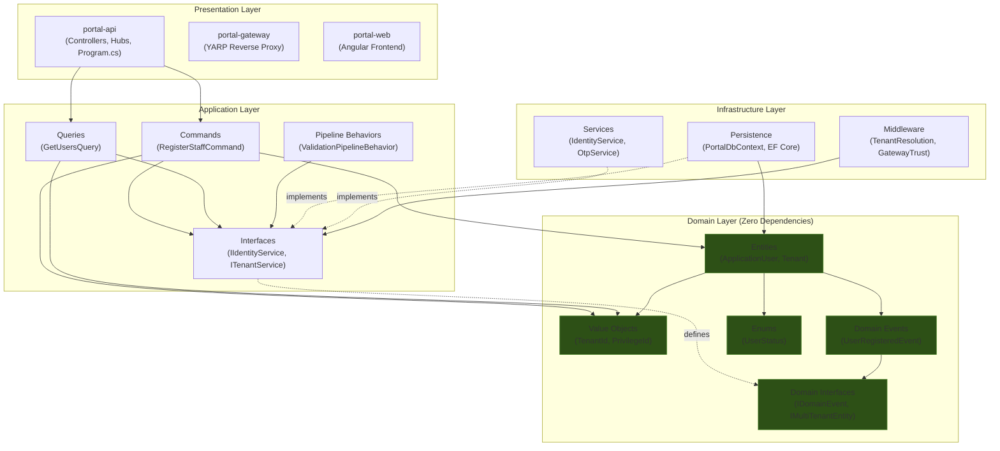
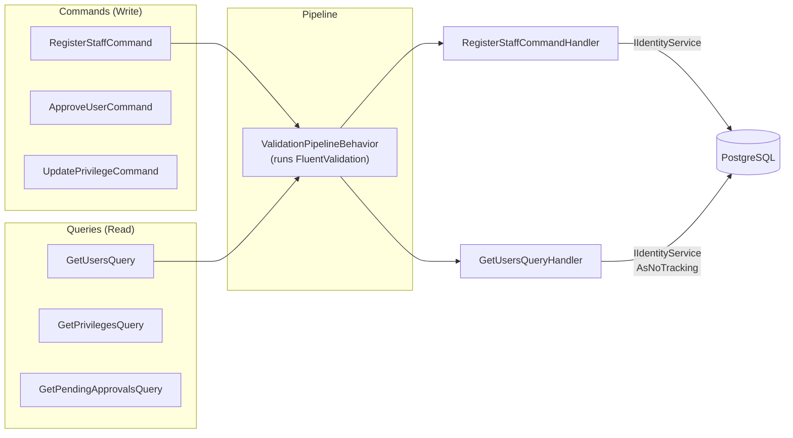
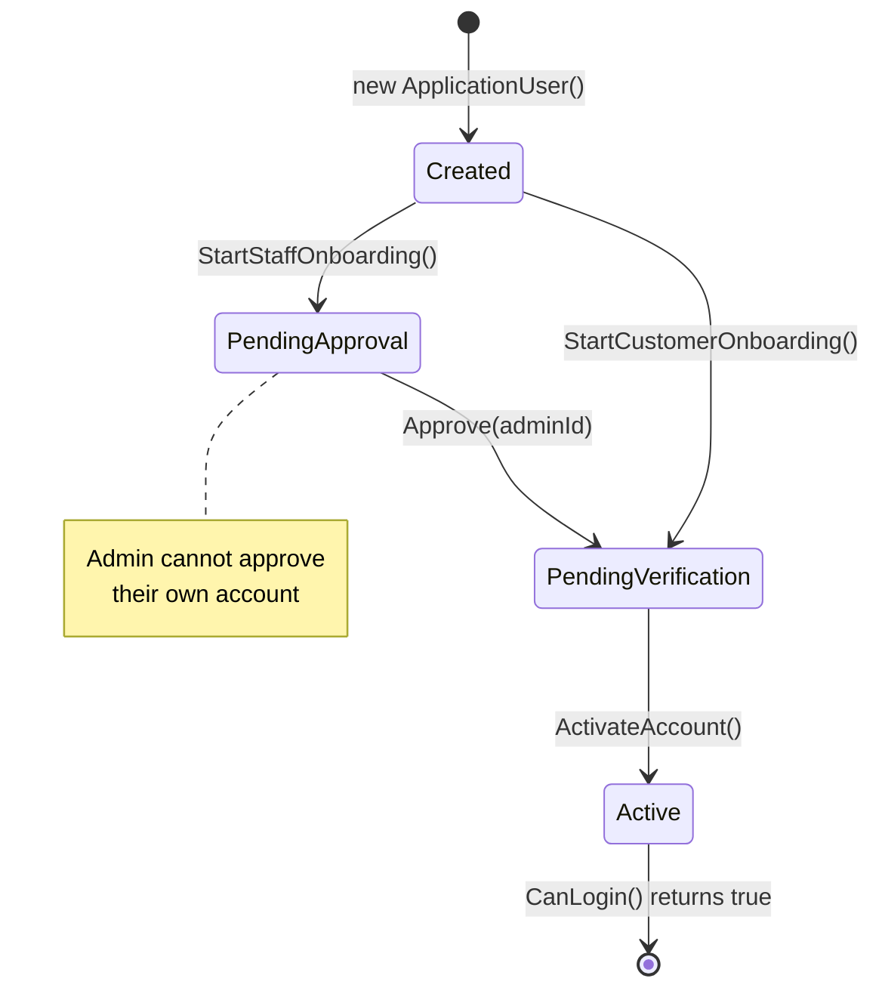
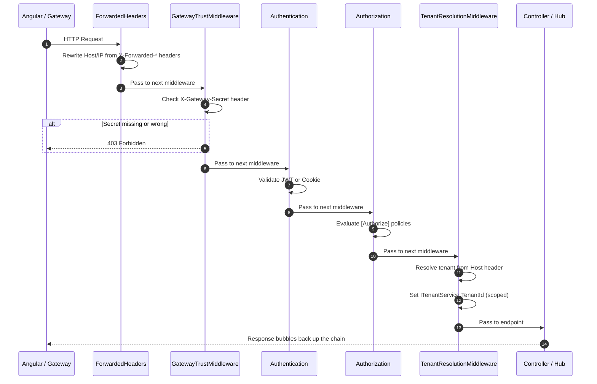
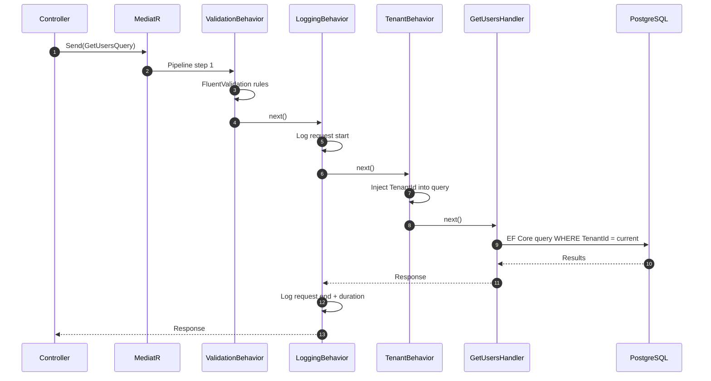
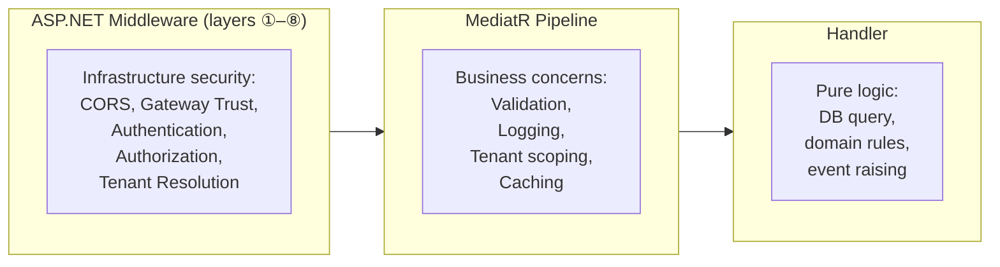
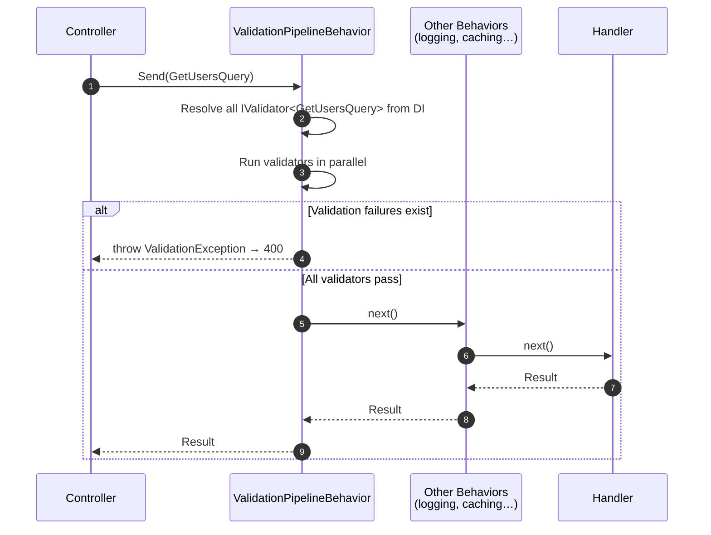

## TL;DR

Design patterns are proven, reusable solutions to recurring software engineering problems. In modern C# 14 and .NET 10, many classic "Gang of Four" patterns are built directly into the framework — Singleton via DI, Observer via RxJS/Signals/SignalR, Strategy via Switch Expressions. The `tai-portal` architecture is built on three foundational patterns: **Clean Architecture** (dependencies point inward toward a zero-dependency Domain layer), **CQRS via MediatR** (every operation is either a Command or a Query — never both), and **Decorator via Pipeline Behaviors** (cross-cutting concerns like validation wrap every request without modifying any handler). Understanding how these patterns compose is what separates "I know patterns" from "I architect systems."

## Deep Dive

### Concept Overview

#### 1. Creational Patterns — Singleton, Builder, Factory
- **What:** Patterns that control *how* and *when* objects are created, abstracting away direct instantiation.
- **Why:** Uncontrolled object creation leads to duplicated resources (multiple DB connections), tight coupling (hard-coded `new`), and configuration sprawl. Creational patterns centralize this logic.
- **How:**
  - **Singleton:** In .NET 10, hand-rolling `private static instance` with double-checked locking is an anti-pattern. The DI container provides thread-safe singletons natively: `builder.Services.AddSingleton<IRealTimeNotifier, SignalRRealTimeNotifier>()`. The container guarantees exactly one instance per application lifetime.
  - **Builder:** The `WebApplication.CreateBuilder(args)` pattern is .NET's flagship Builder. In Angular, `FormBuilder` constructs complex reactive forms step by step. The Builder pattern separates construction (which services, which config) from representation (the final `WebApplication`).
  - **Factory:** `Activator.CreateInstance(notificationType, domainEvent)` in `PortalDbContext.DispatchDomainEventsAsync()` is a runtime Factory — it creates `DomainEventNotification<T>` instances dynamically based on the event type, without the caller knowing the concrete class.
- **When:** Use Singleton for stateless shared services (caches, notifiers). Use Builder when object construction requires many optional steps. Use Factory when the concrete type is unknown at compile time.
- **Trade-offs:** Over-using Singleton creates hidden global state that's hard to test. Misusing Factory adds unnecessary indirection when a simple `new` would suffice. The DI container already solves most creational concerns — only reach for explicit patterns when the framework can't.

| Pattern | Anti-Pattern (Don't Do This) | Modern .NET Approach |
|---------|------------------------------|---------------------|
| Singleton | `private static readonly Instance = new()` | `AddSingleton<TInterface, TImpl>()` |
| Builder | Telescoping constructors with 10+ params | `WebApplication.CreateBuilder(args)` |
| Factory | Giant `switch` on string to create types | `Activator.CreateInstance()` or DI keyed services |

#### 2. Structural Patterns — Decorator, Facade, Marker Interface
- **What:** Patterns that compose objects and classes into larger structures while keeping them flexible.
- **Why:** Without structural patterns, adding cross-cutting behavior (logging, validation, caching) means modifying every class that needs it. Structural patterns let you *compose* behavior externally.
- **How:**
  - **Decorator (Middleware):** ASP.NET Core's entire HTTP pipeline is a Decorator chain. Each middleware wraps the next, running code before and after. In `tai-portal`, `GatewayTrustMiddleware` → `AuthenticationMiddleware` → `TenantResolutionMiddleware` each decorates the pipeline without knowing about each other.
  - **Decorator (Pipeline Behavior):** MediatR's `IPipelineBehavior<TRequest, TResponse>` decorates every command/query handler. `ValidationPipelineBehavior` runs FluentValidation rules *before* the handler executes, and could run audit logging *after* — all without modifying a single handler.
  - **Facade:** `IIdentityService` is a Facade over ASP.NET Identity's `UserManager`, `RoleManager`, `SignInManager`, and EF Core. Instead of handlers juggling 4 services, they call one method: `_identityService.CreateUserAsync(user, password)`.
  - **Marker Interface:** `IMultiTenantEntity` is a Marker Interface — it has a single property (`AssociatedTenantId`) but its real purpose is to *mark* entities for automatic Global Query Filter application via reflection at `OnModelCreating` time.
- **When:** Use Decorators for cross-cutting concerns that apply uniformly. Use Facades when a subsystem has grown too complex for consumers. Use Marker Interfaces when behavior is configured at startup via reflection.
- **Trade-offs:** Deep decorator chains (10+ middleware) become hard to debug because the execution flow bounces up and down the chain. Facades can become "God Services" if you don't split them by concern. Marker Interfaces can be abused — if the interface carries real behavior, use a proper abstraction instead.

#### 3. Behavioral Patterns — Mediator, Observer, State Machine, Strategy
- **What:** Patterns that manage communication, state transitions, and algorithmic variation between objects.
- **Why:** Without behavioral patterns, objects communicate directly, creating a web of dependencies. Behavioral patterns formalize these interactions so they can be understood, tested, and extended independently.
- **How:**
  - **Mediator (MediatR):** Instead of `UsersController` injecting `IIdentityService`, `IOtpService`, `IPrivilegeService`, `IMessageBus`, and `IRealTimeNotifier`, it injects a single `IMediator`. The controller sends `new RegisterStaffCommand(...)` and the mediator routes it to exactly one handler. This completely decouples the API layer from the Application layer.
  - **Observer (Domain Events):** `ApplicationUser` maintains a `_domainEvents` list. When `user.StartStaffOnboarding()` is called, it adds a `UserRegisteredEvent`. On `SaveChangesAsync()`, `PortalDbContext.DispatchDomainEventsAsync()` publishes these events via MediatR's `IPublisher`. Any number of handlers can react — sending emails, creating audit logs, pushing SignalR notifications — without the Domain knowing they exist.
  - **State Machine:** `ApplicationUser.Status` governs transitions: `Created` → `PendingApproval` → `PendingVerification` → `Active`. Each transition method (`StartStaffOnboarding()`, `Approve()`, `ActivateAccount()`) enforces preconditions and throws `InvalidOperationException` for illegal transitions. The domain object *is* the state machine.
  - **Strategy:** In modern C# 14, the Strategy pattern is often replaced by Switch Expressions with pattern matching or injected delegates (`Func<T>`), but the principle remains — encapsulate interchangeable algorithms behind a common interface.
- **When:** Use Mediator when controllers are becoming "fat" with injected services. Use Observer when a domain action should trigger multiple side effects without coupling. Use State Machine when an entity has strict lifecycle rules that must be enforced in the domain.
- **Trade-offs:** MediatR's indirection makes it harder to "Find All References" on a handler — you must search by the Command/Query type. Domain Events dispatched before `SaveChangesAsync()` join the same transaction (consistent but potentially slow); dispatching after is faster but risks inconsistency if handlers fail. State Machines in the entity prevent invalid states but make testing require you to walk through the full lifecycle.

#### 4. Architectural Patterns — Clean Architecture, CQRS, Repository

##### Clean Architecture (Onion Architecture)
- **What:** A layered system design where **dependencies point inward** toward the core Domain. The Domain layer has zero NuGet references. The Application layer depends on Domain. Infrastructure and Presentation depend on Application. The database is an implementation detail, not the center of the universe.
- **Why:** If your `ApplicationUser` entity references `Microsoft.EntityFrameworkCore`, your domain logic is forever married to a specific ORM. Clean Architecture inverts this — the Domain defines *what* it needs (via interfaces like `IIdentityService`), and Infrastructure supplies *how*.
- **How (tai-portal):**



- **When:** Use Clean Architecture for any system that will outlive its initial framework choices. For a throwaway prototype, it's overkill.
- **Trade-offs:** More files and indirection (a `RegisterStaffCommand` lives in Application, its validator in the same file, and the actual Identity logic in Infrastructure's `IdentityService`). The benefit is that replacing PostgreSQL with SQL Server or swapping IdentityService with an Auth0-backed implementation requires zero Domain changes.

##### CQRS (Command Query Responsibility Segregation)
- **What:** Strictly separates operations that *change* state (Commands) from operations that *read* state (Queries). Each operation is a single `record` class handled by exactly one `IRequestHandler`.
- **Why:** Without CQRS, you get "God Services" — a single `UserService` with 20 methods mixing reads and writes. With CQRS, `RegisterStaffCommand` and `GetUsersQuery` are completely independent classes. Each has one reason to change (SRP). Read models can skip change tracking (`AsNoTracking()`) while write models use full Entity tracking.
- **How (tai-portal):** Every user-facing operation is modeled as either a Command or Query:



- **When:** Use CQRS when reads and writes have different performance, security, or scaling requirements. In tai-portal, queries skip validation (no FluentValidation rules registered) while commands always validate.
- **Trade-offs:** More classes — each operation is its own file containing the request record, the handler, and optionally a validator. This is intentional: each file is small, focused, and testable. The alternative — a 500-line `UserService` — is worse.

##### Repository Pattern vs Direct DbContext
- **What:** The Repository pattern abstracts data access behind an interface. However, EF Core's `DbContext` is already a Unit of Work, and `DbSet<T>` is already a generic Repository.
- **Why:** Wrapping EF Core in a custom `IGenericRepository<T>` usually just duplicates the framework's API while hiding powerful features like `Include()`, `AsNoTracking()`, Global Query Filters, and raw SQL. In `tai-portal`, CQRS handlers inject `IIdentityService` — a domain-specific Facade — not a generic repository.
- **How:** `GetUsersQueryHandler` calls `_identityService.GetUsersByTenantAsync(tenantId, skip, take, ...)`. The `IdentityService` implementation uses `UserManager` and `DbContext` directly, exposing business operations (not CRUD).
- **When:** Use domain-specific repositories (like `IIdentityService`) that expose strict business operations. Only use a generic repository if you genuinely need a thin abstraction layer for testing or multi-database support.
- **Trade-offs:** Direct `DbContext` usage in handlers creates a hard dependency on EF Core in the Application layer. The Facade approach (`IIdentityService` defined in Application, implemented in Infrastructure) preserves Clean Architecture boundaries while providing full EF Core power in the implementation.

### Real-World Example: The Decorator Pipeline

The Decorator pattern is the architectural glue of `tai-portal`. Every single Command and Query passes through a pipeline of behaviors before reaching its handler.

[View ValidationPipelineBehavior.cs](../../../libs/core/application/Behaviors/ValidationPipelineBehavior.cs)

```csharp
// libs/core/application/Behaviors/ValidationPipelineBehavior.cs
// This acts as a Decorator around EVERY command/query in the system.
public class ValidationPipelineBehavior<TRequest, TResponse> : IPipelineBehavior<TRequest, TResponse>
    where TRequest : IRequest<TResponse> {
    private readonly IEnumerable<IValidator<TRequest>> _validators;

    public ValidationPipelineBehavior(IEnumerable<IValidator<TRequest>> validators) {
        _validators = validators;
    }

    public async Task<TResponse> Handle(
        TRequest request,
        RequestHandlerDelegate<TResponse> next,
        CancellationToken cancellationToken) {
        // BEFORE: Run all FluentValidation rules
        if (!_validators.Any()) return await next();

        var context = new ValidationContext<TRequest>(request);
        var validationResults = await Task.WhenAll(
            _validators.Select(v => v.ValidateAsync(context, cancellationToken)));
        var failures = validationResults
            .SelectMany(r => r.Errors)
            .Where(f => f != null).ToList();

        if (failures.Count != 0)
            throw new ValidationException(failures);

        // AFTER: Continue to the actual handler (or next behavior)
        return await next();
    }
}
```

**Registration in DI (Program.cs):**
```csharp
// apps/portal-api/Program.cs — Registering the pipeline
builder.Services.AddMediatR(cfg => {
    cfg.RegisterServicesFromAssembly(typeof(RegisterCustomerCommand).Assembly);
    cfg.AddBehavior(typeof(IPipelineBehavior<,>), typeof(ValidationPipelineBehavior<,>));
    // To add logging, simply register another behavior here — OCP in action
});
```

**The Command + Validator pair (single file):**
```csharp
// libs/core/application/UseCases/Onboarding/RegisterStaffCommand.cs
public record RegisterStaffCommand(
    Guid TenantId, string Email, string Password,
    string FirstName, string LastName) : IRequest<string>;

// Validator lives in the same file — discovered by assembly scanning
public class RegisterStaffCommandValidator : AbstractValidator<RegisterStaffCommand> {
    public RegisterStaffCommandValidator() {
        RuleFor(x => x.TenantId).NotEmpty();
        RuleFor(x => x.Email).NotEmpty().EmailAddress();
        RuleFor(x => x.Password).NotEmpty();
        RuleFor(x => x.FirstName).NotEmpty();
        RuleFor(x => x.LastName).NotEmpty();
    }
}
```

### Real-World Example: The State Machine Pattern

The `ApplicationUser` entity enforces a strict lifecycle state machine. No external code can set `Status` directly — transitions are only possible through domain methods that validate preconditions.

[View ApplicationUser.cs](../../../libs/core/domain/Entities/ApplicationUser.cs)



```csharp
// libs/core/domain/Entities/ApplicationUser.cs
public void Approve(TenantAdminId approvedBy) {
    // State Machine guard: Only PendingApproval users can be approved
    if (Status != UserStatus.PendingApproval)
        throw new InvalidOperationException($"User account cannot be approved in state {Status}");

    // Business Rule: Self-approval is forbidden
    if (Id == (string)approvedBy)
        throw new InvalidOperationException("Users cannot approve their own accounts.");

    Status = UserStatus.PendingVerification;
    ApprovedBy = approvedBy;

    // Observer Pattern: Domain event triggers side effects without coupling
    _domainEvents.Add(new UserApprovedEvent(Id, approvedBy));
}
```

### Real-World Example: The Middleware Decorator Chain

The HTTP pipeline in `portal-api` is a textbook Decorator chain. Each middleware wraps the next, and the order matters.



### SOLID Principles — How tai-portal Enforces Them

| Principle | tai-portal Implementation | Example |
|-----------|--------------------------|---------|
| **S** — Single Responsibility | Each CQRS handler does exactly one thing | `RegisterStaffCommandHandler` only handles registration |
| **O** — Open/Closed | Add new `IPipelineBehavior` without modifying existing handlers | Adding logging = register a new behavior in DI |
| **L** — Liskov Substitution | Swap implementations via DI | `InMemoryCache` in tests vs `RedisCache` in production |
| **I** — Interface Segregation | Small, focused interfaces | `IIdentityService`, `ITenantService`, `IOtpService` — not one giant `IUserService` |
| **D** — Dependency Inversion | Application defines interfaces; Infrastructure implements them | `IIdentityService` defined in Application, `IdentityService` in Infrastructure |

### Key Takeaways
- **Framework over Boilerplate:** Don't write Gang-of-Four boilerplate if .NET 10 provides it natively (DI for Singletons, Middleware for Decorators, RxJS for Observers).
- **Favor Composition over Inheritance:** Use Decorators (Middleware, Pipeline Behaviors) to compose cross-cutting concerns rather than building inheritance hierarchies.
- **Patterns Compose:** In tai-portal, Clean Architecture + CQRS + Decorator + Observer + State Machine all work together. The Controller sends a Command (Mediator), the Pipeline validates it (Decorator), the Handler calls the Domain (State Machine), the Domain raises Events (Observer), and the DbContext dispatches them (Observer + Unit of Work).
- **The Domain is the Truth:** The `ApplicationUser` entity enforces its own invariants. No external code can put it in an invalid state. This is the payoff of DDD + State Machine patterns.

---

## Interview Q&A

### L1: Modern Singleton
**Difficulty:** L1 (Junior)

**Question:** How do you implement the Singleton pattern in a modern .NET 10 application?

**Answer:** Rather than writing thread-safe `private static instance` with double-checked locking, you register the class with the built-in Dependency Injection container using `builder.Services.AddSingleton<IMyService, MyService>()`. The DI container guarantees exactly one instance is created, shared across the entire application lifetime, and properly disposed when the application shuts down.

---

### L1: Why Design Patterns Matter
**Difficulty:** L1 (Junior)

**Question:** A junior developer asks: "Why can't I just write the code that works? Why do I need patterns?" How would you respond?

**Answer:** Patterns aren't rules you impose on code — they're names for solutions that experienced developers keep rediscovering. If you use DI in .NET, you're already using patterns (Singleton, Strategy, Factory). Learning the names lets you communicate architecture in seconds instead of minutes. When someone says "we use CQRS with Pipeline Behaviors," that's an entire architecture described in six words.

---

### L2: Facade vs Adapter
**Difficulty:** L2 (Mid-Level)

**Question:** What is the difference between the Facade pattern and the Adapter pattern? Give an example of each from a real system.

**Answer:** A **Facade** simplifies a complex subsystem by providing a higher-level, easy-to-use interface. In tai-portal, `IIdentityService` is a Facade over `UserManager`, `RoleManager`, `SignInManager`, and `DbContext` — handlers call one method instead of juggling four services. An **Adapter** translates an incompatible interface into one the client expects. If we integrated a third-party SMS provider whose API uses `SendSMS(phoneNumber, body)` but our code expects `IOtpService.GenerateAsync(userId)`, the adapter would bridge the gap without simplifying the underlying logic.

---

### L2: The Observer Pattern in Modern Systems
**Difficulty:** L2 (Mid-Level)

**Question:** How is the Observer pattern implemented across both the frontend and backend of a modern full-stack application?

**Answer:** On the **backend**, `ApplicationUser` maintains a `_domainEvents` list. When `Approve()` is called, it adds a `UserApprovedEvent`. On `SaveChangesAsync()`, the `PortalDbContext` dispatches these events via MediatR's `IPublisher` to any number of handlers — without the Domain entity knowing they exist. On the **frontend**, Angular Signals and RxJS `BehaviorSubject` natively implement Observer. A `RealTimeService` receives SignalR callbacks and pushes them through a `BehaviorSubject`, and any component subscribed to that stream automatically re-renders.

---

### L3: Generic Repository Anti-Pattern
**Difficulty:** L3 (Senior)

**Question:** In many .NET projects, you see a custom `IGenericRepository<T>` wrapping EF Core. Why is this increasingly considered an anti-pattern, and what does tai-portal do instead?

**Answer:** EF Core's `DbContext` is already a Unit of Work, and `DbSet<T>` is already a generic Repository. Wrapping them hides powerful features — `Include()` for eager loading, `AsNoTracking()` for read-only performance, Global Query Filters for tenant isolation, `ExecuteUpdateAsync()` for bulk operations. Instead of a generic repository, tai-portal uses **domain-specific Facades** (`IIdentityService`, `IPrivilegeService`) that expose strict business operations, and **CQRS handlers** that can use EF Core's full power through those facades. The interface lives in the Application layer (preserving Clean Architecture), while the implementation in Infrastructure uses `UserManager` and `DbContext` directly.

---

### L3: The Decorator Pattern (Middleware and Pipelines)
**Difficulty:** L3 (Senior)

**Question:** Explain how ASP.NET Core Middleware and MediatR Pipeline Behaviors both implement the Decorator pattern. What problem do they solve, and how are they different?

**Answer:** Both wrap core execution logic, running code before and after the handler without modifying it. **Middleware** decorates the HTTP pipeline — each middleware calls `await _next(context)` and can short-circuit (like `GatewayTrustMiddleware` returning 403). **Pipeline Behaviors** decorate the MediatR pipeline — each behavior calls `await next()` and can short-circuit (like `ValidationPipelineBehavior` throwing `ValidationException`). The key difference is **scope**: Middleware runs once per HTTP request and operates on `HttpContext` (headers, status codes, routing). Pipeline Behaviors run once per MediatR request and operate on typed Command/Query objects. This means you can have behaviors that only apply to specific command types (e.g., "only validate commands that have registered validators"), which is impossible with HTTP middleware.

---

### L3: State Machine in Domain-Driven Design
**Difficulty:** L3 (Senior)

**Question:** In `ApplicationUser`, the `Status` property has a `private set`. Why not just use a public setter with validation, and what does this pattern prevent?

**Answer:** A public setter with validation (e.g., `set { if (value != ...) throw; }`) only validates the *target* state — it doesn't enforce *which transitions are legal*. With `private set` and explicit transition methods (`StartStaffOnboarding()`, `Approve()`, `ActivateAccount()`), the entity enforces that `PendingApproval` can only come from `Created`, and `Active` can only come from `PendingVerification`. This prevents impossible transitions (e.g., jumping directly from `Created` to `Active`), enforces business rules per transition (e.g., `Approve()` rejects self-approval), and raises the correct domain event for each transition. The entity *is* the state machine — external code can only trigger valid transitions.

---

### Staff: Clean Architecture — When Purity Costs Too Much
**Difficulty:** Staff

**Question:** Clean Architecture says the Domain layer should have zero external dependencies. But in tai-portal, `ApplicationUser` inherits from `IdentityUser` (a Microsoft.AspNetCore.Identity class). Isn't this a violation? How do you justify it, and when would you *not* make this compromise?

**Answer:** It is technically a violation — `ApplicationUser` inherits from a framework class, coupling the Domain to ASP.NET Identity. This is a **pragmatic trade-off**. Wrapping `IdentityUser` in a pure domain entity would require:
1. A mapping layer between `DomainUser` and `IdentityUser` on every operation
2. Re-implementing password hashing, lockout, two-factor, and claims management
3. Losing `UserManager<T>`'s battle-tested security logic

The cost of purity (hundreds of hours of security-critical code) vastly exceeds the cost of the coupling (if we ever replace ASP.NET Identity — which is extremely unlikely). The key insight is that `ApplicationUser` *extends* `IdentityUser` with domain behavior (state machine, domain events, value objects) rather than delegating to it. The domain logic is still in the entity.

You would *not* make this compromise for a database ORM. If `ApplicationUser` inherited from `DbEntity<T>` or referenced `DbContext`, that would couple domain logic to a persistence mechanism you might actually replace. Identity is a core framework concern; persistence is an implementation detail.

---

### Staff: CQRS Without Event Sourcing — The Missing Piece
**Difficulty:** Staff

**Question:** tai-portal uses CQRS (separate Commands and Queries via MediatR) but does not use Event Sourcing. What would adding Event Sourcing provide, what would it cost, and when is CQRS-without-ES the right choice?

**Answer:** **What Event Sourcing adds:** Instead of storing the current state of `ApplicationUser` in a row, you store every state change as an immutable event (`UserCreated`, `UserApproved`, `UserActivated`). The current state is derived by replaying events. This gives you a perfect audit trail, temporal queries ("what was this user's status on March 15th?"), and the ability to replay events to build new read models.

**What it costs:** Event Sourcing fundamentally changes data access patterns. Every query requires replaying events (mitigated by snapshots). Schema evolution becomes event versioning. Simple SQL queries (`SELECT * FROM Users WHERE Status = 'Active'`) become projections that must be rebuilt when the projection logic changes. The operational complexity is massive.

**When CQRS-without-ES is right:** When you need the *organizational* benefits of CQRS (small, focused handlers; separate read/write optimization) but your audit requirements can be met with an `AuditEntry` table (which tai-portal already has). The `AuditLogs` table with JSONB payloads captures the "who did what and when" without requiring full event replay infrastructure. For a multi-tenant portal managing user onboarding, CQRS-without-ES hits the sweet spot of clean architecture without over-engineering.

---

### Staff: Why MediatR in the REST Request?

**Difficulty:** Staff

**Question:** tai-portal routes all controller actions through MediatR. Why not just write the business logic directly in the controller? What does MediatR actually buy you?

**Answer:** MediatR implements the **Mediator pattern** — it decouples "who sends the request" (controller) from "who handles it" (business logic). The real value isn't the decoupling itself, it's the **pipeline** it gives you.

**Without MediatR — fat controllers with repeated cross-cutting concerns:**

```csharp
[HttpGet("users")]
public async Task<IActionResult> GetUsers([FromQuery] GetUsersRequest request)
{
    // Validation here
    if (request.PageSize < 1 || request.PageSize > 100) return BadRequest(...);
    
    // Logging here
    _logger.LogInformation("GetUsers called by {User}", User.Identity.Name);
    
    // Business logic here
    var users = await _dbContext.Users.Where(...).ToListAsync();
    
    // More logging
    _logger.LogInformation("Returned {Count} users", users.Count);
    
    return Ok(users);
}
```

Every controller action repeats validation, logging, error handling. 50 endpoints = 50 copies of the same cross-cutting concerns mixed into business logic.

**With MediatR — thin controller, pipeline handles the rest:**

```csharp
[HttpGet("users")]
public async Task<IActionResult> GetUsers([FromQuery] GetUsersQuery query)
    => Ok(await _mediator.Send(query));
```

The controller is a thin routing layer. Everything else lives in the pipeline:



**The three things MediatR gives you:**

**1. Pipeline Behaviors (the main reason)** — like ASP.NET middleware but for business logic. Write it once, applies to every command/query:

| Behavior | What It Does | Written Once, Runs For |
|----------|-------------|----------------------|
| `ValidationPipelineBehavior` | Runs FluentValidation rules | Every request with a validator |
| `LoggingBehavior` | Logs entry/exit/duration | Every request |
| `TenantScopingBehavior` | Injects tenant context | Every request |
| `CachingBehavior` (future) | Returns cached result for queries | Queries that opt in |
| `RetryBehavior` (future) | Retries transient failures | Commands that opt in |

Without MediatR, each of these would be copy-pasted into every controller action or implemented as awkward action filters.

**2. Command/Query Separation (CQRS-lite)** — MediatR naturally separates reads from writes:

```csharp
// Query — read, safe to cache, safe to retry
public record GetUsersQuery(int PageSize, string? SearchTerm) : IRequest<List<UserDto>>;

// Command — write, has side effects, not idempotent
public record ModifyPrivilegeCommand(Guid UserId, string Privilege) : IRequest<Unit>;
```

This makes it obvious which operations are safe to cache, retry, or run in parallel. It also connects to the domain event flow — `ModifyPrivilegeCommand` is where domain events (like `PrivilegeModifiedEvent`) get raised.

**3. Handler Isolation** — each handler is a single class with a single method, easy to test and find:

```csharp
public class GetUsersHandler : IRequestHandler<GetUsersQuery, List<UserDto>>
{
    private readonly PortalDbContext _db;
    
    public GetUsersHandler(PortalDbContext db) => _db = db;
    
    public async Task<List<UserDto>> Handle(GetUsersQuery query, CancellationToken ct)
    {
        // Pure business logic — no validation, no logging, no tenant setup
        return await _db.Users
            .Where(u => query.SearchTerm == null || u.Name.Contains(query.SearchTerm))
            .Take(query.PageSize)
            .Select(u => new UserDto(u.Id, u.Name, u.Email))
            .ToListAsync(ct);
    }
}
```

Unit test this handler by injecting a test `DbContext`. No need to mock validation, logging, or tenant resolution — the pipeline handles those.

**How the two pipeline layers divide responsibilities:**



The middleware pipeline handles **can this request enter the system?** MediatR handles **is this request valid and how should we observe it?** The handler does **only the business logic**. Without MediatR, these three layers blur together into fat controllers.

#### ValidationPipelineBehavior + FluentValidation

`ValidationPipelineBehavior` is the first and most important MediatR pipeline behavior in tai-portal. It runs FluentValidation rules automatically before every handler.



**FluentValidation** — declares validation rules as readable C# classes:

```csharp
public class GetUsersQueryValidator : AbstractValidator<GetUsersQuery>
{
    public GetUsersQueryValidator()
    {
        RuleFor(x => x.PageSize).InclusiveBetween(1, 100);
        RuleFor(x => x.SearchTerm).MaximumLength(200);
    }
}
```

**ValidationPipelineBehavior** — the MediatR `IPipelineBehavior<TRequest, TResponse>` that acts as middleware for every command/query:

```csharp
public class ValidationPipelineBehavior<TRequest, TResponse>
    : IPipelineBehavior<TRequest, TResponse>
{
    private readonly IEnumerable<IValidator<TRequest>> _validators;

    public ValidationPipelineBehavior(IEnumerable<IValidator<TRequest>> validators)
        => _validators = validators;

    public async Task<TResponse> Handle(
        TRequest request,
        RequestHandlerDelegate<TResponse> next,
        CancellationToken ct)
    {
        if (_validators.Any())
        {
            var context = new ValidationContext<TRequest>(request);
            var failures = (await Task.WhenAll(
                    _validators.Select(v => v.ValidateAsync(context, ct))))
                .SelectMany(r => r.Errors)
                .Where(f => f != null)
                .ToList();

            if (failures.Any())
                throw new ValidationException(failures); // caught by middleware ① as 400
        }
        return await next(); // clean — proceed to handler
    }
}
```

**Why this pattern matters:**
- **Handlers stay clean** — no validation logic mixed with business logic.
- **Single Responsibility** — validators are their own classes, independently testable.
- **Automatic discovery** — register FluentValidation in DI, add a validator class, and it's picked up. No per-handler wiring needed.
- **Consistent error shape** — every validation failure becomes a `ValidationException` → caught by middleware layer ① → standardized 400 `ValidationProblemDetails` response, regardless of which endpoint.

---

## Cross-References
- [[CSharp-Fundamentals]] — Modern C# 14 features (field keyword, records, pattern matching) that replace older OOP patterns.
- [[Angular-Core]] — How Dependency Injection and the Component pattern work in the frontend framework.
- [[RxJS-Signals]] — Deep dive into the Observer pattern implementations in modern Angular.
- [[EFCore-SQL]] — How DbContext implements Unit of Work and how Global Query Filters enforce the Marker Interface pattern.
- [[Authentication-Authorization]] — How the Facade pattern (IIdentityService) and Middleware Decorator chain secure the system.

---

## Further Reading
- [Design Patterns in C# (.NET 10)](https://refactoring.guru/design-patterns/csharp)
- [MediatR Pipeline Behaviors](https://github.com/jbogard/MediatR/wiki/Behaviors)
- [Clean Architecture by Robert C. Martin](https://blog.cleancoder.com/uncle-bob/2012/08/13/the-clean-architecture.html)
- [ValidationPipelineBehavior.cs](../../../libs/core/application/Behaviors/ValidationPipelineBehavior.cs)
- [ApplicationUser.cs](../../../libs/core/domain/Entities/ApplicationUser.cs)
- [PortalDbContext.cs](../../../libs/core/infrastructure/Persistence/PortalDbContext.cs)
- [Program.cs (DI Registration)](../../../apps/portal-api/Program.cs)

---

*Last updated: 2026-04-03*
