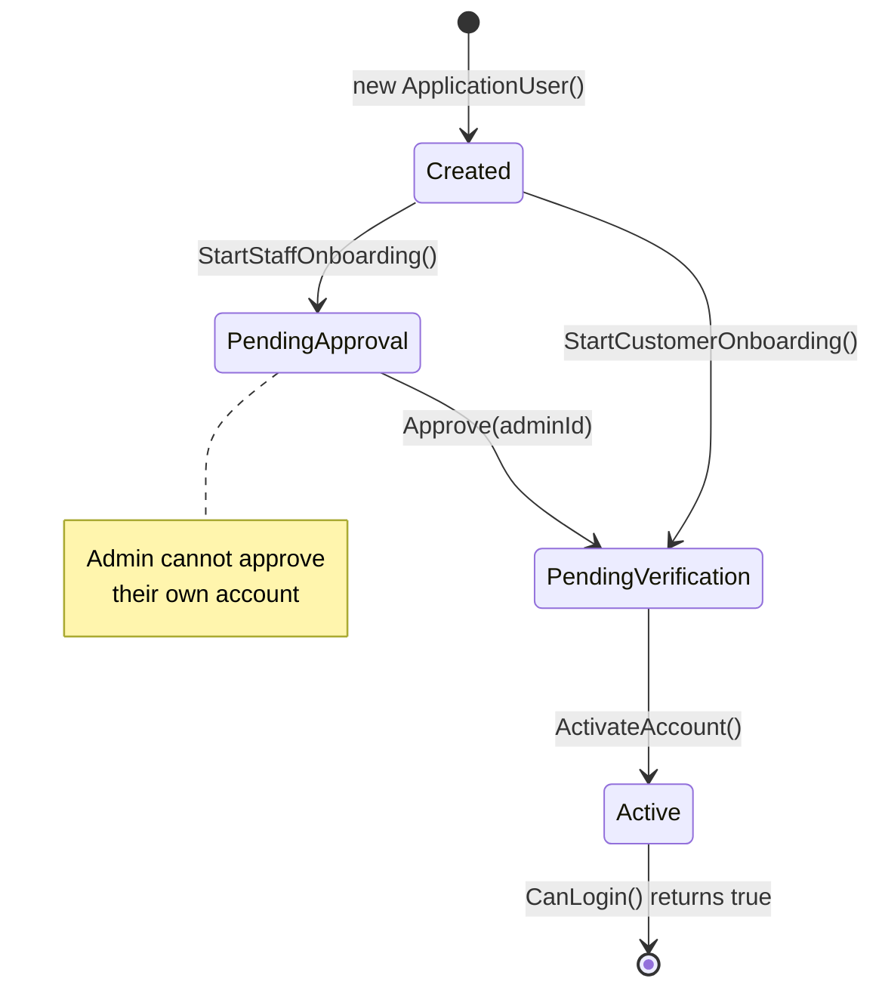
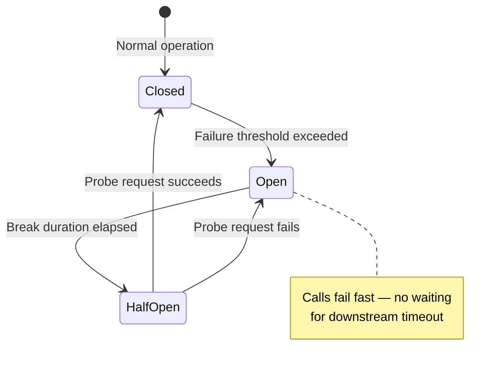
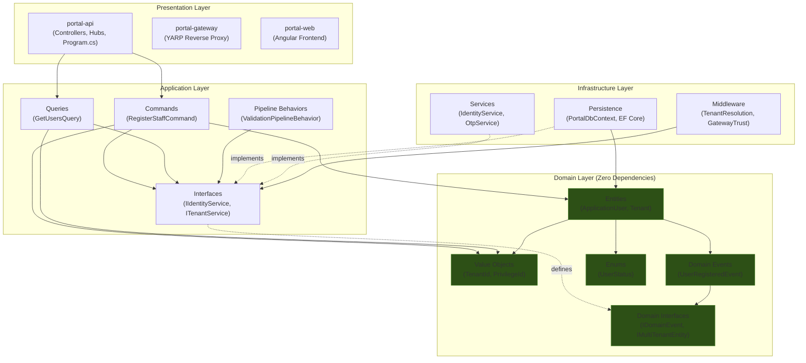
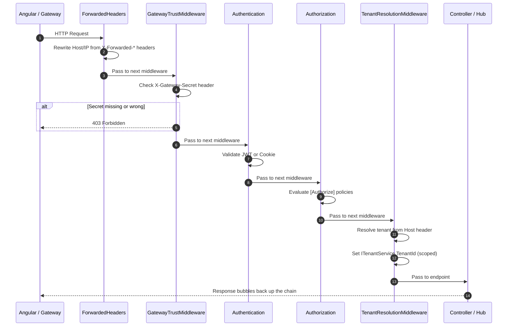
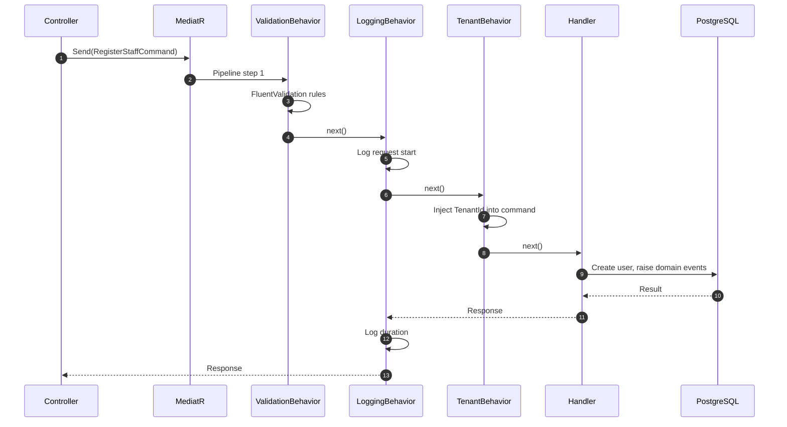
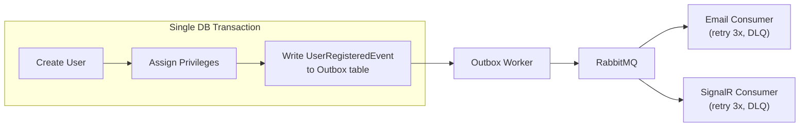

[🧠 **View Interactive Mindmap**](./design-patterns-mindmap.md)

1. **Creational Patterns**
   - 1.1 [Singleton (DI-Managed)](#singleton-di-managed)
   - 1.2 [Builder](#builder)
   - 1.3 [Factory](#factory)

2. **Structural Patterns**
   - 2.1 [Decorator (Middleware & Pipeline Behaviors)](#decorator-middleware--pipeline-behaviors)
   - 2.2 [Facade](#facade)
   - 2.3 [Marker Interface](#marker-interface)
   - 2.4 [Anti-Corruption Layer (ACL)](#anti-corruption-layer-acl)

3. **Behavioral Patterns**
   - 3.1 [Mediator (MediatR)](#mediator-mediatr)
   - 3.2 [Observer (Domain Events)](#observer-domain-events)
   - 3.3 [State Machine](#state-machine)
   - 3.4 [Strategy](#strategy)
   - 3.5 [Specification](#specification)

4. **Architectural Patterns**
   - 4.1 [Clean Architecture (Onion Architecture)](#clean-architecture-onion-architecture)
   - 4.2 [CQRS (Command Query Responsibility Segregation)](#cqrs-command-query-responsibility-segregation)
   - 4.3 [Repository Pattern vs Direct DbContext](#repository-pattern-vs-direct-dbcontext)

5. **Integration & Resilience Patterns**
   - 5.1 [Transactional Outbox](#transactional-outbox)
   - 5.2 [Circuit Breaker & Retry](#circuit-breaker--retry)
   - 5.3 [Saga / Process Manager](#saga--process-manager)

6. **Architecture & Data Flow**
   - 6.1 [Clean Architecture Dependency Graph](#clean-architecture-dependency-graph)
   - 6.2 [The Middleware Decorator Chain](#the-middleware-decorator-chain)
   - 6.3 [The MediatR Pipeline](#the-mediatr-pipeline)
   - 6.4 [SOLID Principles Mapping](#solid-principles--how-tai-portal-enforces-them)

7. **Real-World Examples**
   - 7.1 [The Decorator Pipeline (ValidationPipelineBehavior)](#the-decorator-pipeline-validationpipelinebehavior)
   - 7.2 [The State Machine (ApplicationUser Lifecycle)](#the-state-machine-applicationuser-lifecycle)
   - 7.3 [The Observer (Domain Event Dispatch)](#the-observer-domain-event-dispatch)

8. **Comparison Tables**
   - 8.1 [Creational Pattern Modernization](#creational-pattern-modernization)
   - 8.2 [Middleware vs Pipeline Behavior](#middleware-vs-pipeline-behavior)
   - 8.3 [Integration Patterns Decision Matrix](#integration-patterns-decision-matrix)

9. **Knowledge Deep Dive & Q&A**
   - 9.1 **L1: Junior Knowledge**
     - 9.1.1 [Modern Singleton](#l1-modern-singleton)
     - 9.1.2 [Why Design Patterns Matter](#l1-why-design-patterns-matter)
   - 9.2 **L2: Mid-Level Knowledge**
     - 9.2.1 [Facade vs Adapter](#l2-facade-vs-adapter)
     - 9.2.2 [The Observer Pattern in Modern Systems](#l2-the-observer-pattern-in-modern-systems)
     - 9.2.3 [Specification Pattern vs Ad-Hoc Filtering](#l2-specification-pattern-vs-ad-hoc-filtering)
   - 9.3 **L3: Senior Knowledge**
     - 9.3.1 [Generic Repository Anti-Pattern](#l3-generic-repository-anti-pattern)
     - 9.3.2 [The Decorator Pattern (Middleware and Pipelines)](#l3-the-decorator-pattern-middleware-and-pipelines)
     - 9.3.3 [State Machine in Domain-Driven Design](#l3-state-machine-in-domain-driven-design)
     - 9.3.4 [Outbox Pattern vs Direct Publishing](#l3-outbox-pattern-vs-direct-publishing)
   - 9.4 **Staff: System Architecture**
     - 9.4.1 [Clean Architecture — When Purity Costs Too Much](#staff-clean-architecture--when-purity-costs-too-much)
     - 9.4.2 [CQRS Without Event Sourcing — The Missing Piece](#staff-cqrs-without-event-sourcing--the-missing-piece)
     - 9.4.3 [Why MediatR in the REST Request?](#staff-why-mediatr-in-the-rest-request)
     - 9.4.4 [Design a Resilient Multi-Service Onboarding Flow](#staff-design-a-resilient-multi-service-onboarding-flow)

---

## TL;DR

Design patterns are proven, reusable solutions to recurring software engineering problems. In modern <span style="color: #33b5e5; font-weight: bold;">C# 14</span> and <span style="color: #33b5e5; font-weight: bold;">.NET 10</span>, many classic "Gang of Four" patterns are built directly into the framework — Singleton via DI, Observer via RxJS/Signals/SignalR, Strategy via Switch Expressions. The `tai-portal` architecture is built on three foundational patterns: <span style="color: #00C851; font-weight: bold;">Clean Architecture</span> (dependencies point inward toward a zero-dependency Domain layer), <span style="color: #00C851; font-weight: bold;">CQRS via MediatR</span> (every operation is either a Command or a Query — never both), and <span style="color: #00C851; font-weight: bold;">Decorator via Pipeline Behaviors</span> (cross-cutting concerns like validation wrap every request without modifying any handler). For staff-level interviews, the key differentiator is understanding <span style="color: #ffbb33; font-weight: bold;">integration and resilience patterns</span> — the Transactional Outbox guarantees domain event delivery without coupling to network failures, Circuit Breakers prevent cascading failures across service boundaries, and Sagas coordinate multi-step workflows that span multiple bounded contexts. Understanding how these patterns compose — not just what they are individually — is what separates "I know patterns" from "I architect systems."

---

## Deep Dive

### Concept Group 1: Creational Patterns

#### Singleton (DI-Managed)

##### What
A pattern that guarantees exactly one instance of a class exists per application lifetime. In <span style="color: #33b5e5; font-weight: bold;">.NET 10</span>, the DI container provides this natively via `AddSingleton<TInterface, TImpl>()`.

##### Why
Without controlled instantiation, multiple instances of stateful services (caches, configuration holders, connection pools) lead to duplicated resources, race conditions, and inconsistent behavior. <span style="color: #ff4444; font-weight: bold;">Hand-rolling `private static instance` with double-checked locking</span> is error-prone and ignores disposal.

##### How
```csharp
// 📍 From tai-portal: apps/portal-api/Program.cs
builder.Services.AddSingleton<IRealTimeNotifier, SignalRRealTimeNotifier>();
```
The DI container guarantees thread-safe creation, shared access, and proper `IDisposable` cleanup on shutdown.

##### When
Use for stateless shared services: caches, notifiers, configuration providers. <span style="color: #ff4444; font-weight: bold;">Never</span> use for services with per-request state (like `DbContext` or `ITenantService`).

##### Trade-offs
<span style="color: #ffbb33; font-weight: bold;">Over-using Singleton creates hidden global state</span> that's hard to test and can leak across tenants. If a service holds mutable state, Singleton makes that state shared across all requests — a multi-tenancy disaster.

---

#### Builder

##### What
A creational pattern that constructs complex objects step by step, separating construction logic from the final representation.

##### Why
Without Builder, constructing objects with many optional parameters leads to <span style="color: #ff4444; font-weight: bold;">telescoping constructors</span> (10+ parameter methods) or mutable objects that are half-initialized.

##### How
```csharp
// 📍 From tai-portal: apps/portal-api/Program.cs
var builder = WebApplication.CreateBuilder(args);
builder.Services.AddMediatR(cfg => { /* ... */ });
builder.Services.AddIdentity<ApplicationUser, IdentityRole>();
var app = builder.Build();
app.UseMiddleware<GatewayTrustMiddleware>();
app.Run();
```
In Angular, `FormBuilder` constructs complex reactive forms the same way — step by step, each call adding to the final structure.

##### When
Use when object construction requires many optional steps in a defined order. Avoid for simple objects where a constructor or factory method suffices.

##### Trade-offs
<span style="color: #ffbb33; font-weight: bold;">Adds indirection</span> — the builder chain can become long and hard to navigate. In modern frameworks, you rarely need to write your own custom Builder classes because the framework provides highly optimized builders for the most complex instantiation scenarios.

**Commonly Used Built-In Builders:**
1. **`.NET` `WebApplicationBuilder`**: The flagship builder of modern .NET. It coordinates the construction of the entire application host, dependency injection container, logging pipeline, and configuration providers before finally calling `.Build()` to produce the runnable `WebApplication`.
2. **`.NET` `ModelBuilder` (EF Core)**: Used inside `DbContext.OnModelCreating(ModelBuilder builder)`. It allows you to fluently configure the database schema, relationships, indexes, and query filters step-by-step before EF Core compiles the final immutable `IModel`.
3. **`.NET` `AuthenticationBuilder`**: Used when configuring security (e.g., `builder.Services.AddAuthentication().AddJwtBearer(...)`). It manages the complex setup of authentication handlers, schemes, and token validation parameters.
4. **`.NET` `NpgsqlDataSourceBuilder`**: Used in PostgreSQL applications to fluently configure connection string settings, map enums, and enable plugins (like `EnableDynamicJson()`) before building the final thread-safe `NpgsqlDataSource`.
5. **`Angular` `FormBuilder`**: Constructs complex, deeply nested Reactive Forms (`FormGroup`, `FormArray`, `FormControl`) with synchronous and asynchronous validators using a clean, fluent syntax rather than manually instantiating `new FormGroup(...)` everywhere.

---

#### Factory

##### What
A pattern that creates objects without the caller knowing the concrete class. Abstracts instantiation logic behind a method or interface.

##### Why
Without Factory, creating objects based on runtime conditions requires large `switch` statements scattered across the codebase. When a new type is added, <span style="color: #ff4444; font-weight: bold;">every switch must be updated</span>.

##### How
```csharp
// 1. Runtime Reflection Factory (From tai-portal: PortalDbContext.cs)
// Creates a DomainEventNotification<T> wrapper dynamically based on the event's type at runtime.
var notificationType = typeof(DomainEventNotification<>).MakeGenericType(domainEvent.GetType());
var notification = Activator.CreateInstance(notificationType, domainEvent);

// 2. Built-in .NET Factory: IHttpClientFactory
// Resolves the socket exhaustion and DNS caching issues of manually calling `new HttpClient()`.
public class GitHubService(IHttpClientFactory httpClientFactory) {
    public async Task GetUserAsync() {
        // The factory manages the underlying HttpMessageHandler pool.
        var client = httpClientFactory.CreateClient("github-api");
        // ...
    }
}
```

**3. Replacing Manual Factories with Keyed DI (Modern .NET)**
Before Keyed DI, if you had multiple implementations of an interface (e.g. `IPaymentProcessor`), you had to build a custom `Factory` class with a giant `switch` statement to route the request based on a string. This violated the Open-Closed Principle. 

In modern .NET, <span style="color: #33b5e5; font-weight: bold;">Keyed DI services</span> completely eliminate the need for manual factory classes. The DI container *is* the factory.

```csharp
// 1. The Registration (Program.cs)
builder.Services.AddKeyedScoped<IPaymentProcessor, StripeProcessor>("Stripe");
builder.Services.AddKeyedScoped<IPaymentProcessor, PayPalProcessor>("PayPal");

// 2. The Usage (Option A: Dynamic Resolution at runtime)
public class CheckoutController(IServiceProvider serviceProvider) {
    public async Task Checkout(string providerName) {
        // The DI container natively acts as the factory, resolving the correct class via the string key.
        var processor = serviceProvider.GetRequiredKeyedService<IPaymentProcessor>(providerName);
        await processor.ProcessPaymentAsync();
    }
}

// 3. The Usage (Option B: Static Attribute Injection)
public class StripeWebhookListener(
    [FromKeyedServices("Stripe")] IPaymentProcessor stripeProcessor) {
    // Automatically receives the StripeProcessor instance!
}
```

##### When
Use when the concrete type is unknown at compile time, determined by runtime data, or when the creation of the object requires complex resource management (like connection pooling). 

**Common Built-In Factories in the Real World:**

1. **`.NET` `IHttpClientFactory`**: You should almost never write `new HttpClient()`. The factory manages a pool of underlying HTTP message handlers to prevent socket exhaustion and handle DNS TTL changes gracefully.
   ```csharp
   public class WeatherService(IHttpClientFactory factory) {
       public async Task GetWeather() {
           // Safely grabs a pre-configured, pooled HttpClient
           var client = factory.CreateClient("WeatherApi");
           return await client.GetAsync("/forecast");
       }
   }
   ```

2. **`.NET` `ILoggerFactory`**: Used by the framework to spawn category-specific loggers (`ILogger<T>`) dynamically based on the class requesting them.
   ```csharp
   // If you inject ILogger<UserService> into a class, the DI container
   // is secretly using ILoggerFactory behind the scenes to spawn it:
   var logger = loggerFactory.CreateLogger<UserService>();
   logger.LogInformation("Factory created this logger dynamically.");
   ```

3. **`.NET` `IServiceScopeFactory`**: When you are inside a Singleton service (like a background worker) but you need to resolve a Scoped service (like `DbContext`), you use this factory to manually spin up a new DI scope so you don't accidentally keep the database connection alive forever.
   ```csharp
   public class BackgroundQueueWorker(IServiceScopeFactory scopeFactory) : BackgroundService {
       protected override async Task ExecuteAsync(CancellationToken ct) {
           // Spin up a temporary DI scope just for this unit of work
           using var scope = scopeFactory.CreateScope();
           
           // Resolve a short-lived DbContext safely
           var dbContext = scope.ServiceProvider.GetRequiredService<PortalDbContext>();
           await dbContext.AuditLogs.AddAsync(new AuditLog());
           await dbContext.SaveChangesAsync(ct);
           // Scope ends -> DbContext is immediately disposed.
       }
   }
   ```

4. **`.NET` `IDbContextFactory<T>`**: Used heavily in Blazor Server, parallel processing, or desktop apps where multiple concurrent threads might need their own short-lived database context rather than sharing a single scoped one.
   ```csharp
   public class ParallelDataProcessor(IDbContextFactory<PortalDbContext> dbFactory) {
       public async Task ProcessDataInParallelAsync() {
           var tasks = new List<Task>();
           for (int i = 0; i < 5; i++) {
               // DbContext is not thread-safe. Factory ensures every thread 
               // gets its own isolated DbContext!
               tasks.Add(Task.Run(async () => {
                   using var db = await dbFactory.CreateDbContextAsync();
                   // do work...
               }));
           }
           await Task.WhenAll(tasks);
       }
   }
   ```

5. **`Angular` `ViewContainerRef.createComponent()`**: The modern Angular factory for dynamically rendering a component into the DOM at runtime (e.g., spawning a modal dialog, tooltip, or toast notification) without declaring it in the HTML template.
   ```typescript
   @Component({ ... })
   export class ParentComponent {
     vcr = inject(ViewContainerRef);

     openModal() {
       // The factory programmatically instantiates the component and attaches it to the DOM
       const componentRef = this.vcr.createComponent(DynamicModalComponent);
       componentRef.instance.title = "Unsaved Changes"; // Pass @Input() data
       
       componentRef.instance.closeEvent.subscribe(() => {
         componentRef.destroy(); // Factory requires manual cleanup
       });
     }
   }
   ```

##### Trade-offs
`Activator.CreateInstance()` bypasses compile-time type checking — <span style="color: #ff4444; font-weight: bold;">typos or missing constructors fail at runtime</span>, not build time. For managing lifecycles (like `IHttpClientFactory`), the indirection is absolutely worth it for stability and performance. Prefer Keyed DI services over writing custom switch-based factories.

---

### Concept Group 2: Structural Patterns

#### Decorator (Middleware & Pipeline Behaviors)

##### What
A pattern that wraps an object to add behavior before and/or after its core logic, without modifying the object itself. In <span style="color: #33b5e5; font-weight: bold;">ASP.NET Core</span>, middleware is an HTTP Decorator chain. In <span style="color: #33b5e5; font-weight: bold;">MediatR</span>, `IPipelineBehavior<TRequest, TResponse>` decorates every command/query handler.

##### Why
Without Decorators, adding cross-cutting concerns (logging, validation, caching, tenant scoping) means <span style="color: #ff4444; font-weight: bold;">modifying every handler or controller action</span>. 50 endpoints × 5 cross-cutting concerns = 250 places to maintain identical logic.

##### How
```csharp
// 📍 From tai-portal: libs/core/application/Behaviors/ValidationPipelineBehavior.cs:11-33
public class ValidationPipelineBehavior<TRequest, TResponse> : IPipelineBehavior<TRequest, TResponse>
    where TRequest : IRequest<TResponse> {
    private readonly IEnumerable<IValidator<TRequest>> _validators;

    public async Task<TResponse> Handle(
        TRequest request, RequestHandlerDelegate<TResponse> next, CancellationToken ct) {
        if (!_validators.Any()) return await next(); // No validators → skip

        var context = new ValidationContext<TRequest>(request);
        var failures = (await Task.WhenAll(
                _validators.Select(v => v.ValidateAsync(context, ct))))
            .SelectMany(r => r.Errors)
            .Where(f => f != null).ToList();

        if (failures.Count != 0) throw new ValidationException(failures); // Short-circuit
        return await next(); // Continue to handler (or next behavior)
    }
}
```
The middleware chain follows the same pattern — each calls `await _next(context)` and can short-circuit.

##### When
Use Decorators for concerns that apply uniformly across many handlers. If a concern only applies to one or two handlers, inline it — the indirection isn't worth it.

##### Trade-offs
<span style="color: #ffbb33; font-weight: bold;">Deep decorator chains (10+ layers) become hard to debug</span> because execution bounces up and down the chain. Stack traces show the full chain, making it harder to find the actual error source. The order of registration matters and is implicit (defined in `Program.cs`, not visible at the handler).

---

#### Facade

##### What
A pattern that provides a simplified, unified interface over a complex subsystem. Consumers interact with one method instead of juggling multiple services.

##### Why
Without Facades, handlers depend on 4-5 low-level services (`UserManager`, `RoleManager`, `SignInManager`, `DbContext`), creating <span style="color: #ff4444; font-weight: bold;">wide dependency surfaces</span> that are fragile and hard to test.

##### How
```csharp
// 📍 From tai-portal: libs/core/application/Interfaces/IIdentityService.cs:11-20
// Facade over UserManager, RoleManager, SignInManager, and DbContext
public interface IIdentityService {
    Task<(Result Result, string UserId)> CreateUserAsync(ApplicationUser user, string password);
    Task<Result> DeleteUserAsync(string userId);
    Task<bool> IsInRoleAsync(string userId, string role);
    Task<ApplicationUser?> GetUserByEmailAsync(string email);
    // ... domain-oriented operations, not framework primitives
}
```
Handlers call `_identityService.CreateUserAsync()` — they never import `Microsoft.AspNetCore.Identity`.

##### When
Use when a subsystem has grown too complex for consumers, or when you need to isolate a framework dependency behind a domain-friendly API. <span style="color: #ff4444; font-weight: bold;">Avoid letting Facades become "God Services"</span> — split by concern (IIdentityService, ITenantService, IOtpService).

##### Trade-offs
<span style="color: #ffbb33; font-weight: bold;">Facades can hide too much.</span> If consumers frequently need the underlying service's full power (e.g., `UserManager.FindByLoginAsync()` with specific parameters), the Facade becomes a leaky abstraction that must be constantly expanded.

---

#### Marker Interface

##### What
An interface with minimal or no methods whose purpose is to <span style="color: #33b5e5; font-weight: bold;">tag</span> classes for discovery via reflection at startup time, rather than enforcing behavior at compile time.

##### Why
Without Marker Interfaces, applying behavior to a subset of entities (e.g., "all tenant-scoped entities get a Global Query Filter") requires manual, per-entity configuration — <span style="color: #ff4444; font-weight: bold;">easy to forget when adding new entities</span>.

##### How
```csharp
// 📍 From tai-portal: libs/core/domain/Interfaces/IMultiTenantEntity.cs:13-18
public interface IMultiTenantEntity {
    TenantId AssociatedTenantId { get; }
}

// 📍 From tai-portal: libs/core/infrastructure/Persistence/Interceptors/TenantInterceptor.cs:55-77
// At save time, auto-injects TenantId on new records implementing IMultiTenantEntity
```
At `OnModelCreating` time, EF Core applies Global Query Filters to every entity implementing `IMultiTenantEntity`. The `TenantInterceptor` also uses this marker to auto-populate `TenantId` on insert.

##### When
Use when behavior is configured at startup via reflection (DI scanning, EF Core model configuration, serializer settings). <span style="color: #ff4444; font-weight: bold;">Don't use</span> if the interface carries real behavior — use a proper abstraction instead.

##### Trade-offs
<span style="color: #ffbb33; font-weight: bold;">Marker Interfaces are invisible at the call site.</span> You won't see "this entity is tenant-scoped" unless you check the interface list. Document the convention clearly, or new developers will miss it.

---

#### Anti-Corruption Layer (ACL)

##### What
A translation boundary that prevents an external system's model from leaking into your domain. The ACL adapts the external API into your domain's language, isolating your core from external changes.

##### Why
Without an ACL, your domain code speaks the external system's language. When the external API changes (renamed fields, different auth flow, new SDK version), <span style="color: #ff4444; font-weight: bold;">changes ripple through your entire domain</span>.

##### How
```csharp
// 📍 From tai-portal: libs/core/infrastructure/Identity/IdentityService.cs:14-130
// ACL: wraps ASP.NET Identity's UserManager behind domain-friendly IIdentityService
public class IdentityService : IIdentityService {
    private readonly UserManager<ApplicationUser> _userManager;

    public async Task<(Result Result, string UserId)> CreateUserAsync(
        ApplicationUser user, string password) {
        // Translates IdentityResult (framework concept) → Result (domain concept)
        var result = await _userManager.CreateAsync(user, password);
        return (result.ToApplicationResult(), user.Id);
    }
}
```

```csharp
// 📍 From tai-portal: libs/core/infrastructure/Services/LoggingMessageBus.cs:13-28
// ACL stub: wraps future message broker (MassTransit/RabbitMQ) behind domain IMessageBus
public class LoggingMessageBus : IMessageBus {
    public Task PublishAsync<T>(T message, CancellationToken ct = default) {
        _logger.LogInformation("Would publish: {Message}", message);
        return Task.CompletedTask;
    }
}
```

##### When
Use at every boundary with an external system — identity providers, payment gateways, message brokers, third-party APIs. The interface lives in the Application layer; the implementation (the ACL) lives in Infrastructure. This is how <span style="color: #00C851; font-weight: bold;">Clean Architecture enforces the pattern structurally</span>.

##### Trade-offs
<span style="color: #ffbb33; font-weight: bold;">Every external integration requires a translation layer</span> — more files and mapping code. For stable, rarely-changing external APIs (like ASP.NET Identity), the cost is low and the benefit is high. For rapidly-evolving third-party APIs, the ACL pays for itself quickly.

---

### Concept Group 3: Behavioral Patterns

#### Mediator (MediatR)

##### What
A pattern where objects communicate through a central mediator instead of directly referencing each other. In tai-portal, <span style="color: #33b5e5; font-weight: bold;">MediatR</span> routes typed Command/Query records to their single handler, completely decoupling the API layer from the Application layer.

##### Why
Without Mediator, controllers inject every service they need: `IIdentityService`, `IOtpService`, `IPrivilegeService`, `IMessageBus`, `IRealTimeNotifier`. <span style="color: #ff4444; font-weight: bold;">Fat controllers</span> with 5-10 injected services become untestable and violate Single Responsibility.

##### How
```csharp
// 📍 From tai-portal: apps/portal-api controllers
// Thin controller — routing only
[HttpPost("register-staff")]
public async Task<IActionResult> RegisterStaff(RegisterStaffCommand command)
    => Ok(await _mediator.Send(command));
```
The controller sends `RegisterStaffCommand`, MediatR routes it to `RegisterStaffCommandHandler`, and the pipeline runs validation, logging, and tenant scoping in between — all without the controller knowing.

##### When
Use when controllers are becoming fat with injected services. Use when you want a <span style="color: #00C851; font-weight: bold;">pipeline</span> (validation, logging, caching) that applies uniformly. Avoid for trivial CRUD where the indirection isn't worth it.

##### Trade-offs
<span style="color: #ffbb33; font-weight: bold;">MediatR's indirection makes "Find All References" harder</span> — you must search by Command/Query type, not by method name. Navigation requires knowing the naming convention (`RegisterStaffCommand` → `RegisterStaffCommandHandler`).

---

#### Observer (Domain Events)

##### What
A pattern where an object notifies subscribers about state changes without knowing who or how many subscribers exist. In tai-portal, entities raise <span style="color: #33b5e5; font-weight: bold;">domain events</span> that are dispatched by the `PortalDbContext` via MediatR's `IPublisher`.

##### Why
Without Observer, a domain action with multiple side effects (send email, create audit log, push SignalR notification) requires the entity to <span style="color: #ff4444; font-weight: bold;">know about and call every side-effect service</span> — violating Single Responsibility and coupling the Domain to Infrastructure.

##### How
```csharp
// 📍 From tai-portal: libs/core/domain/Entities/ApplicationUser.cs:82-100
public void Approve(TenantAdminId approvedBy) {
    if (Status != UserStatus.PendingApproval)
        throw new InvalidOperationException($"Cannot approve in state {Status}");
    if (Id == (string)approvedBy)
        throw new InvalidOperationException("Users cannot approve their own accounts.");

    Status = UserStatus.PendingVerification;
    ApprovedBy = approvedBy;
    _domainEvents.Add(new UserApprovedEvent(Id, approvedBy)); // Observer: raise event
}
```

```csharp
// 📍 From tai-portal: libs/core/infrastructure/Persistence/PortalDbContext.cs:69-94
private async Task DispatchDomainEventsAsync(CancellationToken ct) {
    var entities = ChangeTracker.Entries()
        .Where(e => e.Entity is IHasDomainEvents h && h.DomainEvents.Any())
        .Select(e => (IHasDomainEvents)e.Entity).ToList();

    var domainEvents = entities.SelectMany(e => e.DomainEvents).ToList();
    entities.ForEach(e => e.ClearDomainEvents());

    foreach (var domainEvent in domainEvents) {
        var notificationType = typeof(DomainEventNotification<>)
            .MakeGenericType(domainEvent.GetType());
        var notification = Activator.CreateInstance(notificationType, domainEvent);
        if (notification != null)
            await publisher.Publish(notification, ct); // Factory + Observer
    }
}
```
Handlers like `UserApprovedEventHandler`, `PrivilegeModifiedEventHandler`, and `LoginAnomalyEventHandler` react independently without the Domain knowing they exist.

##### When
Use when a domain action should trigger multiple side effects. Use when the Domain layer must not reference Infrastructure services. On the frontend, <span style="color: #33b5e5; font-weight: bold;">Angular Signals</span> and <span style="color: #33b5e5; font-weight: bold;">RxJS BehaviorSubject</span> natively implement Observer for reactive UI updates.

##### Trade-offs
<span style="color: #ffbb33; font-weight: bold;">Events dispatched before `SaveChangesAsync()` join the same transaction</span> — consistent but potentially slow if handlers do network I/O. <span style="color: #ffbb33; font-weight: bold;">Events dispatched after</span> are faster but risk inconsistency if handlers fail. tai-portal dispatches before (line 45 of `PortalDbContext.cs`), which is correct for the current in-process model but becomes the <span style="color: #ff4444; font-weight: bold;">Transactional Outbox motivation</span> (see Integration Patterns).

---

#### State Machine (in Domain Entities)

##### What
A pattern where an entity's behavior is governed by its current state, and only specific transitions between states are legal. In Domain-Driven Design (DDD), **the entity itself acts as the state machine**, and its `Status` property represents the current state. The entity enforces its own lifecycle rules — <span style="color: #00C851; font-weight: bold;">external code cannot put it in an invalid state</span>.

##### Why
Without embedding a State Machine inside the entity, status transitions are scattered across external service methods with loose `if/else` checks that can easily be bypassed. <span style="color: #ff4444; font-weight: bold;">A developer could accidentally write `user.Status = Active; db.SaveChanges();`, jumping the user from `Created` directly to `Active` and skipping the manager approval step entirely.</span>

##### How
```csharp
// 📍 From tai-portal: libs/core/domain/Entities/ApplicationUser.cs
public class ApplicationUser 
{
    // The "State". It has a private set, meaning external code CANNOT change it directly.
    // They must call a valid transition method below.
    public UserStatus Status { get; private set; }

    // Transition 1
    public void StartStaffOnboarding() {
        // Guard: You can only start onboarding if you are brand new
        if (Status != UserStatus.Created) throw new Exception("...");
        
        Status = UserStatus.PendingApproval;
        _domainEvents.Add(new UserRegisteredEvent(Id));
    }

    // Transition 2
    public void Approve(TenantAdminId approvedBy) {
        // Guard: You can only be approved if you were waiting for approval
        if (Status != UserStatus.PendingApproval)
            throw new InvalidOperationException($"Cannot approve in state {Status}");
            
        // Guard: Business rule enforcement
        if (Id == (string)approvedBy)
            throw new InvalidOperationException("Users cannot approve their own accounts.");
            
        Status = UserStatus.PendingVerification;
        _domainEvents.Add(new UserApprovedEvent(Id, approvedBy));
    }

    // Transition 3
    public void ActivateAccount() {
        if (Status != UserStatus.PendingVerification) throw new Exception("...");
        Status = UserStatus.Active;
    }
}
```


```mermaid
stateDiagram-v2
    [*] --> Created : new ApplicationUser()
    Created --> PendingApproval : StartStaffOnboarding()
    Created --> PendingVerification : StartCustomerOnboarding()
    PendingApproval --> PendingVerification : Approve(adminId)
    PendingVerification --> Active : ActivateAccount()
    Active --> [*] : CanLogin() returns true

    note right of PendingApproval
        Admin cannot approve
        their own account
    end note
```

##### When
Use when a Domain Entity has strict lifecycle rules that must be enforced (e.g., Orders, Shipments, User Accounts). Implement it by making the State property (`Status`) `private set`, and providing explicit public transition methods (`Approve()`, `Cancel()`, `Ship()`). For massive, complex workflows spanning multiple aggregates or microservices, consider a <span style="color: #33b5e5; font-weight: bold;">Saga</span> instead.

##### Trade-offs
<span style="color: #ffbb33; font-weight: bold;">Testing requires walking through the full lifecycle</span> — you can't test `Approve()` without first creating a user and calling `StartStaffOnboarding()`. This is intentional — it proves the state machine works end-to-end.

---

#### Strategy

##### What
A pattern that encapsulates interchangeable algorithms behind a common interface, allowing the algorithm to be selected at runtime or startup — typically via <span style="color: #33b5e5; font-weight: bold;">Dependency Injection</span>. In Clean Architecture, the Strategy Pattern is the fundamental mechanism that allows the core Application layer to remain decoupled from the Infrastructure layer.

##### Why
Without Strategy, switching behavior requires massive `if/else` or `switch` blocks that grow with every new variant. For example, <span style="color: #ff4444; font-weight: bold;">adding a new notification channel</span> (email, SMS, console) would mean modifying the `NotifyUserHandler` directly, rather than just plugging in a new sender.

##### How (Usage in `tai-portal`)
In `tai-portal`, the Strategy pattern is used to protect the Application layer. The Application layer defines the *Contract* (the Strategy Interface), and the Infrastructure layer provides the *Behaviors* (the Concrete Strategies).

**Example 1: The Messaging Strategy**
```csharp
// 1. The Strategy Interface (Defined in Application layer)
public interface IMessageBus {
    Task PublishAsync<T>(T message, CancellationToken ct = default);
}

// 2. Strategy A: Local Development (Defined in Infrastructure)
public class LoggingMessageBus(ILogger<LoggingMessageBus> logger) : IMessageBus {
    public Task PublishAsync<T>(T message, CancellationToken ct = default) {
        logger.LogInformation($"[DEV] Pretending to publish: {message}");
        return Task.CompletedTask;
    }
}

// 3. Strategy B: Production (Defined in Infrastructure)
public class RabbitMqMessageBus(IConnection connection) : IMessageBus {
    public async Task PublishAsync<T>(T message, CancellationToken ct = default) {
        // Real RabbitMQ publishing logic...
    }
}
```

**Example 2: The Real-Time Notification Strategy**
```csharp
public interface IRealTimeNotifier {
    Task NotifyUserAsync(string userId, string message, CancellationToken ct = default);
}

// Current strategy used in tai-portal: SignalR
public class SignalRRealTimeNotifier : IRealTimeNotifier { /* ... */ }

// Future strategy could be:
// public class ServerSentEventsNotifier : IRealTimeNotifier { /* ... */ }
```

In `Program.cs`, you select the winning Strategy for the environment:
```csharp
if (builder.Environment.IsDevelopment()) {
    builder.Services.AddSingleton<IMessageBus, LoggingMessageBus>(); // Use Strategy A
} else {
    builder.Services.AddSingleton<IMessageBus, RabbitMqMessageBus>(); // Use Strategy B
}
```

**Functional Strategy (Switch Expressions)**
In modern C# 14, if the "strategies" are just pure mathematical functions with no dependencies, you don't need interfaces. You can use <span style="color: #00C851; font-weight: bold;">switch expressions with pattern matching</span>:
```csharp
decimal CalculateDiscount(CustomerType type, decimal amount) => type switch {
    CustomerType.Premium => amount * 0.20m,
    CustomerType.Business => amount * 0.10m,
    _ => 0m
};
```

##### When
Use the full interface-based Strategy when implementations require their own dependencies (like `RabbitMQConnection` vs `ILogger`), have different lifecycles, or when you need to swap out entire Infrastructure implementations (Clean Architecture). Use simple `switch` expressions when the strategies are purely mathematical.

##### Trade-offs
<span style="color: #ffbb33; font-weight: bold;">In a POC like `tai-portal`, many interfaces currently only have exactly one implementation</span> (e.g., `IMessageBus` → `LoggingMessageBus`). The Strategy pattern is structurally present to enforce the Clean Architecture boundary, but you pay a slight indirection cost now. This is a deliberate and valid trade-off: it ensures that when the team is ready to scale to RabbitMQ, the Application layer doesn't have to be rewritten.

---

#### Specification

##### What
A pattern that encapsulates a business rule into a reusable, composable, testable object. A Specification answers a single question: "Does this entity satisfy this criteria?" Specifications can be combined with AND, OR, NOT to build complex filters.

##### Why
Without Specification, filtering logic is duplicated across handlers. <span style="color: #ff4444; font-weight: bold;">"Active users in tenant X with privilege Y"</span> appears in `GetUsersHandler`, `ExportUsersHandler`, `NotifyUsersHandler` — each with slightly different implementations.

##### How
```csharp
// 🔧 Fits tai-portal: composable user filtering
public abstract class Specification<T> {
    public abstract Expression<Func<T, bool>> ToExpression();

    public bool IsSatisfiedBy(T entity) => ToExpression().Compile()(entity);

    public Specification<T> And(Specification<T> other)
        => new AndSpecification<T>(this, other);
}

public class ActiveUsersSpec : Specification<ApplicationUser> {
    public override Expression<Func<ApplicationUser, bool>> ToExpression()
        => user => user.Status == UserStatus.Active;
}

public class InTenantSpec : Specification<ApplicationUser> {
    private readonly TenantId _tenantId;
    public InTenantSpec(TenantId tenantId) => _tenantId = tenantId;
    public override Expression<Func<ApplicationUser, bool>> ToExpression()
        => user => user.TenantId == _tenantId;
}

// Usage in a CQRS handler:
var spec = new ActiveUsersSpec().And(new InTenantSpec(query.TenantId));
var users = await _db.Users.Where(spec.ToExpression()).ToListAsync(ct);
```

##### When
Use when the same filtering logic is needed in multiple handlers. Use when business rules are complex enough to warrant independent testing. <span style="color: #ff4444; font-weight: bold;">Don't use</span> for one-off queries or when EF Core's Global Query Filters already handle the concern (like tai-portal's `IMultiTenantEntity` filters).

##### Trade-offs
<span style="color: #ffbb33; font-weight: bold;">Not all LINQ expressions compose cleanly with EF Core's query translator.</span> Complex Specifications can generate inefficient SQL. Always check the generated query with `ToQueryString()`. The Specification pattern is most valuable in DDD-heavy codebases where business rules are reused across aggregates.

---

### Concept Group 4: Architectural Patterns

#### Clean Architecture (Onion Architecture)

##### What
A layered system design where <span style="color: #00C851; font-weight: bold;">dependencies point inward</span> toward the core Domain. The Domain layer has zero NuGet references. Application depends on Domain. Infrastructure and Presentation depend on Application. The database is an implementation detail, not the center of the universe.

##### Why
If your `ApplicationUser` entity references `Microsoft.EntityFrameworkCore`, your domain logic is forever married to a specific ORM. <span style="color: #ff4444; font-weight: bold;">Changing the persistence layer means rewriting the domain.</span> Clean Architecture inverts this — the Domain defines *what* it needs (via interfaces like `IIdentityService`), and Infrastructure supplies *how*.

##### How
See [Architecture & Data Flow](#clean-architecture-dependency-graph) for the full diagram. The key structural rule:
- **Domain Layer:** Entities, Value Objects, Domain Events, Enums, Domain Interfaces. Zero external dependencies.
- **Application Layer:** Commands, Queries, Pipeline Behaviors, Application Interfaces (e.g., `IIdentityService`). Depends only on Domain.
- **Infrastructure Layer:** `PortalDbContext`, `IdentityService`, `TenantInterceptor`, middleware. Implements Application interfaces. References EF Core, ASP.NET Identity, etc.
- **Presentation Layer:** Controllers, Hubs, `Program.cs`, Angular frontend. Thin routing layer.

##### When
Use Clean Architecture for any system that will outlive its initial framework choices. <span style="color: #ff4444; font-weight: bold;">For a throwaway prototype, it's overkill.</span>

##### Trade-offs
<span style="color: #ffbb33; font-weight: bold;">More files and indirection</span> — a `RegisterStaffCommand` lives in Application, its validator in the same file, and the actual Identity logic in Infrastructure's `IdentityService`. The benefit is that replacing PostgreSQL with SQL Server or swapping `IdentityService` with an Auth0 implementation requires zero Domain changes.

---

#### CQRS (Command Query Responsibility Segregation)

##### What
Strictly separates <span style="color: #33b5e5; font-weight: bold;">write operations (Commands)</span> from <span style="color: #33b5e5; font-weight: bold;">read operations (Queries)</span>. Each is a single `record` handled by exactly one `IRequestHandler`, enabling independent optimization of read and write paths.

##### Why
Without CQRS, a single service method handles both reading and writing, making it impossible to optimize them independently. <span style="color: #ff4444; font-weight: bold;">Read-heavy endpoints can't be cached independently of write endpoints.</span>

##### How
```csharp
// 📍 From tai-portal: libs/core/application/UseCases/
// Query — read, safe to cache, safe to retry
public record GetUsersQuery(int PageSize, string? SearchTerm) : IRequest<List<UserDto>>;

// Command — write, has side effects, not idempotent
public record RegisterStaffCommand(
    Guid TenantId, string Email, string Password,
    string FirstName, string LastName) : IRequest<string>;
```

##### When
Use when reads and writes have different performance, security, or scaling requirements. In tai-portal, every operation is either a Command or a Query — <span style="color: #00C851; font-weight: bold;">never both</span>.

##### Trade-offs
<span style="color: #ffbb33; font-weight: bold;">More classes per operation</span>, but each file is small, focused, and testable. See the [MediatR Pipeline section](#the-mediatr-pipeline) for how CQRS connects to the pipeline.

---

#### Repository Pattern vs Direct DbContext

##### What
EF Core's `DbContext` is already a <span style="color: #33b5e5; font-weight: bold;">Unit of Work</span> and `DbSet<T>` is already a generic <span style="color: #33b5e5; font-weight: bold;">Repository</span>. Wrapping it in `IGenericRepository<T>` usually duplicates the API while hiding powerful features.

##### Why
<span style="color: #ff4444; font-weight: bold;">A generic repository hides</span> `Include()` for eager loading, `AsNoTracking()` for read performance, Global Query Filters for tenant isolation, and `ExecuteUpdateAsync()` for bulk operations.

##### How
```csharp
// 📍 From tai-portal: CQRS handlers inject domain-specific Facades, not generic repositories
// Application layer defines the interface:
public interface IIdentityService {
    Task<(Result Result, string UserId)> CreateUserAsync(ApplicationUser user, string password);
}

// Infrastructure layer implements with full EF Core power:
public class IdentityService : IIdentityService {
    private readonly UserManager<ApplicationUser> _userManager; // Has DbContext internally
}
```

##### When
Use domain-specific repositories/facades that expose business operations, not CRUD. Only use a generic repository for testing abstractions or multi-database portability that's actually needed.

##### Trade-offs
<span style="color: #ffbb33; font-weight: bold;">Without a repository abstraction, handlers couple to EF Core's API.</span> In tai-portal, this coupling is acceptable because the Facade (`IIdentityService`) and CQRS handlers provide the abstraction boundary. The interface lives in Application; the implementation uses `DbContext` directly in Infrastructure.

---

### Concept Group 5: Integration & Resilience Patterns

#### Transactional Outbox

##### What
A pattern that guarantees reliable message delivery by writing events to a database table (the "outbox") in the <span style="color: #00C851; font-weight: bold;">same transaction</span> as the business data. A separate background worker reads the outbox and publishes messages to the broker.

##### Why
tai-portal currently dispatches domain events via MediatR inside `SaveChangesAsync()` — <span style="color: #ff4444; font-weight: bold;">if a handler sends an email and the SMTP server is down, the exception rolls back the entire database transaction</span>. The user's approval is lost because an email failed.

##### How
```csharp
// 🔧 Fits tai-portal: replacing direct MediatR dispatch with Outbox
// Step 1: In SaveChangesAsync, serialize events to OutboxMessages table
// (same transaction as user approval)
public override async Task<int> SaveChangesAsync(CancellationToken ct) {
    var events = GetDomainEvents();
    foreach (var evt in events) {
        _dbSet<OutboxMessage>().Add(new OutboxMessage {
            Id = Guid.NewGuid(),
            Type = evt.GetType().FullName,
            Payload = JsonSerializer.Serialize(evt),
            CreatedAt = DateTime.UtcNow,
            ProcessedAt = null
        });
    }
    return await base.SaveChangesAsync(ct); // Events + business data in one transaction
}

// Step 2: Background worker polls and publishes
// BackgroundService reads OutboxMessages WHERE ProcessedAt IS NULL
// Publishes to RabbitMQ, marks as processed
```

##### When
Use when domain event handlers perform network I/O (email, message broker, external APIs). Use when <span style="color: #00C851; font-weight: bold;">guaranteed delivery</span> matters more than immediate processing. tai-portal has a planned Outbox track but currently uses in-process dispatch.

##### Trade-offs
<span style="color: #ffbb33; font-weight: bold;">Adds eventual consistency</span> — side effects (emails, notifications) may lag by seconds. Adds operational complexity (background worker, outbox table cleanup). For a POC, in-process dispatch is acceptable; for production multi-tenant SaaS, the Outbox is essential.

---

#### Circuit Breaker & Retry

##### What
<span style="color: #33b5e5; font-weight: bold;">Retry</span> automatically re-attempts failed operations with configurable delays (exponential backoff). <span style="color: #33b5e5; font-weight: bold;">Circuit Breaker</span> prevents cascading failures by "opening" the circuit after N consecutive failures — subsequent calls fail fast instead of waiting for a timeout.

##### Why
Without resilience patterns, a downstream service outage causes <span style="color: #ff4444; font-weight: bold;">cascading failures</span> — every request waits for a timeout, thread pools exhaust, and the entire system grinds to a halt.

##### How
```csharp
// 🔧 Fits tai-portal: adding resilience to HttpClient calls
// .NET 10 integrates Microsoft.Extensions.Http.Resilience (built on Polly v8)
builder.Services.AddHttpClient<IExternalIdentityProvider>("auth0")
    .AddStandardResilienceHandler(options => {
        options.Retry.MaxRetryAttempts = 3;
        options.Retry.BackoffType = DelayBackoffType.Exponential;
        options.CircuitBreaker.FailureRatio = 0.5;
        options.CircuitBreaker.SamplingDuration = TimeSpan.FromSeconds(30);
        options.CircuitBreaker.BreakDuration = TimeSpan.FromSeconds(15);
    });
```


```mermaid
stateDiagram-v2
    [*] --> Closed : Normal operation
    Closed --> Open : Failure threshold exceeded
    Open --> HalfOpen : Break duration elapsed
    HalfOpen --> Closed : Probe request succeeds
    HalfOpen --> Open : Probe request fails

    note right of Open
        Calls fail fast — no waiting
        for downstream timeout
    end note
```

##### When
Use for any call crossing a network boundary — HTTP clients, database connections, message broker publishers. <span style="color: #ff4444; font-weight: bold;">Never retry non-idempotent operations</span> (payments, order placements) without additional safeguards (idempotency keys). tai-portal's gateway uses rate limiting but not Circuit Breaker — a natural next step for production hardening.

##### Trade-offs
<span style="color: #ffbb33; font-weight: bold;">Retries amplify load on failing systems</span> — exponential backoff with jitter mitigates this. Circuit Breaker adds latency to the "half-open" probe phase. Over-aggressive break durations can make the system too sensitive to transient blips.

---

#### Saga / Process Manager

##### What
A pattern that coordinates a multi-step business process across multiple aggregates or services. Each step is a separate transaction. If a step fails, the Saga executes <span style="color: #33b5e5; font-weight: bold;">compensating actions</span> to undo previous steps.

##### Why
Without Sagas, a multi-step process like "create user → assign privileges → send welcome email → notify admin" either runs in a single long transaction (locks, timeouts) or <span style="color: #ff4444; font-weight: bold;">leaves the system in an inconsistent state</span> if any step fails midway.

##### How
```csharp
// 🔧 Fits tai-portal: staff onboarding as a Saga
// Orchestration approach (MassTransit StateMachine or custom)
public class StaffOnboardingSaga {
    // Step 1: Create user account
    // Step 2: Assign default privileges for tenant
    // Step 3: Send verification email
    // Step 4: Notify tenant admin via SignalR

    // Compensations (reverse order):
    // If Step 3 fails: revoke privileges, deactivate user
    // If Step 2 fails: delete user account
}
```

Two styles:
- **Choreography:** Each service listens for events and decides its next action. Simple but hard to trace the full flow.
- **Orchestration:** A central coordinator (Saga) directs each step and handles compensation. Explicit flow but introduces a single point of coordination.

##### When
Use when a workflow spans multiple aggregates, services, or bounded contexts with independent failure modes. <span style="color: #ff4444; font-weight: bold;">Don't use</span> for operations within a single aggregate — use the entity's State Machine instead (like `ApplicationUser`). tai-portal currently uses simple State Machine + domain events; a Saga would be warranted if onboarding spans multiple microservices.

##### Trade-offs
<span style="color: #ffbb33; font-weight: bold;">Compensating actions are hard to implement correctly</span> — not everything can be "undone" (a sent email can't be unsent). Orchestrated Sagas add a coordinator service that must itself be reliable. Choreographed Sagas are harder to debug because the flow is implicit.

---

### Architecture & Data Flow

#### Clean Architecture Dependency Graph


```mermaid
graph TB
    subgraph "Presentation Layer"
        API["portal-api<br/>(Controllers, Hubs, Program.cs)"]
        GW["portal-gateway<br/>(YARP Reverse Proxy)"]
        WEB["portal-web<br/>(Angular Frontend)"]
    end

    subgraph "Application Layer"
        CMD["Commands<br/>(RegisterStaffCommand)"]
        QRY["Queries<br/>(GetUsersQuery)"]
        BHV["Pipeline Behaviors<br/>(ValidationPipelineBehavior)"]
        INT["Interfaces<br/>(IIdentityService, ITenantService)"]
    end

    subgraph "Domain Layer (Zero Dependencies)"
        ENT["Entities<br/>(ApplicationUser, Tenant)"]
        VO["Value Objects<br/>(TenantId, PrivilegeId)"]
        EVT["Domain Events<br/>(UserRegisteredEvent)"]
        ENUM["Enums<br/>(UserStatus)"]
        INTF["Domain Interfaces<br/>(IDomainEvent, IMultiTenantEntity)"]
    end

    subgraph "Infrastructure Layer"
        DB["Persistence<br/>(PortalDbContext, EF Core)"]
        MW["Middleware<br/>(TenantResolution, GatewayTrust)"]
        SVC["Services<br/>(IdentityService, OtpService)"]
    end

    API --> CMD
    API --> QRY
    CMD --> INT
    QRY --> INT
    BHV --> INT
    INT -.->|"defines"| INTF
    CMD --> ENT
    CMD --> VO
    QRY --> VO
    DB -.->|"implements"| INT
    SVC -.->|"implements"| INT
    MW --> INT
    DB --> ENT
    ENT --> VO
    ENT --> EVT
    ENT --> ENUM
    EVT --> INTF

    style ENT fill:#2d5016,stroke:#4a8529
    style VO fill:#2d5016,stroke:#4a8529
    style EVT fill:#2d5016,stroke:#4a8529
    style ENUM fill:#2d5016,stroke:#4a8529
    style INTF fill:#2d5016,stroke:#4a8529
```

---

#### The Middleware Decorator Chain


```mermaid
sequenceDiagram
    autonumber
    participant Client as Angular / Gateway
    participant FH as ForwardedHeaders
    participant GT as GatewayTrustMiddleware
    participant Auth as Authentication
    participant Authz as Authorization
    participant TR as TenantResolutionMiddleware
    participant Handler as Controller / Hub

    Client->>FH: HTTP Request
    FH->>FH: Rewrite Host/IP from X-Forwarded-* headers
    FH->>GT: Pass to next middleware
    GT->>GT: Check X-Gateway-Secret header
    alt Secret missing or wrong
        GT-->>Client: 403 Forbidden
    end
    GT->>Auth: Pass to next middleware
    Auth->>Auth: Validate JWT or Cookie
    Auth->>Authz: Pass to next middleware
    Authz->>Authz: Evaluate [Authorize] policies
    Authz->>TR: Pass to next middleware
    TR->>TR: Resolve tenant from Host header
    TR->>TR: Set ITenantService.TenantId (scoped)
    TR->>Handler: Pass to endpoint
    Handler-->>Client: Response bubbles back up the chain
```

**Responsibility split:** Middleware handles <span style="color: #00C851; font-weight: bold;">"Can this request enter the system?"</span> — MediatR handles <span style="color: #00C851; font-weight: bold;">"Is this request valid and how should we observe it?"</span> — the Handler does <span style="color: #00C851; font-weight: bold;">only the business logic</span>.

---

#### The MediatR Pipeline


```mermaid
sequenceDiagram
    autonumber
    participant C as Controller
    participant M as MediatR
    participant V as ValidationBehavior
    participant L as LoggingBehavior
    participant T as TenantBehavior
    participant H as Handler
    participant DB as PostgreSQL

    C->>M: Send(RegisterStaffCommand)
    M->>V: Pipeline step 1
    V->>V: FluentValidation rules
    V->>L: next()
    L->>L: Log request start
    L->>T: next()
    T->>T: Inject TenantId into command
    T->>H: next()
    H->>DB: Create user, raise domain events
    DB-->>H: Result
    H-->>L: Response
    L->>L: Log duration
    L-->>C: Response
```

---

#### SOLID Principles — How tai-portal Enforces Them

| Principle | tai-portal Implementation | Example |
|-----------|--------------------------|---------|
| **S** — Single Responsibility | Each CQRS handler does exactly one thing | `RegisterStaffCommandHandler` only handles registration |
| **O** — Open/Closed | Add new `IPipelineBehavior` without modifying existing handlers | Adding logging = register a new behavior in DI |
| **L** — Liskov Substitution | Swap implementations via DI | `LoggingMessageBus` in dev vs `RabbitMqMessageBus` in production |
| **I** — Interface Segregation | Small, focused interfaces | `IIdentityService`, `ITenantService`, `IOtpService` — not one giant `IUserService` |
| **D** — Dependency Inversion | Application defines interfaces; Infrastructure implements them | `IIdentityService` defined in Application, `IdentityService` in Infrastructure |

---

## Real-World Examples

### The Decorator Pipeline (ValidationPipelineBehavior)

📍 From tai-portal: [ValidationPipelineBehavior.cs](../../../libs/core/application/Behaviors/ValidationPipelineBehavior.cs)

The Decorator pattern is the architectural glue of tai-portal. Every Command and Query passes through a pipeline of behaviors before reaching its handler.

```csharp
// libs/core/application/Behaviors/ValidationPipelineBehavior.cs
public class ValidationPipelineBehavior<TRequest, TResponse> : IPipelineBehavior<TRequest, TResponse>
    where TRequest : IRequest<TResponse> {
    private readonly IEnumerable<IValidator<TRequest>> _validators;

    public ValidationPipelineBehavior(IEnumerable<IValidator<TRequest>> validators) {
        _validators = validators;
    }

    public async Task<TResponse> Handle(
        TRequest request,
        RequestHandlerDelegate<TResponse> next,
        CancellationToken cancellationToken) {
        if (!_validators.Any()) return await next();

        var context = new ValidationContext<TRequest>(request);
        var validationResults = await Task.WhenAll(
            _validators.Select(v => v.ValidateAsync(context, cancellationToken)));
        var failures = validationResults
            .SelectMany(r => r.Errors)
            .Where(f => f != null).ToList();

        if (failures.Count != 0)
            throw new ValidationException(failures);

        return await next();
    }
}
```

**Registration in DI:**
```csharp
// apps/portal-api/Program.cs
builder.Services.AddMediatR(cfg => {
    cfg.RegisterServicesFromAssembly(typeof(RegisterCustomerCommand).Assembly);
    cfg.AddBehavior(typeof(IPipelineBehavior<,>), typeof(ValidationPipelineBehavior<,>));
});
```

**Command + Validator pair (single file, discovered by assembly scanning):**
```csharp
// libs/core/application/UseCases/Onboarding/RegisterStaffCommand.cs
public record RegisterStaffCommand(
    Guid TenantId, string Email, string Password,
    string FirstName, string LastName) : IRequest<string>;

public class RegisterStaffCommandValidator : AbstractValidator<RegisterStaffCommand> {
    public RegisterStaffCommandValidator() {
        RuleFor(x => x.TenantId).NotEmpty();
        RuleFor(x => x.Email).NotEmpty().EmailAddress();
        RuleFor(x => x.Password).NotEmpty();
        RuleFor(x => x.FirstName).NotEmpty();
        RuleFor(x => x.LastName).NotEmpty();
    }
}
```

---

### The State Machine (ApplicationUser Lifecycle)

📍 From tai-portal: [ApplicationUser.cs](../../../libs/core/domain/Entities/ApplicationUser.cs)

The `ApplicationUser` entity enforces a strict lifecycle state machine. No external code can set `Status` directly — transitions are only possible through domain methods that validate preconditions.

```csharp
// libs/core/domain/Entities/ApplicationUser.cs
public void Approve(TenantAdminId approvedBy) {
    if (Status != UserStatus.PendingApproval)
        throw new InvalidOperationException($"User account cannot be approved in state {Status}");
    if (Id == (string)approvedBy)
        throw new InvalidOperationException("Users cannot approve their own accounts.");

    Status = UserStatus.PendingVerification;
    ApprovedBy = approvedBy;
    _domainEvents.Add(new UserApprovedEvent(Id, approvedBy));
}
```

---

### The Observer (Domain Event Dispatch)

📍 From tai-portal: [PortalDbContext.cs](../../../libs/core/infrastructure/Persistence/PortalDbContext.cs)

The `PortalDbContext.DispatchDomainEventsAsync()` method combines Factory + Observer. It discovers all pending domain events from tracked entities, wraps each in a `DomainEventNotification<T>` (Factory), and publishes via MediatR's `IPublisher` (Observer) — all within the same database transaction.

```csharp
// libs/core/infrastructure/Persistence/PortalDbContext.cs:69-94
private async Task DispatchDomainEventsAsync(CancellationToken cancellationToken) {
    var entities = ChangeTracker.Entries()
        .Where(e => e.Entity is IHasDomainEvents hasEvents && hasEvents.DomainEvents.Any())
        .Select(e => (IHasDomainEvents)e.Entity).ToList();

    if (!entities.Any()) return;

    var publisher = _serviceProvider.GetService(typeof(IPublisher)) as IPublisher;
    if (publisher == null) return;

    var domainEvents = entities.SelectMany(e => e.DomainEvents).ToList();
    entities.ForEach(e => e.ClearDomainEvents());

    foreach (var domainEvent in domainEvents) {
        var notificationType = typeof(DomainEventNotification<>)
            .MakeGenericType(domainEvent.GetType());
        var notification = Activator.CreateInstance(notificationType, domainEvent);
        if (notification != null) {
            await publisher.Publish(notification, cancellationToken);
        }
    }
}
```

Handlers in `libs/core/infrastructure/Persistence/Handlers/` — `UserApprovedEventHandler`, `PrivilegeModifiedEventHandler`, `LoginAnomalyEventHandler` — react independently.

---

## Comparison Tables

### Creational Pattern Modernization

| Pattern | <span style="color: #ff4444; font-weight: bold;">Anti-Pattern (Don't Do This)</span> | <span style="color: #00C851; font-weight: bold;">Modern .NET 10 Approach</span> |
|---------|------------------------------|---------------------|
| Singleton | `private static readonly Instance = new()` | `AddSingleton<TInterface, TImpl>()` |
| Builder | Telescoping constructors with 10+ params | `WebApplication.CreateBuilder(args)` |
| Factory | Giant `switch` on string to create types | `Activator.CreateInstance()` or DI keyed services |

### Middleware vs Pipeline Behavior

| Dimension | ASP.NET Middleware | MediatR Pipeline Behavior |
|-----------|-------------------|--------------------------|
| **Scope** | Runs once per HTTP request | Runs once per MediatR request |
| **Operates on** | `HttpContext` (headers, status codes, routing) | Typed Command/Query objects |
| **Can target specific types** | No — runs for all HTTP requests | Yes — only runs if a matching `IValidator<T>` exists |
| **Short-circuit mechanism** | Set status code + return | Throw exception |
| **Registration** | `app.UseMiddleware<T>()` in order | `cfg.AddBehavior()` in MediatR config |
| **Responsibility** | <span style="color: #33b5e5; font-weight: bold;">Can this request enter the system?</span> | <span style="color: #33b5e5; font-weight: bold;">Is this request valid?</span> |
| **tai-portal examples** | GatewayTrust, TenantResolution, Auth | ValidationPipelineBehavior |

### Integration Patterns Decision Matrix

| Dimension | Direct Dispatch (Current tai-portal) | Transactional Outbox | Saga (Orchestration) |
|-----------|--------------------------------------|---------------------|---------------------|
| **Delivery guarantee** | <span style="color: #ff4444; font-weight: bold;">At-most-once (can fail)</span> | <span style="color: #00C851; font-weight: bold;">At-least-once (guaranteed)</span> | <span style="color: #00C851; font-weight: bold;">At-least-once + compensation</span> |
| **Consistency** | Immediate (same transaction) | <span style="color: #ffbb33; font-weight: bold;">Eventual (seconds lag)</span> | <span style="color: #ffbb33; font-weight: bold;">Eventual + compensating</span> |
| **Complexity** | Low (MediatR in-process) | Medium (outbox table + worker) | High (state machine + compensations) |
| **Network failure impact** | <span style="color: #ff4444; font-weight: bold;">Rolls back business transaction</span> | None — decoupled from broker | None — each step independent |
| **When to use** | POC, monolith, handlers without I/O | Production with external side effects | Multi-service workflows with rollback |
| **tai-portal status** | Current implementation | Planned (outbox track) | Not needed until microservice split |

---

## Interview Q&A

### L1: Junior Knowledge

#### L1: Modern Singleton
**Difficulty:** L1 (Junior)

**Question:** How do you implement the Singleton pattern in a modern .NET 10 application?

**Answer:** Rather than writing thread-safe `private static instance` with double-checked locking, you register the class with the built-in <span style="color: #33b5e5; font-weight: bold;">Dependency Injection</span> container using `builder.Services.AddSingleton<IMyService, MyService>()`. The DI container guarantees exactly one instance is created, shared across the entire application lifetime, and properly disposed when the application shuts down.

---

#### L1: Why Design Patterns Matter
**Difficulty:** L1 (Junior)

**Question:** A junior developer asks: "Why can't I just write the code that works? Why do I need patterns?" How would you respond?

**Answer:** Patterns aren't rules you impose on code — they're names for solutions that experienced developers keep rediscovering. If you use DI in .NET, you're already using patterns (Singleton, Strategy, Factory). Learning the names lets you communicate architecture in seconds instead of minutes. When someone says <span style="color: #00C851; font-weight: bold;">"we use CQRS with Pipeline Behaviors"</span>, that's an entire architecture described in six words.

---

### L2: Mid-Level Knowledge

#### L2: Facade vs Adapter
**Difficulty:** L2 (Mid-Level)

**Question:** What is the difference between the Facade pattern and the Adapter pattern? Give an example of each from a real system.

**Answer:** A <span style="color: #33b5e5; font-weight: bold;">Facade</span> simplifies a complex subsystem by providing a higher-level, easy-to-use interface. In tai-portal, `IIdentityService` is a Facade over `UserManager`, `RoleManager`, `SignInManager`, and `DbContext` — handlers call one method instead of juggling four services. An <span style="color: #33b5e5; font-weight: bold;">Adapter</span> translates an incompatible interface into one the client expects. If we integrated a third-party SMS provider whose API uses `SendSMS(phoneNumber, body)` but our code expects `IOtpService.GenerateAsync(userId)`, the adapter would bridge the gap without simplifying the underlying logic. <span style="color: #ffbb33; font-weight: bold;">Facade simplifies; Adapter translates.</span>

---

#### L2: The Observer Pattern in Modern Systems
**Difficulty:** L2 (Mid-Level)

**Question:** How is the Observer pattern implemented across both the frontend and backend of a modern full-stack application?

**Answer:** On the **backend**, `ApplicationUser` maintains a `_domainEvents` list. When `Approve()` is called, it adds a `UserApprovedEvent`. On `SaveChangesAsync()`, the `PortalDbContext` dispatches these events via MediatR's <span style="color: #33b5e5; font-weight: bold;">IPublisher</span> to any number of handlers — without the Domain entity knowing they exist. On the **frontend**, Angular <span style="color: #33b5e5; font-weight: bold;">Signals</span> and RxJS <span style="color: #33b5e5; font-weight: bold;">BehaviorSubject</span> natively implement Observer. A `RealTimeService` receives SignalR callbacks and pushes them through a `BehaviorSubject`, and any component subscribed to that stream automatically re-renders.

---

#### L2: Specification Pattern vs Ad-Hoc Filtering
**Difficulty:** L2 (Mid-Level)

**Question:** What is the Specification pattern and when would you use it instead of inline LINQ `Where` clauses?

**Answer:** The Specification pattern encapsulates a business rule into a reusable, composable object with a `ToExpression()` method that returns an `Expression<Func<T, bool>>`. You use it when the <span style="color: #00C851; font-weight: bold;">same filtering logic appears in multiple handlers</span> — "active users in tenant X" might be needed in GetUsers, ExportUsers, and NotifyUsers. Without Specification, this filter is duplicated (and eventually diverges) across handlers. With Specification, you compose: `new ActiveUsersSpec().And(new InTenantSpec(tenantId))`. <span style="color: #ffbb33; font-weight: bold;">Don't use Specification for one-off queries</span> or when EF Core's Global Query Filters already handle the concern (like tai-portal's `IMultiTenantEntity` automatic tenant filtering).

---

### L3: Senior Knowledge

#### L3: Generic Repository Anti-Pattern
**Difficulty:** L3 (Senior)

**Question:** In many .NET projects, you see a custom `IGenericRepository<T>` wrapping EF Core. Why is this increasingly considered an anti-pattern, and what does tai-portal do instead?

**Answer:** EF Core's `DbContext` is already a <span style="color: #33b5e5; font-weight: bold;">Unit of Work</span>, and `DbSet<T>` is already a generic Repository. Wrapping them <span style="color: #ff4444; font-weight: bold;">hides powerful features</span> — `Include()` for eager loading, `AsNoTracking()` for read-only performance, Global Query Filters for tenant isolation, `ExecuteUpdateAsync()` for bulk operations. Instead of a generic repository, tai-portal uses <span style="color: #00C851; font-weight: bold;">domain-specific Facades</span> (`IIdentityService`, `IPrivilegeService`) that expose strict business operations, and CQRS handlers that can use EF Core's full power through those facades. The interface lives in the Application layer (preserving Clean Architecture), while the implementation in Infrastructure uses `UserManager` and `DbContext` directly.

---

#### L3: The Decorator Pattern (Middleware and Pipelines)
**Difficulty:** L3 (Senior)

**Question:** Explain how ASP.NET Core Middleware and MediatR Pipeline Behaviors both implement the Decorator pattern. What problem do they solve, and how are they different?

**Answer:** Both wrap core execution logic, running code before and after the handler without modifying it. <span style="color: #33b5e5; font-weight: bold;">Middleware</span> decorates the HTTP pipeline — each middleware calls `await _next(context)` and can short-circuit (like `GatewayTrustMiddleware` returning 403). <span style="color: #33b5e5; font-weight: bold;">Pipeline Behaviors</span> decorate the MediatR pipeline — each behavior calls `await next()` and can short-circuit (like `ValidationPipelineBehavior` throwing `ValidationException`). The key difference is <span style="color: #00C851; font-weight: bold;">scope</span>: Middleware runs once per HTTP request and operates on `HttpContext` (headers, status codes, routing). Pipeline Behaviors run once per MediatR request and operate on typed Command/Query objects. This means you can have behaviors that only apply to specific command types (e.g., "only validate commands that have registered validators"), which is impossible with HTTP middleware.

---

#### L3: State Machine in Domain-Driven Design
**Difficulty:** L3 (Senior)

**Question:** In `ApplicationUser`, the `Status` property has a `private set`. Why not just use a public setter with validation, and what does this pattern prevent?

**Answer:** A public setter with validation (e.g., `set { if (value != ...) throw; }`) only validates the *target* state — <span style="color: #ff4444; font-weight: bold;">it doesn't enforce which transitions are legal</span>. With `private set` and explicit transition methods (`StartStaffOnboarding()`, `Approve()`, `ActivateAccount()`), the entity enforces that `PendingApproval` can only come from `Created`, and `Active` can only come from `PendingVerification`. This prevents impossible transitions (e.g., jumping directly from `Created` to `Active`), enforces business rules per transition (e.g., `Approve()` rejects self-approval), and raises the correct domain event for each transition. <span style="color: #00C851; font-weight: bold;">The entity *is* the state machine</span> — external code can only trigger valid transitions.

---

#### L3: Outbox Pattern vs Direct Publishing
**Difficulty:** L3 (Senior)

**Question:** tai-portal dispatches domain events via MediatR inside `SaveChangesAsync()`. What failure scenario does this create, and how does the Transactional Outbox pattern solve it?

**Answer:** The current approach dispatches events *before* `base.SaveChangesAsync()` completes, within the same transaction. If a handler performs network I/O — sending an email, publishing to RabbitMQ, calling an external API — and that call fails, <span style="color: #ff4444; font-weight: bold;">the exception rolls back the entire database transaction</span>. The user's data change is lost because of an infrastructure failure. The <span style="color: #00C851; font-weight: bold;">Transactional Outbox</span> solves this by serializing events to an `OutboxMessages` table *within the same transaction* as the business data. A background worker reads the outbox, publishes to the broker, and marks rows as processed. The business transaction is completely isolated from network failures. The trade-off is <span style="color: #ffbb33; font-weight: bold;">eventual consistency</span> — side effects may lag by seconds — and operational complexity (outbox table, background worker, idempotent handlers).

---

### Staff: System Architecture

#### Staff: Clean Architecture — When Purity Costs Too Much
**Difficulty:** Staff

**Question:** Clean Architecture says the Domain layer should have zero external dependencies. But in tai-portal, `ApplicationUser` inherits from `IdentityUser` (a Microsoft.AspNetCore.Identity class). Isn't this a violation? How do you justify it, and when would you *not* make this compromise?

**Answer:** It is technically a violation — `ApplicationUser` inherits from a framework class, coupling the Domain to ASP.NET Identity. This is a <span style="color: #00C851; font-weight: bold;">pragmatic trade-off</span>. Wrapping `IdentityUser` in a pure domain entity would require:
1. A mapping layer between `DomainUser` and `IdentityUser` on every operation
2. Re-implementing password hashing, lockout, two-factor, and claims management
3. Losing `UserManager<T>`'s battle-tested security logic

The cost of purity (hundreds of hours of security-critical code) vastly exceeds the cost of the coupling (if we ever replace ASP.NET Identity — which is extremely unlikely). The key insight is that `ApplicationUser` <span style="color: #00C851; font-weight: bold;">*extends*</span> `IdentityUser` with domain behavior (state machine, domain events, value objects) rather than delegating to it. The domain logic is still in the entity.

You would <span style="color: #ff4444; font-weight: bold;">*not*</span> make this compromise for a database ORM. If `ApplicationUser` inherited from `DbEntity<T>` or referenced `DbContext`, that would couple domain logic to a persistence mechanism you might actually replace. Identity is a core framework concern; persistence is an implementation detail.

---

#### Staff: CQRS Without Event Sourcing — The Missing Piece
**Difficulty:** Staff

**Question:** tai-portal uses CQRS (separate Commands and Queries via MediatR) but does not use Event Sourcing. What would adding Event Sourcing provide, what would it cost, and when is CQRS-without-ES the right choice?

**Answer:** **What Event Sourcing adds:** Instead of storing the current state of `ApplicationUser` in a row, you store every state change as an immutable event (`UserCreated`, `UserApproved`, `UserActivated`). The current state is derived by replaying events. This gives you a perfect audit trail, temporal queries ("what was this user's status on March 15th?"), and the ability to replay events to build new read models.

**What it costs:** Event Sourcing fundamentally changes data access patterns. Every query requires replaying events (mitigated by snapshots). Schema evolution becomes event versioning. Simple SQL queries (`SELECT * FROM Users WHERE Status = 'Active'`) become projections that must be rebuilt when the projection logic changes. <span style="color: #ffbb33; font-weight: bold;">The operational complexity is massive.</span>

**When CQRS-without-ES is right:** When you need the *organizational* benefits of CQRS (small, focused handlers; separate read/write optimization) but your audit requirements can be met with an `AuditEntry` table (which tai-portal already has). The `AuditLogs` table with JSONB payloads captures the "who did what and when" without requiring full event replay infrastructure. For a multi-tenant portal managing user onboarding, <span style="color: #00C851; font-weight: bold;">CQRS-without-ES hits the sweet spot</span> of clean architecture without over-engineering.

---

#### Staff: Why MediatR in the REST Request?
**Difficulty:** Staff

**Question:** tai-portal routes all controller actions through MediatR. Why not just write the business logic directly in the controller? What does MediatR actually buy you?

**Answer:** MediatR implements the <span style="color: #33b5e5; font-weight: bold;">Mediator pattern</span> — it decouples "who sends the request" (controller) from "who handles it" (business logic). The real value isn't the decoupling itself, it's the <span style="color: #00C851; font-weight: bold;">pipeline</span> it gives you.

**Without MediatR — fat controllers with repeated cross-cutting concerns:**

```csharp
[HttpGet("users")]
public async Task<IActionResult> GetUsers([FromQuery] GetUsersRequest request)
{
    if (request.PageSize < 1 || request.PageSize > 100) return BadRequest(...);
    _logger.LogInformation("GetUsers called by {User}", User.Identity.Name);
    var users = await _dbContext.Users.Where(...).ToListAsync();
    _logger.LogInformation("Returned {Count} users", users.Count);
    return Ok(users);
}
```

Every controller action repeats validation, logging, error handling. 50 endpoints = 50 copies of the same cross-cutting concerns mixed into business logic.

**With MediatR — thin controller, pipeline handles the rest:**

```csharp
[HttpGet("users")]
public async Task<IActionResult> GetUsers([FromQuery] GetUsersQuery query)
    => Ok(await _mediator.Send(query));
```

**The three things MediatR gives you:**

**1. Pipeline Behaviors (the main reason)** — like ASP.NET middleware but for business logic:

| Behavior | What It Does | Written Once, Runs For |
|----------|-------------|----------------------|
| `ValidationPipelineBehavior` | Runs FluentValidation rules | Every request with a validator |
| `LoggingBehavior` | Logs entry/exit/duration | Every request |
| `TenantScopingBehavior` | Injects tenant context | Every request |
| `CachingBehavior` (future) | Returns cached result for queries | Queries that opt in |
| `RetryBehavior` (future) | Retries transient failures | Commands that opt in |

**2. Command/Query Separation (CQRS-lite)** — MediatR naturally separates reads from writes, making it obvious which operations are safe to cache, retry, or run in parallel.

**3. Handler Isolation** — each handler is a single class with a single method, easy to test:

```csharp
public class GetUsersHandler : IRequestHandler<GetUsersQuery, List<UserDto>>
{
    private readonly PortalDbContext _db;
    public GetUsersHandler(PortalDbContext db) => _db = db;

    public async Task<List<UserDto>> Handle(GetUsersQuery query, CancellationToken ct)
    {
        return await _db.Users
            .Where(u => query.SearchTerm == null || u.Name.Contains(query.SearchTerm))
            .Take(query.PageSize)
            .Select(u => new UserDto(u.Id, u.Name, u.Email))
            .ToListAsync(ct);
    }
}
```

Unit test this handler by injecting a test `DbContext`. No need to mock validation, logging, or tenant resolution — the pipeline handles those.

---

#### Staff: Design a Resilient Multi-Service Onboarding Flow
**Difficulty:** Staff

**Question:** Design an onboarding flow where creating a new staff user requires: (1) creating the user account, (2) assigning default tenant privileges, (3) sending a verification email, and (4) notifying the tenant admin via real-time push. Each step can fail independently. How do you architect this for reliability?

**Answer:**

**Clarify requirements:** Steps 1-2 must be consistent (user exists ↔ privileges exist). Steps 3-4 are side effects that can retry independently and tolerate delay.

**Architecture — Hybrid Approach (not full Saga):**

Steps 1-2 happen in a <span style="color: #00C851; font-weight: bold;">single database transaction</span> via the CQRS handler. The user and privileges are persisted atomically. Domain events (`UserRegisteredEvent`) are written to an <span style="color: #33b5e5; font-weight: bold;">Outbox table</span> in the same transaction.

Steps 3-4 are triggered by the Outbox worker publishing events to <span style="color: #33b5e5; font-weight: bold;">RabbitMQ</span>. Each has its own consumer with retry policies and Dead-Letter Queues:


```mermaid
flowchart LR
    subgraph TX["Single DB Transaction"]
        A["Create User"] --> B["Assign Privileges"]
        B --> C["Write UserRegisteredEvent<br/>to Outbox table"]
    end
    C --> D["Outbox Worker"]
    D --> E["RabbitMQ"]
    E --> F["Email Consumer<br/>(retry 3x, DLQ)"]
    E --> G["SignalR Consumer<br/>(retry 3x, DLQ)"]
```

**Why not a full Saga?** Steps 1-2 are in the same bounded context and same database — they don't need compensating transactions. A Saga orchestrator would be warranted if user creation and privilege assignment lived in different services with separate databases. For tai-portal's modular monolith, the Outbox pattern provides the reliability guarantee without Saga complexity.

**Evolution at scale:** If this monolith splits into microservices, the Outbox + RabbitMQ foundation remains. You add an orchestrated Saga only when steps span services with independent failure modes and compensating actions (e.g., "if privilege assignment in Service B fails, delete the user in Service A").

---

## Cross-References

- [[CSharp-Fundamentals]] — Modern C# 14 features (field keyword, records, pattern matching) that replace older OOP patterns.
- [[Angular-Core]] — How Dependency Injection and the Component pattern work in the frontend framework.
- [[RxJS-Signals]] — Deep dive into the Observer pattern implementations in modern Angular.
- [[EFCore-SQL]] — How DbContext implements Unit of Work and how Global Query Filters enforce the Marker Interface pattern.
- [[Authentication-Authorization]] — How the Facade pattern (IIdentityService) and Middleware Decorator chain secure the system.
- [[Message-Queues]] — Deep dive into the Transactional Outbox, RabbitMQ, and event-driven architecture that extends the Observer pattern beyond the process boundary.
- [[System-Design]] — How Clean Architecture, CQRS, and resilience patterns compose into production-grade distributed systems.

---

## Further Reading

- [Design Patterns in C# (.NET 10)](https://refactoring.guru/design-patterns/csharp)
- [MediatR Pipeline Behaviors](https://github.com/jbogard/MediatR/wiki/Behaviors)
- [Clean Architecture by Robert C. Martin](https://blog.cleancoder.com/uncle-bob/2012/08/13/the-clean-architecture.html)
- [Microsoft.Extensions.Http.Resilience (Polly v8)](https://learn.microsoft.com/en-us/dotnet/core/resilience/)
- [Specification Pattern with EF Core](https://learn.microsoft.com/en-us/dotnet/architecture/microservices/microservice-ddd-cqrs-patterns/infrastructure-persistence-layer-implementation-entity-framework-core#implement-the-specification-pattern)
- [ValidationPipelineBehavior.cs](../../../libs/core/application/Behaviors/ValidationPipelineBehavior.cs)
- [ApplicationUser.cs](../../../libs/core/domain/Entities/ApplicationUser.cs)
- [PortalDbContext.cs](../../../libs/core/infrastructure/Persistence/PortalDbContext.cs)
- [IdentityService.cs](../../../libs/core/infrastructure/Identity/IdentityService.cs)
- [Program.cs (DI Registration)](../../../apps/portal-api/Program.cs)

---

*Last updated: 2026-04-11*
