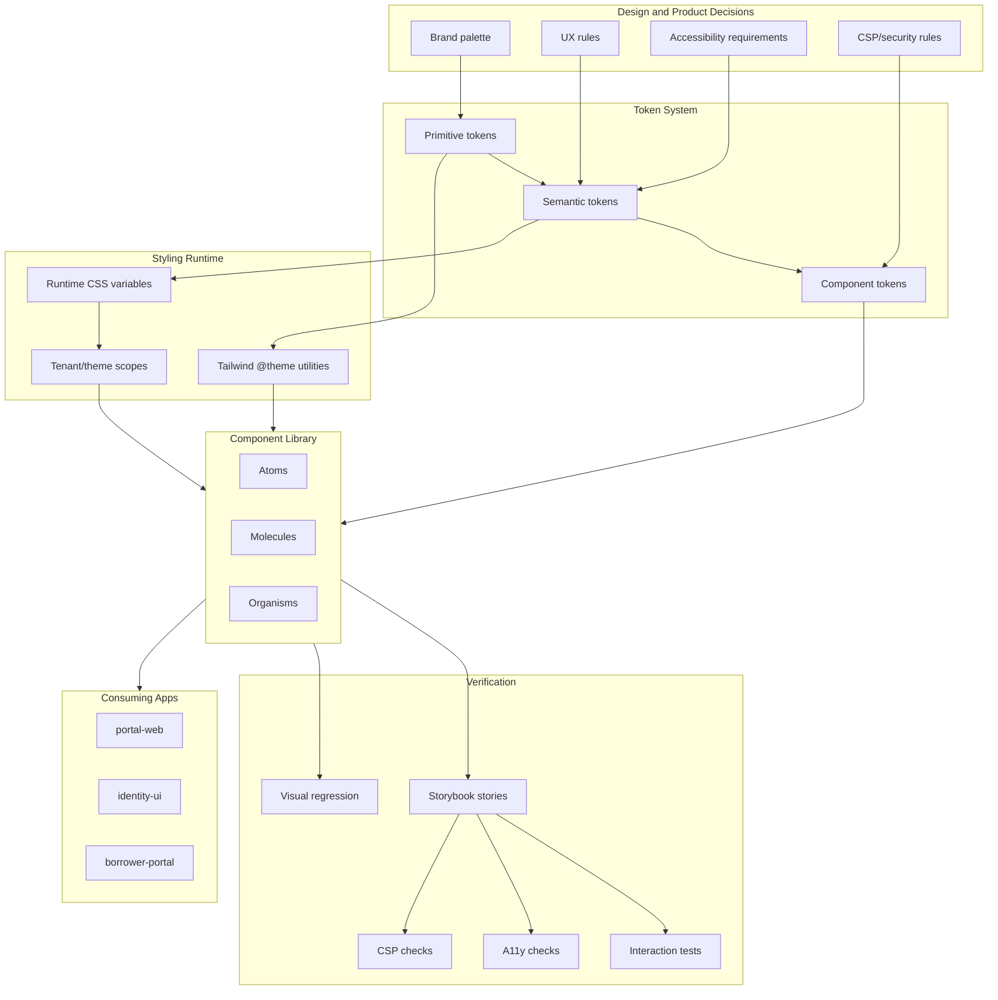

## Table of Contents

[🧠 **View Interactive Mindmap**](./design-system-architecture-mindmap.md)

1. [TL;DR](#tldr)
2. [Deep Dive](#deep-dive)
   2.1 [System Architecture](#system-architecture)
      2.1.1 [Design System Layers](#design-system-layers)
      2.1.2 [Atomic Taxonomy](#atomic-taxonomy)
      2.1.3 [Ownership and Governance](#ownership-and-governance)
   2.2 [Token Systems and Theming](#token-systems-and-theming)
      2.2.1 [Design Tokens](#design-tokens)
      2.2.2 [Token Layers](#token-layers)
      2.2.3 [Tailwind 4 Theme Variables](#tailwind-4-theme-variables)
      2.2.4 [Multi-Tenant Theming](#multi-tenant-theming)
      2.2.5 [CSP-Safe Styling](#csp-safe-styling)
   2.3 [Component API Design](#component-api-design)
      2.3.1 [Public API Surface](#public-api-surface)
      2.3.2 [Variants, Sizes, and State](#variants-sizes-and-state)
      2.3.3 [Composition and Slots](#composition-and-slots)
      2.3.4 [Accessibility Contracts](#accessibility-contracts)
      2.3.5 [Angular Implementation Patterns](#angular-implementation-patterns)
   2.4 [Storybook and Verification](#storybook-and-verification)
      2.4.1 [Story Architecture](#story-architecture)
      2.4.2 [Interaction and Accessibility Tests](#interaction-and-accessibility-tests)
      2.4.3 [Design Review and Documentation](#design-review-and-documentation)
      2.4.4 [CSP and Security Guardrails](#csp-and-security-guardrails)
   2.5 [Enterprise Operations](#enterprise-operations)
      2.5.1 [Versioning and Change Management](#versioning-and-change-management)
      2.5.2 [Performance and Bundle Strategy](#performance-and-bundle-strategy)
      2.5.3 [Migration and Adoption](#migration-and-adoption)
3. [Architecture & Data Flow](#architecture--data-flow)
4. [Real-World Examples](#real-world-examples)
   4.1 [tai-portal Design System Structure](#tai-portal-design-system-structure)
   4.2 [Token Definition with Tailwind 4](#token-definition-with-tailwind-4)
   4.3 [Button Component API](#button-component-api)
   4.4 [Form Field Composition](#form-field-composition)
   4.5 [Storybook Interaction Story](#storybook-interaction-story)
5. [Comparison Tables](#comparison-tables)
6. [Interview Q&A](#interview-qa)
   6.1 [L1: Junior Knowledge](#l1-junior-knowledge)
      6.1.1 [What is a Design System?](#what-is-a-design-system)
      6.1.2 [What is a Design Token?](#what-is-a-design-token)
   6.2 [L2: Mid-Level Knowledge](#l2-mid-level-knowledge)
      6.2.1 [Token vs CSS Variable](#token-vs-css-variable)
      6.2.2 [Storybook Beyond Screenshots](#storybook-beyond-screenshots)
      6.2.3 [Boolean Props vs Variants](#boolean-props-vs-variants)
   6.3 [L3: Senior Knowledge](#l3-senior-knowledge)
      6.3.1 [Designing Component APIs](#designing-component-apis)
      6.3.2 [Multi-Tenant Theming](#multi-tenant-theming-question)
      6.3.3 [CSP-Safe Component Library](#csp-safe-component-library)
   6.4 [Staff: System Architecture](#staff-system-architecture)
      6.4.1 [Design an Enterprise Design System](#design-an-enterprise-design-system)
      6.4.2 [Govern a Design System at Scale](#govern-a-design-system-at-scale)
7. [Cross-References](#cross-references)
8. [Further Reading](#further-reading)

---

## TL;DR

A design system is not a component folder; it is a <span style="color: #33b5e5; font-weight: bold;">productized UI platform</span> made of tokens, themes, components, documentation, tests, accessibility rules, and governance. In May 2026, a senior frontend engineer should explain design systems as layered architecture: <span style="color: #33b5e5; font-weight: bold;">primitive tokens</span> define raw design values, <span style="color: #33b5e5; font-weight: bold;">semantic tokens</span> encode product meaning, <span style="color: #33b5e5; font-weight: bold;">component tokens</span> tune specific components, and components expose stable APIs that hide implementation details. Tailwind 4's `@theme` makes design tokens part of the utility-class API, while CSS variables still handle runtime theme switching and multi-tenant branding. Storybook is the design-system workbench: stories document states, interaction tests prove behavior, accessibility checks catch regressions, and strict-CSP checks prevent unsafe styling patterns. <span style="color: #ffbb33; font-weight: bold;">The senior trade-off</span>: a mature design system optimizes consistency and velocity, but it requires ruthless API discipline, versioning, deprecation policy, and a refusal to turn every one-off screen into a reusable abstraction.

---

## Deep Dive

### System Architecture

#### Design System Layers

##### What
A <span style="color: #33b5e5; font-weight: bold;">design system</span> is a layered platform that turns brand, UX rules, accessibility, and engineering constraints into reusable UI primitives and documentation.

##### Why
Without layers, every product team reinvents colors, spacing, validation, focus states, table behavior, and responsive rules. That produces inconsistent UX, duplicated bug fixes, weak accessibility, and expensive redesigns.

##### How
Think in five layers:

| Layer | Purpose | Examples |
|-------|---------|----------|
| **Foundations** | Raw decisions | colors, typography, spacing, radius, shadows, breakpoints |
| **Tokens** | Machine-readable contracts | `--color-surface`, `--space-4`, `--radius-control` |
| **Components** | Reusable UI API | button, input, form-field, data-table, transfer-list |
| **Patterns** | Reusable workflows | search/filter/paginate, confirmation flow, permission assignment |
| **Governance** | How the system evolves | Storybook, tests, a11y, versioning, deprecations |

##### When
Use this layered model for any UI platform shared across multiple teams, tenants, brands, products, or apps.

##### Trade-offs
<span style="color: #ff4444; font-weight: bold;">A component library without tokens and governance is just shared code.</span> It may reduce duplication for a while, but it cannot reliably support theming, accessibility, or product-wide consistency.

---

#### Atomic Taxonomy

##### What
<span style="color: #33b5e5; font-weight: bold;">Atomic taxonomy</span> organizes components by composition level: atoms, molecules, and organisms.

##### Why
Without taxonomy, component libraries become a flat drawer of unrelated UI. Consumers cannot tell what is safe to compose, what owns behavior, or where feature logic belongs.

##### How
Use a pragmatic three-tier structure:

| Tier | Responsibility | Examples |
|------|----------------|----------|
| **Atoms** | Single-purpose primitives, no business logic | button, input, label, checkbox, icon, secure-input |
| **Molecules** | Small composites of atoms | form-field, dropdown-menu, toast, dialog, tile |
| **Organisms** | Complex reusable experiences | data-table, transfer-list, app-shell, notification-panel |

Rules:

- Atoms should be boring, stable, and easy to audit.
- Molecules should compose atoms and own small interaction rules.
- Organisms can coordinate internal state, accessibility patterns, and optional data-aware behavior.
- Design-system components should not fetch product data or know tenant business rules.

##### When
Use taxonomy for code organization, Storybook grouping, ownership, migration planning, and interview explanations.

##### Trade-offs
<span style="color: #ffbb33; font-weight: bold;">Atomic design is a map, not a religion.</span> A component's tier should explain its responsibility. Do not waste time debating whether every component is exactly a molecule or organism if the API boundary is clear.

---

#### Ownership and Governance

##### What
<span style="color: #33b5e5; font-weight: bold;">Design-system governance</span> is the process for adding, changing, documenting, testing, and deprecating reusable UI.

##### Why
Without governance, the design system becomes either a bottleneck controlled by one team or an inconsistent dumping ground controlled by everyone.

##### How
Strong governance defines:

- contribution criteria: when a one-off becomes reusable
- API review: naming, variants, accessibility, events, controlled/uncontrolled behavior
- token review: no new color/spacing without semantic purpose
- Storybook requirements: default, states, edge cases, interaction test
- test gates: unit, integration, visual, a11y, CSP
- release policy: semver, changelog, migration notes, deprecation windows

##### When
Apply strict governance once two or more product surfaces depend on the same components.

##### Trade-offs
<span style="color: #ffbb33; font-weight: bold;">Governance should prevent chaos, not block delivery.</span> Mature teams allow local product experimentation, then promote proven patterns into the system with review.

---

### Token Systems and Theming

#### Design Tokens

##### What
<span style="color: #33b5e5; font-weight: bold;">Design tokens</span> are named, platform-agnostic design decisions stored as data. They represent values such as color, spacing, typography, border radius, shadow, motion, and z-index.

##### Why
Without tokens, design values are scattered through CSS, components, screenshots, and Figma files. A brand update becomes a manual search-and-replace across apps.

##### How
The Design Tokens Community Group format models tokens as named values with types and optional metadata:

```json
{
  "color": {
    "brand": {
      "primary": {
        "$type": "color",
        "$value": "#1d4ed8"
      }
    }
  },
  "space": {
    "4": {
      "$type": "dimension",
      "$value": "1rem"
    }
  }
}
```

Token categories:

- color
- dimension/spacing
- typography
- font weight
- radius
- shadow
- opacity
- motion/duration/easing
- breakpoint/container
- z-index/elevation

##### When
Use tokens for any design value expected to be reused, themed, audited, or shared across platforms.

##### Trade-offs
<span style="color: #ff4444; font-weight: bold;">Do not tokenize every pixel.</span> Token systems fail when they create hundreds of names nobody understands. Tokenize decisions, not incidental measurements.

---

#### Token Layers

##### What
<span style="color: #33b5e5; font-weight: bold;">Token layering</span> separates raw values from product meaning and component implementation.

##### Why
Without layers, components depend directly on brand colors like `blue-600`. That makes theme switching and accessibility refactors expensive.

##### How
Use three layers:

| Layer | Example | Meaning |
|-------|---------|---------|
| **Primitive token** | `--color-blue-600` | raw palette value |
| **Semantic token** | `--color-action-primary` | product meaning |
| **Component token** | `--button-primary-bg` | component-specific mapping |

Example:

```css
@theme {
  --color-blue-600: oklch(0.546 0.245 262.881);
  --color-red-600: oklch(0.577 0.245 27.325);
}

:root {
  --color-action-primary: var(--color-blue-600);
  --color-danger: var(--color-red-600);
  --button-primary-bg: var(--color-action-primary);
  --button-danger-bg: var(--color-danger);
}
```

##### When
Use primitive tokens for palette and scale definition, semantic tokens for app meaning, and component tokens only where a component needs local customization.

##### Trade-offs
<span style="color: #ffbb33; font-weight: bold;">More layers add indirection.</span> The payoff is themeability and API stability; the cost is naming discipline.

---

#### Tailwind 4 Theme Variables

##### What
<span style="color: #33b5e5; font-weight: bold;">Tailwind 4 theme variables</span> are CSS variables defined with `@theme` that also generate utility classes.

##### Why
Tailwind's `@theme` connects tokens to the utility API. A variable such as `--color-brand-600` can generate utilities like `bg-brand-600` and `text-brand-600`.

##### How
Use `@theme` for design tokens that should become utility classes:

```css
@import "tailwindcss";

@theme {
  --color-brand-50: oklch(0.97 0.02 250);
  --color-brand-600: oklch(0.55 0.20 250);
  --spacing-control: 2.75rem;
  --radius-control: 0.375rem;
  --shadow-focus: 0 0 0 3px rgb(37 99 235 / 0.18);
}
```

Use regular CSS variables for runtime theme aliases that should not create new utilities:

```css
:root {
  --tai-action-primary: var(--color-brand-600);
  --tai-control-radius: var(--radius-control);
}
```

##### When
Use `@theme` for reusable token namespaces: `--color-*`, `--spacing-*`, `--radius-*`, `--shadow-*`, `--breakpoint-*`, `--container-*`, `--text-*`, and typography scales.

##### Trade-offs
<span style="color: #ff4444; font-weight: bold;">Do not let arbitrary Tailwind classes become the design API.</span> Components should expose semantic variants like `variant="primary"` rather than asking consumers to pass class strings that bypass the system.

---

#### Multi-Tenant Theming

##### What
<span style="color: #33b5e5; font-weight: bold;">Multi-tenant theming</span> lets different tenants or brands use the same component code with different semantic token values.

##### Why
In fintech, tenant branding, accessibility, and security controls must coexist. Hardcoded brand colors make white-labeling expensive and error-prone.

##### How
Use CSS variable aliases scoped by attribute or class:

```css
:root {
  --tai-action-primary: var(--color-blue-600);
  --tai-action-primary-hover: var(--color-blue-700);
  --tai-surface-page: var(--color-slate-50);
}

[data-tenant="acme-bank"] {
  --tai-action-primary: var(--color-emerald-700);
  --tai-action-primary-hover: var(--color-emerald-800);
}

[data-theme="dark"] {
  --tai-surface-page: var(--color-slate-950);
  --tai-text-primary: var(--color-slate-50);
}
```

Components consume semantic variables:

```css
.tai-button-primary {
  background: var(--tai-action-primary);
}
```

##### When
Use runtime CSS variables when tenants, dark mode, or accessibility themes can change without rebuilding the app.

##### Trade-offs
<span style="color: #ffbb33; font-weight: bold;">Runtime theming needs guardrails.</span> Every tenant palette must pass contrast checks, focus-visible checks, and disabled-state checks. Token flexibility without validation creates inaccessible themes.

---

#### CSP-Safe Styling

##### What
<span style="color: #33b5e5; font-weight: bold;">CSP-safe styling</span> means components do not require inline styles, runtime style injection, `eval`, or unsafe third-party styling behavior.

##### Why
Strict fintech CSP often requires `style-src 'self'` and `script-src 'self'` without `unsafe-inline` or `unsafe-eval`. Component libraries that inject inline positioning or animation styles create audit risk.

##### How
Use:

- build-time CSS and Tailwind utilities
- CSS variables from stylesheets, not `[style]`
- class-based state
- CSS anchor/layout primitives where appropriate
- explicit Storybook CSP checks for `[style]`
- no `innerHTML` for label/error rendering

Avoid:

- `[style]` bindings for layout or theming
- component APIs like `style?: string`
- runtime-generated `<style>` tags
- unreviewed third-party overlays/ripples

##### When
Use CSP-safe rules for every shared component in a financial or security-sensitive product.

##### Trade-offs
<span style="color: #ffbb33; font-weight: bold;">Strict CSP narrows implementation choices.</span> It may require custom overlay/menu positioning instead of convenient third-party primitives, but it makes the audit surface smaller and more predictable.

---

### Component API Design

#### Public API Surface

##### What
A <span style="color: #33b5e5; font-weight: bold;">component API</span> is the contract consumers use: inputs, outputs, projected content, CSS parts/classes, events, accessibility requirements, and test hooks.

##### Why
Component APIs are expensive to change. A bad API spreads across hundreds of screens and becomes harder to fix than the implementation.

##### How
Design APIs around user intent, not implementation:

```typescript
export type TaiButtonVariant = 'primary' | 'secondary' | 'ghost' | 'danger';
export type TaiButtonType = 'button' | 'submit' | 'reset';

@Component({
  selector: 'tai-button',
  changeDetection: ChangeDetectionStrategy.OnPush,
})
export class ButtonComponent {
  readonly type = input<TaiButtonType>('button');
  readonly variant = input<TaiButtonVariant>('primary');
  readonly disabled = input(false);
  readonly ariaLabel = input('');
  readonly pressed = output<MouseEvent>();
}
```

API rules:

- names should match product meaning
- defaults should be safe
- events should be named by intent, not DOM mechanics
- inputs should be typed unions, not arbitrary strings
- avoid exposing internal Tailwind classes as the main customization path
- support stable test hooks when needed

##### When
Review API design before implementation. API mistakes are easier to fix before consumers adopt the component.

##### Trade-offs
<span style="color: #ff4444; font-weight: bold;">A flexible API is not automatically a good API.</span> Escape hatches like `class`, `style`, and custom templates can destroy consistency if they become the default.

---

#### Variants, Sizes, and State

##### What
<span style="color: #33b5e5; font-weight: bold;">Variants</span> encode semantic visual intent, while <span style="color: #33b5e5; font-weight: bold;">state</span> encodes interaction or validation status.

##### Why
Without explicit variant/state modeling, component APIs devolve into boolean prop combinations that conflict.

##### How
Prefer discriminated unions and small enums:

```typescript
type AlertTone = 'info' | 'success' | 'warning' | 'danger';
type ControlSize = 'sm' | 'md' | 'lg';
type ValidationState = 'valid' | 'invalid' | 'pending';
```

Avoid boolean explosions:

```typescript
// Avoid
<tai-button [primary]="true" [danger]="true" [large]="true" />

// Prefer
<tai-button variant="danger" size="lg" />
```

##### When
Use variants when consumers choose a semantic mode. Use internal state for hover, focus, active, disabled, loading, invalid, expanded, selected, and busy.

##### Trade-offs
<span style="color: #ffbb33; font-weight: bold;">Every variant is a test matrix multiplier.</span> If a button has 5 variants, 3 sizes, 4 states, and dark mode, Storybook and visual tests must cover the meaningful combinations.

---

#### Composition and Slots

##### What
<span style="color: #33b5e5; font-weight: bold;">Composition</span> lets consumers assemble components without the design system predicting every use case. In Angular, composition usually uses content projection, template refs, or small components.

##### Why
Without composition, components become kitchen-sink APIs with dozens of inputs. With too much composition, consumers can break accessibility and visual consistency.

##### How
Use composition for content, not for core behavior:

```html
<tai-form-field
  controlId="email"
  label="Email address"
  [error]="emailError()"
>
  <tai-input
    id="email"
    type="email"
    [invalid]="!!emailError()"
  />
</tai-form-field>
```

Design composition boundaries:

- labels/errors should remain connected through IDs and `aria-describedby`
- icons should use a standard icon atom
- menus and dialogs should own keyboard behavior
- data-table cells may accept templates, but table semantics remain owned by the table

##### When
Use slots/projection when content varies but behavior should remain stable. Use a new component when behavior changes enough to require a separate accessibility contract.

##### Trade-offs
<span style="color: #ff4444; font-weight: bold;">Template escape hatches can bypass accessibility.</span> If a slot allows arbitrary interactive content, document keyboard and ARIA responsibilities explicitly.

---

#### Accessibility Contracts

##### What
An <span style="color: #33b5e5; font-weight: bold;">accessibility contract</span> defines what the component guarantees and what the consumer must provide.

##### Why
Accessibility cannot be added only by tests. Components need built-in roles, keyboard behavior, focus management, labels, error association, and reduced-motion support.

##### How
Every component API should answer:

- What role does it expose?
- How is it labelled?
- What keyboard interaction is supported?
- How are errors and hints associated?
- What focus behavior is expected?
- What states are exposed to assistive tech?
- What does the consumer need to pass?

Example:

```typescript
readonly ariaLabel = input('');
readonly describedBy = input('');
readonly invalid = input(false);
readonly disabled = input(false);
```

##### When
Define accessibility contracts for every interactive component before implementation.

##### Trade-offs
<span style="color: #ff4444; font-weight: bold;">A visually correct component can still be unusable.</span> A design system is responsible for accessibility defaults, not just colors and spacing.

---

#### Angular Implementation Patterns

##### What
Modern Angular design-system components should be standalone, OnPush, signal-driven, typed, and free of app business logic.

##### Why
Without strict implementation patterns, shared components become unstable, hard to test, and difficult to migrate to zoneless rendering.

##### How
Use:

- `standalone: true`
- `ChangeDetectionStrategy.OnPush`
- `input()`, `output()`, `computed()`
- immutable local state
- content projection for controlled extension points
- no API calls in presentational components
- no JWT/token parsing or tenant business logic
- CSS classes and variables instead of inline styles

##### When
Use this for atoms, molecules, and most organisms. Data-aware organisms should receive data through inputs or injected adapter interfaces, not fetch directly.

##### Trade-offs
<span style="color: #ffbb33; font-weight: bold;">A design-system organism can own UI behavior but should not own product data.</span> A data-table can own sorting UI; the feature decides what API call sorting triggers.

---

### Storybook and Verification

#### Story Architecture

##### What
<span style="color: #33b5e5; font-weight: bold;">Storybook stories</span> are executable examples of component states, props, interactions, and documentation.

##### Why
Without stories, a design system has hidden behavior. Engineers must read source code to discover variants, states, and edge cases.

##### How
Use Component Story Format with typed metadata:

```typescript
import type { Meta, StoryObj } from '@storybook/angular';

import { ButtonComponent } from './button.component';

const meta: Meta<ButtonComponent> = {
  title: 'Atoms/Button',
  component: ButtonComponent,
  tags: ['autodocs'],
  args: {
    variant: 'primary',
    disabled: false,
  },
};

export default meta;
type Story = StoryObj<ButtonComponent>;

export const Primary: Story = {};
export const Danger: Story = {
  args: { variant: 'danger' },
};
```

Story coverage:

- default state
- every meaningful variant
- disabled/loading/error/empty states
- keyboard interaction
- mobile/responsive state
- dark/high-contrast theme
- long text and localization
- permission or security state where relevant

##### When
Require stories for every public component. Storybook is part of the component API review, not a nice-to-have demo.

##### Trade-offs
<span style="color: #ffbb33; font-weight: bold;">Stories rot if they only show the happy path.</span> Treat stories as executable documentation and keep them in CI.

---

#### Interaction and Accessibility Tests

##### What
<span style="color: #33b5e5; font-weight: bold;">Storybook interaction tests</span> use `play` functions to exercise components in the browser. Accessibility tests use tools such as axe to catch common WCAG issues.

##### Why
Unit tests catch logic bugs, but many component failures are interaction bugs: focus does not move, escape does not close, disabled controls still emit, errors are not announced, or keyboard navigation breaks.

##### How
Use `play` functions for behavior:

```typescript
export const EmitsPressed: Story = {
  args: {
    pressed: fn(),
  },
  play: async ({ canvasElement, args }) => {
    const canvas = within(canvasElement);
    await userEvent.click(canvas.getByRole('button'));
    await expect(args.pressed).toHaveBeenCalled();
  },
};
```

Add a11y checks in Storybook test runner or CI:

- no missing labels
- valid roles
- focus-visible states
- color contrast
- no keyboard traps
- reduced-motion support

##### When
Use interaction stories for controls, forms, menus, dialogs, tables, transfer lists, and any component with emitted events.

##### Trade-offs
<span style="color: #ffbb33; font-weight: bold;">Interaction tests are slower than unit tests but closer to user behavior.</span> Use them for public component contracts, not every internal branch.

---

#### Design Review and Documentation

##### What
<span style="color: #33b5e5; font-weight: bold;">Design-system documentation</span> explains API, intent, accessibility, theming, examples, and migration notes.

##### Why
Without documentation, consumers misuse components and copy snippets from old code.

##### How
Each component doc should include:

- purpose and non-goals
- anatomy
- inputs/outputs
- states and variants
- accessibility contract
- theming hooks
- do/don't examples
- migration notes
- known limitations

##### When
Document public APIs at the same time as stories and tests.

##### Trade-offs
<span style="color: #ffbb33; font-weight: bold;">Docs are part of the API surface.</span> Incorrect docs are worse than missing docs because they teach consumers the wrong contract.

---

#### CSP and Security Guardrails

##### What
<span style="color: #33b5e5; font-weight: bold;">Security guardrails</span> are automated checks that prevent design-system components from violating CSP, Trusted Types, or data-handling rules.

##### Why
Security-sensitive UI cannot rely on manual code review to catch every inline style or unsafe content binding.

##### How
Guardrails:

- Storybook test runner checks for `[style]`
- ESLint/template rules block `[innerHTML]` unless explicitly reviewed
- strict component APIs avoid `style` inputs
- secure-input components control autocomplete, clipboard, and PII display
- no runtime CSS injection from third-party UI libraries
- no business secrets in stories

##### When
Use security guardrails for every component in fintech, healthcare, banking, or admin systems.

##### Trade-offs
<span style="color: #ffbb33; font-weight: bold;">Guardrails can feel restrictive, but they keep regressions cheap.</span> The alternative is discovering unsafe patterns during pen-test or production audit.

---

### Enterprise Operations

#### Versioning and Change Management

##### What
<span style="color: #33b5e5; font-weight: bold;">Design-system versioning</span> controls how changes reach consuming apps.

##### Why
Without versioning discipline, a visual tweak can silently break workflows across multiple apps.

##### How
Use:

- semantic versioning for published packages
- Nx affected checks for monorepos
- changelogs with migration notes
- deprecation warnings before removal
- codemods for mechanical migrations
- visual regression for high-risk changes

##### When
Use formal versioning once multiple apps consume the library or release cadence differs between teams.

##### Trade-offs
<span style="color: #ffbb33; font-weight: bold;">Strict versioning slows casual changes but protects consumers.</span> The design system should make safe changes easy and breaking changes explicit.

---

#### Performance and Bundle Strategy

##### What
<span style="color: #33b5e5; font-weight: bold;">Design-system performance</span> is the cost shared UI adds to every application.

##### Why
A bloated component library hurts all products. Large icon sets, chart libraries, date libraries, and overlay dependencies can dominate bundles.

##### How
Use:

- standalone components for tree shaking
- secondary entry points or tier barrels
- lazy-load heavy organisms
- self-hosted icons or per-icon imports
- no global side effects in component modules
- OnPush and signals for predictable rendering
- virtualization for large tables/lists

##### When
Evaluate bundle impact for every new dependency and every organism-level component.

##### Trade-offs
<span style="color: #ff4444; font-weight: bold;">The design system should not make every app pay for every component.</span> Heavy components need lazy boundaries.

---

#### Migration and Adoption

##### What
<span style="color: #33b5e5; font-weight: bold;">Adoption strategy</span> moves teams from one-off UI to shared components without freezing product delivery.

##### Why
Design systems fail when they demand a big-bang rewrite or ignore existing product constraints.

##### How
Use incremental adoption:

1. inventory repeated UI
2. extract atoms and molecules first
3. codify tokens and theming
4. replace high-churn components
5. add Storybook and test guardrails
6. migrate organisms and workflows
7. deprecate old components with migration docs

##### When
Use incremental adoption in active products where teams must keep shipping.

##### Trade-offs
<span style="color: #ffbb33; font-weight: bold;">A mixed UI period is unavoidable.</span> The goal is to make the path from old to new obvious and measurable.

---

## Architecture & Data Flow



---

## Real-World Examples

### tai-portal Design System Structure

`📍 From tai-portal:` `libs/ui/design-system/src/lib`

The current design-system library is organized by tier:

```text
libs/ui/design-system/src/lib/
├── atoms/
│   ├── button/
│   ├── checkbox/
│   ├── icon/
│   ├── input/
│   ├── label/
│   └── secure-input/
├── molecules/
│   ├── dropdown-menu/
│   ├── form-field/
│   ├── toast/
│   └── security-alert/
├── organisms/
│   ├── app-shell/
│   ├── data-table/
│   ├── transfer-list/
│   └── notification-panel/
└── directives/
    └── has-privilege.directive.ts
```

This structure makes the architecture visible: atoms are primitives, molecules compose primitives, and organisms own complex interaction patterns.

### Token Definition with Tailwind 4

`🔧 Fits tai-portal:` CSP-safe Tailwind 4 token setup

```css
@import "tailwindcss";

@theme {
  --color-portal-blue-600: oklch(0.546 0.245 262.881);
  --color-portal-red-600: oklch(0.577 0.245 27.325);
  --radius-control: 0.375rem;
  --spacing-touch: 2.75rem;
}

:root {
  --tai-action-primary: var(--color-portal-blue-600);
  --tai-danger: var(--color-portal-red-600);
  --tai-control-radius: var(--radius-control);
}
```

`@theme` creates utility classes for tokenized values, while `:root` aliases support runtime theme switching without inline styles.

### Button Component API

`📍 From tai-portal:` `libs/ui/design-system/src/lib/atoms/button/button.component.ts`

The button atom exposes semantic variants and uses signal inputs:

```typescript
export type TaiButtonVariant = 'primary' | 'secondary' | 'ghost' | 'danger';
export type TaiButtonType = 'button' | 'submit' | 'reset';

@Component({
  selector: 'tai-button',
  standalone: true,
  changeDetection: ChangeDetectionStrategy.OnPush,
})
export class ButtonComponent {
  readonly type = input<TaiButtonType>('button');
  readonly variant = input<TaiButtonVariant>('primary');
  readonly disabled = input<boolean>(false);
  readonly ariaLabel = input<string>('');
  readonly testId = input<string>('');
  readonly pressed = output<MouseEvent>();
}
```

The important design choice is `variant`, not `primary`, `secondary`, and `danger` booleans. The API prevents invalid combinations.

### Form Field Composition

`📍 From tai-portal:` `libs/ui/design-system/src/lib/molecules/form-field/form-field.component.ts`

The form-field molecule owns label, hint, error, and `aria-describedby` composition:

```typescript
@Component({
  selector: 'tai-form-field',
  standalone: true,
  changeDetection: ChangeDetectionStrategy.OnPush,
})
export class FormFieldComponent {
  readonly controlId = input.required<string>();
  readonly label = input.required<string>();
  readonly hint = input<string>('');
  readonly error = input<string>('');
  readonly required = input<boolean>(false);

  readonly hintId = computed(() => `${this.controlId()}-hint`);
  readonly errorId = computed(() => `${this.controlId()}-error`);
  readonly describedBy = computed(() => {
    const ids: string[] = [];
    if (this.hint()) ids.push(this.hintId());
    if (this.error()) ids.push(this.errorId());
    return ids.join(' ');
  });
}
```

This is good molecule design: it packages repeated accessibility wiring without owning product form logic.

### Storybook Interaction Story

`🔧 Fits tai-portal:` button interaction contract

```typescript
export const EmitsPressed: Story = {
  args: {
    pressed: fn(),
  },
  play: async ({ canvasElement, args }) => {
    const canvas = within(canvasElement);
    const button = canvas.getByRole('button');

    await userEvent.click(button);

    await expect(args.pressed).toHaveBeenCalledTimes(1);
  },
};
```

The story documents and tests the public contract: clicking the enabled button emits `pressed`.

---

## Comparison Tables

| Dimension | Primitive Token | Semantic Token | Component Token |
|-----------|-----------------|----------------|-----------------|
| **Meaning** | Raw value | Product purpose | Component mapping |
| **Example** | `--color-blue-600` | `--color-action-primary` | `--button-primary-bg` |
| **Stability** | Changes with palette | Changes with UX semantics | Changes with component design |
| **Consumer usage** | Rare | Common in app CSS | Internal to component |
| **Risk** | Too low-level | Naming drift | Over-customization |

| Dimension | Tailwind Utility API | Component API |
|-----------|----------------------|---------------|
| **Best use** | Internal implementation and layout | Consumer-facing design-system contract |
| **Example** | `px-4 min-h-11` | `variant="primary"` |
| **Strength** | Fast, consistent primitives | Stable semantic usage |
| **Risk** | Class soup and bypassed design | Over-abstraction |
| **Senior rule** | Use utilities behind components | Expose meaning, not CSS |

| Dimension | Unit Test | Storybook Interaction | Visual Regression |
|-----------|-----------|-----------------------|-------------------|
| **Catches** | logic and emitted events | user behavior and accessibility flow | visual layout changes |
| **Speed** | fastest | medium | slower |
| **Best for** | class methods, state transitions | menus, dialogs, forms, buttons | theming, density, responsive layouts |
| **Weakness** | not browser-real enough | can be overused | can produce noisy diffs |
| **Design-system use** | every component | every interactive component | high-value components and themes |

| Dimension | Headless Component | Styled Component |
|-----------|--------------------|------------------|
| **Owns** | behavior and accessibility | behavior, accessibility, and visuals |
| **Best use** | advanced composition | enterprise consistency |
| **Consumer freedom** | high | moderate |
| **Risk** | inconsistent visuals | less flexible |
| **tai-portal stance** | headless behavior where needed, styled APIs for common controls |

---

## Interview Q&A

### L1: Junior Knowledge

#### What is a Design System?
**Difficulty:** L1 (Junior)

**Question:** What is a design system?

**Answer:** A design system is a shared set of design decisions, tokens, components, patterns, documentation, and tests used to build consistent products. It is more than a component library because it includes rules for theming, accessibility, usage, and governance.

---

#### What is a Design Token?
**Difficulty:** L1 (Junior)

**Question:** What is a design token?

**Answer:** A design token is a named design decision stored in code or data. Examples include color, spacing, radius, typography, shadow, and motion values. Tokens let design and engineering change a value in one place and apply it consistently.

---

### L2: Mid-Level Knowledge

#### Token vs CSS Variable
**Difficulty:** L2 (Mid-Level)

**Question:** Is a design token the same thing as a CSS variable?

**Answer:** No. A design token is the design decision; a CSS variable is one possible web implementation of that decision. The same token can be exported to CSS variables, iOS values, Android resources, Figma variables, or documentation. In Tailwind 4, `@theme` variables also generate utility classes, so they bridge token definition and utility API.

---

#### Storybook Beyond Screenshots
**Difficulty:** L2 (Mid-Level)

**Question:** Why use Storybook if the app already has pages?

**Answer:** Storybook isolates component states that are hard to reach in the app: loading, empty, error, disabled, long text, dark mode, high contrast, and permission variants. It also supports executable interaction tests and documentation. For design systems, Storybook is not just a gallery; it is a verification workbench for component APIs.

---

#### Boolean Props vs Variants
**Difficulty:** L2 (Mid-Level)

**Question:** Why are variants better than many boolean inputs?

**Answer:** Boolean inputs can create invalid combinations like `primary=true` and `danger=true` at the same time. A typed variant such as `'primary' | 'secondary' | 'danger'` makes impossible states unrepresentable. It also makes Storybook controls, docs, and tests clearer.

---

### L3: Senior Knowledge

#### Designing Component APIs
**Difficulty:** L3 (Senior)

**Question:** How do you design a reusable component API?

**Answer:** I start with the user intent and accessibility contract, not the visual implementation. Inputs should be typed, semantic, and small; outputs should describe user intent; projection should be allowed only where it will not break behavior or accessibility. I avoid boolean prop explosions and avoid exposing raw styling as the main customization path. For Angular, I prefer standalone OnPush components with signal inputs, computed derived state, and explicit outputs. I require stories for every meaningful state and interaction tests for every public behavior. The key is to make the component easy to use correctly and hard to use incorrectly.

---

#### Multi-Tenant Theming Question
**Difficulty:** L3 (Senior)

**Question:** How would you support multi-tenant theming in a fintech portal?

**Answer:** I would separate primitive tokens from semantic tokens and component tokens. Primitive tokens define palette and scales; semantic tokens define product meaning such as `action-primary`, `surface-page`, and `text-danger`; component tokens map those semantics into component internals. Tailwind 4 `@theme` can generate utility classes for stable token namespaces, while runtime CSS variables scoped by `[data-tenant]` or `[data-theme]` enable tenant switching without rebuilds. I would validate every tenant theme for contrast, focus-visible states, disabled states, and dark/high-contrast behavior. For CSP, I would avoid inline styles and runtime style injection, keeping theme values in stylesheet-delivered CSS variables.

---

#### CSP-Safe Component Library
**Difficulty:** L3 (Senior)

**Question:** How do strict CSP requirements affect design-system architecture?

**Answer:** Strict CSP pushes the design system toward build-time CSS, class-based state, CSS variables, and controlled dependencies. Components should not require `[style]` bindings, runtime `<style>` injection, `innerHTML`, unsafe overlays, or animation systems that need inline styles. Storybook and CI should include CSP-oriented checks such as scanning rendered stories for inline styles. The upside is a smaller audit surface and fewer third-party security surprises. The trade-off is that the team may need custom menu/dialog/overlay primitives instead of convenient libraries that rely on runtime style injection.

---

### Staff: System Architecture

#### Design an Enterprise Design System
**Difficulty:** Staff

**Question:** Design a design system for a multi-tenant Angular fintech platform.

**Answer:** I would build the system as a platform with tokens, components, Storybook, tests, release governance, and migration tooling. Tokens would be layered into primitive, semantic, and component tokens, with Tailwind 4 `@theme` for utility generation and runtime CSS variables for tenant/dark/high-contrast themes. Components would be organized as atoms, molecules, and organisms, implemented as standalone OnPush Angular components with signal inputs and outputs. The component APIs would expose semantic variants instead of raw classes, with strict accessibility contracts for every interactive control. Storybook would document all variants, edge states, responsive states, and tenant themes; interaction tests and axe checks would run in CI. Security guardrails would block inline styles, unsafe HTML, and dependency patterns that violate CSP. Release management would use semver, changelogs, Nx affected checks, deprecation policy, and migration docs. I would start by extracting high-frequency atoms and molecules, then move into organisms like data-table and transfer-list once the token and API rules are stable.

---

#### Govern a Design System at Scale
**Difficulty:** Staff

**Question:** How do you prevent a design system from becoming a bottleneck or dumping ground?

**Answer:** I would create clear promotion rules: product teams can experiment locally, but reusable components need API, accessibility, token, and Storybook review before entering the design system. The design-system team should own foundations, API standards, and governance, while product teams contribute components with review. Every new component needs a purpose statement, non-goals, stories, interaction tests, a11y checks, and migration guidance if replacing old UI. I would use contribution templates and automated CI guardrails so review focuses on architecture rather than formatting. Breaking changes need semver, changelog entries, and deprecation periods. The system should measure adoption, duplicate UI, accessibility defects, and migration progress. The cultural goal is not central control; it is making the correct UI path faster than building one-off alternatives.

---

## Cross-References

- [[Angular-Core]] - standalone components, DI, signals, and Angular component architecture.
- [[Change-Detection-Signals]] - OnPush, signal inputs, computed state, and zoneless-ready component design.
- [[Testing-Frontend]] - Storybook, interaction tests, a11y tests, and frontend verification patterns.
- [[Security-CSP-DPoP]] - strict CSP, Trusted Types, DPoP, and secure frontend constraints.
- [[Nx-Monorepo]] - project boundaries, affected commands, and package governance.
- [[Performance-Optimization]] - bundle size, Core Web Vitals, and rendering performance.

---

## Further Reading

- Tailwind CSS theme variables: https://tailwindcss.com/docs/theme
- Storybook writing stories: https://storybook.js.org/docs/writing-stories
- Storybook interaction testing: https://storybook.js.org/docs/writing-tests/interaction-testing
- Design Tokens Format Module: https://www.designtokens.org/tr/drafts/format/
- Web Content Accessibility Guidelines: https://www.w3.org/WAI/standards-guidelines/wcag/

---

*Last updated: 2026-04-30*
