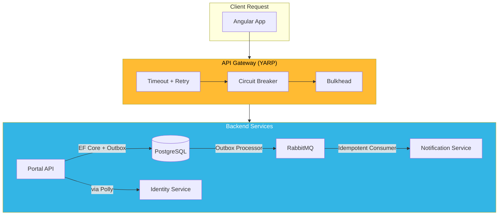

## Table of Contents

[🧠 **View Interactive Mindmap**](./distributed-systems-mindmap.md)

1. [TL;DR](#tldr)
2. [Deep Dive](#deep-dive)
   2.1 [Consistency Models](#concept-group-1-consistency-models)
      2.1.1 [CAP Theorem & Real-World Trade-offs](#1-cap-theorem--real-world-trade-offs)
      2.1.2 [Consistency Spectrum](#2-consistency-spectrum)
      2.1.3 [Read-Your-Writes & Session Guarantees](#3-read-your-writes--session-guarantees)
   2.2 [Resilience Patterns](#concept-group-2-resilience-patterns)
      2.2.1 [Circuit Breaker (Polly)](#4-circuit-breaker-polly)
      2.2.2 [Retry with Exponential Backoff & Jitter](#5-retry-with-exponential-backoff--jitter)
      2.2.3 [Bulkhead Isolation & Timeout](#6-bulkhead-isolation--timeout)
   2.3 [Transaction Patterns](#concept-group-3-transaction-patterns)
      2.3.1 [Saga Pattern — Choreography vs Orchestration](#7-saga-pattern--choreography-vs-orchestration)
      2.3.2 [Transactional Outbox](#8-transactional-outbox)
      2.3.3 [Idempotent Consumers](#9-idempotent-consumers)
   2.4 [Failure Modes](#concept-group-4-failure-modes)
      2.4.1 [Network Partitions & Split Brain](#10-network-partitions--split-brain)
      2.4.2 [Cascading Failures & Thundering Herd](#11-cascading-failures--thundering-herd)
3. [Architecture & Data Flow](#architecture--data-flow)
4. [Real-World Examples](#real-world-examples)
   4.1 [Polly Resilience Pipeline](#1-polly-resilience-pipeline)
   4.2 [Outbox Pattern with EF Core](#2-outbox-pattern-with-ef-core)
   4.3 [Idempotent Consumer with Deduplication](#3-idempotent-consumer-with-deduplication)
5. [Comparison Tables](#comparison-tables)
6. [Interview Q&A](#interview-qa)
   6.1 [L1: Junior](#l1-junior-knowledge)
   6.2 [L2: Mid-Level](#l2-mid-level-knowledge)
   6.3 [L3: Senior](#l3-senior-knowledge)
   6.4 [Staff](#staff-system-architecture)
7. [Cross-References](#cross-references)
8. [Further Reading](#further-reading)

---

## TL;DR

Distributed systems introduce failures that don't exist in single-process applications: <span style="color: #ff4444; font-weight: bold;">network partitions</span>, <span style="color: #ff4444; font-weight: bold;">partial failures</span> (one service succeeds, another fails), and <span style="color: #ff4444; font-weight: bold;">consistency challenges</span> (CAP theorem forces you to choose between consistency and availability during partitions). The 2026 .NET resilience stack uses <span style="color: #33b5e5; font-weight: bold;">Polly v8</span> for circuit breakers, retries with exponential backoff + jitter, and bulkhead isolation. For cross-service data consistency, the <span style="color: #33b5e5; font-weight: bold;">Transactional Outbox</span> pattern guarantees at-least-once event delivery by writing domain events to a database table inside the same transaction as the business change, then publishing them asynchronously. <span style="color: #ffbb33; font-weight: bold;">The key interview insight</span>: distributed systems don't fail cleanly — they fail partially, slowly, and ambiguously. Senior engineers design for <span style="color: #00C851; font-weight: bold;">graceful degradation</span>, not perfection.

---

## Deep Dive

### Concept Group 1: Consistency Models

#### 1. CAP Theorem & Real-World Trade-offs

##### What
The <span style="color: #33b5e5; font-weight: bold;">CAP theorem</span> states that during a network partition, a distributed system must choose between **Consistency** (every read returns the latest write) and **Availability** (every request receives a response). You cannot have both during a partition. All three (C, A, P) are available when the network is healthy.

##### Why
Without understanding CAP, engineers design systems that assume both consistency and availability — then are surprised when a network partition causes stale reads or timeouts. CAP forces explicit trade-off decisions: "During a partition, should we return stale data (AP) or reject the request (CP)?"

##### How

| Choice | Behavior During Partition | Example |
|--------|--------------------------|---------|
| **CP** | Rejects writes/reads until partition heals | PostgreSQL primary-replica with synchronous replication |
| **AP** | Returns potentially stale data, reconciles later | DNS, Cassandra, Redis with async replication |

In tai-portal's architecture:
- **PostgreSQL** → CP (single primary, rejects writes if primary is unreachable)
- **Redis cache** → AP (returns cached data even if the source has been updated)
- **RabbitMQ** → Designed for partition tolerance with quorum queues

##### When
Choose CP for financial transactions, identity/auth decisions, and multi-tenant data isolation where stale data causes security issues. Choose AP for caching, search indices, analytics, and read-heavy pages where showing slightly stale data is acceptable.

##### Trade-offs
<span style="color: #ff4444; font-weight: bold;">CAP is often oversimplified</span> — real systems make different trade-offs per operation, not per system. A single API might use CP for writes (PostgreSQL) and AP for reads (Redis cache). <span style="color: #ffbb33; font-weight: bold;">PACELC extends CAP</span>: even without a partition, there's a latency/consistency trade-off — synchronous replication is consistent but slow; asynchronous is fast but eventually consistent.

---

#### 2. Consistency Spectrum

##### What
Consistency exists on a spectrum: <span style="color: #33b5e5; font-weight: bold;">Strong</span> (linearizable — every read sees the latest write), <span style="color: #33b5e5; font-weight: bold;">Causal</span> (operations that causally depend on each other are seen in order), <span style="color: #33b5e5; font-weight: bold;">Eventual</span> (all replicas converge given enough time, but reads may return stale data).

##### Why
"Eventual consistency" is often used as a hand-wave to avoid thinking about ordering. Understanding the spectrum lets you pick the cheapest consistency model that satisfies your requirements. User approval doesn't need linearizability — causal consistency (admin approves → user sees approval) is sufficient and much cheaper.

##### How

| Model | Guarantee | Cost | tai-portal Use |
|-------|-----------|------|---------------|
| **Strong** | Read always returns latest write | High latency, single leader | User status changes (PostgreSQL) |
| **Causal** | Cause precedes effect | Medium — vector clocks or session tokens | Event ordering (MediatR dispatch) |
| **Eventual** | All replicas converge eventually | Low — async replication | Cache invalidation, search index updates |

##### When
Default to <span style="color: #00C851; font-weight: bold;">eventual consistency</span> and upgrade only where needed. Ask: "What's the worst that happens if the user sees stale data for 5 seconds?" If the answer is "nothing important," eventual is fine. If the answer is "they see another tenant's data," you need strong consistency.

##### Trade-offs
<span style="color: #ffbb33; font-weight: bold;">Stronger consistency = higher latency and lower throughput.</span> Strong consistency requires synchronous coordination (leader waits for follower acknowledgment). Eventual consistency allows fire-and-forget — the write returns immediately.

---

#### 3. Read-Your-Writes & Session Guarantees

##### What
<span style="color: #33b5e5; font-weight: bold;">Read-your-writes</span> guarantees that after a user writes data, their subsequent reads reflect that write — even if the system is eventually consistent for other users.

##### Why
Without read-your-writes, a user submits a form, the page refreshes, and their change isn't visible yet — causing confusion and duplicate submissions. This is the most common "eventual consistency feels broken" scenario.

##### How

```csharp
// Strategy 1: Read from primary after write
public async Task<UserDto> ApproveAndGetUser(ApproveCommand cmd) {
    await _mediator.Send(cmd);  // Writes to primary
    // Read from primary, not replica, to guarantee read-your-writes
    return await _context.Users
        .FromSqlRaw("/*+ NO_REPLICA */ SELECT * FROM users WHERE id = {0}", cmd.UserId)
        .FirstOrDefaultAsync();
}

// Strategy 2: Return the written data directly (tai-portal approach)
public async Task<UserDto> ApproveAndGetUser(ApproveCommand cmd) {
    var user = await _userManager.FindByIdAsync(cmd.UserId);
    user.Approve(cmd.ApprovedBy);
    await _context.SaveChangesAsync();
    return _mapper.Map<UserDto>(user);  // Return from in-memory entity
}
```

##### When
Apply read-your-writes for user-facing write operations where the user expects to see their change immediately. For background processes or admin dashboards, eventual consistency is acceptable.

##### Trade-offs
<span style="color: #ffbb33; font-weight: bold;">Reading from primary after every write defeats the purpose of read replicas.</span> The tai-portal approach (return the entity from memory) avoids this problem entirely for single-entity operations. For list views, accept a brief delay or use optimistic UI updates on the frontend.

---

### Concept Group 2: Resilience Patterns

#### 4. Circuit Breaker (Polly)

##### What
A <span style="color: #33b5e5; font-weight: bold;">circuit breaker</span> monitors calls to an external service and "trips" (opens) when failures exceed a threshold, preventing further calls for a cooldown period. It protects against cascading failures when a dependency is down.

##### Why
Without a circuit breaker, if the Identity service is down, every request to the API gateway times out after 30 seconds — backing up thread pool threads, exhausting connections, and eventually crashing the gateway. A circuit breaker fails fast (milliseconds) instead of timing out (seconds), preserving system resources.

##### How

```csharp
// Polly v8 resilience pipeline (Microsoft.Extensions.Http.Resilience)
services.AddHttpClient("identity-service")
    .AddResilienceHandler("default", builder => {
        // Circuit breaker — opens after 3 failures in 30 seconds
        builder.AddCircuitBreaker(new CircuitBreakerStrategyOptions<HttpResponseMessage> {
            FailureRatio = 0.5,
            SamplingDuration = TimeSpan.FromSeconds(30),
            MinimumThroughput = 3,
            BreakDuration = TimeSpan.FromSeconds(15),
            ShouldHandle = new PredicateBuilder<HttpResponseMessage>()
                .HandleResult(r => r.StatusCode == HttpStatusCode.ServiceUnavailable)
                .Handle<HttpRequestException>()
                .Handle<TimeoutRejectedException>()
        });
    });
```

States: **Closed** (normal — requests pass through) → **Open** (tripped — all requests fail immediately) → **Half-Open** (test — allow one request; if it succeeds, close; if it fails, reopen).

##### When
Use circuit breakers on all outgoing HTTP calls to external services. Don't use them for database calls (use connection pool timeouts instead) or in-process calls (use exceptions).

##### Trade-offs
<span style="color: #ffbb33; font-weight: bold;">A tripped circuit breaker means 100% failure for that dependency</span> — you need a fallback strategy (cached data, degraded response, queue for retry). <span style="color: #ff4444; font-weight: bold;">Tuning thresholds is hard</span> — too sensitive and it trips on transient blips; too lenient and it doesn't protect fast enough.

---

#### 5. Retry with Exponential Backoff & Jitter

##### What
<span style="color: #33b5e5; font-weight: bold;">Retry with exponential backoff</span> retries failed requests with increasing delays (1s, 2s, 4s, 8s). <span style="color: #33b5e5; font-weight: bold;">Jitter</span> adds randomness to the delay to prevent thundering herd — without it, all retrying clients hit the recovering service simultaneously.

##### Why
Without backoff, retries hammer the already-struggling service. Without jitter, clients synchronized by the same initial failure retry at the same time, creating periodic load spikes that prevent recovery.

##### How

```csharp
// Polly v8 — retry with exponential backoff + jitter
builder.AddRetry(new RetryStrategyOptions<HttpResponseMessage> {
    MaxRetryAttempts = 3,
    Delay = TimeSpan.FromSeconds(1),
    BackoffType = DelayBackoffType.ExponentialWithJitter,
    UseJitter = true,
    ShouldHandle = new PredicateBuilder<HttpResponseMessage>()
        .HandleResult(r => (int)r.StatusCode >= 500)
        .Handle<HttpRequestException>()
});

// Resulting delays (approximate): 1s, ~2.3s, ~4.7s (jitter adds ±30%)
```

##### When
Retry <span style="color: #00C851; font-weight: bold;">transient failures</span> (5xx, network timeout, `HttpRequestException`). <span style="color: #ff4444; font-weight: bold;">Never retry</span> 4xx errors (client error — retrying won't help), non-idempotent operations (POST that creates a resource — could create duplicates), or authentication failures (401/403).

##### Trade-offs
<span style="color: #ffbb33; font-weight: bold;">Retries increase latency for the caller</span> — 3 retries with backoff means the user waits up to ~8 seconds before seeing a failure. Set a timeout on the overall operation, not just individual retries. <span style="color: #ff4444; font-weight: bold;">Retrying non-idempotent operations causes duplicates</span> — the first request might have succeeded but the response was lost. Use idempotency keys for POST operations.

---

#### 6. Bulkhead Isolation & Timeout

##### What
<span style="color: #33b5e5; font-weight: bold;">Bulkhead isolation</span> limits concurrent calls to a dependency, preventing one slow service from consuming all threads/connections. <span style="color: #33b5e5; font-weight: bold;">Timeout</span> sets a maximum wait time per request.

##### Why
Without bulkheads, a slow Identity service causes all 200 thread pool threads to block on Identity calls — even the Onboarding API (which doesn't use Identity) becomes unresponsive because there are no threads left. Bulkheads ensure each dependency gets a limited "allocation" of resources.

##### How

```csharp
// Polly v8 — combined resilience pipeline
services.AddHttpClient("identity-service")
    .AddResilienceHandler("default", builder => {
        // Timeout — individual request
        builder.AddTimeout(TimeSpan.FromSeconds(5));

        // Bulkhead — max 25 concurrent calls, 50 queued
        builder.AddConcurrencyLimiter(new ConcurrencyLimiterOptions {
            PermitLimit = 25,
            QueueLimit = 50
        });

        // Retry (inside bulkhead — retries count against limit)
        builder.AddRetry(new RetryStrategyOptions<HttpResponseMessage> {
            MaxRetryAttempts = 2,
            Delay = TimeSpan.FromMilliseconds(500),
            BackoffType = DelayBackoffType.ExponentialWithJitter
        });

        // Circuit breaker (outermost — protects against sustained failure)
        builder.AddCircuitBreaker(new CircuitBreakerStrategyOptions<HttpResponseMessage> {
            FailureRatio = 0.5,
            MinimumThroughput = 5,
            BreakDuration = TimeSpan.FromSeconds(15)
        });
    });
```

##### When
Use bulkheads for dependencies with different reliability profiles — isolate the flaky third-party API from the stable internal database. Use timeouts on every outgoing call — <span style="color: #ff4444; font-weight: bold;">a missing timeout is an implicit "wait forever" that eventually causes cascading failures.</span>

##### Trade-offs
<span style="color: #ffbb33; font-weight: bold;">Too-low bulkhead limits cause unnecessary rejections</span> during traffic spikes. Size bulkheads based on observed peak concurrency + 20% headroom. <span style="color: #ffbb33; font-weight: bold;">Timeout must be shorter than the caller's timeout</span> — if the gateway times out at 30s but the API's Identity call times out at 60s, the gateway has already returned an error to the user.

---

### Concept Group 3: Transaction Patterns

#### 7. Saga Pattern — Choreography vs Orchestration

##### What
A <span style="color: #33b5e5; font-weight: bold;">Saga</span> is a sequence of local transactions where each step publishes an event that triggers the next step. If a step fails, compensating transactions undo prior steps. Two coordination styles: **Choreography** (each service listens and reacts) and **Orchestration** (a central coordinator directs the flow).

##### Why
Without sagas, cross-service operations use distributed transactions (2PC) which are <span style="color: #ff4444; font-weight: bold;">slow, fragile, and poorly supported</span> across modern services. Sagas achieve eventual consistency without distributed locks.

##### How

```
Choreography (event-driven):
OrderService → OrderCreated → PaymentService → PaymentCompleted → ShipmentService

Orchestration (coordinator-driven):
OrderSaga ─→ OrderService.Create()
           ─→ PaymentService.Charge()
           ─→ ShipmentService.Ship()
           ← on failure → CompensatePayment() → CancelOrder()
```

##### When
Use **choreography** for simple, linear flows with 2-3 steps — each service is autonomous and reacts to events. Use **orchestration** when the flow has conditional branches, parallel steps, or complex compensation logic — the coordinator centralizes the workflow visibility.

##### Trade-offs
<span style="color: #ffbb33; font-weight: bold;">Choreography is decentralized but hard to debug</span> — tracing a saga across 5 services requires distributed tracing (correlation IDs). <span style="color: #ffbb33; font-weight: bold;">Orchestration has a single point of failure</span> — if the coordinator crashes mid-saga, you need persistent state and recovery logic. <span style="color: #ff4444; font-weight: bold;">Both require idempotent steps</span> — messages can be delivered more than once.

---

#### 8. Transactional Outbox

##### What
The <span style="color: #33b5e5; font-weight: bold;">Transactional Outbox</span> pattern writes domain events to an `OutboxMessages` table in the same database transaction as the business change, then a separate process reads and publishes them to the message broker.

##### Why
Without an outbox, you have a dual-write problem: the database save succeeds but the message broker publish fails (or vice versa), causing the business state and event stream to diverge. The outbox guarantees <span style="color: #00C851; font-weight: bold;">at-least-once delivery</span> — the event is stored atomically with the business change.

##### How

```csharp
// Step 1: Write business data + outbox message in same transaction
public override async Task<int> SaveChangesAsync(CancellationToken ct = default) {
    var events = CollectDomainEvents();

    foreach (var e in events) {
        OutboxMessages.Add(new OutboxMessage {
            Id = Guid.NewGuid(),
            Type = e.GetType().AssemblyQualifiedName!,
            Payload = JsonSerializer.Serialize(e),
            CreatedAt = DateTimeOffset.UtcNow,
            ProcessedAt = null
        });
    }

    return await base.SaveChangesAsync(ct);  // Atomic commit
}

// Step 2: Background worker polls and publishes
public class OutboxProcessor : BackgroundService {
    protected override async Task ExecuteAsync(CancellationToken ct) {
        while (!ct.IsCancellationRequested) {
            var messages = await _context.OutboxMessages
                .Where(m => m.ProcessedAt == null)
                .OrderBy(m => m.CreatedAt)
                .Take(100)
                .ToListAsync(ct);

            foreach (var msg in messages) {
                await _messageBus.PublishAsync(msg.Type, msg.Payload, ct);
                msg.ProcessedAt = DateTimeOffset.UtcNow;
            }

            await _context.SaveChangesAsync(ct);
            await Task.Delay(TimeSpan.FromSeconds(1), ct);
        }
    }
}
```

##### When
Use the outbox pattern whenever a domain change must reliably trigger an external event (message broker, webhook, email). <span style="color: #00C851; font-weight: bold;">This is the standard pattern for connecting domain events to RabbitMQ/Kafka in 2026.</span>

##### Trade-offs
<span style="color: #ffbb33; font-weight: bold;">Adds latency</span> — events are published by a poller (1-5 second delay) rather than inline. Use Change Data Capture (CDC) with Debezium for near-real-time (~100ms) outbox processing. <span style="color: #ffbb33; font-weight: bold;">Consumers must be idempotent</span> — the outbox guarantees at-least-once, not exactly-once.

---

#### 9. Idempotent Consumers

##### What
An <span style="color: #33b5e5; font-weight: bold;">idempotent consumer</span> produces the same result whether a message is processed once or multiple times. This is critical because message brokers guarantee at-least-once delivery — duplicates will happen.

##### Why
Without idempotency, a retried `UserApprovedEvent` could send two welcome emails, create two audit log entries, or double-charge a payment. Idempotency makes retries safe.

##### How

```csharp
// Strategy 1: Idempotency key in database
public class UserApprovedHandler : INotificationHandler<UserApprovedEvent> {
    public async Task Handle(UserApprovedEvent e, CancellationToken ct) {
        // Check if this event was already processed
        var exists = await _context.ProcessedEvents
            .AnyAsync(p => p.EventId == e.EventId, ct);
        if (exists) return;  // Already processed — skip

        // Process the event
        await _auditService.LogAsync(e);

        // Mark as processed (in same transaction as side effect)
        _context.ProcessedEvents.Add(new ProcessedEvent { EventId = e.EventId });
        await _context.SaveChangesAsync(ct);
    }
}

// Strategy 2: Natural idempotency (design the operation to be safe)
// Setting user.Status = Active is naturally idempotent — doing it twice
// doesn't change the result. No deduplication table needed.
```

##### When
All message consumers must be idempotent. Prefer <span style="color: #00C851; font-weight: bold;">natural idempotency</span> (design operations so duplicates are harmless) over deduplication tables. Use deduplication tables for operations with side effects (sending emails, creating records).

##### Trade-offs
<span style="color: #ffbb33; font-weight: bold;">Deduplication tables grow over time</span> — implement a cleanup job that removes entries older than the message broker's retention period. <span style="color: #ff4444; font-weight: bold;">Deduplication at the consumer level doesn't prevent duplicate side effects in downstream services</span> — propagate the idempotency key through the call chain.

---

### Concept Group 4: Failure Modes

#### 10. Network Partitions & Split Brain

##### What
A <span style="color: #33b5e5; font-weight: bold;">network partition</span> is when two parts of the system can't communicate, but both remain operational. <span style="color: #33b5e5; font-weight: bold;">Split brain</span> occurs when both halves believe they're the primary, accepting writes independently — leading to conflicting data that's hard to reconcile.

##### Why
Network partitions aren't hypothetical — they happen in production due to switch failures, misconfigured firewalls, cloud availability zone issues, and DNS failures. Designing for partitions means your system degrades gracefully instead of corrupting data.

##### How

Split brain prevention strategies:
- **Quorum-based decisions** — A node can only accept writes if it can communicate with a majority (3/5 nodes). PostgreSQL's synchronous replication to at least one standby.
- **Fencing tokens** — A monotonically increasing token is issued with each leader election. If an old leader sends a write with a stale token, the storage layer rejects it.
- **RabbitMQ quorum queues** — Raft-based consensus ensures a queue is only writable by the leader partition. Minority partitions reject publishes.

##### When
Design for partitions in any system with: multiple database replicas, cross-region deployments, or services communicating over a network. Even in a single-region deployment, availability zone partitions occur.

##### Trade-offs
<span style="color: #ffbb33; font-weight: bold;">Partition detection takes time</span> — heartbeat intervals of 5-30 seconds mean the system is in an ambiguous state during detection. <span style="color: #ff4444; font-weight: bold;">Aggressive failover causes false split brain</span> — a slow but alive primary is replaced by a new primary, then the old one comes back and accepts writes.

---

#### 11. Cascading Failures & Thundering Herd

##### What
<span style="color: #33b5e5; font-weight: bold;">Cascading failure</span>: Service A depends on Service B. B slows down, A's threads pile up waiting, A stops responding, C (which depends on A) fails too — the entire system collapses from a single slow service. <span style="color: #33b5e5; font-weight: bold;">Thundering herd</span>: A cache expires, hundreds of concurrent requests hit the database simultaneously to rebuild the cache.

##### Why
These are the most common production incidents in distributed systems. A single slow database query can take down an entire platform if resilience patterns aren't in place.

##### How

Prevention strategies:
| Failure Mode | Prevention |
|---|---|
| **Cascading failure** | Circuit breakers, bulkheads, timeouts on every outgoing call |
| **Thundering herd** | Cache stampede protection: lock-based refresh (only one request rebuilds), probabilistic early expiry, stale-while-revalidate |
| **Retry storm** | Exponential backoff with jitter, circuit breaker |

```csharp
// Thundering herd prevention — cache stampede lock
public async Task<TenantConfig> GetTenantConfigAsync(TenantId tenantId) {
    var cacheKey = $"tenant:{tenantId}";
    var cached = await _cache.GetAsync<TenantConfig>(cacheKey);
    if (cached is not null) return cached;

    // Lock ensures only one caller rebuilds the cache
    await using var lockHandle = await _lockProvider
        .AcquireAsync($"lock:{cacheKey}", TimeSpan.FromSeconds(10));

    // Double-check after acquiring lock (another thread may have rebuilt)
    cached = await _cache.GetAsync<TenantConfig>(cacheKey);
    if (cached is not null) return cached;

    var config = await _context.Tenants.FindAsync(tenantId);
    await _cache.SetAsync(cacheKey, config, TimeSpan.FromMinutes(5));
    return config;
}
```

##### When
Assume every external dependency will fail or slow down. Apply timeouts, circuit breakers, and bulkheads proactively — not after the first incident. Use cache stampede protection for any cached data that many concurrent users access.

##### Trade-offs
<span style="color: #ffbb33; font-weight: bold;">Lock-based cache rebuild adds latency for the first request and complexity for distributed locks.</span> Alternatives: probabilistic early expiry (refresh before TTL with some probability) or stale-while-revalidate (serve stale data, refresh in background).

---

### Architecture & Data Flow



---

## Real-World Examples

### 1. Polly Resilience Pipeline

🔧 Fits tai-portal: The gateway's outgoing HTTP calls to backend services use a layered resilience pipeline.

```csharp
// In Program.cs — gateway service registration
services.AddHttpClient("portal-api", client => {
    client.BaseAddress = new Uri("http://portal-api:5031");
})
.AddResilienceHandler("gateway-to-api", builder => {
    builder.AddTimeout(TimeSpan.FromSeconds(10));
    builder.AddRetry(new RetryStrategyOptions<HttpResponseMessage> {
        MaxRetryAttempts = 2,
        Delay = TimeSpan.FromMilliseconds(500),
        BackoffType = DelayBackoffType.ExponentialWithJitter,
        ShouldHandle = new PredicateBuilder<HttpResponseMessage>()
            .HandleResult(r => (int)r.StatusCode >= 500)
    });
    builder.AddCircuitBreaker(new CircuitBreakerStrategyOptions<HttpResponseMessage> {
        FailureRatio = 0.5,
        MinimumThroughput = 5,
        BreakDuration = TimeSpan.FromSeconds(15)
    });
});
```

---

### 2. Outbox Pattern with EF Core

🔧 Fits tai-portal: Domain events written to OutboxMessages table atomically with business data.

```csharp
public class OutboxMessage {
    public Guid Id { get; set; }
    public string Type { get; set; } = null!;
    public string Payload { get; set; } = null!;
    public DateTimeOffset CreatedAt { get; set; }
    public DateTimeOffset? ProcessedAt { get; set; }
}

// In PortalDbContext — atomic write
var outboxMsg = new OutboxMessage {
    Id = Guid.NewGuid(),
    Type = nameof(UserApprovedEvent),
    Payload = JsonSerializer.Serialize(domainEvent),
    CreatedAt = DateTimeOffset.UtcNow
};
OutboxMessages.Add(outboxMsg);
await base.SaveChangesAsync(ct);  // Business data + outbox in one commit
```

---

### 3. Idempotent Consumer with Deduplication

🔧 Fits tai-portal: RabbitMQ consumer uses a processed events table to prevent duplicate processing.

```csharp
public class SendWelcomeEmailHandler : IConsumer<UserApprovedEvent> {
    public async Task Consume(ConsumeContext<UserApprovedEvent> ctx) {
        var eventId = ctx.MessageId ?? ctx.Message.EventId;

        if (await _db.ProcessedEvents.AnyAsync(e => e.EventId == eventId))
            return;  // Already processed

        await _emailService.SendWelcomeAsync(ctx.Message.UserId);

        _db.ProcessedEvents.Add(new ProcessedEvent {
            EventId = eventId,
            ProcessedAt = DateTimeOffset.UtcNow
        });
        await _db.SaveChangesAsync();
    }
}
```

---

## Comparison Tables

### Saga: Choreography vs Orchestration

| Dimension | **Choreography** | **Orchestration** |
|-----------|-----------------|-------------------|
| **Coordination** | Decentralized — services react to events | Centralized — coordinator directs steps |
| **Coupling** | Loose — services don't know about each other | Medium — coordinator knows all steps |
| **Visibility** | <span style="color: #ff4444; font-weight: bold;">Hard to trace</span> — events scatter across services | <span style="color: #00C851; font-weight: bold;">Easy — coordinator has the full workflow state</span> |
| **Complexity** | Grows with number of services | Grows with workflow complexity |
| **Compensation** | Each service manages its own | Coordinator triggers compensations |
| **Best for** | Simple, linear, 2-3 step flows | Complex flows with conditions, parallel steps |

### Resilience Pattern Selection

| Failure Type | Pattern | Why |
|---|---|---|
| Transient error (5xx, timeout) | Retry with backoff + jitter | Self-heals if given time |
| Sustained failure (service down) | Circuit breaker | Fail fast, preserve resources |
| Slow dependency | Timeout + bulkhead | Prevent thread exhaustion |
| Duplicate delivery | Idempotent consumer | Safe retries |
| Dual-write (DB + broker) | Transactional outbox | Atomic consistency |
| Cache expiry stampede | Lock-based rebuild | Prevent thundering herd |

---

## Interview Q&A

### L1: Junior Knowledge

#### L1: What is the CAP theorem?
**Difficulty:** L1 (Junior)

**Question:** Explain the CAP theorem in one sentence.

**Answer:** The <span style="color: #33b5e5; font-weight: bold;">CAP theorem</span> states that during a network partition, a distributed system must choose between consistency (every read returns the latest write) and availability (every request receives a response) — you can't have both simultaneously.

---

#### L1: What is a circuit breaker?
**Difficulty:** L1 (Junior)

**Question:** What is a circuit breaker and why do you need one?

**Answer:** A <span style="color: #33b5e5; font-weight: bold;">circuit breaker</span> monitors calls to a dependency and, after a threshold of failures, stops making calls for a cooldown period. This prevents a failing service from cascading failures to its callers by failing fast (milliseconds) instead of timing out (seconds).

---

### L2: Mid-Level Knowledge

#### L2: Retry Strategy Design
**Difficulty:** L2 (Mid-Level)

**Question:** You're adding retry logic to an HTTP client. What's the difference between simple retry, exponential backoff, and exponential backoff with jitter? When would you NOT retry?

**Answer:** Simple retry sends requests immediately — this hammers an already-struggling service. <span style="color: #00C851; font-weight: bold;">Exponential backoff</span> waits 1s, 2s, 4s between retries, giving the service time to recover. <span style="color: #00C851; font-weight: bold;">Adding jitter</span> randomizes the delay so retrying clients don't all hit the service at the same instant (thundering herd). <span style="color: #ff4444; font-weight: bold;">Never retry</span>: 4xx errors (client error — won't self-heal), non-idempotent POST operations without an idempotency key (creates duplicates), and authentication failures (retrying won't produce valid credentials).

---

### L3: Senior Knowledge

#### L3: Transactional Outbox Pattern
**Difficulty:** L3 (Senior)

**Question:** Your service needs to save to PostgreSQL and publish an event to RabbitMQ atomically. How do you solve this dual-write problem?

**Answer:** Use the <span style="color: #33b5e5; font-weight: bold;">Transactional Outbox</span> pattern. Instead of publishing directly to RabbitMQ, write the event to an `OutboxMessages` table in the same database transaction as the business change. A separate `BackgroundService` polls the table and publishes unpublished messages to RabbitMQ, marking them as processed.

This guarantees <span style="color: #00C851; font-weight: bold;">at-least-once delivery</span>: if the publisher crashes after publishing but before marking as processed, it re-publishes on restart — so consumers must be idempotent. For near-real-time delivery (~100ms), replace polling with Change Data Capture (Debezium watches the outbox table's WAL and publishes changes immediately). <span style="color: #ff4444; font-weight: bold;">The naive approach</span> (save to DB, then publish to broker) fails when the app crashes between the two steps — the data is saved but the event is lost.

---

#### L3: Designing Resilience Layers
**Difficulty:** L3 (Senior)

**Question:** How do you layer Polly resilience strategies, and why does order matter?

**Answer:** In Polly v8, strategies execute in <span style="color: #00C851; font-weight: bold;">pipeline order (outermost to innermost)</span>. The recommended layering is: **Timeout** (innermost — per-request) → **Retry** → **Circuit Breaker** → **Bulkhead** (outermost — controls concurrency). This means retries happen inside the circuit breaker — if retries keep failing, the circuit breaker trips and stops retries. The bulkhead limits how many requests enter the pipeline at all.

<span style="color: #ff4444; font-weight: bold;">Common mistake</span>: putting retry outside the circuit breaker — the circuit trips, but the retry policy keeps trying, generating requests that immediately fail. Another mistake: no outer timeout — if the dependency is slow (not failing), the circuit breaker doesn't trip (responses arrive, just slowly), and threads pile up.

---

### Staff: System Architecture

#### Staff: Designing for Partial Failure
**Difficulty:** Staff

**Question:** Your multi-service system has an API Gateway, Portal API, Identity Service, and Notification Service. The Identity Service becomes intermittently slow (2-10 second responses). How do you prevent this from taking down the entire platform?

**Answer:** Apply defense-in-depth with four layers:

1. **Gateway level** — YARP timeout of 5 seconds per route. If Identity exceeds this, the gateway returns 504 immediately. Circuit breaker on the Identity route: after 50% failures in 30 seconds, all Identity requests get an immediate 503 with a `Retry-After` header.

2. **API level** — Bulkhead on the HttpClient to Identity: max 10 concurrent calls (prevent thread pool exhaustion). The Portal API's endpoints that don't need Identity continue serving normally.

3. **Graceful degradation** — Endpoints that depend on Identity provide degraded responses. User list shows cached data (with "last updated 2 minutes ago" badge). Login returns a "service temporarily unavailable" page with retry guidance. Non-auth endpoints are unaffected.

4. **Recovery** — When the circuit breaker enters half-open state, it sends a single probe request. If Identity responds in time, traffic gradually resumes. A Slack alert fires when the circuit opens, giving the oncall engineer visibility.

<span style="color: #ff4444; font-weight: bold;">The worst outcome isn't Identity being down — it's Identity being slow.</span> A down service triggers circuit breakers immediately. A slow service consumes resources for seconds before timing out, which is why timeouts must be shorter than the caller's patience.

---

## Cross-References

- [[System-Design]] — YARP Gateway handles resilience at the routing layer. Multi-tenancy isolation is a consistency concern.
- [[Message-Queues]] — RabbitMQ quorum queues for partition tolerance. Outbox pattern implementation details. Dead letter exchanges for failed messages.
- [[Caching]] — Cache stampede prevention, stale-while-revalidate pattern, cache invalidation as an eventual consistency problem.
- [[EFCore-SQL]] — `SaveChangesAsync` override for outbox writes. Connection pooling and timeout configuration. Optimistic concurrency with row versions.
- [[DDD-Domain-Modeling]] — Domain events as the source of outbox messages. Aggregate boundaries define consistency boundaries.

---

## Further Reading

- [Designing Data-Intensive Applications (Martin Kleppmann)](https://dataintensive.net/)
- [Microsoft Polly v8 Documentation](https://www.pollydocs.org/)
- [Microsoft.Extensions.Http.Resilience](https://learn.microsoft.com/en-us/dotnet/core/resilience/)
- [Transactional Outbox Pattern (microservices.io)](https://microservices.io/patterns/data/transactional-outbox.html)
- [Saga Pattern (microservices.io)](https://microservices.io/patterns/data/saga.html)

---

*Last updated: 2026-04-10*
