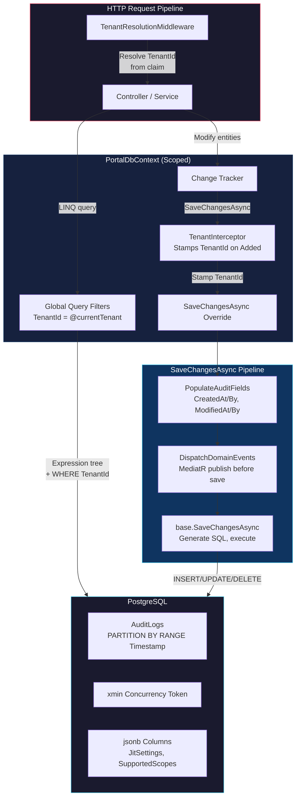

## TL;DR

Entity Framework Core (EF Core 10) is the standard ORM for modern .NET, translating C# LINQ into optimized SQL. In `tai-portal`, a single `PortalDbContext` (inheriting `IdentityDbContext`) manages all persistence — PostgreSQL with Npgsql. The architecture enforces **zero-trust multi-tenancy** via Global Query Filters (every query is automatically scoped by `TenantId`), uses a `TenantInterceptor` to stamp `TenantId` on inserts, populates audit fields (`CreatedAt/By`, `LastModifiedAt/By`) automatically in `SaveChangesAsync`, dispatches **domain events before save** (so handlers participate in the same transaction), and uses PostgreSQL's native `xmin` system column for **optimistic concurrency**. The `AuditLogs` table is **range-partitioned by timestamp** for scalable time-series querying. All testing runs against real PostgreSQL via **Testcontainers** — no in-memory fakes.

## Deep Dive

### Concept Overview

#### 1. Why Use an ORM (Entity Framework Core)?
- **What:** An ORM (Object-Relational Mapper) bridges Object-Oriented Programming (C# classes) and Relational Databases (SQL tables). Instead of writing raw SQL strings and manually mapping results with `SqlDataReader`, EF Core lets you work with C# objects and LINQ.
- **Why:** Massive developer velocity, compile-time type safety (rename a column → compiler catches errors, whereas raw SQL fails at runtime), built-in SQL injection protection via parameterized queries, and database provider abstraction (swap PostgreSQL for SQL Server by changing one line).
- **How:** Define entity classes → configure them in `OnModelCreating` (or with `IEntityTypeConfiguration<T>`) → query with LINQ (`_context.Users.Where(...)`) → EF Core translates to SQL → results are materialized as C# objects → mutations are tracked → `SaveChangesAsync()` generates INSERT/UPDATE/DELETE SQL.
- **When:** Use EF Core for applications with complex domain models, multi-tenancy, audit requirements, and moderate query complexity. Use Dapper or raw ADO.NET for performance-critical read paths, bulk data pipelines, or when you need fine-grained SQL control.
- **Trade-offs:** EF Core is a "leaky abstraction." The Change Tracker consumes significant memory, and poorly structured LINQ can generate catastrophic SQL (N+1 queries, Cartesian explosions, full table scans). You must understand the SQL being generated — `ToQueryString()` and logging are essential development tools.

#### 2. Deferred Execution & IQueryable
- **What:** When you write a LINQ query against a `DbSet` (e.g., `_context.Users.Where(u => u.IsActive)`), EF Core does not execute it immediately. It builds an **Expression Tree** — an in-memory representation of the query logic.
- **Why:** Deferred execution lets you dynamically compose queries — chain `.Where()`, `.OrderBy()`, `.Skip()`, `.Take()` — before sending a single optimized SQL statement to the database. This is fundamentally different from `IEnumerable<T>`, which executes in application memory.
- **How:** The query materializes (executes against the database) only when you call a terminal operator: `.ToListAsync()`, `.FirstOrDefaultAsync()`, `.CountAsync()`, or iterate with `await foreach`. Until then, the `IQueryable` is just a query plan.
- **When:** Always build queries as `IQueryable<T>` chains. The moment you call `.ToList()` or `.AsEnumerable()` mid-chain, everything after runs in memory — a common performance trap.
- **Trade-offs:** Not all C# expressions translate to SQL. Complex method calls, string interpolation, or custom functions inside `.Where()` may cause client evaluation warnings or exceptions. Check `ToQueryString()` to verify what SQL is generated.

#### 3. Global Query Filters — Automatic Multi-Tenancy
- **What:** LINQ predicates applied automatically to every query against a specific entity type. Configured in `OnModelCreating` via `builder.Entity<T>().HasQueryFilter()`. The filter closes over a scoped service (`ITenantService`) to inject the current tenant's ID at runtime.
- **Why:** In a multi-tenant SaaS, a single developer forgetting `.Where(u => u.TenantId == currentTenant)` would leak data across tenants — a catastrophic security bug. Global Query Filters make this impossible by enforcing the filter at the ORM level. Even if you write `_context.Users.ToListAsync()`, the generated SQL always includes `WHERE "TenantId" = @tenantId`.
- **How:** The filter expression captures the `_tenantService` reference from the DbContext constructor. Because `PortalDbContext` is scoped (one instance per HTTP request), and `ITenantService` is also scoped (resolved from the request's `tenant_id` claim), the filter automatically reflects the current request's tenant.
- **When:** Use for any cross-cutting data isolation concern — multi-tenancy, soft deletes (`IsDeleted == false`), active/inactive filtering. Use `IgnoreQueryFilters()` only in tightly scoped admin/diagnostic contexts.
- **Trade-offs:** Filters are invisible in code — developers may not realize a filter exists and be confused by "missing" data. Filters also apply to `Include()` joins, which can cause unexpected empty navigations. You cannot have multiple independent filters per entity (they compose with AND). `IgnoreQueryFilters()` removes all filters, not just one — there's no `IgnoreQueryFilter<TFilter>()`.

#### 4. The Change Tracker & SaveChangesAsync
- **What:** EF Core's Change Tracker monitors every entity loaded from the database. It knows the original values, current values, and state (`Unchanged`, `Added`, `Modified`, `Deleted`) of each tracked entity. When you call `SaveChangesAsync()`, it generates SQL only for changed entities.
- **Why:** The Change Tracker is what makes EF Core an ORM rather than a query library. It enables the Unit of Work pattern — accumulate multiple changes across different entities and flush them as a single atomic database transaction.
- **How:** In `tai-portal`, `SaveChangesAsync` is overridden to do three things before calling `base.SaveChangesAsync()`:
  1. **Populate audit fields** — scan tracked `IAuditableEntity` entries, stamp `CreatedAt/By` for `Added`, `LastModifiedAt/By` for `Modified`
  2. **Dispatch domain events** — collect events from `IHasDomainEvents` entities, clear them, publish via MediatR (handlers run in the same transaction)
  3. **Save** — `base.SaveChangesAsync()` generates and executes the SQL
- **When:** Use tracked queries (the default) when you intend to modify entities. Use `.AsNoTracking()` for read-only queries to avoid Change Tracker overhead (significant memory savings for large result sets).
- **Trade-offs:** The Change Tracker consumes ~2KB per tracked entity. Loading 10,000 entities for a read-only report wastes ~20MB. Always use `.AsNoTracking()` for queries where you don't call `SaveChanges()`.

#### 5. Interceptors — Cross-Cutting Persistence Concerns
- **What:** EF Core interceptors hook into the persistence pipeline at specific points — before/after `SaveChanges`, before/after command execution, on connection open, etc. They are registered via `optionsBuilder.AddInterceptors()`.
- **Why:** Interceptors separate cross-cutting concerns (tenant stamping, audit logging, slow query logging) from business logic. Without them, every repository method would need to manually set `TenantId` on new entities.
- **How:** `TenantInterceptor` in `tai-portal` overrides `SavingChangesAsync`. It scans the Change Tracker for `IMultiTenantEntity` entries in `EntityState.Added` state and stamps their `TenantId` field using the current tenant context. This uses reflection as a fallback for `init`-only properties.
- **When:** Use `SaveChangesInterceptor` for mutation-time concerns (tenant stamping, audit, validation). Use `DbCommandInterceptor` for query-time concerns (slow query logging, query tagging). Use `IDbConnectionInterceptor` for connection-time concerns (dynamic connection string routing in multi-database tenancy).
- **Trade-offs:** Interceptors run on every `SaveChanges` call, so they must be fast. The `TenantInterceptor` uses reflection, which is slower than direct property access — acceptable for the small number of `Added` entities per request, but problematic for bulk inserts. Also, interceptors are invisible to callers — a developer may not realize `TenantId` is being set automatically.

#### 6. Domain Event Dispatch — Events Before Save
- **What:** Domain entities raise events (e.g., `UserApprovedEvent`, `PrivilegeModifiedEvent`) by adding them to a `DomainEvents` collection. In `SaveChangesAsync`, these events are collected, the collection is cleared, and the events are published via MediatR — all before `base.SaveChangesAsync()` is called.
- **Why:** Dispatching before save means event handlers participate in the same database transaction. If a handler writes an `AuditEntry` and the main save fails, both are rolled back. This gives you transactional consistency without a distributed transaction coordinator.
- **How:** The dispatch mechanism uses reflection to create `DomainEventNotification<T>` wrappers (where `T` is the concrete event type) and publishes them via MediatR's `IPublisher`. Handlers are resolved from DI and can inject `PortalDbContext` to write audit entries.
- **When:** Use pre-save dispatch for events that must be transactionally consistent with the triggering change (audit logs, cascading state changes). Use post-save dispatch (or an Outbox pattern) for events that trigger external side effects (sending emails, calling external APIs, pushing SignalR notifications).
- **Trade-offs:** Pre-save dispatch means handler failures abort the entire save. A buggy audit handler can prevent legitimate business operations. Also, the dispatch iterates entities and uses `Activator.CreateInstance` with reflection — minor performance overhead per save.

#### 7. Optimistic Concurrency with PostgreSQL xmin
- **What:** Optimistic concurrency assumes conflicts are rare. Instead of locking rows on read, EF Core includes a concurrency token in the `WHERE` clause of `UPDATE` statements. If the token has changed since the entity was loaded, the update affects zero rows and EF Core throws `DbUpdateConcurrencyException`.
- **Why:** Pessimistic locking (row locks) kills throughput in web APIs because HTTP requests can be slow or abandoned, holding locks indefinitely. Optimistic concurrency is lock-free — reads don't block each other, and conflicts are detected at write time.
- **How:** PostgreSQL has a built-in system column `xmin` that stores the transaction ID of the last write to each row. It changes automatically on every update — no trigger or column definition needed. EF Core maps a `uint RowVersion` property to `xmin` (type `xid`), and Npgsql reads it on every query. The generated SQL becomes: `UPDATE "Users" SET ... WHERE "Id" = @id AND "xmin" = @originalXmin`.
- **When:** Use optimistic concurrency on any entity that multiple users can edit simultaneously (user profiles, privilege configurations, documents). Skip it for append-only entities (audit logs) or single-writer entities.
- **Trade-offs:** `xmin` changes on any column update to the row, so it's coarse-grained — even updating an unrelated column triggers a conflict. For fine-grained concurrency, use a dedicated `RowVersion` column with manual increment. Also, `xmin` is a 32-bit transaction counter that wraps around, so it's not suitable as a durable version number across PostgreSQL vacuums.

#### 8. Value Converters — Strongly-Typed IDs
- **What:** Value converters tell EF Core how to translate between a .NET type and a database column type. In `tai-portal`, strongly-typed ID wrappers (`TenantId`, `PrivilegeId`, `TenantAdminId`) are stored as raw `Guid` or `string` in PostgreSQL but exposed as rich domain types in C#.
- **Why:** Strongly-typed IDs prevent "primitive obsession" — you cannot accidentally pass a `TenantId` where a `PrivilegeId` is expected, even though both are `Guid` underneath. The compiler catches the error.
- **How:** Configured inline in `OnModelCreating` via `HasConversion()`:
  ```csharp
  b.Property(t => t.Id).HasConversion(
      tenantId => tenantId.Value,    // C# → DB: extract Guid
      value => new TenantId(value)   // DB → C#: wrap in TenantId
  );
  ```
- **When:** Use for all domain IDs, enums stored as integers, and nullable wrapper types. Avoid for types that need LINQ translation (EF Core cannot translate custom converter logic in `Where` clauses against some providers).
- **Trade-offs:** Value converters add overhead to every read/write (boxing for value types). For bulk queries returning thousands of rows, this can be measurable. Also, EF Core's query translator may not push converter logic to SQL — a `.Where(t => t.Id == someGuid)` might require manual `.Value` extraction depending on the converter.

#### 9. Table Partitioning — Time-Series Audit Logs
- **What:** PostgreSQL range partitioning splits a large table into smaller physical partitions based on a column range. In `tai-portal`, the `AuditLogs` table is partitioned by `Timestamp` (range), with a composite primary key `(Id, Timestamp)`.
- **Why:** Audit logs grow unboundedly. Without partitioning, queries against a 100-million-row table require scanning the entire B-Tree index. With partitioning, a query like `WHERE Timestamp > '2026-03-01'` only touches the relevant partition — the planner prunes the rest entirely.
- **How:** EF Core doesn't natively support `PARTITION BY`. The migration uses raw SQL:
  ```sql
  CREATE TABLE "AuditLogs" (
      "Id" uuid NOT NULL,
      "Timestamp" timestamp with time zone NOT NULL,
      ...
      CONSTRAINT "PK_AuditLogs" PRIMARY KEY ("Id", "Timestamp")
  ) PARTITION BY RANGE ("Timestamp");
  CREATE TABLE "AuditLogs_Default" PARTITION OF "AuditLogs" DEFAULT;
  ```
  The composite PK `(Id, Timestamp)` is required because PostgreSQL demands the partition key be part of the primary key.
- **When:** Use partitioning for tables that grow without bound and have a natural time-based access pattern (audit logs, event stores, metrics, IoT telemetry). Don't partition small tables — the overhead of partition pruning exceeds the benefit.
- **Trade-offs:** Composite PK means single-column lookups by `Id` alone don't hit the PK index — you need a separate index on `Id` (which `tai-portal` creates: `IX_AuditLogs_Id`). Also, EF Core's model doesn't understand partitions — `context.Model.FindEntityType(typeof(AuditEntry))` shows a single table, not partitions. Partition management (creating monthly partitions, dropping old ones) requires external tooling or a cron job.

#### 10. PostgreSQL-Specific Features via Npgsql
- **What:** Npgsql is the .NET data provider for PostgreSQL. Beyond standard EF Core, it exposes PostgreSQL-native features: `jsonb` columns, GIN indexes, `xmin` concurrency, `COPY` bulk import, advisory locks, and sequential UUIDv7.
- **Why:** Leveraging database-native features avoids round-tripping data to the application tier. A `jsonb` query with a GIN index runs entirely in PostgreSQL, whereas deserializing JSON in C# and filtering in memory wastes bandwidth and CPU.
- **How in tai-portal:**
  - **JSONB:** `Privilege.JitSettings` and `Privilege.SupportedScopes` are stored as `jsonb` via `HasColumnType("jsonb")`. `NpgsqlDataSourceBuilder.EnableDynamicJson()` enables automatic CLR ↔ JSON serialization.
  - **Advisory locks:** `SeedData.cs` uses `pg_advisory_lock(424242)` to prevent concurrent seed operations in multi-pod deployments.
  - **UUIDv7:** Npgsql automatically generates time-ordered UUIDs for `Guid` primary keys, maintaining B-Tree index locality (unlike random UUIDv4 which fragments indexes).
- **When:** Use `jsonb` for semi-structured data that varies per row (settings, metadata, feature flags). Use advisory locks for cross-process coordination without a separate locking service. Use `COPY` via `BinaryImporter` for bulk data ingestion (10-100x faster than individual INSERTs).
- **Trade-offs:** PostgreSQL-specific features reduce database portability. If you ever need to migrate to SQL Server, `jsonb`, `xmin`, advisory locks, and table partitioning all need alternatives. For `tai-portal`, this is an acceptable trade-off — PostgreSQL is the permanent database choice.



---

## Real-World Code Examples

### 1. Global Query Filters — Zero-Trust Multi-Tenancy — `PortalDbContext.cs`

Three entities have automatic tenant isolation. The filter closes over the scoped `_tenantService`:

```csharp
// libs/core/infrastructure/Persistence/PortalDbContext.cs (lines 109-178)
protected override void OnModelCreating(ModelBuilder builder)
{
    base.OnModelCreating(builder);
    builder.UseOpenIddict();

    // Tenant — only see your own tenant (or all if global access)
    builder.Entity<Tenant>(b => {
        b.HasKey(t => t.Id);
        b.Property(t => t.Id)
            .HasConversion(tenantId => tenantId.Value, value => new TenantId(value));
        b.Property(t => t.TenantHostname).IsRequired();
        b.HasIndex(t => t.TenantHostname).IsUnique();
        b.HasQueryFilter(t =>
            _tenantService.IsGlobalAccess || t.Id == _tenantService.TenantId);
    });

    // ApplicationUser — tenant-scoped with xmin concurrency
    builder.Entity<ApplicationUser>(b => {
        b.Property(u => u.TenantId)
            .HasConversion(tenantId => tenantId.Value, value => new TenantId(value));
        b.Property(u => u.RowVersion).IsRowVersion();  // Maps to xmin
        b.HasIndex(u => u.TenantId);
        b.HasQueryFilter(u =>
            _tenantService.IsGlobalAccess || u.TenantId == _tenantService.TenantId);
    });

    // AuditEntry — tenant-scoped with composite PK for partitioning
    builder.Entity<AuditEntry>(b => {
        b.HasKey(a => new { a.Id, a.Timestamp });  // Composite for partition key
        b.HasIndex(a => new { a.TenantId, a.UserId, a.Timestamp })
            .IsDescending(false, false, true);
        b.HasQueryFilter(a =>
            _tenantService.IsGlobalAccess || a.TenantId == _tenantService.TenantId);
    });

    // Privilege — NO query filter (global catalog shared across tenants)
    builder.Entity<Privilege>(b => {
        b.Property(p => p.JitSettings).HasColumnType("jsonb");
        b.Property(p => p.SupportedScopes).HasColumnType("jsonb");
        b.Property(p => p.RiskLevel).HasConversion<int>();
        b.Property(p => p.RowVersion).IsRowVersion()
            .HasColumnName("xmin").HasColumnType("xid")
            .ValueGeneratedOnAddOrUpdate();
        b.HasIndex(p => p.Name).IsUnique();
        // No HasQueryFilter — privileges are shared across all tenants
    });
}
```

**Why this matters:** When any controller calls `_context.Users.ToListAsync()`, the generated SQL is always: `SELECT * FROM "AspNetUsers" WHERE "TenantId" = @tenantId`. Even a developer who forgets to filter by tenant cannot leak cross-tenant data.

### 2. SaveChangesAsync Override — Audit + Domain Events — `PortalDbContext.cs`

The custom save pipeline that runs audit population and domain event dispatch in a single transaction:

```csharp
// libs/core/infrastructure/Persistence/PortalDbContext.cs (lines 40-93)
public override async Task<int> SaveChangesAsync(CancellationToken cancellationToken = default)
{
    PopulateAuditFields();                              // Step 1: stamp timestamps
    await DispatchDomainEventsAsync(cancellationToken);  // Step 2: publish events
    return await base.SaveChangesAsync(cancellationToken); // Step 3: flush to DB
}

private void PopulateAuditFields()
{
    var entries = ChangeTracker.Entries<IAuditableEntity>();
    var userId = currentUserService?.UserId ?? "System";
    var now = DateTimeOffset.UtcNow;

    foreach (var entry in entries)
    {
        if (entry.State == EntityState.Added)
        {
            entry.Entity.CreatedAt = now;
            entry.Entity.CreatedBy = userId;
        }
        else if (entry.State == EntityState.Modified)
        {
            entry.Entity.LastModifiedAt = now;
            entry.Entity.LastModifiedBy = userId;
        }
    }
}

private async Task DispatchDomainEventsAsync(CancellationToken cancellationToken)
{
    var entities = ChangeTracker.Entries()
        .Where(e => e.Entity is IHasDomainEvents hasEvents
                     && hasEvents.DomainEvents.Any())
        .Select(e => (IHasDomainEvents)e.Entity)
        .ToList();

    var domainEvents = entities.SelectMany(e => e.DomainEvents).ToList();
    entities.ForEach(e => e.ClearDomainEvents());

    foreach (var domainEvent in domainEvents)
    {
        var notificationType = typeof(DomainEventNotification<>)
            .MakeGenericType(domainEvent.GetType());
        var notification = Activator.CreateInstance(notificationType, domainEvent);
        await publisher.Publish(notification!, cancellationToken);
    }
}
```

**Why this matters:** Events are dispatched before `base.SaveChangesAsync()`. If a `UserApprovedEventHandler` writes an `AuditEntry`, both the user update and the audit entry are committed in a single database transaction. If anything fails, both roll back — no orphaned audit records.

### 3. TenantInterceptor — Automatic TenantId Stamping — `TenantInterceptor.cs`

The interceptor that stamps `TenantId` on every new entity without requiring explicit assignment:

```csharp
// libs/core/infrastructure/Persistence/Interceptors/TenantInterceptor.cs
public class TenantInterceptor : SaveChangesInterceptor
{
    public override async ValueTask<InterceptionResult<int>> SavingChangesAsync(
        DbContextEventData eventData,
        InterceptionResult<int> result,
        CancellationToken cancellationToken = default)
    {
        var context = eventData.Context;
        if (context is null) return await base.SavingChangesAsync(eventData, result, cancellationToken);

        foreach (var entry in context.ChangeTracker.Entries<IMultiTenantEntity>())
        {
            if (entry.State == EntityState.Added)
            {
                // Read current tenant from the DbContext
                var tenantId = GetCurrentTenantId(context);
                if (tenantId != default)
                {
                    // Primary: direct property setter
                    // Fallback: reflection for init-only properties
                    SetTenantId(entry.Entity, tenantId);
                }
            }
        }

        return await base.SavingChangesAsync(eventData, result, cancellationToken);
    }
}
```

**Why this matters:** Without this interceptor, every service method that creates an entity would need `entity.TenantId = _tenantService.TenantId`. The interceptor centralizes this, making it impossible to create a tenant-less entity. The reflection fallback handles `init`-only properties (common in record types) that cannot be set via normal property assignment.

### 4. Optimistic Concurrency with xmin — `PrivilegeService.cs`

Manual concurrency check and reload after save:

```csharp
// libs/core/infrastructure/Persistence/Services/PrivilegeService.cs (lines 130-165)
public async Task<PrivilegeDto> UpdatePrivilegeAsync(
    Guid id, UpdatePrivilegeRequest request, uint rowVersion,
    CancellationToken cancellationToken)
{
    var privilege = await _context.Privileges
        .FirstOrDefaultAsync(p => p.Id == new PrivilegeId(id), cancellationToken)
        ?? throw new NotFoundException($"Privilege {id} not found");

    // Manual concurrency guard — compare xmin from client with current DB value
    if (privilege.RowVersion != rowVersion)
    {
        throw new DbUpdateConcurrencyException("Concurrency conflict detected.");
    }

    // Apply domain methods (which may raise PrivilegeModifiedEvent)
    privilege.UpdateMetadata(request.Name, request.Description, request.Module);
    if (request.IsActive) privilege.Activate(); else privilege.Deactivate();

    await _context.SaveChangesAsync(cancellationToken);

    // Reload to get new xmin value after successful save
    await _context.Entry(privilege).ReloadAsync(cancellationToken);

    return MapToDto(privilege);
}
```

**Why this matters:** The client sends the `RowVersion` it received when it loaded the privilege. If another user modified the privilege between load and save, `xmin` will have changed and the check fails with a concurrency exception. The API returns `409 Conflict`, and the frontend can prompt the user to refresh. The `ReloadAsync` after save ensures the response contains the new `xmin` for subsequent edits.

### 5. Pagination with Dynamic Sorting and Projection — `IdentityService.cs`

Pattern-matched sorting with Skip/Take pagination and Select projection:

```csharp
// libs/core/infrastructure/Identity/IdentityService.cs (lines 65-100)
public async Task<PaginatedList<UserDto>> GetUsersAsync(
    string? search, string? sortColumn, string? sortDirection,
    int page, int pageSize, CancellationToken cancellationToken)
{
    var query = _userManager.Users.AsQueryable();

    // Search filter (builds expression tree, not evaluated yet)
    if (!string.IsNullOrWhiteSpace(search))
    {
        query = query.Where(u =>
            u.Email!.Contains(search) ||
            u.FirstName!.Contains(search) ||
            u.LastName!.Contains(search));
    }

    // Dynamic sort via pattern matching
    query = (sortColumn?.ToLower(), sortDirection?.ToLower()) switch
    {
        ("name", "desc") => query.OrderByDescending(u => u.FirstName)
                                 .ThenByDescending(u => u.LastName),
        ("name", "asc")  => query.OrderBy(u => u.FirstName)
                                 .ThenBy(u => u.LastName),
        ("email", "desc") => query.OrderByDescending(u => u.Email),
        ("email", "asc")  => query.OrderBy(u => u.Email),
        _                 => query.OrderBy(u => u.UserName)
    };

    var totalCount = await query.CountAsync(cancellationToken);

    var users = await query
        .Skip((page - 1) * pageSize)
        .Take(pageSize)
        .ToListAsync(cancellationToken);

    return new PaginatedList<UserDto>(
        users.Select(MapToDto).ToList(), totalCount, page, pageSize);
}
```

**Why this matters:** The entire chain — `Where`, `OrderBy`, `Skip`, `Take` — is built as an `IQueryable` expression tree. Only `CountAsync` and `ToListAsync` materialize the query. The pattern-matched sort prevents SQL injection (no user-supplied strings in ORDER BY) while remaining concise.

### 6. JSONB Columns with Value Converters — `Privilege` Entity

Storing semi-structured data natively in PostgreSQL:

```csharp
// libs/core/domain/Entities/Privilege.cs (properties)
public JitSettings? JitSettings { get; private set; }
public List<string>? SupportedScopes { get; private set; }

// libs/core/infrastructure/Persistence/PortalDbContext.cs (lines 192-196)
b.Property(p => p.JitSettings).HasColumnType("jsonb");
b.Property(p => p.SupportedScopes).HasColumnType("jsonb");

// apps/portal-api/Program.cs (lines 66-67) — required for deserialization
var npgsqlBuilder = new Npgsql.NpgsqlDataSourceBuilder(connectionString);
npgsqlBuilder.EnableDynamicJson();
```

**Why this matters:** `JitSettings` is a record struct with fields like `MaxDuration`, `RequiresApproval`, etc. Different privileges have different JIT (Just-In-Time) settings — a relational model would require a separate table with sparse columns. `jsonb` stores the data as a single column, queryable via PostgreSQL's `@>`, `?`, and `->` operators, and indexable with GIN indexes.

### 7. Table Partitioning Migration — `AddPartitionedAuditLogs`

Raw SQL migration for PostgreSQL range partitioning:

```csharp
// libs/core/infrastructure/Persistence/Migrations/20260329223950_AddPartitionedAuditLogs.cs
protected override void Up(MigrationBuilder migrationBuilder)
{
    // 1. Rename existing table
    migrationBuilder.Sql(@"ALTER TABLE ""AuditLogs"" RENAME TO ""AuditLogs_Old"";");

    // 2. Create partitioned table with composite PK
    migrationBuilder.Sql(@"
        CREATE TABLE ""AuditLogs"" (
            ""Id"" uuid NOT NULL,
            ""Timestamp"" timestamp with time zone NOT NULL,
            ""TenantId"" uuid NOT NULL,
            ""UserId"" text,
            ""Action"" text,
            ""IpAddress"" text,
            ""Details"" text,
            ""CorrelationId"" text,
            CONSTRAINT ""PK_AuditLogs"" PRIMARY KEY (""Id"", ""Timestamp"")
        ) PARTITION BY RANGE (""Timestamp"");
    ");

    // 3. Create default partition (catches all data not covered by specific ranges)
    migrationBuilder.Sql(@"
        CREATE TABLE ""AuditLogs_Default"" PARTITION OF ""AuditLogs"" DEFAULT;
    ");

    // 4. Migrate existing data
    migrationBuilder.Sql(@"
        INSERT INTO ""AuditLogs"" SELECT * FROM ""AuditLogs_Old"";
    ");

    // 5. Drop old table and recreate indexes
    migrationBuilder.Sql(@"DROP TABLE ""AuditLogs_Old"";");
}
```

**Why this matters:** EF Core cannot express `PARTITION BY RANGE` — this requires raw SQL in migrations. The composite PK `(Id, Timestamp)` is a PostgreSQL requirement: the partition column must be part of the primary key. The default partition catches any data that doesn't match a specific range, preventing INSERT failures.

### 8. Seed Data with Advisory Lock — `SeedData.cs`

Race-condition-safe seeding for multi-pod Kubernetes deployments:

```csharp
// apps/portal-api/SeedData.cs (lines 47-50, 284-288)
public static async Task InitializeAsync(IServiceProvider serviceProvider)
{
    using var scope = serviceProvider.CreateScope();
    var context = scope.ServiceProvider.GetRequiredService<PortalDbContext>();

    // Acquire PostgreSQL advisory lock to prevent concurrent seeding
    using var conn = context.Database.GetDbConnection();
    await conn.OpenAsync();
    using var command = conn.CreateCommand();
    command.CommandText = "SELECT pg_advisory_lock(424242);";
    await command.ExecuteNonQueryAsync();

    try
    {
        // Seed tenants, users, privileges, OpenIddict applications...
        await SeedTenantsAsync(context);
        await SeedUsersAsync(scope, context);
        await SeedPrivilegesAsync(context);
        // ...
    }
    finally
    {
        command.CommandText = "SELECT pg_advisory_unlock(424242);";
        await command.ExecuteNonQueryAsync();
    }
}
```

**Why this matters:** In a Kubernetes deployment, multiple pods start simultaneously and all call `SeedData.InitializeAsync()`. Without the advisory lock, two pods could race and create duplicate tenants or users. PostgreSQL advisory locks provide process-level mutual exclusion without requiring a separate distributed locking service (Redis, ZooKeeper). The lock is session-scoped and automatically released if the connection drops.

### 9. Integration Tests with Testcontainers — `DatabaseFixture.cs`

Real PostgreSQL testing — no in-memory fakes:

```csharp
// libs/core/infrastructure.tests/Fixtures/DatabaseFixture.cs
public class DatabaseFixture : IAsyncLifetime
{
    private readonly PostgreSqlContainer _container = new PostgreSqlBuilder()
        .WithImage("postgres:17")
        .Build();

    public async Task InitializeAsync()
    {
        await _container.StartAsync();

        var dataSource = new NpgsqlDataSourceBuilder(_container.GetConnectionString())
            .EnableDynamicJson()
            .Build();

        var options = new DbContextOptionsBuilder<PortalDbContext>()
            .UseNpgsql(dataSource, o =>
                o.MigrationsAssembly("Tai.Portal.Core.Infrastructure"))
            .Options;

        // Run real migrations against test container
        using var context = CreateContext(options);
        await context.Database.MigrateAsync();
    }

    // Respawn resets the DB between tests (truncate, not drop/recreate)
    private readonly Respawner _respawner = /* configured to ignore __EFMigrationsHistory */;
}
```

**Why this matters:** In-memory databases (`UseInMemoryDatabase`) don't support transactions, constraints, indexes, raw SQL, or provider-specific features (`jsonb`, `xmin`, partitioning). Using Testcontainers with real PostgreSQL means tests exercise the exact same SQL path as production. Respawn provides fast between-test cleanup by truncating tables rather than dropping and recreating the schema.

---

## Interview Q&A

### L1: IQueryable vs IEnumerable — Where Does Filtering Happen?

**Answer:** `IEnumerable<T>.Where()` executes the filter in application memory — EF Core pulls all rows from the database into RAM, then filters locally. `IQueryable<T>.Where()` builds an expression tree that EF Core translates into a SQL `WHERE` clause — filtering happens on the database server, returning only matching rows.

In `tai-portal`, all queries are built as `IQueryable` chains. For example, `IdentityService.GetUsersAsync()` chains `.Where()`, `.OrderBy()`, `.Skip()`, `.Take()` as an expression tree, then materializes with `.ToListAsync()` — the database does all the work (`IdentityService.cs:65-100`).

### L1: How Does EF Core Prevent SQL Injection?

**Answer:** EF Core uses parameterized queries automatically. When you write `.Where(u => u.Email == userInput)`, EF Core translates `userInput` into a SQL parameter (`@p0`), not a string concatenation. The database treats the parameter as data, never as executable SQL.

Even `FromSqlInterpolated($"SELECT * FROM Users WHERE Email = {userInput}")` parameterizes the interpolated value. Only `FromSqlRaw` with manual string concatenation is unsafe — and `tai-portal` uses no `FromSqlRaw` in application code (only in migrations for DDL).

### L2: What Is the N+1 Query Problem?

**Answer:** You query a list of entities (1 query), then iterate and access a navigation property that triggers a new query per entity (N queries). 100 users = 101 SQL queries.

**Fix with Eager Loading:** `.Include(u => u.Roles)` generates a single SQL `JOIN`.

**Fix with Projection:** `.Select(u => new { u.Name, RoleNames = u.Roles.Select(r => r.Name) })` — EF Core generates a single query returning only the columns you need.

In `tai-portal`, the schema avoids navigation properties on most entities. `UserPrivilege` is queried directly with `.Where(up => up.UserId == userId).Select(up => up.PrivilegeId)` — no `Include()` needed because the join table is accessed as a first-class entity (`IdentityService.cs:109-113`).

### L2: Tracking vs AsNoTracking — When Does It Matter?

**Answer:** By default, EF Core tracks every queried entity in the Change Tracker (~2KB per entity). This is necessary for `SaveChangesAsync()` to detect what changed. But for read-only queries, tracking is pure overhead.

`.AsNoTracking()` skips tracking, making reads faster and lighter. In `tai-portal`, all read-only queries use `AsNoTracking()` — for example, `PrivilegeService` fetches privileges with `.AsNoTracking()` for list/detail endpoints, but uses tracked queries for update operations that call `SaveChangesAsync()` (`PrivilegeService.cs:40-67`).

**Rule of thumb:** Use `AsNoTracking()` on any query where you don't call `SaveChanges()` afterward.

### L3: How Do Global Query Filters Work for Multi-Tenancy?

**Answer:** In `OnModelCreating`, you call `b.HasQueryFilter(u => u.TenantId == _tenantService.TenantId)`. The filter closes over the scoped `ITenantService` instance. Because `PortalDbContext` is scoped (one per HTTP request), and `ITenantService` reads the `tenant_id` claim from the current request, every query is automatically scoped.

In `tai-portal`, three entities have filters (`Tenant`, `ApplicationUser`, `AuditEntry`). `Privilege` intentionally has no filter — it's a global catalog shared across tenants.

**Bypass with `IgnoreQueryFilters()`:** Used only in admin/diagnostic contexts (e.g., cross-tenant cleanup). It removes all filters on the entity, not just one — there's no selective filter removal.

**Gotcha:** Filters apply to `Include()` joins too. If you `Include(u => u.Roles)` and `Role` has a tenant filter, you'll get an empty navigation if the role belongs to a different tenant. Careful filter design is critical.

### L3: Explain the Cartesian Explosion and How AsSplitQuery Solves It

**Answer:** When you `.Include(u => u.Roles).Include(u => u.Orders)`, EF Core generates a single `JOIN` query. If a user has 5 roles and 10 orders, the result set has 50 rows (5 x 10 Cartesian product) — the user's data is duplicated in every row.

`.AsSplitQuery()` tells EF Core to execute 3 separate queries: one for users, one for roles, one for orders. Each returns only the relevant rows — no duplication. The results are stitched together in memory.

**Trade-offs:**
- Split queries use 3 round-trips instead of 1 — higher latency on high-ping connections
- Split queries can see inconsistent data if another transaction modifies rows between the 3 queries (no snapshot isolation across queries by default)
- Single-query joins are better for small result sets; split queries win for large collections

In `tai-portal`, there are no `Include/AsSplitQuery` calls because the schema uses direct join table queries instead of navigation properties — a design choice that avoids the problem entirely.

### L3: How Does PostgreSQL xmin Concurrency Differ from SQL Server RowVersion?

**Answer:**
- **SQL Server `rowversion`/`timestamp`** — a dedicated 8-byte binary column that auto-increments on every row update. You must explicitly add the column. It's durable and monotonically increasing.
- **PostgreSQL `xmin`** — a system column that stores the transaction ID of the last write. It's always present (no column to add), but it's a 32-bit counter that wraps around after ~4 billion transactions and is reset by `VACUUM`.

In `tai-portal`, `xmin` is mapped to `uint RowVersion` with `IsRowVersion().HasColumnName("xmin").HasColumnType("xid")`. EF Core reads `xmin` on every query and includes it in `UPDATE ... WHERE "xmin" = @original`.

**Gotcha:** `xmin` changes on any column update — if two users update different columns on the same row, the second will still get a concurrency exception. For column-level concurrency, use a dedicated `ConcurrencyStamp` string column (which ASP.NET Identity already provides for `ApplicationUser`).

### Staff: Design the data access layer for a multi-tenant SaaS supporting 1,000 tenants with different data isolation requirements.

**Answer:** Three isolation tiers based on tenant contract:

**Tier 1 — Shared Database, Row-Level Isolation (tai-portal's model):**
- All tenants share one `PortalDbContext` and one PostgreSQL database
- Global Query Filters enforce `TenantId` on every query
- `TenantInterceptor` stamps `TenantId` on inserts
- Pros: Simple, cost-effective, single migration path
- Cons: "Noisy neighbor" risk (one tenant's heavy query affects all), compliance limitations (some regulators require physical separation)
- Use for: Standard tenants, small-to-medium data volumes

**Tier 2 — Shared Database, Schema-Per-Tenant:**
- Each tenant gets its own PostgreSQL schema (`tenant_123.Users`, `tenant_456.Users`)
- `OnConfiguring` dynamically sets `options.UseNpgsql(conn).HasDefaultSchema(tenantSchema)`
- Pros: Logical isolation, per-tenant backup/restore, no query filter dependency
- Cons: Migration complexity (must apply to N schemas), connection pooling challenges (one pool per schema)
- Use for: Regulated tenants, moderate data volumes

**Tier 3 — Database-Per-Tenant:**
- Each tenant gets its own PostgreSQL database (or even a dedicated server)
- A `TenantConnectionResolver` service returns the connection string based on the tenant claim
- `IDbConnectionInterceptor` swaps the connection at runtime
- Pros: Complete isolation, independent scaling, per-tenant encryption keys, easiest compliance story
- Cons: N databases to manage, migrate, backup; connection pool explosion; cross-tenant queries require federation
- Use for: Enterprise tenants with contractual isolation requirements

**Hybrid implementation:**
```csharp
builder.Services.AddDbContext<PortalDbContext>((sp, options) => {
    var tenantService = sp.GetRequiredService<ITenantService>();
    var connectionString = tenantService.Tier switch {
        IsolationTier.Shared => config["SharedConnection"],
        IsolationTier.Schema => config["SharedConnection"],  // schema set later
        IsolationTier.Dedicated => tenantService.DedicatedConnectionString,
    };
    options.UseNpgsql(connectionString);
    if (tenantService.Tier == IsolationTier.Schema)
        options.HasDefaultSchema(tenantService.SchemaName);
});
```

The Global Query Filter remains as defense-in-depth even in schema/database isolation — belt and suspenders.

### Staff: How Would You Implement an Outbox Pattern with EF Core for Guaranteed Event Delivery?

**Answer:** The current `tai-portal` dispatches domain events inside `SaveChangesAsync`, which means if the application crashes after save but before SignalR push, the event is lost. The Outbox pattern guarantees delivery:

**Schema:**
```csharp
builder.Entity<OutboxMessage>(b => {
    b.HasKey(m => m.Id);
    b.Property(m => m.Payload).HasColumnType("jsonb");
    b.HasIndex(m => new { m.ProcessedAt, m.CreatedAt })
        .HasFilter("\"ProcessedAt\" IS NULL");  // Partial index for unprocessed
});
```

**Write path (inside SaveChangesAsync):**
```csharp
// Instead of publishing via MediatR:
foreach (var domainEvent in domainEvents) {
    context.OutboxMessages.Add(new OutboxMessage {
        Id = Guid.CreateVersion7(),
        EventType = domainEvent.GetType().AssemblyQualifiedName,
        Payload = JsonSerializer.Serialize(domainEvent),
        CreatedAt = DateTimeOffset.UtcNow,
        ProcessedAt = null
    });
}
// OutboxMessage is written in the SAME transaction as the entity changes
await base.SaveChangesAsync(cancellationToken);
```

**Read path (Background worker):**
```csharp
// Polling worker with SELECT ... FOR UPDATE SKIP LOCKED
var messages = await context.OutboxMessages
    .Where(m => m.ProcessedAt == null)
    .OrderBy(m => m.CreatedAt)
    .Take(batchSize)
    .ToListAsync();

foreach (var message in messages) {
    var eventType = Type.GetType(message.EventType);
    var domainEvent = JsonSerializer.Deserialize(message.Payload, eventType);
    await publisher.Publish(new DomainEventNotification(domainEvent));
    message.ProcessedAt = DateTimeOffset.UtcNow;
}
await context.SaveChangesAsync();
```

**Key decisions:**
- `jsonb` payload allows querying inside events without deserializing
- Partial index on `ProcessedAt IS NULL` keeps the polling query fast as the table grows
- `FOR UPDATE SKIP LOCKED` prevents multiple worker instances from processing the same message
- Idempotent handlers (check `CorrelationId`) protect against at-least-once delivery duplicates

---

## Cross-References

- **[[CSharp-Fundamentals]]** — LINQ, expression trees, `IQueryable` vs `IEnumerable`, async/await patterns used in all EF Core queries
- **[[Data-Structures-Algorithms]]** — B-Tree indexes (how Skip/Take generates OFFSET), hash indexes, Big-O of full table scan vs index seek
- **[[System-Design]]** — Outbox pattern, Unit of Work, domain event dispatch, CQRS read/write separation
- **[[Authentication-Authorization]]** — `ITenantService` resolves tenant from JWT claims, `ICurrentUserService` provides audit trail user ID
- **[[Design-Patterns]]** — Repository pattern (tai-portal uses DbContext directly instead), Unit of Work (implicit via SaveChangesAsync), Observer (domain events via MediatR)
- **[[SignalR-Realtime]]** — MediatR handlers that write audit entries also push events via `IRealTimeNotifier` — both in the same transaction

---

## Further Reading

- [EF Core Performance Guidelines](https://learn.microsoft.com/en-us/ef/core/performance/performance-guidelines)
- [Multi-Tenancy with Global Query Filters](https://learn.microsoft.com/en-us/ef/core/modeling/query-filters)
- [Optimistic Concurrency in EF Core](https://learn.microsoft.com/en-us/ef/core/saving/concurrency)
- [PostgreSQL Table Partitioning](https://www.postgresql.org/docs/current/ddl-partitioning.html)
- [Npgsql EF Core Provider](https://www.npgsql.org/efcore/)
- [Testcontainers for .NET](https://dotnet.testcontainers.org/)

---

*Last updated: 2026-04-02*
