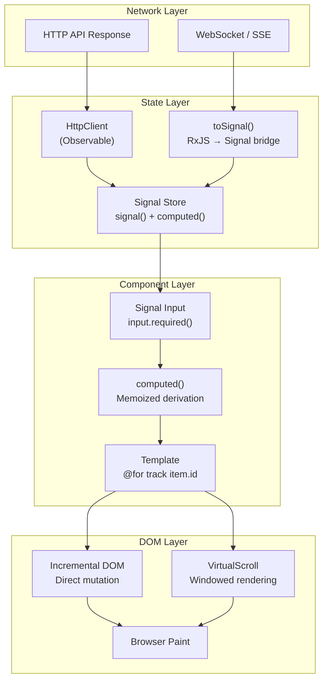

## Table of Contents

[🧠 **View Interactive Mindmap**](./frontend-data-structures-mindmap.md)

1. **JavaScript Built-in Structures**
   - 1.1 [`Array` Internals — Sparse vs Dense](#array-internals--sparse-vs-dense)
   - 1.2 [`Map` vs Plain Object](#map-vs-plain-object)
   - 1.3 [`Set`](#set)
   - 1.4 [`WeakMap`, `WeakRef` & `WeakSet`](#weakmap-weakref--weakset)
   - 1.5 [`structuredClone()` vs `JSON.parse(JSON.stringify())`](#structuredclone-vs-jsonparsejsonstringify)

2. **Reactive Data Structures**
   - 2.1 [`Observable<T>` as Push-Based IEnumerable](#observablet-as-push-based-ienumerable)
   - 2.2 [`BehaviorSubject` as Stateful Cache](#behaviorsubject-as-stateful-cache)
   - 2.3 [Angular Signals as Synchronous Reactive Primitives](#angular-signals-as-synchronous-reactive-primitives)
   - 2.4 [`computed()` as Memoized Derivation](#computed-as-memoized-derivation)

3. **State Management Structures**
   - 3.1 [NgRx Store as Immutable State Tree](#ngrx-store-as-immutable-state-tree)
   - 3.2 [Selectors as Memoized Projections](#selectors-as-memoized-projections)
   - 3.3 [ComponentStore for Local State](#componentstore-for-local-state)
   - 3.4 [Signal-Based Store Pattern](#signal-based-store-pattern)

4. **Rendering & DOM Algorithms**
   - 4.1 [Incremental DOM vs Virtual DOM](#incremental-dom-vs-virtual-dom)
   - 4.2 [`@for track` — Identity-Based Diffing](#for-track--identity-based-diffing)
   - 4.3 [CDK VirtualScroll — Windowed Rendering](#cdk-virtualscroll--windowed-rendering)
   - 4.4 [Change Detection as Tree Traversal](#change-detection-as-tree-traversal)

5. **Client-Side Persistence**
   - 5.1 [`localStorage` / `sessionStorage`](#localstorage--sessionstorage)
   - 5.2 [IndexedDB — Structured Offline Storage](#indexeddb--structured-offline-storage)
   - 5.3 [Cache API — Service Worker Patterns](#cache-api--service-worker-patterns)

6. [Architecture & Data Flow](#architecture--data-flow)

7. **Real-World Examples**
   - 7.1 [tai-portal: TransferList `Set` Deduplication](#tai-portal-transferlist-set-deduplication)
   - 7.2 [tai-portal: NotificationSignalStore](#tai-portal-notificationsignalstore)
   - 7.3 [tai-portal: VirtualScroll for Privilege Lists](#tai-portal-virtualscroll-for-privilege-lists)

8. **Comparison Tables**

9. **Interview Q&A**
   - 9.1 **L1: Junior Knowledge**
     - 9.1.1 [`Map` vs Plain Object](#l1-map-vs-plain-object)
     - 9.1.2 [What Is `Set` and Why Use It?](#l1-what-is-set-and-why-use-it)
   - 9.2 **L2: Mid-Level Knowledge**
     - 9.2.1 [`WeakMap` and GC Behavior](#l2-weakmap-and-gc-behavior)
     - 9.2.2 [`structuredClone()` vs JSON Round-Trip](#l2-structuredclone-vs-json-round-trip)
     - 9.2.3 [`@for track` in Angular](#l2-for-track-in-angular)
   - 9.3 **L3: Senior Knowledge**
     - 9.3.1 [Signal vs Observable: Data Structure Perspective](#l3-signal-vs-observable-data-structure-perspective)
     - 9.3.2 [CDK VirtualScroll Algorithm & Accessibility](#l3-cdk-virtualscroll-algorithm--accessibility)
     - 9.3.3 [Client-Side Caching with IndexedDB](#l3-client-side-caching-with-indexeddb)
   - 9.4 **Staff: System Architecture**
     - 9.4.1 [Design a Signal-Based State System with Offline Support](#staff-design-a-signal-based-state-system-with-offline-support)

10. [Cross-References](#cross-references)
11. [Further Reading](#further-reading)

---

## TL;DR

Frontend data structures go far beyond arrays and objects. In 2026 Angular, <span style="color: #33b5e5; font-weight: bold;">`Map`</span> replaces plain objects for dynamic key-value storage (any key type, guaranteed iteration order, no prototype pollution), <span style="color: #33b5e5; font-weight: bold;">`Set`</span> provides O(1) deduplication (tai-portal's TransferList uses it for selected item uniqueness), and <span style="color: #33b5e5; font-weight: bold;">`WeakMap`/`WeakRef`</span> enable GC-friendly caching where entries are automatically collected when their key objects are no longer referenced. <span style="color: #00C851; font-weight: bold;">Angular Signals</span> are synchronous, pull-based reactive primitives that replace zone-based change detection with targeted, glitch-free updates — they are the data structure analogue of .NET's `INotifyPropertyChanged`. <span style="color: #00C851; font-weight: bold;">CDK VirtualScroll</span> applies the same windowing principle as server-side keyset pagination, rendering only visible DOM nodes from a 100K-item list. The key trade-off: <span style="color: #ffbb33; font-weight: bold;">Signals are synchronous and pull-based</span> (perfect for UI state), while <span style="color: #ffbb33; font-weight: bold;">Observables are asynchronous and push-based</span> (perfect for event streams) — knowing when to use each is a senior-level differentiator.

---

## Deep Dive

---

## Concept Group 1: JavaScript Built-in Structures

### 1.1 `Array` Internals — Sparse vs Dense

##### What

<span style="color: #33b5e5; font-weight: bold;">JavaScript arrays are objects with numeric keys</span>, not true contiguous memory blocks like C# arrays. V8 (Chrome's JS engine) uses two internal representations: **dense arrays** have contiguous integer indices from `0..N-1` and get an optimized C++ backing store (essentially a real array in memory), while **sparse arrays** have gaps in their indices and fall back to a hash-table representation. The engine transparently switches between these modes based on access patterns.

##### Why

<span style="color: #00C851; font-weight: bold;">Dense arrays iterate at near-C++ speed</span> because the JIT compiler can generate tight loops against contiguous memory. <span style="color: #ff4444; font-weight: bold;">Sparse arrays are 10–100x slower</span> for iteration because every index access becomes a hash-table lookup. The danger is that this switch is silent — `delete arr[5]` leaves a hole and silently degrades performance for the entire array.

##### How

```typescript
// Dense array — V8 uses optimized C++ backing store
const dense: number[] = [1, 2, 3, 4, 5];

// Sparse array — created by delete or skipping indices
const sparse: number[] = [1, 2, 3, 4, 5];
delete sparse[2]; // ← hole at index 2, now hash-table backed

// Safe dense initialization with N elements (never use new Array(N))
const denseN = Array.from({ length: 5 }, (_, i) => i * 2); // [0, 2, 4, 6, 8]

// Typed Arrays: single fixed type, true contiguous memory (for binary/WebGL)
const buffer = new Uint8Array(1024);      // 1024 bytes, no boxing overhead
const floatBuf = new Float32Array(256);   // 32-bit floats for shader uniforms

// Avoid these patterns that create sparse arrays:
const bad1 = new Array(100);             // 100-slot sparse array
bad1[50] = 'value';                      // still sparse — gaps everywhere
```

##### When

<span style="color: #00C851; font-weight: bold;">Always prefer dense arrays.</span> Use `Array.from({ length: N }, fn)` instead of `new Array(N)` for pre-allocated dense arrays. Use **Typed Arrays** (`Uint8Array`, `Float32Array`, etc.) for WebGL vertex buffers, binary protocol parsing (e.g. reading a WebSocket binary frame), or any numeric computation that needs zero boxing overhead.

##### Trade-offs

| Approach | Speed | Flexibility | Memory |
|---|---|---|---|
| Dense array | <span style="color: #00C851; font-weight: bold;">V8-optimized, JIT-compiled loops</span> | Any element type | Boxing per element |
| Sparse array | <span style="color: #ff4444; font-weight: bold;">Hash-table penalty, loses JIT</span> | Any element type | Hash overhead |
| Typed Array | <span style="color: #00C851; font-weight: bold;">True contiguous, no boxing</span> | <span style="color: #ff4444; font-weight: bold;">Fixed size, single numeric type</span> | Minimal |

---

### 1.2 `Map` vs Plain Object

##### What

<span style="color: #33b5e5; font-weight: bold;">`Map<K, V>` is a proper hash table</span> with well-defined behavior: any key type (objects, functions, primitives), guaranteed insertion-order iteration, and no prototype chain. Plain objects (`{}`) carry JavaScript's prototype chain, which means keys like `__proto__`, `constructor`, and `toString` are reserved and can cause subtle bugs.

##### Why

<span style="color: #ff4444; font-weight: bold;">Prototype pollution</span> is a real security concern when using objects as dictionaries with user-controlled keys. A key of `"__proto__"` can corrupt the prototype chain. `Map` has no prototype chain on its entries, accepts any key type (e.g. `Map<HTMLElement, ComponentRef>`), tracks `.size` natively, and performs slightly better for frequent add/delete workloads because it's purpose-built for hash-table operations.

##### How

```typescript
type UserId = string;
interface User { id: UserId; name: string; }

// Map: explicit type-safe, any key, O(1) operations
const userCache = new Map<UserId, User>();
userCache.set('u1', { id: 'u1', name: 'Alice' });
userCache.set('u2', { id: 'u2', name: 'Bob' });

console.log(userCache.get('u1'));     // { id: 'u1', name: 'Alice' }
console.log(userCache.has('u3'));     // false
console.log(userCache.size);         // 2

userCache.delete('u1');
for (const [id, user] of userCache) { // guaranteed insertion order
  console.log(id, user.name);
}

// Plain object (Record): fine for static, known keys
const config: Record<string, string> = {
  apiUrl: 'https://api.example.com',
  environment: 'production',
};

// Prototype pollution danger with plain objects:
const dict: Record<string, unknown> = {};
const userInput = '__proto__';
dict[userInput] = { polluted: true }; // ← corrupts Object.prototype in old JS engines
```

##### When

Use **`Map`** when: keys are dynamic or user-controlled, keys are non-strings (object references), you need frequent add/delete, or you need `.size` without `Object.keys().length`. Use **plain objects/`Record`** when: the shape is statically known (TypeScript interface), you need JSON serialization, or you're working with Angular component `@Input()` configs.

##### Trade-offs

<span style="color: #ff4444; font-weight: bold;">`Map` is not JSON-serializable</span> — `JSON.stringify(map)` produces `{}`. Plain objects work seamlessly with spread (`{ ...obj }`), destructuring, and Angular template binding. `Map` wins on correctness and safety for dynamic key scenarios.

---

### 1.3 `Set`

##### What

<span style="color: #33b5e5; font-weight: bold;">`Set<T>` is a collection of unique values</span> with O(1) average-case `add`, `has`, and `delete` operations backed by a hash table. Values are deduplicated by the SameValueZero algorithm (same as `===` except `NaN === NaN`).

##### Why

<span style="color: #ff4444; font-weight: bold;">`Array.prototype.includes()` is O(N)</span> — it walks every element. For a TransferList UI with 10,000 items, checking "is this item selected?" on every render cycle is catastrophic. `Set.has()` is O(1) regardless of size, making it the correct tool for membership checks and deduplication.

##### How

```typescript
// Basic Set usage
const selectedIds = new Set<string>();
selectedIds.add('item-1');
selectedIds.add('item-2');
selectedIds.add('item-1'); // ← silently ignored, already present

console.log(selectedIds.has('item-1')); // true  — O(1)
console.log(selectedIds.size);          // 2

selectedIds.delete('item-2');

// Convert to/from array
const asArray: string[] = [...selectedIds];        // spread
const fromArray = new Set(['a', 'b', 'a', 'c']);  // dedup on construction → size 3

// Set operations (JS has no built-in, but easy with spread)
const setA = new Set([1, 2, 3]);
const setB = new Set([2, 3, 4]);
const union        = new Set([...setA, ...setB]);         // {1,2,3,4}
const intersection = new Set([...setA].filter(x => setB.has(x))); // {2,3}
const difference   = new Set([...setA].filter(x => !setB.has(x))); // {1}

// tai-portal TransferList pattern: tracking selected items
class TransferListStore {
  private readonly _selected = signal(new Set<string>());

  toggle(id: string): void {
    this._selected.update(prev => {
      const next = new Set(prev);      // immutable update
      next.has(id) ? next.delete(id) : next.add(id);
      return next;
    });
  }

  isSelected(id: string): boolean {
    return this._selected().has(id);   // O(1)
  }
}
```

##### When

Use `Set` for: uniqueness constraints, fast membership testing, deduplication of arrays, and tracking "seen" items (like `seenEventIds` in `NotificationSignalStore`). Do NOT use for key-value pairs (use `Map`) or index-based access.

##### Trade-offs

<span style="color: #ff4444; font-weight: bold;">No index access</span> — you cannot do `set[0]`. Iteration is guaranteed insertion order. Equality is reference-based for objects — two different objects with the same shape are NOT equal (`new Set([{a:1}, {a:1}]).size === 2`). For deep-equality deduplication you need a custom serialization key (e.g. `JSON.stringify(obj)`).

**Backend Analogue:** `Set<T>` ≈ `HashSet<T>` in C#. Same O(1) `Contains()`, same no-duplicates guarantee.

---

### 1.4 `WeakMap`, `WeakRef` & `WeakSet`

##### What

<span style="color: #33b5e5; font-weight: bold;">`WeakMap<K extends object, V>` holds weak references to its keys</span> — if the key object has no other references, the garbage collector can reclaim it and the entry is silently removed. `WeakSet` does the same for values. `WeakRef<T>` wraps a single object weakly. `FinalizationRegistry` lets you register a cleanup callback for when an object is GC'd.

##### Why

<span style="color: #ff4444; font-weight: bold;">Regular `Map` and `Set` hold strong references</span> — they prevent GC of their keys/values indefinitely. In long-lived SPAs, this causes memory leaks: a service that caches per-DOM-element metadata using a regular `Map` will accumulate entries forever as the DOM updates. `WeakMap` automatically cleans up when the DOM element is removed.

##### How

```typescript
// WeakMap: per-DOM-element metadata without leaking
const componentMetadata = new WeakMap<HTMLElement, { zone: string; timestamp: number }>();

function attachMetadata(el: HTMLElement): void {
  componentMetadata.set(el, { zone: 'notification-panel', timestamp: Date.now() });
}

function getMetadata(el: HTMLElement) {
  return componentMetadata.get(el); // undefined if GC'd
}
// When el is removed from DOM and has no other refs → entry is GC'd automatically

// WeakRef: hold an object without preventing GC
class ImageCache {
  private cache = new Map<string, WeakRef<HTMLImageElement>>();

  get(url: string): HTMLImageElement | undefined {
    const ref = this.cache.get(url);
    if (!ref) return undefined;
    const img = ref.deref(); // returns undefined if GC'd
    if (!img) {
      this.cache.delete(url); // clean up stale entry
    }
    return img;
  }

  set(url: string, img: HTMLImageElement): void {
    this.cache.set(url, new WeakRef(img));
  }
}

// FinalizationRegistry: run cleanup when object is GC'd
const registry = new FinalizationRegistry<string>((heldValue) => {
  console.log(`Object with token "${heldValue}" was garbage collected`);
});

const target = { data: 'important' };
registry.register(target, 'my-token'); // non-deterministic — fires after GC
```

##### When

Use `WeakMap` for: per-object metadata (Angular's internal component tracking uses this pattern), caches keyed by discardable DOM elements or component instances, and framework-level bookkeeping. Use `WeakRef` + `FinalizationRegistry` for optional caches where staleness is acceptable. **Never use these for primary application state** — non-deterministic GC timing makes them unsuitable.

##### Trade-offs

<span style="color: #ff4444; font-weight: bold;">Not iterable, no `.size`, no `.clear()`</span> — you cannot enumerate `WeakMap` entries. Keys must be objects (not primitives). `FinalizationRegistry` callbacks are non-deterministic and may never fire in low-memory situations. `WeakRef.deref()` can return `undefined` at any point — always null-check.

**Backend Analogue:** `WeakMap<K, V>` ≈ `ConditionalWeakTable<TKey, TValue>` in C# — same weak-key semantics used by the CLR for attaching metadata to objects without preventing GC.

---

### 1.5 `structuredClone()` vs `JSON.parse(JSON.stringify())`

##### What

<span style="color: #33b5e5; font-weight: bold;">`structuredClone(value)`</span> (available in all modern browsers since 2022, Node 17+) performs a deep copy using the HTML Structured Clone Algorithm — the same algorithm used by `postMessage`, `IndexedDB`, and `History.pushState`. The legacy approach — `JSON.parse(JSON.stringify(value))` — is a workaround that serializes to JSON text and re-parses it.

##### Why

<span style="color: #ff4444; font-weight: bold;">The JSON round-trip silently corrupts data:</span>
- `Date` → becomes a string (loses `Date` prototype)
- `undefined` → entry is dropped entirely
- `Map` and `Set` → become `{}`
- `RegExp` → becomes `{}`
- Circular references → throws `TypeError`
- `NaN`, `Infinity` → become `null`

These are silent failures — no exceptions, just wrong data. In an Angular form where a `Date` field gets cloned for undo/redo history, the JSON round-trip silently turns it into a string, breaking form validation.

##### How

```typescript
interface FormState {
  name: string;
  createdAt: Date;
  tags: Set<string>;
  metadata: Map<string, number>;
  data?: string;
}

const original: FormState = {
  name: 'Alice',
  createdAt: new Date('2026-01-01'),
  tags: new Set(['admin', 'user']),
  metadata: new Map([['score', 42]]),
  data: undefined,
};

// JSON round-trip — silently wrong
const jsonCopy = JSON.parse(JSON.stringify(original));
console.log(jsonCopy.createdAt instanceof Date); // false — it's a string
console.log(jsonCopy.tags);                      // {} — Set lost
console.log(jsonCopy.metadata);                  // {} — Map lost
console.log('data' in jsonCopy);                 // false — undefined dropped

// structuredClone — correct deep copy
const clone = structuredClone(original);
console.log(clone.createdAt instanceof Date);    // true ✓
console.log(clone.tags instanceof Set);          // true ✓
console.log(clone.metadata instanceof Map);      // true ✓

// What structuredClone CANNOT clone (throws DataCloneError):
// - Functions
// - DOM nodes (HTMLElement, etc.)
// - Class instances with methods (copies data only, loses prototype)
// - Symbols

// For undo/redo history in Angular:
class UndoRedoStore<T> {
  private history: T[] = [];

  snapshot(state: T): void {
    this.history.push(structuredClone(state)); // safe deep copy
  }

  restore(): T | undefined {
    return this.history.pop();
  }
}
```

##### When

<span style="color: #00C851; font-weight: bold;">Always prefer `structuredClone()` in 2026</span> for deep copying plain data objects. Use `JSON.stringify/parse` only when you explicitly need JSON serialization for network transport or `localStorage`. Use a library like `immer` or manual spread for class instances with methods.

##### Trade-offs

`structuredClone` cannot clone functions, DOM nodes, or class instance methods — it only copies the data properties. For class instances, the clone loses its prototype chain. For those cases, a manual copy constructor or `Object.assign(new MyClass(), source)` is needed.

---

**Backend Analogues (Group 1):** JavaScript's `Map<K,V>` maps directly to C#'s `Dictionary<TKey, TValue>` — both are hash tables with O(1) average-case operations. `Set<T>` ≈ `HashSet<T>` with the same `Contains()` O(1) guarantee. `WeakMap<K,V>` ≈ `ConditionalWeakTable<TKey, TValue>` from the BCL — same weak-key GC semantics. `structuredClone()` ≈ deep copy via `System.Text.Json` serialization/deserialization, with the same caveat that types must be serializable (no delegates, no stream handles).

---

## Concept Group 2: Reactive Data Structures

### 2.1 `Observable<T>` as Push-Based IEnumerable

##### What

<span style="color: #33b5e5; font-weight: bold;">`Observable<T>` is the mathematical dual of `IEnumerable<T>`.</span> `IEnumerable<T>` is synchronous and pull-based: the consumer calls `MoveNext()` when ready. `Observable<T>` is asynchronous and push-based: the producer calls `observer.next(value)` when data is available. The subscriber registers interest and waits. This duality is formalized as the **Observable Pattern** (Gang of Four) extended to async sequences.

##### Why

Frontend UIs are fundamentally event-driven. A button click, an HTTP response, a WebSocket message — these all arrive asynchronously, at times the consumer cannot predict. `Observable<T>` gives a single, composable abstraction over all of them, with a rich operator library (`map`, `filter`, `switchMap`, `debounceTime`) for transforming and combining streams.

##### How

```typescript
import { Observable, of, fromEvent, interval } from 'rxjs';
import { map, filter, switchMap, debounceTime } from 'rxjs/operators';

// Duality: pull-based (C#-style) vs push-based
// Pull: for (const item of [1, 2, 3]) { process(item); }
// Push:
of(1, 2, 3).subscribe(item => process(item));

// HTTP: one async value (HttpClient returns Observable)
// this.http.get<User[]>('/api/users').subscribe(users => this.users = users);

// WebSocket: continuous async stream
function connectWebSocket(url: string): Observable<MessageEvent> {
  return new Observable(observer => {
    const ws = new WebSocket(url);
    ws.onmessage = event => observer.next(event);
    ws.onerror  = err  => observer.error(err);
    ws.onclose  = ()   => observer.complete();
    // Teardown on unsubscribe — critical for avoiding zombie connections
    return () => ws.close();
  });
}

// Composition with operators
const searchResults$ = fromEvent<InputEvent>(searchInput, 'input').pipe(
  map(e => (e.target as HTMLInputElement).value),
  filter(term => term.length >= 3),
  debounceTime(300),                 // wait 300ms after typing stops
  switchMap(term => this.http.get<Result[]>(`/api/search?q=${term}`))
  // switchMap cancels the previous HTTP request when a new term arrives
);
```

##### When

Use `Observable` for: HTTP requests, WebSocket event streams, user interaction streams needing operators (`debounceTime`, `throttleTime`), and cross-component event buses. <span style="color: #ffbb33; font-weight: bold;">For synchronous UI state, prefer `signal()`</span> — Signals are simpler, glitch-free, and require no subscription management. See the RxJS-Signals reference for the `toSignal()`/`toObservable()` bridge.

##### Trade-offs

<span style="color: #ff4444; font-weight: bold;">Subscription leaks</span> are the most common Angular memory leak. Every `.subscribe()` must be cleaned up via `takeUntilDestroyed()`, `async` pipe, or manual `.unsubscribe()`. The **diamond problem** (glitchy intermediate states when two Observables derived from the same source emit at different times) can cause UI flicker. Zone.js change detection fires broadly on each emission.

---

### 2.2 `BehaviorSubject` as Stateful Cache

##### What

<span style="color: #33b5e5; font-weight: bold;">`BehaviorSubject<T>` is an `Observable` that holds exactly one current value</span> (a 1-item cache) and emits it immediately to any new subscriber. It extends `Subject<T>` (which itself is both an `Observable` and an `Observer`), adding state. Think of it as a reactive variable: it has a value at all times, and any subscriber gets the current value plus all future values.

##### Why

Before Angular Signals, `BehaviorSubject` was the standard pattern for sharing state between services. Late subscribers (a component that loads after initial data fetch) still receive the current value immediately, avoiding blank/loading states. It solves the "late subscriber" problem that `Subject` and `ReplaySubject(1)` address differently.

##### How

```typescript
import { BehaviorSubject, Observable } from 'rxjs';
import { distinctUntilChanged, map } from 'rxjs/operators';

interface AuthState {
  user: User | null;
  isLoading: boolean;
}

@Injectable({ providedIn: 'root' })
export class AuthService {
  // Private mutable subject — only this service can push values
  private readonly _state$ = new BehaviorSubject<AuthState>({
    user: null,
    isLoading: false,
  });

  // Public read-only observable — consumers cannot call .next()
  readonly state$: Observable<AuthState> = this._state$.asObservable();

  // Derived observables (computed projections)
  readonly user$    = this.state$.pipe(map(s => s.user), distinctUntilChanged());
  readonly isLoggedIn$ = this.state$.pipe(map(s => s.user !== null), distinctUntilChanged());

  login(credentials: Credentials): void {
    this._state$.next({ user: null, isLoading: true });
    this.http.post<User>('/api/auth/login', credentials).subscribe({
      next:  user  => this._state$.next({ user, isLoading: false }),
      error: _err  => this._state$.next({ user: null, isLoading: false }),
    });
  }

  // Escape hatch — synchronous current value (bypasses reactive graph)
  getCurrentUser(): User | null {
    return this._state$.value.user; // ← use sparingly
  }
}
```

##### When

Use `BehaviorSubject` in <span style="color: #ffbb33; font-weight: bold;">legacy Angular code or when bridging to RxJS operators</span>. In new Angular 17+ code, replace with `signal()` + `computed()` — they are simpler, have no subscription lifecycle, and Angular's change detection natively understands them. When you must use Observables (e.g. `switchMap` chains), keep `BehaviorSubject` as the source and derive Observables from it.

##### Trade-offs

<span style="color: #ff4444; font-weight: bold;">Manual subscription cleanup is required</span> for every derived observable. `.value` bypasses the reactive graph (synchronous read that does not register a dependency). Multiple `BehaviorSubject`s updated in sequence can cause intermediate state emissions (glitchy updates) that Signals prevent via batching. Being replaced by `signal()` in Angular's recommended style guide.

---

### 2.3 Angular Signals as Synchronous Reactive Primitives

##### What

<span style="color: #33b5e5; font-weight: bold;">`signal<T>(initialValue)` creates a reactive container</span> that holds a value and tracks which reactive contexts have read it. When the signal's value changes, Angular's reactive graph knows exactly which `computed()` values and template bindings to re-evaluate — no component tree traversal required. Signals are **synchronous** and **pull-based**: the consumer reads the value by calling the signal as a function.

##### Why

Zone.js change detection works by patching all async browser APIs (`setTimeout`, `fetch`, `addEventListener`) and triggering a full component-tree traversal on any async event. This is powerful but blunt — every component's `ngDoCheck` runs even if nothing related to it changed. <span style="color: #00C851; font-weight: bold;">Signals enable targeted, glitch-free updates</span>: only the `computed()` values and template bindings that depend on the changed signal re-evaluate, and Angular's scheduler ensures all dependents see a consistent state (no intermediate glitchy values).

##### How

From the real tai-portal `NotificationSignalStore`:

```typescript
import { Injectable, signal, computed } from '@angular/core';
import { AuditLogDetails } from '@tai/shared';

@Injectable({ providedIn: 'root' })
export class NotificationSignalStore {
  // Private writable signal — only this class can mutate
  private readonly _eventBuffer = signal<AuditLogDetails[]>([]);

  // Deduplication — regular Set (not a signal, pure implementation detail)
  private readonly seenEventIds = new Set<string>();

  // Public read-only surface — consumers cannot call .set() or .update()
  readonly eventBuffer = this._eventBuffer.asReadonly();

  // Derived signal: re-computes only when _eventBuffer changes
  readonly latestEvent = computed(() => {
    const buffer = this._eventBuffer(); // ← reading signal registers dependency
    return buffer.length > 0 ? buffer[buffer.length - 1] : null;
  });

  addEvent(event: AuditLogDetails): void {
    if (this.seenEventIds.has(event.id)) return; // O(1) dedup via Set
    this.seenEventIds.add(event.id);
    // Immutable update — new array reference triggers change detection
    this._eventBuffer.update(buf => [...buf, event]);
  }
}

// Usage in component (no subscription management needed)
@Component({
  template: `
    <div>Total events: {{ store.eventBuffer().length }}</div>
    @if (store.latestEvent(); as event) {
      <div>Latest: {{ event.action }}</div>
    }
  `
})
export class NotificationPanelComponent {
  readonly store = inject(NotificationSignalStore);
  // Angular automatically re-renders only this template when signals change
  // No takeUntilDestroyed, no async pipe, no OnPush boilerplate
}
```

##### When

<span style="color: #00C851; font-weight: bold;">Use `signal()` for all synchronous component and service state in Angular 17+.</span> This is Angular's recommended default in 2026. Use `toSignal()` to bridge an Observable into a Signal at the component boundary. Do NOT use Signals for async event streams that need RxJS operators — bridge with `toObservable()` in that direction.

##### Trade-offs

<span style="color: #ff4444; font-weight: bold;">Signals are synchronous only</span> — no built-in async handling. No operator library (no `debounceTime`, `switchMap`). For complex async orchestration, you still need RxJS piped through `toSignal()`. Signals are not serializable to JSON natively — extract the value first: `JSON.stringify(mySignal())`.

**Backend Analogue:** `signal()` ≈ `INotifyPropertyChanged` in C# — both notify dependents when a value changes. `computed()` with automatic dependency tracking ≈ a property getter backed by cached computation that invalidates when its sources change, similar to how `INotifyPropertyChanged` implementations use `[CallerMemberName]` to propagate change notifications.

---

### 2.4 `computed()` as Memoized Derivation

##### What

<span style="color: #33b5e5; font-weight: bold;">`computed(() => expression)` creates a read-only, lazily-evaluated signal</span> whose value is derived from other signals. Angular's reactive graph tracks which signals are read during the computation function's execution. The result is cached: if none of the dependency signals have changed since the last read, the cached value is returned without re-executing the function.

##### Why

Without memoization, derived state is recalculated on every template check. A filtered + sorted list of 1,000 items recalculated 60 times per second wastes O(N log N) work per frame. <span style="color: #00C851; font-weight: bold;">`computed()` gives you memoized derivation for free</span>: the filter/sort only runs when `items` or `filter` actually change, not on every render cycle. This is the Signal equivalent of NgRx selectors or `useMemo` in React.

##### How

```typescript
import { signal, computed } from '@angular/core';

interface Item { id: string; name: string; priority: 'high' | 'low'; }

@Injectable({ providedIn: 'root' })
export class ItemStore {
  // Source signals
  readonly items    = signal<Item[]>([]);
  readonly filter   = signal('');
  readonly sortDesc = signal(false);

  // Derived signal — memoized, re-computes only when items, filter, or sortDesc changes
  readonly filteredItems = computed(() => {
    const term   = this.filter().toLowerCase();   // dependency: filter
    const desc   = this.sortDesc();               // dependency: sortDesc
    const source = this.items();                  // dependency: items

    const filtered = term
      ? source.filter(i => i.name.toLowerCase().includes(term))
      : source;

    return [...filtered].sort((a, b) =>
      desc
        ? b.name.localeCompare(a.name)
        : a.name.localeCompare(b.name)
    );
  });

  // Further derivation — computed from another computed
  readonly highPriorityCount = computed(() =>
    this.filteredItems().filter(i => i.priority === 'high').length
  );

  // Template binding — Angular reads these signals and re-renders only on change
  // {{ store.filteredItems().length }} → no recalculation unless sources changed
}

// Anti-pattern: avoid heavy computation in getters (runs every change detection cycle)
// get filteredItemsBad() { return this.items().filter(...).sort(...); } // ← runs every CD check

// Correct: use computed() for the same result with memoization
```

##### When

<span style="color: #00C851; font-weight: bold;">Use `computed()` for every derived value that depends on one or more signals:</span> filtered lists, aggregations (count, sum), formatted display strings, UI state derivations (is the form valid? are all items selected?). Nest `computed()` calls freely — the reactive graph handles transitive dependencies efficiently and ensures glitch-free evaluation order.

##### Trade-offs

`computed()` is **lazy** — it only evaluates when read (not when dependencies change). This is efficient but means you cannot use it as an effect trigger. For side effects (logging, HTTP calls) when signals change, use `effect()` instead. Heavy synchronous computations (e.g. large sort) inside `computed()` still block the main thread — for that, move work to a Web Worker and bridge via Observable → `toSignal()`.

**Backend Analogue:** `computed()` ≈ a memoized LINQ query result — cached until its inputs change, then lazily re-evaluated. In C#, this is like a property backed by `Lazy<T>` that resets when its source data changes, or a ConcurrentDictionary-based cache keyed by input state. Angular's reactive graph makes the dependency tracking automatic, whereas in C# you would wire `INotifyPropertyChanged` events manually.

---

**Backend Analogues (Group 2):** `Observable<T>` ≈ `IAsyncEnumerable<T>` — both represent async sequences, though `IAsyncEnumerable` is pull-based (consumer awaits `MoveNextAsync()`) while `Observable` is push-based. `BehaviorSubject<T>` ≈ a `volatile` field combined with a pub/sub event (`event EventHandler<T> ValueChanged`) — same "current value + notification" pattern, done manually in C#. `signal<T>()` ≈ `INotifyPropertyChanged` with `PropertyChanged` events, but automatic dependency tracking replaces manual wiring. `computed()` ≈ a memoized LINQ projection with automatic cache invalidation, analogous to writing a property getter that re-runs only when its backing data changes.

---

## Concept Group 3: State Management Structures

### 3.1 NgRx Store as Immutable State Tree

##### What

<span style="color: #33B5E5; font-weight: bold;">NgRx Store</span> is a single, application-wide immutable state object managed by **pure reducer functions**. Every state transition follows the unidirectional data flow: `Action dispatched → Reducer produces new state → Selectors emit new derived values → Components re-render`. The state object itself is never mutated — reducers always return a fresh object reference.

##### Why

Immutability enables **time-travel debugging** (every prior state snapshot is preserved), **serializable state snapshots** (the full app state can be logged, replayed, or persisted), and **predictable transitions** (given the same action and state, a pure reducer always produces the same output). These guarantees are impossible with mutable shared service state.

##### How

```typescript
// actions.ts
export const loadUsers = createAction('[Users] Load');
export const loadUsersSuccess = createAction(
  '[Users] Load Success',
  props<{ users: User[] }>()
);

// reducer.ts
export interface UsersState {
  users: User[];
  loading: boolean;
  error: string | null;
}

const initialState: UsersState = { users: [], loading: false, error: null };

export const usersReducer = createReducer(
  initialState,
  on(loadUsers, (state) => ({ ...state, loading: true })),           // structural sharing: reuses state.users ref
  on(loadUsersSuccess, (state, { users }) => ({
    ...state,
    loading: false,
    users,                                                            // only users ref is replaced
  }))
);
```

<span style="color: #00C851; font-weight: bold;">Structural sharing:</span> the spread operator `{ ...state, loading: true }` creates a new top-level object but reuses all unchanged nested references (e.g. `state.users` is the same array reference). This makes reference equality checks cheap — selectors can detect "nothing changed" in O(1).

##### When

Use NgRx global store for **complex, cross-feature state** with many consumers: authentication session, global notifications, shopping cart shared across feature modules. <span style="color: #FF4444; font-weight: bold;">Anti-pattern: storing simple component-local state (form field values, accordion open/closed) in the global store — this creates unnecessary boilerplate and pollutes the global namespace.</span>

##### Trade-offs

<span style="color: #FFBB33; font-weight: bold;">Significant boilerplate</span> — actions, reducers, effects, selectors, and feature state all require separate files. Steep learning curve for the action → effect → reducer → selector mental model. State serialization constraint: no functions, classes, or circular references in the store (use plain objects and primitives only).

**Backend Analogue:** NgRx Store ≈ **Event Sourcing** — actions are domain events, reducers are projections that rebuild state from the event stream, and time-travel debugging corresponds to replaying the event log from any checkpoint.

---

### 3.2 Selectors as Memoized Projections

##### What

<span style="color: #33B5E5; font-weight: bold;">Selectors</span> are pure functions that extract and transform slices of NgRx store state. `createSelector` wraps them with **memoization**: the derived value is cached, and the projection function only re-runs when input selectors return new references (referential equality check).

##### Why

Without memoization, every store emission (any state change, anywhere in the tree) would trigger re-derivation for every selector in every subscribed component. With memoization, a cache hit is O(1) — the cached result is returned immediately, and no downstream components re-render.

##### How

```typescript
// Base selectors (feature slice)
export const selectUsersState = createFeatureSelector<UsersState>('users');
export const selectAllUsers = createSelector(selectUsersState, (s) => s.users);
export const selectLoading = createSelector(selectUsersState, (s) => s.loading);

// Derived selector — only re-runs when selectAllUsers emits a new reference
export const selectActiveUsers = createSelector(
  selectAllUsers,
  (users) => users.filter((u) => u.isActive)   // cached until users array ref changes
);

// Composing selectors for complex derivations
export const selectActiveUserCount = createSelector(
  selectActiveUsers,
  (activeUsers) => activeUsers.length
);

// In component
@Component({ ... })
export class UserListComponent {
  activeUsers$ = this.store.select(selectActiveUsers);
  constructor(private store: Store) {}
}
```

The referential equality check: `createSelector` stores `{ lastInputs, lastResult }`. On each store emission, it compares each input selector's output with `===`. If all inputs are `===` to last time, the cached `lastResult` is returned without calling the projection function.

##### When

Use selectors for **any derived state** from the NgRx store — filtered lists, aggregated counts, formatted display strings, permission checks. Compose selectors for complex derivations: `selectActiveAdminUsers = createSelector(selectActiveUsers, selectAdminIds, ...)`. <span style="color: #00C851; font-weight: bold;">Always define selectors as pure named functions — never inline `store.select(s => s.users.filter(...))` in the component.</span>

##### Trade-offs

<span style="color: #FFBB33; font-weight: bold;">Depth-1 cache:</span> `createSelector` only caches the **last** input/output pair. If two components alternately pass different inputs to a parameterized selector (e.g. `selectUserById(id)`), the cache thrashes on every call. Workaround: use `createSelectorFactory` with a larger cache or factory functions that return pre-bound selectors per instance.

**Backend Analogue:** Selectors ≈ **Materialized Views** — a pre-computed projection of underlying data that is updated (invalidated) only when the source data changes, providing O(1) read performance for common query patterns.

---

### 3.3 ComponentStore for Local State

##### What

<span style="color: #33B5E5; font-weight: bold;">ComponentStore</span> (from `@ngrx/component-store`) is a lightweight, **component-scoped** state container. It has no global action bus, no feature reducers — just `setState()`, `patchState()`, `select()`, and `effect()`. Its lifetime is tied to the component (or feature module) that provides it.

##### Why

NgRx global store is overkill when state logically belongs to one component or feature and no other consumer needs it. ComponentStore eliminates the action/reducer ceremony while preserving the reactive, observable-based state model. State is private to the feature by default.

##### How

```typescript
interface SearchState {
  query: string;
  results: SearchResult[];
  loading: boolean;
  page: number;
}

@Injectable()                     // provided in component providers[], not root
export class SearchStore extends ComponentStore<SearchState> {
  constructor() {
    super({ query: '', results: [], loading: false, page: 1 });
  }

  // Selectors
  readonly results$ = this.select((s) => s.results);
  readonly loading$ = this.select((s) => s.loading);
  readonly vm$ = this.select(
    this.results$,
    this.loading$,
    (results, loading) => ({ results, loading })   // combined view model
  );

  // Updaters (synchronous state mutations)
  readonly setQuery = this.updater((state, query: string) => ({
    ...state,
    query,
    page: 1,                      // reset pagination on new query
  }));

  // Effects (async, e.g. HTTP)
  readonly search = this.effect((trigger$: Observable<string>) =>
    trigger$.pipe(
      debounceTime(300),
      switchMap((query) => {
        this.patchState({ loading: true });
        return this.searchService.search(query).pipe(
          tapResponse(
            (results) => this.patchState({ results, loading: false }),
            () => this.patchState({ loading: false })
          )
        );
      })
    )
  );
}
```

Provide in component: `@Component({ providers: [SearchStore] })` — ComponentStore is instantiated and destroyed with the component.

##### When

Use ComponentStore for **complex local state** within a single feature: multi-step wizards, drag-and-drop boards, paginated data tables with local filter/sort. <span style="color: #FF4444; font-weight: bold;">Anti-pattern: providing ComponentStore in `root` — this defeats its purpose and creates a de-facto global store without NgRx's tooling.</span> Not appropriate for state that must survive navigation or be shared across sibling features.

##### Trade-offs

<span style="color: #FFBB33; font-weight: bold;">RxJS-based:</span> subscription management is still required (though `async` pipe handles most cases). Being superseded by signal-based stores in Angular 17+ — for new code, prefer the signal store pattern (3.4) for simpler mental model and zone-free reactivity.

**Backend Analogue:** ComponentStore ≈ a **scoped service** registered with DI lifetime matching the feature module — analogous to a `Scoped` service in ASP.NET Core that lives for one HTTP request/feature boundary and is not shared globally.

---

### 3.4 Signal-Based Store Pattern

##### What

<span style="color: #33B5E5; font-weight: bold;">Signal-based store</span> is a lightweight state container built from `signal()` + `computed()` inside an `@Injectable` service — no NgRx dependency required. Private writable signals hold state; public readonly signals expose it; `computed()` derives projections.

##### Why

Simpler than NgRx global store (no actions, reducers, effects boilerplate), no RxJS subscription management, fully **zone-free** change detection (only components that read the signal are re-checked). The pattern aligns with Angular's reactive primitives direction for 2024+.

##### How

From the tai-portal `NotificationSignalStore` (`apps/portal-web/src/app/store/notification-signal.store.ts`):

```typescript
@Injectable({ providedIn: 'root' })
export class NotificationSignalStore {
  // Private writable signals — only the store can mutate
  private readonly _eventBuffer = signal<AuditLogDetails[]>([]);

  // O(1) deduplication — Set lookup beats Array.includes() (O(n))
  private readonly seenEventIds = new Set<string>();

  // Public readonly surface — consumers can read but not write
  readonly eventBuffer = this._eventBuffer.asReadonly();

  // computed() — memoized projection, re-evaluates only when _eventBuffer changes
  readonly latestEvent = computed(() => {
    const buffer = this._eventBuffer();
    return buffer.length > 0 ? buffer[buffer.length - 1] : null;
  });

  readonly unreadCount = computed(() => this._eventBuffer().length);

  addEvent(event: AuditLogDetails): void {
    if (this.seenEventIds.has(event.id)) return;   // O(1) check before mutation
    this.seenEventIds.add(event.id);
    this._eventBuffer.update((buf) => [...buf, event]);  // immutable update
  }

  clearBuffer(): void {
    this._eventBuffer.set([]);
    this.seenEventIds.clear();
  }
}

// Component usage — no subscriptions, no async pipe
@Component({
  template: `
    <span>{{ store.unreadCount() }} unread</span>
    @if (store.latestEvent(); as evt) {
      <p>{{ evt.message }}</p>
    }
  `,
})
export class NotificationBadgeComponent {
  store = inject(NotificationSignalStore);
}
```

Combine with `effect()` for side effects that run when signals change:

```typescript
effect(() => {
  const count = this.store.unreadCount();
  document.title = count > 0 ? `(${count}) Portal` : 'Portal';
});
```

##### When

<span style="color: #00C851; font-weight: bold;">Prefer signal-based stores for all new Angular 2024+ code</span> with simple to moderate state complexity. Combine with `effect()` for side effects. Use NgRx global store when you need: Redux DevTools time-travel, complex action/saga patterns, or team familiarity demands it.

##### Trade-offs

<span style="color: #FFBB33; font-weight: bold;">No built-in DevTools:</span> unlike NgRx, signal stores have no Redux DevTools integration — debugging state history requires manual logging. No action/reducer audit trail (every mutation is a direct method call). For complex state machines with many transition rules, NgRx or XState provide better structure. `providedIn: 'root'` means the store is never garbage collected — be mindful of memory with large buffers.

**Backend Analogues (Group 3):** NgRx Store ≈ **Event Sourcing** (actions = domain events, reducer = event projection); Selectors ≈ **Materialized Views** (pre-computed, cache-invalidated on source change); ComponentStore ≈ **Scoped DI service** (lifetime matches feature boundary); Signal Store ≈ **Reactive singleton service** using `INotifyPropertyChanged` with automatic dependency tracking replacing manual event wiring.

---

## Concept Group 4: Rendering & DOM Algorithms

### 4.1 Incremental DOM vs Virtual DOM

##### What

Two fundamentally different strategies for reconciling application state with the browser DOM:

- <span style="color: #33B5E5; font-weight: bold;">Virtual DOM (React):</span> on each render, build a complete **in-memory tree** of the desired UI, diff it against the previous virtual tree, then batch-apply the minimal set of real DOM patches.
- <span style="color: #33B5E5; font-weight: bold;">Incremental DOM (Angular):</span> the Angular compiler generates **imperative instructions** (`elementStart`, `text`, `elementEnd`, `property`) that directly check and update the real DOM — no intermediate virtual tree exists.

##### Why

Incremental DOM uses significantly less **memory**: there is no duplicate virtual tree copy held alongside the real DOM. Virtual DOM enables **concurrent rendering** (React Fiber) by making the diffing work interruptible — since diffing happens in memory, it can be paused and resumed without touching the DOM.

##### How

Angular's compiled template output (conceptually):

```typescript
// Template: <h1>{{ title }}</h1>
// Angular compiler emits instructions:
function AppComponent_Template(rf: RenderFlags, ctx: AppComponent) {
  if (rf & RenderFlags.Create) {
    elementStart(0, 'h1');      // create <h1> in real DOM once
      text(1);                  // create text node once
    elementEnd();
  }
  if (rf & RenderFlags.Update) {
    textInterpolate(ctx.title); // check if title changed, patch text node if so
  }
}
```

The `Update` block runs every change detection cycle and **only writes to the DOM if the value changed**. There is no virtual tree allocation — Angular holds the previous binding values in a flat array (the "LView") for comparison.

##### When

Framework choice determines which approach applies — this distinction matters for **interview framework comparison questions** and for understanding performance characteristics. When asked "why is Angular fast?", the answer includes: no virtual tree allocation per render, minimal DOM writes, and (with signals) skipping component subtrees entirely.

##### Trade-offs

| | Incremental DOM (Angular) | Virtual DOM (React) |
|---|---|---|
| Memory | Lower — no virtual tree | Higher — full tree copy |
| DOM writes | Direct, conditional | Batched diff patch |
| Concurrent rendering | Limited (signals help) | React Fiber: full support |
| Binding overhead | Visits every binding per cycle | Diffs full tree |

<span style="color: #FFBB33; font-weight: bold;">Incremental DOM visits every binding</span> on each CD cycle in zone-based mode — O(N bindings). Virtual DOM builds a new tree each render — O(N nodes) allocation but enables Fiber's priority scheduling.

**Backend Analogue:** Incremental DOM ≈ **direct SQL `UPDATE` statements** (only update what changed, no intermediate representation); Virtual DOM ≈ **materialized view refresh** (rebuild the full projection, then compare and apply deltas).

---

### 4.2 `@for track` — Identity-Based Diffing

##### What

<span style="color: #33B5E5; font-weight: bold;">`@for (item of items; track item.id)`</span> provides a **stable identity key** to Angular's list diffing algorithm. When the `items` array changes, Angular uses the track expression to match new items to existing DOM nodes rather than destroying and recreating the entire list.

##### Why

Without `track`, Angular cannot identify which items are the same across renders — it destroys all DOM nodes and recreates them on any array change. With `track`, only nodes whose identity has no matching DOM node are created/destroyed; existing nodes are moved or updated in-place. This is critical for performance and for preserving input focus, animations, and component state within list items.

##### How

```typescript
// Template
@Component({
  template: `
    @for (user of users(); track user.id) {
      <app-user-card [user]="user" />
    }
  `
})
export class UserListComponent {
  users = input<User[]>([]);
}

// What Angular does internally (conceptually):
// 1. Build Map<trackValue, DOM node> from current list
// 2. On new array: for each item, look up track value in Map
//    - Found: reuse existing DOM node, update bindings if changed
//    - Not found: create new DOM node
//    - Missing from new array: destroy DOM node

// Track function variant for complex keys:
@for (order of orders(); track trackByOrderKey(order)) { ... }
trackByOrderKey(order: Order): string {
  return `${order.id}-${order.version}`;  // composite key
}
```

<span style="color: #FF4444; font-weight: bold;">Anti-pattern: `track $index`</span> — using the array index as the track value means reordering the array causes every item to appear "changed" (index 0 now maps to a different item), defeating diffing. Use stable unique IDs.

##### When

<span style="color: #00C851; font-weight: bold;">Always provide `track` on every `@for` loop</span> — Angular 17+ will warn in development mode if `track` is missing. Use a stable unique ID from the data model (database PK, UUID). Reserve `track $index` only for static, never-reordered lists (e.g. rendering a fixed set of tab headers).

##### Trade-offs

<span style="color: #FFBB33; font-weight: bold;">The track expression runs every change detection cycle</span> for every item in the list — keep it cheap (property access). Avoid `track JSON.stringify(item)` or any computation. If items have no stable ID, generate one at the data layer (server-assigned UUID) rather than the template layer.

**Backend Analogue:** `@for track` ≈ **EF Core's change tracker** — EF Core identifies entities by primary key to determine whether to issue `INSERT`, `UPDATE`, or `DELETE`, rather than comparing every field. The track expression is Angular's equivalent of the entity primary key.

---

### 4.3 CDK VirtualScroll — Windowed Rendering

##### What

<span style="color: #33B5E5; font-weight: bold;">CDK Virtual Scroll</span> (`@angular/cdk/scrolling`) renders **only the DOM nodes currently visible** in the scroll viewport, plus a configurable buffer. As the user scrolls, off-screen nodes are recycled — their content is swapped to represent the newly visible items, keeping total DOM node count constant.

##### Why

Rendering 100,000 `<div>` elements simultaneously overwhelms the browser's layout engine — initial paint takes seconds, scrolling stutters, and memory consumption spikes. VirtualScroll keeps the DOM node count at O(viewport height / item height) regardless of dataset size, making large lists performant.

##### How

```typescript
// Template
@Component({
  imports: [ScrollingModule],      // from @angular/cdk/scrolling
  template: `
    <cdk-virtual-scroll-viewport itemSize="48" style="height: 600px;">
      <div *cdkVirtualFor="let item of items; trackBy: trackById"
           class="list-item">
        {{ item.name }}
      </div>
    </cdk-virtual-scroll-viewport>
  `
})
export class LargeListComponent {
  items: Item[] = [];              // can be 100,000+ items — array held in memory, DOM is windowed
  trackById = (_: number, item: Item) => item.id;
}

// tai-portal TransferList uses ScrollingModule for the candidate/selected panels
// libs/ui/design-system/src/lib/design-system/transfer-list/transfer-list.ts
```

Internally: viewport height (600px) / item height (48px) ≈ 13 visible items. CDK renders 13 + buffer (typically ×2 = ~26 DOM nodes total). Scroll events shift the rendered window by updating item content, not creating new nodes.

##### When

Use VirtualScroll for any list with **100+ items** where item height is known (fixed height is required for `itemSize`). Common cases: data grids, notification feeds, log viewers, autocomplete dropdowns with large option sets. <span style="color: #FFBB33; font-weight: bold;">Variable-height items are experimentally supported</span> via `AutoSizeVirtualScrollStrategy` but have correctness edge cases.

##### Trade-offs

<span style="color: #FF4444; font-weight: bold;">Accessibility gap:</span> screen readers enumerate the DOM — off-screen items are not present and cannot be announced. Browser Ctrl+F text search will not find virtualized content that is not currently rendered. Keyboard navigation (Tab/arrow keys) can jump unexpectedly when the render window shifts. Test with a screen reader before shipping a virtualized list in an accessibility-critical context.

**Backend Analogue:** VirtualScroll ≈ **keyset pagination** — instead of loading all 100K rows, the backend returns only the page the user is viewing. VirtualScroll applies the same windowing principle on the client: show only what fits in the viewport, load (render) the next page on demand.

---

### 4.4 Change Detection as Tree Traversal

##### What

<span style="color: #33B5E5; font-weight: bold;">Angular's change detection (CD)</span> is a **depth-first traversal** of the component tree. On each CD cycle, Angular visits every component and checks each template binding for changes. Total work is O(N) where N = total number of bindings across all rendered components.

##### Why

Understanding CD as an algorithm explains why Angular performance optimization focuses on **reducing N**: fewer components rendered (lazy loading, virtualization), fewer bindings per component (separate presentational concerns), and skipping subtrees entirely (OnPush, signals).

##### How

**Zone-based CD (default):**

```typescript
// Zone.js patches all async APIs (setTimeout, Promise, fetch, event listeners)
// After any async operation completes, Zone.js triggers ApplicationRef.tick()
// Angular walks the entire component tree DFS, checking every binding

@Component({
  // Default: checked on every tick, regardless of whether inputs changed
  template: `<span>{{ expensivePipe.transform(value) }}</span>`
})
export class DefaultComponent { value = 'hello'; }
```

**OnPush — skip subtree if inputs unchanged:**

```typescript
@Component({
  changeDetection: ChangeDetectionStrategy.OnPush,
  // Checked only when: @Input() reference changes, event fires inside component,
  // async pipe emits, markForCheck() called, or signals read in template change
  template: `<span>{{ value }}</span>`
})
export class OnPushComponent {
  @Input() value!: string;   // CD skipped if same reference passed
}
```

**Signal-based CD (Angular 17+, zone-free):**

```typescript
// With provideExperimentalZonelessChangeDetection()
// Angular only re-checks components that read a changed signal
// No global tree walk — O(components that read changed signal), not O(all components)
@Component({
  template: `<span>{{ count() }}</span>`   // only this component is dirty-marked when count changes
})
export class CounterComponent {
  count = signal(0);
}
```

<span style="color: #FF4444; font-weight: bold;">Anti-pattern: default CD with 500 components and a mouse-move event handler</span> = 5,000+ binding checks per mouse event. Use `OnPush` on all presentational components.

##### When

<span style="color: #00C851; font-weight: bold;">Apply `OnPush` to all leaf/presentational components</span> as a baseline optimization. Migrate to signals + zoneless for new features in Angular 17+. Use `ChangeDetectorRef.detach()` for completely manual control (e.g. components rendering only on explicit user action).

##### Trade-offs

<span style="color: #FFBB33; font-weight: bold;">`OnPush` requires immutable input patterns</span> — mutating an object in-place (`.push()`, property assignment) does not change the object reference, so OnPush components will not update. Must return new object references from state updates. Signal-based zoneless CD is the long-term future (Angular 19+ stable) but requires migrating Zone.js bootstrapping and auditing all existing async patterns.

**Backend Analogues (Group 4):** Incremental DOM ≈ direct SQL `UPDATE` vs materialized view rebuild; `@for track` ≈ EF Core change tracker using PK identity; VirtualScroll ≈ keyset pagination (render only the current window); CD tree walk ≈ **ASP.NET middleware pipeline** — every request (CD cycle) flows through every middleware (component) in sequence, short-circuiting early only if explicitly configured (OnPush = circuit breaker).

---

## Concept Group 5: Client-Side Persistence

### 5.1 `localStorage` / `sessionStorage`

##### What

<span style="color: #33B5E5; font-weight: bold;">`localStorage`</span> and <span style="color: #33B5E5; font-weight: bold;">`sessionStorage`</span> are synchronous, string key-value stores exposed on `window`. `localStorage` persists indefinitely across browser sessions (until explicitly cleared or storage is evicted). `sessionStorage` is scoped to the current browser tab and cleared when the tab closes.

##### Why

The simplest persistence mechanism for small data that must survive page refresh: auth tokens, user preferences (theme, locale), feature flags, and last-visited route. No async setup, no schema, no migration — just `setItem`/`getItem`.

##### How

```typescript
// Angular service wrapping Web Storage API
@Injectable({ providedIn: 'root' })
export class StorageService {
  private readonly PREFIX = 'portal_';

  set<T>(key: string, value: T): void {
    localStorage.setItem(this.PREFIX + key, JSON.stringify(value));
  }

  get<T>(key: string): T | null {
    const raw = localStorage.getItem(this.PREFIX + key);
    if (raw === null) return null;
    try {
      return JSON.parse(raw) as T;
    } catch {
      return null;    // corrupted data — fail gracefully
    }
  }

  remove(key: string): void {
    localStorage.removeItem(this.PREFIX + key);
  }

  // sessionStorage variant — same API, different scope
  setSession<T>(key: string, value: T): void {
    sessionStorage.setItem(this.PREFIX + key, JSON.stringify(value));
  }
}

// Usage
this.storageService.set('theme', { mode: 'dark', accent: 'blue' });
const theme = this.storageService.get<ThemeConfig>('theme');
```

##### When

Use Web Storage for **small data (<5 MB total)** that is string-representable and does not need to be queried or indexed. Ideal for: auth tokens (consider security implications), UI preferences, draft form state between sessions. <span style="color: #FF4444; font-weight: bold;">Anti-patterns: storing large datasets, binary data (images, files), or sensitive PII without encryption. Do not store JWT tokens in localStorage if XSS risk exists — consider httpOnly cookies instead.</span>

##### Trade-offs

<span style="color: #FFBB33; font-weight: bold;">Synchronous API blocks the main thread</span> — `getItem` on a large value pauses all JS execution. 5–10 MB limit (browser-dependent). XSS-vulnerable: any injected script can read all localStorage for the origin. Data is shared across all tabs for the same origin (localStorage) — concurrent writes can race. Not available in Web Workers (use IndexedDB instead).

**Backend Analogue:** `localStorage` ≈ **`appsettings.json`** — simple key-value configuration persisted on disk, human-readable, no query capability, read synchronously at startup. `sessionStorage` ≈ in-memory cache scoped to a single request/session lifetime.

---

### 5.2 IndexedDB — Structured Offline Storage

##### What

<span style="color: #33B5E5; font-weight: bold;">IndexedDB</span> is an asynchronous, **transactional object store** built into the browser. It supports structured data (objects, arrays, blobs), secondary indexes for efficient lookup, cursor-based iteration, and storage of hundreds of megabytes. It is the foundation for PWA offline-first data strategies.

##### Why

When localStorage's 5 MB limit and string-only constraint are insufficient — offline caching of API responses, storing user-generated content (documents, images), or maintaining a queryable client-side dataset — IndexedDB provides a full embedded database with ACID transactions.

##### How

```typescript
// Using the 'idb' wrapper library (npm install idb) — wraps the raw IndexedDB API in Promises
import { openDB, IDBPDatabase } from 'idb';

interface PortalDB {
  notifications: {
    key: string;
    value: AuditLogDetails;
    indexes: { 'by-timestamp': string };
  };
}

@Injectable({ providedIn: 'root' })
export class IndexedDbService {
  private db!: IDBPDatabase<PortalDB>;

  async init(): Promise<void> {
    this.db = await openDB<PortalDB>('portal-db', 1, {
      upgrade(db) {
        const store = db.createObjectStore('notifications', { keyPath: 'id' });
        store.createIndex('by-timestamp', 'timestamp');   // enables efficient time-range queries
      },
    });
  }

  async saveNotification(event: AuditLogDetails): Promise<void> {
    await this.db.put('notifications', event);   // upsert by keyPath (id)
  }

  async getRecentNotifications(since: Date): Promise<AuditLogDetails[]> {
    const range = IDBKeyRange.lowerBound(since.toISOString());
    return this.db.getAllFromIndex('notifications', 'by-timestamp', range);
  }

  async clearOldNotifications(before: Date): Promise<void> {
    const tx = this.db.transaction('notifications', 'readwrite');
    const range = IDBKeyRange.upperBound(before.toISOString());
    let cursor = await tx.store.index('by-timestamp').openCursor(range);
    while (cursor) {
      await cursor.delete();
      cursor = await cursor.continue();
    }
    await tx.done;
  }
}
```

##### When

Use IndexedDB for **offline-first PWAs**, caching large API payloads between sessions, storing user-generated files (images, documents), or maintaining a queryable local dataset. <span style="color: #FF4444; font-weight: bold;">Anti-pattern: using IndexedDB for simple key-value data that fits in localStorage — IndexedDB's async overhead is unnecessary for small scalar values.</span>

##### Trade-offs

<span style="color: #FFBB33; font-weight: bold;">Raw IndexedDB API is complex</span> — use the `idb` wrapper library to avoid callback-based boilerplate. Schema migrations require incrementing the `version` number and handling `upgrade` callbacks — plan migration paths carefully. Browser may **evict IndexedDB data under storage pressure** (especially on iOS Safari) without warning. Data is not encrypted at rest — do not store sensitive credentials.

**Backend Analogue:** IndexedDB ≈ **SQLite / LiteDB** — an embedded, file-backed transactional database requiring no server process, supporting indexes and structured queries, with storage limits determined by available disk space (browser quota, in this case).

---

### 5.3 Cache API — Service Worker Patterns

##### What

<span style="color: #33B5E5; font-weight: bold;">Cache API</span> is a browser storage mechanism for **HTTP request/response pairs**. Unlike localStorage or IndexedDB (which store arbitrary data), Cache API stores complete `Request`/`Response` objects — including headers, status codes, and body. It is primarily used by **Service Workers** to intercept network requests and serve cached responses.

##### Why

The Cache API enables offline-capable web applications by caching static assets (JS bundles, CSS, fonts, images) and API responses. Combined with a Service Worker, it allows the app to load and function without a network connection, and reduces latency by serving cached assets locally.

##### How

```typescript
// service-worker.ts (runs in Service Worker context, not main thread)
const CACHE_NAME = 'portal-v1';
const STATIC_ASSETS = ['/index.html', '/main.js', '/styles.css'];

// Cache-First strategy: serve from cache, fall back to network
async function cacheFirst(request: Request): Promise<Response> {
  const cache = await caches.open(CACHE_NAME);
  const cached = await cache.match(request);
  if (cached) return cached;                         // cache hit — instant response
  const response = await fetch(request);
  cache.put(request, response.clone());              // store for next time
  return response;
}

// Network-First strategy: try network, fall back to cache (for API data)
async function networkFirst(request: Request): Promise<Response> {
  const cache = await caches.open(CACHE_NAME);
  try {
    const response = await fetch(request);
    cache.put(request, response.clone());
    return response;
  } catch {
    return (await cache.match(request)) ?? new Response('Offline', { status: 503 });
  }
}

// Stale-While-Revalidate: serve cache immediately, update cache in background
async function staleWhileRevalidate(request: Request): Promise<Response> {
  const cache = await caches.open(CACHE_NAME);
  const cached = await cache.match(request);
  const networkPromise = fetch(request).then((response) => {
    cache.put(request, response.clone());
    return response;
  });
  return cached ?? networkPromise;                   // serve stale immediately, refresh behind scenes
}

// In Angular: use @angular/service-worker (Angular PWA) to configure strategies
// ngsw-config.json:
// { "assetGroups": [{ "name": "app", "installMode": "prefetch", ... }],
//   "dataGroups": [{ "name": "api", "cacheConfig": { "strategy": "freshness" } }] }
```

##### When

Use Cache API / Service Workers for **PWA offline support**, caching static assets to eliminate network round trips on repeat visits, and implementing background sync. Integrate via Angular's `@angular/service-worker` package rather than hand-authoring service worker files. <span style="color: #00C851; font-weight: bold;">Match caching strategy to data freshness requirements:</span> Cache-First for versioned static assets, Network-First for user-specific API data, Stale-While-Revalidate for reference data that can tolerate brief staleness.

##### Trade-offs

<span style="color: #FFBB33; font-weight: bold;">Cache API stores HTTP responses, not arbitrary data</span> — for non-HTTP data, use IndexedDB. Cache invalidation is **manual**: stale cached responses will be served until explicitly deleted or the cache name is versioned (deploy a new `portal-v2` cache, delete `portal-v1`). Storage quota is shared with IndexedDB — aggressive caching can exhaust the available budget. Service Workers only run on HTTPS (except localhost). Debugging Service Workers requires the Application tab in DevTools and explicit cache clearing during development.

**Backend Analogues (Group 5):** `localStorage` ≈ **`appsettings.json`** (simple KV config, synchronous, small); IndexedDB ≈ **SQLite / LiteDB** (embedded transactional DB, indexes, structured queries, no server required); Cache API ≈ **`IDistributedCache`** (cache HTTP responses/computed results, configurable expiry strategies, shared quota analogous to Redis memory limits).

---

## Group 7: Architecture & Data Flow, Real-World Examples, Comparison Tables

### 7.0 Architecture & Data Flow

End-to-end data flow in an Angular signal-based application — from raw HTTP/WebSocket response through the state layer to incremental DOM rendering.



Key observations:

- <span style="color: #4285F4; font-weight: bold;">HttpClient returns an Observable</span> — the canonical RxJS boundary. Use `toSignal()` to cross into the signal graph once (at the store layer), not in components.
- <span style="color: #00C851; font-weight: bold;">Signal propagation is pull-based and glitch-free</span>: Angular re-evaluates only the computed() nodes whose dependencies changed, then schedules a single DOM update.
- <span style="color: #FF4444; font-weight: bold;">Anti-pattern</span>: subscribing to an Observable inside a component and writing `.subscribe(val => this.signal.set(val))` directly. Prefer `toSignal()` at the store boundary.
- <span style="color: #FFBB33; font-weight: bold;">Trade-off</span>: `@for track item.id` vs `@for track $index` — tracking by stable identity prevents O(N) DOM teardown/recreate on list mutation; tracking by index is only safe for immutable lists.

---

### 7.1 tai-portal: TransferList `Set` Deduplication 📍

**File:** `libs/ui/design-system/src/lib/design-system/transfer-list/transfer-list.ts`

The `TransferListComponent` manages two buckets (available / assigned) using `signal<Set<string | number>>` rather than an array. This gives O(1) membership tests when rendering filtered lists and when moving items between buckets.

```typescript
// Signal holds the assigned-IDs bucket as a Set — O(1) has(), add(), delete()
public readonly assignedIds = signal<Set<string | number>>(new Set());

// computed() filters the full item list in one pass — no indexOf / includes
public readonly availableItems = computed(() => {
  const ids = this.assignedIds();                       // read signal (tracked dependency)
  return allItems.filter(item => !ids.has(item.id));    // O(1) per item, O(N) total
});

public readonly assignedItems = computed(() => {
  const ids = this.assignedIds();
  return allItems.filter(item => ids.has(item.id));     // O(1) per item
});

// Move: create new Set (immutable update) → signal detects change → computed() re-runs
public moveRight(ids: (string | number)[]): void {
  const current = new Set(this.assignedIds());          // copy for immutability
  ids.forEach(id => current.add(id));
  this.updateAssigned(current);                         // signal.set() triggers reactivity
}
```

<span style="color: #00C851; font-weight: bold;">Why Set over Array here?</span> With N=1000 privilege items, `Array.includes()` in the filter predicate would be O(N²) per render cycle. `Set.has()` reduces that to O(N). The component also uses `ScrollingModule` from `@angular/cdk/scrolling` so only visible rows are rendered — complementary optimizations.

**Backend analogue:** `HashSet<T>.Contains()` — same O(1) average case, same motivation.

---

### 7.2 tai-portal: NotificationSignalStore 📍

**File:** `apps/portal-web/src/app/store/notification-signal.store.ts`

The `NotificationSignalStore` combines three primitives: a `signal<AuditLogDetails[]>` buffer, a `Set<string>` idempotency cache, and a `computed()` memoized latest-event projection.

```typescript
@Injectable({ providedIn: 'root' })
export class NotificationSignalStore {
  private readonly _eventBuffer = signal<AuditLogDetails[]>([]);
  private readonly seenEventIds = new Set<string>();        // O(1) dedup guard

  readonly eventBuffer = this._eventBuffer.asReadonly();    // expose read-only signal

  readonly latestEvent = computed(() => {                   // memoized — only recalculates
    const buffer = this._eventBuffer();                     // when _eventBuffer changes
    return buffer.length > 0 ? buffer[buffer.length - 1] : null;
  });

  addEvent(event: AuditLogDetails): void {
    if (this.seenEventIds.has(event.id)) return;            // O(1) — drop duplicate

    this.seenEventIds.add(event.id);
    this._eventBuffer.update(buffer => {                    // immutable update
      const next = [...buffer, event];
      return next.length > MAX_BUFFER_SIZE                  // cap ring buffer at 50
        ? next.slice(-MAX_BUFFER_SIZE)
        : next;
    });

    if (this.seenEventIds.size > MAX_IDEMPOTENCY_CACHE) {  // evict stale IDs
      this.seenEventIds.clear();
      this._eventBuffer().forEach(e => this.seenEventIds.add(e.id));
    }
  }
}
```

Three patterns to internalize:

| Pattern | Mechanism | Why |
|---------|-----------|-----|
| <span style="color: #4285F4; font-weight: bold;">Idempotency</span> | `Set.has(event.id)` before inserting | WebSocket may replay events on reconnect; Set dedup is O(1) |
| <span style="color: #00C851; font-weight: bold;">Immutable state transitions</span> | `signal.update(prev => [...prev, event])` | New array reference triggers Angular change detection; mutating in place would not |
| <span style="color: #4285F4; font-weight: bold;">Memoized projection</span> | `computed(() => buffer[buffer.length - 1])` | Template reads `latestEvent` on every render cycle; `computed()` recalculates only when buffer signal changes |

<span style="color: #FFBB33; font-weight: bold;">Trade-off:</span> The `seenEventIds` Set grows unbounded until the eviction threshold (`MAX_IDEMPOTENCY_CACHE = 1000`). The eviction strategy is conservative — it keeps only IDs for events currently in the buffer — which is correct but means IDs for events that were already dismissed can momentarily re-enter if a replay arrives during the eviction window.

**Backend analogue:** `ConcurrentDictionary<string, bool>` used as a seen-ID cache in an ASP.NET Core SignalR hub, with a periodic cleanup task.

---

### 7.3 tai-portal: VirtualScroll for Privilege Lists 🔧

**Fits tai-portal** — The `TransferListComponent` already imports `ScrollingModule` from `@angular/cdk/scrolling`. When the available or assigned list has hundreds of privilege items, virtual scrolling ensures only the rows inside the visible viewport are rendered in the DOM.

```typescript
// transfer-list.ts already imports:
import { ScrollingModule } from '@angular/cdk/scrolling';

// In the template (conceptual — actual template uses cdk-virtual-scroll-viewport):
// <cdk-virtual-scroll-viewport itemSize="48" style="height: 300px;">
//   <div *cdkVirtualFor="let item of availableItems(); trackBy: trackById">
//     {{ item.label }}
//   </div>
// </cdk-virtual-scroll-viewport>
```

How it works:

1. `cdk-virtual-scroll-viewport` measures the container height and `itemSize` (px per row).
2. It calculates the visible range: `[Math.floor(scrollTop / itemSize), visibleStart + visibleCount]`.
3. Only items in that range are rendered as real DOM nodes. Items above/below are represented by spacer elements that maintain correct scrollbar position.
4. On scroll, the rendered slice shifts — O(visible rows) DOM work, regardless of total list size.

<span style="color: #00C851; font-weight: bold;">Combine with Set-based filtering:</span> `availableItems` computed() already returns only non-assigned items as an array. `*cdkVirtualFor` then windows that array. The two optimizations compose cleanly — the Set reduces the array length, VirtualScroll reduces the DOM node count.

<span style="color: #FFBB33; font-weight: bold;">Trade-off:</span> `itemSize` must be a fixed pixel height for the default `FixedSizeVirtualScrollStrategy`. Variable-height rows require `AutoSizeVirtualScrollStrategy` (experimental) or a custom strategy — more complex and slightly less performant.

---

### 7.4 Comparison Tables

#### Map vs Object vs WeakMap

| Dimension | `Map` | Plain Object | `WeakMap` |
|-----------|-------|-------------|-----------|
| **Key types** | Any (objects, primitives) | String / Symbol only | Object only |
| **GC behavior** | Strong references | Strong references | <span style="color: #00C851; font-weight: bold;">Weak references (auto-collected)</span> |
| **Iteration** | `forEach`, `entries()`, `keys()` | `Object.keys()`, `for...in` | <span style="color: #FF4444; font-weight: bold;">Not iterable</span> |
| **Size** | `.size` property O(1) | `Object.keys(obj).length` O(N) | Unknown |
| **Insertion order** | Guaranteed | Guaranteed (ES2015+) | N/A |
| **JSON serialization** | <span style="color: #FF4444; font-weight: bold;">No (must convert)</span> | Yes (native) | No |
| **Best for** | Dynamic key-value maps | Static config, API DTOs | Caches, metadata, private data |
| **Backend analogue** | `Dictionary<TKey, TValue>` | — | `ConditionalWeakTable<TKey, TValue>` |

When to choose:

- <span style="color: #00C851; font-weight: bold;">Map</span> — when keys are not strings, when you need `.size`, or when insertion order matters for iteration (e.g., an LRU cache).
- <span style="color: #00C851; font-weight: bold;">Plain Object</span> — for API DTOs, static config, and anywhere JSON serialization is required. Angular HttpClient response types are plain objects.
- <span style="color: #00C851; font-weight: bold;">WeakMap</span> — for per-DOM-node metadata or per-component caches where you want entries to be GC'd automatically when the key object is collected (no memory leak risk). Angular uses WeakMap internally for directive host metadata.

---

#### Signal vs BehaviorSubject vs computed

| Dimension | `signal()` | `BehaviorSubject` | `computed()` |
|-----------|-----------|-------------------|-------------|
| **Sync / Async** | <span style="color: #4285F4; font-weight: bold;">Synchronous</span> | Asynchronous (RxJS) | <span style="color: #4285F4; font-weight: bold;">Synchronous</span> |
| **Push / Pull** | Pull (glitch-free) | Push (can glitch) | Pull (lazy) |
| **Memory** | Minimal (single value) | Observable chain overhead | <span style="color: #00C851; font-weight: bold;">Memoized (cached)</span> |
| **Change detection** | Signal-based (targeted) | <span style="color: #FFBB33; font-weight: bold;">Zone-based (broad)</span> | Signal-based (targeted) |
| **Subscription mgmt** | <span style="color: #00C851; font-weight: bold;">None (automatic)</span> | <span style="color: #FF4444; font-weight: bold;">Manual (must unsubscribe)</span> | <span style="color: #00C851; font-weight: bold;">None (automatic)</span> |
| **Current value** | `signal()` call | `.value` property | `computed()` call |
| **Best for** | Component / store state | Cross-service event streams | Derived / filtered state |
| **Backend analogue** | `INotifyPropertyChanged` | Event / `IAsyncEnumerable<T>` | Memoized LINQ query |

When to choose:

- <span style="color: #00C851; font-weight: bold;">signal()</span> — primary state container for component-local or store state. No subscription lifecycle to manage.
- <span style="color: #00C851; font-weight: bold;">computed()</span> — any value derivable from one or more signals (filtered list, total count, formatted string). Never replicate derivable state into a second `signal()`.
- <span style="color: #FFBB33; font-weight: bold;">BehaviorSubject</span> — cross-service streams that must interop with RxJS operators (`switchMap`, `debounceTime`, `combineLatest`). Bridge into the signal graph with `toSignal()` at the store boundary. Prefer `signal()` when RxJS operators are not needed.
- <span style="color: #FF4444; font-weight: bold;">Anti-pattern</span>: subscribing to a `BehaviorSubject` inside a component constructor and manually pushing into a `signal`. Instead, use `toSignal(subject.asObservable())` to let Angular manage the subscription.

---
