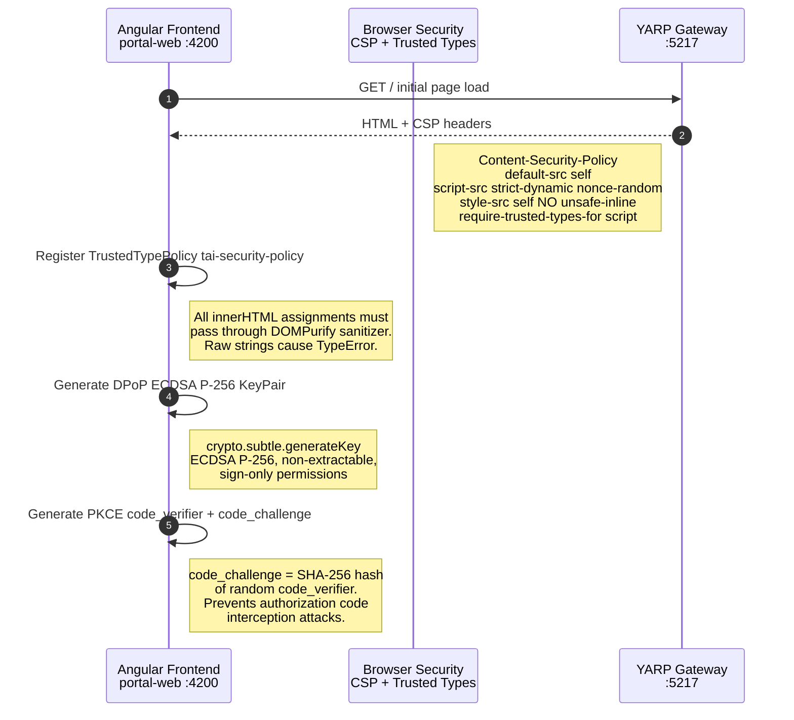
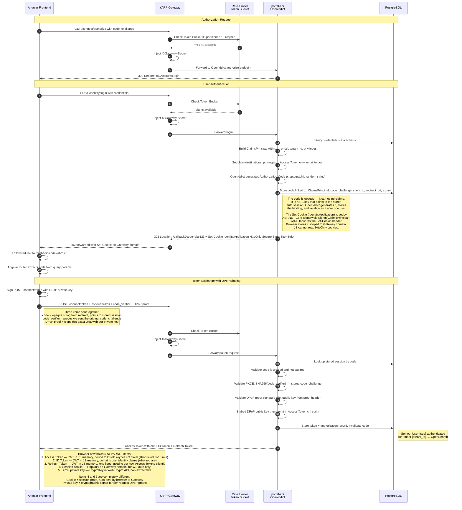
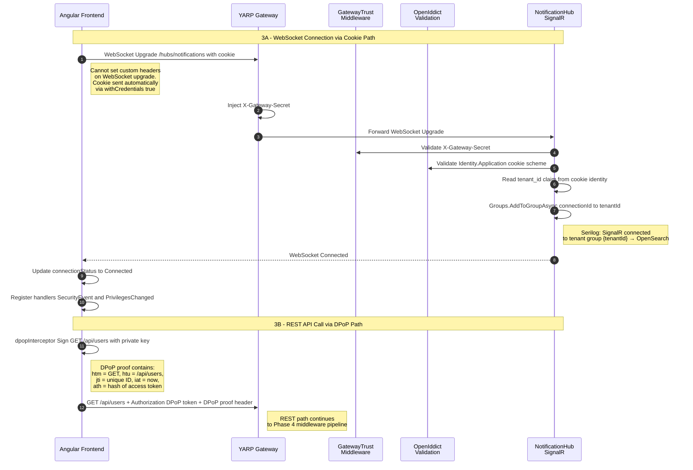
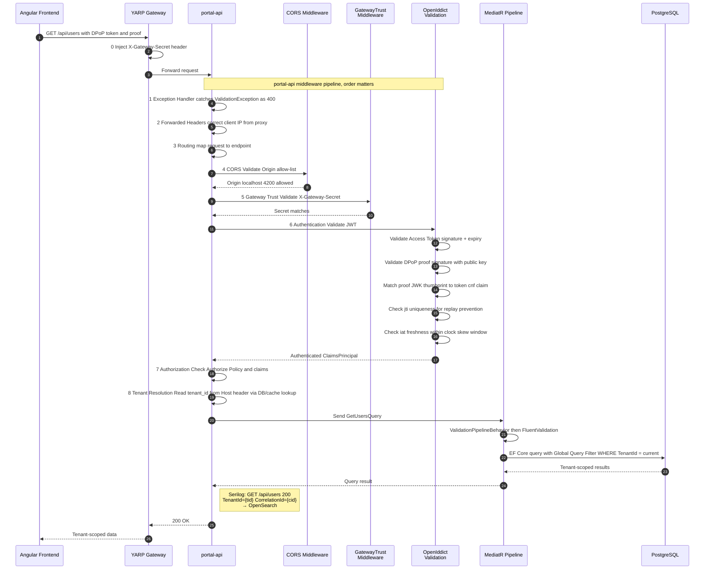
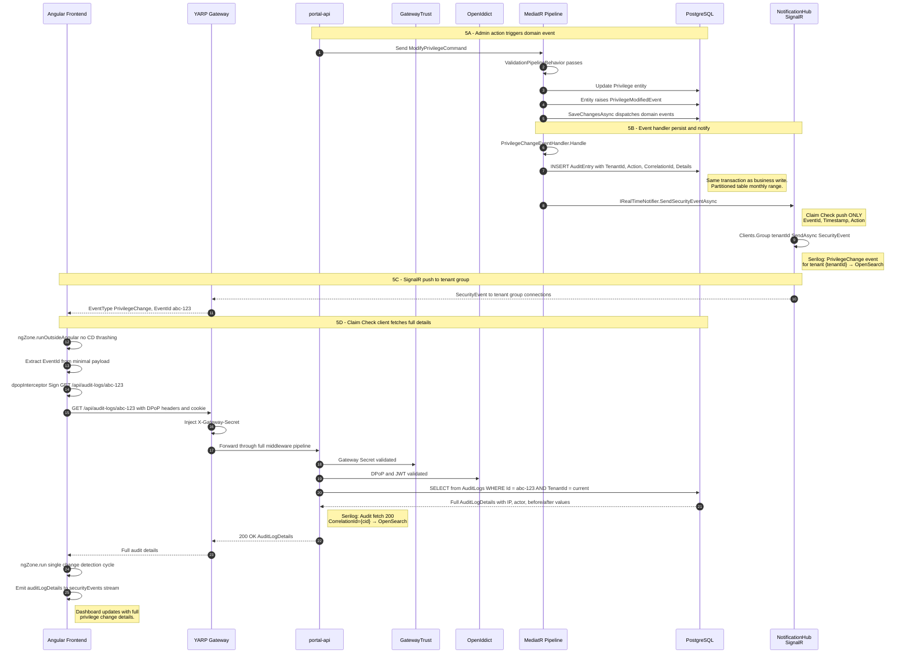
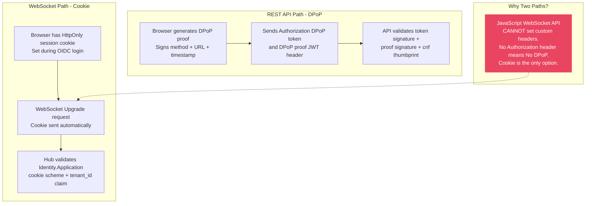
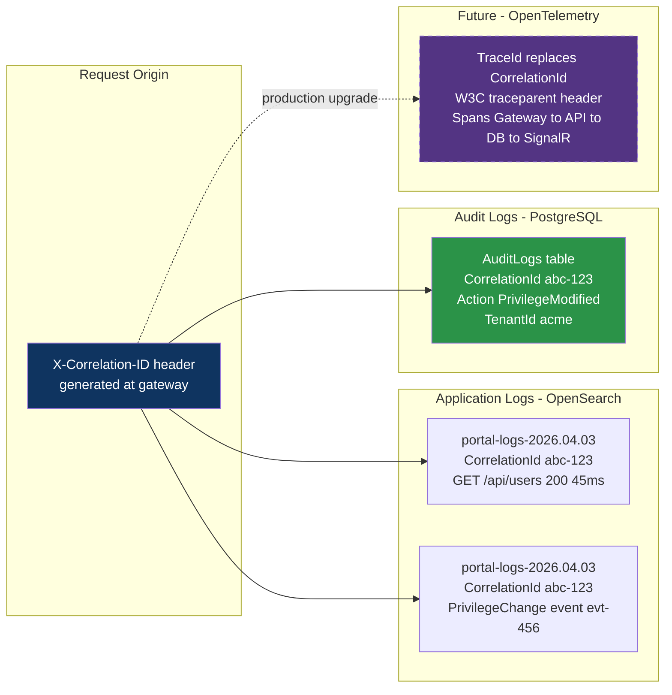

## TL;DR

This note traces the **complete request lifecycle** across every security, authentication, real-time, and observability layer in `tai-portal` — from the moment a user opens their browser to the moment a real-time security alert arrives on their dashboard. Each phase has its own focused diagram with implementation code. Use this as the "big picture" reference that connects the individual deep-dive notes.

## Phase Diagrams

### Phase 1: Client-Side Security Bootstrap

The browser enforces security before any network request. CSP headers lock down what can execute, Trusted Types prevent DOM XSS, and the client generates cryptographic material for DPoP and PKCE.



**Key takeaway:** All three client-side defenses activate before the first authenticated request. CSP blocks script injection, Trusted Types blocks DOM injection, and the DPoP key pair is non-extractable even from XSS.

#### Phase 1 Implementation

**TrustedTypesService** — registers the `tai-security-policy` that all `innerHTML` sinks must pass through:

```typescript
// libs/ui/design-system/src/lib/design-system/secure-input/trusted-types.service.ts:22-49
private initializePolicy(): void {
  const ttWindow = window as any;
  if (ttWindow.trustedTypes && ttWindow.trustedTypes.createPolicy) {
    try {
      this.policy = ttWindow.trustedTypes.createPolicy('tai-security-policy', {
        createHTML: (html: string) => {
          // Production: return DOMPurify.sanitize(html, { RETURN_TRUSTED_TYPE: true });
          return html;
        },
      });
    } catch {
      // Graceful fallback for Storybook HMR re-initialization
      this.policy = ttWindow.trustedTypes.getPolicy('tai-security-policy');
    }
  }
}
```

**DPoPService** — generates non-extractable ECDSA P-256 key pair per session:

```typescript
// apps/portal-web/src/app/dpop.service.ts:99-111
private async getOrCreateKeyPair(): Promise<CryptoKeyPair> {
  if (!this.keyPairPromise) {
    this.keyPairPromise = window.crypto.subtle.generateKey(
      {
        name: 'ECDSA',
        namedCurve: 'P-256',
      },
      false, // 'false' makes the private key non-extractable.
      ['sign'] // The key's only purpose is for signing.
    );
  }
  return this.keyPairPromise;
}
```

**SecureInputComponent** — custom input with Trusted Types integration (no Angular Material, zero inline styles):

```typescript
// libs/ui/design-system/src/lib/design-system/secure-input/secure-input.ts:64-85
public readonly inputClasses = computed(() => {
  const base =
    'secure-input-field px-4 py-3 text-base text-gray-900 bg-white border border-gray-300 ...';
  const error =
    this.errorMessage() && this.isTouched()
      ? ' border-red-600 focus:ring-red-600/10'
      : '';
  return `${base}${error}`;
});

// Trusted Types Integration: sanitized before [innerHTML] binding
public readonly trustedErrorMessage = computed(() => {
  return this.ttService.createTrustedHTML(this.errorMessage());
});
```

---

### Phase 2: OIDC Authentication + Token Exchange

Authorization Code flow with PKCE and DPoP binding. Every request to the identity endpoints passes through the Gateway rate limiter first.



**Key takeaway:** Five security artifacts are established during login, serving two distinct auth paths. The **Access Token + DPoP private key** pair secures REST API calls (the key signs each request, the token's `cnf` claim verifies the signature). The **Refresh Token** silently renews the short-lived Access Token without re-prompting the user — revocation of the Refresh Token is how you instantly cut access (see [[Authentication-Authorization]] Token Revocation). The **session cookie** secures WebSocket connections (auto-sent by the browser because JS WebSocket API cannot set custom headers). The cookie is set by ASP.NET Core Identity on the IdP, forwarded through YARP, and stored on the Gateway's domain — the Angular frontend never touches it.

#### Phase 2 Implementation

**Rate Limiting** — Token Bucket algorithm on the Gateway, partitioned by client IP:

```csharp
// apps/portal-gateway/Program.cs:11-34
builder.Services.AddRateLimiter(options => {
  options.AddPolicy("token-bucket", httpContext =>
      RateLimitPartition.GetTokenBucketLimiter(
          partitionKey: httpContext.Connection.RemoteIpAddress?.ToString() ?? "anonymous",
          factory: _ => new TokenBucketRateLimiterOptions {
            TokenLimit = 10,
            ReplenishmentPeriod = TimeSpan.FromMinutes(1),
            TokensPerPeriod = 10,
            QueueLimit = 0,  // Reject immediately, no queuing
            AutoReplenishment = true
          }));
  options.RejectionStatusCode = StatusCodes.Status429TooManyRequests;
});
```

**YARP Gateway Secret Injection** — every proxied request gets the shared secret:

```csharp
// apps/portal-gateway/Program.cs:39-50
var gatewaySecret = builder.Configuration["GATEWAY_SECRET"] ??
                    builder.Configuration["Gateway:Secret"] ??
                    "portal-poc-secret-2026";

builder.Services.AddReverseProxy()
    .LoadFromConfig(builder.Configuration.GetSection("ReverseProxy"))
    .AddTransforms(builderContext => {
      builderContext.AddRequestHeader("X-Gateway-Secret", gatewaySecret);
    });
```

**OIDC Connect Route** — rate limiter applied to `/connect/*` endpoints in YARP config:

```json
// apps/portal-gateway/appsettings.json:55-61
"OidcConnectRoute": {
  "ClusterId": "IdentityCluster",
  "RateLimiterPolicy": "token-bucket",
  "Match": {
    "Path": "/connect/{**catch-all}"
  }
}
```

**AuthorizationController** — builds ClaimsPrincipal with privileges and claim destinations:

```csharp
// apps/portal-api/Controllers/AuthorizationController.cs:92-141
var identity = new ClaimsIdentity(
    authenticationType: TokenValidationParameters.DefaultAuthenticationType,
    nameType: Claims.Name,
    roleType: Claims.Role);

// Standard OIDC claims
identity.SetClaim(Claims.Subject, await _userManager.GetUserIdAsync(user))
        .SetClaim(Claims.Email, await _userManager.GetEmailAsync(user))
        .SetClaim(Claims.Name, await _userManager.GetUserNameAsync(user));

// Map roles to granular privileges
var roles = await _userManager.GetRolesAsync(user);
if (roles.Contains("Admin") || roles.Contains("SystemAdmin")) {
  identity.SetClaims("privileges", new[] {
      "Portal.Users.Read",  "Portal.Users.Create",  "Portal.Users.Edit",
      "Portal.Privileges.Read",  "Portal.Privileges.Edit",  "Portal.Approvals.Read"
  }.ToImmutableArray());
}

// Destinations: which claims go to Access Token vs ID Token
identity.SetDestinations(GetDestinations);

return SignIn(new ClaimsPrincipal(identity), OpenIddictServerAspNetCoreDefaults.AuthenticationScheme);
```

**DPoP Proof Generation** — signs each request with the private key:

```typescript
// apps/portal-web/src/app/dpop.service.ts:30-93
async getDPoPHeader(httpMethod: string, url: string, accessToken?: string, nonce?: string): Promise<string> {
  const keyPair = await this.getOrCreateKeyPair();
  const jwk = await this.getOrCreateJWK(keyPair.publicKey);

  const header = { typ: 'dpop+jwt', alg: 'ES256', jwk: { kty: jwk.kty, crv: jwk.crv, x: jwk.x, y: jwk.y } };
  const payload: Record<string, string | number> = {
    jti: window.crypto.randomUUID(),     // Unique ID — prevents replay
    htm: httpMethod,                      // Bound to GET/POST/PUT/DELETE
    htu: url,                             // Bound to exact URL
    iat: Math.floor(Date.now() / 1000)    // Timestamp for freshness
  };
  if (nonce) payload['nonce'] = nonce;
  if (accessToken) payload['ath'] = await this.hashAccessToken(accessToken);

  // Sign with ECDSA P-256 + SHA-256 using non-extractable private key
  const signature = await window.crypto.subtle.sign(
    { name: 'ECDSA', hash: { name: 'SHA-256' } },
    keyPair.privateKey, dataToSign
  );
  return `${encodedHeader}.${encodedPayload}.${encodedSignature}`;
}
```

> **Deep Dive:** YARP-to-AWS migration, X-Gateway-Secret rotation, and production setup → see [[System-Design]] § "Replacing YARP with AWS API Gateway for Production"

---

### Phase 3: Dual-Path Connection Establishment

Two parallel channels open: WebSocket via cookie for real-time push, REST via DPoP for API calls. The split exists because JavaScript WebSocket API cannot set custom headers.



**Key takeaway:** The dual-path design is a technical necessity, not a choice. WebSocket upgrade requests cannot carry Authorization or DPoP headers. The BFF cookie provides auth for the persistent WebSocket channel, while DPoP provides per-request sender-constraint proof for REST calls.

#### Phase 3 Implementation

**NotificationHub** — dual auth scheme + tenant group isolation on connect:

```csharp
// apps/portal-api/Hubs/NotificationHub.cs:19-34
[Authorize(AuthenticationSchemes =
    $"{OpenIddictValidationAspNetCoreDefaults.AuthenticationScheme},Identity.Application")]
public class NotificationHub : Hub {
  public override async Task OnConnectedAsync() {
    var tenantId = GetTenantIdFromClaims();
    if (!string.IsNullOrEmpty(tenantId)) {
      await Groups.AddToGroupAsync(Context.ConnectionId, tenantId);
    }
    await base.OnConnectedAsync();
  }

  private string? GetTenantIdFromClaims() {
    var tenantClaim = Context.User?.FindFirst("tenant_id")?.Value;
    if (!string.IsNullOrEmpty(tenantClaim)) return tenantClaim;
    return Context.User?.FindFirst(ClaimTypes.NameIdentifier)?.Value;
  }
}
```

**YARP WebSocket Route** — explicit WebSocket.Enabled for SignalR proxy:

```json
// apps/portal-gateway/appsettings.json:20-31
"SignalRRoute": {
  "ClusterId": "IdentityCluster",
  "Match": { "Path": "/hubs/{**catch-all}" },
  "Transforms": [ { "X-Forwarded": "Append" } ],
  "WebSocket": { "Enabled": true }
}
```

**RealTimeService** — BFF cookie auth + NgZone-optimized event handlers:

```typescript
// apps/portal-web/src/app/real-time.service.ts:52-86
private startConnection(): void {
  const hubUrl = `http://${window.location.hostname}:5217/hubs/notifications`;

  this.hubConnection = new HubConnectionBuilder()
    .withUrl(hubUrl, { withCredentials: true })  // BFF cookie auth
    .withAutomaticReconnect()
    .configureLogging(LogLevel.Information)
    .build();

  // SecurityEvent handler — outside Angular zone to prevent CD thrashing
  this.hubConnection.on('SecurityEvent', (payload: SecurityEventPayload) => {
    this.ngZone.runOutsideAngular(() => {
      this.handleSecurityEvent(payload);
    });
  });
}
```

**DPoP Interceptor** — attaches proof to REST calls + nonce retry:

```typescript
// apps/portal-web/src/app/dpop.interceptor.ts:20-81
export const dpopInterceptor: HttpInterceptorFn = (req, next) => {
  const dpopService = inject(DPoPService);

  if (!req.url.startsWith('/api') && !req.url.includes('localhost')) {
    return next(req);
  }

  const executeWithDPoP = (nonce?: string) => {
    return from(dpopService.getDPoPHeader(req.method, req.url, accessToken, nonce)).pipe(
      switchMap(dpopHeader => {
        let headers = req.headers.set('DPoP', dpopHeader);
        return next(req.clone({ headers }));
      })
    );
  };

  // Automatic nonce retry on 401
  return executeWithDPoP().pipe(
    catchError((error: unknown) => {
      if (error instanceof HttpErrorResponse && error.status === 401) {
        const nonce = error.headers.get('DPoP-Nonce');
        if (nonce) return executeWithDPoP(nonce);
      }
      return throwError(() => error);
    })
  );
};
```

---

### Phase 4: REST Request Through All Security Layers

A single REST request traverses 8 middleware layers in strict order. Each layer assumes the layer above it has been compromised.



**Key takeaway:** Middleware order is security-critical. Each layer is placed to reject bad requests as cheaply as possible:

| Order | Middleware | Why this position? |
|-------|-----------|-------------------|
| ① Exception Handler | Outermost — wraps everything, catches unhandled exceptions from any layer below |
| ② Forwarded Headers | Must run before anything that reads Host/IP — corrects headers from the proxy |
| ③ Routing | Maps URL to endpoint — needed before CORS can check which policy applies |
| ④ CORS | Before auth — preflight OPTIONS requests from disallowed origins are rejected without touching auth |
| ⑤ Gateway Trust | Before auth — direct-access attempts (bypassing Gateway) are rejected cheaply without JWT validation |
| ⑥ Authentication | Before authorization — must establish WHO the user is before checking WHAT they can do |
| ⑦ Authorization | Before tenant resolution — reject unauthorized requests cheaply before spending a DB/cache lookup |
| ⑧ Tenant Resolution | Last — only runs for authenticated, authorized requests. Reads Host header, does a DB/cache lookup to resolve TenantId, sets the scoped `ITenantService` for the request |

Tenant isolation at the EF Core Global Query Filter level is the final guarantee — even if all middleware above is bypassed, the database query itself is scoped to `WHERE TenantId = @current`.

> **Deep Dive:** Token structures, JWK/jti/iat/cnf explained, 5-step verification chain with attack scenarios → see [[Security-CSP-DPoP]] § "The 5 DPoP Authentication Steps"

#### Phase 4 Implementation

**Middleware Pipeline Order** — the exact `app.Use*` chain in portal-api:

```csharp
// apps/portal-api/Program.cs:170-233
app.Use(async (context, next) => {  // ① Exception Handler
  try { await next(context); }
  catch (FluentValidation.ValidationException ex) {
    context.Response.StatusCode = 400;
    // ... build ValidationProblemDetails
  }
});

app.UseForwardedHeaders();                          // ② Forwarded Headers
app.UseRouting();                                   // ③ Routing
app.UseCors();                                      // ④ CORS
app.UseMiddleware<GatewayTrustMiddleware>();         // ⑤ Gateway Trust (AFTER CORS for OPTIONS)
app.UseAuthentication();                            // ⑥ Authentication
app.UseAuthorization();                             // ⑦ Authorization (before Tenant — reject early)
app.UseMiddleware<TenantResolutionMiddleware>();     // ⑧ Tenant Resolution (last — only for authorized requests)

app.MapControllers();                               // Endpoint mapping
app.MapHub<NotificationHub>("/hubs/notifications");
```

**GatewayTrustMiddleware** — the "Caller ID" check:

```csharp
// libs/core/infrastructure/Middleware/GatewayTrustMiddleware.cs:30-54
public async Task InvokeAsync(HttpContext context) {
  // Allow OIDC Discovery to be public
  if (context.Request.Path.Value?.Contains(".well-known/openid-configuration") == true ||
      context.Request.Path.Value?.Contains(".well-known/jwks") == true ||
      context.Request.Path.Value?.Contains("Account/Login") == true) {
    await _next(context); return;
  }

  // Check for the "Secret Handshake" header
  if (!context.Request.Headers.TryGetValue("X-Gateway-Secret", out var receivedSecret) ||
      !string.Equals(receivedSecret.ToString().Trim(), _expectedSecret.Trim(),
                      StringComparison.OrdinalIgnoreCase)) {
    context.Response.StatusCode = StatusCodes.Status403Forbidden;
    await context.Response.WriteAsync("Untrusted request. Access must be via the Gateway.");
    return;
  }
  await _next(context);
}
```

> **Deep Dive:** X-Gateway-Secret rotation, generation, and AWS Secrets Manager implementation → see [[System-Design]] § "X-Gateway-Secret — Rotation, Generation, and Cloud-Native Implementation"

> **Deep Dive:** CORS production best practice — config-driven allow lists and multi-tenant subdomain patterns → see [[Security-CSP-DPoP]] § "CORS Best Practice — Configuration-Driven, Not Hardcoded"

**TenantResolutionMiddleware** — resolves tenant from Host header with 15-min cache:

```csharp
// libs/core/infrastructure/Middleware/TenantResolutionMiddleware.cs:23-66
public async Task InvokeAsync(HttpContext context, ITenantService tenantService, PortalDbContext dbContext) {
  string host = context.Request.Host.Host.ToLowerInvariant();

  if (!string.IsNullOrEmpty(host)) {
    var tenantId = await GetTenantIdFromHostAsync(host, dbContext);
    if (tenantId.HasValue) {
      tenantService.SetTenant(tenantId.Value);
    }
  }
  await _next(context);
}

private async Task<TenantId?> GetTenantIdFromHostAsync(string host, PortalDbContext dbContext) {
  var cacheKey = $"tenant_host_{host}";
  if (!_cache.TryGetValue(cacheKey, out TenantId? tenantId)) {
    var tenant = await dbContext.Tenants
        .AsNoTracking()
        .IgnoreQueryFilters()  // Must ignore — we don't know the tenant yet!
        .FirstOrDefaultAsync(t => t.TenantHostname == host);
    if (tenant != null) {
      tenantId = tenant.Id;
      _cache.Set(cacheKey, tenantId, TimeSpan.FromMinutes(15));
    }
  }
  return tenantId;
}
```

> **Deep Dive:** Why MediatR, pipeline behaviors, CQRS-lite, ValidationPipelineBehavior + FluentValidation → see [[Design-Patterns]] § "Why MediatR in the REST Request?"

---

### Phase 5: Domain Event to Real-Time Notification

An admin action triggers a domain event, which persists an audit entry, pushes a minimal SignalR notification via Claim Check, and the client fetches full details through the complete middleware pipeline.



**Key takeaway:** The Claim Check pattern ensures sensitive audit data never traverses the WebSocket. The minimal SignalR payload contains only an EventId. The full data fetch in step 5D goes through the exact same 8-layer middleware pipeline as any REST call in Phase 4 including DPoP proof, gateway trust, and tenant-scoped database query.

#### Phase 5 Implementation

**PrivilegeChangeEventHandler** — domain event to audit entry + SignalR push + message bus:

```csharp
// libs/core/infrastructure/Persistence/Handlers/PrivilegeChangeEventHandler.cs:35-77
public async Task Handle(DomainEventNotification<PrivilegeChangeEvent> notification, CancellationToken ct) {
  var domainEvent = notification.DomainEvent;

  // 1. Persist immutable audit entry (same transaction as business write)
  var auditEntry = new AuditEntry(
      domainEvent.TenantId, domainEvent.UserId, "PrivilegeChange",
      domainEvent.ResourceId, domainEvent.CorrelationId, domainEvent.IpAddress,
      $"Privilege change: {domainEvent.Action}. {domainEvent.Details}");

  _dbContext.AuditLogs.Add(auditEntry);
  await _dbContext.SaveChangesAsync(ct);

  // 2. Claim Check: push ONLY EventId, Timestamp, Action via SignalR
  await _realTimeNotifier.SendSecurityEventAsync(
      domainEvent.TenantId.Value.ToString(), "PrivilegeChange",
      new { EventId = auditEntry.Id, Timestamp = auditEntry.Timestamp,
            Action = domainEvent.Action, ResourceId = domainEvent.ResourceId }, ct);

  // 3. Publish to IMessageBus for cross-app communication
  await _messageBus.PublishAsync(new {
    EventName = "PrivilegeChange", EventId = auditEntry.Id,
    TenantId = domainEvent.TenantId.Value, UserId = domainEvent.UserId,
    CorrelationId = domainEvent.CorrelationId
  }, ct);
}
```

**SignalRRealTimeNotifier** — pushes to tenant-scoped SignalR group:

```csharp
// apps/portal-api/Services/SignalRRealTimeNotifier.cs:14-29
public class SignalRRealTimeNotifier : IRealTimeNotifier {
  private readonly IHubContext<NotificationHub> _hubContext;

  public async Task SendSecurityEventAsync<T>(
      string tenantId, string eventType, T payload, CancellationToken ct = default) {
    await _hubContext.Clients.Group(tenantId)
        .SendAsync("SecurityEvent", new {
          EventType = eventType,
          Payload = payload
        }, ct);
  }
}
```

**RealTimeService Claim Check** — receives event ID, fetches full details via REST:

```typescript
// apps/portal-web/src/app/real-time.service.ts:109-138
private handleSecurityEvent(payload: SecurityEventPayload): void {
  const eventId = payload.EventId;
  if (!eventId) return;

  // Fetch full details via REST (goes through full middleware pipeline)
  this.fetchAuditLogDetails(eventId).subscribe({
    next: (details) => {
      // Only this final update runs inside Angular zone — single CD cycle
      this.ngZone.run(() => {
        this._securityEvents$.next(details);
      });
    }
  });
}

private fetchAuditLogDetails(eventId: string) {
  const apiUrl = `http://${window.location.hostname}:5217/api/audit-logs/${eventId}`;
  return this.http.get<AuditLogDetails>(apiUrl, { withCredentials: true });
}
```

**AuditLogsController** — the Claim Check endpoint with automatic tenant isolation:

```csharp
// apps/portal-api/Controllers/AuditLogsController.cs:12-51
[Route("api/[controller]")]
[ApiController]
[Authorize(AuthenticationSchemes =
    $"{OpenIddictValidationAspNetCoreDefaults.AuthenticationScheme},Identity.Application")]
public class AuditLogsController : ControllerBase {
  [HttpGet("{id}")]
  public async Task<IActionResult> GetAuditLog(Guid id) {
    // Global Query Filter automatically appends WHERE TenantId = @current
    var auditEntry = await _dbContext.AuditLogs
        .Where(a => a.Id == id)
        .FirstOrDefaultAsync();

    if (auditEntry == null) return NotFound();

    return Ok(new {
      auditEntry.Id, auditEntry.TenantId, auditEntry.UserId,
      auditEntry.Action, auditEntry.ResourceId, auditEntry.CorrelationId,
      auditEntry.Timestamp, auditEntry.IpAddress, auditEntry.Details
    });
  }
}
```

---

### Reading the Diagram

**The five phases map to the five notes:**

| Phase | What Happens | Primary Note | Security Layers Active |
|-------|-------------|-------------|----------------------|
| **1** | Page load, CSP enforcement, DPoP key generation, PKCE setup | [[Security-CSP-DPoP]] | CSP, Trusted Types |
| **2** | OIDC login, token exchange with DPoP binding, SSO cookie | [[Authentication-Authorization]] | Rate limiting, PKCE, DPoP, Gateway Trust |
| **3** | WebSocket via cookie, REST via DPoP — dual-path establishment | [[Authentication-Authorization]] + [[SignalR-Realtime]] | Cookie auth (WS), DPoP auth (REST) |
| **4** | REST API call through all 8 middleware layers | [[Security-CSP-DPoP]] + [[System-Design]] | All 8 middleware in order |
| **5** | Domain event → audit log → SignalR push → Claim Check fetch | [[SignalR-Realtime]] + [[EFCore-SQL]] + [[Logging-Observability]] | Tenant isolation (DB + Groups), Claim Check |

**Every arrow crosses a trust boundary.** The diagram shows that no shortcut exists — even the Claim Check fetch in Phase 5 goes through the full middleware pipeline (Gateway Trust → CORS → Auth → DPoP → Tenant Filter). This is Defense-in-Depth in action.

### Security Layers Inventory

Every request passes through these layers in this exact order:

```mermaid
graph LR
    A["1. CSP + Trusted Types<br/>Browser"] --> B["2. Rate Limiter<br/>Gateway"]
    B --> C["3. X-Gateway-Secret<br/>Gateway to API"]
    C --> D["4. CORS<br/>API"]
    D --> E["5. Gateway Trust<br/>Middleware API"]
    E --> F["6. Authentication<br/>JWT + DPoP API"]
    F --> G["7. Authorization<br/>Claims Policy API"]
    G --> H["8. Tenant Isolation<br/>EF Core Filter DB"]

    style A fill:#e94560,color:#fff
    style B fill:#e94560,color:#fff
    style C fill:#0f3460,color:#fff
    style D fill:#0f3460,color:#fff
    style E fill:#0f3460,color:#fff
    style F fill:#533483,color:#fff
    style G fill:#533483,color:#fff
    style H fill:#2b9348,color:#fff
```



| Layer | Protects Against | Fails If |
|-------|-----------------|----------|
| ① CSP + Trusted Types | XSS, script injection, inline style injection | Attacker finds CSP bypass (JSONP on allowed origin) |
| ② Rate Limiter | Brute-force, DDoS on auth endpoints | Distributed botnet with thousands of IPs |
| ③ X-Gateway-Secret | Direct API access bypassing gateway | Secret is leaked |
| ④ CORS | Cross-origin data theft, CSRF | Overly permissive origin allow-list |
| ⑤ Gateway Trust | Requests that bypass the gateway | Same as ③ |
| ⑥ JWT + DPoP | Token theft, replay attacks | Browser crypto vulnerability exposing private key |
| ⑦ Claims Policy | Privilege escalation | Misconfigured claim-to-policy mapping |
| ⑧ Tenant Isolation | Cross-tenant data access | Missing Global Query Filter on a new entity |

**Each layer assumes the layer above it has been compromised.** An attacker must defeat ALL eight simultaneously.

### Dual-Path Authentication Explained



### Observability Thread

A single `CorrelationId` connects every layer — from the HTTP request through the audit log to the Serilog application log:



---

## Cross-References

- **[[Authentication-Authorization]]** — Phase 2 (OIDC + DPoP) and Phase 3 (dual-path auth) in full detail
- **[[Security-CSP-DPoP]]** — Phase 1 (CSP bootstrap) and Phase 4 (all middleware layers) with code examples
- **[[SignalR-Realtime]]** — Phase 3B (WebSocket connection) and Phase 5 (Claim Check flow) with NgZone patterns
- **[[System-Design]]** — Middleware pipeline order, CQRS via MediatR, domain event dispatch in SaveChangesAsync
- **[[EFCore-SQL]]** — Global Query Filters for tenant isolation, audit log partitioning, xmin concurrency
- **[[Logging-Observability]]** — CorrelationId flow, Serilog enrichment, OpenSearch log indices, OpenTelemetry future
- **[[Message-Queues]]** — The gap between Phase 5B (event handler) and Phase 5C (SignalR push) where a crash loses the event; Outbox pattern closes this gap

---

*Last updated: 2026-04-04*
