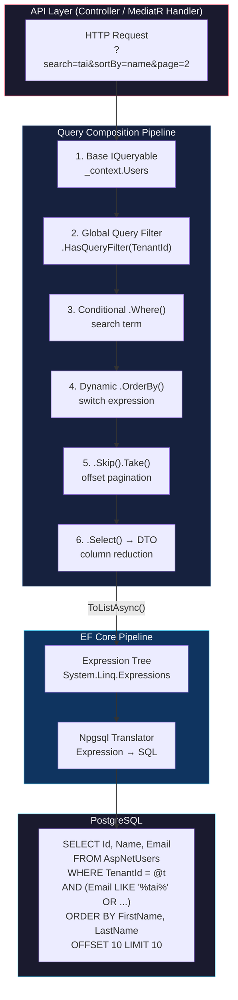
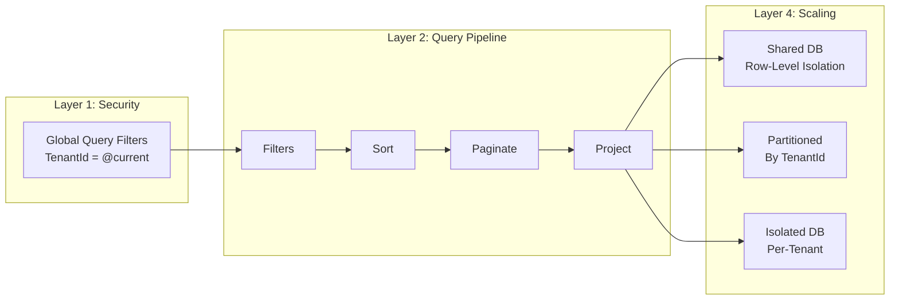

[🧠 **View Interactive Mindmap**](./linq-mindmap.md)

1. **Foundations**
   - 1.1 [What LINQ Is & Two Syntaxes](#what-linq-is--two-syntaxes)
   - 1.2 [IEnumerable vs IQueryable — The Two Execution Universes](#ienumerable-vs-iqueryable--the-two-execution-universes)
   - 1.3 [Deferred Execution & Expression Trees](#deferred-execution--expression-trees)
   - 1.4 [Terminal Operators — Forcing Execution](#terminal-operators--forcing-execution)

2. **Core Operators**
   - 2.1 [Filtering: Where](#filtering-where)
   - 2.2 [Projection: Select & SelectMany](#projection-select--selectmany)
   - 2.3 [Ordering: OrderBy / ThenBy](#ordering-orderby--thenby)
   - 2.4 [Aggregation: Count, Any, Sum, Aggregate](#aggregation-count-any-sum-aggregate)
   - 2.5 [Set & Grouping: GroupBy, Distinct, Join](#set--grouping-groupby-distinct-join)

3. **Query Composition Patterns**
   - 3.1 [Conditional Query Building](#conditional-query-building)
   - 3.2 [Pagination with Skip / Take](#pagination-with-skip--take)
   - 3.3 [DTO Projection for Performance](#dto-projection-for-performance)
   - 3.4 [Dynamic Sorting with Switch Expressions](#dynamic-sorting-with-switch-expressions)
   - 3.5 [Specification Pattern & Reusable Filters](#specification-pattern--reusable-filters)

4. **Performance & Pitfalls**
   - 4.1 [Client vs Server Evaluation](#client-vs-server-evaluation)
   - 4.2 [N+1 Query Problem](#n1-query-problem)
   - 4.3 [Cartesian Explosion & AsSplitQuery](#cartesian-explosion--assplitquery)
   - 4.4 [AsNoTracking for Read Paths](#asnotracking-for-read-paths)
   - 4.5 [Bulk Operations: ExecuteUpdateAsync / ExecuteDeleteAsync](#bulk-operations-executeupdateasync--executedeleteasync)

5. **Full-Stack: TypeScript Array Methods as LINQ**
   - 5.1 [Operator Mapping Table](#operator-mapping-table)
   - 5.2 [RxJS Pipe Operators as LINQ-to-Streams](#rxjs-pipe-operators-as-linq-to-streams)

6. **Knowledge Deep Dive & Q&A**
   - 6.1 **L1: Junior Knowledge**
     - 6.1.1 [IQueryable vs IEnumerable](#l1-what-is-the-difference-between-iqueryable-and-ienumerable)
     - 6.1.2 [What Is Deferred Execution](#l1-what-is-deferred-execution-and-why-does-it-matter)
   - 6.2 **L2: Mid-Level Knowledge**
     - 6.2.1 [Select vs SelectMany](#l2-when-would-you-use-selectmany-instead-of-select)
     - 6.2.2 [Client Evaluation Trap](#l2-how-can-a-linq-query-silently-destroy-performance)
     - 6.2.3 [GroupBy Translation](#l2-why-does-groupby-behave-differently-in-ef-core-vs-linq-to-objects)
   - 6.3 **L3: Senior Knowledge**
     - 6.3.1 [Expression Trees Under the Hood](#l3-how-do-expression-trees-power-iqueryable)
     - 6.3.2 [Building a Dynamic Query Pipeline](#l3-design-a-reusable-query-pipeline-for-paginated-filtered-sorted-api-endpoints)
     - 6.3.3 [Bulk Operations vs Change Tracker](#l3-when-should-you-bypass-the-change-tracker)
   - 6.4 **Staff: System Architecture**
     - 6.4.1 [Multi-Tenant Query Layer Design](#staff-design-a-multi-tenant-query-layer-that-guarantees-data-isolation-supports-dynamic-filtering-and-scales-to-1000-tenants)
     - 6.4.2 [CQRS Read Model Projection](#staff-how-would-you-build-a-cqrs-read-side-with-linq-projections-that-serves-both-sql-and-opensearch)

---

## TL;DR

<span style="color: #33b5e5; font-weight: bold;">LINQ</span> (Language Integrated Query) is C#'s unified query syntax that works across in-memory collections (`IEnumerable<T>`), databases (`IQueryable<T>`), XML, and JSON. The critical senior-level distinction is between <span style="color: #00C851; font-weight: bold;">LINQ-to-Objects</span> (executes in CLR memory as delegate chains) and <span style="color: #00C851; font-weight: bold;">LINQ-to-Entities</span> (translates expression trees to SQL via EF Core). In `tai-portal`, every database query is a LINQ chain — conditional `.Where()` filters compose tenant-scoped, search-filtered, paginated queries that translate to a single optimized SQL statement. The most common senior interview mistake is <span style="color: #ff4444; font-weight: bold;">accidentally breaking the IQueryable pipeline</span> (calling `.ToList()` mid-chain), which silently pulls the entire table into memory and filters client-side. A 9-year .NET engineer must also articulate how LINQ maps to TypeScript's `.filter()` / `.map()` / `.reduce()` and RxJS pipe operators — the same functional composition paradigm across the full stack.

---

## Deep Dive

### Foundations

#### What LINQ Is & Two Syntaxes

##### What
LINQ embeds query capabilities directly into C# as first-class language features. It provides a single API to query any data source that implements `IEnumerable<T>` (in-memory) or `IQueryable<T>` (translatable to an external query language like SQL).

##### Why
Before LINQ, C# developers wrote raw SQL strings for databases, `for` loops for collections, and XPath for XML — three completely different query paradigms. LINQ unifies them: learn one syntax, query everything. It also provides compile-time type safety — rename a property and the compiler catches every query that references it.

##### How
LINQ has two syntaxes. Both compile to the same IL — use whichever reads better for the scenario:

```csharp
// Method Syntax (fluent) — preferred in tai-portal and most modern C#
var active = users.Where(u => u.IsActive).OrderBy(u => u.Name).ToList();

// Query Syntax (SQL-like) — better for complex joins and let clauses
var active = (from u in users
              where u.IsActive
              orderby u.Name
              select u).ToList();

// Query syntax shines with joins:
var result = from o in orders
             join c in customers on o.CustomerId equals c.Id
             let total = o.Items.Sum(i => i.Price)
             where total > 100
             select new { c.Name, Total = total };
```

##### When
- **Method syntax**: default choice for simple chains (filter → sort → project → paginate). This is what 95% of production code uses.
- **Query syntax**: use for multi-source joins, `let` bindings (intermediate computed values), and `group ... by ... into` when the method syntax becomes deeply nested.

##### Trade-offs
- Query syntax has limited operator coverage — no `Skip`, `Take`, `Distinct`, `Aggregate` in query form. You must drop into method syntax for these: `(from u in users where u.IsActive select u).Skip(10).Take(5)`.
- <span style="color: #ff4444; font-weight: bold;">Do not mix syntaxes in the same expression</span> unless necessary — it hurts readability.

---

#### IEnumerable vs IQueryable — The Two Execution Universes

##### What
`IEnumerable<T>` and `IQueryable<T>` both support LINQ operators, but they execute in fundamentally different places:
- `IEnumerable<T>` — operators receive **compiled delegates** (`Func<T, bool>`). Execution happens in CLR memory.
- `IQueryable<T>` — operators receive **expression trees** (`Expression<Func<T, bool>>`). Execution is translated to an external query (SQL, OpenSearch DSL, etc.).

##### Why
This distinction is the single most important LINQ concept for a senior engineer. It determines whether your `.Where()` filter runs as a SQL `WHERE` clause (fast, database-side) or as a C# `foreach` loop over every row pulled into memory (slow, application-side).

##### How
```csharp
// IQueryable — translated to SQL: SELECT * FROM Users WHERE IsActive = true
IQueryable<User> dbQuery = _context.Users.Where(u => u.IsActive);
// Generated SQL: SELECT "u"."Id", "u"."Name" FROM "AspNetUsers" WHERE "u"."IsActive" = TRUE

// IEnumerable — pulls ALL rows, then filters in C# memory
IEnumerable<User> memQuery = _context.Users.AsEnumerable().Where(u => u.IsActive);
// Generated SQL: SELECT "u"."Id", "u"."Name" FROM "AspNetUsers"  ← NO WHERE CLAUSE
// Then C# iterates every row and checks u.IsActive
```

##### When
- Always keep queries as `IQueryable<T>` for as long as possible. Only materialize (call `.ToList()`, `.ToArray()`, `.FirstOrDefault()`) at the very end.
- Switch to `IEnumerable<T>` only when you need C# logic that has no SQL translation (regex, custom methods, culture-specific string operations).

##### Trade-offs
- <span style="color: #ff4444; font-weight: bold;">The silent performance killer:</span> calling `.AsEnumerable()`, `.ToList()`, or returning `IEnumerable<T>` from a repository method breaks the IQueryable chain. Downstream `.Where()` calls silently become client-side filters. On a 10-million-row table, this is the difference between a 2ms indexed query and an OOM crash.
- <span style="color: #ffbb33; font-weight: bold;">IQueryable limitations:</span> not all C# expressions translate to SQL. `string.Format()`, `DateTime.Parse()`, regex, and custom methods cannot be pushed to the database. EF Core will throw `InvalidOperationException` or silently fall back to client evaluation (configurable via `QueryClientEvaluationWarning`).

---

#### Deferred Execution & Expression Trees

##### What
LINQ queries are not executed when they are defined. The `Where`, `Select`, `OrderBy` calls build a **query plan** (an expression tree for `IQueryable`, a delegate chain for `IEnumerable`). Execution is **deferred** until a terminal operator consumes the results.

##### Why
Deferred execution enables **query composition** — you can incrementally build a query across multiple methods, conditionally adding filters, sorts, and projections, and the database sees only one optimized SQL statement. Without deferred execution, each `.Where()` call would trigger a separate SQL query.

##### How
```csharp
// No SQL is generated yet — this is just building an expression tree
var query = _context.Users.Where(u => u.IsActive);  // Expression tree node: Where
query = query.OrderBy(u => u.Name);                  // Expression tree node: OrderBy
query = query.Take(10);                              // Expression tree node: Take

// NOW the expression tree is translated to SQL and executed:
var results = await query.ToListAsync();
// SELECT "u"."Id", "u"."Name" FROM "AspNetUsers"
// WHERE "u"."IsActive" = TRUE ORDER BY "u"."Name" LIMIT 10
```

Under the hood, `IQueryable` stores the query as a `System.Linq.Expressions.Expression` tree. The EF Core provider (Npgsql for PostgreSQL) has a visitor that walks this tree and emits SQL. This is why lambdas in `IQueryable` methods must be `Expression<Func<...>>`, not just `Func<...>` — the runtime needs the expression structure, not just the compiled code.

##### When
- Exploit deferred execution by building queries in layers: base query → tenant filter → search filter → sort → pagination → projection → materialize.
- Be aware that deferred execution means the **query re-executes** each time you enumerate. Calling `.ToList()` twice executes two SQL queries. Cache the result if you need it multiple times.

##### Trade-offs
- <span style="color: #ff4444; font-weight: bold;">Captured variable trap:</span> deferred execution captures references, not values. If you modify a variable after building the query but before executing it, the query uses the new value:
```csharp
var name = "Alice";
var query = users.Where(u => u.Name == name);
name = "Bob";
var results = query.ToList(); // Filters for "Bob", not "Alice"!
```
- <span style="color: #ffbb33; font-weight: bold;">DbContext lifetime:</span> if the `DbContext` is disposed before the query executes, you get `ObjectDisposedException`. This is common when returning `IQueryable` from a service method whose scope has ended.

---

#### Terminal Operators — Forcing Execution

##### What
Terminal operators trigger query execution and consume the results. They are the bridge between the deferred query plan and actual data.

##### Why
Understanding which operators are terminal is essential for knowing when SQL is generated and when network I/O occurs. Every terminal operator is an await point in async code.

##### How

| Operator | Returns | SQL Equivalent | Use When |
|----------|---------|----------------|----------|
| `ToListAsync()` | `List<T>` | Executes full query | Need all results in memory |
| `ToArrayAsync()` | `T[]` | Executes full query | Need fixed-size array |
| `FirstOrDefaultAsync()` | `T?` | `LIMIT 1` | Need one row or null |
| `FirstAsync()` | `T` | `LIMIT 1` (throws if empty) | Row must exist |
| `SingleOrDefaultAsync()` | `T?` | `LIMIT 2` (throws if >1) | Expect 0 or 1 row |
| `CountAsync()` | `int` | `SELECT COUNT(*)` | Need count only |
| `AnyAsync()` | `bool` | `SELECT EXISTS(...)` | Existence check |
| `SumAsync()` | `numeric` | `SELECT SUM(...)` | Aggregation |
| `MaxAsync()` / `MinAsync()` | `T` | `SELECT MAX/MIN(...)` | Boundary values |

```csharp
// 📍 From tai-portal: PrivilegeService.cs — existence check with AnyAsync
if (await _context.Privileges.AnyAsync(p => p.Name == name, cancellationToken))
    throw new InvalidOperationException($"Privilege with name '{name}' already exists.");

// 📍 From tai-portal: TdmController.cs — single lookup with FirstOrDefaultAsync
var tenant = await _context.Set<Tenant>()
    .IgnoreQueryFilters()
    .FirstOrDefaultAsync(t => t.TenantHostname == request.TenantHost);
```

##### When
- **`AnyAsync`** over `CountAsync() > 0` — `ANY` short-circuits after the first match; `COUNT` scans all matching rows.
- **`FirstOrDefaultAsync`** over `SingleOrDefaultAsync` when you don't need the uniqueness guarantee — `Single` generates `LIMIT 2` and throws if more than one row matches.
- **Never** call `.ToList()` mid-chain and then chain more `.Where()` — this loads everything into memory.

##### Trade-offs
- <span style="color: #ffbb33; font-weight: bold;">Each terminal operator is a database round-trip.</span> Calling `CountAsync()` and then `ToListAsync()` on the same query sends two SQL queries. If you need both, consider a single query that returns both count and data (or use a windowed query with `COUNT(*) OVER()`).

---

### Core Operators

#### Filtering: Where

##### What
`.Where()` appends a predicate to the query. Multiple `.Where()` calls are combined with `AND`. For `OR` logic, combine conditions within a single lambda.

##### Why
Filtering is the most common LINQ operation. In tai-portal, every paginated endpoint builds a chain of `.Where()` calls to scope data by tenant, search term, status, and date range.

##### How
```csharp
// 📍 From tai-portal: IdentityService.cs — multi-field text search
if (!string.IsNullOrWhiteSpace(search))
{
    query = query.Where(u =>
        (u.Email != null && u.Email.Contains(search)) ||
        (u.FirstName != null && u.FirstName.Contains(search)) ||
        (u.LastName != null && u.LastName.Contains(search)) ||
        (u.UserName != null && u.UserName.Contains(search)));
}
// Generated SQL: WHERE ("Email" LIKE '%search%' OR "FirstName" LIKE '%search%' OR ...)
```

```csharp
// Multiple Where = AND composition
var query = _context.Users
    .Where(u => u.IsActive)          // AND
    .Where(u => u.TenantId == tid);  // Combined in SQL: WHERE IsActive AND TenantId = @tid
```

##### When
- Chain `.Where()` calls for AND logic — cleaner than cramming everything into one lambda.
- Use a single `.Where()` with `||` for OR logic.
- For complex dynamic filtering (many optional parameters), see the Conditional Query Building pattern.

##### Trade-offs
- <span style="color: #ff4444; font-weight: bold;">`Contains()` on strings translates to `LIKE '%value%'`</span> in SQL, which cannot use a B-Tree index (requires a full scan or trigram/GIN index). For prefix search, use `StartsWith()` which translates to `LIKE 'value%'` (index-friendly).
- Null checks (`u.Email != null`) are necessary in LINQ-to-Entities because the SQL translation must handle nullable columns. Without them, the provider may generate incorrect SQL or warnings.

---

#### Projection: Select & SelectMany

##### What
- `.Select()` transforms each element: `IQueryable<T> → IQueryable<TResult>`. Maps 1:1.
- `.SelectMany()` transforms and flattens nested collections: `IQueryable<T<IEnumerable<U>>> → IQueryable<U>`. Maps 1:N.

##### Why
Projection is the primary performance optimization in LINQ-to-Entities. Without `.Select()`, EF Core fetches all columns of an entity. With `.Select()`, the generated SQL only includes the columns you project into — less data over the wire, no change tracking overhead.

##### How
```csharp
// 📍 From tai-portal: PrivilegeService.cs — DTO projection reduces columns
var privileges = await _context.Privileges
    .AsNoTracking()
    .OrderBy(p => p.Name)
    .Skip(skip).Take(take)
    .Select(p => new PrivilegeDto(
        p.Id.Value,      // Only these 8 columns in SELECT
        p.Name,
        p.Description,
        p.Module,
        p.RiskLevel,
        p.IsActive,
        p.RowVersion,
        p.JitSettings))
    .ToListAsync(cancellationToken);

// 📍 From tai-portal: PortalDbContext.cs — SelectMany flattens domain events
var domainEvents = ChangeTracker.Entries<IHasDomainEvents>()
    .SelectMany(e => e.Entity.DomainEvents)  // Each entity has List<IDomainEvent>
    .ToList();                               // Flatten into one List<IDomainEvent>
```

##### When
- **Always project to DTOs** at the query boundary (controller/handler level). Never return full entities from read endpoints.
- Use `SelectMany` to flatten: orders → order items, users → roles, entities → domain events.
- Use `Select` with anonymous types for intermediate query steps, then project to a named DTO at the end.

##### Trade-offs
- <span style="color: #ffbb33; font-weight: bold;">Projection disables change tracking</span> — EF Core cannot track projected DTOs. This is usually what you want for read queries, but means you cannot call `.Update()` on the result.
- Complex projections with method calls inside `.Select()` may fail to translate to SQL. Keep projection expressions simple — property access, constructor calls, and basic arithmetic.

---

#### Ordering: OrderBy / ThenBy

##### What
- `.OrderBy()` / `.OrderByDescending()` — sets the primary sort.
- `.ThenBy()` / `.ThenByDescending()` — adds secondary, tertiary sort keys.

##### Why
Deterministic ordering is **mandatory** before `Skip/Take` pagination. Without `OrderBy`, the database returns rows in an undefined order, and page 2 might duplicate or skip rows from page 1.

##### How
```csharp
// 📍 From tai-portal: IdentityService.cs — dynamic multi-column sort
query = (sortColumn?.ToLower(), sortDirection?.ToLower()) switch
{
    ("name", "desc") => query.OrderByDescending(u => u.FirstName)
                              .ThenByDescending(u => u.LastName),
    ("name", "asc")  => query.OrderBy(u => u.FirstName)
                              .ThenBy(u => u.LastName),
    ("email", "desc") => query.OrderByDescending(u => u.Email),
    ("email", "asc")  => query.OrderBy(u => u.Email),
    _                 => query.OrderBy(u => u.UserName)
};
```

##### When
- Always call `OrderBy` before `Skip/Take`.
- Use `ThenBy` for composite sort keys (first name + last name, date + time).
- For sort columns that come from API query strings, use a switch expression or dictionary — never interpolate user input into `OrderBy` dynamically without validation.

##### Trade-offs
- <span style="color: #ffbb33; font-weight: bold;">Each `OrderBy` adds a `SORT` operation to the query plan.</span> If the sorted column is not indexed, PostgreSQL performs a full table sort in memory. For frequently sorted columns, ensure a matching B-Tree index exists.
- Calling `.OrderBy()` twice (not `.ThenBy()`) <span style="color: #ff4444; font-weight: bold;">replaces the first sort</span> — `query.OrderBy(x => x.A).OrderBy(x => x.B)` sorts only by B.

---

#### Aggregation: Count, Any, Sum, Aggregate

##### What
Aggregation operators collapse a sequence into a single scalar value. They are all terminal operators (execute immediately).

##### Why
Aggregation queries are essential for dashboard pages, pagination metadata (total count), validation checks (does a duplicate exist?), and reporting.

##### How
```csharp
// 📍 From tai-portal: IdentityService.cs — total count for pagination
return await query.CountAsync(cancellationToken);

// 📍 From tai-portal: PrivilegeService.cs — duplicate name check
if (await _context.Privileges.AnyAsync(p => p.Name == name, cancellationToken))
    throw new InvalidOperationException($"Privilege '{name}' already exists.");

// 📍 From tai-portal: SeedData.cs — conditional seeding
var taiUserCount = userManager.Users!
    .IgnoreQueryFilters()
    .Count(u => u.TenantId == taiTenantId
             && u.Email.EndsWith("@tai.com")
             && u.Email != taiAdminEmail);

// 🔧 Fits tai-portal: Sum for reporting dashboard
var totalAuditEvents = await _context.AuditLogs
    .Where(a => a.Timestamp >= startOfMonth)
    .CountAsync();

// 📦 Standalone: Aggregate for custom reduction
var csv = names.Aggregate((current, next) => $"{current},{next}");
// "Alice,Bob,Charlie"
```

##### When
- **`AnyAsync()` over `CountAsync() > 0`** — always. `EXISTS` short-circuits; `COUNT(*)` scans.
- **`CountAsync()` with predicate** over `.Where().CountAsync()` — functionally identical, but the predicate overload is more concise.
- **`Aggregate()`** is LINQ-to-Objects only. EF Core cannot translate it to SQL. Use SQL aggregation functions (`Sum`, `Avg`, `Max`, `Min`) directly.

##### Trade-offs
- <span style="color: #ffbb33; font-weight: bold;">`Count()` (synchronous) on `IQueryable` blocks the thread.</span> Always use `CountAsync()` in async contexts.
- `Sum()` on an empty sequence returns `0` for numeric types but throws for nullable types unless you use `Sum(x => (int?)x.Value) ?? 0`.

---

#### Set & Grouping: GroupBy, Distinct, Join

##### What
- `.GroupBy()` — groups elements by a key, returning `IGrouping<TKey, TElement>` collections.
- `.Distinct()` / `.DistinctBy()` — removes duplicates.
- `.Join()` / `.GroupJoin()` — SQL-style joins across collections.

##### Why
These operators handle relational queries — the same operations that SQL does natively. In LINQ-to-Entities, they translate to `GROUP BY`, `DISTINCT`, and `JOIN` SQL clauses.

##### How
```csharp
// 🔧 Fits tai-portal: Audit events grouped by action type
var auditSummary = await _context.AuditLogs
    .Where(a => a.Timestamp >= startDate)
    .GroupBy(a => a.Action)
    .Select(g => new AuditSummaryDto(
        Action: g.Key,
        Count: g.Count(),
        LastOccurrence: g.Max(a => a.Timestamp)))
    .ToListAsync();
// SQL: SELECT "Action", COUNT(*), MAX("Timestamp")
//      FROM "AuditLogs" WHERE "Timestamp" >= @p0
//      GROUP BY "Action"

// 🔧 Fits tai-portal: Distinct modules from privilege catalog
var modules = await _context.Privileges
    .Select(p => p.Module)
    .Distinct()
    .OrderBy(m => m)
    .ToListAsync();

// 📦 Standalone: Join with query syntax (cleaner than method syntax for joins)
var report = from order in orders
             join customer in customers on order.CustomerId equals customer.Id
             where order.Total > 500
             select new { customer.Name, order.Total, order.Date };
```

##### When
- **GroupBy in EF Core:** always project immediately after grouping (`.GroupBy().Select()`). EF Core 8+ can translate grouped projections with aggregates, but cannot materialize `IGrouping` collections (no `.GroupBy().ToList()` where each group contains full entities).
- **Join:** prefer navigation properties (`Include`) over explicit `Join` in EF Core. Use `Join` only when no navigation property exists or when joining across DbContexts.
- **Distinct:** use `DistinctBy()` (EF Core 7+/LINQ-to-Objects .NET 6+) instead of `.Select().Distinct()` when you want distinct by a specific property while keeping the full object.

##### Trade-offs
- <span style="color: #ff4444; font-weight: bold;">`GroupBy` is the most restricted LINQ operator in EF Core.</span> Translating `GroupBy` to SQL is complex, and many expressions inside the `.Select()` after `GroupBy` will throw at runtime. Always test GroupBy queries against a real database.
- <span style="color: #ffbb33; font-weight: bold;">GroupBy with large datasets returns the entire grouped result set in one query.</span> For paginated grouped data, consider writing raw SQL with windowed functions (`ROW_NUMBER() OVER (PARTITION BY ...)`).

---

### Query Composition Patterns

#### Conditional Query Building

##### What
Building an `IQueryable` incrementally by appending `.Where()` clauses inside `if` statements. The query is only executed once, at the end, with all applicable filters combined.

##### Why
API endpoints frequently accept optional filters (search text, date range, status, module). Without conditional composition, you'd need a separate query for every combination of filters — an exponential explosion of code paths.

##### How
```csharp
// 📍 From tai-portal: IdentityService.cs (lines 66-91) — full conditional pipeline
public async Task<List<ApplicationUser>> GetUsersByTenantAsync(
    TenantId tenantId, int skip, int take,
    string? search, string? sortColumn, string? sortDirection,
    CancellationToken cancellationToken)
{
    // 1. Base query — always tenant-scoped
    var query = _userManager.Users
        .IgnoreQueryFilters()
        .Where(u => u.TenantId == tenantId);

    // 2. Optional search filter — only applied if search is provided
    if (!string.IsNullOrWhiteSpace(search))
    {
        query = query.Where(u =>
            (u.Email != null && u.Email.Contains(search)) ||
            (u.FirstName != null && u.FirstName.Contains(search)) ||
            (u.LastName != null && u.LastName.Contains(search)) ||
            (u.UserName != null && u.UserName.Contains(search)));
    }

    // 3. Dynamic sort — switch expression maps API params to OrderBy
    query = (sortColumn?.ToLower(), sortDirection?.ToLower()) switch
    {
        ("name", "desc") => query.OrderByDescending(u => u.FirstName)
                                  .ThenByDescending(u => u.LastName),
        ("name", "asc")  => query.OrderBy(u => u.FirstName)
                                  .ThenBy(u => u.LastName),
        ("email", "desc") => query.OrderByDescending(u => u.Email),
        ("email", "asc")  => query.OrderBy(u => u.Email),
        _                 => query.OrderBy(u => u.UserName)
    };

    // 4. Pagination — always last before materialization
    return await query.Skip(skip).Take(take).ToListAsync(cancellationToken);
}
// Result: ONE SQL query with all filters, sort, and LIMIT/OFFSET
```

##### When
- Use this pattern for **every paginated/filterable API endpoint**. It's the standard approach in tai-portal.
- The pipeline order should always be: base scope → filters → sort → pagination → projection → materialize.

##### Trade-offs
- The query variable must stay `IQueryable<T>` throughout. If any method in the chain returns `IEnumerable<T>`, downstream filters silently become client-side.
- For very complex dynamic filters (30+ optional parameters), consider the Specification Pattern to avoid a monolithic method.

---

#### Pagination with Skip / Take

##### What
`.Skip(n)` skips the first `n` rows. `.Take(n)` limits the result to `n` rows. Together they implement offset-based pagination, translating to SQL `OFFSET` and `LIMIT` (PostgreSQL) or `OFFSET`/`FETCH NEXT` (SQL Server).

##### Why
Loading all matching rows to paginate in memory is a guaranteed OOM for any non-trivial dataset. Server-side pagination pushes the work to the database, which can use index scans and early termination.

##### How
```csharp
// 📍 From tai-portal: PrivilegeService.cs — paginated privilege list
var privileges = await _context.Privileges
    .AsNoTracking()
    .OrderBy(p => p.Name)   // REQUIRED before Skip/Take
    .Skip(skip)             // SQL: OFFSET @skip
    .Take(take)             // SQL: LIMIT @take
    .Select(p => new PrivilegeDto(...))
    .ToListAsync(cancellationToken);

// Corresponding count query for pagination metadata:
var totalCount = await _context.Privileges.CountAsync(cancellationToken);
```

##### When
- **Offset pagination** (Skip/Take) is the default for most applications. It's simple, well-understood, and works with any sort order.
- **Keyset (cursor) pagination** is more efficient for deep pages (page 10,000+) — but requires a unique, sortable column and is harder to implement with arbitrary sort orders.

##### Trade-offs
- <span style="color: #ffbb33; font-weight: bold;">Offset pagination degrades on deep pages.</span> `OFFSET 100000 LIMIT 10` still scans (and discards) 100,000 rows. For large datasets with deep page access, switch to keyset pagination:
```csharp
// Keyset pagination (cursor-based) — O(1) regardless of page depth
var nextPage = await _context.Users
    .Where(u => u.Id > lastSeenId)  // Seek to cursor
    .OrderBy(u => u.Id)
    .Take(pageSize)
    .ToListAsync();
```
- Two queries (data + count) are an inherent overhead. In PostgreSQL, you can use a windowed count to get both in one query, but EF Core doesn't generate this naturally.

---

#### DTO Projection for Performance

##### What
Using `.Select()` to project entities into DTOs (Data Transfer Objects) at the database level, so only needed columns appear in the generated SQL.

##### Why
Without projection, EF Core generates `SELECT *` and creates fully tracked entity instances. For a `User` entity with 20 columns, returning a list of users for a dropdown that only needs `Id` and `Name` wastes bandwidth, memory, and change-tracker overhead.

##### How
```csharp
// ❌ Anti-pattern: full entity load for a dropdown
var users = await _context.Users.ToListAsync(); // SELECT * FROM Users (all 20 columns)
return users.Select(u => new DropdownItem(u.Id, u.Name)); // Mapping in C# memory

// ✅ Best practice: project at the database level
var users = await _context.Users
    .Select(u => new DropdownItem(u.Id, u.Name)) // SELECT "Id", "Name" FROM Users
    .ToListAsync();

// 📍 From tai-portal: GetUsersQuery.cs — mapping after materialization
var items = users.Select(u => {
    var email = !string.IsNullOrWhiteSpace(u.Email) ? u.Email
        : (!string.IsNullOrWhiteSpace(u.UserName) ? u.UserName : "No Email");
    return new UserDto(u.Id, email,
        u.FirstName ?? "No First Name",
        u.LastName ?? "No Last Name",
        u.Status.ToString(), u.RowVersion);
}).ToList();
```

##### When
- Always project for read/list endpoints. Only load full entities when you intend to modify and save them.
- Project **after** filtering and sorting (so filters can use indexed columns on the entity), but **before** materialization.

##### Trade-offs
- <span style="color: #ffbb33; font-weight: bold;">Projection kills lazy loading and navigation property access.</span> You must explicitly include related data in the projection: `.Select(u => new Dto(u.Name, u.Address.City))`.
- Constructor-based projection (`new Dto(...)`) requires all constructor parameters to be translatable to SQL. Named property syntax (`new Dto { Name = u.Name }`) is more flexible for complex projections.

---

#### Dynamic Sorting with Switch Expressions

##### What
Using C# switch expressions to map string sort parameters (from API query strings) to strongly-typed `OrderBy` calls, avoiding dynamic LINQ or raw SQL.

##### Why
Paginated API endpoints accept `?sortBy=name&sortDir=desc` from the frontend. You need to translate these strings into type-safe LINQ without resorting to reflection-based libraries or string interpolation (which opens SQL injection vectors).

##### How
```csharp
// 📍 From tai-portal: IdentityService.cs — pattern match on tuple
query = (sortColumn?.ToLower(), sortDirection?.ToLower()) switch
{
    ("name", "desc") => query.OrderByDescending(u => u.FirstName)
                              .ThenByDescending(u => u.LastName),
    ("name", "asc")  => query.OrderBy(u => u.FirstName)
                              .ThenBy(u => u.LastName),
    ("email", "desc") => query.OrderByDescending(u => u.Email),
    ("email", "asc")  => query.OrderBy(u => u.Email),
    _                 => query.OrderBy(u => u.UserName) // Safe default
};
```

##### When
- Use for any endpoint that supports dynamic sorting from query parameters.
- The discard pattern (`_`) provides a safe default sort — essential for when the client sends garbage or nothing.

##### Trade-offs
- Each sort column requires an explicit case. For entities with 20+ sortable columns, this becomes verbose. In that case, consider a dictionary-based approach or a library like `System.Linq.Dynamic.Core` — but be aware that dynamic LINQ re-introduces the risk of injection if not sanitized.

---

#### Specification Pattern & Reusable Filters

##### What
Encapsulating query logic (filters, includes, ordering) into reusable objects called Specifications. Each specification holds an `Expression<Func<T, bool>>` that can be composed with others.

##### Why
As an application grows, the same filter logic (e.g., "active users in tenant X with role Y") appears in multiple handlers. Copy-pasting `.Where()` chains violates DRY and makes filter logic hard to test in isolation.

##### How
```csharp
// 🔧 Fits tai-portal: Specification for active users in a tenant
public class ActiveUsersInTenantSpec : Specification<ApplicationUser>
{
    public ActiveUsersInTenantSpec(TenantId tenantId)
    {
        Filter = u => u.TenantId == tenantId && u.Status == UserStatus.Active;
        OrderBy = u => u.LastName;
    }
}

public abstract class Specification<T>
{
    public Expression<Func<T, bool>>? Filter { get; protected set; }
    public Expression<Func<T, object>>? OrderBy { get; protected set; }

    public IQueryable<T> Apply(IQueryable<T> query)
    {
        if (Filter != null) query = query.Where(Filter);
        if (OrderBy != null) query = query.OrderBy(OrderBy);
        return query;
    }
}

// Usage in a handler:
var spec = new ActiveUsersInTenantSpec(tenantId);
var users = await spec.Apply(_context.Users).ToListAsync();
```

##### When
- Introduce specifications when the same filter combination appears in 3+ places.
- Do not introduce them for one-off queries — it adds indirection without value.
- Libraries like **Ardalis.Specification** provide a mature implementation with EF Core integration.

##### Trade-offs
- <span style="color: #ffbb33; font-weight: bold;">Over-engineering risk:</span> specifications add a layer of abstraction. For simple CRUD apps, inline `.Where()` chains are more readable.
- Expression composition (AND/OR of two specifications) requires `ExpressionVisitor` plumbing or a library like `LinqKit` (`PredicateBuilder`).

---

### Performance & Pitfalls

#### Client vs Server Evaluation

##### What
Client evaluation occurs when EF Core cannot translate a LINQ expression to SQL and falls back to loading data into memory and filtering in C#. In EF Core 3.0+, untranslatable expressions in the final projection throw by default; prior versions silently evaluated client-side.

##### Why
A developer writes `query.Where(u => MyCustomMethod(u.Name))`. EF Core cannot translate `MyCustomMethod` to SQL, so it loads ALL rows and runs the filter in C# memory. On a million-row table, this is catastrophic.

##### How
```csharp
// ❌ Client evaluation — MyHelper has no SQL translation
var users = await _context.Users
    .Where(u => MyHelper.NormalizeName(u.Name) == searchTerm)
    .ToListAsync();
// EF Core 3+: throws InvalidOperationException
// Fix: move the logic to a translatable expression or pre-compute

// ✅ Fix: pre-compute the value, use translatable operators
var normalizedSearch = MyHelper.NormalizeName(searchTerm);
var users = await _context.Users
    .Where(u => u.Name.ToLower() == normalizedSearch) // ToLower() translates to SQL LOWER()
    .ToListAsync();
```

##### When
Check `ToQueryString()` during development to see the generated SQL. If a `.Where()` condition is missing from the SQL, it's being evaluated client-side.

##### Trade-offs
- EF Core's list of translatable functions is large but not complete. Check the [EF Core function mapping docs](https://learn.microsoft.com/en-us/ef/core/providers/sql-server/functions) for your provider.
- <span style="color: #00C851; font-weight: bold;">PostgreSQL/Npgsql has more translatable functions than SQL Server</span> — `EF.Functions.ILike()` for case-insensitive LIKE, JSON operators, array operators.

---

#### N+1 Query Problem

##### What
A query pattern where loading a parent entity triggers a separate SQL query for each related child entity. Loading 100 orders with their items generates 1 (orders) + 100 (items per order) = 101 SQL queries.

##### Why
This is the most common EF Core performance problem. It occurs with lazy loading (enabled by default in some configs) or when iterating a collection and accessing navigation properties.

##### How
```csharp
// ❌ N+1: 1 query for orders + N queries for items (lazy loading)
var orders = await _context.Orders.ToListAsync();
foreach (var order in orders)
{
    Console.WriteLine(order.Items.Count); // Triggers a new SQL query per order!
}

// ✅ Fix: Eager loading with Include
var orders = await _context.Orders
    .Include(o => o.Items)          // LEFT JOIN in single query
    .ToListAsync();

// ✅ Better: Project only what you need
var orderSummaries = await _context.Orders
    .Select(o => new { o.Id, ItemCount = o.Items.Count })
    .ToListAsync();
// Single query: SELECT o."Id", (SELECT COUNT(*) FROM "OrderItems" ...) FROM "Orders"
```

##### When
- Always use `.Include()` or projection when you need related data.
- Disable lazy loading (`UseLazyLoadingProxies` off) in production APIs to make N+1 a compile-time error (accessing an unloaded navigation returns null/empty, not a query).

##### Trade-offs
- <span style="color: #ffbb33; font-weight: bold;">`.Include()` can cause Cartesian Explosions</span> when including multiple collection navigations (see below).
- Projection (`.Select()`) is the most efficient approach but requires writing DTO mapping code.

---

#### Cartesian Explosion & AsSplitQuery

##### What
When a query uses `.Include()` on multiple collection navigations, EF Core generates a single SQL query with multiple JOINs. The result set is a Cartesian product — if an order has 10 items and 5 notes, the query returns 10 × 5 = 50 rows per order.

##### Why
A single order query that returns 50 duplicate rows wastes bandwidth and forces EF Core to de-duplicate in memory. For entities with large or multiple collections, this can cause multi-GB result sets.

##### How
```csharp
// ❌ Cartesian explosion: 10 items × 5 notes = 50 rows per order
var orders = await _context.Orders
    .Include(o => o.Items)    // Collection 1
    .Include(o => o.Notes)    // Collection 2
    .ToListAsync();           // Single query with CROSS JOIN behavior

// ✅ Fix: AsSplitQuery — sends separate SQL queries for each Include
var orders = await _context.Orders
    .Include(o => o.Items)
    .Include(o => o.Notes)
    .AsSplitQuery()           // 3 queries: Orders, Items, Notes
    .ToListAsync();
```

##### When
- Use `AsSplitQuery()` when including 2+ collection navigations on the same entity.
- For a single `Include`, the default single-query mode is fine.
- You can set `AsSplitQuery()` as the default in `OnConfiguring` via `UseQuerySplittingBehavior(QuerySplittingBehavior.SplitQuery)`.

##### Trade-offs
- <span style="color: #ffbb33; font-weight: bold;">Split queries lose transactional consistency</span> — between the first and second query, data may have changed. For most read endpoints this is acceptable, but for financial data requiring snapshot isolation, use a single query with an explicit transaction.
- Split queries send N round-trips instead of 1. On high-latency connections (cross-region database), the round-trip overhead may outweigh the Cartesian savings.

---

#### AsNoTracking for Read Paths

##### What
`.AsNoTracking()` tells EF Core not to track the returned entities in the Change Tracker. The entities are read-only snapshots — any modifications are silently ignored when `SaveChangesAsync()` is called.

##### Why
The Change Tracker consumes ~2KB per entity. Loading 10,000 entities for a report wastes ~20MB of memory. `AsNoTracking` eliminates this overhead and also skips identity resolution (the check for "have I already loaded this entity?").

##### How
```csharp
// 📍 From tai-portal: PrivilegeService.cs — read-only query
var query = _context.Privileges.AsNoTracking();

var privilege = await _context.Privileges
    .AsNoTracking()
    .FirstOrDefaultAsync(x => x.Id == new PrivilegeId(id), cancellationToken);
```

##### When
- Use `AsNoTracking()` on **every read-only query** — list endpoints, search results, reports, dropdowns.
- Do NOT use it when you intend to modify and save the entity in the same request.
- Consider `AsNoTrackingWithIdentityResolution()` when you need read-only but have self-referencing entities (parent-child in same query) to avoid duplicate instances.

##### Trade-offs
- <span style="color: #ffbb33; font-weight: bold;">Entities are detached</span> — calling `_context.Update(entity)` on an untracked entity attaches it with state `Modified` on ALL columns, generating a full `UPDATE` statement (not just changed columns). If you need to update, load with tracking.

---

#### Bulk Operations: ExecuteUpdateAsync / ExecuteDeleteAsync

##### What
EF Core 7+ introduced `ExecuteUpdateAsync` and `ExecuteDeleteAsync` — bulk operations that translate directly to SQL `UPDATE` and `DELETE` statements without loading entities into memory or using the Change Tracker.

##### Why
To delete 10,000 expired audit logs with traditional EF Core, you must: (1) load all 10,000 entities, (2) call `Remove()` on each, (3) call `SaveChangesAsync()` which generates 10,000 individual `DELETE` statements. With `ExecuteDeleteAsync`, it's a single `DELETE FROM ... WHERE ...`.

##### How
```csharp
// 📍 From tai-portal: AuditLogPartitioningTests.cs — bulk delete
await dbContext.AuditLogs
    .IgnoreQueryFilters()
    .Where(a => a.UserId == "test-user")
    .ExecuteDeleteAsync();
// SQL: DELETE FROM "AuditLogs" WHERE "UserId" = 'test-user'

// 🔧 Fits tai-portal: Bulk update user status
await _context.Users
    .Where(u => u.TenantId == tenantId && u.LastLoginAt < cutoffDate)
    .ExecuteUpdateAsync(s => s
        .SetProperty(u => u.Status, UserStatus.Inactive)
        .SetProperty(u => u.LastModifiedAt, DateTimeOffset.UtcNow));
// SQL: UPDATE "AspNetUsers" SET "Status" = 0, "LastModifiedAt" = @p0
//      WHERE "TenantId" = @t AND "LastLoginAt" < @cutoff
```

##### When
- Use for data cleanup, batch status updates, and any operation on large datasets where you don't need per-entity validation or domain event dispatch.
- Do NOT use when you need Change Tracker features (audit field stamping, domain events, interceptors) — bulk operations bypass all of these.

##### Trade-offs
- <span style="color: #ff4444; font-weight: bold;">Bypasses the entire SaveChangesAsync pipeline</span> — no audit fields, no domain events, no interceptors, no concurrency checks. This is a feature (performance) and a risk (no audit trail).
- <span style="color: #ffbb33; font-weight: bold;">Does not update the Change Tracker.</span> If you've already loaded entities into the context, they will be stale after a bulk operation. Call `ChangeTracker.Clear()` or re-query.

---

### Full-Stack: TypeScript Array Methods as LINQ

#### Operator Mapping Table

##### What
TypeScript/JavaScript array methods are the functional equivalent of LINQ-to-Objects. A full-stack engineer must fluently translate between both worlds.

##### Why
In a senior full-stack interview, you will be asked to solve the same problem on both the backend (C# LINQ) and frontend (TypeScript). The mental models are identical — only the syntax differs.

##### How

| C# LINQ (IEnumerable) | TypeScript Array | Purpose |
|------------------------|------------------|---------|
| `.Where(x => ...)` | `.filter(x => ...)` | Filter elements |
| `.Select(x => ...)` | `.map(x => ...)` | Transform elements |
| `.SelectMany(x => ...)` | `.flatMap(x => ...)` | Flatten nested arrays |
| `.OrderBy(x => ...)` | `.sort((a, b) => ...)` | Sort (⚠️ mutates in JS) |
| `.Any(x => ...)` | `.some(x => ...)` | True if any match |
| `.All(x => ...)` | `.every(x => ...)` | True if all match |
| `.First()` / `.FirstOrDefault()` | `.find(x => ...)` | First match or undefined |
| `.Count()` | `.length` | Element count |
| `.Aggregate((a, b) => ...)` | `.reduce((acc, x) => ...)` | Fold/accumulate |
| `.Skip(n).Take(m)` | `.slice(n, n + m)` | Pagination |
| `.Distinct()` | `[...new Set(arr)]` | Remove duplicates |
| `.GroupBy(x => ...)` | `Object.groupBy(x => ...)` | Group (ES2024) |
| `.Zip(other, ...)` | `arr.map((x, i) => [x, other[i]])` | Pair elements |
| `foreach` | `.forEach(x => ...)` | Side effects (no return) |

##### When
- Use this mapping when translating business logic between backend and frontend layers.
- Note: TypeScript `.sort()` **mutates** the original array. C# `.OrderBy()` returns a new sequence. Always spread before sorting in TypeScript: `[...arr].sort(...)`.

##### Trade-offs
- <span style="color: #ff4444; font-weight: bold;">JavaScript has no `IQueryable` equivalent.</span> All array methods are LINQ-to-Objects (in-memory). For database-like queries on the frontend, use the server.
- TypeScript's `Array.prototype.filter` creates a new array on every call. Chaining `.filter().map().filter()` allocates 3 intermediate arrays. For large datasets (10,000+ items), use a single `.reduce()` or a library like `lodash` with lazy evaluation.

---

#### RxJS Pipe Operators as LINQ-to-Streams

##### What
RxJS operators (`.pipe(map(...), filter(...))`) are the Observable equivalent of LINQ — they transform asynchronous event streams the same way LINQ transforms collections.

##### Why
In Angular (tai-portal's frontend), RxJS is the backbone of reactive state management. Understanding that RxJS operators are just "LINQ for event streams" makes the mental model immediately intuitive for a .NET developer.

##### How
```typescript
// 📍 From tai-portal: app.ts — menu items filtered by privilege
protected menuItems$ = combineLatest(
  this.allMenuItems.map(item =>
    item.requiredPrivilege
      ? this.authService.hasPrivilege(item.requiredPrivilege)
          .pipe(map(has => ({ item, has })))
      : of({ item, has: true })
  )
).pipe(
  map(results => results.filter(r => r.has).map(r => r.item))
  //              ^^^^^^ LINQ Where      ^^^^^^ LINQ Select
);

// 📍 From tai-portal: notification-signal.store.ts — remove event from buffer
removeEvent(eventId: string): void {
  this._eventBuffer.update((buffer: AuditLogDetails[]) =>
    buffer.filter((e: AuditLogDetails) => e.id !== eventId)
    //     ^^^^^^ LINQ Where(e => e.Id != eventId)
  );
}
```

| C# LINQ | RxJS Operator | Purpose |
|---------|---------------|---------|
| `.Where()` | `filter()` | Filter emissions |
| `.Select()` | `map()` | Transform emissions |
| `.SelectMany()` | `switchMap()` / `mergeMap()` | Flatten inner observables |
| `.Take(n)` | `take(n)` | Take first N emissions |
| `.Skip(n)` | `skip(n)` | Skip first N emissions |
| `.Distinct()` | `distinct()` | Deduplicate emissions |
| `.FirstOrDefault()` | `first()` | Take first emission |

##### When
- Use this mapping when a .NET developer joins the Angular side of the codebase. The paradigm shift is "collections → streams," not "different query language."
- Angular Signals (introduced in Angular 16+) are reducing RxJS usage for simple state, but RxJS remains dominant for HTTP calls, WebSocket streams, and complex async composition.

##### Trade-offs
- <span style="color: #ffbb33; font-weight: bold;">RxJS `switchMap` is NOT `SelectMany`.</span> `switchMap` cancels the previous inner observable when a new outer emission arrives. The true equivalent of `SelectMany` is `mergeMap`. Using `switchMap` where `mergeMap` is needed silently drops in-flight requests.

---

### Architecture & Data Flow



---

## Comparison Tables

### IQueryable vs IEnumerable — The Senior Decision

| Dimension | IQueryable\<T\> | IEnumerable\<T\> |
|-----------|-----------------|-------------------|
| **Executes where** | Database (SQL) | Application memory (CLR) |
| **Operators receive** | `Expression<Func<T, bool>>` (expression tree) | `Func<T, bool>` (compiled delegate) |
| **Composition** | Builds SQL incrementally | Builds delegate chain |
| **Performance** | Database indexes, query optimizer | Full scan in memory |
| **Limitations** | Only translatable C# expressions | Full C# language support |
| **tai-portal usage** | All EF Core queries | Post-materialization mapping (GetUsersQuery) |
| **When to use** | Always, until you need untranslatable logic | After `.ToList()` for client-side transforms |

### LINQ Method Syntax vs Query Syntax

| Dimension | Method Syntax | Query Syntax |
|-----------|--------------|--------------|
| **Looks like** | `users.Where(u => u.Active).Select(u => u.Name)` | `from u in users where u.Active select u.Name` |
| **Operator coverage** | Complete (all LINQ operators) | Partial (no Skip, Take, Distinct, Aggregate) |
| **Readability** | Better for simple chains | Better for multi-source joins and `let` |
| **Industry usage (2026)** | ~90% of production C# | ~10%, mostly in complex join scenarios |
| **tai-portal** | 100% method syntax | Not used |

### C# LINQ vs TypeScript Array Methods

| Dimension | C# LINQ | TypeScript Arrays |
|-----------|---------|-------------------|
| **Deferred execution** | Yes (IQueryable + IEnumerable) | No (always immediate) |
| **Database translation** | Yes (IQueryable → SQL) | No (always in-memory) |
| **Mutation** | Never mutates source | `.sort()` and `.splice()` mutate |
| **Null handling** | `FirstOrDefault()` returns null | `.find()` returns undefined |
| **Lazy evaluation** | Built-in (yield return) | Requires generators or libraries |
| **Chaining cost** | O(1) per operator (deferred) | O(n) per operator (new array each time) |

---

## Interview Q&A

### L1: Junior Knowledge

#### L1: What Is the Difference Between IQueryable and IEnumerable?
**Difficulty:** L1 (Junior)

**Question:** What is the difference between `IQueryable<T>` and `IEnumerable<T>` when using LINQ with Entity Framework Core?

**Answer:** <span style="color: #33b5e5; font-weight: bold;">IQueryable</span> builds an expression tree that is translated to SQL and executed by the database. <span style="color: #33b5e5; font-weight: bold;">IEnumerable</span> executes in C# memory using compiled delegates. If you call `.Where()` on an `IQueryable`, the filter becomes a SQL `WHERE` clause. If you call `.Where()` on an `IEnumerable` (e.g., after calling `.ToList()`), the filter runs as a C# `foreach` loop over every row already loaded into memory. Always keep queries as `IQueryable` until the last possible moment.

---

#### L1: What Is Deferred Execution and Why Does It Matter?
**Difficulty:** L1 (Junior)

**Question:** What is deferred execution in LINQ, and why is it important?

**Answer:** Deferred execution means LINQ queries are not executed when they are defined — they are executed when the results are consumed (by `.ToList()`, `.FirstOrDefault()`, `foreach`, etc.). This matters because it allows you to <span style="color: #00C851; font-weight: bold;">compose queries incrementally</span> — adding `.Where()`, `.OrderBy()`, `.Take()` — and the database receives a single optimized SQL statement instead of multiple round-trips.

---

### L2: Mid-Level Knowledge

#### L2: When Would You Use SelectMany Instead of Select?
**Difficulty:** L2 (Mid-Level)

**Question:** Explain the difference between `Select` and `SelectMany` with a concrete example.

**Answer:** `.Select()` maps each element 1:1 — if you have 5 orders, you get 5 results. `.SelectMany()` maps 1:N and flattens — if each order has 3 items, `.SelectMany(o => o.Items)` returns all 15 items in a flat list. In tai-portal, `SelectMany` is used to collect domain events: each entity has a `List<IDomainEvent>`, and `.SelectMany(e => e.DomainEvents)` flattens all entities' events into a single list for dispatch. The SQL equivalent is a `CROSS APPLY` or subquery join. Use `Select` when you want the same number of output elements; use `SelectMany` when you need to flatten nested collections.

---

#### L2: How Can a LINQ Query Silently Destroy Performance?
**Difficulty:** L2 (Mid-Level)

**Question:** A developer writes a LINQ query that works correctly in development but causes a production outage. What went wrong?

**Answer:** The most common cause is <span style="color: #ff4444; font-weight: bold;">accidental client evaluation</span>. The developer used a C# method inside `.Where()` that has no SQL translation — for example, `query.Where(u => MyHelper.IsValidEmail(u.Email))`. In EF Core 2.x, this silently loaded the entire table and filtered in memory. In EF Core 3.0+, it throws `InvalidOperationException` by default, but if the developer suppressed the warning or the untranslatable expression is in `.Select()` (which still allows client evaluation), all rows are pulled into memory. The fix is to check `query.ToQueryString()` during development — if a filter condition is missing from the SQL, it's evaluating client-side. Always use <span style="color: #00C851; font-weight: bold;">translatable functions</span> like `EF.Functions.Like()`, `string.Contains()`, or `Enumerable.Contains()` (which translates to SQL `IN`).

---

#### L2: Why Does GroupBy Behave Differently in EF Core vs LINQ-to-Objects?
**Difficulty:** L2 (Mid-Level)

**Question:** You write a `GroupBy` query that works perfectly against an in-memory list but throws an exception when run against EF Core. Why?

**Answer:** In LINQ-to-Objects, `GroupBy` returns `IGrouping<TKey, TElement>` collections — you can iterate each group's elements freely. In EF Core (LINQ-to-Entities), `GroupBy` must translate to SQL `GROUP BY`, which only supports aggregate functions (`COUNT`, `SUM`, `MAX`, etc.) on the grouped elements — you <span style="color: #ff4444; font-weight: bold;">cannot access individual elements</span> within a group. Writing `.GroupBy(x => x.Category).Select(g => g.ToList())` has no SQL translation and throws. The fix is to always follow `GroupBy` with a projection that uses aggregates: `.GroupBy(x => x.Category).Select(g => new { g.Key, Count = g.Count() })`. If you need the actual elements per group, load the data first with `.ToList()` and then `GroupBy` in memory.

---

### L3: Senior Knowledge

#### L3: How Do Expression Trees Power IQueryable?
**Difficulty:** L3 (Senior)

**Question:** Explain the role of expression trees in LINQ and how they enable IQueryable to translate C# to SQL.

**Answer:** When you write `.Where(u => u.IsActive)` on an `IQueryable`, the C# compiler does NOT compile the lambda into a delegate. Instead, it creates a `System.Linq.Expressions.Expression<Func<User, bool>>` — a data structure (tree) that represents the code's structure: a `BinaryExpression` with a `MemberExpression` (`u.IsActive`) on the left and a `ConstantExpression` (`true`) on the right. EF Core's query pipeline has an `ExpressionVisitor` that walks this tree node by node and emits the equivalent SQL: `WHERE "IsActive" = TRUE`. This is fundamentally different from delegates — a `Func<User, bool>` is just a function pointer; you can call it, but you <span style="color: #ff4444; font-weight: bold;">cannot inspect its structure</span> to translate it. Expression trees are what make LINQ a true query language rather than just syntactic sugar. In tai-portal, the global query filters (`HasQueryFilter(t => ... || t.Id == _tenantService.TenantId)`) work because EF Core captures the filter as an expression tree and re-evaluates `_tenantService.TenantId` per request by compiling a parameterized SQL query. This is also why <span style="color: #00C851; font-weight: bold;">only simple expressions translate</span> — if the tree contains a node the visitor doesn't recognize (a custom method call), translation fails.

---

#### L3: Design a Reusable Query Pipeline for Paginated, Filtered, Sorted API Endpoints
**Difficulty:** L3 (Senior)

**Question:** Every API endpoint in your app needs pagination, optional filtering, and dynamic sorting. How would you design a reusable query pipeline?

**Answer:** I would build a generic `PaginatedQuery<T>` method that takes an `IQueryable<T>`, a `PaginationParams` object (page, pageSize, sortBy, sortDir, search), and an `Expression<Func<T, bool>>` for entity-specific base filters. The pipeline follows a strict order: (1) apply base filter and global scoping, (2) apply optional search using a configurable set of searchable properties, (3) apply sort using a `Dictionary<string, Expression<Func<T, object>>>` that maps column names to type-safe expressions (avoiding dynamic LINQ), (4) apply `Skip/Take`, (5) project to DTO. The return type is `PaginatedResult<TDto>` containing the data, total count, page number, and page size. This is exactly the pattern tai-portal uses in `IdentityService.GetUsersByTenantAsync` and `PrivilegeService.GetPrivilegesAsync` — but extracted into a reusable pipeline. For the total count, I'd run a parallel `CountAsync()` query on the filtered (but not paginated) `IQueryable` to avoid loading all rows. The key design decision is keeping the pipeline as `IQueryable<T>` throughout — <span style="color: #ff4444; font-weight: bold;">never breaking the chain with `.ToList()` or `.AsEnumerable()`</span> until the final materialization.

---

#### L3: When Should You Bypass the Change Tracker?
**Difficulty:** L3 (Senior)

**Question:** When would you use `ExecuteUpdateAsync` / `ExecuteDeleteAsync` instead of the normal `SaveChangesAsync` flow, and what do you lose?

**Answer:** Use bulk operations for data maintenance tasks that affect many rows: purging expired audit logs, deactivating dormant users, resetting flags after a batch process. The key advantage is that a single SQL statement replaces thousands of individual `UPDATE`/`DELETE` statements — <span style="color: #00C851; font-weight: bold;">orders of magnitude faster</span>. What you lose is the entire `SaveChangesAsync` pipeline: <span style="color: #ff4444; font-weight: bold;">no audit field stamping</span> (CreatedAt/LastModifiedAt), no domain event dispatch, no interceptors (TenantInterceptor), and no optimistic concurrency checks. In tai-portal, this means bulk operations bypass both the audit trail and the tenant stamping logic. The decision is: if the operation needs an audit trail or must trigger side effects, use the Change Tracker. If it's a maintenance task where performance matters more than observability, use bulk operations — but add explicit logging to compensate for the missing audit trail.

---

#### L3: Implementing a Reusable Query Pipeline
**Difficulty:** L3 (Senior)

**Question:** You described a generic `PaginatedQuery<T>` pipeline. Can you show me in detail how this would be implemented in modern C#?

**Answer:** 
Here is the detailed, production-ready implementation of that generic query pipeline using **C# 14 / .NET 10** features. It extracts the boilerplate of filtering, dynamic sorting, concurrent counting, and pagination into a highly reusable extension method.

**1. The Core Models**
We define standard input and output contracts for all paginated endpoints.
```csharp
// The standardized input from the API Controller
public record PaginationParams(
    int PageNumber = 1,
    int PageSize = 10,
    string? SortColumn = null,
    string? SortDirection = null,
    string? Search = null);

// The standardized output returned to the Angular frontend
public record PaginatedResult<T>(
    IReadOnlyList<T> Items,
    int TotalCount,
    int PageNumber,
    int PageSize)
{
    public bool HasNextPage => PageNumber * PageSize < TotalCount;
    public bool HasPreviousPage => PageNumber > 1;
}
```

**2. The Reusable Pipeline (Extension Method)**
Implemented as an `IQueryable<T>` extension, it integrates flawlessly with EF Core's deferred execution.
```csharp
using System.Linq.Expressions;
using Microsoft.EntityFrameworkCore;

public static class QueryPipelineExtensions
{
    public static async Task<PaginatedResult<TDto>> GetPaginatedAsync<TEntity, TDto>(
        this IQueryable<TEntity> query,
        PaginationParams parameters,
        Expression<Func<TEntity, bool>>? baseFilter,
        Func<IQueryable<TEntity>, string, IQueryable<TEntity>>? searchApplier,
        Dictionary<string, Expression<Func<TEntity, object>>> sortColumns,
        Expression<Func<TEntity, TDto>> projection,
        CancellationToken ct = default)
    {
        // 1. Apply Base Filter & Global Scoping
        if (baseFilter != null) query = query.Where(baseFilter);

        // 2. Apply Optional Search
        if (!string.IsNullOrWhiteSpace(parameters.Search) && searchApplier != null)
            query = searchApplier(query, parameters.Search);

        // 3. Parallel Count (Before Pagination)
        var totalCount = await query.CountAsync(ct);
        if (totalCount == 0)
            return new PaginatedResult<TDto>([], 0, parameters.PageNumber, parameters.PageSize);

        // 4. Apply Dynamic Sort (Type-Safe Dictionary Mapping)
        if (!string.IsNullOrWhiteSpace(parameters.SortColumn) && 
            sortColumns.TryGetValue(parameters.SortColumn.ToLowerInvariant(), out var sortExpression))
        {
            var isDesc = parameters.SortDirection?.Equals("desc", StringComparison.OrdinalIgnoreCase) == true;
            query = isDesc ? query.OrderByDescending(sortExpression) : query.OrderBy(sortExpression);
        }
        else if (sortColumns.Count > 0)
        {
            query = query.OrderBy(sortColumns.First().Value); // Safe Default
        }

        // 5. Apply Pagination (Skip/Take)
        var skip = (parameters.PageNumber - 1) * parameters.PageSize;
        query = query.Skip(skip).Take(parameters.PageSize);

        // 6. Project to DTO & Materialize
        var items = await query.Select(projection).ToListAsync(ct);

        return new PaginatedResult<TDto>(items, totalCount, parameters.PageNumber, parameters.PageSize);
    }
}
```

**3. Usage in a MediatR Handler**
The handler contains **zero imperative control flow**. It simply defines the business rules and passes them to the pipeline.
```csharp
public class GetUsersQueryHandler : IRequestHandler<GetUsersQuery, PaginatedResult<UserDto>>
{
    private readonly PortalDbContext _dbContext;
    public GetUsersQueryHandler(PortalDbContext dbContext) => _dbContext = dbContext;

    public async Task<PaginatedResult<UserDto>> Handle(GetUsersQuery request, CancellationToken ct)
    {
        var sortMapping = new Dictionary<string, Expression<Func<ApplicationUser, object>>> {
            ["name"] = u => u.FirstName + " " + u.LastName,
            ["email"] = u => u.Email!,
            ["status"] = u => u.Status,
            ["createdat"] = u => u.CreatedAt
        };

        Func<IQueryable<ApplicationUser>, string, IQueryable<ApplicationUser>> searchApplier = 
            (q, search) => q.Where(u => 
                EF.Functions.ILike(u.Email!, $"%{search}%") || 
                EF.Functions.ILike(u.FirstName!, $"%{search}%"));

        Expression<Func<ApplicationUser, UserDto>> projection = u => new UserDto(
            u.Id, u.Email ?? "No Email", u.FirstName ?? "No Name", 
            u.LastName ?? "No Name", u.Status.ToString(), u.RowVersion);

        return await _dbContext.Users.AsNoTracking().GetPaginatedAsync(
            new PaginationParams(request.PageNumber, request.PageSize, request.SortColumn, request.SortDirection, request.Search),
            baseFilter: u => u.Status != UserStatus.Deleted,
            searchApplier, sortMapping, projection, ct);
    }
}
```

**Architectural Benefits:**
1. **Security:** The `Dictionary` mapping makes SQL Injection via the `ORDER BY` clause physically impossible. 
2. **Performance:** The `Expression<Func<TEntity, TDto>>` projection bypasses the Change Tracker entirely.
3. **Testability:** The logic is purely declarative with no complex branch paths to test.

---

### Staff: System Architecture

#### Staff: Design a Multi-Tenant Query Layer That Guarantees Data Isolation, Supports Dynamic Filtering, and Scales to 1000 Tenants
**Difficulty:** Staff

**Question:** Design the data access layer for a multi-tenant SaaS application. It must guarantee zero cross-tenant data leakage, support dynamic filtering and sorting from the UI, and scale to 1000 tenants.

**Answer:**

**Layer 1 — Global Query Filters (Defense in Depth):** Every tenant-scoped entity gets a `HasQueryFilter(e => e.TenantId == currentTenantId)` in `OnModelCreating`. This is the non-negotiable security boundary — even if a developer forgets to filter, the ORM enforces isolation. The filter closes over a scoped `ITenantService` that resolves the tenant from the JWT claim per request. This is exactly how tai-portal works today.

**Layer 2 — Query Composition Pipeline:** A generic `IQueryService<T>` accepts `FilterParams` (search, date range, status) and `PaginationParams` (page, size, sortBy, sortDir). Internally, it builds an `IQueryable<T>` chain: base DbSet → global filter (automatic) → entity-specific filters → dynamic sort (dictionary-mapped expressions) → Skip/Take → DTO projection via `.Select()`. The pipeline never breaks `IQueryable`.

**Layer 3 — Projection Contracts:** Read endpoints always project to DTOs. This serves three purposes: (1) column reduction in SQL, (2) prevents accidental exposure of internal fields (like `TenantId` in API responses), and (3) eliminates Change Tracker overhead for reads.

**Layer 4 — Scaling Strategy:** At 1000 tenants, a shared database with row-level filtering (global query filters) works if each tenant has moderate data. If specific tenants grow to millions of rows, introduce table partitioning by `TenantId` (in addition to time-based partitioning for audit logs). The query filter remains the same — PostgreSQL's partition pruning ensures queries only touch the relevant partition. For tenants requiring full data isolation (compliance), add database-per-tenant routing via `IDbConnectionInterceptor` that resolves a different connection string based on the tenant context.



---

#### Staff: How Would You Build a CQRS Read Side with LINQ Projections That Serves Both SQL and OpenSearch?
**Difficulty:** Staff

**Question:** Your application needs fast, filterable list views (served from PostgreSQL) AND full-text search with faceted aggregations (served from OpenSearch). How do you design a unified read layer using LINQ projections?

**Answer:**

**The Problem:** PostgreSQL is excellent for indexed equality/range queries (exact tenant lookup, date range, pagination) but poor for full-text search across multiple fields with typo tolerance and faceted aggregations. OpenSearch excels at full-text search but is eventually consistent and overkill for simple filtered lists.

**The Architecture:**

1. **Write Side (single):** All mutations go through EF Core → PostgreSQL → `SaveChangesAsync` with domain events and audit trails. No change here.

2. **Read Side (dual):** Define `IReadQueryService<T>` with two implementations:
   - `SqlReadQueryService<T>` — uses `IQueryable<T>` with LINQ (the tai-portal pattern: conditional `.Where()`, dynamic `.OrderBy()`, `.Skip().Take()`, `.Select()` to DTO).
   - `OpenSearchReadQueryService<T>` — uses the OpenSearch .NET client with a query DSL builder that mirrors the same `FilterParams` interface.

3. **Projection Sync:** When an entity is created/updated, the Outbox Pattern publishes a domain event. A consumer projects the entity into an OpenSearch document using the same DTO shape. This means the same `AuditLogDto` is returned whether it comes from PostgreSQL or OpenSearch.

4. **Query Routing:** The API controller (or MediatR handler) decides which implementation to call based on the request: if the request includes a `search` parameter requiring full-text search, route to OpenSearch. If it's a simple filter+paginate request, route to PostgreSQL. This decision can be made transparent via a `CompositeReadQueryService` that inspects the request parameters.

The key LINQ insight is that the DTO projection (`.Select(e => new AuditLogDto(...))`) is shared between both paths — it's the contract. The PostgreSQL path executes the projection as SQL. The OpenSearch path applies the projection in C# memory after deserialization. The input filters use the same `FilterParams` shape, but translate to SQL `WHERE` clauses on one side and OpenSearch `bool/must/filter` queries on the other.

---

## Cross-References

- [[EFCore-SQL]] — LINQ is the query interface for EF Core; this article covers IQueryable in depth while EF Core covers the persistence pipeline (SaveChangesAsync, Change Tracker, interceptors)
- [[CSharp-Fundamentals]] — Lambda expressions, delegates, and expression trees are the language features that power LINQ
- [[Design-Patterns]] — Specification Pattern, Repository Pattern, and CQRS all build on LINQ composition
- [[RxJS-Signals]] — RxJS operators are the Angular equivalent of LINQ operators applied to observable streams
- [[Data-Structures-Algorithms]] — Understanding Big-O complexity of LINQ operators (Where = O(n), OrderBy = O(n log n), GroupBy = O(n))

---

## Further Reading

- [LINQ Overview — Microsoft Docs](https://learn.microsoft.com/en-us/dotnet/csharp/linq/)
- [EF Core Querying — Microsoft Docs](https://learn.microsoft.com/en-us/ef/core/querying/)
- [Expression Trees — Microsoft Docs](https://learn.microsoft.com/en-us/dotnet/csharp/advanced-topics/expression-trees/)
- [EF Core Query Performance — Nick Chapsas (2025)](https://www.youtube.com/watch?v=dDANjr5MCew)
- tai-portal: `libs/core/infrastructure/Identity/IdentityService.cs` — query composition pipeline
- tai-portal: `libs/core/infrastructure/Persistence/Services/PrivilegeService.cs` — pagination + projection
- tai-portal: `libs/core/infrastructure/Persistence/PortalDbContext.cs` — SelectMany for domain events

---

*Last updated: 2026-04-08*
