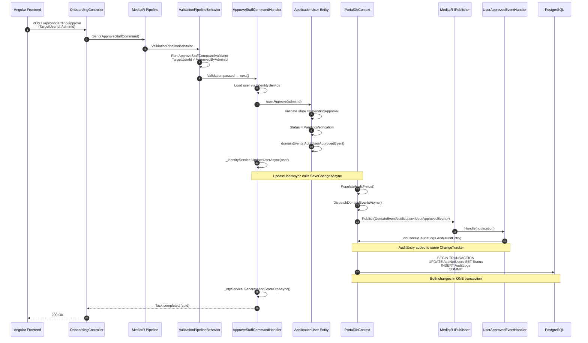

## TL;DR

MediatR is an in-process mediator library for .NET that decouples *who sends a request* from *who handles it*. In `tai-portal`, it implements **CQRS (Command Query Responsibility Segregation)** — every HTTP request is translated into either a **Command** (write operation that changes state) or a **Query** (read operation that returns data), dispatched through a pipeline of cross-cutting behaviors (validation, logging, authorization) before reaching a handler. Domain events raised by entities during business operations are published through MediatR's notification system inside `SaveChangesAsync`, enabling multi-handler side effects (audit logging, SignalR push, message bus publish) within the same database transaction. The architecture follows a "screaming folder" convention — each use case lives in its own file containing the request record, its FluentValidation validator, and its handler — making the codebase navigable by business capability rather than technical layer.

## Deep Dive

### Concept Overview

#### 1. What Is the Mediator Pattern and Why MediatR?

- **What:** The Mediator pattern defines an object that encapsulates how a set of objects interact. Instead of objects referring to each other directly (tight coupling), they communicate through the mediator (loose coupling). MediatR is a lightweight .NET implementation: you send a request object, MediatR resolves the handler from DI, and returns the response.
- **Why:** Without MediatR, controllers would directly call service classes, which call repositories, which call DbContext. This creates a coupling chain:
  ```
  // WITHOUT MediatR — controller coupled to service, service coupled to repos
  UsersController → UserService → UserRepository + PrivilegeRepository + AuditService
  ```
  With MediatR, the controller only knows about the request/response types:
  ```
  // WITH MediatR — controller only knows about the message
  UsersController → IMediator.Send(GetUsersQuery) → [pipeline] → GetUsersQueryHandler
  ```
  The handler is resolved by DI at runtime. The controller never references the handler class. This enables:
  1. **Pipeline behaviors** — cross-cutting concerns (validation, logging, caching) injected between send and handle without changing any handler
  2. **Testability** — mock `IMediator` in controller tests, test handlers in isolation
  3. **Discoverability** — each use case is an explicit type, not a method buried in a service class
- **Trade-offs:** MediatR adds indirection — you can't "Go to Definition" from `_mediator.Send(query)` to the handler in most IDEs without MediatR-aware navigation. Each use case requires 1-3 types (request, handler, validator) instead of a single service method. This is deliberate — it forces explicit modeling of each operation, but feels like overhead for trivial CRUD.

#### 2. CQRS — Commands vs Queries

- **What:** CQRS splits the application's operations into two categories:
  - **Commands** — express intent to change state. Named as imperative verbs: `RegisterCustomerCommand`, `ApproveStaffCommand`, `UpdateUserCommand`. May or may not return a value.
  - **Queries** — request data without side effects. Named as questions: `GetUsersQuery`, `GetPrivilegeByIdQuery`, `GetPendingApprovalsQuery`. Always return data.

- **Why separate them?** Reads and writes have fundamentally different optimization strategies:

  | Dimension | Command (Write) | Query (Read) |
  |-----------|-----------------|--------------|
  | **EF Core tracking** | Tracked entities (change detection) | `.AsNoTracking()` (skip overhead) |
  | **Validation** | FluentValidation pipeline | Usually none (safe operation) |
  | **Concurrency** | Optimistic locking (`RowVersion`/`xmin`) | No locking needed |
  | **Domain events** | Raised by entities, dispatched in `SaveChangesAsync` | None |
  | **Caching** | Invalidates cache | Can be cached |
  | **Side effects** | Audit log, SignalR push, message bus | None |
  | **Scaling** | Single primary DB | Read replicas, materialized views, OpenSearch |

- **In tai-portal:** 8 commands and 5 queries across 3 domain areas (Onboarding, Users, Privileges).

#### 3. The Request/Handler Convention — One File Per Use Case

tai-portal co-locates the request record, validator, and handler in a single file per use case:

```
libs/core/application/UseCases/
├── Onboarding/
│   ├── ActivateUserCommand.cs       ← IRequest (no return)
│   ├── ApproveStaffCommand.cs       ← IRequest (no return) + Validator
│   ├── RegisterCustomerCommand.cs   ← IRequest<string> (returns userId)
│   ├── RegisterStaffCommand.cs      ← IRequest<string>
│   └── GetPendingApprovalsQuery.cs  ← IRequest<List<UserSummaryDto>>
├── Privileges/
│   ├── CreatePrivilegeCommand.cs    ← IRequest<PrivilegeDto>
│   ├── GetPrivilegeByIdQuery.cs     ← IRequest<PrivilegeDto?>
│   ├── GetPrivilegesQuery.cs        ← IRequest<PaginatedList<PrivilegeDto>>
│   └── UpdatePrivilegeCommand.cs    ← IRequest<PrivilegeDto>
└── Users/
    ├── ApproveUserCommand.cs        ← IRequest<bool>
    ├── GetUserByIdQuery.cs          ← IRequest<UserDetailDto?>
    ├── GetUsersQuery.cs             ← IRequest<PaginatedList<UserDto>>
    └── UpdateUserCommand.cs         ← IRequest<bool> + Validator
```

**Why this structure?**
- **Screaming architecture** — the folder names are business domains, not technical layers. You find `Onboarding/ApproveStaffCommand.cs`, not `Services/UserService.cs` → `Approve()`.
- **Co-location** — the request, validator, and handler are in the same file. When you need to understand "what happens when a staff member is approved?", you open one file.
- **Discoverability** — new developers find use cases by browsing folders, not searching for methods across service classes.

#### 4. Request Records — Immutable Message Types

All requests are `record` types — immutable by default, with value-based equality:

```csharp
// Command: expresses intent to change state
public record UpdateUserCommand(
    string Id,
    string FirstName,
    string LastName,
    string Email,
    uint RowVersion,                    // Optimistic concurrency token
    IEnumerable<Guid> PrivilegeIds      // Related entity IDs
) : IRequest<bool>;                     // Returns bool (success/failure)

// Command without return value
public record ApproveStaffCommand(
    string TargetUserId,
    string ApprovedByAdminId
) : IRequest;                           // No return type (void equivalent)

// Query: requests data without side effects
public record GetUsersQuery(
    Guid TenantId,
    int PageNumber = 1,
    int PageSize = 10,
    string? SortColumn = null,
    string? SortDirection = null,
    string? Search = null
) : IRequest<PaginatedList<UserDto>>;   // Returns paginated results
```

**Why records?**
- **Immutability** — once constructed, properties can't be changed. This prevents a pipeline behavior from accidentally mutating the request before the handler sees it.
- **Value equality** — two `GetUsersQuery` instances with the same parameters are `==`. Useful for caching (cache key = request value).
- **Compact syntax** — primary constructor parameters are public `init`-only properties. One line defines the entire message contract.

#### 5. Handlers — Where Business Logic Lives

Each handler implements `IRequestHandler<TRequest, TResponse>` and receives dependencies via constructor injection:

```csharp
// Query handler — retrieves data, no side effects
public class GetUsersQueryHandler : IRequestHandler<GetUsersQuery, PaginatedList<UserDto>> {
    private readonly IIdentityService _identityService;

    public GetUsersQueryHandler(IIdentityService identityService) {
        _identityService = identityService;
    }

    public async Task<PaginatedList<UserDto>> Handle(
        GetUsersQuery request, CancellationToken cancellationToken) {
        var skip = (request.PageNumber - 1) * request.PageSize;
        var tenantId = new TenantId(request.TenantId);

        var users = await _identityService.GetUsersByTenantAsync(
            tenantId, skip, request.PageSize,
            request.SortColumn, request.SortDirection,
            request.Search, cancellationToken);

        var totalCount = await _identityService.CountUsersByTenantAsync(
            tenantId, request.Search, cancellationToken);

        var items = users.Select(u => new UserDto(
            u.Id, u.Email ?? u.UserName ?? "No Email",
            u.FirstName ?? "No First Name",
            u.LastName ?? "No Last Name",
            u.Status.ToString(), u.RowVersion)).ToList();

        return new PaginatedList<UserDto>(items, totalCount, request.PageNumber, request.PageSize);
    }
}
```

```csharp
// Command handler — invokes domain behavior, triggers side effects
public class ApproveStaffCommandHandler : IRequestHandler<ApproveStaffCommand> {
    private readonly IIdentityService _identityService;
    private readonly IOtpService _otpService;

    public ApproveStaffCommandHandler(
        IIdentityService identityService, IOtpService otpService) {
        _identityService = identityService;
        _otpService = otpService;
    }

    public async Task Handle(
        ApproveStaffCommand request, CancellationToken cancellationToken) {
        var user = await _identityService.GetUserByIdAsync(
            request.TargetUserId, cancellationToken);
        if (user == null)
            throw new UserNotFoundException(request.TargetUserId);

        // Domain state transition — raises UserApprovedEvent internally
        user.Approve((TenantAdminId)request.ApprovedByAdminId);

        var success = await _identityService.UpdateUserAsync(user, cancellationToken);
        if (!success)
            throw new IdentityValidationException("Failed to update user during approval.");

        // Trigger OTP delivery for next step in onboarding
        await _otpService.GenerateAndStoreOtpAsync(user.Id, cancellationToken);
    }
}
```

**Key observation:** The handler calls `user.Approve(adminId)` — a domain method on the entity that enforces invariants (can't approve from wrong state, can't self-approve) and raises a `UserApprovedEvent`. The handler doesn't check business rules — the entity does. The handler orchestrates infrastructure (load, invoke domain, persist, trigger OTP).

#### 6. The MediatR Pipeline — Middleware for CQRS

MediatR's pipeline behaviors are the CQRS equivalent of ASP.NET Core middleware. They intercept every request before (and after) the handler executes:

```
HTTP Request
  → Controller creates Command/Query
    → _mediator.Send(request)
      → [ValidationPipelineBehavior]   ← runs FluentValidation
        → [LoggingBehavior]            ← (not yet implemented, future)
          → [AuthorizationBehavior]    ← (not yet implemented, future)
            → Handler.Handle()         ← actual business logic
          ← [AuthorizationBehavior]
        ← [LoggingBehavior]
      ← [ValidationPipelineBehavior]   ← exception if validation fails
    ← response or exception
  ← HTTP Response (200/400/409/500)
```

The pipeline is configured in `Program.cs`:

```csharp
// apps/portal-api/Program.cs
builder.Services.AddValidatorsFromAssembly(typeof(RegisterCustomerCommand).Assembly);

builder.Services.AddMediatR(cfg => {
    cfg.RegisterServicesFromAssembly(typeof(RegisterCustomerCommand).Assembly);  // Application layer
    cfg.RegisterServicesFromAssembly(typeof(PortalDbContext).Assembly);          // Infrastructure layer
    cfg.AddBehavior(typeof(IPipelineBehavior<,>), typeof(ValidationPipelineBehavior<,>));
});
```

**Key decisions:**
1. **Two assemblies registered** — handlers live in both Application (command/query handlers) and Infrastructure (domain event notification handlers). MediatR scans both.
2. **Validators auto-discovered** — `AddValidatorsFromAssembly` finds all `AbstractValidator<T>` implementations in the Application assembly.
3. **Pipeline order** — behaviors execute in registration order. Validation runs first, so invalid requests never reach handlers.

#### 7. The Validation Pipeline Behavior — Cross-Cutting Validation

The single pipeline behavior currently in tai-portal intercepts all requests and runs any registered FluentValidation validators:

```csharp
// libs/core/application/Behaviors/ValidationPipelineBehavior.cs
public class ValidationPipelineBehavior<TRequest, TResponse>
    : IPipelineBehavior<TRequest, TResponse>
    where TRequest : IRequest<TResponse>
{
    private readonly IEnumerable<IValidator<TRequest>> _validators;

    public ValidationPipelineBehavior(IEnumerable<IValidator<TRequest>> validators) {
        _validators = validators;
    }

    public async Task<TResponse> Handle(
        TRequest request,
        RequestHandlerDelegate<TResponse> next,
        CancellationToken cancellationToken)
    {
        if (!_validators.Any())
            return await next();  // No validators registered → skip

        var context = new ValidationContext<TRequest>(request);

        // Run ALL validators concurrently
        var validationResults = await Task.WhenAll(
            _validators.Select(v => v.ValidateAsync(context, cancellationToken)));

        // Aggregate all failures across all validators
        var failures = validationResults
            .SelectMany(r => r.Errors)
            .Where(f => f != null)
            .ToList();

        if (failures.Count != 0)
            throw new ValidationException(failures);  // Short-circuit — handler never executes

        return await next();  // Validation passed → invoke next behavior or handler
    }
}
```

**How it connects to HTTP responses:** Global exception middleware in `Program.cs` catches `ValidationException` and converts it to a `400 ValidationProblemDetails`:

```csharp
// apps/portal-api/Program.cs (exception middleware)
app.Use(async (context, next) => {
    try {
        await next(context);
    } catch (FluentValidation.ValidationException ex) {
        context.Response.StatusCode = 400;
        var problemDetails = new ValidationProblemDetails {
            Title = "Validation Failed",
            Status = 400,
            Detail = "One or more validation errors occurred."
        };
        foreach (var error in ex.Errors) {
            if (!problemDetails.Errors.ContainsKey(error.PropertyName))
                problemDetails.Errors[error.PropertyName] = new[] { error.ErrorMessage };
            else
                problemDetails.Errors[error.PropertyName] =
                    problemDetails.Errors[error.PropertyName]
                        .Concat(new[] { error.ErrorMessage }).ToArray();
        }
        await context.Response.WriteAsJsonAsync(problemDetails);
    }
});
```

**Result:** The Angular frontend receives a standard RFC 7807 `ValidationProblemDetails` response with field-level errors — ready for form binding without custom parsing.

#### 8. FluentValidation Integration — Co-located Validators

Validators are defined in the same file as the request they validate:

```csharp
// libs/core/application/UseCases/Users/UpdateUserCommand.cs

public record UpdateUserCommand(
    string Id, string FirstName, string LastName,
    string Email, uint RowVersion,
    IEnumerable<Guid> PrivilegeIds) : IRequest<bool>;

// Validator defined immediately after the request
public class UpdateUserCommandValidator : AbstractValidator<UpdateUserCommand> {
    public UpdateUserCommandValidator() {
        RuleFor(x => x.Id).NotEmpty();
        RuleFor(x => x.FirstName).NotEmpty().MaximumLength(100);
        RuleFor(x => x.LastName).NotEmpty().MaximumLength(100);
        RuleFor(x => x.Email).NotEmpty().EmailAddress();
    }
}
```

**Cross-field validation example:**

```csharp
// libs/core/application/UseCases/Onboarding/ApproveStaffCommand.cs
public class ApproveStaffCommandValidator : AbstractValidator<ApproveStaffCommand> {
    public ApproveStaffCommandValidator() {
        RuleFor(x => x.TargetUserId).NotEmpty();
        RuleFor(x => x.ApprovedByAdminId).NotEmpty();
        // Cross-field rule: self-approval is a business invariant
        RuleFor(x => x).Must(x => x.TargetUserId != x.ApprovedByAdminId)
            .WithMessage("Users cannot approve their own accounts.");
    }
}
```

**Design decisions:**
- **Not every request needs a validator.** Queries like `GetUsersQuery` have no validator — the pagination defaults in the record handle invalid input, and the query is safe (no side effects). The `ValidationPipelineBehavior` checks `if (!_validators.Any())` and short-circuits.
- **Validators don't access the database.** They validate the shape and basic semantics of the request. Business rule validation (e.g., "does this user exist?", "is this user in the right state?") belongs in the handler or domain entity.
- **Exception-based flow.** Validation failures throw `ValidationException`, caught by middleware. This keeps handlers clean — they don't need to check validation results.

#### 9. Controller Dispatch — The Thin Controller Pattern

Controllers are minimal — they translate HTTP concerns (route params, headers, claims) into MediatR requests and translate responses back to HTTP:

```csharp
// apps/portal-api/Controllers/UsersController.cs
[Route("api/[controller]")]
[ApiController]
[Authorize]
public class UsersController : ControllerBase {
    private readonly IMediator _mediator;
    private readonly ITenantService _tenantService;

    public UsersController(IMediator mediator, ITenantService tenantService) {
        _mediator = mediator;
        _tenantService = tenantService;
    }

    // Query dispatch — HTTP GET → MediatR Query → paginated response
    [HttpGet]
    public async Task<IActionResult> GetUsers(
        [FromQuery] int pageNumber = 1, [FromQuery] int pageSize = 10,
        [FromQuery] string? sort = null, [FromQuery] string? dir = null,
        [FromQuery] string? search = null)
    {
        var query = new GetUsersQuery(
            _tenantService.TenantId.Value, pageNumber, pageSize, sort, dir, search);
        var result = await _mediator.Send(query);
        return Ok(result);
    }

    // Command dispatch — HTTP PUT → MediatR Command → concurrency handling
    [HttpPut("{id}")]
    public async Task<IActionResult> UpdateUser(
        string id, [FromBody] UpdateUserRequest request)
    {
        // Extract ETag for optimistic concurrency
        if (!Request.Headers.TryGetValue("If-Match", out var ifMatch)
            || !uint.TryParse(ifMatch.ToString().Trim('"'), out var rowVersion))
            return BadRequest("If-Match header is required.");

        var command = new UpdateUserCommand(
            id, request.FirstName, request.LastName,
            request.Email, rowVersion, request.PrivilegeIds);
        try {
            var result = await _mediator.Send(command);
            if (!result) return NotFound();
            return NoContent();
        } catch (ConcurrencyException ex) {
            return Conflict(new { message = ex.Message });
        }
    }
}
```

**What the controller does NOT do:**
- No business logic — no checking if a user can be updated
- No validation — the pipeline behavior handles that
- No direct DbContext access — the handler talks to services/repos
- No domain event dispatch — entities raise events, `SaveChangesAsync` publishes them

**What the controller DOES do:**
- HTTP-specific concerns: extract headers (`If-Match`), route params, claims
- Construct the MediatR request from HTTP inputs
- Map domain exceptions to HTTP status codes (`ConcurrencyException` → `409 Conflict`)
- Return appropriate HTTP responses (`Ok`, `NoContent`, `NotFound`, `CreatedAtAction`)

#### 10. Domain Events — MediatR as an In-Process Event Bus

Domain events are the mechanism by which entities signal that something important happened. MediatR's `INotification` / `INotificationHandler<T>` infrastructure delivers them.

**The three layers of the domain event system:**

```
┌──────────────────────────────────────────────────────────────────┐
│                        DOMAIN LAYER                              │
│                                                                  │
│  ApplicationUser.Approve(adminId)                                │
│      → validates state (must be PendingApproval)                 │
│      → transitions to PendingVerification                        │
│      → _domainEvents.Add(new UserApprovedEvent(Id, adminId))    │
│                                                                  │
│  Privilege.SetRiskLevel(newLevel)                                │
│      → _domainEvents.Add(new PrivilegeModifiedEvent(Id, Name))  │
│                                                                  │
│  IDomainEvent                     IHasDomainEvents               │
│    ↑                                ↑                            │
│  SecurityEventBase                ApplicationUser                │
│    ↑                              Privilege                      │
│  LoginAnomalyEvent                                               │
│  PrivilegeChangeEvent                                            │
│  SecuritySettingChangeEvent                                      │
└──────────────────────────────────────────────────────────────────┘
                           │
                     events stored in entity
                     until SaveChangesAsync
                           │
                           ▼
┌──────────────────────────────────────────────────────────────────┐
│                    APPLICATION LAYER                              │
│                                                                  │
│  DomainEventNotification<T> : INotification where T : IDomainEvent │
│                                                                  │
│  Generic wrapper that adapts domain events to MediatR's          │
│  notification system. Enables MediatR handler discovery.         │
└──────────────────────────────────────────────────────────────────┘
                           │
                    dispatched by PortalDbContext
                    BEFORE base.SaveChangesAsync()
                           │
                           ▼
┌──────────────────────────────────────────────────────────────────┐
│                   INFRASTRUCTURE LAYER                            │
│                                                                  │
│  UserApprovedEventHandler                                        │
│    → writes AuditEntry to PostgreSQL                             │
│                                                                  │
│  LoginAnomalyEventHandler                                        │
│    → writes AuditEntry                                           │
│    → pushes to SignalR (IRealTimeNotifier)                       │
│    → publishes to IMessageBus                                    │
│                                                                  │
│  PrivilegeChangeEventHandler                                     │
│    → writes AuditEntry                                           │
│    → pushes to SignalR                                            │
│    → publishes to IMessageBus                                    │
│                                                                  │
│  PrivilegeModifiedEventHandler                                   │
│    → writes AuditEntry                                           │
│    → publishes to IMessageBus (cache invalidation)               │
└──────────────────────────────────────────────────────────────────┘
```

#### 11. The Dispatch Mechanism — Inside SaveChangesAsync

The critical piece: `PortalDbContext.SaveChangesAsync` publishes domain events *before* the database flush, so handlers participate in the same transaction:

```csharp
// libs/core/infrastructure/Persistence/PortalDbContext.cs
public override async Task<int> SaveChangesAsync(CancellationToken cancellationToken = default) {
    // 1. Auto-populate CreatedAt, CreatedBy, LastModifiedAt, LastModifiedBy
    PopulateAuditFields();

    // 2. Dispatch domain events BEFORE saving — handlers join this transaction
    await DispatchDomainEventsAsync(cancellationToken);

    // 3. Flush everything (original changes + handler-added changes) in one transaction
    return await base.SaveChangesAsync(cancellationToken);
}

private async Task DispatchDomainEventsAsync(CancellationToken cancellationToken) {
    // Collect entities that have pending domain events
    var entities = ChangeTracker.Entries()
        .Where(e => e.Entity is IHasDomainEvents hasEvents && hasEvents.DomainEvents.Any())
        .Select(e => (IHasDomainEvents)e.Entity)
        .ToList();

    if (!entities.Any()) return;

    var publisher = _serviceProvider.GetService(typeof(IPublisher)) as IPublisher;
    if (publisher == null) return;

    // Extract all events, then clear to prevent re-dispatch
    var domainEvents = entities.SelectMany(e => e.DomainEvents).ToList();
    entities.ForEach(e => e.ClearDomainEvents());

    // Publish each event wrapped in DomainEventNotification<T>
    foreach (var domainEvent in domainEvents) {
        // Reflection: DomainEventNotification<LoginAnomalyEvent> from LoginAnomalyEvent
        var notificationType = typeof(DomainEventNotification<>)
            .MakeGenericType(domainEvent.GetType());
        var notification = Activator.CreateInstance(notificationType, domainEvent);
        if (notification != null)
            await publisher.Publish(notification, cancellationToken);
    }
}
```

**Why pre-save dispatch?**
- The `LoginAnomalyEventHandler` adds an `AuditEntry` to the same `PortalDbContext`. Since `SaveChangesAsync` hasn't flushed yet, the handler's `_dbContext.AuditLogs.Add(auditEntry)` adds to the change tracker. When `base.SaveChangesAsync()` finally runs, both the original entity change AND the audit entry are committed in one transaction.
- If the save fails (constraint violation, concurrency conflict), the audit entry is also rolled back — no "ghost" audit logs for operations that didn't actually happen.

**The DomainEventNotification wrapper:**
```csharp
// libs/core/application/Models/DomainEventNotification.cs
public class DomainEventNotification<T> : INotification where T : IDomainEvent {
    public T DomainEvent { get; }
    public DomainEventNotification(T domainEvent) => DomainEvent = domainEvent;
}
```

This wrapper exists because domain events (`IDomainEvent`) belong to the Domain layer and must not reference MediatR. The Application layer provides this adapter to bridge domain events into MediatR's notification infrastructure.

#### 12. Notification Handlers — Multi-Layer Side Effects

Each domain event can have multiple handlers. The `LoginAnomalyEventHandler` demonstrates the three-layer pattern used for security events:

```csharp
// libs/core/infrastructure/Persistence/Handlers/LoginAnomalyEventHandler.cs
public class LoginAnomalyEventHandler
    : INotificationHandler<DomainEventNotification<LoginAnomalyEvent>>
{
    private readonly PortalDbContext _dbContext;
    private readonly IMessageBus _messageBus;
    private readonly ICurrentUserService _currentUserService;
    private readonly IRealTimeNotifier _realTimeNotifier;

    public async Task Handle(
        DomainEventNotification<LoginAnomalyEvent> notification,
        CancellationToken cancellationToken)
    {
        var domainEvent = notification.DomainEvent;

        // LAYER 1: Compliance — immutable audit record in PostgreSQL
        var auditEntry = new AuditEntry(
            domainEvent.TenantId, domainEvent.UserId,
            "LoginAnomaly", domainEvent.EventId.ToString(),
            domainEvent.CorrelationId, domainEvent.IpAddress,
            $"Login anomaly detected: {domainEvent.Reason}. {domainEvent.Details}");
        _dbContext.AuditLogs.Add(auditEntry);
        await _dbContext.SaveChangesAsync(cancellationToken);

        // LAYER 2: Real-time — push to SignalR (Claim Check pattern)
        // Only send eventId and timestamp — full details fetched via REST
        await _realTimeNotifier.SendSecurityEventAsync(
            domainEvent.TenantId.Value.ToString(),
            "LoginAnomaly",
            new { EventId = auditEntry.Id, Timestamp = auditEntry.Timestamp,
                  Reason = domainEvent.Reason },
            cancellationToken);

        // LAYER 3: Integration — publish to message bus for other apps
        await _messageBus.PublishAsync(new {
            EventName = "LoginAnomaly",
            EventId = auditEntry.Id,
            TenantId = domainEvent.TenantId.Value,
            UserId = domainEvent.UserId,
            Reason = domainEvent.Reason,
            Timestamp = auditEntry.Timestamp,
            CorrelationId = domainEvent.CorrelationId
        }, cancellationToken);
    }
}
```

**The three layers:**
1. **Compliance** — `AuditEntry` in PostgreSQL. Transactionally consistent, immutable, legally defensible.
2. **Real-time** — SignalR push to the tenant's admin dashboard. Uses the **Claim Check pattern**: the notification payload contains only `EventId` and `Timestamp` — the Angular frontend fetches full details via a REST call. This prevents sensitive data from flowing over WebSocket.
3. **Integration** — `IMessageBus` publishes for cross-application communication (DocViewer, HR system). Currently a `LoggingMessageBus` stub — will be replaced with RabbitMQ/Kafka.

#### 13. The Entity-Event Lifecycle — Full Request Flow

Here's the complete flow from HTTP request to database commit to SignalR push, traced through real tai-portal code:



#### 14. The Domain Event Hierarchy

tai-portal has two kinds of domain events:

**Simple events** — lightweight records for internal state transitions:
```csharp
public record UserApprovedEvent(string UserId, TenantAdminId ApprovedByUserId) : IDomainEvent;
public record PrivilegeModifiedEvent(PrivilegeId PrivilegeId, string Name) : IDomainEvent;
```

**Security events** — rich base class with correlation, tenant, and forensic data:
```csharp
public abstract record SecurityEventBase : IDomainEvent {
    public Guid EventId { get; init; } = Guid.NewGuid();
    public DateTimeOffset Timestamp { get; init; } = DateTimeOffset.UtcNow;
    public TenantId TenantId { get; init; }
    public string UserId { get; init; }
    public string? CorrelationId { get; init; }
    public string? IpAddress { get; init; }
}

public record LoginAnomalyEvent : SecurityEventBase {
    public string Reason { get; init; }
    public string Details { get; init; }
}

public record PrivilegeChangeEvent : SecurityEventBase {
    public string Action { get; init; }
    public string Details { get; init; }
    public string ResourceId { get; init; }
}
```

**Why the split?** Simple events only need to identify what happened (for audit). Security events carry full forensic context (IP, correlation ID, tenant) because their handlers push to SignalR and the message bus — external systems need this metadata.

#### 15. How Entities Raise Events — IHasDomainEvents

Every entity that can raise events implements `IHasDomainEvents`:

```csharp
// Domain interface — no MediatR dependency
public interface IHasDomainEvents {
    IReadOnlyCollection<IDomainEvent> DomainEvents { get; }
    void ClearDomainEvents();
}

// Implementation in ApplicationUser
public class ApplicationUser : IdentityUser, IMultiTenantEntity, IHasDomainEvents, IAuditableEntity {
    private readonly List<IDomainEvent> _domainEvents = new();
    public IReadOnlyCollection<IDomainEvent> DomainEvents => _domainEvents.AsReadOnly();

    public void Approve(TenantAdminId approvedBy) {
        if (Status != UserStatus.PendingApproval)
            throw new InvalidOperationException($"Cannot approve in state {Status}");
        if (Id == (string)approvedBy)
            throw new InvalidOperationException("Users cannot approve their own accounts.");

        Status = UserStatus.PendingVerification;
        ApprovedBy = approvedBy;
        _domainEvents.Add(new UserApprovedEvent(Id, approvedBy));  // Event raised here
    }

    public void ClearDomainEvents() => _domainEvents.Clear();
}
```

**Key design principle:** Events are raised during behavior methods, not setters. `user.Approve(adminId)` raises a `UserApprovedEvent` because approval is a meaningful business action. `user.FirstName = "New"` does NOT raise an event because a simple property change isn't a domain-significant occurrence. This keeps the event stream meaningful — only business-significant state transitions produce events.

### Key Takeaways

- **MediatR decouples dispatch from handling** — controllers send messages, they don't call services
- **Commands mutate state, Queries return data** — the separation enables different optimization strategies for each path
- **Pipeline behaviors are CQRS middleware** — validation, logging, and authorization run without changing any handler code
- **Domain events are raised by entities, not handlers** — the entity enforces its own invariants and signals when something important happened
- **Pre-save dispatch = transactional consistency** — domain event handlers and the original operation share one database transaction
- **DomainEventNotification<T> bridges layers** — the domain stays free of MediatR references; the application layer adapts events to MediatR's notification system
- **Co-located files = discoverability** — request + validator + handler in one file per use case, organized by business domain

---

## Interview Q&A

### L1: What Is MediatR and Why Do We Use It Instead of Direct Service Calls?
**Difficulty:** L1 (Junior)

**Question:** Our controllers call `_mediator.Send(new GetUsersQuery(...))` instead of `_userService.GetUsersAsync(...)`. Why?

**Answer:** MediatR is an in-process mediator that decouples the sender from the handler. The controller doesn't know or care which class handles `GetUsersQuery` — it only knows the message shape and the response type. This gives us three things: (1) **Pipeline behaviors** — we can inject validation, logging, and authorization between the send and the handle without changing any handler code. Our `ValidationPipelineBehavior` runs FluentValidation on every request automatically. (2) **Testability** — in controller unit tests, we mock `IMediator` with one method (`Send`), not 10 different service methods. (3) **Explicit operations** — each use case is a named type (`ApproveStaffCommand`, not `UserService.Approve()`), making the codebase searchable by business action.

---

### L1: What Is the Difference Between a Command and a Query in CQRS?
**Difficulty:** L1 (Junior)

**Question:** How do you decide if something should be a Command or a Query?

**Answer:** A **Command** expresses intent to change state — "register this customer", "approve this user", "update this privilege." Commands are named with imperative verbs and implement `IRequest` or `IRequest<T>`. They may trigger domain events, audit logs, and notifications. A **Query** requests data without side effects — "get the users list", "find this privilege by ID." Queries are named as questions and implement `IRequest<T>` (they always return data). The key rule: calling a Query twice should always return the same result (idempotent, no side effects). Calling a Command twice may fail or produce different results because it changes state.

---

### L2: How Does the Validation Pipeline Behavior Work and Why Is It Better Than Validating in the Handler?
**Difficulty:** L2 (Mid-Level)

**Question:** Explain how FluentValidation integrates with MediatR in tai-portal. Why not just validate inside each handler?

**Answer:** The `ValidationPipelineBehavior<TRequest, TResponse>` is a MediatR pipeline behavior that runs before every handler. DI injects `IEnumerable<IValidator<TRequest>>` — all validators registered for that request type. The behavior runs all validators concurrently via `Task.WhenAll`, aggregates failures, and throws `ValidationException` if any fail. The handler never executes for invalid requests.

This is better than handler-level validation for three reasons: (1) **No forgetting** — you can't accidentally skip validation because the pipeline enforces it. (2) **Separation of concerns** — handlers focus on business logic, validators focus on input shape. (3) **Consistency** — all validation errors are reported as RFC 7807 `ValidationProblemDetails` because the global exception middleware catches `ValidationException` uniformly.

The trade-off is that pipeline behaviors run on every request. For queries with no validator, the behavior checks `if (!_validators.Any())` and short-circuits — minimal overhead. For commands, the concurrent validator execution is typically faster than sequential because each rule is independent.

---

### L2: Explain the Difference Between IRequest/IRequestHandler and INotification/INotificationHandler
**Difficulty:** L2 (Mid-Level)

**Question:** MediatR has two dispatch mechanisms: `Send` and `Publish`. When do you use each?

**Answer:** `Send` dispatches an `IRequest<T>` to exactly **one** handler and returns a response. It's request-response: "do this thing and tell me the result." This is how commands and queries work — `_mediator.Send(new GetUsersQuery(...))` goes to `GetUsersQueryHandler` and returns `PaginatedList<UserDto>`. If zero handlers are registered, MediatR throws. If multiple handlers exist, MediatR throws — it's one-to-one.

`Publish` dispatches an `INotification` to **zero or more** handlers with no return value. It's fire-and-forget multicast: "something happened, anyone who cares can react." This is how domain events work — `publisher.Publish(new DomainEventNotification<UserApprovedEvent>(...))` goes to `UserApprovedEventHandler`, but could also go to a hypothetical `SendWelcomeEmailHandler`, `NotifyAdminHandler`, etc. If no handlers are registered, nothing happens — no exception.

In tai-portal, the pattern is: commands/queries use `Send` (one handler per operation), domain events use `Publish` via the `DomainEventNotification<T>` wrapper (multiple handlers per event).

---

### L3: Explain the Pre-Save Domain Event Dispatch and Its Transactional Guarantees
**Difficulty:** L3 (Senior)

**Question:** In tai-portal, domain events are dispatched inside `SaveChangesAsync` before `base.SaveChangesAsync()`. Walk me through why this design was chosen and what happens if a handler fails.

**Answer:** The dispatch happens in `PortalDbContext.SaveChangesAsync`:

1. `PopulateAuditFields()` — stamps `CreatedAt`/`LastModifiedBy` on tracked entities
2. `DispatchDomainEventsAsync()` — finds entities with pending events, wraps each in `DomainEventNotification<T>`, publishes via MediatR
3. `base.SaveChangesAsync()` — flushes everything to PostgreSQL in one transaction

Because handlers execute before the final flush, any writes they make (like `_dbContext.AuditLogs.Add(auditEntry)`) are added to the same EF Core change tracker. When `base.SaveChangesAsync()` runs, both the original change (user status update) and the handler's change (audit entry) are committed atomically.

If a handler throws, the exception propagates up through `SaveChangesAsync`, which means `base.SaveChangesAsync()` never executes — nothing is committed. This prevents "ghost events" where an audit entry exists for an operation that didn't actually happen.

The trade-off is that handler failures abort the entire operation. If the `UserApprovedEventHandler` has a bug, no users can be approved. In tai-portal's compliance-first design, this is acceptable — it's better to block the operation than to lose the audit trail. For less critical handlers (email, analytics), you'd use post-save dispatch or an Outbox pattern where handler failure doesn't roll back the business operation.

There's also a subtle issue with the current implementation: some handlers call `_dbContext.SaveChangesAsync(cancellationToken)` internally (e.g., `LoginAnomalyEventHandler`). This triggers a nested save, which flushes the audit entry to the database immediately — potentially outside the outer transaction boundary. This works in the current POC because the handlers are simple, but a production system should either use a single save at the end or wrap everything in an explicit `IDbContextTransaction`.

---

### L3: Design Additional Pipeline Behaviors for a Production MediatR Pipeline
**Difficulty:** L3 (Senior)

**Question:** tai-portal currently has one pipeline behavior (`ValidationPipelineBehavior`). What additional behaviors would you add for production and in what order?

**Answer:** Pipeline behaviors execute in registration order. I'd design the pipeline as:

```
1. ExceptionBehavior         ← outermost: catch, log, normalize errors
2. LoggingBehavior           ← structured logging with CorrelationId
3. PerformanceBehavior       ← warn if handler exceeds threshold
4. AuthorizationBehavior     ← policy-based auth before handler
5. ValidationPipelineBehavior ← current FluentValidation behavior
6. TransactionBehavior       ← wrap handler in explicit DbTransaction (commands only)
7. CachingBehavior           ← return cached result for queries
8. Handler                   ← actual business logic
```

**Implementation sketch for key behaviors:**

```csharp
// LoggingBehavior — structured request/response logging
public class LoggingBehavior<TRequest, TResponse> : IPipelineBehavior<TRequest, TResponse> {
    public async Task<TResponse> Handle(TRequest request, RequestHandlerDelegate<TResponse> next, CancellationToken ct) {
        _logger.LogInformation("Handling {RequestName} {@Request}", typeof(TRequest).Name, request);
        var response = await next();
        _logger.LogInformation("Handled {RequestName} → {ResponseType}", typeof(TRequest).Name, typeof(TResponse).Name);
        return response;
    }
}

// PerformanceBehavior — alert on slow handlers
public class PerformanceBehavior<TRequest, TResponse> : IPipelineBehavior<TRequest, TResponse> {
    public async Task<TResponse> Handle(TRequest request, RequestHandlerDelegate<TResponse> next, CancellationToken ct) {
        var sw = Stopwatch.StartNew();
        var response = await next();
        sw.Stop();
        if (sw.ElapsedMilliseconds > 500)
            _logger.LogWarning("Long-running request {RequestName}: {Elapsed}ms", typeof(TRequest).Name, sw.ElapsedMilliseconds);
        return response;
    }
}

// TransactionBehavior — explicit transaction for commands only
public class TransactionBehavior<TRequest, TResponse> : IPipelineBehavior<TRequest, TResponse>
    where TRequest : ICommand<TResponse>  // marker interface for commands
{
    public async Task<TResponse> Handle(TRequest request, RequestHandlerDelegate<TResponse> next, CancellationToken ct) {
        await using var transaction = await _dbContext.Database.BeginTransactionAsync(ct);
        var response = await next();
        await transaction.CommitAsync(ct);
        return response;
    }
}
```

**Order rationale:** Exception handling wraps everything. Logging captures the full request lifecycle including validation failures. Performance timing includes validation + handler time. Authorization runs before validation (no point validating a request from an unauthorized user). Validation runs before the transaction (no point opening a DB transaction for invalid data). Caching short-circuits the handler entirely for repeated queries.

---

### Staff: When Does MediatR Stop Being Enough and You Need a Real Message Broker?
**Difficulty:** Staff

**Question:** tai-portal uses MediatR for both request/response (commands/queries) and pub/sub (domain events). The `IMessageBus` is currently a stub. When would you introduce a real message broker, and how does the architecture change?

**Answer:** MediatR is an **in-process** mediator — everything runs in the same process, same transaction, same failure domain. This works when:
- All handlers are in the same deployment unit
- Handler failures should abort the original operation (compliance requirement)
- Latency tolerance is zero (synchronous response needed)

You need a **real message broker** (RabbitMQ, Kafka, SQS) when:

1. **Cross-service communication** — when DocViewer needs to know that a privilege changed in Portal. MediatR can't send messages across process boundaries.
2. **Guaranteed delivery** — the current `LoggingMessageBus` drops events. If the process crashes after the commit but before the log, the event is lost. A broker with the **Outbox pattern** guarantees delivery.
3. **Independent failure domains** — you don't want a slow email handler to block user approval. A broker decouples the timeline: the command completes immediately, the email sends asynchronously.
4. **Fan-out at scale** — when 50 downstream consumers need to react to one event, MediatR runs them sequentially in-process. A broker runs them in parallel across distributed consumers.

**How the architecture changes:**

```
BEFORE (current tai-portal):
  Handler → SaveChangesAsync → DispatchDomainEvents → INotificationHandlers (all in-process)

AFTER (with Outbox + broker):
  Handler → SaveChangesAsync → Outbox table write (transactional)
  ↓ (asynchronous, separate process)
  Outbox poller → reads pending events → publishes to RabbitMQ/Kafka
  ↓ (async consumers)
  AuditConsumer → writes audit log
  NotificationConsumer → pushes SignalR
  DocViewerConsumer → invalidates search cache
```

The key insight: **MediatR stays for request/response** (commands and queries). You only replace the notification/domain-event side with the broker. The `DomainEventNotification<T>` wrapper gets replaced by Outbox entries. The `INotificationHandler<T>` implementations become message consumers in separate processes (or the same process consuming from the broker).

For tai-portal's migration path:
1. **Now (POC):** MediatR for everything. `IMessageBus` stub.
2. **Next (MVP):** Replace `IMessageBus` with MassTransit + RabbitMQ. Keep MediatR for request/response. Domain events still dispatch via MediatR in-process (audit is transactional), but handlers also publish to the broker for cross-service events.
3. **Scale:** Add the Outbox pattern (MassTransit supports this natively with EF Core). Domain events write to the Outbox table transactionally, a background process publishes them to the broker. This eliminates the "crash between commit and publish" window.

---

### L2: Why Use `record` Instead of `class` for CQRS Messages?
**Difficulty:** L2 (Mid-Level)

**Question:** Why do we use `record` for Commands and Queries in .NET 10? What are the architectural advantages?

**Answer:** We use `record` (specifically positional records) because they enforce three senior-level architectural constraints: (1) **Immutability** — properties are `init`-only, preventing "leaky" MediatR pipelines where a behavior accidentally mutates a request before the handler sees it. If you need a change, you use the `with` expression to create a new instance. (2) **Value Equality** — `record` equality is based on data, not memory pointers. This makes them perfect for **Caching Keys** in the query pipeline and makes **Unit Testing** trivial (`Assert.Equal` just works). (3) **Boilerplate Reduction** — a one-line record replaces ~40 lines of class code (ctor, properties, Equals, GetHashCode, ToString). In a monorepo with hundreds of use cases, this increases the "Signal-to-Noise" ratio and ensures **NativeAOT** compatibility.

---

### L2: What is a DTO and Why Do We Avoid Returning EF Core Entities Directly?
**Difficulty:** L2 (Mid-Level)

**Question:** We don't return our `ApplicationUser` entity directly to the Angular frontend. Why? And where do these DTOs live in our Vertical Slice architecture?

**Answer:** A DTO (Data Transfer Object) is a behavior-less "contract" that protects our internal domain. We avoid returning EF Core entities for three reasons: (1) **Security** — preventing the leakage of internal fields like `PasswordHash`. (2) **Performance** — entities have complex navigation properties and circular references that crash JSON serializers; DTOs are "flat" and optimized for the network. (3) **Stability** — we can refactor our database schema (Entity) without breaking the contract with the frontend (DTO). 

In `tai-portal`, we don't use a giant `DTOs` folder. Instead, we use **Co-location (Vertical Slices)**: DTOs like `UserDto` are defined directly in the use-case file (e.g., `GetUsersQuery.cs`). This ensures that the DTO is perfectly tailored to that specific operation, avoiding the "God DTO" anti-pattern.

---

### L3: Explain the `ValidationPipelineBehavior` Internals and Concurrency.
**Difficulty:** L3 (Senior)

**Question:** Walk me through the `ValidationPipelineBehavior`. How does it handle multiple validators for a single request, and why do we use `Task.WhenAll`?

**Answer:** The `ValidationPipelineBehavior` is a generic guard that intercepts all MediatR requests. It uses **Dependency Injection for Collections** — `IEnumerable<IValidator<TRequest>>` — to automatically find *every* validator registered for that request type (e.g., both a basic format validator and a complex business rule validator). 

Crucially, it uses **Concurrent Execution**: `await Task.WhenAll(_validators.Select(v => v.ValidateAsync(...)))`. This ensures that all rules fire simultaneously rather than sequentially, which is a major performance win in high-scale systems. It then aggregates all failures into a single `ValidationException`. This "Fail-Fast" mechanism ensures the **Handler** (the database-touching code) never runs if the input is invalid, and our global middleware converts that exception into a standard **RFC 7807** `ValidationProblemDetails` response for the UI.

---

### L2: How Does a Specific Validator (like `ApproveStaffCommandValidator`) Actually Get Executed?
**Difficulty:** L2 (Mid-Level)

**Question:** You never manually call `new ApproveStaffCommandValidator()`. How does the system know it exists and when to run it?

**Answer:** It follows a three-step lifecycle: (1) **Discovery (Assembly Scanning)** — At startup, we use `builder.Services.AddValidatorsFromAssembly(typeof(RegisterCustomerCommand).Assembly)`. This scans the Application layer and registers every `AbstractValidator` in the DI container. (2) **Resolution (Generic Injection)** — When `_mediator.Send(command)` is called, the generic `ValidationPipelineBehavior` is triggered. The DI container looks for all `IValidator<ApproveStaffCommand>` implementations and injects them into the behavior's constructor. (3) **Execution (The Pipeline)** — The behavior iterates through the injected list and calls `ValidateAsync`. This follows the **Open/Closed Principle**: you can add a new validator for a new feature just by creating the class; you never have to "wire it up" manually.

---

## Cross-References

- **[[System-Design]]** — Sections 2 (CQRS with MediatR), 3 (Validation Pipeline), 7 (Domain Event Dispatch) provide architectural overview; this note expands with code-level detail and lifecycle diagrams
- **[[Design-Patterns]]** — Mediator pattern (GoF), Command pattern (encapsulating requests as objects), Observer pattern (domain events = pub/sub)
- **[[EFCore-SQL]]** — `SaveChangesAsync` override, `ChangeTracker` inspection, Global Query Filters for multi-tenancy, `xmin` optimistic concurrency used in commands
- **[[Logging-Observability]]** — `CorrelationId` flows from HTTP header through `ICurrentUserService` into domain events and audit entries; a `LoggingPipelineBehavior` would use Serilog's `LogContext`
- **[[Message-Queues]]** — `IMessageBus` stub, Outbox pattern for guaranteed event delivery, MassTransit as the production replacement for the `LoggingMessageBus`
- **[[SignalR-Realtime]]** — `IRealTimeNotifier` called from domain event handlers; Claim Check pattern where SignalR pushes only `EventId` and the frontend fetches details via REST
- **[[Security-CSP-DPoP]]** — Security events (`LoginAnomalyEvent`, `PrivilegeChangeEvent`) carry forensic context (IP, CorrelationId) for compliance and SIEM integration

---

## Further Reading

- [MediatR Documentation](https://github.com/jbogard/MediatR)
- [CQRS Pattern — Martin Fowler](https://martinfowler.com/bliki/CQRS.html)
- [MediatR Pipeline Behaviors](https://github.com/jbogard/MediatR/wiki/Behaviors)
- [FluentValidation Documentation](https://docs.fluentvalidation.net/)
- [Domain Events — Jimmy Bogard](https://lostechies.com/jimmybogard/2010/04/08/strengthening-your-domain-domain-events/)
- [Outbox Pattern — Kamil Grzybek](https://www.kamilgrzybek.com/blog/posts/the-outbox-pattern)
- [MassTransit — MediatR Integration](https://masstransit.io/documentation/configuration/mediator)

---

*Last updated: 2026-04-04*
