## TL;DR

Message brokers decouple producers from consumers, enabling async processing, guaranteed delivery, and system resilience. In 2026, the key interview skill is **knowing when to pick which broker**: **RabbitMQ** for traditional message queuing (task distribution, RPC), **Kafka** for event streaming (event sourcing, analytics, log aggregation), and **managed cloud queues** (SQS, Azure Service Bus) for zero-ops simplicity. In `tai-portal`, the `IMessageBus` interface is a stub (`LoggingMessageBus`) ready to be swapped for any broker — the architecture already dispatches domain events via MediatR, but lacks guaranteed delivery if the process crashes after database commit but before SignalR push. This note covers the broker landscape, when each fits, and how tai-portal would evolve to use them.

## Deep Dive

### Concept Overview

#### 1. Why Message Queues Exist — The Core Problem
- **What:** A message queue is a buffer that sits between a producer (who sends messages) and a consumer (who processes them). The producer doesn't wait for the consumer — it drops the message in the queue and moves on.
- **Why:** Without a queue, Service A calling Service B's REST API creates **temporal coupling** — if B is slow, A is slow. If B is down, A fails. If B can't keep up, A's thread pool exhausts. A message queue breaks all three dependencies: A publishes and returns immediately, B processes at its own pace, and if B is down, messages accumulate safely in the queue until B recovers.
- **How:** The producer publishes a message to a queue (or topic/exchange). The broker stores it durably (on disk). One or more consumers pull (or are pushed) the message, process it, and acknowledge completion. If the consumer crashes mid-processing, the broker redelivers the message to another consumer.
- **When:** Any time you have a slow, unreliable, or independently-scaled downstream operation: sending emails, processing payments, syncing search indexes, pushing notifications, generating reports, calling external APIs.
- **Trade-offs:** Message queues introduce **eventual consistency** — the producer doesn't know if or when the consumer processed the message. They also add infrastructure complexity (another service to deploy, monitor, and maintain). For simple in-process communication, they're overkill.

#### 2. RabbitMQ — The Traditional Message Broker
- **What:** RabbitMQ is an open-source message broker implementing AMQP (Advanced Message Queuing Protocol). It routes messages from producers to queues via **exchanges** (direct, fanout, topic, headers). Consumers pull from queues or have messages pushed to them.
- **Why:** RabbitMQ is the most widely deployed message broker in enterprise .NET and Java ecosystems. It excels at **work distribution** — multiple consumers can pull from the same queue, and RabbitMQ round-robins messages between them (competing consumers pattern). It also supports **RPC** (request-reply), **priority queues**, and **dead-letter exchanges** out of the box.
- **How:** Key concepts:
  - **Exchange:** Routes messages to queues based on routing rules. A `fanout` exchange broadcasts to all bound queues (pub/sub). A `direct` exchange routes by exact routing key. A `topic` exchange routes by pattern matching (`audit.*`, `security.#`).
  - **Queue:** Stores messages durably. Messages are removed after consumer acknowledgment.
  - **Consumer acknowledgment:** A consumer must `ack` a message to remove it from the queue. If the consumer crashes, unacked messages are redelivered — at-least-once delivery guarantee.
  - **Dead-letter exchange (DLX):** Messages that fail processing after N retries are routed to a DLX for manual investigation — never silently dropped.
- **When:** Task queues (email sending, PDF generation), work distribution across workers, RPC-style request/reply, any scenario where messages should be consumed exactly once and then deleted.
- **Trade-offs:** Messages are deleted after consumption — no replay capability. If you need to re-process historical events, you're out of luck. Also, RabbitMQ's Erlang runtime has a steep operational learning curve for production tuning (memory alarms, disk alarms, cluster partitioning). Managed services (Amazon MQ, CloudAMQP) eliminate this burden.

#### 3. Apache Kafka — The Event Streaming Platform
- **What:** Kafka is a distributed event streaming platform. Unlike RabbitMQ (which is a message *queue*), Kafka is an append-only **log**. Producers append events to partitioned topics. Consumers read from any offset and track their own position. Messages are **retained for a configurable period** (hours, days, or forever), not deleted on consumption.
- **Why:** Kafka was designed for high-throughput event streaming — millions of events per second with sub-millisecond latency. Its killer feature is **replay**: because messages are retained, a new consumer can start from the beginning of a topic and rebuild its entire state (event sourcing). A consumer that crashed can resume from its last committed offset without losing events.
- **How:** Key concepts:
  - **Topic:** A named log of events (e.g., `user-events`, `audit-logs`).
  - **Partition:** Topics are split into partitions for parallel consumption. Messages within a partition are strictly ordered.
  - **Consumer Group:** A group of consumers that cooperatively read a topic. Each partition is assigned to exactly one consumer in the group — horizontal scaling by adding consumers (up to the partition count).
  - **Offset:** A consumer's position in a partition. The consumer commits its offset to track progress. On restart, it resumes from the last committed offset.
  - **Retention:** Messages live for a configured period (default 7 days) regardless of consumption. This enables replay, audit trails, and late-arriving consumers.
- **When:** Event sourcing, real-time analytics pipelines, log aggregation, change data capture (CDC), any scenario where you need message retention, replay, or extremely high throughput (>100K events/sec).
- **Trade-offs:** Kafka is operationally complex — ZooKeeper/KRaft coordination, partition rebalancing, topic compaction. It's also overkill for simple task queues (sending an email doesn't need a 7-day retention log). Consumer offset management adds application complexity. Managed services (Confluent Cloud, Amazon MSK, Azure Event Hubs) significantly reduce ops burden.

#### 4. RabbitMQ vs Kafka — The Critical Interview Comparison

| Dimension | RabbitMQ | Kafka |
|-----------|----------|-------|
| **Mental model** | Message queue (mailbox) | Event log (journal) |
| **Message lifecycle** | Deleted after consumer ack | Retained for configured period |
| **Delivery** | Push to consumers (or pull) | Pull by consumers (poll-based) |
| **Ordering** | Per-queue FIFO | Per-partition FIFO |
| **Replay** | Not possible (messages deleted) | Any consumer can replay from any offset |
| **Throughput** | ~50K msg/sec per node | ~1M+ msg/sec per cluster |
| **Latency** | Sub-millisecond (push) | Low milliseconds (poll interval) |
| **Routing** | Rich (exchanges, bindings, routing keys) | Simple (topic + partition key) |
| **Consumer scaling** | Competing consumers on same queue | Consumer groups, one consumer per partition |
| **Use case** | Task queues, RPC, work distribution | Event sourcing, streaming analytics, CDC |
| **Ops complexity** | Moderate (Erlang, memory tuning) | High (partitions, replication, compaction) |
| **.NET ecosystem** | MassTransit, EasyNetQ, native client | Confluent .NET client, MassTransit |

**The interview answer:** "RabbitMQ is for *commands* (do this thing, then forget the message). Kafka is for *events* (this thing happened, and anyone might need to know about it later)."

#### 5. Managed Cloud Queues — Zero-Ops Alternatives
- **What:** Cloud-native message services that require no infrastructure management: **AWS SQS** (simple queue), **Azure Service Bus** (enterprise queue with topics), **Google Cloud Pub/Sub** (pub/sub), **Amazon MQ** (managed RabbitMQ/ActiveMQ), **Amazon MSK / Azure Event Hubs** (managed Kafka).
- **Why:** Running RabbitMQ or Kafka in production means managing clusters, patching, monitoring, scaling, backups, and on-call. Managed services eliminate all of this — you get an endpoint, you connect, you pay per message.
- **How:**
  - **Amazon MQ for RabbitMQ:** Create a broker in AWS Console, get an AMQPS endpoint, point MassTransit at it. Same AMQP protocol, zero Erlang management. ~$150/month for single broker, ~$300/month for HA (multi-AZ).
  - **AWS SQS:** Simplest possible queue. HTTP API, no connection management, automatic scaling to any throughput. $0.40 per million messages. No exchanges, no routing — just queue in, queue out.
  - **Azure Service Bus:** Enterprise-grade with topics, subscriptions, sessions, and dead-letter queues. $0.05 per million operations. Closest managed equivalent to RabbitMQ's feature set.
- **When:** Always consider managed first in 2026. Self-host only when you need features the managed service doesn't offer, or when data sovereignty requires it.
- **Trade-offs:** Vendor lock-in (SQS API is AWS-only), per-message cost can surprise you at high volume, and you lose fine-grained tuning control. MassTransit abstracts the transport, so swapping between RabbitMQ, SQS, and Azure Service Bus is a configuration change, not a rewrite.

#### 6. Lightweight Alternatives — When a Full Broker Is Overkill
- **What:** For small-scale or single-process applications, full message brokers add unnecessary complexity. Lighter alternatives exist:
  - **`System.Threading.Channels`** (in-process) — a bounded/unbounded producer-consumer queue within a single .NET process. Zero infrastructure, zero serialization, zero network hops. Messages are lost on process restart.
  - **PostgreSQL `pgmq`** — a message queue extension for PostgreSQL. `CREATE EXTENSION pgmq`, then `pgmq.send('queue_name', '{"event": "..."}')` and `pgmq.read('queue_name', 30)`. Durable, transactional (messages can be enqueued in the same transaction as your business data — a built-in Outbox), and you already run PostgreSQL.
  - **PostgreSQL `LISTEN/NOTIFY`** — lightweight pub/sub built into PostgreSQL. Not durable (notifications are lost if no one is listening), but useful for cache invalidation and real-time triggers.
  - **Redis Streams** — a durable, Kafka-like log structure in Redis. Consumer groups, acknowledgment, and replay. If you're already running Redis (e.g., for SignalR backplane or caching), this is "free" infrastructure.
- **When:** Use Channels for fire-and-forget in-process work (background email sending in a POC). Use pgmq when you need guaranteed delivery but don't want new infrastructure. Use Redis Streams when you already have Redis and need moderate throughput with replay.
- **Trade-offs:** Channels lose messages on crash. pgmq adds load to your PostgreSQL instance (not ideal if the DB is already a bottleneck). Redis Streams require Redis HA (Sentinel or Cluster) for durability. None of these scale to Kafka-level throughput.

#### 7. The tai-portal Gap — Where a Broker Fits
- **What:** `tai-portal` currently dispatches domain events in-process via MediatR inside `SaveChangesAsync`. The `IMessageBus` interface exists but is implemented by `LoggingMessageBus` (logs to console). Three event handlers already call `IMessageBus`: `LoginAnomalyEventHandler`, `PrivilegeChangeEventHandler`, and `SecuritySettingChangeEventHandler`.
- **The problem:** If the process crashes after `SaveChangesAsync` commits but before SignalR pushes the notification, the event is lost. The database has the audit entry, but the admin dashboard never receives the real-time alert. There is no retry, no dead-letter queue, no guaranteed delivery.
- **How a broker would fix this:**
  1. **Outbox pattern:** Instead of calling `IRealTimeNotifier` directly in the MediatR handler, write the event to an `OutboxMessages` table in the same database transaction as the audit entry (guaranteed atomicity).
  2. **Background worker:** A hosted service polls the Outbox (or uses `pgmq`/`LISTEN/NOTIFY`), publishes events to the broker (or directly pushes SignalR), and marks them as processed.
  3. **Consumer:** A consumer reads from the broker and calls `IRealTimeNotifier.SendSecurityEventAsync()`. If the consumer crashes, the broker redelivers. If SignalR is temporarily down, the message stays in the queue.
- **Recommended path for tai-portal:**
  - **Phase 1 (now):** pgmq or Channels — minimal infrastructure, solves the crash gap
  - **Phase 2 (multi-pod):** Redis Streams — needed anyway for SignalR backplane
  - **Phase 3 (microservices):** Amazon MQ (managed RabbitMQ) or Azure Service Bus — when you have multiple independent services

```mermaid
flowchart TB
    subgraph Current["Current: In-Process (No Broker)"]
        CMD1["Command Handler"]
        SAV1["SaveChangesAsync"]
        EVT1["MediatR Event Handler"]
        SIG1["SignalR Push"]
        CRASH["Process Crash Here = Lost Event"]
    end

    subgraph Future["Future: With Outbox + Broker"]
        CMD2["Command Handler"]
        SAV2["SaveChangesAsync"]
        OUT["Outbox Table<br/>(same DB transaction)"]
        WORK["Background Worker"]
        BRK["Broker<br/>pgmq / RabbitMQ / SQS"]
        SIG2["SignalR Push"]
        DLQ["Dead Letter Queue<br/>(failed after N retries)"]
    end

    CMD1 --> SAV1 --> EVT1 --> SIG1
    EVT1 -.->|"crash here"| CRASH

    CMD2 --> SAV2 --> OUT
    OUT --> WORK --> BRK --> SIG2
    BRK -.->|"failed N times"| DLQ

    style Current fill:#1a1a2e,stroke:#e94560,color:#fff
    style Future fill:#0f3460,stroke:#53d8fb,color:#fff
    style CRASH fill:#e94560,stroke:#e94560,color:#fff
    style DLQ fill:#e94560,stroke:#53d8fb,color:#fff
```



---

## Real-World Code Examples

### 1. The IMessageBus Stub — Ready for a Broker Swap

The interface that would be replaced with MassTransit or a direct broker client:

```csharp
// libs/core/application/Interfaces/IMessageBus.cs
public interface IMessageBus
{
    Task PublishAsync<T>(T message, CancellationToken cancellationToken = default);
}

// libs/core/infrastructure/Messaging/LoggingMessageBus.cs
public class LoggingMessageBus : IMessageBus
{
    public Task PublishAsync<T>(T message, CancellationToken cancellationToken = default)
    {
        Console.WriteLine($"[MessageBus] Published: {typeof(T).Name} - {message}");
        return Task.CompletedTask;
    }
}

// Registration in Program.cs
builder.Services.AddScoped<IMessageBus, LoggingMessageBus>();
```

**Why this matters:** The interface is already the right shape for a broker swap. Replace the registration with:
```csharp
// MassTransit + Amazon MQ (managed RabbitMQ)
builder.Services.AddMassTransit(x => {
    x.UsingRabbitMq((context, cfg) => {
        cfg.Host("amqps://b-xxxx.mq.us-east-1.amazonaws.com:5671", h => {
            h.Username("admin");
            h.Password(secret);
        });
    });
});
```

### 2. Event Handlers That Already Publish — `LoginAnomalyEventHandler`

The handler writes an audit entry and publishes to the bus in the same flow:

```csharp
// libs/core/infrastructure/Persistence/Handlers/LoginAnomalyEventHandler.cs
public class LoginAnomalyEventHandler : INotificationHandler<DomainEventNotification<LoginAnomalyEvent>>
{
    private readonly PortalDbContext _context;
    private readonly IRealTimeNotifier _notifier;
    private readonly IMessageBus _messageBus;

    public async Task Handle(DomainEventNotification<LoginAnomalyEvent> notification, CancellationToken ct)
    {
        var evt = notification.DomainEvent;

        // 1. Write audit entry (in same SaveChangesAsync transaction)
        _context.AuditLogs.Add(new AuditEntry { /* ... */ });

        // 2. Push real-time notification (Claim Check — only EventId)
        await _notifier.SendSecurityEventAsync(evt.TenantId, "LoginAnomaly",
            new { EventId = evt.EventId, Timestamp = evt.Timestamp, Reason = evt.Reason }, ct);

        // 3. Publish to message bus (currently just logs)
        await _messageBus.PublishAsync(evt, ct);
    }
}
```

**Why this matters:** Step 2 (SignalR push) and Step 3 (message bus) happen after the database write but are not transactional. With a proper Outbox + broker, Steps 2 and 3 would be handled by a background consumer that reads from the Outbox, guaranteeing delivery even if the process crashes between Step 1 and Step 2.

### 3. MassTransit with RabbitMQ — What the Swap Looks Like

How the `IMessageBus` implementation would change with MassTransit:

```csharp
// With MassTransit, you don't even need IMessageBus — MassTransit provides IPublishEndpoint
// But to preserve the existing interface:

public class MassTransitMessageBus : IMessageBus
{
    private readonly IPublishEndpoint _publishEndpoint;

    public MassTransitMessageBus(IPublishEndpoint publishEndpoint)
        => _publishEndpoint = publishEndpoint;

    public async Task PublishAsync<T>(T message, CancellationToken ct = default)
        => await _publishEndpoint.Publish(message, ct);
}

// Consumer (separate process or same process, different thread)
public class LoginAnomalyConsumer : IConsumer<LoginAnomalyEvent>
{
    private readonly IRealTimeNotifier _notifier;

    public async Task Consume(ConsumeContext<LoginAnomalyEvent> context)
    {
        var evt = context.Message;
        await _notifier.SendSecurityEventAsync(evt.TenantId, "LoginAnomaly",
            new { EventId = evt.EventId, Timestamp = evt.Timestamp }, context.CancellationToken);
    }
}
```

### 4. pgmq — Simplest Guaranteed Delivery (No New Infrastructure)

What the Outbox pattern looks like with PostgreSQL's pgmq extension:

```sql
-- Enable the extension (one-time)
CREATE EXTENSION pgmq;

-- Create a queue
SELECT pgmq.create('security_events');

-- Enqueue in the SAME transaction as the audit entry
BEGIN;
  INSERT INTO "AuditLogs" (...) VALUES (...);
  SELECT pgmq.send('security_events', '{"EventId": "abc-123", "Type": "LoginAnomaly"}');
COMMIT;
-- Both succeed or both rollback — guaranteed atomicity

-- Background worker reads (with 30-second visibility timeout)
SELECT * FROM pgmq.read('security_events', 30, 10);
-- Process, then delete
SELECT pgmq.delete('security_events', msg_id);
```

**Why this matters:** pgmq gives you the Outbox pattern's atomicity guarantee with zero new infrastructure. The message is enqueued in the same PostgreSQL transaction as the audit entry. If the transaction rolls back, the message is never sent. If the consumer crashes, the message becomes visible again after the visibility timeout.

---

## Interview Q&A

### L2: When Would You Choose a Message Queue Over a REST API Call?

**Answer:** Use a message queue when the downstream operation is **slow** (email sending, PDF generation — don't block the API response), **unreliable** (external APIs that may be down — the queue buffers until they recover), or **independently scaled** (a single API request triggers work for multiple consumers — fan-out). Use REST when you need a **synchronous response** (fetching data to display in the UI) or when the operation must succeed **before the API can respond** (payment authorization).

In `tai-portal`, the SignalR push in `LoginAnomalyEventHandler` is a candidate for a queue — if SignalR is temporarily disconnected, the notification is lost. With a queue, it would be buffered and delivered when the connection recovers.

### L2: What Is the Difference Between a Message Queue and Pub/Sub?

**Answer:** A **message queue** (RabbitMQ direct exchange, SQS) delivers each message to exactly one consumer — competing consumers pattern. If 3 workers listen on the same queue, each message goes to only one worker. This is for **work distribution**.

**Pub/Sub** (RabbitMQ fanout exchange, Kafka topics, SNS) delivers each message to all subscribers. If 3 services subscribe to a topic, all 3 receive every message. This is for **event notification** — "UserRegistered" needs to reach the email service, the search indexer, AND the analytics pipeline.

RabbitMQ supports both via exchanges. Kafka is inherently pub/sub (consumer groups provide the competing-consumer pattern within a subscriber).

### L3: RabbitMQ vs Kafka — When Do You Pick Each?

**Answer:** 

**Pick RabbitMQ when:**
- Messages should be **consumed and forgotten** (task queues, email sending, payment processing)
- You need **complex routing** (route audit events to one queue, security events to another, based on routing key patterns)
- You need **RPC** (request/reply over the broker)
- Throughput is moderate (<100K messages/second)
- Your team already knows AMQP (common in .NET/Java shops)

**Pick Kafka when:**
- You need **event replay** (a new service joins and needs to process all historical events)
- You need **event sourcing** (the log IS the source of truth, current state is derived)
- You need **extreme throughput** (1M+ events/second for analytics, logging, IoT)
- You need **long retention** (keep events for 30 days for audit/compliance)
- You have **multiple independent consumers** of the same event stream

**The one-liner:** "RabbitMQ is a smart broker with dumb consumers. Kafka is a dumb broker with smart consumers."

In RabbitMQ, the broker decides which consumer gets which message (routing, priority, acknowledgment tracking). In Kafka, the broker just appends to the log — consumers track their own offset and decide what to read.

### L3: What Is the Transactional Outbox Pattern and Why Can't You Just Publish Directly?

**Answer:** The problem: you save an order to PostgreSQL and publish `OrderCreatedEvent` to RabbitMQ. If the process crashes between the DB commit and the RabbitMQ publish, the order exists but no event was sent — downstream services never know about it.

You can't wrap both in a distributed transaction (2PC) because PostgreSQL and RabbitMQ don't share a transaction coordinator. 2PC is also slow and fragile.

**The Outbox pattern:** In the same PostgreSQL transaction as the order insert, write the event to an `OutboxMessages` table. A background worker polls the Outbox, publishes to RabbitMQ, and marks messages as processed. Because both writes are in the same SQL transaction, they're guaranteed atomic.

In `tai-portal`, the `SaveChangesAsync` override already dispatches domain events before `base.SaveChangesAsync()` — handlers participate in the same transaction. But the SignalR push and `IMessageBus.PublishAsync()` happen after the transaction — they're not covered by the atomicity guarantee. Adding an Outbox table would close this gap.

### L3: How Does Dead-Letter Handling Work and Why Is It Critical?

**Answer:** A dead-letter queue (DLQ) catches messages that fail processing after a configured number of retries. Without a DLQ, a "poison message" (e.g., malformed JSON, missing required field) blocks the queue forever — the broker keeps redelivering, the consumer keeps failing, and all subsequent messages are stuck behind it.

**The pattern:**
1. Consumer attempts to process message → fails
2. Broker redelivers (up to N retries, with exponential backoff)
3. After N failures, broker routes the message to a dead-letter exchange/queue
4. Operations team monitors the DLQ, investigates, and either fixes the consumer bug and replays the messages, or discards them

**RabbitMQ:** Configure `x-dead-letter-exchange` and `x-max-retries` on the queue. Failed messages are automatically routed.

**Kafka:** No built-in DLQ. The consumer must implement it manually — catch the exception, publish to a `.dlq` topic, commit the offset, move on.

**MassTransit:** Handles this automatically — configures `_error` and `_skipped` queues per consumer, with configurable retry policies (immediate, incremental, exponential).

### Staff: Design an Event-Driven Architecture That Evolves From Monolith to Microservices

**Answer:** Using `tai-portal` as the starting point:

**Phase 1 — Monolith with Outbox (current → near-term):**
- Add `OutboxMessages` table to `PortalDbContext`
- Write events in `SaveChangesAsync` instead of dispatching in-process
- Background `IHostedService` polls Outbox, pushes SignalR, marks processed
- Broker: pgmq (zero new infrastructure) or `System.Threading.Channels` (in-process)
- Delivery guarantee: at-least-once within the process

**Phase 2 — Monolith with External Broker (near-term):**
- Replace `LoggingMessageBus` with MassTransit + Amazon MQ (managed RabbitMQ)
- Outbox worker publishes to RabbitMQ instead of pushing SignalR directly
- New consumers subscribe: email service, search indexer, analytics
- Still one deployment, but consumers can be scaled independently
- Delivery guarantee: at-least-once via broker acknowledgment

**Phase 3 — Decomposed Services (long-term):**
- Extract Identity, Audit, Notification, and Privilege into separate services
- Each service owns its database (data sovereignty)
- Communication: async events via RabbitMQ for commands, Kafka for event streaming
- Saga orchestrator for cross-service workflows (e.g., user onboarding: create account → provision tenant → assign default privileges → send welcome email)
- If any step fails, compensating transactions undo previous steps

**Phase 4 — Event Sourcing (optional, high-value):**
- Replace `AuditLogs` append-only table with Kafka topic (infinite retention)
- Current state materialized via projections (read models in Redis/PostgreSQL)
- Time-travel queries: "What privileges did user X have on March 15th?"
- Only for domains where audit history is a first-class requirement

**Key principle:** Each phase is independently deployable. You don't need to plan for Phase 4 from day one — the Outbox pattern in Phase 1 naturally evolves into a broker-backed pipeline in Phase 2.

### Staff: Your Team Is Debating RabbitMQ vs Kafka for a New Service. How Do You Make the Decision?

**Answer:** I'd start with three questions:

**1. "Do consumers need to replay historical events?"**
- Yes → Kafka (retention + offsets make replay trivial)
- No → Either works, lean RabbitMQ for simplicity

**2. "What's the throughput requirement?"**
- <50K msg/sec → RabbitMQ handles this easily
- >100K msg/sec → Kafka is designed for this scale
- Unknown → Start with RabbitMQ, migrate later if needed (MassTransit abstracts the transport)

**3. "Does the team already have operational expertise?"**
- RabbitMQ experience → Use RabbitMQ (operational familiarity > theoretical optimality)
- Kafka experience → Use Kafka
- Neither → Use a managed service (Amazon MQ for RabbitMQ semantics, Amazon MSK for Kafka semantics, or SQS/Azure Service Bus for simplest possible option)

**For tai-portal specifically:** The event volume is low (hundreds/day), no replay is needed, the team has RabbitMQ experience across multiple roles, and the architecture is a monolith with a single database. **Amazon MQ for RabbitMQ** would be my recommendation — familiar technology, zero ops, and MassTransit makes the integration trivial. If we were on Azure, Azure Service Bus would be the equivalent choice.

**The meta-answer for interviews:** "The best broker is the one your team can operate reliably at 3 AM. A well-operated RabbitMQ beats a poorly-operated Kafka every time."

---

## Cross-References

- **[[System-Design]]** — Outbox pattern, event-driven architecture phases, `IMessageBus` stub, resilience patterns
- **[[SignalR-Realtime]]** — The Claim Check pattern (SignalR push) that would be delivered via a broker for guaranteed delivery
- **[[EFCore-SQL]]** — `SaveChangesAsync` domain event dispatch that would evolve into Outbox writes
- **[[Design-Patterns]]** — Observer pattern (pub/sub), Mediator pattern (MediatR as in-process broker), Strategy pattern (swappable `IMessageBus` implementations)

---

## Further Reading

- [RabbitMQ Tutorials](https://www.rabbitmq.com/tutorials)
- [Apache Kafka Documentation](https://kafka.apache.org/documentation/)
- [MassTransit Documentation](https://masstransit.io/)
- [Enterprise Integration Patterns](https://www.enterpriseintegrationpatterns.com/)
- [Amazon MQ for RabbitMQ](https://aws.amazon.com/amazon-mq/)
- [pgmq — PostgreSQL Message Queue](https://github.com/tembo-io/pgmq)

---

*Last updated: 2026-04-03*
