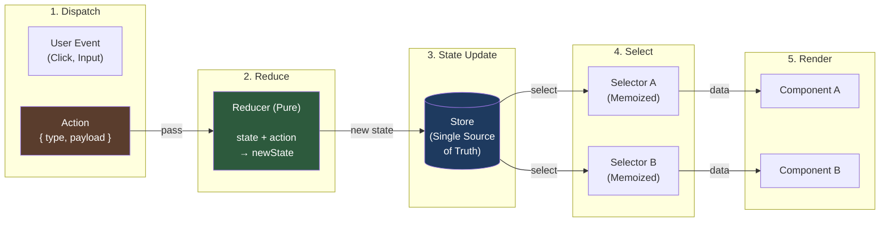
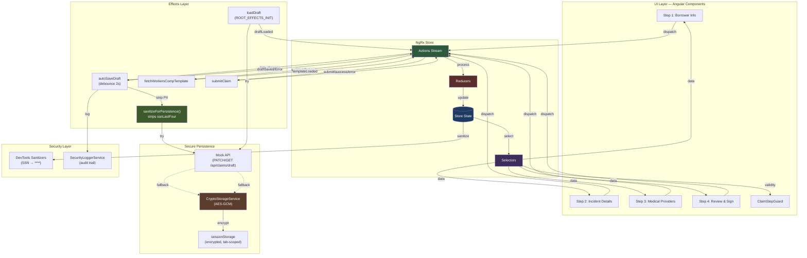
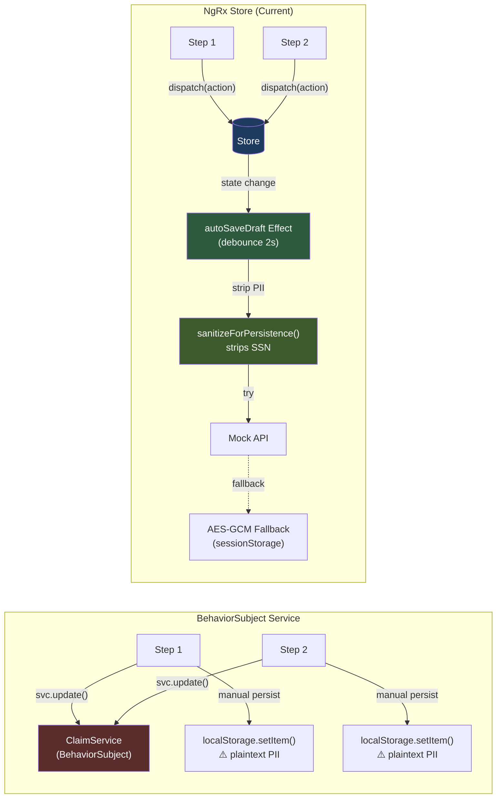
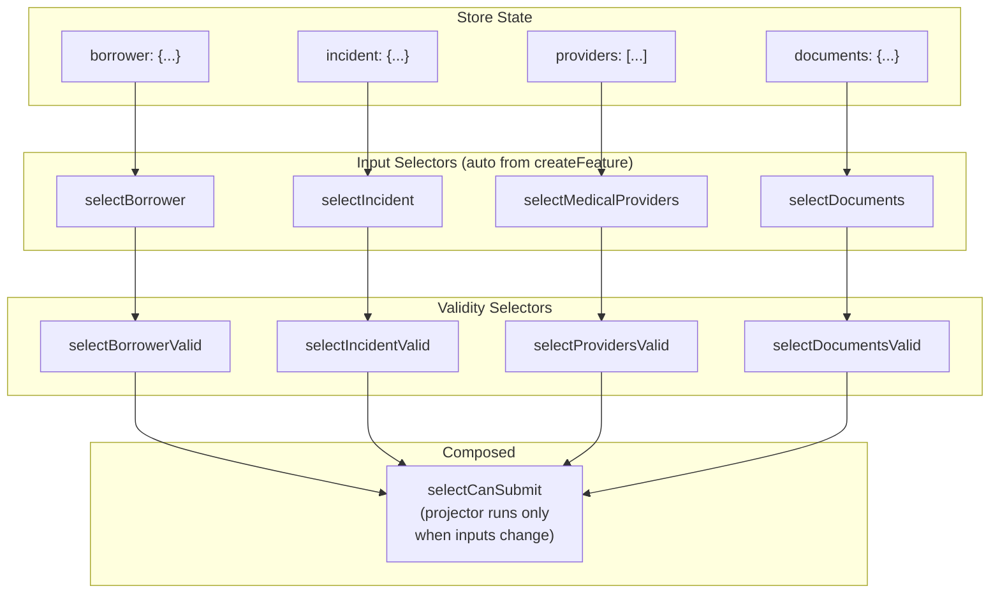

## Table of Contents

[🧠 **View Interactive Mindmap**](./ngrx-state-management-mindmap.md)

1. [TL;DR](#tldr)
2. [Architecture & Data Flow](#architecture--data-flow)
   - [Redux Pattern: Unidirectional Data Flow](#redux-pattern-unidirectional-data-flow)
   - [NgRx Data Flow in the Disability Claim Wizard](#ngrx-data-flow-in-the-disability-claim-wizard)
   - [NgRx vs Service-Based State](#ngrx-vs-service-based-state-data-flow-comparison)
3. [Deep Dive](#deep-dive)
   3.1 [Core Patterns](#concept-group-1-core-patterns)
      3.1.1 [Actions — The Event Catalog](#1-actions--the-event-catalog)
      3.1.2 [Reducers — Pure State Transitions](#2-reducers--pure-state-transitions)
      3.1.3 [Selectors — Memoized Derived State](#3-selectors--memoized-derived-state)
      3.1.4 [Effects — Side-Effect Managers](#4-effects--side-effect-managers)
      3.1.5 [Store Registration & Bootstrap](#5-store-registration--bootstrap)
   3.2 [Advanced Patterns](#concept-group-2-advanced-patterns)
      3.2.1 [Meta-Reducers — Middleware for the Store](#6-meta-reducers--middleware-for-the-store)
      3.2.2 [Guard Integration with Store](#7-guard-integration-with-store)
      3.2.3 [Form-Store Synchronization](#8-form-store-synchronization)
      3.2.4 [Replay Mode & Effect Suppression](#9-replay-mode--effect-suppression)
   3.3 [NgRx vs Alternatives — When to Use What](#concept-group-3-ngrx-vs-alternatives--when-to-use-what)
      3.3.1 [NgRx Store vs BehaviorSubject Services](#10-ngrx-store-vs-behaviorsubject-services)
      3.3.2 [NgRx Store vs @ngrx/signals (SignalStore)](#11-ngrx-store-vs-ngrxsignals-signalstore)
      3.3.3 [NgRx Store vs @ngrx/component-store](#12-ngrx-store-vs-ngrxcomponent-store)
   3.4 [State Shape Design & Scalability](#concept-group-4-state-shape-design--scalability)
      3.4.1 [State Shape Design](#13-state-shape-design)
      3.4.2 [@ngrx/entity — Normalized Collections](#14-ngrxentity--normalized-collections)
      3.4.3 [Multi-Feature Architecture — Scaling to Multiple Claim Types](#15-multi-feature-architecture--scaling-to-multiple-claim-types)
   3.5 [Testing NgRx](#concept-group-5-testing-ngrx)
      3.5.1 [Testing Reducers](#16-testing-reducers)
      3.5.2 [Testing Selectors](#17-testing-selectors)
      3.5.3 [Testing Effects](#18-testing-effects)
      3.5.4 [Testing Components with MockStore](#19-testing-components-with-mockstore)
4. [Real-World Examples](#real-world-examples)
   4.1 [Service-Based State Breaks Down](#example-1-service-based-state-breaks-down)
   4.2 [Composed Selectors Across Steps](#example-2-ngrx-composed-selectors-across-steps)
   4.3 [Conditional Effects with switchMap Cancellation](#example-3-conditional-effects-with-switchmap-cancellation)
   4.4 [Submit Effect with Full Store Select](#example-4-submit-effect-with-full-store-select)
   4.5 [Structuring Unemployment Claim as a New Feature](#example-5-structuring-unemployment-claim-as-a-new-feature)
5. [Comparison Tables](#comparison-tables)
   5.1 [NgRx vs BehaviorSubject Service for Multi-Step Wizards](#ngrx-vs-behaviorsubject-service-for-multi-step-wizards)
   5.2 [NgRx Store vs SignalStore vs ComponentStore](#ngrx-store-vs-signalstore-vs-componentstore)
   5.3 [createAction vs createActionGroup](#createaction-vs-createactiongroup)
   5.4 [switchMap vs concatMap vs exhaustMap in Effects](#switchmap-vs-concatmap-vs-exhaustmap-in-effects)
6. [Interview Q&A](#interview-qa)
   6.1 [L1: Junior Knowledge](#l1-junior-knowledge)
      6.1.1 [What is NgRx and why is it used?](#what-is-ngrx-and-why-is-it-used)
      6.1.2 [What is a selector?](#what-is-a-selector-in-ngrx)
      6.1.3 [What is an action?](#what-is-an-ngrx-action)
      6.1.4 [What does a reducer do?](#what-does-a-reducer-do)
   6.2 [L2: Mid-Level Knowledge](#l2-mid-level-knowledge)
      6.2.1 [When to use NgRx vs a service?](#when-would-you-choose-a-behaviorsubject-service-over-ngrx)
      6.2.2 [How does selector memoization work?](#how-does-selector-memoization-work)
      6.2.3 [switchMap vs concatMap vs exhaustMap in effects](#switchmap-vs-concatmap-vs-exhaustmap-in-effects-1)
      6.2.4 [How does the meta-reducer handle corrupt localStorage?](#how-does-the-meta-reducer-handle-a-corrupt-localstorage-entry)
   6.3 [L3: Senior Knowledge](#l3-senior-knowledge)
      6.3.1 [How to add a second claim type?](#how-would-you-add-a-second-claim-type-eg-unemployment-to-this-architecture)
      6.3.2 [Why enforce business rules in reducers?](#why-is-the-max_providers-cap-enforced-in-the-reducer-not-the-ui)
      6.3.3 [How to persist NgRx state across refreshes?](#how-would-you-persist-ngrx-state-across-page-refreshes)
      6.3.4 [Testing NgRx effects with side-effects](#how-do-you-test-ngrx-effects-that-call-apis)
      6.3.5 [NgRx Store vs @ngrx/signals for new projects](#ngrx-store-vs-ngrxsignals-for-a-new-project-in-2026)
   6.4 [Staff: System Architecture](#staff-system-architecture)
      6.4.1 [Design multi-claim state management](#design-the-state-management-architecture-for-a-multi-claim-borrower-portal)
      6.4.2 [NgRx at scale: performance and organization](#ngrx-at-scale-performance-and-organization)
7. [Cross-References](#cross-references)
8. [Further Reading](#further-reading)

---

## TL;DR

<span style="color: #33b5e5; font-weight: bold;">NgRx</span> is Angular's implementation of the <span style="color: #33b5e5; font-weight: bold;">Redux pattern</span> — a predictable state container using unidirectional data flow: components dispatch <span style="color: #33b5e5; font-weight: bold;">actions</span>, <span style="color: #00C851; font-weight: bold;">reducers</span> produce new immutable state, <span style="color: #00C851; font-weight: bold;">selectors</span> memoize derived reads, and <span style="color: #33b5e5; font-weight: bold;">effects</span> isolate side-effects. In the borrower-portal's disability claim wizard, NgRx solves three problems that BehaviorSubject services cannot: (1) <span style="color: #00C851; font-weight: bold;">effect-based secure draft persistence</span> — a debounced `autoSaveDraft` effect strips PII via `sanitizeForPersistence()`, saves to a mock API, and falls back to AES-GCM encrypted sessionStorage via Web Crypto. This replaced an earlier localStorage meta-reducer that violated GLBA/HIPAA by storing SSN and PHI in plaintext. The key insight: `crypto.subtle.encrypt()` is async (returns a Promise), and meta-reducers are synchronous — so persistence had to move to effects, which are async-native. (2) Composed `selectCanSubmit` that memoizes across 4 routes so typing in Step 3 doesn't recompute Step 1/2 validity. (3) Action-based replay for a "Visual Argument" demo impossible with direct state mutation. <span style="color: #ffbb33; font-weight: bold;">The key trade-off</span>: NgRx adds ~200 lines of boilerplate (actions + reducer + selectors + effects) but pays for itself when state crosses routes, needs async persistence with PII stripping, or requires an audit trail. For 2026 interviews: know when to choose NgRx Store vs `@ngrx/signals` (SignalStore) vs `@ngrx/component-store`, understand `createFeature()` (v15+ auto-generated selectors), functional effects (v15+), the async persistence boundary (why meta-reducers can't do crypto), DevTools `stateSanitizer`/`actionSanitizer` for PII masking, and the selector memoization chain. As the portal grows from disability to unemployment and loss-of-life claims, each claim type gets its own `createFeature()` slice with shared guard and persistence factories — a structure that would require reinventing half of NgRx if built on services.

---

## Architecture & Data Flow

### Redux Pattern: Unidirectional Data Flow



### NgRx Data Flow in the Disability Claim Wizard



### NgRx vs Service-Based State: Data Flow Comparison



---

## Deep Dive

### Concept Group 1: Core Patterns

#### 1. Actions — The Event Catalog

##### What
Actions are plain objects with a `type` string and optional payload. They are the <span style="color: #33b5e5; font-weight: bold;">only way</span> to change state in NgRx. `createActionGroup()` (v15+) bundles related actions under a shared source prefix with strongly-typed creator functions.

##### Why
Without actions, state mutations happen directly (`this.state = newValue`), creating no audit trail. You can't trace WHAT changed, WHEN, or WHY. With actions, <span style="color: #00C851; font-weight: bold;">Redux DevTools shows every dispatched action in sequence with timestamps</span>. When a bug occurs in production, you can replay the exact action sequence that led to the bad state. This is impossible with `BehaviorSubject.next()`.

##### How

```typescript
// 📍 From borrower-portal: apps/borrower-portal/src/app/claim/+state/claim.actions.ts
import { createActionGroup, emptyProps, props } from '@ngrx/store';

export const ClaimActions = createActionGroup({
  source: 'Claim',  // Action types become "[Claim] Save Borrower Info", etc.
  events: {
    // Step navigation
    'Set Current Step': props<{ step: number }>(),

    // Step 1: Borrower Info — dispatched on step exit + blur on SSN/email
    'Save Borrower Info': props<{ borrower: BorrowerInfo }>(),

    // Step 2: Incident Details
    'Save Incident Details': props<{ incident: IncidentDetails }>(),
    'Set Work Related': props<{ isWorkRelated: boolean }>(),  // Separate — triggers effect
    'Workers Comp Template Loaded': props<{ templateId: string }>(),

    // Step 3: Medical Providers (dynamic array)
    'Add Provider': props<{ provider: MedicalProvider }>(),
    'Remove Provider': props<{ id: string }>(),
    'Update Provider': props<{ provider: MedicalProvider }>(),

    // Step 4: Documents
    'Save Document Meta': props<{ docType: 'employerLeaveForm' | 'attendingPhysicianStatement'; meta: DocumentMeta }>(),
    'Remove Document': props<{ docType: 'employerLeaveForm' | 'attendingPhysicianStatement' }>(),

    // Submit flow
    'Submit Claim': emptyProps(),
    'Submit Claim Success': props<{ claimId: string }>(),
    'Submit Claim Error': props<{ message: string }>(),

    // Error + Reset
    'Api Error': props<{ message: string }>(),
    'Clear Error': emptyProps(),
    'Reset Claim': emptyProps(),
  },
});

// Usage in a component:
// this.store.dispatch(ClaimActions.saveBorrowerInfo({ borrower: this.form.value }));
```

Older API for individual actions (pre-v15 or standalone actions):

```typescript
import { createAction, props } from '@ngrx/store';

export const saveBorrowerInfo = createAction(
  '[Claim] Save Borrower Info',
  props<{ borrower: BorrowerInfo }>()
);
```

##### When
- Use `createActionGroup()` for related actions (cleaner than individual `createAction()` calls)
- Use individual `createAction()` when a single action doesn't belong to a group
- <span style="color: #ff4444; font-weight: bold;">Avoid dispatching on every keystroke</span> — dispatch on blur or step exit to keep the action log clean
- Name actions as past-tense events, not commands: `'Save Borrower Info'` (something happened), not `'SET_BORROWER'` (command)

##### Trade-offs
- <span style="color: #ffbb33; font-weight: bold;">Cost:</span> 5-10 extra lines per action group vs. direct method calls
- <span style="color: #ff4444; font-weight: bold;">Anti-pattern:</span> Dispatching on every keystroke floods the action log, making replay and DevTools noisy. Dispatch on blur or step exit instead.
- <span style="color: #ff4444; font-weight: bold;">Anti-pattern:</span> Generic/reusable actions like `'Update State'` — defeats the audit trail purpose

---

#### 2. Reducers — Pure State Transitions

##### What
A reducer is a <span style="color: #33b5e5; font-weight: bold;">pure function</span> that takes current state + an action and returns a NEW state object. It never mutates existing state — Angular uses reference equality (`===`) to detect changes. `createFeature()` (v15+) bundles a reducer with auto-generated selectors for every top-level state property.

##### Why
Immutability enables three things:
1. **Change detection:** Angular knows precisely when state changed (new reference = changed)
2. **Time-travel debugging:** each state is a snapshot that NgRx can replay forward/backward
3. **Memoization:** selectors use referential equality to skip unnecessary computations

Without immutability, `state.borrower = newBorrower` mutates in place. Angular can't detect the change. Selectors can't memoize. DevTools can't snapshot. Everything breaks silently.

##### How

```typescript
// 📍 From borrower-portal: apps/borrower-portal/src/app/claim/+state/claim.reducer.ts
import { createFeature, createReducer, on } from '@ngrx/store';

export const claimFeature = createFeature({
  name: 'claim',  // State key in the global store: state['claim']
  reducer: createReducer(
    initialClaimState,

    // Step navigation — clears error on step change
    on(ClaimActions.setCurrentStep, (state, { step }): DisabilityClaimDraft => ({
      ...state,        // Spread = new object reference = change detection triggers
      currentStep: step,
      error: null,
    })),

    // Step 1: Replace the entire borrower slice
    on(ClaimActions.saveBorrowerInfo, (state, { borrower }): DisabilityClaimDraft => ({
      ...state,
      borrower,
    })),

    // Step 2: isWorkRelated toggle — cleanup workersCompClaimNumber on toggle-off
    on(ClaimActions.setWorkRelated, (state, { isWorkRelated }): DisabilityClaimDraft => ({
      ...state,
      incident: {
        ...state.incident,
        isWorkRelated,
        workersCompClaimNumber: isWorkRelated ? state.incident.workersCompClaimNumber : null,
      },
    })),

    // Step 3: Business rule enforced IN the reducer, not the UI
    on(ClaimActions.addProvider, (state, { provider }): DisabilityClaimDraft => {
      if (state.medicalProviders.length >= MAX_PROVIDERS) {
        return state; // No-op — cap enforced here, not in the component
      }
      return { ...state, medicalProviders: [...state.medicalProviders, provider] };
    }),

    on(ClaimActions.removeProvider, (state, { id }): DisabilityClaimDraft => ({
      ...state,
      medicalProviders: state.medicalProviders.filter(p => p.id !== id),
    })),

    // Submit flow
    on(ClaimActions.submitClaim, (state): DisabilityClaimDraft => ({
      ...state, isSubmitting: true, error: null,
    })),
    on(ClaimActions.submitClaimSuccess, (state, { claimId }): DisabilityClaimDraft => ({
      ...state, claimId, isSubmitting: false,
    })),
    on(ClaimActions.submitClaimError, (state, { message }): DisabilityClaimDraft => ({
      ...state, isSubmitting: false, error: message,
    })),

    // Nuclear reset — meta-reducer persists this too, wiping the draft
    on(ClaimActions.resetClaim, (): DisabilityClaimDraft => ({ ...initialClaimState })),
  ),
});

// createFeature() AUTO-GENERATES these selectors:
// claimFeature.selectBorrower      → state.claim.borrower
// claimFeature.selectIncident      → state.claim.incident
// claimFeature.selectCurrentStep   → state.claim.currentStep
// claimFeature.selectIsSubmitting  → state.claim.isSubmitting
// claimFeature.selectClaimState    → state.claim (entire feature slice)
```

##### When
- Every state change MUST go through a reducer — no direct mutation
- <span style="color: #00C851; font-weight: bold;">Business rules belong in reducers</span> (MAX_PROVIDERS cap, cleanup on toggle-off), not in UI
- Use `createFeature()` (v15+) over manual `createReducer()` + `createFeatureSelector()` — less boilerplate, auto-generated selectors
- For computed/derived state, don't put logic in reducers — that's what selectors are for

##### Trade-offs
- <span style="color: #ff4444; font-weight: bold;">Anti-pattern:</span> Mutating state directly: `state.borrower = borrower` (breaks change detection, breaks DevTools, breaks memoization)
- <span style="color: #ff4444; font-weight: bold;">Anti-pattern:</span> Complex logic in `on()` handlers — extract into helper functions for readability
- <span style="color: #ffbb33; font-weight: bold;">Cost:</span> Memory overhead from creating new objects on every action — negligible for modern JS engines and typical state sizes (~1-10KB)

---

#### 3. Selectors — Memoized Derived State

##### What
Selectors are pure functions that extract and derive data from the store. `createSelector()` <span style="color: #00C851; font-weight: bold;">memoizes</span> the result: if none of the input selectors return a new reference, the projector function is NOT re-executed. This is NgRx's performance secret weapon.

##### Why
In a 4-step wizard spanning 4 routes, `selectCanSubmit` needs data from ALL steps. Without memoization, typing in Step 3 would recompute Step 1, 2, and 4 validity every time. With selectors, only `selectProvidersValid` recomputes — the other three return cached values. The projector only fires when an input actually changed.

With a BehaviorSubject service, you'd compute `canSubmit` on every access:
```typescript
// Service approach — no memoization, recomputes EVERY time
get canSubmit(): boolean {
  const s = this.state$.value;
  return this.isBorrowerValid(s.borrower)
    && this.isIncidentValid(s.incident)
    && this.isProvidersValid(s.medicalProviders)
    && this.isDocumentsValid(s.documents);
}
```

##### How

```typescript
// 📍 From borrower-portal: apps/borrower-portal/src/app/claim/+state/claim.selectors.ts

// Re-export auto-generated selectors from createFeature()
export const {
  selectBorrower, selectIncident, selectMedicalProviders,
  selectDocuments, selectCurrentStep, selectIsSubmitting,
  selectError, selectClaimId, selectClaimState,
} = claimFeature;

// Step 1 validity — independently memoized
export const selectBorrowerValid = createSelector(
  selectBorrower,
  (borrower) =>
    borrower.firstName.trim().length > 0 &&
    borrower.lastName.trim().length > 0 &&
    borrower.ssnLastFour.trim().length === 4 &&
    borrower.phone.trim().length > 0 &&
    borrower.email.trim().length > 0
);

// Step 2 validity — conditional check for isWorkRelated
export const selectIncidentValid = createSelector(
  selectIncident,
  (incident) =>
    incident.dateOfDisability.trim().length > 0 &&
    incident.disabilityType !== null &&
    incident.description.trim().length > 0 &&
    (!incident.isWorkRelated || (incident.workersCompClaimNumber?.trim().length ?? 0) > 0)
);

// Step 3 validity — .every() on empty array returns true, so check length first
export const selectProvidersValid = createSelector(
  selectMedicalProviders,
  (providers) =>
    providers.length > 0 &&
    providers.every(p =>
      p.doctorName.trim().length > 0 && p.clinicName.trim().length > 0 &&
      p.phone.trim().length > 0 && p.dateFirstTreated.trim().length > 0
    )
);

// THE FLAGSHIP: Composed selector across ALL 4 steps
export const selectCanSubmit = createSelector(
  selectBorrowerValid,   // Input 1
  selectIncidentValid,   // Input 2
  selectProvidersValid,  // Input 3
  selectDocumentsValid,  // Input 4
  (borrower, incident, providers, documents) =>  // Projector — only runs when inputs change
    borrower && incident && providers && documents
);

// Used by CDK Stepper and State Inspector
export const selectStepValidity = createSelector(
  selectBorrowerValid, selectIncidentValid, selectProvidersValid, selectDocumentsValid,
  (borrower, incident, providers, documents) => ({
    step1: borrower, step2: incident, step3: providers, step4: documents,
  })
);
```

Selector memoization flow:


##### When
- Any derived state: validity checks, computed totals, filtered lists
- Compose selectors from other selectors (tree of memoization)
- Use for route guards — guard queries store without triggering unnecessary recomputation
- NOT for simple property reads — `store.select(selectBorrower)` is already sufficient

##### Trade-offs
- <span style="color: #ffbb33; font-weight: bold;">Cost:</span> Negligible — memoization overhead is far less than unnecessary recomputation
- <span style="color: #ff4444; font-weight: bold;">Anti-pattern:</span> Selecting raw state in a component and computing locally (bypasses memoization):
  ```typescript
  // BAD: derived state in the component
  this.store.select(selectClaimState).subscribe(s => {
    this.canSubmit = /* compute here */; // runs on EVERY state change
  });
  ```
- <span style="color: #ff4444; font-weight: bold;">Anti-pattern:</span> Creating selectors that return new object/array references every time (breaks memoization for downstream selectors). Avoid `.map()` or `{...spread}` inside projectors unless the input actually changed.

---

#### 4. Effects — Side-Effect Managers

##### What
Effects listen for specific actions and perform side-effects: API calls, localStorage writes, navigation, logging. They are the <span style="color: #33b5e5; font-weight: bold;">only place</span> where async or impure operations should happen. NgRx v15+ introduced <span style="color: #00C851; font-weight: bold;">functional effects</span> — just functions, no classes.

##### Why
Components shouldn't know about HTTP, error handling, or retry logic. Effects centralize side-effects so they're:
1. **Testable** in isolation (mock the Actions stream, assert output actions)
2. **Suppressible** during replay (check `REPLAY_MODE` flag)
3. **Reusable** — the same effect fires regardless of which component dispatched the action

Without effects, components make HTTP calls directly, scattering error handling, coupling UI to API, and breaking replay.

##### How

```typescript
// 📍 From borrower-portal: apps/borrower-portal/src/app/claim/+state/claim.effects.ts

// Conditional effect: fires when isWorkRelated toggles to true
export const fetchWorkersCompTemplate = createEffect(
  (
    actions$ = inject(Actions),
    store = inject(Store),
    replayMode = inject(REPLAY_MODE),
  ) => {
    return actions$.pipe(
      ofType(ClaimActions.setWorkRelated),
      filter(() => !replayMode.active),                        // Skip during replay
      withLatestFrom(store.select(selectIsWorkRelated)),       // Read updated store
      filter(([, isWorkRelated]) => isWorkRelated),            // Only if toggled ON
      switchMap(() =>                                          // Cancel previous on re-toggle
        of({ templateId: 'WC-TEMPLATE-001' }).pipe(
          delay(500),                                          // Mock API latency
          map(({ templateId }) => ClaimActions.workersCompTemplateLoaded({ templateId })),
          catchError(() => of(ClaimActions.apiError({          // Non-blocking error
            message: 'Could not load Workers Comp template. You can continue without it.',
          })))
        )
      )
    );
  },
  { functional: true }
);

// Submit effect: grabs FULL 4-step draft from store in one shot
export const submitClaim = createEffect(
  (
    actions$ = inject(Actions),
    store = inject(Store),
    replayMode = inject(REPLAY_MODE),
  ) => {
    return actions$.pipe(
      ofType(ClaimActions.submitClaim),
      filter(() => !replayMode.active),
      // withLatestFrom: the effect doesn't need to know which components collected which data
      withLatestFrom(store.select(selectClaimState)),
      switchMap(([, claimDraft]) =>
        of({ claimId: `CLM-${new Date().getFullYear()}-${String(Math.floor(Math.random() * 9999)).padStart(4, '0')}` }).pipe(
          delay(1500),
          map(({ claimId }) => ClaimActions.submitClaimSuccess({ claimId })),
          catchError(() => of(ClaimActions.submitClaimError({
            message: 'Unable to submit your claim. Please try again.',
          })))
        )
      )
    );
  },
  { functional: true }
);
```

Key RxJS operators in effects:

| Operator | Behavior | Use When |
|----------|----------|----------|
| `switchMap` | Cancels previous inner observable on new emission | Search-as-you-type, toggle-driven fetches |
| `concatMap` | Queues — processes sequentially | Order-dependent operations |
| `mergeMap` | Parallel — all run concurrently | Independent parallel requests |
| `exhaustMap` | Ignores new emissions while one is in-flight | Submit buttons (prevent double-submit) |

##### When
- API calls, file I/O, navigation, logging — anything async or impure
- Use `switchMap` for cancellable requests (user toggles rapidly)
- Use `exhaustMap` for submit buttons (prevent double-click)
- NOT for synchronous state derivation — that's selectors

##### Trade-offs
- <span style="color: #ffbb33; font-weight: bold;">Cost:</span> Learning RxJS operators — `switchMap`, `withLatestFrom`, `catchError` are essential
- <span style="color: #ff4444; font-weight: bold;">Anti-pattern:</span> Effects that re-throw errors — this kills the effect stream permanently. Always use `catchError` returning an error action.
- <span style="color: #ff4444; font-weight: bold;">Anti-pattern:</span> Effects that dispatch multiple actions — prefer one effect → one output action. If you need multiple state changes, have the reducer handle them in one `on()`.

---

#### 5. Store Registration & Bootstrap

##### What
NgRx is bootstrapped via provider functions in `app.config.ts`. `provideStore()` creates the global store. `provideEffects()` registers effect handlers. `provideStoreDevtools()` enables Redux DevTools.

##### Why
Understanding registration is critical for lazy-loaded features. `provideStore()` is called once at the root. `provideState()` can register feature slices in lazy-loaded routes. In the borrower-portal, the claim feature is eagerly registered because the `loadDraft` effect needs to hydrate from the API (or encrypted sessionStorage) on app startup via `ROOT_EFFECTS_INIT`.

##### How

```typescript
// 📍 From borrower-portal: apps/borrower-portal/src/app/app.config.ts
export const appConfig: ApplicationConfig = {
  providers: [
    provideRouter(appRoutes),

    // HTTP client with mock API interceptor (for draft persistence)
    provideHttpClient(withInterceptors([mockApiInterceptor])),

    // Global store — NO metaReducers (persistence moved to effects)
    provideStore(
      { [claimFeature.name]: claimFeature.reducer },
    ),

    // Register effects (functional effects — no classes)
    // autoSaveDraft + loadDraft handle secure persistence
    provideEffects({
      fetchWorkersCompTemplate, submitClaim,
      autoSaveDraft, loadDraft, clearDraftOnReset,
    }),

    // Redux DevTools — with PII sanitizers for GLBA compliance
    provideStoreDevtools({
      maxAge: 50,
      logOnly: !isDevMode(),
      name: 'Borrower Portal — NgRx Store',
      stateSanitizer: (state: any) => ({
        ...state,
        claim: state.claim ? {
          ...state.claim,
          borrower: { ...state.claim.borrower,
            ssnLastFour: state.claim.borrower?.ssnLastFour ? '****' : '',
          },
        } : state.claim,
      }),
      actionSanitizer: (action: any) =>
        action.type === '[Claim] Save Borrower Info' && action.borrower
          ? { ...action, borrower: { ...action.borrower, ssnLastFour: '****' } }
          : action,
    }),
  ],
};
```

For lazy-loaded features (future unemployment claim):
```typescript
// In a lazy-loaded route module:
export const unemploymentRoutes: Route[] = [{
  path: '',
  providers: [
    provideState(unemploymentFeature),
    provideEffects({ submitUnemploymentClaim }),
  ],
  children: [/* step routes */],
}];
```

##### When
- `provideStore()` at root — once per application
- `provideState()` in lazy routes — registers feature slices on demand
- `provideEffects()` at root or in lazy routes alongside their feature
- `provideStoreDevtools()` — always wrap in `isDevMode()` check

##### Trade-offs
- <span style="color: #ffbb33; font-weight: bold;">Cost:</span> Eager registration means the entire claim state loads on startup even if the user doesn't navigate to the wizard. For the borrower-portal this is acceptable (the wizard IS the app, and `loadDraft` must fire immediately).
- <span style="color: #00C851; font-weight: bold;">Benefit of lazy:</span> For multiple claim types, lazy-loading each via `provideState()` means unused claim reducers/effects never load.
- <span style="color: #00C851; font-weight: bold;">Security note:</span> `provideStoreDevtools()` now includes `stateSanitizer` and `actionSanitizer` to mask SSN in DevTools views. Without this, Redux DevTools leaks PII.

---

### Concept Group 2: Advanced Patterns

#### 6. Meta-Reducers — Middleware for the Store

##### What
A meta-reducer wraps the <span style="color: #33b5e5; font-weight: bold;">entire store's root reducer</span>. It intercepts every action BEFORE it reaches feature reducers and every state change AFTER. Think of it as Express middleware for your state. Common uses: logging, undo/redo, state freezing in dev.

##### Why
Meta-reducers centralize cross-cutting concerns. Without one, you'd scatter logging or state-freezing logic across every reducer. With a meta-reducer, it's ONE place.

<span style="color: #ff4444; font-weight: bold;">⚠️ Architectural evolution in borrower-portal:</span> The original POC used a `localStorageMetaReducer` for draft persistence — ~30 lines that auto-saved every state change to localStorage. This was replaced by effect-based secure persistence for two reasons:

1. **Security violation:** localStorage stores plaintext PII/PHI (SSN, medical data), violating GLBA and HIPAA. sessionStorage with AES-GCM encryption is required.
2. **Async boundary:** `crypto.subtle.encrypt()` returns a Promise. Meta-reducers are synchronous functions (`(state, action) => state`). You cannot `await` inside a meta-reducer. This is a hard technical constraint, not a design preference. Persistence moved to effects, which are async-native (RxJS).

The "single point of persistence" argument still holds — it just shifted from the meta-reducer to the `autoSaveDraft` effect.

##### How

**Original meta-reducer (REMOVED — shown for interview context):**
```typescript
// 📍 HISTORICAL: apps/borrower-portal/src/app/claim/+state/claim.meta-reducer.ts
// This file was DELETED when persistence moved to effects.
// Shown here because meta-reducers are a valid NgRx interview topic.

export function localStorageMetaReducer(
  reducer: ActionReducer<any>
): ActionReducer<any> {
  return (state, action) => {
    // HYDRATION: on app startup, merge stored state
    if (action.type === INIT || action.type === UPDATE) {
      const stored = loadStateFromStorage();
      if (stored) {
        const newState = reducer(state, action);
        return { ...newState, claim: { ...initialClaimState, ...stored } };
      }
    }
    // NORMAL: run reducer, then persist
    const nextState = reducer(state, action);
    if (nextState?.claim) {
      saveStateToStorage(nextState.claim); // ⚠️ Plaintext PII to localStorage
    }
    return nextState;
  };
}
```

**Current approach — effect-based secure persistence:**
```typescript
// 📍 Current: apps/borrower-portal/src/app/claim/+state/claim.effects.ts

export const autoSaveDraft = createEffect(
  (
    actions$ = inject(Actions),
    store = inject(Store),
    draftService = inject(ClaimDraftService),
    cryptoStorage = inject(CryptoStorageService),  // AES-GCM via Web Crypto
    securityLogger = inject(SecurityLoggerService),
    replayMode = inject(REPLAY_MODE),
  ) => {
    return actions$.pipe(
      ofType(
        ClaimActions.saveBorrowerInfo, ClaimActions.saveIncidentDetails,
        ClaimActions.addProvider, ClaimActions.updateProvider,
        /* ... all data-changing actions */
      ),
      filter(() => !replayMode.active),
      debounceTime(2000),                          // Don't hammer API on every keystroke
      withLatestFrom(store.select(selectClaimState)),
      exhaustMap(([, claimState]) => {
        const sanitized = sanitizeForPersistence(claimState);  // Strips ssnLastFour
        securityLogger.log('PII_STRIPPED');
        return draftService.saveDraft(sanitized).pipe(
          map(() => ClaimActions.draftSaved()),
          catchError(() => {
            // API failed — encrypt to sessionStorage
            from(cryptoStorage.save(sanitized)).subscribe();
            return of(ClaimActions.draftSaveError({ message: 'Saved locally (encrypted).' }));
          }),
        );
      }),
    );
  },
  { functional: true }
);
```

**Meta-reducers that ARE still valid:**
```typescript
// State freeze in dev (catch accidental mutations)
export function freezeMetaReducer(reducer: ActionReducer<any>): ActionReducer<any> {
  return (state, action) => {
    const nextState = reducer(state, action);
    return Object.freeze(nextState); // Throws if code tries to mutate
  };
}

// Action logging
export function logMetaReducer(reducer: ActionReducer<any>): ActionReducer<any> {
  return (state, action) => {
    console.log('[Action]', action.type, action);
    return reducer(state, action);
  };
}
```

##### When
- <span style="color: #00C851; font-weight: bold;">Still use meta-reducers for:</span> synchronous concerns — logging, state freeze in dev, undo/redo
- <span style="color: #ff4444; font-weight: bold;">Do NOT use meta-reducers for:</span> anything requiring async operations (encryption, API calls, IndexedDB). Use effects instead.
- The interview talking point: "We started with a localStorage meta-reducer for the POC. When we needed GLBA/HIPAA compliance, we discovered the async boundary — `crypto.subtle` is Promise-based, meta-reducers are synchronous. Persistence moved to an effect with `debounceTime` + `exhaustMap`. Same single-point-of-persistence guarantee, but async-native."

##### Trade-offs
- <span style="color: #ffbb33; font-weight: bold;">Cost:</span> Runs on EVERY action. For synchronous operations (logging, freeze), this is negligible.
- <span style="color: #ff4444; font-weight: bold;">Hard constraint:</span> Meta-reducers are `(state, action) => state`. No Promises, no Observables, no async. If your persistence requires encryption, authentication, or API calls, use effects.
- <span style="color: #ff4444; font-weight: bold;">Security gotcha:</span> A meta-reducer persisting to localStorage stores plaintext on disk. localStorage survives browser restarts, tab closes, and is readable by any script on the same origin. For PII/PHI, this violates GLBA, HIPAA, and CCPA.

---

#### 7. Guard Integration with Store

##### What
Angular route guards query the NgRx store to make navigation decisions. The guard selects validity from the store and returns `Observable<boolean>`. This is the <span style="color: #33b5e5; font-weight: bold;">single source of truth</span> for step accessibility — it works regardless of whether the user clicks the stepper UI or navigates via deep link.

##### Why
CDK Stepper's linear mode is local to the component — it doesn't integrate with Angular's router. Deep links like `/claim/medical-providers` bypass the stepper entirely. The guard enforces prerequisites at the router level.

##### How

```typescript
// 📍 From borrower-portal: apps/borrower-portal/src/app/claim/+state/claim-step.guard.ts

const STEP_MAP: Record<string, number> = {
  'borrower-info': 1, 'incident-details': 2,
  'medical-providers': 3, 'review-sign': 4,
};

export const claimStepGuard: CanActivateFn = (route) => {
  const store = inject(Store);
  const router = inject(Router);
  const path = route.url[0]?.path ?? '';
  const targetStep = STEP_MAP[path] ?? 1;

  if (targetStep === 1) return true;  // Step 1 always accessible

  return combineLatest([
    store.select(selectBorrowerValid),
    store.select(selectIncidentValid),
    store.select(selectProvidersValid),
  ]).pipe(
    take(1),  // One-shot check, don't leave the subscription open
    map(([step1Valid, step2Valid, step3Valid]) => {
      const canAccess =
        (targetStep <= 1 || step1Valid) &&
        (targetStep <= 2 || step2Valid) &&
        (targetStep <= 3 || step3Valid);

      if (!canAccess) {
        const redirect = !step1Valid ? 'borrower-info'
          : !step2Valid ? 'incident-details' : 'medical-providers';
        router.navigate(['/claim', redirect]);
        return false;
      }
      return true;
    })
  );
};
```

##### When
- Multi-step wizards with route-based navigation
- Any feature requiring prerequisites before access
- Combine with meta-reducer hydration — deep link rehydrates from localStorage, then guard checks validity

##### Trade-offs
- <span style="color: #ffbb33; font-weight: bold;">Cost:</span> `take(1)` means the guard checks once per navigation, not continuously. This is correct for guards.
- <span style="color: #ff4444; font-weight: bold;">Gotcha:</span> Without `take(1)`, the guard would hold the subscription open, potentially blocking future navigations if the observable doesn't complete.

---

#### 8. Form-Store Synchronization

##### What
Each step component owns a reactive form. State flows to/from the store via a deliberate sync strategy: dispatch on step exit (or blur for critical fields), rehydrate on step entry via `patchValue()`.

##### Why
Dispatching on every keystroke floods the action log with noise and makes replay unwatchable. Dispatching only on step exit keeps the action stream clean while still persisting reliably (the meta-reducer saves on every dispatch).

##### How

```typescript
// 📍 From borrower-portal: borrower-info.component.ts

// REHYDRATE on step entry
ngOnInit(): void {
  this.store.select(selectBorrower).pipe(takeUntil(this.destroy$))
    .subscribe((borrower) => {
      if (borrower.firstName || borrower.lastName) {
        this.form.patchValue(borrower, { emitEvent: false });
      }
    });
}

// DISPATCH on blur for critical fields (SSN, email) — survives mid-step tab close
onFieldBlur(field: string): void {
  if (this.form.get(field)?.value) {
    this.store.dispatch(ClaimActions.saveBorrowerInfo({
      borrower: this.form.value as BorrowerInfo,
    }));
  }
}

// DISPATCH on step exit — full form value
onNext(): void {
  if (this.form.invalid) { this.form.markAllAsTouched(); return; }
  this.store.dispatch(ClaimActions.saveBorrowerInfo({
    borrower: this.form.value as BorrowerInfo,
  }));
  this.router.navigate(['/claim/incident-details']);
}
```

##### When
- Multi-step wizard forms
- Dispatch on blur for fields with data-loss risk (SSN, email)
- Dispatch on step exit for the full form
- `patchValue({ emitEvent: false })` on rehydrate to prevent infinite loops

##### Trade-offs
- <span style="color: #ffbb33; font-weight: bold;">Cost:</span> If the user closes the tab without triggering blur or navigation, unsaved keystrokes are lost. For a POC this is acceptable. Production apps might add a `beforeunload` listener.
- <span style="color: #ff4444; font-weight: bold;">Anti-pattern:</span> Two-way binding between form and store (dispatching on every valueChange AND patching on every store emission = infinite loop)

---

#### 9. Replay Mode & Effect Suppression

##### What
A `REPLAY_MODE` injection token that suppresses side-effects during action replay. Effects check `!replayMode.active` before firing API calls.

##### Why
The "Visual Argument" demo replays recorded actions to auto-fill the wizard. Without suppression, replay would fire real API calls — duplicate submissions, wasted network requests, broken state.

##### How

```typescript
// 📍 From borrower-portal: apps/borrower-portal/src/app/claim/+state/claim.effects.ts
export const REPLAY_MODE = new InjectionToken<{ active: boolean }>(
  'Replay Mode Flag',
  { providedIn: 'root', factory: () => ({ active: false }) }
);

// In every effect:
filter(() => !replayMode.active),  // 1 line to suppress during replay
```

##### When
- Demo/replay features
- Testing — suppress effects during integration tests
- Storybook — prevent API calls in component stories

##### Trade-offs
- <span style="color: #ffbb33; font-weight: bold;">Cost:</span> 1 line per effect
- <span style="color: #ff4444; font-weight: bold;">Gotcha:</span> Forgetting the check on a new effect means replay fires real side-effects

---

### Concept Group 3: NgRx vs Alternatives — When to Use What

#### 10. NgRx Store vs BehaviorSubject Services

##### What
A BehaviorSubject service is the simplest cross-component state solution. An `@Injectable({ providedIn: 'root' })` service with a `BehaviorSubject<T>` and methods that call `.next()`.

##### Why
The service approach works for 80% of use cases. It breaks when you need:
1. **Secure async persistence** — NgRx effects orchestrate PII stripping → API save → encrypted sessionStorage fallback in a single reactive pipeline. Services need manual persistence in every method, with no built-in debounce, fallback chain, or PII sanitization layer.
2. **Memoized derived state** — selectors memoize; service getters recompute every time
3. **Action history** — actions create an audit trail; `.next()` has no history
4. **Replay** — serializable actions can be replayed; direct mutation cannot
5. **DevTools with PII masking** — Redux DevTools with `stateSanitizer`/`actionSanitizer` masks SSN as `****`. Services have no tooling, and no way to mask sensitive data in browser debugging.

##### When
- <span style="color: #00C851; font-weight: bold;">Use a service</span> when state is local to 1-2 components, doesn't need persistence, and has no derived state. Examples: sidebar toggle, theme preference, search filter on a single page.
- <span style="color: #00C851; font-weight: bold;">Use NgRx</span> when state crosses 3+ routes, needs middleware-style persistence, requires an action audit trail, or has complex derived state read by multiple consumers.

##### Trade-offs
- <span style="color: #ffbb33; font-weight: bold;">Service cost:</span> ~80 lines. <span style="color: #ffbb33; font-weight: bold;">NgRx cost:</span> ~200 lines.
- <span style="color: #00C851; font-weight: bold;">Rule of thumb:</span> If you can describe the state in one sentence and it doesn't cross routes, use a service or signal.

---

#### 11. NgRx Store vs @ngrx/signals (SignalStore)

##### What
`@ngrx/signals` (SignalStore) is NgRx's Signal-based state management solution. It uses Angular Signals instead of RxJS Observables. It's the recommended choice for <span style="color: #33b5e5; font-weight: bold;">component-level and feature-level state</span> in new Angular 17+ projects.

##### Why
SignalStore provides a simpler mental model (synchronous, no RxJS), integrates with Angular's signal-based change detection, and has less boilerplate. But it lacks:
- **Effects with RxJS operators** — no `debounceTime`, `exhaustMap`, `catchError` pipeline for async persistence. SignalStore's `rxMethod()` exists but doesn't match `createEffect()` for complex orchestration like API-with-encrypted-fallback.
- **DevTools with sanitizers** — no `stateSanitizer`/`actionSanitizer` to mask PII. In a FinTech app, this is a compliance gap.
- Meta-reducers (no middleware concept)
- Redux DevTools integration (no action stream to time-travel)
- Action replay (no serializable event log)
- Cross-feature selector composition with automatic memoization

##### How

```typescript
// 🔧 Fits borrower-portal: If the wizard were simpler (no replay, no middleware)
import { signalStore, withState, withComputed, withMethods, patchState } from '@ngrx/signals';

export const ClaimStore = signalStore(
  { providedIn: 'root' },
  withState(initialClaimState),
  withComputed((store) => ({
    borrowerValid: computed(() =>
      store.borrower().firstName.length > 0 && store.borrower().lastName.length > 0
    ),
    canSubmit: computed(() =>
      store.borrowerValid() && store.incidentValid() && store.providersValid()
    ),
  })),
  withMethods((store) => ({
    saveBorrower(borrower: BorrowerInfo) {
      patchState(store, { borrower });
      // PROBLEM: must manually persist to localStorage HERE
      localStorage.setItem('claim_draft', JSON.stringify(store));
    },
  })),
);
```

##### When
- <span style="color: #00C851; font-weight: bold;">Use SignalStore</span> for feature-level state that doesn't need middleware, replay, or action history. The tai-portal `portal-web` app uses it for simpler features.
- <span style="color: #00C851; font-weight: bold;">Use NgRx Store</span> for cross-route state with persistence middleware, complex selector graphs, effects needing replay suppression, or Redux DevTools debugging. The borrower-portal wizard uses it.

##### Trade-offs
- <span style="color: #ffbb33; font-weight: bold;">SignalStore advantage:</span> ~60% less boilerplate, no RxJS requirement, synchronous mental model
- <span style="color: #ffbb33; font-weight: bold;">NgRx Store advantage:</span> Meta-reducers, DevTools, action replay, cross-feature selector composition
- <span style="color: #ff4444; font-weight: bold;">Interview talking point:</span> "The monorepo has both: `@ngrx/signals` for portal-web's simpler features, `@ngrx/store` for the claim wizard's cross-route, event-sourced state. Different tools for different jobs."

---

#### 12. NgRx Store vs @ngrx/component-store

##### What
`@ngrx/component-store` is a lightweight reactive state management solution scoped to a component or a group of components. It uses RxJS internally but doesn't require actions, reducers, or effects. It's a middle ground between a BehaviorSubject service and NgRx Store.

##### Why
ComponentStore is being <span style="color: #ffbb33; font-weight: bold;">superseded by SignalStore</span> in new projects (2025+). The NgRx team recommends SignalStore for new component-level state. ComponentStore remains valid for existing codebases on RxJS-heavy patterns.

##### When
- Existing RxJS-heavy codebases that need component-level state without full NgRx Store overhead
- Being replaced by `@ngrx/signals` in new projects — don't start new work on ComponentStore

##### Trade-offs
- <span style="color: #ffbb33; font-weight: bold;">Cost:</span> Requires RxJS knowledge like NgRx Store, but without the benefits of actions/DevTools
- <span style="color: #00C851; font-weight: bold;">Migration path:</span> ComponentStore → SignalStore is straightforward (both have `patchState`, `withMethods`)

---

### Concept Group 4: State Shape Design & Scalability

#### 13. State Shape Design

##### What
The shape of your NgRx state IS your data architecture. Every property maps to a slice that reducers update and selectors read independently. Getting the shape right determines how cleanly reducers, selectors, and effects compose.

##### Why
The borrower-portal state separates each wizard step into its own sub-object, keeps UI state (`isSubmitting`, `error`) alongside domain data but clearly separated, and uses explicit `id` fields for array items:

```typescript
// 📍 From borrower-portal: apps/borrower-portal/src/app/claim/+state/claim.models.ts
export interface DisabilityClaimDraft {
  claimId: string | null;
  currentStep: number;             // 1-4, decoupled from route strings

  borrower: BorrowerInfo;          // Step 1
  incident: IncidentDetails;       // Step 2
  medicalProviders: MedicalProvider[]; // Step 3 (plain array, max 5)
  documents: ClaimDocuments;       // Step 4 (metadata only — blobs in IndexedDB)

  isSubmitting: boolean;           // UI state
  error: string | null;            // UI state
}
```

##### How
Key design decisions:
1. **`currentStep` is a number, not a route string** — state is decoupled from routing
2. **`documents` stores metadata only** — file blobs in IndexedDB keeps state ~1KB for localStorage
3. **`medicalProviders` is a plain array** — with max 5 items, `@ngrx/entity`'s normalized `ids[]/entities{}` would add complexity without benefit
4. **`id: string` on MedicalProvider** — enables `removeProvider({ id })` and `updateProvider({ provider })` without fragile index-based operations

##### When
- Design state shape BEFORE writing actions/reducers
- Each independently updateable domain concept gets its own slice
- Computed/derived values do NOT go in state — they go in selectors
- UI state (loading, error) lives in the feature slice, not a global UI slice

##### Trade-offs
- <span style="color: #ff4444; font-weight: bold;">Anti-pattern:</span> Storing derived state in the store (`isStep1Valid: boolean` as a state property). This creates two sources of truth — the raw data AND the derived flag. Use selectors instead.
- <span style="color: #ff4444; font-weight: bold;">Anti-pattern:</span> Storing non-serializable data (class instances, functions, Dates) — breaks localStorage persistence and DevTools.

---

#### 14. @ngrx/entity — Normalized Collections

##### What
`@ngrx/entity` provides an `EntityAdapter` that manages normalized collections: `{ ids: string[], entities: { [id: string]: T } }`. It gives you `addOne`, `addMany`, `updateOne`, `removeOne`, etc. — optimized CRUD operations on collections.

##### Why
For large collections (100+ items), normalized state enables O(1) lookups by ID. But for small collections (2-5 items like medical providers), the overhead of normalized state outweighs the benefit.

##### How

```typescript
// 🔧 Fits borrower-portal: IF medical providers could be 50+ items
import { EntityState, EntityAdapter, createEntityAdapter } from '@ngrx/entity';

export interface ProvidersState extends EntityState<MedicalProvider> {
  // Additional state beyond entities
  selectedProviderId: string | null;
}

export const providerAdapter = createEntityAdapter<MedicalProvider>();
const initialState = providerAdapter.getInitialState({ selectedProviderId: null });

// In reducer:
on(ClaimActions.addProvider, (state, { provider }) =>
  providerAdapter.addOne(provider, state)
),
on(ClaimActions.removeProvider, (state, { id }) =>
  providerAdapter.removeOne(id, state)
),
on(ClaimActions.updateProvider, (state, { provider }) =>
  providerAdapter.updateOne({ id: provider.id, changes: provider }, state)
),

// Auto-generated selectors:
const { selectAll, selectEntities, selectIds, selectTotal } = providerAdapter.getSelectors();
```

##### When
- <span style="color: #00C851; font-weight: bold;">Use @ngrx/entity</span> for 20+ item collections with frequent CRUD, searching by ID, or sorting
- <span style="color: #00C851; font-weight: bold;">Use plain arrays</span> for small fixed-size collections (borrower-portal's max-5 providers)
- The borrower-portal deliberately skips `@ngrx/entity`: "A 2-5 item list doesn't need normalized state. Manual `[...spread]` and `.filter()` are more readable."

##### Trade-offs
- <span style="color: #ffbb33; font-weight: bold;">Entity advantage:</span> O(1) lookups, built-in sort, adapter methods reduce boilerplate for CRUD
- <span style="color: #ffbb33; font-weight: bold;">Entity cost:</span> Normalized state is harder to read in DevTools, adds indirection for small collections
- <span style="color: #ff4444; font-weight: bold;">Anti-pattern:</span> Using `@ngrx/entity` for a max-5 array — premature optimization

---

#### 15. Multi-Feature Architecture — Scaling to Multiple Claim Types

##### What
Each claim type (disability, unemployment, loss-of-life) gets its own NgRx feature slice with independent actions, reducer, selectors, and effects. Shared infrastructure (meta-reducer factory, guard factory, base interfaces) lives in a `shared/` folder.

##### Why
A single monolithic `ClaimDraft` with optional fields for every type (`incident?: ..., employment?: ...`) creates a <span style="color: #ff4444; font-weight: bold;">god-object</span> where selectors must narrow the type before accessing fields, reducers become conditional tangles, and adding a third type makes it worse. Separate feature slices keep each type fully independent.

##### How

**Folder structure:**
```
claim/
├── shared/
│   ├── base-claim.models.ts       # BaseClaimDraft interface
│   ├── claim-step.guard.ts        # Generic guard factory
│   └── meta-reducer.factory.ts    # Generic localStorage meta-reducer
├── disability/
│   ├── +state/                    # createFeature({ name: 'disabilityClaim' })
│   └── [step components]
├── unemployment/
│   ├── +state/                    # createFeature({ name: 'unemploymentClaim' })
│   └── [step components]
└── loss-of-life/
    ├── +state/                    # createFeature({ name: 'lolClaim' })
    └── [step components]
```

**Shared base interface:**
```typescript
// Every claim type extends this base
export interface BaseClaimDraft {
  claimId: string | null;
  currentStep: number;
  claimType: 'disability' | 'unemployment' | 'loss-of-life';
  borrower: BorrowerInfo;  // Step 1 is always borrower verification
  isSubmitting: boolean;
  error: string | null;
}

export interface DisabilityClaimDraft extends BaseClaimDraft {
  claimType: 'disability';
  incident: IncidentDetails;
  medicalProviders: MedicalProvider[];
  documents: ClaimDocuments;
}

export interface UnemploymentClaimDraft extends BaseClaimDraft {
  claimType: 'unemployment';
  employment: EmploymentHistory;
  separation: SeparationDetails;
}
```

**Persistence effect factory (replaces meta-reducer factory):**
```typescript
// claim/shared/persistence-effect.factory.ts
export function createAutoSaveEffect<T extends BaseClaimDraft>(
  featureKey: string,
  triggerActions: ActionCreator[],
  selectState: MemoizedSelector<object, T>,
  sanitizeFn: (state: T) => T,
): typeof createEffect {
  return createEffect(
    (
      actions$ = inject(Actions),
      store = inject(Store),
      draftService = inject(ClaimDraftService),
      cryptoStorage = inject(CryptoStorageService),
      securityLogger = inject(SecurityLoggerService),
      replayMode = inject(REPLAY_MODE),
    ) => {
      return actions$.pipe(
        ofType(...triggerActions),
        filter(() => !replayMode.active),
        debounceTime(2000),
        withLatestFrom(store.select(selectState)),
        exhaustMap(([, state]) => {
          const sanitized = sanitizeFn(state);
          securityLogger.log('PII_STRIPPED');
          return draftService.saveDraft(sanitized).pipe(
            map(() => ClaimActions.draftSaved()),
            catchError(() => {
              from(cryptoStorage.save(sanitized)).subscribe();
              return of(ClaimActions.draftSaveError({ message: 'Saved locally.' }));
            }),
          );
        }),
      );
    },
    { functional: true }
  );
}

// Usage:
// createAutoSaveEffect('disabilityClaim', disabilityTriggers, selectDisabilityState, sanitizeDisability)
// createAutoSaveEffect('unemploymentClaim', unemploymentTriggers, selectUnemploymentState, sanitizeUnemployment)
```

**Lazy-loaded routes:**
```typescript
{
  path: 'claim',
  children: [
    { path: 'disability', loadChildren: () => import('./disability/disability.routes') },
    { path: 'unemployment', loadChildren: () => import('./unemployment/unemployment.routes') },
    { path: 'loss-of-life', loadChildren: () => import('./loss-of-life/lol.routes') },
  ]
}
```

##### When
- Extract the factory pattern when the SECOND claim type is added — not before (YAGNI)
- Step 1 (Borrower Info) and `selectBorrowerValid` are shared across all types
- Each type's domain steps and effects are independent

##### Trade-offs
- <span style="color: #00C851; font-weight: bold;">Benefit:</span> A bug in the unemployment reducer cannot corrupt the disability claim. A borrower can have both in progress simultaneously.
- <span style="color: #ffbb33; font-weight: bold;">Cost:</span> Each type still needs ~150 lines of actions/reducer/selectors. The factory saves ~80 lines of meta-reducer/guard boilerplate per type.
- <span style="color: #ff4444; font-weight: bold;">Anti-pattern:</span> Building the factory before the second use case exists — premature abstraction

---

### Concept Group 5: Testing NgRx

#### 16. Testing Reducers

##### What
Reducers are pure functions — the easiest part of NgRx to test. Call the reducer with a state and an action, assert the output state.

##### Why
No mocking needed. No DI. No async. Just input → output.

##### How

```typescript
// 🔧 Fits borrower-portal: claim.reducer.spec.ts
describe('claim reducer', () => {
  it('should save borrower info', () => {
    const borrower: BorrowerInfo = {
      firstName: 'John', lastName: 'Doe', ssnLastFour: '1234',
      phone: '5551234567', email: 'john@example.com',
    };
    const action = ClaimActions.saveBorrowerInfo({ borrower });
    const result = claimFeature.reducer(initialClaimState, action);

    expect(result.borrower).toEqual(borrower);
    expect(result).not.toBe(initialClaimState); // New reference
  });

  it('should enforce MAX_PROVIDERS cap', () => {
    const stateWithFive = {
      ...initialClaimState,
      medicalProviders: Array.from({ length: 5 }, (_, i) => ({
        id: `${i}`, doctorName: 'Dr.', clinicName: 'Clinic',
        phone: '5551234567', dateFirstTreated: '2026-01-01',
      })),
    };
    const action = ClaimActions.addProvider({ provider: { id: '6', /* ... */ } as any });
    const result = claimFeature.reducer(stateWithFive, action);

    expect(result.medicalProviders.length).toBe(5); // No-op
    expect(result).toBe(stateWithFive); // Same reference = no change
  });

  it('should null workersCompClaimNumber when toggling work-related OFF', () => {
    const state = {
      ...initialClaimState,
      incident: { ...initialClaimState.incident, isWorkRelated: true, workersCompClaimNumber: 'WC-123' },
    };
    const action = ClaimActions.setWorkRelated({ isWorkRelated: false });
    const result = claimFeature.reducer(state, action);

    expect(result.incident.isWorkRelated).toBe(false);
    expect(result.incident.workersCompClaimNumber).toBeNull();
  });
});
```

##### When
- Test every `on()` handler in the reducer
- Test business rule enforcement (MAX_PROVIDERS, conditional cleanup)
- Test edge cases (empty arrays, null fields)

##### Trade-offs
- <span style="color: #00C851; font-weight: bold;">Benefit:</span> Pure function testing — fast, deterministic, no DI setup
- <span style="color: #ffbb33; font-weight: bold;">Cost:</span> Minimal — the setup is just creating the initial state + action

---

#### 17. Testing Selectors

##### What
Test selectors by passing mock state to the projector function. Test memoization by checking that the selector returns the same reference when inputs don't change.

##### Why
Selectors contain business logic (validity rules, derived computations). They must be tested independently from components.

##### How

```typescript
// 🔧 Fits borrower-portal: claim.selectors.spec.ts
describe('selectBorrowerValid', () => {
  it('should return true when all fields present', () => {
    const state = { claim: { ...initialClaimState, borrower: {
      firstName: 'John', lastName: 'Doe', ssnLastFour: '1234',
      phone: '5551234567', email: 'john@example.com',
    }}};
    expect(selectBorrowerValid.projector(state.claim.borrower)).toBe(true);
  });

  it('should return false when email missing', () => {
    const borrower = { firstName: 'John', lastName: 'Doe',
      ssnLastFour: '1234', phone: '5551234567', email: '' };
    expect(selectBorrowerValid.projector(borrower)).toBe(false);
  });
});

describe('selectCanSubmit', () => {
  it('should return true when all steps valid', () => {
    expect(selectCanSubmit.projector(true, true, true, true)).toBe(true);
  });

  it('should return false when step 2 invalid', () => {
    expect(selectCanSubmit.projector(true, false, true, true)).toBe(false);
  });
});
```

##### When
- Test every validity selector with valid and invalid inputs
- Test composed selectors with all combinations of input validity
- Test memoization for performance-critical selectors

##### Trade-offs
- <span style="color: #00C851; font-weight: bold;">Benefit:</span> `.projector()` lets you test the projector function directly without setting up the full store
- <span style="color: #ffbb33; font-weight: bold;">Cost:</span> Minimal — just function calls with mock inputs

---

#### 18. Testing Effects

##### What
Test effects by providing a mock `Actions` stream, injecting mock dependencies, and asserting the output actions. Use `provideMockActions()` from `@ngrx/effects/testing`.

##### Why
Effects contain side-effect logic (API calls, error handling, cancellation). They need isolation testing to verify operator behavior (`switchMap` cancellation, `catchError` mapping).

##### How

```typescript
// 🔧 Fits borrower-portal: claim.effects.spec.ts
describe('submitClaim effect', () => {
  let actions$: Observable<Action>;
  let effects: typeof submitClaim;

  beforeEach(() => {
    TestBed.configureTestingModule({
      providers: [
        provideMockActions(() => actions$),
        provideMockStore({ initialState: { claim: validClaimState } }),
        { provide: REPLAY_MODE, useValue: { active: false } },
      ],
    });
  });

  it('should dispatch submitClaimSuccess on success', () => {
    actions$ = hot('-a', { a: ClaimActions.submitClaim() });
    const expected = cold('---(b|)', {
      b: ClaimActions.submitClaimSuccess({ claimId: jasmine.any(String) as any }),
    });

    // Note: actual test timing depends on the delay(1500) in the effect
  });

  it('should not fire during replay mode', () => {
    TestBed.overrideProvider(REPLAY_MODE, { useValue: { active: true } });
    actions$ = hot('-a', { a: ClaimActions.submitClaim() });
    // Effect should produce no output actions
  });
});
```

##### When
- Test happy path (action in → success action out)
- Test error path (API failure → error action out, stream not killed)
- Test cancellation (`switchMap` cancels previous on new emission)
- Test replay suppression

##### Trade-offs
- <span style="color: #ffbb33; font-weight: bold;">Cost:</span> Marble testing syntax has a learning curve
- <span style="color: #00C851; font-weight: bold;">Alternative:</span> Use `ReplaySubject` instead of marble syntax for simpler tests

---

#### 19. Testing Components with MockStore

##### What
`provideMockStore()` creates a store that you can configure with initial state and override selectors. Components under test dispatch actions and read state without needing real reducers/effects.

##### Why
Component tests should verify that the component dispatches the right action on user interaction and renders based on selector values. They should NOT test reducer logic (that's tested separately).

##### How

```typescript
// 🔧 Fits borrower-portal: borrower-info.component.spec.ts
describe('BorrowerInfoComponent', () => {
  let store: MockStore;
  let dispatchSpy: jasmine.Spy;

  beforeEach(() => {
    TestBed.configureTestingModule({
      imports: [BorrowerInfoComponent],
      providers: [
        provideMockStore({
          selectors: [
            { selector: selectBorrower, value: {
              firstName: 'John', lastName: 'Doe', ssnLastFour: '1234',
              phone: '5551234567', email: 'john@example.com',
            }},
          ],
        }),
      ],
    });
    store = TestBed.inject(MockStore);
    dispatchSpy = spyOn(store, 'dispatch');
  });

  it('should dispatch saveBorrowerInfo on Next click', () => {
    const component = TestBed.createComponent(BorrowerInfoComponent);
    component.detectChanges();
    component.componentInstance.onNext();

    expect(dispatchSpy).toHaveBeenCalledWith(
      ClaimActions.saveBorrowerInfo({ borrower: jasmine.objectContaining({ firstName: 'John' }) })
    );
  });

  it('should patch form from store on init', () => {
    const component = TestBed.createComponent(BorrowerInfoComponent);
    component.detectChanges();
    expect(component.componentInstance.form.value.firstName).toBe('John');
  });
});
```

##### When
- Component tests that verify dispatch behavior and rendering
- Override selectors to test different UI states (loading, error, empty)

##### Trade-offs
- <span style="color: #00C851; font-weight: bold;">Benefit:</span> Isolates component testing from reducer/effect logic
- <span style="color: #ffbb33; font-weight: bold;">Cost:</span> Must manually configure selector overrides for each test scenario

---

## Real-World Examples

### Example 1: Service-Based State Breaks Down

🔧 **Fits borrower-portal:** Hypothetical BehaviorSubject implementation showing where it falls short.

```typescript
@Injectable({ providedIn: 'root' })
export class ClaimService {
  private state = new BehaviorSubject<DisabilityClaimDraft>(this.loadOrDefault());

  // PROBLEM 1: Manual persistence scattered across methods — with PII exposure
  updateBorrower(borrower: BorrowerInfo): void {
    const next = { ...this.state.value, borrower };
    this.state.next(next);
    this.persist(next);  // Must remember this in EVERY method
    // ⚠️ persist() stores SSN in plaintext to localStorage — GLBA violation
    // ⚠️ No single place to strip PII — must remember in every persist() call
    // ⚠️ crypto.subtle is async — can't encrypt synchronously here
  }

  // PROBLEM 2: No memoization — canSubmit recomputes on every access
  get canSubmit(): boolean {
    const s = this.state.value;
    return this.isBorrowerValid(s.borrower) && this.isIncidentValid(s.incident)
      && this.isProvidersValid(s.medicalProviders) && this.isDocumentsValid(s.documents);
  }

  // PROBLEM 3: No action history — how do you trace what changed?
  // PROBLEM 4: No replay — how do you serialize method calls?
  // PROBLEM 5: Adding unemployment claim means duplicating this entire service
  // PROBLEM 6: No DevTools sanitizer — SSN visible in any debugging tool
  // PROBLEM 7: No SecurityLoggerService integration — no audit trail for compliance
}
```

---

### Example 2: NgRx Composed Selectors Across Steps

📍 **From borrower-portal:** `apps/borrower-portal/src/app/claim/+state/claim.selectors.ts`

The guard and submit button both use the same memoized selectors — no duplicate computation:

```typescript
// Guard reads validity selectors
return combineLatest([
  store.select(selectBorrowerValid),
  store.select(selectIncidentValid),
  store.select(selectProvidersValid),
]).pipe(take(1), map(([s1, s2, s3]) => /* navigation decision */));

// Submit button reads the composed selector
canSubmit$ = this.store.select(selectCanSubmit);
// <button [disabled]="!(canSubmit$ | async)">Submit</button>
```

---

### Example 3: Conditional Effects with switchMap Cancellation

📍 **From borrower-portal:** `apps/borrower-portal/src/app/claim/+state/claim.effects.ts`

When `isWorkRelated` toggles to `true`, the effect fetches a Workers Comp template. If the user toggles off and back on rapidly, `switchMap` cancels the previous in-flight request:

```typescript
switchMap(() =>
  of({ templateId: 'WC-TEMPLATE-001' }).pipe(
    delay(500),
    map(({ templateId }) => ClaimActions.workersCompTemplateLoaded({ templateId })),
    catchError(() => of(ClaimActions.apiError({
      message: 'Could not load Workers Comp template. You can continue without it.',
    })))
  )
)
```

---

### Example 4: Submit Effect with Full Store Select

📍 **From borrower-portal:** `apps/borrower-portal/src/app/claim/+state/claim.effects.ts`

The submit effect uses `withLatestFrom(store.select(selectClaimState))` to grab the entire 4-step draft without needing to know which components collected which data. This is the power of a global store.

---

### Example 5: Structuring Unemployment Claim as a New Feature

🔧 **Fits borrower-portal:** How a second claim type would be added.

```typescript
// claim/unemployment/+state/unemployment.reducer.ts
export const unemploymentFeature = createFeature({
  name: 'unemploymentClaim',
  reducer: createReducer(
    initialUnemploymentState,
    on(UnemploymentActions.saveBorrowerInfo, (state, { borrower }) => ({ ...state, borrower })),
    on(UnemploymentActions.saveEmployment, (state, { employment }) => ({ ...state, employment })),
    on(UnemploymentActions.saveSeparation, (state, { separation }) => ({ ...state, separation })),
  ),
});

// claim/unemployment/+state/unemployment.selectors.ts
export const selectUnemploymentCanSubmit = createSelector(
  unemploymentFeature.selectBorrower,
  selectEmploymentValid,
  selectSeparationValid,
  (borrower, employment, separation) => borrower && employment && separation
);
```

---

## Comparison Tables

### NgRx vs BehaviorSubject Service for Multi-Step Wizards

| Dimension | NgRx Store | BehaviorSubject Service |
|-----------|-----------|------------------------|
| **Mental model** | Event sourcing: actions → reducers → state | Direct mutation: `svc.update(newValue)` |
| **Cross-route state** | Built-in — store is global | Manual — service is global but no middleware |
| **Persistence** | Effect-based: debounced auto-save with PII stripping, API-first + encrypted sessionStorage fallback | Manual `localStorage` in every method, no PII protection |
| **Security** | `sanitizeForPersistence()` strips SSN, DevTools `stateSanitizer` masks PII, `SecurityLoggerService` audit trail | No built-in sanitization, no audit trail |
| **Memoization** | `createSelector()` automatic | None — recomputes on every access |
| **Action history** | Full audit trail via Redux DevTools (with PII masking) | None |
| **Replay** | Serialize actions → play back (effects suppressed via REPLAY_MODE) | Impossible without reinventing NgRx |
| **Boilerplate** | ~200 lines | ~80 lines |
| **Learning curve** | Steep (RxJS + NgRx concepts) | Gentle |
| **tai-portal choice** | Borrower portal wizard (security-critical) | Simple features in portal-web |

### NgRx Store vs SignalStore vs ComponentStore

| Dimension | NgRx Store | @ngrx/signals (SignalStore) | @ngrx/component-store |
|-----------|-----------|---------------------------|----------------------|
| **Scope** | Global / cross-feature | Feature / component | Component / feature |
| **Reactive primitive** | RxJS Observables | Angular Signals | RxJS Observables |
| **Actions** | Yes — typed action catalog | No — direct method calls | No — direct method calls |
| **Reducers** | Yes — pure functions | No — `patchState()` | No — `setState()` |
| **Selectors** | Yes — `createSelector()` with memoization | `computed()` signals | `select()` with RxJS |
| **Effects** | Yes — `createEffect()` | `rxMethod()` or `tapResponse()` | `effect()` |
| **Meta-reducers** | Yes — middleware (sync only) | No | No |
| **Async persistence** | Yes — effects with debounce, PII strip, encryption fallback | Limited — `rxMethod()` exists but no `exhaustMap`/`catchError` pipeline | No |
| **DevTools** | Redux DevTools with time-travel + `stateSanitizer`/`actionSanitizer` for PII masking | Limited | No |
| **Security** | PII sanitization, encrypted storage, audit logging | Manual — no built-in patterns | No |
| **Boilerplate** | High | Low | Medium |
| **2026 recommendation** | Cross-route state, FinTech compliance, replay, async persistence | New feature-level state (non-PII) | Legacy — migrate to SignalStore |

### createAction vs createActionGroup

| Dimension | `createAction()` | `createActionGroup()` |
|-----------|-----------------|----------------------|
| **API** | One action per call | Multiple actions in one declaration |
| **Type prefix** | Manual: `'[Claim] Save Borrower Info'` | Automatic: `source: 'Claim'` + event name |
| **Type safety** | Manual string typing | Auto-generated from event keys |
| **When** | Standalone actions across features | Related actions in one feature |
| **NgRx version** | v2+ | v15+ |

### switchMap vs concatMap vs exhaustMap in Effects

| Operator | Previous inner | New emission | Use case | Borrower-portal example |
|----------|---------------|-------------|----------|------------------------|
| `switchMap` | **Cancelled** | Starts immediately | Latest-wins (search, toggles) | `fetchWorkersCompTemplate` — toggle cancels previous fetch |
| `concatMap` | Completes first | Queued | Order-dependent sequences | Batch upload (file 1, then file 2) |
| `mergeMap` | Keeps running | Runs in parallel | Independent parallel ops | Load multiple templates simultaneously |
| `exhaustMap` | Keeps running | **Ignored** | Prevent double-submit | `submitClaim` — clicking twice ignores second |

---

## Interview Q&A

### L1: Junior Knowledge

#### What is NgRx and why is it used?
**Difficulty:** L1 (Junior)

**Answer:** NgRx is a <span style="color: #33b5e5; font-weight: bold;">reactive state management library</span> for Angular based on the Redux pattern. It provides a single source of truth (the Store) where all application state lives. State changes happen through actions dispatched by components, processed by pure-function reducers, and read by memoized selectors. It's used when state must be shared across routes, persisted, or debugged with time-travel tools.

---

#### What is a selector in NgRx?
**Difficulty:** L1 (Junior)

**Answer:** A selector is a <span style="color: #33b5e5; font-weight: bold;">pure function</span> that extracts data from the store. `createSelector()` adds <span style="color: #00C851; font-weight: bold;">memoization</span>: if the input data hasn't changed (same object reference), the selector returns the cached result. Components use selectors via `store.select(selectorFn)` which returns an `Observable` of the derived value.

---

#### What is an NgRx action?
**Difficulty:** L1 (Junior)

**Answer:** An action is a plain object with a `type` string and optional payload. It describes <span style="color: #33b5e5; font-weight: bold;">what happened</span> in the application — a user interaction, API response, or navigation event. Actions are the only way to change state. They're created with `createActionGroup()` or `createAction()` and dispatched via `store.dispatch(action)`.

---

#### What does a reducer do?
**Difficulty:** L1 (Junior)

**Answer:** A reducer is a <span style="color: #33b5e5; font-weight: bold;">pure function</span> that takes the current state and an action, and returns a NEW state object. It never modifies existing state — it uses the spread operator (`...state`) to create fresh objects. This immutability is what enables Angular's change detection, DevTools time-travel, and selector memoization.

---

### L2: Mid-Level Knowledge

#### When would you choose a BehaviorSubject service over NgRx?
**Difficulty:** L2 (Mid-Level)

**Answer:** Use a BehaviorSubject service when state is <span style="color: #33b5e5; font-weight: bold;">local to 1-2 components</span>, doesn't need to survive route navigation, doesn't require persistence, and has no derived state that benefits from memoization. Examples: a sidebar toggle, a theme preference, a search filter on one page. The borrower-portal uses local component state for the certification checkbox and submission status on Step 4. <span style="color: #ffbb33; font-weight: bold;">The cost of NgRx (~200 lines) only pays off when you need cross-route state, middleware-style persistence, or an action audit trail.</span>

---

#### How does selector memoization work?
**Difficulty:** L2 (Mid-Level)

**Answer:** `createSelector()` takes input selectors and a projector function. On each store change, it runs the input selectors first. If ALL inputs return the <span style="color: #33b5e5; font-weight: bold;">same reference</span> as last time (referential equality via `===`), the projector is NOT called — the cached result is returned. In the borrower-portal, `selectCanSubmit` has 4 inputs. When the user types in Step 3, only `selectProvidersValid` returns a new value. The other 3 return cached references, so the projector runs once instead of recomputing all 4 validations. This is why NgRx selectors use <span style="color: #00C851; font-weight: bold;">immutable state</span> — new object references signal actual changes.

---

#### switchMap vs concatMap vs exhaustMap in effects?
**Difficulty:** L2 (Mid-Level)

**Answer:** <span style="color: #33b5e5; font-weight: bold;">switchMap</span> cancels the previous inner observable when a new action arrives — use for latest-wins scenarios like search or toggle-driven fetches. The borrower-portal uses it for `fetchWorkersCompTemplate` so rapid toggling of `isWorkRelated` doesn't cause race conditions. <span style="color: #33b5e5; font-weight: bold;">concatMap</span> queues — previous completes before next starts — use for order-dependent sequences. <span style="color: #33b5e5; font-weight: bold;">exhaustMap</span> ignores new emissions while one is in-flight — use for submit buttons to prevent double-submission. <span style="color: #ffbb33; font-weight: bold;">The wrong operator choice is a common source of bugs:</span> using `mergeMap` for a submit effect allows duplicate submissions; using `switchMap` for a delete effect might cancel the deletion before it completes.

---

#### How does the meta-reducer handle a corrupt localStorage entry?
**Difficulty:** L2 (Mid-Level)

**Answer:** The original `loadStateFromStorage()` wrapped `JSON.parse()` in a try/catch. Corrupt data returned `null`, falling through to `initialClaimState`. A schema check (`typeof parsed.currentStep !== 'number'`) discarded incompatible versions. <span style="color: #00C851; font-weight: bold;">The user silently got a fresh form instead of a broken one.</span>

<span style="color: #ffbb33; font-weight: bold;">Follow-up (shows architectural maturity):</span> "We later replaced the localStorage meta-reducer entirely. It stored PII in plaintext, which violated GLBA/HIPAA. More fundamentally, `crypto.subtle.encrypt()` is async — it returns a Promise — and meta-reducers are synchronous `(state, action) => state` functions. You can't `await` in a meta-reducer. So persistence moved to an `autoSaveDraft` effect that strips SSN via `sanitizeForPersistence()`, saves to an API, and falls back to AES-GCM encrypted sessionStorage. Same single-point-of-persistence guarantee, but async-native and security-compliant."

---

### L3: Senior Knowledge

#### How would you add a second claim type (e.g., unemployment) to this architecture?
**Difficulty:** L3 (Senior)

**Answer:** Create `claim/unemployment/+state/` with its own `createFeature({ name: 'unemploymentClaim' })` — a separate state slice that doesn't collide with disability. Extract the hardcoded `localStorageMetaReducer` into a <span style="color: #00C851; font-weight: bold;">`createClaimMetaReducer(featureKey, storageKey)` factory</span> so each type persists to its own key. The `claimStepGuard` becomes a factory that accepts validity selectors.

Step 1 (Borrower Info) and `selectBorrowerValid` are shared. Domain steps are unique per type. A borrower can have both drafts in progress simultaneously.

<span style="color: #ff4444; font-weight: bold;">Anti-pattern:</span> a monolithic `ClaimDraft` with optional fields for every type. This creates a god-object where selectors must narrow the type, reducers become conditional tangles, and the third type makes it exponentially worse.

<span style="color: #ffbb33; font-weight: bold;">Timing:</span> don't build the factory before the second type exists — extract it at that point.

---

#### Why is the MAX_PROVIDERS cap enforced in the reducer, not the UI?
**Difficulty:** L3 (Senior)

**Answer:** <span style="color: #00C851; font-weight: bold;">Business rules belong in the state layer.</span> The reducer enforces `state.medicalProviders.length >= MAX_PROVIDERS` as a no-op. If the cap were only in the UI (`*ngIf="providers.length < 5"`), it could be bypassed by: (1) dispatching from DevTools, (2) replaying actions from a session with a different cap, (3) a future component dispatching `addProvider` without the check. The reducer is the single source of truth — the UI is just a view.

---

#### How would you persist NgRx state across page refreshes?
**Difficulty:** L3 (Senior)

**Answer:** There are two approaches, and knowing when to use which is the L3 signal:

**Approach 1: Meta-reducer (simple, non-sensitive data).**
Wrap the root reducer. On `INIT`/`UPDATE`, read from localStorage and merge. On every action, serialize to localStorage. ~30 lines. Works for non-PII state like UI preferences or feature flags.

**Approach 2: Effect-based persistence (PII/PHI, FinTech, healthcare).**
<span style="color: #00C851; font-weight: bold;">This is the production approach.</span> A `loadDraft` effect fires on `ROOT_EFFECTS_INIT`, tries an API, falls back to encrypted sessionStorage. An `autoSaveDraft` effect listens for data-changing actions, debounces 2s, strips PII via `sanitizeForPersistence()`, saves to API, falls back to AES-GCM encrypted sessionStorage. `exhaustMap` prevents concurrent writes. `SecurityLoggerService` records audit events.

**Why not always use meta-reducers?** `crypto.subtle.encrypt()` returns a Promise. Meta-reducers are synchronous. You cannot `await` inside `(state, action) => state`. If your persistence needs encryption, authentication, or API calls, you must use effects.

**Security properties:** SSN is NEVER persisted (stripped before any write, re-entered after hydration). sessionStorage is tab-scoped (dies on close). AES-GCM key is in-memory only (dies on refresh). DevTools show `****` via `stateSanitizer`. Belt and suspenders.

---

#### How do you test NgRx effects that call APIs?
**Difficulty:** L3 (Senior)

**Answer:** Use `provideMockActions()` to supply a mock actions stream. Inject mock HTTP services. Assert output actions. For the borrower-portal's submit effect: provide a mock `Actions` with `submitClaim`, verify it emits `submitClaimSuccess` on success and `submitClaimError` on failure. Test `switchMap` cancellation by emitting rapid actions and verifying only the last produces output. Test replay suppression by setting `REPLAY_MODE.active = true` and verifying no output. <span style="color: #00C851; font-weight: bold;">Key principle:</span> verify the effect's RxJS operator behavior, not the HTTP call itself (that's tested in the service layer).

---

#### NgRx Store vs @ngrx/signals for a new project in 2026?
**Difficulty:** L3 (Senior)

**Answer:** <span style="color: #00C851; font-weight: bold;">Default to SignalStore</span> for feature-level state. It has less boilerplate, uses Angular's native Signals, and covers 80% of use cases. <span style="color: #00C851; font-weight: bold;">Use NgRx Store when you need:</span> (1) effects with RxJS operator pipelines for async persistence — `debounceTime` + `exhaustMap` + `catchError` fallback chains that SignalStore's `rxMethod()` can't match, (2) Redux DevTools with `stateSanitizer`/`actionSanitizer` for PII masking — critical in FinTech, (3) action-based replay with effect suppression via injection tokens, (4) cross-feature selector composition with automatic memoization, (5) the action audit trail for debugging complex state flows across 4+ routes. The borrower-portal wizard needs all five (security-critical PII handling, cross-route state, replay), so NgRx Store is correct. A settings page or dashboard widget would use SignalStore. <span style="color: #ffbb33; font-weight: bold;">The tai-portal uses both:</span> "Different tools for different jobs — NgRx Store for the security-critical claim wizard, SignalStore for simpler portal-web features" is the Staff framing.

---

### Staff: System Architecture

#### Design the state management architecture for a multi-claim borrower portal
**Difficulty:** Staff

**Question:** Design the state management architecture for a borrower portal supporting disability, unemployment, and loss-of-life claims. Each has different steps and validation but shares borrower verification, localStorage persistence, and the submit flow.

**Answer:**

**1. Shared infrastructure in `claim/shared/`:**
- `BaseClaimDraft` interface: `claimId`, `currentStep`, `claimType`, `borrower`, `isSubmitting`, `error`
- `createAutoSaveEffect(featureKey, triggers, selectState, sanitizeFn)`: parameterized secure persistence with PII stripping, API-first + encrypted fallback
- `createClaimStepGuard(validitySelectors[])`: parameterized navigation guard
- `sanitizeForPersistence()` per claim type: strips type-specific PII fields (SSN for all, additional PHI per type)
- `selectBorrowerValid`: reused across all types (Step 1 is always borrower verification)
- `CryptoStorageService`, `SecurityLoggerService`: shared singleton services

**2. Per-claim feature slices:**
Each type gets its own `createFeature()` with a unique name. They register independently in the store. Lazy-loaded routes mean unused claim types never load.

**3. Why separate slices, not a discriminated union?**
A discriminated union (`DisabilityClaimDraft | UnemploymentClaimDraft`) forces every selector to narrow the type before accessing fields. <span style="color: #00C851; font-weight: bold;">Separate feature slices keep each type fully independent</span> — a bug in one cannot corrupt another. A borrower can have both in progress simultaneously, each persisted to its own localStorage key.

**4. Evolution path:**
Start with the current hardcoded implementation. When the second type arrives, extract the factories. The third type is copy-paste-customize. <span style="color: #ffbb33; font-weight: bold;">Don't abstract before the second use case.</span>

**5. Long-term considerations:**
- Feature flags per claim type (enable/disable unemployment independently)
- Shared `ReviewAndSignComponent` with generic rendering based on `BaseClaimDraft`
- API submission effect factory parameterized by endpoint and payload transformer
- Eventual migration of simple per-claim state to SignalStore once DevTools support improves for Signals

---

#### NgRx at scale: performance and organization
**Difficulty:** Staff

**Question:** How does NgRx perform at scale? What organizational patterns prevent it from becoming unmaintainable in a large enterprise app?

**Answer:**

**Performance at scale:**
1. <span style="color: #00C851; font-weight: bold;">Selector memoization is NgRx's scaling story.</span> With 50 feature slices and 200 selectors, each selector only recomputes when its specific input changes. An action in feature A does not trigger recomputation in feature B's selectors.
2. Meta-reducers run on every action — keep them O(1). The localStorage meta-reducer serializes ~1KB which is sub-millisecond. For larger state, throttle or debounce the persistence.
3. `OnPush` change detection + selectors means components only re-render when their specific selector emits a new reference.
4. DevTools `maxAge` limits action history memory (set to 50 in the borrower-portal).

**Organizational patterns:**
1. **Feature slices per domain** — not per component. Each domain (claims, auth, notifications) owns its state.
2. **`+state/` folder convention** — actions, reducer, selectors, effects, models in one folder per feature. This is the Nx convention.
3. **Index barrel export** — `+state/index.ts` re-exports everything. Components import from `'../+state'`, not individual files.
4. **Selector composition trees** — leaf selectors (auto-generated by `createFeature`) compose into validity selectors, which compose into `canSubmit`. The tree is explicit and testable.
5. **Effects per feature** — don't dump all effects into one file. Group by feature and register via `provideEffects()`.
6. **Facade pattern (optional)** — for complex features, a facade service wraps `store.dispatch()` and `store.select()`. Components call `claimFacade.saveBorrower(data)` instead of knowing action names. <span style="color: #ffbb33; font-weight: bold;">Trade-off: adds indirection; skip for small features.</span>

---

## Cross-References

- [[RxJS & Signals]] — Operators like switchMap, withLatestFrom, catchError that power effects; Signal vs Observable mental models
- [[Angular-Core]] — Change detection, dependency injection, standalone components, route guards
- [[Nx Monorepo Patterns]] — How borrower-portal shares `libs/ui/design-system` with portal-web; lazy-loaded feature libraries
- [[Testing]] — MockStore, provideMockActions, marble testing for effects

---

## Further Reading

- [NgRx createFeature Documentation](https://ngrx.io/guide/store/feature-creators) — The modern v15+ API
- [NgRx Meta-Reducers Guide](https://ngrx.io/guide/store/metareducers) — Middleware pattern
- [NgRx SignalStore](https://ngrx.io/guide/signals) — The Signal-based alternative
- [Redux DevTools Extension](https://github.com/reduxjs/redux-devtools) — Time-travel debugging
- [borrower-portal +state implementation](https://github.com/RaidenC/tai-portal/tree/main/apps/borrower-portal/src/app/claim/%2Bstate)

---

*Last updated: 2026-04-16*
