[🧠 **View Interactive Mindmap**](./nx-monorepo-mindmap.md)

1. **Monorepo Fundamentals**
   - 1.1 [Why Monorepos Exist](#why-monorepos-exist--the-coordination-problem)
   - 1.2 [Nx vs Turborepo vs Lerna](#nx-vs-turborepo-vs-lerna)
   - 1.3 [Workspace Layout (Apps & Libs)](#workspace-layout-apps--libs)
   - 1.4 [Project Graph](#project-graph)
   - 1.5 [Task Pipeline & dependsOn](#task-pipeline--dependson)

2. **Nx Build System**
   - 2.1 [Computation Caching](#computation-caching)
   - 2.2 [Affected Commands](#affected-commands)
   - 2.3 [Nx Cloud & Remote Caching](#nx-cloud--remote-caching)
   - 2.4 [Inputs & Named Inputs](#inputs--named-inputs)

3. **Multi-Stack Monorepo (.NET + Angular)**
   - 3.1 [The @nx-dotnet/core Plugin](#the-nx-dotnetcore-plugin)
   - 3.2 [TypeScript Path Aliases](#typescript-path-aliases)
   - 3.3 [Shared Design System Library](#shared-design-system-library)
   - 3.4 [Storybook Integration](#storybook-integration)

4. **Module Boundaries & Governance**
   - 4.1 [Tags & depConstraints](#tags--depconstraints)
   - 4.2 [enforce-module-boundaries Rule](#enforce-module-boundaries-rule)
   - 4.3 [Layered Architecture Enforcement](#layered-architecture-enforcement)

5. **CI/CD & DevOps**
   - 5.1 [Affected in CI (nx affected -t)](#affected-in-ci-nx-affected--t)
   - 5.2 [nx-set-shas for PR Diffing](#nx-set-shas-for-pr-diffing)
   - 5.3 [Docker Builds in a Monorepo](#docker-builds-in-a-monorepo)
   - 5.4 [Git Worktrees for Parallel Development](#git-worktrees-for-parallel-development)

6. **Generators & Automation**
   - 6.1 [Built-in Generators & Defaults](#built-in-generators--defaults)
   - 6.2 [Custom Workspace Generators](#custom-workspace-generators)
   - 6.3 [Nx Release & Versioning](#nx-release--versioning)

7. **Knowledge Deep Dive & Q&A**
   - 7.1 **L1: Junior Knowledge**
     - 7.1.1 [What Is a Monorepo?](#what-is-a-monorepo-and-why-not-just-use-separate-repos)
     - 7.1.2 [Apps vs Libs](#what-is-the-difference-between-apps-and-libs-in-nx)
   - 7.2 **L2: Mid-Level Knowledge**
     - 7.2.1 [Affected vs Run-Many](#when-would-you-use-nx-affected-vs-nx-run-many)
     - 7.2.2 [Module Boundary Design](#how-do-you-design-module-boundaries-with-tags)
     - 7.2.3 [Caching Pitfalls](#what-are-the-most-common-nx-caching-pitfalls)
   - 7.3 **L3: Senior Knowledge**
     - 7.3.1 [Multi-Stack Monorepo Trade-offs](#what-are-the-trade-offs-of-a-multi-stack-monorepo-net--angular-in-one-repo)
     - 7.3.2 [Scaling a Monorepo CI](#how-do-you-scale-ci-for-a-monorepo-with-50-projects)
     - 7.3.3 [Library Extraction Strategy](#when-should-you-extract-a-lib-from-an-app-and-when-is-it-premature)
   - 7.4 **Staff: System Architecture**
     - 7.4.1 [Design a Monorepo for a Multi-Team SaaS](#design-a-monorepo-strategy-for-a-multi-team-enterprise-saas)
     - 7.4.2 [Monorepo to Micro-Frontends Evolution](#how-do-you-evolve-a-monorepo-into-independently-deployable-micro-frontends)

---

## TL;DR

<span style="color: #33b5e5; font-weight: bold;">Nx</span> is a build system and monorepo orchestrator that manages multiple applications and libraries in a single repository. It solves the <span style="color: #ff4444; font-weight: bold;">coordination problem</span> — keeping shared code in sync, running only what changed, and enforcing architectural boundaries at lint time. tai-portal uses Nx 22.5 to manage a <span style="color: #00C851; font-weight: bold;">polyglot monorepo</span> with 9 apps (Angular + .NET) and 5 libraries, using `@nx-dotnet/core` to bring .NET projects into the Nx task graph. The key productivity features are <span style="color: #33b5e5; font-weight: bold;">computation caching</span> (never rebuild what hasn't changed) and <span style="color: #33b5e5; font-weight: bold;">affected commands</span> (only lint/build/test projects touched by a PR). The critical interview trade-off: monorepos maximize code sharing and atomic commits, but require <span style="color: #ffbb33; font-weight: bold;">disciplined module boundaries</span> to prevent a tangled dependency graph that makes everything affect everything.

---

## Deep Dive

### Monorepo Fundamentals

#### Why Monorepos Exist — The Coordination Problem

##### What
A monorepo is a single repository containing multiple distinct projects (applications and libraries) that may depend on each other. Nx is the orchestration layer that understands these dependencies and optimizes builds, tests, and deployments accordingly.

##### Why
Without a monorepo, shared code lives in separate npm packages or NuGet packages. Changing a shared component requires: publish package → update version in consumer → test consumer → repeat for every consumer. This creates <span style="color: #ff4444; font-weight: bold;">version drift</span> — different apps depend on different versions of the shared code, and integration issues surface weeks later. In a monorepo, changing the shared code and all its consumers is a single atomic commit.

##### How
tai-portal's monorepo structure:
```
tai-portal/
├── apps/                          # Deployable applications
│   ├── portal-web/                # Angular main SPA
│   ├── portal-api/                # .NET Web API
│   ├── portal-gateway/            # .NET YARP reverse proxy
│   ├── identity-ui/               # Angular identity/login app
│   ├── docviewer-mock/            # Angular mock for federation testing
│   ├── portal-web-e2e/            # Playwright E2E tests
│   ├── identity-ui-e2e/           # Playwright E2E tests
│   ├── portal-api.integration-tests/
│   └── portal-gateway.integration-tests/
├── libs/                          # Shared, reusable code
│   ├── core/                      # .NET shared libraries
│   │   ├── domain/                # Entities, value objects, domain events
│   │   ├── application/           # MediatR handlers, DTOs, interfaces
│   │   └── infrastructure/        # EF Core, repositories, middleware
│   └── ui/
│       └── design-system/         # Angular shared components
├── nx.json                        # Workspace-level Nx config
├── tsconfig.base.json             # TypeScript path aliases
└── eslint.config.mjs              # Module boundary rules
```

##### When
Use a monorepo when: multiple projects share code (domain models, UI components, types), multiple teams work on interconnected services, you want atomic cross-project refactors. Avoid when: projects are truly independent with no shared code, teams need completely independent release cycles, or the repo would exceed Git's practical limits (>10GB).

##### Trade-offs
<span style="color: #ffbb33; font-weight: bold;">Repository size grows</span> — every developer clones everything, even code they don't touch. Git operations slow down at scale (mitigated by sparse checkout and shallow clones). <span style="color: #ff4444; font-weight: bold;">Without boundaries, everything depends on everything</span> — one change triggers all tests, defeating the purpose. Nx's `enforce-module-boundaries` is the guardrail that prevents this.

---

#### Nx vs Turborepo vs Lerna

##### What
Three major monorepo tools in the JavaScript ecosystem, each with different philosophies: <span style="color: #33b5e5; font-weight: bold;">Nx</span> (full-featured build system), <span style="color: #33b5e5; font-weight: bold;">Turborepo</span> (lightweight task runner), and <span style="color: #33b5e5; font-weight: bold;">Lerna</span> (package publishing, now Nx-powered).

##### Why
Choosing the right tool determines how much governance, caching, and plugin support you get. The wrong choice means either fighting the tool or building missing features yourself.

##### How

| Dimension | Nx | Turborepo | Lerna |
|-----------|-----|-----------|-------|
| **Mental model** | Build system + IDE for monorepos | Lightweight task runner | Package publishing tool |
| **Project graph** | Full dependency graph with visualization | Task-level dependency graph | Package-level |
| **Caching** | Local + remote (Nx Cloud) | Local + remote (Vercel) | Delegated to Nx |
| **Plugins** | Rich ecosystem (@nx/angular, @nx-dotnet, @nx/react) | None (package.json scripts only) | None |
| **Code generation** | Built-in generators + custom | None | None |
| **Module boundaries** | enforce-module-boundaries ESLint rule | None | None |
| **Non-JS support** | Yes (@nx-dotnet, @nx/gradle) | JS/TS only | JS/TS only |
| **tai-portal choice** | ✅ Required for .NET + Angular polyglot | ❌ No .NET support | ❌ Publishing-only |

##### When
Use Nx when: you need code generators, module boundaries, multi-language support, or rich plugin ecosystem. Use Turborepo when: you want minimal config and only need caching + task orchestration for JS/TS. Lerna is now effectively Nx under the hood — use it when you primarily need npm package publishing from a monorepo.

##### Trade-offs
<span style="color: #ffbb33; font-weight: bold;">Nx has a steeper learning curve</span> — `project.json`, plugins, executors, and generators are concepts unique to Nx. Turborepo's simplicity (just `turbo.json` + `package.json` scripts) is appealing for small teams. However, <span style="color: #00C851; font-weight: bold;">Nx's plugin system pays for itself</span> at scale — generating a new Angular app with routing, tests, and Storybook in one command vs. wiring it all manually.

---

#### Workspace Layout (Apps & Libs)

##### What
Nx organizes code into two top-level directories: <span style="color: #33b5e5; font-weight: bold;">apps/</span> (deployable applications) and <span style="color: #33b5e5; font-weight: bold;">libs/</span> (shared, reusable code). This is configured in `nx.json`:

```json
// 📍 From tai-portal: nx.json
{
  "workspaceLayout": {
    "appsDir": "apps",
    "libsDir": "libs"
  }
}
```

##### Why
The apps/libs separation enforces a critical architectural principle: <span style="color: #00C851; font-weight: bold;">apps are thin orchestration layers; libs contain the real logic</span>. An app wires up DI, routing, and configuration. A lib contains domain models, services, and components. This makes libs independently testable and reusable across multiple apps.

##### How
tai-portal's library categories follow Clean Architecture:

```
libs/
├── core/                    # .NET backend libraries
│   ├── domain/              # Entities, value objects (zero dependencies)
│   │   └── tags: ["type:domain", "scope:core"]
│   ├── application/         # Handlers, DTOs, interfaces (depends on domain)
│   └── infrastructure/      # EF Core, repos (depends on application + domain)
│       └── tags: ["type:infrastructure", "scope:core"]
└── ui/
    └── design-system/       # Angular shared components
        └── tags: ["scope:ui", "type:feature"]
```

##### When
Extract to a lib when: code is shared by 2+ apps, code represents a distinct architectural layer (domain, infrastructure), or you want to enforce boundaries. Keep in the app when: code is app-specific configuration, routing, or composition root logic.

##### Trade-offs
<span style="color: #ff4444; font-weight: bold;">Premature extraction creates indirection</span> — a lib with one consumer adds folder navigation complexity with no reuse benefit. The rule of thumb: extract when you have a second consumer, or when you need to enforce a dependency boundary. <span style="color: #ffbb33; font-weight: bold;">Library granularity is a spectrum</span> — too few libs means poor boundaries; too many means excessive boilerplate (each lib needs `project.json`, `tsconfig`, barrel exports).

---

#### Project Graph

##### What
The <span style="color: #33b5e5; font-weight: bold;">project graph</span> is Nx's dependency graph of all projects in the workspace. Nx builds it automatically by analyzing imports, `tsconfig` paths, and `.csproj` references. Visualize it with `npx nx graph`.

##### Why
The project graph is what makes `nx affected` and `nx run-many` intelligent. Without it, you'd have to build and test everything on every PR. With it, Nx knows that changing `libs/core/domain` requires rebuilding `portal-api` but not `portal-web`.

##### How


```mermaid
flowchart TB
    subgraph Apps["apps/"]
        PW["portal-web<br/>(Angular)"]
        IU["identity-ui<br/>(Angular)"]
        DM["docviewer-mock<br/>(Angular)"]
        PA["portal-api<br/>(.NET)"]
        PG["portal-gateway<br/>(.NET)"]
    end
    
    subgraph Libs["libs/"]
        DS["design-system<br/>(Angular)"]
        CD["core-domain<br/>(.NET)"]
        CA["core-application<br/>(.NET)"]
        CI["core-infrastructure<br/>(.NET)"]
    end
    
    PW --> DS
    IU --> DS
    PA --> CI
    PA --> CA
    CI --> CA
    CA --> CD
    CI --> CD
    
    subgraph E2E["E2E"]
        PWE["portal-web-e2e"]
        IUE["identity-ui-e2e"]
    end
    
    PWE --> PW
    IUE --> IU
    
    style Apps fill:#1a1a2e
    style Libs fill:#533483
    style E2E fill:#2b2d42
```

Nx detects dependencies via:
- **TypeScript:** `import { X } from '@tai/ui-design-system'` → portal-web depends on design-system
- **.NET:** `<ProjectReference Include="..\..\libs\core\domain\Tai.Portal.Core.Domain.csproj" />` → portal-api depends on core-domain
- **Implicit:** `dependsOn: ["^build"]` means "build my dependencies first"

##### When
Always relevant — the project graph is the foundation of every Nx feature. Run `npx nx graph` after adding new projects or dependencies to verify the graph is correct.

##### Trade-offs
<span style="color: #ff4444; font-weight: bold;">Phantom dependencies</span> — if code imports a package that isn't declared in the project's dependencies, Nx won't detect the edge. The build works locally but fails in isolation. `enforceBuildableLibDependency: true` catches some of these. <span style="color: #ffbb33; font-weight: bold;">Graph computation time</span> increases with project count — at 200+ projects, `nx graph` can take several seconds. Nx caches the graph in `.nx/workspace-data/`.

---

#### Task Pipeline & dependsOn

##### What
The <span style="color: #33b5e5; font-weight: bold;">task pipeline</span> defines the order in which tasks execute across projects. `dependsOn` specifies prerequisites: `"^build"` means "build all dependencies first" (topological order).

##### Why
Building `portal-web` requires `design-system` to be built first (it imports from `@tai/ui-design-system`). Without `dependsOn`, Nx might try to build them in parallel, and `portal-web` would fail because the design-system outputs don't exist yet.

##### How
```json
// 📍 From tai-portal: nx.json targetDefaults
{
  "targetDefaults": {
    "build": {
      "cache": true,
      "dependsOn": ["^build"]     // Build dependencies first (topological)
    },
    "test": {
      "cache": true,
      "options": { "watch": false }
    },
    "lint": {
      "cache": true
    }
  }
}
```

The `^` prefix means "upstream dependencies." Without `^`, `dependsOn: ["build"]` would mean "run build on THIS project first" (self-dependency, useful for build-then-test).

tai-portal also uses project-level `dependsOn`:
```json
// 📍 From tai-portal: portal-web/project.json
{
  "build": {
    "dependsOn": ["build-tailwind"],  // Run Tailwind CSS build before Angular build
    "executor": "@nx/angular:application"
  },
  "serve": {
    "dependsOn": ["build-tailwind"]   // Also before dev server
  }
}
```

##### When
Use `dependsOn: ["^build"]` for any target that consumes build outputs from dependencies. Use project-level `dependsOn` for custom prerequisite tasks (CSS preprocessing, code generation). Avoid circular dependencies — Nx will error if project A depends on B and B depends on A.

##### Trade-offs
<span style="color: #ffbb33; font-weight: bold;">Over-specifying dependencies serializes builds</span> — if `test` depends on `build`, tests can't start until the build finishes, even for interpreted languages where no build step is needed. <span style="color: #ff4444; font-weight: bold;">Missing dependencies cause flaky CI</span> — if the graph is wrong, parallel execution may start a task before its prerequisite finishes. This works locally (where caches are warm) but fails on a clean CI.

---

### Nx Build System

#### Computation Caching

##### What
<span style="color: #33b5e5; font-weight: bold;">Computation caching</span> stores the outputs (files, terminal output) of a task execution. When the same task runs again with the same inputs, Nx replays the cached result instantly instead of re-executing.

##### Why
Without caching, `nx build portal-web` takes 30-60 seconds every time, even if no source files changed. With caching, a cache hit returns the result in <span style="color: #00C851; font-weight: bold;">under 1 second</span>. Over a day of development, caching saves minutes to hours of wait time.

##### How
```json
// 📍 From tai-portal: nx.json — all major targets have caching enabled
{
  "targetDefaults": {
    "build":                          { "cache": true },
    "test":                           { "cache": true },
    "lint":                           { "cache": true },
    "@angular/build:application":     { "cache": true },
    "@nx/eslint:lint":                { "cache": true },
    "@nx/angular:package":            { "cache": true },
    "@nx/angular:unit-test":          { "cache": true },
    "@angular/build:unit-test":       { "cache": true }
  }
}
```

The cache key is computed from:
1. **Source files** — content hash of all files in the project
2. **Dependencies** — hash of build outputs from dependent projects
3. **Runtime** — Node version, OS, environment variables
4. **Configuration** — Nx config, executor options

Cache is stored locally in `.nx/cache/`. Each entry is a directory containing the task's terminal output and file artifacts.

```bash
# Force a clean build (skip cache)
npx nx build portal-web --skip-nx-cache

# Clear the local cache
npx nx reset
```

##### When
Cache should be enabled for all **deterministic, side-effect-free** targets: build, test, lint, type-check. Do NOT cache targets with side effects: `serve` (dev server), `deploy`, database migrations, or anything that writes to external systems.

##### Trade-offs
<span style="color: #ff4444; font-weight: bold;">Stale cache bugs are invisible</span> — if the cache inputs are misconfigured (missing a config file), Nx serves a cached result that doesn't reflect reality. The test passes in CI (cache hit from previous run) but fails locally. Fix: configure `inputs` explicitly for affected targets. <span style="color: #ffbb33; font-weight: bold;">Cache size grows</span> — Angular production builds can be 50-100MB each. Use `nx reset` periodically or configure cache eviction.

---

#### Affected Commands

##### What
<span style="color: #33b5e5; font-weight: bold;">`nx affected`</span> analyzes Git changes between two commits and runs tasks only on projects that are directly or transitively affected by those changes.

##### Why
In a monorepo with 14 projects, running all tests on every PR wastes CI time. If you only changed `libs/core/domain`, only `core-domain`, `core-application`, `core-infrastructure`, `portal-api`, and their tests need to run — not `portal-web` or `design-system`.

##### How
```bash
# 📍 From tai-portal: .github/workflows/main.yml
npx nx affected -t lint    # Lint only affected projects
npx nx affected -t build   # Build only affected projects
npx nx affected -t test    # Test only affected projects
npx nx affected -t e2e     # E2E only affected apps
```

How Nx determines "affected":
1. `git diff main...HEAD` → list of changed files
2. Map changed files to projects (via `sourceRoot` in `project.json`)
3. Walk the project graph to find all downstream dependents
4. Run the target only on those projects

```
Change in libs/core/domain/Entities/User.cs
  → core-domain (directly changed)
    → core-application (depends on domain)
      → core-infrastructure (depends on application)
        → portal-api (depends on infrastructure)
          → portal-api.integration-tests (tests portal-api)
```

##### When
Always use `nx affected` in CI for PRs. Use `nx run-many -t build` for: release branches where you want to build everything regardless of changes, scheduled nightly builds, or after merging to main. Use `nx run -t build portal-web` to target a single project explicitly.

##### Trade-offs
<span style="color: #ffbb33; font-weight: bold;">Affected can be overly broad</span> — changing `tsconfig.base.json` or `nx.json` affects ALL projects (they're workspace-level inputs). This is correct but means infrastructure changes trigger full CI runs. <span style="color: #ff4444; font-weight: bold;">False negatives are possible</span> — if Nx doesn't detect a dependency (dynamic imports, runtime-only coupling), `affected` will miss it. Integration tests at the E2E level catch these gaps.

---

#### Nx Cloud & Remote Caching

##### What
<span style="color: #33b5e5; font-weight: bold;">Nx Cloud</span> shares computation cache across all developers and CI agents. When one developer builds `portal-web`, the result is uploaded. When another developer (or CI) runs the same build, it downloads the cached result instead of rebuilding.

##### Why
Local caching helps one developer avoid redundant work. Remote caching multiplies that benefit across the entire team. If CI already built and tested a commit, a developer pulling that commit gets instant results for all targets.

##### How
```yaml
# 📍 From tai-portal: .github/workflows/main.yml
env:
  NX_CLOUD_ACCESS_TOKEN: ${{ secrets.NX_CLOUD_ACCESS_TOKEN }}
```

The token is all that's needed — Nx Cloud integration is automatic once the token is set. Cache artifacts are uploaded after successful task execution and downloaded on cache hits.

```bash
# Check if remote cache is connected
npx nx connect-to-nx-cloud

# View cache hit statistics
npx nx show projects --affected  # Compare with actual execution
```

##### When
Enable for all teams sharing a monorepo. Essential for CI (avoids rebuilding what a previous CI run already validated). For open-source projects, Nx Cloud offers a free tier. For enterprise, consider self-hosted Nx Cloud (Nx Enterprise) for data sovereignty.

##### Trade-offs
<span style="color: #ffbb33; font-weight: bold;">Network dependency</span> — if Nx Cloud is unreachable, cache misses fall back to local computation (no failure, just slower). <span style="color: #ffbb33; font-weight: bold;">Security consideration</span> — cached build outputs are shared. If a malicious actor poisons the cache with compromised artifacts, all consumers receive them. Nx Cloud uses content-addressed storage to mitigate this.

---

#### Inputs & Named Inputs

##### What
<span style="color: #33b5e5; font-weight: bold;">Inputs</span> define which files contribute to a task's cache key. If an input file changes, the cache is invalidated. Named inputs are reusable aliases for common input patterns.

##### Why
By default, Nx uses all files in a project's `sourceRoot` as inputs. But a lint task shouldn't be invalidated by a README change, and a build task should include configuration files that affect the output.

##### How
```json
// 📍 From tai-portal: nx.json — ESLint includes workspace config files
{
  "@nx/eslint:lint": {
    "cache": true,
    "inputs": [
      "default",                                  // All project source files
      "{workspaceRoot}/.eslintrc.json",           // Workspace ESLint config
      "{workspaceRoot}/.eslintignore",
      "{workspaceRoot}/eslint.config.mjs"
    ]
  }
}

// Angular builds include dependency outputs
{
  "@angular/build:application": {
    "cache": true,
    "inputs": ["default", "^default"]             // Own files + dependency files
  }
}
```

`default` is a built-in named input that includes all files matched by the project's source root. `^default` means the `default` input of all upstream dependencies.

##### When
Configure explicit inputs when: a target depends on workspace-level config files (ESLint, Tailwind), a target should ignore certain files (tests shouldn't invalidate build cache), or you see false cache hits (missing input) or excessive cache misses (over-broad input).

##### Trade-offs
<span style="color: #ff4444; font-weight: bold;">Too narrow inputs → stale cache</span> — if a config file isn't listed as an input, changing it won't invalidate affected tasks. <span style="color: #ffbb33; font-weight: bold;">Too broad inputs → cache thrashing</span> — if every file change invalidates the cache, you get no caching benefit. The default (`"default"`) is a good starting point; refine only when you observe problems.

---

### Multi-Stack Monorepo (.NET + Angular)

#### The @nx-dotnet/core Plugin

##### What
<span style="color: #33b5e5; font-weight: bold;">@nx-dotnet/core</span> is an Nx plugin that integrates .NET projects into the Nx workspace. It provides executors for `build`, `serve`, `test`, and `lint` that wrap `dotnet` CLI commands, making .NET projects first-class citizens in the Nx project graph.

##### Why
Without this plugin, .NET projects would be invisible to Nx. `nx affected` wouldn't know that changing `libs/core/domain/Entities/User.cs` affects `portal-api`. The plugin reads `.csproj` `<ProjectReference>` elements to build the dependency graph for .NET, just as Nx reads TypeScript imports for Angular.

##### How
```json
// 📍 From tai-portal: nx.json — plugin registration
{
  "plugins": [{ "plugin": "@nx-dotnet/core" }]
}

// 📍 From tai-portal: portal-api/project.json — .NET executors
{
  "name": "portal-api",
  "tags": ["type:api", "scope:portal"],
  "targets": {
    "build": {
      "executor": "@nx-dotnet/core:build",
      "options": { "configuration": "Debug", "noDependencies": true },
      "configurations": {
        "production": { "configuration": "Release" }
      }
    },
    "serve": {
      "executor": "@nx-dotnet/core:serve",
      "options": { "launchProfile": "https" }
    }
  }
}
```

The `noDependencies: true` option tells `dotnet build` to skip restoring/building project references — Nx handles the dependency order via `dependsOn: ["^build"]` in `targetDefaults`.

##### When
Use `@nx-dotnet/core` whenever .NET projects coexist with JavaScript/TypeScript projects in the same Nx workspace. Without it, you'd need custom scripts to bridge the two ecosystems.

##### Trade-offs
<span style="color: #ffbb33; font-weight: bold;">Two build systems</span> — .NET uses MSBuild, Angular uses esbuild/webpack. Nx orchestrates both but doesn't eliminate the underlying complexity. Developers must understand both. <span style="color: #ff4444; font-weight: bold;">Cache granularity differs</span> — .NET builds are coarser (MSBuild rebuilds the entire project), while Angular's esbuild can do more granular incremental builds. <span style="color: #ffbb33; font-weight: bold;">Plugin maturity</span> — `@nx-dotnet/core` is community-maintained, not Nx core team. Updates may lag behind Nx major versions.

---

#### TypeScript Path Aliases

##### What
Path aliases in `tsconfig.base.json` let Angular apps import from shared libraries using clean paths like `@tai/ui-design-system` instead of relative paths like `../../../libs/ui/design-system/src/index.ts`.

##### Why
Relative imports break when files move and are hard to read. Path aliases create a stable, semantic import contract. They also allow Nx to infer the project graph — an import of `@tai/ui-design-system` tells Nx that the consuming project depends on the `design-system` library.

##### How
```json
// 📍 From tai-portal: tsconfig.base.json
{
  "compilerOptions": {
    "baseUrl": ".",
    "paths": {
      "@tai/ui-design-system": ["libs/ui/design-system/src/index.ts"]
    }
  }
}
```

The library's barrel export (`index.ts`) controls the public API:
```typescript
// 📍 From tai-portal: libs/ui/design-system/src/index.ts
export * from './lib/design-system/secure-input/secure-input';
export * from './lib/design-system/login-form/login-form';
export * from './lib/sidebar/sidebar.component';
export * from './lib/directives/has-privilege.directive';
export * from './lib/user-profile/user-profile.component';
export * from './lib/app-shell/app-shell.component';
export * from './lib/design-system/data-table/data-table';
export * from './lib/design-system/transfer-list/transfer-list';
export * from './lib/design-system/confirmation-dialog/confirmation-dialog';
export * from './lib/design-system/otp-verification-form/otp-verification-form';
export * from './lib/design-system/pending-approvals-tile/pending-approvals-tile';
export * from './lib/design-system/registration-form/registration-form';
```

Consuming apps import from the alias:
```typescript
// In portal-web or identity-ui
import { AppShellComponent, HasPrivilegeDirective } from '@tai/ui-design-system';
```

##### When
Create a path alias for every publishable or buildable library. The convention `@orgname/lib-name` prevents collisions with npm packages. Add new aliases when creating new shared libraries.

##### Trade-offs
<span style="color: #ff4444; font-weight: bold;">Deep imports bypass the barrel</span> — importing directly from `@tai/ui-design-system/src/lib/sidebar/sidebar.component` bypasses the public API and creates a tight coupling to internal structure. `enforce-module-boundaries` should flag this. <span style="color: #ffbb33; font-weight: bold;">Single barrel file can cause tree-shaking issues</span> — importing one component pulls in the entire barrel's type information. For large libraries, consider secondary entry points.

---

#### Shared Design System Library

##### What
tai-portal's <span style="color: #33b5e5; font-weight: bold;">design-system</span> library (`libs/ui/design-system`) is a shared Angular component library consumed by both `portal-web` and `identity-ui`. It contains reusable UI components, directives, and layout shells.

##### Why
Without a shared library, both Angular apps would duplicate components like `LoginFormComponent`, `SecureInputComponent`, and `HasPrivilegeDirective`. Duplication means fixing a bug requires changes in multiple places — and someone always forgets one.

##### How
```json
// 📍 From tai-portal: libs/ui/design-system/project.json
{
  "name": "design-system",
  "projectType": "library",
  "tags": ["scope:ui", "type:feature"],
  "targets": {
    "build": {
      "executor": "@nx/angular:package",    // Builds as ng-packagr library
      "outputs": ["{workspaceRoot}/dist/{projectRoot}"]
    },
    "test": {
      "executor": "@nx/angular:unit-test",
      "options": { "watch": false, "coverage": true }
    },
    "storybook": {
      "executor": "@storybook/angular:start-storybook",
      "options": { "port": 6006 }
    }
  }
}
```

The library is buildable (`@nx/angular:package` → ng-packagr) and publishable. Components in the library:

| Component | Purpose |
|-----------|---------|
| `AppShellComponent` | Layout shell (sidebar + content area) |
| `SidebarComponent` | Navigation sidebar |
| `HasPrivilegeDirective` | Structural directive for privilege-based visibility |
| `SecureInputComponent` | XSS-safe input with Trusted Types |
| `LoginFormComponent` | Shared login form |
| `DataTableComponent` | Reusable paginated data table |
| `TransferListComponent` | Dual-list selector for role/privilege assignment |
| `ConfirmationDialogComponent` | Modal confirmation dialog |
| `UserProfileComponent` | User avatar/info display |
| `PendingApprovalsTileComponent` | Dashboard tile for pending approvals |
| `OtpVerificationFormComponent` | OTP code entry form |
| `RegistrationFormComponent` | User registration form |

##### When
Add to the design system when: a component is used by 2+ apps, a component enforces a UX pattern (consistent data tables, dialogs), or a directive implements cross-cutting behavior (privilege checks). Keep in the app when: the component is app-specific layout or page-level composition.

##### Trade-offs
<span style="color: #ffbb33; font-weight: bold;">Build order dependency</span> — apps depend on the design system, so `design-system:build` must complete before `portal-web:build`. This adds to the critical path. <span style="color: #ff4444; font-weight: bold;">Breaking changes affect all consumers</span> — renaming a component input in the design system breaks both apps simultaneously. This is actually a benefit (atomic fix), but requires coordination.

---

#### Storybook Integration

##### What
<span style="color: #33b5e5; font-weight: bold;">Storybook</span> is integrated into both the `design-system` library and `portal-web` app via the `@nx/storybook/plugin`. It provides isolated component development and visual testing.

##### Why
Developing UI components in isolation (outside the full application) is faster and catches visual regressions earlier. The design system's Storybook serves as living documentation of all shared components.

##### How
```json
// 📍 From tai-portal: nx.json — Storybook plugin with target names
{
  "plugin": "@nx/storybook/plugin",
  "options": {
    "serveStorybookTargetName": "storybook",
    "buildStorybookTargetName": "build-storybook",
    "testStorybookTargetName": "test-storybook",
    "staticStorybookTargetName": "static-storybook"
  }
}
```

```bash
# Run design system Storybook
npx nx storybook design-system    # → http://localhost:6006

# Build static Storybook for deployment
npx nx build-storybook design-system  # → dist/storybook/design-system/
```

##### When
Use Storybook for: shared component libraries (always), complex app components with many states (forms, dialogs, data tables). Skip for: simple wrapper components, pages (too many dependencies to mock), services.

##### Trade-offs
<span style="color: #ffbb33; font-weight: bold;">Maintenance overhead</span> — stories must be kept in sync with component APIs. A renamed `@Input()` breaks the story silently (it renders with a default value instead of the intended one). <span style="color: #ffbb33; font-weight: bold;">Build time</span> — Storybook has its own build pipeline. Building storybook for CI adds 30-60 seconds per project.

---

### Module Boundaries & Governance

#### Tags & depConstraints

##### What
<span style="color: #33b5e5; font-weight: bold;">Tags</span> are labels assigned to projects in `project.json`. <span style="color: #33b5e5; font-weight: bold;">depConstraints</span> are rules that define which tags can depend on which, enforced at lint time via ESLint.

##### Why
Without constraints, any project can import from any other project. Over time, this creates a tangled dependency graph where changing anything affects everything. Tags enforce architectural boundaries — the domain layer cannot import from infrastructure, a UI library cannot import from an API project.

##### How
tai-portal's current tags:
```
portal-api:           ["type:api",            "scope:portal"]
core-domain:          ["type:domain",         "scope:core"]
core-infrastructure:  ["type:infrastructure", "scope:core"]
core-domain-tests:    ["type:test",           "scope:core"]
design-system:        ["scope:ui",            "type:feature"]
docviewer-mock:       ["type:mock"]
portal-web:           []  (no tags yet)
identity-ui:          []  (no tags yet)
```

##### When
Assign tags when creating any new project. Use two dimensions: `scope` (which bounded context or team owns it) and `type` (what architectural layer it represents). Without tags, `enforce-module-boundaries` has nothing to enforce.

##### Trade-offs
<span style="color: #ff4444; font-weight: bold;">Tags without constraints are decoration</span> — they appear in `project.json` but don't prevent anything. The value comes from `depConstraints` in ESLint. <span style="color: #ffbb33; font-weight: bold;">Over-constraining is possible</span> — too-strict rules mean developers must request new allowances frequently, slowing velocity. Start permissive and tighten as the architecture stabilizes.

---

#### enforce-module-boundaries Rule

##### What
The <span style="color: #33b5e5; font-weight: bold;">@nx/enforce-module-boundaries</span> ESLint rule prevents imports that violate architectural constraints. It's the monorepo's immune system — catching illegal dependencies at lint time, not at runtime.

##### Why
A developer might innocently import a convenience function from `core-infrastructure` into `core-domain`, creating a circular dependency that violates Clean Architecture. Without this rule, the import compiles fine. With it, `nx lint` fails immediately with a clear error message.

##### How
```javascript
// 📍 From tai-portal: eslint.config.mjs
export default [
  ...nx.configs['flat/base'],
  ...nx.configs['flat/typescript'],
  ...nx.configs['flat/javascript'],
  {
    ignores: ['**/dist', '**/out-tsc', '**/storybook-static'],
  },
  {
    files: ['**/*.ts', '**/*.tsx', '**/*.js', '**/*.jsx'],
    rules: {
      '@nx/enforce-module-boundaries': [
        'error',
        {
          enforceBuildableLibDependency: true,
          allow: ['^.*/eslint(\\.base)?\\.config\\.[cm]?[jt]s$'],
          depConstraints: [
            {
              sourceTag: '*',
              onlyDependOnLibsWithTags: ['*'],  // Currently permissive
            },
          ],
        },
      ],
    },
  },
];
```

tai-portal currently uses a permissive `'*' → '*'` rule. A production-hardened configuration would look like:

```javascript
// 🔧 Fits tai-portal: Strict module boundary constraints
depConstraints: [
  // Domain has zero dependencies (pure business logic)
  { sourceTag: 'type:domain', onlyDependOnLibsWithTags: ['type:domain'] },
  
  // Application depends on domain only
  { sourceTag: 'type:application', onlyDependOnLibsWithTags: ['type:domain', 'type:application'] },
  
  // Infrastructure can depend on everything
  { sourceTag: 'type:infrastructure', onlyDependOnLibsWithTags: ['type:domain', 'type:application', 'type:infrastructure'] },
  
  // API apps can depend on any backend layer
  { sourceTag: 'type:api', onlyDependOnLibsWithTags: ['type:domain', 'type:application', 'type:infrastructure'] },
  
  // UI libs cannot depend on backend libs
  { sourceTag: 'scope:ui', onlyDependOnLibsWithTags: ['scope:ui'] },
  
  // Tests can depend on anything
  { sourceTag: 'type:test', onlyDependOnLibsWithTags: ['*'] },
]
```

##### When
Configure strict constraints when: multiple developers contribute to the monorepo, the architecture must follow layering rules (Clean Architecture, Hexagonal), or you've experienced accidental circular dependencies. The `'*' → '*'` default is acceptable during early development when the architecture is still forming.

##### Trade-offs
<span style="color: #ff4444; font-weight: bold;">Constraints only apply to libs</span> — apps can always import from any lib (by design, apps are the composition root). If you need to prevent app-to-app imports, that requires additional configuration. <span style="color: #ffbb33; font-weight: bold;">Enforcement is lint-time only</span> — a developer who runs code without linting bypasses the check. CI must always run `nx affected -t lint`.

---

#### Layered Architecture Enforcement

##### What
Combining Nx tags with `depConstraints` to enforce <span style="color: #33b5e5; font-weight: bold;">Clean Architecture</span> dependency rules: Domain → (nothing), Application → Domain, Infrastructure → Application + Domain.

##### Why
Clean Architecture's core principle is the <span style="color: #00C851; font-weight: bold;">Dependency Rule</span>: dependencies point inward. Domain knows nothing about infrastructure. If infrastructure details leak into domain, the domain becomes untestable without a database, API client, or file system.

##### How
tai-portal's .NET libraries already follow this physically:

```
libs/core/domain/           → Zero project references
libs/core/application/      → References: domain
libs/core/infrastructure/   → References: domain, application
apps/portal-api/            → References: infrastructure, application (composition root)
```

The `@nx/enforce-module-boundaries` rule mirrors this:
```
type:domain         → can only depend on type:domain
type:application    → can only depend on type:domain
type:infrastructure → can only depend on type:domain, type:application
type:api            → can depend on everything (it's the composition root)
```

##### When
Enforce immediately for .NET libraries (where the Clean Architecture layers are explicit). For Angular, enforce when you extract feature libraries (e.g., a `libs/features/users` library shouldn't import from `libs/features/admin`).

##### Trade-offs
<span style="color: #ffbb33; font-weight: bold;">Strict layering increases indirection</span> — domain can't call infrastructure directly, so you need interfaces in the application layer and DI to wire them up. This is the intended design but adds boilerplate. <span style="color: #ff4444; font-weight: bold;">Cross-cutting concerns challenge strict layers</span> — where does logging go? It's used everywhere but belongs to infrastructure. Solution: define a `type:shared` tag for genuinely cross-cutting utilities.

---

### CI/CD & DevOps

#### Affected in CI (nx affected -t)

##### What
tai-portal's CI pipeline uses <span style="color: #33b5e5; font-weight: bold;">`nx affected`</span> for all major targets, running only what's changed in each PR.

##### Why
Running all 14 projects' builds, tests, and lints on every PR wastes compute and slows feedback. With `affected`, a CSS-only change to `portal-web` skips all .NET builds and tests entirely.

##### How
```yaml
# 📍 From tai-portal: .github/workflows/main.yml
jobs:
  ci:
    steps:
      - uses: actions/checkout@v4
        with:
          fetch-depth: 0              # Full history needed for diff

      - uses: nrwl/nx-set-shas@v4    # Determines base and head SHAs

      - name: Lint Affected
        run: npx nx affected -t lint

      - name: Build Affected
        run: npx nx affected -t build

      - name: Test Affected
        run: |
          npx nx affected -t test
          if [ -d "coverage" ]; then
            node scripts/check-coverage.js
          fi
```

The CI also runs E2E tests only for affected apps, with full service orchestration:
```yaml
  e2e:
    needs: ci
    if: github.base_ref == 'main'
    steps:
      - run: npx nx run-many -t build-tailwind
      - run: |
          npx nx run portal-api:serve --launchProfile=http &
          npx nx run portal-gateway:serve &
          npx nx run portal-web:serve --port=4200 &
          npx nx run identity-ui:serve &
          npx nx run docviewer-mock:serve --port=4201 &
          npx wait-on tcp:127.0.0.1:5031 tcp:127.0.0.1:5217 tcp:127.0.0.1:4200 tcp:127.0.0.1:4300 tcp:127.0.0.1:4201
      - run: npx nx affected -t e2e
```

##### When
Always use `affected` for PR pipelines. For main branch pushes after merge, consider `run-many -t build` to ensure everything builds (catching integration issues that `affected` might miss). tai-portal's CI handles both: `affected` for PRs, Docker builds for main pushes.

##### Trade-offs
<span style="color: #ffbb33; font-weight: bold;">E2E service startup is expensive</span> — even if no E2E tests are affected, the services must start to determine that. tai-portal mitigates this by running E2E in a separate job gated by `needs: ci`. <span style="color: #ff4444; font-weight: bold;">Affected is only as good as the graph</span> — implicit dependencies (environment variables, database schemas, API contracts) aren't captured. Integration tests are the safety net.

---

#### nx-set-shas for PR Diffing

##### What
<span style="color: #33b5e5; font-weight: bold;">nrwl/nx-set-shas@v4</span> is a GitHub Action that determines the correct base commit for `nx affected` to compare against.

##### Why
`nx affected` needs to know "affected compared to what?" For PRs, the base is the merge-base with the target branch. For pushes to main, the base is the previous commit on main. `nx-set-shas` handles both cases automatically, including force-pushes and squash merges.

##### How
```yaml
# 📍 From tai-portal: .github/workflows/main.yml
- name: Checkout
  uses: actions/checkout@v4
  with:
    fetch-depth: 0              # Full history needed for diff

- name: Set SHAs
  uses: nrwl/nx-set-shas@v4    # Sets NX_BASE and NX_HEAD env vars
```

The action sets two environment variables:
- `NX_BASE` — the commit to compare against (base of PR, or previous main commit)
- `NX_HEAD` — the current commit (HEAD)

##### When
Always use in GitHub Actions CI. For other CI platforms (GitLab, Azure DevOps), set `NX_BASE` and `NX_HEAD` manually via `git merge-base`.

##### Trade-offs
<span style="color: #ff4444; font-weight: bold;">Requires `fetch-depth: 0`</span> (full Git history), which increases checkout time for large repos. For very large repos, use `fetch-depth: N` where N covers the expected PR depth. <span style="color: #ffbb33; font-weight: bold;">Squash merges can confuse the base detection</span> — the merge-base may include commits that were squashed, leading to over-broad affected calculation. `nx-set-shas` handles this, but custom setups may not.

---

#### Docker Builds in a Monorepo

##### What
Building Docker images for individual services (.NET API, .NET Gateway) within a monorepo requires careful context management — the Dockerfile needs access to shared libraries that live outside the app's directory.

##### Why
A `.csproj` file in `apps/portal-api/` references `libs/core/domain/Tai.Portal.Core.Domain.csproj`. The Docker build context must include the entire repo root, not just the app's directory, or the project references won't resolve.

##### How
```yaml
# 📍 From tai-portal: .github/workflows/main.yml
- name: Build API Image
  uses: docker/build-push-action@v5
  with:
    context: .                              # Entire repo as context
    file: apps/portal-api/Dockerfile        # Dockerfile is in the app
    tags: tai/portal-api:latest
    push: false                             # Not pushing yet

- name: Build Gateway Image
  uses: docker/build-push-action@v5
  with:
    context: .
    file: apps/portal-gateway/Dockerfile
    tags: tai/portal-gateway:latest
    push: false
```

The Docker job runs only on main branch pushes, gated by `needs: ci`:
```yaml
docker:
  needs: ci
  if: github.ref == 'refs/heads/main' && github.event_name == 'push'
```

##### When
Build Docker images on: pushes to main (for deployment), tagged releases, or manually for local testing (`docker build -f apps/portal-api/Dockerfile .`). tai-portal's CI builds images on main pushes but doesn't push to a registry yet.

##### Trade-offs
<span style="color: #ffbb33; font-weight: bold;">Large build context</span> — sending the entire repo to the Docker daemon is slow. Use `.dockerignore` to exclude `node_modules/`, `.nx/`, `dist/`, and Angular source. <span style="color: #ff4444; font-weight: bold;">Nx caching doesn't help Docker builds</span> — Docker has its own layer cache. Consider multi-stage builds that copy only the needed `.csproj` files first (for restore caching) before copying source.

---

#### Git Worktrees for Parallel Development

##### What
<span style="color: #33b5e5; font-weight: bold;">Git worktrees</span> create additional working directories linked to the same repository, each checked out to a different branch. tai-portal uses worktrees to isolate frontend, backend, and feature development.

##### Why
Without worktrees, switching between a frontend feature branch and a backend bug fix requires stashing, committing, or losing work. With worktrees, each workspace is a separate directory on a separate branch — you can run the frontend dev server in one and the .NET API in another simultaneously.

##### How
tai-portal's worktree structure:
```
tai-portal/                        # Main working directory
├── .worktrees/
│   ├── backend-workspace/         # .NET development (separate branch)
│   ├── frontend-workspace/        # Angular development (separate branch)
│   └── phase7-notification-panel/ # Feature branch isolation
```

```bash
# Create a new worktree for a feature branch
git worktree add .worktrees/my-feature feature/my-feature

# List active worktrees
git worktree list

# Remove a worktree after merging
git worktree remove .worktrees/my-feature
```

Each worktree has its own:
- `node_modules/` (independent npm install)
- `.nx/cache/` (independent Nx cache)
- Working directory state (unstaged changes, etc.)

##### When
Use worktrees when: working on frontend and backend simultaneously, reviewing a PR while your main branch has uncommitted changes, or running long tests on one branch while developing on another. Avoid creating too many — each worktree with `node_modules` consumes ~500MB+ disk space.

##### Trade-offs
<span style="color: #ffbb33; font-weight: bold;">Disk space</span> — each worktree duplicates `node_modules/` and build outputs. Three worktrees can easily consume 2-3GB. <span style="color: #ff4444; font-weight: bold;">Shared Git state</span> — all worktrees share the same `.git` directory. A `git gc` or `git prune` in one worktree affects all others. Branches checked out in worktrees cannot be checked out elsewhere (Git prevents this to avoid conflicts).

---

### Generators & Automation

#### Built-in Generators & Defaults

##### What
<span style="color: #33b5e5; font-weight: bold;">Generators</span> are Nx's code scaffolding commands that create new projects, components, and libraries with consistent configuration. tai-portal configures generator defaults in `nx.json`.

##### Why
Manually creating an Angular app requires: create directory, create `project.json`, create `tsconfig.json`, configure test runner, configure linter, add routing, wire up Storybook. A generator does all of this in one command with consistent conventions.

##### How
```json
// 📍 From tai-portal: nx.json — generator defaults
{
  "generators": {
    "@nx/angular:application": {
      "e2eTestRunner": "playwright",       // Not Protractor or Cypress
      "linter": "eslint",
      "style": "scss",
      "unitTestRunner": "vitest-angular"   // Not Jest or Karma
    },
    "@nx/angular:library": {
      "linter": "eslint",
      "unitTestRunner": "vitest-angular"
    },
    "@nx/angular:component": {
      "style": "scss"
    }
  }
}
```

```bash
# Generate a new Angular app with tai-portal's defaults
npx nx g @nx/angular:application my-app
# Creates: apps/my-app/ with Playwright E2E, ESLint, SCSS, Vitest

# Generate a new shared library
npx nx g @nx/angular:library my-lib --directory=libs/ui/my-lib
# Creates: libs/ui/my-lib/ with ESLint, Vitest, barrel export

# Generate a component inside the design system
npx nx g @nx/angular:component my-button --project=design-system
# Creates: libs/ui/design-system/src/lib/my-button/ with .scss style
```

##### When
Always use generators for new projects and libraries — they ensure consistent configuration and register the project in the Nx graph. For components, generators are optional (manual creation is fine for experienced developers), but they enforce naming conventions and boilerplate.

##### Trade-offs
<span style="color: #ffbb33; font-weight: bold;">Generator output may need customization</span> — generated code is a starting point, not a final product. You'll often need to add tags, customize executor options, or adjust file structure after generation. <span style="color: #ff4444; font-weight: bold;">Generator defaults apply globally</span> — if one app needs Jest while others use Vitest, you must override per-project rather than changing the default.

---

#### Custom Workspace Generators

##### What
Custom generators extend Nx's scaffolding with project-specific templates. They codify team conventions into executable code: "generate a new feature module with routing, service, store, and tests."

##### Why
As the monorepo grows, the standard Nx generators may not match your team's conventions. A custom generator ensures every new feature module includes the right folder structure, barrel exports, and boilerplate — reducing onboarding friction and inconsistency.

##### How
```bash
# Generate the generator scaffold
npx nx g @nx/workspace:generator feature-module --directory=tools/generators

# tools/generators/feature-module/index.ts
import { Tree, generateFiles, names, joinPathFragments } from '@nx/devkit';

interface FeatureModuleSchema {
  name: string;
  directory: string;
}

export default async function (tree: Tree, schema: FeatureModuleSchema) {
  const normalizedNames = names(schema.name);
  
  generateFiles(
    tree,
    joinPathFragments(__dirname, 'files'),  // Template directory
    schema.directory,
    { ...normalizedNames, tmpl: '' }        // Template variables
  );
}
```

tai-portal does not currently have custom generators — it relies on the standard `@nx/angular` and `@nx-dotnet/core` generators.

##### When
Create custom generators when: the team repeatedly creates the same boilerplate (feature module + store + service + tests), when onboarding new developers who need guardrails, or when enforcing a pattern that the standard generators don't support. Avoid for one-off scaffolding — a manual copy-paste is faster than building a generator you'll use once.

##### Trade-offs
<span style="color: #ffbb33; font-weight: bold;">Maintenance burden</span> — custom generators must be updated when Nx major versions change APIs, when team conventions evolve, or when new dependencies are added. <span style="color: #00C851; font-weight: bold;">High ROI for large teams</span> — if 10+ developers create feature modules weekly, a generator saves hundreds of hours annually and eliminates structural drift.

---

#### Nx Release & Versioning

##### What
<span style="color: #33b5e5; font-weight: bold;">Nx Release</span> is the built-in versioning and publishing system for libraries that need to be distributed (npm, NuGet). It handles version bumps, changelogs, and publishing.

##### Why
For the `design-system` library (which could be published to a private npm registry), Nx Release automates the version bump → build → publish cycle. Without it, you'd manually update `package.json`, build, and `npm publish`.

##### How
```json
// 📍 From tai-portal: nx.json — release configuration
{
  "release": {
    "version": {
      "preVersionCommand": "npx nx run-many -t build"
    }
  }
}

// 📍 From tai-portal: design-system/project.json
{
  "release": {
    "version": {
      "manifestRootsToUpdate": ["dist/{projectRoot}"],
      "currentVersionResolver": "git-tag",
      "fallbackCurrentVersionResolver": "disk"
    }
  },
  "targets": {
    "nx-release-publish": {
      "options": {
        "packageRoot": "dist/{projectRoot}"
      }
    }
  }
}
```

```bash
# Bump version, build all, and publish
npx nx release --dry-run              # Preview what would happen
npx nx release version patch          # Bump patch version
npx nx release publish                # Publish to registry
```

tai-portal also has a local registry (Verdaccio) for testing published packages:
```json
// 📍 From tai-portal: project.json (workspace root)
{
  "targets": {
    "local-registry": {
      "executor": "@nx/js:verdaccio",
      "options": { "port": 4873 }
    }
  }
}
```

##### When
Use Nx Release when: libraries are published to an npm/NuGet registry, you need semantic versioning with changelogs, or you want automated release-on-merge pipelines. For internal-only libraries (consumed only within the monorepo), release/versioning is unnecessary — consumers always get the latest code.

##### Trade-offs
<span style="color: #ffbb33; font-weight: bold;">Release overhead for internal libs</span> — if the design system is only consumed within tai-portal, publishing to npm adds an unnecessary step. Direct `tsconfig` path aliases are simpler. Publishing makes sense when external consumers (other repos) need the library. <span style="color: #ff4444; font-weight: bold;">Version conflicts</span> — if two apps pin different versions of a published lib, you've recreated the polyrepo problem. In a monorepo, prefer direct imports for internal consumption.

---

### Architecture & Data Flow

```mermaid
flowchart TB
    subgraph NxWorkspace["Nx Workspace (tai-portal)"]
        subgraph Apps["apps/ — Deployable"]
            PW["portal-web<br/>Angular SPA<br/>+ Playwright E2E"]
            IU["identity-ui<br/>Angular SPA<br/>+ Playwright E2E"]
            DM["docviewer-mock<br/>Angular Mock"]
            PA["portal-api<br/>.NET Web API"]
            PG["portal-gateway<br/>.NET YARP"]
        end
        
        subgraph Libs["libs/ — Shared"]
            DS["design-system<br/>Angular Components<br/>+ Storybook"]
            CD["core-domain<br/>.NET Entities"]
            CA["core-application<br/>.NET Handlers"]
            CI["core-infrastructure<br/>.NET Data Access"]
        end
        
        subgraph Tools["Build System"]
            NX["nx.json<br/>Task Pipeline + Caching"]
            ES["eslint.config.mjs<br/>Module Boundaries"]
            TS["tsconfig.base.json<br/>Path Aliases"]
        end
    end
    
    subgraph CICD["CI/CD Pipeline"]
        GH["GitHub Actions<br/>nx affected"]
        NC["Nx Cloud<br/>Remote Cache"]
        DK["Docker Build<br/>portal-api + gateway"]
        SC["Security<br/>Gitleaks"]
    end
    
    PW --> DS
    IU --> DS
    PA --> CI
    PA --> CA
    CI --> CA
    CA --> CD
    
    GH --> NX
    NX --> NC
    GH --> DK
    GH --> SC
    
    style Apps fill:#1a1a2e
    style Libs fill:#533483
    style Tools fill:#0f3460
    style CICD fill:#2b2d42
```



---

## Real-World Examples

### Example Sourcing Rules

See TEMPLATE.md for category definitions.

### Tailwind CSS as a Build Dependency

📍 From tai-portal: `apps/portal-web/project.json`

The `portal-web` build target depends on `build-tailwind`, which compiles Tailwind CSS from SCSS. This demonstrates project-level `dependsOn` — a prerequisite task that must run before the main build.

```json
{
  "build-tailwind": {
    "executor": "nx:run-commands",
    "options": {
      "command": "tailwindcss -i apps/portal-web/src/styles.scss -o apps/portal-web/src/styles.css --content \"apps/portal-web/src/**/*.{html,ts},libs/ui/design-system/src/**/*.{html,ts}\""
    }
  },
  "build": {
    "executor": "@nx/angular:application",
    "dependsOn": ["build-tailwind"]
  }
}
```

Note how the Tailwind `--content` glob includes both the app and the design system — Tailwind must scan both for utility classes.

### Cross-Stack Proxy Configuration

📍 From tai-portal: `apps/portal-web/proxy.conf.json`

The Angular dev server proxies API requests to the .NET gateway. This is how a polyglot monorepo handles local development — the Angular app doesn't know or care that the API is .NET.

```json
{
  "/api": { "target": "http://localhost:5217", "secure": false },
  "/identity": { "target": "http://localhost:5217", "secure": false }
}
```

### Full CI Pipeline with Four Parallel Jobs

📍 From tai-portal: `.github/workflows/main.yml`

The CI pipeline demonstrates the full Nx workflow with four jobs:

```yaml
jobs:
  ci:                          # Lint → Build → Test (affected only)
    steps:
      - uses: nrwl/nx-set-shas@v4
      - run: npx nx affected -t lint
      - run: npx nx affected -t build
      - run: npx nx affected -t test

  e2e:                         # Full E2E (gated, main branch PRs only)
    needs: ci
    if: github.base_ref == 'main'

  security:                    # Gitleaks secret scanning (parallel)
    steps:
      - uses: gitleaks/gitleaks-action@v2

  docker:                      # Docker image builds (main push only)
    needs: ci
    if: github.ref == 'refs/heads/main'
```

### Design System Barrel Export as Public API

📍 From tai-portal: `libs/ui/design-system/src/index.ts`

The barrel export controls the library's public API. Only what's exported here is accessible via `@tai/ui-design-system`. Internal implementation details are hidden.

```typescript
export * from './lib/design-system/secure-input/secure-input';
export * from './lib/design-system/login-form/login-form';
export * from './lib/sidebar/sidebar.component';
export * from './lib/directives/has-privilege.directive';
export * from './lib/user-profile/user-profile.component';
export * from './lib/app-shell/app-shell.component';
export * from './lib/design-system/data-table/data-table';
export * from './lib/design-system/transfer-list/transfer-list';
```

---

## Comparison Tables

### Monorepo Tool Comparison (2026)

| Dimension | Nx 22 | Turborepo | Lerna 8+ (Nx-powered) | Bazel |
|-----------|-------|-----------|----------------------|-------|
| **Mental model** | Build system + IDE | Fast task runner | Package publisher | Hermetic build system |
| **Caching** | Local + Nx Cloud | Local + Vercel Remote | Via Nx | Local + remote |
| **Affected** | ✅ Full project graph | ✅ Based on file changes | Via Nx | ✅ Based on build graph |
| **Code generation** | ✅ Generators | ❌ | ❌ | ❌ |
| **Module boundaries** | ✅ ESLint rule | ❌ | ❌ | ✅ Visibility rules |
| **Multi-language** | .NET, Java, Go (plugins) | JS/TS only | JS/TS only | Any language |
| **Learning curve** | Medium-high | Low | Low | Very high |
| **Config complexity** | `nx.json` + `project.json` per project | Single `turbo.json` | `lerna.json` | `BUILD` files everywhere |
| **tai-portal choice** | ✅ .NET + Angular polyglot | ❌ | ❌ | Overkill for this scale |

### Library Types in Nx

| Library Type | Purpose | Example in tai-portal | Recommended Tags |
|-------------|---------|----------------------|-----------------|
| **Feature** | Smart components, routes, pages | (in apps, not yet extracted) | `type:feature, scope:{team}` |
| **UI** | Presentational components, directives | `design-system` | `scope:ui, type:feature` |
| **Data-Access** | Services, stores, API clients | (in apps, not yet extracted) | `type:data-access` |
| **Domain** | Business entities, value objects | `core-domain` | `type:domain, scope:core` |
| **Application** | Handlers, DTOs, interfaces | `core-application` | `type:application, scope:core` |
| **Infrastructure** | Data access, external integrations | `core-infrastructure` | `type:infrastructure, scope:core` |
| **Util** | Pure functions, helpers, pipes | (not yet needed) | `type:util` |

### tai-portal Project Inventory

| Project | Type | Stack | Tags | Key Executor |
|---------|------|-------|------|-------------|
| portal-web | App | Angular | — | @nx/angular:application |
| identity-ui | App | Angular | — | @nx/angular:application |
| docviewer-mock | App | Angular | `type:mock` | @angular/build:application |
| portal-api | App | .NET | `type:api, scope:portal` | @nx-dotnet/core:build |
| portal-gateway | App | .NET | — | @nx-dotnet/core:build |
| portal-web-e2e | E2E | Playwright | — | @nx/playwright |
| identity-ui-e2e | E2E | Playwright | — | @nx/playwright |
| design-system | Lib | Angular | `scope:ui, type:feature` | @nx/angular:package |
| core-domain | Lib | .NET | `type:domain, scope:core` | @nx-dotnet/core:build |
| core-application | Lib | .NET | — | @nx-dotnet/core:build |
| core-infrastructure | Lib | .NET | `type:infrastructure, scope:core` | @nx-dotnet/core:build |

---

## Interview Q&A

### L1: Junior Knowledge

#### What Is a Monorepo and Why Not Just Use Separate Repos?
**Difficulty:** L1 (Junior)

**Question:** What is a monorepo, and what problems does it solve compared to having separate repositories for each project?

**Answer:** A monorepo is a <span style="color: #33b5e5; font-weight: bold;">single Git repository containing multiple projects</span> (applications and libraries). It solves the <span style="color: #ff4444; font-weight: bold;">version synchronization problem</span> — in separate repos, changing a shared library requires publishing a new version, then updating each consumer one by one. In a monorepo, you change the library and all consumers in a single atomic commit. Nx adds intelligence on top: it understands the dependency graph, caches build results, and runs only affected tasks — so you get the benefits of shared code without the cost of rebuilding everything.

---

#### What Is the Difference Between Apps and Libs in Nx?
**Difficulty:** L1 (Junior)

**Question:** In an Nx workspace, what's the difference between `apps/` and `libs/`?

**Answer:** <span style="color: #33b5e5; font-weight: bold;">Apps</span> are deployable, runnable projects — they have a `main.ts` entry point (Angular) or `Program.cs` (.NET) and produce a deployable artifact. <span style="color: #33b5e5; font-weight: bold;">Libs</span> are shared code that apps import — they export functions, components, or services but cannot run on their own. The key principle is: <span style="color: #00C851; font-weight: bold;">apps should be thin composition roots; libs should contain the real logic</span>. In tai-portal, `portal-web` (app) imports UI components from `design-system` (lib), and `portal-api` (app) imports domain entities from `core-domain` (lib).

---

### L2: Mid-Level Knowledge

#### When Would You Use nx affected vs nx run-many?
**Difficulty:** L2 (Mid-Level)

**Question:** Your CI pipeline uses `nx affected -t test`. A teammate suggests switching to `nx run-many -t test --all`. When would each be appropriate?

**Answer:** `nx affected` compares Git changes against a base branch and runs tasks only on projects touched by the diff — <span style="color: #00C851; font-weight: bold;">ideal for PR pipelines</span> where you want fast feedback on what changed. `nx run-many --all` runs the task on every project regardless of changes — <span style="color: #00C851; font-weight: bold;">ideal for release branches and nightly builds</span> where you want full confidence. The trade-off is <span style="color: #ffbb33; font-weight: bold;">speed vs. completeness</span>: `affected` is fast but can miss implicit dependencies (e.g., a shared database schema change that Nx doesn't detect). `run-many` is slow but catches everything. A good CI strategy uses `affected` for PR checks and `run-many` for post-merge validation on main.

---

#### How Do You Design Module Boundaries with Tags?
**Difficulty:** L2 (Mid-Level)

**Question:** tai-portal's ESLint config currently allows all projects to depend on all others (`'*' → '*'`). How would you tighten this?

**Answer:** I'd use a <span style="color: #33b5e5; font-weight: bold;">two-dimension tag system</span>: `scope` (which bounded context) and `type` (which architectural layer). For the Clean Architecture layers: `type:domain` can depend on nothing, `type:application` depends on `type:domain`, `type:infrastructure` depends on both. For Angular, `scope:ui` libraries can't depend on `scope:core` (.NET) libraries — they're different tech stacks. The constraints would be: `{ sourceTag: 'type:domain', onlyDependOnLibsWithTags: ['type:domain'] }` and `{ sourceTag: 'scope:ui', onlyDependOnLibsWithTags: ['scope:ui'] }`. Start with these broad rules and tighten as the team encounters real violations. The key is: <span style="color: #ff4444; font-weight: bold;">don't start permissive and hope to add rules later — by then, the violations are entrenched</span>.

---

#### What Are the Most Common Nx Caching Pitfalls?
**Difficulty:** L2 (Mid-Level)

**Question:** Your team reports that tests pass in CI but fail locally, or vice versa. What Nx caching issues could cause this?

**Answer:** Three common pitfalls: (1) <span style="color: #ff4444; font-weight: bold;">Missing inputs</span> — a test depends on an environment variable or config file not listed in `inputs`. The cache key doesn't change when the config changes, so Nx serves a stale result. Fix: add the config file to the target's `inputs` array. (2) <span style="color: #ff4444; font-weight: bold;">Non-deterministic tests</span> — a test uses `Date.now()` or random values, so the same inputs produce different outputs. The cache stores a passing result, but a fresh run might fail. Fix: make tests deterministic with dependency injection. (3) <span style="color: #ff4444; font-weight: bold;">Shared state between tests</span> — test A writes to a database, test B reads it. Caching test A means the database write doesn't happen, so test B fails. Fix: each test should set up and tear down its own state (Respawn, Testcontainers). Debug with `npx nx build portal-web --skip-nx-cache` to rule out caching as the cause.

---

### L3: Senior Knowledge

#### What Are the Trade-offs of a Multi-Stack Monorepo (.NET + Angular in One Repo)?
**Difficulty:** L3 (Senior)

**Question:** tai-portal uses `@nx-dotnet/core` to manage .NET and Angular together. A colleague argues for splitting into two repos. Make the case for keeping the monorepo.

**Answer:** The monorepo wins on three dimensions: (1) <span style="color: #00C851; font-weight: bold;">Atomic cross-stack changes</span> — renaming an API endpoint and updating the Angular service that calls it is one commit, one PR, one review. In separate repos, you'd need coordinated PRs, and there's always a window where one side is deployed and the other isn't. (2) <span style="color: #00C851; font-weight: bold;">Shared tooling infrastructure</span> — one CI pipeline, one ESLint config, one Docker Compose for local development. The `proxy.conf.json` that wires Angular to the .NET API lives in the same repo as both. (3) <span style="color: #00C851; font-weight: bold;">Unified affected graph</span> — changing a .NET entity triggers rebuilding the .NET API AND potentially the Angular E2E tests that exercise it. The argument for splitting: <span style="color: #ffbb33; font-weight: bold;">team autonomy</span> — if the frontend and backend teams have independent release cadences, a shared repo creates coordination overhead. <span style="color: #ff4444; font-weight: bold;">The monorepo also means every developer clones both stacks</span>, even if they only touch one. Mitigate with sparse checkout. For tai-portal's scale (single team, tightly coupled API+UI), the monorepo is clearly better. At 5+ teams with independent deployments, the calculus shifts.

---

#### How Do You Scale CI for a Monorepo with 50+ Projects?
**Difficulty:** L3 (Senior)

**Question:** tai-portal has 14 projects. If it grows to 50+, how would you keep CI fast?

**Answer:** Four strategies layered together: (1) <span style="color: #00C851; font-weight: bold;">Nx Cloud distributed task execution (DTE)</span> — instead of one CI agent running all affected tasks sequentially, DTE distributes tasks across multiple agents. Nx Cloud's scheduler assigns tasks to agents based on the dependency graph and historical timings. A 20-minute CI drops to 5 minutes with 4 agents. (2) <span style="color: #00C851; font-weight: bold;">Remote caching aggressively</span> — with 50 projects, most PRs affect 3-5 of them. The other 45 are cache hits from Nx Cloud. This alone eliminates 90%+ of computation. (3) <span style="color: #00C851; font-weight: bold;">Parallelize at the job level</span> — separate CI jobs for lint, build, test, and E2E. Lint and build run in parallel (independent). Test depends on build. E2E is a separate, optional pipeline. (4) <span style="color: #00C851; font-weight: bold;">Strict module boundaries</span> — tight `depConstraints` minimize the blast radius of changes. If `libs/ui/buttons` doesn't depend on `libs/core/auth`, changing auth doesn't rebuild buttons. Without boundaries, everything depends on everything, and `affected` becomes `all`. <span style="color: #ff4444; font-weight: bold;">The anti-pattern is "just throw more hardware at it"</span> — faster machines don't fix an O(n) affected graph. The graph structure is what matters.

---

#### When Should You Extract a Lib from an App, and When Is It Premature?
**Difficulty:** L3 (Senior)

**Question:** A developer wants to extract every feature in `portal-web` into its own library. Is this a good idea?

**Answer:** <span style="color: #ff4444; font-weight: bold;">Not automatically, no.</span> Library extraction has real costs: each lib needs `project.json`, `tsconfig.json`, barrel exports, and test configuration. A 50-component app split into 30 libraries creates a maze of `index.ts` files and circular dependency risks. Extract when one of these conditions is met: (1) <span style="color: #00C851; font-weight: bold;">Shared by 2+ apps</span> — the design system is shared by `portal-web` and `identity-ui`, so it's a library. (2) <span style="color: #00C851; font-weight: bold;">Architectural boundary enforcement</span> — if `core-domain` must not import from `core-infrastructure`, they must be separate libs with `depConstraints`. (3) <span style="color: #00C851; font-weight: bold;">Independent build/test scope</span> — if features/users changes frequently but features/admin is stable, extracting both means changes to users don't trigger admin tests. The rule of thumb: extract for boundaries and reuse, not for organizational aesthetics. A single well-structured app with clear folder conventions is better than 20 single-component libraries.

---

### Staff: System Architecture

#### Design a Monorepo Strategy for a Multi-Team Enterprise SaaS
**Difficulty:** Staff

**Question:** You're leading architecture for a SaaS product with 4 teams (Platform, Admin UI, Tenant UI, Mobile BFF). Design the monorepo structure, module boundaries, and CI strategy.

**Answer:**

**Monorepo structure:**
```
apps/
  platform-api/        # Team: Platform      [scope:platform, type:api]
  admin-web/           # Team: Admin UI      [scope:admin, type:app]
  tenant-web/          # Team: Tenant UI     [scope:tenant, type:app]
  mobile-bff/          # Team: Mobile BFF    [scope:mobile, type:api]
libs/
  shared/
    domain/            # Team: Platform      [scope:shared, type:domain]
    auth/              # Team: Platform      [scope:shared, type:util]
  platform/
    data-access/       # Team: Platform      [scope:platform, type:data-access]
    infrastructure/    # Team: Platform      [scope:platform, type:infrastructure]
  ui/
    design-system/     # Team: Admin UI      [scope:ui, type:ui]
    admin-features/    # Team: Admin UI      [scope:admin, type:feature]
    tenant-features/   # Team: Tenant UI     [scope:tenant, type:feature]
```

**Module boundaries:** Each team owns a scope. `scope:tenant` cannot import from `scope:admin` (separate user experiences). Both can import from `scope:shared` (domain models, auth utilities) and `scope:ui` (design system). `scope:platform` is backend-only — no UI team should import from it directly.

**CI strategy:** (1) Each PR runs `nx affected` with Nx Cloud DTE across 4 agents. (2) Code owners enforce that changes to `scope:platform` require Platform team approval. (3) Each team has a "team CI" GitHub Action that runs `nx run-many -t test --projects=tag:scope:admin` nightly for full confidence. (4) Deploy pipelines are per-app: merging to main triggers `nx affected -t build` and deploys only the affected Docker images.

**Evolution path:** As the product grows, `admin-features` and `tenant-features` may become independent deployables (micro-frontends via Module Federation). The monorepo supports this — extract to separate build targets with independent deploy pipelines, while keeping shared code in libs. The monorepo structure doesn't change; only the deployment topology does.

---

#### How Do You Evolve a Monorepo into Independently Deployable Micro-Frontends?
**Difficulty:** Staff

**Question:** tai-portal has `portal-web` and `identity-ui` as separate Angular apps, plus `docviewer-mock` for federation testing. How would you evolve this toward Module Federation?

**Answer:**

**Phase 1 — Extract feature libraries.** Before federation, extract `portal-web`'s features (users, privileges, admin) into separate libs: `libs/features/users`, `libs/features/privileges`. Each feature lib has its own routes, components, and data-access. The app becomes a thin shell that lazy-loads feature libs.

**Phase 2 — Module Federation shell.** Convert `portal-web` to a Module Federation host. Each feature lib becomes a remote that can be built and deployed independently. The `docviewer-mock` app is already a separate Angular app — it can become a federated remote immediately.

```typescript
// webpack.config.ts (host)
module.exports = withModuleFederationPlugin({
  remotes: {
    users: 'http://localhost:4201/remoteEntry.js',
    docviewer: 'http://localhost:4202/remoteEntry.js',
  },
});
```

**Phase 3 — Independent deployment.** Each remote has its own Docker image and deploy pipeline. The host loads remotes at runtime via dynamic remote URLs (configured per environment). A change to the users module deploys only the users remote — no host redeploy needed.

**Nx's role:** The monorepo still contains all remotes and the host. `nx affected` still works — changing a shared lib rebuilds all affected remotes. The difference is that deployment is per-project, not per-repo. Module boundaries (`depConstraints`) prevent remotes from importing each other directly — they communicate via the host's shared state or event bus.

**Trade-off:** <span style="color: #ffbb33; font-weight: bold;">Module Federation adds significant complexity</span> — shared dependency versioning, runtime loading failures, and cross-remote state management. Only adopt when team independence and independent deployability are genuine requirements, not just architectural aspiration.

---

## Cross-References

- [[Angular-Core]] — Angular standalone components, DI, and module structure that Nx generators scaffold
- [[Testing]] — Vitest, Playwright, and Testcontainers that Nx orchestrates via executors and affected commands
- [[System-Design]] — YARP gateway, MediatR CQRS, and multi-tenancy architecture reflected in the monorepo's project structure
- [[Design-Patterns]] — Clean Architecture layering enforced by Nx module boundary tags
- [[Full-System-Flow]] — End-to-end request lifecycle across the projects Nx manages

---

## Further Reading

- [Nx Documentation](https://nx.dev/getting-started/intro) — Official guides, recipes, and API reference
- [Nx Cloud Documentation](https://nx.dev/ci/intro/ci-with-nx) — Remote caching and distributed task execution
- [nx-dotnet Plugin](https://www.nx-dotnet.com/) — .NET integration for Nx workspaces
- [Module Federation with Nx](https://nx.dev/concepts/module-federation/module-federation-and-nx) — Micro-frontend setup guide
- [enforce-module-boundaries](https://nx.dev/features/enforce-module-boundaries) — Tag-based architectural constraint documentation
- [Nx Conf 2025 Talks](https://nx.dev/conf) — Latest patterns and announcements from the Nx team

---

*Last updated: 2026-04-09*
