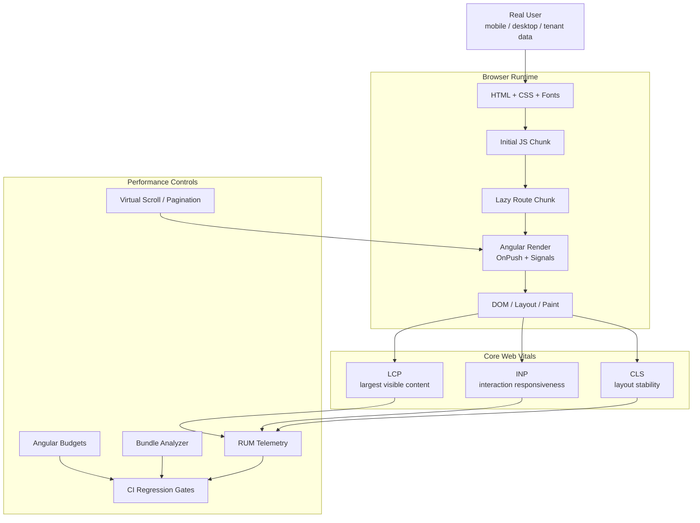

## Table of Contents

[🧠 **View Interactive Mindmap**](./performance-core-web-vitals-mindmap.md)

1. [TL;DR](#tldr)
2. [Deep Dive](#deep-dive)
   2.1 [Core Web Vitals Strategy](#core-web-vitals-strategy)
      2.1.1 [Largest Contentful Paint](#largest-contentful-paint)
      2.1.2 [Interaction to Next Paint](#interaction-to-next-paint)
      2.1.3 [Cumulative Layout Shift](#cumulative-layout-shift)
      2.1.4 [Field Data, Lab Data, and Budgets](#field-data-lab-data-and-budgets)
   2.2 [Loading Architecture](#loading-architecture)
      2.2.1 [Lazy Loading and Route-Level Code Splitting](#lazy-loading-and-route-level-code-splitting)
      2.2.2 [Bundle Analysis and Budgets](#bundle-analysis-and-budgets)
      2.2.3 [Critical Rendering Path](#critical-rendering-path)
   2.3 [Runtime Rendering Architecture](#runtime-rendering-architecture)
      2.3.1 [OnPush Change Detection](#onpush-change-detection)
      2.3.2 [Signals and Computed State](#signals-and-computed-state)
      2.3.3 [Virtual Scrolling](#virtual-scrolling)
   2.4 [Asset and Layout Stability](#asset-and-layout-stability)
      2.4.1 [Image and Font Optimization](#image-and-font-optimization)
      2.4.2 [Skeletons, Reserved Space, and Stable Layout](#skeletons-reserved-space-and-stable-layout)
      2.4.3 [Animations, Transitions, and Compositing](#animations-transitions-and-compositing)
   2.5 [Operational Performance Governance](#operational-performance-governance)
      2.5.1 [Measurement Workflow](#measurement-workflow)
      2.5.2 [Performance Regression Gates](#performance-regression-gates)
      2.5.3 [FinTech Performance Risk Model](#fintech-performance-risk-model)
3. [Architecture & Data Flow](#architecture--data-flow)
4. [Real-World Examples](#real-world-examples)
   4.1 [Lazy Route Splitting in portal-web](#lazy-route-splitting-in-portal-web)
   4.2 [Borrower Portal Wizard Code Splitting](#borrower-portal-wizard-code-splitting)
   4.3 [Angular Production Budgets](#angular-production-budgets)
   4.4 [OnPush and Signals in DataTable](#onpush-and-signals-in-datatable)
   4.5 [TransferList Virtual Scrolling](#transferlist-virtual-scrolling)
   4.6 [Planned Web Vitals RUM Instrumentation](#planned-web-vitals-rum-instrumentation)
   4.7 [Planned Bundle Analysis Workflow](#planned-bundle-analysis-workflow)
5. [Comparison Tables](#comparison-tables)
6. [Interview Q&A](#interview-qa)
   6.1 [L1: Junior Knowledge](#l1-junior-knowledge)
      6.1.1 [What Are Core Web Vitals?](#what-are-core-web-vitals)
      6.1.2 [What Is Lazy Loading?](#what-is-lazy-loading)
   6.2 [L2: Mid-Level Knowledge](#l2-mid-level-knowledge)
      6.2.1 [How Do You Improve LCP?](#how-do-you-improve-lcp)
      6.2.2 [Why Use Virtual Scrolling?](#why-use-virtual-scrolling)
   6.3 [L3: Senior Knowledge](#l3-senior-knowledge)
      6.3.1 [How Do You Diagnose Poor INP?](#how-do-you-diagnose-poor-inp)
      6.3.2 [How Do OnPush and Signals Affect Performance?](#how-do-onpush-and-signals-affect-performance)
   6.4 [Staff: System Architecture](#staff-system-architecture)
      6.4.1 [Design Performance Governance for tai-portal](#design-performance-governance-for-tai-portal)
7. [Cross-References](#cross-references)
8. [Further Reading](#further-reading)

---

## TL;DR

<span style="color: #33b5e5; font-weight: bold;">Core Web Vitals</span> are the user-centered frontend performance metrics that matter most in modern web apps: <span style="color: #33b5e5; font-weight: bold;">LCP</span> measures loading, <span style="color: #33b5e5; font-weight: bold;">INP</span> measures responsiveness, and <span style="color: #33b5e5; font-weight: bold;">CLS</span> measures layout stability. In 2026, the standard target is the 75th percentile of real user page loads on mobile and desktop: LCP at or below 2.5 seconds, INP at or below 200 ms, and CLS at or below 0.1. `tai-portal` already has several strong foundations: Angular route-level lazy loading, production bundle budgets, `OnPush` design-system components, signals for derived state, and CDK virtual scrolling for large transfer lists. The missing production-grade layer is <span style="color: #00C851; font-weight: bold;">closed-loop measurement</span>: field data, bundle analysis, performance budgets in CI, and clear regression ownership. <span style="color: #ff4444; font-weight: bold;">The senior failure mode is optimizing what is easy to see in code while ignoring what real users experience on slow devices, weak networks, and large tenant datasets</span>.

---

## Deep Dive

### Core Web Vitals Strategy

#### Largest Contentful Paint

##### What
<span style="color: #33b5e5; font-weight: bold;">Largest Contentful Paint</span> measures when the largest visible content element in the viewport finishes rendering. It usually represents the user's first meaningful sense that the page has loaded.

##### Why
Without good LCP, the app feels slow before the user interacts with it. In a portal, the LCP element might be the login panel, dashboard title, claim wizard shell, hero text, or a large data surface. A slow LCP is often caused by too much JavaScript, blocking CSS, slow API-dependent first render, delayed fonts, or unoptimized images.

##### How
The standard LCP target is:

```text
Good:        <= 2.5s
Needs work: <= 4.0s
Poor:        > 4.0s
Measured at the 75th percentile, separately for mobile and desktop.
```

Senior debugging starts by identifying the actual LCP element in Chrome DevTools or Lighthouse. Then isolate the cause:

- server or CDN slow to return HTML
- JavaScript bundle too large before first render
- route chunk or auth configuration blocking the view
- CSS or fonts delaying text paint
- image not prioritized or missing dimensions
- app waits for non-critical data before rendering structure

##### When
Prioritize LCP for unauthenticated entry pages, identity flows, borrower claim start pages, dashboards, and any screen where a slow first render undermines trust. Do not over-optimize LCP on screens only reached after heavy user interaction unless field data says they are high traffic.

##### Trade-offs
<span style="color: #ffbb33; font-weight: bold;">Improving LCP often moves work later.</span> Lazy loading and deferred hydration can make first paint faster while pushing work into interaction time, which can hurt INP if not designed carefully.

---

#### Interaction to Next Paint

##### What
<span style="color: #33b5e5; font-weight: bold;">Interaction to Next Paint</span> measures responsiveness by observing user interactions and reporting how long the browser takes to present the next visual update. INP replaced First Input Delay as a Core Web Vital because it evaluates responsiveness across the page lifecycle, not just the first interaction.

##### Why
Without good INP, users click, type, select, or submit and the UI feels stuck. For a FinTech portal, poor responsiveness can make users double-submit, abandon claim steps, mistrust confirmation dialogs, or think an approval action failed.

##### How
The standard INP target is:

```text
Good:        <= 200ms
Needs work: <= 500ms
Poor:        > 500ms
Measured at the 75th percentile, separately for mobile and desktop.
```

INP is affected by:

- long JavaScript tasks on the main thread
- expensive Angular change detection
- large DOM updates
- synchronous filtering/sorting of large arrays
- slow event handlers
- rendering too many table rows or list items
- third-party scripts

The fix is usually to reduce main-thread work: split expensive tasks, virtualize long lists, use server-side pagination, narrow reactive dependencies, avoid unnecessary component checks, and keep event handlers small.

##### When
Prioritize INP for data tables, transfer lists, forms, menus, approval actions, notification panels, and any workflow where the user performs repeated actions. Do not treat loading performance as success if interactions remain sluggish after the first render.

##### Trade-offs
<span style="color: #ff4444; font-weight: bold;">The common anti-pattern is hiding work behind spinners while still blocking the main thread.</span> A loading state only helps if the browser can actually paint it before expensive work runs.

---

#### Cumulative Layout Shift

##### What
<span style="color: #33b5e5; font-weight: bold;">Cumulative Layout Shift</span> measures unexpected visual movement during the page lifecycle. It is a stability metric, not a speed metric.

##### Why
Without good CLS, users click the wrong button, lose context while reading, or see content jump after data loads. In a borrower or admin workflow, layout instability can become a real correctness risk when buttons, form fields, and destructive actions move.

##### How
The standard CLS target is:

```text
Good:        <= 0.1
Needs work: <= 0.25
Poor:        > 0.25
Measured at the 75th percentile, separately for mobile and desktop.
```

CLS prevention is mostly layout discipline:

- reserve image dimensions
- reserve skeleton and loading-state dimensions
- avoid injecting banners above existing content without reserved space
- use stable table and list containers
- avoid late-loading fonts that change metrics dramatically
- animate `transform` and `opacity`, not layout dimensions

##### When
Prioritize CLS on forms, dashboards, data tables, modals, top navigation, and claim steps. For data-heavy UIs, reserve the shape of the content before data arrives.

##### Trade-offs
<span style="color: #ffbb33; font-weight: bold;">Stable layout can require showing less content initially.</span> A skeleton with fixed dimensions is sometimes better than optimistically rendering partial content that shifts when real data arrives.

---

#### Field Data, Lab Data, and Budgets

##### What
<span style="color: #33b5e5; font-weight: bold;">Field data</span> measures real users. <span style="color: #33b5e5; font-weight: bold;">Lab data</span> measures controlled test runs. <span style="color: #33b5e5; font-weight: bold;">Performance budgets</span> define acceptable limits for bundle size, metrics, and regressions.

##### Why
Without field data, teams optimize the developer laptop. Without lab data, teams lack repeatable regression checks. Without budgets, performance degrades one dependency, route, or component at a time.

##### How
A mature workflow combines:

- real-user monitoring for LCP, INP, CLS, device, connection, route, tenant shape, and app version
- Lighthouse or Playwright trace checks for repeatable lab baselines
- Angular/Nx bundle budgets for build-time size control
- bundle analyzer reports for route chunk ownership
- code review rules for images, tables, animations, and heavy dependencies

##### When
Use field data for product decisions and incident triage. Use lab data for CI and pull-request regression checks. Use budgets everywhere, even when the app is still a POC, because budgets create habits before the app grows.

##### Trade-offs
<span style="color: #ffbb33; font-weight: bold;">Field data has privacy and sampling costs.</span> A FinTech app should avoid collecting sensitive route parameters, claim identifiers, user-entered values, or tenant-specific secrets in performance telemetry.

---

### Loading Architecture

#### Lazy Loading and Route-Level Code Splitting

##### What
<span style="color: #33b5e5; font-weight: bold;">Lazy loading</span> delays downloading and executing code until a route or feature is needed. <span style="color: #33b5e5; font-weight: bold;">Code splitting</span> breaks the JavaScript bundle into smaller chunks.

##### Why
Without lazy loading, users pay the download, parse, compile, and execution cost for every feature at startup. In `tai-portal`, an unauthenticated registration flow should not load admin privilege detail code, and a borrower claim first step should not eagerly load every later wizard step.

##### How
Angular standalone routes make route-level code splitting straightforward:

```typescript
{
  path: 'admin/privileges',
  loadComponent: () =>
    import('./features/privileges/privileges.page').then((m) => m.PrivilegesPage),
}
```

The browser downloads the route chunk only when navigation requires it. The key senior concern is chunk quality: lazy loading helps when split points match product workflows and avoid shared dependencies pulling everything back into the initial chunk.

##### When
Use route-level lazy loading for feature pages, admin sections, onboarding steps, borrower wizard steps, mock viewers, and rarely used settings. Avoid tiny split points that create many network requests without meaningful size savings.

##### Trade-offs
<span style="color: #ffbb33; font-weight: bold;">Lazy loading can delay later navigation.</span> For high-probability next steps, add preloading or predictive fetching after the initial page becomes interactive.

---

#### Bundle Analysis and Budgets

##### What
<span style="color: #33b5e5; font-weight: bold;">Bundle analysis</span> explains what code is inside initial and lazy chunks. <span style="color: #33b5e5; font-weight: bold;">Angular budgets</span> fail or warn builds when bundles or component styles exceed configured limits.

##### Why
Without bundle analysis, performance regressions become guesses. A single charting library, date library, PDF library, WYSIWYG editor, or duplicated dependency can silently add hundreds of kilobytes to the initial route.

##### How
`tai-portal` apps already define production budgets:

```json
"budgets": [
  {
    "type": "initial",
    "maximumWarning": "500kb",
    "maximumError": "1mb"
  },
  {
    "type": "anyComponentStyle",
    "maximumWarning": "4kb",
    "maximumError": "8kb"
  }
]
```

Planned hardening should add a repeatable bundle-analysis target per app that emits stats and publishes an artifact in CI. The analysis should answer:

- what is in the initial chunk?
- which lazy chunk owns a heavy dependency?
- did a design-system import accidentally include unused organisms?
- did a PDF/signing dependency leak into the login route?

##### When
Run bundle analysis when budgets fail, before adding heavy libraries, before merging a design-system dependency, and before shipping routes that use PDF, document signing, charts, maps, or rich text.

##### Trade-offs
<span style="color: #ff4444; font-weight: bold;">Budget numbers are not performance metrics by themselves.</span> A small bundle can still have poor INP, and a larger bundle can be acceptable if it is lazy, cached, and not on critical routes.

---

#### Critical Rendering Path

##### What
The <span style="color: #33b5e5; font-weight: bold;">critical rendering path</span> is the sequence of work needed before the browser can render useful pixels: HTML, CSS, fonts, JavaScript, route activation, first data, and paint.

##### Why
Without understanding the critical path, teams add abstractions that block first render: auth initialization, config calls, global stores, route guards, CSS generation, and API fetches can all delay the first meaningful view.

##### How
For Angular apps, the critical path includes:

- `index.html`
- global CSS
- app bootstrap
- router configuration
- guards and resolvers
- initial route chunk
- above-the-fold component render
- required first data

The senior pattern is to render stable shell structure early, then fill data progressively. Non-critical panels, lists, and secondary actions should not block the user's first useful view.

##### When
Review the critical path when LCP is poor, startup CPU is high, auth changes are made, or a route begins importing large dependencies. Do not block first render on data that can load after the page structure appears.

##### Trade-offs
<span style="color: #ffbb33; font-weight: bold;">Progressive rendering adds state design.</span> Empty, loading, partial, stale, and error states must be deliberate, not accidental.

---

### Runtime Rendering Architecture

#### OnPush Change Detection

##### What
<span style="color: #33b5e5; font-weight: bold;">ChangeDetectionStrategy.OnPush</span> narrows when Angular checks a component: input reference changes, events in the component, async emissions, signals, and explicit marks trigger updates.

##### Why
Without bounded change detection, large screens can re-check far more components than the user interaction requires. This hurts INP, especially in tables, menus, sidebars, forms, and dashboards.

##### How
`tai-portal` design-system components such as `DataTableComponent`, `AppShellComponent`, `InputComponent`, `ButtonComponent`, `DropdownMenuComponent`, and `TransferListComponent` use `OnPush`. This makes reusable components safer to place inside high-traffic screens.

```typescript
@Component({
  selector: 'tai-data-table',
  changeDetection: ChangeDetectionStrategy.OnPush,
})
export class DataTableComponent<T> {
  public readonly data = input.required<T[]>();
  public readonly displayedColumns = computed(() =>
    this.columns().map((c) => c.id),
  );
}
```

##### When
Use `OnPush` by default for design-system and feature components. Avoid mutating input arrays or objects in place because OnPush relies on reference changes for input-driven updates.

##### Trade-offs
<span style="color: #ff4444; font-weight: bold;">OnPush is not a magic speed switch.</span> If a component still renders thousands of DOM nodes or does heavy synchronous work in event handlers, INP will still suffer.

---

#### Signals and Computed State

##### What
<span style="color: #33b5e5; font-weight: bold;">Signals</span> are Angular's fine-grained reactive state primitive. `computed` derives values from signals and only recalculates when its dependencies change.

##### Why
Without explicit derived state, templates often call methods repeatedly, recompute arrays on every check, or scatter duplicate state across components. Signals make dependency relationships clearer and can reduce unnecessary work.

##### How
`DataTableComponent` derives displayed columns, pagination summary, and total pages with `computed`. `TransferListComponent` derives filtered available and assigned lists from current assigned ids and debounced search terms.

```typescript
public readonly totalPages = computed(() =>
  Math.ceil(this.totalCount() / this.pageSize()),
);
```

This is better than recalculating in template methods because the dependency graph is explicit.

##### When
Use signals for local component state, derived UI values, and reactive design-system internals. Use RxJS for event streams, cancellation, backpressure, and external async sources. Use stores for shared workflow state.

##### Trade-offs
<span style="color: #ffbb33; font-weight: bold;">Computed values can still be expensive.</span> If a `computed` filters 20,000 rows on every keystroke, the app still has a main-thread problem; use debouncing, server-side filtering, indexes, workers, or virtualization.

---

#### Virtual Scrolling

##### What
<span style="color: #33b5e5; font-weight: bold;">Virtual scrolling</span> renders only the visible subset of a long list while preserving the illusion of a larger scrollable list.

##### Why
Without virtualization, large lists create too many DOM nodes, too many Angular bindings, and too much layout work. This damages INP and memory usage, especially in admin screens and transfer controls.

##### How
`libs/ui/design-system/src/lib/organisms/transfer-list/transfer-list.html` uses `cdk-virtual-scroll-viewport` for both available and assigned lists:

```html
<cdk-virtual-scroll-viewport
  [itemSize]="density() === 'compact' ? 32 : 44"
  class="flex-1 h-64 outline-none custom-scrollbar"
>
  <li *cdkVirtualFor="let item of availableItems(); trackBy: trackByFn()">
    ...
  </li>
</cdk-virtual-scroll-viewport>
```

The fixed `itemSize`, viewport height, and `trackBy` are important. They let CDK estimate scroll geometry and reuse DOM efficiently.

##### When
Use virtual scrolling for lists with hundreds or thousands of rows where the user scans or transfers items. Use server-side pagination for business tables where filtering, sorting, authorization, and total counts belong on the server.

##### Trade-offs
<span style="color: #ffbb33; font-weight: bold;">Virtual scrolling complicates accessibility and testing.</span> Not every item exists in the DOM at once, so keyboard navigation, screen-reader expectations, find-in-page, and E2E selectors need deliberate handling.

---

### Asset and Layout Stability

#### Image and Font Optimization

##### What
Image and font optimization reduces render-blocking work, reserves layout space, and ensures important visual assets load with the right priority.

##### Why
Images and fonts are frequent LCP and CLS causes. A user avatar, logo, hero image, document preview, or signature asset can delay meaningful paint or shift layout if dimensions are unknown.

##### How
The repository has an avatar image path in `UserProfileComponent`, but no current use of Angular `NgOptimizedImage`, `ngSrc`, `priority`, or explicit Core Web Vitals image policy. A tai-portal plan should include:

- use `NgOptimizedImage` for important above-the-fold images
- set width and height or aspect ratio for every image
- use `priority` only for the actual LCP image
- lazy-load non-critical images
- avoid remote image URLs unless they pass CSP and privacy review
- set `font-display` policy for any custom fonts

##### When
Use image optimization for login branding, dashboards, borrower document previews, avatars, and any future marketing or product hero content. Skip complex image pipelines for purely text-based admin pages unless a real LCP element demands it.

##### Trade-offs
<span style="color: #ffbb33; font-weight: bold;">Priority is scarce.</span> Marking too many images as high priority makes all of them less useful and can delay scripts or CSS.

---

#### Skeletons, Reserved Space, and Stable Layout

##### What
Skeletons and reserved space keep the page geometry stable while data loads. They prevent late content from pushing controls around.

##### Why
Without reserved space, loading states can be smaller than loaded states, tables can push pagination down, and alert banners can move submit buttons. That creates CLS and can cause accidental clicks.

##### How
`DataTableComponent` has a `loading` state and component styles with a minimum table container height. `TransferListComponent` uses fixed viewport heights and minimum list heights. These are good layout-stability patterns because loading, empty, and populated states occupy predictable space.

Good pattern:

```scss
.data-table-container {
  min-height: 200px;
}
```

Better production pattern:

- define min heights for each reusable component state
- keep pagination, headers, and action bars stable
- reserve alert/banner space if they appear after async checks
- avoid replacing a full page with a tiny spinner

##### When
Use reserved space for tables, cards, forms, document previews, modals, and claim wizard steps. For very small inline controls, avoid skeletons if they add visual noise.

##### Trade-offs
<span style="color: #ffbb33; font-weight: bold;">Skeletons can become misleading if they imply faster loading than the system can deliver.</span> Pair them with real loading/error states and timeouts.

---

#### Animations, Transitions, and Compositing

##### What
Animation performance depends on which CSS properties change. `transform` and `opacity` are typically compositor-friendly; layout-affecting properties such as `width`, `height`, `top`, and `left` can trigger layout and paint work.

##### Why
Without animation discipline, small UI polish can damage INP. A dropdown, sidebar, toast, notification panel, or transfer-list movement can feel sluggish if it forces layout during interaction.

##### How
Use this hierarchy:

- prefer `transform` and `opacity`
- keep transition scopes narrow
- avoid animating layout dimensions in repeated list items
- respect reduced-motion preferences
- test interactions on slower CPU profiles

`tai-portal` uses many Tailwind `transition-all` classes. That is convenient but broad; a planned hardening pass should replace high-traffic `transition-all` usage with targeted transitions such as `transition-colors`, `transition-opacity`, or `transition-transform`.

##### When
Review animations for menus, sidebars, notification panels, dialogs, transfer lists, and submit buttons. Avoid animation work during critical typing or high-frequency interactions.

##### Trade-offs
<span style="color: #ff4444; font-weight: bold;">The anti-pattern is animating everything because it looks smooth on a developer machine.</span> Performance reviews should include CPU throttling and keyboard interaction, not only visual inspection.

---

### Operational Performance Governance

#### Measurement Workflow

##### What
A performance measurement workflow turns vague "the app feels slow" reports into reproducible evidence, hypotheses, fixes, and regression checks.

##### Why
Without workflow, teams either over-optimize low-impact code or repeatedly fix symptoms. A FinTech portal needs route-level and workflow-level evidence because performance affects trust, completion, and operational throughput.

##### How
Use a repeatable loop:

1. Capture field data: route, metric, percentile, device class, app version.
2. Reproduce in lab: Chrome Performance panel, Lighthouse, Playwright trace.
3. Identify bottleneck: network, bundle, main thread, layout, API, rendering.
4. Fix one hypothesis.
5. Verify field and lab deltas.
6. Add a regression guard.

For tai-portal, planned RUM should tag metrics by app (`identity-ui`, `portal-web`, `borrower-portal`), route pattern, build version, and coarse device class.

##### When
Use this workflow for every performance issue that affects a user workflow. For small local cleanups, still state what metric the change is expected to improve.

##### Trade-offs
<span style="color: #ffbb33; font-weight: bold;">Measurement requires operational plumbing.</span> The cost is justified when the same frontend serves multiple tenants, roles, and workflows.

---

#### Performance Regression Gates

##### What
Performance regression gates stop size, metric, and interaction regressions from merging unnoticed.

##### Why
Without gates, every feature can add a small amount of JavaScript, CSS, DOM, and main-thread work until the app is slow. By the time users complain, the root cause is often spread across months of changes.

##### How
Practical gates for tai-portal:

- keep existing Angular production budgets
- add bundle analyzer artifacts for affected apps
- add Lighthouse or Playwright performance smoke checks for key routes
- add Storybook interaction tests for heavy design-system components
- add component-level tests for virtual scroll and table rendering behavior
- require a performance note for heavy dependencies

##### When
Apply strict gates to identity, borrower claim, admin list/detail routes, and design-system components. Use softer advisory budgets for experimental mock apps until they become product surfaces.

##### Trade-offs
<span style="color: #ffbb33; font-weight: bold;">Strict gates can slow delivery if thresholds are arbitrary.</span> Start with baselines, then ratchet toward targets route by route.

---

#### FinTech Performance Risk Model

##### What
A FinTech performance risk model treats speed, responsiveness, and stability as product and control risks, not only engineering polish.

##### Why
Slow or unstable interfaces can produce duplicate submissions, abandoned onboarding, missed approvals, inaccessible workflows, and support incidents. Performance also intersects with security because heavy client code can hide unsafe dependency growth and third-party scripts.

##### How
Classify frontend surfaces:

- **Critical:** sign-in, MFA, claim submission, document signing, approval actions
- **High:** admin tables, user management, privilege management, notification workflows
- **Medium:** dashboards, read-only details, reports
- **Low:** internal mocks and diagnostics

Critical and high surfaces should have field metrics, lab checks, bundle review, accessibility checks, and rollback readiness.

##### When
Use this model during planning and code review. A slow internal mock is acceptable; a slow sign-in or signing flow is not.

##### Trade-offs
<span style="color: #ffbb33; font-weight: bold;">Not every route deserves the same performance budget.</span> A document-signing route may load heavier libraries, but those libraries must stay out of sign-in and claim-start chunks.

---

## Architecture & Data Flow



---

## Real-World Examples

### Lazy Route Splitting in portal-web

📍 From tai-portal: `apps/portal-web/src/app/app.routes.ts`

`portal-web` lazy-loads onboarding, privilege, and user pages with `loadComponent`. This keeps admin code out of unrelated startup paths.

```typescript
{
  path: 'admin/privileges',
  loadComponent: () =>
    import('./features/privileges/privileges.page').then((m) => m.PrivilegesPage),
  canActivate: [authGuard, privilegeGuard],
  data: { requiredPrivilege: 'Portal.Privileges.Read' },
}
```

Performance implication: route chunks should be reviewed so privilege-management dependencies do not leak into registration or sign-in paths.

### Borrower Portal Wizard Code Splitting

📍 From tai-portal: `apps/borrower-portal/src/app/app.routes.ts`

The borrower claim wizard keeps the shell eager but lazy-loads each step component:

```typescript
{
  path: 'medical-providers',
  loadComponent: () =>
    import('./claim/medical-providers/medical-providers.component').then(
      (m) => m.MedicalProvidersComponent,
    ),
  data: { step: 3 },
  canActivate: [claimStepGuard],
}
```

This matches workflow probability: users start at borrower info, then progressively load later steps. The note in the route file correctly calls out that claim state is eager because the draft-load effect initializes from API and encrypted session fallback.

### Angular Production Budgets

📍 From tai-portal: `apps/portal-web/project.json`, `apps/identity-ui/project.json`, `apps/borrower-portal/project.json`, `apps/docviewer-mock/project.json`

The apps use initial and component-style budgets:

```json
{
  "type": "initial",
  "maximumWarning": "500kb",
  "maximumError": "1mb"
}
```

This is a useful baseline. Planned hardening: add per-route chunk review, analyzer artifacts, and a process for approving budget changes when a heavy feature is justified.

### OnPush and Signals in DataTable

📍 From tai-portal: `libs/ui/design-system/src/lib/organisms/data-table/data-table.ts`

`DataTableComponent` combines `OnPush`, signal inputs, and computed derived values:

```typescript
changeDetection: ChangeDetectionStrategy.OnPush

public readonly displayedColumns = computed(() => {
  const cols = this.columns().map((c) => c.id);
  if (this.actions().length > 0) {
    cols.push('actions');
  }
  return cols;
});
```

This is a good design-system pattern because the component can be reused in high-traffic admin pages without forcing broad change detection. For very large datasets, the table should continue using server-side pagination rather than trying to render every row.

### TransferList Virtual Scrolling

📍 From tai-portal: `libs/ui/design-system/src/lib/organisms/transfer-list/transfer-list.html`

`TransferListComponent` uses CDK virtual scroll for both sides of a transfer list:

```html
<cdk-virtual-scroll-viewport
  [itemSize]="density() === 'compact' ? 32 : 44"
  class="flex-1 h-64 outline-none custom-scrollbar"
>
  <li *cdkVirtualFor="let item of availableItems(); trackBy: trackByFn()">
    ...
  </li>
</cdk-virtual-scroll-viewport>
```

This protects INP and memory when assigning many privileges or items. The accessibility and keyboard behavior must stay covered because virtualization changes what exists in the DOM.

### Planned Web Vitals RUM Instrumentation

🔧 Fits tai-portal: all Angular apps

No current `web-vitals` or equivalent RUM instrumentation appears in `apps` or `libs`. Add a small frontend telemetry module:

```typescript
import { onCLS, onINP, onLCP } from 'web-vitals';

export function registerWebVitals(appName: string, version: string): void {
  const report = (metric: Metric) => {
    navigator.sendBeacon(
      '/api/telemetry/web-vitals',
      JSON.stringify({
        appName,
        version,
        route: location.pathname.replace(/[0-9a-f-]{20,}/gi, ':id'),
        name: metric.name,
        value: metric.value,
        rating: metric.rating,
        navigationType: metric.navigationType,
      }),
    );
  };

  onLCP(report);
  onINP(report);
  onCLS(report);
}
```

Implementation rules:

- never send claim ids, user ids, emails, or raw query strings
- sample if volume is high
- tag app name and build version
- aggregate by route pattern and device class
- alert on 75th percentile regressions

### Planned Bundle Analysis Workflow

🔧 Fits tai-portal: Nx Angular apps

No bundle-analysis script is currently defined in `package.json`. Add an Nx-compatible workflow that builds production artifacts with stats, then publishes analyzer output for affected apps.

Implementation plan:

- add `statsJson` or equivalent builder support per app where available
- add a `bundle-analyze:<app>` target or script
- store analyzer HTML as CI artifact
- review analyzer output for heavy dependencies before adding libraries
- require justification if initial bundle budget changes

This is especially important before adding PDF, DocuSign, document preview, charting, or rich editor dependencies.

---

## Comparison Tables

| Dimension | LCP | INP | CLS |
|-----------|-----|-----|-----|
| **Measures** | Loading speed | Interaction responsiveness | Layout stability |
| **Good threshold** | <= 2.5s | <= 200ms | <= 0.1 |
| **Common cause** | Large JS, slow CSS/fonts, slow hero/image | Long tasks, heavy handlers, too much DOM | Missing dimensions, late content, banners |
| **Primary tools** | Lighthouse, DevTools, RUM | Performance panel, Long Tasks, RUM | Layout shift debug overlay, RUM |
| **tai-portal focus** | Sign-in, claim start, dashboards | tables, forms, transfer lists | forms, tables, wizard steps |

| Dimension | Lazy Loading | Eager Loading |
|-----------|--------------|---------------|
| **Mental model** | Load when feature is needed | Load at startup |
| **Best use case** | feature routes, admin pages, wizard steps | app shell, critical state, shared tiny utilities |
| **Performance benefit** | smaller initial JS | faster later navigation |
| **Risk** | delayed first visit to lazy route | bloated LCP/startup |
| **tai-portal choice** | lazy route components | eager borrower claim state initialization |

| Dimension | OnPush | Signals | Virtual Scroll |
|-----------|--------|---------|----------------|
| **Solves** | broad component checking | explicit reactive derivation | excessive DOM nodes |
| **Best for** | reusable components | local and derived UI state | large visible collections |
| **Does not solve** | huge DOM or long handlers | expensive computations by itself | server-side filtering/sorting |
| **Gotcha** | input mutation breaks expectations | computed can still be expensive | accessibility and testing complexity |
| **tai-portal example** | `DataTableComponent` | `computed` summaries and classes | `TransferListComponent` |

---

## Interview Q&A

### L1: Junior Knowledge

#### What Are Core Web Vitals?
**Difficulty:** L1 (Junior)

**Question:** What are Core Web Vitals?

**Answer:** <span style="color: #33b5e5; font-weight: bold;">Core Web Vitals</span> are Google's user-centered web performance metrics: LCP for loading, INP for responsiveness, and CLS for visual stability. They are usually evaluated at the 75th percentile across real mobile and desktop users.

---

#### What Is Lazy Loading?
**Difficulty:** L1 (Junior)

**Question:** What is lazy loading in Angular?

**Answer:** Lazy loading means code for a route or feature is downloaded only when the user needs it. In Angular standalone routing, `loadComponent` creates a route-level split point.

---

### L2: Mid-Level Knowledge

#### How Do You Improve LCP?
**Difficulty:** L2 (Mid-Level)

**Question:** How do you improve poor LCP?

**Answer:** First identify the actual LCP element in DevTools or RUM. Then reduce the work needed before that element paints: shrink initial JavaScript, lazy-load non-critical routes, optimize critical CSS and fonts, prioritize the real LCP image, and render page structure before non-critical data. <span style="color: #ffbb33; font-weight: bold;">Do not blindly defer everything</span>, because moving work later can hurt INP.

---

#### Why Use Virtual Scrolling?
**Difficulty:** L2 (Mid-Level)

**Question:** Why use virtual scrolling for large lists?

**Answer:** Virtual scrolling keeps only visible rows in the DOM, reducing memory, binding work, layout cost, and interaction latency. It is appropriate for large lists where the user scans or selects items, but business tables often still need server-side pagination, sorting, and filtering.

---

### L3: Senior Knowledge

#### How Do You Diagnose Poor INP?
**Difficulty:** L3 (Senior)

**Question:** A user reports that the admin table feels slow when clicking sort and row actions. How do you diagnose it?

**Answer:** I would first confirm with field data whether INP is poor on that route and whether it is device-specific or data-size-specific. Then I would capture a Chrome Performance trace around the interaction and look for long tasks, expensive event handlers, layout thrashing, and large Angular rendering work. I would check whether sorting/filtering is happening client-side over large arrays, whether too many rows are rendered, and whether row actions trigger broad state changes. The likely fixes are server-side pagination/sorting, virtual scrolling where appropriate, narrower signal dependencies, `trackBy`, and reducing synchronous work in handlers. <span style="color: #ff4444; font-weight: bold;">I would not accept a spinner-only fix</span> unless the spinner can paint before the expensive work starts.

---

#### How Do OnPush and Signals Affect Performance?
**Difficulty:** L3 (Senior)

**Question:** How do `OnPush` and signals improve Angular performance, and where do they not help?

**Answer:** `OnPush` reduces unnecessary component checks by making updates depend on explicit triggers such as input reference changes, component events, async emissions, signals, and manual marking. Signals make local state and derived values explicit, so Angular can track dependencies more precisely and developers avoid repeated template method work. Together, they are excellent for reusable design-system components such as data tables, inputs, menus, and app shells. They do not fix large DOM size, long event handlers, expensive filtering, layout thrashing, or oversized bundles. <span style="color: #00C851; font-weight: bold;">The senior pattern is to combine OnPush/signals with data-size controls, lazy loading, and measurement</span>.

---

### Staff: System Architecture

#### Design Performance Governance for tai-portal
**Difficulty:** Staff

**Question:** Design a frontend performance governance system for `identity-ui`, `portal-web`, `borrower-portal`, and the shared design system.

**Answer:** I would define route-level performance budgets for critical workflows: sign-in, registration, borrower claim start, claim submission, admin user list, privilege list, and document signing. Each app would keep Angular build budgets, and CI would publish bundle analyzer artifacts for affected Angular apps. RUM would collect LCP, INP, and CLS using sanitized route patterns, app name, build version, device class, and metric rating, with no PII or tenant secrets. Design-system components would require `OnPush`, stable layout states, Storybook interaction/a11y coverage, and performance notes for components that render lists, overlays, or animations. Heavy dependencies such as PDF, signing, charting, or rich text would need explicit route-chunk ownership and approval before merge. The governance loop would be baseline, monitor, regress, fix, and ratchet; <span style="color: #ff4444; font-weight: bold;">I would avoid arbitrary global thresholds that punish legitimate heavy routes while letting critical sign-in regressions slip through averages</span>.

---

## Cross-References

- [[Performance-Optimization]] - cross-stack performance principles and backend/database performance
- [[Angular-Core]] - standalone routes, DI, and Angular rendering model
- [[Change-Detection-Signals]] - signals, OnPush, and zoneless Angular context
- [[RxJS-Signals]] - observable/signal interop and reactive state boundaries
- [[Frontend-Data-Structures]] - Map/Set/list trade-offs for frontend performance
- [[Testing-Frontend]] - Playwright, Storybook, and frontend regression testing
- [[Nx-Monorepo]] - affected builds and workspace-level CI controls

---

## Further Reading

- web.dev Core Web Vitals: `https://web.dev/articles/vitals`
- web.dev LCP: `https://web.dev/articles/lcp`
- web.dev INP: `https://web.dev/articles/inp`
- web.dev CLS: `https://web.dev/articles/cls`
- Angular Deferrable Views: `https://angular.dev/guide/templates/defer`
- Angular Image Optimization: `https://angular.dev/guide/image-optimization`
- Angular CDK Scrolling: `https://material.angular.dev/cdk/scrolling/overview`
