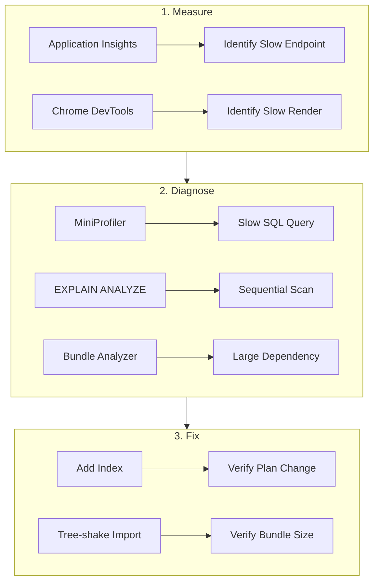

## Table of Contents

[🧠 **View Interactive Mindmap**](./performance-optimization-mindmap.md)

1. [TL;DR](#tldr)
2. [Deep Dive](#deep-dive)
   2.1 [Backend (.NET)](#concept-group-1-backend-net)
      2.1.1 [GC Generations & Server GC Mode](#1-gc-generations--server-gc-mode)
      2.1.2 [Span<T> & Zero-Allocation Patterns](#2-spant--zero-allocation-patterns)
      2.1.3 [BenchmarkDotNet — Measure Before Optimizing](#3-benchmarkdotnet--measure-before-optimizing)
   2.2 [Database](#concept-group-2-database)
      2.2.1 [Query Plan Analysis (EXPLAIN ANALYZE)](#4-query-plan-analysis-explain-analyze)
      2.2.2 [Index Strategies & Covering Indexes](#5-index-strategies--covering-indexes)
      2.2.3 [N+1 Detection & Connection Pooling](#6-n1-detection--connection-pooling)
   2.3 [Frontend](#concept-group-3-frontend)
      2.3.1 [Core Web Vitals — LCP, INP, CLS](#7-core-web-vitals--lcp-inp-cls)
      2.3.2 [Bundle Analysis & Tree Shaking](#8-bundle-analysis--tree-shaking)
      2.3.3 [Lazy Loading & Image Optimization](#9-lazy-loading--image-optimization)
   2.4 [Methodology](#concept-group-4-methodology)
      2.4.1 [Profiling Workflow — Measure → Hypothesize → Fix → Verify](#10-profiling-workflow--measure--hypothesize--fix--verify)
      2.4.2 [Load Testing & Performance Budgets](#11-load-testing--performance-budgets)
3. [Architecture & Data Flow](#architecture--data-flow)
4. [Real-World Examples](#real-world-examples)
   4.1 [BenchmarkDotNet — String vs Span Parsing](#1-benchmarkdotnet--string-vs-span-parsing)
   4.2 [EXPLAIN ANALYZE — Fixing a Slow Query](#2-explain-analyze--fixing-a-slow-query)
   4.3 [Angular Lazy Loading Route Config](#3-angular-lazy-loading-route-config)
5. [Comparison Tables](#comparison-tables)
6. [Interview Q&A](#interview-qa)
   6.1 [L1: Junior](#l1-junior-knowledge)
   6.2 [L2: Mid-Level](#l2-mid-level-knowledge)
   6.3 [L3: Senior](#l3-senior-knowledge)
   6.4 [Staff](#staff-system-architecture)
7. [Cross-References](#cross-references)
8. [Further Reading](#further-reading)

---

## TL;DR

Performance optimization follows one rule: <span style="color: #00C851; font-weight: bold;">measure first, optimize second</span>. On the backend, .NET 10's <span style="color: #33b5e5; font-weight: bold;">Server GC</span> and <span style="color: #33b5e5; font-weight: bold;">`Span<T>`/`Memory<T>`</span> zero-allocation patterns eliminate GC pressure in hot paths. On the database, <span style="color: #33b5e5; font-weight: bold;">`EXPLAIN ANALYZE`</span> reveals whether a query uses an index seek or a sequential scan, and <span style="color: #33b5e5; font-weight: bold;">covering indexes</span> serve queries entirely from the index without touching the heap. On the frontend, <span style="color: #33b5e5; font-weight: bold;">Core Web Vitals</span> (LCP < 2.5s, INP < 200ms, CLS < 0.1) are the metrics that matter, optimized via lazy loading, tree shaking, and image optimization. <span style="color: #ffbb33; font-weight: bold;">The key interview insight</span>: premature optimization is the root of all evil (Knuth), but knowing where to look when things are slow is what separates senior from mid-level engineers.

---

## Deep Dive

### Concept Group 1: Backend (.NET)

#### 1. GC Generations & Server GC Mode

##### What
.NET's <span style="color: #33b5e5; font-weight: bold;">garbage collector</span> uses generational collection: **Gen 0** (short-lived, collected frequently, ~1ms pause), **Gen 1** (survived one collection), **Gen 2** (long-lived, expensive to collect). <span style="color: #33b5e5; font-weight: bold;">Server GC</span> mode uses one heap per logical CPU core, enabling parallel collection with lower pause times.

##### Why
Without understanding GC, developers create allocation-heavy code (string concatenation in loops, LINQ `.ToList()` everywhere, boxing value types) that triggers frequent Gen 2 collections — each pausing all threads for 10-100ms. In a web server handling 1000 RPS, GC pauses directly impact P99 latency.

##### How

```csharp
// Workstation GC (default for console apps) — single heap, concurrent
// Server GC (default for ASP.NET Core) — per-core heaps, parallel
// Configure in .csproj:
<PropertyGroup>
    <ServerGarbageCollection>true</ServerGarbageCollection>
</PropertyGroup>
```

GC generations:
| Generation | Contains | Collection Frequency | Pause |
|---|---|---|---|
| **Gen 0** | New allocations (< ~85KB) | Very frequent (~100ms intervals) | <span style="color: #00C851; font-weight: bold;">~1ms</span> |
| **Gen 1** | Survived one Gen 0 collection | Moderate | ~5ms |
| **Gen 2** | Long-lived objects | Infrequent | <span style="color: #ff4444; font-weight: bold;">10-100ms</span> |
| **LOH** | Large objects (> 85KB) | With Gen 2 | Expensive, no compaction by default |

##### When
Measure GC impact with `dotnet-counters` or Application Insights before optimizing. If Gen 2 collections are frequent (>1/second) or pause times exceed 50ms, investigate allocation hot paths. Use `GC.GetGCMemoryInfo()` and `EventPipe` for detailed analysis.

##### Trade-offs
<span style="color: #ffbb33; font-weight: bold;">Server GC uses more memory</span> — one heap per core means N heaps instead of 1. On a 16-core server, memory usage can be 2-3x higher than Workstation GC. For memory-constrained containers, consider `GCHeapCount=4` to limit heaps. <span style="color: #ff4444; font-weight: bold;">Reducing allocations can make code harder to read</span> — `Span<T>` parsing is faster but more complex than `string.Split()`. Only optimize hot paths.

---

#### 2. Span<T> & Zero-Allocation Patterns

##### What
<span style="color: #33b5e5; font-weight: bold;">`Span<T>`</span> is a stack-only type that provides a view into contiguous memory without copying. <span style="color: #33b5e5; font-weight: bold;">`Memory<T>`</span> is its heap-safe sibling (can be stored in fields and used across `await`). Together, they enable <span style="color: #00C851; font-weight: bold;">zero-allocation string parsing, buffer manipulation, and data processing</span>.

##### Why
Without `Span<T>`, parsing a CSV line means: `string.Split()` allocates an array + N substrings, each substring allocates a new `char[]` on the heap. For a 100MB CSV, this creates millions of allocations that hammer the GC. With `Span<T>`, you slice into the original buffer — zero allocations.

##### How

```csharp
// Traditional — allocates array + substrings
string[] parts = line.Split(',');  // 5 allocations for "a,b,c,d,e"
var name = parts[0];               // Each part is a new string

// Span-based — zero allocations
ReadOnlySpan<char> span = line.AsSpan();
int comma = span.IndexOf(',');
ReadOnlySpan<char> name = span[..comma];  // Slice, no allocation
ReadOnlySpan<char> rest = span[(comma + 1)..];

// ArrayPool — rent/return buffers instead of allocating
var buffer = ArrayPool<byte>.Shared.Rent(4096);
try {
    var bytesRead = await stream.ReadAsync(buffer);
    ProcessData(buffer.AsSpan(0, bytesRead));
} finally {
    ArrayPool<byte>.Shared.Return(buffer);
}

// String interpolation handler (C# 10+) — zero-allocation logging
logger.LogInformation($"User {userId} approved by {adminId}");
// Compiler generates InterpolatedStringHandler — no string.Format allocation
```

##### When
Use `Span<T>` for: string parsing in hot paths, binary protocol parsing, buffer manipulation, and anywhere `string.Substring()` creates measurable GC pressure. <span style="color: #ff4444; font-weight: bold;">Don't use `Span<T>` everywhere</span> — it's stack-only (can't be stored in fields, can't cross `await` boundaries). Use `Memory<T>` when you need heap storage or async.

##### Trade-offs
<span style="color: #ffbb33; font-weight: bold;">`Span<T>` code is harder to read and debug</span> than `string` code. The allocation savings only matter in hot paths (request parsing, serialization, tight loops). For code that runs once per request, readability trumps performance — use regular strings.

---

#### 3. BenchmarkDotNet — Measure Before Optimizing

##### What
<span style="color: #33b5e5; font-weight: bold;">BenchmarkDotNet</span> is the standard .NET micro-benchmarking library. It runs code thousands of times, measures execution time, memory allocations, and GC collections, and produces statistically rigorous reports with confidence intervals.

##### Why
Without proper benchmarking, developers make performance changes based on intuition — "this should be faster." BenchmarkDotNet proves (or disproves) the hypothesis with data. It accounts for JIT warmup, GC interference, and statistical noise.

##### How

```csharp
[MemoryDiagnoser]  // Tracks allocations
[SimpleJob(RuntimeMoniker.Net100)]
public class ParsingBenchmarks {

    private readonly string _csv = "john,doe,admin,active,2026-01-15";

    [Benchmark(Baseline = true)]
    public string[] SplitApproach() {
        return _csv.Split(',');
    }

    [Benchmark]
    public void SpanApproach() {
        ReadOnlySpan<char> span = _csv.AsSpan();
        // Parse without allocation...
    }
}

// Results:
// |         Method |     Mean | Allocated |
// |--------------- |---------:|----------:|
// | SplitApproach  | 45.3 ns  |     168 B |
// | SpanApproach   |  8.7 ns  |       0 B |
```

##### When
Benchmark before and after any performance optimization. Benchmark candidate approaches before choosing one. <span style="color: #ff4444; font-weight: bold;">Never use `Stopwatch` for micro-benchmarks</span> — it doesn't account for JIT warmup, GC pauses, or statistical variance. BenchmarkDotNet handles all of this.

##### Trade-offs
<span style="color: #ffbb33; font-weight: bold;">Micro-benchmarks don't reflect real-world performance</span> — a method that's 5x faster in isolation might make zero difference in a request that takes 200ms. Always profile the full request path first (with Application Insights or dotnet-trace) to find the actual bottleneck before micro-benchmarking.

---

### Concept Group 2: Database

#### 4. Query Plan Analysis (EXPLAIN ANALYZE)

##### What
<span style="color: #33b5e5; font-weight: bold;">`EXPLAIN ANALYZE`</span> executes a PostgreSQL query and shows the execution plan — which indexes were used, how many rows were scanned, and where time was spent. It's the single most important database debugging tool.

##### Why
Without query plan analysis, a "slow query" is a black box. You guess: "maybe it needs an index?" and add indexes randomly. `EXPLAIN ANALYZE` shows exactly what PostgreSQL did — sequential scan (bad for large tables), index scan (good), nested loop join vs hash join, and actual vs estimated row counts.

##### How

```sql
-- Show the execution plan with actual timing
EXPLAIN (ANALYZE, BUFFERS, FORMAT TEXT)
SELECT u.id, u.email, u.status
FROM users u
WHERE u.tenant_id = '550e8400-e29b-41d4-a716-446655440000'
  AND u.status = 'Active'
ORDER BY u.created_at DESC
LIMIT 20;

-- BAD plan (sequential scan on 1M rows):
-- Seq Scan on users  (cost=0.00..25000.00 rows=200 width=64)
--   (actual time=0.05..450.32 rows=200 loops=1)
--   Filter: (tenant_id = '550e...' AND status = 'Active')
--   Rows Removed by Filter: 999800
--   Buffers: shared hit=15000

-- GOOD plan (index scan):
-- Index Scan using ix_users_tenant_status on users
--   (cost=0.42..8.44 rows=200 width=64)
--   (actual time=0.03..0.25 rows=200 loops=1)
--   Index Cond: (tenant_id = '550e...' AND status = 'Active')
--   Buffers: shared hit=5
```

Key metrics:
- **Seq Scan** on large table = <span style="color: #ff4444; font-weight: bold;">problem</span> (reads every row)
- **Index Scan** = <span style="color: #00C851; font-weight: bold;">good</span> (reads only matching rows)
- **Rows Removed by Filter** = wasted work (index would eliminate these)
- **Buffers: shared hit** = pages read from cache (lower = better)

##### When
Run `EXPLAIN ANALYZE` for any query taking >100ms. Run it for all new queries during development. Compare plans before and after adding indexes. <span style="color: #ff4444; font-weight: bold;">Remember: `EXPLAIN ANALYZE` actually executes the query</span> — don't run it on destructive queries (`DELETE`, `UPDATE`) without a transaction and rollback.

##### Trade-offs
<span style="color: #ffbb33; font-weight: bold;">Query plans depend on data distribution</span> — a plan that's optimal for 1000 rows may change for 1M rows. PostgreSQL's planner uses table statistics (`ANALYZE` command) to choose plans; stale statistics cause bad plans. Run `ANALYZE` after large data loads.

---

#### 5. Index Strategies & Covering Indexes

##### What
A <span style="color: #33b5e5; font-weight: bold;">B-tree index</span> enables O(log n) lookups instead of O(n) sequential scans. A <span style="color: #33b5e5; font-weight: bold;">covering index</span> (`INCLUDE`) adds non-key columns to the index leaf pages, enabling <span style="color: #00C851; font-weight: bold;">index-only scans</span> — the query is served entirely from the index without touching the table heap.

##### Why
Without indexes, every `WHERE` clause scans the entire table. Without covering indexes, PostgreSQL finds the row via the index but then does a heap fetch for each row to get the selected columns — the "table access by index ROWID" step that can dominate cost for large result sets.

##### How

```sql
-- Standard composite index — speeds up WHERE but still needs heap fetch
CREATE INDEX ix_users_tenant_status
ON users (tenant_id, status);

-- Covering index — includes columns needed by SELECT
CREATE INDEX ix_users_tenant_status_covering
ON users (tenant_id, status)
INCLUDE (email, created_at);

-- Now this query uses an Index Only Scan (no heap access):
SELECT email, created_at FROM users
WHERE tenant_id = '...' AND status = 'Active'
ORDER BY created_at DESC LIMIT 20;

-- Partial index — only indexes rows matching a condition
CREATE INDEX ix_users_pending
ON users (tenant_id, created_at)
WHERE status = 'PendingApproval';
-- Smaller index, faster for queries that filter on PendingApproval
```

EF Core index configuration:
```csharp
builder.HasIndex(u => new { u.TenantId, u.Status })
    .HasDatabaseName("ix_users_tenant_status");

// Covering index (EF Core 10)
builder.HasIndex(u => new { u.TenantId, u.Status })
    .IncludeProperties(u => new { u.Email, u.CreatedAt });
```

##### When
Add indexes for columns in `WHERE`, `JOIN`, and `ORDER BY` clauses. Use composite indexes when queries filter on multiple columns (leftmost prefix rule applies). Use covering indexes for frequent queries that select a small number of columns. Use partial indexes for queries that always include a specific filter.

##### Trade-offs
<span style="color: #ffbb33; font-weight: bold;">Every index slows writes</span> — INSERT, UPDATE, DELETE must update all affected indexes. A table with 10 indexes has 10x the write overhead. <span style="color: #ff4444; font-weight: bold;">Covering indexes increase index size</span> — including large columns (text, jsonb) inflates the index and can evict useful data from the buffer cache. Profile the actual write/read ratio before adding indexes.

---

#### 6. N+1 Detection & Connection Pooling

##### What
The <span style="color: #33b5e5; font-weight: bold;">N+1 problem</span>: loading a list of 100 users, then loading each user's roles in a separate query = 1 + 100 = 101 queries. <span style="color: #33b5e5; font-weight: bold;">Connection pooling</span> (PgBouncer) reuses database connections instead of creating a new TCP connection per request.

##### Why
N+1 is the #1 EF Core performance issue. Each round trip adds ~1ms of network latency — 100 queries = 100ms of pure network overhead. Connection pool exhaustion causes requests to queue, leading to cascading latency under load.

##### How

```csharp
// N+1 problem — 101 queries
var users = await _context.Users.ToListAsync();      // Query 1
foreach (var user in users) {
    var roles = user.Roles;  // Query 2..101 (lazy loading)
}

// Fix: Eager loading — 1 query with JOIN
var users = await _context.Users
    .Include(u => u.Roles)
    .ToListAsync();  // 1 query with LEFT JOIN

// Fix: Split query — 2 queries (avoids Cartesian explosion)
var users = await _context.Users
    .Include(u => u.Roles)
    .AsSplitQuery()
    .ToListAsync();  // 2 queries: SELECT users; SELECT roles WHERE userId IN (...)

// Fix: Explicit projection — only fetch what you need
var dtos = await _context.Users
    .Select(u => new UserDto {
        Id = u.Id,
        Email = u.Email,
        RoleCount = u.Roles.Count  // Translated to subquery
    })
    .ToListAsync();
```

N+1 detection:
```csharp
// Enable EF Core query logging for detection
optionsBuilder.LogTo(Console.WriteLine, LogLevel.Information)
    .EnableSensitiveDataLogging()  // Shows parameter values
    .EnableDetailedErrors();

// In production: use MiniProfiler or EF Core interceptors
// to count queries per request and alert on > threshold
```

##### When
Always use `.Include()` or `.Select()` projection instead of relying on lazy loading. Use `AsSplitQuery()` when joins produce Cartesian explosion (user with 10 roles and 10 permissions = 100 rows). Configure PgBouncer with `pool_mode=transaction` for connection pooling in production.

##### Trade-offs
<span style="color: #ffbb33; font-weight: bold;">`.Include()` with multiple collections causes Cartesian explosion</span> — `.Include(u => u.Roles).Include(u => u.Permissions)` returns `roles × permissions` rows per user. Use `AsSplitQuery()` or manual projection. <span style="color: #ffbb33; font-weight: bold;">PgBouncer in transaction mode doesn't support prepared statements</span> — use `Npgsql` with `Multiplexing=true` or `Pooling=true` instead.

---

### Concept Group 3: Frontend

#### 7. Core Web Vitals — LCP, INP, CLS

##### What
<span style="color: #33b5e5; font-weight: bold;">Core Web Vitals</span> are Google's metrics for user-perceived performance: **LCP** (Largest Contentful Paint — when the main content loads, target < 2.5s), **INP** (Interaction to Next Paint — input responsiveness, target < 200ms), **CLS** (Cumulative Layout Shift — visual stability, target < 0.1).

##### Why
Without measurable targets, "the page feels slow" is subjective and unactionable. Core Web Vitals give concrete, measurable goals that correlate with user satisfaction and SEO ranking. Google uses them as a ranking signal.

##### How

| Metric | What It Measures | Good | Needs Improvement | Poor |
|--------|-----------------|------|-------------------|------|
| **LCP** | Time to largest content element | < 2.5s | 2.5-4.0s | > 4.0s |
| **INP** | Worst-case interaction latency | < 200ms | 200-500ms | > 500ms |
| **CLS** | Layout shift score | < 0.1 | 0.1-0.25 | > 0.25 |

Common fixes:
- **LCP**: Preload critical images, inline critical CSS, server-side rendering or pre-rendering, optimize API response time
- **INP**: Avoid long tasks (>50ms), use `requestIdleCallback` for non-urgent work, virtualize long lists
- **CLS**: Set explicit width/height on images, use CSS `aspect-ratio`, avoid injecting content above the fold after load

##### When
Measure Core Web Vitals in production using Real User Monitoring (RUM) — lab metrics (Lighthouse) don't capture real-world conditions. Set performance budgets in CI to prevent regressions.

##### Trade-offs
<span style="color: #ffbb33; font-weight: bold;">Optimizing for LCP can conflict with INP</span> — preloading resources improves LCP but competes with interaction handling on the main thread. Prioritize: load critical content first (LCP), defer non-critical JS (INP), reserve space for dynamic content (CLS).

---

#### 8. Bundle Analysis & Tree Shaking

##### What
<span style="color: #33b5e5; font-weight: bold;">Bundle analysis</span> visualizes which modules contribute to the JavaScript bundle size. <span style="color: #33b5e5; font-weight: bold;">Tree shaking</span> eliminates dead code — exported functions/classes that no code imports are removed from the bundle.

##### Why
Without analysis, bundles grow silently — a single `import { everything } from 'lodash'` adds 70KB. Tree shaking removes unused exports, but only works with ES modules (not CommonJS `require()`). Bundle analysis reveals the culprits.

##### How

```bash
# Angular bundle analysis
pnpm nx build portal-web --configuration=production --stats-json
npx webpack-bundle-analyzer dist/apps/portal-web/browser/stats.json

# Common findings:
# - moment.js (300KB) → replace with date-fns (tree-shakeable, ~5KB per function)
# - lodash (70KB) → use lodash-es or native JS methods
# - rxjs (entire library) → import operators individually
```

```typescript
// BAD — imports entire library (no tree shaking)
import * as _ from 'lodash';
_.get(obj, 'path');

// GOOD — imports only what's needed
import { get } from 'lodash-es';
get(obj, 'path');

// BEST — use native JS
obj?.path;
```

##### When
Run bundle analysis before every major release. Set bundle size budgets in `angular.json` — builds fail if the budget is exceeded. Review new dependencies for tree-shaking compatibility before adding them.

```json
// angular.json — bundle budgets
"budgets": [
    { "type": "initial", "maximumWarning": "500kb", "maximumError": "1mb" },
    { "type": "anyComponentStyle", "maximumWarning": "4kb" }
]
```

##### Trade-offs
<span style="color: #ffbb33; font-weight: bold;">Aggressive tree shaking can break dynamic imports</span> — if a module is imported only via `import()` string, the bundler may remove it. Use `/* webpackChunkName */` comments or explicit route configs for lazy-loaded modules.

---

#### 9. Lazy Loading & Image Optimization

##### What
<span style="color: #33b5e5; font-weight: bold;">Lazy loading</span> defers loading of routes and modules until they're needed — the admin dashboard code isn't downloaded until an admin navigates to it. <span style="color: #33b5e5; font-weight: bold;">Image optimization</span> uses modern formats (WebP, AVIF), responsive sizes (`srcset`), and lazy loading (`loading="lazy"`).

##### Why
Without lazy loading, the entire Angular app is downloaded on first load — including admin pages, reports, and settings that most users never visit. A 2MB initial bundle on 3G takes 8 seconds to download. Lazy loading cuts the initial bundle to only what the first page needs.

##### How

```typescript
// Angular lazy-loaded routes
export const routes: Routes = [
    {
        path: '',
        loadComponent: () => import('./features/dashboard/dashboard.component')
            .then(m => m.DashboardComponent)
    },
    {
        path: 'admin',
        loadChildren: () => import('./features/admin/admin.routes')
            .then(m => m.ADMIN_ROUTES),
        canMatch: [() => inject(AuthGuard).isAdmin()]
    },
    {
        path: 'onboarding',
        loadChildren: () => import('./features/onboarding/onboarding.routes')
            .then(m => m.ONBOARDING_ROUTES)
    }
];
```

```html
<!-- NgOptimizedImage directive (Angular built-in) -->


<!-- Non-critical images — lazy loaded -->

```

##### When
Lazy-load every route except the landing page. Use `priority` attribute on above-the-fold images (preloads them). Use `loading="lazy"` for below-the-fold images. Serve WebP/AVIF with fallback to JPEG.

##### Trade-offs
<span style="color: #ffbb33; font-weight: bold;">Lazy loading adds latency on first navigation</span> — the user clicks "Admin" and waits for the chunk to download. Mitigate with `PreloadAllModules` strategy or custom preloading that loads likely-needed routes during idle time. <span style="color: #ffbb33; font-weight: bold;">Image format negotiation adds CDN/build complexity</span> — you need to serve different formats based on `Accept` header or `<picture>` element.

---

### Concept Group 4: Methodology

#### 10. Profiling Workflow — Measure → Hypothesize → Fix → Verify

##### What
The <span style="color: #33b5e5; font-weight: bold;">profiling workflow</span> is a scientific approach to performance: (1) **Measure** the actual problem (where is time spent?), (2) **Hypothesize** the cause, (3) **Fix** the specific bottleneck, (4) **Verify** the fix improved the metric. Repeat.

##### Why
Without a systematic approach, developers optimize the wrong thing — spending hours optimizing a method that accounts for 0.1% of request time while ignoring a database query that accounts for 80%. <span style="color: #ff4444; font-weight: bold;">Premature optimization is the root of all evil</span> — profile first.

##### How

```
Profiling toolkit by layer:

.NET Backend:
  - dotnet-counters     → Live GC, thread pool, HTTP metrics
  - dotnet-trace        → Collect ETW traces for flame graphs
  - dotnet-dump         → Heap analysis for memory leaks
  - Application Insights → Request duration, dependency calls, exceptions
  - MiniProfiler        → Per-request SQL query timing

PostgreSQL:
  - EXPLAIN ANALYZE     → Query execution plan
  - pg_stat_statements  → Aggregate query statistics (total time, calls, rows)
  - pg_stat_user_tables → Table-level I/O statistics (seq scans, index scans)

Angular Frontend:
  - Chrome DevTools Performance → Flame chart, main thread tasks
  - Lighthouse          → Core Web Vitals lab measurement
  - Angular DevTools    → Change detection cycles, component tree
  - webpack-bundle-analyzer → Bundle size visualization
```

Workflow example:
```
1. MEASURE: Application Insights shows P99 latency = 800ms for GET /api/users
2. DRILL DOWN: MiniProfiler shows 3 SQL queries, one taking 600ms
3. EXPLAIN ANALYZE: Sequential scan on users table (no index on tenant_id + status)
4. HYPOTHESIZE: Adding a composite index will convert Seq Scan to Index Scan
5. FIX: CREATE INDEX ix_users_tenant_status ON users (tenant_id, status)
6. VERIFY: P99 latency drops to 120ms, EXPLAIN shows Index Scan
```

##### When
Profile when a performance SLA is violated (P99 > threshold), when users report slowness, or before a major release. <span style="color: #ff4444; font-weight: bold;">Don't profile in development and assume production behaves the same</span> — production has different data volumes, concurrent users, and network conditions.

##### Trade-offs
<span style="color: #ffbb33; font-weight: bold;">Profiling tools add overhead</span> — `dotnet-trace` can slow the application by 5-10%. Use sampling mode for production profiling. <span style="color: #ffbb33; font-weight: bold;">Micro-optimization can obscure code</span> — only optimize the bottleneck identified by profiling. A 10x improvement to a 1ms method saves 9ms; a 2x improvement to a 500ms method saves 500ms.

---

#### 11. Load Testing & Performance Budgets

##### What
<span style="color: #33b5e5; font-weight: bold;">Load testing</span> simulates concurrent users to find the system's breaking point and identify bottlenecks under pressure. <span style="color: #33b5e5; font-weight: bold;">Performance budgets</span> are thresholds (bundle size, response time, Core Web Vitals) that fail the CI build when exceeded.

##### Why
Without load testing, you discover capacity limits in production during a traffic spike. Without budgets, performance degrades gradually — each PR adds 5KB to the bundle until it's 3MB.

##### How

```javascript
// k6 load test script
import http from 'k6/http';
import { check, sleep } from 'k6';

export const options = {
    stages: [
        { duration: '1m', target: 50 },   // Ramp to 50 users
        { duration: '3m', target: 50 },   // Sustain 50 users
        { duration: '1m', target: 200 },  // Spike to 200 users
        { duration: '2m', target: 200 },  // Sustain 200 users
        { duration: '1m', target: 0 },    // Ramp down
    ],
    thresholds: {
        http_req_duration: ['p(95)<500', 'p(99)<1000'],
        http_req_failed: ['rate<0.01'],
    },
};

export default function () {
    const res = http.get('http://localhost:5031/api/users?page=1&pageSize=20');
    check(res, { 'status 200': (r) => r.status === 200 });
    sleep(1);
}
```

```json
// Angular performance budgets (angular.json)
"budgets": [
    { "type": "initial", "maximumWarning": "500kB", "maximumError": "1MB" },
    { "type": "anyComponentStyle", "maximumWarning": "4kB", "maximumError": "8kB" },
    { "type": "anyScript", "maximumWarning": "100kB" }
]
```

##### When
Run load tests before major releases and after infrastructure changes. Set budgets in CI from day one — it's much easier to maintain a budget than to reduce a bloated bundle.

##### Trade-offs
<span style="color: #ffbb33; font-weight: bold;">Load testing requires a production-like environment</span> — testing against a single-instance local setup won't reveal connection pool exhaustion or network bottlenecks. <span style="color: #ffbb33; font-weight: bold;">Strict budgets slow feature development</span> — every new dependency must justify its size. This friction is usually worth it.

---

### Architecture & Data Flow



---

## Real-World Examples

### 1. BenchmarkDotNet — String vs Span Parsing

🔧 Fits tai-portal: Comparing tenant ID extraction from a header value.

```csharp
[MemoryDiagnoser]
public class TenantHeaderParsing {
    private const string Header = "tai.portal.tenant-550e8400-e29b-41d4-a716-446655440000";

    [Benchmark(Baseline = true)]
    public Guid StringSplit() {
        var parts = Header.Split('-', 2);
        return Guid.Parse(parts[1]);
    }

    [Benchmark]
    public Guid SpanSlice() {
        var span = Header.AsSpan();
        var idx = span.IndexOf('-') + 1;
        return Guid.Parse(span[idx..]);  // No allocation
    }
}
// Results: SpanSlice is ~3x faster, 0B allocated vs 128B
```

---

### 2. EXPLAIN ANALYZE — Fixing a Slow Query

📍 From tai-portal: Admin user list query before and after indexing.

```sql
-- Before: Sequential scan (450ms for 1M rows)
EXPLAIN ANALYZE
SELECT id, email, status, created_at FROM users
WHERE tenant_id = '550e8400...' AND status = 'Active'
ORDER BY created_at DESC LIMIT 20;
-- Seq Scan on users (actual time=0.05..450.32 rows=20)

-- Fix: Add covering index
CREATE INDEX ix_users_tenant_status_cover
ON users (tenant_id, status, created_at DESC)
INCLUDE (id, email);

-- After: Index Only Scan (0.25ms)
-- Index Only Scan using ix_users_tenant_status_cover
--   (actual time=0.03..0.25 rows=20)
```

---

### 3. Angular Lazy Loading Route Config

📍 From tai-portal: Route configuration with lazy-loaded feature modules.

```typescript
export const appRoutes: Routes = [
    { path: '', loadComponent: () => import('./features/login/login.component') },
    {
        path: 'dashboard',
        loadChildren: () => import('./features/dashboard/dashboard.routes'),
        canActivate: [authGuard]
    },
    {
        path: 'admin',
        loadChildren: () => import('./features/admin/admin.routes'),
        canMatch: [adminGuard]
    }
];
// Initial bundle: ~150KB (login only)
// Admin bundle: ~80KB (loaded on demand)
```

---

## Comparison Tables

### Performance Profiling Tools

| Tool | Layer | What It Shows | When to Use |
|------|-------|--------------|-------------|
| **Application Insights** | Backend | Request duration, dependencies, exceptions | Always-on production monitoring |
| **dotnet-counters** | Backend | GC, thread pool, HTTP metrics (live) | Quick live diagnosis |
| **dotnet-trace** | Backend | Flame graph of CPU/allocation hot paths | Deep investigation |
| **MiniProfiler** | Backend | Per-request SQL query count and timing | N+1 detection |
| **EXPLAIN ANALYZE** | Database | Query execution plan | Every slow query |
| **pg_stat_statements** | Database | Aggregate query statistics | Finding worst queries |
| **Chrome DevTools** | Frontend | Main thread flame chart, network waterfall | Interaction and load perf |
| **Lighthouse** | Frontend | Core Web Vitals (lab) | Pre-deployment check |
| **webpack-bundle-analyzer** | Frontend | Bundle composition visualization | Bundle size audit |

### GC Modes

| Dimension | **Workstation GC** | **Server GC** |
|-----------|-------------------|---------------|
| **Heaps** | 1 | 1 per logical core |
| **Collection** | Concurrent (background) | Parallel (multi-threaded) |
| **Memory usage** | <span style="color: #00C851; font-weight: bold;">Lower</span> | Higher (more heaps) |
| **Throughput** | Lower | <span style="color: #00C851; font-weight: bold;">Higher (less pause per thread)</span> |
| **Best for** | Desktop apps, containers with memory limits | Web servers, high-throughput APIs |
| **ASP.NET Core default** | No | <span style="color: #00C851; font-weight: bold;">Yes</span> |

---

## Interview Q&A

### L1: Junior Knowledge

#### L1: What is the N+1 query problem?
**Difficulty:** L1 (Junior)

**Question:** What is the N+1 query problem and how do you fix it?

**Answer:** The <span style="color: #33b5e5; font-weight: bold;">N+1 problem</span> happens when you load a list of N items, then run a separate query for each item's related data = 1 + N queries. Example: load 100 users (1 query), then load each user's roles (100 queries). Fix: use <span style="color: #00C851; font-weight: bold;">eager loading</span> (`.Include(u => u.Roles)`) to fetch everything in one JOIN, or <span style="color: #00C851; font-weight: bold;">projection</span> (`.Select()`) to fetch only needed fields.

---

### L2: Mid-Level Knowledge

#### L2: How do you use EXPLAIN ANALYZE?
**Difficulty:** L2 (Mid-Level)

**Question:** A query is taking 500ms. Walk me through how you diagnose and fix it using PostgreSQL tools.

**Answer:** Run `EXPLAIN (ANALYZE, BUFFERS)` on the query. Look for: <span style="color: #ff4444; font-weight: bold;">Seq Scan on large tables</span> (needs an index), high "Rows Removed by Filter" (index would prevent scanning irrelevant rows), and nested loop joins on large tables (might need a hash join or index). After identifying a Seq Scan, create a composite index on the WHERE clause columns. Re-run EXPLAIN to verify it now shows an <span style="color: #00C851; font-weight: bold;">Index Scan</span>. If the query only SELECTs a few columns, add them as `INCLUDE` columns for an Index Only Scan. Verify the fix with the actual latency metric, not just the plan.

---

### L3: Senior Knowledge

#### L3: .NET GC Tuning for Web Servers
**Difficulty:** L3 (Senior)

**Question:** Your API's P99 latency has periodic 80ms spikes that correlate with GC pauses. How do you diagnose and fix this?

**Answer:** First, use `dotnet-counters` to confirm: check `gc-heap-size`, `gen-2-gc-count`, and `gc-pause-time`. If Gen 2 collections are frequent (>1/sec) with 50-100ms pauses, the app is allocating too many long-lived objects or large objects (>85KB, going to LOH).

Diagnosis: use `dotnet-trace` with the GC keyword to capture an allocation trace. Open in PerfView or SpeedScope to find the allocation hot path. Common culprits: <span style="color: #ff4444; font-weight: bold;">`string.Concat` in loops</span> (use `StringBuilder` or `Span<T>`), <span style="color: #ff4444; font-weight: bold;">LINQ `.ToList()` creating large arrays</span> (use `IAsyncEnumerable` streaming), <span style="color: #ff4444; font-weight: bold;">byte arrays >85KB for serialization</span> (use `ArrayPool<byte>` or `RecyclableMemoryStream`).

Fix options: reduce allocations in the hot path, use `ArrayPool<T>.Shared` for buffers, configure `GCHeapCount` to limit heaps in containers, or use `<GarbageCollectionAdaptationMode>1</GarbageCollectionAdaptationMode>` (DATAS — Dynamic Adaptation To Application Sizes) in .NET 10 for adaptive heap sizing.

---

### Staff: System Architecture

#### Staff: Performance Strategy for a Full-Stack Application
**Difficulty:** Staff

**Question:** You're tasked with ensuring a multi-tenant SaaS portal handles 1000 concurrent users with P95 < 500ms. Design the performance strategy across the stack.

**Answer:** Attack performance at every layer:

1. **Database** — Ensure all tenant-scoped queries use the composite index on `(tenant_id, ...)`. Use `pg_stat_statements` to identify the top 10 slowest queries. Add covering indexes for the admin user list (most frequently accessed page). Configure PgBouncer for connection pooling (max 100 connections shared across all API instances).

2. **Backend** — Enable Server GC. Use `IAsyncEnumerable` for large result sets to avoid allocating huge lists. Cache tenant configuration in Redis (accessed on every request via middleware). Use MiniProfiler in staging to detect N+1 queries before they reach production.

3. **Frontend** — Lazy-load all routes except login. Set bundle budget at 500KB initial. Use `NgOptimizedImage` for automatic image optimization. Virtualize long lists (CDK virtual scroll for the user management table).

4. **Infrastructure** — Set up Application Insights with custom metrics for per-tenant latency. Create a performance budget dashboard. Run k6 load tests nightly against staging with 500 virtual users. Set alerts for P95 > 400ms (gives 100ms buffer before SLA breach).

5. **Ongoing** — Performance is not a one-time fix. Budget 10% of sprint capacity for performance investigation. Review `pg_stat_statements` weekly. Run bundle analysis before every release.

<span style="color: #00C851; font-weight: bold;">The order matters</span>: database optimization gives the biggest ROI (60% of latency is typically DB), then caching (eliminates repeated work), then frontend (perceived performance), then .NET micro-optimization (diminishing returns).

---

## Cross-References

- [[CSharp-Fundamentals]] — `Span<T>`, `Memory<T>`, `ValueTask`, and async patterns that affect allocation and GC behavior.
- [[EFCore-SQL]] — Query optimization, `Include()` vs projection, `AsSplitQuery()`, and global query filters that add WHERE clauses.
- [[Angular-Core]] — Change detection, Signal-based reactivity (fewer re-renders), standalone components for smaller bundles.
- [[Caching]] — Redis caching strategies, cache invalidation, and distributed cache configuration that eliminate redundant database queries.
- [[Distributed-Systems]] — Connection pooling, timeout configuration, and resilience patterns that affect latency under failure.

---

## Further Reading

- [.NET Performance Best Practices (Microsoft)](https://learn.microsoft.com/en-us/dotnet/framework/performance/)
- [BenchmarkDotNet Documentation](https://benchmarkdotnet.org/)
- [PostgreSQL EXPLAIN Documentation](https://www.postgresql.org/docs/17/sql-explain.html)
- [Use The Index, Luke (SQL Indexing Guide)](https://use-the-index-luke.com/)
- [web.dev Core Web Vitals](https://web.dev/vitals/)
- [k6 Load Testing](https://k6.io/docs/)
- [Angular Performance Guide](https://angular.dev/best-practices/runtime-perf)

---

*Last updated: 2026-04-10*
