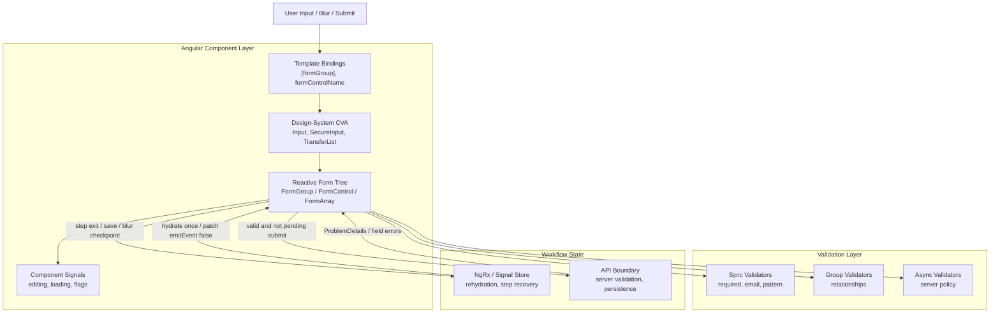

## Table of Contents

[🧠 **View Interactive Mindmap**](./reactive-forms-custom-controls-mindmap.md)

1. [TL;DR](#tldr)
2. [Deep Dive](#deep-dive)
   2.1 [Core Form Architecture](#core-form-architecture)
      2.1.1 [Reactive Forms Mental Model](#reactive-forms-mental-model)
      2.1.2 [Typed Forms](#typed-forms)
      2.1.3 [Form State Boundaries](#form-state-boundaries)
   2.2 [Custom Control Architecture](#custom-control-architecture)
      2.2.1 [ControlValueAccessor](#controlvalueaccessor)
      2.2.2 [Disabled, Touched, Dirty, and Pending Semantics](#disabled-touched-dirty-and-pending-semantics)
      2.2.3 [Accessible Error Presentation](#accessible-error-presentation)
   2.3 [Validation Architecture](#validation-architecture)
      2.3.1 [Synchronous Validators](#synchronous-validators)
      2.3.2 [Cross-Field Validators](#cross-field-validators)
      2.3.3 [Async Validators](#async-validators)
   2.4 [Dynamic and Enterprise Forms](#dynamic-and-enterprise-forms)
      2.4.1 [FormArray and Dynamic Collections](#formarray-and-dynamic-collections)
      2.4.2 [Server-Backed Dynamic Forms](#server-backed-dynamic-forms)
      2.4.3 [Security-Sensitive Form Design](#security-sensitive-form-design)
   2.5 [Testing and Governance](#testing-and-governance)
      2.5.1 [Unit Testing Reactive Forms](#unit-testing-reactive-forms)
      2.5.2 [Storybook as a Form Contract](#storybook-as-a-form-contract)
      2.5.3 [Production Form Review Checklist](#production-form-review-checklist)
3. [Architecture & Data Flow](#architecture--data-flow)
4. [Real-World Examples](#real-world-examples)
   4.1 [Typed Login Form](#typed-login-form)
   4.2 [SecureInput ControlValueAccessor](#secureinput-controlvalueaccessor)
   4.3 [TransferList as a Complex CVA](#transferlist-as-a-complex-cva)
   4.4 [Borrower Portal Dynamic Medical Providers](#borrower-portal-dynamic-medical-providers)
   4.5 [Borrower Portal Conditional Validator](#borrower-portal-conditional-validator)
   4.6 [Planned Async Email Availability Validator](#planned-async-email-availability-validator)
5. [Comparison Tables](#comparison-tables)
6. [Interview Q&A](#interview-qa)
   6.1 [L1: Junior Knowledge](#l1-junior-knowledge)
      6.1.1 [What Is a Reactive Form?](#what-is-a-reactive-form)
      6.1.2 [What Is ControlValueAccessor?](#what-is-controlvalueaccessor)
   6.2 [L2: Mid-Level Knowledge](#l2-mid-level-knowledge)
      6.2.1 [Why Typed Forms Matter](#why-typed-forms-matter)
      6.2.2 [When to Use FormArray](#when-to-use-formarray)
   6.3 [L3: Senior Knowledge](#l3-senior-knowledge)
      6.3.1 [How to Architect Form State](#how-to-architect-form-state)
      6.3.2 [How to Design Async Validators Safely](#how-to-design-async-validators-safely)
   6.4 [Staff: System Architecture](#staff-system-architecture)
      6.4.1 [Design a FinTech-Grade Form System](#design-a-fintech-grade-form-system)
7. [Cross-References](#cross-references)
8. [Further Reading](#further-reading)

---

## TL;DR

<span style="color: #33b5e5; font-weight: bold;">Angular Reactive Forms</span> are explicit form-state graphs: controls, groups, arrays, validators, status, value, touched state, disabled state, and submission are all represented in TypeScript instead of being inferred from the DOM. In `tai-portal`, reactive forms appear in identity UI organisms, borrower-portal claim steps, admin privilege editing, and design-system controls that implement <span style="color: #33b5e5; font-weight: bold;">ControlValueAccessor</span>. For a FinTech-grade component system, the important move is not merely "use FormGroup"; it is to define <span style="color: #00C851; font-weight: bold;">strict form contracts</span> for validation, accessibility, security-sensitive inputs, store synchronization, async validation, and test evidence. The senior trade-off is that reactive forms are powerful enough to become a second state-management system; <span style="color: #ff4444; font-weight: bold;">dispatching every keystroke into global state, hiding validator side effects, or writing incomplete CVAs creates fragile workflows</span>.

---

## Deep Dive

### Core Form Architecture

#### Reactive Forms Mental Model

##### What
<span style="color: #33b5e5; font-weight: bold;">Reactive Forms</span> model a form as an explicit tree of `AbstractControl` instances: `FormControl`, `FormGroup`, `FormArray`, and `FormRecord`. The template binds to this model with `[formGroup]`, `formControlName`, `[formControl]`, and `[formGroupName]`.

##### Why
Without an explicit form model, validation and state drift into the DOM, local booleans, arbitrary event handlers, and duplicated submit checks. In a borrower claim or identity sign-in flow, that creates ambiguity: which fields are valid, which fields were touched, what was submitted, and what needs to survive navigation?

##### How
Angular controls expose a stable state machine:

```typescript
const loginForm = new FormGroup({
  email: new FormControl('', {
    nonNullable: true,
    validators: [Validators.required, Validators.email],
  }),
  password: new FormControl('', {
    nonNullable: true,
    validators: [Validators.required, Validators.minLength(8)],
  }),
});

const value = loginForm.getRawValue();
const canSubmit = loginForm.valid && !loginForm.pending;
```

`valueChanges` reports value transitions, `statusChanges` reports `VALID`, `INVALID`, `PENDING`, and `DISABLED`, and methods such as `patchValue`, `setValue`, `markAllAsTouched`, and `updateValueAndValidity` move the tree predictably.

##### When
Use reactive forms for enterprise workflows, multi-step forms, custom controls, dynamic fields, async validation, and testable validation logic. Avoid them for trivial display-only interactions where a signal or local component state is clearer.

##### Trade-offs
<span style="color: #ffbb33; font-weight: bold;">Reactive forms add structure and ceremony.</span> The cost is justified when the workflow has validation, submission, rehydration, conditional fields, or compliance evidence. The cost is not justified for every button toggle.

---

#### Typed Forms

##### What
<span style="color: #33b5e5; font-weight: bold;">Typed Forms</span> let TypeScript infer control value types, especially when `nonNullable: true` is used. They reduce the gap between the form model and the application DTO.

##### Why
Without typed forms, `form.value` often becomes `Partial<any>`, disabled controls disappear from `value`, and nullability leaks into submission code. In identity and borrower workflows, this causes brittle casts and subtle mistakes such as submitting `null` for a required email.

##### How
`tai-portal` uses typed controls in `libs/ui/design-system/src/lib/organisms/login-form/login-form.ts`:

```typescript
public readonly loginForm = new FormGroup({
  email: new FormControl('', {
    nonNullable: true,
    validators: [Validators.required, Validators.email],
  }),
  password: new FormControl('', {
    nonNullable: true,
    validators: [Validators.required, Validators.minLength(8)],
  }),
});

public onSubmit(): void {
  if (this.loginForm.valid) {
    this.submitted.emit(this.loginForm.getRawValue());
  }
}
```

`getRawValue()` is important because it returns the full typed model, including disabled controls. `form.value` is intentionally partial because disabled controls are excluded from normal form submission semantics.

##### When
Use typed forms for all application-facing forms and all design-system examples. Looser `FormGroup` usage is acceptable during migration or for legacy code, but new code should define value shapes explicitly.

##### Trade-offs
<span style="color: #ffbb33; font-weight: bold;">Typed forms expose weak modeling choices early.</span> A developer must decide nullability, optional fields, disabled field semantics, and DTO conversion instead of letting them drift until runtime.

---

#### Form State Boundaries

##### What
<span style="color: #33b5e5; font-weight: bold;">Form state boundaries</span> define which state belongs inside Angular forms, which state belongs in component signals, which state belongs in NgRx or a service store, and which state belongs only on the server.

##### Why
Without a boundary, forms become noisy global state publishers or detached local state islands. A borrower claim wizard needs data recovery across steps, but it should not dispatch every keystroke into the action log or persist sensitive fields more broadly than necessary.

##### How
`apps/borrower-portal/src/app/claim/borrower-info/borrower-info.component.ts` documents a pragmatic boundary:

- hydrate once from the store on `ngOnInit`
- patch with `{ emitEvent: false }` so rehydration does not look like user input
- dispatch full form state on step exit
- dispatch partial recovery state on blur of critical fields
- avoid overwriting active typing with later store emissions

This is the right mental model: the form owns active editing, the store owns workflow rehydration, and the server owns durable submission.

##### When
Keep state local while the user is actively editing. Sync to global state on step transitions, deliberate saves, autosave intervals, blur of critical fields, or recovery checkpoints. Do not put secrets or high-risk identifiers into durable client state unless the product and security model explicitly require it.

##### Trade-offs
<span style="color: #ff4444; font-weight: bold;">The anti-pattern is dual ownership.</span> If the form, store, and URL all mutate the same field continuously, the user can lose typed input, validators can run against stale values, and debugging becomes timeline archaeology.

---

### Custom Control Architecture

#### ControlValueAccessor

##### What
<span style="color: #33b5e5; font-weight: bold;">ControlValueAccessor</span> is Angular's adapter interface between a form control and a custom UI component. A CVA implements `writeValue`, `registerOnChange`, `registerOnTouched`, and usually `setDisabledState`.

##### Why
Without CVA, custom inputs are not real form controls. They may display a value, but they cannot reliably participate in validation, disabled state, touched state, reset, submission, or parent form composition.

##### How
`libs/ui/design-system/src/lib/atoms/input/input.component.ts` implements the basic contract:

```typescript
providers: [{
  provide: NG_VALUE_ACCESSOR,
  useExisting: forwardRef(() => InputComponent),
  multi: true,
}]

writeValue(value: string | null): void {
  this.controlValue.set(value ?? '');
}

registerOnChange(fn: (value: string) => void): void {
  this.onChange = fn;
}

registerOnTouched(fn: () => void): void {
  this.onTouched = fn;
}

setDisabledState(isDisabled: boolean): void {
  this.disabledSignal.set(isDisabled);
}
```

The key rule: `writeValue` updates internal view state, and user interaction calls `onChange`. <span style="color: #ff4444; font-weight: bold;">Calling `onChange` from `writeValue` creates feedback loops.</span>

##### When
Implement CVA for reusable controls that should work with `formControlName` or `[formControl]`: inputs, checkboxes, date pickers, transfer lists, rich selects, masked inputs, OTP controls, and secure identity fields. Do not implement CVA for a component that only emits a command event and is not a value input.

##### Trade-offs
<span style="color: #ffbb33; font-weight: bold;">CVA is small but unforgiving.</span> Missing disabled propagation, touched handling, or value normalization can break parent forms in ways that only appear under reset, validation, or accessibility testing.

---

#### Disabled, Touched, Dirty, and Pending Semantics

##### What
Angular controls track interaction and lifecycle states: `disabled`, `touched`, `dirty`, `pristine`, `valid`, `invalid`, and `pending`. These are not cosmetic flags; they are part of the form contract.

##### Why
Without correct state semantics, forms show errors too early, enable submit too soon, ignore disabled authorization states, or fail to announce pending validation. In admin and borrower workflows, that creates both usability defects and compliance review issues.

##### How
A mature control follows these rules:

- `writeValue` changes the displayed value but does not mark dirty.
- User input calls `onChange` and marks the parent dirty through Angular.
- Blur or meaningful interaction calls `onTouched`.
- `setDisabledState` disables all interactive descendants.
- Async validation sets `pending` so submit controls can wait.

`libs/ui/design-system/src/lib/organisms/transfer-list/transfer-list.ts` calls `onTouched()` after transfer actions because moving items is meaningful interaction, not simple focus blur.

##### When
Use touched state to control error visibility, dirty state to warn about unsaved changes, disabled state for authorization and workflow locks, and pending state for async validation or server checks. Do not use custom booleans when the Angular state already expresses the behavior.

##### Trade-offs
<span style="color: #ff4444; font-weight: bold;">The common bug is treating disabled as CSS-only.</span> A visually disabled custom control that still emits `onChange` or remains keyboard reachable violates both form semantics and accessibility expectations.

---

#### Accessible Error Presentation

##### What
Accessible error presentation connects validation state to visible text, screen-reader announcements, and the invalid control through `aria-invalid`, `aria-describedby`, roles, and focus behavior.

##### Why
Without accessible error wiring, a form can be technically invalid but unusable for keyboard and assistive-technology users. In regulated financial workflows, validation errors must be perceivable, understandable, and operable.

##### How
Design-system controls should accept an error message or invalid state and render it safely:

```html
<tai-input
  id="email"
  type="email"
  autocomplete="email"
  [invalid]="!!getEmailError()"
  [describedBy]="'email-error'"
  formControlName="email"
/>
```

The control should set `aria-invalid` and connect the error element with `aria-describedby`. Error HTML must be treated as untrusted unless it is generated internally from a trusted catalog.

##### When
Add accessible error behavior to every reusable input. For complex forms, also add an error summary that focuses the first invalid field after submit.

##### Trade-offs
<span style="color: #ffbb33; font-weight: bold;">Error summaries add product and localization work.</span> The payoff is high for long forms, but a two-field login form may only need inline errors if focus and announcements are correct.

---

### Validation Architecture

#### Synchronous Validators

##### What
<span style="color: #33b5e5; font-weight: bold;">Synchronous validators</span> are pure functions that inspect a control value and return either `null` or a `ValidationErrors` object. Angular built-ins include `required`, `email`, `minLength`, `maxLength`, and `pattern`.

##### Why
Without validators in the form model, submit handlers become the only enforcement point. That delays feedback and duplicates logic between template, component, and service calls.

##### How
`tai-portal` uses built-in validators across identity and claim forms:

```typescript
ssnLastFour: [
  '',
  [Validators.required, Validators.pattern(/^\d{4}$/)],
],
phone: ['', [Validators.required, Validators.minLength(10)]],
email: ['', [Validators.required, Validators.email]],
```

Custom validators should be named, pure, and return stable error keys:

```typescript
export function strongPassword(): ValidatorFn {
  return (control) => {
    const value = String(control.value ?? '');
    return /[A-Z]/.test(value) && /\d/.test(value)
      ? null
      : { passwordComplexity: true };
  };
}
```

##### When
Use synchronous validators for format, requiredness, length, local cross-field logic, and constraints that do not require server authority. Do not use sync validators for uniqueness, tenant policy, fraud checks, or authorization checks.

##### Trade-offs
<span style="color: #ff4444; font-weight: bold;">Client validators are UX, not trust boundaries.</span> The server must validate the same business rules, especially in identity, claims, and admin workflows.

---

#### Cross-Field Validators

##### What
A <span style="color: #33b5e5; font-weight: bold;">cross-field validator</span> validates a relationship between controls, usually at the `FormGroup` level. Examples include matching passwords, date ranges, conditional required fields, and mutually exclusive selections.

##### Why
Without group-level validation, teams often use subscriptions that mutate validators imperatively and scatter business logic. Some conditional subscriptions are fine, but the rule should still be named and testable when it represents a domain invariant.

##### How
A group validator keeps the relationship explicit:

```typescript
export function dateRangeValidator(startKey: string, endKey: string): ValidatorFn {
  return (control) => {
    const group = control as FormGroup;
    const start = group.get(startKey)?.value;
    const end = group.get(endKey)?.value;

    if (!start || !end) return null;
    return new Date(start) <= new Date(end) ? null : { dateRange: true };
  };
}
```

For `tai-portal`, a future borrower-claim date range validator could enforce treatment dates after the disability date before document generation.

##### When
Use group validators for domain relationships and invariants. Use `setValidators` from a subscription when the form needs to physically add or remove validators based on another field, as in the borrower portal `isWorkRelated` field.

##### Trade-offs
<span style="color: #ffbb33; font-weight: bold;">Group errors need deliberate presentation.</span> A group can be invalid while every individual control appears valid, so the UI must decide which field or summary owns the message.

---

#### Async Validators

##### What
<span style="color: #33b5e5; font-weight: bold;">Async validators</span> return an `Observable` or `Promise` that resolves to `null` or `ValidationErrors`. They are used when validation depends on server state or external policy.

##### Why
Without async validators, the user discovers server-rejected state only after submitting. In identity onboarding, that means a duplicate or disallowed email may pass local validation, then fail after the full form submission round trip.

##### How
No `AsyncValidatorFn` currently appears in `apps` or `libs`. A tai-portal-fitting implementation for registration would use `updateOn: 'blur'` to avoid checking on every keystroke and would return generic errors to prevent user enumeration:

```typescript
export function emailAvailabilityValidator(
  service: RegistrationPolicyService,
): AsyncValidatorFn {
  return (control) => {
    const email = String(control.value ?? '').trim();
    if (!email || control.hasError('email')) {
      return of(null);
    }

    return service.checkEmailPolicy(email).pipe(
      map((result) => result.allowed ? null : { emailPolicy: true }),
      catchError(() => of({ emailPolicyUnavailable: true })),
    );
  };
}

email: new FormControl('', {
  nonNullable: true,
  validators: [Validators.required, Validators.email],
  asyncValidators: [emailAvailabilityValidator(policyService)],
  updateOn: 'blur',
});
```

##### When
Use async validators for uniqueness, tenant policy, invitation validity, account status, or externally controlled rules. Do not use async validators for operations with side effects, expensive fraud analysis, or final authorization.

##### Trade-offs
<span style="color: #ff4444; font-weight: bold;">Async validators can leak information and create load.</span> Use rate limits, generic messages, tenant-aware endpoints, cancellation-friendly observables, `updateOn: 'blur'`, and submit buttons that respect `form.pending`.

---

### Dynamic and Enterprise Forms

#### FormArray and Dynamic Collections

##### What
<span style="color: #33b5e5; font-weight: bold;">FormArray</span> models an ordered collection of controls or groups where the number of entries changes at runtime. It is the right tool for repeatable sections such as providers, dependents, addresses, documents, and phone numbers.

##### Why
Without `FormArray`, dynamic fields become indexed variables, duplicated templates, or ad hoc arrays that Angular forms cannot validate as a single tree.

##### How
`apps/borrower-portal/src/app/claim/medical-providers/medical-providers.component.ts` uses a provider array:

```typescript
this.form = this.fb.group({
  providers: this.fb.array([]),
});

private createProviderGroup(data?: Partial<MedicalProvider>): FormGroup {
  return this.fb.group({
    id: [data?.id ?? crypto.randomUUID()],
    doctorName: [data?.doctorName ?? '', Validators.required],
    clinicName: [data?.clinicName ?? '', Validators.required],
    phone: [data?.phone ?? '', [Validators.required, Validators.minLength(10)]],
    dateFirstTreated: [data?.dateFirstTreated ?? '', Validators.required],
  });
}
```

The component enforces `MAX_PROVIDERS`, rehydrates from NgRx, and dispatches updates when provider groups change.

##### When
Use `FormArray` when order matters or the UI adds/removes rows. Use `FormRecord` when keys are dynamic and unordered, such as feature flags by id. Use a plain nested `FormGroup` when the shape is fixed.

##### Trade-offs
<span style="color: #ffbb33; font-weight: bold;">Dynamic forms need subscription discipline.</span> When adding controls over time, ensure subscriptions are scoped with `takeUntilDestroyed`, `DestroyRef`, or equivalent cleanup.

---

#### Server-Backed Dynamic Forms

##### What
<span style="color: #33b5e5; font-weight: bold;">Server-backed dynamic forms</span> generate part of the form from metadata: fields, labels, validators, options, visibility rules, and authorization.

##### Why
Without metadata-driven forms, regulatory or tenant-specific forms often require code deploys for small policy changes. With too much metadata, however, the app becomes a low-code runtime that is hard to type, test, secure, and make accessible.

##### How
A pragmatic tai-portal approach would keep the renderer small:

```typescript
type FieldSpec =
  | { kind: 'text'; key: string; label: string; required: boolean; maxLength?: number }
  | { kind: 'select'; key: string; label: string; required: boolean; options: SelectOption[] }
  | { kind: 'date'; key: string; label: string; required: boolean };
```

The server can provide metadata for optional claim supplements, while core borrower identity, incident details, and signing flows stay strongly typed.

##### When
Use server-backed dynamic forms for low-risk optional supplements, tenant-specific questionnaires, or admin-configured metadata. Do not use them for core identity, payment, signing, or authorization workflows unless the metadata language has a formal schema, tests, audit trail, and security review.

##### Trade-offs
<span style="color: #ff4444; font-weight: bold;">Unbounded dynamic forms are a product platform, not a component.</span> They require versioning, migration, localization, accessibility, validation parity, and auditability.

---

#### Security-Sensitive Form Design

##### What
Security-sensitive form design treats inputs as part of the application security boundary: autocomplete, masking, CSP, Trusted Types, XSS-safe errors, audit logging, secrets retention, and transport protection all matter.

##### Why
Without this discipline, a form can accidentally expose credentials, persist sensitive identifiers, inject unsafe error content, or create an audit gap even if the visual UI looks correct.

##### How
`libs/ui/design-system/src/lib/atoms/secure-input/secure-input.ts` demonstrates several security-oriented decisions:

- uses a controlled component instead of third-party input libraries
- implements CVA so it works in reactive forms
- maps password inputs to `autocomplete="new-password"`
- renders error text safely
- keeps dynamic styles in computed class strings rather than unsafe inline style patterns

For borrower portal, the same principles apply to SSN last four, claim identifiers, signed document metadata, and future DocuSign-related forms.

##### When
Use secure form controls for identity, claims, secrets, payment, signing, privilege elevation, and document access. Plain inputs are acceptable for low-risk filters or search fields, but still need accessible labels and safe error rendering.

##### Trade-offs
<span style="color: #ffbb33; font-weight: bold;">Security-sensitive controls constrain convenience.</span> Browser autofill, password managers, clipboard behavior, and display toggles need explicit product/security decisions, not accidental defaults.

---

### Testing and Governance

#### Unit Testing Reactive Forms

##### What
Form unit tests verify control construction, validators, CVA propagation, disabled behavior, touched state, submission output, and error rendering.

##### Why
Without unit tests, forms regress silently because many defects are stateful: reset behavior, disabled controls, blur state, dynamic validators, and custom control integration.

##### How
`libs/ui/design-system/src/lib/atoms/input/input.component.spec.ts` mounts a host form and verifies that typing into `<tai-input>` updates the parent `FormControl`. `libs/ui/design-system/src/lib/organisms/transfer-list/transfer-list.spec.ts` verifies that moving items updates the parent control and marks it touched.

Good form tests cover:

- initial invalid state
- valid submission payload
- invalid submission blocked
- `markAllAsTouched` after submit
- CVA `writeValue`, `registerOnChange`, `registerOnTouched`, `setDisabledState`
- async validator pending and error states

##### When
Write unit tests for every reusable CVA and every form with business rules. Use E2E tests for route-level workflows and backend integration.

##### Trade-offs
<span style="color: #ffbb33; font-weight: bold;">Form tests can become implementation-coupled.</span> Prefer user-level interactions and public outputs over asserting every private control flag unless that flag is the behavior under test.

---

#### Storybook as a Form Contract

##### What
Storybook form stories render real form states outside the application shell: default, invalid, disabled, loading, pending, long labels, keyboard interaction, and security-sensitive states.

##### Why
Without story-level contracts, reusable forms are only reviewed through product pages. Rare states like disabled submit, server policy errors, expired OTP, or XSS-like error messages are easy to miss.

##### How
`libs/ui/design-system/src/lib/organisms/login-form/login-form.stories.ts`, `registration-form.stories.ts`, and `secure-input.stories.ts` are good places to model:

- valid and invalid values
- password and email autocomplete behavior
- disabled controls
- escaped error text
- keyboard submission
- mobile layout

##### When
Use Storybook for reusable design-system controls and identity organisms. App-specific claim wizard pages still need app-level tests because they depend on routes, NgRx, and persistence.

##### Trade-offs
<span style="color: #ff4444; font-weight: bold;">Storybook is not a substitute for backend validation or E2E tests.</span> It proves component contracts, not full authorization, data persistence, or cross-service behavior.

---

#### Production Form Review Checklist

##### What
A production form review checklist is a repeatable gate for form quality: type safety, validation, accessibility, security, observability, state ownership, tests, and failure states.

##### Why
Forms are where users enter the data that drives money movement, identity, claims, and authorization. Without a checklist, teams review markup and styling while missing the business-critical failure modes.

##### How
For tai-portal, a senior review should ask:

- Is the form typed and non-null where appropriate?
- Are server-trust boundaries explicit?
- Are errors accessible and safe from HTML injection?
- Does submit wait for `invalid` and `pending` states?
- Does state sync have a clear owner?
- Are custom controls complete CVAs?
- Are sensitive fields minimized in persistence and logs?
- Are unit, Storybook, and E2E tests covering the right layer?

##### When
Use the checklist for any new identity, admin, borrower claim, signing, onboarding, or document-access form. Lightweight filters and search controls can use a reduced checklist.

##### Trade-offs
<span style="color: #ffbb33; font-weight: bold;">Governance costs time upfront.</span> It pays back by preventing expensive defects in accessibility, security, compliance, and customer support.

---

## Architecture & Data Flow



---

## Real-World Examples

### Typed Login Form

📍 From tai-portal: `libs/ui/design-system/src/lib/organisms/login-form/login-form.ts`

This is the cleanest design-system example of a strongly typed reactive form. The component owns the form model, uses non-null controls, maps validation to error messages, and emits a typed submission event only when the form is valid.

```typescript
public readonly loginForm = new FormGroup({
  email: new FormControl('', {
    nonNullable: true,
    validators: [Validators.required, Validators.email],
  }),
  password: new FormControl('', {
    nonNullable: true,
    validators: [Validators.required, Validators.minLength(8)],
  }),
});

public onSubmit(): void {
  if (this.loginForm.valid) {
    this.submitted.emit(this.loginForm.getRawValue());
  }
}
```

The planned improvement is to check `!this.loginForm.pending` before emitting once async policy checks are introduced.

### SecureInput ControlValueAccessor

📍 From tai-portal: `libs/ui/design-system/src/lib/atoms/secure-input/secure-input.ts`

`SecureInputComponent` adapts a security-sensitive input to Angular forms. It uses `NG_VALUE_ACCESSOR`, signal-backed internal state, `setDisabledState`, and secure autocomplete defaults.

```typescript
writeValue(value: string): void {
  this.value.set(value || '');
}

registerOnChange(fn: (value: string) => void): void {
  this.onChange = fn;
}

protected onInputValueChanged(nextValue: string): void {
  this.value.set(nextValue);
  this.onChange(nextValue);
}

protected onBlur(): void {
  this.isTouched.set(true);
  this.onTouched();
}
```

The important architectural point is that security and form integration are not separate features. A secure identity input still has to obey the parent form contract.

### TransferList as a Complex CVA

📍 From tai-portal: `libs/ui/design-system/src/lib/organisms/transfer-list/transfer-list.ts`

`TransferListComponent` is a richer CVA because the value is an array of assigned ids, not a single string. It also has search, selection, responsive layout, telemetry, and live announcements.

```typescript
public writeValue(value: (string | number)[] | null): void {
  const newSet = value ? new Set(value) : new Set<(string | number)>();
  this.assignedIds.set(newSet);
  this.initialValue.set(new Set(newSet));
}

private updateAssigned(newSet: Set<string | number>): void {
  this.assignedIds.set(newSet);
  const arrayValue = Array.from(newSet) as (string | number)[];
  this.assignedIdsChanged.emit(arrayValue);
  this.onChange(arrayValue);
  this.onTouched();
}
```

This is the pattern for future complex controls: the public form value stays simple, while the component can use richer internal structures.

### Borrower Portal Dynamic Medical Providers

📍 From tai-portal: `apps/borrower-portal/src/app/claim/medical-providers/medical-providers.component.ts`

The borrower claim wizard uses `FormArray` for a dynamic provider list. It enforces `MAX_PROVIDERS`, generates ids with `crypto.randomUUID()`, and syncs provider changes to NgRx.

```typescript
get providersArray(): FormArray {
  return this.form.get('providers') as FormArray;
}

private createProviderGroup(data?: Partial<MedicalProvider>): FormGroup {
  return this.fb.group({
    id: [data?.id ?? crypto.randomUUID()],
    doctorName: [data?.doctorName ?? '', Validators.required],
    clinicName: [data?.clinicName ?? '', Validators.required],
    phone: [data?.phone ?? '', [Validators.required, Validators.minLength(10)]],
    dateFirstTreated: [data?.dateFirstTreated ?? '', Validators.required],
  });
}
```

Planned hardening: migrate this to typed `FormArray<FormGroup<MedicalProviderForm>>`, use `takeUntilDestroyed` instead of manual `Subject`, and centralize provider-to-store mapping so UI-only fields never leak into domain state.

### Borrower Portal Conditional Validator

📍 From tai-portal: `apps/borrower-portal/src/app/claim/incident-details/incident-details.component.ts`

The incident step conditionally requires `workersCompClaimNumber` when `isWorkRelated` is true.

```typescript
this.form.get('isWorkRelated')?.valueChanges.subscribe((isWorkRelated) => {
  const workersCompControl = this.form.get('workersCompClaimNumber');
  if (isWorkRelated) {
    workersCompControl?.setValidators([Validators.required]);
  } else {
    workersCompControl?.clearValidators();
    workersCompControl?.setValue(null);
  }
  workersCompControl?.updateValueAndValidity();
});
```

This is acceptable for a UI visibility rule. If the rule grows into a claim invariant, promote it into a named validator and unit-test it directly.

### Planned Async Email Availability Validator

🔧 Fits tai-portal: identity registration and onboarding

The repository does not currently contain an `AsyncValidatorFn`. The best fit is identity registration email policy: after the user enters an email, the UI can ask whether that email is allowed for the current tenant without revealing whether a real account exists.

```typescript
email: new FormControl('', {
  nonNullable: true,
  validators: [Validators.required, Validators.email],
  asyncValidators: [emailAvailabilityValidator(policyService)],
  updateOn: 'blur',
});
```

Implementation plan:

- Add a tenant-aware policy endpoint that returns generic allow/deny status.
- Implement `emailAvailabilityValidator` in an identity form utility.
- Use `updateOn: 'blur'` to reduce network traffic.
- Keep the displayed error generic: "This email cannot be used for registration."
- Disable submit while `registrationForm.pending`.
- Add tests for allowed, denied, server failure, and cancellation behavior.

---

## Comparison Tables

| Dimension | Template-Driven Forms | Reactive Forms |
|-----------|-----------------------|----------------|
| **Mental model** | DOM-first; directives infer form state | TypeScript-first; explicit control tree |
| **Best use case** | Simple forms with minimal logic | Enterprise forms, custom controls, dynamic sections |
| **Validation** | Works, but harder to compose and test | Validator functions, group validators, async validators |
| **Testing** | Often requires template interaction | Control state can be tested directly |
| **tai-portal choice** | Avoid for app workflows | Preferred for identity, borrower, admin, and design-system forms |

| Dimension | Component `@Input`/`@Output` | ControlValueAccessor |
|-----------|------------------------------|----------------------|
| **Mental model** | Component owns custom value contract | Component adapts to Angular forms contract |
| **Use case** | Commands, display widgets, simple selectors | Reusable input-like controls |
| **Disabled state** | Must be invented manually | Comes from parent form |
| **Validation integration** | Manual | Native form validity/touched/dirty integration |
| **tai-portal example** | `submitted` output on `LoginFormComponent` | `InputComponent`, `SecureInputComponent`, `TransferListComponent` |

| Dimension | Local Form State | NgRx / Signal Store State |
|-----------|------------------|---------------------------|
| **Mental model** | Active editing buffer | Workflow recovery and cross-route state |
| **Best use case** | Typing, touched, dirty, inline validation | Step progress, rehydration, submitted draft data |
| **Risk** | Lost data across navigation | Noisy action logs and dual ownership |
| **Sync timing** | Immediate inside the component | Step exit, save, blur checkpoint, autosave |
| **tai-portal pattern** | Borrower step form owns active editing | Borrower store owns claim wizard state |

---

## Interview Q&A

### L1: Junior Knowledge

#### What Is a Reactive Form?
**Difficulty:** L1 (Junior)

**Question:** What is a reactive form in Angular?

**Answer:** A reactive form is a <span style="color: #33b5e5; font-weight: bold;">TypeScript-defined form model</span> made of controls, groups, arrays, validators, values, and status. The template binds to that model instead of letting the DOM own the form state.

---

#### What Is ControlValueAccessor?
**Difficulty:** L1 (Junior)

**Question:** What does `ControlValueAccessor` do?

**Answer:** <span style="color: #33b5e5; font-weight: bold;">ControlValueAccessor</span> lets a custom component behave like a native form input. It tells Angular how to write a value into the component, receive user changes, mark it touched, and disable it.

---

### L2: Mid-Level Knowledge

#### Why Typed Forms Matter
**Difficulty:** L2 (Mid-Level)

**Question:** Why should an Angular app use typed reactive forms?

**Answer:** Typed forms keep the form model aligned with TypeScript so submission code does not degrade into `any` and unsafe casts. They make nullability, disabled values, and DTO conversion explicit. <span style="color: #ffbb33; font-weight: bold;">The trade-off is more upfront modeling</span>, but the payoff is stronger refactoring and fewer runtime submission bugs.

---

#### When to Use FormArray
**Difficulty:** L2 (Mid-Level)

**Question:** When should you use `FormArray` instead of a nested `FormGroup`?

**Answer:** Use `FormArray` when the number of child controls changes at runtime and order matters, such as borrower medical providers. Use a nested `FormGroup` when the shape is fixed, and use `FormRecord` when dynamic keys matter more than order.

---

### L3: Senior Knowledge

#### How to Architect Form State
**Difficulty:** L3 (Senior)

**Question:** How would you decide whether form data belongs in the form, NgRx, signals, or the server?

**Answer:** The active editing buffer belongs in the reactive form because that is where touched, dirty, validation, and pending state live. View-only flags such as `isEditing` or `workersCompLoading` can live in component signals. Workflow recovery data belongs in NgRx or a store, but sync should happen on deliberate boundaries such as step exit, save, blur of critical fields, or autosave intervals. Durable truth belongs on the server after server-side validation. <span style="color: #ff4444; font-weight: bold;">The dangerous design is dual ownership where the store patches the form while the user is typing</span>. Use `{ emitEvent: false }` for hydration and make the ownership rule visible in code.

---

#### How to Design Async Validators Safely
**Difficulty:** L3 (Senior)

**Question:** How would you add async email validation to a FinTech registration form?

**Answer:** I would keep local syntax checks synchronous, then add an `AsyncValidatorFn` for tenant-aware email policy with `updateOn: 'blur'`. The endpoint should return generic policy status, not "user exists", to avoid account enumeration. The submit button should respect both `invalid` and `pending`, and the UI should handle policy-service failure with a retryable, non-leaky error. I would test allowed, denied, unavailable, and rapid value changes. <span style="color: #00C851; font-weight: bold;">The best practice is to treat async validation as UX guidance, not final authorization</span>; the server still enforces the rule on submit.

---

### Staff: System Architecture

#### Design a FinTech-Grade Form System
**Difficulty:** Staff

**Question:** Design a form system for a multi-app FinTech portal with identity, borrower claims, admin privileges, and document signing.

**Answer:** I would split the system into three layers: design-system CVAs, application form containers, and workflow/server boundaries. CVAs such as input, secure input, checkbox, transfer list, date picker, and file selector would have typed values, disabled/touched semantics, accessible labels/errors, Storybook states, and unit tests. Application forms would define typed `FormGroup` models, named validators, async validators for server policy, and explicit DTO mapping. Workflow state would sync at save boundaries instead of every keystroke, with special treatment for sensitive fields and document metadata. Server APIs would revalidate every rule, return field-level `ProblemDetails`, and avoid leaking identity or tenant data. CI would run unit tests, Storybook interaction/a11y tests, and E2E flows for sign-in, claim submission, privilege editing, and signing. <span style="color: #ff4444; font-weight: bold;">I would reject a generic low-code form runtime for core identity and signing</span> unless the organization is ready to fund schema versioning, audit trails, accessibility validation, and security review for the metadata language itself.

---

## Cross-References

- [[Angular-Core]] - standalone components, DI, and Angular application architecture
- [[RxJS-Signals]] - observable/signal interop for form and store state
- [[Change-Detection-Signals]] - signal-backed controls and rendering behavior
- [[Storybook]] - executable form and component contracts
- [[Testing-Frontend]] - Angular TestBed, component testing, and E2E coverage
- [[Security-CSP-DPoP]] - strict CSP, Trusted Types, and secure UI constraints

---

## Further Reading

- Angular Forms Guide: `https://angular.dev/guide/forms`
- Angular Reactive Forms Guide: `https://angular.dev/guide/forms/reactive-forms`
- Angular Typed Forms Guide: `https://angular.dev/guide/forms/typed-forms`
- Angular `ControlValueAccessor` API: `https://angular.dev/api/forms/ControlValueAccessor`
- WAI Form Accessibility Tutorial: `https://www.w3.org/WAI/tutorials/forms/`
