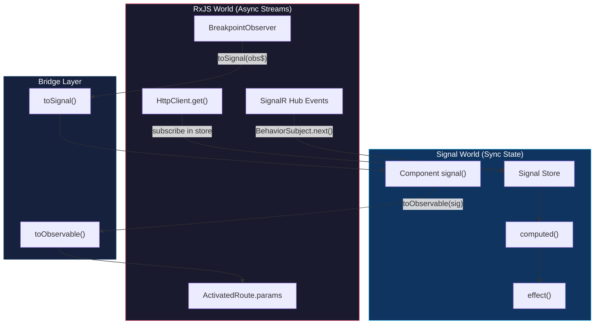

## TL;DR

RxJS provides **event-driven** reactive programming with Observables — ideal for async streams, HTTP, and complex event coordination. Angular **Signals** (16+) provide **state-driven** reactivity — ideal for synchronous UI state, derived values, and fine-grained change detection. In `tai-portal`, the codebase uses a **hybrid model**: RxJS for services that manage async streams (auth, real-time, HTTP) and hand-rolled Signal-based stores for component-facing state. The bridge function `toSignal()` converts Observables into Signals at component boundaries.

## Deep Dive

### Concept Overview

#### 1. Observables — The Async Stream Primitive
- **What:** An Observable is a lazy, push-based collection that can emit zero or more values over time, then optionally complete or error. It is the RxJS equivalent of an async iterable.
- **Why:** Promises resolve once. Observables model ongoing streams — WebSocket messages, route parameter changes, user keystrokes, polling intervals. Angular's `HttpClient`, `Router`, and `FormControl.valueChanges` all return Observables.
- **How:** You create an Observable (or receive one from Angular), transform it with operators inside `.pipe()`, and activate it with `.subscribe()`. Nothing executes until subscribe is called (lazy evaluation).
- **When:** Use Observables when you have genuinely async, multi-value, or event-based data — HTTP calls, SignalR events, debounced search inputs, combining multiple async sources.
- **Trade-offs:** Observables are powerful but carry cognitive overhead — operator selection, subscription lifecycle, error propagation, and backpressure are all concerns. For simple synchronous state (a boolean flag, a counter), Signals are dramatically simpler.

#### 2. Operators — Declarative Stream Transformation
- **What:** Operators are pure functions that take an Observable as input and return a new Observable without mutating the source. They are composed via `.pipe()` to build declarative data pipelines.
- **Why:** Without operators, you would nest callbacks inside `.subscribe()` — the "callback hell" that RxJS was designed to eliminate. Operators let you express complex async logic (retry on failure, debounce input, cancel stale requests) as a readable pipeline.
- **How:** Operators fall into categories:
  - **Transformation:** `map`, `switchMap`, `mergeMap`, `concatMap`, `exhaustMap`
  - **Filtering:** `filter`, `take`, `takeUntil`, `distinctUntilChanged`, `debounceTime`
  - **Combination:** `combineLatest`, `forkJoin`, `merge`, `withLatestFrom`
  - **Error handling:** `catchError`, `retry`, `throwError`
  - **Side effects:** `tap`, `finalize`
  - **Multicasting:** `shareReplay`, `share`
- **When:** Always prefer operators inside `.pipe()` over imperative logic inside `.subscribe()`. The subscribe callback should ideally do nothing more than trigger a side effect (update a signal, navigate, show a toast).
- **Trade-offs:** The RxJS operator surface area is enormous (~100+ operators). In practice, you need ~15 operators for 95% of real-world Angular code. Over-engineering with exotic operators hurts readability for the team.

#### 3. Higher-Order Mapping — The Critical Interview Topic
- **What:** Higher-order mapping operators (`switchMap`, `mergeMap`, `concatMap`, `exhaustMap`) subscribe to an "inner" Observable for each emission from an "outer" Observable. They differ in how they handle concurrent inner subscriptions.
- **Why:** This is the most commonly tested RxJS concept in Angular interviews because it directly maps to real UX behaviors — search autocomplete, form submission, polling.
- **How:**

| Operator | Concurrency | Cancels Previous? | Use Case |
|----------|-------------|-------------------|----------|
| `switchMap` | 1 (latest only) | Yes | Search typeahead, route params |
| `mergeMap` | Unlimited (parallel) | No | Parallel file uploads |
| `concatMap` | 1 (queued) | No | Sequential form saves |
| `exhaustMap` | 1 (ignores new) | No | Login button (prevent double-click) |

- **When:** Default to `switchMap` for read operations (fetches), `concatMap` for writes (mutations), `exhaustMap` for one-shot actions (login). Use `mergeMap` only when you genuinely want parallel execution.
- **Trade-offs:** Using `mergeMap` where you need `switchMap` causes race conditions (stale responses arriving after fresh ones). Using `switchMap` for writes can silently cancel mutations. Getting this wrong is a common production bug.

#### 4. Subjects — Observable + Observer Hybrid
- **What:** A Subject is both an Observable (you can subscribe to it) and an Observer (you can call `.next()` to push values). It acts as a multicast event bus.
- **Why:** Subjects bridge imperative code (button clicks, manual events) into the reactive Observable world. They are the "on-ramp" for values that don't originate from an existing Observable.
- **How:**

| Type | Initial Value? | Replays? | Use Case |
|------|---------------|----------|----------|
| `Subject` | No | No | Event bus, destroy notifier |
| `BehaviorSubject` | Yes (required) | Last value to new subscribers | Current state (connection status) |
| `ReplaySubject(n)` | No | Last `n` values | Late subscribers need history |
| `AsyncSubject` | No | Only the final value on complete | Rare; cache a single result |

- **When:** Use `BehaviorSubject` when subscribers need the current value immediately (e.g., connection status). Use plain `Subject` for fire-and-forget events (destroy notifier, search input bridge). Avoid Subjects as a general-purpose state container — Signals are better for that.
- **Trade-offs:** Subjects are powerful but easy to misuse. Exposing a `Subject` publicly lets any consumer call `.next()`, breaking unidirectional data flow. Always expose as `asObservable()` and keep the Subject private.

#### 5. Angular Signals — Synchronous Reactive State
- **What:** Signals are Angular's built-in reactive primitive (Angular 16+). A `signal()` holds a value, `computed()` derives values from other signals, and `effect()` runs side effects when signals change. Unlike Observables, Signals are synchronous and always have a current value.
- **Why:** Observables are overkill for simple synchronous state. Before Signals, Angular developers used `BehaviorSubject` + `async` pipe or mutable component properties with manual `ChangeDetectorRef.markForCheck()`. Signals eliminate this boilerplate and enable fine-grained change detection (Angular can know exactly which signal changed, instead of dirty-checking the entire component tree).
- **How:**
  - `signal(initialValue)` — writable, holds state
  - `computed(() => ...)` — read-only, derives from other signals, memoized (only re-evaluates when dependencies change)
  - `effect(() => ...)` — runs side effects when tracked signals change (similar to `autorun` in MobX)
  - `.set(value)`, `.update(fn)` — mutate a writable signal
  - `.asReadonly()` — expose a read-only view (prevents external writes)
- **When:** Use Signals for all component/store state that is synchronous — loading flags, form state, UI toggles, derived display values. Use Observables only when you genuinely need async stream semantics.
- **Trade-offs:** Signals do not replace RxJS for async coordination (debouncing, retrying, combining async sources). The two systems are complementary, not competitive. `toSignal()` and `toObservable()` bridge them.

#### 6. The Signal Store Pattern — Hand-Rolled State Management
- **What:** A pattern where an `@Injectable()` service uses private `signal()` fields for state, exposes them as `.asReadonly()` public properties, derives UI-facing booleans with `computed()`, and mutates state imperatively inside HTTP `.subscribe()` callbacks.
- **Why:** Avoids the ceremony of NgRx (actions, reducers, effects, selectors) while still providing a clear separation between private mutable state and public read-only API. For medium-complexity apps, this is the sweet spot — you get predictable state management without the boilerplate tax.
- **How:**
  ```
  Private signal (write) → .asReadonly() (public read) → computed() (derived)
  ```
  Store methods follow the pattern: set status to `'Loading'` → call HTTP service → in `subscribe({ next, error })` update signals → `computed()` derives `isLoading`, `isError`, etc.
- **When:** Use for feature-level state that multiple components need to share (e.g., a user list with pagination, sorting, search). For simple local component state, a plain `signal()` in the component is sufficient. For massive enterprise state with time-travel debugging needs, consider NgRx.
- **Trade-offs:** No action replay, no devtools, no effect isolation. The store methods are imperative — if you need to coordinate multiple async operations with cancellation semantics, you may want to bring RxJS operators back into the store layer. Also, unsubscribed HTTP calls in stores can technically leak if the service is destroyed (mitigated by `providedIn: 'root'` singleton lifetime).

#### 7. Bridging RxJS and Signals — toSignal() and toObservable()
- **What:** `toSignal()` converts an Observable into a Signal. `toObservable()` converts a Signal into an Observable. Both are in `@angular/core/rxjs-interop`.
- **Why:** The Angular ecosystem is in transition. Libraries like `BreakpointObserver`, `HttpClient`, and `ActivatedRoute` still return Observables. Components increasingly want Signals for template binding and fine-grained reactivity. The bridge functions let you adopt Signals incrementally without rewriting every service.
- **How:**
  - `toSignal(obs$, { initialValue })` — subscribes to the Observable, updates the signal on each emission. Requires an `initialValue` if the Observable doesn't emit synchronously (most don't).
  - `toSignal(obs$)` — without `initialValue`, the signal type is `T | undefined` (the undefined represents "hasn't emitted yet").
  - `toObservable(signal)` — emits whenever the signal value changes.
  - `toSignal()` automatically unsubscribes when the injection context (component/service) is destroyed — no manual cleanup needed.
- **When:** Use `toSignal()` at the boundary where Observable-based services meet Signal-based components. Use `toObservable()` when you need to feed a Signal into an RxJS pipeline (e.g., debounce a signal value).
- **Trade-offs:** `toSignal()` subscribes eagerly in the injection context — if called conditionally or outside an injection context, it throws. Also, converting a hot Observable to a Signal means you lose backpressure and buffering semantics. For high-frequency streams (mouse moves, WebSocket ticks), consider whether you actually need every emission as a signal update.



---

## Real-World Code Examples

### 1. switchMap with DPoP Nonce Retry — `dpop.interceptor.ts`

The DPoP interceptor converts a Promise-based crypto operation into an Observable with `from()`, then uses `switchMap` to chain the signed request, and `catchError` to handle the nonce-retry flow:

```typescript
// apps/portal-web/src/app/dpop.interceptor.ts (lines 42-79)
const executeWithDPoP = (nonce?: string) => {
  return from(dpopService.getDPoPHeader(req.method, req.url, accessToken, nonce)).pipe(
    switchMap(dpopHeader => {
      let headers = req.headers.set('DPoP', dpopHeader);
      if (accessToken) {
        headers = headers.set('Authorization', `DPoP ${accessToken}`);
      }
      const clonedReq = req.clone({ headers });
      return next(clonedReq);
    })
  );
};

return executeWithDPoP().pipe(
  catchError((error: unknown) => {
    if (error instanceof HttpErrorResponse && error.status === 401) {
      const nonce = error.headers.get('DPoP-Nonce');
      if (nonce) {
        return executeWithDPoP(nonce);  // Retry with server nonce
      }
    }
    return throwError(() => error);
  })
);
```

**Why this matters:** Demonstrates `from()` (Promise → Observable), `switchMap` (chain async operations), and `catchError` (conditional retry) in a real security flow.

### 2. shareReplay for Multicast Auth State — `auth.service.ts`

The auth service creates a single shared Observable that all subscribers receive the cached user value from:

```typescript
// apps/portal-web/src/app/auth.service.ts (lines 47-68)
public readonly user$: Observable<User | null> = this.oidcSecurityService.userData$.pipe(
  map((result) => {
    const data = result?.userData;
    if (!data) return null;
    return {
      id: data.sub,
      email: data.email,
      name: data.name,
      privileges: data.privileges || [],
      tenantId: data.tenant_id
    };
  }),
  shareReplay(1)  // Cache last value for late subscribers
);

public readonly isAuthenticated$: Observable<boolean> = this.user$.pipe(
  map((user) => !!user)
);

public hasPrivilege(privilege: string): Observable<boolean> {
  return this.user$.pipe(
    map((user) => {
      if (!user) return false;
      return user.privileges.includes(privilege);
    })
  );
}
```

**Why this matters:** Without `shareReplay(1)`, every subscriber would trigger a separate upstream evaluation. The `1` means "buffer size of 1" — late subscribers immediately get the last emitted user without waiting for the next emission.

### 3. Signal-Based Store Pattern — `users.store.ts`

The hand-rolled store pattern that replaces NgRx for medium-complexity state:

```typescript
// apps/portal-web/src/app/features/users/users.store.ts (lines 21-99)
@Injectable({ providedIn: 'root' })
export class UsersStore {
  private readonly usersService = inject(UsersService);

  // Private writable signals
  private readonly _users = signal<User[]>([]);
  private readonly _status = signal<UsersStatus>('Idle');
  private readonly _errorMessage = signal<string | null>(null);
  private readonly _totalCount = signal<number>(0);
  private readonly _pageIndex = signal<number>(1);
  private readonly _pageSize = signal<number>(10);
  private readonly _sortColumn = signal<string | null>(null);
  private readonly _sortDirection = signal<'asc' | 'desc' | null>(null);

  // Public read-only views
  public readonly users = this._users.asReadonly();
  public readonly status = this._status.asReadonly();
  public readonly totalCount = this._totalCount.asReadonly();
  public readonly isLoading = computed(() => this._status() === 'Loading');
  public readonly isError = computed(() => this._status() === 'Error');

  loadUsers(): void {
    this._status.set('Loading');
    this.usersService.getUsers(/* params */)
      .pipe(finalize(() => { /* cleanup */ }))
      .subscribe({
        next: (response) => {
          this._users.set(response.items);
          this._totalCount.set(response.totalCount);
          this._status.set('Success');
        },
        error: (err) => {
          this._errorMessage.set(err.message);
          this._status.set('Error');
        }
      });
  }
}
```

**Why this matters:** Shows the pattern of private `signal()` → `.asReadonly()` → `computed()`. The store is the only place that writes to signals; components only read. HTTP responses flow through RxJS `subscribe()` into signal `.set()` — the bridge between async and sync worlds.

### 4. toSignal() Bridge — `transfer-list.ts`

Converting Observable-based CDK BreakpointObserver and debounced search inputs into Signals:

```typescript
// libs/ui/design-system/src/lib/design-system/transfer-list/transfer-list.ts (lines 127-160)

// Observable → Signal: responsive breakpoint
public readonly isSmallScreen = toSignal(
  this.breakpointObserver.observe([Breakpoints.XSmall, Breakpoints.Small])
    .pipe(map((result) => result.matches)),
  { initialValue: false }
);

// Subject as imperative on-ramp
private readonly searchTermAvailable$ = new Subject<string>();
private readonly searchTermAssigned$ = new Subject<string>();

// Observable → Signal: debounced search with distinctUntilChanged
public readonly searchTermAvailable = toSignal(
  this.searchTermAvailable$.pipe(debounceTime(300), distinctUntilChanged()),
  { initialValue: '' }
);

public readonly searchTermAssigned = toSignal(
  this.searchTermAssigned$.pipe(debounceTime(300), distinctUntilChanged()),
  { initialValue: '' }
);

// These signals then feed computed() for filtered item lists
public readonly availableItems = computed(() => {
  const search = this.searchTermAvailable().toLowerCase();
  return this.items().filter(item =>
    !this.assignedIds().has(item[this.trackKey()]) &&
    item[this.displayKey()].toString().toLowerCase().includes(search)
  );
});
```

**Why this matters:** This is the canonical example of why both RxJS and Signals coexist. `debounceTime` and `distinctUntilChanged` are things Signals cannot do natively — you need RxJS for time-based operators. But the result feeds into `computed()` for template binding — you need Signals for fine-grained reactivity. `toSignal()` is the bridge.

### 5. combineLatest for Permission-Filtered Menu — `app.ts`

Combining multiple async privilege checks into a single filtered menu list:

```typescript
// apps/portal-web/src/app/app.ts (lines 37-45)
protected menuItems$ = combineLatest(
  this.allMenuItems.map(item =>
    item.requiredPrivilege
      ? this.authService.hasPrivilege(item.requiredPrivilege)
          .pipe(map(has => ({ item, has })))
      : combineLatest([of(item), of(true)])
          .pipe(map(([i, h]) => ({ item: i, has: h })))
  )
).pipe(
  map(results => results.filter(r => r.has).map(r => r.item))
);

// In template (app.html):
// @if (isAuthenticated$ | async) {
//   <app-shell [menuItems]="(menuItems$  | async) || []" />
// }
```

**Why this matters:** Shows `combineLatest` waiting for all privilege checks to resolve before rendering the menu. Also demonstrates the `async` pipe — Angular's automatic subscription management in templates.

### 6. effect() for Reactive Side Effects — `user-detail.page.ts`

Using `effect()` to synchronize form state when signals change:

```typescript
// apps/portal-web/src/app/features/users/user-detail.page.ts (lines 221-240)
constructor() {
  effect(() => {
    const user = this.store.selectedUser();
    const status = this.store.status();

    // React to save completion
    if (this.isSaving() && (status === 'Success' || status === 'Conflict' || status === 'Error')) {
      this.isSaving.set(false);
      if (status === 'Success') {
        this.isEditing.set(false);
      }
    }

    // Sync form when user loads during edit
    if (user && this.isEditing()) {
      this.editForm.patchValue({
        firstName: user.firstName,
        lastName: user.lastName,
        email: user.email,
      });
    }
  });
}
```

**Why this matters:** `effect()` tracks all signals read inside it and re-runs when any change. This replaces the pattern of subscribing to a store's state Observable and imperatively managing form sync — the effect is declarative and automatically cleans up when the component is destroyed.

### 7. BehaviorSubject for Real-Time Connection State — `real-time.service.ts`

Using BehaviorSubject to expose SignalR connection state as an Observable with a guaranteed initial value:

```typescript
// apps/portal-web/src/app/real-time.service.ts (lines 26-35, 88-100)
private readonly _connectionStatus$ = new BehaviorSubject<HubConnectionState>(
  HubConnectionState.Disconnected
);
public readonly connectionStatus$ = this._connectionStatus$.asObservable();

private readonly _securityEvents$ = new BehaviorSubject<AuditLogDetails | null>(null);
public readonly securityEvents$ = this._securityEvents$.asObservable();

// Inside connection handler:
async startConnection(): Promise<void> {
  // ...
  this._connectionStatus$.next(HubConnectionState.Connected);

  this.hubConnection.on('ReceiveSecurityEvent', (event: AuditLogDetails) => {
    NgZone.run(() => {
      this._securityEvents$.next(event);
    });
  });
}
```

**Why this matters:** BehaviorSubject guarantees late subscribers get the current connection state immediately. The `.asObservable()` pattern hides the `.next()` method from consumers, enforcing unidirectional data flow. The `NgZone.run()` ensures SignalR callbacks (which run outside Angular's zone) trigger change detection.

### 8. Debounced Search with Subject → Subscribe — `users.page.ts`

Using Subject as an imperative-to-reactive bridge for search input:

```typescript
// apps/portal-web/src/app/features/users/users.page.ts (lines 101, 174-179)
private readonly searchSubject = new Subject<string>();

constructor() {
  this.searchSubject.pipe(
    debounceTime(400),
    distinctUntilChanged()
  ).subscribe(search => {
    this.updateUrl({ search, page: 1 });
  });
}

// Called from template input event:
onSearch(term: string): void {
  this.searchSubject.next(term);
}
```

**Why this matters:** The Subject acts as a bridge between imperative DOM events and the reactive pipeline. `debounceTime(400)` waits 400ms after the user stops typing before emitting, and `distinctUntilChanged()` prevents duplicate searches if the user types and deletes back to the same term.

---

## Subscription Management Patterns

The codebase uses several patterns for managing Observable subscriptions:

| Pattern | Where Used | Automatic Cleanup? |
|---------|-----------|-------------------|
| `async` pipe | `app.html` | Yes — unsubscribes on component destroy |
| `toSignal()` | `transfer-list.ts` | Yes — unsubscribes when injection context destroyed |
| `takeUntil(destroy$)` | `has-privilege.directive.ts` | Yes — manual but reliable |
| `take(1)` | Guards (`navigation.guard.ts`, `privilege.guard.ts`) | Yes — completes after first emission |
| Unmanaged `.subscribe()` | Stores, pages | No — relies on singleton lifetime or component destroy |
| `takeUntilDestroyed()` | *Not yet adopted* | Would be the modern replacement for `takeUntil(destroy$)` |

**Best practice (Angular 19+):** Prefer `toSignal()` for template-consumed values, `takeUntilDestroyed(destroyRef)` for imperative subscriptions, and `async` pipe as a fallback. Avoid unmanaged `.subscribe()` in components.

---

## Interview Q&A

### L1: What is the difference between Observable and Promise?

**Answer:** A Promise is **eager** — it executes immediately when created. An Observable is **lazy** — nothing happens until you call `.subscribe()`. A Promise resolves **once** with a single value. An Observable can emit **multiple values** over time (or zero values, or errors). Promises have no built-in cancellation; Observables can be cancelled by calling `.unsubscribe()`.

In `tai-portal`, the DPoP interceptor converts a Promise (Web Crypto API) to an Observable using `from()` so it can be composed with `switchMap` and `catchError` in the reactive pipeline (`dpop.interceptor.ts:43`).

### L1: What is an Angular Signal?

**Answer:** A Signal is Angular's synchronous reactive primitive. `signal(value)` creates a writable container, `computed(() => ...)` creates a read-only derived value that automatically tracks its dependencies, and `effect(() => ...)` runs side effects when tracked signals change. Unlike Observables, Signals always have a current value and don't require subscription management.

In `tai-portal`, all three feature stores (`UsersStore`, `PrivilegesStore`, `OnboardingStore`) use private `signal()` fields exposed via `.asReadonly()` for component consumption, with `computed()` for derived state like `isLoading`.

### L2: When would you use switchMap vs concatMap vs exhaustMap?

**Answer:**
- **`switchMap`** — cancels the previous inner Observable when a new value arrives. Use for **read operations** where only the latest result matters: search typeahead, route param changes, autocomplete.
- **`concatMap`** — queues inner Observables and processes them sequentially. Use for **write operations** where order matters: sequential form saves, ordered API mutations.
- **`exhaustMap`** — ignores new emissions while an inner Observable is still running. Use for **one-shot actions** where double-execution is dangerous: login button clicks, payment submissions.

In `tai-portal`, `switchMap` is used in `dpop.interceptor.ts` to chain the DPoP header generation with the HTTP request — if a new request comes in, we don't need the old DPoP proof.

### L2: What is shareReplay and when would you use it?

**Answer:** `shareReplay(n)` multicasts an Observable and replays the last `n` emissions to new subscribers. Without it, each `.subscribe()` triggers a separate upstream execution (separate HTTP call, separate computation).

In `tai-portal`, `auth.service.ts` applies `shareReplay(1)` to the `user$` Observable. Without this, every component that subscribes to `user$` — navigation guard, privilege directive, menu component — would trigger a separate evaluation of the OIDC userData stream. With `shareReplay(1)`, they all share one subscription, and late subscribers immediately get the cached user object.

**Gotcha:** `shareReplay` without `{ refCount: true }` keeps the subscription alive even when all subscribers unsubscribe. For long-lived services (like `AuthService`), this is fine. For ephemeral contexts, use `shareReplay({ bufferSize: 1, refCount: true })`.

### L3: How would you design the reactive architecture for a Signal-based store?

**Answer:** The pattern in `tai-portal` is a lightweight alternative to NgRx:

1. **Private signals** for each piece of state — `signal<User[]>([])`, `signal<Status>('Idle')`
2. **`.asReadonly()`** to expose immutable public API — consumers cannot call `.set()` or `.update()`
3. **`computed()`** for derived state — `isLoading = computed(() => status() === 'Loading')` — memoized, only re-evaluates when dependencies change
4. **Action methods** that call HTTP services and update signals in `subscribe()` callbacks
5. **`providedIn: 'root'`** singleton lifecycle — store outlives any single component

This gives you predictable unidirectional data flow (store → component → user action → store method → HTTP → signal update → computed re-evaluation → template re-render) without NgRx's action/reducer/effect ceremony.

**When to escalate to NgRx:** When you need action replay, devtools time-travel, effect isolation for complex async coordination, or when 10+ developers need strict patterns to prevent state spaghetti.

### L3: How does toSignal() work internally, and what are its gotchas?

**Answer:** `toSignal(obs$, { initialValue })` creates a Signal and subscribes to the Observable inside an injection context. On each emission, it calls `.set()` on the internal signal. When the injection context is destroyed (component or service destroyed), it automatically unsubscribes.

**Gotchas:**
1. **Must be called in an injection context** — constructor, field initializer, or inside `runInInjectionContext()`. Calling it in `ngOnInit()` or an event handler throws `NG0203`.
2. **Without `initialValue`, the type is `T | undefined`** — you must handle the undefined case in templates and computed signals.
3. **Eager subscription** — the Observable is subscribed immediately, not lazily. If the Observable has side effects (like an HTTP call), it fires on construction.
4. **Synchronous emissions are coalesced** — if the Observable emits synchronously multiple times, only the last value is reflected in the Signal (Signals are glitch-free by design).

In `tai-portal`, `transfer-list.ts` uses `toSignal()` three times — always with `{ initialValue }` to avoid the `undefined` type issue, and always in class field initializers (valid injection context).

### Staff: Compare RxJS-only, Signal-only, and hybrid reactive architectures for a large Angular application.

**Answer:** 

**RxJS-only (pre-Angular 16 pattern):**
- State lives in `BehaviorSubject`, exposed via `.asObservable()`
- Templates use `async` pipe everywhere
- Derived state uses `combineLatest` + `map`
- Pros: Mature ecosystem, excellent async coordination, NgRx/NGXS integration
- Cons: `async` pipe triggers entire component change detection; subscription management is error-prone; `BehaviorSubject` stores are verbose; operators have a steep learning curve

**Signal-only (future Angular target):**
- State lives in `signal()`, derived via `computed()`
- Templates read signals directly — `store.isLoading()`
- Side effects via `effect()`
- Pros: Fine-grained change detection (only re-renders changed bindings); no subscription management; simpler mental model; synchronous reads
- Cons: No time-based operators (debounce, throttle); no cancellation semantics; no backpressure; `effect()` has restrictions (cannot write signals without `allowSignalWrites`)

**Hybrid (tai-portal's approach):**
- Services that manage async streams use RxJS (`auth.service.ts`, `real-time.service.ts`)
- Stores use Signals for state, RxJS for HTTP calls (subscribe into signal.set)
- `toSignal()` bridges at component boundaries (`transfer-list.ts`)
- Templates use direct signal reads where possible, `async` pipe only for root-level auth state
- Pros: Best of both worlds; incremental migration path; pragmatic
- Cons: Team must understand both systems; inconsistent patterns can emerge (some components use `async` pipe, others use signals)

The hybrid approach is the recommended Angular 19+ architecture. The Angular team's long-term vision is Signals for state and RxJS for events/async coordination, with `toSignal()`/`toObservable()` as the permanent bridge layer.

### Staff: How would you implement optimistic updates with rollback in a Signal-based store?

**Answer:** The Signal store pattern supports optimistic updates elegantly:

```typescript
updateUserOptimistic(userId: string, changes: Partial<User>): void {
  // 1. Snapshot current state for rollback
  const previousUsers = this._users();
  const previousUser = previousUsers.find(u => u.id === userId);

  // 2. Optimistically update the signal immediately
  this._users.update(users =>
    users.map(u => u.id === userId ? { ...u, ...changes } : u)
  );

  // 3. Fire HTTP call — on error, rollback to snapshot
  this.usersService.updateUser(userId, changes).subscribe({
    next: (serverUser) => {
      // Server may return canonical data — reconcile
      this._users.update(users =>
        users.map(u => u.id === userId ? serverUser : u)
      );
    },
    error: (err) => {
      // Rollback to pre-optimistic state
      this._users.set(previousUsers);
      this._errorMessage.set('Update failed, changes reverted');
      this._status.set('Error');
    }
  });
}
```

**Key architectural decisions:**
- **Snapshot before mutation** — `previousUsers` captures the entire array. Because signals use reference equality, the rollback is a simple `.set()`.
- **`update()` vs `set()`** — use `update()` when you need the previous value to compute the next one (avoids a TOCTOU race).
- **Server reconciliation** — even on success, replace the optimistic data with the server response (the server may normalize fields, add timestamps, etc.).
- **No `switchMap` here** — for writes, you never want to cancel the previous mutation. If you needed sequential guarantees, wrap the HTTP call in `concatMap`.

This pattern works because Signals are synchronous — the UI updates instantly on `.update()`, and `computed()` signals like `isLoading` re-derive automatically. The user sees the change immediately; if the server rejects it, the rollback is equally instant.

---

## Cross-References

- **[[Angular-Core]]** — Standalone components, DI with `inject()`, functional guards/interceptors that consume these reactive patterns
- **[[SignalR-Realtime]]** — `BehaviorSubject` pattern in `real-time.service.ts`, NgZone integration for out-of-zone SignalR callbacks
- **[[Authentication-Authorization]]** — `auth.service.ts` `shareReplay` pattern, `hasPrivilege()` Observable consumed by guards and directives
- **[[Security-CSP-DPoP]]** — DPoP interceptor's `from()` → `switchMap` → `catchError` chain
- **[[Design-Patterns]]** — Observer pattern (Observables), Strategy pattern (operator selection), Mediator pattern (Signal stores)
- **[[Testing]]** — `BehaviorSubject` mocks in spec files, `firstValueFrom()` for async test assertions

---

## Further Reading

- [RxJS Official Documentation](https://rxjs.dev/)
- [Angular Signals Guide](https://angular.dev/guide/signals)
- [RFC 9449 — DPoP](https://www.rfc-editor.org/rfc/rfc9449) (for the DPoP interceptor RxJS chain)
- [toSignal / toObservable Interop](https://angular.dev/guide/signals/rxjs-interop)
- [Angular Change Detection with Signals](https://angular.dev/guide/signals#reading-signals-in-onpush-components)

---

*Last updated: 2026-04-02*
