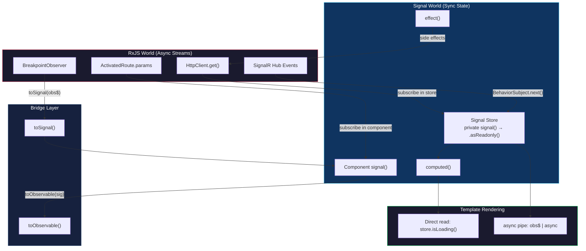

## Table of Contents

[🧠 **View Interactive Mindmap**](./rxjs-signals-mindmap.md)

1. [TL;DR](#tldr)
2. [Deep Dive](#deep-dive)
   2.1 [Observable Fundamentals](#concept-group-1-observable-fundamentals)
      2.1.1 [Observables — The Async Stream Primitive](#1-observables--the-async-stream-primitive)
      2.1.2 [Operators — Declarative Stream Transformation](#2-operators--declarative-stream-transformation)
      2.1.3 [Higher-Order Mapping — The Critical Interview Topic](#3-higher-order-mapping--the-critical-interview-topic)
      2.1.4 [Subjects — Observable + Observer Hybrid](#4-subjects--observable--observer-hybrid)
   2.2 [Angular Signals & State](#concept-group-2-angular-signals--state)
      2.2.1 [Signals — Synchronous Reactive State](#5-signals--synchronous-reactive-state)
      2.2.2 [The Signal Store Pattern](#6-the-signal-store-pattern)
      2.2.3 [Bridging RxJS and Signals — toSignal() and toObservable()](#7-bridging-rxjs-and-signals--tosignal-and-toobservable)
   2.3 [Subscription Management](#concept-group-3-subscription-management)
      2.3.1 [Subscription Lifecycle & Cleanup Strategies](#8-subscription-lifecycle--cleanup-strategies)
3. [Architecture & Data Flow](#architecture--data-flow)
4. [Real-World Examples](#real-world-examples)
   4.1 [switchMap with DPoP Nonce Retry](#1-switchmap-with-dpop-nonce-retry)
   4.2 [shareReplay for Multicast Auth State](#2-sharereplay-for-multicast-auth-state)
   4.3 [Signal-Based Store Pattern](#3-signal-based-store-pattern)
   4.4 [toSignal() Bridge with Debounce](#4-tosignal-bridge-with-debounce)
   4.5 [combineLatest for Permission-Filtered Menu](#5-combinlatest-for-permission-filtered-menu)
   4.6 [effect() for Reactive Side Effects](#6-effect-for-reactive-side-effects)
   4.7 [BehaviorSubject for Real-Time Connection State](#7-behaviorsubject-for-real-time-connection-state)
   4.8 [Debounced Search with Subject](#8-debounced-search-with-subject)
   4.9 [Case Study: RxJS vs Signals vs NgRx](#9-case-study-rxjs-vs-signals-vs-ngrx)
5. [Comparison Tables](#comparison-tables)
6. [Interview Q&A](#interview-qa)
   6.1 [L1: Junior](#l1-junior-knowledge)
      6.1.1 [Observable vs Promise](#l1-observable-vs-promise)
      6.1.2 [What is an Angular Signal?](#l1-what-is-an-angular-signal)
   6.2 [L2: Mid-Level](#l2-mid-level-knowledge)
      6.2.1 [switchMap vs concatMap vs exhaustMap](#l2-switchmap-vs-concatmap-vs-exhaustmap)
      6.2.2 [What is shareReplay and When to Use It?](#l2-what-is-sharereplay-and-when-to-use-it)
   6.3 [L3: Senior](#l3-senior-knowledge)
      6.3.1 [Designing a Signal-Based Store](#l3-designing-a-signal-based-store)
      6.3.2 [toSignal() Internals and Gotchas](#l3-tosignal-internals-and-gotchas)
   6.4 [Staff](#staff-system-architecture)
      6.4.1 [RxJS-only vs Signal-only vs Hybrid Architecture](#staff-rxjs-only-vs-signal-only-vs-hybrid-architecture)
      6.4.2 [Optimistic Updates with Rollback in a Signal Store](#staff-optimistic-updates-with-rollback-in-a-signal-store)
7. [Cross-References](#cross-references)
8. [Further Reading](#further-reading)

---

## TL;DR

RxJS provides <span style="color: #33b5e5; font-weight: bold;">event-driven</span> reactive programming with Observables — ideal for async streams, HTTP, and complex event coordination. Angular <span style="color: #33b5e5; font-weight: bold;">Signals</span> (16+) provide <span style="color: #00C851; font-weight: bold;">state-driven</span> reactivity — ideal for synchronous UI state, derived values, and fine-grained change detection. In `tai-portal`, the codebase uses a <span style="color: #00C851; font-weight: bold;">hybrid model</span>: RxJS for services that manage async streams (auth, real-time, HTTP) and hand-rolled Signal-based stores for component-facing state. The bridge function <span style="color: #33b5e5; font-weight: bold;">`toSignal()`</span> converts Observables into Signals at component boundaries. <span style="color: #ffbb33; font-weight: bold;">The key trade-off</span>: Signals cannot handle debouncing, throttling, or stream composition — you still need RxJS for time-based operators. For 2026 interviews: know higher-order mapping operators (`switchMap` vs `concatMap` vs `exhaustMap`), `shareReplay` for multicast, the Signal store pattern (private `signal()` → `.asReadonly()` → `computed()`), and when to use `toSignal()` vs the `async` pipe.

---

## Deep Dive

### Concept Group 1: Observable Fundamentals

#### 1. Observables — The Async Stream Primitive

##### What
An <span style="color: #33b5e5; font-weight: bold;">Observable</span> is a lazy, push-based collection that can emit zero or more values over time, then optionally complete or error. It is the RxJS equivalent of an async iterable.

##### Why
Without Observables, multi-value async streams require nested callbacks or manual event listener management. Promises resolve once; Observables model ongoing streams — WebSocket messages, route parameter changes, user keystrokes, polling intervals. Angular's `HttpClient`, `Router`, and `FormControl.valueChanges` all return Observables.

##### How
You create an Observable (or receive one from Angular), transform it with operators inside `.pipe()`, and activate it with `.subscribe()`. <span style="color: #00C851; font-weight: bold;">Nothing executes until subscribe is called</span> (lazy evaluation).

```typescript
// Cold Observable — each subscriber gets its own execution
const data$ = this.http.get<User[]>('/api/users');

// Transform with operators in .pipe()
const activeUsers$ = data$.pipe(
  map(users => users.filter(u => u.isActive)),
  catchError(err => {
    console.error(err);
    return of([]);  // fallback to empty array
  })
);

// Activate with subscribe — this triggers the HTTP call
activeUsers$.subscribe(users => this._users.set(users));
```

##### When
Use Observables when you have genuinely async, multi-value, or event-based data — HTTP calls, SignalR events, debounced search inputs, combining multiple async sources. For simple synchronous state (a boolean flag, a counter), <span style="color: #00C851; font-weight: bold;">Signals are dramatically simpler</span>.

##### Trade-offs
<span style="color: #ffbb33; font-weight: bold;">Observables carry cognitive overhead</span> — operator selection, subscription lifecycle, error propagation, and backpressure are all concerns. <span style="color: #ff4444; font-weight: bold;">Forgetting to unsubscribe</span> from long-lived Observables (WebSocket, interval timers) causes memory leaks. Cold Observables re-execute their producer for every subscriber, which can cause duplicate HTTP calls without `shareReplay`.

---

#### 2. Operators — Declarative Stream Transformation

##### What
<span style="color: #33b5e5; font-weight: bold;">Operators</span> are pure functions that take an Observable as input and return a new Observable without mutating the source. They are composed via `.pipe()` to build declarative data pipelines.

##### Why
Without operators, you would nest callbacks inside `.subscribe()` — the "callback hell" that RxJS was designed to eliminate. Operators let you express complex async logic (retry on failure, debounce input, cancel stale requests) as a readable pipeline.

##### How
Operators fall into categories:

| Category | Key Operators | Purpose |
|----------|--------------|---------|
| **Transformation** | `map`, `switchMap`, `mergeMap`, `concatMap`, `exhaustMap` | Shape data, chain async |
| **Filtering** | `filter`, `take`, `takeUntil`, `distinctUntilChanged`, `debounceTime` | Reduce emissions |
| **Combination** | `combineLatest`, `forkJoin`, `merge`, `withLatestFrom` | Join streams |
| **Error handling** | `catchError`, `retry`, `throwError` | Recover from failures |
| **Side effects** | `tap`, `finalize` | Debug, cleanup |
| **Multicasting** | `shareReplay`, `share` | Share subscriptions |

```typescript
// Declarative pipeline vs imperative nesting
const search$ = this.searchInput$.pipe(
  debounceTime(400),             // wait 400ms after typing stops
  distinctUntilChanged(),        // skip if same value
  switchMap(term =>              // cancel stale requests
    this.http.get<User[]>(`/api/users?q=${term}`)
  ),
  catchError(() => of([]))       // fallback on error
);
```

##### When
<span style="color: #00C851; font-weight: bold;">Always prefer operators inside `.pipe()` over imperative logic inside `.subscribe()`</span>. The subscribe callback should ideally do nothing more than trigger a side effect (update a signal, navigate, show a toast).

##### Trade-offs
<span style="color: #ffbb33; font-weight: bold;">The RxJS operator surface area is enormous (~100+ operators)</span>. In practice, you need ~15 operators for 95% of real-world Angular code. <span style="color: #ff4444; font-weight: bold;">Over-engineering with exotic operators hurts readability</span> for the team.

---

#### 3. Complex Nested Streams & Operator Deep Dive

##### What
<span style="color: #33b5e5; font-weight: bold;">Higher-order mapping operators</span> (`switchMap`, `mergeMap`, `concatMap`, `exhaustMap`) handle "nested streams" — where the result of one Observable triggers another Observable. 
<span style="color: #33b5e5; font-weight: bold;">Combination operators</span> (`combineLatest`, `forkJoin`, `merge`) handle orchestrating multiple parallel streams into a single cohesive output.

##### Why RxJS is Better Than Promises for Complex Async
A **Promise** is eager, resolves exactly once, and **cannot be cancelled**.
An **Observable** is lazy, can emit multiple values over time, and **can be cancelled**.

If you use `Promise.all` or `async/await` for a typeahead search, here is the problem:
1. User types "Ang". A Promise is created for the API call.
2. User types "Angular" 10ms later. A second Promise is created.
3. The "Angular" request finishes quickly and updates the UI.
4. The "Ang" request was slow. It finishes 2 seconds later and overwrites the UI.
**Result:** The UI shows results for "Ang", but the search box says "Angular". This is a classic race condition.

Promises cannot solve this cleanly because you cannot abort the first Promise natively without passing an `AbortController` everywhere. RxJS solves this trivially with `switchMap`.

##### How (The Mapping Operators)

| Operator | Concurrency | Cancels Previous? | Use Case |
|----------|-------------|-------------------|----------|
| `switchMap` | 1 (latest only) | ✅ Yes | Search typeahead, route params |
| `mergeMap` | Unlimited (parallel) | ❌ No | Parallel file uploads |
| `concatMap` | 1 (queued) | ❌ No | Sequential form saves |
| `exhaustMap` | 1 (ignores new) | ❌ No | Login button (prevent double-click) |

```typescript
// switchMap — Cancels previous requests. Essential for READ operations.
searchInput$.pipe(
  debounceTime(300),
  switchMap(term => this.http.get(`/api/search?q=${term}`))
  // Automatically calls .unsubscribe() on the "ang" HTTP request 
  // the moment "angular" is typed, preventing the race condition entirely!
);

// concatMap — Queues requests sequentially. Essential for WRITE operations.
saveButtonClicks$.pipe(
  concatMap(payload => this.http.post('/api/save', payload))
  // If the user clicks "Save" 3 times rapidly, it waits for the 1st to finish, 
  // then fires the 2nd, then the 3rd. Data integrity is preserved.
);

// exhaustMap — Ignores new events. Essential for ONE-SHOT actions.
loginButton$.pipe(
  exhaustMap(credentials => this.authService.login(credentials))
  // If the user rage-clicks "Login" 10 times, the 1st request fires.
  // The other 9 clicks are completely ignored until the 1st completes.
);
```

##### How (The Combination Operators)

In enterprise apps, you often need data from 3 different APIs before you can render a page.

| Operator | Behavior | Promise Equivalent | Use Case |
|----------|----------|--------------------|----------|
| `forkJoin` | Waits for all to **complete**, emits once. | `Promise.all` | Initial page load (fetch user + config + permissions) |
| `combineLatest` | Emits whenever **any** input changes. | None | Filtering a table (Data API + Search Signal + Sort Signal) |
| `merge` | Funnels multiple streams into one. | `Promise.race` (ish) | Combining clicks from 3 different "Refresh" buttons into one action |

```typescript
// 1. forkJoin: The "Promise.all" of RxJS
// Fails if any inner observable fails. Only emits when all three COMPLETE.
forkJoin({
  user: this.http.get('/api/user/1'),
  roles: this.http.get('/api/roles'),
  config: this.http.get('/api/config')
}).subscribe(({ user, roles, config }) => {
  // Render the dashboard
});

// 2. combineLatest: The ultimate UI reaction engine
// Emits an array of the LATEST values every time ANY source emits.
combineLatest([
  this.http.get('/api/table-data'), // Emits once
  this.searchControl.valueChanges,  // Emits every keystroke
  this.sortControl.valueChanges     // Emits on dropdown change
]).subscribe(([data, searchTerm, sortOrder]) => {
  // Re-run the client-side filter and sort.
  // Neither Promise.all nor async/await can do this, because Promises 
  // resolve exactly once. This stream stays alive forever!
});
```

##### Multiple Layers of Nested Streams (Advanced Orchestration)

In real enterprise applications, you rarely use just one operator. You frequently have to combine **Combination Operators** (like `combineLatest`) with **Mapping Operators** (like `switchMap`) to create deeply nested, reactive pipelines.

**Scenario:** You have a Data Table showing Users.
1. The user can type in a Search Box.
2. The user can change a "Department" Dropdown.
3. Every time EITHER of those change, you need to hit the API: `/api/users?search={term}&dept={dept}`.
4. If the user types fast, you must cancel the old API requests to prevent race conditions.

**The RxJS Solution:**
```typescript
// 1. Combine the UI inputs into a single stream of "Filters"
const filters$ = combineLatest([
  this.searchControl.valueChanges.pipe(debounceTime(300), startWith('')),
  this.departmentControl.valueChanges.pipe(startWith('ALL'))
]);

// 2. Map that stream of Filters into a stream of API Requests
const tableData$ = filters$.pipe(
  // Every time combineLatest emits a new [searchTerm, dept], switchMap triggers.
  // If a previous HTTP request is still running, switchMap ABORTS it instantly!
  switchMap(([searchTerm, dept]) => 
    this.http.get(`/api/users?search=${searchTerm}&dept=${dept}`).pipe(
      // 3. Nested error handling: Catch the error on the INNER observable
      // so the OUTER stream (the UI filters) doesn't die.
      catchError(error => {
        this.showToast('Failed to load users');
        return of([]); // Return empty array so the table clears safely
      })
    )
  )
);

// 3. Angular easily binds this entire orchestrator to the template
// <table *ngIf="tableData$ | async as users"> ... </table>
```

**Scenario 2: The Multi-Source Refresh Funnel (`merge` + `forkJoin`)**
You are building an Admin Dashboard. The dashboard requires fetching data from 3 separate microservices before it can render.
Furthermore, the dashboard needs to refresh under three different conditions:
1. When the page first loads.
2. When the user clicks a manual "Refresh" button.
3. Automatically every 5 minutes in the background.

**The RxJS Solution:**
```typescript
// 1. The Trigger Streams (merge)
// We use merge to funnel 3 entirely different events into a single "RefreshPulse" stream.
const refreshPulse$ = merge(
  of(true),                                   // Fires exactly once on page load
  fromEvent(this.refreshBtn, 'click'),        // Fires on manual button click
  interval(5 * 60 * 1000)                     // Fires every 5 minutes
);

// 2. The Data Fetching (forkJoin + switchMap)
const dashboardData$ = refreshPulse$.pipe(
  // When a pulse comes in, we switchMap to kill any ongoing fetch and start a new one
  switchMap(() => 
    // forkJoin fires all 3 requests in parallel and waits for all of them to finish
    forkJoin({
      users: this.http.get('/api/users/stats'),
      sales: this.http.get('/api/sales/daily'),
      alerts: this.http.get('/api/system/alerts')
    }).pipe(
      catchError(error => {
        // If ANY of the 3 requests fail, forkJoin fails. We catch it here.
        this.showToast('Failed to refresh dashboard');
        return of({ users: null, sales: null, alerts: null }); 
      })
    )
  )
);
```

**Why this is a masterpiece:**
This single RxJS pipeline replaces hundreds of lines of messy `setTimeout` debouncing, cancellation tokens, boolean loading flags, and nested `if/else` statements. It is perfectly race-condition proof, memory-leak proof (thanks to the async pipe), and handles errors gracefully without breaking the UI. This level of orchestration is exactly why RxJS is still required alongside Angular Signals.

**Scenario 3: "Smart" Long Polling (Auto-Pause on Blur)**
You are building a live "Active Incidents" dashboard. It needs to fetch new data from `/api/incidents` every 10 seconds.
1. If the API is slow and takes 12 seconds, you must *not* fire the next 10-second poll until the current one finishes (preventing a stampede of piled-up requests).
2. If the user minimizes the browser or switches to another tab, **the polling must pause** to save server resources and battery life, and instantly resume when they come back.

**The RxJS Solution:**
```typescript
// 1. Listen to the browser's Visibility API
const isVisible$ = fromEvent(document, 'visibilitychange').pipe(
  map(() => document.visibilityState === 'visible'),
  startWith(document.visibilityState === 'visible') // Kick it off with current state
);

// 2. The Smart Poller
const activeIncidents$ = isVisible$.pipe(
  // switchMap acts as the "Pause/Resume" switch.
  // If visibility goes false, switchMap switches to an empty stream (NEVER), killing the timer.
  // If visibility goes true, switchMap switches back to the timer.
  switchMap(isVisible => {
    if (!isVisible) return NEVER; // NEVER just sits there doing nothing
    
    // If visible, start a timer that ticks every 10 seconds
    return timer(0, 10000).pipe(
      // exhaustMap acts as the "Traffic Cop".
      // If the timer ticks, but the previous HTTP request is still pending, 
      // exhaustMap ignores the tick! No piled-up requests.
      exhaustMap(() => 
        this.http.get('/api/incidents').pipe(
          catchError(() => of([])) // Keep the poller alive if the server blips
        )
      )
    );
  })
);
```

**Scenario 4: Infinite Scroll with State Accumulation (`scan`)**
You are building an Infinite Scroll feed (like Twitter or an Audit Log). 
1. The user scrolls to the bottom of the page, which increments the `pageNumber`.
2. The user can also change a "Category" dropdown filter at the top.
3. If they scroll down, the new HTTP results must be **appended** to the existing list on the screen.
4. If they change the Category dropdown, the list must be **cleared completely**, the page reset to 1, and the new filtered results shown.

**The RxJS Solution:**
```typescript
// 1. The Inputs
const categoryChange$ = this.categoryControl.valueChanges;
const loadNextPage$ = new Subject<void>(); // Fired when user scrolls to bottom

// 2. The Page Tracker (Reset to 1 on category change, increment on scroll)
const page$ = merge(
  categoryChange$.pipe(map(() => 1)),             // Reset to page 1
  loadNextPage$.pipe(map(() => 'INCREMENT'))      // Signal to increment
).pipe(
  // scan is the RxJS equivalent of Array.reduce(). It accumulates state over time!
  scan((currentPage, instruction) => {
    return instruction === 'INCREMENT' ? currentPage + 1 : 1;
  }, 1)
);

// 3. The Orchestrator
const feedData$ = combineLatest([ categoryChange$, page$ ]).pipe(
  // Fetch the data for the current category and page
  switchMap(([category, page]) => 
    this.http.get(`/api/feed?category=${category}&page=${page}`).pipe(
      // Pass the 'page' number down the pipe alongside the data so we know what to do with it
      map(newData => ({ page, newData }))
    )
  ),
  // 4. The Accumulator (The Magic Step)
  // scan accumulates the data. If it's page 1, we replace the array. 
  // If it's page > 1, we append to the array.
  scan((accumulatedData, result) => {
    if (result.page === 1) {
      return result.newData; // Overwrite (user changed category)
    } else {
      return [...accumulatedData, ...result.newData]; // Append (user scrolled down)
    }
  }, [])
);
```

**Scenario 5: The Resilient API Call (Exponential Backoff with Jitter)**
Enterprise APIs fail. Networks drop. A junior engineer uses `catchError` to show a toast. A 10-year engineer uses `retry` with exponential backoff to make the system resilient without bringing down the server with an immediate retry stampede.

**The RxJS Solution:**
```typescript
const resilientData$ = this.http.get('/api/fragile-service').pipe(
  retry({
    count: 3, // Try a maximum of 3 times before finally throwing the error
    delay: (error, retryCount) => {
      // Exponential backoff: 1s, 2s, 4s...
      const baseDelay = Math.pow(2, retryCount - 1) * 1000;
      // Jitter: Add up to 500ms of randomness to prevent DDoSing the server 
      // if 1000 clients all reconnect at the exact same millisecond.
      const jitter = Math.random() * 500;
      return timer(baseDelay + jitter);
    }
  }),
  catchError(error => {
    this.showToast('Service is currently unavailable.');
    return of(null);
  })
);
```

**Scenario 6: The Invalidate-able Cache (`shareReplay` + Refresh Trigger)**
You have heavy configuration data (like Roles/Permissions) that 5 different components need. You don't want to fetch it 5 times. You want to cache it, but you *also* need a way to force-refresh that cache when the user clicks a "Sync" button.

**The RxJS Solution:**
```typescript
// 1. The Trigger (BehaviorSubject starts with 'undefined' to fire immediately on load)
private readonly forceRefresh$ = new BehaviorSubject<void>(undefined);

// 2. The Cache Pipeline
public readonly cachedRoles$ = this.forceRefresh$.pipe(
  // Every time the trigger fires, fetch from the API
  switchMap(() => this.http.get('/api/roles')),
  // Cache the LAST (1) emission. Any new subscribers get the cached value instantly
  // without triggering a new HTTP request.
  shareReplay(1) 
);

// 3. To invalidate the cache from anywhere in the app:
public refreshRoles(): void {
  this.forceRefresh$.next(); // Forces switchMap to re-fire the HTTP call!
}
```

##### When
- Use <span style="color: #00C851; font-weight: bold;">`switchMap`</span> for read operations where only the latest data matters.
- Use <span style="color: #00C851; font-weight: bold;">`concatMap`</span> for write operations where order and completion matter.
- Use <span style="color: #00C851; font-weight: bold;">`combineLatest`</span> to derive UI state that depends on multiple changing inputs.

##### Trade-offs
<span style="color: #ff4444; font-weight: bold;">Using `mergeMap` where you need `switchMap` causes severe race conditions</span> (stale responses overwriting fresh ones). <span style="color: #ff4444; font-weight: bold;">Using `switchMap` for writes can silently corrupt data</span> (user clicks "Save Profile" then "Change Password", and the "Save Profile" HTTP POST is aborted mid-flight!). Getting this wrong is the #1 source of production bugs in RxJS-heavy applications.

---

#### 4. Subjects — Observable + Observer Hybrid

##### What
A <span style="color: #33b5e5; font-weight: bold;">Subject</span> is both an Observable (you can subscribe to it) and an Observer (you can call `.next()` to push values). It acts as a multicast event bus — the "on-ramp" for imperative values into the reactive Observable world.

##### Why
Without Subjects, there is no way to bridge imperative code (button clicks, manual events) into Observable pipelines. They are essential for converting DOM events, SignalR callbacks, and timer-based events into streams that can be composed with operators.

##### How

| Type | Initial Value? | Replays? | Use Case |
|------|---------------|----------|----------|
| `Subject` | No | No | Event bus, destroy notifier |
| `BehaviorSubject` | Yes (required) | Last value to new subscribers | Current state (connection status) |
| `ReplaySubject(n)` | No | Last `n` values | Late subscribers need history |
| `AsyncSubject` | No | Only the final value on complete | Rare; cache a single result |

```typescript
// tai-portal: BehaviorSubject for SignalR connection state
private readonly _connectionStatus$ = new BehaviorSubject<HubConnectionState>(
  HubConnectionState.Disconnected
);
public readonly connectionStatus$ = this._connectionStatus$.asObservable();

// tai-portal: Subject as imperative search bridge
private readonly searchSubject = new Subject<string>();
// Template calls: onSearch(term) → searchSubject.next(term)
```

##### When
Use <span style="color: #00C851; font-weight: bold;">`BehaviorSubject` when subscribers need the current value immediately</span> (e.g., connection status). Use plain `Subject` for fire-and-forget events (destroy notifier, search input bridge). <span style="color: #ff4444; font-weight: bold;">Avoid Subjects as a general-purpose state container</span> — Signals are better for that in Angular 17+.

##### Trade-offs
<span style="color: #ff4444; font-weight: bold;">Exposing a `Subject` publicly lets any consumer call `.next()`, breaking unidirectional data flow</span>. Always expose as `.asObservable()` and keep the Subject private. <span style="color: #ffbb33; font-weight: bold;">`BehaviorSubject` requires an initial value</span> — choose it carefully, as late subscribers receive it immediately even if no "real" event has occurred.

---

#### 5. RxJS in NgRx (Effects & State Management)

##### What
<span style="color: #33b5e5; font-weight: bold;">NgRx</span> is the Redux-inspired global state management library for Angular. It heavily relies on RxJS across its architecture. Most notably, **NgRx Effects** (`@ngrx/effects`) use RxJS to isolate all side effects (like HTTP calls) from components.

##### Why
In an enterprise application, triggering side effects directly from components makes them impossible to test cleanly and litters them with subscription management code. NgRx Effects moves side-effect orchestration into isolated, testable RxJS streams that listen to specific Actions being dispatched and return new Actions as a result.

##### How
Effects are continuous RxJS streams that listen to an `Actions` observable.

```typescript
@Injectable()
export class UserEffects {
  private actions$ = inject(Actions);
  private http = inject(HttpClient);

  // 1. The Effect listens for the 'loadUsers' action
  loadUsers$ = createEffect(() =>
    this.actions$.pipe(
      ofType(UserActions.loadUsers), // Filter the stream to only this action
      
      // 2. Use the correct Higher-Order Mapping Operator!
      // We use switchMap here so if 'loadUsers' is dispatched twice, 
      // the first HTTP request is aborted!
      switchMap(action => 
        this.http.get<User[]>(`/api/users?dept=${action.department}`).pipe(
          
          // 3. Map the successful HTTP response to a 'Success' Action
          map(users => UserActions.loadUsersSuccess({ users })),
          
          // 4. Catch the error on the INNER stream, returning a 'Failure' Action.
          // If we caught this on the outer stream, the Effect would permanently DIE!
          catchError(error => of(UserActions.loadUsersFailure({ error: error.message })))
        )
      )
    )
  );
}
```

##### When
Use NgRx and Effects for complex global state where multiple components across different routes need to trigger or react to the same side effects. For localized feature state, Signal Stores are simpler and preferred in Angular 17+.

##### Trade-offs
<span style="color: #ff4444; font-weight: bold;">The "Dead Effect" bug is incredibly common</span>: If an HTTP call fails and you put the `catchError` on the *outer* `actions$` stream instead of the *inner* `switchMap` stream, the entire Effect crashes permanently. The user clicks the button again, and nothing happens! You must always catch errors inside the inner observable of an Effect.

---

### Concept Group 2: Angular Signals & State

#### 6. Signals — Synchronous Reactive State

##### What
<span style="color: #33b5e5; font-weight: bold;">Signals</span> are Angular's built-in reactive primitive (Angular 16+). A `signal()` holds a value, `computed()` derives values from other signals, and `effect()` runs side effects when signals change. Unlike Observables, <span style="color: #00C851; font-weight: bold;">Signals are synchronous and always have a current value</span>.

##### Why
Before Signals, Angular developers used `BehaviorSubject` + `async` pipe or mutable component properties with manual `ChangeDetectorRef.markForCheck()`. Signals eliminate this boilerplate and enable <span style="color: #00C851; font-weight: bold;">fine-grained change detection</span> — Angular can know exactly which signal changed, instead of dirty-checking the entire component tree.

##### How
- `signal(initialValue)` — writable, holds state
- `computed(() => ...)` — read-only, derives from other signals, <span style="color: #33b5e5; font-weight: bold;">memoized</span> (only re-evaluates when dependencies change)
- `effect(() => ...)` — runs side effects when tracked signals change (similar to `autorun` in MobX)
- `.set(value)`, `.update(fn)` — mutate a writable signal
- `.asReadonly()` — expose a read-only view (prevents external writes)

```typescript
// From tai-portal: PrivilegesStore
private readonly _privileges = signal<Privilege[]>([]);
private readonly _status = signal<PrivilegesStatus>('Idle');

// Read-only public view
public readonly privileges = this._privileges.asReadonly();

// Derived state — memoized, auto-tracks dependencies
public readonly isLoading = computed(() => this._status() === 'Loading');
public readonly isError = computed(() => this._status() === 'Error');
```

##### When
Use Signals for all component/store state that is synchronous — loading flags, form state, UI toggles, derived display values. Use Observables only when you genuinely need async stream semantics (debounce, retry, combine multiple async sources).

##### Trade-offs
<span style="color: #ffbb33; font-weight: bold;">Signals do not replace RxJS for async coordination</span> — no `switchMap` equivalent, no debouncing, no throttling, no cancellation. The two systems are complementary, not competitive. <span style="color: #ff4444; font-weight: bold;">`effect()` has restrictions</span>: writing to signals inside an effect requires `allowSignalWrites` (or use `untracked()`), and effects run asynchronously after the current synchronous block completes.

---

#### 7. The Signal Store Pattern

##### What
A pattern where an <span style="color: #33b5e5; font-weight: bold;">`@Injectable()` service</span> uses private `signal()` fields for state, exposes them as `.asReadonly()` public properties, derives UI-facing booleans with `computed()`, and mutates state imperatively inside HTTP `.subscribe()` callbacks.

##### Why
Without this pattern, you either use NgRx (heavy ceremony: actions, reducers, effects, selectors) or ad-hoc component state (spaghetti). The Signal store is the <span style="color: #00C851; font-weight: bold;">sweet spot for medium-complexity apps</span> — predictable state management without the boilerplate tax.

##### How
```
Private signal (write) → .asReadonly() (public read) → computed() (derived)
```

Store methods follow the pattern: set status to `'Loading'` → call HTTP service → in `subscribe({ next, error })` update signals → `computed()` derives `isLoading`, `isError`, etc.

```typescript
// tai-portal: UsersStore action method pattern
loadUsers(): void {
  this._status.set('Loading');
  this.usersService.getUsers(params).subscribe({
    next: (response) => {
      this._users.set(response.items);
      this._totalCount.set(response.totalCount);
      this._status.set('Success');
    },
    error: (err) => {
      this._errorMessage.set(err.message);
      this._status.set('Error');
    }
  });
}
```

##### When
Use for feature-level state that multiple components need to share (e.g., a user list with pagination, sorting, search). For simple local component state, a plain `signal()` in the component is sufficient. For massive enterprise state with time-travel debugging needs, consider NgRx.

##### Trade-offs
<span style="color: #ffbb33; font-weight: bold;">No action replay, no devtools, no effect isolation</span>. The store methods are imperative — if you need to coordinate multiple async operations with cancellation semantics, you may want to bring RxJS operators back into the store layer. <span style="color: #ff4444; font-weight: bold;">Unsubscribed HTTP calls in stores can technically leak</span> if the service is destroyed (mitigated by `providedIn: 'root'` singleton lifetime).

---

#### 8. Bridging RxJS and Signals — toSignal() and toObservable()

##### What
<span style="color: #33b5e5; font-weight: bold;">`toSignal()`</span> converts an Observable into a Signal. <span style="color: #33b5e5; font-weight: bold;">`toObservable()`</span> converts a Signal into an Observable. Both are in `@angular/core/rxjs-interop`.

##### Why
The Angular ecosystem is in transition. Libraries like `BreakpointObserver`, `HttpClient`, and `ActivatedRoute` still return Observables. Components increasingly want Signals for template binding and fine-grained reactivity. The bridge functions let you adopt Signals incrementally without rewriting every service.

##### How
- `toSignal(obs$, { initialValue })` — subscribes to the Observable, updates the signal on each emission. Requires an `initialValue` if the Observable doesn't emit synchronously.
- `toSignal(obs$)` — without `initialValue`, the signal type is `T | undefined`.
- `toObservable(signal)` — emits whenever the signal value changes.
- <span style="color: #00C851; font-weight: bold;">`toSignal()` automatically unsubscribes</span> when the injection context (component/service) is destroyed — no manual cleanup needed.

```typescript
// From tai-portal: transfer-list.ts — Observable → Signal bridge
public readonly isSmallScreen = toSignal(
  this.breakpointObserver.observe([Breakpoints.XSmall, Breakpoints.Small])
    .pipe(map(result => result.matches)),
  { initialValue: false }
);

// Debounced search: RxJS for time-based ops, Signal for template
public readonly searchTermAvailable = toSignal(
  this.searchTermAvailable$.pipe(debounceTime(300), distinctUntilChanged()),
  { initialValue: '' }
);
```

##### When
Use `toSignal()` at the boundary where Observable-based services meet Signal-based components. Use `toObservable()` when you need to feed a Signal into an RxJS pipeline (e.g., debounce a signal value).

##### Trade-offs
<span style="color: #ff4444; font-weight: bold;">`toSignal()` can only be called in an injection context</span> — constructor, field initializer, or inside `runInInjectionContext()`. Calling it in `ngOnInit()` or an event handler throws `NG0203`. <span style="color: #ffbb33; font-weight: bold;">Eager subscription</span> — the Observable is subscribed immediately. If the Observable has side effects (like an HTTP call), it fires on construction. <span style="color: #ffbb33; font-weight: bold;">Synchronous emissions are coalesced</span> — only the last value is reflected in the Signal.

---

### Concept Group 3: Subscription Management

#### 9. Subscription Lifecycle & Cleanup Strategies

##### What
<span style="color: #33b5e5; font-weight: bold;">Subscription management</span> is the discipline of ensuring every Observable subscription is properly cleaned up when no longer needed — preventing memory leaks, stale callbacks, and phantom HTTP requests.

##### Why
<span style="color: #ff4444; font-weight: bold;">Without proper cleanup, subscriptions to long-lived Observables (WebSocket, interval, route params) keep running after the component is destroyed</span>, causing memory leaks and ghost updates. This is the #1 source of RxJS bugs in Angular apps.

##### How

| Pattern | Where Used in tai-portal | Automatic Cleanup? |
|---------|--------------------------|-------------------|
| `async` pipe | `app.html` | ✅ Unsubscribes on component destroy |
| `toSignal()` | `transfer-list.ts` | ✅ Unsubscribes when injection context destroyed |
| `takeUntil(destroy$)` | `has-privilege.directive.ts` | ✅ Manual but reliable |
| `take(1)` | Guards (`navigation.guard.ts`) | ✅ Completes after first emission |
| `takeUntilDestroyed()` | *Not yet adopted* | ✅ Modern replacement for `takeUntil` |
| Unmanaged `.subscribe()` | Stores, pages | <span style="color: #ff4444; font-weight: bold;">❌ Relies on singleton lifetime</span> |

```typescript
// ✅ Modern pattern (Angular 19+): takeUntilDestroyed
private destroyRef = inject(DestroyRef);

ngOnInit() {
  this.route.params.pipe(
    takeUntilDestroyed(this.destroyRef)
  ).subscribe(params => this.loadData(params['id']));
}

// ✅ Legacy but reliable: takeUntil with Subject
private readonly destroy$ = new Subject<void>();

ngOnDestroy() {
  this.destroy$.next();
  this.destroy$.complete();
}
```

##### When
<span style="color: #00C851; font-weight: bold;">Best practice (Angular 19+)</span>: Prefer `toSignal()` for template-consumed values, `takeUntilDestroyed(destroyRef)` for imperative subscriptions, and `async` pipe as a fallback. <span style="color: #ff4444; font-weight: bold;">Avoid unmanaged `.subscribe()` in components</span>.

##### Trade-offs
<span style="color: #ffbb33; font-weight: bold;">`takeUntilDestroyed()` must be called in an injection context</span> (same constraint as `toSignal()`). If you need to subscribe in `ngOnInit()`, inject `DestroyRef` and pass it explicitly. <span style="color: #ffbb33; font-weight: bold;">The `async` pipe creates a new subscription per template binding</span> — using `shareReplay(1)` or combining into a single view model Observable avoids duplicate work.

---

### Architecture & Data Flow

This diagram shows how RxJS and Signals coexist in tai-portal's reactive architecture:


```mermaid
flowchart TB
    subgraph RxJS["RxJS World (Async Streams)"]
        HTTP["HttpClient.get()"]
        WS["SignalR Hub Events"]
        Route["ActivatedRoute.params"]
        BP["BreakpointObserver"]
    end

    subgraph Bridge["Bridge Layer"]
        toSig["toSignal()"]
        toObs["toObservable()"]
    end

    subgraph Signals["Signal World (Sync State)"]
        Store["Signal Store<br/>private signal() → .asReadonly()"]
        Comp["Component signal()"]
        Derived["computed()"]
        FX["effect()"]
    end

    subgraph Template["Template Rendering"]
        Direct["Direct read: store.isLoading()"]
        Async["async pipe: obs$ | async"]
    end

    HTTP -->|"subscribe in store"| Store
    WS -->|"BehaviorSubject.next()"| Store
    BP -->|"toSignal(obs$)"| toSig --> Comp
    Route -->|"subscribe in component"| Comp
    Store --> Derived
    Derived --> Direct
    Comp -->|"toObservable(sig)"| toObs
    FX -->|"side effects"| HTTP
    Store --> Async

    style RxJS fill:#1a1a2e,stroke:#e94560,color:#fff
    style Bridge fill:#16213e,stroke:#0f3460,color:#fff
    style Signals fill:#0f3460,stroke:#53d8fb,color:#fff
    style Template fill:#1a1a2e,stroke:#00C851,color:#fff
```

---

## Real-World Examples

### 1. switchMap with DPoP Nonce Retry

📍 From tai-portal: `apps/portal-web/src/app/dpop.interceptor.ts`

Demonstrates `from()` (Promise → Observable), `switchMap` (chain async operations), and `catchError` (conditional retry) in a real security flow.

```typescript
const executeWithDPoP = (nonce?: string) => {
  return from(dpopService.getDPoPHeader(req.method, req.url, accessToken, nonce)).pipe(
    switchMap(dpopHeader => {
      let headers = req.headers.set('DPoP', dpopHeader);
      if (accessToken) {
        headers = headers.set('Authorization', `DPoP ${accessToken}`);
      }
      const clonedReq = req.clone({ headers });
      return next(clonedReq);
    })
  );
};

return executeWithDPoP().pipe(
  catchError((error: unknown) => {
    if (error instanceof HttpErrorResponse && error.status === 401) {
      const nonce = error.headers.get('DPoP-Nonce');
      if (nonce) {
        return executeWithDPoP(nonce);  // Retry with server nonce
      }
    }
    return throwError(() => error);
  })
);
```

---

### 2. shareReplay for Multicast Auth State

📍 From tai-portal: `apps/portal-web/src/app/auth.service.ts`

Without `shareReplay(1)`, every subscriber (navigation guard, privilege directive, menu component) would trigger a separate evaluation of the OIDC userData stream.

```typescript
public readonly user$: Observable<User | null> = this.oidcSecurityService.userData$.pipe(
  map((result) => {
    const data = result?.userData;
    if (!data) return null;
    return {
      id: data.sub,
      email: data.email,
      name: data.name,
      privileges: data.privileges || [],
      tenantId: data.tenant_id
    };
  }),
  shareReplay(1)  // Cache last value — late subscribers get it immediately
);

public readonly isAuthenticated$: Observable<boolean> = this.user$.pipe(
  map((user) => !!user)
);
```

---

### 3. Signal-Based Store Pattern

📍 From tai-portal: `apps/portal-web/src/app/features/users/users.store.ts`

The hand-rolled store pattern that replaces NgRx for medium-complexity state:

```typescript
@Injectable({ providedIn: 'root' })
export class UsersStore {
  private readonly usersService = inject(UsersService);

  // Private writable signals
  private readonly _users = signal<User[]>([]);
  private readonly _status = signal<UsersStatus>('Idle');
  private readonly _errorMessage = signal<string | null>(null);
  private readonly _totalCount = signal<number>(0);
  private readonly _pageIndex = signal<number>(1);
  private readonly _pageSize = signal<number>(10);

  // Public read-only views
  public readonly users = this._users.asReadonly();
  public readonly status = this._status.asReadonly();
  public readonly totalCount = this._totalCount.asReadonly();
  public readonly isLoading = computed(() => this._status() === 'Loading');
  public readonly isError = computed(() => this._status() === 'Error');

  loadUsers(): void {
    this._status.set('Loading');
    this.usersService.getUsers(/* params */)
      .pipe(finalize(() => { /* cleanup */ }))
      .subscribe({
        next: (response) => {
          this._users.set(response.items);
          this._totalCount.set(response.totalCount);
          this._status.set('Success');
        },
        error: (err) => {
          this._errorMessage.set(err.message);
          this._status.set('Error');
        }
      });
  }
}
```

---

### 4. toSignal() Bridge with Debounce

📍 From tai-portal: `libs/ui/design-system/src/lib/design-system/transfer-list/transfer-list.ts`

The canonical example of why both RxJS and Signals coexist: `debounceTime` and `distinctUntilChanged` are things Signals cannot do natively — you need RxJS. But the result feeds into `computed()` — you need Signals.

```typescript
// Observable → Signal: responsive breakpoint
public readonly isSmallScreen = toSignal(
  this.breakpointObserver.observe([Breakpoints.XSmall, Breakpoints.Small])
    .pipe(map((result) => result.matches)),
  { initialValue: false }
);

// Subject as imperative on-ramp → debounced → Signal
private readonly searchTermAvailable$ = new Subject<string>();

public readonly searchTermAvailable = toSignal(
  this.searchTermAvailable$.pipe(debounceTime(300), distinctUntilChanged()),
  { initialValue: '' }
);

// Signal feeds computed for filtered list
public readonly availableItems = computed(() => {
  const search = this.searchTermAvailable().toLowerCase();
  return this.items().filter(item =>
    !this.assignedIds().has(item[this.trackKey()]) &&
    item[this.displayKey()].toString().toLowerCase().includes(search)
  );
});
```

---

### 5. combineLatest for Permission-Filtered Menu

📍 From tai-portal: `apps/portal-web/src/app/app.ts`

`combineLatest` waits for all privilege checks to resolve before rendering the menu. Demonstrates the `async` pipe — Angular's automatic subscription management in templates.

```typescript
protected menuItems$ = combineLatest(
  this.allMenuItems.map(item =>
    item.requiredPrivilege
      ? this.authService.hasPrivilege(item.requiredPrivilege)
          .pipe(map(has => ({ item, has })))
      : combineLatest([of(item), of(true)])
          .pipe(map(([i, h]) => ({ item: i, has: h })))
  )
).pipe(
  map(results => results.filter(r => r.has).map(r => r.item))
);

// In template:
// @if (isAuthenticated$ | async) {
//   <app-shell [menuItems]="(menuItems$ | async) || []" />
// }
```

---

### 6. effect() for Reactive Side Effects

📍 From tai-portal: `apps/portal-web/src/app/features/users/user-detail.page.ts`

`effect()` tracks all signals read inside it and re-runs when any change. Replaces the pattern of subscribing to a store's state Observable and imperatively managing form sync.

```typescript
constructor() {
  effect(() => {
    const user = this.store.selectedUser();
    const status = this.store.status();

    // React to save completion
    if (this.isSaving() && (status === 'Success' || status === 'Conflict' || status === 'Error')) {
      this.isSaving.set(false);
      if (status === 'Success') {
        this.isEditing.set(false);
      }
    }

    // Sync form when user loads during edit
    if (user && this.isEditing()) {
      this.editForm.patchValue({
        firstName: user.firstName,
        lastName: user.lastName,
        email: user.email,
      });
    }
  });
}
```

---

### 7. BehaviorSubject for Real-Time Connection State

📍 From tai-portal: `apps/portal-web/src/app/real-time.service.ts`

`BehaviorSubject` guarantees late subscribers get the current connection state immediately. `.asObservable()` hides `.next()` from consumers, enforcing unidirectional data flow.

```typescript
private readonly _connectionStatus$ = new BehaviorSubject<HubConnectionState>(
  HubConnectionState.Disconnected
);
public readonly connectionStatus$ = this._connectionStatus$.asObservable();

private readonly _securityEvents$ = new BehaviorSubject<AuditLogDetails | null>(null);
public readonly securityEvents$ = this._securityEvents$.asObservable();

async startConnection(): Promise<void> {
  // ...
  this._connectionStatus$.next(HubConnectionState.Connected);

  this.hubConnection.on('ReceiveSecurityEvent', (event: AuditLogDetails) => {
    NgZone.run(() => {
      this._securityEvents$.next(event);  // Re-enter Angular zone
    });
  });
}
```

---

### 8. Debounced Search with Subject

📍 From tai-portal: `apps/portal-web/src/app/features/users/users.page.ts`

Subject acts as a bridge between imperative DOM events and the reactive pipeline. `debounceTime(400)` waits after the user stops typing, and `distinctUntilChanged()` prevents duplicate searches.

```typescript
private readonly searchSubject = new Subject<string>();

constructor() {
  this.searchSubject.pipe(
    debounceTime(400),
    distinctUntilChanged()
  ).subscribe(search => {
    this.updateUrl({ search, page: 1 });
  });
}

// Called from template input event:
onSearch(term: string): void {
  this.searchSubject.next(term);
}
```

---

### 9. Case Study: RxJS vs Signals vs NgRx

To truly understand *why* you need to learn Signals and how they complement (not replace) RxJS and NgRx, let's look at the exact same problem solved three different ways.

**The Problem: "The User Profile Editor"**
You have a component that fetches a User Profile from the API. The user can type into a "Name" input field. When they click "Save", you send a `PUT` request to the API. While it's saving, a loading spinner shows. If it fails, an error message shows.

#### Example A: The Pure RxJS Approach (Angular 15 and older)
Before Signals existed, you had to use `BehaviorSubject` to hold state, and the `async` pipe to render it.

```typescript
@Component({
  template: `
    <div *ngIf="state$ | async as state">
      <input [ngModel]="state.name" (ngModelChange)="updateName($event)">
      <button (click)="save()" [disabled]="state.isSaving">Save</button>
      <p *ngIf="state.error">{{ state.error }}</p>
    </div>
  `
})
export class UserProfileComponent {
  // 1. You have to create a complex BehaviorSubject to hold the state
  private stateSubj = new BehaviorSubject({ name: '', isSaving: false, error: null });
  state$ = this.stateSubj.asObservable();

  // 2. You have to manually track the HTTP subscription to avoid memory leaks
  private saveSub?: Subscription;

  updateName(name: string) {
    // 3. Modifying state is clunky (you have to spread the old state)
    this.stateSubj.next({ ...this.stateSubj.value, name });
  }

  save() {
    this.stateSubj.next({ ...this.stateSubj.value, isSaving: true, error: null });
    
    this.saveSub = this.http.put('/api/user', { name: this.stateSubj.value.name }).subscribe({
      next: () => this.stateSubj.next({ ...this.stateSubj.value, isSaving: false }),
      error: (e) => this.stateSubj.next({ ...this.stateSubj.value, isSaving: false, error: e.message })
    });
  }

  ngOnDestroy() {
    // 4. You must remember to unsubscribe, or you cause a memory leak!
    this.saveSub?.unsubscribe();
  }
}
```
**Why this is bad (Why Signals were invented):**
This is a massive amount of boilerplate just to hold a string and a boolean. You have to use the `async` pipe. Every time the `async` pipe receives a new value, Angular performs **Change Detection on the entire component tree**, which is very slow. You also have to manually manage `Subscription` objects, which causes memory leaks if you forget.

#### Example B: The Hybrid Approach (Angular 16+ Signals + RxJS)
This is the modern, recommended approach for 90% of your components. We use **Signals** to hold the synchronous state, and **RxJS** only for the asynchronous HTTP call.

```typescript
@Component({
  template: `
    <!-- 1. No async pipe needed! Just read the signal as a function. -->
    <input [ngModel]="name()" (ngModelChange)="name.set($event)">
    <button (click)="save()" [disabled]="isSaving()">Save</button>
    
    @if (error()) { <p>{{ error() }}</p> }
  `
})
export class UserProfileComponent {
  // 2. State is incredibly simple. Just individual Signals.
  name = signal('');
  isSaving = signal(false);
  error = signal<string | null>(null);

  // 3. We still need RxJS for the HTTP call! 
  // But we use takeUntilDestroyed so we NEVER have to write ngOnDestroy() again.
  private destroyRef = inject(DestroyRef);

  save() {
    this.isSaving.set(true);
    this.error.set(null);

    this.http.put('/api/user', { name: this.name() })
      .pipe(takeUntilDestroyed(this.destroyRef))
      .subscribe({
        next: () => this.isSaving.set(false),
        error: (e) => {
          this.isSaving.set(false);
          this.error.set(e.message);
        }
      });
  }
}
```
**Why this is a masterpiece:**
*   **Zero Boilerplate:** The code is half the size. Updating state is as simple as `this.name.set(val)`.
*   **No Memory Leaks:** `takeUntilDestroyed` automatically cleans up the HTTP subscription when the user leaves the page.
*   **Blazing Fast Performance:** When `isSaving.set(false)` is called, Angular does NOT check the whole component tree. It knows exactly which `<button>` is bound to `isSaving()` and surgically updates that one single DOM node. That is why you **must** learn Signals!

#### Example C: The NgRx Approach (Global State Management)
If Signals are so great, why do we ever use NgRx? Let's say this User Profile isn't just a simple page. Let's say the user's Name is also displayed in the top Navigation Bar, the Sidebar, and the Chat Widget.

If you use local Signals (Example B), the Sidebar won't know the name changed until the user refreshes the page! 

```typescript
// 1. The Component just dispatches an Action. It holds NO state.
@Component({
  template: `
    <input [ngModel]="name()" (ngModelChange)="updateName($event)">
    <button (click)="save()" [disabled]="isSaving()">Save</button>
  `
})
export class UserProfileComponent {
  // We read the global state from NgRx using selectSignal
  name = this.store.selectSignal(selectUserName);
  isSaving = this.store.selectSignal(selectIsSaving);

  updateName(name: string) {
    this.store.dispatch(UserActions.nameChanged({ name }));
  }

  save() {
    this.store.dispatch(UserActions.saveProfile());
  }
}

// 2. The NgRx Effect intercepts the Action and does the RxJS work
@Injectable()
export class UserEffects {
  saveProfile$ = createEffect(() => this.actions$.pipe(
    ofType(UserActions.saveProfile),
    // We MUST use concatMap here. If they click save 3 times, we want to queue them up!
    concatMap(() => this.http.put('/api/user', { name: this.store.selectSignal(selectUserName)() }).pipe(
      map(() => UserActions.saveSuccess()),
      catchError(error => of(UserActions.saveFailure({ error: error.message })))
    ))
  ));
}
```
**Why you use this:**
When `UserActions.saveSuccess()` fires, the NgRx Reducer updates the global state. Because the Navigation Bar, Sidebar, and Chat Widget are all "Selected" to that same global state, **every component across the entire application instantly updates simultaneously.**

**Summary:**
*   **RxJS Only:** Obsolete for component state. Causes memory leaks and poor performance.
*   **Signals + RxJS (Hybrid):** The gold standard for 2026. Use Signals for local UI state (fast, easy, no memory leaks), and RxJS to handle the actual HTTP request.
*   **NgRx:** Heavy, complex, and requires a lot of files. You ONLY use this when the state you are modifying needs to be shared across completely unrelated parts of the application (like a shopping cart or a user profile).

---

## Comparison Tables

### RxJS Observables vs Angular Signals

| Dimension | RxJS Observables | Angular Signals |
|-----------|-----------------|-----------------|
| **Mental model** | Event stream (push over time) | Reactive value (pull, always current) |
| **Evaluation** | Lazy (nothing until subscribe) | Eager (always has a value) |
| **Sync / Async** | Both (mostly async) | Synchronous only |
| **Cancellation** | ✅ Unsubscribe / switchMap | ❌ No concept of cancellation |
| **Time-based ops** | ✅ debounce, throttle, delay | ❌ Requires RxJS bridge |
| **Change detection** | Component-level (async pipe) | <span style="color: #00C851; font-weight: bold;">Binding-level (fine-grained)</span> |
| **Memory leaks** | <span style="color: #ff4444; font-weight: bold;">Risk if unsubscribed improperly</span> | ✅ No subscriptions to manage |
| **Learning curve** | Steep (~100 operators) | Low (signal, computed, effect) |
| **tai-portal role** | HTTP, auth, real-time, interceptors | Store state, derived UI booleans |

### Higher-Order Mapping Operators

| Dimension | `switchMap` | `concatMap` | `mergeMap` | `exhaustMap` |
|-----------|------------|-------------|------------|--------------|
| **Concurrency** | 1 (latest) | 1 (queued) | ∞ (parallel) | 1 (first only) |
| **Cancels previous?** | ✅ Yes | ❌ No (queues) | ❌ No | ❌ No (ignores) |
| **Order guaranteed?** | ❌ No (latest wins) | ✅ Yes (FIFO) | ❌ No (race) | N/A |
| **Use case** | Search typeahead | Sequential saves | Parallel uploads | Login button |
| **Danger** | <span style="color: #ff4444; font-weight: bold;">Cancels writes</span> | Slow if backlogged | <span style="color: #ff4444; font-weight: bold;">Race conditions</span> | Ignores valid clicks |
| **tai-portal usage** | DPoP interceptor | — | — | — |

### Subject Variants

| Dimension | `Subject` | `BehaviorSubject` | `ReplaySubject(n)` | `AsyncSubject` |
|-----------|----------|-------------------|---------------------|----------------|
| **Initial value** | ❌ None | ✅ Required | ❌ None | ❌ None |
| **Late subscriber gets** | Nothing | Last emitted | Last `n` emitted | Final value on complete |
| **Use case** | Destroy notifier | Connection state | Chat history | Single result cache |
| **tai-portal usage** | `searchSubject` | `_connectionStatus$` | — | — |

### Subscription Cleanup Strategies

| Strategy | Automatic? | Works in `ngOnInit`? | Angular 19+ Recommended? |
|----------|-----------|---------------------|------------------------|
| `toSignal()` | ✅ Yes | ❌ Injection context only | <span style="color: #00C851; font-weight: bold;">✅ Preferred for templates</span> |
| `takeUntilDestroyed()` | ✅ Yes | ✅ With injected `DestroyRef` | <span style="color: #00C851; font-weight: bold;">✅ Preferred for imperative</span> |
| `async` pipe | ✅ Yes | N/A (template) | ✅ Good fallback |
| `takeUntil(destroy$)` | ✅ Manual setup | ✅ Yes | ⚠️ Legacy pattern |
| `take(1)` | ✅ Yes | ✅ Yes | ✅ For one-shot (guards) |
| Raw `.subscribe()` | <span style="color: #ff4444; font-weight: bold;">❌ No</span> | ✅ Yes | <span style="color: #ff4444; font-weight: bold;">❌ Avoid in components</span> |

---

## Interview Q&A

### L1: Junior Knowledge

#### L1: Observable vs Promise {#l1-observable-vs-promise}
**Difficulty:** L1 (Junior)

**Question:** What is the difference between an Observable and a Promise?

**Answer:** A <span style="color: #33b5e5; font-weight: bold;">Promise</span> is eager — it executes immediately when created, resolves once with a single value, and has no built-in cancellation. An <span style="color: #33b5e5; font-weight: bold;">Observable</span> is lazy — nothing happens until `.subscribe()`, it can emit multiple values over time, and it can be cancelled by calling `.unsubscribe()`. In tai-portal, the DPoP interceptor converts a Promise (Web Crypto API) to an Observable using `from()` so it can be composed with `switchMap` and `catchError` in the reactive pipeline.

---

#### L1: What is an Angular Signal? {#l1-what-is-an-angular-signal}
**Difficulty:** L1 (Junior)

**Question:** What is a Signal in Angular and how does it differ from an Observable?

**Answer:** A <span style="color: #33b5e5; font-weight: bold;">Signal</span> is Angular's synchronous reactive primitive. `signal(value)` creates a writable container, `computed(() => ...)` derives read-only values, and `effect(() => ...)` runs side effects when tracked signals change. Unlike Observables, Signals <span style="color: #00C851; font-weight: bold;">always have a current value</span> and don't require subscription management. In tai-portal, all three feature stores (`UsersStore`, `PrivilegesStore`, `OnboardingStore`) use private `signal()` fields exposed via `.asReadonly()`, with `computed()` for derived state like `isLoading`.

---

### L2: Mid-Level Knowledge

#### L2: switchMap vs concatMap vs exhaustMap {#l2-switchmap-vs-concatmap-vs-exhaustmap}
**Difficulty:** L2 (Mid-Level)

**Question:** When would you use switchMap vs concatMap vs exhaustMap?

**Answer:** <span style="color: #00C851; font-weight: bold;">`switchMap`</span> cancels the previous inner Observable when a new value arrives — use for read operations where only the latest result matters (search typeahead, route param changes). <span style="color: #00C851; font-weight: bold;">`concatMap`</span> queues inner Observables and processes them sequentially — use for write operations where order matters (sequential form saves, ordered API mutations). <span style="color: #00C851; font-weight: bold;">`exhaustMap`</span> ignores new emissions while an inner Observable is still running — use for one-shot actions where double-execution is dangerous (login button, payment submissions). <span style="color: #ff4444; font-weight: bold;">Using `mergeMap` where you need `switchMap` causes race conditions</span> (stale responses arriving after fresh ones). <span style="color: #ff4444; font-weight: bold;">Using `switchMap` for writes can silently cancel mutations</span>. In tai-portal, `switchMap` is used in the DPoP interceptor to chain header generation with the HTTP request.

---

#### L2: What is shareReplay and When to Use It? {#l2-what-is-sharereplay-and-when-to-use-it}
**Difficulty:** L2 (Mid-Level)

**Question:** What is shareReplay and when would you use it?

**Answer:** <span style="color: #33b5e5; font-weight: bold;">`shareReplay(n)`</span> multicasts an Observable and replays the last `n` emissions to new subscribers. Without it, each `.subscribe()` triggers a separate upstream execution (separate HTTP call, separate computation). In tai-portal, `auth.service.ts` applies `shareReplay(1)` to the `user$` Observable — without this, every component subscribing to `user$` (navigation guard, privilege directive, menu component) would trigger a separate evaluation of the OIDC userData stream. <span style="color: #ffbb33; font-weight: bold;">Gotcha: `shareReplay` without `{ refCount: true }` keeps the subscription alive even when all subscribers unsubscribe</span>. For long-lived services like `AuthService`, this is fine. For ephemeral contexts, use `shareReplay({ bufferSize: 1, refCount: true })`.

---

### L3: Senior Knowledge

#### L3: Designing a Signal-Based Store {#l3-designing-a-signal-based-store}
**Difficulty:** L3 (Senior)

**Question:** How would you design the reactive architecture for a Signal-based store?

**Answer:** The pattern in tai-portal is a lightweight alternative to NgRx with five pillars: (1) <span style="color: #00C851; font-weight: bold;">Private signals</span> for each piece of state — `signal<User[]>([])`, `signal<Status>('Idle')`; (2) <span style="color: #00C851; font-weight: bold;">`.asReadonly()`</span> to expose an immutable public API — consumers cannot call `.set()` or `.update()`; (3) <span style="color: #00C851; font-weight: bold;">`computed()`</span> for derived state — `isLoading = computed(() => status() === 'Loading')` — memoized, only re-evaluates when dependencies change; (4) action methods that call HTTP services and update signals in `subscribe()` callbacks; (5) `providedIn: 'root'` singleton lifecycle — store outlives any single component. This gives you <span style="color: #00C851; font-weight: bold;">predictable unidirectional data flow</span>: store → component → user action → store method → HTTP → signal update → computed re-evaluation → template re-render. <span style="color: #ffbb33; font-weight: bold;">When to escalate to NgRx</span>: when you need action replay, devtools time-travel, effect isolation for complex async coordination, or when 10+ developers need strict patterns to prevent state spaghetti.

---

#### L3: toSignal() Internals and Gotchas {#l3-tosignal-internals-and-gotchas}
**Difficulty:** L3 (Senior)

**Question:** How does toSignal() work internally, and what are its gotchas?

**Answer:** `toSignal(obs$, { initialValue })` creates a Signal and subscribes to the Observable inside an injection context. On each emission, it calls `.set()` on the internal signal. When the injection context is destroyed, it automatically unsubscribes. <span style="color: #ff4444; font-weight: bold;">Gotcha 1: Must be called in an injection context</span> — constructor, field initializer, or inside `runInInjectionContext()`. Calling it in `ngOnInit()` or an event handler throws `NG0203`. <span style="color: #ff4444; font-weight: bold;">Gotcha 2: Without `initialValue`, the type is `T | undefined`</span> — you must handle the undefined case. <span style="color: #ffbb33; font-weight: bold;">Gotcha 3: Eager subscription</span> — the Observable is subscribed immediately, not lazily. If the Observable has side effects (like an HTTP call), it fires on construction. <span style="color: #ffbb33; font-weight: bold;">Gotcha 4: Synchronous emissions are coalesced</span> — if the Observable emits synchronously multiple times, only the last value is reflected (Signals are glitch-free by design). In tai-portal, `transfer-list.ts` uses `toSignal()` three times — always with `{ initialValue }` to avoid the `undefined` type issue, and always in class field initializers (valid injection context).

---

### Staff: System Architecture

#### Staff: RxJS-only vs Signal-only vs Hybrid Architecture {#staff-rxjs-only-vs-signal-only-vs-hybrid-architecture}
**Difficulty:** Staff

**Question:** Compare RxJS-only, Signal-only, and hybrid reactive architectures for a large Angular application.

**Answer:**

1. **RxJS-only (pre-Angular 16):** State lives in `BehaviorSubject`, exposed via `.asObservable()`. Templates use `async` pipe. Derived state uses `combineLatest` + `map`. <span style="color: #00C851; font-weight: bold;">Pros:</span> Mature ecosystem, excellent async coordination, NgRx integration. <span style="color: #ff4444; font-weight: bold;">Cons:</span> `async` pipe triggers entire component change detection; subscription management is error-prone; `BehaviorSubject` stores are verbose; operators have a steep learning curve.

2. **Signal-only (future Angular target):** State lives in `signal()`, derived via `computed()`. Templates read signals directly — `store.isLoading()`. <span style="color: #00C851; font-weight: bold;">Pros:</span> Fine-grained change detection; no subscription management; simpler mental model. <span style="color: #ff4444; font-weight: bold;">Cons:</span> No time-based operators; no cancellation semantics; `effect()` has restrictions.

3. **Hybrid (tai-portal's approach):** Services that manage async streams use RxJS (`auth.service.ts`, `real-time.service.ts`). Stores use Signals for state, RxJS for HTTP calls (subscribe into `signal.set()`). `toSignal()` bridges at component boundaries. <span style="color: #00C851; font-weight: bold;">Pros:</span> Best of both worlds; incremental migration path. <span style="color: #ffbb33; font-weight: bold;">Cons:</span> Team must understand both systems; inconsistent patterns can emerge.

The <span style="color: #00C851; font-weight: bold;">hybrid approach is the recommended Angular 19+ architecture</span>. The Angular team's long-term vision: Signals for state, RxJS for events/async coordination, with `toSignal()`/`toObservable()` as the permanent bridge layer. At scale (50+ components, 10+ developers), you'd add architectural linting rules to enforce which layer each pattern belongs in.

---

#### Staff: Optimistic Updates with Rollback in a Signal Store {#staff-optimistic-updates-with-rollback-in-a-signal-store}
**Difficulty:** Staff

**Question:** How would you implement optimistic updates with rollback in a Signal-based store?

**Answer:**

The Signal store pattern supports optimistic updates elegantly due to synchronous reads:

```typescript
updateUserOptimistic(userId: string, changes: Partial<User>): void {
  // 1. Snapshot current state for rollback
  const previousUsers = this._users();

  // 2. Optimistically update the signal immediately
  this._users.update(users =>
    users.map(u => u.id === userId ? { ...u, ...changes } : u)
  );

  // 3. Fire HTTP — on error, rollback to snapshot
  this.usersService.updateUser(userId, changes).subscribe({
    next: (serverUser) => {
      // Server may return canonical data — reconcile
      this._users.update(users =>
        users.map(u => u.id === userId ? serverUser : u)
      );
    },
    error: (err) => {
      this._users.set(previousUsers);  // Instant rollback
      this._errorMessage.set('Update failed, changes reverted');
      this._status.set('Error');
    }
  });
}
```

<span style="color: #00C851; font-weight: bold;">Key architectural decisions:</span> (1) **Snapshot before mutation** — `previousUsers` captures the entire array; rollback is a simple `.set()`. (2) **`update()` vs `set()`** — use `update()` when you need the previous value to compute the next one (avoids TOCTOU race). (3) **Server reconciliation** — even on success, replace optimistic data with the server response (server may normalize fields, add timestamps). (4) <span style="color: #ff4444; font-weight: bold;">No `switchMap` here</span> — for writes, you never want to cancel the previous mutation. The UI updates instantly on `.update()`, and `computed()` signals re-derive automatically. The user sees the change immediately; if the server rejects it, the rollback is equally instant.

---

## Cross-References

- [[Angular-Core]] — Standalone components, DI with `inject()`, functional guards/interceptors that consume these reactive patterns
- [[TypeScript]] — Generics power `Observable<T>`, `Signal<T>`, `BehaviorSubject<T>` — type inference is critical for reactive chains
- [[SignalR-Realtime]] — `BehaviorSubject` pattern in `real-time.service.ts`, NgZone integration for out-of-zone callbacks
- [[Authentication-Authorization]] — `auth.service.ts` `shareReplay` pattern, `hasPrivilege()` Observable consumed by guards
- [[Security-CSP-DPoP]] — DPoP interceptor's `from()` → `switchMap` → `catchError` chain
- [[Testing]] — `BehaviorSubject` mocks in spec files, `firstValueFrom()` for async test assertions

---

## Further Reading

- [RxJS Official Documentation](https://rxjs.dev/) — The definitive guide to operators and Observables
- [Angular Signals Guide](https://angular.dev/guide/signals) — Official Signal API reference and patterns
- [toSignal / toObservable Interop](https://angular.dev/guide/signals/rxjs-interop) — The bridge between the two reactive worlds
- [Angular Change Detection with Signals](https://angular.dev/guide/signals#reading-signals-in-onpush-components) — How Signals enable fine-grained reactivity
- [RFC 9449 — DPoP](https://www.rfc-editor.org/rfc/rfc9449) — Context for the DPoP interceptor RxJS chain

---

*Last updated: 2026-04-09*
