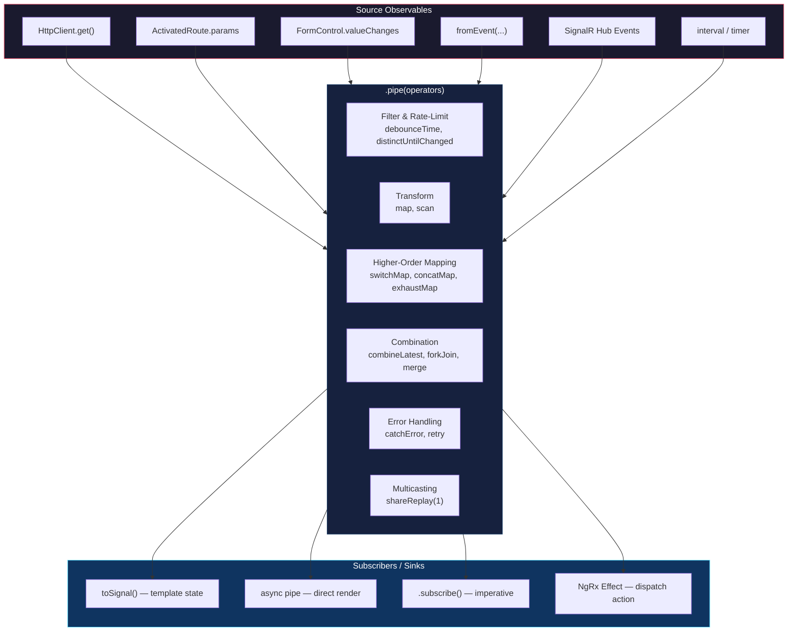

## Table of Contents

[🧠 **View Interactive Mindmap**](./rxjs-mindmap.md)

1. [TL;DR](#tldr)
2. [Deep Dive](#deep-dive)
   2.1 [The Async Streaming Model](#concept-group-1-the-async-streaming-model)
       2.1.1 [Observables — Lazy, Multi-Emit, Cancellable](#1-observables--lazy-multi-emit-cancellable)
       2.1.2 [Cold vs Hot Observables](#2-cold-vs-hot-observables)
       2.1.3 [Marble Diagrams — The RxJS Lingua Franca](#3-marble-diagrams--the-rxjs-lingua-franca)
       2.1.4 [The Observer Contract](#4-the-observer-contract)
   2.2 [Creation Operators](#concept-group-2-creation-operators)
   2.3 [Pipeable Operators — Deep Dive](#concept-group-3-pipeable-operators--deep-dive)
       2.3.1 [Transformation](#31-transformation-operators)
       2.3.2 [Filtering & Rate-Limiting](#32-filtering--rate-limiting-operators)
       2.3.3 [Higher-Order Mapping (THE Interview Topic)](#33-higher-order-mapping-the-interview-topic)
       2.3.4 [Combination](#34-combination-operators)
       2.3.5 [Error Handling & Retry](#35-error-handling--retry-operators)
       2.3.6 [Side Effects](#36-side-effect-operators)
       2.3.7 [Multicasting](#37-multicasting-operators)
       2.3.8 [Utility](#38-utility-operators)
   2.4 [Subjects — Imperative ↔ Reactive Bridge](#concept-group-4-subjects)
   2.5 [Subscription Lifecycle & Memory Management](#concept-group-5-subscription-lifecycle--memory-management)
   2.6 [Schedulers — Controlling When Work Runs](#concept-group-6-schedulers)
   2.7 [Testing RxJS Code](#concept-group-7-testing-rxjs-code)
   2.8 [RxJS in NgRx Effects](#concept-group-8-rxjs-in-ngrx-effects)
   2.9 [Common Pitfalls & Anti-Patterns](#concept-group-9-common-pitfalls--anti-patterns)
3. [Architecture & Data Flow](#architecture--data-flow)
4. [Real-World Examples (Borrower-Portal + Portal-Web)](#real-world-examples)
5. [Comparison Tables](#comparison-tables)
6. [Interview Q&A](#interview-qa)
7. [Cross-References](#cross-references)
8. [Further Reading](#further-reading)

---

## TL;DR

RxJS is the <span style="color: #33b5e5; font-weight: bold;">async stream library</span> that powers every Angular reactive surface — `HttpClient`, `Router`, `FormControl.valueChanges`, NgRx Effects, SignalR bridges. An `Observable` is a lazy, multi-emit, cancellable async producer; you compose it with <span style="color: #33b5e5; font-weight: bold;">pipeable operators</span> inside `.pipe()` and activate it with `.subscribe()`. The interview-grade signal: knowing exactly **why** to pick `switchMap` vs `concatMap` vs `mergeMap` vs `exhaustMap` (read vs write vs queue vs rate-limit), how `shareReplay`/`refCount` actually work, when `combineLatest` glitches, why `subscribe-in-subscribe` is a code smell, and how `BehaviorSubject` differs from `ReplaySubject(1)`. In `tai-portal` and `borrower-portal` you see RxJS at the seams: <span style="color: #00C851; font-weight: bold;">DPoP nonce retry</span>, <span style="color: #00C851; font-weight: bold;">multicast auth state with `shareReplay(1)`</span>, <span style="color: #00C851; font-weight: bold;">debounced search → URL sync</span>, <span style="color: #00C851; font-weight: bold;">NgRx effects for the claim wizard</span>, and <span style="color: #00C851; font-weight: bold;">SignalR `BehaviorSubject` connection state</span> — Signals handle synchronous UI state, but anything time-based or cancellable still belongs in RxJS.

---

## Deep Dive

### Concept Group 1: The Async Streaming Model

#### 1. Observables — Lazy, Multi-Emit, Cancellable

##### What
An <span style="color: #33b5e5; font-weight: bold;">Observable</span> is a lazy, push-based collection that can emit zero, one, or many values over time, then optionally complete or error. Conceptually: `Promise` is to `value` as `Observable` is to `iterable async sequence`.

##### Why
Promises model "one async value, eventually." That breaks for keystrokes, WebSocket messages, polling, route param changes, file upload progress events. Observables generalize the async primitive: any number of values, over any timeline, with cancellation.

##### How
```typescript
// 1. Create — nothing runs yet
const data$ = this.http.get<User[]>('/api/users');

// 2. Compose — operators are pure, return new Observables
const activeUsers$ = data$.pipe(
  map(users => users.filter(u => u.isActive)),
  catchError(() => of([]))
);

// 3. Activate — subscribe triggers the producer
const sub = activeUsers$.subscribe(users => this.list.set(users));

// 4. Cancel — tears down the producer (HTTP request abort)
sub.unsubscribe();
```

The four-part Observable contract:
- `next(value)` — zero or more times
- `complete()` — at most once, terminates
- `error(err)` — at most once, terminates
- After `complete` or `error`, no further emissions

##### Marble Diagram
```
Observable: --a---b---c---|
            |   |   |   |
            |   |   |   complete (no more emissions)
            next a, b, c

Observable: --a---b---X
                      error — terminal, no complete
```

##### When
Anytime data arrives over time, or you need cancellation. HTTP, route params, form value changes, WebSocket events, intervals, debounced inputs, multi-step async coordination. For one-shot synchronous state (a counter, a toggle), Signals are simpler.

##### Trade-offs
<span style="color: #ffbb33; font-weight: bold;">Cognitive overhead is real</span> — operator selection, subscription lifetime, error propagation, and (cold vs hot) re-execution all need attention. <span style="color: #ff4444; font-weight: bold;">The #1 RxJS bug is forgetting to unsubscribe</span> from long-lived streams (interval, WebSocket, route params), creating ghost callbacks and memory leaks.

---

#### 2. Cold vs Hot Observables

##### What
A <span style="color: #33b5e5; font-weight: bold;">cold</span> Observable creates its producer **per subscriber** — each `.subscribe()` triggers a fresh execution. A <span style="color: #33b5e5; font-weight: bold;">hot</span> Observable shares one producer across all subscribers — they tap into a stream that exists independently of them.

##### Why
This single distinction explains 80% of "why is my HTTP call firing twice?" bugs. `HttpClient.get()` returns a **cold** Observable: subscribe twice → two HTTP requests. `Subject` and operators like `share`/`shareReplay` produce **hot** Observables: subscribe twice → one underlying execution.

##### How — A Real Bug

```typescript
// Cold pitfall: this fires THREE HTTP calls, not one
const user$ = this.http.get<User>('/api/me');

@Component({
  template: `
    <span>{{ (user$ | async)?.name }}</span>      <!-- subscribe #1 -->
    <span>{{ (user$ | async)?.email }}</span>     <!-- subscribe #2 -->
    <span>{{ (user$ | async)?.tenantId }}</span>  <!-- subscribe #3 -->
  `
})
```

Fix with `shareReplay(1)`:

```typescript
const user$ = this.http.get<User>('/api/me').pipe(shareReplay(1));
// Now: first subscribe triggers HTTP, the other two replay the cached value.
```

##### When
- Cold by default for HTTP (you want the request to happen when something asks for it).
- Hot when multiple consumers share a single source: auth state, connection status, cached config, SignalR events.

##### Trade-offs
<span style="color: #ff4444; font-weight: bold;">Accidentally hot</span> means your "fresh fetch" silently returns cached data forever. <span style="color: #ff4444; font-weight: bold;">Accidentally cold</span> means the same expensive call fires N times. The fix is always explicit: use `shareReplay(1)` to make cold→hot deliberately, or `defer(() => http.get(...))` to make hot→cold.

---

#### 3. Marble Diagrams — The RxJS Lingua Franca

##### What
A text notation for visualizing emission timelines. Time flows left to right; each character is a frame; symbols mark events.

```
-      one frame of nothing
a      emission of value "a"
|      complete
X      error
()     synchronous group: (ab|) means a, b, complete in same frame
^      subscription (in test schedulers)
!      unsubscription
```

##### Why
Operator semantics are precise but verbal explanations are vague. A marble diagram makes "switchMap cancels the previous inner observable" unambiguous.

##### Example: switchMap
```
source: --a-----b---c---|
                  |
                  switchMap(x => fetch(x))   each emission triggers an inner observable
                  |
inner-a:  ---1-2-3|        (cancelled when b arrives)
inner-b:        ---4|       (cancelled when c arrives)
inner-c:            ---5|

result: --1-2---4-----5---|
```

Compare to `concatMap` (waits for inner to complete before starting next):
```
result: --1-2-3---4---5---|
```

##### When
Use marbles in code review, ADRs, interview answers. "Why is this emitting twice?" — draw the marble.

---

#### 4. The Observer Contract

##### What
The interface every Observable promises to honor:

```typescript
interface Observer<T> {
  next?: (value: T) => void;
  error?: (err: any) => void;
  complete?: () => void;
}
```

##### How
```typescript
this.userService.getUser(id).subscribe({
  next: user => this.user.set(user),
  error: err => this.error.set(err.message),
  complete: () => console.log('done'),  // HTTP completes after one value
});
```

Three terminal-state guarantees:
1. After `complete()` or `error(err)`, **no further emissions** are allowed.
2. The Observable is responsible for calling `complete` or `error` exactly once if it terminates.
3. After a terminal state, the subscription is implicitly cleaned up — `finalize()` runs.

##### Trade-offs
<span style="color: #ffbb33; font-weight: bold;">Streams that never complete</span> (`interval`, `fromEvent`, `Subject`) require manual unsubscribe — `complete()` will not fire on its own. This is the source of every memory leak in component subscriptions.

---

### Concept Group 2: Creation Operators

These produce Observables from non-Observable sources. The 10 you actually use:

| Operator | Produces | Real Example |
|---|---|---|
| `of(...vals)` | sync emit then complete | `of([])` as `catchError` fallback |
| `from(promise \| array \| iterable)` | async unwrap | `from(this.dpopService.getHeader())` (Promise → Observable) |
| `fromEvent(target, name)` | DOM event stream | `fromEvent(document, 'visibilitychange')` for pause-on-blur polling |
| `interval(ms)` | tick every ms (no initial) | Keepalive ping |
| `timer(initial, period?)` | first after initial, then optional period | Polling with delayed start |
| `defer(() => factory)` | recompute Observable per subscriber | Make a hot source cold again |
| `EMPTY` | complete immediately | "no-op" stream in conditional pipelines |
| `NEVER` | never emits or completes | Pause switch in `switchMap` |
| `throwError(() => err)` | error immediately | Error path in `switchMap`/`catchError` |
| `combineLatest`/`forkJoin`/`merge`/`zip`/`race` | combine multiple sources | (covered in §3.4) |

```typescript
// `defer` — solve "subscribe-time evaluation" gotcha
const now$ = of(Date.now());           // captures Date.now() at creation time
const nowFresh$ = defer(() => of(Date.now()));  // captures per subscriber

// `EMPTY` vs `NEVER` — both are "no emissions" but very different
EMPTY.subscribe({ complete: () => console.log('done') });   // logs "done" immediately
NEVER.subscribe({ complete: () => console.log('done') });   // never logs anything
```

---

### Concept Group 3: Pipeable Operators — Deep Dive

Operators are pure functions composed via `.pipe()`. Of ~100+ in the library, ~20 cover real-world Angular code. Group them by job, not by name.

#### 3.1 Transformation Operators

##### `map(fn)` — Reshape Each Value
```
source: --1---2---3---|
        map(x => x * 10)
result: --10--20--30--|
```
The workhorse. Use it for response unwrapping, projection, lightweight derivation.

```typescript
// portal-web: auth.service.ts — extract domain User from OIDC raw payload
public readonly user$ = this.oidc.userData$.pipe(
  map(result => {
    const data = result?.userData;
    return data ? { id: data.sub, email: data.email, privileges: data.privileges } : null;
  }),
  shareReplay(1),
);
```

##### `scan(reducer, seed)` — Accumulate State Over Time
RxJS equivalent of `Array.reduce`, but **emits intermediate values** as they accumulate. Critical for stateful streams.

```
source: --click--click--click---|
        scan((count, _) => count + 1, 0)
result: --1------2------3-------|
```

```typescript
// borrower-portal: infinite-scroll-style audit log
const events$ = merge(
  loadInitial$.pipe(map(() => ({ type: 'reset' as const }))),
  loadMore$.pipe(map(() => ({ type: 'append' as const }))),
).pipe(
  switchMap(action => this.http.get<Event[]>(`/audit?page=${action.page}`)
    .pipe(map(page => ({ action: action.type, page })))),
  scan((acc, { action, page }) => action === 'reset' ? page : [...acc, ...page], [] as Event[]),
);
```

##### `pluck(...keys)` (deprecated, use `map`)
```typescript
// Old: result.pipe(pluck('userData', 'email'))
// New: result.pipe(map(r => r?.userData?.email))    // type-safe, optional-chain friendly
```

##### `mapTo(value)` — Replace Every Emission With a Constant
Useful for "I just need to know it fired."
```typescript
const refreshClick$ = fromEvent(this.button.nativeElement, 'click').pipe(mapTo(undefined));
```

---

#### 3.2 Filtering & Rate-Limiting Operators

The "fewer emissions" toolbox.

| Operator | What it Does | Use When |
|---|---|---|
| `filter(predicate)` | Drop values that fail the test | Skip non-relevant events |
| `take(n)` | First n then complete | One-shot guards, first-N pages |
| `takeWhile(pred)` | Emit until predicate fails | Bounded loops |
| `takeUntil(notifier$)` | Emit until other Observable fires | Component teardown |
| `skip(n)` | Drop first n | Skip initial `BehaviorSubject` value |
| `distinctUntilChanged(compare?)` | Drop consecutive duplicates | Search input, route param |
| `debounceTime(ms)` | Emit only after silence of ms | Search-as-you-type |
| `throttleTime(ms)` | Emit at most once per ms | Scroll/resize handlers |
| `auditTime(ms)` | Like throttle but emits the **latest** at end of window | Sample dragging events |
| `sampleTime(ms)` | Emit the most recent value every ms | Periodic snapshot |

##### `debounceTime` vs `throttleTime` vs `auditTime` — The Diagram That Settles It
```
source:    -a-b-c----d-e----f---|

debounceTime(3): -----c--------e-----f-|   wait for silence, then emit last
throttleTime(3): -a----c---d----f-----|     emit first, then ignore for window
auditTime(3):    -----c---e----f------|     skip first; emit last of each window
sampleTime(3):   ---b--c--d----f-----|      tick every 3, emit most recent
```

##### Real Example: Borrower Wizard — Auto-Save Draft
```typescript
// borrower-portal: claim wizard auto-saves the draft after typing pauses
this.wizardForm.valueChanges.pipe(
  debounceTime(500),                     // wait until typing stops
  distinctUntilChanged(deepEqual),       // skip if value didn't change (form revalidation)
  takeUntilDestroyed(this.destroyRef),
).subscribe(value => this.draftService.persist(value));
```

##### Real Example: Portal-Web — Search With URL Sync
```typescript
// portal-web: features/users/users.page.ts (excerpt)
private readonly searchSubject = new Subject<string>();

constructor() {
  this.searchSubject.pipe(
    debounceTime(400),
    distinctUntilChanged(),
    takeUntilDestroyed(),
  ).subscribe(search => this.updateUrl({ search, page: 1 }));
}

onSearch(term: string): void { this.searchSubject.next(term); }
```

##### `takeUntil(notifier$)` — The Correct Place to Put It

```typescript
// CORRECT: takeUntil at the END of the pipe, just before subscribe
source$.pipe(
  switchMap(...),
  map(...),
  takeUntil(this.destroy$),   // <-- last
).subscribe(...);
```

Why last? `takeUntil` placed mid-pipe still works for unsubscription, but a downstream `Subject` subscriber can survive `destroy$` because the subject is shared. <span style="color: #ff4444; font-weight: bold;">Always put `takeUntil` last to avoid subtle leaks</span> — this is a known issue with an ESLint rule (`rxjs/no-unsafe-takeuntil`).

---

#### 3.3 Higher-Order Mapping (THE Interview Topic)

Higher-order mapping handles "Observable that emits Observables." Each emission of the source kicks off a new inner Observable; the operator decides how to handle overlap.

| Operator | Concurrency | Cancels Previous? | Order Preserved? | Real Use |
|---|---|---|---|---|
| `switchMap` | 1 (latest only) | ✅ Yes | N/A (only latest survives) | Search, route params, READ |
| `concatMap` | 1 (queued) | ❌ Queues | ✅ FIFO | Sequential WRITES, ordered actions |
| `mergeMap` | ∞ (parallel) | ❌ All run together | ❌ Race | Parallel uploads, fire-and-forget |
| `exhaustMap` | 1 (ignore new) | ❌ Drops new while busy | N/A | Login button, ONE-SHOT |

##### Marble Diagram — All Four Side By Side
```
source:     --a--b--c-----|
                |  |  |
                v  v  v
inner-a:        --1--2--3|
inner-b:           --4--5|
inner-c:              --6--7|

switchMap:  ---1-4--6--7-|     "kill old, start new"
concatMap:  ---1--2--3--4--5--6--7-|   "queue, never overlap"
mergeMap:   ---1-4-2-6-3-5-7-|        "everything in flight, race"
exhaustMap: ---1--2--3-----6--7-|     "ignore b (busy), accept c after"
```

##### switchMap — Read Operations
```typescript
// portal-web: dpop.interceptor.ts (real, simplified)
const executeWithDPoP = (nonce?: string) =>
  from(dpopService.getHeader(req.method, req.url, accessToken, nonce)).pipe(
    switchMap(header => next(req.clone({ headers: req.headers.set('DPoP', header) })))
  );

return executeWithDPoP().pipe(
  catchError((err: HttpErrorResponse) => {
    if (err.status === 401 && err.headers.get('DPoP-Nonce')) {
      return executeWithDPoP(err.headers.get('DPoP-Nonce')!);   // retry once with server nonce
    }
    return throwError(() => err);
  })
);
```

The `switchMap` here means: if the user navigates and a fresh request arrives before the DPoP header generation finishes, the in-flight request is cancelled — no stale auth headers.

##### concatMap — Sequential Writes
```typescript
// borrower-portal: claim wizard — save each step in order, even if user clicks fast
saveStepClick$.pipe(
  concatMap(step => this.claimService.saveStep(step)),
  takeUntilDestroyed(),
).subscribe();
// If user clicks Save 3 times rapidly, requests fire IN ORDER, never overlapping.
```

##### mergeMap — Parallel Independent Work
```typescript
// borrower-portal: upload multiple supporting documents in parallel
fileSelected$.pipe(
  mergeMap(file => this.uploadService.upload(file), 3),  // max 3 concurrent
).subscribe();
// Concurrency limit (the second arg) is critical — unbounded mergeMap = OOM risk.
```

##### exhaustMap — One-Shot Actions (Login, Submit)
```typescript
// portal-web: login button — ignore rage-clicks while request is in flight
loginClick$.pipe(
  exhaustMap(creds => this.authService.login(creds)),
).subscribe();
```

##### The Single Most Common Production Bug
<span style="color: #ff4444; font-weight: bold;">Using `mergeMap` for a search typeahead.</span> The user types "ang", "angu", "angul" — all three requests fire in parallel; "ang" is slowest, lands last, **overwrites the correct results for "angul"**. The fix is `switchMap`. This bug has shipped to production at every company that uses RxJS at any meaningful scale. Knowing it cold is L2 table stakes.

##### The Second Most Common Production Bug
<span style="color: #ff4444; font-weight: bold;">Using `switchMap` for sequential writes.</span> User clicks "Save Profile", then quickly clicks "Change Password" — `switchMap` aborts the profile save mid-flight. Their profile change is lost. The fix is `concatMap` (queue) or `exhaustMap` (ignore until done).

---

#### 3.4 Combination Operators

Coordinating multiple Observables into one stream.

| Operator | Behavior | Promise Equivalent | Use Case |
|---|---|---|---|
| `combineLatest([a$, b$, ...])` | Emits whenever **any** source emits, with latest of all | None | Filter table by [search, sort, page] |
| `forkJoin({a$, b$, ...})` | Waits for **all to complete**, emits one combined value | `Promise.all` | Initial page load (user + roles + config) |
| `merge(a$, b$, ...)` | Funnel multiple streams into one | (similar to async iteration) | Multi-trigger refresh |
| `concat(a$, b$, ...)` | Emit `a$` to completion, then `b$`, then `c$` | (sequential awaits) | Initial cache then updates |
| `zip([a$, b$, ...])` | Pair the i-th emission of each | None | Lockstep streams (rare) |
| `race(a$, b$, ...)` | First to emit wins; others cancelled | `Promise.race` | Timeout vs response |
| `withLatestFrom(other$)` | Emit when source fires, attaching latest of other | None | "On click, with current form value" |

##### `combineLatest` — Watch Out for the First-Emission Glitch
```
a$: --1---2-------|
b$:    ---x---y---|
combineLatest([a$, b$]):
        ---[1,x]-[2,x]-[2,y]-|
                      ^
                      "glitch": [2,x] then immediately [2,y]
```

`combineLatest` only emits **after each source has emitted at least once**. If `b$` is slow, your subscriber sees nothing. Fix: `b$.pipe(startWith(defaultValue))`.

```typescript
// portal-web: data-table filtering
const tableData$ = combineLatest([
  this.searchControl.valueChanges.pipe(debounceTime(300), startWith('')),  // startWith critical
  this.sortControl.valueChanges.pipe(startWith({ field: 'createdAt', dir: 'desc' })),
  this.pageControl.valueChanges.pipe(startWith(1)),
]).pipe(
  switchMap(([search, sort, page]) =>
    this.api.getUsers({ search, sort, page }).pipe(catchError(() => of({ items: [], total: 0 })))
  )
);
```

##### `forkJoin` — Parallel Page Load
```typescript
// portal-web: initial dashboard load — three APIs in parallel, render when all arrive
forkJoin({
  user: this.userService.getProfile(),
  privileges: this.privilegeService.getMine(),
  notifications: this.notificationService.getUnread(),
}).subscribe(({ user, privileges, notifications }) => {
  this.user.set(user);
  this.privileges.set(privileges);
  this.unreadCount.set(notifications.length);
});
```

<span style="color: #ff4444; font-weight: bold;">`forkJoin` is all-or-nothing</span>. If any inner Observable errors, the entire `forkJoin` errors and you get nothing. Wrap each with `catchError` to allow partial results.

##### `merge` + `forkJoin` — Multi-Trigger Refresh
```typescript
// portal-web: dashboard refreshes on (load | manual button | every 5 min)
const refresh$ = merge(
  of(undefined),                                  // initial load
  this.refreshClick$,                             // manual
  interval(5 * 60_000),                           // periodic
);

const dashboard$ = refresh$.pipe(
  switchMap(() => forkJoin({
    user: this.api.getUserStats().pipe(catchError(() => of(null))),
    sales: this.api.getSales().pipe(catchError(() => of(null))),
    alerts: this.api.getAlerts().pipe(catchError(() => of([]))),
  }))
);
```

##### `withLatestFrom` — "When A, attach latest of B"
```typescript
// borrower-portal: when user clicks Submit, snapshot the current form value
this.submitClick$.pipe(
  withLatestFrom(this.wizardForm.valueChanges),
  exhaustMap(([_, formValue]) => this.claimService.submit(formValue)),
).subscribe();
```

The difference from `combineLatest`: `withLatestFrom` is **driven by the source** — it does not emit when the "other" stream emits, only when the primary fires.

---

#### 3.5 Error Handling & Retry Operators

##### `catchError(handler)` — Replace the Failed Stream
```typescript
// Always return an Observable — either a fallback value or rethrow
this.api.get<User[]>('/users').pipe(
  catchError(err => {
    this.logger.error('user fetch failed', err);
    return of([]);                       // fallback — caller sees []
    // OR: return throwError(() => new DomainError('USERS_UNAVAILABLE'));
  })
);
```

##### Where to Place `catchError` — The Critical Question
**Inside `switchMap` vs Outside.** This is a senior interview gotcha.

```typescript
// WRONG — outer catchError kills the entire pipeline on first error
this.search$.pipe(
  switchMap(term => this.api.search(term)),
  catchError(() => of([]))    // <-- after this fires, the pipeline is DEAD; no more searches work
).subscribe(...);

// RIGHT — inner catchError keeps the outer stream alive
this.search$.pipe(
  switchMap(term => this.api.search(term).pipe(
    catchError(() => of([]))  // <-- only the inner request fails; user can keep typing
  ))
).subscribe(...);
```

This is called the **"dead effect" bug** in NgRx — putting `catchError` on `actions$` instead of inside `switchMap` permanently kills the effect after the first error.

##### `retry(config)` — Exponential Backoff With Jitter
The naive `retry({ count: 3 })` retries instantly — fine for transient blips, terrible for a struggling backend (you DDoS your own server).

```typescript
// portal-web: resilient API call
this.api.getCriticalConfig().pipe(
  retry({
    count: 3,
    delay: (error, retryCount) => {
      if (error.status === 401 || error.status === 403) {
        return throwError(() => error);    // don't retry auth failures
      }
      const baseDelay = Math.pow(2, retryCount - 1) * 1000;   // 1s, 2s, 4s
      const jitter = Math.random() * 500;                     // avoid thundering herd
      return timer(baseDelay + jitter);
    },
  }),
  catchError(err => { this.toast.error('Service unavailable'); return of(null); }),
);
```

##### `retryWhen` — DEPRECATED in RxJS 7+
Use `retry({ delay: ... })` instead. `retryWhen` is a footgun (forgetting to terminate the notifier causes infinite loops).

---

#### 3.6 Side-Effect Operators

##### `tap({ next, error, complete })` — Inspect Without Modifying
```typescript
this.api.search(q).pipe(
  tap(results => console.log(`got ${results.length} results`)),  // dev-only log
  tap({ error: err => this.logger.error(err) }),                 // observability
);
```

Rules:
- `tap` does NOT change the emitted value.
- Errors thrown in `tap` propagate to the stream as errors.
- Use `tap` for logging, analytics, and debugging — **not** for side effects that should be transactional.

##### `finalize(fn)` — Cleanup On Any Termination
Runs when the stream completes, errors, OR is unsubscribed.
```typescript
this.store._status.set('Loading');
this.api.getUsers().pipe(
  finalize(() => this.store._status.set('Idle')),  // always restores state
).subscribe({
  next: users => this.store._users.set(users),
  error: err => this.store._error.set(err.message),
});
```

##### `finalize` vs `complete` Callback in `subscribe`
```typescript
.subscribe({ complete: () => cleanup() })   // only runs on graceful complete
.pipe(finalize(() => cleanup()))            // runs on complete OR error OR unsubscribe
```
For "always run cleanup," `finalize` wins.

---

#### 3.7 Multicasting Operators

These convert a cold Observable into a hot, shared one.

##### `share()` — Reference-Counted Multicast
```typescript
const shared$ = source$.pipe(share());
// First subscriber: connects upstream
// Subsequent subscribers: share the same execution
// Last unsubscriber: disconnects upstream (refCount = 0)
```

##### `shareReplay(bufferSize, refCount?)` — Cache + Multicast
The most-used multicast operator. Replays the last `bufferSize` emissions to new subscribers.

```typescript
// portal-web: auth.service.ts — multicast user state
public readonly user$ = this.oidc.userData$.pipe(
  map(toUser),
  shareReplay(1),     // <-- without this, every guard/component re-evaluates the OIDC stream
);
```

##### The `refCount` Gotcha
```typescript
// Default: shareReplay(1) keeps subscription alive forever (refCount = false)
shareReplay(1)
// New form: be explicit
shareReplay({ bufferSize: 1, refCount: true })
```

`refCount: true` disconnects upstream when subscriber count drops to zero. If you cache an HTTP result and want it cleared when the last consumer leaves, use `refCount: true`. For singleton services like `AuthService` that should always have a current value, `refCount: false` (the default) is fine.

```
Without refCount, after all subscribers leave:
  - Upstream stays subscribed (memory leak risk if upstream never completes)
  - Cached value persists forever (might be stale)

With refCount: true:
  - Upstream unsubscribed when count → 0
  - Re-subscribing later starts fresh
```

##### `share({ connector, resetOnRefCountZero })` — RxJS 7+ Generalization
```typescript
share({
  connector: () => new ReplaySubject(1),
  resetOnError: true,
  resetOnComplete: true,
  resetOnRefCountZero: true,
})
// equivalent to shareReplay({ bufferSize: 1, refCount: true })
```

---

#### 3.8 Utility Operators

| Operator | Purpose |
|---|---|
| `delay(ms)` | Shift each emission by ms (testing, animation timing) |
| `delayWhen(notifier)` | Custom-delay each emission |
| `defaultIfEmpty(val)` | If source completes without emitting, emit val |
| `startWith(val)` | Prepend an initial emission |
| `endWith(val)` | Append a final emission |
| `timeout(ms)` | Error if no emission within ms (use for unreliable APIs) |
| `repeat(count)` | Re-subscribe to source on complete |
| `repeatWhen` (deprecated) | Use `repeat({ delay })` |

```typescript
// portal-web: long-poll endpoints with explicit timeout
this.api.getStatus().pipe(
  timeout(10_000),
  retry({ count: 3, delay: () => timer(1000) }),
  catchError(() => of('UNKNOWN')),
);
```

---

### Concept Group 4: Subjects

#### Subjects — Imperative ↔ Reactive Bridge

##### What
A <span style="color: #33b5e5; font-weight: bold;">Subject</span> is both an Observable (you can subscribe) and an Observer (you can call `.next()`, `.error()`, `.complete()`). It is the on-ramp from imperative code into the reactive world.

##### The Four Variants

| Variant | Initial Value | Late Subscribers Get | Use Case |
|---|---|---|---|
| `Subject<T>` | none | nothing | Event bus, destroy notifier, search bridge |
| `BehaviorSubject<T>` | required | most recent emission | Connection state, auth state, "current value" |
| `ReplaySubject<T>(n, windowMs?)` | none | last n emissions (within window) | Chat history, recent events |
| `AsyncSubject<T>` | none | only the **final** value, on complete | Single-result cache (rare) |

##### `BehaviorSubject` vs `ReplaySubject(1)` — Common Trap
They look identical. The differences:
- `BehaviorSubject` **requires** an initial value at construction.
- `BehaviorSubject` exposes `.value` synchronously.
- `ReplaySubject(1)` has no initial value; late subscribers get nothing until the first `.next()`.

```typescript
const a = new BehaviorSubject<User | null>(null);
const b = new ReplaySubject<User>(1);

console.log(a.value);                    // null — sync access
// b.value — does not exist

setTimeout(() => a.next(user), 0);
setTimeout(() => b.next(user), 0);

a.subscribe(v => console.log('a', v));   // logs null, then user
b.subscribe(v => console.log('b', v));   // only logs user (no initial emission)
```

##### Real Examples

```typescript
// portal-web: real-time.service.ts — connection state
private readonly _connectionStatus$ = new BehaviorSubject<HubConnectionState>(
  HubConnectionState.Disconnected
);
public readonly connectionStatus$ = this._connectionStatus$.asObservable();
// Pattern: private writable Subject, public read-only Observable.
//          Hide .next() from consumers to enforce unidirectional flow.
```

```typescript
// borrower-portal: search-as-you-type bridge
private readonly searchSubject = new Subject<string>();

constructor() {
  this.searchSubject.pipe(
    debounceTime(300),
    distinctUntilChanged(),
    takeUntilDestroyed(),
  ).subscribe(term => this.runSearch(term));
}

onInput(term: string): void { this.searchSubject.next(term); }
```

##### Anti-Pattern: Public Mutable Subject
```typescript
// BAD — any consumer can call .next() on this
public readonly state$ = new BehaviorSubject<State>(initial);

// GOOD
private readonly _state$ = new BehaviorSubject<State>(initial);
public readonly state$ = this._state$.asObservable();
```

##### When NOT to Use Subjects (in Angular 17+)
For component or feature state, prefer Signals — they're synchronous, leak-free, and have fine-grained change detection. Reach for `BehaviorSubject` only when:
1. The state must be consumed as an Observable (e.g., in NgRx or `combineLatest`).
2. You need replay semantics with multiple subscribers.
3. You're bridging an imperative event source (DOM, SignalR callback).

---

### Concept Group 5: Subscription Lifecycle & Memory Management

##### What
Every `.subscribe()` returns a `Subscription`. If you don't unsubscribe (or use an automatic mechanism), long-lived Observables keep firing callbacks forever — memory leak, ghost updates, double HTTP requests.

##### The Five Cleanup Strategies

| Strategy | Automatic | Where | Status (2026) |
|---|---|---|---|
| `async` pipe | ✅ template-scoped | Component template | ✅ Fine for simple cases |
| `toSignal()` | ✅ injection-context-scoped | Field initializer / constructor | ✅ Preferred for template values |
| `takeUntilDestroyed(destroyRef)` | ✅ injection-context-scoped | Anywhere | ✅ Preferred for imperative subs (Angular 16+) |
| `takeUntil(destroy$)` | manual | `ngOnInit` + `ngOnDestroy` | ⚠️ Legacy |
| Raw `.subscribe()` | ❌ leak risk | Stores, root services | ⚠️ Only safe in singletons (`providedIn: 'root'`) |

##### `takeUntilDestroyed` — The 2026 Default
```typescript
import { takeUntilDestroyed } from '@angular/core/rxjs-interop';

@Component({...})
export class MyComponent {
  // Constructor or field-initializer is an injection context — no DestroyRef needed.
  private readonly user$ = this.userService.user$.pipe(
    takeUntilDestroyed(),  // auto-cleanup
  );

  // In ngOnInit, you must inject DestroyRef explicitly:
  private destroyRef = inject(DestroyRef);

  ngOnInit() {
    this.route.params.pipe(
      takeUntilDestroyed(this.destroyRef),
    ).subscribe(p => this.load(p['id']));
  }
}
```

##### Why `takeUntil(destroy$)` Is Legacy
- Requires boilerplate `destroy$ = new Subject<void>()` field
- Requires `ngOnDestroy` to call `destroy$.next(); destroy$.complete()`
- Easy to forget; subtle "must be last in pipe" rule
- `takeUntilDestroyed` removes all of this

##### When Raw `.subscribe()` Is OK
In a `providedIn: 'root'` service that lives for the app's lifetime, you can subscribe and never unsubscribe — the subscription dies with the app. Stores like `UsersStore` do this for HTTP calls (which complete on their own anyway).

##### The `async` Pipe Multiplier Trap
```html
<!-- BAD — three separate subscriptions, three HTTP calls (without shareReplay) -->
<div>{{ (user$ | async)?.name }}</div>
<div>{{ (user$ | async)?.email }}</div>
<div>{{ (user$ | async)?.tenantId }}</div>

<!-- GOOD — single subscription, alias once -->
@if (user$ | async; as user) {
  <div>{{ user.name }}</div>
  <div>{{ user.email }}</div>
  <div>{{ user.tenantId }}</div>
}
```

---

### Concept Group 6: Schedulers

##### What
A <span style="color: #33b5e5; font-weight: bold;">Scheduler</span> controls when subscriptions and emissions are scheduled relative to the JS event loop and microtask queue. Most code never touches schedulers explicitly. When you need them, you really need them.

##### The Built-In Schedulers

| Scheduler | Runs On | Use Case |
|---|---|---|
| `asyncScheduler` | `setTimeout` | Default for `interval`, `timer`, `debounceTime` |
| `asapScheduler` | microtask queue (`Promise.resolve`) | Defer to end of current tick |
| `queueScheduler` | synchronously, FIFO | Recursive emissions in sync tests |
| `animationFrameScheduler` | `requestAnimationFrame` | Smooth UI updates, scroll/drag |

##### `observeOn` and `subscribeOn`
```typescript
// portal-web: smooth scroll-position tracking with rAF
fromEvent(window, 'scroll').pipe(
  observeOn(animationFrameScheduler),
  map(() => window.scrollY),
  distinctUntilChanged(),
).subscribe(y => this.scrollY.set(y));
```

- `subscribeOn(scheduler)` — schedules **when subscription happens**
- `observeOn(scheduler)` — schedules **when emissions are delivered**

##### When You Genuinely Need Them
- Heavy synchronous emissions choking the call stack — `observeOn(asyncScheduler)` chunks them
- Animation-tied streams — `animationFrameScheduler`
- Marble tests — `TestScheduler` is its own scheduler

##### When You Don't
99% of Angular code. Default scheduling is correct.

---

### Concept Group 7: Testing RxJS Code

##### Three Testing Tools

###### 1. `firstValueFrom` / `lastValueFrom` — Promise Bridge
```typescript
// borrower-portal: claim-draft.service.spec.ts (style)
it('persists then loads back', async () => {
  await firstValueFrom(service.persist(draft));
  const loaded = await firstValueFrom(service.load());
  expect(loaded).toEqual(draft);
});
```

`toPromise()` is **deprecated** — use `firstValueFrom` (or `lastValueFrom`) for the modern API.

###### 2. Marble Testing With `TestScheduler`
For deterministic time-based testing.

```typescript
import { TestScheduler } from 'rxjs/testing';

it('debounces input by 300ms', () => {
  const scheduler = new TestScheduler((actual, expected) =>
    expect(actual).toEqual(expected)
  );

  scheduler.run(({ cold, expectObservable }) => {
    const source$ = cold('-a-b-c-----d|', { a: 'a', b: 'ab', c: 'abc', d: 'd' });
    const result$ = source$.pipe(debounceTime(3, scheduler));
    expectObservable(result$).toBe('-------c--|', { c: 'abc' });
    //                                ^---- after 3 frames of silence
  });
});
```

Time symbols:
- `-` = 1 virtual frame
- ` ` (space) = ignored
- `|` = complete
- `#` = error
- `()` = synchronous group

###### 3. Mocking Streams With Subjects
```typescript
// portal-web: real-time.service.spec.ts pattern
const events$ = new Subject<SecurityEvent>();
realTimeService.securityEvents$.subscribe(events$);

events$.next({ type: 'PrivilegeChange', ... });
expect(component.lastEvent()).toEqual(...);
```

##### Common Test Pitfalls
- <span style="color: #ff4444; font-weight: bold;">`fakeAsync` + RxJS schedulers</span> — RxJS uses its own scheduler; `tick()` does not flush `interval` unless you use `TestScheduler` or pass a custom scheduler.
- <span style="color: #ff4444; font-weight: bold;">Forgetting to flush microtasks</span> — `firstValueFrom` resolves on the next tick; `await` it.
- <span style="color: #ff4444; font-weight: bold;">`HttpClient` mocks need `flush()`</span> — `HttpTestingController` queues responses; you must call `flush()` to deliver them.

---

### Concept Group 8: RxJS in NgRx Effects

##### What
NgRx Effects (`@ngrx/effects`) are RxJS streams that listen to dispatched actions and produce new actions, isolating side effects (HTTP, websockets, navigation) from components.

##### The Pattern (borrower-portal: `claim.effects.ts`)
```typescript
@Injectable()
export class ClaimEffects {
  private actions$ = inject(Actions);
  private claimService = inject(ClaimService);

  saveStep$ = createEffect(() =>
    this.actions$.pipe(
      ofType(ClaimActions.saveStep),
      // concatMap — order matters; user clicks Save 3x, we don't want to drop any
      concatMap(({ step, payload }) =>
        this.claimService.saveStep(step, payload).pipe(
          map(() => ClaimActions.saveStepSuccess({ step })),
          catchError(error =>
            of(ClaimActions.saveStepFailure({ step, error: error.message }))
          )
        )
      )
    )
  );

  loadDraft$ = createEffect(() =>
    this.actions$.pipe(
      ofType(ClaimActions.loadDraft),
      // switchMap — only the latest load matters
      switchMap(() =>
        this.claimService.loadDraft().pipe(
          map(draft => ClaimActions.loadDraftSuccess({ draft })),
          catchError(err => of(ClaimActions.loadDraftFailure({ error: err.message })))
        )
      )
    )
  );
}
```

##### The Dead Effect Bug (Senior Trap)
<span style="color: #ff4444; font-weight: bold;">If `catchError` is on the OUTER stream instead of inside `switchMap`/`concatMap`, the effect dies permanently after the first error.</span>

```typescript
// WRONG — first error kills the effect; user clicks button, nothing happens
saveStep$ = createEffect(() =>
  this.actions$.pipe(
    ofType(ClaimActions.saveStep),
    concatMap(action => this.api.save(action.payload)),
    catchError(err => of(ClaimActions.failure({ err })))   // <-- pipeline now dead
  )
);

// RIGHT — inner catchError keeps the outer subscription alive
saveStep$ = createEffect(() =>
  this.actions$.pipe(
    ofType(ClaimActions.saveStep),
    concatMap(action =>
      this.api.save(action.payload).pipe(
        catchError(err => of(ClaimActions.failure({ err })))
      )
    )
  )
);
```

This is one of the most popular L3 interview screens.

##### Effects vs Components — The Boundary
- Components dispatch actions and read state via selectors
- Effects do all async coordination
- Reducers are pure functions (no RxJS, no HTTP)

---

### Concept Group 9: Common Pitfalls & Anti-Patterns

| Anti-Pattern | Symptom | Fix |
|---|---|---|
| `subscribe` inside `subscribe` | Pyramid of doom; lifetime confusion | `switchMap` / `concatMap` |
| `mergeMap` for typeahead | Stale results overwrite fresh ones | `switchMap` |
| `switchMap` for sequential writes | Pending mutations get cancelled | `concatMap` or `exhaustMap` |
| Outer `catchError` in effect | Effect dies on first error | Move `catchError` inside `switchMap`/`concatMap` |
| Cold Observable, multiple consumers | Duplicate HTTP calls | `shareReplay(1)` or async pipe + `as` alias |
| Missing `startWith` on `combineLatest` source | Combined stream never emits | `obs$.pipe(startWith(default))` |
| `interval` without unsubscribe | Memory leak, timer keeps firing | `takeUntilDestroyed()` |
| Public `BehaviorSubject` field | Any consumer can `.next()` | Private subject + public `asObservable()` |
| `retry({ count: 3 })` (no delay) | Hammers your backend on outage | `retry({ delay: exponentialBackoff })` |
| Mutating values in `tap` | Surprises downstream operators | Use `map` for transforms |
| `takeUntil` not last in pipe | Subtle leak via mid-pipe Subject | Always last operator before `.subscribe()` |
| `shareReplay(1)` w/o `refCount` | Stale cache; upstream never disconnects | `{ bufferSize: 1, refCount: true }` if needed |

---

## Architecture & Data Flow



---

## Real-World Examples

### 1. DPoP Nonce Retry — `from` + `switchMap` + Conditional `catchError`

📍 `apps/portal-web/src/app/dpop.interceptor.ts`

A real fintech-grade auth flow: convert Web Crypto Promise into Observable, chain header generation with the actual request, retry once with a server-issued nonce on 401.

```typescript
const executeWithDPoP = (nonce?: string) =>
  from(dpopService.getDPoPHeader(req.method, req.url, accessToken, nonce)).pipe(
    switchMap(dpopHeader => {
      let headers = req.headers.set('DPoP', dpopHeader);
      if (accessToken) headers = headers.set('Authorization', `DPoP ${accessToken}`);
      return next(req.clone({ headers }));
    })
  );

return executeWithDPoP().pipe(
  catchError((error: unknown) => {
    if (error instanceof HttpErrorResponse && error.status === 401) {
      const nonce = error.headers.get('DPoP-Nonce');
      if (nonce) return executeWithDPoP(nonce);   // single deterministic retry
    }
    return throwError(() => error);
  })
);
```

**Operators in play:** `from`, `switchMap`, `catchError`, `throwError`. **Why each:** `from` lifts a Promise; `switchMap` chains async without nesting subscriptions; `catchError` returns a new Observable so the request can succeed transparently on retry; `throwError` lets non-401 errors propagate to global handlers.

---

### 2. Multicast Auth State — `shareReplay(1)`

📍 `apps/portal-web/src/app/auth.service.ts`

Without `shareReplay`, every `hasPrivilege` check, every guard, every menu binding would re-evaluate the OIDC stream. With it, the stream is shared, the last value is replayed instantly, late subscribers never wait.

```typescript
public readonly user$: Observable<User | null> = this.oidc.userData$.pipe(
  map(result => {
    const data = result?.userData;
    return data ? {
      id: data.sub,
      email: data.email,
      privileges: data.privileges || [],
      tenantId: data.tenant_id
    } : null;
  }),
  shareReplay(1),
);

public readonly isAuthenticated$ = this.user$.pipe(map(u => !!u));

hasPrivilege(privilege: string): Observable<boolean> {
  return this.user$.pipe(map(u => u?.privileges.includes(privilege) ?? false));
}
```

---

### 3. Borrower Wizard Auto-Save — `debounceTime` + `distinctUntilChanged` + `concatMap`

📍 Pattern from `apps/borrower-portal/src/app/claim/`

The wizard saves drafts in the background. We debounce typing, skip duplicate values (triggered by Angular's revalidation), and queue saves so order is preserved if the user navigates between steps.

```typescript
export class ClaimWizardComponent {
  private destroyRef = inject(DestroyRef);

  constructor() {
    this.wizardForm.valueChanges.pipe(
      debounceTime(500),
      distinctUntilChanged((a, b) => JSON.stringify(a) === JSON.stringify(b)),
      concatMap(value => this.draftService.persist(value)),  // queue saves, never overlap
      takeUntilDestroyed(this.destroyRef),
    ).subscribe();
  }
}
```

**Why `concatMap` not `switchMap`:** if the user types fast then navigates away, `switchMap` would cancel the in-flight save mid-write. `concatMap` queues, ensuring the final state is persisted.

---

### 4. NgRx Effect for Claim Submission — `exhaustMap` + Inner `catchError`

📍 `apps/borrower-portal/src/app/claim/+state/claim.effects.ts` (pattern)

`exhaustMap` is right for Submit: while a submission is in flight, ignore further submit clicks. `catchError` on the inner stream keeps the effect alive after a failure.

```typescript
submit$ = createEffect(() =>
  this.actions$.pipe(
    ofType(ClaimActions.submit),
    exhaustMap(({ payload }) =>
      this.claimService.submit(payload).pipe(
        map(receipt => ClaimActions.submitSuccess({ receipt })),
        catchError(err => of(ClaimActions.submitFailure({ error: err.message })))
      )
    )
  )
);
```

---

### 5. Permission-Filtered Menu — `combineLatest` + `async` Pipe

📍 `apps/portal-web/src/app/app.ts`

The menu can only render when every privilege check resolves. `combineLatest` blocks until each input has emitted at least once.

```typescript
protected menuItems$ = combineLatest(
  this.allMenuItems.map(item =>
    item.requiredPrivilege
      ? this.authService.hasPrivilege(item.requiredPrivilege).pipe(map(has => ({ item, has })))
      : of({ item, has: true })
  )
).pipe(
  map(results => results.filter(r => r.has).map(r => r.item))
);
```

In template: `<app-shell [menuItems]="(menuItems$ | async) || []" />` — async pipe handles cleanup.

---

### 6. SignalR Connection State — `BehaviorSubject` + `NgZone.run`

📍 `apps/portal-web/src/app/real-time.service.ts`

`BehaviorSubject` ensures late subscribers see the current connection state. SignalR callbacks fire outside the Angular zone — `NgZone.run` re-enters so change detection picks up the next emission.

```typescript
private readonly _connectionStatus$ = new BehaviorSubject<HubConnectionState>(
  HubConnectionState.Disconnected
);
public readonly connectionStatus$ = this._connectionStatus$.asObservable();

private readonly _securityEvents$ = new BehaviorSubject<AuditLogDetails | null>(null);
public readonly securityEvents$ = this._securityEvents$.asObservable();

async startConnection(): Promise<void> {
  await this.hub.start();
  this._connectionStatus$.next(HubConnectionState.Connected);

  this.hub.on('ReceiveSecurityEvent', (event: AuditLogDetails) => {
    this.zone.run(() => this._securityEvents$.next(event));
  });
}
```

---

### 7. Smart Polling With Pause-on-Blur — `fromEvent` + `switchMap` + `NEVER`

A real production pattern. Poll every 10 seconds, but pause when the tab is hidden, and never overlap requests with `exhaustMap`.

```typescript
const isVisible$ = fromEvent(document, 'visibilitychange').pipe(
  map(() => document.visibilityState === 'visible'),
  startWith(document.visibilityState === 'visible'),
  distinctUntilChanged(),
);

const incidents$ = isVisible$.pipe(
  switchMap(visible => visible
    ? timer(0, 10_000).pipe(
        exhaustMap(() => this.api.getIncidents().pipe(catchError(() => of([]))))
      )
    : NEVER
  ),
);
```

`NEVER` cleanly pauses the inner stream. When `isVisible$` flips back to `true`, `switchMap` resubscribes to the timer — instant resume.

---

### 8. Resilient Fetch With Backoff — `retry({ delay })` + `timeout`

```typescript
const config$ = this.api.getConfig().pipe(
  timeout(8000),
  retry({
    count: 3,
    delay: (err, retryCount) => {
      if (err.status === 401 || err.status === 403) return throwError(() => err);
      const base = Math.pow(2, retryCount - 1) * 1000;
      const jitter = Math.random() * 500;
      return timer(base + jitter);
    },
  }),
  catchError(() => of(DEFAULT_CONFIG)),
);
```

Three resilience patterns layered: timeout to fail fast, exponential backoff with jitter to avoid thundering-herd retries, fallback to safe default if all attempts fail.

---

### 9. Refreshable Cache — `BehaviorSubject` Trigger + `switchMap` + `shareReplay`

```typescript
@Injectable({ providedIn: 'root' })
export class RolesService {
  private readonly forceRefresh$ = new BehaviorSubject<void>(undefined);

  public readonly roles$ = this.forceRefresh$.pipe(
    switchMap(() => this.http.get<Role[]>('/api/roles')),
    shareReplay({ bufferSize: 1, refCount: false }),
  );

  refresh(): void { this.forceRefresh$.next(); }
}
```

`BehaviorSubject` fires once on construction (the initial `undefined`), then once per `refresh()`. `switchMap` cancels in-flight fetches if `refresh()` is called twice quickly. `shareReplay` caches the result for all consumers.

---

## Comparison Tables

### Higher-Order Mapping Operators (Definitive)

| Dimension | `switchMap` | `concatMap` | `mergeMap` | `exhaustMap` |
|---|---|---|---|---|
| **Concurrency** | 1 (latest) | 1 (queued) | ∞ (parallel, configurable) | 1 (first only) |
| **Cancels previous?** | ✅ Yes | ❌ Queues | ❌ All run | ❌ Drops new |
| **Order preserved?** | N/A | ✅ FIFO | ❌ Race | N/A |
| **Read use case** | ✅ Search, route params | OK but slower | Avoid (race) | Don't |
| **Write use case** | ❌ Cancels mutations | ✅ Sequential saves | ⚠️ Only if independent | ✅ Submit/login (one-shot) |
| **Memory risk** | Low (1 active) | Bounded by queue | Unbounded if no concurrency cap | Low (1 active) |

### Subject Variants

| Variant | Initial | Late Subscriber Gets | Sync `.value`? | Use |
|---|---|---|---|---|
| `Subject<T>` | none | nothing | ❌ | Event bus, destroy notifier |
| `BehaviorSubject<T>` | required | last emission | ✅ | Connection / auth state |
| `ReplaySubject<T>(n)` | none | last n emissions | ❌ | Recent history (chat, audit) |
| `AsyncSubject<T>` | none | only final value on complete | ❌ | One-time computed result |

### Multicast Operators

| Operator | Replays | Disconnects on 0 subscribers? | Use |
|---|---|---|---|
| `share()` | no | yes (default) | Pure multicast, no caching |
| `shareReplay(1)` | last 1 | <span style="color: #ff4444; font-weight: bold;">no</span> | Long-lived service caches |
| `shareReplay({ bufferSize: 1, refCount: true })` | last 1 | yes | Component-scoped caches |
| `share({ connector, resetOn... })` | configurable | configurable | Library/framework code |

### Subscription Cleanup

| Strategy | Auto? | Works in `ngOnInit`? | Recommended (2026)? |
|---|---|---|---|
| `async` pipe | ✅ | template only | ✅ Simple cases |
| `toSignal()` | ✅ | injection context only | ✅ For template state |
| `takeUntilDestroyed()` | ✅ | ✅ with `DestroyRef` | <span style="color: #00C851; font-weight: bold;">✅ Default for imperative</span> |
| `takeUntil(destroy$)` | manual | ✅ | ⚠️ Legacy |
| `take(1)` | ✅ (completes) | ✅ | ✅ For one-shot guards |
| Raw `.subscribe()` | ❌ | ✅ | <span style="color: #ff4444; font-weight: bold;">❌ Only in singleton services</span> |

### Cold vs Hot Observables

| Property | Cold | Hot |
|---|---|---|
| Producer created | per subscriber | once, shared |
| Late subscriber | gets full sequence from start | gets only future emissions (or replay if `shareReplay`) |
| Default for `HttpClient` | ✅ | — |
| Default for `Subject` | — | ✅ |
| Convert cold → hot | `share`, `shareReplay`, `connectable` | — |
| Convert hot → cold | `defer(() => hotSource$)` | — |

---

## Interview Q&A

### L1: Junior Knowledge

#### L1: Observable vs Promise
**Q:** What's the difference between an Observable and a Promise?

**A:** A Promise is **eager** — it executes immediately when created — and **resolves once** with a single value, with no built-in cancellation. An Observable is **lazy** (nothing runs until `.subscribe()`), can emit **zero or many** values over time, and is **cancellable** via `.unsubscribe()`. In `tai-portal`, the DPoP interceptor lifts a Promise (Web Crypto API) into an Observable using `from()` so it can be composed with `switchMap` and `catchError`.

#### L1: What is `.pipe()`?
**Q:** What does `.pipe()` do?

**A:** It composes pipeable operators into a transformation pipeline. Each operator takes an Observable and returns a new Observable. Nothing executes until something subscribes. `.pipe()` is the modern replacement for the old chained method syntax (e.g., `obs$.map(...).filter(...)` became `obs$.pipe(map(...), filter(...))`).

#### L1: What does `.subscribe()` do?
**A:** It activates the Observable and starts the producer. It returns a `Subscription` object; calling `.unsubscribe()` on it tears down the producer (cancels HTTP, stops timers).

---

### L2: Mid-Level Knowledge

#### L2: switchMap vs concatMap vs mergeMap vs exhaustMap
**Q:** When would you pick each?

**A:**
- **`switchMap`** — cancels the previous inner Observable when a new value arrives. Use for read operations where only the latest result matters: search typeahead, route param changes, dropdown filter. <span style="color: #ff4444; font-weight: bold;">Wrong for writes</span> — it can cancel a mutation mid-flight.
- **`concatMap`** — queues inner Observables and runs them sequentially. Use for write operations where order matters: sequential form saves, ordered API mutations. Slower if queue backs up.
- **`mergeMap`** — runs all inner Observables in parallel (with optional concurrency cap). Use for parallel, independent work like file uploads. <span style="color: #ff4444; font-weight: bold;">Wrong for typeahead</span> — race conditions ship stale results.
- **`exhaustMap`** — ignores new emissions while the current inner Observable is still running. Use for one-shot actions where double-submission is dangerous: login button, payment submit, claim submit.

In `borrower-portal`, the claim wizard auto-save uses `concatMap` (order-preserving), the submit effect uses `exhaustMap` (rage-click safe), and the load-draft effect uses `switchMap` (latest wins).

#### L2: shareReplay — What and When?
**Q:** What does `shareReplay(1)` do, and what's the gotcha?

**A:** It multicasts an Observable and replays the last emission to new subscribers. Without it, every subscriber re-runs the upstream producer (every component subscribing to `user$` would trigger a separate OIDC evaluation). The gotcha: by default, `shareReplay(1)` does **not** disconnect from upstream when the subscriber count drops to zero — the cached value lives forever. For component-scoped caches use `shareReplay({ bufferSize: 1, refCount: true })`. For long-lived `providedIn: 'root'` services like `AuthService`, the default is fine.

#### L2: Cold vs Hot Observables
**Q:** Why does my HTTP call fire three times when I use `obs$ | async` three times in the template?

**A:** Because `HttpClient` returns a **cold** Observable — each `.subscribe()` (async pipe is a subscribe) creates a fresh execution. Fix: pipe through `shareReplay(1)`, or alias once in the template with `@if (obs$ | async; as value)`.

#### L2: Where to put `catchError`?
**Q:** Why is my NgRx effect dead after one failure?

**A:** You put `catchError` on the outer stream. After it handles the error, the outer subscription completes, and no further actions are processed. Move it inside the `switchMap`/`concatMap` so only the inner request errors out, leaving the outer subscription alive.

#### L2: `BehaviorSubject` vs `ReplaySubject(1)`
**Q:** When would you pick one over the other?

**A:** `BehaviorSubject` requires an initial value at construction and exposes `.value` synchronously — use it for "always-has-a-current-value" state like connection status. `ReplaySubject(1)` has no initial value; late subscribers get nothing until the first `.next()` — use it when there's no meaningful initial state.

---

### L3: Senior Knowledge

#### L3: How do you guarantee no memory leaks in component subscriptions?
**A:** Three layered defenses, in order of preference:
1. **`async` pipe in templates** — Angular handles subscription/unsubscription automatically.
2. **`toSignal()` for template state** — auto-cleanup tied to injection context.
3. **`takeUntilDestroyed(destroyRef)` for imperative subscriptions** — auto-cleanup in any context.

Avoid raw `.subscribe()` in components. The legacy `takeUntil(destroy$)` pattern still works but is verbose and easy to misplace. Long-lived services in `providedIn: 'root'` can subscribe without cleanup since they live for the app's lifetime.

#### L3: Cold Observable, multiple subscribers, expensive HTTP — design the API.
**A:** Three-part design:
1. The service exposes an Observable that uses `shareReplay({ bufferSize: 1, refCount: false })` for app-singleton state, or `refCount: true` if the cache should clear when nobody's listening.
2. Provide an explicit `refresh()` method backed by a `BehaviorSubject<void>` trigger; `switchMap` re-fetches and `shareReplay` updates all subscribers.
3. For ephemeral data (per-route), prefer the cold semantics — let the route's component own the subscription via `async` pipe.

```typescript
private readonly trigger$ = new BehaviorSubject<void>(undefined);
public readonly data$ = this.trigger$.pipe(
  switchMap(() => this.http.get<Data>('/api/data')),
  shareReplay({ bufferSize: 1, refCount: false }),
);
refresh(): void { this.trigger$.next(); }
```

#### L3: Explain `combineLatest` glitch and how to handle it.
**A:** `combineLatest` emits whenever **any** input emits, with the latest of all. If two inputs are derived from the same upstream source, you can see "intermediate" emissions where one has updated but the other hasn't — a glitch. Mitigations: (a) use `auditTime(0)` to coalesce within a microtask; (b) use a single source of truth and `map` to derive both values; (c) restructure with `withLatestFrom` if only one stream should drive emissions.

Also: `combineLatest` waits for **every** input to emit at least once. Forgetting `startWith(initial)` on a slow input means the combined stream never emits.

#### L3: `tap` vs `subscribe` for side effects
**A:** `tap` is for **observability** — logging, dev-time inspection, analytics. Use `tap` when you want to peek at the stream without altering it. `subscribe` is for **terminal side effects** — updating state, navigating, showing toasts. The rule: side effects that should propagate errors and respect the stream lifecycle go in `tap`; final consumers go in `subscribe`. Putting a state mutation in `tap` is a smell — readers expect `tap` to be inspection-only.

#### L3: When to use `defer`?
**A:** When you need each subscriber to see a fresh evaluation of an expression that's normally captured at creation time. Common cases: (a) `Date.now()` or other side-effecting factories; (b) re-creating an HTTP call without `shareReplay`; (c) bridging a Promise factory into an Observable in a way that re-runs each subscribe (`defer(() => from(asyncFn()))`).

---

### Staff: System Architecture

#### Staff: Design a real-time dashboard with offline support, polling fallback, and reconciliation.
**A:** Three-layer reactive architecture:

1. **Source layer** — three sources merged into one stream:
   - WebSocket `events$` (primary)
   - `interval(POLL_MS)` polling fallback when socket is closed (`switchMap(connected => connected ? NEVER : interval(...))`)
   - Local-storage cache hydrated via `defer(() => of(cachedSnapshot))` for offline boot

2. **Reconciliation layer** — use `scan` to merge incoming events into the accumulator, with version vectors or timestamps to resolve out-of-order delivery. Emit the reconciled state through `shareReplay(1)` so components see a consistent snapshot.

3. **Presentation layer** — `toSignal()` at component boundaries; templates read signals directly. Optimistic updates via `update()` on a writable companion signal; reconcile when authoritative server response arrives.

Failure modes to call out: (a) at-least-once delivery means duplicates — dedupe by id; (b) clock skew — never trust client timestamps; (c) reconnect storms — exponential backoff with jitter on the WebSocket reconnect; (d) the dual-write problem if you also push outbound events — use a transactional outbox on the server.

#### Staff: When would you reach for RxJS over Signals — and vice versa?
**A:** It's not a versus question; it's a layering question.

- **Signals** for synchronous, always-current UI state. Component-level toggles, counters, derived display state, store reads. They have fine-grained change detection and zero subscription overhead.
- **RxJS** for events, time, and async coordination. Anything with debounce, throttle, retry, cancellation, multicasting, multi-source orchestration. NgRx Effects, HTTP, WebSockets, route params, form value changes.
- **`toSignal()` and `toObservable()`** are the bridges. Components consume Signals; services produce Observables; the bridge converts at the boundary.

The 2026 architectural target: services own RxJS pipelines, stores own Signal state, components are Signal-first with `async` pipe as a fallback. The two systems are complementary, not competing.

#### Staff: How would you migrate a 200-component RxJS-only codebase to Signals incrementally?
**A:** Six-step plan:

1. **Stop the bleeding** — code review rule: new components are Signal-first; keep RxJS only for async streams.
2. **Migrate stores** — replace `BehaviorSubject` state with `signal()` + `.asReadonly()` + `computed()`. The public API stays Observable-shaped during transition (expose `state$` derived via `toObservable`).
3. **Migrate component reads** — wrap remaining Observable consumers with `toSignal()` where templates use `async` pipe today.
4. **Tighten subscription discipline** — sweep raw `.subscribe()` for `takeUntilDestroyed`. Lint rule.
5. **Drop bridges** — once all consumers are Signals, remove the `toObservable` bridges.
6. **Trim the RxJS surface** — keep RxJS in HTTP/effects/WebSocket; remove from component state.

Risk: behavior change from `BehaviorSubject.value` to `signal()`. The synchronous read semantics differ subtly (signal reads are reactive in tracked contexts; sync `.value` is not). Document this and add tests at the boundary.

---

## Cross-References

- [[RxJS-Signals]] — Companion document covering Angular Signals + interop with RxJS
- [[Angular-Core]] — Standalone components, DI with `inject()`, functional guards/interceptors
- [[NgRx-State-Management]] — Effects use RxJS extensively; this doc's §2.8 is a primer
- [[TypeScript]] — Generics power `Observable<T>`, `BehaviorSubject<T>`; type inference matters in long pipes
- [[SignalR-Realtime]] — `BehaviorSubject` + NgZone pattern for hub callbacks
- [[Authentication-Authorization]] — `auth.service.ts` `shareReplay` pattern, OIDC bridging
- [[Security-CSP-DPoP]] — DPoP interceptor `from` → `switchMap` → `catchError` chain
- [[Testing-Frontend]] — `firstValueFrom`, marble testing, `HttpTestingController`

---

## Further Reading

- [RxJS Official Docs](https://rxjs.dev/) — operator reference, marble diagrams, recipes
- [Marble Diagram Cheat Sheet](https://rxmarbles.com/) — interactive operator visualizer
- [RxJS API Migration Guide (v6 → v7)](https://rxjs.dev/6-to-7-change-summary) — `retryWhen` → `retry({ delay })`, etc.
- [Ben Lesh — Hot vs Cold Observables](https://benlesh.medium.com/hot-vs-cold-observables-f8094ed53339) — the canonical explainer
- [Angular RxJS Interop Guide](https://angular.dev/guide/signals/rxjs-interop) — `toSignal` and `toObservable`
- [NgRx Effects](https://ngrx.io/guide/effects) — official patterns, including the dead-effect bug
- [RxJS TestScheduler Guide](https://rxjs.dev/guide/testing/marble-testing) — marble testing with `cold`, `hot`, `expectObservable`

---

*Last updated: 2026-04-28*
