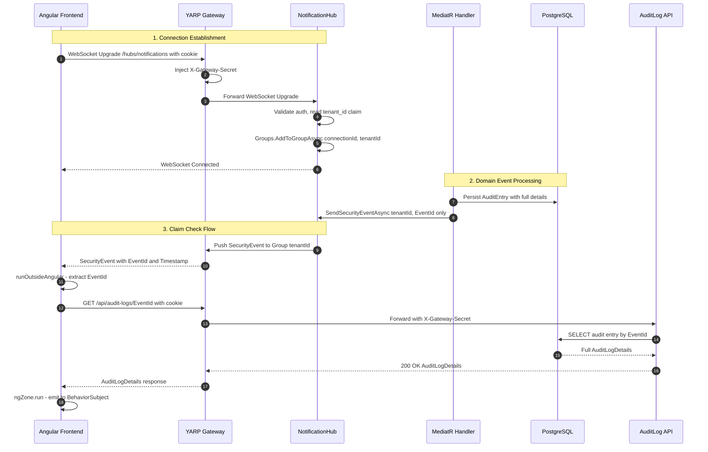

## TL;DR

SignalR provides **real-time bidirectional communication** between server and clients over WebSockets (with SSE and Long Polling fallbacks). In `tai-portal`, a single `NotificationHub` handles all real-time events — security alerts, privilege changes, and configuration updates. The architecture enforces **tenant isolation** via SignalR Groups keyed by `tenant_id` claim, uses the **Claim Check pattern** to avoid broadcasting sensitive data over WebSockets (only event IDs are pushed; clients fetch full details via REST), and integrates through a **BFF (Backend-for-Frontend)** cookie-based auth model where the Angular client never touches tokens directly. The frontend `RealTimeService` manages connection lifecycle reactively based on auth state and uses **NgZone optimization** to prevent change detection thrashing from high-frequency SignalR callbacks.

## Deep Dive

### Concept Overview

#### 1. SignalR Hubs — The Server-Side Endpoint
- **What:** A Hub is a high-level abstraction over WebSocket connections that allows the server and clients to call methods on each other by name. It handles connection management, serialization (JSON or MessagePack), and message routing. Each hub is mapped to a URL endpoint (e.g., `/hubs/notifications`).
- **Why:** Raw WebSockets require you to handle framing, serialization, connection tracking, and reconnection yourself. SignalR provides all of this out of the box, plus automatic transport negotiation (WebSocket → SSE → Long Polling) for environments where WebSockets are blocked.
- **How:** A Hub class inherits from `Microsoft.AspNetCore.SignalR.Hub`. The server can push messages via `Clients.All`, `Clients.Group(name)`, `Clients.User(id)`, or `Clients.Caller`. Clients can invoke server-side methods via `.invoke()` or `.send()`. The connection lifecycle is managed through `OnConnectedAsync()` and `OnDisconnectedAsync()` overrides.
- **When:** Use SignalR when you need server-initiated push to browsers — live dashboards, notifications, collaborative editing, chat. Don't use it for request-response patterns (use REST/gRPC) or for high-throughput data pipelines (use message queues like RabbitMQ or Kafka).
- **Trade-offs:** SignalR connections are stateful — each client holds an open WebSocket. This consumes server memory and complicates horizontal scaling. In a multi-server deployment, you need a backplane (Redis, Azure SignalR Service, or a database) to route messages to the correct server. For `tai-portal`, the single-server deployment avoids this complexity, but scaling would require adding `AddStackExchangeRedis()` or `AddAzureSignalR()`.

#### 2. Groups — Tenant Isolation for Multi-Tenant Push
- **What:** SignalR Groups are named collections of connections. When a message is sent to a group, only connections in that group receive it. Groups are in-memory on the server and automatically cleaned up when connections disconnect.
- **Why:** In a multi-tenant SaaS, Tenant A must never see Tenant B's security events. Groups provide the isolation boundary without maintaining a separate hub or connection per tenant.
- **How:** In `OnConnectedAsync()`, read the `tenant_id` claim from the authenticated user's `ClaimsPrincipal` and call `Groups.AddToGroupAsync(Context.ConnectionId, tenantId)`. In `OnDisconnectedAsync()`, remove the connection. When pushing events, always use `Clients.Group(tenantId)` — never `Clients.All`.
- **When:** Use Groups for any scenario where subsets of connected clients need different messages — tenant isolation, chat rooms, per-user notification channels, topic subscriptions.
- **Trade-offs:** Groups are ephemeral and connection-scoped. If you need durable subscriptions that survive disconnection (e.g., "user opted into email alerts"), Groups won't suffice — you need a persistent subscription table in the database. Also, group membership is managed in `OnConnectedAsync`, so a reconnection automatically re-adds the user to their group via the auth claim.

#### 3. The Claim Check Pattern — Privacy-First Real-Time
- **What:** Instead of broadcasting full event data over SignalR (which traverses WebSocket connections), the server sends only a minimal reference payload (event ID, timestamp, event type). The client then fetches the complete data via an authenticated REST call.
- **Why:** WebSocket payloads are harder to audit, log, and secure than REST calls. Broadcasting sensitive audit data (IP addresses, user details, privilege changes) over a WebSocket means that data traverses a different security pipeline than your REST endpoints. The Claim Check pattern ensures all sensitive data access goes through the standard HTTP middleware stack — rate limiting, CORS, gateway trust, authorization policies.
- **How:** 
  1. A domain event fires (e.g., `LoginAnomalyEvent`)
  2. A MediatR handler persists the `AuditEntry` to PostgreSQL
  3. The handler calls `IRealTimeNotifier.SendSecurityEventAsync()` with only `{ EventId, Timestamp, Reason }`
  4. The Angular client receives the notification, extracts `EventId`, fetches `GET /api/audit-logs/{eventId}` via HTTP
  5. The full `AuditLogDetails` is emitted to the UI
- **When:** Use Claim Check whenever the event payload contains PII, audit data, or anything subject to access control. Use direct payload push only for non-sensitive, small data (e.g., "document was updated" with just the document ID).
- **Trade-offs:** One extra HTTP round-trip per event. For high-frequency events (100+ per second), this could overwhelm the REST API. In that case, consider batching event IDs or using a dedicated read-model endpoint. For `tai-portal`'s security events (low frequency, high sensitivity), the trade-off is clearly worth it.

#### 4. BFF Authentication for WebSockets
- **What:** The BFF (Backend-for-Frontend) pattern means the Angular client never handles access tokens directly. Instead, the API Gateway holds the tokens and the browser only sends an HttpOnly session cookie. For SignalR, this means `withCredentials: true` on the `HubConnection` — the browser automatically includes the cookie on the WebSocket upgrade request.
- **Why:** Traditional SignalR auth for SPAs uses `accessTokenFactory` to inject a Bearer token into the WebSocket connection's query string. This is problematic: the token appears in server logs, URL history, and is vulnerable to XSS token theft. The BFF pattern eliminates this entire attack surface — the token never touches JavaScript.
- **How:** The gateway proxies WebSocket connections (`/hubs/**` via YARP with `WebSocket: { Enabled: true }`), injects `X-Gateway-Secret`, and the `NotificationHub`'s `[Authorize]` attribute accepts the `Identity.Application` cookie scheme. No `accessTokenFactory` is needed on the client.
- **When:** Use BFF auth for browser clients in high-security contexts. Use `accessTokenFactory` for non-browser clients (mobile apps, CLI tools, server-to-server) where cookies aren't available.
- **Trade-offs:** The BFF pattern couples the SignalR client to the gateway's session management. If the session cookie expires mid-connection, the WebSocket stays alive (it was already upgraded) but reconnection will fail until the session is refreshed. The `withAutomaticReconnect()` handles this gracefully — on reconnection failure, the client enters `Disconnected` state and the auth-reactive subscription in `RealTimeService` waits for re-authentication.

#### 5. NgZone Optimization — Preventing Change Detection Thrashing
- **What:** SignalR callbacks execute outside Angular's Zone.js by default (they originate from native WebSocket events). However, any code that touches Angular bindings (like updating a `BehaviorSubject` that feeds a template via `async` pipe) must run inside the zone to trigger change detection.
- **Why:** Without NgZone awareness, SignalR callbacks either don't update the UI (if left outside the zone) or trigger excessive change detection cycles (if every callback runs inside the zone). For high-frequency events, the latter can cause visible UI jank.
- **How:** The pattern is:
  1. Run the SignalR callback handler **outside** Angular zone (`ngZone.runOutsideAngular()`) — this covers the HTTP fetch and processing
  2. Only bring the final state update **inside** the zone (`ngZone.run()`) — this is the single point that triggers change detection
- **When:** Always apply this pattern when SignalR callbacks trigger UI updates. For callbacks that only update internal service state (no template binding), `runOutsideAngular()` alone is sufficient.
- **Trade-offs:** This is a performance optimization, not a correctness requirement (without it, the UI would still update, just with wasted change detection cycles). The risk is forgetting `ngZone.run()` on the final update — the symptom is a template that doesn't re-render until the next zone entry (e.g., a button click). In `tai-portal`, the pattern is consistent: outside for processing, inside for the `BehaviorSubject.next()`.

#### 6. Connection Lifecycle & Reconnection
- **What:** SignalR connections go through states: `Disconnected` → `Connecting` → `Connected` → `Reconnecting` → `Connected` or `Disconnected`. The `withAutomaticReconnect()` builder method enables automatic retry with a default backoff schedule (0s, 2s, 10s, 30s).
- **Why:** WebSocket connections are fragile — network switches (WiFi → cellular), load balancer timeouts, server restarts, and laptop sleep all cause disconnections. Without reconnection logic, every disconnection requires a full page reload.
- **How:** The `HubConnectionBuilder` chain includes `.withAutomaticReconnect()`. The client exposes lifecycle callbacks: `onreconnecting(error)`, `onreconnected(connectionId)`, `onclose(error)`. In `tai-portal`, these callbacks update a `BehaviorSubject<HubConnectionState>` so the UI can display connection status.
- **When:** Always enable automatic reconnect for user-facing applications. Customize the retry schedule for environments with known latency patterns (e.g., mobile apps might use longer intervals).
- **Trade-offs:** Default backoff (0, 2, 10, 30 seconds, then give up) may be too aggressive for some scenarios. You can pass a custom array (`withAutomaticReconnect([0, 1000, 5000, 10000, 30000, 60000])`) or implement `IRetryPolicy` for exponential backoff with jitter. After all retries are exhausted, the connection enters permanent `Disconnected` — you must manually call `.start()` again or rely on the auth-reactive pattern (re-subscribe when authentication state changes).

#### 7. Gateway WebSocket Proxying with YARP
- **What:** YARP (Yet Another Reverse Proxy) in the gateway must be explicitly configured to proxy WebSocket connections. Unlike HTTP requests, WebSocket connections require an upgrade handshake and then maintain a persistent bidirectional channel.
- **Why:** Without explicit WebSocket configuration, YARP treats the connection as a standard HTTP request and the upgrade fails. The client falls back to Server-Sent Events or Long Polling — both are less efficient and have higher latency.
- **How:** In YARP's route configuration, set `"WebSocket": { "Enabled": true }` on the route. The gateway also applies the same transforms to WebSocket requests — `X-Forwarded` headers and `X-Gateway-Secret` injection — ensuring the backend's `GatewayTrustMiddleware` trusts the connection.
- **When:** Always configure WebSocket support at the proxy layer. If you're behind Nginx, Apache, or a cloud load balancer, each has its own WebSocket configuration requirement (`proxy_set_header Upgrade` for Nginx, `Connection: upgrade` forwarding for ALBs).
- **Trade-offs:** WebSocket connections are long-lived, which affects load balancer behavior. Sticky sessions aren't strictly required for a single-server deployment, but in a scaled-out scenario, the load balancer must route reconnections to the same server (or you need a backplane). YARP handles this transparently for the single-server case.



---

## Real-World Code Examples

### 1. NotificationHub with Tenant Group Isolation — `NotificationHub.cs`

The single hub in the application, secured with dual auth schemes and tenant-scoped groups:

```csharp
// apps/portal-api/Hubs/NotificationHub.cs (lines 19-73)
[Authorize(AuthenticationSchemes =
    $"{OpenIddictValidationAspNetCoreDefaults.AuthenticationScheme},Identity.Application")]
public class NotificationHub : Hub
{
    public override async Task OnConnectedAsync()
    {
        var tenantId = Context.User?.FindFirst("tenant_id")?.Value;
        if (!string.IsNullOrEmpty(tenantId))
        {
            await Groups.AddToGroupAsync(Context.ConnectionId, tenantId);
        }
        await base.OnConnectedAsync();
    }

    public override async Task OnDisconnectedAsync(Exception? exception)
    {
        var tenantId = Context.User?.FindFirst("tenant_id")?.Value;
        if (!string.IsNullOrEmpty(tenantId))
        {
            await Groups.RemoveFromGroupAsync(Context.ConnectionId, tenantId);
        }
        await base.OnDisconnectedAsync(exception);
    }

    // Fallback: use NameIdentifier if tenant_id is absent
    private string GetTenantId()
    {
        return Context.User?.FindFirst("tenant_id")?.Value
            ?? Context.User?.FindFirst(ClaimTypes.NameIdentifier)?.Value
            ?? string.Empty;
    }

    public async Task SendNotification(string message)
    {
        await Clients.All.SendAsync("ReceiveNotification", message);
    }
}
```

**Why this matters:** Dual auth scheme (`OpenIddict` JWT + `Identity.Application` cookie) supports both API clients and BFF browser clients. Group membership is claim-driven — no manual room management needed.

### 2. SignalRRealTimeNotifier — Server-Side Push via IHubContext — `SignalRRealTimeNotifier.cs`

The singleton service that pushes events from MediatR handlers without holding a Hub reference:

```csharp
// apps/portal-api/Services/SignalRRealTimeNotifier.cs (lines 15-27)
public class SignalRRealTimeNotifier : IRealTimeNotifier
{
    private readonly IHubContext<NotificationHub> _hubContext;

    public SignalRRealTimeNotifier(IHubContext<NotificationHub> hubContext)
    {
        _hubContext = hubContext;
    }

    public async Task SendSecurityEventAsync<T>(
        string tenantId, string eventType, T payload,
        CancellationToken cancellationToken = default)
    {
        await _hubContext.Clients.Group(tenantId)
            .SendAsync("SecurityEvent", new
            {
                EventType = eventType,
                Payload = payload
            }, cancellationToken);
    }
}
```

**Why this matters:** `IHubContext<NotificationHub>` lets you send messages from anywhere in the application (MediatR handlers, background services, controllers) without needing a direct client connection. It's singleton-safe because `IHubContext` is inherently thread-safe.

### 3. MediatR Event Handler — Domain Event to SignalR Push — `LoginAnomalyEventHandler.cs`

The pipeline from domain event to real-time notification:

```csharp
// libs/core/infrastructure/Persistence/Handlers/LoginAnomalyEventHandler.cs
public class LoginAnomalyEventHandler : INotificationHandler<LoginAnomalyEvent>
{
    private readonly IRealTimeNotifier _notifier;
    private readonly IAuditRepository _auditRepo;

    public async Task Handle(LoginAnomalyEvent notification, CancellationToken ct)
    {
        // 1. Persist full audit entry to database
        var entry = await _auditRepo.CreateAsync(new AuditEntry
        {
            TenantId = notification.TenantId,
            Action = "LoginAnomaly",
            IpAddress = notification.IpAddress,
            Details = notification.Details,
            // ... full record
        }, ct);

        // 2. Push only the reference via SignalR (Claim Check)
        await _notifier.SendSecurityEventAsync(
            notification.TenantId,
            "LoginAnomaly",
            new { EventId = entry.Id, Timestamp = entry.CreatedAt, Reason = notification.Reason },
            ct);
    }
}
```

**Why this matters:** Shows the Claim Check pattern in action — full data goes to the database, only a minimal reference goes over SignalR. The `IRealTimeNotifier` abstraction decouples the domain handler from SignalR specifics.

### 4. RealTimeService — Angular Client with NgZone Optimization — `real-time.service.ts`

The complete client-side SignalR integration:

```typescript
// apps/portal-web/src/app/real-time.service.ts (lines 20-100)
@Injectable({ providedIn: 'root' })
export class RealTimeService {
  private readonly ngZone = inject(NgZone);
  private readonly authService = inject(AuthService);
  private readonly http = inject(HttpClient);
  private hubConnection: HubConnection | null = null;

  private readonly _connectionStatus$ =
    new BehaviorSubject<HubConnectionState>(HubConnectionState.Disconnected);
  public readonly connectionStatus$ = this._connectionStatus$.asObservable();

  private readonly _securityEvents$ =
    new BehaviorSubject<AuditLogDetails | null>(null);
  public readonly securityEvents$ = this._securityEvents$.asObservable();

  constructor() {
    // Reactively start/stop based on auth state
    this.authService.isAuthenticated$.subscribe(isAuthenticated => {
      if (isAuthenticated) {
        this.startConnection();
      } else {
        this.stopConnection();
      }
    });
  }

  private async startConnection(): Promise<void> {
    const hubUrl = `http://${window.location.hostname}:5217/hubs/notifications`;

    this.hubConnection = new HubConnectionBuilder()
      .withUrl(hubUrl, { withCredentials: true })  // BFF cookie auth
      .withAutomaticReconnect()                     // 0s, 2s, 10s, 30s
      .configureLogging(LogLevel.Information)
      .build();

    // Register event handlers
    this.hubConnection.on('PrivilegesChanged', () => {
      this.ngZone.runOutsideAngular(() => {
        this.authService.checkAuth().subscribe();
      });
    });

    this.hubConnection.on('SecurityEvent', (payload: SecurityEventPayload) => {
      this.ngZone.runOutsideAngular(() => {
        this.handleSecurityEvent(payload);
      });
    });

    // Connection lifecycle → BehaviorSubject
    this.hubConnection.onreconnecting(() =>
      this._connectionStatus$.next(HubConnectionState.Reconnecting));
    this.hubConnection.onreconnected(() =>
      this._connectionStatus$.next(HubConnectionState.Connected));
    this.hubConnection.onclose(() =>
      this._connectionStatus$.next(HubConnectionState.Disconnected));

    await this.hubConnection.start();
    this._connectionStatus$.next(HubConnectionState.Connected);
  }
}
```

**Why this matters:** Shows the full pattern — auth-reactive lifecycle, BFF cookie auth (`withCredentials: true`), NgZone optimization for all handlers, BehaviorSubject for connection state exposure, and automatic reconnect.

### 5. Claim Check HTTP Fetch — `real-time.service.ts`

The client-side of the Claim Check pattern — receiving a reference ID and fetching full data:

```typescript
// apps/portal-web/src/app/real-time.service.ts (lines 110-130)
private handleSecurityEvent(payload: SecurityEventPayload): void {
  const eventId = payload.EventId;
  if (!eventId) return;

  // Fetch full audit details via REST (not over WebSocket)
  const apiUrl = `http://${window.location.hostname}:5217/api/audit-logs/${eventId}`;
  this.http.get<AuditLogDetails>(apiUrl, { withCredentials: true })
    .subscribe({
      next: (details) => {
        // Only this final update runs inside Angular zone
        this.ngZone.run(() => {
          this._securityEvents$.next(details);
        });
      },
      error: (err) => {
        console.error('Failed to fetch audit log details', err);
      }
    });
}
```

**Why this matters:** The WebSocket only carries `{ EventId, Timestamp, Reason }`. The full `AuditLogDetails` (with IP address, user details, action specifics) is fetched through the standard HTTP pipeline — going through the gateway, CORS, rate limiting, and auth middleware. The `ngZone.run()` at the end is the single point where Angular's change detection is triggered.

### 6. YARP Gateway WebSocket Route — `appsettings.json`

The gateway configuration that proxies WebSocket connections:

```json
// apps/portal-gateway/appsettings.json (lines 20-31)
{
  "SignalRRoute": {
    "ClusterId": "IdentityCluster",
    "Match": {
      "Path": "/hubs/{**catch-all}"
    },
    "Transforms": [
      { "X-Forwarded": "Append" }
    ],
    "WebSocket": {
      "Enabled": true
    }
  }
}
```

**Why this matters:** `"WebSocket": { "Enabled": true }` is the critical flag — without it, YARP downgrades the connection and the client falls back to Long Polling. The `{**catch-all}` glob allows future hubs (e.g., `/hubs/collaboration`) without route changes. The `X-Forwarded: Append` transform preserves the client's real IP for audit logging. The gateway's `Program.cs` also injects `X-Gateway-Secret` on all forwarded requests via a YARP transform.

### 7. Hub Registration and Service Wiring — `Program.cs`

The minimal server-side configuration:

```csharp
// apps/portal-api/Program.cs (lines 61, 149, 233)

// 1. Register the notifier as singleton
builder.Services.AddSingleton<IRealTimeNotifier, SignalRRealTimeNotifier>();

// 2. Add SignalR services (default JSON protocol, no options)
builder.Services.AddSignalR();

// 3. Map the hub endpoint
app.MapHub<NotificationHub>("/hubs/notifications");
```

**Why this matters:** The registration is intentionally minimal — no MessagePack protocol, no custom `HubOptions`. This keeps the configuration simple for a low-frequency notification system. If scaling to high-throughput scenarios, you would add `AddMessagePackProtocol()` (binary, ~50% smaller payloads) and tune `KeepAliveInterval` / `ClientTimeoutInterval`.

### 8. Integration Tests — Dual Auth Path Verification — `SignalRAuthTests.cs`

Testing both authentication paths (JWT and cookie) for the hub:

```csharp
// apps/portal-api.integration-tests/SignalRAuthTests.cs (lines 59-160)

[Fact]
public async Task ConnectToHub_ShouldSucceed_WithMockAuth()
{
    // Arrange: Set up authenticated test user
    TestUserContext.UserId = "test-user-id";

    var connection = new HubConnectionBuilder()
        .WithUrl($"{_client.BaseAddress}hubs/notifications", options =>
        {
            options.HttpMessageHandlerFactory = _ => _server.CreateHandler();
            options.Headers.Add("Authorization", "Bearer mock-token");
            options.Headers.Add("X-Gateway-Secret", TestGatewaySecret);
            options.Headers.Add("DPoP", "mock-dpop-proof");
        })
        .Build();

    // Act & Assert
    await connection.StartAsync();
    Assert.Equal(HubConnectionState.Connected, connection.State);
    await connection.StopAsync();
}

[Fact]
public async Task ConnectToHub_ShouldFail_WhenUnauthenticated()
{
    TestUserContext.UserId = "";  // Simulate no auth
    // ... connection attempt throws HttpRequestException with 401
}
```

**Why this matters:** Integration tests verify that both auth paths work and that unauthenticated connections are rejected at the negotiate step (before WebSocket upgrade). The `TestGatewaySecret` bypasses `GatewayTrustMiddleware` in the test environment.

---

## Security Event Types

The three domain events that flow through the real-time pipeline:

| Domain Event | SignalR `EventType` | Payload Fields (Claim Check) | Full Data (REST) |
|---|---|---|---|
| `LoginAnomalyEvent` | `"LoginAnomaly"` | `EventId`, `Timestamp`, `Reason` | IP, user agent, geo, details |
| `PrivilegeChangeEvent` | `"PrivilegeChange"` | `EventId`, `Timestamp`, `Action`, `ResourceId` | Before/after values, actor |
| `SecuritySettingChangeEvent` | `"SecuritySettingChange"` | `EventId`, `Timestamp`, `SettingName`, `ResourceId` | Old/new values, actor |

```typescript
// apps/portal-web/src/app/models/security-event.model.ts
export interface SecurityEventPayload {
  EventId: string;
  Timestamp: string;
  EventType: string;
  Reason?: string;         // LoginAnomaly
  Action?: string;         // PrivilegeChange
  ChangeType?: string;
  SettingName?: string;    // SecuritySettingChange
  PrivilegeName?: string;
  NewValue?: string;
}
```

---

## Interview Q&A

### L1: What is a SignalR Hub and how does it differ from raw WebSockets?

**Answer:** A Hub is SignalR's high-level abstraction over connections. With raw WebSockets, you handle framing, serialization, connection tracking, and reconnection yourself. A Hub gives you:
- **Method routing** — call server methods by name (`.invoke('SendNotification', msg)`) instead of parsing raw message bytes
- **Serialization** — automatic JSON or MessagePack serialization/deserialization
- **Transport negotiation** — automatically falls back from WebSocket → SSE → Long Polling
- **Connection management** — `OnConnectedAsync()`, `OnDisconnectedAsync()`, and Groups
- **Automatic reconnect** — `withAutomaticReconnect()` with configurable backoff

In `tai-portal`, the `NotificationHub` is mapped to `/hubs/notifications` and secured with `[Authorize]` — both JWT and cookie auth schemes are accepted (`NotificationHub.cs:19`).

### L1: What is the difference between SignalR Groups, Users, and Clients.All?

**Answer:**
- **`Clients.All`** — broadcasts to every connected client. Rarely appropriate in production (data leaks across tenants).
- **`Clients.Group(name)`** — broadcasts to all connections in a named group. Used for tenant isolation, chat rooms, or topic channels.
- **`Clients.User(userId)`** — broadcasts to all connections for a specific authenticated user (identified by `ClaimTypes.NameIdentifier`). Used for personal notifications.

In `tai-portal`, connections are added to a group keyed by `tenant_id` claim in `OnConnectedAsync()`. All server pushes use `Clients.Group(tenantId)` to enforce tenant isolation. The only exception is the stub `SendNotification` method which uses `Clients.All` — this is a testing utility, not a production pattern.

### L2: What is the Claim Check pattern and why does tai-portal use it for real-time events?

**Answer:** Claim Check is an Enterprise Integration Pattern where you replace a large message payload with a reference (the "claim check"), and the receiver uses that reference to retrieve the full data from a persistent store.

In `tai-portal`, SignalR pushes only `{ EventId, Timestamp, EventType }` over the WebSocket. The Angular client then fetches the full `AuditLogDetails` via `GET /api/audit-logs/{eventId}`.

**Why this design:**
1. **Privacy** — sensitive audit data (IP addresses, user details) never traverses the WebSocket channel
2. **Security** — the REST fetch goes through the full middleware stack (gateway trust, CORS, auth, rate limiting)
3. **Auditability** — REST calls are logged; WebSocket messages are harder to audit
4. **Payload size** — WebSocket messages stay tiny, reducing bandwidth and serialization cost

The trade-off is one extra HTTP round-trip per event, which is acceptable for low-frequency security events.

### L2: How do you authenticate SignalR connections in a BFF architecture vs. a traditional SPA?

**Answer:**

**Traditional SPA (token in query string):**
```typescript
.withUrl('/hubs/notifications', {
  accessTokenFactory: () => this.authService.getAccessToken()
})
```
The token appears in the WebSocket upgrade URL (`?access_token=eyJ...`), which is logged by servers, proxies, and browsers. Vulnerable to XSS token theft.

**BFF pattern (tai-portal's approach):**
```typescript
.withUrl(hubUrl, { withCredentials: true })
```
The browser sends the HttpOnly session cookie automatically. The token never appears in JavaScript. The gateway holds the real access token and injects `X-Gateway-Secret`.

The `NotificationHub` accepts both schemes via `[Authorize(AuthenticationSchemes = "OpenIddict,Identity.Application")]` — cookie for browser clients, JWT for non-browser API clients.

### L3: How would you scale SignalR horizontally across multiple servers?

**Answer:** The core problem: SignalR Groups are in-memory on the server. If User A connects to Server 1 and User B connects to Server 2, Server 1 cannot send a message to User B without a backplane.

**Options (in order of complexity):**

1. **Redis Backplane** (`AddStackExchangeRedis()`) — all servers publish/subscribe through Redis. Simple, low-latency. Scales to ~10 servers before Redis becomes the bottleneck.

2. **Azure SignalR Service** (`AddAzureSignalR()`) — offloads all connection management to a managed service. The app servers become stateless — they send messages via the Azure service's REST API. Scales to millions of connections. Trade-off: vendor lock-in, per-message pricing.

3. **Custom backplane** (RabbitMQ, Kafka, database polling) — for environments where Redis and Azure aren't options. Highest complexity, but full control.

**Scaling considerations for tai-portal:**
- Current single-server deployment needs no backplane
- If scaling to 2+ servers: add Redis backplane (`builder.Services.AddSignalR().AddStackExchangeRedis(redisConnectionString)`)
- Load balancer must support WebSocket upgrade (`Connection: Upgrade` forwarding) and ideally sticky sessions (or all servers share state via Redis)
- The BFF cookie auth works with sticky sessions; without them, the cookie must be validated by all servers (shared data protection keys)

### L3: How does NgZone optimization work for SignalR callbacks, and what happens without it?

**Answer:** Angular's Zone.js monkey-patches all async APIs (`setTimeout`, `Promise`, `addEventListener`, `WebSocket`). When an async callback fires inside the zone, Angular triggers a change detection cycle across the entire component tree.

SignalR callbacks originate from WebSocket `onmessage` events — each one triggers change detection even if no template binding changed. For 10 events/second, that's 10 unnecessary CD cycles/second.

**The tai-portal pattern:**
```typescript
// 1. Handler runs OUTSIDE zone — no CD triggered
this.hubConnection.on('SecurityEvent', (payload) => {
  this.ngZone.runOutsideAngular(() => {
    this.handleSecurityEvent(payload);  // HTTP fetch happens here too
  });
});

// 2. Only the final state update runs INSIDE zone — one CD cycle
private handleSecurityEvent(payload: SecurityEventPayload): void {
  this.http.get<AuditLogDetails>(url).subscribe(details => {
    this.ngZone.run(() => {              // <-- single CD trigger
      this._securityEvents$.next(details);
    });
  });
}
```

**Without this optimization:** Every SignalR message + every HTTP response callback = 2 change detection cycles per event. With it: 1 cycle per event, only when the UI-facing state actually changes.

**Gotcha:** If you forget `ngZone.run()` on the final update, the `BehaviorSubject.next()` fires outside the zone. Subscribers in templates (via `async` pipe) won't update until the next zone entry (e.g., user clicks a button). The symptom is a "frozen" UI that suddenly updates when you interact with it.

### Staff: Design a real-time notification system for a multi-tenant SaaS with 10,000 concurrent users across 500 tenants.

**Answer:**

**Architecture layers:**

1. **Connection layer** — Azure SignalR Service (managed, scales to millions). App servers are stateless — they publish via `IHubContext`, Azure handles distribution. Cost: ~$50/month per unit (1K concurrent connections per unit), so ~10 units = $500/month.

2. **Event pipeline** — Domain events → MediatR handlers → Outbox table (for guaranteed delivery) → Background worker reads outbox → Calls `IRealTimeNotifier`. This ensures events are never lost even if SignalR is temporarily unavailable.

3. **Tenant isolation** — SignalR Groups keyed by `tenant_id` (same as tai-portal). Azure SignalR Service supports groups natively. With 500 tenants, average group size is 20 connections — well within limits.

4. **Claim Check at scale** — For 10K users receiving events simultaneously, the HTTP fetch-back would create a thundering herd on the REST API. Mitigations:
   - **Stagger fetches** — client adds random 0-2s jitter before fetching
   - **Read-through cache** — Redis cache in front of the audit log table, keyed by EventId (TTL: 5 minutes)
   - **Selective push** — for non-sensitive events (e.g., "new feature available"), push the full payload directly to avoid the fetch entirely

5. **Auth** — For browser clients, BFF cookie pattern (same as tai-portal). For mobile apps, `accessTokenFactory` with short-lived tokens. For server-to-server (admin dashboards), API key auth with a dedicated hub endpoint.

6. **Monitoring** — Azure SignalR Service provides built-in metrics (connections, messages/sec, errors). Add custom telemetry for: event delivery latency (time from domain event to client receipt), Claim Check fetch latency, reconnection frequency per tenant.

**Key trade-off decisions:**
- Azure SignalR vs Redis backplane: Azure for >1K connections (Redis becomes a bottleneck around 10K); Redis for on-premises or cost-sensitive deployments
- Outbox pattern adds ~50ms latency but guarantees delivery; direct push is faster but loses events on transient failures
- Claim Check vs direct push: per-event decision based on sensitivity, not a blanket rule

### Staff: How would you implement end-to-end encryption for SignalR messages in a zero-trust architecture?

**Answer:** SignalR messages are encrypted in transit (TLS), but the server can read them. For true end-to-end encryption (E2EE) where even the server cannot read message content:

**Approach: Client-side encryption with shared tenant keys**

1. **Key distribution** — Each tenant has a symmetric AES-256-GCM key stored in the browser's `IndexedDB` (wrapped by the user's DPoP private key). New users receive the tenant key via a key exchange during onboarding (server acts as a mailbox, never sees the plaintext key).

2. **Encryption flow:**
   ```
   Sender: plaintext → AES-256-GCM encrypt with tenant key → base64 ciphertext
   SignalR: carries only ciphertext + nonce + EventId
   Receiver: base64 decode → AES-256-GCM decrypt with tenant key → plaintext
   ```

3. **Server-side changes:**
   - Hub and `IRealTimeNotifier` transport opaque `byte[]` payloads — they cannot inspect content
   - Claim Check pattern still works: the EventId in the SignalR payload is plaintext (non-sensitive), but the REST-fetched `AuditLogDetails` response body is encrypted with the tenant key
   - Server stores encrypted audit entries; only tenant members can decrypt

4. **Key rotation:**
   - Rotate tenant key monthly via a `KeyRotation` SignalR event
   - New key is distributed by an admin encrypting it with each member's DPoP public key
   - Old messages remain decryptable (archive the key history in encrypted form)

**Trade-offs:**
- Massive complexity — key management, lost device recovery, new member onboarding all require careful protocol design
- Server loses search/analytics capability on encrypted data (cannot query audit log content)
- Performance: AES-256-GCM in the browser is fast (~500MB/s via Web Crypto API) but adds latency to every message
- Regulatory tension: some compliance regimes require the server to have audit access (contradicting E2EE)

**When E2EE is warranted:** Healthcare (HIPAA), legal communications, financial trading platforms. For most enterprise SaaS (including tai-portal's current threat model), TLS + DPoP + Claim Check provides sufficient security without E2EE's operational complexity.

---

## Cross-References

- **[[Authentication-Authorization]]** — Dual auth scheme on the hub (OpenIddict JWT + Identity.Application cookie), BFF pattern, claims-based tenant isolation
- **[[RxJS-Signals]]** — `BehaviorSubject` for connection state, `subscribe()` patterns in `RealTimeService`, NgZone optimization interplay with Observable updates
- **[[Security-CSP-DPoP]]** — Gateway trust middleware applies to WebSocket upgrade requests, CORS `AllowCredentials` for cookie-based WebSocket auth
- **[[System-Design]]** — Claim Check enterprise integration pattern, MediatR notification handlers, Outbox pattern for guaranteed event delivery
- **[[Design-Patterns]]** — Observer pattern (hub → clients), Mediator pattern (MediatR handlers → IRealTimeNotifier → Hub), Strategy pattern (transport negotiation)
- **[[EFCore-SQL]]** — Audit entry persistence that feeds the Claim Check fetch, tenant-scoped queries via EF Core global filters

---

## Further Reading

- [ASP.NET Core SignalR Documentation](https://learn.microsoft.com/en-us/aspnet/core/signalr/)
- [SignalR Scale-Out with Redis](https://learn.microsoft.com/en-us/aspnet/core/signalr/redis-backplane)
- [Azure SignalR Service](https://learn.microsoft.com/en-us/azure/azure-signalr/)
- [Enterprise Integration Patterns — Claim Check](https://www.enterpriseintegrationpatterns.com/patterns/messaging/StoreInLibrary.html)
- [YARP WebSocket Configuration](https://microsoft.github.io/reverse-proxy/articles/websockets.html)

---

*Last updated: 2026-04-02*
