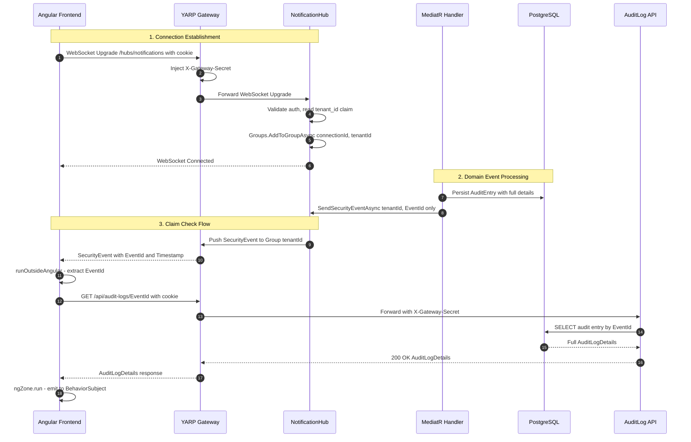

## TL;DR

Real-time UI is a stack of decisions, not a library. **Transport** (WebSocket vs SSE vs Long Polling vs polling fallback), **authentication** (BFF cookie vs token factory), **connection lifecycle** (reconnect, backoff, auth-reactive start/stop), **isolation** (groups/channels for multi-tenant push), **payload strategy** (full data vs Claim Check reference), **change-detection re-entry** (NgZone for out-of-zone callbacks), **delivery semantics** (at-least-once → dedup, idempotency, out-of-order handling), **optimistic UI + reconciliation**, **backpressure** for high-frequency streams, and **multi-tab coordination** for shared sessions.

In `tai-portal` the worked example is SignalR + a single `NotificationHub`. Patterns: tenant isolation via Groups keyed by `tenant_id` claim; **Claim Check** push (only `EventId` over the wire, full audit data fetched via REST); **BFF cookie auth** so the SPA never touches tokens; **NgZone optimization** so high-frequency callbacks don't thrash change detection; auth-reactive lifecycle (start/stop tied to `isAuthenticated$`).

The senior interview signal is showing you can talk about these patterns transport-independently. The same shape applies to native WebSocket, Socket.IO, Pusher, Ably, SSE, GraphQL subscriptions, MQTT — only the SDK changes.

---

## Deep Dive — The Pattern Stack

### 1. Transport Choice — Push, Stream, or Poll

##### What
The wire-level mechanism the server uses to deliver events to a client.

| Transport | Direction | Reconnect | Use When |
|---|---|---|---|
| **WebSocket** | Bidirectional, persistent | Manual or library-level | Default for real-time UI; chat, dashboards, notifications |
| **Server-Sent Events (SSE)** | Server → Client only, persistent | Built-in (`EventSource`) | Pure push, no client→server messages, simpler than WS |
| **Long Polling** | Client polls, server holds open | Per-poll | WebSocket blocked by proxy; SignalR fallback |
| **Short Polling** | Client polls on interval | Per-poll | No real-time available; "good enough" updates |
| **Webhook** | Server → Server | N/A | Server-side push between systems, not browsers |
| **Push API + Service Worker** | Server → Browser, even when closed | Browser-managed | Mobile-style notifications for installed PWAs |

##### Why
WebSocket is not always available — corporate proxies block the upgrade, some CDNs strip the connection. SSE is one-way only — fine for "data appeared" notifications, useless for chat. Polling is the lowest-common-denominator fallback. Push API is for *background* notifications, not in-page real-time.

##### How (SignalR specifically)
SignalR negotiates: WebSocket → SSE → Long Polling automatically. You set `withAutomaticReconnect()` and the library handles the rest. For native WebSocket you implement transport selection yourself or pick a wrapper (Socket.IO does the negotiation).

##### Trade-offs
<span style="color: #ff4444; font-weight: bold;">Long Polling has 5-10× the resource cost</span> of WebSocket per message — a held HTTP connection per client, not a multiplexed frame. <span style="color: #ffbb33; font-weight: bold;">SSE doesn't work cleanly through some proxies</span> (no event flush). For browsers, prefer WebSocket with a fallback path. For server-to-server real-time, prefer Webhook + retries.

---

### 2. Connection Lifecycle & Reconnection

##### What
Every persistent connection traverses a state machine: `Disconnected → Connecting → Connected → Reconnecting → Connected | Disconnected`. WebSockets are fragile — network switches (WiFi → cellular), load balancer timeouts, server restarts, and laptop sleep all cause disconnects. Without lifecycle handling, every drop requires a page reload.

##### How (SignalR)
- `withAutomaticReconnect()` enables retries with default schedule `[0, 2000, 10000, 30000]` ms
- `onreconnecting(err)`, `onreconnected(connId)`, `onclose(err)` — register lifecycle callbacks
- After all retries exhausted: permanent `Disconnected` — must call `.start()` manually OR re-trigger via auth-reactive subscription (see §4)

```typescript
this.hubConnection.onreconnecting(() => this._connectionStatus$.next(HubConnectionState.Reconnecting));
this.hubConnection.onreconnected(() => this._connectionStatus$.next(HubConnectionState.Connected));
this.hubConnection.onclose(() => this._connectionStatus$.next(HubConnectionState.Disconnected));
```

##### Universal Pattern (transport-agnostic)
1. **Backoff with jitter** — `[0, 1s, 5s, 15s, 30s, 60s]` is sane; add `±25%` jitter to avoid thundering herd on broker restart.
2. **Cap the retry count or duration** — don't retry forever; show a "reconnect" button after N attempts.
3. **Resume vs reset** — does your protocol support replay-from-offset (Kafka-style) or do you accept "events between disconnect and reconnect are lost"? SignalR is the latter; the Outbox pattern on the server (see §6) compensates for this.
4. **Keepalives / heartbeats** — SignalR sends ping frames every `KeepAliveInterval` (default 15s); server times out at `ClientTimeoutInterval` (default 30s). Tune for mobile networks (longer) or critical alerts (shorter).

##### Trade-offs
<span style="color: #ff4444; font-weight: bold;">Aggressive reconnect can DDoS your own backend</span> after an incident — every client retries at the same time, broker sees 10K reconnects/sec. Jitter is non-optional. <span style="color: #ffbb33; font-weight: bold;">Auto-reconnect doesn't replay events</span> — anything pushed during the gap is gone unless your protocol stores them server-side.

---

### 3. Authentication for Persistent Connections

##### What
Persistent connections need their own auth strategy. HTTP auth is "every request"; WebSocket is "auth at upgrade, then trust forever (until disconnect)."

##### Two Patterns

**Pattern A — Token in Query String (`accessTokenFactory`)**
```typescript
.withUrl('/hubs/notifications', {
  accessTokenFactory: () => this.authService.getAccessToken()
})
```
The token rides in the URL on the upgrade request. Common for non-browser clients.

**Pattern B — BFF Cookie (`tai-portal`'s approach)**
```typescript
.withUrl(hubUrl, { withCredentials: true })
```
The browser sends an HttpOnly session cookie on the upgrade. The token never appears in JavaScript.

##### Why BFF Wins for Browser Clients
- Token in URL is logged by every server, proxy, and browser history
- HttpOnly cookie is immune to XSS token theft
- The token never touches JS, so an XSS payload can't exfiltrate it
- The gateway holds the real access token and proxies to backends with `X-Gateway-Secret`

##### When to Use Token Factory Anyway
- Non-browser clients (mobile native apps, CLI tools, server-to-server)
- Cross-origin scenarios where the cookie can't ride along
- Public APIs where there's no gateway in front

##### Trade-offs
<span style="color: #ffbb33; font-weight: bold;">BFF cookie + WebSocket has a session-expiry edge case</span>: the cookie expires mid-connection, the WS stays alive (already upgraded), but the next reconnect fails. The auth-reactive subscription pattern (§4) handles this — when `isAuthenticated$` flips to `false`, stop the connection cleanly.

---

### 4. Auth-Reactive Connection Lifecycle

##### What
Don't open the connection in `ngOnInit` and forget about it. Tie connection lifetime to authentication state.

```typescript
// portal-web: real-time.service.ts
constructor() {
  this.authService.isAuthenticated$.subscribe(isAuthenticated => {
    if (isAuthenticated) this.startConnection();
    else this.stopConnection();
  });
}
```

##### Why
- After logout: connection stays alive holding the user's stale claims, server sends events the user shouldn't see
- After session expiry: connection is dead but no UI indicator; user thinks they're online
- After re-login (different tenant): you need a fresh connection with new tenant claims

This is the L3 signal — recognizing that connection lifetime ≠ component lifetime, it's tied to **identity** lifetime.

##### Trade-offs
<span style="color: #ffbb33; font-weight: bold;">Subscribe to a `BehaviorSubject<boolean>`, not a one-shot</span> — `isAuthenticated$` must emit on every change so the connection responds to login/logout, not just initial state.

---

### 5. Connection State as Observable

##### What
Expose the connection state to the UI as an Observable / Signal so components can show "connecting...", "live", "reconnecting...", "offline" indicators.

##### Pattern (`BehaviorSubject` private, `.asObservable()` public)
```typescript
private readonly _connectionStatus$ = new BehaviorSubject<HubConnectionState>(
  HubConnectionState.Disconnected
);
public readonly connectionStatus$ = this._connectionStatus$.asObservable();

// Hook lifecycle callbacks
this.hubConnection.onreconnecting(() => this._connectionStatus$.next(HubConnectionState.Reconnecting));
this.hubConnection.onreconnected(() => this._connectionStatus$.next(HubConnectionState.Connected));
this.hubConnection.onclose(() => this._connectionStatus$.next(HubConnectionState.Disconnected));
```

##### Why `BehaviorSubject`?
- Late subscribers immediately see the **current** state (no flicker on component mount)
- Synchronous `.value` available for guards/effects
- Public-as-Observable hides `.next()` from consumers (unidirectional flow)

##### Universal Pattern
For any persistent connection — WebSocket, GraphQL subscription, MQTT, Server-Sent Events — wrap the state in a `BehaviorSubject` (or Angular `signal()`) and let components react to it. Don't poll `.connectionState` from templates — that doesn't trigger change detection.

---

### 6. Tenant/User Isolation — Groups, Channels, Topics

##### What
Multi-tenant push: Tenant A must never see Tenant B's events. The transport must isolate at the connection level, not at the message-filter level (filtering on the client is a security hole).

##### How (SignalR Groups)
```csharp
public override async Task OnConnectedAsync() {
  var tenantId = Context.User?.FindFirst("tenant_id")?.Value;
  if (!string.IsNullOrEmpty(tenantId)) {
    await Groups.AddToGroupAsync(Context.ConnectionId, tenantId);
  }
  await base.OnConnectedAsync();
}
```
Server pushes via `Clients.Group(tenantId)` — only connections in that group receive the message. Group membership is **claim-driven** (server-derived from auth), not client-supplied.

##### Universal Equivalents
- **Socket.IO**: `socket.join(room)` and `io.to(room).emit(...)`
- **Pusher / Ably**: private/presence channels with server-side auth signing
- **MQTT**: ACL on topic patterns, server enforces
- **GraphQL Subscriptions**: filter in the resolver, return only authorized rows

##### Critical Rule
<span style="color: #ff4444; font-weight: bold;">NEVER let the client tell the server which channel to subscribe to without server-side auth.</span> The server reads the auth claim and decides — anything else is broken-by-default.

##### Trade-offs
Groups are **ephemeral and connection-scoped** — they reset on disconnect. If you need durable subscriptions ("user opted into email alerts"), persist that elsewhere; groups are for in-memory routing only.

---

### 7. Claim Check — Privacy-First Push

##### What
Instead of broadcasting full event data over the persistent connection, push only a **reference** (event ID + minimal metadata). The client fetches full data via the standard authenticated REST API.

##### Why
- WebSocket payloads bypass the standard HTTP middleware stack — rate limiting, CORS, gateway trust, authorization policies, audit logging
- Sensitive data (PII, audit fields) traversing two pipelines doubles your security surface area
- Smaller WebSocket frames = lower bandwidth, faster serialization, easier debugging

##### How (`tai-portal`)
```
1. Domain event fires (LoginAnomalyEvent)
2. MediatR handler persists full AuditEntry to PostgreSQL
3. Handler calls IRealTimeNotifier.SendSecurityEventAsync(tenantId, "LoginAnomaly", { EventId, Timestamp, Reason })
4. Hub pushes minimal payload to Group(tenantId)
5. Angular client receives event, extracts EventId
6. Client calls GET /api/audit-logs/{eventId} with cookie auth
7. Full AuditLogDetails returned via standard HTTP middleware stack
8. Client emits to BehaviorSubject; UI updates
```

##### When to Use Direct Push Instead
For non-sensitive, small payloads where the extra round-trip isn't worth it: "document was renamed", "user is typing", "stock price tick". The decision is **per-event-type**, not a blanket rule.

##### Trade-offs
<span style="color: #ffbb33; font-weight: bold;">Extra HTTP round-trip per event</span> — fine for low-frequency security events, problematic for 100+ events/sec. At scale add a Redis read-through cache keyed by EventId, batch fetches, or push the payload directly for low-sensitivity events.

---

### 8. NgZone Re-Entry — Handling Out-of-Zone Callbacks

##### What
Angular's Zone.js monkey-patches async APIs (`setTimeout`, `Promise`, `addEventListener`, `WebSocket`). When an async callback fires inside the zone, Angular triggers a change detection cycle. SignalR / native WebSocket callbacks fire **outside** the zone by default (they originate from native event handlers patched at a different layer).

##### Why It Matters
- Code that updates `BehaviorSubject` consumed via `async` pipe **inside** the zone → fine, CD runs
- Same code **outside** the zone → BehaviorSubject emits, but template doesn't update until next zone entry (a button click, a setTimeout)
- Naïvely running everything inside the zone → CD fires for every WS message, even when no template binding changed → UI jank at high frequency

##### The Pattern
```typescript
// 1. Handler runs OUTSIDE zone — heavy work, no CD triggered
this.hubConnection.on('SecurityEvent', (payload) => {
  this.ngZone.runOutsideAngular(() => {
    this.handleSecurityEvent(payload);   // includes the HTTP fetch
  });
});

// 2. Final UI-facing state update INSIDE zone — single CD cycle
private handleSecurityEvent(payload: SecurityEventPayload): void {
  this.http.get<AuditLogDetails>(url).subscribe(details => {
    this.ngZone.run(() => {              // ← single change detection trigger
      this._securityEvents$.next(details);
    });
  });
}
```

##### Universal Pattern
The same idea applies to any non-Angular event source: native `WebSocket.onmessage`, Web Workers, third-party SDKs that don't go through Zone. **Process outside the zone; update state inside the zone.**

##### Trade-offs
<span style="color: #ff4444; font-weight: bold;">Forgetting `ngZone.run()` on the final update</span> = "frozen UI" symptom: the data is in the BehaviorSubject but templates don't reflect it until the user clicks something. Hard to debug because everything looks right in the dev tools.

##### Note for 2026: Zoneless Angular
Angular 18+ supports zoneless mode with Signals. In zoneless apps, `NgZone` is not relevant — Signals are the change-detection trigger and they're always synchronous. SignalR callbacks update signals directly; no `runOutsideAngular` / `run` dance needed. As you migrate to Signals + zoneless, this whole optimization disappears.

---

### 9. Optimistic UI + Reconciliation

##### What
Update the UI **immediately** on the user's action, before the server confirms. When the authoritative event arrives over the real-time channel (or HTTP response returns), reconcile.

##### Pattern
```typescript
// User marks a notification as read
markAsRead(notificationId: string): void {
  // 1. Optimistic — snapshot for rollback, mutate signal immediately
  const previous = this._notifications();
  this._notifications.update(list =>
    list.map(n => n.id === notificationId ? { ...n, read: true } : n)
  );

  // 2. Send to server
  this.api.markRead(notificationId).subscribe({
    next: serverResponse => {
      // 3. Reconcile — replace optimistic state with authoritative server data
      this._notifications.update(list =>
        list.map(n => n.id === notificationId ? serverResponse : n)
      );
    },
    error: () => {
      // 4. Rollback on failure
      this._notifications.set(previous);
      this.toast.error('Failed to mark as read, restored');
    }
  });

  // 5. Real-time channel will eventually push the same change to OTHER tabs/users.
  //    Idempotent reconciliation handles "we already applied this" cleanly.
}
```

##### Why
- User experience: zero perceived latency
- Network efficiency: no spinner, no loading state for trivial actions
- Mobile/spotty network: app feels usable even when latency is bad

##### The Reconciliation Rule
The real-time event handler MUST be **idempotent** — if you optimistically applied the change locally and then the server pushes the same change, applying it again must be a no-op. Use server-authoritative IDs and version numbers.

##### Trade-offs
<span style="color: #ff4444; font-weight: bold;">Optimistic + non-idempotent reconciliation = duplicate UI state</span> (notifications counted twice, items added twice). Always design the reconcile step to be safe-to-replay.

---

### 10. Delivery Semantics — Dedup, Idempotency, Ordering

##### What
Real-time channels are **at-least-once** end-to-end. Duplicates happen on reconnect, on server retry, on optimistic UI converging with broadcast.

##### The Three Hard Problems

**Duplicates** — same event delivered twice
- Source: producer retry after timeout, broker requeue after consumer crash, reconnect-with-replay
- Fix: dedupe by `eventId` on the client. Maintain a `Set<string>` of recently-seen IDs (LRU, ~1K entries) and drop duplicates.

**Out-of-order** — event B arrives before event A even though A happened first
- Source: cross-aggregate concurrency, multi-server backplane, reconnect-with-replay
- Fix: include `version` or `sequence` per aggregate; on receipt, only apply if `version > current`. For unrelated events, accept out-of-order delivery.

**Lost events** — disconnect during send, broker drops between commit and consumer ack
- Source: network partition, server crash, no event replay protocol
- Fix: server-side **transactional outbox** (events committed to DB in same transaction as the state change, then a worker delivers them); on client, detect "I missed events" via `lastEventId` query at reconnect.

##### `tai-portal` — Where Each Lives
- **Outbox pattern** (`PortalDbContext` Unit of Work) — guarantees no event lost between DB commit and broker delivery
- **`MessageId = OutboxMessage.Guid`** — the canonical dedup key for downstream consumers
- **Claim Check** — even if a duplicate notification arrives, the REST fetch returns the same `AuditLogDetails`; idempotent application

##### Trade-offs
<span style="color: #ffbb33; font-weight: bold;">Exactly-once is a consumer-side property, never broker-side</span>. Stop trying to make the broker exactly-once and start making your handlers idempotent.

---

### 11. Backpressure & High-Frequency Streams

##### What
What happens when events arrive faster than the UI can render them? In a stock ticker, tracking dashboard, or chat firehose: 100+ events/sec.

##### Strategies (Pick the Right One)

| Strategy | Operator | When |
|---|---|---|
| **Drop intermediate** | `throttleTime(ms)` | Scroll/drag tracking — only the latest position matters |
| **Sample at interval** | `sampleTime(ms)` | UI tick at fixed cadence (60fps via `animationFrameScheduler`) |
| **Wait for silence** | `debounceTime(ms)` | Search-as-you-type — fire only after pause |
| **Aggregate** | `bufferTime(ms)` then `scan` | Batch updates: render once with all changes |
| **Fan-out to Worker** | postMessage to Web Worker | Heavy processing off the main thread |
| **Server-side rate limit** | Rate limit at gateway / broker | Last-resort backstop |

##### Real-World Sketch
```typescript
// Live trade ticker — sample at 30fps for smooth render, batch ticks in between
this.tickerEvents$.pipe(
  bufferTime(33),                              // collect ~33ms of ticks
  filter(batch => batch.length > 0),
  map(batch => mergeTicksByInstrument(batch)), // aggregate same-instrument
  observeOn(animationFrameScheduler),          // align with paint
).subscribe(merged => this.renderTicks(merged));
```

##### Trade-offs
<span style="color: #ff4444; font-weight: bold;">Naive `subscribe(render)` at 100 events/sec</span> = browser pegs at 100% CPU, dropped frames, fans spinning. Apply backpressure at the highest-frequency seam.

---

### 12. Multi-Tab Coordination

##### What
The user opens your app in 3 tabs. Three WebSocket connections, three sets of duplicate notifications, triple the server load. Or worse: notification dings 3× per event.

##### Three Approaches

**Approach A — Don't coordinate (default)**
Each tab opens its own connection. Simple. Acceptable for most apps. Pay the 3× resource cost.

**Approach B — `BroadcastChannel` for state sync**
One connection per tab, but tabs broadcast state changes to each other so deduplication is consistent.
```typescript
const channel = new BroadcastChannel('notifications');
channel.onmessage = e => this._notifications.update(...);
this.api.markRead(id).subscribe(() => channel.postMessage({ type: 'read', id }));
```

**Approach C — `SharedWorker` as the single connection**
The connection lives in a SharedWorker; tabs subscribe via `postMessage`. One WS, N tabs. Complex but the right answer at scale.

##### When to Reach For Each
- Internal tools, low scale → A
- Mid-scale SaaS, want consistent UX → B
- High-scale (10K+ users, paying per WS connection on Azure SignalR) → C

##### Trade-offs
SharedWorker has spotty browser support, hard to debug, doesn't survive a tab close cleanly. `BroadcastChannel` is the 80/20 win.

---

### 13. Offline / Stale-Mode Fallback

##### What
The connection is down for 30 seconds during a tunnel ride. What does the UI show?

##### Layered Strategy
1. **Connection state badge** — show "reconnecting…" via the BehaviorSubject from §5
2. **Stale data marker** — keep showing the last known data, but mark it as stale (greyed out, "as of 2 min ago")
3. **Polling fallback** — if WS stays down >N seconds, switch to interval polling on the same data
4. **Replay on reconnect** — query `GET /events?since={lastEventId}` to backfill what was missed
5. **Persist locally** — for critical UX, IndexedDB cache so the UI hydrates instantly on reload

```typescript
// Pattern: WebSocket with polling fallback
const events$ = this.connectionStatus$.pipe(
  switchMap(status => status === 'Connected'
    ? this.wsEvents$
    : interval(POLL_INTERVAL).pipe(switchMap(() => this.api.fetchEvents()))
  ),
);
```

##### Trade-offs
<span style="color: #ffbb33; font-weight: bold;">Polling fallback hides outages</span> — the user sees fresh data, but the WS may have been down for hours. Add observability to know when fallback was active.

---

### 14. Scaling: Backplanes & Managed Services

##### What
Persistent connections are stateful — each client holds an open WS. Two app servers, no coordination → User on Server 1 can't receive events sent to Server 2.

##### Three Scale Tiers

**Tier 1 — Single server**
Works to ~5K concurrent connections (depends on heap, OS file descriptors). No backplane needed.

**Tier 2 — Multi-server with backplane**
- **Redis Backplane** (`AddStackExchangeRedis()`) — pub/sub between servers via Redis. Scales to ~10 servers / ~50K connections.
- **RabbitMQ / Kafka backplane** — for environments without Redis; more ops complexity
- **Azure SignalR Service** (`AddAzureSignalR()`) — managed; servers go stateless, scales to millions; vendor lock-in + per-message pricing

**Tier 3 — Hyperscale**
Pusher, Ably, Azure SignalR — fully managed connection layer; you publish via REST/SDK, they handle the millions of WebSockets. Pay-per-message economics.

##### Load Balancer Considerations
- Must support WebSocket upgrade (`Connection: Upgrade` forwarding)
- Sticky sessions help (route reconnects to same server) but with a backplane aren't strictly required
- Idle timeout must be longer than your keepalive interval, or LB closes "idle" WebSockets that are actually fine

---

### 15. Observability — Knowing Your Real-Time System Is Healthy

##### What to Measure
| Metric | Why |
|---|---|
| Concurrent connections | Capacity planning, surprise spikes |
| Messages/sec (in, out) | Throughput baselines |
| End-to-end latency (event commit → client receipt) | The user-visible SLA |
| Reconnection rate per client | Network instability indicator |
| Error rate on Claim Check fetches | Coupled REST API health |
| Connection age distribution | Are connections being prematurely closed? |
| Dropped events (server-side outbox depth) | Worker keeping up? |

##### Pattern
Emit each metric to your observability stack (Prometheus, Datadog, App Insights). Alert on anomalies (>2σ change in connection count or reconnect rate). Add a custom telemetry event for "user reported missing notification" — correlate with reconnect timestamps.

---

## Architecture & Data Flow (`tai-portal`)


```mermaid
sequenceDiagram
    autonumber
    participant Browser as Angular Frontend
    participant GW as YARP Gateway
    participant Hub as NotificationHub
    participant Handler as MediatR Handler
    participant DB as PostgreSQL
    participant API as AuditLog API

    Note over Browser,Hub: 1. Connection Establishment
    Browser->>GW: WebSocket Upgrade /hubs/notifications with cookie
    GW->>GW: Inject X-Gateway-Secret
    GW->>Hub: Forward WebSocket Upgrade
    Hub->>Hub: Validate auth, read tenant_id claim
    Hub->>Hub: Groups.AddToGroupAsync connectionId, tenantId
    Hub-->>Browser: WebSocket Connected

    Note over Handler,DB: 2. Domain Event Processing
    Handler->>DB: Persist AuditEntry with full details
    Handler->>Hub: SendSecurityEventAsync tenantId, EventId only

    Note over Hub,Browser: 3. Claim Check Flow
    Hub->>GW: Push SecurityEvent to Group tenantId
    GW-->>Browser: SecurityEvent with EventId and Timestamp
    Browser->>Browser: runOutsideAngular - extract EventId
    Browser->>GW: GET /api/audit-logs/EventId with cookie
    GW->>API: Forward with X-Gateway-Secret
    API->>DB: SELECT audit entry by EventId
    DB-->>API: Full AuditLogDetails
    API-->>GW: 200 OK AuditLogDetails
    GW-->>Browser: AuditLogDetails response
    Browser->>Browser: ngZone.run - emit to BehaviorSubject
```

---

## Worked Example — SignalR in `tai-portal`

The patterns above, expressed in real code from this repo. Each example is anchored to the pattern section it implements.

### A. Hub With Claim-Driven Group Isolation (§6)

📍 `apps/portal-api/Hubs/NotificationHub.cs`

```csharp
[Authorize(AuthenticationSchemes =
    $"{OpenIddictValidationAspNetCoreDefaults.AuthenticationScheme},Identity.Application")]
public class NotificationHub : Hub
{
    public override async Task OnConnectedAsync()
    {
        var tenantId = Context.User?.FindFirst("tenant_id")?.Value;
        if (!string.IsNullOrEmpty(tenantId))
            await Groups.AddToGroupAsync(Context.ConnectionId, tenantId);
        await base.OnConnectedAsync();
    }

    public override async Task OnDisconnectedAsync(Exception? exception)
    {
        var tenantId = Context.User?.FindFirst("tenant_id")?.Value;
        if (!string.IsNullOrEmpty(tenantId))
            await Groups.RemoveFromGroupAsync(Context.ConnectionId, tenantId);
        await base.OnDisconnectedAsync(exception);
    }
}
```

**Patterns shown:** dual auth scheme (cookie + JWT); claim-driven group membership (server controls, client never specifies); automatic re-join on reconnect because `OnConnectedAsync` re-runs.

---

### B. Server-Side Push via `IHubContext` (§7)

📍 `apps/portal-api/Services/SignalRRealTimeNotifier.cs`

```csharp
public class SignalRRealTimeNotifier : IRealTimeNotifier
{
    private readonly IHubContext<NotificationHub> _hubContext;

    public SignalRRealTimeNotifier(IHubContext<NotificationHub> hubContext) =>
        _hubContext = hubContext;

    public async Task SendSecurityEventAsync<T>(
        string tenantId, string eventType, T payload,
        CancellationToken cancellationToken = default)
    {
        await _hubContext.Clients.Group(tenantId)
            .SendAsync("SecurityEvent", new { EventType = eventType, Payload = payload },
                       cancellationToken);
    }
}
```

**Patterns shown:** decoupling — handlers call `IRealTimeNotifier`, never reference SignalR directly; `IHubContext` is thread-safe and singleton-safe.

---

### C. Domain Event → Claim Check Push (§7)

📍 `libs/core/infrastructure/Persistence/Handlers/LoginAnomalyEventHandler.cs`

```csharp
public async Task Handle(LoginAnomalyEvent notification, CancellationToken ct)
{
    // 1. Persist full audit entry to database (full data lives here)
    var entry = await _auditRepo.CreateAsync(new AuditEntry { /* full record */ }, ct);

    // 2. Push only the reference via SignalR (Claim Check)
    await _notifier.SendSecurityEventAsync(
        notification.TenantId,
        "LoginAnomaly",
        new { EventId = entry.Id, Timestamp = entry.CreatedAt, Reason = notification.Reason },
        ct);
}
```

**Patterns shown:** Claim Check separates the durable write from the ephemeral push; handler is unaware of transport.

---

### D. Auth-Reactive Lifecycle + Connection State Observable (§4, §5)

📍 `apps/portal-web/src/app/real-time.service.ts`

```typescript
@Injectable({ providedIn: 'root' })
export class RealTimeService {
  private readonly ngZone = inject(NgZone);
  private readonly authService = inject(AuthService);
  private readonly http = inject(HttpClient);
  private hubConnection: HubConnection | null = null;

  private readonly _connectionStatus$ =
    new BehaviorSubject<HubConnectionState>(HubConnectionState.Disconnected);
  public readonly connectionStatus$ = this._connectionStatus$.asObservable();

  private readonly _securityEvents$ =
    new BehaviorSubject<AuditLogDetails | null>(null);
  public readonly securityEvents$ = this._securityEvents$.asObservable();

  constructor() {
    // §4: tie connection lifetime to auth state
    this.authService.isAuthenticated$.subscribe(isAuthenticated => {
      if (isAuthenticated) this.startConnection();
      else this.stopConnection();
    });
  }

  private async startConnection(): Promise<void> {
    const hubUrl = `http://${window.location.hostname}:5217/hubs/notifications`;

    this.hubConnection = new HubConnectionBuilder()
      .withUrl(hubUrl, { withCredentials: true })   // §3 BFF cookie auth
      .withAutomaticReconnect()                     // §2 [0, 2s, 10s, 30s]
      .configureLogging(LogLevel.Information)
      .build();

    this.hubConnection.on('PrivilegesChanged', () => {
      this.ngZone.runOutsideAngular(() => this.authService.checkAuth().subscribe());
    });

    this.hubConnection.on('SecurityEvent', (payload: SecurityEventPayload) => {
      this.ngZone.runOutsideAngular(() => this.handleSecurityEvent(payload));   // §8
    });

    // §5 expose lifecycle via BehaviorSubject
    this.hubConnection.onreconnecting(() =>
      this._connectionStatus$.next(HubConnectionState.Reconnecting));
    this.hubConnection.onreconnected(() =>
      this._connectionStatus$.next(HubConnectionState.Connected));
    this.hubConnection.onclose(() =>
      this._connectionStatus$.next(HubConnectionState.Disconnected));

    await this.hubConnection.start();
    this._connectionStatus$.next(HubConnectionState.Connected);
  }
}
```

---

### E. NgZone Re-Entry on the Final State Update (§8)

📍 `apps/portal-web/src/app/real-time.service.ts`

```typescript
private handleSecurityEvent(payload: SecurityEventPayload): void {
  const eventId = payload.EventId;
  if (!eventId) return;

  const apiUrl = `http://${window.location.hostname}:5217/api/audit-logs/${eventId}`;
  this.http.get<AuditLogDetails>(apiUrl, { withCredentials: true }).subscribe({
    next: (details) => {
      // §8: ONE change-detection trigger, only when UI-facing state changes
      this.ngZone.run(() => this._securityEvents$.next(details));
    },
    error: (err) => console.error('Failed to fetch audit log details', err),
  });
}
```

---

### F. Gateway WebSocket Proxy (§1, §3)

📍 `apps/portal-gateway/appsettings.json`

```json
{
  "SignalRRoute": {
    "ClusterId": "IdentityCluster",
    "Match": { "Path": "/hubs/{**catch-all}" },
    "Transforms": [{ "X-Forwarded": "Append" }],
    "WebSocket": { "Enabled": true }
  }
}
```

`"WebSocket": { "Enabled": true }` is critical — without it, YARP downgrades to Long Polling silently. The gateway also injects `X-Gateway-Secret` so the backend trusts the connection.

---

### G. Server Wiring (`Program.cs`)

```csharp
builder.Services.AddSingleton<IRealTimeNotifier, SignalRRealTimeNotifier>();
builder.Services.AddSignalR();
app.MapHub<NotificationHub>("/hubs/notifications");
```

Intentionally minimal — no MessagePack, no custom HubOptions. Add `AddMessagePackProtocol()` (~50% smaller payloads) and tune `KeepAliveInterval` only at high throughput.

---

### H. Integration Tests — Both Auth Paths (§3)

📍 `apps/portal-api.integration-tests/SignalRAuthTests.cs`

```csharp
[Fact]
public async Task ConnectToHub_ShouldSucceed_WithMockAuth()
{
    TestUserContext.UserId = "test-user-id";

    var connection = new HubConnectionBuilder()
        .WithUrl($"{_client.BaseAddress}hubs/notifications", options => {
            options.HttpMessageHandlerFactory = _ => _server.CreateHandler();
            options.Headers.Add("Authorization", "Bearer mock-token");
            options.Headers.Add("X-Gateway-Secret", TestGatewaySecret);
            options.Headers.Add("DPoP", "mock-dpop-proof");
        })
        .Build();

    await connection.StartAsync();
    Assert.Equal(HubConnectionState.Connected, connection.State);
    await connection.StopAsync();
}

[Fact]
public async Task ConnectToHub_ShouldFail_WhenUnauthenticated() {
    TestUserContext.UserId = "";
    // Connection attempt throws HttpRequestException with 401 at negotiate
}
```

**Pattern shown:** test the unauthenticated rejection path explicitly — this catches "we accidentally allowed `[AllowAnonymous]`" regressions.

---

## Security Event Types (`tai-portal` example)

| Domain Event | SignalR `EventType` | Payload (Claim Check) | Full Data (REST) |
|---|---|---|---|
| `LoginAnomalyEvent` | `"LoginAnomaly"` | `EventId`, `Timestamp`, `Reason` | IP, user agent, geo, details |
| `PrivilegeChangeEvent` | `"PrivilegeChange"` | `EventId`, `Timestamp`, `Action`, `ResourceId` | Before/after values, actor |
| `SecuritySettingChangeEvent` | `"SecuritySettingChange"` | `EventId`, `Timestamp`, `SettingName`, `ResourceId` | Old/new values, actor |

```typescript
export interface SecurityEventPayload {
  EventId: string;
  Timestamp: string;
  EventType: string;
  Reason?: string;         // LoginAnomaly
  Action?: string;         // PrivilegeChange
  SettingName?: string;    // SecuritySettingChange
  ChangeType?: string;
  PrivilegeName?: string;
  NewValue?: string;
}
```

---

## Comparison Tables

### Real-Time Transport — When to Use What

| Transport | Latency | Bidirectional | Reconnect | Best For |
|---|---|---|---|---|
| WebSocket | <100ms | ✅ | Manual / library | Default for chat, dashboards, notifications |
| SSE (`EventSource`) | <100ms | ❌ (server→client only) | Built-in | Pure push (notification ticker, log stream) |
| Long Polling | 100ms–1s | ✅ (per-poll) | Per-poll | WebSocket-blocked environments |
| Short Polling | seconds | ✅ (per-poll) | N/A | "Good enough" updates, no push needed |
| Push API | minutes | ❌ (server→browser, even closed) | Browser-managed | Background notifications for installed PWAs |

### Auth for Persistent Connections

| Approach | Token Exposure | XSS-Safe | Use For |
|---|---|---|---|
| **BFF cookie** (`withCredentials: true`) | Token never in JS | ✅ | Browser SPA in BFF architecture |
| **`accessTokenFactory`** (token in URL/header) | Token in JS, URL, logs | ❌ | Mobile native, CLI, server-to-server |
| **mTLS** | Cert-based, no token | ✅ | Server-to-server, IoT |

### SignalR Recipient Targeting

| Method | Sends To | Use For |
|---|---|---|
| `Clients.All` | Every connected client | <span style="color: #ff4444;">Avoid in multi-tenant — data leak</span> |
| `Clients.Group(name)` | All connections in named group | Tenant isolation, chat rooms, topic channels |
| `Clients.User(userId)` | All connections for one user | Personal notifications |
| `Clients.Caller` | Just the originating client | Echo / acknowledgment |
| `Clients.OthersInGroup(name)` | Group except caller | Chat: don't echo your own message |

### Backpressure Operators

| Operator | Behavior | Use Case |
|---|---|---|
| `throttleTime(ms)` | First then ignore window | Scroll/drag tracking |
| `sampleTime(ms)` | Latest at fixed interval | UI refresh tick |
| `debounceTime(ms)` | Wait for silence | Search-as-you-type |
| `bufferTime(ms)` | Collect into batches | Render batched updates |
| `auditTime(ms)` | Skip first, emit last of window | Drag-end position |

---

## Interview Q&A

### L1: What is a real-time UI, and how does it differ from a regular UI?

**Answer:** A regular UI updates when the user takes an action (click → fetch → render). A real-time UI updates when **the server** decides — the server pushes an event over a persistent connection (WebSocket, SSE, etc.), and the UI reacts. The user didn't ask; the change just appeared. Examples: chat messages, stock tickers, collaborative editors, notification bells, live dashboards.

The key implementation difference: instead of one-shot HTTP requests, you maintain a persistent connection with its own lifecycle (connect, disconnect, reconnect), authentication strategy, and state-management approach.

### L1: What is a SignalR Hub and how does it differ from raw WebSockets?

**Answer:** A Hub is SignalR's high-level abstraction over connections. With raw WebSockets, you handle framing, serialization, connection tracking, and reconnection yourself. A Hub gives you:
- **Method routing** — call server methods by name (`.invoke('SendNotification', msg)`) instead of parsing raw message bytes
- **Serialization** — JSON or MessagePack auto-handled
- **Transport negotiation** — falls back WebSocket → SSE → Long Polling automatically
- **Connection management** — `OnConnectedAsync()`, `OnDisconnectedAsync()`, Groups
- **Automatic reconnect** — `withAutomaticReconnect()` with configurable backoff

The patterns transfer to other libraries: Socket.IO has `socket.join(room)` and `io.to(room).emit()`; the underlying ideas (channels, lifecycle, reconnect) are universal.

### L2: Walk me through the connection lifecycle of a real-time UI feature.

**Answer:** Five phases:

1. **Auth-reactive start** — subscribe to `isAuthenticated$`; open the connection only when authenticated. Tear it down on logout.
2. **Negotiate + upgrade** — for SignalR/Socket.IO, an HTTP request negotiates transport; for raw WebSocket, the upgrade handshake. Auth flows here (cookie or token).
3. **Connected** — register handlers, push `BehaviorSubject` to `Connected` so UI shows "live" indicator. Server adds the connection to its tenant group.
4. **Reconnecting** — automatic backoff with jitter (`[0, 2, 10, 30]`s default). UI shows "reconnecting…" badge. Events sent during the gap are LOST unless the protocol supports replay.
5. **Disconnected** — after retries exhausted or auth invalidated. UI shows offline indicator. Optional fallback to interval polling.

The senior signal: knowing connection lifetime is tied to **identity** lifetime, not component lifetime.

### L2: What is the Claim Check pattern and why use it for real-time events?

**Answer:** Claim Check is an Enterprise Integration Pattern. Replace a large message payload with a reference (the "claim check"); the receiver fetches full data from a persistent store using the reference.

In `tai-portal`, SignalR pushes only `{ EventId, Timestamp, EventType }`. The Angular client fetches the full `AuditLogDetails` via `GET /api/audit-logs/{eventId}`.

**Why:**
1. **Privacy** — sensitive audit data (IP, user details) never traverses the WebSocket
2. **Security** — REST goes through full middleware (gateway trust, CORS, auth, rate limiting)
3. **Auditability** — REST calls are logged; WebSocket frames are harder to audit
4. **Smaller frames** — bandwidth and serialization cost

Trade-off: extra HTTP round-trip per event. Fine for low-frequency security events; problematic for 100+ events/sec where you'd add Redis caching or push the payload directly for low-sensitivity events.

### L2: How do you authenticate SignalR in a BFF architecture vs traditional SPA?

**Answer:**

**Traditional SPA (token in query string):**
```typescript
.withUrl('/hubs/notifications', { accessTokenFactory: () => this.auth.getAccessToken() })
```
Token appears in the upgrade URL — logged by servers, proxies, browser history. Vulnerable to XSS token theft.

**BFF pattern (`tai-portal`):**
```typescript
.withUrl(hubUrl, { withCredentials: true })
```
Browser sends HttpOnly session cookie automatically. Token never appears in JavaScript. Gateway holds the real access token and injects `X-Gateway-Secret` to the backend.

`NotificationHub` accepts both via `[Authorize(AuthenticationSchemes = "OpenIddict,Identity.Application")]` — cookie for browser, JWT for non-browser API clients.

### L3: How do you keep multi-tenant push isolated, and what's the failure mode if you get it wrong?

**Answer:** Use server-controlled channel/group membership keyed by an auth claim — never trust the client to specify which tenant's events it wants.

In SignalR: `OnConnectedAsync` reads `tenant_id` from `Context.User`, calls `Groups.AddToGroupAsync(connId, tenantId)`. All push uses `Clients.Group(tenantId)` — never `Clients.All`.

**Failure modes if you get it wrong:**
- Client-supplied "subscribe to room X" without server validation → tenant A receives tenant B's events (data breach)
- Group membership in a per-user table that's never cleaned up → connections leak across tenant switches
- `Clients.All` in a "test" code path that ships to prod → every event broadcasts to everyone

Always: **server reads claim, server picks group, server pushes to group**. Client never specifies the channel name.

### L3: How does NgZone optimization work for SignalR callbacks, and what happens without it?

**Answer:** Angular's Zone.js patches all async APIs (`setTimeout`, `Promise`, `addEventListener`, `WebSocket`). Async callbacks fired inside the zone trigger change detection across the component tree. SignalR callbacks fire outside the zone by default.

The pattern in `tai-portal`:
```typescript
this.hubConnection.on('SecurityEvent', payload => {
  this.ngZone.runOutsideAngular(() => this.handleSecurityEvent(payload));   // heavy work, no CD
});

private handleSecurityEvent(payload) {
  this.http.get(url).subscribe(details => {
    this.ngZone.run(() => this._securityEvents$.next(details));            // ONE CD trigger
  });
}
```

**Without it:** every WebSocket frame + every HTTP response = 2 change-detection cycles. At 10 events/sec, that's 20 unnecessary CD passes/sec → visible UI jank.

**Forgetting `ngZone.run()` on the final update:** the BehaviorSubject emits but templates don't update until the next zone entry (a button click). Frozen-UI symptom.

**2026 note:** Angular zoneless mode + Signals removes this whole optimization. Signals are the change-detection trigger; updating a signal from any context just works.

### L3: Real-time events are at-least-once. How do you make UI handling safe?

**Answer:** Two complementary patterns:

**Idempotent reconciliation** — the handler must apply the same event twice without changing the result. Use server-authoritative IDs and version numbers.
```typescript
// Apply only if the version is newer than what we already have
if (event.version > current.version) this.state.set(event.payload);
```

**Client-side dedup** — keep a small LRU `Set<eventId>` of recently-seen IDs; drop duplicates at the receive boundary.

For ordering: include `version` or `sequence` per aggregate. Apply in version order; reject older. For independent aggregates, accept out-of-order delivery — don't try to globally serialize.

For lost events (disconnect during send): server-side outbox guarantees commit-then-deliver; client `lastEventId` query at reconnect backfills missed events.

The principle: **exactly-once is a consumer-side property, never broker-side.**

### L3: How do you handle backpressure on a high-frequency real-time stream?

**Answer:** Pick the right RxJS operator at the highest-frequency seam:

- `throttleTime(33)` for scroll/drag tracking (60fps cap)
- `sampleTime(100)` for UI ticks (10fps refresh)
- `debounceTime(300)` when only the final value matters (search input)
- `bufferTime(33)` + `scan` to batch updates and render once per frame
- Move heavy processing to a Web Worker via `postMessage`

Don't naively `subscribe(render)` at 100+ events/sec — browser pegs at 100% CPU.

For a stock ticker pattern: `bufferTime(33)` to collect a frame's worth, `map` to merge same-instrument ticks, `observeOn(animationFrameScheduler)` to align with paint.

### Staff: Design a real-time notification system for a multi-tenant SaaS with 10,000 concurrent users across 500 tenants.

**Answer:**

**Architecture layers:**

1. **Connection layer** — Azure SignalR Service (managed, scales to millions). App servers stateless — publish via `IHubContext`, Azure handles distribution. ~$50/month per 1K concurrent connections × 10 = $500/month.

2. **Event pipeline** — Domain events → MediatR handlers → **Outbox table** (guaranteed delivery) → background worker → `IRealTimeNotifier`. Events never lost during transient SignalR unavailability.

3. **Tenant isolation** — SignalR Groups keyed by `tenant_id`. 500 tenants × ~20 connections = well within limits.

4. **Claim Check at scale** — 10K simultaneous fetches = thundering herd. Mitigations:
   - **Stagger** — client adds 0–2s random jitter before fetching
   - **Read-through cache** — Redis in front of audit log (5 min TTL, key by EventId)
   - **Selective push** — for non-sensitive events, push payload directly to skip the fetch

5. **Auth** — BFF cookie for browser; `accessTokenFactory` with short-lived tokens for mobile; API key for server-to-server.

6. **Multi-tab coordination** — `BroadcastChannel` per tab to dedupe notification toasts (one ding per event, not three).

7. **Observability** — Azure SignalR built-in metrics + custom telemetry: end-to-end event latency, Claim Check fetch latency, reconnect frequency per tenant.

**Key trade-offs:**
- Azure SignalR vs Redis backplane: Azure for >1K (Redis bottlenecks at 10K); Redis for on-prem or cost-sensitive
- Outbox adds ~50ms latency but guarantees delivery; direct push faster but loses on transient failures
- Claim Check vs direct push: per-event-type decision based on sensitivity

### Staff: Design a real-time UI feature that survives the network being down for 30 seconds.

**Answer:** Layered offline strategy:

1. **Connection state badge** — `BehaviorSubject<ConnectionState>` driving a UI indicator
2. **Stale data marker** — keep showing last known data, mark as stale ("as of 2 min ago")
3. **Polling fallback** — if WS down >N seconds, switch to interval polling: `connectionStatus$.pipe(switchMap(s => s === 'Connected' ? wsEvents$ : interval(POLL).pipe(switchMap(() => api.fetch()))))`
4. **Replay on reconnect** — `GET /events?since={lastEventId}` to backfill missed events
5. **IndexedDB persistence** — for critical UX, hydrate UI instantly on reload from local cache
6. **Optimistic actions** — user can still mark-read, write a draft message; queue actions, replay on reconnect

For inbound events: dedupe by `eventId`, apply by `version` to handle out-of-order replay.

For outbound actions during offline: queue with `Subject` + persistent local store; on reconnect, drain the queue with `concatMap` to preserve order.

Observability gap to call out: polling fallback can hide outages (user sees fresh data, WS may have been down for hours). Add custom telemetry for "fallback mode active."

### Staff: When would you use SignalR vs native WebSocket vs Socket.IO vs Pusher/Ably?

**Answer:** It's a stack-and-scale question, not a "which is best."

- **SignalR** — .NET shop; want library-managed transport negotiation, Groups, automatic reconnect; comfortable with Azure SignalR Service for scale. The pragmatic choice for ASP.NET Core backends.
- **Native WebSocket** — full control, minimal deps, comfortable implementing reconnect/heartbeat/serialization yourself. Right for custom protocols, embedded systems, or when bundle size matters.
- **Socket.IO** — Node.js shop, want SignalR-like ergonomics in the JS ecosystem; rooms, automatic reconnect, fallback to long polling.
- **Pusher / Ably** — fully managed; you publish via REST/SDK, they handle the WebSocket layer; pay-per-message economics. Right when you don't want to operate the connection layer at all.

The senior signal: realizing that the **patterns** (lifecycle, auth, isolation, Claim Check, optimistic reconciliation, dedup, backpressure) are identical across all of them. Picking the SDK is the easy decision; getting the patterns right is the hard part.

---

## Cross-References

- **[[Authentication-Authorization]]** — Dual auth scheme, BFF pattern, claims-based tenant isolation
- **[[RxJS]]** — `BehaviorSubject` for connection state, NgZone interplay, backpressure operators (`throttleTime`/`bufferTime`/`sampleTime`)
- **[[RxJS-Signals]]** — `toSignal()` bridge for component-facing state, zoneless future
- **[[Security-CSP-DPoP]]** — Gateway trust on WebSocket upgrade, CORS `AllowCredentials` for cookie WS auth
- **[[System-Design]]** — Claim Check enterprise pattern, MediatR handlers, transactional Outbox for guaranteed delivery
- **[[Design-Patterns]]** — Observer (hub→clients), Mediator (handlers→notifier→hub), Strategy (transport negotiation)
- **[[EFCore-SQL]]** — Audit entry persistence backing Claim Check fetches; tenant-scoped EF Core global filters

---

## Further Reading

- [ASP.NET Core SignalR Documentation](https://learn.microsoft.com/en-us/aspnet/core/signalr/)
- [SignalR Scale-Out with Redis](https://learn.microsoft.com/en-us/aspnet/core/signalr/redis-backplane)
- [Azure SignalR Service](https://learn.microsoft.com/en-us/azure/azure-signalr/)
- [Enterprise Integration Patterns — Claim Check](https://www.enterpriseintegrationpatterns.com/patterns/messaging/StoreInLibrary.html)
- [YARP WebSocket Configuration](https://microsoft.github.io/reverse-proxy/articles/websockets.html)
- [Socket.IO Rooms](https://socket.io/docs/v4/rooms/) — same patterns, different SDK
- [Pusher Channels Concepts](https://pusher.com/docs/channels/using_channels/channels/) — managed channel model
- [MDN: Server-Sent Events](https://developer.mozilla.org/en-US/docs/Web/API/Server-sent_events) — SSE primer
- [Angular Zoneless Change Detection](https://angular.dev/guide/zoneless) — the future of NgZone-free callbacks

---

*Last updated: 2026-04-28*
