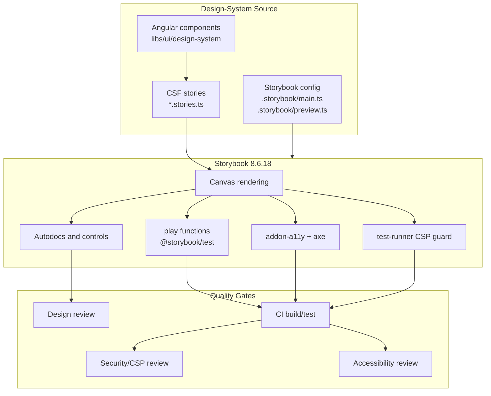

## Table of Contents

[🧠 **View Interactive Mindmap**](./storybook-mindmap.md)

1. [TL;DR](#tldr)
2. [Deep Dive](#deep-dive)
   2.1 [Strategic Role](#strategic-role)
      2.1.1 [Storybook as a Component Workbench](#storybook-as-a-component-workbench)
      2.1.2 [Storybook as a Contract System](#storybook-as-a-contract-system)
      2.1.3 [Storybook as Compliance Evidence](#storybook-as-compliance-evidence)
   2.2 [Architecture in tai-portal](#architecture-in-tai-portal)
      2.2.1 [Nx Storybook Targets](#nx-storybook-targets)
      2.2.2 [Storybook 8 Angular Configuration](#storybook-8-angular-configuration)
      2.2.3 [Autodocs and Controls](#autodocs-and-controls)
   2.3 [Story Design Patterns](#story-design-patterns)
      2.3.1 [State Matrix Stories](#state-matrix-stories)
      2.3.2 [Interaction Audit Stories](#interaction-audit-stories)
      2.3.3 [Security and CSP Stories](#security-and-csp-stories)
      2.3.4 [Accessibility Stories](#accessibility-stories)
   2.4 [Testing and CI](#testing-and-ci)
      2.4.1 [Storybook Test Runner](#storybook-test-runner)
      2.4.2 [Axe Accessibility Checks](#axe-accessibility-checks)
      2.4.3 [Strict CSP Guardrails](#strict-csp-guardrails)
      2.4.4 [Visual and Interaction Regression](#visual-and-interaction-regression)
   2.5 [FinTech Design-System Governance](#fintech-design-system-governance)
      2.5.1 [Component Promotion Criteria](#component-promotion-criteria)
      2.5.2 [Security Review Workflow](#security-review-workflow)
      2.5.3 [Accessibility Review Workflow](#accessibility-review-workflow)
      2.5.4 [Operational Scaling](#operational-scaling)
3. [Architecture & Data Flow](#architecture--data-flow)
4. [Real-World Examples](#real-world-examples)
   4.1 [Design-System Storybook Target](#design-system-storybook-target)
   4.2 [Strict CSP Demo Story](#strict-csp-demo-story)
   4.3 [Login Form Security Validation Story](#login-form-security-validation-story)
   4.4 [Data Table Interaction Audit](#data-table-interaction-audit)
   4.5 [Storybook Test Runner Guardrails](#storybook-test-runner-guardrails)
5. [Comparison Tables](#comparison-tables)
6. [Interview Q&A](#interview-qa)
   6.1 [L1: Junior Knowledge](#l1-junior-knowledge)
      6.1.1 [What Is Storybook?](#what-is-storybook)
      6.1.2 [What Is a Story?](#what-is-a-story)
   6.2 [L2: Mid-Level Knowledge](#l2-mid-level-knowledge)
      6.2.1 [Why Not Just Use App Pages?](#why-not-just-use-app-pages)
      6.2.2 [Stories vs Unit Tests](#stories-vs-unit-tests)
   6.3 [L3: Senior Knowledge](#l3-senior-knowledge)
      6.3.1 [How Would You Design Storybook for a FinTech Design System?](#how-would-you-design-storybook-for-a-fintech-design-system)
      6.3.2 [How Do Storybook Tests Fit CI?](#how-do-storybook-tests-fit-ci)
   6.4 [Staff: System Architecture](#staff-system-architecture)
      6.4.1 [Architect Storybook Governance for a Multi-App Portal](#architect-storybook-governance-for-a-multi-app-portal)
7. [Cross-References](#cross-references)
8. [Further Reading](#further-reading)

---

## TL;DR

<span style="color: #33b5e5; font-weight: bold;">Storybook</span> is the executable workbench for a custom component system: it renders components outside product pages, documents their public API, and runs interaction, accessibility, and security checks against realistic states. `tai-portal` uses <span style="color: #33b5e5; font-weight: bold;">Storybook 8.6.18</span> with `@storybook/angular`, `@storybook/test`, `@storybook/addon-a11y`, `@storybook/addon-interactions`, and Nx targets for `libs/ui/design-system`. For a strict FinTech UI system, Storybook is essential because it turns components into <span style="color: #00C851; font-weight: bold;">reviewable contracts</span>: default, loading, empty, destructive, invalid, keyboard, CSP-safe, and a11y states are visible and testable before they reach app workflows. The senior trade-off is that Storybook only creates value when stories are treated as production contracts; <span style="color: #ff4444; font-weight: bold;">demo-only stories with fake happy paths become visual theater</span> and miss the compliance, accessibility, and interaction regressions that matter.

---

## Deep Dive

### Strategic Role

#### Storybook as a Component Workbench

##### What
<span style="color: #33b5e5; font-weight: bold;">Storybook</span> is an isolated component workbench. It lets engineers render a component with controlled inputs, providers, projected content, and interaction scripts without navigating through an entire application.

##### Why
Without a workbench, every component review depends on product pages. That means a developer must create users, permissions, routes, backend data, feature flags, and edge states just to inspect a button, table, dialog, or login form. In a FinTech portal, that slows down review and hides defects in rarely visited states such as disabled approvals, destructive actions, invalid identity fields, empty tables, expired sessions, and narrow layouts.

##### How
Storybook uses Component Story Format files such as:

```text
libs/ui/design-system/src/lib/organisms/data-table/data-table.stories.ts
libs/ui/design-system/src/lib/organisms/login-form/login-form.stories.ts
libs/ui/design-system/src/lib/security/strict-csp-demo.stories.ts
```

Each story declares metadata, default args, decorators, and optional `play` functions. For Angular, decorators such as `moduleMetadata` and `applicationConfig` provide the imports and providers that would normally come from the app module or route shell.

```typescript
const meta: Meta<DataTableComponent<TestData>> = {
  title: 'Organisms/DataTable',
  component: DataTableComponent,
  decorators: [
    moduleMetadata({
      imports: [CommonModule, CdkTableModule],
    }),
  ],
  args: {
    data,
    columns,
    actions,
    totalCount: 25,
    pageIndex: 1,
    pageSize: 10,
    loading: false,
  },
  tags: ['autodocs'],
};
```

##### When
Use Storybook for reusable UI, design-system components, cross-app components, accessibility-critical workflows, and security-sensitive controls. Do not use Storybook as a substitute for full app E2E tests; app routing, auth, network, persistence, and backend authorization still need integration coverage.

##### Trade-offs
<span style="color: #ffbb33; font-weight: bold;">Storybook has environment cost.</span> It needs realistic providers, CSS, browser APIs, and test data. The payoff is high when components are reused across apps; the cost is less justified for one-off product screens that are unlikely to become shared contracts.

---

#### Storybook as a Contract System

##### What
A Storybook story is a <span style="color: #33b5e5; font-weight: bold;">component contract</span>: it records what inputs a component accepts, what states it supports, what events it emits, and what behavior must remain stable.

##### Why
Without executable contracts, component APIs drift silently. A data table action can disappear for pending users, a dialog can lose its cancel button, a secure input can drop its autocomplete attributes, or a dropdown can become keyboard-inaccessible without a reviewer noticing until the component is embedded in a larger workflow.

##### How
`tai-portal` stories model contracts through:

- `args` for stable input shapes
- `argTypes` for events and controls
- named stories for meaningful states
- `play` functions for interaction proof
- `tags: ['autodocs']` for generated documentation

The `DataTable` story names important states directly:

```typescript
export const Default: Story = {};

export const Loading: Story = {
  args: {
    loading: true,
  },
};

export const Empty: Story = {
  args: {
    data: [],
    totalCount: 0,
  },
};
```

##### When
Use story contracts when a component has public inputs, multiple visual states, keyboard interaction, business-critical events, or security/accessibility requirements. For private helper components, a focused unit test may be enough.

##### Trade-offs
<span style="color: #ff4444; font-weight: bold;">The anti-pattern is a story that only proves the default screenshot.</span> A mature story set includes failure, empty, disabled, long text, high-risk, keyboard, and async states.

---

#### Storybook as Compliance Evidence

##### What
Storybook can become lightweight <span style="color: #33b5e5; font-weight: bold;">compliance evidence</span> when stories and test-runner hooks prove accessibility, CSP safety, secure input behavior, and high-risk action affordances.

##### Why
FinTech component systems need more than visual consistency. They need evidence that controls are accessible, sensitive inputs are hardened, destructive actions are deliberate, and components avoid unsafe styling or DOM patterns that conflict with strict CSP and Trusted Types policies.

##### How
`tai-portal` uses Storybook examples as audit surfaces:

- `StrictCspDemo` renders dropdowns, tables, sidebar, and user profile together.
- `SecureInput` tests password input attributes and escaped error content.
- `LoginForm` verifies validation keeps submission locked until identity inputs are valid.
- `ConfirmationDialog` demonstrates destructive action affordances.
- `.storybook/test-runner.ts` injects Axe and fails on inline styles under `#storybook-root`.

##### When
Use Storybook as compliance evidence for reusable components, not as the only compliance gate. Pair it with unit tests, E2E tests, security reviews, manual keyboard testing, and CI policies.

##### Trade-offs
<span style="color: #ffbb33; font-weight: bold;">Automated a11y and CSP checks catch classes of defects, not every defect.</span> Axe cannot prove product copy is clear, focus order is ideal for every workflow, or that a destructive action has the right business authorization behind it.

---

### Architecture in tai-portal

#### Nx Storybook Targets

##### What
`tai-portal` runs Storybook through <span style="color: #33b5e5; font-weight: bold;">Nx project targets</span>. The design-system library owns `storybook` and `build-storybook` targets under `libs/ui/design-system/project.json`.

##### Why
Without Nx targets, Storybook becomes an ad hoc local command. Nx makes it part of the workspace graph, so build, CI, affected commands, and project ownership can reason about it.

##### How
The design-system target uses Storybook's Angular builder:

```json
"storybook": {
  "executor": "@storybook/angular:start-storybook",
  "options": {
    "port": 6006,
    "configDir": "libs/ui/design-system/.storybook",
    "compodoc": false,
    "tsConfig": "libs/ui/design-system/.storybook/tsconfig.json",
    "browserTarget": "portal-web:build"
  }
}
```

The `browserTarget` points to `portal-web:build`, which means Storybook runs with the same Angular build context that the portal app already uses.

##### When
Use Nx Storybook targets for shared libraries and product apps. Use library-level Storybook for reusable components; use app-level Storybook for page compositions and feature-specific shells.

##### Trade-offs
<span style="color: #ffbb33; font-weight: bold;">Coupling Storybook to an app build target is practical but not free.</span> It keeps CSS/build context realistic, but app build changes can break library Storybook even when library components are otherwise fine.

---

#### Storybook 8 Angular Configuration

##### What
`tai-portal` uses <span style="color: #33b5e5; font-weight: bold;">Storybook 8.6.18</span> with Angular integration.

##### Why
Storybook 8 gives the component system a modern test and documentation surface: Component Story Format, `play` functions, interaction testing, autodocs, and addon-based a11y checks.

##### How
Current package versions in `package.json` and `libs/ui/design-system/package.json`:

```text
storybook: ^8.6.18
@storybook/angular: ^8.6.18
@storybook/test: ^8.6.18
@storybook/addon-a11y: ^8.6.18
@storybook/addon-interactions: ^8.6.18
@nx/storybook: ^22.5.1
```

The design-system `.storybook/main.ts` includes:

```typescript
const config: StorybookConfig = {
  stories: ['../**/*.@(mdx|stories.@(js|jsx|ts|tsx))'],
  addons: ['@storybook/addon-a11y', '@storybook/addon-interactions'],
  framework: {
    name: '@storybook/angular',
    options: {},
  },
};
```

##### When
Use the current Storybook version already in the repo unless a migration is explicitly planned. Do not mix major Storybook versions across libraries and apps in the same Nx workspace.

##### Trade-offs
<span style="color: #ffbb33; font-weight: bold;">Storybook upgrades are framework upgrades.</span> They can affect builders, testing APIs, docs generation, and Angular compatibility, so they should be treated as workspace-level changes.

---

#### Autodocs and Controls

##### What
<span style="color: #33b5e5; font-weight: bold;">Autodocs</span> and controls turn story metadata into interactive documentation.

##### Why
Without docs and controls, consumers must read component internals to discover variants, inputs, states, and event contracts. That undermines the point of a design system.

##### How
The design-system preview enables global autodocs and common control matchers:

```typescript
const preview: Preview = {
  tags: ['autodocs'],
  parameters: {
    controls: {
      matchers: {
        color: /(background|color)$/i,
        date: /Date$/i,
      },
    },
  },
};
```

Stories add typed `Meta` and `StoryObj` definitions so the documentation follows the component contract instead of hand-written drift.

##### When
Use autodocs for stable public components. For experimental components, still write stories, but mark API volatility in the story description or roadmap rather than pretending the contract is settled.

##### Trade-offs
<span style="color: #ff4444; font-weight: bold;">Generated docs are only as good as the component API.</span> Ambiguous boolean inputs, hidden dependency injection, and broad `any` props produce weak documentation.

---

### Story Design Patterns

#### State Matrix Stories

##### What
A <span style="color: #33b5e5; font-weight: bold;">state matrix</span> is a set of stories that covers meaningful component states: default, loading, empty, error, disabled, destructive, long content, and permission-aware variants.

##### Why
Without state coverage, reusable components fail in the states users actually notice: empty tables, disabled submit buttons, loading overlays, invalid forms, and destructive confirmations.

##### How
`DataTable` uses default, loading, empty, and interaction stories. `ConfirmationDialog` uses default and destructive stories. `SecureInput` uses default, focused, password, error, and disabled stories.

```typescript
export const ErrorVisible: Story = {
  args: {
    label: 'Invalid Input',
    errorMessage: '<strong>XSS Attempt</strong> Blocked',
  },
  play: async ({ canvasElement }) => {
    const canvas = within(canvasElement);
    const input = canvas.getByLabelText('Invalid Input');
    await userEvent.click(input);
    await userEvent.tab();
    const errorMsg = canvas.getByRole('alert');
    expect(errorMsg.innerHTML).toContain(
      '&lt;strong&gt;XSS Attempt&lt;/strong&gt; Blocked',
    );
  },
};
```

##### When
Use state matrices for components with multiple user-visible states. Avoid exploding story count for purely visual atoms by grouping small variants into one story when that improves review.

##### Trade-offs
<span style="color: #ffbb33; font-weight: bold;">State matrices need curation.</span> Too few states miss defects; too many low-value permutations make Storybook noisy.

---

#### Interaction Audit Stories

##### What
An <span style="color: #33b5e5; font-weight: bold;">interaction audit story</span> uses a Storybook `play` function to execute user behavior in the browser and assert outcomes.

##### Why
Visual inspection cannot prove controls work. A sortable header can look right but not emit sort state. A pagination button can be visible but disabled incorrectly. A login button can unlock too early.

##### How
`DataTable` uses `@storybook/test` helpers to assert rows, sorting controls, and pagination behavior:

```typescript
export const InteractionAudit: Story = {
  play: async ({ canvasElement }) => {
    const canvas = within(canvasElement);
    await expect(canvas.getByTestId('data-table')).toBeInTheDocument();
    await expect(canvas.getAllByRole('row')).toHaveLength(4);

    const nameSortBtn = canvas.getByTestId('sort-button-name');
    await userEvent.click(nameSortBtn);
    await userEvent.click(nameSortBtn);

    const prevBtn = canvas.getByTestId('pagination-prev');
    await expect(prevBtn).toBeDisabled();
  },
};
```

##### When
Use interaction stories for user intent: click, type, tab, open, close, confirm, cancel, sort, paginate, select, upload, and keyboard navigation.

##### Trade-offs
<span style="color: #ff4444; font-weight: bold;">Do not assert implementation trivia.</span> Interaction stories should prove user-facing behavior and emitted contracts, not private fields or CSS class internals.

---

#### Security and CSP Stories

##### What
A <span style="color: #33b5e5; font-weight: bold;">security story</span> renders components in states that exercise secure DOM behavior, CSP compatibility, Trusted Types safety, and sensitive input handling.

##### Why
Strict security policies fail at the component layer. Inline styles, unsafe HTML, overlay injection, and weak input attributes often enter through reusable UI primitives, then spread across the product.

##### How
`StrictCspDemo` combines dropdown, data table, sidebar, and user profile in one surface. It listens for `securitypolicyviolation` events and the test runner separately fails if inline styles appear under `#storybook-root`.

```typescript
<section
  class="grid gap-6 p-6"
  (securitypolicyviolation)="onViolation($event)"
  data-testid="strict-csp-demo"
>
  <tai-dropdown-menu
    ariaLabel="Demo actions"
    triggerLabel="Actions"
    testId="strict-csp-dropdown"
    [items]="dropdownItems"
  />
</section>
```

##### When
Use security stories for secure inputs, dialogs, dropdowns, overlays, menus, rich text, notification surfaces, and any component that accepts user-generated strings.

##### Trade-offs
<span style="color: #ffbb33; font-weight: bold;">Security stories need realistic threat cases.</span> A story that only renders safe text will not catch XSS escaping regressions, unsafe style APIs, or credential-field attribute drift.

---

#### Accessibility Stories

##### What
An <span style="color: #33b5e5; font-weight: bold;">accessibility story</span> proves semantic roles, labels, keyboard behavior, focus handling, disabled states, and error announcements.

##### Why
FinTech applications serve users under stress, on constrained devices, with assistive tech, and in regulated contexts. Without accessibility stories, a component can pass a screenshot review while failing keyboard navigation or screen-reader semantics.

##### How
Use role-based queries and real user events:

```typescript
const submitBtn = canvas.getByRole('button', { name: /Sign In/i });
await expect(submitBtn).toBeDisabled();

await userEvent.type(emailInput, 'admin@tai.com', { delay: 50 });
await userEvent.type(passwordInput, 'SecurePass123!', { delay: 50 });
await waitFor(() => {
  expect(submitBtn).not.toBeDisabled();
});
```

##### When
Every reusable interactive component should have at least one accessibility-oriented story. Static decorative components may rely on visual and unit tests if they have no interaction or semantics.

##### Trade-offs
<span style="color: #ffbb33; font-weight: bold;">Automated accessibility is necessary but incomplete.</span> It catches missing labels and obvious semantic violations, but human review is still needed for focus order, wording, cognitive load, and destructive-action clarity.

---

### Testing and CI

#### Storybook Test Runner

##### What
The <span style="color: #33b5e5; font-weight: bold;">Storybook test runner</span> executes stories in a browser-like environment and runs each story's `play` function plus configured hooks.

##### Why
Without a test runner, Storybook can become manual-only documentation. CI needs to fail when a component contract breaks.

##### How
`libs/ui/design-system/.storybook/test-runner.ts` configures hooks:

```typescript
const config: TestRunnerConfig = {
  async preVisit(page) {
    await injectAxe(page);
  },
  async postVisit(page) {
    await checkA11y(page, '#storybook-root', {
      detailedReport: true,
      detailedReportOptions: {
        html: true,
      },
    });

    const inlineStylesCount = await page
      .locator('#storybook-root [style]')
      .count();
    if (inlineStylesCount > 0) {
      throw new Error(
        `CSP Violation: Found ${inlineStylesCount} elements with inline styles.`,
      );
    }
  },
};
```

##### When
Use the test runner in CI for shared component libraries and before merging broad design-system changes.

##### Trade-offs
<span style="color: #ffbb33; font-weight: bold;">Storybook browser tests are slower than unit tests.</span> Keep unit tests for pure logic and use Storybook tests for rendered behavior and cross-cutting browser checks.

---

#### Axe Accessibility Checks

##### What
<span style="color: #33b5e5; font-weight: bold;">Axe</span> is an automated accessibility engine. In Storybook, it can scan rendered component DOM after stories load.

##### Why
Without automated a11y checks, regressions like missing labels, poor roles, invalid ARIA, and contrast issues often reach product pages.

##### How
`tai-portal` injects Axe before story visits and checks `#storybook-root` after each visit.

##### When
Run Axe on every component story that represents a production state. Add targeted stories for error, disabled, modal, menu, and keyboard states because a11y failures are often state-specific.

##### Trade-offs
<span style="color: #ff4444; font-weight: bold;">Axe passing does not mean the component is fully accessible.</span> It is a baseline gate, not a replacement for keyboard and screen-reader review.

---

#### Strict CSP Guardrails

##### What
<span style="color: #33b5e5; font-weight: bold;">Strict CSP guardrails</span> are Storybook checks that prevent unsafe inline styles and runtime DOM patterns from entering reusable components.

##### Why
FinTech portals often use strict Content Security Policy and Trusted Types. A single reusable component that relies on inline styles, unsafe HTML, or dynamic style injection can force the whole app to weaken its policy.

##### How
The test runner counts `[style]` attributes under `#storybook-root` and fails when any are found. The `StrictCspDemo` story also exercises multiple components in one surface to catch composition issues.

##### When
Use CSP guardrails for every component library that serves security-sensitive apps. Run them in Storybook because reusable UI is the origin point for most policy drift.

##### Trade-offs
<span style="color: #ffbb33; font-weight: bold;">Strict CSP checks constrain implementation choices.</span> They push the system toward class-based styling, CSS variables from stylesheets, local DOM composition, and audited overlay behavior.

---

#### Visual and Interaction Regression

##### What
<span style="color: #33b5e5; font-weight: bold;">Visual and interaction regression</span> means catching changes in rendered UI and behavior before they reach product workflows.

##### Why
Component regressions multiply. A dropdown bug affects tables, forms, headers, dialogs, and dashboards. A design-system bug is not local to one feature.

##### How
Storybook contributes by providing stable stories for visual baselines, interaction tests, and repeatable browser states. Playwright E2E still covers product flows, but Storybook isolates the component root cause.

##### When
Use visual regression for mature stable components. During early component design, prefer interaction and accessibility checks first; snapshots can be noisy while APIs are still moving.

##### Trade-offs
<span style="color: #ffbb33; font-weight: bold;">Visual tests can become noisy.</span> They need stable data, deterministic dimensions, controlled fonts, and clear review rules.

---

### FinTech Design-System Governance

#### Component Promotion Criteria

##### What
<span style="color: #33b5e5; font-weight: bold;">Promotion criteria</span> define when a component is mature enough to enter the shared design system.

##### Why
Without promotion rules, the design system becomes either a bottleneck or a dumping ground. Both are expensive: teams either wait too long for common controls or inherit weak APIs that cannot support real workflows.

##### How
A FinTech component should enter `libs/ui/design-system` only when it has:

- clear public inputs and outputs
- default, empty, loading, disabled, error, and long-content stories where relevant
- interaction story for user intent
- a11y proof through roles, labels, keyboard behavior, and Axe
- CSP-safe styling
- unit tests for internal logic
- Storybook docs for consumer usage

##### When
Promote a component after it appears in at least two workflows or is security/accessibility critical enough to centralize immediately, such as secure input, login form, confirmation dialog, or data table.

##### Trade-offs
<span style="color: #ffbb33; font-weight: bold;">Not every component deserves reuse.</span> One-off product layouts should stay local until their API stabilizes through real usage.

---

#### Security Review Workflow

##### What
A <span style="color: #33b5e5; font-weight: bold;">security review workflow</span> checks a component for DOM safety, credential handling, dangerous actions, data exposure, and policy compatibility.

##### Why
Reusable UI can accidentally normalize unsafe behavior. If `SecureInput` mishandles password attributes or `ConfirmationDialog` underplays destructive actions, every consuming workflow inherits that weakness.

##### How
Use Storybook to show and test security-specific states:

- password and token input states
- escaped error content
- destructive confirmation styling
- no inline styles
- no unsafe `innerHTML`
- no product data fetching in design-system components
- event outputs that represent user intent rather than hidden side effects

##### When
Use security review for inputs, forms, dialogs, data tables, menus, notification surfaces, user profile controls, and any component that receives untrusted strings.

##### Trade-offs
<span style="color: #ff4444; font-weight: bold;">A pretty component that weakens CSP is not production-ready.</span> Security review must be a merge gate for shared components, not a cleanup task.

---

#### Accessibility Review Workflow

##### What
An <span style="color: #33b5e5; font-weight: bold;">accessibility review workflow</span> combines automated checks, semantic story assertions, keyboard testing, and state-specific review.

##### Why
Accessibility defects in shared components are high-leverage failures. One inaccessible menu or dialog affects every feature that uses it.

##### How
For every interactive component, Storybook should prove:

- accessible name
- correct role
- keyboard path
- focus-visible state
- disabled behavior
- error message association
- alert/live region behavior where needed
- high-risk action clarity

##### When
Run accessibility review before promoting components and before changing focus, keyboard, dialog, menu, form, or table behavior.

##### Trade-offs
<span style="color: #ffbb33; font-weight: bold;">Accessibility review takes deliberate time.</span> That cost is lower than retrofitting accessibility after a component has spread across the portal.

---

#### Operational Scaling

##### What
<span style="color: #33b5e5; font-weight: bold;">Operational scaling</span> is the process of keeping Storybook useful as the component library, app count, and team count grow.

##### Why
A Storybook with hundreds of undisciplined stories becomes hard to navigate and slow to test. Engineers stop trusting it, and design-system governance moves back into code review guesswork.

##### How
Scale through:

- clear story taxonomy: Atoms, Molecules, Organisms, Security
- stable naming
- one interaction audit per behavior-heavy component
- a11y and CSP hooks in CI
- visual baselines only for mature components
- docs linked from component ownership and roadmap notes
- periodic pruning of obsolete stories

##### When
Start governance early when the design system serves more than one app or when components become security/accessibility critical.

##### Trade-offs
<span style="color: #ffbb33; font-weight: bold;">Storybook maintenance is real work.</span> Treat it as design-system infrastructure, not optional documentation.

---

## Architecture & Data Flow



---

## Real-World Examples

### Design-System Storybook Target

`📍 From tai-portal:` `libs/ui/design-system/project.json`

The design-system Storybook target runs on port `6006`, uses `libs/ui/design-system/.storybook`, and builds against `portal-web:build`.

```json
"storybook": {
  "executor": "@storybook/angular:start-storybook",
  "options": {
    "port": 6006,
    "configDir": "libs/ui/design-system/.storybook",
    "compodoc": false,
    "tsConfig": "libs/ui/design-system/.storybook/tsconfig.json",
    "browserTarget": "portal-web:build"
  }
}
```

Why it matters: Storybook is integrated into the Nx workspace rather than living as a disconnected local demo.

### Strict CSP Demo Story

`📍 From tai-portal:` `libs/ui/design-system/src/lib/security/strict-csp-demo.stories.ts`

This story renders a local-DOM dropdown, data table, sidebar, and user profile together. It exists to prove that common components can run under strict CSP expectations.

```typescript
export const ComponentSurface: Story = {
  play: async ({ canvasElement }) => {
    const canvas = within(canvasElement);
    await expect(canvas.getByTestId('strict-csp-demo')).toBeInTheDocument();
    await expect(
      canvas.getByRole('heading', { name: /Strict CSP Component Surface/i }),
    ).toBeInTheDocument();
  },
};
```

Why it matters: CSP compatibility must be tested at component-composition boundaries, not only in isolated atoms.

### Login Form Security Validation Story

`📍 From tai-portal:` `libs/ui/design-system/src/lib/organisms/login-form/login-form.stories.ts`

The login form story proves that the submit path is locked until validation passes and that the password input uses secure browser attributes.

```typescript
await expect(passwordInput).toHaveAttribute('autocomplete', 'current-password');
await expect(passwordInput).toHaveAttribute('type', 'password');
await expect(submitBtn).toBeDisabled();
```

Why it matters: identity controls are not normal forms. Their stories should prove security and validation invariants.

### Data Table Interaction Audit

`📍 From tai-portal:` `libs/ui/design-system/src/lib/organisms/data-table/data-table.stories.ts`

The data table story covers rendering, sorting, and pagination interactions.

```typescript
const nameSortBtn = canvas.getByTestId('sort-button-name');
await userEvent.click(nameSortBtn);
await userEvent.click(nameSortBtn);

const prevBtn = canvas.getByTestId('pagination-prev');
await expect(prevBtn).toBeDisabled();
```

Why it matters: tables are high-risk enterprise components because they combine data density, permissions, pagination, sorting, and row actions.

### Storybook Test Runner Guardrails

`📍 From tai-portal:` `libs/ui/design-system/.storybook/test-runner.ts`

The test runner injects Axe and fails on inline styles inside `#storybook-root`.

```typescript
async postVisit(page) {
  await checkA11y(page, '#storybook-root', {
    detailedReport: true,
    detailedReportOptions: {
      html: true,
    },
  });

  const inlineStylesCount = await page
    .locator('#storybook-root [style]')
    .count();
  if (inlineStylesCount > 0) {
    throw new Error(
      `CSP Violation: Found ${inlineStylesCount} elements with inline styles.`,
    );
  }
}
```

Why it matters: this turns Storybook from a visual catalog into a CI-enforceable compliance surface.

---

## Comparison Tables

### Storybook vs Unit Tests vs E2E

| Dimension | Storybook | Unit Tests | E2E Tests |
|-----------|-----------|------------|-----------|
| **Mental model** | Rendered component contract | Isolated logic/component behavior | Full user journey |
| **Best use** | States, interactions, docs, a11y, CSP | pure logic, reducers, validators, component internals | routing, auth, backend integration |
| **Speed** | medium | fast | slow |
| **Failure signal** | component contract broke | code behavior broke | product flow broke |
| **tai-portal choice** | design-system workbench and compliance guard | Vitest/TestBed for logic and component tests | Playwright for portal workflows |

### Demo Story vs Contract Story

| Dimension | Demo Story | Contract Story |
|-----------|------------|----------------|
| **Purpose** | show what the component looks like | prove what the component guarantees |
| **Inputs** | happy-path sample data | meaningful states and edge cases |
| **Assertions** | often none | role, label, state, events, security, a11y |
| **Risk** | false confidence | maintenance cost |
| **FinTech grade** | insufficient | required |

### App Page Review vs Design-System Storybook

| Dimension | App Page Review | Design-System Storybook |
|-----------|-----------------|-------------------------|
| **Setup** | needs routes, auth, data, backend | isolated component inputs/providers |
| **State coverage** | hard to reach rare states | explicit state matrix |
| **Security review** | mixed with product logic | focused on reusable UI surface |
| **Accessibility review** | realistic workflow | precise component semantics |
| **Best answer** | use both | use both |

---

## Interview Q&A

### L1: Junior Knowledge

#### What Is Storybook?
**Difficulty:** L1 (Junior)

**Question:** What is Storybook?

**Answer:** <span style="color: #33b5e5; font-weight: bold;">Storybook</span> is a tool for rendering and testing UI components outside the main application. It lets developers document component states, inspect inputs, and run interaction checks without navigating full app flows.

---

#### What Is a Story?
**Difficulty:** L1 (Junior)

**Question:** What is a Storybook story?

**Answer:** A story is one named example of a component state. It can provide inputs, providers, markup, and a `play` function that simulates user interaction and asserts behavior.

---

### L2: Mid-Level Knowledge

#### Why Not Just Use App Pages?
**Difficulty:** L2 (Mid-Level)

**Question:** Why do we need Storybook if the component already appears in the app?

**Answer:** App pages show components in real workflows, but they make rare states hard to reach. Storybook isolates the component so loading, empty, disabled, invalid, destructive, and long-content states can be reviewed directly. It also documents the public API for other teams. <span style="color: #ffbb33; font-weight: bold;">The trade-off is maintaining realistic stories and providers.</span>

---

#### Stories vs Unit Tests
**Difficulty:** L2 (Mid-Level)

**Question:** How are Storybook stories different from Angular unit tests?

**Answer:** Unit tests are best for isolated logic, validators, reducers, services, and component internals. Storybook stories are better for rendered browser behavior, public states, docs, a11y checks, and user interactions. A mature design system uses both. <span style="color: #ff4444; font-weight: bold;">Replacing unit tests with screenshot stories is a weak testing strategy.</span>

---

### L3: Senior Knowledge

#### How Would You Design Storybook for a FinTech Design System?
**Difficulty:** L3 (Senior)

**Question:** How would you design Storybook for a custom, strict-security, accessibility-compliant FinTech component system?

**Answer:** I would treat Storybook as a governed contract system, not a gallery. Each reusable component would have a state matrix, typed args, autodocs, interaction stories, and explicit accessibility states. Security-sensitive controls would include stories for escaped text, password fields, destructive actions, and CSP-safe composition. The test runner would inject Axe and fail on unsafe DOM patterns such as inline styles. CI would build Storybook and run interaction/a11y checks for affected design-system components. <span style="color: #00C851; font-weight: bold;">The key is making compliance visible and executable at the component boundary.</span>

---

#### How Do Storybook Tests Fit CI?
**Difficulty:** L3 (Senior)

**Question:** How should Storybook tests fit into CI without making the pipeline too slow?

**Answer:** Keep unit tests as the fastest gate for logic and component internals. Run Storybook build and test-runner checks for design-system changes and affected projects. Use interaction tests for behavior-heavy components, Axe for accessibility baseline, and CSP checks for policy compatibility. Use visual regression selectively for stable high-value components because visual baselines can be noisy during active design work. <span style="color: #ffbb33; font-weight: bold;">The senior trade-off is confidence versus pipeline cost.</span>

---

### Staff: System Architecture

#### Architect Storybook Governance for a Multi-App Portal
**Difficulty:** Staff

**Question:** Design Storybook governance for a multi-app Angular portal with a shared FinTech design system.

**Answer:** I would split Storybook into library-level and app-level surfaces. The design-system Storybook owns atoms, molecules, organisms, security stories, state matrices, and reusable behavior contracts. App Storybooks own page compositions and feature shells that depend on routing, auth, or product data. CI runs library Storybook build/test-runner checks on design-system changes, including Axe and CSP guardrails. Component promotion requires typed APIs, docs, accessibility states, interaction tests, and security review for sensitive controls. Ownership should be explicit: design-system maintainers review reusable APIs, while product teams can prototype locally before promotion. As scale grows, I would add visual baselines only for stable components and prune obsolete stories during release cycles. <span style="color: #00C851; font-weight: bold;">The goal is a design system that is fast to consume but hard to accidentally weaken.</span>

---

## Cross-References

- [[Design-System-Architecture]] - Storybook is the documentation and verification workbench for design-system governance.
- [[Testing-Frontend]] - Storybook complements unit tests and Playwright by testing rendered component contracts.
- [[Change-Detection-Signals]] - OnPush and signal-driven components need production-like story interactions to catch stale UI.
- [[Security-CSP-DPoP]] - Strict CSP and Trusted Types constraints should be enforced at reusable component boundaries.
- [[Nx-Monorepo]] - Nx targets make Storybook part of the workspace graph and CI strategy.

---

## Further Reading

- Storybook Angular documentation: https://storybook.js.org/docs/get-started/frameworks/angular
- Storybook interaction testing: https://storybook.js.org/docs/writing-tests/interaction-testing
- Storybook accessibility testing: https://storybook.js.org/docs/writing-tests/accessibility-testing
- Storybook test runner: https://storybook.js.org/docs/writing-tests/test-runner
- Nx Storybook documentation: https://nx.dev/technologies/test-tools/storybook

---

*Last updated: 2026-05-03*
