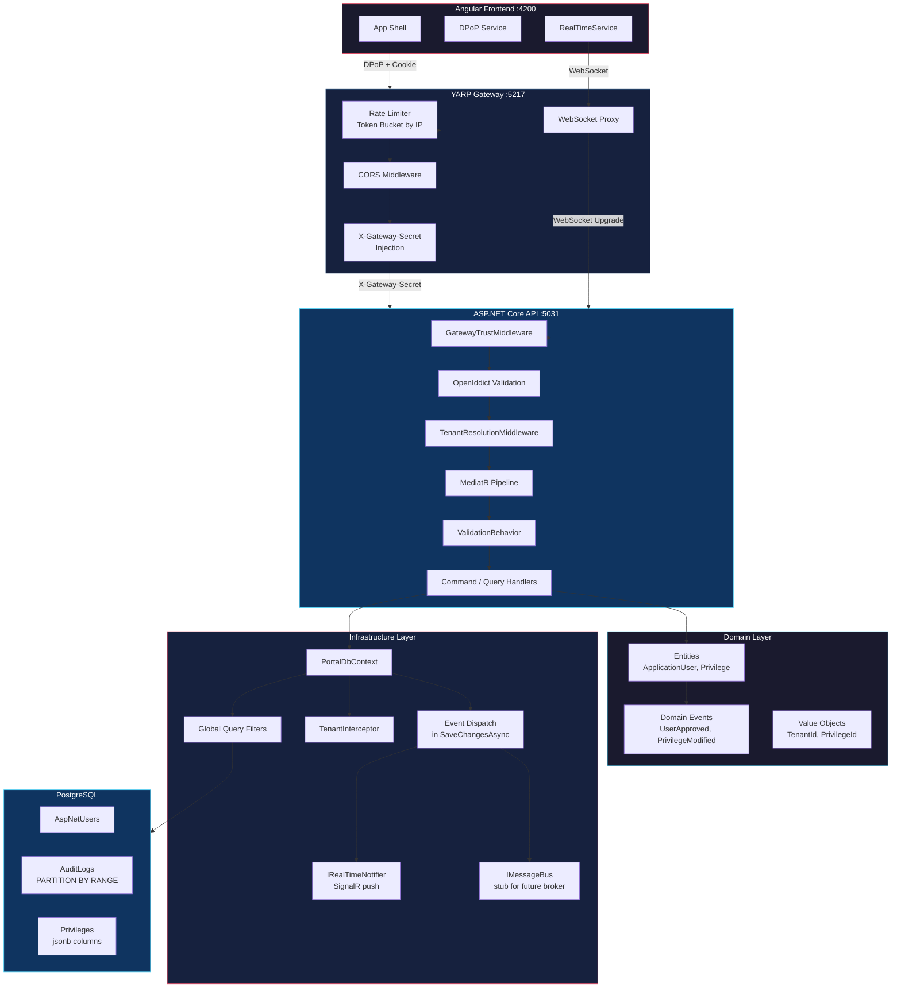
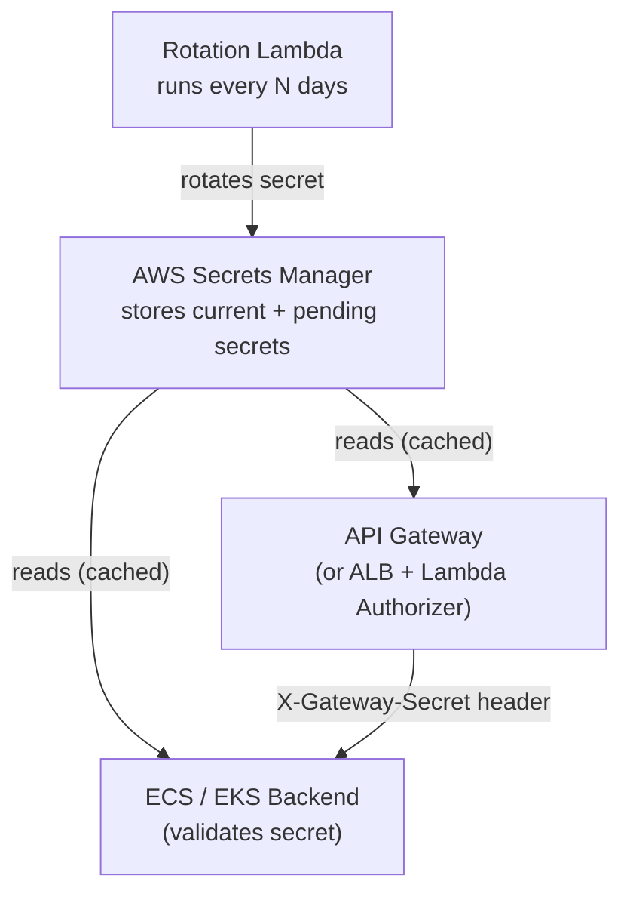
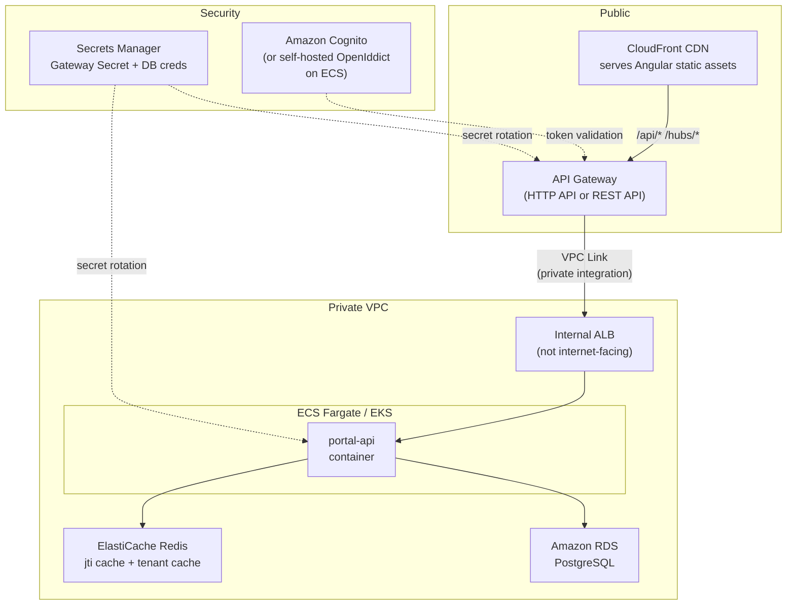
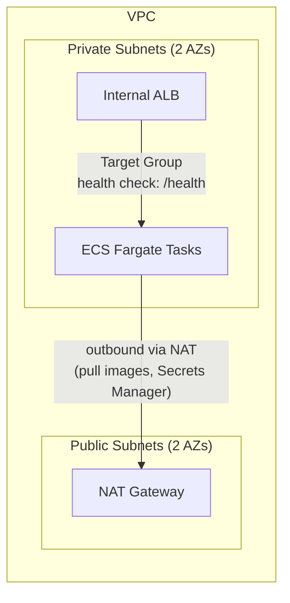
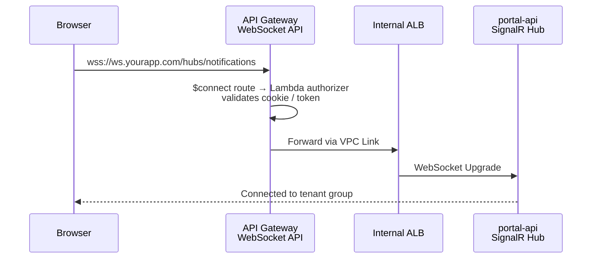
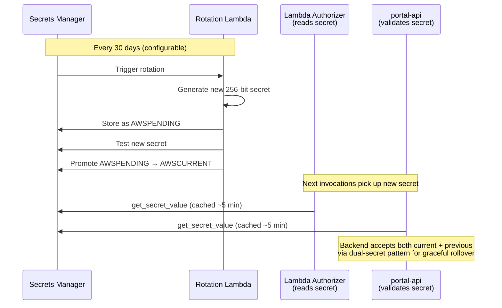

## TL;DR

`tai-portal` is a **multi-tenant, AI-native SaaS** built as an Nx monorepo with a clear layered architecture: **Angular 21 frontend** → **YARP API Gateway** (rate limiting, secret injection, WebSocket proxying) → **ASP.NET Core API** (OpenIddict identity, MediatR CQRS, EF Core with PostgreSQL). The design enforces **Zero Trust** at every layer — DPoP token binding, gateway trust middleware, global query filters for tenant isolation, and a Claim Check pattern for real-time events. Key architectural patterns include: **CQRS** via MediatR commands/queries with a validation pipeline behavior, **domain event dispatch** inside EF Core's `SaveChangesAsync` transaction, **optimistic concurrency** via PostgreSQL `xmin`, and **table partitioning** for unbounded audit logs. The system is designed for **eventual production parity** — stubs exist for message bus (`IMessageBus`), resilience (no Polly yet), and observability (correlation IDs without OpenTelemetry).

## Deep Dive

### Concept Overview

#### 1. The YARP API Gateway — Edge Security & Routing
- **What:** YARP (Yet Another Reverse Proxy) is Microsoft's high-performance reverse proxy library. In `tai-portal`, it acts as the single entry point for all traffic — API requests, WebSocket connections, OIDC flows, and static assets. It routes to a single backend cluster and injects the `X-Gateway-Secret` header on every forwarded request.
- **Why:** The gateway centralizes cross-cutting concerns that would otherwise be duplicated across services: rate limiting, CORS, TLS termination, and trust injection. No client can reach the API directly — every request must pass through the gateway, which acts as the security perimeter.
- **How:** YARP loads its route table from `appsettings.json`. Six routes cover all traffic patterns: `/api/**` (REST), `/hubs/**` (WebSocket with explicit `WebSocket.Enabled`), `/connect/**` (OIDC with rate limiting), `/identity/**` (with path prefix removal and tenant host injection), `/.well-known/**` (OIDC discovery), and `/Account/**` (login UI). A code-level transform injects `X-Gateway-Secret` into every forwarded request:
  ```csharp
  builder.Services.AddReverseProxy()
      .LoadFromConfig(builder.Configuration.GetSection("ReverseProxy"))
      .AddTransforms(ctx => ctx.AddRequestHeader("X-Gateway-Secret", secret));
  ```
- **When:** Use a reverse proxy gateway for any production deployment with more than one backend service, or when you need to enforce edge-level security that the backend shouldn't manage (rate limiting, WAF, mutual TLS).
- **Trade-offs:** The gateway is a single point of failure. If YARP crashes, all traffic stops. In production, you'd deploy multiple gateway instances behind a cloud load balancer (ALB/NLB). Also, YARP adds ~1-2ms latency per request for header injection and routing.

#### 2. CQRS with MediatR — Command/Query Separation
- **What:** Command Query Responsibility Segregation (CQRS) separates write operations (commands that change state) from read operations (queries that return data). In `tai-portal`, MediatR implements this: commands like `RegisterCustomerCommand` and queries like `GetUsersQuery` are distinct types with separate handlers.
- **Why:** Separating reads and writes allows independent optimization. Read paths use `.AsNoTracking()`, projection with `.Select()`, and caching. Write paths use tracked entities, domain event dispatch, and optimistic concurrency. The separation also enforces a clean architecture boundary — controllers dispatch requests, handlers execute business logic, and the domain model enforces invariants.
- **How:** Controllers receive HTTP requests, construct a MediatR request (command or query), and call `_mediator.Send(request)`. MediatR resolves the handler from DI, runs pipeline behaviors (validation), and invokes the handler. The handler interacts with EF Core and domain services, then returns a result:
  ```
  Controller → MediatR.Send(Command) → ValidationBehavior → Handler → DbContext → DB
  ```
- **When:** Use CQRS when reads and writes have fundamentally different performance characteristics or consistency requirements. Overkill for simple CRUD apps; essential when you have complex validation, event sourcing, or separate read/write databases.
- **Trade-offs:** More types (command, handler, validator, response) per operation. A simple "update user" requires `UpdateUserCommand`, `UpdateUserCommandHandler`, and optionally `UpdateUserCommandValidator`. This is deliberate — it forces explicit modeling of each operation. The indirection cost is justified by testability and pipeline behaviors.

#### 3. Validation Pipeline Behavior — Cross-Cutting Validation
- **What:** A MediatR pipeline behavior that intercepts every command/query before it reaches the handler, runs all registered FluentValidation validators, and throws a `ValidationException` if any fail. The global exception middleware converts this to a `400 ValidationProblemDetails`.
- **Why:** Without a pipeline behavior, every handler would need to manually call validators — duplication and easy to forget. The behavior enforces validation consistently across all operations, acting as a "middleware" for the CQRS pipeline.
- **How:** `ValidationPipelineBehavior<TRequest, TResponse>` receives `IEnumerable<IValidator<TRequest>>` via DI. It runs all validators concurrently with `Task.WhenAll`, collects failures, and throws if any exist. Registration is one line: `cfg.AddBehavior(typeof(IPipelineBehavior<,>), typeof(ValidationPipelineBehavior<,>))`.
- **When:** Use pipeline behaviors for any cross-cutting concern in the CQRS pipeline — validation, logging, authorization, performance metrics, transaction management.
- **Trade-offs:** Pipeline behaviors run on every request, so they must be fast. Running validators concurrently (via `Task.WhenAll`) is faster than sequential, but creates more tasks — for simple validators, the overhead may exceed the validation itself.

#### 4. Domain-Driven Design — Rich Domain Model
- **What:** DDD is an approach where the domain model encapsulates business logic, invariants, and state transitions — entities are not anemic data bags. In `tai-portal`, `ApplicationUser` has methods like `StartCustomerOnboarding()`, `Approve(adminId)`, and `ActivateAccount()` that enforce business rules and raise domain events.
- **Why:** Anemic models push business logic into services, creating "feature envy" and duplicated validation. Rich domain entities guarantee that invariants are always enforced — you cannot approve a user without providing an admin ID, and approval automatically raises a `UserApprovedEvent` that triggers an audit entry.
- **How:** Key DDD building blocks in `tai-portal`:
  - **Entities:** `ApplicationUser`, `Privilege`, `Tenant`, `AuditEntry` — each with behavior methods
  - **Value Objects:** `TenantId`, `PrivilegeId`, `TenantAdminId` (record structs) — immutable, equality by value
  - **Domain Events:** `UserApprovedEvent`, `PrivilegeModifiedEvent`, `LoginAnomalyEvent` — raised by entities, dispatched in `SaveChangesAsync`
  - **Interfaces:** `IHasDomainEvents`, `IMultiTenantEntity`, `IAuditableEntity` — marker interfaces that the infrastructure layer uses for automatic behavior
- **When:** Use DDD for domains with complex business rules, state machines, and invariants. Skip it for pure CRUD or reporting applications where entities are just data.
- **Trade-offs:** DDD entities are harder to hydrate from ORMs (private setters, required constructors, `init`-only properties). EF Core 10 handles this well, but older ORMs struggle. Also, DDD requires disciplined design — poorly factored aggregates lead to large transaction scopes and contention.

#### 5. Multi-Tenancy — Three-Layer Isolation
- **What:** Multi-tenancy means a single deployment serves multiple isolated customers (tenants). In `tai-portal`, tenancy is enforced at three layers: request resolution, database query filtering, and real-time event routing.
- **Why:** Running a separate deployment per tenant is operationally expensive and doesn't scale beyond ~50 tenants. Shared infrastructure with logical isolation gives you the economics of multi-tenancy with the security guarantees of isolation.
- **How:**
  1. **Request layer:** `TenantResolutionMiddleware` reads the `Host` header (e.g., `acme.localhost`), looks up the tenant in the database (cached for 15 minutes), and sets `ITenantService.TenantId` for the current request scope.
  2. **Database layer:** Global Query Filters on `ApplicationUser`, `Tenant`, and `AuditEntry` automatically append `WHERE TenantId = @current`. `TenantInterceptor` stamps `TenantId` on every new entity.
  3. **Real-time layer:** `NotificationHub.OnConnectedAsync()` adds connections to a group keyed by `tenant_id` claim. All server pushes use `Clients.Group(tenantId)`.
- **When:** Use host-based tenant resolution when tenants have custom domains or subdomains. Use header-based or claim-based resolution for API-only tenancy.
- **Trade-offs:** Shared-database tenancy (tai-portal's model) is simple but creates "noisy neighbor" risk — one tenant's heavy query can affect all tenants. For regulated industries, consider schema-per-tenant or database-per-tenant isolation tiers (see the EF Core note's Staff Q&A for a detailed design).

#### 6. The Middleware Pipeline — Order Matters
- **What:** The ASP.NET Core middleware pipeline processes requests in order and responses in reverse order. Each middleware can short-circuit the pipeline (returning early) or pass the request to the next middleware.
- **Why:** Middleware order determines security guarantees. If authentication runs before gateway trust validation, an attacker could bypass the gateway. If CORS runs after authentication, preflight requests would fail.
- **How:** The `portal-api` pipeline order is deliberately sequenced:
  1. **Exception handling** (inline lambda) — catches `ValidationException` → 400
  2. **Forwarded headers** — corrects client IP from proxy headers
  3. **Routing** — maps request to endpoint
  4. **CORS** — validates origin allow-list
  5. **Gateway trust** — validates `X-Gateway-Secret` (rejects direct access)
  6. **Authentication** — validates JWT/cookie via OpenIddict
  7. **Authorization** — checks `[Authorize]` policies
  8. **Tenant resolution** — resolves tenant from host, sets `ITenantService`
  9. **Endpoints** — controllers and SignalR hubs
- **When:** Always diagram your middleware pipeline when designing a new service. Reordering middleware is the most common source of auth bypass vulnerabilities.
- **Trade-offs:** Each middleware adds latency. For high-throughput services, consider whether all middleware is needed on every path. `tai-portal` applies all middleware to all routes — acceptable for a POC, but production might use endpoint-specific middleware branching (`app.Map("/api", ...)`) to skip unnecessary processing.

#### 7. Domain Event Dispatch — Transactional Side Effects
- **What:** Domain events are raised by entities during business operations and dispatched inside `SaveChangesAsync` before the actual database flush. Handlers (via MediatR) write audit entries, push SignalR notifications, and publish to message buses — all within the same database transaction.
- **Why:** Pre-save dispatch guarantees transactional consistency. If the audit handler writes an `AuditEntry` and the main save fails, both roll back atomically. This eliminates the "ghost event" problem where an event is published but the triggering change fails.
- **How:** The dispatch mechanism in `SaveChangesAsync`:
  1. Scan `ChangeTracker` for entities implementing `IHasDomainEvents`
  2. Collect all `DomainEvents`, clear the collections (prevent re-dispatch)
  3. Wrap each event in `DomainEventNotification<T>` (MediatR `INotification`)
  4. Publish via `IPublisher` — handlers are resolved from DI
  5. Call `base.SaveChangesAsync()` — the handler's writes are included
- **When:** Use pre-save dispatch for effects that must be transactionally consistent (audit, cascading state). Use post-save dispatch (or Outbox) for effects that tolerate eventual consistency (email, external API calls, SignalR).
- **Trade-offs:** Handler failures abort the entire save. A buggy audit handler prevents legitimate business operations. Also, the current implementation dispatches events inline (not via outbox), so if the process crashes after commit but before SignalR push, the notification is lost. The `IMessageBus` stub is intended to be replaced with a proper Outbox pattern.

#### 8. Distributed Resilience Patterns — Theory & Gaps
- **What:** Patterns for handling failures across service boundaries: Circuit Breaker (stop calling a dead service), Outbox (guarantee event delivery), Saga (compensating transactions across services), and Retry with backoff.
- **Why:** In a distributed system, failure is not exceptional — it's routine. Network partitions, service restarts, database failover, and LLM provider outages all happen regularly. Without resilience patterns, a single downstream failure cascades into total system outage.
- **How (current tai-portal state):**
  - **Outbox:** Not implemented. Domain events are dispatched in-process. `IMessageBus` is a `LoggingMessageBus` stub.
  - **Circuit Breaker:** Not implemented. No Polly policies. If PostgreSQL drops, EF Core throws immediately with no retry.
  - **Retry:** Not implemented. No `EnableRetryOnFailure()` on Npgsql, no `HttpClientFactory` resilience pipelines.
  - **Saga:** Not implemented. All operations are single-service, single-database transactions.
  - **What IS implemented:** Optimistic concurrency (xmin), advisory locks for seed safety, memory cache with TTL for tenant resolution and privilege lookups.
- **When:** Add Polly retry policies before production deployment. Add an Outbox pattern when event delivery guarantees are required. Add Saga orchestration when the system spans multiple services with independent databases.
- **Trade-offs:** Resilience patterns add complexity. Retry policies can amplify load on a struggling service ("retry storm"). Circuit breakers require careful threshold tuning — too sensitive and you trip on normal latency spikes, too lenient and you waste resources on a dead service. Start simple (exponential backoff with jitter) and add sophistication only after observing failure patterns.

#### 9. AI-Native Architecture — Orchestration vs. Inference
- **What:** Modern system design separates the AI orchestration layer (prompt building, RAG retrieval, guardrails, context management) from the inference layer (actual LLM API calls). This allows hot-swapping providers and implementing cost controls.
- **Why:** LLM inference is expensive ($15-75 per million tokens for frontier models), latency-variable (100ms-10s), and unreliable (rate limits, outages). Tightly coupling business logic to a single provider creates vendor lock-in and fragility.
- **How:** The orchestration layer handles:
  1. **Context assembly** — RAG retrieval from vector DB, tool/function schema injection
  2. **Security guardrails** — input/output filtering, PII redaction, token budget limits
  3. **Provider abstraction** — route to GPT-4o, Claude, or a local model based on cost/latency requirements
  4. **Caching** — semantic cache (hash of prompt → cached response) to avoid redundant inference
  5. **Streaming** — SSE or WebSocket delivery of partial responses to the frontend
- **When:** Use this separation for any production AI system. Even for POCs, abstracting the provider prevents technical debt when you inevitably switch models.
- **Trade-offs:** The abstraction layer adds latency (~5-20ms for prompt assembly and routing). For latency-critical applications (real-time trading, autonomous driving), you may need direct inference calls. For most SaaS applications, the indirection is well worth the flexibility.

#### 10. FinOps — Cost-Aware Design
- **What:** FinOps is the practice of making infrastructure cost a first-class architectural concern. In AI-native systems, inference costs can dominate the entire bill — a single LLM API call can cost more than serving 1,000 traditional API requests.
- **Why:** A poorly designed RAG pipeline that sends 50KB of context per query at $15/M tokens costs $0.75 per query. At 10,000 queries/day, that's $7,500/day — $225,000/month. Cost must be designed into the system, not discovered in the bill.
- **How:** Key strategies:
  - **Semantic caching** — cache responses for semantically similar queries (cosine similarity > 0.95)
  - **Tiered models** — route simple queries to smaller/cheaper models, complex queries to frontier models
  - **Token budgets** — enforce per-user or per-tenant token limits
  - **Prompt optimization** — minimize context window usage with better retrieval precision
  - **Async processing** — batch non-urgent inference requests to use cheaper off-peak pricing
- **When:** Always consider cost when designing AI features. Set budget alerts before deploying any LLM-integrated feature to production.
- **Trade-offs:** Cost optimization often conflicts with quality. Smaller models are cheaper but less accurate. Shorter context windows are cheaper but miss relevant information. The optimal balance depends on the use case — a legal document analyzer needs accuracy (use a large model), while a chat greeting can use the smallest available model.



---

## Real-World Code Examples

### 1. YARP Gateway Configuration — Routes & Transforms

The complete gateway setup with rate limiting and secret injection:

```csharp
// apps/portal-gateway/Program.cs (lines 11-50)

// Rate limiter — token bucket by client IP
builder.Services.AddRateLimiter(options => {
    options.AddPolicy("token-bucket", httpContext =>
        RateLimitPartition.GetTokenBucketLimiter(
            partitionKey: httpContext.Connection.RemoteIpAddress?.ToString() ?? "anonymous",
            factory: _ => new TokenBucketRateLimiterOptions {
                TokenLimit = 10,
                ReplenishmentPeriod = TimeSpan.FromMinutes(1),
                TokensPerPeriod = 10,
                QueueLimit = 0,
                AutoReplenishment = true
            }));
    options.RejectionStatusCode = StatusCodes.Status429TooManyRequests;
});

// YARP with secret injection transform
var gatewaySecret = builder.Configuration["GATEWAY_SECRET"]
    ?? builder.Configuration["Gateway:Secret"]
    ?? "portal-poc-secret-2026";

builder.Services.AddReverseProxy()
    .LoadFromConfig(builder.Configuration.GetSection("ReverseProxy"))
    .AddTransforms(builderContext => {
        builderContext.AddRequestHeader("X-Gateway-Secret", gatewaySecret);
    });
```

```json
// apps/portal-gateway/appsettings.json — route table (abbreviated)
{
  "ReverseProxy": {
    "Routes": {
      "ApiRoute":       { "ClusterId": "IdentityCluster", "Match": { "Path": "/api/{**catch-all}" } },
      "SignalRRoute":   { "ClusterId": "IdentityCluster", "Match": { "Path": "/hubs/{**catch-all}" },
                          "WebSocket": { "Enabled": true } },
      "OidcConnectRoute": { "ClusterId": "IdentityCluster", "Match": { "Path": "/connect/{**catch-all}" },
                            "RateLimiterPolicy": "token-bucket" }
    },
    "Clusters": {
      "IdentityCluster": {
        "Destinations": { "Default": { "Address": "http://127.0.0.1:5031/" } }
      }
    }
  }
}
```

**Why this matters:** Rate limiting applies only to `/connect/**` (OIDC token endpoint) — the most abuse-prone endpoint. API and WebSocket routes are not rate-limited at the gateway (application-level throttling would be added per-endpoint). The secret injection is a code-level transform, not a route config — it applies to all routes uniformly.

#### X-Gateway-Secret — Rotation, Generation, and Cloud-Native Implementation

**Generation:** Use a cryptographically random string (256-bit minimum):

```csharp
Convert.ToBase64String(RandomNumberGenerator.GetBytes(32))
```

**Rotation intervals:**

| Environment | Interval | Reasoning |
|-------------|----------|-----------|
| High security | Every 24–72 hours | Limits exposure window |
| Typical production | Every 30–90 days | Balances security vs. operational burden |
| Compliance-driven (PCI, SOC2) | Every 90 days max | Audit requirement |

**Zero-downtime rotation via dual-secret acceptance:** During rotation the backend accepts both old and new secrets for a brief grace period (5–10 minutes), then drops the old one:

```csharp
// GatewayTrustMiddleware with rotation support
var secrets = _config.GetSection("Gateway:AcceptedSecrets").Get<string[]>();
var received = context.Request.Headers["X-Gateway-Secret"].ToString().Trim();
if (!secrets.Any(s => string.Equals(s.Trim(), received, StringComparison.OrdinalIgnoreCase)))
{
    context.Response.StatusCode = 403;
    return;
}
```

**AWS cloud-native implementation:**



- **Store the secret in AWS Secrets Manager** with automatic rotation enabled (Lambda rotation function).
- **API Gateway** injects the header via a request integration mapping template or a Lambda authorizer that reads from Secrets Manager (cached).
- **Backend (ECS/EKS)** reads the secret from Secrets Manager at startup and refreshes on a timer or via a sidecar.
- **Alternative: VPC Link private integration** — if API Gateway connects to the backend via a private VPC Link to an internal ALB, network isolation itself provides the trust boundary, making the shared secret less critical.

#### Replacing YARP with AWS API Gateway for Production

In the POC, YARP handles reverse proxying as a .NET in-process gateway. For production on AWS, you would replace YARP with **API Gateway + ALB** while preserving the same security model.

**Target architecture:**



**What maps from YARP to what in AWS:**

| YARP (POC) | AWS (Production) | Notes |
|------------|-------------------|-------|
| `portal-gateway` process | **API Gateway HTTP API** | Managed, auto-scaling, no servers to patch |
| YARP route config (`appsettings.json`) | **API Gateway routes + integrations** | `/api/{proxy+}` → VPC Link → ALB |
| `AddRequestHeader("X-Gateway-Secret")` | **Lambda Authorizer** or **API Gateway request mapping** | Injects header before forwarding |
| Token Bucket rate limiter | **API Gateway usage plans + throttling** | Per-stage or per-API key throttling built-in |
| YARP WebSocket proxy | **API Gateway WebSocket API** (separate) | WebSocket APIs are a distinct API Gateway type |
| `localhost` routing | **VPC Link** to internal ALB | Traffic never leaves the VPC |

**Step-by-step setup:**

**1. Network foundation — VPC + ALB:**



- Create a VPC with public + private subnets across 2 AZs.
- Deploy an **internal** (not internet-facing) ALB in the private subnets.
- ECS Fargate tasks run `portal-api` in private subnets, registered as ALB target group.
- ALB security group allows inbound **only** from the VPC Link (API Gateway's ENI).

**2. API Gateway HTTP API + VPC Link:**

```bash
# Create VPC Link to internal ALB
aws apigatewayv2 create-vpc-link \
  --name tai-portal-vpc-link \
  --subnet-ids subnet-private-1a subnet-private-1b \
  --security-group-ids sg-vpclink

# Create HTTP API
aws apigatewayv2 create-api \
  --name tai-portal-api \
  --protocol-type HTTP

# Create integration pointing to ALB via VPC Link
aws apigatewayv2 create-integration \
  --api-id $API_ID \
  --integration-type HTTP_PROXY \
  --integration-method ANY \
  --integration-uri arn:aws:elasticloadbalancing:...:listener/... \
  --connection-type VPC_LINK \
  --connection-id $VPC_LINK_ID

# Create catch-all route for /api/*
aws apigatewayv2 create-route \
  --api-id $API_ID \
  --route-key "ANY /api/{proxy+}" \
  --target integrations/$INTEGRATION_ID
```

**3. Gateway secret injection via Lambda Authorizer:**

```python
# lambda/gateway_authorizer.py
import boto3, json, os

secrets_client = boto3.client('secretsmanager')
CACHE = {}

def handler(event, context):
    # Fetch gateway secret (cached for Lambda lifetime ~5-15 min)
    if 'gateway_secret' not in CACHE:
        resp = secrets_client.get_secret_value(
            SecretId=os.environ['GATEWAY_SECRET_ARN']
        )
        CACHE['gateway_secret'] = json.loads(resp['SecretString'])['value']

    return {
        "isAuthorized": True,
        "context": {
            # API Gateway adds these as request headers to the integration
            "X-Gateway-Secret": CACHE['gateway_secret']
        }
    }
```

Attach this as a **Lambda Authorizer (request type, payload format 2.0)** on the API Gateway route. API Gateway calls it before forwarding, and the returned `context` values become headers on the backend request.

**4. WebSocket API for SignalR (separate API Gateway):**



- WebSocket APIs in API Gateway are a **separate API type** from HTTP APIs.
- The `$connect` route runs a Lambda authorizer that validates the session cookie.
- Use a custom domain: `ws.yourapp.com` for WebSocket, `api.yourapp.com` for REST.

**5. Rate limiting + throttling:**

```bash
# HTTP API: set default throttle on the stage
aws apigatewayv2 update-stage \
  --api-id $API_ID \
  --stage-name prod \
  --default-route-settings '{"ThrottlingBurstLimit": 100, "ThrottlingRateLimit": 50}'

# Per-route override for /connect/* (auth endpoints — tighter limit)
aws apigatewayv2 update-route \
  --api-id $API_ID \
  --route-id $OIDC_ROUTE_ID \
  --route-settings '{"ThrottlingBurstLimit": 20, "ThrottlingRateLimit": 10}'
```

This replaces the YARP Token Bucket rate limiter with API Gateway's built-in throttling. For more granular control (per-tenant, per-user), add **WAF rate-based rules** on the API Gateway.

**6. Secret rotation (ties back to the X-Gateway-Secret deep dive):**



**7. DNS + CloudFront for the Angular frontend:**

| Domain | Target | Purpose |
|--------|--------|---------|
| `app.yourapp.com` | CloudFront → S3 bucket | Angular SPA static assets |
| `api.yourapp.com` | API Gateway HTTP API custom domain | REST API |
| `ws.yourapp.com` | API Gateway WebSocket API custom domain | SignalR |
| `auth.yourapp.com` | API Gateway → OpenIddict (or Cognito) | OIDC endpoints |

CloudFront serves the Angular app and can also proxy `/api/*` to API Gateway via an **origin group**, avoiding CORS entirely (same domain). This is often the simplest production setup.

**Key differences from the POC to be aware of:**

| Concern | POC (YARP) | Production (AWS) |
|---------|------------|------------------|
| Gateway trust | Shared secret in `appsettings.json` | Secrets Manager with auto-rotation |
| Network isolation | Same machine, different ports | VPC Link, private subnets, security groups |
| CORS | `SetIsOriginAllowed` lambda | CloudFront same-origin proxy eliminates CORS, or API Gateway CORS config |
| SSL | Development certs | ACM certificates on CloudFront + API Gateway |
| Scaling | Single process | API Gateway auto-scales, ECS Fargate auto-scales via target tracking |
| Tenant routing | Host header on localhost subdomains | Route 53 wildcard `*.yourapp.com` → CloudFront → API Gateway |

### 2. MediatR CQRS Pipeline — Command Registration & Validation Behavior

The complete request pipeline from registration to validation:

```csharp
// apps/portal-api/Program.cs (lines 52-58)
builder.Services.AddValidatorsFromAssembly(typeof(RegisterCustomerCommand).Assembly);
builder.Services.AddMediatR(cfg => {
    cfg.RegisterServicesFromAssembly(typeof(RegisterCustomerCommand).Assembly);   // Application layer
    cfg.RegisterServicesFromAssembly(typeof(PortalDbContext).Assembly);            // Infrastructure layer
    cfg.AddBehavior(typeof(IPipelineBehavior<,>), typeof(ValidationPipelineBehavior<,>));
});
```

```csharp
// libs/core/application/Behaviors/ValidationPipelineBehavior.cs
public class ValidationPipelineBehavior<TRequest, TResponse>
    : IPipelineBehavior<TRequest, TResponse> where TRequest : notnull
{
    private readonly IEnumerable<IValidator<TRequest>> _validators;

    public async Task<TResponse> Handle(
        TRequest request,
        RequestHandlerDelegate<TResponse> next,
        CancellationToken cancellationToken)
    {
        if (!_validators.Any()) return await next();

        var validationResults = await Task.WhenAll(
            _validators.Select(v => v.ValidateAsync(request, cancellationToken)));

        var failures = validationResults
            .SelectMany(r => r.Errors)
            .Where(f => f is not null)
            .ToList();

        if (failures.Count > 0)
            throw new ValidationException(failures);

        return await next();
    }
}
```

**Why this matters:** Two assemblies are scanned — Application (commands/queries/validators) and Infrastructure (domain event handlers). The validation behavior runs all validators concurrently (`Task.WhenAll`) before the handler executes, ensuring invalid requests never reach the domain layer.

### 3. Controller → MediatR → Handler Flow — `UsersController`

A complete round-trip from HTTP to database:

```csharp
// apps/portal-api/Controllers/UsersController.cs
[ApiController]
[Route("api/[controller]")]
[Authorize(Policy = "AdminPolicy")]
public class UsersController : ControllerBase
{
    private readonly IMediator _mediator;

    [HttpGet]
    public async Task<IActionResult> GetUsers(
        [FromQuery] int page = 1, [FromQuery] int pageSize = 10,
        [FromQuery] string? sortColumn = null, [FromQuery] string? search = null)
    {
        var tenantId = User.FindFirst("tenant_id")!.Value;
        var query = new GetUsersQuery(Guid.Parse(tenantId), page, pageSize, sortColumn, null, search);
        var result = await _mediator.Send(query);
        return Ok(result);
    }

    [HttpPut("{id}")]
    public async Task<IActionResult> UpdateUser(string id, [FromBody] UpdateUserRequest request)
    {
        // Optimistic concurrency via If-Match header
        if (!Request.Headers.TryGetValue("If-Match", out var etagHeader))
            return BadRequest("If-Match header is required");

        var rowVersion = uint.Parse(etagHeader.ToString().Trim('"'));
        var command = new UpdateUserCommand(id, request.FirstName, request.LastName,
            request.Email, rowVersion, request.PrivilegeIds);

        try {
            await _mediator.Send(command);
            return NoContent();
        } catch (ConcurrencyException) {
            return Conflict(new ProblemDetails { Title = "Concurrency conflict" });
        }
    }
}
```

**Why this matters:** The controller is thin — it extracts HTTP concerns (query params, headers, auth claims), constructs a MediatR request, and maps the result to HTTP status codes. All business logic lives in the handler. The `If-Match` header carries the `xmin` concurrency token.

### 4. Domain Entity with Rich Behavior — `ApplicationUser`

Entity that enforces invariants and raises domain events:

```csharp
// libs/core/domain/Entities/ApplicationUser.cs (key excerpts)
public class ApplicationUser : IdentityUser, IMultiTenantEntity, IHasDomainEvents, IAuditableEntity
{
    private readonly List<IDomainEvent> _domainEvents = [];

    // C# 14 field keyword — validate on init
    public required TenantId TenantId {
        get => field;
        init {
            ArgumentNullException.ThrowIfNull(value);
            field = value;
        }
    }

    public UserStatus Status { get; private set; } = UserStatus.Created;
    public TenantAdminId? ApprovedBy { get; private set; }
    public uint RowVersion { get; private set; }  // Maps to PostgreSQL xmin

    public void StartCustomerOnboarding()
    {
        Status = UserStatus.PendingVerification;
        _domainEvents.Add(new UserRegisteredEvent(/* ... */));
    }

    public void Approve(TenantAdminId adminId)
    {
        if (Status != UserStatus.PendingApproval)
            throw new InvalidOperationException("Can only approve users in PendingApproval status");

        Status = UserStatus.PendingVerification;
        ApprovedBy = adminId;
        _domainEvents.Add(new UserApprovedEvent(/* ... */));
    }

    public IReadOnlyCollection<IDomainEvent> DomainEvents => _domainEvents.AsReadOnly();
    public void ClearDomainEvents() => _domainEvents.Clear();
}
```

**Why this matters:** The entity encapsulates state transitions (`Status` can only move forward via explicit methods), invariant validation (cannot approve a non-pending user), and event raising (approval triggers `UserApprovedEvent` → audit entry). No external code can set `Status` directly — the `private set` enforces this.

### 5. Strongly-Typed Value Objects — `TenantId`, `PrivilegeId`

Preventing primitive obsession with record structs:

```csharp
// libs/core/domain/ValueObjects/TenantId.cs
public readonly record struct TenantId
{
    public Guid Value { get; }

    public TenantId(Guid value)
    {
        if (value == Guid.Empty)
            throw new ArgumentException("TenantId cannot be empty", nameof(value));
        Value = value;
    }

    public static explicit operator TenantId(Guid value) => new(value);
    public static implicit operator Guid(TenantId id) => id.Value;
}

// libs/core/domain/ValueObjects/PrivilegeId.cs
public readonly record struct PrivilegeId(Guid Value)
{
    public static explicit operator PrivilegeId(Guid value) => new(value);
    public static implicit operator Guid(PrivilegeId id) => id.Value;
}
```

**Why this matters:** You cannot accidentally pass a `TenantId` where a `PrivilegeId` is expected — the compiler catches the error, even though both wrap `Guid`. The `readonly record struct` gives value equality semantics (two `TenantId` with the same `Guid` are equal), zero-allocation on the stack, and a free `ToString()`. The implicit/explicit operators allow seamless conversion when interacting with EF Core's value converters.

### 6. Tenant Resolution Middleware — Host-Based Multi-Tenancy

```csharp
// libs/core/infrastructure/Middleware/TenantResolutionMiddleware.cs
public class TenantResolutionMiddleware
{
    public async Task InvokeAsync(HttpContext context, ITenantService tenantService,
        PortalDbContext dbContext, IMemoryCache cache)
    {
        var host = context.Request.Host.Host;

        // Cache tenant lookup for 15 minutes
        var tenantId = await cache.GetOrCreateAsync($"tenant:{host}", async entry => {
            entry.AbsoluteExpirationRelativeToNow = TimeSpan.FromMinutes(15);
            var tenant = await dbContext.Tenants
                .IgnoreQueryFilters()  // Must bypass tenant filter to resolve tenant!
                .AsNoTracking()
                .FirstOrDefaultAsync(t => t.TenantHostname == host);
            return tenant?.Id;
        });

        if (tenantId.HasValue)
        {
            tenantService.SetTenant(tenantId.Value);
        }

        await _next(context);
    }
}
```

**Why this matters:** The middleware must use `IgnoreQueryFilters()` — otherwise the global query filter would prevent finding the tenant (circular dependency: need tenant to query, need query to find tenant). The 15-minute cache prevents a database hit on every request. `AsNoTracking()` avoids Change Tracker overhead for this read-only lookup.

### 7. Global Exception Handling — Inline Middleware

The API's error handling middleware for validation and identity exceptions:

```csharp
// apps/portal-api/Program.cs (lines 170-198)
app.Use(async (context, next) => {
    try
    {
        await next(context);
    }
    catch (FluentValidation.ValidationException ex)
    {
        context.Response.StatusCode = 400;
        var problemDetails = new ValidationProblemDetails
        {
            Title = "Validation Failed",
            Status = 400,
        };
        foreach (var error in ex.Errors)
        {
            problemDetails.Errors.TryAdd(error.PropertyName, [error.ErrorMessage]);
        }
        await context.Response.WriteAsJsonAsync(problemDetails);
    }
    catch (IdentityValidationException ex)
    {
        context.Response.StatusCode = 400;
        var problemDetails = new ProblemDetails
        {
            Title = "Identity Validation Failed",
            Status = 400,
            Detail = string.Join("; ", ex.Errors)
        };
        await context.Response.WriteAsJsonAsync(problemDetails);
    }
});
```

**Why this matters:** This is a catch-all for the two known exception types that bubble up from the MediatR pipeline and identity services. It converts them to RFC 7807 `ProblemDetails` responses — the standard error format for HTTP APIs. Unhandled exceptions fall through to ASP.NET Core's default 500 handler.

### 8. OpenIddict Server Configuration — OIDC Endpoints

The identity server setup with PKCE enforcement:

```csharp
// apps/portal-api/Program.cs (lines 96-141)
builder.Services.AddOpenIddict()
    .AddCore(options => options.UseEntityFrameworkCore().UseDbContext<PortalDbContext>())
    .AddServer(options => {
        // Endpoints
        options.SetAuthorizationEndpointUris("connect/authorize")
               .SetLogoutEndpointUris("connect/logout")
               .SetTokenEndpointUris("connect/token")
               .SetUserInfoEndpointUris("connect/userinfo");

        // Flows — Authorization Code + Refresh, PKCE required
        options.AllowAuthorizationCodeFlow()
               .AllowRefreshTokenFlow()
               .RequireProofKeyForCodeExchange();  // PKCE mandatory

        // Scopes
        options.RegisterScopes(Scopes.Email, Scopes.Profile, Scopes.Roles, Scopes.OpenId);

        // Crypto — dev certificates (production: Azure Key Vault or ACME)
        options.AddDevelopmentEncryptionCertificate()
               .AddDevelopmentSigningCertificate();

        // Integration
        options.UseAspNetCore()
               .EnableAuthorizationEndpointPassthrough()
               .EnableLogoutEndpointPassthrough()
               .EnableTokenEndpointPassthrough()
               .EnableUserInfoEndpointPassthrough();
    })
    .AddValidation(options => {
        options.UseLocalServer();  // Validate tokens locally (no JWKS fetch)
        options.UseAspNetCore();
    });
```

**Why this matters:** `RequireProofKeyForCodeExchange()` enforces PKCE for all clients — the Implicit Flow is not available. `UseLocalServer()` means the API validates tokens against its own signing keys (no network call to a JWKS endpoint), reducing latency. The `ClientType = Public` in seed data means no client secret — PKCE is the sole proof mechanism.

### 9. Service Registration — Dependency Injection Map

The complete DI wiring:

```csharp
// apps/portal-api/Program.cs (lines 43-61)
builder.Services.AddHttpContextAccessor();              // Ambient HTTP context
builder.Services.AddMemoryCache();                      // IMemoryCache for tenant + OTP + privilege cache
builder.Services.AddScoped<ITenantService, TenantService>();           // Per-request tenant state
builder.Services.AddScoped<ICurrentUserService, CurrentUserService>(); // Per-request user identity
builder.Services.AddScoped<IIdentityService, IdentityService>();       // UserManager wrapper
builder.Services.AddScoped<IPrivilegeService, PrivilegeService>();     // Privilege CRUD
builder.Services.AddScoped<IOtpService, OtpService>();                 // OTP generation/validation
builder.Services.AddScoped<IMessageBus, LoggingMessageBus>();          // Stub — logs only
builder.Services.AddSingleton<IRealTimeNotifier, SignalRRealTimeNotifier>(); // Singleton (IHubContext is safe)
builder.Services.AddSignalR();                                         // SignalR services
builder.Services.AddSingleton<IRealTimeNotifier, SignalRRealTimeNotifier>(); // SignalR push
```

**Why this matters:** All business services are `Scoped` (one per request), matching the `PortalDbContext` lifetime. `IRealTimeNotifier` is `Singleton` because `IHubContext<NotificationHub>` is inherently thread-safe. `IMessageBus` is a stub — in production, it would be replaced with MassTransit or Azure Service Bus.

---

## Architecture Decision Record

Key trade-offs made in `tai-portal` and why:

| Decision | Choice | Alternative | Why |
|----------|--------|-------------|-----|
| Identity provider | OpenIddict (self-hosted) | Auth0, Okta | Data sovereignty — no PII leaves our infrastructure |
| Database | PostgreSQL (single shared) | SQL Server, per-tenant DBs | Cost, operational simplicity for POC; `xmin` for concurrency |
| API Gateway | YARP (in-process) | Nginx, Envoy, Kong | Native .NET integration, code-level transforms, no sidecar |
| State management | MediatR CQRS | Direct service calls | Validation pipeline, clean controller layer, testable handlers |
| Real-time | SignalR (single hub) | gRPC streaming, WebSocket | Built-in Angular support, groups for tenant isolation |
| Event dispatch | In-process (SaveChangesAsync) | Outbox + message broker | Simplicity for POC; Outbox planned for production |
| Concurrency | Optimistic (xmin) | Pessimistic (row locks) | Lock-free reads, web-scale friendly |
| Monorepo | Nx | Turborepo, Rush | Supports both .NET and Angular, affected-project testing |
| Message bus | Stub (LoggingMessageBus) | MassTransit + RabbitMQ | Not needed yet; interface ready for swap |

---

## Interview Q&A

### L2: REST vs Message Broker for Microservice Communication

**Answer:** REST creates synchronous coupling — if Service B is down, Service A's request fails. A message broker (RabbitMQ, Kafka, Azure Service Bus) decouples the services. Service A publishes an `OrderPlacedEvent` and completes immediately. Service B processes it asynchronously when ready.

In `tai-portal`, this pattern is partially implemented. Domain events are dispatched in-process via MediatR, and `IMessageBus` is a stub that logs messages. In production, `LoggingMessageBus` would be replaced with MassTransit backed by RabbitMQ or Azure Service Bus, enabling true async decoupling.

**When to use REST:** When you need a synchronous response (fetching user data to display in the UI). When the caller needs to know if the operation succeeded before proceeding.

**When to use messaging:** When the caller doesn't need an immediate response (sending a notification, updating a search index). When you need guaranteed delivery despite downstream failures.

### L2: What Is a Reverse Proxy Gateway and Why Use One?

**Answer:** A reverse proxy sits between clients and backend services, routing requests to the appropriate service. It centralizes cross-cutting concerns: TLS termination, rate limiting, authentication, CORS, and request transformation.

In `tai-portal`, YARP acts as the gateway on port 5217. It routes 6 route patterns to the API on port 5031, injects `X-Gateway-Secret` on every request (so the API can trust the caller), enables WebSocket proxying for SignalR, and applies token-bucket rate limiting to the OIDC token endpoint (`/connect/**`). No client can reach the API directly — the `GatewayTrustMiddleware` rejects requests without the secret.

### L3: Explain the Transactional Outbox Pattern

**Answer:** The problem: you need to update a database and publish a message atomically. Databases and message brokers don't share transactions. If you save to the DB then publish to Kafka, a crash between the two steps means the message is lost.

**Solution:** In the same database transaction as the business write, insert a JSON message into an `Outbox` table. A background worker polls the Outbox, publishes to the broker, and marks messages as processed.

In `tai-portal`, domain events are dispatched in-process within `SaveChangesAsync` — this is a "poor man's outbox" that guarantees transactional consistency (handler writes participate in the same SQL transaction) but loses events if the process crashes after commit. The `IMessageBus` stub is the planned integration point for a proper Outbox + broker pattern.

**Production Outbox design:** Partial index on `ProcessedAt IS NULL` for fast polling, `FOR UPDATE SKIP LOCKED` for multi-worker safety, `jsonb` payload for queryability, idempotent handlers with `CorrelationId` deduplication.

### L3: How Does the Middleware Pipeline Order Affect Security?

**Answer:** Middleware order is a security-critical decision. In `tai-portal`:

1. **Exception handling** first — catches errors from all subsequent middleware
2. **CORS** before auth — preflight OPTIONS requests must be handled before authentication rejects them
3. **Gateway trust** before auth — validates `X-Gateway-Secret` to ensure the request came through the gateway, not directly to the API
4. **Authentication** before authorization — you must know who the user is before checking what they can do
5. **Tenant resolution** after auth — reads `tenant_id` claim from the authenticated user
6. **Endpoints** last — the actual request handling

**Misorder example:** If authentication ran before gateway trust, an attacker could call the API directly (bypassing the gateway's rate limiting) with a valid JWT and succeed — the gateway trust check would never run. The current order ensures gateway trust is verified before any auth processing.

### L3: Design a Multi-Tenant Architecture — Shared vs. Isolated

**Answer:** Three tiers of increasing isolation:

**Shared database, row-level filtering (tai-portal):**
- All tenants in one database, Global Query Filters enforce `TenantId`
- Pros: Single migration path, simple operations, cost-effective
- Cons: Noisy neighbor, single DB failure affects all tenants
- Use for: Standard SaaS tenants (95% of customers)

**Shared database, schema-per-tenant:**
- Each tenant gets its own PostgreSQL schema (`tenant_123.Users`)
- Pros: Logical isolation, per-tenant backup/restore
- Cons: N schemas to migrate, connection pool challenges
- Use for: Regulated tenants needing logical separation

**Database-per-tenant:**
- Each tenant gets their own database (or dedicated server)
- Pros: Complete isolation, independent scaling, per-tenant encryption
- Cons: N databases to manage, cross-tenant queries require federation
- Use for: Enterprise contracts requiring physical separation

**tai-portal's approach:** Shared database with three enforcement layers — middleware (host → tenant), EF Core (query filters + interceptor), SignalR (group isolation). The `IsGlobalAccess` flag in `ITenantService` allows admin operations to bypass filters.

### Staff: Design a Complete Event-Driven Architecture for This System

**Answer:** Evolving `tai-portal` from in-process events to a full event-driven architecture:

**Phase 1 — Transactional Outbox (immediate):**
- Replace `IMessageBus` stub with MassTransit
- Add `OutboxMessages` table, write events in `SaveChangesAsync`
- Background worker polls and publishes to RabbitMQ
- Guarantees at-least-once delivery with `CorrelationId` idempotency

**Phase 2 — Event-Driven Reactions (near-term):**
- New consumers subscribe to events from the broker:
  - `UserRegisteredEvent` → email service sends welcome email
  - `LoginAnomalyEvent` → security service triggers MFA step-up
  - `PrivilegeChangeEvent` → OpenSearch indexer updates search index
- Each consumer has its own database (or none) — full data ownership

**Phase 3 — Event Sourcing for Audit (long-term):**
- Replace `AuditLogs` append-only table with an event store
- Every domain event is persisted as the source of truth
- Current state is derived by replaying events (projections)
- Enables time-travel queries: "What privileges did user X have on March 15th?"

**Phase 4 — CQRS Read Models (scale):**
- Separate read database (PostgreSQL replica or Redis) with denormalized views
- Write path: Command → Handler → Event Store → Outbox → Broker
- Read path: Query → Read DB (eventually consistent, ~100ms lag)
- Enables independent read/write scaling

**Key design decisions:**
- **Broker choice:** RabbitMQ for low-to-medium throughput (tai-portal's scale). Kafka for high-throughput event streaming with long-term retention.
- **Idempotency:** Every handler must be idempotent. Use `CorrelationId` deduplication table with `INSERT ... ON CONFLICT DO NOTHING`.
- **Dead letter queue:** Events that fail processing after N retries go to a DLQ for manual investigation — never silently drop events.
- **Schema evolution:** Use a schema registry (Avro or Protobuf) to version event payloads. Breaking changes require a new event type, not a modified existing one.

### Staff: How Would You Add Observability to This System?

**Answer:** The current system has correlation IDs flowing through audit entries but no structured logging, metrics, or distributed tracing. A production-ready observability stack:

**1. Structured Logging (Serilog):**
```csharp
builder.Host.UseSerilog((context, config) => config
    .Enrich.FromLogContext()
    .Enrich.WithProperty("ServiceName", "portal-api")
    .WriteTo.Console(new CompactJsonFormatter())
    .WriteTo.OpenTelemetry(/* OTLP endpoint */));
```
Replace all `Console.WriteLine` with `ILogger<T>`. Enrich with `TenantId`, `UserId`, `CorrelationId` via a middleware that pushes to `LogContext`.

**2. Distributed Tracing (OpenTelemetry):**
```csharp
builder.Services.AddOpenTelemetry()
    .WithTracing(tracing => tracing
        .AddAspNetCoreInstrumentation()
        .AddHttpClientInstrumentation()
        .AddNpgsql()
        .AddSource("MediatR")           // Custom ActivitySource for CQRS pipeline
        .AddOtlpExporter());
```
Create spans for: HTTP request → MediatR pipeline → EF Core query → SignalR push. Propagate `traceparent` header from gateway to API.

**3. Metrics (Prometheus/OTLP):**
- Request rate, latency P50/P95/P99 per endpoint
- EF Core query count and duration per request
- SignalR active connections per tenant
- Rate limiter rejection count
- Domain event dispatch count by event type
- Cache hit/miss ratio for tenant resolution and privilege lookup

**4. Alerting:**
- P99 latency > 500ms → page oncall
- Rate limiter rejections > 100/min → potential DDoS
- `DbUpdateConcurrencyException` rate > 10/min → UX issue (users fighting over same record)
- SignalR disconnection rate > 50% → network or deployment issue

**Tool stack:** OpenTelemetry Collector → Grafana (dashboards), Loki (logs), Tempo (traces), Prometheus (metrics). Or Azure Monitor / Datadog for managed observability.

---

## Cross-References

- **[[Design-Patterns]]** — Micro-architecture patterns (Strategy, Observer, Mediator) that compose into the system-level patterns described here
- **[[EFCore-SQL]]** — Global Query Filters, SaveChangesAsync override, TenantInterceptor, domain event dispatch, xmin concurrency — all detailed with code
- **[[Authentication-Authorization]]** — OpenIddict configuration, OIDC flows, DPoP, claims-based authorization policies
- **[[Security-CSP-DPoP]]** — Gateway trust middleware, CORS, rate limiting, CSP headers — the security layer of the gateway
- **[[SignalR-Realtime]]** — NotificationHub, Claim Check pattern, BFF auth, NgZone optimization — the real-time layer
- **[[Angular-Core]]** — Frontend architecture: standalone components, signal stores, functional guards/interceptors
- **[[RxJS-Signals]]** — Frontend reactive architecture: signal-based stores that consume the CQRS API responses
- **[[OpenSearch]]** — Full-text search architecture, inverted indices, sharding — the search layer

---

## Further Reading

- [Microservices Patterns by Chris Richardson](https://microservices.io/patterns/index.html)
- [The Transactional Outbox Pattern](https://microservices.io/patterns/data/transactional-outbox.html)
- [Microsoft: Saga Distributed Transactions](https://learn.microsoft.com/en-us/azure/architecture/reference-architectures/saga/saga)
- [YARP Documentation](https://microsoft.github.io/reverse-proxy/)
- [MediatR Documentation](https://github.com/jbogard/MediatR)
- [OpenIddict Documentation](https://documentation.openiddict.com/)
- [OpenTelemetry .NET](https://opentelemetry.io/docs/languages/dotnet/)

---

*Last updated: 2026-04-02*
