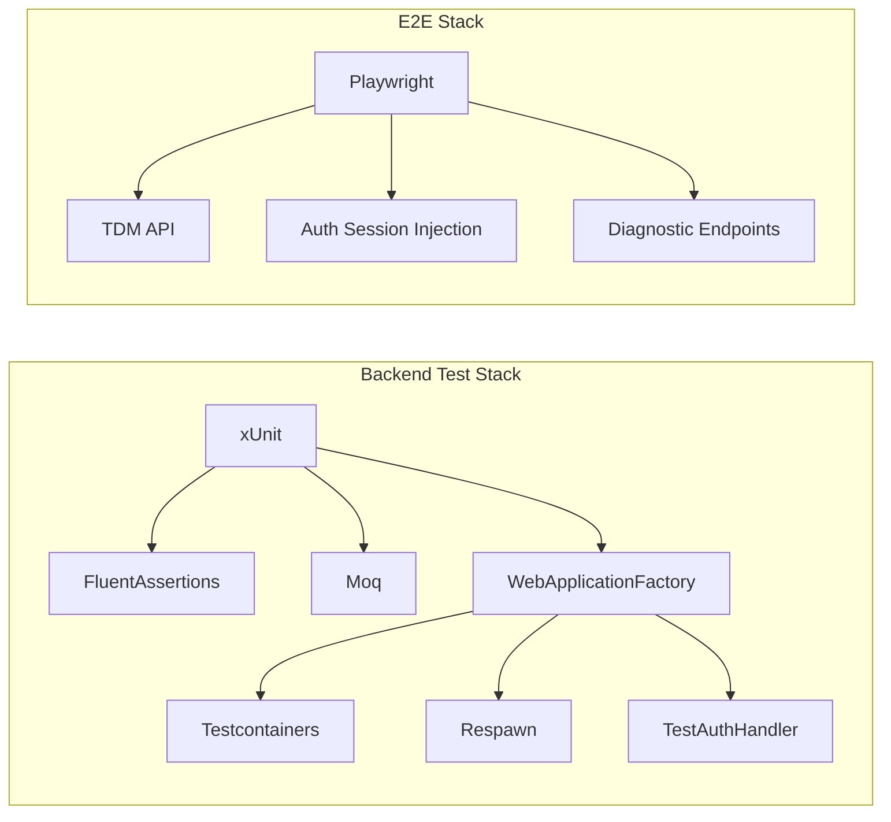

## Table of Contents

[🧠 **View Interactive Mindmap**](./testing-backend-mindmap.md)

1. [TL;DR](#tldr)
2. [Deep Dive](#deep-dive)
   2.1 [Testing Foundations](#concept-group-1-testing-foundations)
      2.1.1 [The Testing Pyramid & When Each Layer Matters](#1-the-testing-pyramid--when-each-layer-matters)
      2.1.2 [Arrange-Act-Assert (AAA) Pattern](#2-arrange-act-assert-aaa-pattern)
      2.1.3 [Test Doubles: Mocks, Stubs, Fakes & Spies](#3-test-doubles-mocks-stubs-fakes--spies)
   2.2 [Backend Testing (.NET)](#concept-group-2-backend-testing-net)
      2.2.1 [xUnit & FluentAssertions](#4-xunit--fluentassertions)
      2.2.2 [Mocking with Moq](#5-mocking-with-moq)
      2.2.3 [Integration Testing with WebApplicationFactory](#6-integration-testing-with-webapplicationfactory)
      2.2.4 [Database Testing: Testcontainers & Respawn](#7-database-testing-testcontainers--respawn)
   2.3 [End-to-End Testing](#concept-group-3-end-to-end-testing)
      2.3.1 [Playwright for E2E Flows](#8-playwright-for-e2e-flows)
      2.3.2 [Test Data Management (TDM)](#9-test-data-management-tdm)
3. [Architecture & Data Flow](#architecture--data-flow)
4. [Real-World Examples](#real-world-examples)
   4.1 [Domain Unit Test — Multi-Tenant Entity Validation](#1-domain-unit-test--multi-tenant-entity-validation)
   4.2 [Handler Unit Test — GetUsersQueryHandler with Moq](#2-handler-unit-test--getusersqueryhandler-with-moq)
   4.3 [Integration Test — Onboarding API with Auth Bypass](#3-integration-test--onboarding-api-with-auth-bypass)
   4.4 [Gateway Routing Test — YARP with Test Doubles](#4-gateway-routing-test--yarp-with-test-doubles)
5. [Comparison Tables](#comparison-tables)
6. [Interview Q&A](#interview-qa)
   6.1 [L1: Junior](#l1-junior-knowledge)
   6.2 [L2: Mid-Level](#l2-mid-level-knowledge)
   6.3 [L3: Senior](#l3-senior-knowledge)
   6.4 [Staff](#staff-system-architecture)
7. [Cross-References](#cross-references)
8. [Further Reading](#further-reading)

---

## TL;DR

Testing in a modern .NET backend spans four layers: <span style="color: #33b5e5; font-weight: bold;">domain unit tests</span> (pure logic, no dependencies), <span style="color: #33b5e5; font-weight: bold;">handler/service unit tests</span> (mocked dependencies via Moq), <span style="color: #33b5e5; font-weight: bold;">integration tests</span> (real HTTP pipeline via `WebApplicationFactory`, real PostgreSQL via Testcontainers, fast resets via Respawn), and <span style="color: #33b5e5; font-weight: bold;">E2E tests</span> (full browser flows via Playwright). The `tai-portal` uses <span style="color: #00C851; font-weight: bold;">xUnit + FluentAssertions + Moq</span> on the backend. <span style="color: #ffbb33; font-weight: bold;">The key trade-off</span>: unit tests are fast but miss integration bugs (wrong DI wiring, broken SQL, auth middleware issues); integration tests catch real bugs but are slower and require infrastructure. The 2026 best practice is <span style="color: #00C851; font-weight: bold;">Testcontainers over in-memory databases</span> — they catch real PostgreSQL behavior that SQLite can't replicate. See **[[Testing-Frontend]]** for Angular testing with Vitest, TestBed, and Storybook CSP compliance.

---

## Deep Dive

### Concept Group 1: Testing Foundations

#### 1. The Testing Pyramid & When Each Layer Matters

##### What
The <span style="color: #33b5e5; font-weight: bold;">testing pyramid</span> is a model that recommends many fast unit tests at the base, fewer integration tests in the middle, and a small number of slow E2E tests at the top. Each layer catches a different class of bugs at a different cost.

##### Why
Without a testing strategy, teams either write only unit tests (missing integration bugs like broken SQL, wrong DI wiring, auth middleware bypasses) or only E2E tests (slow, flaky, expensive to maintain). The pyramid optimizes for <span style="color: #00C851; font-weight: bold;">fast feedback on logic bugs</span> (unit) while catching <span style="color: #00C851; font-weight: bold;">wiring bugs</span> (integration) and <span style="color: #00C851; font-weight: bold;">user-visible regressions</span> (E2E).

##### How

| Layer | What It Tests | Speed | tai-portal Framework |
|-------|--------------|-------|---------------------|
| **Unit** | Pure logic, single class | ~1ms/test | xUnit, Vitest |
| **Integration** | HTTP pipeline, DB queries, middleware | ~100ms/test | WebApplicationFactory, Testcontainers |
| **E2E** | Full user flows across browser + API | ~5-30s/test | Playwright |

```
         /‾‾‾‾\
        / E2E  \         ← Few, expensive, catches user-visible bugs
       /--------\
      / Integration \     ← Medium, catches wiring + infra bugs
     /--------------\
    /     Unit       \    ← Many, fast, catches logic bugs
   /‾‾‾‾‾‾‾‾‾‾‾‾‾‾‾‾\
```

##### When
Write unit tests for all domain logic and handler/service business rules. Write integration tests for API endpoints, database queries, middleware chains, and authentication flows. Write E2E tests only for critical user journeys (onboarding, login, approval flows).

##### Trade-offs
<span style="color: #ff4444; font-weight: bold;">Unit tests with mocks can pass while the real system is broken</span> — if you mock `IIdentityService` but the real implementation has a bug, the unit test won't catch it. <span style="color: #ffbb33; font-weight: bold;">Integration tests require infrastructure</span> (Docker for Testcontainers, CI pipeline configuration) and are 100x slower than unit tests.

---

#### 2. Arrange-Act-Assert (AAA) Pattern

##### What
<span style="color: #33b5e5; font-weight: bold;">AAA</span> is the standard structure for every test: **Arrange** (set up preconditions and inputs), **Act** (execute the code under test), **Assert** (verify the expected outcome). Every test in tai-portal follows this pattern explicitly.

##### Why
Without a consistent structure, tests become unreadable — you can't tell where setup ends and verification begins. AAA makes tests scannable: skip to "Assert" to understand what the test proves, read "Arrange" to understand the scenario.

##### How

```csharp
[Fact]
public async Task Handle_ReturnsMappedUserDtos() {
    // Arrange
    var tenantId = Guid.NewGuid();
    var query = new GetUsersQuery(tenantId);
    _mockIdentityService
        .Setup(s => s.GetUsersByTenantAsync(...))
        .ReturnsAsync(users);

    // Act
    var result = await _handler.Handle(query, CancellationToken.None);

    // Assert
    result.Items.Should().HaveCount(2);
    result.Items[0].Status.Should().Be("Active");
}
```

##### When
Use AAA for every test — unit, integration, and E2E. In Playwright E2E tests, the Arrange may be seeding data via API, the Act is browser interactions, and the Assert is page state verification.

##### Trade-offs
<span style="color: #ffbb33; font-weight: bold;">Complex integration tests sometimes blur the boundary</span> between Act and Assert when verifying side effects across multiple systems (e.g., checking both the HTTP response and the database state after an API call). Keep the logical separation clear with comments.

---

#### 3. Test Doubles: Mocks, Stubs, Fakes & Spies

##### What
<span style="color: #33b5e5; font-weight: bold;">Test doubles</span> replace real dependencies in tests. **Stub** — returns canned data, no verification. **Mock** — returns canned data AND verifies interactions (was it called? with what arguments?). **Fake** — a working implementation with shortcuts (in-memory database, test auth handler). **Spy** — wraps a real object and records calls.

##### Why
Without test doubles, testing a `GetUsersQueryHandler` would require a real database, real identity service, and real HTTP server. Test doubles isolate the unit under test so you only verify its logic, not its dependencies.

##### How

| Double | tai-portal Usage | Framework |
|--------|-----------------|-----------|
| **Mock** | `Mock<IIdentityService>` in handler tests | Moq (C#) |
| **Spy** | `vi.fn()` / `vi.spyOn()` in Angular store tests | Vitest (TS) |
| **Fake** | `TestAuthHandler`, `TestMessageHandler` in integration tests | Custom classes |
| **Stub** | `mockService.register.mockReturnValue(of(...))` in store tests | Vitest (TS) |

```csharp
// Mock — verifies the method was called with specific arguments
_mockOtpService.Verify(
    x => x.GenerateAndStoreOtpAsync(userId, It.IsAny<CancellationToken>()),
    Times.Once);

// Fake — a real implementation with test-specific behavior
public class TestAuthHandler : AuthenticationHandler<AuthenticationSchemeOptions> {
    protected override Task<AuthenticateResult> HandleAuthenticateAsync() {
        var claims = new List<Claim> { new("sub", _userContext.UserId) };
        var ticket = new AuthenticationTicket(new ClaimsPrincipal(...), Scheme.Name);
        return Task.FromResult(AuthenticateResult.Success(ticket));
    }
}
```

##### When
Use **mocks** for interface dependencies in unit tests (services, repositories). Use **fakes** for infrastructure concerns in integration tests (auth handlers, message handlers). Use **spies** in frontend tests to verify that stores call services correctly.

##### Trade-offs
<span style="color: #ff4444; font-weight: bold;">Over-mocking makes tests brittle</span> — if you mock every method with exact argument matching, any refactoring breaks tests even when behavior is unchanged. <span style="color: #00C851; font-weight: bold;">Prefer verifying outcomes over interactions</span>: assert that the result is correct rather than asserting that method X was called with argument Y, unless the side effect IS the behavior (like verifying OTP was generated).

---

### Concept Group 2: Backend Testing (.NET)

#### 4. xUnit & FluentAssertions

##### What
<span style="color: #33b5e5; font-weight: bold;">xUnit</span> is the standard .NET test framework — `[Fact]` for parameterless tests, `[Theory]` for parameterized tests. <span style="color: #33b5e5; font-weight: bold;">FluentAssertions</span> provides readable assertion syntax: `result.Should().Be(expected)` instead of `Assert.Equal(expected, result)`.

##### Why
Without FluentAssertions, xUnit's `Assert.Equal(expected, actual)` reverses the natural reading order (you read `actual.Should().Be(expected)` left-to-right as "the actual value should be the expected value"). FluentAssertions also provides better failure messages — showing the full object diff instead of just "expected X but got Y."

##### How

```csharp
// xUnit [Fact] + FluentAssertions
[Fact]
public void ApplicationUser_ShouldNormalizeEmail() {
    var user = new ApplicationUser("testuser", (TenantId)Guid.NewGuid());
    user.Email = " TEST@Example.Com ";
    user.Email.Should().Be("test@example.com");
}

// xUnit [Fact] with exception assertion
[Fact]
public void ApplicationUser_ShouldThrow_WhenTenantIdIsEmpty() {
    Action act = () => new ApplicationUser("testuser", new TenantId(Guid.Empty));
    act.Should().Throw<ArgumentException>().WithMessage("*TenantId*");
}
```

##### When
Use xUnit for all .NET tests. Use FluentAssertions for all assertions — the readability improvement justifies the dependency.

##### Trade-offs
<span style="color: #ffbb33; font-weight: bold;">FluentAssertions is a third-party dependency</span> that must be kept in sync across test projects. In rare cases, its assertion messages can be misleading for complex object comparisons — use `.BeEquivalentTo()` with `.Excluding()` for selective object comparison.

---

#### 5. Mocking with Moq

##### What
<span style="color: #33b5e5; font-weight: bold;">Moq</span> is the standard .NET mocking library. It creates mock implementations of interfaces at runtime via `new Mock<IInterface>()`, configures return values with `.Setup().ReturnsAsync()`, and verifies interactions with `.Verify()`.

##### Why
Without Moq, testing a `GetUsersQueryHandler` would require a real `IIdentityService` — which needs a real database, real UserManager, and real HTTP context. Moq isolates the handler so you test only its mapping, pagination, and error handling logic.

##### How

```csharp
public class GetUsersQueryHandlerTests {
    private readonly Mock<IIdentityService> _mockIdentityService;
    private readonly GetUsersQueryHandler _handler;

    public GetUsersQueryHandlerTests() {
        _mockIdentityService = new Mock<IIdentityService>();
        _handler = new GetUsersQueryHandler(_mockIdentityService.Object);
    }

    [Fact]
    public async Task Handle_ReturnsMappedUserDtos() {
        // Arrange — configure mock to return test data
        _mockIdentityService
            .Setup(s => s.GetUsersByTenantAsync(
                It.IsAny<TenantId>(), It.IsAny<int>(), It.IsAny<int>(),
                It.IsAny<string?>(), It.IsAny<string?>(), It.IsAny<string?>(),
                It.IsAny<CancellationToken>()))
            .ReturnsAsync(users);

        // Act
        var result = await _handler.Handle(query, CancellationToken.None);

        // Assert — verify behavior via result, interactions via Verify
        result.Items.Should().HaveCount(2);
        _mockIdentityService.Verify(s => s.GetUsersByTenantAsync(
            It.Is<TenantId>(t => t.Value == tenantId),
            0, 10, null, null, null,
            It.IsAny<CancellationToken>()), Times.Once);
    }
}
```

##### When
Use Moq for handler/service unit tests where you need to isolate business logic from infrastructure. Don't use Moq in integration tests — the whole point of integration tests is to exercise real implementations.

##### Trade-offs
<span style="color: #ff4444; font-weight: bold;">Moq uses runtime reflection and dynamic proxy generation</span> — it's not NativeAOT compatible. For AOT-compatible test doubles, use hand-written fakes or NSubstitute's source-generator mode. <span style="color: #ffbb33; font-weight: bold;">Strict mocks (`MockBehavior.Strict`) cause tests to fail on any unexpected call</span>, making them brittle during refactoring. tai-portal uses the default `Loose` behavior.

---

#### 6. Integration Testing with WebApplicationFactory

##### What
<span style="color: #33b5e5; font-weight: bold;">`WebApplicationFactory<Program>`</span> boots the entire ASP.NET Core application in-memory, allowing you to send real HTTP requests through the full middleware pipeline (routing, authentication, authorization, model binding, filters) without a network.

##### Why
Without integration tests, you can't verify that: routes are mapped correctly, middleware processes headers, DI wiring is complete, authentication/authorization policies work, and EF Core queries generate correct SQL. Unit tests with mocks miss all of these.

##### How

```csharp
public class OnboardingApiTests : IClassFixture<WebApplicationFactory<Program>> {
    private readonly WebApplicationFactory<Program> _factory;

    private WebApplicationFactory<Program> CreateFactoryWithMockAuthAndOtp(
        Mock<IOtpService> mockOtpService) {
        return _factory.WithWebHostBuilder(builder => {
            builder.ConfigureTestServices(services => {
                // Replace OTP service with mock
                services.AddScoped<IOtpService>(_ => mockOtpService.Object);

                // Replace auth with test scheme
                services.AddAuthentication(options => {
                    options.DefaultAuthenticateScheme = "IntegrationTestAuth";
                    options.DefaultChallengeScheme = "IntegrationTestAuth";
                })
                .AddScheme<AuthenticationSchemeOptions, TestAuthHandler>(
                    "IntegrationTestAuth", options => { });

                // Bypass authorization for test scenarios
                services.AddSingleton<IAuthorizationHandler,
                    AllowAnonymousAuthorizationHandler>();
            });
        });
    }

    [Fact]
    public async Task RegisterCustomer_ValidCommand_ReturnsOkAndCallsOtp() {
        var mockOtpService = new Mock<IOtpService>();
        var factory = CreateFactoryWithMockAuthAndOtp(mockOtpService);
        var client = factory.CreateClient();

        var response = await client.PostAsJsonAsync("/api/onboarding/register", request);

        Assert.Equal(HttpStatusCode.OK, response.StatusCode);
        mockOtpService.Verify(
            x => x.GenerateAndStoreOtpAsync(userId, It.IsAny<CancellationToken>()),
            Times.Once);
    }
}
```

##### When
Use `WebApplicationFactory` for all API integration tests. Use `ConfigureTestServices` to replace only the services you need to mock (auth, external APIs, OTP) while keeping the rest of the real pipeline intact.

##### Trade-offs
<span style="color: #ffbb33; font-weight: bold;">`WebApplicationFactory` shares the app builder across tests</span> — calling `WithWebHostBuilder` creates a new factory. Use `IClassFixture` to share a single factory per test class, and `ICollectionFixture` to share across classes. <span style="color: #ff4444; font-weight: bold;">Tests must not run in parallel when they share database state</span> — tai-portal disables xUnit parallelization in integration test assemblies.

---

#### 7. Database Testing: Testcontainers & Respawn

##### What
<span style="color: #33b5e5; font-weight: bold;">Testcontainers</span> spins up a real PostgreSQL 17 instance in Docker for tests. <span style="color: #33b5e5; font-weight: bold;">Respawn</span> resets the database between tests by intelligently deleting data (respecting foreign keys) instead of dropping/recreating the schema.

##### Why
Without Testcontainers, integration tests use either: (a) <span style="color: #ff4444; font-weight: bold;">SQLite/InMemory provider — which lies</span> (different SQL dialect, no stored procedures, no jsonb, different NULL behavior), or (b) a shared development database — which causes flaky tests when two developers run tests simultaneously. Testcontainers gives each test run an isolated, real PostgreSQL instance.

##### How

```csharp
public class DatabaseFixture : IAsyncLifetime {
    private readonly PostgreSqlContainer _dbContainer = new PostgreSqlBuilder("postgres:17")
        .WithDatabase("portal_test")
        .WithUsername("postgres")
        .WithPassword("postgres")
        .Build();

    private Respawner _respawner = null!;

    public async Task InitializeAsync() {
        await _dbContainer.StartAsync();

        // Apply EF Core migrations to real PostgreSQL
        using var scope = Factory.Services.CreateScope();
        var context = scope.ServiceProvider.GetRequiredService<PortalDbContext>();
        await context.Database.MigrateAsync();

        // Initialize Respawn for fast resets
        _respawner = await Respawner.CreateAsync(_dbConnection, new RespawnerOptions {
            DbAdapter = DbAdapter.Postgres,
            SchemasToInclude = new[] { "public" },
            TablesToIgnore = new[] { new Table("__EFMigrationsHistory") }
        });
    }

    public async Task ResetDatabaseAsync() {
        await _respawner.ResetAsync(_dbConnection);  // ~5ms vs ~500ms for recreate
    }
}

// Share one container across all test classes in the assembly
[CollectionDefinition("Database collection")]
public class DatabaseCollection : ICollectionFixture<DatabaseFixture> { }
```

##### When
<span style="color: #00C851; font-weight: bold;">Always use Testcontainers for database integration tests in 2026.</span> Use `ICollectionFixture<DatabaseFixture>` to share a single container across all test classes. Call `ResetDatabaseAsync()` in each test's setup to ensure isolation.

##### Trade-offs
<span style="color: #ffbb33; font-weight: bold;">Testcontainers requires Docker</span> — CI runners must have Docker-in-Docker or privileged mode. Container startup adds ~2-5 seconds per test run (amortized across all tests). Respawn is fast (~5ms) but requires an open connection for the lifetime of the test collection.

---

### Concept Group 3: End-to-End Testing

#### 8. Playwright for E2E Flows

##### What
<span style="color: #33b5e5; font-weight: bold;">Playwright</span> drives real browser instances (Chromium, Firefox, WebKit) to test complete user flows. It supports auto-waiting, network interception, multi-tab/multi-browser scenarios, and visual testing.

##### Why
Without E2E tests, you can't verify that: the registration form submits correctly, OTP verification works end-to-end, admin approval flow transitions users through the correct states, and tenant isolation holds at the UI level. E2E tests are the final safety net before deployment.

##### How

```typescript
test('Customer Self-Service: Should register, verify OTP, and reach success',
    async ({ page, request }) => {
    const email = `customer_${Date.now()}@example.com`;

    // 1. Navigate and fill registration form
    await page.goto(TAI_URL);
    await page.getByRole('button', { name: /Create New Account/i }).click();
    await page.getByLabel(/Email Address/i).fill(email);
    await page.getByLabel(/Password/i).fill('Password123!');

    // 2. Intercept API response
    const responsePromise = page.waitForResponse(
        r => r.url().includes('/api/onboarding/register'));
    await page.getByRole('button', { name: /Register Account/i }).click();
    const response = await responsePromise;
    expect(response.ok()).toBeTruthy();

    // 3. Retrieve OTP via diagnostic endpoint (with retry)
    let code = '';
    await expect(async () => {
        const otpResponse = await request.get(
            `${API_URL}/identity/diag/otp-by-email?email=${email}`);
        code = (await otpResponse.json()).code;
    }).toPass({ intervals: [500, 1000], timeout: 10000 });

    // 4. Complete verification
    await page.getByLabel(/Verification Code/i).fill(code);
    await page.getByRole('button', { name: /Verify Code/i }).click();
    await expect(page).toHaveURL(/\/create-passkey/);
});
```

##### When
Write E2E tests for critical user journeys only — registration, login, approval, tenant isolation. Don't test UI details (button colors, layout) with Playwright — use component tests or visual regression tools instead.

##### Trade-offs
<span style="color: #ffbb33; font-weight: bold;">E2E tests are slow (5-30s each) and flaky</span> — network timing, animation delays, and async rendering cause intermittent failures. Mitigate with: Playwright's auto-waiting, `toPass()` for polling, explicit `waitForResponse()` for API calls. <span style="color: #ff4444; font-weight: bold;">Never use `page.waitForTimeout()`</span> — it's a code smell that hides race conditions.

---

#### 9. Test Data Management (TDM)

##### What
<span style="color: #33b5e5; font-weight: bold;">TDM</span> is the practice of creating, seeding, and cleaning up test data systematically. In tai-portal, E2E tests use a dedicated TDM API endpoint (`/api/tdm/seed-user`) and diagnostic endpoints (`/identity/diag/otp-by-email`) to arrange test state without going through the UI.

##### Why
Without TDM, every E2E test must go through the full UI to create test users — making tests slow, brittle, and interdependent. A TDM API lets tests seed data in the "Arrange" step via HTTP calls, bypassing the UI for setup while testing the real UI for the "Act" step.

##### How

```typescript
// E2E test utility — seed users via TDM API
export async function seedTestUser(request: APIRequestContext, user: SeedUserRequest) {
    const API_URL = process.env['CI'] ? 'http://127.0.0.1:5031' : 'http://localhost:5031';

    const response = await request.post(`${API_URL}/api/tdm/seed-user`, {
        data: user,
        headers: {
            'X-Gateway-Secret': GATEWAY_SECRET,
            'Content-Type': 'application/json'
        }
    });
    return await response.json();
}

// Auth session injection — bypass login flow for "authenticated" tests
export async function injectAuthSession(page: Page, fileName = 'session.json') {
    const sessionData = fs.readFileSync(
        path.join(__dirname, '../.auth/', fileName), 'utf-8');
    await page.addInitScript((data) => {
        const parsed = JSON.parse(data);
        for (const key of Object.keys(parsed)) {
            window.sessionStorage.setItem(key, parsed[key]);
        }
    }, sessionData);
}
```

##### When
Use TDM for all E2E test setup that doesn't directly test UI flows. Use auth session injection for tests that need an authenticated user but aren't testing the login flow itself.

##### Trade-offs
<span style="color: #ffbb33; font-weight: bold;">TDM endpoints must be disabled in production</span> — they bypass authentication and business rules. Gate them behind an environment variable or a feature flag. <span style="color: #ff4444; font-weight: bold;">Diagnostic endpoints that expose OTP codes are a security risk</span> — only enable them in development/test environments.

---

### Architecture & Data Flow

This diagram shows how tai-portal's test layers map to the application architecture:

```mermaid
flowchart TB
    subgraph E2E["E2E Tests (Playwright)"]
        E1[Browser] -->|HTTP| E2[Gateway :5217]
        E2 -->|YARP forward| E3[API :5031]
        E3 -->|EF Core| E4[PostgreSQL]
    end
    subgraph Integration["Integration Tests (WebApplicationFactory)"]
        I1[HttpClient] -->|in-memory| I2[Full ASP.NET Pipeline]
        I2 -->|middleware + routing| I3[Controllers / Endpoints]
        I3 -->|real EF Core| I4[Testcontainers PostgreSQL]
    end
    subgraph Unit["Unit Tests (xUnit / Vitest)"]
        U1[Test Class] -->|direct call| U2[Handler / Store / Service]
        U2 -->|"Moq / vi.fn()"| U3[Mocked Dependencies]
    end
    style E2E fill:#ff4444,color:#fff
    style Integration fill:#ffbb33,color:#000
    style Unit fill:#00C851,color:#fff
```





---

## Real-World Examples

### 1. Domain Unit Test — Multi-Tenant Entity Validation

📍 From tai-portal: `libs/core/domain.tests/MultiTenantEntityTests.cs`

Tests domain invariants — TenantId validation, email normalization, and interface implementation. Pure unit tests with no mocks or infrastructure.

```csharp
[Fact]
public void ApplicationUser_ShouldThrow_WhenTenantIdIsEmpty() {
    Action act = () => new ApplicationUser("testuser", new TenantId(Guid.Empty));
    act.Should().Throw<ArgumentException>().WithMessage("*TenantId*");
}

[Fact]
public void ApplicationUser_ShouldNormalizeEmail() {
    var user = new ApplicationUser("testuser", (TenantId)Guid.NewGuid());
    user.Email = " TEST@Example.Com ";
    user.Email.Should().Be("test@example.com");
}

[Fact]
public void ApplicationUser_ShouldImplement_IMultiTenantEntity() {
    var tenantId = (TenantId)Guid.NewGuid();
    var user = new ApplicationUser("testuser", tenantId);
    (user is IMultiTenantEntity).Should().BeTrue(
        "ApplicationUser must implement IMultiTenantEntity for data isolation.");
}
```

---

### 2. Handler Unit Test — GetUsersQueryHandler with Moq

📍 From tai-portal: `libs/core/application.tests/UseCases/Users/GetUsersQueryHandlerTests.cs`

Tests handler logic in isolation — verifies pagination calculation, DTO mapping, and service interactions.

```csharp
[Fact]
public async Task Handle_CalculatesSkipCorrectlyForPagination() {
    var query = new GetUsersQuery(tenantId, PageNumber: 3, PageSize: 5);
    _mockIdentityService
        .Setup(s => s.GetUsersByTenantAsync(...))
        .ReturnsAsync(new List<ApplicationUser>());
    _mockIdentityService
        .Setup(s => s.CountUsersByTenantAsync(...))
        .ReturnsAsync(0);

    await _handler.Handle(query, CancellationToken.None);

    // Assert: (3-1) * 5 = 10 skip
    _mockIdentityService.Verify(s => s.GetUsersByTenantAsync(
        It.IsAny<TenantId>(), 10, 5, null, null, null,
        It.IsAny<CancellationToken>()), Times.Once);
}
```

---

### 3. Integration Test — Onboarding API with Auth Bypass

📍 From tai-portal: `apps/portal-api.integration-tests/OnboardingApiTests.cs`

Tests the full HTTP pipeline — routing, authentication, validation, database state changes, and side effects (OTP generation).

```csharp
[Fact]
public async Task RegisterCustomer_ValidCommand_ReturnsOkAndCallsOtp() {
    var mockOtpService = new Mock<IOtpService>();
    var factory = CreateFactoryWithMockAuthAndOtp(mockOtpService);
    var client = factory.CreateClient();
    client.DefaultRequestHeaders.Add("X-Gateway-Secret", "portal-poc-secret-2026");

    var response = await client.PostAsJsonAsync("/api/onboarding/register", request);

    Assert.Equal(HttpStatusCode.OK, response.StatusCode);

    // Verify state change in database
    using var scope = factory.Services.CreateScope();
    var user = await userManager.Users.IgnoreQueryFilters()
        .FirstOrDefaultAsync(u => u.Id == userId);
    Assert.Equal(UserStatus.PendingVerification, user.Status);

    // Verify side-effect
    mockOtpService.Verify(
        x => x.GenerateAndStoreOtpAsync(userId, It.IsAny<CancellationToken>()),
        Times.Once);
}
```

---

### 4. Gateway Routing Test — YARP with Test Doubles

📍 From tai-portal: `apps/portal-gateway.integration-tests/GatewayRoutingTests.cs`

Tests YARP reverse proxy routing using a custom `TestMessageHandler` fake that captures outgoing requests without making real network calls.

```csharp
[Fact]
public async Task RequestToIdentityPath_ShouldBeRoutedToIdentityService() {
    var client = _factory.CreateClient();
    var request = new HttpRequestMessage(HttpMethod.Get, "/identity/test");
    request.Headers.Add("X-Forwarded-For", "127.0.0.1");

    var response = await client.SendAsync(request);

    response.StatusCode.Should().Be(HttpStatusCode.OK);
    _testHandler.LastRequest!.RequestUri!.ToString()
        .Should().StartWith("http://backend-identity");
    _testHandler.LastRequest.Headers.Contains("X-Forwarded-For")
        .Should().BeTrue();
}

// Custom fake that intercepts YARP's outgoing requests
private class TestMessageHandler : HttpMessageHandler {
    public HttpRequestMessage? LastRequest { get; private set; }
    protected override Task<HttpResponseMessage> SendAsync(
        HttpRequestMessage request, CancellationToken ct) {
        LastRequest = request;
        return Task.FromResult(new HttpResponseMessage(HttpStatusCode.OK));
    }
}
```

---

## Comparison Tables

### Test Layer Trade-offs

| Dimension | **Unit Tests** | **Integration Tests** | **E2E Tests** |
|-----------|---------------|----------------------|---------------|
| **Speed** | <span style="color: #00C851; font-weight: bold;">~1ms/test</span> | ~100ms/test | <span style="color: #ff4444; font-weight: bold;">~5-30s/test</span> |
| **Infrastructure** | None | Docker (Testcontainers) | Full running system |
| **Bugs caught** | Logic errors, mapping bugs | DI wiring, SQL, middleware, auth | Full user flow regressions |
| **Flakiness** | <span style="color: #00C851; font-weight: bold;">Near zero</span> | Low (deterministic DB) | <span style="color: #ff4444; font-weight: bold;">Medium (timing, rendering)</span> |
| **Maintenance** | Low | Medium | High |
| **tai-portal count** | Majority of tests | Per-endpoint coverage | Critical paths only |

### Mocking Libraries: .NET vs Angular

| Dimension | **Moq (C#)** | **Vitest vi.fn() (TS)** |
|-----------|-------------|----------------------|
| **Mock creation** | `new Mock<IService>()` | `vi.fn()` or `vi.spyOn()` |
| **Setup** | `.Setup(x => x.Method()).ReturnsAsync(val)` | `.mockReturnValue(of(val))` |
| **Verification** | `.Verify(x => x.Method(), Times.Once)` | `expect(fn).toHaveBeenCalledWith(...)` |
| **Type safety** | <span style="color: #00C851; font-weight: bold;">Full — generic interface matching</span> | Manual — `{ method: Mock }` objects |
| **Injection** | Constructor or field injection | TestBed `{ provide: X, useValue: mock }` |
| **AOT compatible** | <span style="color: #ff4444; font-weight: bold;">No (runtime reflection)</span> | Yes (no reflection) |

### Database Testing Approaches

| Dimension | **In-Memory / SQLite** | **Testcontainers (PostgreSQL)** | **Shared Dev Database** |
|-----------|----------------------|-------------------------------|----------------------|
| **Fidelity** | <span style="color: #ff4444; font-weight: bold;">Low — different SQL dialect</span> | <span style="color: #00C851; font-weight: bold;">Exact production match</span> | High |
| **Isolation** | Per-test (in-memory) | Per-test-run (container) | <span style="color: #ff4444; font-weight: bold;">None — shared state</span> |
| **Speed** | Fast (no I/O) | ~2-5s startup, ~5ms reset | Fast (no startup) |
| **Setup** | Zero | Docker required | DBA-maintained |
| **Catches** | Basic CRUD bugs | Real SQL, jsonb, migrations | Real SQL |
| **tai-portal choice** | Not used | <span style="color: #00C851; font-weight: bold;">All integration tests</span> | Not used |

---

## Interview Q&A

### L1: Junior Knowledge

#### L1: What is the Testing Pyramid?
**Difficulty:** L1 (Junior)

**Question:** Describe the testing pyramid and explain why we need different layers of tests.

**Answer:** The testing pyramid recommends <span style="color: #00C851; font-weight: bold;">many fast unit tests</span> at the base, fewer integration tests in the middle, and a small number of E2E tests at the top. Each layer catches different bugs: unit tests catch logic errors (wrong calculation, missing null check), integration tests catch wiring errors (broken SQL, wrong DI registration, auth middleware bypass), and E2E tests catch user-visible regressions (form doesn't submit, page doesn't load). You need all three because mocking hides integration bugs, and E2E tests are too slow to cover every edge case.

---

#### L1: What is the difference between a Mock and a Stub?
**Difficulty:** L1 (Junior)

**Question:** What is the difference between a mock, a stub, a fake, and a spy?

**Answer:** A <span style="color: #33b5e5; font-weight: bold;">stub</span> returns canned data with no verification — it's there to make the test compile and run. A <span style="color: #33b5e5; font-weight: bold;">mock</span> returns canned data AND verifies interactions — "was this method called once with these arguments?" A <span style="color: #33b5e5; font-weight: bold;">fake</span> is a working alternative implementation (like an in-memory repository or a test auth handler). A <span style="color: #33b5e5; font-weight: bold;">spy</span> wraps a real object, lets it execute normally, and records what happened. In tai-portal, we use Moq mocks for handler tests, `vi.fn()` spies for Angular store tests, and custom fakes like `TestAuthHandler` for integration tests.

---

### L2: Mid-Level Knowledge

#### L2: How do you test code that depends on a database?
**Difficulty:** L2 (Mid-Level)

**Question:** You need to test an EF Core query that uses PostgreSQL-specific features (jsonb, window functions). How do you set up the test infrastructure?

**Answer:** <span style="color: #00C851; font-weight: bold;">Use Testcontainers to spin up a real PostgreSQL instance in Docker</span>, then use Respawn to reset data between tests. The setup: (1) `PostgreSqlContainer` starts a real postgres:17 container, (2) `WebApplicationFactory` overrides the connection string to point to the container, (3) EF Core migrations run against it to create the schema, (4) Respawn creates a `Respawner` that intelligently deletes data respecting foreign keys. <span style="color: #ff4444; font-weight: bold;">Never use SQLite or InMemory provider for PostgreSQL-specific features</span> — they have different NULL handling, no jsonb support, and different transaction isolation. The container adds ~2-5s startup but Respawn resets in ~5ms, so subsequent tests are fast.

---

### L3: Senior Knowledge

#### L3: Integration Testing with WebApplicationFactory
**Difficulty:** L3 (Senior)

**Question:** Explain how `WebApplicationFactory<Program>` works and how you handle authentication in integration tests without a real OIDC provider.

**Answer:** `WebApplicationFactory<Program>` uses the `Program` class (your real app's entry point) to boot the entire ASP.NET Core application in-memory — including all middleware, routing, DI, and filters. You get an `HttpClient` that sends requests through the full pipeline without a network.

For authentication, you <span style="color: #00C851; font-weight: bold;">replace the real auth scheme with a `TestAuthHandler`</span> that creates a `ClaimsPrincipal` from a `TestUserContext` — no OIDC token exchange needed. In tai-portal, this looks like: `services.AddAuthentication().AddScheme<TestAuthHandler>("TestAuth")` with a `TestUserContext { UserId = "admin-id" }` injected as a singleton. For authorization, an `AllowAnonymousAuthorizationHandler` succeeds all requirements, or a `BypassAuthorizationService` returns `AuthorizationResult.Success()` for all policies.

<span style="color: #ff4444; font-weight: bold;">Key gotcha:</span> `WithWebHostBuilder` creates a new factory each time. Use `IClassFixture` to share a factory per test class. Don't run integration tests in parallel if they share database state — tai-portal disables parallelization via `[assembly: CollectionBehavior(DisableTestParallelization = true)]`.

---

#### L3: Testing Multi-Tenant Data Isolation
**Difficulty:** L3 (Senior)

**Question:** How do you test that a multi-tenant application correctly isolates data between tenants?

**Answer:** <span style="color: #00C851; font-weight: bold;">Write a cross-tenant isolation test</span> that seeds data in Tenant A and verifies Tenant B cannot see it. In tai-portal's `GetPendingApprovals_CrossTenantIsolation_ReturnsEmptyList` test: (1) Bypass the global query filter to seed a `PendingApproval` user in the TAI tenant, (2) Make an HTTP request authenticated as ACME's host (`BaseAddress = new Uri("http://acme.localhost/")`), (3) Assert the response contains zero TAI users: `Assert.All(approvals, u => Assert.DoesNotContain("@tai.com", u.Email))`.

This tests the entire isolation chain: <span style="color: #33b5e5; font-weight: bold;">TenantResolutionMiddleware</span> (resolves tenant from hostname) → <span style="color: #33b5e5; font-weight: bold;">ITenantService</span> (sets current tenant for the request) → <span style="color: #33b5e5; font-weight: bold;">EF Core global query filter</span> (WHERE TenantId = @currentTenant). <span style="color: #ff4444; font-weight: bold;">If any link in this chain is misconfigured, the test fails</span> — this is why integration tests are critical for security properties.

---

### Staff: System Architecture

#### Staff: Designing a Test Strategy for a Multi-Service System
**Difficulty:** Staff

**Question:** You're architecting the test strategy for a system with an Angular frontend, an API gateway (YARP), a business API, and an identity server — all behind OIDC authentication. How do you structure your tests across these services?

**Answer:** Structure tests in four layers, each targeting a specific risk:

1. <span style="color: #00C851; font-weight: bold;">**Domain unit tests**</span> — Pure logic in the domain layer. Test entity invariants, value objects, state machines (`ApplicationUser` status transitions). Zero dependencies, run in milliseconds. These are the foundation.

2. <span style="color: #00C851; font-weight: bold;">**Handler/service unit tests**</span> — Business logic in the application layer. Mock `IIdentityService`, `IOtpService`, etc. with Moq. Verify DTO mapping, pagination calculations, error handling. For Angular: mock services in stores via `vi.fn()`, verify Signal state transitions.

3. <span style="color: #00C851; font-weight: bold;">**Per-service integration tests**</span> — Each service gets its own `WebApplicationFactory` with a Testcontainers PostgreSQL. The API tests replace auth with `TestAuthHandler` and OTP with Moq. The Gateway tests replace `IForwarderHttpClientFactory` with a `TestForwarderHttpClientFactory` that captures outgoing requests. This catches: broken routes, missing middleware, wrong DI wiring, incorrect SQL, and auth policy misconfigurations.

4. <span style="color: #00C851; font-weight: bold;">**E2E steel thread tests**</span> — Playwright drives the full system (frontend → gateway → API → DB). Test only critical user journeys: registration, OTP verification, admin approval, tenant isolation. Use TDM API endpoints for test data setup and auth session injection to skip login for non-auth tests.

**Key architectural decisions:**
- <span style="color: #ff4444; font-weight: bold;">Don't test the gateway by calling the API directly</span> — the gateway adds headers, rewrites paths, and enforces trust boundaries. It needs its own integration tests.
- **Shared fixtures** via `ICollectionFixture<DatabaseFixture>` — one Testcontainers container per test assembly, Respawn for fast resets.
- **Parallelization** — unit tests run in parallel; integration tests run sequentially (shared database state). E2E tests run with limited workers (Playwright config).

---

#### Staff: Test Data Management at Scale
**Difficulty:** Staff

**Question:** Your E2E tests are slow and flaky because they all go through the UI to create test data. How do you redesign test data management?

**Answer:** Separate <span style="color: #00C851; font-weight: bold;">data setup (Arrange) from behavior verification (Act/Assert)</span> using a layered TDM strategy:

1. **TDM API endpoints** — Expose `/api/tdm/seed-user` on the backend, gated by environment (`ASPNETCORE_ENVIRONMENT != Production`). These endpoints bypass business rules (no OTP, no approval) to create users in any state. E2E tests call them in the Arrange step via Playwright's `request` context: `await request.post('/api/tdm/seed-user', { data: { email, status: 'Active' } })`.

2. **Auth session injection** — Save authenticated session state (cookies, sessionStorage) during a one-time setup phase (`auth.setup.ts`). Inject it into subsequent tests via `page.addInitScript()`. This eliminates login flow overhead for every test.

3. **Diagnostic endpoints** — For testing async workflows (OTP generation), expose `/identity/diag/otp-by-email` that returns the generated code. <span style="color: #ff4444; font-weight: bold;">Gate these behind `#if DEBUG` or environment checks.</span>

4. **Respawn for isolation** — Each integration test class calls `await fixture.ResetDatabaseAsync()` before running, ensuring no test depends on another's data.

<span style="color: #ffbb33; font-weight: bold;">The trade-off:</span> TDM endpoints are a test-only attack surface. In tai-portal, they're gated by the `X-Gateway-Secret` header and disabled when `ASPNETCORE_ENVIRONMENT` is `Production`. The CI pipeline verifies these endpoints return 404 in the production build.

---

## Cross-References

- [[CSharp-Fundamentals]] — Records simplify test assertions (value equality), DI lifetimes affect test fixture scoping, async patterns require `async Task` test methods.
- [[EFCore-SQL]] — `IQueryable` queries can only be verified with real database integration tests (not mocks). Global query filters for multi-tenancy need cross-tenant isolation tests.
- [[Design-Patterns]] — CQRS separates command/query handlers for independent unit testing. MediatR pipeline behaviors need generic mock setup.
- [[Testing-Frontend]] — Angular testing with Vitest, TestBed, HttpTestingController, Signal stores, and Storybook CSP compliance.
- [[Security-CSP-DPoP]] — DPoP proof generation tests verify JWT structure and key reuse. Auth bypass patterns (`TestAuthHandler`) enable testing without OIDC.

---

## Further Reading

- [xUnit Documentation](https://xunit.net/docs/getting-started/netcore/cmdline)
- [FluentAssertions Documentation](https://fluentassertions.com/introduction)
- [ASP.NET Core Integration Testing](https://learn.microsoft.com/en-us/aspnet/core/test/integration-tests)
- [Testcontainers for .NET](https://dotnet.testcontainers.org/)
- [Respawn — Intelligent Database Cleaning](https://github.com/jbogard/Respawn)
- [Playwright for .NET / TypeScript](https://playwright.dev/docs/intro)
- Source: `libs/core/domain.tests/` — Domain unit tests
- Source: `libs/core/application.tests/` — Handler unit tests with Moq
- Source: `libs/core/infrastructure.tests/Fixtures/DatabaseFixture.cs` — Testcontainers + Respawn setup
- Source: `apps/portal-api.integration-tests/` — WebApplicationFactory integration tests
- Source: `apps/portal-gateway.integration-tests/` — YARP routing tests with test doubles
- Source: `apps/portal-web-e2e/src/` — Playwright E2E tests

---

*Last updated: 2026-04-10*
