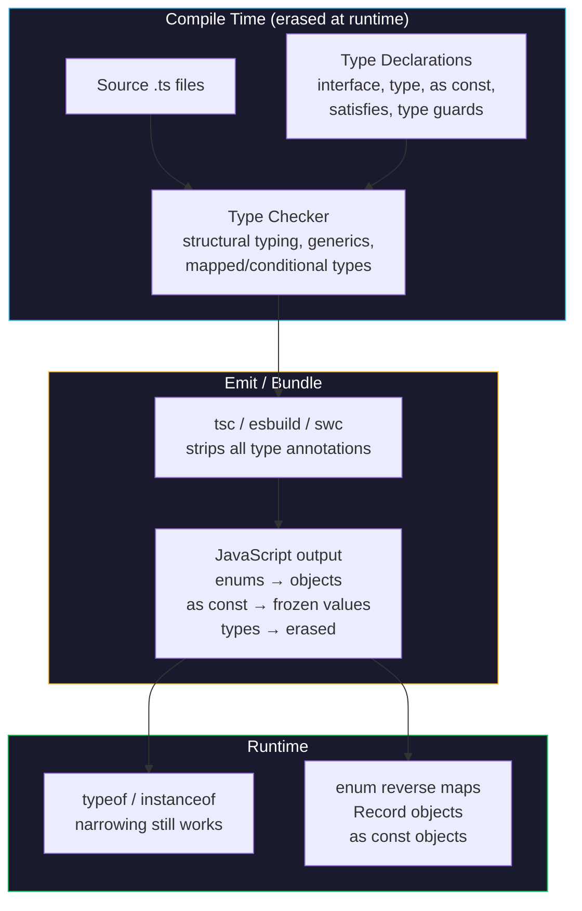

## Table of Contents

[🧠 **View Interactive Mindmap**](./typescript-mindmap.md)

1. [TL;DR](#tldr)
2. [Deep Dive](#deep-dive)
   2.1 [Type System Foundations](#concept-group-1-type-system-foundations)
      2.1.1 [Structural Typing vs Nominal Typing](#1-structural-typing-vs-nominal-typing)
      2.1.2 [Union Types & Discriminated Unions](#2-union-types--discriminated-unions)
      2.1.3 [Type Narrowing & Type Guards](#3-type-narrowing--type-guards)
      2.1.4 [`interface` vs `type` — When to Use Each](#4-interface-vs-type--when-to-use-each)
   2.2 [Generics & Type-Level Programming](#concept-group-2-generics--type-level-programming)
      2.2.1 [Generics — Parameterized Types](#5-generics--parameterized-types)
      2.2.2 [Generic Constraints with `extends`](#6-generic-constraints-with-extends)
      2.2.3 [Utility Types — The Standard Toolkit](#7-utility-types--the-standard-toolkit)
      2.2.4 [Mapped Types & Conditional Types](#8-mapped-types--conditional-types)
   2.3 [Modern TypeScript (5.x – 5.8)](#concept-group-3-modern-typescript-5x--58)
      2.3.1 [`satisfies` Operator](#9-satisfies-operator)
      2.3.2 [`const` Type Parameters & `as const`](#10-const-type-parameters--as-const)
      2.3.3 [Template Literal Types](#11-template-literal-types)
      2.3.4 [Enums vs Union Types vs `as const` Objects](#12-enums-vs-union-types-vs-as-const-objects)
   2.4 [Senior TypeScript Patterns](#concept-group-4-senior-typescript-patterns)
      2.4.1 [Keyof-Driven Component APIs](#13-keyof-driven-component-apis)
      2.4.2 [Exhaustive Records and Configuration Maps](#14-exhaustive-records-and-configuration-maps)
      2.4.3 [Typed Dependency Injection Tokens](#15-typed-dependency-injection-tokens)
      2.4.4 [Declaration Merging and Module Augmentation](#16-declaration-merging-and-module-augmentation)
      2.4.5 [Type-Level API Boundaries](#17-type-level-api-boundaries)
3. [Architecture & Data Flow](#architecture--data-flow)
4. [Real-World Examples](#real-world-examples)
   4.1 [Generic DataTable Interfaces](#1-generic-datatable-interfaces)
   4.2 [Union Type for Store Status](#2-union-type-for-store-status)
   4.3 [Record & Partial in DPoP Service](#3-record--partial-in-dpop-service)
   4.4 [Generic PaginatedList](#4-generic-paginatedlist)
   4.5 [Signal-Based Store with Type-Safe State](#5-signal-based-store-with-type-safe-state)
   4.6 [Keyof Generic TransferList](#6-keyof-generic-transferlist)
   4.7 [Exhaustive Dropdown Placement Map](#7-exhaustive-dropdown-placement-map)
   4.8 [Typed Replay Mode InjectionToken](#8-typed-replay-mode-injectiontoken)
   4.9 [Planned Declaration Merging for Runtime Config](#9-planned-declaration-merging-for-runtime-config)
5. [Comparison Tables](#comparison-tables)
6. [Interview Q&A](#interview-qa)
   6.1 [L1: Junior](#l1-junior-knowledge)
      6.1.1 [What is the difference between `any`, `unknown`, and `never`?](#l1-any-vs-unknown-vs-never)
      6.1.2 [`interface` vs `type` alias](#l1-interface-vs-type-alias)
   6.2 [L2: Mid-Level](#l2-mid-level-knowledge)
      6.2.1 [Discriminated Unions for State Machines](#l2-discriminated-unions-for-state-machines)
      6.2.2 [When to Use Generics vs Overloads](#l2-when-to-use-generics-vs-overloads)
      6.2.3 [Type Narrowing Techniques](#l2-type-narrowing-techniques)
   6.3 [L3: Senior](#l3-senior-knowledge)
      6.3.1 [Structural Typing Pitfalls in Enterprise Apps](#l3-structural-typing-pitfalls-in-enterprise-apps)
      6.3.2 [Mapped Types for API Contract Safety](#l3-mapped-types-for-api-contract-safety)
      6.3.3 [Designing Keyof-Based Component APIs](#l3-designing-keyof-based-component-apis)
   6.4 [Staff](#staff-system-architecture)
      6.4.1 [Designing a Type-Safe Event System](#staff-designing-a-type-safe-event-system)
      6.4.2 [TypeScript Compiler Configuration for Monorepos](#staff-typescript-compiler-configuration-for-monorepos)
      6.4.3 [Where Declaration Merging Belongs](#staff-where-declaration-merging-belongs)
7. [Cross-References](#cross-references)
8. [Further Reading](#further-reading)

---

## TL;DR

TypeScript 5.8 (2026) is no longer "JavaScript with types" — it is a <span style="color: #33b5e5; font-weight: bold;">full type-level programming language</span> with mapped types, conditional types, template literal types, and `satisfies` for compile-time safety without runtime cost. The tai-portal frontend is written entirely in TypeScript with Angular 21, using <span style="color: #00C851; font-weight: bold;">union types for state machines</span> (`'Idle' | 'Loading' | 'Success' | 'Error'`), <span style="color: #33b5e5; font-weight: bold;">generics for reusable components</span> (`TableColumnDef<T>`, `PaginatedList<T>`), and <span style="color: #00C851; font-weight: bold;">utility types</span> (`Partial<Privilege>`, `Record<string, unknown>`, `Required<T>`) for safe API contracts. The key trade-off for 2026 interviews: TypeScript uses <span style="color: #ffbb33; font-weight: bold;">structural typing</span> (shape-based), not nominal typing (name-based) — two types with the same shape are interchangeable, which is powerful for composition but dangerous when you need to distinguish between semantically different types (e.g., `UserId` vs `TenantId`). Mastering generics, discriminated unions, and `satisfies` is now table stakes for senior roles.

2026 tai-portal update: the workspace currently uses TypeScript `~5.9.2`, so senior TypeScript depth here means going beyond "I know generics" into <span style="color: #00C851; font-weight: bold;">type-level API design</span>: `keyof`-driven component APIs, exhaustive `Record` maps, typed DI tokens, safe declaration merging, conditional return types, and clear boundaries between compile-time guarantees and runtime validation.

---

## Deep Dive

### Concept Group 1: Type System Foundations

#### 1. Structural Typing vs Nominal Typing

##### What
TypeScript uses <span style="color: #33b5e5; font-weight: bold;">structural typing</span> (also called "duck typing"): two types are compatible if their shapes match, regardless of their declared name. This is the opposite of C# / Java which use nominal typing where a type's identity is its name.

##### Why
Without understanding structural typing, you cannot reason about TypeScript's type compatibility rules. A function accepting `{ name: string }` will happily accept a `User` object, a `Privilege` object, or a raw object literal — as long as it has a `name` property. This is intentional: JavaScript is inherently structural, and TypeScript models that reality.

##### How
```typescript
interface User { name: string; email: string; }
interface Privilege { name: string; description: string; }

function logName(thing: { name: string }) {
  console.log(thing.name);
}

const user: User = { name: 'Alice', email: 'a@b.com' };
const priv: Privilege = { name: 'Admin', description: 'Full access' };

logName(user);  // ✅ — User has `name: string`
logName(priv);  // ✅ — Privilege has `name: string`
```

##### When
Structural typing is always active in TypeScript — you don't opt in or out. Leverage it when building generic utility functions that operate on shapes. Fight it when you need semantic type safety (e.g., `UserId` should not be assignable to `TenantId` even though both are strings). Use **branded types** (see Staff Q&A) to simulate nominal typing.

##### Trade-offs
<span style="color: #ff4444; font-weight: bold;">Structural typing allows accidental type compatibility</span> — a function expecting a `UserId` string will accept any string. This is the single most misunderstood aspect of TypeScript for developers coming from C# or Java. <span style="color: #ffbb33; font-weight: bold;">Excess property checks</span> only trigger on object literals passed directly to a typed context; assigning through a variable bypasses them.

---

#### 2. Union Types & Discriminated Unions

##### What
A <span style="color: #33b5e5; font-weight: bold;">union type</span> (`A | B`) represents a value that can be one of several types. A <span style="color: #00C851; font-weight: bold;">discriminated union</span> adds a common literal property (the "discriminant") so TypeScript can narrow the type in each branch.

##### Why
Without discriminated unions, representing state machines requires boolean flags (`isLoading`, `isError`, `hasData`) that can enter impossible states (e.g., `isLoading: true` AND `isError: true` simultaneously). Discriminated unions make <span style="color: #00C851; font-weight: bold;">impossible states unrepresentable</span>.

##### How
```typescript
// tai-portal uses string literal unions for store status
type PrivilegesStatus = 'Idle' | 'Loading' | 'Success' | 'Error' | 'StepUpRequired';

// Full discriminated union pattern for richer state
type AsyncState<T> =
  | { status: 'idle' }
  | { status: 'loading' }
  | { status: 'success'; data: T }
  | { status: 'error'; error: string };

function render<T>(state: AsyncState<T>) {
  switch (state.status) {
    case 'idle':    return 'Waiting...';
    case 'loading': return 'Loading...';
    case 'success': return `Got ${state.data}`;  // ✅ TS knows `data` exists
    case 'error':   return `Error: ${state.error}`; // ✅ TS knows `error` exists
  }
}
```

##### When
Use string literal unions (like `PrivilegesStatus`) when the status itself is the only varying thing. Use full discriminated unions when each state carries different payload data. In Angular stores, string literal unions paired with separate signals are simpler and work naturally with `computed()`.

##### Trade-offs
<span style="color: #ffbb33; font-weight: bold;">String literal unions don't carry associated data</span> — you need separate signals/fields for `errorMessage`, `data`, etc. Full discriminated unions are more type-safe but harder to use with Angular Signals because you can't destructure them reactively. The tai-portal codebase chose the pragmatic approach: simple string unions + separate signals.

---

#### 3. Type Narrowing & Type Guards

##### What
<span style="color: #33b5e5; font-weight: bold;">Type narrowing</span> is how TypeScript reduces a broad type to a more specific type within a control flow block. Built-in narrowing uses `typeof`, `instanceof`, `in`, and equality checks. Custom <span style="color: #00C851; font-weight: bold;">type guard functions</span> return `x is SomeType` to teach TypeScript custom narrowing logic.

##### Why
Without narrowing, you'd have to cast everywhere with `as` — which is unsafe and silences the compiler. Narrowing lets TypeScript verify your logic at compile time: if you check `typeof x === 'string'`, TypeScript *knows* `x` is a `string` inside that block.

##### How
```typescript
// Built-in narrowing
function process(value: string | number) {
  if (typeof value === 'string') {
    return value.toUpperCase();  // ✅ TS knows it's string
  }
  return value.toFixed(2);       // ✅ TS knows it's number
}

// Custom type guard
interface ApiError { status: number; message: string; }
interface ApiSuccess<T> { data: T; }

function isApiError(response: unknown): response is ApiError {
  return (
    typeof response === 'object' &&
    response !== null &&
    'status' in response &&
    'message' in response
  );
}

// Usage
function handleResponse(res: ApiError | ApiSuccess<User>) {
  if (isApiError(res)) {
    console.error(res.message);  // ✅ narrowed to ApiError
  } else {
    console.log(res.data);       // ✅ narrowed to ApiSuccess<User>
  }
}
```

##### When
Use built-in narrowing (`typeof`, `in`, `instanceof`) for simple checks. Use custom type guards when validating data from external boundaries (API responses, WebSocket messages, `localStorage`). Use `asserts x is T` for assertion-style guards that throw on failure.

##### Trade-offs
<span style="color: #ff4444; font-weight: bold;">Type guards lie to the compiler if your runtime check is wrong</span> — TypeScript trusts the `x is T` return type without verifying the implementation. A type guard that returns `true` incorrectly causes silent type errors that only surface at runtime. Always test type guards thoroughly.

---

#### 4. `interface` vs `type` — When to Use Each

##### What
Both `interface` and `type` declare named types. <span style="color: #33b5e5; font-weight: bold;">`interface`</span> declares an object shape and supports declaration merging and `extends`. <span style="color: #33b5e5; font-weight: bold;">`type`</span> is a type alias that can represent any type — unions, intersections, primitives, tuples, mapped types.

##### Why
Without a clear rule, teams endlessly debate `interface` vs `type`, creating inconsistency. The 2026 consensus: **use `interface` for object shapes, `type` for everything else**.

##### How
```typescript
// ✅ interface — defining object shapes (tai-portal pattern)
export interface User {
  id: string;
  userName: string;
  email: string;
  isActive: boolean;
}

// ✅ type — unions, intersections, computed types
export type UsersStatus = 'Idle' | 'Loading' | 'Success' | 'Error' | 'Conflict';
export type UserWithRole = User & { role: string };
export type UserKeys = keyof User;  // 'id' | 'userName' | 'email' | 'isActive'
```

##### When
Use `interface` when: defining API contracts, component props, service method signatures, and any object shape that might be extended. Use `type` when: defining unions, intersections, mapped types, conditional types, or aliasing primitives. tai-portal uses `interface` for all data models (`User`, `Privilege`, `AuditLogDetails`) and `type` for status unions.

##### Trade-offs
<span style="color: #ffbb33; font-weight: bold;">`interface` supports declaration merging</span> — two `interface User` declarations in the same scope merge into one. This is useful for augmenting third-party types but dangerous for accidental merging. `type` does not merge (redeclaration is an error), making it safer for application code. <span style="color: #ff4444; font-weight: bold;">Performance: `interface` is marginally faster for the compiler</span> because it creates a named type identity, while `type` creates an anonymous alias that must be resolved.

---

### Concept Group 2: Generics & Type-Level Programming

#### 5. Generics — Parameterized Types

##### What
<span style="color: #33b5e5; font-weight: bold;">Generics</span> let you write functions, classes, and interfaces that work with any type while preserving type safety. Instead of using `any`, you parameterize the type: `Array<T>`, `Signal<T>`, `Observable<T>`.

##### Why
Without generics, you either lose type safety (`any`) or duplicate code for every type. A `DataTable` component that works with `User[]`, `Privilege[]`, and any future entity needs generics — not three separate components.

##### How
```typescript
// From tai-portal: libs/ui/design-system — generic column/action definitions
export interface TableColumnDef<T> {
  id: string;
  header: string;
  cell: (row: T) => string;       // ← T flows into the callback
  sortable?: boolean;
}

export interface TableActionDef<T> {
  id: string;
  label: string;
  icon?: string;
  visible?: (row: T) => boolean;  // ← T constrains visibility check
}

// From tai-portal: generic paginated response
export interface PaginatedList<T> {
  items: T[];
  totalCount: number;
  pageNumber: number;
  totalPages: number;
  hasNextPage: boolean;
  hasPreviousPage: boolean;
}
```

##### When
Use generics when a function or data structure operates identically across different types. Don't use generics when the type parameter is used exactly once (just use the concrete type) or when you find yourself constraining `T` down to a single type.

##### Trade-offs
<span style="color: #ffbb33; font-weight: bold;">Generic type errors are notoriously hard to read</span> — a mismatch in a deeply nested generic produces multi-line error messages. <span style="color: #ff4444; font-weight: bold;">Over-genericizing</span> (e.g., `function foo<T extends string>(x: T)` where `string` would suffice) adds complexity without benefit. The rule: if `T` appears fewer than two times in the signature, you probably don't need a generic.

---

#### 6. Generic Constraints with `extends`

##### What
The `extends` keyword in generics constrains what types are valid for `T`. `<T extends SomeType>` means "T must be assignable to SomeType." This lets you access properties of `SomeType` on `T` while keeping the function generic.

##### Why
Without constraints, `T` is `unknown` inside the function — you can't access any properties. Constraints let you say "I need *at least* these properties, but I'll preserve the caller's exact type."

##### How
```typescript
// Constrained generic — T must have an `id` property
function findById<T extends { id: string }>(items: T[], id: string): T | undefined {
  return items.find(item => item.id === id);
}

// Works with any type that has `id: string`
const users: User[] = [/* ... */];
const found = findById(users, '123');
//    ^? User | undefined — preserves the exact type

// keyof constraint — T must be a key of Obj
function getProperty<Obj, Key extends keyof Obj>(obj: Obj, key: Key): Obj[Key] {
  return obj[key];
}

const user: User = { id: '1', userName: 'alice', email: 'a@b.com', isActive: true };
const name = getProperty(user, 'userName');
//    ^? string — TS infers the return type from the key
```

##### When
Use `extends` when you need to access properties on a generic type. Use `extends keyof` for type-safe property access patterns. Use `extends (...args: any[]) => any` to constrain to function types. This is the foundation of Angular's `inject()`, RxJS operators, and most framework APIs.

##### Trade-offs
<span style="color: #ffbb33; font-weight: bold;">Constraints make generics less flexible</span> — every constraint narrows who can call your function. Start with the minimum constraint needed. <span style="color: #ff4444; font-weight: bold;">A common mistake is constraining too aggressively</span>, e.g., `<T extends User>` when `<T extends { id: string }>` would suffice, coupling the function to a specific domain type.

---

#### 7. Utility Types — The Standard Toolkit

##### What
TypeScript ships with <span style="color: #33b5e5; font-weight: bold;">built-in utility types</span> that transform existing types: `Partial<T>`, `Required<T>`, `Pick<T, K>`, `Omit<T, K>`, `Record<K, V>`, `Readonly<T>`, `ReturnType<T>`, `Parameters<T>`, etc.

##### Why
Without utility types, you'd manually redeclare types for every variation. When updating a `Privilege`, you don't want to require all fields — `Partial<Privilege>` makes every property optional. When the API changes, `Partial<Privilege>` auto-updates.

##### How
```typescript
// From tai-portal: Partial for update operations
updatePrivilege(id: string, data: Partial<Privilege>): void { /* ... */ }

// From tai-portal: Record for dynamic key-value payloads
const payload: Record<string, string | number> = {
  jti: crypto.randomUUID(),
  htm: httpMethod,
  htu: url,
  iat: Math.floor(Date.now() / 1000)
};

// From tai-portal: Required for form submission
public readonly submitted =
  output<Required<typeof this.loginForm.value>>();

// Pick / Omit — derive precise API types
type UserCreateDto = Pick<User, 'userName' | 'email'>;
type UserPublic = Omit<User, 'passwordHash' | 'securityStamp'>;

// ReturnType — extract what a function returns
type StoreState = ReturnType<typeof createInitialState>;
```

##### When
Use `Partial<T>` for update/patch operations. Use `Required<T>` for form submission where all fields must be filled. Use `Pick<T, K>` to create DTOs from domain models. Use `Record<K, V>` for dictionaries with known key types. Use `Readonly<T>` for immutable configurations.

##### Trade-offs
<span style="color: #ffbb33; font-weight: bold;">`Partial<T>` makes ALL properties optional</span> — including ones that should be required. For granular control, use `Pick` and `Omit` to construct exactly the type you need. <span style="color: #ff4444; font-weight: bold;">Deep nesting is not handled</span> — `Partial<T>` is shallow. A `Partial<User>` with a nested `Address` object won't make `Address` properties optional. You need a custom `DeepPartial<T>` for that.

---

#### 8. Mapped Types & Conditional Types

##### What
<span style="color: #33b5e5; font-weight: bold;">Mapped types</span> iterate over the keys of a type and transform each property. <span style="color: #33b5e5; font-weight: bold;">Conditional types</span> (`T extends U ? X : Y`) branch at the type level based on type relationships. Together, they are the foundation of all utility types.

##### Why
Without mapped/conditional types, utility types like `Partial<T>` couldn't exist. They enable you to express type transformations that automatically stay in sync when the source type changes — critical for large enterprise codebases where API contracts evolve.

##### How
```typescript
// How Partial<T> is built — a mapped type
type MyPartial<T> = {
  [K in keyof T]?: T[K];  // iterate keys, make each optional
};

// How Required<T> is built — remove optional modifier
type MyRequired<T> = {
  [K in keyof T]-?: T[K];  // -? removes the optional modifier
};

// Conditional type — extract non-nullable types
type NonNullable<T> = T extends null | undefined ? never : T;

// Practical: Make specific keys required, rest optional
type RequireKeys<T, K extends keyof T> = Required<Pick<T, K>> & Partial<Omit<T, K>>;

// Usage: only `name` and `module` are required for create
type PrivilegeCreateDto = RequireKeys<Privilege, 'name' | 'module'>;

// infer keyword — extract types from complex structures
type UnwrapPromise<T> = T extends Promise<infer U> ? U : T;
type Result = UnwrapPromise<Promise<User>>;  // User

type ArrayElement<T> = T extends (infer U)[] ? U : never;
type Item = ArrayElement<Privilege[]>;  // Privilege
```

##### When
Use mapped types when you need to systematically transform every property of a type. Use conditional types when you need to branch based on type relationships. Use `infer` when you need to extract a type from within a generic structure (Promise, Array, function return, etc.). These are primarily library/framework-level tools — application code usually uses the pre-built utility types.

##### Trade-offs
<span style="color: #ff4444; font-weight: bold;">Mapped and conditional types are Turing-complete</span> — you can encode arbitrary logic, but deep type-level programming creates inscrutable error messages and slows the compiler. <span style="color: #ffbb33; font-weight: bold;">Recursive conditional types</span> have a depth limit (~50 levels) and can cause `Type instantiation is excessively deep and possibly infinite` errors. Keep type-level code simple and well-documented.

---

### Concept Group 3: Modern TypeScript (5.x – 5.8)

#### 9. `satisfies` Operator

##### What
The <span style="color: #00C851; font-weight: bold;">`satisfies`</span> operator (TS 5.0+) validates that an expression matches a type without widening the inferred type. It gives you type-checking *and* preserves the narrow literal types that a plain `: Type` annotation would erase.

##### Why
Without `satisfies`, you face a dilemma: annotate a variable to get type-checking but lose literal types, or skip the annotation to keep literal types but lose validation. `satisfies` solves both.

##### How
```typescript
// Problem: type annotation widens literals
const routes: Record<string, { path: string }> = {
  home: { path: '/' },
  users: { path: '/users' },
};
routes.home.path;  // string — widened, lost the literal '/'

// Solution: satisfies preserves literal types + validates shape
const routes = {
  home: { path: '/' },
  users: { path: '/users' },
} satisfies Record<string, { path: string }>;
routes.home.path;  // '/' — literal type preserved!
routes.typo;       // ❌ Compile error — still validated against Record

// Perfect for configuration objects
type LogLevel = 'debug' | 'info' | 'warn' | 'error';
const config = {
  api: 'info',
  auth: 'warn',
  db: 'debug',
} satisfies Record<string, LogLevel>;
config.api;  // 'info' — not just LogLevel
```

##### When
Use `satisfies` for configuration objects, route maps, color palettes, feature flags — any constant where you want both validation and preserved literal types. Don't use it for mutable variables where the wider type is actually what you want.

##### Trade-offs
<span style="color: #ffbb33; font-weight: bold;">`satisfies` is purely a compile-time construct</span> — it emits zero JavaScript. The narrower types can sometimes be *too* narrow: if a value is inferred as `'info'` but you later want to assign `'warn'`, you'll get an error. Combine with `as const` for maximum narrowing or use a type annotation for maximum flexibility.

---

#### 10. `const` Type Parameters & `as const`

##### What
<span style="color: #33b5e5; font-weight: bold;">`as const`</span> asserts that a value should be inferred with the narrowest possible type — literal types for primitives, `readonly` for arrays and objects. <span style="color: #33b5e5; font-weight: bold;">`const` type parameters</span> (TS 5.0+) automatically infer `as const` for generic function arguments.

##### Why
Without `as const`, TypeScript widens `['admin', 'user']` to `string[]`, losing the knowledge of exactly which strings are in the array. This matters when the array defines a set of valid values (roles, permissions, event types) that you want to use as a type.

##### How
```typescript
// as const — narrow everything
const RISK_LEVELS = ['Low', 'Medium', 'High', 'Critical'] as const;
type RiskLevel = typeof RISK_LEVELS[number];
// 'Low' | 'Medium' | 'High' | 'Critical' — derived from the array!

// const type parameter — callers get automatic as const
function createConfig<const T extends Record<string, unknown>>(config: T): T {
  return config;
}
const cfg = createConfig({ debug: true, maxRetries: 3 });
//    ^? { readonly debug: true; readonly maxRetries: 3 }

// Practical: type-safe event map
const EVENTS = {
  USER_CREATED: 'user.created',
  PRIVILEGE_UPDATED: 'privilege.updated',
  SECURITY_ALERT: 'security.alert',
} as const;

type EventName = typeof EVENTS[keyof typeof EVENTS];
// 'user.created' | 'privilege.updated' | 'security.alert'
```

##### When
Use `as const` for lookup tables, configuration objects, and any constant where you want the type system to know the exact values. Use `const` type parameters in library functions where callers should automatically get narrow types without writing `as const` themselves.

##### Trade-offs
<span style="color: #ffbb33; font-weight: bold;">`as const` makes everything `readonly`</span> — you cannot push to a `readonly` array or reassign a `readonly` property. This is usually what you want for constants, but it can cause type errors when passing `as const` arrays to functions that expect mutable `T[]`. Use `Readonly<T>` or adjust the function signature.

---

#### 11. Template Literal Types

##### What
<span style="color: #33b5e5; font-weight: bold;">Template literal types</span> (TS 4.1+) use the same `${...}` syntax as JavaScript template literals but at the type level. They construct new string literal types from combinations of other types.

##### Why
Without template literal types, event names like `on${EventName}` or API routes like `/api/${Resource}/${id}` are just `string` — the type system can't verify they follow the expected pattern. Template literals bring compile-time validation to string patterns.

##### How
```typescript
// Type-safe event handler names
type EventName = 'click' | 'focus' | 'blur';
type HandlerName = `on${Capitalize<EventName>}`;
// 'onClick' | 'onFocus' | 'onBlur'

// Type-safe API routes
type Resource = 'users' | 'privileges' | 'tenants';
type ApiRoute = `/api/${Resource}`;
// '/api/users' | '/api/privileges' | '/api/tenants'

// Deep property paths (used by form libraries)
type NestedKey<T, Prefix extends string = ''> =
  T extends object
    ? { [K in keyof T & string]:
        | `${Prefix}${K}`
        | NestedKey<T[K], `${Prefix}${K}.`>
      }[keyof T & string]
    : never;

// Intrinsic string manipulation types
type Upper = Uppercase<'hello'>;     // 'HELLO'
type Lower = Lowercase<'HELLO'>;     // 'hello'
type Cap = Capitalize<'hello'>;       // 'Hello'
type Uncap = Uncapitalize<'Hello'>;   // 'hello'
```

##### When
Use template literal types for type-safe event systems, API route builders, CSS-in-TS utilities, and configuration key validation. They're especially powerful combined with mapped types: you can auto-generate getter/setter types from property names.

##### Trade-offs
<span style="color: #ffbb33; font-weight: bold;">Combinatorial explosion</span> — if you combine two union types of 10 members each in a template literal, you get 100 types. The compiler has limits and will error with "Expression produces a union type that is too complex to represent." Keep individual unions small or use branded strings for open-ended patterns.

---

#### 12. Enums vs Union Types vs `as const` Objects

##### What
TypeScript offers three ways to define a finite set of named constants: <span style="color: #33b5e5; font-weight: bold;">`enum`</span> (generates runtime JavaScript), <span style="color: #00C851; font-weight: bold;">string literal unions</span> (type-only, zero runtime), and <span style="color: #00C851; font-weight: bold;">`as const` objects</span> (runtime object with literal types).

##### Why
Each approach has different trade-offs for tree-shaking, reverse lookup, and runtime vs compile-time usage. Choosing wrong can bloat your bundle or lose type safety.

##### How
```typescript
// 1. Numeric Enum (tai-portal uses this for RiskLevel)
export enum RiskLevel {
  Low = 0,
  Medium = 1,
  High = 2,
  Critical = 3
}
// Compiles to: { 0: "Low", 1: "Medium", ... } — runtime bidirectional map

// 2. String Literal Union (tai-portal uses for store status)
export type PrivilegesStatus = 'Idle' | 'Loading' | 'Success' | 'Error' | 'StepUpRequired';
// Compiles to: nothing — erased at runtime

// 3. as const Object (best of both worlds for most cases)
export const RiskLevel = {
  Low: 0,
  Medium: 1,
  High: 2,
  Critical: 3,
} as const;
export type RiskLevel = typeof RiskLevel[keyof typeof RiskLevel];
// Type: 0 | 1 | 2 | 3 — with named access at runtime
```

##### When
Use **string literal unions** for simple status/state types — zero bundle cost, excellent DX. Use **`as const` objects** when you need both runtime access (iteration, reverse lookup) and type safety — the 2026 recommended default. Use **`enum`** when interfacing with APIs that send numeric codes (like tai-portal's `RiskLevel` from the .NET backend).

##### Trade-offs
<span style="color: #ff4444; font-weight: bold;">Numeric enums generate a reverse mapping object</span> — `RiskLevel[0]` returns `'Low'`, doubling the emitted code. <span style="color: #ffbb33; font-weight: bold;">`const enum` was the fix</span> (inlines values) but is incompatible with `--isolatedModules` (required by Babel, swc, esbuild, and most modern bundlers). String literal unions can't be iterated at runtime. `as const` objects require the `typeof X[keyof typeof X]` pattern, which is verbose but type-safe.

---

### Concept Group 4: Senior TypeScript Patterns

#### 13. Keyof-Driven Component APIs

##### What
<span style="color: #33b5e5; font-weight: bold;">`keyof`-driven APIs</span> use `keyof T` to let callers identify valid properties of a generic type. Instead of accepting arbitrary strings, the API accepts only keys that actually exist on the caller's data model.

##### Why
Without `keyof`, reusable components often accept `displayKey: string` or `trackKey: string`, which compiles even when the key does not exist. The bug then appears at runtime as blank UI, broken tracking, or inaccessible labels. A senior TypeScript API should push that failure to compile time.

##### How
`tai-portal` uses this pattern in `TransferListComponent`:

```typescript
export interface TransferItem {
  id: string | number;
}

export class TransferListComponent<T extends TransferItem> {
  public readonly items = input.required<T[]>();
  public readonly displayKey = input<keyof T>('name' as keyof T);
  public readonly trackKey = input<keyof T>('id' as keyof T);
}
```

For a stronger future API, constrain display values to string-compatible keys:

```typescript
type StringKeys<T> = {
  [K in keyof T]-?: T[K] extends string ? K : never;
}[keyof T];

type IdKeys<T> = {
  [K in keyof T]-?: T[K] extends string | number ? K : never;
}[keyof T];

interface TransferListConfig<T> {
  displayKey: StringKeys<T>;
  trackKey: IdKeys<T>;
}
```

##### When
Use `keyof T` in reusable component APIs, table columns, form builders, filter builders, sort descriptors, and route query mappers. Use plain `string` only when the key is genuinely dynamic and cannot be known at compile time.

##### Trade-offs
<span style="color: #ffbb33; font-weight: bold;">`keyof` APIs can expose type complexity to consumers.</span> If error messages become unreadable, provide simpler overloads or helper builders. <span style="color: #ff4444; font-weight: bold;">Avoid casting defaults like `'name' as keyof T` unless you document the expectation</span>; a generic `T` might not have a `name` property.

---

#### 14. Exhaustive Records and Configuration Maps

##### What
An <span style="color: #33b5e5; font-weight: bold;">exhaustive `Record` map</span> uses `Record<Union, Value>` to force every member of a union to be handled exactly once in a configuration object.

##### Why
Without exhaustive maps, adding a new union member silently breaks UI states. A new dropdown placement, button variant, risk level, or notification severity might compile while rendering with missing classes.

##### How
`DropdownMenuComponent` uses this pattern:

```typescript
export type DropdownPlacement =
  | 'bottom-start'
  | 'bottom-end'
  | 'top-start'
  | 'top-end';

const classes: Record<DropdownPlacement, string> = {
  'bottom-start': 'absolute left-0 right-auto top-full mt-2',
  'bottom-end': 'absolute right-0 left-auto top-full mt-2',
  'top-start': 'absolute left-0 right-auto bottom-full mb-2',
  'top-end': 'absolute right-0 left-auto bottom-full mb-2',
};
```

If `DropdownPlacement` adds `'left-start'`, the map fails to compile until the new placement is handled.

##### When
Use exhaustive records for variant classes, placement maps, status labels, severity colors, icon maps, route titles, feature-flag policies, and action availability matrices.

##### Trade-offs
<span style="color: #ffbb33; font-weight: bold;">`Record<string, T>` is not exhaustive.</span> It means "any string key is allowed." Use `Record<SpecificUnion, T>` when you need coverage. Combine with `satisfies` when you want validation without widening literal values.

---

#### 15. Typed Dependency Injection Tokens

##### What
Angular's <span style="color: #33b5e5; font-weight: bold;">`InjectionToken<T>`</span> carries a TypeScript type for values that do not have a class constructor, such as config objects, feature flags, strategies, and runtime context.

##### Why
Without typed tokens, app-level configuration becomes `any` or unstructured objects. That hides mistakes until runtime: missing flags, wrong config shape, or stringly typed environment values.

##### How
`borrower-portal` uses a typed token for replay mode:

```typescript
export const REPLAY_MODE = new InjectionToken<{ active: boolean }>(
  'Replay Mode Flag',
  { providedIn: 'root', factory: () => ({ active: false }) },
);

export const fetchWorkersCompTemplate = createEffect(
  (
    actions$ = inject(Actions),
    store = inject(Store),
    replayMode = inject(REPLAY_MODE),
  ) => {
    return actions$.pipe(filter(() => !replayMode.active));
  },
  { functional: true },
);
```

The injected value is strongly typed, so `replayMode.active` is checked and autocompleted.

##### When
Use typed tokens for app config, feature flags, environment-specific services, strategy functions, multi-provider registries, and non-class values. Prefer class injection for services with behavior.

##### Trade-offs
<span style="color: #ff4444; font-weight: bold;">A typed token validates TypeScript shape, not runtime shape.</span> If config arrives from server-side JSON or `window`, validate it at runtime before providing it.

---

#### 16. Declaration Merging and Module Augmentation

##### What
<span style="color: #33b5e5; font-weight: bold;">Declaration merging</span> lets TypeScript combine multiple declarations with the same name, most commonly interfaces. <span style="color: #33b5e5; font-weight: bold;">Module augmentation</span> extends types from an existing module.

##### Why
Some boundaries are intentionally global or externally owned: `Window`, Storybook types, test matchers, Express request objects, DOM events, or library module declarations. Declaration merging lets you describe those extensions without forking the library.

##### How
No production tai-portal app currently needs declaration merging. A realistic fit would be typed runtime config loaded before Angular bootstraps:

```typescript
// src/types/runtime-config.d.ts
export {};

declare global {
  interface Window {
    __TAI_PORTAL_CONFIG__?: {
      apiBaseUrl: string;
      identityAuthority: string;
      appVersion: string;
    };
  }
}

const config = window.__TAI_PORTAL_CONFIG__;
```

For module augmentation:

```typescript
declare module '@storybook/angular' {
  interface Parameters {
    securityReview?: {
      cspStrict: boolean;
      a11yRequired: boolean;
    };
  }
}
```

##### When
Use declaration merging for global/browser boundaries, test framework custom matchers, library augmentation, and cross-cutting framework metadata. Do not use it for normal application models just because you want to split a type across files.

##### Trade-offs
<span style="color: #ff4444; font-weight: bold;">Declaration merging is global and easy to abuse.</span> It can make types appear from nowhere, hide ownership, and create spooky coupling. Keep augmentations in dedicated `.d.ts` files with clear names and tests that prove the runtime value exists.

---

#### 17. Type-Level API Boundaries

##### What
<span style="color: #33b5e5; font-weight: bold;">Type-level API boundaries</span> define where TypeScript types are trusted, where runtime validation is required, and where generated contracts should replace hand-written interfaces.

##### Why
TypeScript only checks source code before runtime. Data from HTTP, storage, identity claims, WebSocket messages, and `window` can lie. Senior engineers know that TypeScript types protect internal code flow, not external inputs.

##### How
Use this boundary model:

```typescript
// Internal compile-time contract
interface Privilege {
  id: string;
  name: string;
  rowVersion: string;
}

// External boundary still needs runtime validation
function isPrivilege(value: unknown): value is Privilege {
  return (
    typeof value === 'object' &&
    value !== null &&
    'id' in value &&
    'name' in value &&
    'rowVersion' in value
  );
}
```

Best long-term approach for tai-portal: generate frontend DTO types from backend OpenAPI and add runtime validation at high-risk boundaries such as identity claims, encrypted draft recovery, and document-signing callbacks.

##### When
Trust TypeScript inside the compiled app. Validate at process boundaries. Generate types for API contracts when the backend becomes stable enough to make drift costly.

##### Trade-offs
<span style="color: #ffbb33; font-weight: bold;">Generated types reduce drift but add build and ownership complexity.</span> Runtime validators add code and maintenance cost. Use them where bad data can affect security, money, signing, or persistence.

---

### Architecture & Data Flow

This diagram shows how TypeScript's type system layers operate from source code to runtime, and where each concept lives:



---

## Real-World Examples

### 1. Generic DataTable Interfaces

📍 From tai-portal: `libs/ui/design-system/src/lib/design-system/data-table/data-table.ts`

The DataTable component uses generics to support any entity type while preserving type safety in cell renderers and action visibility checks.

```typescript
export interface TableColumnDef<T> {
  id: string;
  header: string;
  cell: (row: T) => string;
  sortable?: boolean;
}

export interface TableActionDef<T> {
  id: string;
  label: string;
  icon?: string;
  class?: string;
  visible?: (row: T) => boolean;
}

// When used with Privilege:
const columns: TableColumnDef<Privilege>[] = [
  { id: 'name', header: 'Name', cell: (row) => row.name, sortable: true },
  // row is typed as Privilege — autocomplete works
];
```

---

### 2. Union Type for Store Status

📍 From tai-portal: `apps/portal-web/src/app/features/privileges/privileges.store.ts`

String literal union types model the store's finite state machine. Each status maps to a computed boolean for template consumption.

```typescript
export type PrivilegesStatus = 'Idle' | 'Loading' | 'Success' | 'Error' | 'StepUpRequired';

// Derived booleans via computed signals
public readonly isLoading = computed(() => this._status() === 'Loading');
public readonly isError = computed(() => this._status() === 'Error');
public readonly isStepUpRequired = computed(() => this._status() === 'StepUpRequired');
```

---

### 3. Record & Partial in DPoP Service

📍 From tai-portal: `apps/portal-web/src/app/dpop.service.ts`

`Record<string, string | number>` types a dynamic JWT payload, while conditional properties are added safely.

```typescript
const payload: Record<string, string | number> = {
  jti: window.crypto.randomUUID(),
  htm: httpMethod,
  htu: url,
  iat: Math.floor(Date.now() / 1000)
};

if (nonce) {
  payload['nonce'] = nonce;  // ✅ safe — string is in the Record
}
```

---

### 4. Generic PaginatedList

📍 From tai-portal: `apps/portal-web/src/app/features/privileges/privileges.service.ts`

A single generic interface serves all paginated API responses across the app.

```typescript
export interface PaginatedList<T> {
  items: T[];
  totalCount: number;
  pageNumber: number;
  totalPages: number;
  hasNextPage: boolean;
  hasPreviousPage: boolean;
}

// Usage: PaginatedList<Privilege>, PaginatedList<User>, etc.
getPrivileges(params: HttpParams): Observable<PaginatedList<Privilege>> {
  return this.http.get<PaginatedList<Privilege>>('/api/privileges', { params });
}
```

---

### 5. Signal-Based Store with Type-Safe State

📍 From tai-portal: `apps/portal-web/src/app/features/privileges/privileges.store.ts`

Signals are parameterized with precise types — `signal<Privilege | null>(null)` ensures the consumer must handle the null case.

```typescript
private readonly _privileges = signal<Privilege[]>([]);
private readonly _selectedPrivilege = signal<Privilege | null>(null);
private readonly _status = signal<PrivilegesStatus>('Idle');
private readonly _errorMessage = signal<string | null>(null);

// Public API uses asReadonly() — consumers can't accidentally mutate
public readonly privileges = this._privileges.asReadonly();
public readonly selectedPrivilege = this._selectedPrivilege.asReadonly();
```

---

### 6. Keyof Generic TransferList

📍 From tai-portal: `libs/ui/design-system/src/lib/organisms/transfer-list/transfer-list.ts`

`TransferListComponent<T>` uses a generic item type plus `keyof T` for configurable display and tracking keys. This lets the component stay reusable while still preserving a relationship to the caller's item shape.

```typescript
export class TransferListComponent<T extends TransferItem>
  implements ControlValueAccessor
{
  public readonly items = input.required<T[]>();
  public readonly displayKey = input<keyof T>('name' as keyof T);
  public readonly trackKey = input<keyof T>('id' as keyof T);
}
```

Senior read: this is directionally correct, but the default `'name' as keyof T` is a contract by convention. A stricter future version should make `displayKey` required or constrain it to keys whose values are displayable strings.

---

### 7. Exhaustive Dropdown Placement Map

📍 From tai-portal: `libs/ui/design-system/src/lib/molecules/dropdown-menu/dropdown-menu.component.ts`

The dropdown placement map uses `Record<DropdownPlacement, string>`, which forces every placement variant to have a class string.

```typescript
export type DropdownPlacement =
  | 'bottom-start'
  | 'bottom-end'
  | 'top-start'
  | 'top-end';

const classes: Record<DropdownPlacement, string> = {
  'bottom-start': 'absolute left-0 right-auto top-full mt-2',
  'bottom-end': 'absolute right-0 left-auto top-full mt-2',
  'top-start': 'absolute left-0 right-auto bottom-full mb-2',
  'top-end': 'absolute right-0 left-auto bottom-full mb-2',
};
```

This is the pattern to use for variant maps in buttons, badges, alerts, density settings, severity colors, and status labels.

---

### 8. Typed Replay Mode InjectionToken

📍 From tai-portal: `apps/borrower-portal/src/app/claim/+state/claim.effects.ts`

`REPLAY_MODE` is a typed Angular DI token. The type parameter gives every consumer a strongly typed config object instead of `unknown` or `any`.

```typescript
export const REPLAY_MODE = new InjectionToken<{ active: boolean }>(
  'Replay Mode Flag',
  { providedIn: 'root', factory: () => ({ active: false }) },
);
```

This is the right shape for non-class configuration values. Future tokens for runtime config, feature flags, document provider selection, or telemetry settings should follow the same pattern and add runtime validation if values come from JSON.

---

### 9. Planned Declaration Merging for Runtime Config

🔧 Fits tai-portal: Angular app bootstrap and deployment configuration

The repository does not currently use declaration merging in production app code. A natural future use is a typed `window.__TAI_PORTAL_CONFIG__` object injected by deployment:

```typescript
// apps/portal-web/src/types/runtime-config.d.ts
export {};

declare global {
  interface Window {
    __TAI_PORTAL_CONFIG__?: {
      apiBaseUrl: string;
      identityAuthority: string;
      appVersion: string;
    };
  }
}
```

Implementation plan:

- keep the augmentation in a dedicated `.d.ts` file
- validate the runtime object before Angular bootstraps
- provide the validated config through `InjectionToken<PortalRuntimeConfig>`
- never read raw `window.__TAI_PORTAL_CONFIG__` deep inside components

---

## Comparison Tables

### `interface` vs `type` vs `class`

| Dimension | `interface` | `type` | `class` |
|-----------|-------------|--------|---------|
| **Mental model** | Shape contract | Type alias / computation | Blueprint + implementation |
| **Unions** | ❌ No | ✅ Yes (`A \| B`) | ❌ No |
| **Extends** | ✅ `extends` | ✅ `&` intersection | ✅ `extends` + `implements` |
| **Declaration merging** | ✅ Yes (augmentation) | ❌ No (error) | ❌ No |
| **Computed properties** | ❌ No | ✅ Mapped types | ❌ No |
| **Runtime existence** | ❌ Erased | ❌ Erased | ✅ Exists at runtime |
| **Compiler speed** | Slightly faster | Slightly slower for complex | N/A |
| **tai-portal choice** | Data models, API contracts | Status unions, derived types | Angular services, components |

### Enum vs Union vs `as const`

| Dimension | `enum` | String Literal Union | `as const` Object |
|-----------|--------|---------------------|-------------------|
| **Runtime code** | ✅ Object + reverse map | ❌ Erased | ✅ Plain object |
| **Tree-shakable** | ⚠️ With `const enum` (fragile) | ✅ Nothing to shake | ✅ Fully tree-shakable |
| **Iteratable** | ✅ `Object.values(Enum)` | ❌ No runtime representation | ✅ `Object.values(obj)` |
| **Bundle cost** | ~200B per enum | 0B | ~50B per object |
| **`--isolatedModules` safe** | ⚠️ Regular only | ✅ Yes | ✅ Yes |
| **tai-portal usage** | `RiskLevel` (API compat) | `PrivilegesStatus` | Not used (could adopt) |

### `any` vs `unknown` vs `never`

| Dimension | `any` | `unknown` | `never` |
|-----------|-------|-----------|---------|
| **Mental model** | "I give up" | "I don't know yet" | "This can't happen" |
| **Assignable to** | Everything | Nothing (without narrowing) | Everything (vacuously) |
| **Assignable from** | Everything | Everything | Nothing |
| **Property access** | ✅ No checks | ❌ Must narrow first | ❌ Dead code |
| **Use case** | Migration, `JSON.parse` | API boundaries, catch blocks | Exhaustive checks, `throw` |
| **Safety** | <span style="color: #ff4444; font-weight: bold;">Unsafe — disables checking</span> | <span style="color: #00C851; font-weight: bold;">Safe — forces narrowing</span> | <span style="color: #00C851; font-weight: bold;">Safe — unreachable</span> |

### Senior TypeScript Pattern Selection

| Problem | Pattern | tai-portal Example | Senior Caveat |
|---------|---------|--------------------|---------------|
| **Reusable row component** | Generic interface `T` | `TableColumnDef<T>` | `T` should flow through callbacks, not exist for decoration |
| **Property key config** | `keyof T` | `TransferListComponent.displayKey` | constrain to value-compatible keys when possible |
| **Variant class map** | `Record<Union, Value>` | `Record<DropdownPlacement, string>` | use a specific union, not `Record<string, T>` |
| **Runtime config object** | `InjectionToken<T>` | `REPLAY_MODE` | validate JSON before providing the token |
| **External global extension** | declaration merging | planned runtime config | isolate in `.d.ts`; avoid normal app models |
| **API DTO drift** | generated types or mapped types | `Partial<Privilege>` | `Partial<T>` is shallow and can be too permissive |

---

## Interview Q&A

### L1: Junior Knowledge

#### L1: `any` vs `unknown` vs `never` {#l1-any-vs-unknown-vs-never}
**Difficulty:** L1 (Junior)

**Question:** What is the difference between `any`, `unknown`, and `never` in TypeScript?

**Answer:** <span style="color: #ff4444; font-weight: bold;">`any` disables type checking entirely</span> — you can call any method or access any property without errors. <span style="color: #00C851; font-weight: bold;">`unknown` is the type-safe counterpart</span>: it accepts any value but forces you to narrow (via `typeof`, `instanceof`, or a type guard) before using it. <span style="color: #33b5e5; font-weight: bold;">`never` represents impossible values</span> — functions that always throw return `never`, and the `default` case in an exhaustive `switch` should be `never`. Use `unknown` for API boundaries; avoid `any` in production code.

---

#### L1: `interface` vs `type` alias {#l1-interface-vs-type-alias}
**Difficulty:** L1 (Junior)

**Question:** When should you use `interface` vs `type` in TypeScript?

**Answer:** Use <span style="color: #33b5e5; font-weight: bold;">`interface`</span> for defining object shapes — it supports `extends` and declaration merging. Use <span style="color: #33b5e5; font-weight: bold;">`type`</span> for unions (`'A' | 'B'`), intersections (`A & B`), mapped types, and anything that isn't a plain object shape. In tai-portal, all data models (`User`, `Privilege`) are `interface`, while status types (`PrivilegesStatus`) are `type` aliases of string literal unions.

---

### L2: Mid-Level Knowledge

#### L2: Discriminated Unions for State Machines {#l2-discriminated-unions-for-state-machines}
**Difficulty:** L2 (Mid-Level)

**Question:** How do discriminated unions help model state in a TypeScript application? Why are they better than boolean flags?

**Answer:** Discriminated unions use a common literal property (the discriminant) so TypeScript can narrow to the exact variant in each branch. With booleans like `isLoading` and `isError`, you can accidentally have both `true` — an <span style="color: #ff4444; font-weight: bold;">impossible state</span> that compiles without error. With `type State = { status: 'loading' } | { status: 'error'; message: string }`, each variant carries exactly the data it needs, and TypeScript ensures you only access `message` in the `error` branch. <span style="color: #ffbb33; font-weight: bold;">The trade-off</span> is verbosity — tai-portal's pragmatic approach uses simple string unions (`'Idle' | 'Loading' | 'Error'`) with separate signals for associated data, sacrificing some type safety for ergonomics with Angular's signal-based reactivity.

---

#### L2: When to Use Generics vs Overloads {#l2-when-to-use-generics-vs-overloads}
**Difficulty:** L2 (Mid-Level)

**Question:** When should you use generics vs function overloads in TypeScript?

**Answer:** Use <span style="color: #00C851; font-weight: bold;">generics when the input type flows to the output type</span> — `function identity<T>(x: T): T`. The caller's type is preserved through the function. Use <span style="color: #33b5e5; font-weight: bold;">overloads when different input types produce fundamentally different output types</span> that can't be expressed with a single generic signature — e.g., `parse(input: string): Date` and `parse(input: number): Date` with completely different implementations. <span style="color: #ffbb33; font-weight: bold;">Overloads are harder to maintain</span> (the implementation signature must be compatible with all overloads) and should be a last resort. In practice, 90% of cases are handled by generics or conditional return types.

---

#### L2: Type Narrowing Techniques {#l2-type-narrowing-techniques}
**Difficulty:** L2 (Mid-Level)

**Question:** What are the different ways to narrow types in TypeScript, and when would you use each?

**Answer:** TypeScript supports several narrowing techniques: <span style="color: #33b5e5; font-weight: bold;">`typeof`</span> for primitives (`string`, `number`, `boolean`), <span style="color: #33b5e5; font-weight: bold;">`instanceof`</span> for class instances, <span style="color: #33b5e5; font-weight: bold;">`in`</span> for checking property existence, <span style="color: #33b5e5; font-weight: bold;">equality checks</span> for discriminated unions, and <span style="color: #00C851; font-weight: bold;">custom type guards</span> (`x is SomeType`) for complex validation. Use `typeof` for primitive checks at API boundaries. Use `in` when checking for optional properties in union types. Use custom type guards when validating external data (API responses, `localStorage`) — but <span style="color: #ff4444; font-weight: bold;">be aware that TypeScript trusts your guard implementation blindly</span>; a wrong guard silently corrupts types downstream.

---

### L3: Senior Knowledge

#### L3: Structural Typing Pitfalls in Enterprise Apps {#l3-structural-typing-pitfalls-in-enterprise-apps}
**Difficulty:** L3 (Senior)

**Question:** How does TypeScript's structural typing system create problems in enterprise applications, and how do you mitigate them?

**Answer:** Structural typing means any two types with the same shape are interchangeable. In a multi-tenant SaaS app like tai-portal, a `UserId` and a `TenantId` are both strings — you can accidentally pass one where the other is expected, and TypeScript won't catch it. The <span style="color: #00C851; font-weight: bold;">solution is branded types</span> (also called opaque types): add a phantom property that makes the types structurally incompatible. For example: `type UserId = string & { readonly __brand: 'UserId' }`. Now `UserId` is not assignable to `TenantId` even though both wrap strings. This adds a small amount of ceremony (you need factory functions like `createUserId(s: string): UserId`) but <span style="color: #00C851; font-weight: bold;">prevents an entire class of "wrong ID" bugs at compile time</span>. The alternative I'd reject is using full `class` wrappers — they have runtime cost, don't serialize/deserialize cleanly with JSON, and fight against TypeScript's structural nature. <span style="color: #ff4444; font-weight: bold;">A common gotcha</span>: excess property checks only apply to object literals, not variables — so `const x: Target = sourceVariable` won't catch extra properties, while `const x: Target = { ...literal }` will.

---

#### L3: Mapped Types for API Contract Safety {#l3-mapped-types-for-api-contract-safety}
**Difficulty:** L3 (Senior)

**Question:** How would you use mapped types to keep frontend TypeScript types in sync with a backend API?

**Answer:** The core problem is <span style="color: #ff4444; font-weight: bold;">type drift</span> — the backend adds a field, the frontend doesn't know about it, and data silently goes missing. The <span style="color: #00C851; font-weight: bold;">ideal solution is code generation</span> — tools like `openapi-typescript` or NSwag generate TypeScript interfaces directly from the backend's OpenAPI spec, making drift impossible. When code generation isn't available, mapped types provide a second line of defense: derive all DTO types from a single source-of-truth interface using `Pick`, `Omit`, and custom mapped types. For example, define `Privilege` once, then derive `PrivilegeCreateDto = Pick<Privilege, 'name' | 'module' | 'description'>` and `PrivilegeUpdateDto = Partial<Omit<Privilege, 'id'>>`. When the base `Privilege` type changes, all derived types update automatically. <span style="color: #ffbb33; font-weight: bold;">The trade-off is that mapped types can only *remove* properties from the base type</span> — if the create DTO has fields that don't exist on the entity (like `password` or `confirmPassword`), you need `type CreateDto = Pick<Privilege, 'name'> & { password: string }`. In tai-portal, we use `Partial<Privilege>` for updates, which is a pragmatic starting point.

---

#### L3: Designing Keyof-Based Component APIs {#l3-designing-keyof-based-component-apis}
**Difficulty:** L3 (Senior)

**Question:** How would you design a generic Angular component API that accepts property names, like a data table or transfer list?

**Answer:** I would avoid accepting arbitrary `string` keys unless the component truly works with unknown data. For a generic model `T`, I would start with `keyof T` so the caller can only pass real keys. If the component needs a string label, I would go further and derive `StringKeys<T>` with a mapped type so only properties whose values are strings are allowed. If it needs stable identity, I would derive `IdKeys<T>` for `string | number` values. This gives good autocomplete and catches typos at compile time. <span style="color: #ffbb33; font-weight: bold;">The trade-off is API complexity</span>; if the generic errors become too hard for product engineers, I would provide a helper builder that hides the type-level machinery.

---

### Staff: System Architecture

#### Staff: Designing a Type-Safe Event System {#staff-designing-a-type-safe-event-system}
**Difficulty:** Staff

**Question:** Design a type-safe event system where event names are mapped to their payload types, and both producers and consumers get full type safety.

**Answer:**

1. **Requirements**: Producers emit events with typed payloads. Consumers subscribe with full autocomplete on event names and type-safe handlers. Adding a new event only requires changing one place.

2. **Architecture**: Use a single event map interface as the source of truth, then derive all types from it:

```typescript
// Single source of truth — add events here
interface EventMap {
  'user.created': { userId: string; tenantId: string };
  'privilege.updated': { privilegeId: string; changes: Partial<Privilege> };
  'security.alert': SecurityEventPayload;
}

type EventName = keyof EventMap;

class TypedEventBus {
  private handlers = new Map<string, Set<Function>>();

  on<E extends EventName>(event: E, handler: (payload: EventMap[E]) => void): void {
    if (!this.handlers.has(event)) this.handlers.set(event, new Set());
    this.handlers.get(event)!.add(handler);
  }

  emit<E extends EventName>(event: E, payload: EventMap[E]): void {
    this.handlers.get(event)?.forEach(fn => fn(payload));
  }
}

// Usage — full autocomplete and type safety
const bus = new TypedEventBus();
bus.on('user.created', (payload) => {
  console.log(payload.userId);  // ✅ typed as string
});
bus.emit('security.alert', { EventId: '...' });  // ✅ validates payload shape
bus.emit('user.created', { wrong: true });        // ❌ compile error
```

3. **Trade-offs**: The `EventMap` interface is the single point of change — but it couples all event producers and consumers to one type definition. In a monorepo like tai-portal (Nx workspace), this works well because a shared library can own the map. In a distributed microservices setup, you'd use <span style="color: #00C851; font-weight: bold;">schema registry + code generation</span> instead. 4. **At scale**: Add namespacing via template literal types (`'${Module}.${Action}'`), runtime validation via Zod schemas derived from the same types, and dead-letter handling for events no consumer is registered for.

---

#### Staff: TypeScript Compiler Configuration for Monorepos {#staff-typescript-compiler-configuration-for-monorepos}
**Difficulty:** Staff

**Question:** How would you configure TypeScript for a polyglot Nx monorepo with Angular apps, shared libraries, and different build targets?

**Answer:**

1. **Requirements**: Multiple Angular apps (`portal-web`, `identity-ui`), shared UI libraries (`@tai/ui-design-system`), different test frameworks (Vitest, Playwright), and build tools (esbuild via Angular CLI). Each needs different compiler settings but must share path aliases.

2. **Architecture**: Use a layered tsconfig hierarchy:

```
tsconfig.base.json          ← Path aliases, shared strict settings
├── apps/portal-web/
│   ├── tsconfig.json       ← Extends base, Angular-specific
│   ├── tsconfig.app.json   ← Extends above, app build settings
│   └── tsconfig.spec.json  ← Extends above, test settings
└── libs/ui/design-system/
    ├── tsconfig.json       ← Extends base
    ├── tsconfig.lib.json   ← Library build (declaration: true)
    └── tsconfig.spec.json  ← Test settings
```

3. **Critical settings**: <span style="color: #00C851; font-weight: bold;">`strict: true`</span> in base (enables `strictNullChecks`, `noImplicitAny`, `strictFunctionTypes`). <span style="color: #33b5e5; font-weight: bold;">`paths`</span> in base for workspace-wide aliases (`"@tai/ui-design-system": ["libs/ui/design-system/src/index.ts"]`). <span style="color: #ffbb33; font-weight: bold;">`isolatedModules: true`</span> for esbuild/swc compatibility (disables `const enum`, `namespace`). `declaration: true` only in library builds for type-checking consumers.

4. **Evolution**: As the monorepo grows, <span style="color: #33b5e5; font-weight: bold;">TypeScript project references</span> (`composite: true`) enable incremental builds where only changed libraries recompile. Nx's computation cache handles build orchestration, but TypeScript's project references provide the *type-checking* boundary. <span style="color: #ff4444; font-weight: bold;">Common pitfall</span>: forgetting `isolatedModules` and using `const enum` across library boundaries — works in tsc but breaks in esbuild because esbuild processes files individually without cross-file type information.

---

#### Staff: Where Declaration Merging Belongs {#staff-where-declaration-merging-belongs}
**Difficulty:** Staff

**Question:** When would you allow declaration merging in a strict enterprise Angular codebase?

**Answer:** I would allow declaration merging only at boundaries that are already global or externally owned: browser globals, test framework matchers, third-party module augmentation, custom DOM events, or deployment-injected runtime config. I would not use it to split ordinary application models across files because it hides ownership and makes types appear by side effect. In tai-portal, a valid use would be a dedicated `runtime-config.d.ts` that augments `Window` with `__TAI_PORTAL_CONFIG__`, followed immediately by runtime validation and an `InjectionToken<PortalRuntimeConfig>`. The declaration file should be easy to find, covered by bootstrap tests, and treated as infrastructure, not feature code. <span style="color: #ff4444; font-weight: bold;">The staff-level concern is that declaration merging scales socially worse than it scales technically</span>: it can make local changes affect unrelated code through ambient global types.

---

## Cross-References

- [[Angular-Core]] — TypeScript is Angular's language; Signals, DI, and decorators all leverage TS generics and type inference
- [[RxJS-Signals]] — `Observable<T>`, `Subject<T>`, `toSignal()` — all heavily generic; understanding TS generics is prerequisite
- [[Testing]] — Type-safe mocks with `Partial<ServiceName>`, `jasmine.SpyObj<T>`, Vitest's `vi.fn<T>`
- [[Nx-Monorepo]] — tsconfig hierarchy, path aliases, `isolatedModules` — the TS compiler config that powers the workspace
- [[CSharp-Fundamentals]] — Compare structural (TS) vs nominal (C#) typing, generics with constraints, pattern matching
- [[Design-System-Architecture]] — Generic component APIs, variant maps, and type-safe design-system contracts
- [[Reactive-Forms-Custom-Controls]] — `Required<typeof form.value>`, typed controls, and CVA value contracts

---

## Further Reading

- [TypeScript Handbook — Official](https://www.typescriptlang.org/docs/handbook/) — The definitive guide, recently rewritten for TS 5.x
- [TypeScript 5.0 Release Notes — `satisfies`, `const` type parameters](https://devblogs.microsoft.com/typescript/announcing-typescript-5-0/) — The features that changed how we write TS
- [Total TypeScript by Matt Pocock](https://www.totaltypescript.com/) — The most comprehensive advanced TS course (2024-2026)
- [Type Challenges](https://github.com/type-challenges/type-challenges) — Practice type-level programming with progressively harder challenges

---

*Last updated: 2026-04-09*

*Advanced TypeScript update added: 2026-05-05*
