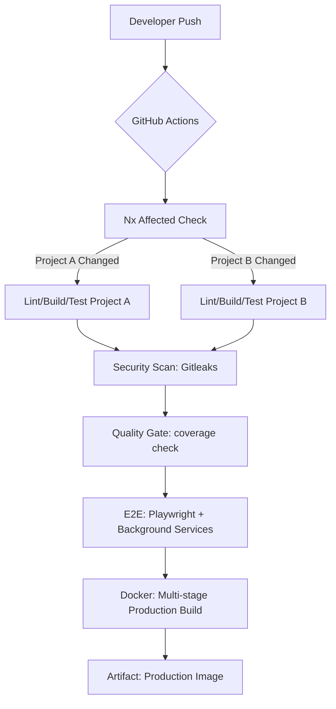

# 🎓 CI/CD Masterclass: The Fintech Identity Portal Track

This material summarizes the knowledge from the **CI/CD Setup** track, structured for different engineering levels.

## 🏗️ System Architecture Overview



---

## 🎖️ Level 3: Senior Architect / Senior SDE
**Focus:** Strategy, Security, and Scalability.

### 1. The Strategy of "Nx Affected"
*   **What:** A computation graph analysis that determines which projects in a monorepo are impacted by a change.
*   **Why:** In a monorepo with 50+ libs, running everything on every PR is unsustainable. It wastes CI credits and slows down the feedback loop.
*   **How:** Nx builds a dependency graph. If `lib-core` changes, Nx knows that `apps-portal` depends on it and must be re-tested, while `apps-identity` (which doesn't) can be skipped.

### 2. Distributed Locking (Postgres Advisory Locks)
*   **What:** Using the database itself as a synchronization primitive (`pg_advisory_lock`).
*   **Why:** Standard C# `lock` keywords only work within a single process. In modern CI, integration tests often run in parallel processes. Without a database-level lock, multiple tests will try to seed the same "Admin" role simultaneously, causing `UniqueConstraint` violations.
*   **How:** Before seeding, we execute `SELECT pg_advisory_lock(unique_id)`. Other processes will wait until the lock is released or the session ends.

### 3. JIT vs. NativeAOT in Fintech
*   **What:** Just-In-Time (JIT) compilation vs. Ahead-Of-Time (AOT) compilation.
*   **Why:** While NativeAOT offers faster startup and lower memory, it is incompatible with reflection-heavy libraries (like EF Core Proxies or OpenIddict's dynamic discovery). In a Fintech POC where compatibility and feature richness are key, JIT is the safer, standard choice.

---

## ⚖️ Level 2: Mid-Level SDE
**Focus:** Integration, Optimization, and Robustness.

### 1. E2E Synchronization with `wait-on`
*   **What:** A utility to wait for files, ports, or HTTP responses.
*   **How:** `wait-on http-get://localhost:5031/identity/`.
*   **Why:** Starting background services with `&` is asynchronous. If Playwright starts before the API is up, the test fails. 
*   **Crucial Lesson:** We used `http-get://` because many ASP.NET controllers return `405 Method Not Allowed` for the default `HEAD` requests used by `wait-on`.

### 2. Dependency Resolution (`--legacy-peer-deps`)
*   **What:** A flag that tells NPM to ignore peer dependency conflicts.
*   **Why:** Angular 21 and Storybook 10 are bleeding-edge. Sometimes their internal plugins haven't aligned their version requirements perfectly.
*   **How:** `npm install --legacy-peer-deps` allows the build to proceed when you know the mismatch won't actually break the runtime.

### 3. Idempotent Seed Data
*   **What:** Ensuring that running a script multiple times has the same effect as running it once.
*   **How:** Using `IgnoreQueryFilters()` and `FirstOrDefault()` to check for existence before `Add()`.
*   **Why:** If a CI job restarts or a developer runs the app locally twice, you don't want your database filled with 10 "Admin" users.

---

## 🔰 Level 1: Junior SDE
**Focus:** Execution, Workflow, and Clean Code.

### 1. Multi-Stage Docker Builds
*   **What:** A Dockerfile with multiple `FROM` statements.
*   **Why:** We use a heavy SDK image (2GB+) to build the code, but we only copy the final compiled DLLs to a slim Runtime image (200MB) for production.
*   **How:**
    ```dockerfile
    FROM sdk AS build
    RUN dotnet publish ...
    FROM runtime AS final
    COPY --from=build /app/publish .
    ```

### 2. The `.gitignore` and Artifacts
*   **What:** Preventing build results (like `coverage/` or `bin/`) from entering Git.
*   **Why:** It bloats the repo size and causes "Merge Hell" because these files change on every single run.

### 3. Linting vs. Formatting
*   **What:** Linting checks for *logic/style errors* (`no-explicit-any`); Formatting checks for *whitespace* (`dotnet format`).
*   **Why:** Consistency. It ensures the whole team's code looks like it was written by one person.

---

## 📝 Technical Interview Prep (Mock Q&A)

**Q1: We are seeing "Duplicate Key" errors in our CI integration tests that run in parallel. How would you solve this?**
*   **Answer:** I would implement a database-level lock, such as a Postgres Advisory Lock. Unlike application-level locks, this works across multiple processes and containers, ensuring only one instance performs the seeding/migration logic at a time.

**Q2: What is the benefit of `nx affected` over a standard `npm test` in a monorepo?**
*   **Answer:** Time and cost. `nx affected` only runs tasks for projects that have changed or whose dependencies have changed. This drastically reduces CI execution time and provides faster feedback to developers.

**Q3: Why would you prefer `@ts-expect-error` over `@ts-ignore`?**
*   **Answer:** `@ts-expect-error` is safer. It tells the compiler "I expect an error here." If the code is fixed and the error goes away, the compiler will alert you to remove the comment. `@ts-ignore` will stay there forever, even if it's no longer needed, potentially hiding new, unrelated errors.

**Q4: Your E2E tests are failing in CI with "Connection Refused" even though you started the server. What is likely wrong?**
*   **Answer:** There is a race condition. The server is likely still bootstrapping when the tests start. I would use a tool like `wait-on` to probe the server's health endpoint and only trigger the tests once a `200 OK` is received.

**Q5: How do you keep Docker images small for .NET applications?**
*   **Answer:** By using multi-stage builds. Use the full SDK image only for compiling, then copy the published output to a minimal ASP.NET runtime image. I would also ensure the `.dockerignore` file excludes `node_modules` and `obj/` folders.
