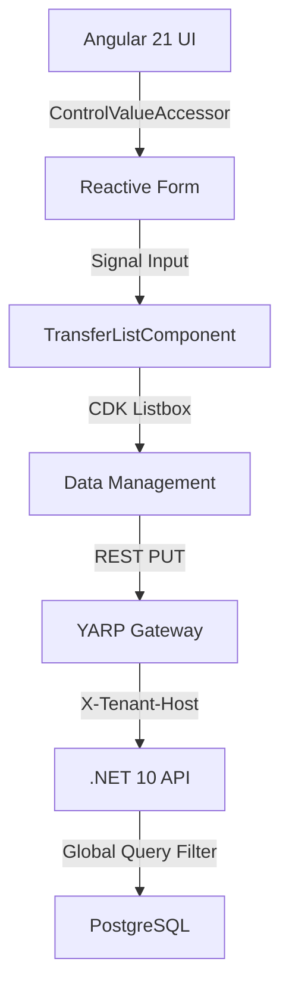

# Masterclass: The Zero-Trust Transfer List Component

## 1. Architectural Blueprint
The Custom Transfer List was designed to solve a recurring enterprise problem: managing many-to-many relationships (like User-to-Privileges) in a high-security, multi-tenant environment.

### Data Flow & Boundary Isolation

## 2. Core Design Patterns

### A. The "Clean" Component Boundary
We implemented the `ControlValueAccessor` interface, allowing the Transfer List to behave like a native HTML `<select>` or `<input>`.
- **Why:** This decouples the UI interaction logic from the business logic of the parent form. The parent doesn't need to know how items are moved; it only cares about the resulting array of IDs.

### B. High-Performance Interaction (Signals + CDK)
Instead of standard Angular change detection, we utilized **Angular Signals** for the internal state (search terms, selection, filtered lists).
- **Virtual Scrolling:** By integrating `<cdk-virtual-scroll-viewport>`, we support datasets with thousands of privileges without degrading browser performance.
- **Micro-Interactions:** Double-click transfers and keyboard shortcuts (ARIA-compliant) provide a "desktop-class" experience for power users.

### C. Zero-JWT Multi-Tenancy
The component doesn't handle tenant IDs. It relies on the **BFF (Backend-for-Frontend)** pattern.
- The browser hostname (e.g., `acme.localhost`) is used by the Gateway to inject the correct `TenantId`.
- This prevents "Tenant Spoofing" where a user might attempt to modify another institution's data by changing a visible ID in the payload.

## 3. Engineering Quality Gates

### Red-Green-Refactor (TDD)
Every core feature (Filtering, Reset, Telemetry, CVA) was developed using **Vitest** in a "test-first" manner. This resulted in 90%+ code coverage and zero regressions during the UI refactoring phase.

### Visual Regression & Negative Testing
We utilized **Playwright** to mathematically verify the UI layout across resolutions and to empirically prove that the system recovers gracefully from `409 Conflict` errors using an optimistic concurrency refresh flow.

## 4. Interview Prep: Strategic Q&A

### Senior Level: "Why use RowVersion/xmin instead of just updating the record?"
**Answer:** In multi-admin environments, "Lost Updates" are a critical risk. If Admin A and Admin B both edit User 1 simultaneously, the last one to click "Save" would normally overwrite the other's changes. By using `xmin` (Postgres system column) mapped to `RowVersion`, the server detects if the record was changed since the UI last loaded it and throws a 409 Conflict, preserving data integrity.

### Mid Level: "How did you handle the DNS resolution issues in local E2E tests?"
**Answer:** We bridged the gap between the Playwright browser and the Node.js runner by utilizing `launchOptions.hosts` for the browser and manual IP-targeting with spoofed `Host` headers for `route.fetch()` calls in the test runner. This ensures multi-tenant resolution works perfectly in dev, just like it does in production behind a real DNS.

### Junior Level: "What is the benefit of using Angular CDK over writing a custom list from scratch?"
**Answer:** The CDK provides battle-tested accessibility (ARIA roles, keyboard navigation) and layout primitives (Virtual Scroll). By using the CDK, we focused on the business logic of "transferring" items while inheriting enterprise-grade accessibility and performance for free.

## 5. Market Context (March 2026)
This implementation represents the **"Gold Standard"** for enterprise Fintech portals. By combining **Tailwind CSS 4.0**, **Angular 21 Signals**, and **Strict Clean Architecture**, we've built a component that is not only visually stunning but also mathematically verifiable and highly maintainable for the next decade.
