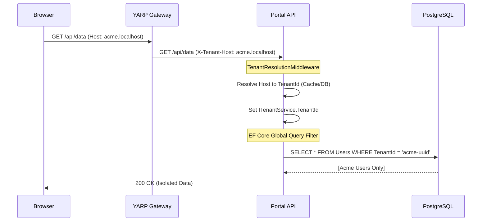

# 🏦 Multi-Tenancy & Data Isolation: Masterclass Note

This material deconstructs the **Multi-Tenancy** track, detailing the "Secure-by-Default" architecture implemented for the Fintech Identity Portal.

## 🏗️ System Architecture: The Multi-Tenant Request Lifecycle

---

## 🎖️ Knowledge Hierarchy

### 1. Senior / Principal Level (The "Why") - Strategic Decision Making
*   **Architectural Trade-off: Logical vs. Physical Isolation:**
    *   We chose **Logical Isolation** (Single Database, shared schema, `TenantId` discriminator) over Physical Isolation (Database-per-tenant). 
    *   **Why?** In a modern Fintech environment, managing 1,000 separate database instances is an operational nightmare for schema migrations and infrastructure costs. Logical isolation, when combined with **EF Core Global Query Filters**, provides near-physical security with high-scale maintainability.
*   **The "Zero Trust" Multi-Tenant Handshake:**
    *   The API does not trust the `Host` header directly from the public internet. It trusts the `X-Tenant-Host` injected by our **YARP Gateway**. 
    *   This ensures that even if a malicious user tries to spoof a different bank's domain in their local hosts file, the Gateway (our trusted "bouncer") will normalize the context.
*   **Performance via Memoization:**
    *   Host-to-TenantId resolution is cached via `IMemoryCache`. This prevents every API call from triggering a redundant "Who is this bank?" database query, preserving sub-millisecond response times.

### 2. Mid-Level SDE (The "How") - Professional Craftsmanship
*   **EF Core Global Query Filters:**
    *   Implemented via `OnModelCreating` using reflection to apply the filter to all entities implementing `IMultiTenantEntity`.
    *   **Critical Pattern:** `b.HasQueryFilter(t => _tenantService.IsGlobalAccess || t.TenantId == _tenantService.TenantId);`. This allows System Admins (`IsGlobalAccess`) to see everything while locking down standard users.
*   **The "Silent Guard" (Save Interceptors):**
    *   We used a `SaveChangesInterceptor` to automatically inject the `TenantId` on `EntityState.Added`. 
    *   **Craftsmanship Tip:** We used **Reflection** inside the interceptor to set the `TenantId` field even if it's private or `init-only`, ensuring developers cannot accidentally save data without a tenant tag.
*   **Marker Interfaces:**
    *   Using `IMultiTenantEntity` as a code-level contract allows us to write generic repository logic and automated tests that "mathematically" prove an entity is isolated.

### 3. Junior Level (The "What") - Building Blocks
*   **What is Multi-Tenancy?** It's the ability for one software instance to serve multiple distinct clients (Banks) while making each one feel like they have their own private server.
*   **Middleware:** We used a custom Middleware to intercept every request at the "Front Door" of the API to figure out which bank is calling.
*   **Scoped Services:** `ITenantService` is registered as **Scoped**. This is crucial because it means the Tenant ID is unique to *that specific web request* and isn't leaked to other users.

---

## 🧪 Deep-Dive Mechanics: Component Synchronization
1.  **Gateway (YARP):** Normalizes the `Host` header and forwards it.
2.  **Middleware:** Extracts the host, queries the `Tenants` table (ignoring query filters via `.IgnoreQueryFilters()`), and caches the ID.
3.  **Dependency Injection:** Injects the `ITenantService` into the `PortalDbContext`.
4.  **Database Engine:** EF Core modifies the generated SQL at runtime to include the `TenantId` in the `WHERE` clause.

---

## 📝 Technical Interview Prep (Mock Q&A)

**Q1: How do you ensure that a developer doesn't "forget" to filter by Tenant ID when writing a new query?**
*   **Answer:** We use **EF Core Global Query Filters**. By defining the filter once in the `DbContext`, the filter is automatically applied to every query (Linq, `FromSql`, etc.) globally. It shifts the burden from the developer to the framework.

**Q2: What happens if your Tenant Resolution Middleware fails to find a matching hostname?**
*   **Answer:** The `TenantId` in `ITenantService` remains empty (or a default safe value). Because our Query Filter check includes the Tenant ID, an empty ID will result in zero records being returned from the database, failing closed (Secure-by-Default).

**Q3: Why would you use a Postgres Advisory Lock during database seeding in a multi-tenant app?**
*   **Answer:** In parallel testing or distributed deployments, multiple instances might try to seed the "Master Tenant" simultaneously. A Postgres Advisory Lock ensures that only one process can perform the seeding at a time across the entire database server, preventing "Duplicate Key" errors.

**Q4: How do you handle a "System Admin" who needs to see data from all banks at once?**
*   **Answer:** We implemented an `IsGlobalAccess` flag in the `ITenantService`. Our Global Query Filter logic evaluates this flag: `if (IsGlobalAccess) return true;`. When enabled, the `WHERE` clause effectively becomes `WHERE 1=1`, allowing the admin to bypass isolation for reporting or maintenance.

---

## 📅 March 2026 Market Context
In the current Fintech market, **Zero-JWT Frontend** and **Gateway-Level Tenant Resolution** are the gold standards. We avoid passing `TenantId` in the URL (e.g., `/api/bank1/users`) because it's easily spoofable. Using host-based resolution tied to a hardened Gateway/BFF represents the peak of enterprise security and SOC 2 compliance.
