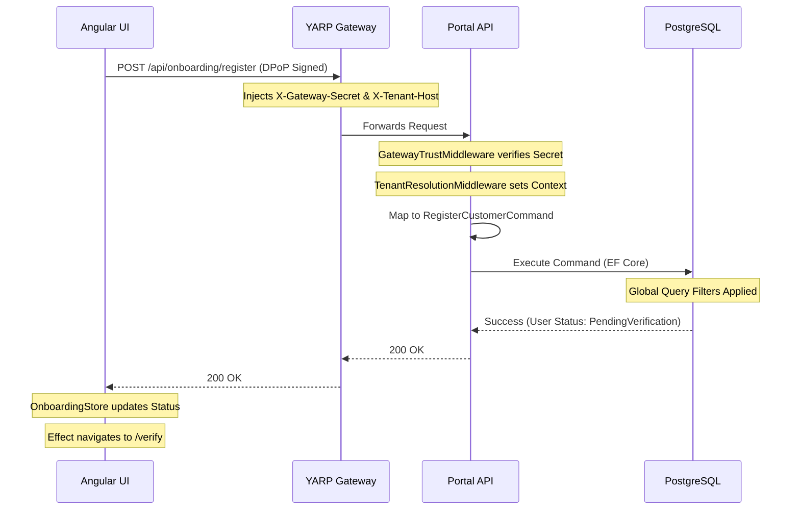

# 🚀 Masterclass: Full User Onboarding & Identity Track

This material synthesizes the complete end-to-end journey of the **User Onboarding & Identity** track, encompassing the backend Domain-Driven Design (DDD) state machine, CQRS architecture, DPoP-secured APIs, Signals-based Angular frontend, and comprehensive Playwright "Steel Thread" verification.

## 🏗️ The Enterprise Challenge: Zero-Trust Onboarding
In a multi-tenant Fintech environment, onboarding isn't just a simple database `INSERT`. It is a highly regulated workflow that demands strict state transitions (e.g., stopping unverified users from logging in), cryptographic proof of client identity (DPoP), and absolute data isolation between tenants. If a bug allows a user to bypass OTP verification or an admin to approve a user in the wrong bank, it results in a critical compliance breach.

---

## 🗺️ System Architecture: The Onboarding Request Lifecycle

---

## 🎖️ Knowledge Hierarchy

### 1. Senior / Principal Level (The "Why") - Strategic Decision Making
*   **Rich Domain Models over Anemic Entities:** 
    *   We used encapsulated methods (`StartCustomerOnboarding()`, `ActivateAccount()`) and `private init` setters on the `ApplicationUser` aggregate root.
    *   *Why?* It shifts authorization invariants into the core Domain layer. The compiler mathematically prevents the system from entering an invalid state, completely neutralizing logical bypass vulnerabilities.
*   **BFF (Backend-for-Frontend) & DPoP:**
    *   We established a "Clean Root" authority strategy where OpenIddict dynamically resolves tenant issuers via `X-Forwarded-Host`. We enforce DPoP (Demonstrating Proof-of-Possession) so tokens are cryptographically tied to the client's private key, making them useless if stolen via XSS.
*   **Zero-Trust Network Boundaries:**
    *   The API is physically inaccessible from the public internet. YARP acts as the bouncer, injecting an `X-Gateway-Secret`. When a high-entropy secret leaked into our git history during E2E testing, we didn't just allowlist it—we used `git filter-branch` to cryptographically scrub the repository history, maintaining strict SOC 2 compliance.

### 2. Mid-Level SDE (The "How") - Professional Craftsmanship
*   **CQRS via MediatR:**
    *   Separating reads (`GetUsersQuery`) from writes (`RegisterCustomerCommand`). Controllers remain entirely devoid of business logic, serving only as HTTP adapters.
*   **High-Fidelity Integration Testing (TestContainers & WebApplicationFactory):**
    *   We don't use SQLite or In-Memory DBs. We spin up real PostgreSQL containers via `TestContainers` and reset state using `Respawn`. We test the API layer using `WebApplicationFactory`, ensuring our routing, middleware, and EF Core Global Query Filters work precisely as they will in production.
*   **Signals-Based State Management:**
    *   We implemented a reactive `OnboardingStore` using Angular 21's `signal()` and `effect()`. This provides a "Zoneless" optimized architecture where UI state (loading, error, success) strictly mirrors the backend state machine.

### 3. Junior Level (The "What") - Building Blocks
*   **Playwright "Steel Thread" E2E Testing:**
    *   Writing tests that act like real users. We simulated the "Customer Self-Service" flow and the cross-tenant "Staff Approval" flow (where an Admin must log in to approve a pending staff member before the staff member can verify their OTP).
*   **Diagnostic Endpoints for E2E:**
    *   Since we don't send real emails in local dev, we created a `DiagController` to fetch generated OTPs from the `IMemoryCache`, allowing Playwright to assert the full verification loop autonomously.
*   **GitOps Security (Gitleaks):**
    *   Understanding that a committed secret is a compromised secret. We learned to rely on `.env` files for local overrides and generic placeholder secrets (`portal-poc-secret-2026`) in test code.

---

## 🧪 Deep-Dive Mechanics: Testing & Verification Strategy
To definitively prove the system's integrity, Phase 6 implemented **"Steel Thread" End-to-End Tests**:
1.  **The Happy Path (Self-Service):** Proves a standard user can register, fetch an OTP via the backend diagnostic bypass, verify it, and hit the success terminal state.
2.  **The Approval Gate (Staff Flow):** Proves a staff registration halts at `PendingApproval`. It requires a secondary actor (Tenant Admin) to log in, navigate the portal sidebar, and explicitly approve the record before the staff member can proceed.
3.  **Tenant Isolation Verification:** Proves that an Admin from "TAI" logging into the User Directory physically cannot see pending or active users belonging to the "ACME" tenant, validating our EF Core Global Query Filters at the UI level.

---

## 📝 Technical Interview Prep (Mock Q&A)

**Q1: How do you prevent a user from bypassing the "Approval" step and verifying their OTP directly?**
*   **Answer:** By using a Rich Domain Model. The `ApplicationUser.ActivateAccount()` method physically checks `if (Status != UserStatus.PendingVerification) throw Exception`. A user in `PendingApproval` will crash the use case if they attempt to submit an OTP, failing closed.

**Q2: You found a hardcoded production-like secret in your Git history. How do you handle it?**
*   **Answer:** Adding it to a `.gitleaks.toml` allowlist is insufficient for compliance. I must rewrite the Git history using `git filter-repo` or `git filter-branch` to scrub the string globally, force-push the clean history, and immediately rotate the compromised credential in the cloud provider.

**Q3: How do you share state between a registration component and an OTP verification component in Angular?**
*   **Answer:** I use a Service-Based Store Pattern with Angular Signals (`OnboardingStore`). The service holds the `pendingUserId` as a Signal. When registration succeeds, the router navigates to `/verify`, and the verify component simply reads the ID from the injected Store.

**Q4: In E2E tests, how do you verify an action that requires an email to be sent?**
*   **Answer:** In a local/CI environment, I implement a diagnostic "backdoor" endpoint (e.g., `/diag/otp-by-email`) that reads the generated code directly from the application's memory cache. The E2E test calls this endpoint to simulate the user opening their inbox.

---

## 📅 March 2026 Market Context
The architecture established in this track represents the absolute cutting edge for .NET 10 / Angular 21 Enterprise applications. Moving away from implicit trust, we enforce **DPoP** on every request, utilize **YARP** for dynamic routing and secret injection, and employ **Playwright** to validate multi-tenant data boundaries from the browser down to the database. This pattern guarantees scalability without compromising on the Zero-Trust security models demanded by modern SOC 2 and PCI-DSS auditors.
